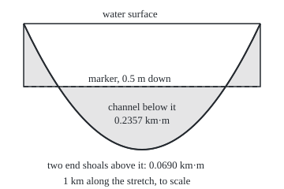
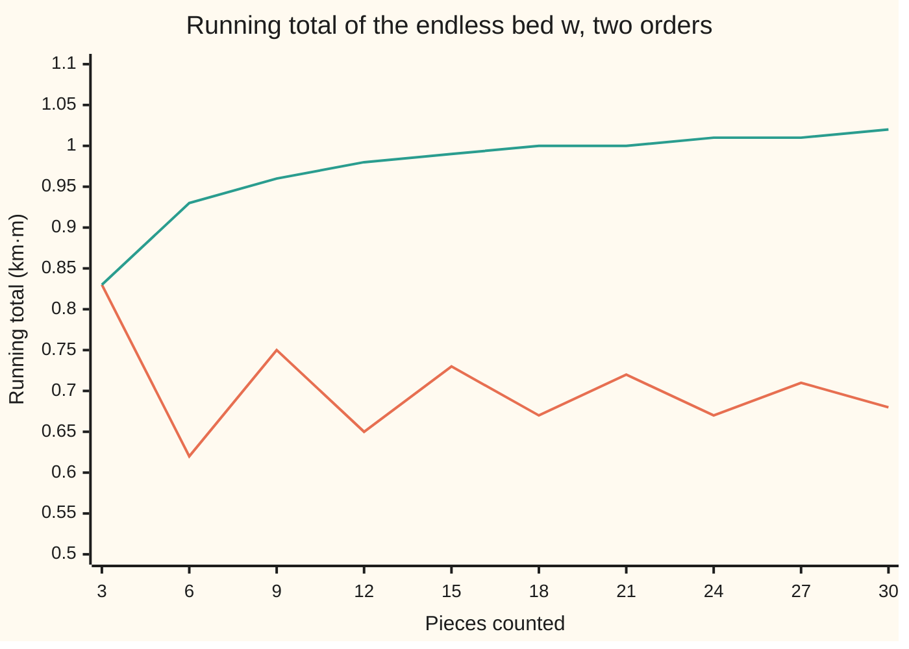

# Integrable functions: split into positive and negative parts, integrate each, and the difference behaves like arithmetic

Measure and integration → The Lebesgue Integral → Signed integrals → Integrable functions

---

## General Overview

A river runs along a straight 1 km stretch. At distance x km from the upstream end its depth is d(x) = 4x(1 − x) metres: zero at both ends of the stretch, 1 m in the middle, 2/3 m on average. A survey crew paints a marker line 0.5 m below the water surface. Wherever the river is deeper than that, the bed lies below the marker; near the two ends it rises above it, in shoals.

The crew wants three numbers per metre of river width: the water left below the marker if the level dropped 0.5 m; the earth moved to level the bed at the marker; and the net, fill minus dredge. The height of the bed below the marker, h(x) = d(x) − 0.5, is positive in the channel and negative over the shoals. The earlier cards of this shelf integrate only functions that never go negative.

Integrate the two sides separately. The part above zero and the depth below zero are each non-negative, so each has an integral already: 0.2357 and 0.0690 km·m, kilometres along times metres of height. Both are finite, so subtract: the net is exactly 1/6 km·m. A function whose two parts both have finite integral is called **integrable**, the word used from here on. On integrable functions the integral adds, scales and keeps order, as sums do, and puts little integral on any small enough set.

**Split a signed function into its part above zero and its part below zero, integrate each as a non-negative function, and subtract only when both are finite; on that class the integral is linear, respects order, obeys the triangle inequality, and gives small integrals over small sets.**

**What kind of fact this is:** a definition (integrable, and the integral of a signed function), with four theorems about it proved on this card in Why it works.

### The picture: the river bed against the marker

<p align="center"></p>

To scale: 300 pixels per km along the river, 160 per metre of depth downward. The curve is the bed; it crosses the marker at 0.1464466094 and 0.8535533906 km. The shaded middle is the channel, where h is positive; the shaded corners are the shoals, where h is negative.

---

## The formula

Notation first. A measure space $(\Omega, \mathcal F, \mu)$ is a set of points $\Omega$, the collection $\mathcal F$ of sets we allow ourselves to measure, and a measure $\mu$ giving each such set a size ([measures](../01-Sets%20You%20Can%20Measure/04-measures.md)). On the river $\Omega$ is the stretch from 0 to 1 km and the measure is length, $\lambda$. For a non-negative measurable function, $\int u\,d\mu$, read "the integral of u against mu", is the best lower staircase total, a number from 0 up to infinity ([integral-of-a-nonnegative-function](02-integral-of-a-nonnegative-function.md)). The **positive part** $f^+ = \max(f, 0)$ keeps f where it is above zero and is 0 elsewhere; the **negative part** $f^- = \max(-f, 0)$ is the depth of f below zero, itself never negative ([simple-functions-and-approximation](../03-Measurable%20Functions/03-simple-functions-and-approximation.md)). At every point

$$f = f^+ - f^-, \qquad \lvert f\rvert = f^+ + f^-.$$

The definition. A measurable $f$ is **integrable** when

$$\int \lvert f\rvert\,d\mu < \infty, \qquad\text{and then}\qquad \int f\,d\mu = \int f^+\,d\mu - \int f^-\,d\mu .$$

**Read it aloud:** a signed function is integrable when the area between it and zero, counted without signs, is finite; its integral is the area above zero minus the area below.

The integrable functions form a collection written $L^1(\mu)$, read "L-one of mu"; on the river, $L^1(\lambda)$. Over a set $A$, $\int_A f\,d\mu$ means $\int f\,\mathbf 1_A\,d\mu$, where $\mathbf 1_A$ is one on A and zero off it.

Four theorems. For $f$, $g$ in $L^1(\mu)$ and real numbers $a$, $b$:

$$\int (a f + b g)\,d\mu = a\int f\,d\mu + b\int g\,d\mu \qquad\text{(linearity)}$$

$$f \le g \text{ everywhere} \;\Longrightarrow\; \int f\,d\mu \le \int g\,d\mu \qquad\text{(monotonicity)}$$

$$\Big\lvert \int f\,d\mu \Big\rvert \le \int \lvert f\rvert\,d\mu \qquad\text{(triangle inequality)}$$

$$\text{for every } \varepsilon > 0 \text{ there is } \delta > 0 \text{ with } \mu(A) < \delta \;\Longrightarrow\; \int_A \lvert f\rvert\,d\mu < \varepsilon \qquad\text{(absolute continuity)}$$

**Read it aloud:** combine integrable functions and their integrals combine the same way; a lower function has the smaller integral; the size of the integral is at most the integral of the size; and sets of small enough size carry as little integral as anyone asks.

On the river, $h = d - 0.5$, so linearity alone gives $\int h\,d\lambda = 2/3 - 1/2 = 1/6$ without finding where the bed crosses the marker.

| Symbol | Plain meaning | In our example | Push it up and the answer… |
| --- | --- | --- | --- |
| $x$, $y$, $r$ | distance along the stretch in km; distance from mid-river, x − 1/2; half the channel's width | r = √2/4 km: the bed crosses the marker at y = ±r | — |
| $d$ | river depth in metres at x km | 4x(1 − x); integral 2/3 km·m | deeper river, more channel below the marker |
| $h$ | height of the bed below the marker, d − 0.5 | +0.5 m mid-stretch, −0.5 m at both ends | a higher marker: more channel, less shoal |
| $f$, $g$ | general measurable functions with real values | h and d | — |
| $u$, $v$ | non-negative measurable functions, in the definition and the proof | d, h+, h− | larger u, larger integral |
| $f^+$, $f^-$ | positive part and negative part, both ≥ 0 | channel 0.2357, shoals 0.0690 km·m | f up: f+ grows, f− shrinks |
| $\lvert f\rvert$ | size of f, sign ignored | integral 0.3047 km·m: earth moved | — |
| $\Omega$, $\mathcal F$, $\mu$, $\lambda$ | space, measurable sets, a measure; λ is length | 0 to 1 km, Borel sets, length | — |
| $L^1(\mu)$ | the integrable functions | h, d, the spike s | — |
| $a$, $b$ | real constants, either sign | 1 and −0.5: h = 1·d − 0.5·1 | integral moves by that multiple |
| $p$, $q$ | any two non-negative integrable functions with f = p − q | p = d, q = 0.5 | — |
| $A$, $\mathbf 1_A$ | a measurable set; one on A, zero off it | a window of the stretch | bigger set, more integral |
| $\varepsilon$, $\delta$ | allowed integral; set size that guarantees it | ε = 1/10, δ = 1/120 for the spike | smaller ε forces smaller δ |
| $s$, $N$, $w$ | an unbounded integrable spike; a cap on it; an endless bed that is not integrable | 1/(2√x), N = 6; +1, −1/2, +1/3, … | — |

### When it holds

Integrability is a definition; the theorems need:

- **Measurability.** Without it neither part has an integral: the Vitali set of shelf 02 has no length.
- **Both functions integrable, for linearity.** If both parts are infinite, "infinity minus infinity" has no value, and adding the pieces in a different order gives a different total: Step 6.
- **Integrability, for small sets.** The function 1/x on (0, 1] puts infinite integral on every interval next to 0, however short.
- **Any measure, finite or not.** But on an infinite one a bounded function need not be integrable: the constant 0.5 on the whole line.

---

## Why it works

### Step 0: only ever add non-negative things

For non-negative functions the integral is already built, and it adds, scales and keeps order ([integral-of-a-nonnegative-function](02-integral-of-a-nonnegative-function.md), with additivity delivered by [monotone-convergence-theorem](03-monotone-convergence-theorem.md)). Every proof below moves the terms of an equation until each side is a sum of non-negative functions, integrates both sides, and subtracts only numbers already known to be finite.

### Step 1: integrable means both parts are finite

At each point at most one of $f^+$ and $f^-$ is nonzero, and $\lvert f\rvert$ is their sum. Additivity for non-negative functions gives $\int \lvert f\rvert = \int f^+ + \int f^-$. A sum of two numbers from 0 to infinity is finite exactly when both are. So the definition asks for exactly what subtraction needs.

On the river: $h^+$ is the channel, 0.2357 km·m, and $h^-$ is the two shoals together, 0.0690 km·m. Their sum, 0.3047 km·m, is the integral of $\lvert h\rvert$: the earth moved to level the bed at the marker. Their difference is 1/6.

### Step 2: any split into two non-negative pieces gives the same answer

The river offers a second split: $h = d - 0.5$, with $d$ and the constant 0.5 both non-negative. Move terms so nothing is subtracted:

$$h^+ + 0.5 = h^- + d \quad\text{at every point.}$$

Both sides are non-negative. Integrate, using additivity: $\int h^+ + 0.5 = \int h^- + 2/3$. All four numbers are finite, so $\int h^+ - \int h^- = 2/3 - 1/2 = 1/6$. The crossing points never entered; in the exact values, $\sqrt 2/6$ and $(\sqrt 2 - 1)/6$, their irrational parts cancel.

In general, if $f = p - q$ with $p$ and $q$ non-negative and integrable, then $f^+ + q = f^- + p$, and the same two lines give $\int f = \int p - \int q$. The integral does not depend on how the function is split.

### Step 3: linearity

For a sum: $f + g = (f^+ + g^+) - (f^- + g^-)$ is one more split into two non-negative integrable pieces, so Step 2 gives $\int (f+g) = \int f + \int g$. The sum is integrable because $\lvert f + g\rvert \le \lvert f\rvert + \lvert g\rvert$ at every point. For a constant $a \ge 0$ the parts of $a f$ are $a f^+$ and $a f^-$. For $a < 0$ they swap: $(a f)^+ = \lvert a\rvert f^-$ and $(a f)^- = \lvert a\rvert f^+$. Either way the integral comes out as $a\int f$.

### Step 4: order, and the triangle inequality

If $f \le g$, then $g - f$ is non-negative and integrable, so its integral is at least 0. Linearity turns that into $\int g - \int f \ge 0$. On the river $h \le d$, and 1/6 ≤ 2/3.

Apply monotonicity twice to $-\lvert f\rvert \le f \le \lvert f\rvert$: $\int f$ lies between $-\int \lvert f\rvert$ and $\int \lvert f\rvert$. That is the triangle inequality. On the river 1/6 ≤ 0.3047, and the gap is twice the shoal integral: cancellation hides the shoals. Equality needs one part to have integral zero, that is, $f \ge 0$ almost everywhere or $f \le 0$ almost everywhere.

### Step 5: small sets carry small integrals

For a bounded function this is one line. $\lvert h\rvert \le 0.5$, so any set of length $\delta$ carries at most $0.5\,\delta$; to get below $\varepsilon$, take $\delta = 2\varepsilon$.

An unbounded function needs one more idea. Take the spike $s(x) = 1/(2\sqrt x)$ on (0, 1]: its integral is 1, but it has no ceiling. Cap it at a height $N$. The capped function is bounded, so it behaves as above. The part above the cap is a thin sliver near 0 with integral $1/(4N)$. By the monotone convergence theorem, capped versions of any integrable function rise to it, so the sliver above the cap always shrinks to zero integral as $N$ grows.

The proof spends half of $\varepsilon$ on each piece. For $\varepsilon = 1/10$: the cap $N = 6$ leaves a sliver of 0.041667, under half of $\varepsilon$. Then $\delta = \varepsilon/(2N) = 1/120$ keeps the capped part under the other half. The largest integral any window of length 1/120 can carry sits against 0, where $s$ is tallest: 0.0912870929, under 1/10 as promised.

### Step 6: why infinity minus infinity is refused

Extend the river downstream forever and give its bed alternating 1 km pieces: a pool 1 m below the marker, then a bar 1/2 m above it, then a pool 1/3 m below, and so on. Call this bed $w$. Its running total, piece by piece, settles on ln 2 = 0.693147. Yet its positive part totals 6.391644 after 100000 km and its negative part 5.698502, and both keep growing without bound, as the harmonic series does.

Count the same pieces two pools, then one bar, and the running total settles on 1.5 ln 2 = 1.039721 instead. A measure sees sets, not an order of travel, so a total that depends on the order cannot be the integral. Integrability rules the case out.

<details>
<summary>Detailed proof</summary>

Throughout, $(\Omega, \mathcal F, \mu)$ is a measure space and $f$, $g$ are measurable with real values. Facts used: **(N1)** for non-negative measurable $u$, $u'$ and $c \ge 0$, $\int (u + u') = \int u + \int u'$ and $\int cu = c\int u$ ([monotone-convergence-theorem](03-monotone-convergence-theorem.md), by rising simple approximations); **(N2)** $0 \le u \le v$ implies $\int u \le \int v$ ([integral-of-a-nonnegative-function](02-integral-of-a-nonnegative-function.md): the supremum is over a larger family); **(N3)** the monotone convergence theorem; **(N4)** sums, constant multiples, max and min of measurable functions are measurable ([limits-of-measurable-functions](../03-Measurable%20Functions/02-limits-of-measurable-functions.md)).

**1. The parts.** By (N4) $f^+$, $f^-$ and $\lvert f\rvert = f^+ + f^-$ are measurable and non-negative, and $f = f^+ - f^-$. By (N1) $\int \lvert f\rvert = \int f^+ + \int f^-$, so $\int \lvert f\rvert < \infty$ exactly when both $\int f^\pm < \infty$, and the definition subtracts finite numbers.

**2. Any split.** Let $f = p - q$ with $p, q \ge 0$ measurable and $\int p$, $\int q$ finite. Since $q \ge 0$, $f \le p$, so $f^+ = \max(f, 0) \le p$; likewise $f^- \le q$. By (N2) $f$ is integrable. From $f^+ - f^- = p - q$, with all four finite at each point, $f^+ + q = f^- + p$. By (N1), $\int f^+ + \int q = \int f^- + \int p$. All four integrals are finite, so $\int f^+ - \int f^- = \int p - \int q$.

**3. Linearity.** $\lvert f + g\rvert \le \lvert f\rvert + \lvert g\rvert$ pointwise, so (N2) and (N1) give $\int \lvert f + g\rvert \le \int \lvert f\rvert + \int \lvert g\rvert < \infty$. Apply 2 with $p = f^+ + g^+$ and $q = f^- + g^-$ and use (N1) on each: $\int (f+g) = \int f^+ + \int g^+ - \int f^- - \int g^- = \int f + \int g$. For $a \ge 0$, $(a f)^+ = a f^+$ and $(a f)^- = a f^-$, so (N1) gives $\int a f = a\int f$. For $a < 0$, $(a f)^+ = \lvert a\rvert f^-$ and $(a f)^- = \lvert a\rvert f^+$, so $\int a f = \lvert a\rvert \int f^- - \lvert a\rvert \int f^+ = a\int f$. Combining the two gives $\int (a f + b g) = a\int f + b\int g$.

**4. Monotonicity and the triangle inequality.** If $f \le g$ with both integrable, $u = g - f$ is non-negative and integrable by 3, and its signed integral is its non-negative integral ($u^- = 0$), which is $\ge 0$. By 3, $\int g - \int f = \int u \ge 0$. Since $-\lvert f\rvert \le f \le \lvert f\rvert$, monotonicity and 3 give $-\int \lvert f\rvert \le \int f \le \int \lvert f\rvert$.

**5. Null sets change nothing.** If $u \ge 0$ is measurable and zero off a set $Z$ of measure zero, every simple function under $u$ is zero off $Z$ and has integral 0, so $\int u = 0$. If $f = g$ off $Z$ with $f$ integrable, then $\lvert g\rvert \le \lvert f\rvert + \lvert f - g\rvert$ makes $g$ integrable, and 4 applied to $f - g$ gives $\lvert \int f - \int g\rvert \le \int \lvert f - g\rvert = 0$. So $L^1(\mu)$ treats functions equal almost everywhere as one.

**6. Absolute continuity.** Let $f$ be integrable and $\varepsilon > 0$. Put $u_N = \min(\lvert f\rvert, N)$ for $N = 1, 2, \dots$ These are measurable by (N4), rise with $N$, and tend to $\lvert f\rvert$ at every point because $\lvert f\rvert$ is finite everywhere. By (N3), $\int u_N \to \int \lvert f\rvert$, a finite number. By 3, $\int (\lvert f\rvert - u_N) = \int \lvert f\rvert - \int u_N \to 0$; choose $N$ with this below $\varepsilon/2$. Put $\delta = \varepsilon/(2N)$. If $\mu(A) < \delta$, then pointwise $\lvert f\rvert\mathbf 1_A = (\lvert f\rvert - u_N)\mathbf 1_A + u_N \mathbf 1_A \le (\lvert f\rvert - u_N) + N\mathbf 1_A$, and (N1), (N2) give $\int_A \lvert f\rvert \le \int(\lvert f\rvert - u_N) + N\mu(A) < \varepsilon/2 + \varepsilon/2 = \varepsilon$. By 4, also $\lvert \int_A f\rvert < \varepsilon$.

**7. The hypothesis is needed.** For $f(x) = 1/x$ on (0, 1] with length, and any $\delta \le 1$: on the piece from $\delta/2^{j+1}$ to $\delta/2^j$ the function is at least $2^j/\delta$, and the piece has length $\delta/2^{j+1}$, so the piece contributes at least 1/2. The first k pieces lie inside (0, δ] and contribute at least k/2 for every k, so $\int_{(0,\delta]} f = \infty$ although the set has length $\delta$.

</details>

Riemann's road, chopping the x axis into thin strips, reaches the same numbers for continuous functions on a closed interval; the code takes it as a check, and [riemann-meets-lebesgue](05-riemann-meets-lebesgue.md) proves the two integrals agree wherever the proper Riemann integral exists (a bounded function on a closed interval).

---

## Worked numbers, by hand

First, a warm-up small enough to list in full. Cut the stretch into four reaches of 250 m, each with the depth at its midpoint: 7/16, 15/16, 15/16, 7/16 m. Then h is −1/16, 7/16, 7/16, −1/16. The space has four points, each of measure 1/4 km.

| Step | Arithmetic | Value |
| --- | --- | --- |
| positive part | (7/16 + 7/16) × 1/4 | 7/32 km·m |
| negative part | (1/16 + 1/16) × 1/4 | 1/32 km·m |
| net | 7/32 − 1/32 | 3/16 km·m |
| by linearity | (7/16 + 15/16 + 15/16 + 7/16) × 1/4 − 1/2 = 11/16 − 1/2 | **3/16 km·m** |
| size | 7/32 + 1/32 | 1/4 km·m |

Now the river itself. Measure from mid-river: y = x − 1/2, so h = 1/2 − 4y^2. The bed crosses the marker where 4y^2 = 1/2, at y = ±r with r^2 = 1/8, so r = √2/4 = 0.3535533906 km.

| Step | Arithmetic | Value |
| --- | --- | --- |
| channel, h+ | integral of 1/2 − 4y^2 from −r to r: r − (8/3)r^3 = r(1 − 1/3) = (2/3)r | √2/6 = 0.2357022604 km·m |
| net, by linearity | integral of d, minus 0.5 × 1 km: 2/3 − 1/2 | **1/6 = 0.1666666667 km·m** |
| shoals, h− | channel minus net: √2/6 − 1/6 | 0.0690355937 km·m |
| size, the integral of the absolute value | channel plus shoals: √2/3 − 1/6 | **0.3047378541 km·m** |
| per metre of width | 1 km·m = 1,000 m^2; times 1 m of width | fill 235.7, dredge 69.0, moved 304.7, net 166.7 m^3 |

Per metre of river width: a 0.5 m drop leaves 235.7 m^3 of water; levelling the bed moves 304.7 m^3 of earth; reusing the dredged spoil as fill, 166.7 m^3 must be brought in.

### What breaks if you drop a piece

| Mistake | Comes out at | What went wrong |
| --- | --- | --- |
| Drop integrability: the endless bed $w$ | in order 0.693142 after 100000 km; two pools then a bar 1.039718 after 300000 pieces | both parts infinite; the order of adding picks the answer |
| Drop integrability in Step 5: 1/x near 0 | at least 5, 10, 20 on (δ/2^10, δ], (δ/2^20, δ], (δ/2^40, δ] | no δ keeps the integral small |
| Report the net as the water left | 0.1666666667 instead of 0.2357022604 km·m | shoals hold no negative water |
| Take the size of the integral for the integral of the size | 0.1666666667 instead of 0.3047378541 km·m | cancellation hides twice the shoals |

### The picture: one set of pieces, two orders, two totals



The zigzag line counts the pieces in their order along the river and closes on ln 2 = 0.69. The rising line counts two pools, then one bar, and closes on 1.5 ln 2 = 1.04. The same pieces, rearranged, reach a different total.

---

## Code, from first principles, and it actually runs

Three independent roads reach the river's integrals. Road 1 is exact algebra on numbers p + q√2, p and q fractions, using the crossing points. Road 2 is Lebesgue's: lower staircases on the depth axis, built from the lengths of level sets, with each gap checked against step height times the length where the part is positive. Road 3 is Riemann's: midpoint sums on 2^16 cells of the x axis. The four-reach warm-up checks linearity exactly for 49 pairs of constants; the spike checks the proof's cap and δ; the endless bed and 1/x print the failures. Rust keeps its fractions by hand in 128-bit integers. The code checks these functions and finite stages; that the theorems hold for every integrable function is the proof's work.

### Python

```python
# Integrable functions -- the check behind the card.  Standard library only.
# River bed against a 0.5 m marker: h(x) = 4x(1 - x) - 0.5 metres, 0 <= x <= 1 km.
# Road 1: exact algebra on numbers p + q*sqrt(2), p and q fractions, using the
#   antiderivative and the crossing points 1/2 -+ sqrt(2)/4.
# Road 2: Lebesgue's road, chopping the depth axis: lower simple functions built
#   from the lengths of the level sets {h >= t}, which are square roots.
# Road 3: Riemann's road, chopping the x axis: midpoint sums on 2^16 cells.
# The code checks these functions and finite stages; the theorems are the proof's work.
from fractions import Fraction as Q
from math import sqrt

class R2:                                       # p + q*sqrt(2), kept exact
    def __init__(s, p, q=0): s.p, s.q = Q(p), Q(q)
    def __add__(s, o): return R2(s.p + o.p, s.q + o.q)
    def __sub__(s, o): return R2(s.p - o.p, s.q - o.q)
    def __mul__(s, o): return R2(s.p * o.p + 2 * s.q * o.q, s.p * o.q + s.q * o.p)
    def __float__(s): return float(s.p) + float(s.q) * sqrt(2)
    def __str__(s): return f"{s.p} + ({s.q})sqrt2"

def H(x):                                       # antiderivative of h: 2x^2 - (4/3)x^3 - x/2
    x2 = x * x
    return R2(2) * x2 - R2(Q(4, 3)) * x2 * x - R2(Q(1, 2)) * x
f10 = lambda v: f"{float(v):.10f}"

print("four reaches of 250 m, midpoint depths | d | h = d - 0.5")
d4 = [Q(7, 16), Q(15, 16), Q(15, 16), Q(7, 16)]
h4 = [v - Q(1, 2) for v in d4]
mean = lambda vs: sum(Q(1, 4) * v for v in vs)
pos = lambda vs: mean([max(v, 0) for v in vs])
neg = lambda vs: mean([max(-v, 0) for v in vs])
print(f"four reaches: d = {', '.join(map(str, d4))} | h = {', '.join(map(str, h4))}")
print(f"four reaches: h+ {pos(h4)}, h- {neg(h4)}, net {pos(h4) - neg(h4)}, |h| {mean(map(abs, h4))}, "
      f"d {mean(d4)}, d - 1/2 {mean(d4) - Q(1, 2)}")
assert pos(h4) - neg(h4) == mean(d4) - Q(1, 2) == Q(3, 16)
for a in range(-3, 4):
    for b in range(-3, 4):
        z = [a * u + b * v for u, v in zip(d4, h4)]
        assert pos(z) - neg(z) == a * mean(d4) + b * mean(h4)   # parts road against linearity
        assert abs(mean(z)) <= mean(map(abs, z))
print("four reaches: 49 pairs (a, b), a*d + b*h: parts difference equals a*int d + b*int h")

a, b, zero, one = R2(Q(1, 2), Q(-1, 4)), R2(Q(1, 2), Q(1, 4)), R2(0), R2(1)
P = H(b) - H(a)                                  # h+ lives between the crossings
N = zero - ((H(a) - H(zero)) + (H(one) - H(b)))  # h- lives outside them
by_d = R2(2 - Q(4, 3)) - R2(Q(1, 2))             # linearity: int d - int 0.5, no crossings used
assert P.p == 0 and P.q == Q(1, 6) and N.p == Q(-1, 6) and (P - N).q == 0
assert (P - N).p == by_d.p
print(f"crossings: x = {float(a):.10f} and {float(b):.10f} km; channel {float(b) - float(a):.10f} km, "
      f"shoals together {1 - (float(b) - float(a)):.10f} km")
print(f"exact: int h+ = {P} = {f10(P)}")
print(f"exact: int h- = {N} = {f10(N)}")
print(f"exact: int h = {P - N} = {f10(P - N)}; int d - 0.5 = {by_d.p}; int |h| = {P + N} = {f10(P + N)}")
m3 = [1000 * float(v) for v in (P, N, P + N, P - N)]
print("per metre of width, m^3: fill {:.1f}, dredge {:.1f}, moved {:.1f}, net {:.1f}".format(*m3))

print("Lebesgue lower sums, levels 2^-n: n | h+ | gap | h- | gap")
for n in (2, 4, 8, 12, 16, 20):
    step, sp, sn, k = 2.0 ** -n, 0.0, 0.0, 1
    while k * step <= 0.5:
        sp += step * sqrt(0.5 - k * step)        # length of {h >= t} is sqrt(0.5 - t)
        sn += step * (1 - sqrt(0.5 + k * step))  # length of {h <= -t} is 1 - sqrt(0.5 + t)
        k += 1
    gp, gn = float(P) - sp, float(N) - sn
    assert 0 <= gp <= step * sqrt(2) / 2 and 0 <= gn <= step * (1 - sqrt(2) / 2)
    print(f"lower sums, n = {n}: {sp:.10f} | {gp:.10f} | {sn:.10f} | {gn:.10f}")

cells = 2 ** 16
rp = rn = 0.0
for i in range(cells):
    x = (i + 0.5) / cells
    v = 4 * x * (1 - x) - 0.5
    rp, rn = rp + max(v, 0.0) / cells, rn + max(-v, 0.0) / cells
assert abs(rp - float(P)) < 1e-8 and abs(rn - float(N)) < 1e-8
print(f"midpoint sums, 2^16 cells: h+ {rp:.10f}, h- {rn:.10f}, net {rp - rn:.10f}, |h| {rp + rn:.10f}")
assert float(P - N) <= 2 / 3 and abs(float(P - N)) <= float(P + N)
print(f"monotone: int h = {float(P - N):.10f} <= int d = 0.6666666667; triangle: |int h| <= int |h| = {f10(P + N)}")

print("spike s(x) = 1/(2 sqrt x) on (0, 1], int s = 1: eps | N | tail 1/(4N) | tail by cells | delta | worst window")
for den in (10, 100):
    eps = Q(1, den)
    Nc = den // 2 + 1                            # smallest whole N with 1/(4N) < eps/2
    delta = eps / (2 * Nc)
    capped = 0.0
    for i in range(cells):
        capped += min(1 / (2 * sqrt((i + 0.5) / cells)), Nc) / cells
    tail = 1 - capped
    worst = max(sqrt(c / 1000 + float(delta)) - sqrt(c / 1000) for c in range(0, 1000))
    assert abs(tail - 1 / (4 * Nc)) < 1e-6          # truncation tail: cells against 1/(4N)
    assert worst < float(eps)                        # every window of length delta carries less than eps
    print(f"spike, eps {eps}: N {Nc} | {1 / (4 * Nc):.6f} | {tail:.6f} | {delta} | {worst:.10f}")

ln2 = 0.0
for k in range(1, 61):
    ln2 += 1 / (k * 2.0 ** k)
print(f"ln 2 by the series sum 1/(k 2^k): {ln2:.6f}; 1.5 ln 2: {1.5 * ln2:.6f}")
for k in (10, 20, 40):
    low = sum(Q(1, 2 ** (j + 1)) * 2 ** j for j in range(k))   # piece length times least value of 1/x
    cs = 0.0                                     # delta = 1: midpoint sums of 1/x, 200 cells per piece
    for j in range(k):
        a0 = 2.0 ** -(j + 1); wd = a0 / 200
        cs += sum(wd / (a0 + (i + 0.5) * wd) for i in range(200))
    print(f"1/x on (delta/2^{k}, delta]: at least {low}; by cells {cs:.4f}; exactly {k} ln 2 = {k * ln2:.4f}")
    assert low <= cs and abs(cs - k * ln2) < 1e-4

print("endless bed w = +1, -1/2, +1/3, ... one km each: km | int w, in order | int w+ | int w-")
S = Wp = Wm = 0.0
chart_order = []
for n in range(1, 100001):
    v = (1 if n % 2 else -1) / n
    S, Wp, Wm = S + v, Wp + max(v, 0), Wm + max(-v, 0)
    if n % 3 == 0 and n <= 30: chart_order.append(S)
    if n in (10, 100, 1000, 10000, 100000): print(f"in order, {n} km: {S:.6f} | {Wp:.6f} | {Wm:.6f}")
assert abs(S - ln2) < 1 / 100000
for j in range(1, 17):                           # each dyadic block of km adds at least 1/4 to both parts
    blk = range(2 ** j + 1, 2 ** (j + 1) + 1)
    assert sum(1 / n for n in blk if n % 2) >= 0.25            # pools: at least 2^(j-1) terms of at least 1/2^(j+1)
    assert sum(1 / n for n in blk if n % 2 == 0) >= 0.25       # bars: the same count
R, chart_re, odd, even = 0.0, [], 1, 2
for m in range(1, 100001):                       # two pools, then one bar
    R += 1 / odd + 1 / (odd + 2) - 1 / even
    odd, even = odd + 4, even + 2
    if m <= 10: chart_re.append(R)
    if m in (10, 1000, 100000): print(f"two pools then a bar, {3 * m} pieces: {R:.6f}")
assert abs(R - 1.5 * ln2) < 1e-4
print("chart, in order after 3..30 km:", " ".join(f"{v:.2f}" for v in chart_order))
print("chart, rearranged after 1..10 blocks:", " ".join(f"{v:.2f}" for v in chart_re), f"| levels {ln2:.2f} {1.5 * ln2:.2f}")

px = lambda x, dep: (30 + 300 * x, 30 + 160 * dep)
ctrl = R2(Q(1, 4), Q(-1, 8))                     # (2 - sqrt2)/8: tangents at 0 and at the crossing meet here
pts = [px(float(a), 0.5), px(float(b), 0.5), px(float(ctrl), 1 - sqrt(2) / 2), px(1 - float(ctrl), 1 - sqrt(2) / 2)]
print("figure, crossings", " ".join(f"{u:.2f} {w:.2f}" for u, w in pts[:2]), "| shoal controls",
      " ".join(f"{u:.2f} {w:.2f}" for u, w in pts[2:]), "| bed 30 30 Q 180 350 330 30 | channel control 180 270")
print("ALL CHECKS PASS")
```

**Ran 2026-09-29 on macOS, Python 3.14.6, standard library only. All checks passed. Output, pasted from the run:**

```
four reaches of 250 m, midpoint depths | d | h = d - 0.5
four reaches: d = 7/16, 15/16, 15/16, 7/16 | h = -1/16, 7/16, 7/16, -1/16
four reaches: h+ 7/32, h- 1/32, net 3/16, |h| 1/4, d 11/16, d - 1/2 3/16
four reaches: 49 pairs (a, b), a*d + b*h: parts difference equals a*int d + b*int h
crossings: x = 0.1464466094 and 0.8535533906 km; channel 0.7071067812 km, shoals together 0.2928932188 km
exact: int h+ = 0 + (1/6)sqrt2 = 0.2357022604
exact: int h- = -1/6 + (1/6)sqrt2 = 0.0690355937
exact: int h = 1/6 + (0)sqrt2 = 0.1666666667; int d - 0.5 = 1/6; int |h| = -1/6 + (1/3)sqrt2 = 0.3047378541
per metre of width, m^3: fill 235.7, dredge 69.0, moved 304.7, net 166.7
Lebesgue lower sums, levels 2^-n: n | h+ | gap | h- | gap
lower sums, n = 2: 0.1250000000 | 0.1107022604 | 0.0334936491 | 0.0355419447
lower sums, n = 4: 0.2105870844 | 0.0251151760 | 0.0599500613 | 0.0090855324
lower sums, n = 8: 0.2342713381 | 0.0014309223 | 0.0684638000 | 0.0005717937
lower sums, n = 12: 0.2356151541 | 0.0000871063 | 0.0689998412 | 0.0000357525
lower sums, n = 16: 0.2356968532 | 0.0000054072 | 0.0690333591 | 0.0000022346
lower sums, n = 20: 0.2357019230 | 0.0000003374 | 0.0690354541 | 0.0000001397
midpoint sums, 2^16 cells: h+ 0.2357022603, h- 0.0690355936, net 0.1666666667, |h| 0.3047378539
monotone: int h = 0.1666666667 <= int d = 0.6666666667; triangle: |int h| <= int |h| = 0.3047378541
spike s(x) = 1/(2 sqrt x) on (0, 1], int s = 1: eps | N | tail 1/(4N) | tail by cells | delta | worst window
spike, eps 1/10: N 6 | 0.041667 | 0.041667 | 1/120 | 0.0912870929
spike, eps 1/100: N 51 | 0.004902 | 0.004902 | 1/10200 | 0.0099014754
ln 2 by the series sum 1/(k 2^k): 0.693147; 1.5 ln 2: 1.039721
1/x on (delta/2^10, delta]: at least 5; by cells 6.9315; exactly 10 ln 2 = 6.9315
1/x on (delta/2^20, delta]: at least 10; by cells 13.8629; exactly 20 ln 2 = 13.8629
1/x on (delta/2^40, delta]: at least 20; by cells 27.7259; exactly 40 ln 2 = 27.7259
endless bed w = +1, -1/2, +1/3, ... one km each: km | int w, in order | int w+ | int w-
in order, 10 km: 0.645635 | 1.787302 | 1.141667
in order, 100 km: 0.688172 | 2.937775 | 2.249603
in order, 1000 km: 0.692647 | 4.089059 | 3.396412
in order, 10000 km: 0.693097 | 5.240352 | 4.547254
in order, 100000 km: 0.693142 | 6.391644 | 5.698502
two pools then a bar, 30 pieces: 1.015189
two pools then a bar, 3000 pieces: 1.039471
two pools then a bar, 300000 pieces: 1.039718
chart, in order after 3..30 km: 0.83 0.62 0.75 0.65 0.73 0.67 0.72 0.67 0.71 0.68
chart, rearranged after 1..10 blocks: 0.83 0.93 0.96 0.98 0.99 1.00 1.00 1.01 1.01 1.02 | levels 0.69 1.04
figure, crossings 73.93 110.00 286.07 110.00 | shoal controls 51.97 76.86 308.03 76.86 | bed 30 30 Q 180 350 330 30 | channel control 180 270
ALL CHECKS PASS
```

### Rust

Same numbers, same labels, built with `rustc --edition 2021 -O`.

```rust
// Integrable functions -- the same check as the Python, in Rust, no crates.
// River bed against a 0.5 m marker: h(x) = 4x(1 - x) - 0.5 metres, 0 <= x <= 1 km.
// Road 1: exact algebra on numbers p + q*sqrt(2), p and q fractions kept by hand
//   (i128 numerator over denominator), using the antiderivative and the crossings.
// Road 2: Lebesgue's road, chopping the depth axis: lower simple functions built
//   from the lengths of the level sets {h >= t}, which are square roots.
// Road 3: Riemann's road, chopping the x axis: midpoint sums on 2^16 cells.
// The code checks these functions and finite stages; the theorems are the proof's work.
use std::fmt;

#[derive(Clone, Copy, PartialEq)]
struct Rat { n: i128, d: i128 }             // n/d with d > 0, lowest terms
fn gcd(a: i128, b: i128) -> i128 { if b == 0 { a.abs() } else { gcd(b, a % b) } }
fn q(n: i128, d: i128) -> Rat { let g = gcd(n, d).max(1) * d.signum(); Rat { n: n / g, d: d / g } }
impl Rat {
    fn add(self, o: Rat) -> Rat { q(self.n * o.d + o.n * self.d, self.d * o.d) }
    fn sub(self, o: Rat) -> Rat { q(self.n * o.d - o.n * self.d, self.d * o.d) }
    fn mul(self, o: Rat) -> Rat { q(self.n * o.n, self.d * o.d) }
    fn f(self) -> f64 { self.n as f64 / self.d as f64 }
    fn pos(self) -> Rat { if self.n > 0 { self } else { q(0, 1) } }
    fn abs(self) -> Rat { q(self.n.abs(), self.d) }
    fn le(self, o: Rat) -> bool { self.n * o.d <= o.n * self.d }
}
impl fmt::Display for Rat {
    fn fmt(&self, w: &mut fmt::Formatter) -> fmt::Result { if self.d == 1 { write!(w, "{}", self.n) } else { write!(w, "{}/{}", self.n, self.d) } }
}
#[derive(Clone, Copy)]
struct R2 { p: Rat, q: Rat }                  // p + q*sqrt(2), kept exact
fn r2(p: Rat, qq: Rat) -> R2 { R2 { p, q: qq } }   fn c(p: Rat) -> R2 { r2(p, q(0, 1)) }
impl R2 {
    fn add(self, o: R2) -> R2 { r2(self.p.add(o.p), self.q.add(o.q)) }
    fn sub(self, o: R2) -> R2 { r2(self.p.sub(o.p), self.q.sub(o.q)) }
    fn mul(self, o: R2) -> R2 { r2(self.p.mul(o.p).add(q(2, 1).mul(self.q).mul(o.q)), self.p.mul(o.q).add(self.q.mul(o.p))) }
    fn f(self) -> f64 { self.p.f() + self.q.f() * 2f64.sqrt() }
    fn s(self) -> String { format!("{} + ({})sqrt2", self.p, self.q) }
}
fn big_h(x: R2) -> R2 {                       // antiderivative of h: 2x^2 - (4/3)x^3 - x/2
    let x2 = x.mul(x);
    c(q(2, 1)).mul(x2).sub(c(q(4, 3)).mul(x2).mul(x)).sub(c(q(1, 2)).mul(x))
}
fn join(v: &[Rat]) -> String { v.iter().map(|r| r.to_string()).collect::<Vec<_>>().join(", ") }
fn mean(v: &[Rat]) -> Rat { v.iter().fold(q(0, 1), |s, &r| s.add(q(1, 4).mul(r))) }
fn pos(v: &[Rat]) -> Rat { mean(&v.iter().map(|r| r.pos()).collect::<Vec<_>>()) }
fn neg(v: &[Rat]) -> Rat { mean(&v.iter().map(|r| q(-r.n, r.d).pos()).collect::<Vec<_>>()) }
fn absm(v: &[Rat]) -> Rat { mean(&v.iter().map(|r| r.abs()).collect::<Vec<_>>()) }

fn main() {
    println!("four reaches of 250 m, midpoint depths | d | h = d - 0.5");
    let d4 = [q(7, 16), q(15, 16), q(15, 16), q(7, 16)];
    let h4: Vec<Rat> = d4.iter().map(|v| v.sub(q(1, 2))).collect();
    println!("four reaches: d = {} | h = {}", join(&d4), join(&h4));
    println!("four reaches: h+ {}, h- {}, net {}, |h| {}, d {}, d - 1/2 {}", pos(&h4), neg(&h4),
             pos(&h4).sub(neg(&h4)), absm(&h4), mean(&d4), mean(&d4).sub(q(1, 2)));
    assert!(pos(&h4).sub(neg(&h4)) == mean(&d4).sub(q(1, 2)) && mean(&d4).sub(q(1, 2)) == q(3, 16));
    for a in -3..=3i128 {
        for b in -3..=3i128 {
            let z: Vec<Rat> = (0..4).map(|j| q(a, 1).mul(d4[j]).add(q(b, 1).mul(h4[j]))).collect();
            assert!(pos(&z).sub(neg(&z)) == q(a, 1).mul(mean(&d4)).add(q(b, 1).mul(mean(&h4))));
            assert!(mean(&z).abs().le(absm(&z)));
        }
    }
    println!("four reaches: 49 pairs (a, b), a*d + b*h: parts difference equals a*int d + b*int h");

    let (a, b, zero, one) = (r2(q(1, 2), q(-1, 4)), r2(q(1, 2), q(1, 4)), c(q(0, 1)), c(q(1, 1)));
    let p = big_h(b).sub(big_h(a));                             // h+ lives between the crossings
    let n = zero.sub(big_h(a).sub(big_h(zero)).add(big_h(one).sub(big_h(b)))); // h- lives outside them
    let by_d = c(q(2, 1).sub(q(4, 3))).sub(c(q(1, 2)));         // linearity: int d - int 0.5
    assert!(p.p == q(0, 1) && p.q == q(1, 6) && n.p == q(-1, 6) && p.sub(n).q == q(0, 1));
    assert!(p.sub(n).p == by_d.p);
    println!("crossings: x = {:.10} and {:.10} km; channel {:.10} km, shoals together {:.10} km",
             a.f(), b.f(), b.f() - a.f(), 1.0 - (b.f() - a.f()));
    println!("exact: int h+ = {} = {:.10}", p.s(), p.f());
    println!("exact: int h- = {} = {:.10}", n.s(), n.f());
    println!("exact: int h = {} = {:.10}; int d - 0.5 = {}; int |h| = {} = {:.10}",
             p.sub(n).s(), p.sub(n).f(), by_d.p, p.add(n).s(), p.add(n).f());
    let m3: Vec<f64> = [p, n, p.add(n), p.sub(n)].iter().map(|v| 1000.0 * v.f()).collect();
    println!("per metre of width, m^3: fill {:.1}, dredge {:.1}, moved {:.1}, net {:.1}", m3[0], m3[1], m3[2], m3[3]);

    println!("Lebesgue lower sums, levels 2^-n: n | h+ | gap | h- | gap");
    for nn in [2, 4, 8, 12, 16, 20] {
        let step = 2f64.powi(-nn);
        let (mut sp, mut sn, mut k) = (0.0f64, 0.0f64, 1.0f64);
        while k * step <= 0.5 {
            sp += step * (0.5 - k * step).sqrt();          // length of {h >= t} is sqrt(0.5 - t)
            sn += step * (1.0 - (0.5 + k * step).sqrt());  // length of {h <= -t} is 1 - sqrt(0.5 + t)
            k += 1.0;
        }
        let (gp, gn) = (p.f() - sp, n.f() - sn);
        assert!(0.0 <= gp && gp <= step * 2f64.sqrt() / 2.0 && 0.0 <= gn && gn <= step * (1.0 - 2f64.sqrt() / 2.0));
        println!("lower sums, n = {}: {:.10} | {:.10} | {:.10} | {:.10}", nn, sp, gp, sn, gn);
    }

    let (cells, mut rp, mut rn) = (65536.0f64, 0.0f64, 0.0f64);
    for i in 0..65536 {
        let x = (i as f64 + 0.5) / cells;
        let v = 4.0 * x * (1.0 - x) - 0.5;
        rp += v.max(0.0) / cells;
        rn += (-v).max(0.0) / cells;
    }
    assert!((rp - p.f()).abs() < 1e-8 && (rn - n.f()).abs() < 1e-8);
    println!("midpoint sums, 2^16 cells: h+ {:.10}, h- {:.10}, net {:.10}, |h| {:.10}", rp, rn, rp - rn, rp + rn);
    assert!(p.sub(n).f() <= 2.0 / 3.0 && p.sub(n).f().abs() <= p.add(n).f());
    println!("monotone: int h = {:.10} <= int d = 0.6666666667; triangle: |int h| <= int |h| = {:.10}",
             p.sub(n).f(), p.add(n).f());

    println!("spike s(x) = 1/(2 sqrt x) on (0, 1], int s = 1: eps | N | tail 1/(4N) | tail by cells | delta | worst window");
    for den in [10i128, 100] {
        let eps = q(1, den);
        let nc = den / 2 + 1;                                   // smallest whole N with 1/(4N) < eps/2
        let delta = eps.mul(q(1, 2 * nc));
        let mut capped = 0.0f64;
        for i in 0..65536 {
            capped += (1.0 / (2.0 * ((i as f64 + 0.5) / cells).sqrt())).min(nc as f64) / cells;
        }
        let (tail, worst) = (1.0 - capped, (0..1000).map(|cc| (cc as f64 / 1000.0 + delta.f()).sqrt() - (cc as f64 / 1000.0).sqrt())
            .fold(f64::MIN, f64::max));
        assert!((tail - 1.0 / (4.0 * nc as f64)).abs() < 1e-6);   // truncation tail: cells against 1/(4N)
        assert!(worst < eps.f());                                  // every window of length delta carries less than eps
        println!("spike, eps {}: N {} | {:.6} | {:.6} | {} | {:.10}", eps, nc, 1.0 / (4.0 * nc as f64), tail, delta, worst);
    }

    let ln2 = (1..61).fold(0.0f64, |s, k| s + 1.0 / (k as f64 * 2f64.powi(k)));
    println!("ln 2 by the series sum 1/(k 2^k): {:.6}; 1.5 ln 2: {:.6}", ln2, 1.5 * ln2);
    for k in [10i32, 20, 40] {
        let low = (0..k).fold(q(0, 1), |s, j| s.add(q(1i128 << j, 1i128 << (j + 1)))); // piece length times least value
        let cs = (0..k).fold(0.0f64, |s, j| {                 // delta = 1: midpoint sums of 1/x, 200 cells per piece
            let (a0, wd) = (2f64.powi(-(j + 1)), 2f64.powi(-(j + 1)) / 200.0);
            s + (0..200).map(|i| wd / (a0 + (i as f64 + 0.5) * wd)).sum::<f64>() });
        println!("1/x on (delta/2^{}, delta]: at least {}; by cells {:.4}; exactly {} ln 2 = {:.4}", k, low, cs, k, k as f64 * ln2);
        assert!(low.f() <= cs && (cs - k as f64 * ln2).abs() < 1e-4);
    }

    println!("endless bed w = +1, -1/2, +1/3, ... one km each: km | int w, in order | int w+ | int w-");
    let (mut s, mut wp, mut wm) = (0.0f64, 0.0f64, 0.0f64);
    let mut chart_order = Vec::new();
    for k in 1..=100000i64 {
        let v = (if k % 2 == 1 { 1.0 } else { -1.0 }) / k as f64;
        s += v; wp += v.max(0.0); wm += (-v).max(0.0);
        if k % 3 == 0 && k <= 30 { chart_order.push(s); }
        if [10, 100, 1000, 10000, 100000].contains(&k) { println!("in order, {} km: {:.6} | {:.6} | {:.6}", k, s, wp, wm); }
    }
    assert!((s - ln2).abs() < 1.0 / 100000.0);
    for j in 1..17 {                                     // each dyadic block of km adds at least 1/4 to both parts
        let blk = (1i64 << j) + 1..=(1i64 << (j + 1));
        assert!(blk.clone().filter(|m| m % 2 == 1).map(|m| 1.0 / m as f64).sum::<f64>() >= 0.25);
        assert!(blk.filter(|m| m % 2 == 0).map(|m| 1.0 / m as f64).sum::<f64>() >= 0.25);
    }
    let (mut r, mut chart_re, mut odd, mut even) = (0.0f64, Vec::new(), 1.0f64, 2.0f64);
    for m in 1..=100000i64 {                             // two pools, then one bar
        r += 1.0 / odd + 1.0 / (odd + 2.0) - 1.0 / even;
        odd += 4.0; even += 2.0;
        if m <= 10 { chart_re.push(r); }
        if [10, 1000, 100000].contains(&m) { println!("two pools then a bar, {} pieces: {:.6}", 3 * m, r); }
    }
    assert!((r - 1.5 * ln2).abs() < 1e-4);
    let f2 = |v: &[f64]| v.iter().map(|x| format!("{:.2}", x)).collect::<Vec<_>>().join(" ");
    println!("chart, in order after 3..30 km: {}", f2(&chart_order));
    println!("chart, rearranged after 1..10 blocks: {} | levels {:.2} {:.2}", f2(&chart_re), ln2, 1.5 * ln2);

    let px = |x: f64, dep: f64| (30.0 + 300.0 * x, 30.0 + 160.0 * dep);
    let ctrl = r2(q(1, 4), q(-1, 8)).f();                // (2 - sqrt2)/8: tangents at 0 and at the crossing meet here
    let (sh, cr) = (1.0 - 2f64.sqrt() / 2.0, 1.0 - ctrl);
    let pts = [px(a.f(), 0.5), px(b.f(), 0.5), px(ctrl, sh), px(cr, sh)];
    let fp = |v: &[(f64, f64)]| v.iter().map(|(u, w)| format!("{:.2} {:.2}", u, w)).collect::<Vec<_>>().join(" ");
    println!("figure, crossings {} | shoal controls {} | bed 30 30 Q 180 350 330 30 | channel control 180 270",
             fp(&pts[..2]), fp(&pts[2..]));
    println!("ALL CHECKS PASS");
}
```

**Ran 2026-09-29 on macOS, rustc 1.98.1, no crates. All checks passed. Output, pasted from the run:**

```
four reaches of 250 m, midpoint depths | d | h = d - 0.5
four reaches: d = 7/16, 15/16, 15/16, 7/16 | h = -1/16, 7/16, 7/16, -1/16
four reaches: h+ 7/32, h- 1/32, net 3/16, |h| 1/4, d 11/16, d - 1/2 3/16
four reaches: 49 pairs (a, b), a*d + b*h: parts difference equals a*int d + b*int h
crossings: x = 0.1464466094 and 0.8535533906 km; channel 0.7071067812 km, shoals together 0.2928932188 km
exact: int h+ = 0 + (1/6)sqrt2 = 0.2357022604
exact: int h- = -1/6 + (1/6)sqrt2 = 0.0690355937
exact: int h = 1/6 + (0)sqrt2 = 0.1666666667; int d - 0.5 = 1/6; int |h| = -1/6 + (1/3)sqrt2 = 0.3047378541
per metre of width, m^3: fill 235.7, dredge 69.0, moved 304.7, net 166.7
Lebesgue lower sums, levels 2^-n: n | h+ | gap | h- | gap
lower sums, n = 2: 0.1250000000 | 0.1107022604 | 0.0334936491 | 0.0355419447
lower sums, n = 4: 0.2105870844 | 0.0251151760 | 0.0599500613 | 0.0090855324
lower sums, n = 8: 0.2342713381 | 0.0014309223 | 0.0684638000 | 0.0005717937
lower sums, n = 12: 0.2356151541 | 0.0000871063 | 0.0689998412 | 0.0000357525
lower sums, n = 16: 0.2356968532 | 0.0000054072 | 0.0690333591 | 0.0000022346
lower sums, n = 20: 0.2357019230 | 0.0000003374 | 0.0690354541 | 0.0000001397
midpoint sums, 2^16 cells: h+ 0.2357022603, h- 0.0690355936, net 0.1666666667, |h| 0.3047378539
monotone: int h = 0.1666666667 <= int d = 0.6666666667; triangle: |int h| <= int |h| = 0.3047378541
spike s(x) = 1/(2 sqrt x) on (0, 1], int s = 1: eps | N | tail 1/(4N) | tail by cells | delta | worst window
spike, eps 1/10: N 6 | 0.041667 | 0.041667 | 1/120 | 0.0912870929
spike, eps 1/100: N 51 | 0.004902 | 0.004902 | 1/10200 | 0.0099014754
ln 2 by the series sum 1/(k 2^k): 0.693147; 1.5 ln 2: 1.039721
1/x on (delta/2^10, delta]: at least 5; by cells 6.9315; exactly 10 ln 2 = 6.9315
1/x on (delta/2^20, delta]: at least 10; by cells 13.8629; exactly 20 ln 2 = 13.8629
1/x on (delta/2^40, delta]: at least 20; by cells 27.7259; exactly 40 ln 2 = 27.7259
endless bed w = +1, -1/2, +1/3, ... one km each: km | int w, in order | int w+ | int w-
in order, 10 km: 0.645635 | 1.787302 | 1.141667
in order, 100 km: 0.688172 | 2.937775 | 2.249603
in order, 1000 km: 0.692647 | 4.089059 | 3.396412
in order, 10000 km: 0.693097 | 5.240352 | 4.547254
in order, 100000 km: 0.693142 | 6.391644 | 5.698502
two pools then a bar, 30 pieces: 1.015189
two pools then a bar, 3000 pieces: 1.039471
two pools then a bar, 300000 pieces: 1.039718
chart, in order after 3..30 km: 0.83 0.62 0.75 0.65 0.73 0.67 0.72 0.67 0.71 0.68
chart, rearranged after 1..10 blocks: 0.83 0.93 0.96 0.98 0.99 1.00 1.00 1.01 1.01 1.02 | levels 0.69 1.04
figure, crossings 73.93 110.00 286.07 110.00 | shoal controls 51.97 76.86 308.03 76.86 | bed 30 30 Q 180 350 330 30 | channel control 180 270
ALL CHECKS PASS
```

The two outputs match line for line.

> [!TIP]
> **Try changing**
> Guess first, then run the Python.
> - **Raise the marker.** In the four-reach warm-up change `v - Q(1, 2)` to `v - Q(1, 4)`. Guess: the net rises by 1/4 to 7/16, so the first assert, pinned to 3/16, stops the run before the linearity loop, which holds for any function.
> - **One pool per bar.** In the rearranged loop drop `+ 1 / (odd + 2)` and step `odd` by 2. Guess: this is the order along the river again, so the total heads to ln 2 instead of 1.5 ln 2, and the last assert on the endless bed fails.
> - **A cap that is too low.** Change `Nc = den // 2 + 1` to `Nc = den // 4 + 1`. Guess: the sliver above the cap now takes more than half of ε, δ doubles, the worst window grows past ε, and the small-sets assert stops the run.

---

## The usual mistake

> [!warning]
> **Believing a signed function has an integral whenever its running total settles.** The endless bed's running total settles on 0.693147 in river order and on 1.039721 counted two pools to one bar. Both parts are infinite, so no Lebesgue integral exists; an improper Riemann limit along one order is a fact about the order, not the function.
>
> - **Reading the negative part as negative.** $f^-$ is the depth below zero, never negative: 0.0690 km·m for the shoals. Adding it instead of subtracting gives 0.3047, the size, not the net.
> - **Bounded means integrable.** Only on a space of finite measure. The constant 0.5 on the whole line is bounded and has infinite integral.
> - **Integrable means bounded.** The spike $s$ has no ceiling and integral 1.

---

## Where you meet it in real life

- **Cut and fill in earthworks.** Engineers compute the volume to cut and the volume to fill separately, then the net haul: the split into positive and negative parts.
- **Expected values.** A signed quantity has an expectation only when its expected size is finite; the Cauchy distribution fails, both halves infinite. See [expectation-as-an-integral](06-expectation-as-an-integral.md).
- **Stable filters.** A linear filter turns every bounded input into a bounded output exactly when its impulse response, its output after one sharp tap, is integrable.
- **Fourier analysis.** The Fourier transform's defining integral exists at every frequency for an integrable function: fourier-transform-on-l1-and-riemann-lebesgue.

> **Say it back**
> A signed function is split into the part above zero and the depth below zero, both non-negative, and each is integrated on its own. The function is integrable when both integrals are finite, which is the same as the integral of its absolute value being finite; its integral is the difference. Any split into two non-negative integrable pieces gives the same difference, and from that the integral adds, scales, keeps order, and is at most the integral of the size. Capping an integrable function shows that small sets carry small integrals. When both parts are infinite, the order of adding decides the answer, so no integral is defined.

---

## What this builds on

- [monotone-convergence-theorem](03-monotone-convergence-theorem.md): additivity of the integral for non-negative functions, and the rising caps behind small sets carrying small integrals.
- [integral-of-a-nonnegative-function](02-integral-of-a-nonnegative-function.md): the integral of each part, and its monotonicity.
- [limits-of-measurable-functions](../03-Measurable%20Functions/02-limits-of-measurable-functions.md): why the parts, sums and caps are measurable.

## Where this goes next

- [riemann-meets-lebesgue](05-riemann-meets-lebesgue.md): the Riemann and Lebesgue integrals agree wherever the proper Riemann integral exists, a bounded function on a closed interval, as the midpoint road here suggests.
- [expectation-as-an-integral](06-expectation-as-an-integral.md): integrable random quantities, and linearity of expectation with no independence needed.
- [dominated-convergence-theorem](../05-Swapping%20Limits%20and%20Integrals/02-dominated-convergence-theorem.md): limits pass through the integral when one integrable function sits above every term.
- [uniform-integrability](../05-Swapping%20Limits%20and%20Integrals/05-uniform-integrability.md): small sets carrying small integrals, uniformly across a whole family of functions.
- [lp-spaces](../07-Sizes%20of%20Functions/01-lp-spaces.md): the integral of the absolute value becomes a distance between functions, and L^1 one of a family of spaces.
- test-functions-and-distributions: functions integrable on bounded sets, used as generalised functions.
- fourier-transform-on-l1-and-riemann-lebesgue: the Fourier transform on integrable functions, and why it fades at high frequencies.

A bump that slides away keeps its integral while vanishing at every point, so integrals of a sequence need not follow its limit; when they do is the question [dominated-convergence-theorem](../05-Swapping%20Limits%20and%20Integrals/02-dominated-convergence-theorem.md) answers.

---

## Sources

Verified 29 Sep 2026: every link below opens a publisher or author page naming the cited book.

- Axler, Sheldon. *Measure, Integration & Real Analysis*. Springer Graduate Texts in Mathematics, 2020, open access. [Author's page with the free edition](https://measure.axler.net/). Chapter 3: the signed integral from two parts, additivity, the triangle inequality.
- Folland, Gerald B. *Real Analysis: Modern Techniques and Their Applications*, 2nd ed. Wiley, 1999. [Publisher page](https://www.wiley.com/en-us/Real+Analysis%3A+Modern+Techniques+and+Their+Applications%2C+2nd+Edition-p-9780471317166). Chapter 2: L^1 from positive and negative parts, and linearity.
- Billingsley, Patrick. *Probability and Measure*, Anniversary Edition. Wiley, 2012. [Publisher page](https://www.wiley.com/en-us/Probability+and+Measure%2C+Anniversary+Edition-p-9781118122372). The integral's properties for integrable functions, in probability.
- Tao, Terence. *An Introduction to Measure Theory*. American Mathematical Society, 2011. [Author's book page](https://terrytao.wordpress.com/books/an-introduction-to-measure-theory/). Absolutely integrable functions built from their parts.
