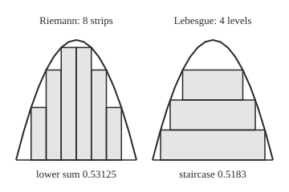
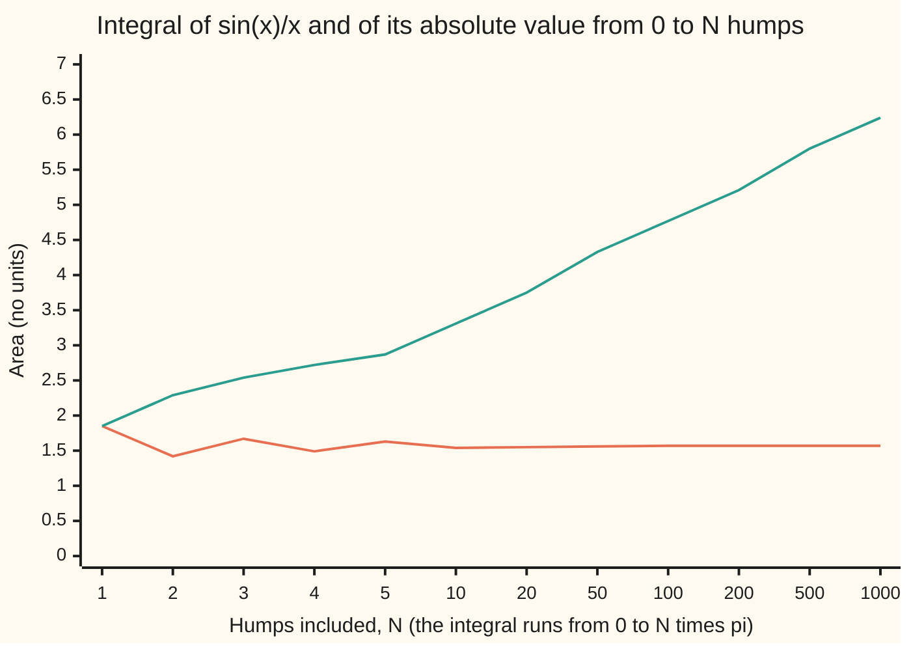

# Riemann meets Lebesgue: every Riemann integral is a Lebesgue integral with the same value, and Lebesgue's criterion says exactly when Riemann works

[Syllabus](../../../SYLLABUS.md) → [Measure and integration](../../../SYLLABUS.md#w10) → [The Lebesgue Integral](../../../SYLLABUS.md#w10-s04) → Riemann meets Lebesgue

---

## General Overview

A river runs along a 1 km stretch. At x km from the start its depth is 4x(1 − x) metres: dry at both ends, 1 m in the middle. What is the average depth?

Riemann's answer cuts the stretch into 1,000 strips of 1 m each and adds depth times width. Lebesgue's answer cuts the depth instead: how much of the stretch is at least 0.25 m deep, at least 0.5 m, and so on, stacked like a staircase. Both give 0.6667 m; the exact answer is 2/3 m. The agreement is the first theorem on this card.

Stranger rivers split the methods. Make the depth 1 m wherever x is a fraction, and 0 elsewhere. Every strip holds both kinds of point, so Riemann's highest and lowest guesses stay at 1 and 0: no Riemann integral. The fractions take up no length, so Lebesgue's answer is 0. The second theorem, **Lebesgue's criterion**, says which functions Riemann handles: the bounded ones whose jumps sit on a set of length zero.

On an infinite stretch, the integral of sin(x)/x from 0 to b settles at π/2 = 1.570796 as b grows. Yet sin(x)/x has no Lebesgue integral: its positive humps alone add to infinity, and so do its negative ones.

**Every bounded Riemann-integrable function on a closed interval is Lebesgue integrable with the same value; a bounded function is Riemann integrable exactly when it is continuous at every point outside a set of length zero; and on an infinite stretch a function is Lebesgue integrable exactly when the improper integral of its absolute value is finite, and then the two integrals agree.**

**What kind of fact this is:** three theorems, proved on this card in Why it works. The first two come from one identity: the gap between Riemann's best upper and best lower sums is the Lebesgue integral of the function's jumps. The third adds monotone convergence to the first.

### The picture: slicing the stretch, slicing the depth

<p align="center"></p>

Drawn to scale: 1 km is 150 px across and 1 m of depth 150 px up; the right panel is the left moved 170 px. Left, each strip is filled to its lowest depth: total 0.53125. Right, each band, 0.25 m tall, covers the part of the stretch at least 0.25, 0.5 or 0.75 m deep: total 0.5183. Finer cutting brings both to 2/3.

---

## The formula

Notation first. $\lambda$ is Lebesgue measure, length on the line. $\int_{[a,b]} f \, d\lambda$ is the integral of f against $\lambda$ over [a, b], from [The integral of a simple function](01-integral-of-a-simple-function.md) and [The integral of a non-negative function](02-integral-of-a-nonnegative-function.md). $\int_a^b f(x)\,dx$ keeps its old meaning: the Riemann integral, the one number between every lower sum and every upper sum ([The integral](../../06-Calculus%20and%20analysis/04-Integrals/01-riemann-integral.md)). The best lower sum, the sup of all lower sums, is written $\underline{I}$; the best upper sum, the inf of all upper sums, is $\overline{I}$. The **Lebesgue sets** are the sets $\lambda$ can measure: every Borel set, give or take any subset of a set of length zero ([Lebesgue measure](../02-Length%20Done%20Properly/03-lebesgue-measure.md)).

One new word. The **oscillation** of f at a point x, written $\omega_f(x)$ (omega), is how far apart f's values spread in ever-smaller windows around x:

$$\omega_f(x) = \lim_{\delta \to 0} \Big( \sup_{|y - x| < \delta} f(y) - \inf_{|y - x| < \delta} f(y) \Big)$$

It is 0 exactly where f is continuous, and the size of the jump where f jumps. $D_f$ is the set where f is not continuous.

The engine, for any bounded f on [a, b]:

$$\overline{I} - \underline{I} = \int_{[a,b]} \omega_f \, d\lambda$$

**Read it aloud:** the gap between Riemann's best upper sum and best lower sum is the Lebesgue integral of the jumps.

Three theorems follow.

$$\text{(i)}\quad f \text{ bounded and Riemann integrable on } [a, b] \implies \int_{[a,b]} f \, d\lambda = \int_a^b f(x)\,dx$$

$$\text{(ii)}\quad f \text{ bounded on } [a, b] \text{ is Riemann integrable} \iff \lambda(D_f) = 0$$

$$\text{(iii)}\quad f \text{ Riemann integrable on each } [a, b'] \implies \Big( f \in L^1([a, \infty)) \iff \int_a^\infty |f(x)|\,dx < \infty \Big), \text{ and then the two integrals agree}$$

**Read them aloud:** a Riemann integral is a Lebesgue integral with the same value; Riemann works exactly when the jumps take up no length; an improper integral is a Lebesgue integral exactly when it survives absolute values.

In (iii), $L^1$ is the collection of functions whose absolute value has a finite integral ([Integrable functions](04-integrable-functions-and-l1.md)), and $\int_a^\infty$ is the improper integral: the limit of $\int_a^b$ as b grows ([Improper integrals](../../06-Calculus%20and%20analysis/04-Integrals/07-improper-integrals.md)).

| Symbol | Plain meaning | In our example | Push it up and the answer… |
| --- | --- | --- | --- |
| $f$, $d$ | the function integrated; $d$ is the river depth 4x(1 − x) m | depth at x km | deeper river, larger integral |
| $x$, $y$ | points of the stretch, in km | 0 to 1 | — |
| $a$, $b$, $b'$ | ends of the interval; $b'$ a finite cut-off on an infinite one | 0 and 1 km | longer stretch, more area |
| $\lambda$ | Lebesgue measure: length | the stretch is 1 km | — |
| $P_n$, $Q_n$, $n$, $k$ | the n-th slicing into strips, slicings used to build it, and a strip's number | 1,000 strips of 1 m | finer slicing, sums closer |
| $g_n$, $h_n$ | step functions at each strip's lowest and highest value | lower sum 0.6656660, upper 0.6676660 | squeeze towards f |
| $g$, $h$; $\underline{I}$, $\overline{I}$ | the limits of $g_n$ and $h_n$; their integrals, the best lower and upper sums | both equal the depth; both 2/3 | — |
| $\omega_f(x)$, $\delta$, $\varepsilon$ | oscillation: the jump at x; $\delta$ is the window's half-width, $\varepsilon$ a tolerance on the spread | 0 for the depth; 1 everywhere for depth 1 at fractions | bigger jumps, bigger gap |
| $D_f$ | where f is not continuous | empty; the whole stretch; the fractions | — |
| $M$ | a bound: every value of f lies between −M and M | 1 m | — |
| $f^+$, $f^-$ | positive and negative parts: f above zero, and minus f below zero | the positive and negative humps of sin(x)/x | — |
| $m$, $t$, $C$, $Z$ | a truncation height; a depth level; the cut points; a null set | $t$ = 0.25, 0.5, 0.75 m | — |

### When it holds

- **Bounded function, bounded interval.** 1/√x on (0, 1] is continuous there, yet its first strip has no highest value: Lebesgue gives 2, Riemann nothing.
- **Continuous almost everywhere, not equal almost everywhere to something continuous.** Depth 1 at fractions equals the dry river 0 except on a set of length zero, yet it is continuous nowhere, and Riemann fails.
- **Lebesgue sets, not Borel sets.** A Riemann-integrable function is measurable with respect to the Lebesgue sets, not always the Borel sets (tip in Step 5).
- **For (iii), absolute convergence.** sin(x)/x converges improperly to π/2 but its absolute value does not, so it has no Lebesgue integral.

---

## Why it works

### Step 0: Riemann's step functions are simple functions

A lower sum is the integral of a step function taking, on each strip, the strip's lowest value. That is a simple function (finitely many values, each on an interval), so its Lebesgue integral is the same lower sum; likewise for upper sums.

So Riemann's approximations are already Lebesgue objects. Refine the slicing and they squeeze f from below and above; monotone convergence takes their limits point by point. At x the gap between the limits is the jump of f at x. Integrate the gaps: that is the gap between Riemann's best upper and lower sums. The first two theorems read off that identity.

### Step 1: one sequence of slicings that does every job

Choose slicings $P_n$, each refining the one before, strips shrinking to width zero, lower sums rising to $\underline{I}$ and upper sums falling to $\overline{I}$. Adding cuts never lowers a lower sum or raises an upper sum ([The integral](../../06-Calculus%20and%20analysis/04-Integrals/01-riemann-integral.md), Step 1), so this costs nothing.

On the river, 1,000 equal strips give lower sum 0.6656660 and upper sum 0.6676660, 0.002 apart: the depth rises 1 m and falls 1 m, and each strip's gap is its share of that, times the strip width.

### Step 2: the step functions and their limits

Off the cut points, let $g_n(x)$ be the lowest value of f on x's strip of $P_n$ and $h_n(x)$ the highest. All the cut points together are countably many: a set $C$ of length zero, which changes no integral.

Strips of $P_{n+1}$ lie inside strips of $P_n$, so $g_n \le g_{n+1} \le f \le h_{n+1} \le h_n$, and the bounded monotone sequences have limits $g$ and $h$. Let every value of f lie between −M and M. Then $g_n + M$ is a non-negative simple function rising to $g + M$, so the [The monotone convergence theorem](03-monotone-convergence-theorem.md) gives $\int g \, d\lambda = \lim$ (lower sums) $= \underline{I}$. Likewise $\int h \, d\lambda = \overline{I}$.

### Step 3: the gap at a point is the jump

Fix x outside $C$. Its strip holds a small window around x, so the strip's spread is at least $\omega_f(x)$; the strip also lies within one shrinking strip-width of x, so the spread falls to $\omega_f(x)$. So $h(x) - g(x) = \omega_f(x)$ outside a set of length zero, and integrating gives the engine:

$$\overline{I} - \underline{I} = \int h \, d\lambda - \int g \, d\lambda = \int_{[a,b]} \omega_f \, d\lambda$$

<details>
<summary>Detailed proof</summary>

Let every value of f on [a, b] lie between −M and M.

*Slicings.* By the definitions of $\underline{I}$ and $\overline{I}$, for each n there are slicings $Q_n$ with lower sum above $\underline{I} - 1/n$ and $Q'_n$ with upper sum below $\overline{I} + 1/n$. Let $P_n$ use all the cuts of $Q_1, Q'_1, \dots, Q_n, Q'_n$ and of the equal slicing into $2^n$ strips. Refinement raises lower sums and lowers upper sums (riemann-integral card), so the lower sums $L(P_n)$ rise to $\underline{I}$, the upper sums $U(P_n)$ fall to $\overline{I}$, and strips are no wider than $(b - a) 2^{-n}$.

*Step functions.* Let $C$ be the union of all cut points: countable, so $\lambda(C) = 0$ ([Null sets and almost everywhere](../01-Sets%20You%20Can%20Measure/07-null-sets-and-almost-everywhere.md)). For x not in $C$, let $J_n(x)$ be the closed strip of $P_n$ containing x, and put $g_n(x) = \inf_{J_n(x)} f$ and $h_n(x) = \sup_{J_n(x)} f$; on $C$ put both to 0. Each is a simple function on intervals, so $\int g_n \, d\lambda = L(P_n)$ and $\int h_n \, d\lambda = U(P_n)$ (integral-of-a-simple-function card). $J_{n+1}(x) \subseteq J_n(x)$, so off $C$, $g_n \le g_{n+1} \le f \le h_{n+1} \le h_n$, all between −M and M. The limits $g$ and $h$ exist off $C$ (bounded monotone sequences); put them to 0 on $C$. They are Borel measurable, as limits of Borel simple functions.

*Integrals.* Monotone convergence on $g_n + M \ge 0$, rising to $g + M$, then subtracting the finite $M(b - a)$, gives $\int g \, d\lambda = \lim_n L(P_n) = \underline{I}$; on $M - h_n$ it gives $\int h \, d\lambda = \overline{I}$.

*Gap equals oscillation.* Fix x not in $C$ and n. x lies in the open strip, so $J_n(x)$ contains some window $(x - \delta, x + \delta)$, whose spread is at least $\omega_f(x)$, the limit of non-increasing spreads. So $h_n(x) - g_n(x) \ge \omega_f(x)$. Also $J_n(x) \subseteq [x - w_n, x + w_n]$, $w_n = (b - a) 2^{-n}$, so $h_n(x) - g_n(x)$ is at most the spread over $(x - 2w_n, x + 2w_n)$, which falls to $\omega_f(x)$. Hence $h(x) - g(x) = \omega_f(x)$ off $C$. So $\omega_f$ equals the Borel function $h - g$ except on a null set; it is measurable with respect to the Lebesgue sets, and functions equal almost everywhere have the same integral (integrable-functions-and-l1 card). So $\int \omega_f \, d\lambda = \int h \, d\lambda - \int g \, d\lambda = \overline{I} - \underline{I}$.

</details>

### Step 4: Lebesgue's criterion

Riemann integrable means $\overline{I} = \underline{I}$, so by the engine it means $\int \omega_f \, d\lambda = 0$. A non-negative function with integral zero is zero except on a set of length zero, and $\omega_f(x) = 0$ says f is continuous at x. So f is Riemann integrable exactly when $\lambda(D_f) = 0$.

On the depth-1-at-fractions river every window holds depth 1 and depth 0, so every point has oscillation 1. $\lambda(D_f) = 1$, and the gap is 1: upper sums 1, lower sums 0, at 10, 100 and 1,000 strips.

Thomae's function passes. It is 1/q at a fraction p/q in lowest terms and 0 elsewhere. It jumps at every fraction but is continuous everywhere else: near any other point only fractions with large denominators come close, and their values 1/q are small. The jumps take up no length, so it is Riemann integrable. Its upper sums confirm it: 0.456667 at 10 strips, 0.130811 at 100, 0.037365 at 1,000, 0.011081 at 10,000.

<details>
<summary>Detailed proof</summary>

*Zero integral, zero almost everywhere.* Suppose $\omega_f \ge 0$ and $\int \omega_f \, d\lambda = 0$. For each whole number m, the simple function $\frac{1}{m} 1_{\{\omega_f \ge 1/m\}}$ lies below $\omega_f$, so its integral $\frac{1}{m} \lambda(\{\omega_f \ge 1/m\})$ is at most 0 (monotonicity, integral-of-a-nonnegative-function card). So each set $\{\omega_f \ge 1/m\}$ has length 0, and so does their countable union $\{\omega_f > 0\}$. Conversely, if $\omega_f = 0$ outside a null set, its integral is 0.

*Oscillation zero, continuous.* $\omega_f(x) = 0$ says every $\varepsilon > 0$ has a window $|y - x| < \delta$ where f spreads by less than $\varepsilon$, so $|f(y) - f(x)| < \varepsilon$ there: continuity at x. Conversely, continuity gives a window where every value is within $\varepsilon / 3$ of f(x), a spread below $\varepsilon$. So $D_f = \{\omega_f > 0\}$.

Putting these together with the engine: f is Riemann integrable ⟺ $\overline{I} = \underline{I}$ ⟺ $\int \omega_f \, d\lambda = 0$ ⟺ $\lambda(D_f) = 0$.

</details>

### Step 5: Riemann's value is Lebesgue's value

Let f be Riemann integrable. Then $h = g$ outside a null set $Z$ (cut points and jumps), and f, squeezed between them, equals $g$ there. The set where f exceeds a level c is the Borel set where $g$ does, altered only inside $Z$. Every subset of a null set is a Lebesgue set ([Lebesgue measure](../02-Length%20Done%20Properly/03-lebesgue-measure.md)), so f is measurable with respect to the Lebesgue sets. It is bounded on an interval of finite length, so it is integrable, and

$$\int_{[a,b]} f \, d\lambda = \int g \, d\lambda = \underline{I} = \int_a^b f(x)\,dx$$

On the river: 0.6666670 from 1,000 strip midpoints, 0.6666590 from 65,536 depth levels, exactly 2/3 from the antiderivative $2x^2 - \tfrac{4}{3}x^3$.

<details>
<summary>A Riemann-integrable function that is not Borel measurable</summary>

The Cantor set has length 0 and as many points as the line, so it has more subsets than there are Borel sets ([Lebesgue measure](../02-Length%20Done%20Properly/03-lebesgue-measure.md), by a counting argument not proved there). Take a subset A that is not Borel, and let f be 1 on A and 0 elsewhere. Off the closed Cantor set f is 0 on an open set, so f jumps only on a set of length 0: Riemann integrable, integral 0. Yet the set where f exceeds 1/2 is A, not a Borel set. Step 5 needs the Lebesgue sets.

</details>

### Step 6: improper integrals, and where they part

For a non-negative f, cut the stretch at a + 1, a + 2, and so on. The cut-off functions rise to f, so monotone convergence makes the Lebesgue integral the limit of the Riemann integrals: the improper integral, finite or infinite.

For a signed f, apply that to $|f|$, whose jumps are no larger than f's: f is in $L^1$ exactly when the improper integral of $|f|$ is finite. Then $f^+$ and $f^-$ have finite improper integrals, and subtracting gives that of f.

sin(x)/x fails that test. On the k-th hump, from kπ to (k + 1)π, it keeps one sign, and its area is at least $2/((k+1)\pi)$: one arch of |sin| has area 2, and x is at most (k + 1)π. Over 1,000 humps that floor adds to $(2/\pi)(1 + 1/2 + \dots + 1/1000)$ = 4.7654; the true area is 6.2393, and both grow without limit. The positive humps alone, and the negative humps alone, still add to infinity: their floors are the odd and even terms of that divergent sum. So $f^+$ and $f^-$ each have infinite integral, and sin(x)/x has no Lebesgue integral.

The improper value π/2 belongs to one order of adding. Take two positive humps, then one negative, and repeat: these sets also fill (0, ∞), and the integrals over them tend to 1.79143, which is π/2 + (ln 2)/π. For a function in $L^1$, monotone convergence on $f^+$ and $f^-$ forces every such order to the same limit.

<details>
<summary>Detailed proof</summary>

*Non-negative f.* Let $f \ge 0$ be Riemann integrable on each [a, b′]. By Step 5, each $f 1_{[a, a+n]}$ is measurable with respect to the Lebesgue sets with integral $\int_a^{a+n} f(x)\,dx$. They rise to f at every point, so monotone convergence gives $\int_{[a,\infty)} f \, d\lambda = \lim_n \int_a^{a+n} f(x)\,dx$. The running integral $F(b') = \int_a^{b'} f(x)\,dx$ never falls, so its limit along whole numbers is its limit as $b' \to \infty$: the improper integral, possibly infinite.

*|f| is Riemann integrable where f is.* $\big||f(y)| - |f(z)|\big| \le |f(y) - f(z)|$, so $\omega_{|f|} \le \omega_f$ and $D_{|f|} \subseteq D_f$. The criterion applies on each [a, b′]. So do $f^+ = (|f| + f)/2$ and $f^- = (|f| - f)/2$.

*Signed f.* f is in $L^1$ exactly when $\int |f| \, d\lambda < \infty$, which by the first part is the improper integral of |f|. Then $f^+, f^- \le |f|$ have finite improper integrals equal to their Lebesgue integrals, and $\int f \, d\lambda = \int f^+ \, d\lambda - \int f^- \, d\lambda = \lim_{b'} \big(\int_a^{b'} f^+ \,dx - \int_a^{b'} f^- \,dx\big) = \int_a^\infty f(x)\,dx$, by linearity of the Riemann integral on [a, b′].

*Every order agrees in $L^1$.* If finite unions of intervals rise to fill $[a, \infty)$ and f is in $L^1$, monotone convergence carries the integrals of $f^+$ and $f^-$ over them to finite limits, so the integrals of f converge to $\int f \, d\lambda$.

*sin(x)/x.* It extends continuously to 1 at 0, so it is Riemann integrable on every [0, b′]. On $[k\pi, (k+1)\pi]$, $|\sin x| / x \ge |\sin x| / ((k+1)\pi)$ and $\int_{k\pi}^{(k+1)\pi} |\sin x| \, dx = 2$, so the hump is at least $2/((k+1)\pi)$. The harmonic series diverges, so $\int |f| \, d\lambda = \infty$.

</details>

<details>
<summary>Where π/2 and 1.79143 come from</summary>

The code's second road for π/2 is the classical identity: the integral of sin(x)/x over (0, ∞) equals that of 1/(1 + t^2), by writing 1/x as the integral of e^(−xt) over t and swapping; the swap needs a limit argument not given here, because sin(x)/x is not in $L^1$. The substitution t → 1/t makes the part over (1, ∞) equal the part over (0, 1). The humps shrink like 2/(πk), the alternating harmonic series scaled by 2/π; two positives per negative shift that series by (ln 2)/2, here by (ln 2)/π.

</details>

[Expectation as an integral](06-expectation-as-an-integral.md) uses Step 5 to turn every density-weighted average of wing 09 into a Lebesgue integral without recomputing it.

---

## Worked numbers, by hand

| Step | Arithmetic | Value |
| --- | --- | --- |
| lowest depths, 8 strips | 4x(1 − x) at the strip end nearer a bank: 0, 0.4375, 0.75, 0.9375, 0.9375, 0.75, 0.4375, 0 m | — |
| lower sum, 8 strips | (0 + 0.4375 + 0.75 + 0.9375) × 2 × 0.125 | 0.53125 |
| level sets | depth ≥ t on the interval of length √(1 − t): 0.8660, 0.7071, 0.5 km at t = 0.25, 0.5, 0.75 | — |
| staircase, 4 levels | 0.25 × (0.8660 + 0.7071 + 0.5) | 0.5183 |
| 1,000 strips | lower, upper, midpoint | 0.6656660, 0.6676660, 0.6666670 |
| midpoint error | 1/(3 × 1000^2) | 1/3000000 |
| staircase, 65,536 levels | the same sum with finer levels | 0.6666590 |
| antiderivative | 2 × 1^2 − (4/3) × 1^3 | **2/3 = 0.6667 m** |

The average depth over the kilometre is 2/3 m, and cutting by strips or by depth reaches the same number.

A second case: Thomae's upper sums at 10, 100, 1,000 and 10,000 strips are 0.456667, 0.130811, 0.037365, 0.011081. A count of fractions bounds them by 1.100000, 0.390000, 0.166000, 0.075655: a fraction with denominator at most Q touches at most two strips, and every other strip tops out below 1/Q. Both fall to 0, the Lebesgue integral.

### The picture: sin(x)/x, signed and absolute



The first line is the signed running integral: it swings about and settles at π/2 ≈ 1.57, the improper integral. The second is the area of the absolute value: it climbs by roughly the same amount for every tenfold step in N and never settles. The horizontal axis is not to scale.

### What breaks if you drop a piece

| Mistake | Comes out at | What went wrong |
| --- | --- | --- |
| Riemann sums for depth 1 at fractions | upper sum 1, lower sum 0, at 10, 100 and 1,000 strips | continuous nowhere: $\lambda(D_f) = 1$, not 0 |
| The improper value π/2 taken as a Lebesgue integral | absolute area 6.2393 after 1,000 humps and climbing; another order of adding gives 1.79143 | $f^+$ and $f^-$ both have infinite integral |
| The criterion applied to 1/√x on (0, 1] | lower sums 1.5878, 1.8590, 1.9543; the first strip has no highest value | unbounded; Lebesgue's value 2 comes from 1.900, 1.990, 1.999 by truncation |
| "Equal almost everywhere to a continuous function" used for the criterion | depth 1 at fractions equals 0 almost everywhere, yet upper sums stay 1 | the criterion asks where f itself is continuous |

---

## Code, from first principles, and it actually runs

The code reaches the river's average depth by three independent roads: Riemann strips in exact fractions (Python) or exact integers over n^3 (Rust); Lebesgue value slices, whose level sets are intervals found by the quadratic formula; and the antiderivative. It checks the midpoint error 1/(3n^2) exactly. Thomae's upper sums come by searching denominators and by placing every fraction in its strips. Depth 1 at fractions is read, in each strip, at (2k + 1)/(2n) and at k/n + √2/(2n), irrational as √2 is. sin(x)/x is integrated hump by hump with a hand-written Simpson's rule, against 2 × the integral of 1/(1 + t^2) over (0, 1), each hump against its floor, then in a second order.

The code checks finite slicings, finitely many humps and single functions. That the sums converge, that the criterion holds for every bounded function, and that sin(x)/x has infinite absolute area, only the proofs show.

### Python

```python
# Riemann meets Lebesgue -- the check behind the card.  Standard library only.
# River depth d(x) = 4x(1 - x) metres at x km along a 1 km stretch.  Road 1:
# Riemann strips in exact fractions.  Road 2: Lebesgue value slices, each level
# set an interval whose length comes from the quadratic formula.  Road 3: the
# antiderivative.  Then the depth-1-at-rationals function, Thomae's function,
# sin(x)/x on (0, infinity) and 1/sqrt(x) on (0, 1].
from fractions import Fraction as Fr
from math import gcd, sin, sqrt, pi, log

def d(x):
    return 4 * x * (1 - x)

def riemann(n):                           # lower, upper, midpoint sums on n equal strips, n even
    lo = up = mid = Fr(0)
    for k in range(n):                    # d rises to x = 1/2, a cut, then falls: extremes at the ends
        a, b = d(Fr(k, n)), d(Fr(k + 1, n))
        lo += min(a, b) / n
        up += max(a, b) / n
        mid += d(Fr(2 * k + 1, 2 * n)) / n
    return lo, up, mid

def staircase(levels):                    # integral of floor(levels * d) / levels, slice by value
    total = 0.0
    for k in range(1, levels):
        s = sqrt(1 - k / levels)          # d >= t on [(1 - s)/2, (1 + s)/2], s = sqrt(1 - t)
        total += (1 + s) / 2 - (1 - s) / 2
    return total / levels

def thomae_upper(n):                      # strip's top value is 1/q, q the least denominator in it
    total = 0.0
    for k in range(n):                    # least q with a multiple of 1/q in [k/n, (k+1)/n]
        q = 1
        while -(-k * q // n) > (k + 1) * q // n:
            q += 1
        total += 1 / q
    return total / n

def thomae_by_fractions(n):               # second road: place every p/q, q <= n, in its strips
    best = [n + 1] * n
    for q in range(1, n + 1):
        for p in range(q + 1):
            if gcd(p, q) == 1:
                j = p * n // q
                for k in ((j - 1, j) if p * n % q == 0 else (j,)):
                    if 0 <= k < n:
                        best[k] = min(best[k], q)
    total = 0.0
    for q in best:                        # a plain loop: sum() compensates, and would round differently
        total += 1 / q
    return total / n

def hump(k, panels=32):                   # integral of sin(x)/x over [k pi, (k+1) pi], Simpson
    h = pi / panels
    f = lambda x: 1.0 if x == 0 else sin(x) / x
    s = f(k * pi) + f((k + 1) * pi)
    for i in range(1, panels):
        s += (4 if i % 2 else 2) * f(k * pi + i * h)
    return s * h / 3

def simpson(f, a, b, panels):
    h = (b - a) / panels
    return h / 3 * (f(a) + f(b) + sum((4 if i % 2 else 2) * f(a + i * h) for i in range(1, panels)))

print("Riemann meets Lebesgue: river depth d(x) = 4x(1 - x) m over 1 km")
exact = Fr(2) - Fr(4, 3)                  # [2x^2 - (4/3)x^3] from 0 to 1
lo, up, mid = riemann(1000)
assert lo < exact < up and up - lo == Fr(2, 1000)          # gap: (top - bottom) twice, over n
assert mid - exact == Fr(1, 3 * 1000 ** 2)                 # midpoint error h^2 * 8 / 24
print(f"road 1, 1000 strips: lower {float(lo):.7f}, upper {float(up):.7f}, gap {float(up - lo):.3f}, midpoint {float(mid):.10f}")
print(f"road 3, antiderivative: {exact} = {float(exact):.10f}; midpoint minus exact = 1/{1 / (mid - exact)}")
prev = 0.0
for m in (2, 4, 8, 12, 16):
    st = staircase(2 ** m)
    assert prev < st < float(exact)       # simple functions below d, rising
    prev = st
    print(f"road 2, staircase with {2 ** m} value levels: {st:.7f}")
assert abs(prev - float(exact)) < 1 / 2 ** 16
print(f"all three roads, 4 places: {float(mid):.4f} {prev:.4f} {float(exact):.4f}")
print(f"figure, 8-strip lower sum {float(riemann(8)[0]):.5f}, 4-level staircase {staircase(4):.4f}")
print("figure, strip heights px:", " ".join(f"{150 * float(min(d(Fr(k, 8)), d(Fr(k + 1, 8)))):.3f}" for k in range(8)))
print("worked, lowest depth in each of 8 strips (m):", " ".join(f"{float(min(d(Fr(k, 8)), d(Fr(k + 1, 8)))):.4f}" for k in range(8)))
print("worked, length where depth >= 0.25 0.5 0.75 (km):", " ".join(f"{sqrt(1 - j / 4):.4f}" for j in (1, 2, 3)))
bands = []
for j in (1, 2, 3):
    s = sqrt(1 - j / 4)
    bands.append(f"{190 + 150 * (1 - s) / 2:.2f}-{190 + 150 * (1 + s) / 2:.2f}")
print("figure, band x px at t = 0.25 0.5 0.75:", " ".join(bands))
print("figure, curve px:", " ".join(f"{20 + 150 * j / 16:.2f},{200 - 150 * d(j / 16):.2f}" for j in range(17)))

for n in (10, 100, 1000):                 # depth 1 at rational x, 0 elsewhere
    up_q = lo_q = Fr(0)
    for k in range(n):                    # witnesses r = (2k+1)/(2n) and k/n + c sqrt(2), irrational because sqrt(2) is
        r, c = Fr(2 * k + 1, 2 * n), Fr(1, 2 * n)
        assert Fr(k, n) < r < Fr(k + 1, n) and 0 < c and 2 * c * c < Fr(1, n) ** 2   # both strictly inside the strip
        dep = [1 if cc == 0 else 0 for cc in (Fr(0), c)]   # depth at each: 1 exactly when its sqrt(2) part is 0
        up_q, lo_q = up_q + Fr(max(dep), n), lo_q + Fr(min(dep), n)   # depth is only 0 or 1: the strip's top and bottom
    assert (up_q, lo_q) == (1, 0)         # gap 1: the jumps fill the whole stretch
    print(f"rational depth, {n} strips: upper sum {up_q}, lower sum {lo_q}")
print(f"rational depth, Lebesgue: 1 x length(rationals) + 0 x length(rest) = 1 x 0 + 0 x 1 = {1 * 0 + 0 * 1}")

F = lambda Q: sum(1 for q in range(1, Q + 1) for p in range(q + 1) if gcd(p, q) == 1)
Fs = [F(Q) for Q in range(1, 201)]
for n in (10, 100, 1000, 10000):
    u = thomae_upper(n)
    bound = min(2 * Fs[Q - 1] / n + 1 / Q for Q in range(1, 201))
    assert 0 < u <= bound                 # counting fractions with small denominators
    assert n > 1000 or u == thomae_by_fractions(n)
    print(f"thomae, {n} strips: upper sum {u:.6f}, counting bound {bound:.6f}, lower sum 0")

a = [hump(k) for k in range(1001)]
S, B = [0.0], [0.0]
for k in range(1001):
    S.append(S[-1] + a[k])
    B.append(B[-1] + abs(a[k]))
    assert abs(a[k]) >= 2 / ((k + 1) * pi) and (a[k] > 0) == (k % 2 == 0)
half_pi = 2 * simpson(lambda t: 1 / (1 + t * t), 0.0, 1.0, 1000)
avg = (S[1000] + S[1001]) / 2
assert abs(avg - half_pi) < 1e-6          # humps against the Laplace road, 2 * integral of 1/(1+t^2)
print(f"sin x/x, first humps: {a[0]:.6f} {a[1]:.6f} {a[2]:.6f} {a[3]:.6f}")
print(f"sin x/x, improper integral: humps {avg:.6f}, Laplace road {half_pi:.6f}, pi/2 {pi / 2:.6f}")
H = sum(1 / k for k in range(1, 1001))
assert B[1000] >= 2 / pi * H              # each hump at least 2 / ((k+1) pi)
pos = sum(a[k] for k in range(0, 1000, 2))
print(f"|sin x/x| over 1000 humps: {B[1000]:.4f}, floor (2/pi) x H_1000 = {2 / pi * H:.4f}; ln 1000 = {log(1000):.4f}")
print(f"positive part over 1000 humps {pos:.4f}, negative part {pos - S[1000]:.4f}: both grow without limit")
Ns = [1, 2, 3, 4, 5, 10, 20, 50, 100, 200, 500, 1000]
print("chart, signed to N humps:", " ".join(f"{S[N]:.2f}" for N in Ns))
print("chart, absolute to N humps:", " ".join(f"{B[N]:.2f}" for N in Ns))
J = 50000                                 # exhaust (0, infinity) as 2 positive humps, then 1 negative
tot = sum(hump(2 * i) for i in range(2 * J)) + sum(hump(2 * i + 1) for i in range(J))
target = pi / 2 + log(2) / pi             # rearranged alternating series: shift (c/2) ln(p/q), c = 2/pi
assert abs(tot - target) < 1e-4
print(f"sin x/x, two positive humps per negative, {3 * J} humps: {tot:.5f}; pi/2 + ln 2 / pi = {target:.5f}")

for n in (10, 100, 1000):                 # 1/sqrt(x): continuous on (0, 1], unbounded at 0
    low = sum(1 / sqrt(n * k) for k in range(1, n + 1))
    assert low < 2 - 1 / sqrt(n) + 1e-12  # sum of k^(-1/2) <= 2 sqrt(n) - 1
    print(f"1/sqrt(x), {n} strips: lower sum {low:.4f}, upper sum infinite (first strip)")
print("1/sqrt(x), Lebesgue by truncation min(f, m), m = 10 100 1000:", " ".join(f"{2 - 1 / m:.3f}" for m in (10, 100, 1000)))
print("All checks passed.")
```

**Ran 2026-10-07 on macOS, Python 3.14.6, standard library only. All checks passed. Output, pasted from the run:**

```
Riemann meets Lebesgue: river depth d(x) = 4x(1 - x) m over 1 km
road 1, 1000 strips: lower 0.6656660, upper 0.6676660, gap 0.002, midpoint 0.6666670000
road 3, antiderivative: 2/3 = 0.6666666667; midpoint minus exact = 1/3000000
road 2, staircase with 4 value levels: 0.5182830
road 2, staircase with 16 value levels: 0.6323312
road 2, staircase with 256 value levels: 0.6646634
road 2, staircase with 4096 value levels: 0.6665438
road 2, staircase with 65536 value levels: 0.6666590
all three roads, 4 places: 0.6667 0.6667 0.6667
figure, 8-strip lower sum 0.53125, 4-level staircase 0.5183
figure, strip heights px: 0.000 65.625 112.500 140.625 140.625 112.500 65.625 0.000
worked, lowest depth in each of 8 strips (m): 0.0000 0.4375 0.7500 0.9375 0.9375 0.7500 0.4375 0.0000
worked, length where depth >= 0.25 0.5 0.75 (km): 0.8660 0.7071 0.5000
figure, band x px at t = 0.25 0.5 0.75: 200.05-329.95 211.97-318.03 227.50-302.50
figure, curve px: 20.00,200.00 29.38,164.84 38.75,134.38 48.12,108.59 57.50,87.50 66.88,71.09 76.25,59.38 85.62,52.34 95.00,50.00 104.38,52.34 113.75,59.38 123.12,71.09 132.50,87.50 141.88,108.59 151.25,134.38 160.62,164.84 170.00,200.00
rational depth, 10 strips: upper sum 1, lower sum 0
rational depth, 100 strips: upper sum 1, lower sum 0
rational depth, 1000 strips: upper sum 1, lower sum 0
rational depth, Lebesgue: 1 x length(rationals) + 0 x length(rest) = 1 x 0 + 0 x 1 = 0
thomae, 10 strips: upper sum 0.456667, counting bound 1.100000, lower sum 0
thomae, 100 strips: upper sum 0.130811, counting bound 0.390000, lower sum 0
thomae, 1000 strips: upper sum 0.037365, counting bound 0.166000, lower sum 0
thomae, 10000 strips: upper sum 0.011081, counting bound 0.075655, lower sum 0
sin x/x, first humps: 1.851937 -0.433786 0.256610 -0.182601
sin x/x, improper integral: humps 1.570796, Laplace road 1.570796, pi/2 1.570796
|sin x/x| over 1000 humps: 6.2393, floor (2/pi) x H_1000 = 4.7654; ln 1000 = 6.9078
positive part over 1000 humps 3.9049, negative part 2.3344: both grow without limit
chart, signed to N humps: 1.85 1.42 1.67 1.49 1.63 1.54 1.55 1.56 1.57 1.57 1.57 1.57
chart, absolute to N humps: 1.85 2.29 2.54 2.72 2.87 3.31 3.75 4.33 4.77 5.21 5.80 6.24
sin x/x, two positive humps per negative, 150000 humps: 1.79143; pi/2 + ln 2 / pi = 1.79143
1/sqrt(x), 10 strips: lower sum 1.5878, upper sum infinite (first strip)
1/sqrt(x), 100 strips: lower sum 1.8590, upper sum infinite (first strip)
1/sqrt(x), 1000 strips: lower sum 1.9543, upper sum infinite (first strip)
1/sqrt(x), Lebesgue by truncation min(f, m), m = 10 100 1000: 1.900 1.990 1.999
All checks passed.
```

### Rust

```rust
// Riemann meets Lebesgue -- the check behind the card.  Rust std only.
// River depth d(x) = 4x(1 - x) metres at x km along a 1 km stretch.  Road 1:
// Riemann strips as exact integers over n^3.  Road 2: Lebesgue value slices,
// each level set an interval whose length comes from the quadratic formula.
// Road 3: the antiderivative.  Then the depth-1-at-rationals function, Thomae's
// function, sin(x)/x on (0, infinity) and 1/sqrt(x) on (0, 1].
use std::f64::consts::PI;

fn gcd(a: i128, b: i128) -> i128 { if b == 0 { a } else { gcd(b, a % b) } }
fn d(x: f64) -> f64 { 4.0 * x * (1.0 - x) }
// numerators over n^3 of the lower, upper and midpoint sums on n equal strips, n even
fn riemann(n: i128) -> (i128, i128, i128) {
    let (mut lo, mut up, mut mid) = (0, 0, 0);
    for k in 0..n {                        // n^2 d(k/n) = 4k(n - k); extremes at the strip ends
        let (a, b) = (4 * k * (n - k), 4 * (k + 1) * (n - k - 1));
        lo += a.min(b);
        up += a.max(b);
        mid += (2 * k + 1) * (2 * n - 2 * k - 1);
    }
    (lo, up, mid)
}
fn staircase(levels: u32) -> f64 {        // integral of floor(levels * d) / levels
    let mut total = 0.0;
    for k in 1..levels {
        let s = (1.0 - k as f64 / levels as f64).sqrt();
        total += (1.0 + s) / 2.0 - (1.0 - s) / 2.0;
    }
    total / levels as f64
}
fn thomae_upper(n: i64) -> f64 {          // top value in a strip is 1/q, q least denominator
    let mut total = 0.0;
    for k in 0..n {                        // least q with a multiple of 1/q in [k/n, (k+1)/n]
        let mut q = 1;
        while (k * q + n - 1) / n > (k + 1) * q / n { q += 1; }
        total += 1.0 / q as f64;
    }
    total / n as f64
}
fn thomae_by_fractions(n: i64) -> f64 {   // second road: place every p/q, q <= n, in its strips
    let mut best = vec![n + 1; n as usize];
    for q in 1..=n {
        for p in 0..=q {
            if gcd(p as i128, q as i128) != 1 { continue; }
            let j = p * n / q;
            let ks = if p * n % q == 0 { vec![j - 1, j] } else { vec![j] };
            for k in ks { if 0 <= k && k < n { best[k as usize] = best[k as usize].min(q); } }
        }
    }
    best.iter().fold(0.0, |acc, &q| acc + 1.0 / q as f64) / n as f64
}
fn hump(k: usize, panels: usize) -> f64 { // integral of sin(x)/x over [k pi, (k+1) pi], Simpson
    let h = PI / panels as f64;
    let f = |x: f64| if x == 0.0 { 1.0 } else { x.sin() / x };
    let mut s = f(k as f64 * PI) + f((k + 1) as f64 * PI);
    for i in 1..panels {
        s += if i % 2 == 1 { 4.0 } else { 2.0 } * f(k as f64 * PI + i as f64 * h);
    }
    s * h / 3.0
}
fn simpson(f: impl Fn(f64) -> f64, a: f64, b: f64, panels: usize) -> f64 {
    let h = (b - a) / panels as f64;
    let inner = (1..panels).fold(0.0, |acc, i| acc + if i % 2 == 1 { 4.0 } else { 2.0 } * f(a + i as f64 * h));
    h / 3.0 * (f(a) + f(b) + inner)
}
fn main() {
    println!("Riemann meets Lebesgue: river depth d(x) = 4x(1 - x) m over 1 km");
    let n: i128 = 1000;
    let n3 = n * n * n;
    let (lo, up, mid) = riemann(n);
    assert!(3 * lo < 2 * n3 && 2 * n3 < 3 * up && (up - lo) * n == 2 * n3); // gap 2/n around 2/3
    assert!(3 * mid - 2 * n3 == n);       // midpoint minus 2/3 is 1/(3 n^2)
    let (en, ed) = (3 * mid - 2 * n3, 3 * n3);
    let g = gcd(en, ed);
    println!("road 1, 1000 strips: lower {:.7}, upper {:.7}, gap {:.3}, midpoint {:.10}",
        lo as f64 / n3 as f64, up as f64 / n3 as f64, (up - lo) as f64 / n3 as f64, mid as f64 / n3 as f64);
    println!("road 3, antiderivative: 2/3 = {:.10}; midpoint minus exact = {}/{}", 2.0 / 3.0, en / g, ed / g);
    let mut prev = 0.0;
    for m in [2u32, 4, 8, 12, 16] {
        let st = staircase(1 << m);
        assert!(prev < st && st < 2.0 / 3.0); // simple functions below d, rising
        prev = st;
        println!("road 2, staircase with {} value levels: {:.7}", 1u32 << m, st);
    }
    assert!((prev - 2.0 / 3.0).abs() < 1.0 / 65536.0);
    println!("all three roads, 4 places: {:.4} {:.4} {:.4}", mid as f64 / n3 as f64, prev, 2.0 / 3.0);
    let lo8 = riemann(8).0;
    println!("figure, 8-strip lower sum {:.5}, 4-level staircase {:.4}", lo8 as f64 / 512.0, staircase(4));
    let hs: Vec<String> = (0..8).map(|k| format!("{:.3}", 150.0 * (4 * k * (8 - k)).min(4 * (k + 1) * (7 - k)) as f64 / 64.0)).collect();
    println!("figure, strip heights px: {}", hs.join(" "));
    let lw: Vec<String> = (0..8).map(|k| format!("{:.4}", (4 * k * (8 - k)).min(4 * (k + 1) * (7 - k)) as f64 / 64.0)).collect();
    println!("worked, lowest depth in each of 8 strips (m): {}", lw.join(" "));
    let ls: Vec<String> = [1.0, 2.0, 3.0].iter().map(|j: &f64| format!("{:.4}", (1.0 - j / 4.0).sqrt())).collect();
    println!("worked, length where depth >= 0.25 0.5 0.75 (km): {}", ls.join(" "));
    let bands: Vec<String> = [1.0, 2.0, 3.0].iter().map(|j: &f64| {
        let s = (1.0 - j / 4.0).sqrt();
        format!("{:.2}-{:.2}", 190.0 + 150.0 * (1.0 - s) / 2.0, 190.0 + 150.0 * (1.0 + s) / 2.0)
    }).collect();
    println!("figure, band x px at t = 0.25 0.5 0.75: {}", bands.join(" "));
    let cv: Vec<String> = (0..17).map(|j| format!("{:.2},{:.2}", 20.0 + 150.0 * j as f64 / 16.0, 200.0 - 150.0 * d(j as f64 / 16.0))).collect();
    println!("figure, curve px: {}", cv.join(" "));

    for n in [10i64, 100, 1000] {           // depth 1 at rational x, 0 elsewhere
        let (mut up_q, mut lo_q) = (0i64, 0i64); // in units of 1/n
        for k in 0..n {                     // witnesses r = (2k+1)/(2n) and k/n + c sqrt(2), irrational because sqrt(2) is
            let ((rn, rd), (cn, cd)) = ((2 * k + 1, 2 * n), (1i64, 2 * n));
            assert!(k * rd < rn * n && rn * n < (k + 1) * rd && 0 < cn && 2 * cn * cn * n * n < cd * cd); // both strictly inside
            let dep: Vec<i64> = [0, cn].iter().map(|&c| if c == 0 { 1 } else { 0 }).collect(); // 1 exactly when the sqrt(2) part is 0
            up_q += dep.iter().max().unwrap(); // depth is only 0 or 1: the strip's top and bottom
            lo_q += dep.iter().min().unwrap();
        }
        assert!(up_q == n && lo_q == 0);   // gap 1: the jumps fill the whole stretch
        println!("rational depth, {} strips: upper sum {}, lower sum {}", n, up_q / n, lo_q);
    }
    println!("rational depth, Lebesgue: 1 x length(rationals) + 0 x length(rest) = 1 x 0 + 0 x 1 = {}", 1 * 0 + 0 * 1);

    let fs: Vec<i64> = (1..=200i128).map(|qq| (1..=qq).map(|q| (0..=q).filter(|&p| gcd(p, q) == 1).count() as i64).sum()).collect();
    for n in [10i64, 100, 1000, 10000] {
        let u = thomae_upper(n);
        let bound = (1..=200usize).map(|q| 2.0 * fs[q - 1] as f64 / n as f64 + 1.0 / q as f64).fold(f64::INFINITY, f64::min);
        assert!(0.0 < u && u <= bound);     // counting fractions with small denominators
        assert!(n > 1000 || u == thomae_by_fractions(n));
        println!("thomae, {} strips: upper sum {:.6}, counting bound {:.6}, lower sum 0", n, u, bound);
    }

    let a: Vec<f64> = (0..1001).map(|k| hump(k, 32)).collect();
    let (mut s, mut b) = (vec![0.0f64], vec![0.0f64]);
    for k in 0..1001 {
        s.push(s[k] + a[k]);
        b.push(b[k] + a[k].abs());
        assert!(a[k].abs() >= 2.0 / ((k + 1) as f64 * PI) && (a[k] > 0.0) == (k % 2 == 0));
    }
    let half_pi = 2.0 * simpson(|t| 1.0 / (1.0 + t * t), 0.0, 1.0, 1000);
    let avg = (s[1000] + s[1001]) / 2.0;
    assert!((avg - half_pi).abs() < 1e-6);  // humps against the Laplace road
    println!("sin x/x, first humps: {:.6} {:.6} {:.6} {:.6}", a[0], a[1], a[2], a[3]);
    println!("sin x/x, improper integral: humps {:.6}, Laplace road {:.6}, pi/2 {:.6}", avg, half_pi, PI / 2.0);
    let h: f64 = (1..1001).fold(0.0, |acc, k| acc + 1.0 / k as f64);
    assert!(b[1000] >= 2.0 / PI * h);       // each hump at least 2 / ((k+1) pi)
    let pos: f64 = (0..1000).step_by(2).fold(0.0, |acc, k| acc + a[k]);
    println!("|sin x/x| over 1000 humps: {:.4}, floor (2/pi) x H_1000 = {:.4}; ln 1000 = {:.4}", b[1000], 2.0 / PI * h, 1000f64.ln());
    println!("positive part over 1000 humps {:.4}, negative part {:.4}: both grow without limit", pos, pos - s[1000]);
    let ns = [1usize, 2, 3, 4, 5, 10, 20, 50, 100, 200, 500, 1000];
    let cs: Vec<String> = ns.iter().map(|&k| format!("{:.2}", s[k])).collect();
    let ca: Vec<String> = ns.iter().map(|&k| format!("{:.2}", b[k])).collect();
    println!("chart, signed to N humps: {}", cs.join(" "));
    println!("chart, absolute to N humps: {}", ca.join(" "));
    let j = 50000;                          // exhaust (0, infinity) as 2 positive humps, then 1 negative
    let tp = (0..2 * j).fold(0.0, |acc, i| acc + hump(2 * i, 32));
    let tn = (0..j).fold(0.0, |acc, i| acc + hump(2 * i + 1, 32));
    let tot = tp + tn;
    let target = PI / 2.0 + 2f64.ln() / PI;
    assert!((tot - target).abs() < 1e-4);
    println!("sin x/x, two positive humps per negative, {} humps: {:.5}; pi/2 + ln 2 / pi = {:.5}", 3 * j, tot, target);

    for n in [10i64, 100, 1000] {           // 1/sqrt(x): continuous on (0, 1], unbounded at 0
        let low = (1..=n).fold(0.0, |acc, k| acc + 1.0 / ((n * k) as f64).sqrt());
        assert!(low < 2.0 - 1.0 / (n as f64).sqrt() + 1e-12);
        println!("1/sqrt(x), {} strips: lower sum {:.4}, upper sum infinite (first strip)", n, low);
    }
    let tr: Vec<String> = [10.0, 100.0, 1000.0].iter().map(|m: &f64| format!("{:.3}", 2.0 - 1.0 / m)).collect();
    println!("1/sqrt(x), Lebesgue by truncation min(f, m), m = 10 100 1000: {}", tr.join(" "));
    println!("All checks passed.");
}
```

**Ran 2026-10-07 on macOS, rustc 1.98.1, no crates. All checks passed. Output, pasted from the run:**

```
Riemann meets Lebesgue: river depth d(x) = 4x(1 - x) m over 1 km
road 1, 1000 strips: lower 0.6656660, upper 0.6676660, gap 0.002, midpoint 0.6666670000
road 3, antiderivative: 2/3 = 0.6666666667; midpoint minus exact = 1/3000000
road 2, staircase with 4 value levels: 0.5182830
road 2, staircase with 16 value levels: 0.6323312
road 2, staircase with 256 value levels: 0.6646634
road 2, staircase with 4096 value levels: 0.6665438
road 2, staircase with 65536 value levels: 0.6666590
all three roads, 4 places: 0.6667 0.6667 0.6667
figure, 8-strip lower sum 0.53125, 4-level staircase 0.5183
figure, strip heights px: 0.000 65.625 112.500 140.625 140.625 112.500 65.625 0.000
worked, lowest depth in each of 8 strips (m): 0.0000 0.4375 0.7500 0.9375 0.9375 0.7500 0.4375 0.0000
worked, length where depth >= 0.25 0.5 0.75 (km): 0.8660 0.7071 0.5000
figure, band x px at t = 0.25 0.5 0.75: 200.05-329.95 211.97-318.03 227.50-302.50
figure, curve px: 20.00,200.00 29.38,164.84 38.75,134.38 48.12,108.59 57.50,87.50 66.88,71.09 76.25,59.38 85.62,52.34 95.00,50.00 104.38,52.34 113.75,59.38 123.12,71.09 132.50,87.50 141.88,108.59 151.25,134.38 160.62,164.84 170.00,200.00
rational depth, 10 strips: upper sum 1, lower sum 0
rational depth, 100 strips: upper sum 1, lower sum 0
rational depth, 1000 strips: upper sum 1, lower sum 0
rational depth, Lebesgue: 1 x length(rationals) + 0 x length(rest) = 1 x 0 + 0 x 1 = 0
thomae, 10 strips: upper sum 0.456667, counting bound 1.100000, lower sum 0
thomae, 100 strips: upper sum 0.130811, counting bound 0.390000, lower sum 0
thomae, 1000 strips: upper sum 0.037365, counting bound 0.166000, lower sum 0
thomae, 10000 strips: upper sum 0.011081, counting bound 0.075655, lower sum 0
sin x/x, first humps: 1.851937 -0.433786 0.256610 -0.182601
sin x/x, improper integral: humps 1.570796, Laplace road 1.570796, pi/2 1.570796
|sin x/x| over 1000 humps: 6.2393, floor (2/pi) x H_1000 = 4.7654; ln 1000 = 6.9078
positive part over 1000 humps 3.9049, negative part 2.3344: both grow without limit
chart, signed to N humps: 1.85 1.42 1.67 1.49 1.63 1.54 1.55 1.56 1.57 1.57 1.57 1.57
chart, absolute to N humps: 1.85 2.29 2.54 2.72 2.87 3.31 3.75 4.33 4.77 5.21 5.80 6.24
sin x/x, two positive humps per negative, 150000 humps: 1.79143; pi/2 + ln 2 / pi = 1.79143
1/sqrt(x), 10 strips: lower sum 1.5878, upper sum infinite (first strip)
1/sqrt(x), 100 strips: lower sum 1.8590, upper sum infinite (first strip)
1/sqrt(x), 1000 strips: lower sum 1.9543, upper sum infinite (first strip)
1/sqrt(x), Lebesgue by truncation min(f, m), m = 10 100 1000: 1.900 1.990 1.999
All checks passed.
```

The two outputs are identical, byte for byte. Python's `sum()` adds floats with compensation, so the one sum compared exactly, in Thomae's second road, is a plain loop.

> [!TIP]
> **Try changing**
> - **Guess first:** does the rearranged sum of sin(x)/x come back to π/2 with one positive hump per negative? In the line defining `tot`, change `range(2 * J)` to `range(J)`. Answer: the total falls back to about π/2, and the assert fails, because its target still carries (ln 2)/π.
> - **Guess first:** would a mistake in the strip search for Thomae's function slip through? In `thomae_upper`, change `total += 1 / q` to `total += 1 / (q + 1)`. Answer: the second road, which places every fraction in its strips, disagrees at 10 strips and the assert stops the run.
> - **Guess first:** is the check on the midpoint error exact, or would a depth one part in ten thousand too deep pass? Change the depth to `4 * x * (1 - x) * Fr(10001, 10000)` in `d`. Answer: exact, and the first assert stops the run: the upper and lower sums no longer sit exactly 0.002 apart, and the unchanged antiderivative no longer matches the midpoint sum.

---

## The usual mistake

> [!warning]
> **Treating "the improper integral converges" as "the function is integrable".** sin(x)/x has improper integral π/2 but no Lebesgue integral: its positive and negative humps each add to infinity, and π/2 comes from one order of cancelling them. Two positive humps per negative give 1.79143. Lebesgue's integral is the same in every order, so it refuses a function whose value depends on the order.
>
> - **Reading the criterion as "continuous except at countably many points".** Countable sets have length zero, but so do some uncountable ones: the Cantor set. A function jumping on the Cantor set is still Riemann integrable.
> - **Reading "length zero" as "nowhere to be seen".** The fractions are in every strip and keep every upper sum at 1; only Lebesgue's integral sees them as nothing.
> - **Dropping boundedness.** 1/√x on (0, 1] is continuous at every point there, yet Riemann's upper sums do not exist; its lower sums, 1.5878, 1.8590, 1.9543, creep towards the Lebesgue value 2.

---

## Where you meet it in real life

- **Every density in wing 09.** Chances and means there were Riemann integrals; Step 5 says the Lebesgue integral gives the same numbers, so measure-theoretic probability inherits them: [Expectation as an integral](06-expectation-as-an-integral.md).
- **Numerical integration.** Quadrature software computes Riemann-style sums; for the river the midpoint rule's error at 1,000 strips is exactly 1/3000000. The methods are compared in [Numerical integration](../../06-Calculus%20and%20analysis/04-Integrals/08-numerical-integration.md).
- **Signal processing.** sin(x)/x is the sinc function, the shape of an ideal low-pass filter. It is not absolutely integrable, so formulas for such a filter are read as improper integrals, or through the square of sinc, which does have a finite integral.

> **Say it back**
> Riemann's lower and upper step functions are simple functions, and monotone convergence carries their integrals to the limit. The gap between the two limits at a point is the jump there, so the gap between Riemann's best upper and lower sums is the integral of the jumps. Riemann works exactly when that integral is zero: when the jumps take up no length. When Riemann works, Lebesgue's integral gives the same value, 2/3 m for the river. On an infinite stretch they agree exactly when the absolute value has a finite integral, which sin(x)/x does not.

---

## What this builds on

- [Integrable functions](04-integrable-functions-and-l1.md): $L^1$, positive and negative parts, and equal-almost-everywhere functions having equal integrals.
- [The integral](../../06-Calculus%20and%20analysis/04-Integrals/01-riemann-integral.md): lower and upper sums, refinement, and the best-sum definition of the Riemann integral.
- [Improper integrals](../../06-Calculus%20and%20analysis/04-Integrals/07-improper-integrals.md): the improper integral as a limit of cut-off integrals, and the comparison test for non-negative rates.
- [The monotone convergence theorem](03-monotone-convergence-theorem.md): the limit step in Steps 2 and 6.

## Where this goes next

- [Expectation as an integral](06-expectation-as-an-integral.md): an expectation as the integral of a quantity against a probability, with densities read through Step 5.
- [Markov and Chebyshev](07-markov-and-chebyshev.md): the zero-integral argument of Step 4 made into a bound on how often a quantity is large.

Whether one integral covers sums and densities alike is the question [Expectation as an integral](06-expectation-as-an-integral.md) answers.

---

## Sources

Verified 2026-09-29: every link below resolves to the publisher's or author's page.

- Folland, Gerald B. *Real Analysis: Modern Techniques and Their Applications*, 2nd ed. Wiley, 1999. [Publisher page](https://www.wiley.com/en-us/Real+Analysis%3A+Modern+Techniques+and+Their+Applications%2C+2nd+Edition-p-9780471317166). Proves in its chapter on integration that a Riemann-integrable function is Lebesgue measurable with the same integral, by the upper and lower step functions used here, and states Lebesgue's criterion with its proof as an exercise.
- Tao, Terence. *An Introduction to Measure Theory*. American Mathematical Society, 2011. [Author's page](https://terrytao.wordpress.com/books/an-introduction-to-measure-theory/). Sets the Riemann and Darboux integrals beside the Lebesgue integral and works through where they agree.
- Axler, Sheldon. *Measure, Integration & Real Analysis*. Springer, open access. [Author's page](https://measure.axler.net/). Opens with the Riemann integral and its failures, then builds the Lebesgue integral to repair them; free and complete.
