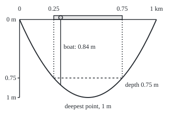
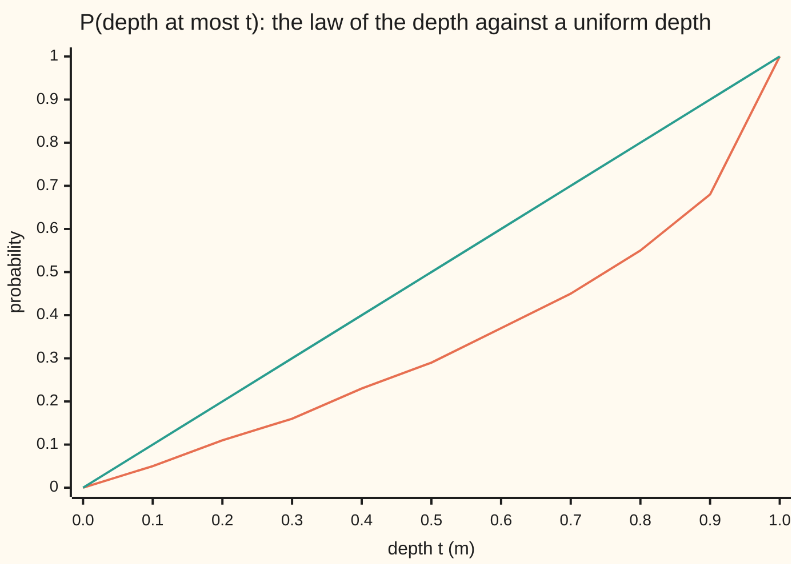

# Expectation as an integral: the average of X is the integral of X against the probability, and E[g(X)] can be computed on the line instead

[Syllabus](../../../SYLLABUS.md) → [Measure and integration](../../../SYLLABUS.md#w10) → [The Lebesgue Integral](../../../SYLLABUS.md#w10-s04) → Expectation as an integral

---

## General Overview

A river runs for 1 km. Its bed is a smooth trough: at distance x km from the first marker the water is 4x(1 − x) metres deep, 0 at both ends and exactly 1 m in the middle. A boat is moored at a point chosen uniformly at random along the stretch, so every 100 m of river is equally likely to hold it. How deep is the water under the boat, on average?

There are two ways to answer. The first walks the river: average the depth over every mooring point, weighting each stretch by its length. That gives 2/3 m. The second asks only how the depth itself is spread: how likely the boat is to sit in less than 0.5 m of water, and so on. That spread is a probability on the depth line, the **law** of the depth. Averaging against it gives 2/3 m too. The same holds for the average of the squared depth, 8/15 m^2, and so for the **variance**, the average squared distance from the mean: 4/45 m^2.

The probability wing already computes averages this way, as sums for counted outcomes and as density integrals for continuous ones ([Expectation](../../09-Probability%20and%20statistics/02-Random%20Variables/02-expectation.md)). This card makes both one integral, and proves that the two roads always agree, for any quantity computed from the depth.

**The expectation of a random quantity is its integral against the probability on the space of outcomes; for any Borel function g, the expectation of g of the quantity equals the integral of g against the quantity's law on the line, and the sum and density formulas are the two commonest cases of that one integral.**

**What kind of fact this is:** a definition (expectation, variance and moments as integrals) and a theorem, the change of variables formula, proved on this card in Why it works.

### The picture: the river, a boat and one set of mooring points

<p align="center"></p>

To scale: 280 drawing units per km across (0 km at 40, 1 km at 320) and 160 per metre of depth down (the surface at 40, 1 m at 200). The bed is the exact parabola, drawn as one quadratic curve with control point (180, 360). The shaded stretch, 110 to 250, is every mooring point with at least 0.75 m under the boat: 0.5 km, so the probability of that depth is 0.5. The boat at 0.3 km (x = 124) sits over 0.84 m.

---

## The formula

Notation first, in words. The river is the **outcome space** $\Omega$ (omega), here the interval [0, 1] in km, and a mooring point is $\omega$. The sets we allow ourselves to measure are the Borel sets of [0, 1], written $\mathcal F$. The probability $P$ gives each such set its length, so $P$ of the whole river is 1. The depth under the boat is the function $X(\omega) = 4\omega(1-\omega)$. A **random variable** is a measurable function on $\Omega$, and $X$ is one because it is continuous. A **Borel function** $g$ on the line is one for which every set $\{t : g(t) \in B\}$ with B Borel is itself Borel. $\int X\,dP$ is the integral of X against P, built on this shelf from simple functions ([The integral of a non-negative function](02-integral-of-a-nonnegative-function.md)). The **law** of X, $\mu_X = P\circ X^{-1}$, is the probability on the depth line that gives a set B of depths the probability that the depth lands in B ([The law of a random variable](../03-Measurable%20Functions/05-pushforward-and-the-law.md)).

The definition:

$$E[X] \;=\; \int_\Omega X\,dP ,$$

for $X \ge 0$ (the value $+\infty$ allowed) or for $X$ integrable, meaning $\int_\Omega \lvert X\rvert\,dP < \infty$ ([Integrable functions](04-integrable-functions-and-l1.md)).

**Read it aloud:** the expected value of X is the integral of X against the probability, over all outcomes.

The theorem, the **change of variables formula**:

$$E[g(X)] \;=\; \int_\Omega g\big(X(\omega)\big)\,P(d\omega) \;=\; \int_{\mathbb R} g(t)\,\mu_X(dt),$$

for every Borel function $g$ that is non-negative, or for which either side is finite with $\lvert g\rvert$ in place of $g$. Writing $P(d\omega)$ for dP names the variable integrated over, the mooring point; $\mu_X(dt)$ likewise names the depth t.

**Read it aloud:** to average g of the depth, either average over the river, or average g over the depth line weighted by the law; the two agree.

Two special cases are the formulas of the probability wing. If the law sits on countably many values $x_i$ with probabilities $p_i$, the integral on the line is a sum. If the law has a **density** $f$, meaning $\mu_X(B) = \int_B f\,d\lambda$ for every Borel set B, where $\lambda$ is length on the line, the integral is a density integral:

$$E[g(X)] = \sum_i g(x_i)\,p_i \qquad\text{or}\qquad E[g(X)] = \int_{\mathbb R} g(t)\,f(t)\,dt .$$

Variance and moments are expectations too, so they are integrals: the **k-th moment** is $E[X^k] = \int t^k\,\mu_X(dt)$, and

$$\operatorname{Var}(X) = E\big[(X - E[X])^2\big] = E[X^2] - E[X]^2 .$$

On the river the law has distribution function $F_X(t) = P(X \le t) = 1 - \sqrt{1-t}$ for depths t from 0 to 1 m, and density $f(t) = 1/(2\sqrt{1-t})$.

| Symbol | Plain meaning | In our example | Push it up and the answer… |
| --- | --- | --- | --- |
| $\Omega$, $\omega$, $x$ | the outcome space; one outcome, first written x, a distance in km | the river [0, 1] km; a mooring point | — |
| $\mathcal F$, $P$ | the measurable sets; the probability on them | Borel sets of the river; length | P of a stretch grows with its length |
| $X$ | a random variable: a measurable function on the outcomes | depth 4ω(1 − ω) m; 0.84 at 0.3 km | a deeper bed, a larger E[X] |
| $E[X]$ | the expectation: the integral of X against P | 2/3 = 0.6667 m | — |
| $\mu_X$ | the law of X: μ_X(B) = P(X in B) | μ_X of [0.75, 1] is 0.5 | more weight on deep values, larger E[X] |
| $g$ | a Borel function of the value | t^2, a gauge's rounding, a payout | — |
| $t$, $B$, $B_i$ | a point and sets on the value line | a depth in metres; the depths from 0.75 to 1 | — |
| $F_X$ | distribution function, P(X ≤ t) | 1 − √(1 − t); 0.2929 at t = 0.5 | — |
| $a$, $u$ | where the depth first reaches t; the substitution u = √(1 − t), equal to P(X ≥ t) | 0.25 km and 0.5 at t = 0.75 | — |
| $f$, $\lambda$ | a density of the law; length on the line | 1/(2√(1 − t)); f(0.5) = 0.7071 | — |
| $x_i$, $p_i$, $S$ | the values of a countable law, their probabilities, the set of them | gauge reading 0.75 m, probability 0.5 | — |
| $\mathbf 1_B$, $s_n$ | indicator, one on B and zero off it; a simple function below g | the gauge rounding down to 2^−n m | larger n, closer to g |
| $\operatorname{Var}(X)$, $k$ | variance; the order of a moment | 4/45 = 0.0889 m^2; k = 1 to 4 | — |
| $a_i$, $m$, $\varepsilon$ | proof letters: a simple function's values and their count (Claim 2), m also the mean (Claim 9); a gap below 1 m (Claim 8) | m = 2/3 in Claim 9 | — |

### When it holds

- **X measurable for the sigma-algebra of the outcome space.** Without it "X lands in B" need not be a measurable set, and the law is not defined. A depth continuous in the mooring point passes.
- **g Borel.** Then g(X) is measurable and has an expectation to compare. Continuous functions, indicators of Borel sets and rounding all qualify.
- **g non-negative, or g(X) integrable.** Drop this and neither side has a value. A payout of (−2)^k on the depth band k (defined in Worked numbers) gives running totals 1/2, 0, 1/2, 0, … as deeper bands are added: no limit, no expectation.
- **P a probability, total 1.** The transfer holds for any measure; the word "average" needs total 1. Measure the river in metres instead, total 1000, and the same integral is the cross-section area, 666.67 m^2, not a mean depth.
- **The density formula needs a density.** The quarter-metre gauge reading below puts probability 0.5 on the single value 0.75 m; a density integral over a single point is 0, so that reading has no density, and only the sum formula applies to it.

---

## Why it works

### Step 0: the law is built so that yes-or-no questions agree

The whole proof rests on one line. "Is the depth in B?" is a yes-or-no question about the boat. On the river its answer is the set of mooring points $X^{-1}(B)$, with probability $P(X^{-1}(B))$. On the line it is $\mu_X(B)$. These are equal because that is how the law is defined. So for an indicator, $g = \mathbf 1_B$, both sides of the formula are the same number. Everything else is the integral's own construction, climbed once on each side: indicators, then simple functions, then non-negative functions by monotone limits, then signed ones.

### Step 1: the expectation on the river

$X$ is continuous and bounded, so it is measurable and integrable. For a continuous function on a closed interval the Lebesgue integral equals the Riemann integral ([Riemann meets Lebesgue](05-riemann-meets-lebesgue.md)), so

$$E[X] = \int_0^1 (4\omega - 4\omega^2)\,d\omega = 2 - \tfrac43 = \tfrac23\ \text{m}.$$

The second moment is the same kind of polynomial integral: $16\int_0^1 \omega^2(1-\omega)^2\,d\omega = 16\left(\tfrac13 - \tfrac12 + \tfrac15\right) = \tfrac{8}{15}$.

### Step 2: simple functions transfer, and the sum formula is this case

A depth gauge marked only in quarter metres reads the depth rounded down: the reading is $R = g(X)$ with $g(t)$ the largest multiple of 0.25 at most t. This $g$ is simple: finitely many values, each on a Borel set of depths. The reading is 0.75 m exactly when the depth is at least 0.75 m. On the river that is the stretch 0.25 to 0.75 km, of length 0.5. On the line it is $\mu_X([0.75, 1])$, which is 0.5 because the law is defined that way.

Each value of a simple function carries its indicator across, and the integral of a simple function is linear ([The integral of a simple function](01-integral-of-a-simple-function.md)), so the whole reading carries across:

$$E[R] = 0 \times 0.1340 + 0.25 \times 0.1589 + 0.5 \times 0.2071 + 0.75 \times 0.5000 = 0.5183\ \text{m}.$$

That line is the probability wing's sum formula. Here it is a theorem about one integral, not a separate definition. It is also the quarter-metre staircase of [The integral of a simple function](01-integral-of-a-simple-function.md), 0.5183, read as an average instead of an area.

### Step 3: non-negative functions, by monotone limits

Refine the gauge: the reading rounded down to $2^{-n}$ m is a simple function $s_n$ of the depth, and it rises to the true depth as n grows, never overshooting and never more than $2^{-n}$ below. The monotone convergence theorem ([The monotone convergence theorem](03-monotone-convergence-theorem.md)) lets the limit pass through the integral on each side. Each $s_n$ transfers by Step 2, so the limits agree.

Each mark the depth reaches adds $2^{-n}$ to the reading, so the gauge's average is $2^{-n}$ times the sum, over the marks t, of $P(X \ge t)$. The code finds each $P(X \ge t)$ twice: on the river, by measuring the stretch at least t deep, and on the line, from the law's tail $\sqrt{1-t}$. With infinitely fine marks the sum becomes $\int_0^1 P(X \ge t)\,dt = 2/3$, proved in general in [The layer-cake formula](../06-Product%20Measures%20and%20Fubini/06-layer-cake-and-tail-integrals.md).

| gauge step | on the river | against the law | short of 2/3 by |
| --- | --- | --- | --- |
| 0.5 m (n = 1) | 0.353553 | 0.353553 | 0.313113 |
| 0.25 m (n = 2) | 0.518283 | 0.518283 | 0.148384 |
| 1/16 m (n = 4) | 0.632331 | 0.632331 | 0.034335 |
| 1/256 m (n = 8) | 0.664663 | 0.664663 | 0.002003 |
| 1/1024 m (n = 10) | 0.666172 | 0.666172 | 0.000495 |

Every row agrees to the printed digits, and each gap stays below its bound $2^{-n}$.

### Step 4: signed functions, by splitting

A signed g is its positive part minus its negative part, each non-negative. Step 3 applied to $\lvert g\rvert$ shows that g(X) is integrable on the river exactly when g is integrable against the law. Step 3 applied to each part then gives two finite numbers on each side; subtracting finishes.

### Step 5: the law of the depth, and the density formula

Solve $4\omega(1-\omega) = t$: the roots are $\omega = (1 \pm \sqrt{1-t})/2$. The depth is at most t near the banks, on $[0, a]$ and $[1-a, 1]$ with $a = (1 - \sqrt{1-t})/2$, a total length of $1 - \sqrt{1-t}$. That is $F_X(t)$. Its slope is the density $f(t) = 1/(2\sqrt{1-t})$, which reaches 5.0000 at t = 0.99 and has no bound near 1 m: the flat middle of the trough spends a long stretch near 1 m.



Caption: the orange curve is the law's distribution function $1 - \sqrt{1-t}$, plotted to two decimals, which both checks also measure on the river; the green line is what a depth spread evenly over 0 to 1 m would give. The law lies below the line: less probability on shallow water, more on deep.

A density turns the law into length weighted by f. For an indicator that is the definition of a density; the ladder of Steps 2 to 4 carries it to every g. So $E[g(X)] = \int g(t) f(t)\,dt$, the probability wing's density formula ([Densities](../../09-Probability%20and%20statistics/04-Continuous%20Distributions/01-densities-and-cdfs.md)). On the river, put $u = \sqrt{1-t}$; then $t^k f(t)\,dt$ becomes $(1-u^2)^k\,du$, and

$$E[X] = \int_0^1 (1 - u^2)\,du = \tfrac23, \qquad E[X^2] = \int_0^1 (1-u^2)^2\,du = 1 - \tfrac23 + \tfrac15 = \tfrac{8}{15}.$$

The same numbers as Step 1, by arithmetic that never touches the river. As a Riemann integral, $\int_0^1 t\,f(t)\,dt$ is improper, since f has no bound; as a Lebesgue integral it needs nothing extra.

### Step 6: variance and moments

The variance is the expectation of $(X - E[X])^2$, so it is an integral. Expanding the square and using linearity:

$$\operatorname{Var}(X) = E[X^2] - E[X]^2 = \tfrac{8}{15} - \tfrac49 = \tfrac{4}{45} = 0.0889\ \text{m}^2,$$

a standard deviation of 0.2981 m. Linearity needs $X^2$ integrable; a bounded depth guarantees it. The code integrates $(X - 2/3)^2$ directly on the river and gets 4/45 without the shortcut. Moments of every order come the same way: on both roads $E[X^3] = 16/35$ and $E[X^4] = 128/315$.

<details>
<summary>Detailed proof</summary>

Setting: $(\Omega, \mathcal F, P)$ a probability space, $X$ an $\mathcal F$-measurable real function, $\mu_X(B) = P(X^{-1}(B))$ for Borel $B$, a probability on $\mathcal B(\mathbb R)$ ([The law of a random variable](../03-Measurable%20Functions/05-pushforward-and-the-law.md)).

**Claim 1: indicators.** For Borel $B$, $\mathbf 1_B(X(\omega)) = 1$ exactly when $\omega \in X^{-1}(B)$, so $\mathbf 1_B \circ X = \mathbf 1_{X^{-1}(B)}$. The integral of an indicator is the measure of its set ([The integral of a simple function](01-integral-of-a-simple-function.md)), so $\int \mathbf 1_B \circ X\,dP = P(X^{-1}(B)) = \mu_X(B) = \int \mathbf 1_B\,d\mu_X$.

**Claim 2: simple functions.** Let $g = \sum_{i=1}^m a_i \mathbf 1_{B_i}$ with $a_i \ge 0$ and $B_i$ Borel. Then $g \circ X = \sum a_i \mathbf 1_{X^{-1}(B_i)}$, a non-negative simple function on $\Omega$, since each $X^{-1}(B_i)$ is in $\mathcal F$. The integral of a simple function does not depend on how it is written and is linear (same card), so $\int g\circ X\,dP = \sum a_i P(X^{-1}(B_i)) = \sum a_i \mu_X(B_i) = \int g\,d\mu_X$ by Claim 1.

**Claim 3: non-negative Borel g, values in $[0, \infty]$.** Let $s_n = \min\big(n, 2^{-n}\lfloor 2^n g\rfloor\big)$. Each $s_n$ is simple and Borel, and $s_n \uparrow g$ pointwise ([Simple functions](../03-Measurable%20Functions/03-simple-functions-and-approximation.md)). Then $s_n \circ X \uparrow g \circ X$ at every $\omega$. By the monotone convergence theorem on $(\Omega, P)$ and again on $(\mathbb R, \mu_X)$ ([The monotone convergence theorem](03-monotone-convergence-theorem.md)), $\int g\circ X\,dP = \lim_n \int s_n\circ X\,dP = \lim_n \int s_n\,d\mu_X = \int g\,d\mu_X$, the middle equality by Claim 2. Both sides may be $+\infty$, and then both are.

**Claim 4: integrable g.** Claim 3 for $\lvert g\rvert$ gives $\int \lvert g\circ X\rvert\,dP = \int \lvert g\rvert\,d\mu_X$, so one is finite exactly when the other is. Write $g = g^+ - g^-$ with $g^+ = \max(g, 0)$ and $g^- = \max(-g, 0)$; then $(g\circ X)^\pm = g^\pm \circ X$. Claim 3 for each part gives equal finite integrals on both sides, and the integral of an integrable function is the difference of its parts' integrals ([Integrable functions](04-integrable-functions-and-l1.md)).

**Claim 5: the sum formula.** Suppose $\mu_X(S) = 1$ for a countable set $S = \{x_1, x_2, \ldots\}$, with $p_i = \mu_X(\{x_i\})$. For $g \ge 0$, $g\,\mathbf 1_S = \sum_i g(x_i)\mathbf 1_{\{x_i\}}$, and the partial sums rise to it; Claim 2 and monotone convergence give $\int g\,\mathbf 1_S\,d\mu_X = \sum_i g(x_i)p_i$. Off $S$ the law has measure zero, so the integral of $g\,\mathbf 1_{\mathbb R\setminus S}$ is 0. Signed g follows by Claim 4.

**Claim 6: the density formula.** Suppose $f \ge 0$ is Borel and $\mu_X(B) = \int_B f\,d\lambda$ for every Borel $B$. For $g = \mathbf 1_B$ this is $\int g\,d\mu_X = \int g f\,d\lambda$. Linearity extends it to simple g; for $g \ge 0$, $s_n f \uparrow g f$, so monotone convergence on both sides extends it; Claim 4's splitting handles g with $\int \lvert g\rvert f\,d\lambda < \infty$.

**Claim 7: the river's law has density $f(t) = 1/(2\sqrt{1-t})$ on [0, 1).** For $0 \le t \le 1$, $4\omega(1-\omega) \le t$ iff $4\omega^2 - 4\omega + t \ge 0$ iff $\omega \le a$ or $\omega \ge 1 - a$, with $a = (1 - \sqrt{1-t})/2$ the smaller root. So $F_X(t) = 2a = 1 - \sqrt{1-t}$, with $F_X(t) = 0$ below 0 and 1 above 1. For $t < 1$, $\int_0^t f\,d\lambda = 1 - \sqrt{1-t}$ by the fundamental theorem of calculus, and at $t = 1$ monotone convergence gives 1. So the law and the measure $B \mapsto \int_B f\,d\lambda$ agree on every ray $(-\infty, t]$. The rays form a pi-system generating the Borel sets, and two probabilities agreeing on such a pi-system agree on all Borel sets ([Pi-systems and Dynkin's theorem](../01-Sets%20You%20Can%20Measure/06-pi-systems-and-uniqueness.md)).

**Claim 8: the moments on the line.** For $k \ge 1$ and $0 < \varepsilon < 1$, the substitution $u = \sqrt{1-t}$ on $[0, 1-\varepsilon]$ gives $\int_0^{1-\varepsilon} t^k f(t)\,dt = \int_{\sqrt\varepsilon}^1 (1-u^2)^k\,du$, since $dt = -2u\,du$ and $f(t) = 1/(2u)$. The integrand is non-negative, so monotone convergence as $\varepsilon \to 0$ gives $E[X^k] = \int_0^1 (1-u^2)^k\,du$. Expanding by the binomial theorem: $1 - \tfrac13 = \tfrac23$ for $k = 1$ and $1 - \tfrac23 + \tfrac15 = \tfrac8{15}$ for $k = 2$.

**Claim 9: variance.** If $E[X^2] < \infty$, then X is integrable (since $\lvert X\rvert \le 1 + X^2$), and $(X - m)^2 = X^2 - 2mX + m^2$ with $m = E[X]$. Linearity of the integral gives $E[(X-m)^2] = E[X^2] - 2m^2 + m^2 = E[X^2] - m^2$.

</details>

---

## Worked numbers, by hand

| Step | Arithmetic | Value |
| --- | --- | --- |
| E[X] on the river | integral of 4ω − 4ω^2 over [0, 1]: 2 − 4/3 | 2/3 m |
| the law at 0.75 m | P(X ≤ 0.75) = 1 − √0.25 | 0.5 |
| the density at 0.5 m | 1/(2√0.5) | 0.7071 per m |
| E[X] on the line | integral of (1 − u^2) over [0, 1]: 1 − 1/3 | 2/3 m |
| E[X^2] on the river | 16 × (1/3 − 1/2 + 1/5) = 16/30 | 8/15 m^2 |
| E[X^2] on the line | 1 − 2/3 + 1/5 | 8/15 m^2 |
| variance | 8/15 − 4/9 = 24/45 − 20/45 | **4/45 = 0.0889 m^2** |
| standard deviation | √(4/45) | 0.2981 m |
| quarter-metre gauge | 0.25 × 0.1589 + 0.5 × 0.2071 + 0.75 × 0.5000 | 0.5183 m |

A randomly moored boat sits over 2/3 m of water on average, give or take 0.2981 m, on either road.

### What breaks if you drop a piece

| Mistake | Comes out at | What went wrong |
| --- | --- | --- |
| Integrate the depth against length on [0, 1] m, not against the law | 1/2 m, not 2/3 | the depth is not spread evenly; its law puts more weight on deep water |
| Take (E[X])^2 for E[X^2] | 4/9 = 0.4444, not 8/15 = 0.5333; the variance would be 0 | the average of a square is not the square of the average |
| Drop integrability: pay (−2)^k on depth band k | totals 1/2, 0, 1/2, 0, 1/2, 0 after 1 to 6 bands | each band adds 1/2 in size, so both parts are infinite and the expectation has no value |

Depth band k is the depths from $1 - 4^{-k}$ to $1 - 4^{-(k+1)}$ m: band 0 is 0 to 0.75 m, band 1 is 0.75 to 0.9375 m. Band k has probability $2^{-k-1}$, so its payout times its probability is ±1/2, on both roads. The code prints all three.

---

## Code, from first principles, and it actually runs

The code takes four roads. Road one integrates powers of the depth over the river, in exact fractions. Road two integrates against the law after the substitution $u = \sqrt{1-t}$, also exactly, sharing no polynomial with road one. Road three averages each gauge twice: on the river, by bisecting for where the depth passes each mark, and on the line, from the law's tail. Road four moors 100000 boats with a SplitMix64 generator, seed 2026, written out in both languages. The code checks four moments, seven gauges and one simulation; that the transfer holds for every Borel g on every probability space is what the proof shows.

### Python

```python
# Expectation as an integral -- the check behind the card.  Standard library
# only.  A boat is moored at a uniformly random point w of a 1 km river; the
# depth there is X(w) = 4w(1 - w) metres.  E[X], E[X^2] and the variance are
# found on the river (the outcome space) and on the line (against the law of
# X) by roads that share no arithmetic, then checked by a seeded simulation.
from fractions import Fraction as Fr
from math import sqrt, isqrt

def depth(w):
    return 4 * w * (1 - w)

def mul(p, q):                          # multiply polynomials, lowest power first
    out = [Fr(0)] * (len(p) + len(q) - 1)
    for i, a in enumerate(p):
        for j, b in enumerate(q):
            out[i + j] += a * b
    return out

def integral01(p):                      # integral from 0 to 1: w^m gives 1/(m + 1)
    return sum(c * Fr(1, m + 1) for m, c in enumerate(p))

def power(p, k):
    out = [Fr(1)]
    for _ in range(k):
        out = mul(out, p)
    return out

# road 1, on the river: E[X^k] is the length-integral of (4w - 4w^2)^k over [0, 1]
river = {k: integral01(power([Fr(0), Fr(4), Fr(-4)], k)) for k in range(1, 5)}
# road 2, on the line: the law has P(X > t) = sqrt(1 - t); with u = sqrt(1 - t) the
# density integral of t^k becomes the integral of (1 - u^2)^k over [0, 1]
line = {k: integral01(power([Fr(1), Fr(0), Fr(-1)], k)) for k in range(1, 5)}
mean = river[1]
var_river = integral01(power([-mean, Fr(4), Fr(-4)], 2))   # integral of (X - E[X])^2 directly
var_line = line[2] - line[1] ** 2                         # E[X^2] - E[X]^2, on the line
print("moment k | on the river | on the line | decimal")
for k in range(1, 5):
    print(f"E[X^{k}]   | {str(river[k]):>12} | {str(line[k]):>11} | {float(line[k]):.4f}")
print(f"variance: river E[(X - 2/3)^2] = {var_river}, line E[X^2] - E[X]^2 = {var_line}; "
      f"= {float(var_line):.4f} m^2, sd {sqrt(var_line):.4f} m")
print(f"cross-section area: mean depth x 1000 m = {float(mean * 1000):.2f} m^2")

def root(t, lo, hi):                    # where the depth equals t, by bisection
    up = depth(lo) < depth(hi)
    for _ in range(80):
        mid = (lo + hi) / 2
        if (depth(mid) < t) == up:
            lo = mid
        else:
            hi = mid
    return (lo + hi) / 2

def river_tail(t):                      # P(X >= t): the length of the stretch at least t deep
    return root(t, 0.5, 1.0) - root(t, 0.0, 0.5)

def law_tail(t):                        # the same number read off the law's formula
    return sqrt(1 - t)

print("cdf, t | law 1 - sqrt(1 - t) | river 1 - length | uniform t")
for i in range(11):
    t = i / 10
    print(f"cdf, {t:.1f} | {1 - law_tail(t):.4f} | {1 - river_tail(t):.4f} | {t:.4f}")
print("chart, law at t = 0.0 to 1.0, two decimals: " + ", ".join(f"{1 - law_tail(i / 10):.2f}" for i in range(11)))
print("gauge floor(2^n X)/2^n | integral on the river | against the law | gap to 2/3")
sums = []
for n in (1, 2, 3, 4, 6, 8, 10):
    h = 2.0 ** -n
    on_river = sum(h * river_tail(k * h) for k in range(1, 2 ** n))
    on_line = sum(h * law_tail(k * h) for k in range(1, 2 ** n))
    sums.append((n, on_river, on_line))
    print(f"n = {n:2} | {on_river:.6f} | {on_line:.6f} | {2 / 3 - on_line:.6f}")
probs = [law_tail(v / 4) - law_tail((v + 1) / 4) for v in range(4)]
print("quarter-metre gauge R, sum formula: P(R = 0, 0.25, 0.5, 0.75) = "
      + ", ".join(f"{p:.4f}" for p in probs)
      + f"; E[R] = {sum(v / 4 * p for v, p in enumerate(probs)):.4f}")
print(f"density f(t) = 1/(2 sqrt(1 - t)): f(0.5) = {1 / (2 * law_tail(0.5)):.4f}, "
      f"f(0.99) = {1 / (2 * law_tail(0.99)):.4f}")

state, s1, s2, N = 2026, 0.0, 0.0, 100000   # SplitMix64, seed 2026
for _ in range(N):
    state = (state + 0x9E3779B97F4A7C15) % 2 ** 64
    z = ((state ^ (state >> 30)) * 0xBF58476D1CE4E5B9) % 2 ** 64
    z = ((z ^ (z >> 27)) * 0x94D049BB133111EB) % 2 ** 64
    x = depth(((z ^ (z >> 31)) >> 11) / 2 ** 53)
    s1 += x
    s2 += x * x
sim_mean, sim_var = s1 / N, s2 / N - (s1 / N) ** 2
print(f"simulation, {N} boats: mean {sim_mean:.4f} m, variance {sim_var:.4f} m^2, "
      f"standard error {sqrt(4 / 45 / N):.4f} m")

def fsqrt(q):                           # exact square root of a square fraction
    return Fr(isqrt(q.numerator), isqrt(q.denominator))

total_line, total_river, cuts = Fr(0), 0.0, []
for k in range(6):                      # band k: 1 - 4^-k <= X < 1 - 4^-(k+1), payout (-2)^k
    a, b = 1 - Fr(1, 4 ** k), 1 - Fr(1, 4 ** (k + 1))
    size = 2 ** k * (fsqrt(1 - a) - fsqrt(1 - b))
    total_line += (-1) ** k * size
    total_river += (-2) ** k * (river_tail(float(a)) - river_tail(float(b)))
    cuts.append((total_line, total_river))
print(f"break, payout (-2)^k on depth band k: |payout| x probability per band {abs(size)}; "
      "totals after 1..6 bands " + ", ".join(str(c[0]) for c in cuts))
print(f"break, depth read as uniform on [0, 1] m: integral of t dt = {integral01([Fr(0), Fr(1)])}, not {mean}")
print(f"break, (E[X])^2 = {mean ** 2} = {float(mean ** 2):.4f} for E[X^2] = {river[2]} = {float(river[2]):.4f}")
print(f"figure, x = 40 + 280 w, y = 40 + 160 d; bed M 40 40 Q {40 + 280 * 0.5:.0f} "
      f"{40 + 160 * 2 * depth(0.5):.0f} 320 40; deepest ({40 + 280 * 0.5:.0f}, {40 + 160 * depth(0.5):.0f}); depth 0.75 at y {40 + 160 * 0.75:.0f}, "
      f"from x {40 + 280 * root(0.75, 0.0, 0.5):.0f} to {40 + 280 * root(0.75, 0.5, 1.0):.0f}; "
      f"boat at w = 0.3: depth {depth(0.3):.2f} m, x {40 + 280 * 0.3:.0f}, bed y {40 + 160 * depth(0.3):.0f}")
assert river == line and mean == Fr(2, 3)                      # two exact roads, four moments
assert var_river == var_line == Fr(4, 45)                      # variance two ways
assert all(abs(r - l) < 1e-12 for _, r, l in sums)             # simple functions transfer
assert all(0 < 2 / 3 - l <= 2.0 ** -n for n, _, l in sums)      # the gap obeys its 2^-n bound
assert abs(sim_mean - 2 / 3) < 4 * sqrt(4 / 45 / N) and abs(sim_var - 4 / 45) < 0.0012
assert all(abs(float(c) - r) < 1e-9 for c, r in cuts)
assert [c[0] for c in cuts] == [Fr(1, 2), 0] * 3
print("ALL CHECKS PASS")
```

**Ran 2026-10-07 on macOS, Python 3.14.6, standard library only. All checks passed. Output, pasted from the run:**

```
moment k | on the river | on the line | decimal
E[X^1]   |          2/3 |         2/3 | 0.6667
E[X^2]   |         8/15 |        8/15 | 0.5333
E[X^3]   |        16/35 |       16/35 | 0.4571
E[X^4]   |      128/315 |     128/315 | 0.4063
variance: river E[(X - 2/3)^2] = 4/45, line E[X^2] - E[X]^2 = 4/45; = 0.0889 m^2, sd 0.2981 m
cross-section area: mean depth x 1000 m = 666.67 m^2
cdf, t | law 1 - sqrt(1 - t) | river 1 - length | uniform t
cdf, 0.0 | 0.0000 | 0.0000 | 0.0000
cdf, 0.1 | 0.0513 | 0.0513 | 0.1000
cdf, 0.2 | 0.1056 | 0.1056 | 0.2000
cdf, 0.3 | 0.1633 | 0.1633 | 0.3000
cdf, 0.4 | 0.2254 | 0.2254 | 0.4000
cdf, 0.5 | 0.2929 | 0.2929 | 0.5000
cdf, 0.6 | 0.3675 | 0.3675 | 0.6000
cdf, 0.7 | 0.4523 | 0.4523 | 0.7000
cdf, 0.8 | 0.5528 | 0.5528 | 0.8000
cdf, 0.9 | 0.6838 | 0.6838 | 0.9000
cdf, 1.0 | 1.0000 | 1.0000 | 1.0000
chart, law at t = 0.0 to 1.0, two decimals: 0.00, 0.05, 0.11, 0.16, 0.23, 0.29, 0.37, 0.45, 0.55, 0.68, 1.00
gauge floor(2^n X)/2^n | integral on the river | against the law | gap to 2/3
n =  1 | 0.353553 | 0.353553 | 0.313113
n =  2 | 0.518283 | 0.518283 | 0.148384
n =  3 | 0.595630 | 0.595630 | 0.071036
n =  4 | 0.632331 | 0.632331 | 0.034335
n =  6 | 0.658458 | 0.658458 | 0.008208
n =  8 | 0.664663 | 0.664663 | 0.002003
n = 10 | 0.666172 | 0.666172 | 0.000495
quarter-metre gauge R, sum formula: P(R = 0, 0.25, 0.5, 0.75) = 0.1340, 0.1589, 0.2071, 0.5000; E[R] = 0.5183
density f(t) = 1/(2 sqrt(1 - t)): f(0.5) = 0.7071, f(0.99) = 5.0000
simulation, 100000 boats: mean 0.6675 m, variance 0.0891 m^2, standard error 0.0009 m
break, payout (-2)^k on depth band k: |payout| x probability per band 1/2; totals after 1..6 bands 1/2, 0, 1/2, 0, 1/2, 0
break, depth read as uniform on [0, 1] m: integral of t dt = 1/2, not 2/3
break, (E[X])^2 = 4/9 = 0.4444 for E[X^2] = 8/15 = 0.5333
figure, x = 40 + 280 w, y = 40 + 160 d; bed M 40 40 Q 180 360 320 40; deepest (180, 200); depth 0.75 at y 160, from x 110 to 250; boat at w = 0.3: depth 0.84 m, x 124, bed y 174
ALL CHECKS PASS
```

### Rust

Same numbers, same labels, built with `rustc --edition 2021 -O`. Exact fractions are pairs of 128-bit integers reduced by hand; the simulation repeats the Python's float steps in the same order.

```rust
// Expectation as an integral -- the same check as the Python, in Rust.  No
// crates.  A boat is moored at a uniformly random point w of a 1 km river; the
// depth there is X(w) = 4w(1 - w) metres.  Exact fractions are pairs of i128
// kept in lowest terms by hand; the float roads repeat the Python's steps.
type Q = (i128, i128);

fn gcd(a: i128, b: i128) -> i128 { if b == 0 { a.abs() } else { gcd(b, a % b) } }
fn q(n: i128, d: i128) -> Q { let g = gcd(n, d) * d.signum(); (n / g, d / g) }
fn add(a: Q, b: Q) -> Q { q(a.0 * b.1 + b.0 * a.1, a.1 * b.1) }
fn sub(a: Q, b: Q) -> Q { add(a, (-b.0, b.1)) }
fn mul(a: Q, b: Q) -> Q { q(a.0 * b.0, a.1 * b.1) }
fn show(a: Q) -> String { if a.1 == 1 { format!("{}", a.0) } else { format!("{}/{}", a.0, a.1) } }
fn fl(a: Q) -> f64 { a.0 as f64 / a.1 as f64 }
fn depth(w: f64) -> f64 { 4.0 * w * (1.0 - w) }

fn pmul(p: &[Q], r: &[Q]) -> Vec<Q> {            // multiply polynomials, lowest power first
    let mut out = vec![(0, 1); p.len() + r.len() - 1];
    for (i, &a) in p.iter().enumerate() {
        for (j, &b) in r.iter().enumerate() { out[i + j] = add(out[i + j], mul(a, b)); }
    }
    out
}
fn integral01(p: &[Q]) -> Q {                      // integral from 0 to 1: w^m gives 1/(m + 1)
    p.iter().enumerate().fold((0, 1), |s, (m, &c)| add(s, mul(c, (1, m as i128 + 1))))
}
fn power(p: &[Q], k: usize) -> Vec<Q> { (0..k).fold(vec![(1, 1)], |acc, _| pmul(&acc, p)) }

fn root(t: f64, mut lo: f64, mut hi: f64) -> f64 { // where the depth equals t, by bisection
    let up = depth(lo) < depth(hi);
    for _ in 0..80 {
        let mid = (lo + hi) / 2.0;
        if (depth(mid) < t) == up { lo = mid } else { hi = mid }
    }
    (lo + hi) / 2.0
}
fn river_tail(t: f64) -> f64 { root(t, 0.5, 1.0) - root(t, 0.0, 0.5) } // length at least t deep
fn law_tail(t: f64) -> f64 { (1.0 - t).sqrt() }                        // read off the law
fn isqrt(n: i128) -> i128 { let mut r = 0; while (r + 1) * (r + 1) <= n { r += 1 } r }
fn fsqrt(a: Q) -> Q { q(isqrt(a.0), isqrt(a.1)) }  // exact root of a square fraction

fn main() {
    // road 1, on the river: integrate (4w - 4w^2)^k over [0, 1]; road 2, on the line:
    // the law's density integral of t^k becomes, with u = sqrt(1 - t), (1 - u^2)^k
    let river: Vec<Q> = (1..5).map(|k| integral01(&power(&[(0, 1), (4, 1), (-4, 1)], k))).collect();
    let line: Vec<Q> = (1..5).map(|k| integral01(&power(&[(1, 1), (0, 1), (-1, 1)], k))).collect();
    let mean = river[0];
    let var_river = integral01(&power(&[(-mean.0, mean.1), (4, 1), (-4, 1)], 2));
    let var_line = sub(line[1], mul(line[0], line[0]));
    println!("moment k | on the river | on the line | decimal");
    for k in 0..4 {
        println!("E[X^{}]   | {:>12} | {:>11} | {:.4}", k + 1, show(river[k]), show(line[k]), fl(line[k]));
    }
    println!("variance: river E[(X - 2/3)^2] = {}, line E[X^2] - E[X]^2 = {}; = {:.4} m^2, sd {:.4} m",
             show(var_river), show(var_line), fl(var_line), fl(var_line).sqrt());
    println!("cross-section area: mean depth x 1000 m = {:.2} m^2", fl(mul(mean, (1000, 1))));
    println!("cdf, t | law 1 - sqrt(1 - t) | river 1 - length | uniform t");
    for i in 0..11 {
        let t = i as f64 / 10.0;
        println!("cdf, {:.1} | {:.4} | {:.4} | {:.4}", t, 1.0 - law_tail(t), 1.0 - river_tail(t), t);
    }
    println!("chart, law at t = 0.0 to 1.0, two decimals: {}",
             (0..11).map(|i| format!("{:.2}", 1.0 - law_tail(i as f64 / 10.0))).collect::<Vec<_>>().join(", "));
    println!("gauge floor(2^n X)/2^n | integral on the river | against the law | gap to 2/3");
    let mut sums: Vec<(i32, f64, f64)> = Vec::new();
    for n in [1, 2, 3, 4, 6, 8, 10] {
        let h = 2f64.powi(-n);
        let (mut on_river, mut on_line) = (0.0, 0.0);
        for k in 1..(1 << n) { on_river += h * river_tail(k as f64 * h); on_line += h * law_tail(k as f64 * h); }
        sums.push((n, on_river, on_line));
        println!("n = {:2} | {:.6} | {:.6} | {:.6}", n, on_river, on_line, 2.0 / 3.0 - on_line);
    }
    let probs: Vec<f64> = (0..4).map(|v| law_tail(v as f64 / 4.0) - law_tail((v + 1) as f64 / 4.0)).collect();
    let e_r = probs.iter().enumerate().fold(0.0, |s, (v, p)| s + v as f64 / 4.0 * p);
    println!("quarter-metre gauge R, sum formula: P(R = 0, 0.25, 0.5, 0.75) = {}; E[R] = {:.4}",
             probs.iter().map(|p| format!("{:.4}", p)).collect::<Vec<_>>().join(", "), e_r);
    println!("density f(t) = 1/(2 sqrt(1 - t)): f(0.5) = {:.4}, f(0.99) = {:.4}",
             1.0 / (2.0 * law_tail(0.5)), 1.0 / (2.0 * law_tail(0.99)));
    let (mut state, mut s1, mut s2, n) = (2026u64, 0.0f64, 0.0f64, 100000); // SplitMix64, seed 2026
    for _ in 0..n {
        state = state.wrapping_add(0x9E3779B97F4A7C15);
        let mut z = (state ^ (state >> 30)).wrapping_mul(0xBF58476D1CE4E5B9);
        z = (z ^ (z >> 27)).wrapping_mul(0x94D049BB133111EB);
        let x = depth(((z ^ (z >> 31)) >> 11) as f64 / 9007199254740992.0);
        s1 += x;
        s2 += x * x;
    }
    let (sim_mean, sim_var) = (s1 / n as f64, s2 / n as f64 - (s1 / n as f64).powi(2));
    let se = (4.0 / 45.0 / n as f64).sqrt();
    println!("simulation, {} boats: mean {:.4} m, variance {:.4} m^2, standard error {:.4} m", n, sim_mean, sim_var, se);
    let (mut total_line, mut total_river, mut cuts, mut size) = ((0, 1), 0.0, Vec::new(), (0, 1));
    for k in 0..6u32 {                             // band k: 1 - 4^-k <= X < 1 - 4^-(k+1), payout (-2)^k
        let (a, b) = (sub((1, 1), (1, 4i128.pow(k))), sub((1, 1), (1, 4i128.pow(k + 1))));
        size = mul((2i128.pow(k), 1), sub(fsqrt(sub((1, 1), a)), fsqrt(sub((1, 1), b))));
        total_line = add(total_line, mul(((-1i128).pow(k), 1), size));
        total_river += (-2f64).powi(k as i32) * (river_tail(fl(a)) - river_tail(fl(b)));
        cuts.push((total_line, total_river));
    }
    println!("break, payout (-2)^k on depth band k: |payout| x probability per band {}; totals after 1..6 bands {}",
             show(size), cuts.iter().map(|c| show(c.0)).collect::<Vec<_>>().join(", "));
    println!("break, depth read as uniform on [0, 1] m: integral of t dt = {}, not {}", show(integral01(&[(0, 1), (1, 1)])), show(mean));
    println!("break, (E[X])^2 = {} = {:.4} for E[X^2] = {} = {:.4}", show(mul(mean, mean)), fl(mul(mean, mean)), show(river[1]), fl(river[1]));
    println!("figure, x = 40 + 280 w, y = 40 + 160 d; bed M 40 40 Q {:.0} {:.0} 320 40; deepest ({:.0}, {:.0}); depth 0.75 at y {:.0}, from x {:.0} to {:.0}; \
              boat at w = 0.3: depth {:.2} m, x {:.0}, bed y {:.0}",
             40.0 + 280.0 * 0.5, 40.0 + 160.0 * 2.0 * depth(0.5), 40.0 + 280.0 * 0.5, 40.0 + 160.0 * depth(0.5),
             40.0 + 160.0 * 0.75, 40.0 + 280.0 * root(0.75, 0.0, 0.5), 40.0 + 280.0 * root(0.75, 0.5, 1.0),
             depth(0.3), 40.0 + 280.0 * 0.3, 40.0 + 160.0 * depth(0.3));
    assert!(river == line && mean == (2, 3));                       // two exact roads, four moments
    assert!(var_river == var_line && var_line == (4, 45));          // variance two ways
    assert!(sums.iter().all(|&(_, r, l)| (r - l).abs() < 1e-12));   // simple functions transfer
    assert!(sums.iter().all(|&(n, _, l)| 0.0 < 2.0 / 3.0 - l && 2.0 / 3.0 - l <= 2f64.powi(-n)));
    assert!((sim_mean - 2.0 / 3.0).abs() < 4.0 * se && (sim_var - 4.0 / 45.0).abs() < 0.0012);
    assert!(cuts.iter().all(|c| (fl(c.0) - c.1).abs() < 1e-9));
    assert!(cuts.iter().enumerate().all(|(i, c)| c.0 == if i % 2 == 0 { (1, 2) } else { (0, 1) }));
    println!("ALL CHECKS PASS");
}
```

**Ran 2026-10-07 on macOS, rustc 1.98.1, no crates. All checks passed. Output, pasted from the run:**

```
moment k | on the river | on the line | decimal
E[X^1]   |          2/3 |         2/3 | 0.6667
E[X^2]   |         8/15 |        8/15 | 0.5333
E[X^3]   |        16/35 |       16/35 | 0.4571
E[X^4]   |      128/315 |     128/315 | 0.4063
variance: river E[(X - 2/3)^2] = 4/45, line E[X^2] - E[X]^2 = 4/45; = 0.0889 m^2, sd 0.2981 m
cross-section area: mean depth x 1000 m = 666.67 m^2
cdf, t | law 1 - sqrt(1 - t) | river 1 - length | uniform t
cdf, 0.0 | 0.0000 | 0.0000 | 0.0000
cdf, 0.1 | 0.0513 | 0.0513 | 0.1000
cdf, 0.2 | 0.1056 | 0.1056 | 0.2000
cdf, 0.3 | 0.1633 | 0.1633 | 0.3000
cdf, 0.4 | 0.2254 | 0.2254 | 0.4000
cdf, 0.5 | 0.2929 | 0.2929 | 0.5000
cdf, 0.6 | 0.3675 | 0.3675 | 0.6000
cdf, 0.7 | 0.4523 | 0.4523 | 0.7000
cdf, 0.8 | 0.5528 | 0.5528 | 0.8000
cdf, 0.9 | 0.6838 | 0.6838 | 0.9000
cdf, 1.0 | 1.0000 | 1.0000 | 1.0000
chart, law at t = 0.0 to 1.0, two decimals: 0.00, 0.05, 0.11, 0.16, 0.23, 0.29, 0.37, 0.45, 0.55, 0.68, 1.00
gauge floor(2^n X)/2^n | integral on the river | against the law | gap to 2/3
n =  1 | 0.353553 | 0.353553 | 0.313113
n =  2 | 0.518283 | 0.518283 | 0.148384
n =  3 | 0.595630 | 0.595630 | 0.071036
n =  4 | 0.632331 | 0.632331 | 0.034335
n =  6 | 0.658458 | 0.658458 | 0.008208
n =  8 | 0.664663 | 0.664663 | 0.002003
n = 10 | 0.666172 | 0.666172 | 0.000495
quarter-metre gauge R, sum formula: P(R = 0, 0.25, 0.5, 0.75) = 0.1340, 0.1589, 0.2071, 0.5000; E[R] = 0.5183
density f(t) = 1/(2 sqrt(1 - t)): f(0.5) = 0.7071, f(0.99) = 5.0000
simulation, 100000 boats: mean 0.6675 m, variance 0.0891 m^2, standard error 0.0009 m
break, payout (-2)^k on depth band k: |payout| x probability per band 1/2; totals after 1..6 bands 1/2, 0, 1/2, 0, 1/2, 0
break, depth read as uniform on [0, 1] m: integral of t dt = 1/2, not 2/3
break, (E[X])^2 = 4/9 = 0.4444 for E[X^2] = 8/15 = 0.5333
figure, x = 40 + 280 w, y = 40 + 160 d; bed M 40 40 Q 180 360 320 40; deepest (180, 200); depth 0.75 at y 160, from x 110 to 250; boat at w = 0.3: depth 0.84 m, x 124, bed y 174
ALL CHECKS PASS
```

The two outputs match line for line. The simulation's mean, 0.6675 m, sits within one standard error, 0.0009 m, of 2/3; its variance is 0.0891 m^2.

> [!TIP]
> **Try changing**
> - **Deepen the river.** Guess first: with the river road's polynomial set to `[Fr(0), Fr(6), Fr(-6)]`, a 1.5 m trough, what is E[X]? Answer: the river road prints 1 and 6/5 for the first two moments; the line road still prints 2/3 and 8/15, because its law was worked out for the 1 m river, and the first assert stops the run.
> - **Fewer boats.** Guess first: with `N = 1000`, does the simulation still pass? Answer: the mean, 0.6718, stays inside four standard errors of 0.0094; the variance, 0.0865, misses the fixed tolerance of 0.0012, about four standard errors at 100000 boats, and the fifth assert stops the run.
> - **Tame the payout.** Guess first: pay (−1)^k instead of (−2)^k by removing `2 ** k *` from `size` and writing `(-1) ** k` in `total_river`. Answer: each band adds 2^−k−1 in size, the payout is integrable, and the totals 1/2, 1/4, 3/8, 5/16, 11/32, 21/64 settle toward 1/3; the last assert stops the run, since it pins the oscillation.

---

## The usual mistake

> [!warning]
> **Averaging over the values as if they were equally likely.** The depths run from 0 to 1 m, and their plain average is 1/2 m. The boat's average is 2/3 m. An expectation integrates against a probability, and the uniform spread on the depth line is not the law of the depth. Either integrate on the river, where the probability is length, or on the line against the law; never on the line against length.
>
> - **The square of the mean for the mean of the square.** (E[X])^2 = 4/9 = 0.4444; E[X^2] = 8/15 = 0.5333. The difference, 4/45, is the variance.
> - **A density read as a probability.** f(0.99) = 5.0000 is not a probability; P(X = 0.99) is 0. Only integrals of f over sets are probabilities.
> - **An expectation assumed to exist.** The (−2)^k payout has no expectation: cutting off at deeper bands gives 1/2, 0, 1/2, 0. Check $E\lvert g(X)\rvert < \infty$ first.
> - **Sums and densities as two definitions.** A reading that sits on four values, like the quarter-metre gauge, has no density, and the depth has no list of point probabilities; both are one integral against the law. Some laws are neither: a law spread over the Cantor set has no atoms and no density, and only the general integral reaches it.

---

## Where you meet it in real life

- **Simulation.** A Monte Carlo estimate averages g of simulated draws; it approximates the integral on the outcome space and needs no formula for the law. 100000 boats gave 0.6675 m.
- **Hydraulics.** Mean depth times width is the cross-section area: 2/3 m times 1000 m is 666.67 m^2, the same integral with length in place of probability.
- **Insurance and risk.** An expected loss is computed from the loss distribution, the law, without modelling every state of the world behind it.
- **Pricing.** A derivative's price is an expectation under a second probability on the same outcomes; the integral against a changed measure is [Densities and likelihood ratios](../08-Densities%20and%20Changing%20Measure/06-densities-and-likelihood-ratios.md).

> **Say it back**
> The expectation of a random quantity is its integral against the probability on the outcomes. Its law moves that probability onto the line, and the change of variables formula says any Borel function of the quantity can be averaged there instead. The proof climbs from yes-or-no questions, where the law is defined to agree, through simple functions and monotone limits to signed integrable functions. The sum and density formulas are the two commonest laws; variance and moments are more integrals of the same kind. A boat moored at random on the river sits over 2/3 m of water on average, with variance 4/45 m^2, by either road.

---

## What this builds on

- [Integrable functions](04-integrable-functions-and-l1.md): the integral of a signed function through its positive and negative parts, and when it is finite.
- [The law of a random variable](../03-Measurable%20Functions/05-pushforward-and-the-law.md): the law of X as a measure on the line.
- [Variance](../../09-Probability%20and%20statistics/02-Random%20Variables/03-variance-and-standard-deviation.md): variance as the average squared distance from the mean, and its shortcut.
- [Densities](../../09-Probability%20and%20statistics/04-Continuous%20Distributions/01-densities-and-cdfs.md): distribution functions and densities, used without measure.
- [Expectation](../../09-Probability%20and%20statistics/02-Random%20Variables/02-expectation.md): expectation as a weighted sum and a density integral, the two cases this card unifies.

## Where this goes next

- [Markov and Chebyshev](07-markov-and-chebyshev.md): an expectation bounds the probability of large values.
- [The layer-cake formula](../06-Product%20Measures%20and%20Fubini/06-layer-cake-and-tail-integrals.md): the expectation as the integral of the tail probability.
- [Jensen's inequality](../07-Sizes%20of%20Functions/04-jensens-inequality.md): why E[X^2] beats (E[X])^2, and every convex function does the same.
- [Densities and likelihood ratios](../08-Densities%20and%20Changing%20Measure/06-densities-and-likelihood-ratios.md): when a law has a density, and averaging under a changed probability.
- [Conditioning on a partition](../09-Conditional%20Expectation/01-conditioning-on-a-partition.md): expectations taken separately on each piece of a partition of the outcomes.
- States: expectation as a positive linear functional of total 1, a state.
- Characteristic functions: E[e^(iuX)], one integral against the law that determines the law.

The expectation is one number, 2/3 m; how rarely the depth can stray far from it, and how the variance 4/45 m^2 limits that, is [Markov and Chebyshev](07-markov-and-chebyshev.md).

---

## Sources

Verified 2026-09-29: every link below opens a page naming the cited work.

- Billingsley, Patrick. *Probability and Measure*, Anniversary Edition. Wiley, 2012. [Publisher page](https://www.wiley.com/en-us/Probability+and+Measure%2C+Anniversary+Edition-p-9781118122372). Sections 16 and 21: expected value as an integral and the change of variables through the distribution.
- Williams, David. *Probability with Martingales*. Cambridge University Press, 1991. [Publisher page](https://www.cambridge.org/core/books/probability-with-martingales/B4CFCE0D08930FB46C6E93E775503926). Chapters 5 and 6: expectation defined by the integral, and computed from the law.
- Axler, Sheldon. *Measure, Integration & Real Analysis*. Springer, Graduate Texts in Mathematics, 2020, open access. [Author's page with the free PDF](https://measure.axler.net/). Chapter 3: the integral built from simple functions and the monotone convergence theorem.
- Siegrist, Kyle. "Expected Value as an Integral." *Probability, Mathematical Statistics, and Stochastic Processes*, Random Services. [Chapter page](https://www.randomservices.org/random/expect/Integral.html). The change of variables theorem and density functions, stated for probability.
