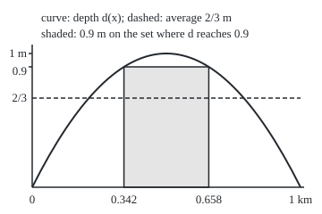
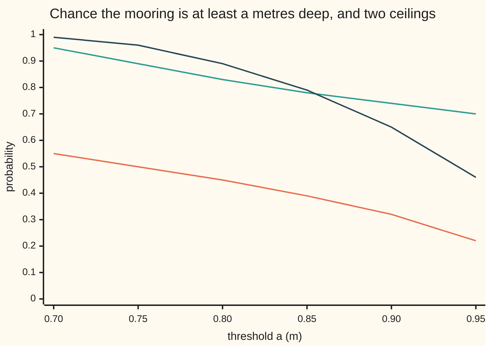

# Markov and Chebyshev: an average caps how often a quantity is large, a variance caps how far it strays

Measure and integration → The Lebesgue Integral → Tails from averages → Markov and Chebyshev

---

## General Overview

A river runs for 1 km between two bridges. Its depth at a point x km from the upstream bridge is 4x(1 − x) metres: dry at both bridges, 1 m in the middle. The river authority publishes one number: the average depth, 2/3 m. A boat is moored at a point chosen uniformly at random along the stretch.

How likely is the mooring to be deeper than 0.9 m? How likely is its depth to miss the average by more than half a metre, here meaning shallower than 1/6 m, where a keel drawing 1/6 m touches bottom? With the profile in hand the answers are 0.316 and 0.087. With only the average, the first has a guaranteed ceiling: 0.741. With the variance too (the average squared distance from the average), the second has one: 0.356.

The probability wing proves both ceilings for a variable with a list of values or a density ([markov-and-chebyshev-inequalities](../../09-Probability%20and%20statistics/02-Random%20Variables/08-markov-and-chebyshev-inequalities.md)). This card proves them for any measurable function against any measure: a profile with no formula, no density and no Riemann integral, or a river with no end. The proof uses only two properties of the integral.

**If a non-negative function has integral I, the set where it reaches at least a has measure at most I/a (Markov); applied to the squared distance from the mean, the same bound caps how far a quantity strays (Chebyshev); applied to an exponential, it gives the Chernoff bound.**

**What kind of fact this is:** three theorems, proved on this card in Why it works; the second and third are the first applied to a new non-negative function.

### The picture: a rectangle under the depth curve

Drawn to scale, 300 units to the kilometre and 150 units to the metre. The curve is the depth. The shaded rectangle is 0.9 m tall and stands on the stretch where the depth reaches 0.9 m, from 0.3419 to 0.6581 km. It fits under the curve, so its area, 0.284605, cannot exceed the area under the curve, 2/3. Dividing by the height 0.9 is Markov's inequality.

<p align="center"></p>

---

## The formula

Notation, as a reminder. A measure space $(\Omega, \mathcal{F}, \mu)$ is a set of points, the sets we allow ourselves to measure (a sigma-algebra), and a measure giving each a size. The integral $\int f \, d\mu$, read "the integral of f against mu", is the area under $f$ measured by $\mu$ ([integral-of-a-nonnegative-function](02-integral-of-a-nonnegative-function.md)). The indicator $\mathbf{1}_A$ is one on the set $A$ and zero off it. On the river, $\Omega$ is the stretch `[0, 1]` in km, $\mathcal{F}$ is its Borel sets, and $\mu$ is Lebesgue measure $\lambda$, length in km. The stretch is 1 km long, so length is also the probability $P$ of a uniform mooring, and the average depth is $\int d \, d\lambda$, also written E[d] ([expectation-as-an-integral](06-expectation-as-an-integral.md)).

**Markov's inequality.** For a measure space $(\Omega, \mathcal{F}, \mu)$, a function $f$ from $\Omega$ to `[0, ∞]` measurable with respect to $\mathcal{F}$, and a number $a > 0$:

$$\mu\big(\{\omega \in \Omega : f(\omega) \ge a\}\big) \;\le\; \frac{1}{a} \int f \, d\mu.$$

**Read it aloud:** the size of the set where f reaches at least a is at most the integral of f divided by a.

The same bound applied to $\lvert f \rvert^p$ at the level $a^p$ gives the **moment form**, for any measurable real $f$ and any power $p > 0$:

$$\mu\big(\{\lvert f \rvert \ge a\}\big) \;\le\; \frac{1}{a^p} \int \lvert f \rvert^p \, d\mu.$$

**Chebyshev's inequality.** For a probability measure $P$, a random variable $X$ (a real function measurable with respect to $\mathcal{F}$) with $\int X^2 \, dP$ finite, its mean $m = \int X \, dP$, its variance $\sigma^2 = \int (X - m)^2 \, dP$, and a distance $\varepsilon > 0$:

$$P\big(\lvert X - m \rvert \ge \varepsilon\big) \;\le\; \frac{\sigma^2}{\varepsilon^2}.$$

**Read it aloud:** the probability of landing at least epsilon from the mean is at most the variance over epsilon squared.

With $\varepsilon = k\sigma$ for a number $k > 0$ it reads $P(\lvert X - m \rvert \ge k\sigma) \le 1/k^2$: at most a quarter of the probability lies two or more standard deviations from the mean.

**The Chernoff bound.** For every $t \ge 0$ with $M(t) = \int e^{tX} \, dP$ finite:

$$P(X \ge a) \;\le\; e^{-ta} M(t), \qquad\text{so}\qquad P(X \ge a) \;\le\; \inf_{t \ge 0}\, e^{-ta} M(t).$$

**Read it aloud:** the probability of reaching a is at most e to the minus t a times the average of e to the t X, for every t, so at most the smallest such number.

| Symbol | Plain meaning | In our example | Push it up and the answer… |
| --- | --- | --- | --- |
| $d$, $x$ | the depth in m at the point $x$ km along the stretch | $d(x) = 4x(1 - x)$; $d(0.5) = 1$ | a deeper river raises the Markov bound |
| $\Omega$, $\omega$ | the space and a point of it | the stretch `[0, 1]`; a mooring | — |
| $\mu$, $\lambda$, $P$ | a measure; $\lambda$ is length; $P$ is a measure of total size 1 | $\lambda$ = $P$ on the 1 km stretch | a bigger measure, a bigger integral and a bigger bound |
| $f$ | a non-negative measurable function | $f = d$ | a larger $f$ raises the bound |
| $a$ | the threshold, above 0 | 0.9 m | the bound falls like 1 over $a$ |
| $A$, $\mathbf{1}_A$ | the set where $f \ge a$, and its indicator | the stretch from 0.3419 to 0.6581 km | — |
| $X$, $m$ | a random variable and its mean | the mooring depth; $m = 2/3$ m | — |
| $\sigma^2$, $\sigma$ | the variance and its square root, the standard deviation | $\sigma^2 = 4/45$ = 0.088889 square metres | the Chebyshev bound rises with it |
| $\varepsilon$ | the distance from the mean | 0.5 m | the bound falls like 1 over $\varepsilon^2$ |
| $p$, $\varphi$ | the power in the moment form; $\varphi$ any non-negative increasing function | $p = 4$ gives 0.6193 at $a = 0.9$ | the best $p$ depends on $a$ |
| $t$, $M$ | the Chernoff parameter; $M(t)$ the average of $e^{tX}$ | best $t$ = 4.907 at $a = 0.9$ | too small or too large a $t$ loosens the bound |
| $k$ | in $\varepsilon = k\sigma$, a number of standard deviations; in Corollary 2, a counter | $k = 2$: at most 1/4 | the bound falls like $1/k^2$ |
| $g$, $n$, $s$ | in the proof, a non-negative function with integral 0; a counter; a level | $g = f - a\mathbf{1}_A$ for the tight law | — |

### When it holds

- **Non-negative, or take a size first.** The proof needs $f \ge a\mathbf{1}_A$, which fails where $f$ is negative. For a signed $f$, use $\lvert f \rvert$ or $\lvert f \rvert^p$.
- **Measurable with respect to $\mathcal{F}$.** Otherwise the set $A$ has no size. Continuity is not needed: the indicator of the rational points, which has no Riemann integral, has integral 0, so every level set above 0 has size 0.
- **A threshold above 0.** At $a = 0$ the right side divides by zero.
- **Chebyshev needs a finite $\int X^2 \, dP$.** Otherwise the variance is infinite and the bound says nothing.
- **Chernoff needs $M(t)$ finite for some $t > 0$.** A tail that thins only like a power (claim sizes, city populations) has $M(t)$ infinite for every $t > 0$; only the moment form is left.

---

## Why it works

### Step 0: a rectangle fits under the function

On the set $A$ where $f \ge a$, the function is at least $a$. Off $A$, it is at least 0. So $f$ sits above the simple function $a\mathbf{1}_A$ everywhere: a rectangle of height $a$ on the base $A$. The integral respects that order, and the rectangle's integral is height times base. That is the whole proof. Every inequality on this card is this one, applied to a new non-negative function.

### Step 1: Markov, from two properties of the integral

The integral of the simple function $a\mathbf{1}_A$ is $a\,\mu(A)$: value times size of piece ([integral-of-a-simple-function](01-integral-of-a-simple-function.md)). The integral of non-negative functions is monotone: if $g \le f$ at every point, then $\int g \, d\mu \le \int f \, d\mu$ ([integral-of-a-nonnegative-function](02-integral-of-a-nonnegative-function.md)). Together:

$$a\,\mu(A) \;=\; \int a\mathbf{1}_A \, d\mu \;\le\; \int f \, d\mu.$$

Divide by $a$. Nothing used a density, a finite measure, continuity, or the real line.

On the river: $A$ runs from 0.3419 to 0.6581 km, length $\sqrt{0.1}$ = 0.316228. The rectangle has area 0.9 × 0.316228 = 0.284605, below the 0.666667 under the curve. So $\lambda(A) \le 0.666667 / 0.9$ = 0.740741. The ceiling is over twice the truth: the rectangle wastes the area outside $A$ and above 0.9 m inside it.

### Step 2: Chebyshev is Markov on the squared distance

Put $f = (X - m)^2$. It is non-negative, and measurable because squaring and subtracting a constant keep measurability. For $\varepsilon > 0$, the sets $\{\lvert X - m \rvert \ge \varepsilon\}$ and $\{(X - m)^2 \ge \varepsilon^2\}$ are the same set. Markov at the level $\varepsilon^2$ gives

$$P\big(\lvert X - m \rvert \ge \varepsilon\big) \;\le\; \frac{1}{\varepsilon^2} \int (X - m)^2 \, dP \;=\; \frac{\sigma^2}{\varepsilon^2}.$$

A finite $\int X^2 \, dP$ makes $m$ and $\sigma^2$ finite, and linearity ([integrable-functions-and-l1](04-integrable-functions-and-l1.md)) gives $\sigma^2 = \int X^2 \, dP - m^2$.

On the river: $\int d^2 \, d\lambda = \int 16x^2(1 - x)^2 \, dx = 8/15$, so $\sigma^2 = 8/15 - 4/9 = 4/45$ = 0.088889. At $\varepsilon = 0.5$ the bound is 0.088889 / 0.25 = 0.355556. The true value is $1 - \sqrt{5/6}$ = 0.087129: the depth never exceeds 1 m, so the whole event is the shallow side, below 1/6 m.

A one-sided question can use Markov on a different non-negative function. Shallow water is where $1 - d$ is large. Since $1 - d \ge 0$ with integral 1/3, $P(d \le 1/6) = P(1 - d \ge 5/6) \le (1/3)/(5/6)$ = 0.4. Markov on $d$ itself cannot answer it: it bounds how often $d$ is large, never how often it is small.

### Step 3: any increasing function gives a bound, and the exponential is the Chernoff bound

If $\varphi$ is non-negative and increasing, then $X \ge a$ forces $\varphi(X) \ge \varphi(a)$, and Markov applied to $\varphi(X)$ gives $P(X \ge a) \le \int \varphi(X) \, dP / \varphi(a)$. The power $\varphi(x) = x^p$ gives the moment form. The exponential $\varphi(x) = e^{tx}$ with $t > 0$ gives $P(X \ge a) \le e^{-ta} M(t)$. Every $t$ gives a valid bound; the best is the smallest.

On the river, $M(t) = \int_0^1 e^{4tx(1 - x)} \, dx$. The best $t$ for $a = 0.9$ is 4.907, and the bound is 0.652368, better than Markov's 0.740741. The moment bounds $\int d^p \, d\lambda / 0.9^p$ for $p$ = 1 to 8 are 0.7407, 0.6584, 0.6271, 0.6193, 0.6256, 0.6416, 0.6654, 0.6958. The best, 0.6193 at $p = 4$, beats Chernoff, and always will: the exponential is a weighted sum of powers, so its bound cannot beat the best moment bound (Corollary 2 in the detailed proof). Chernoff is used anyway because $M$ factorises over sums of independent pieces.

Chernoff does not always beat Markov. Near the mean it does worse:



Orange: the true probability $\sqrt{1 - a}$. Green: Markov's ceiling $(2/3)/a$. Dark blue: the best Chernoff ceiling. Markov is lower up to 0.85 m; from 0.90 m Chernoff is lower, and at 0.95 m it gives 0.46 against Markov's 0.70.

The lower tail works the same way with $e^{-tX}$: $P(d \le 1/6) \le e^{t/6} M(-t)$, best at $t$ = 6.791, giving 0.251768. Of the three ceilings on grounding, Markov on $1 - d$ gives 0.4, Chebyshev 0.355556 and Chernoff 0.251768, against the truth 0.087129.

### Step 4: a function with integral zero is zero almost everywhere

Markov turns "integral zero" into "zero except on a set of size zero", written a.e. Let $g \ge 0$ with $\int g \, d\mu = 0$. For each whole number $n$, Markov at $a = 1/n$ gives $\mu(\{g \ge 1/n\}) \le n \cdot 0 = 0$. The set where $g > 0$ is the union of these countably many sets, so its measure is at most the sum of their measures, 0. So a random variable with variance 0 equals its mean almost surely (take $g = (X - m)^2$), and Step 5 reads off when Markov is an equality.

### Step 5: each inequality is tight for some law

Markov is an equality exactly when no area is wasted: $f = a\mathbf{1}_A$ almost everywhere, since $f - a\mathbf{1}_A \ge 0$ then has integral 0 and Step 4 applies. For the river's numbers, take a channel 0.9 m deep for the first 20/27 km and dry after. Its integral is 0.9 × 20/27 = 2/3, as for the river, and it reaches 0.9 m on 20/27 = 0.740741 km, exactly the bound. No smaller constant can replace $1/a$.

Chebyshev is tight when $X - m$ takes only the values $-\varepsilon$, 0 and $\varepsilon$. For the river's mean 2/3 and variance 4/45 at $\varepsilon = 0.5$: depth 1/6 m on 8/45 km, 2/3 m on 29/45 km, and 7/6 m on 8/45 km. Its mean is 2/3, its variance is 2 × 8/45 × 0.25 = 4/45, and the probability of landing at least 0.5 m from the mean is 16/45 = 0.355556, the bound exactly. The equality needs the "at least": the probability of landing more than 0.5 m away is 0.

<details>
<summary>Detailed proof</summary>

**Setting.** $(\Omega, \mathcal{F}, \mu)$ is a measure space. For non-negative measurable functions the integral is monotone ($0 \le g \le f$ implies $\int g \, d\mu \le \int f \, d\mu$) and gives a simple function its value times the size of its piece: $\int a\mathbf{1}_A \, d\mu = a\,\mu(A)$ ([integral-of-a-simple-function](01-integral-of-a-simple-function.md), [integral-of-a-nonnegative-function](02-integral-of-a-nonnegative-function.md)).

**Theorem 1 (Markov).** Let $f : \Omega \to [0, \infty]$ be measurable with respect to $\mathcal{F}$ and $a > 0$. Then $\mu(\{f \ge a\}) \le a^{-1} \int f \, d\mu$. *Proof.* $A = \{f \ge a\} = f^{-1}([a, \infty])$ is in $\mathcal{F}$ by measurability. At $\omega \in A$, $a\mathbf{1}_A(\omega) = a \le f(\omega)$; at $\omega \notin A$, $a\mathbf{1}_A(\omega) = 0 \le f(\omega)$. By monotonicity and the simple-function integral, $a\,\mu(A) \le \int f \, d\mu$. Divide by $a > 0$ (if $\int f \, d\mu = \infty$ the statement holds trivially).

**Corollary 1 (moments and increasing functions).** If $\varphi : [0, \infty] \to [0, \infty]$ is increasing and Borel measurable with $\varphi(a) > 0$, and $f \ge 0$ is measurable, then $\{f \ge a\} \subseteq \{\varphi(f) \ge \varphi(a)\}$, so $\mu(\{f \ge a\}) \le \varphi(a)^{-1} \int \varphi(f) \, d\mu$ by Theorem 1 applied to $\varphi \circ f$, which is measurable as a composition. With $\varphi(y) = y^p$ and $f$ replaced by $\lvert f \rvert$, this is the moment form.

**Theorem 2 (Chebyshev).** Let $P$ be a probability measure and $\int X^2 \, dP < \infty$. Since $\lvert X \rvert \le (1 + X^2)/2$, $X$ is integrable and $m = \int X \, dP$ is finite. $(X - m)^2$ is measurable and non-negative, and $(X - m)^2 \le 2X^2 + 2m^2$ makes its integral $\sigma^2$ finite. For $\varepsilon > 0$, $\{\lvert X - m \rvert \ge \varepsilon\} = \{(X - m)^2 \ge \varepsilon^2\}$, because squaring is increasing on `[0, ∞)`. Theorem 1 with $f = (X - m)^2$ and $a = \varepsilon^2$ gives the result.

**Theorem 3 (Chernoff).** Let $t \ge 0$ with $M(t) = \int e^{tX} \, dP < \infty$. If $t > 0$, $e^{tX} \ge 0$ is measurable and $\{X \ge a\} \subseteq \{e^{tX} \ge e^{ta}\}$, so Theorem 1 gives $P(X \ge a) \le e^{-ta} M(t)$. If $t = 0$ the right side is 1, which bounds any probability. Taking the infimum over all such $t$ keeps the bound.

**Corollary 2 (moments beat Chernoff for $X \ge 0$).** Let $X \ge 0$, $a > 0$, $t > 0$, and $b = \inf_{k \ge 0} a^{-k}\int X^k \, dP$ over whole numbers $k$ (the term $k = 0$ is 1). By monotone convergence ([monotone-convergence-theorem](03-monotone-convergence-theorem.md)) the integral of the series $e^{tX} = \sum_k t^k X^k / k!$ is the sum of the integrals, so $M(t) = \sum_k \frac{(ta)^k}{k!} \cdot a^{-k}\int X^k \, dP \ge b \sum_k \frac{(ta)^k}{k!} = b\,e^{ta}$. Hence $e^{-ta}M(t) \ge b$ for every $t$: the best moment bound is at least as good as the best Chernoff bound.

**Lemma (zero integral).** If $g \ge 0$ is measurable and $\int g \, d\mu = 0$, then $\mu(\{g > 0\}) = 0$. *Proof.* $\{g > 0\} = \bigcup_{n \ge 1} \{g \ge 1/n\}$, and Theorem 1 gives each set measure at most $n \cdot 0 = 0$. Countable subadditivity of $\mu$ finishes it. With $g = (X - m)^2$: variance 0 implies $X = m$ almost surely.

**Theorem 4 (equality).** Suppose $\int f \, d\mu < \infty$. Then $a\,\mu(\{f \ge a\}) = \int f \, d\mu$ exactly when $f = a\mathbf{1}_{\{f \ge a\}}$ almost everywhere. *Proof.* Put $A = \{f \ge a\}$ and $g = f - a\mathbf{1}_A \ge 0$. Both integrals are finite, so linearity gives $\int g \, d\mu = \int f \, d\mu - a\,\mu(A)$, which is 0 exactly when $g = 0$ a.e., by the Lemma one way and because a null set carries no integral the other. For Chebyshev, equality holds exactly when $(X - m)^2 = \varepsilon^2 \mathbf{1}_{\{\lvert X - m \rvert \ge \varepsilon\}}$ almost surely, that is $X - m \in \{-\varepsilon, 0, \varepsilon\}$ almost surely. Both are attained by the step laws of Step 5, so neither constant can be lowered.

</details>

A second road to Markov goes through the layer-cake formula $\int f \, d\mu = \int_0^\infty \mu(\{f \ge s\}) \, ds$: the integrand never increases in $s$, so the part from 0 to $a$ alone is at least $a\,\mu(\{f \ge a\})$. That formula needs Fubini's theorem and is proved on [layer-cake-and-tail-integrals](../06-Product%20Measures%20and%20Fubini/06-layer-cake-and-tail-integrals.md).

---

## Worked numbers, by hand

| Step | Arithmetic | Value |
| --- | --- | --- |
| average depth | $\int_0^1 (4x - 4x^2)\,dx$ = 4/2 − 4/3 | 2/3 = 0.666667 m |
| average squared depth | $\int_0^1 (16x^2 - 32x^3 + 16x^4)\,dx$ = 16/3 − 8 + 16/5 | 8/15 square metres |
| variance | 8/15 − (2/3)^2 = 24/45 − 20/45 | 4/45 = 0.088889 square metres |
| where the depth reaches 0.9 m | $4x(1 - x) = 0.9$ at $x = (1 \mp \sqrt{0.1})/2$ | 0.3419 to 0.6581 km |
| true $P(d \ge 0.9)$ | $\sqrt{0.1}$ | 0.316228 |
| Markov ceiling | (2/3) / 0.9 = 20/27 | **0.740741** |
| where the depth is below 1/6 m | $4x(1 - x) = 1/6$ at $x = (1 \mp \sqrt{5/6})/2$ | two ends, total $1 - \sqrt{5/6}$ |
| true $P(\lvert d - 2/3 \rvert \ge 0.5)$ | $1 - \sqrt{5/6}$ | 0.087129 |
| Chebyshev ceiling | (4/45) / 0.5^2 = 16/45 | **0.355556** |

The authority's one number guarantees that at most 74% of moorings sit in 0.9 m of water or more. With the variance, at most 36% lie 0.5 m or more from the average, and that includes every mooring that grounds a keel of 1/6 m. The real shares are 32% and 9%. Each ceiling holds for every river with the same average, or the same average and variance, and a channel of Step 5 reaches it. The Chebyshev channel spends half its tail on the deep side, so for grounding alone 36% is a valid ceiling but not a reachable one.

### What breaks if you drop a piece

| Mistake | Comes out at | What went wrong |
| --- | --- | --- |
| Markov on the signed height $d - 2/3$ at 0.2 m | a "bound" of 0.000000, against a true 0.365148 | the function goes negative, so the rectangle no longer fits under it |
| Chebyshev with $\sigma^2/\varepsilon$ instead of $\sigma^2/\varepsilon^2$, on the tight law | 0.177778, below its true tail 0.355556 | the level for the squared distance is $\varepsilon^2$, not $\varepsilon$ |
| Markov on $d$ itself for the shallow side, $P(d \le 1/6)$ | 4.000000 | Markov caps upper tails; use $1 - d$, which gives 0.400000 |

---

## Code, from first principles, and it actually runs

The code checks one river and two step-shaped channels; that the inequalities hold for every measurable function on every measure space rests on the proof. Every tail and moment is reached three ways: exactly (fractions for moments, square roots for tails), by counting the size of each level set on a grid of a million cells, and by mooring 200000 boats at random with a SplitMix64 generator seeded 20260929. The Chernoff integral $M(t)$ is computed by Simpson's rule and by its power series $\sum_k (4t)^k k!/(2k+1)!$, and the best $t$ by a golden-section search (repeatedly shrinking a bracket around the minimum). The tight laws are summed piece by piece in exact fractions, and each breaks row is printed. The Rust writes its own fraction type on 64-bit integers and the same generator bit for bit.

### Python

```python
# Markov, Chebyshev and Chernoff on the river: the check behind the card.
# Standard library only. Fraction for exact moments; own integrator, series, minimiser and RNG.
import math
from fractions import Fraction as F

def d(x): return 4 * x * (1 - x)                 # depth in metres at x km along the stretch
def f6(v): return f"{float(v):.6f}"
def poly_int(c): return sum(F(ck, k + 1) for k, ck in enumerate(c))   # integral over [0, 1] of sum c_k x^k

# road 1: exact moments and exact tails
m = poly_int([0, 4, -4]); m2 = poly_int([0, 0, 16, -32, 16]); var = m2 - m * m
def tail_up(a): return math.sqrt(1 - a)          # length of {d >= a}: roots (1 -+ sqrt(1 - a)) / 2
def tail_low(b): return 1 - math.sqrt(1 - b)     # length of {d <= b}
a, eps = F(9, 10), F(1, 2)
mk, ch = m / a, var / eps**2
t_mk, t_ch = tail_up(0.9), tail_low(1 / 6)

# road 2: the Lebesgue view on a grid of N cells, sizes of level sets counted directly
N = 1_000_000
gs1 = gs2 = 0.0; g_up = g_ch = 0
for i in range(N):
    y = d((i + 0.5) / N); gs1 += y; gs2 += y * y
    g_up += y >= 0.9; g_ch += abs(y - 2 / 3) >= 0.5
gm, gv = gs1 / N, gs2 / N - (gs1 / N) ** 2

# road 3: a boat moored at 200000 random points, SplitMix64 with seed 20260929
S, MASK = 20260929, (1 << 64) - 1
def rnd():
    global S
    S = (S + 0x9E3779B97F4A7C15) & MASK; z = S
    z = ((z ^ (z >> 30)) * 0xBF58476D1CE4E5B9) & MASK
    z = ((z ^ (z >> 27)) * 0x94D049BB133111EB) & MASK
    return ((z ^ (z >> 31)) >> 11) / 2.0**53
R = 200_000; r1 = r2 = 0.0; r_up = r_ch = 0
for _ in range(R):
    y = d(rnd()); r1 += y; r2 += y * y; r_up += y >= 0.9; r_ch += abs(y - 2 / 3) >= 0.5
rm, rv = r1 / R, r2 / R - (r1 / R) ** 2

print("depth d(x) = 4x(1 - x) m, x km uniform on [0, 1]; exact, grid of 10^6 cells, 200000 moorings")
print("mean depth:", f6(m), f6(gm), f6(rm))
print("variance:  ", f6(var), f6(gv), f6(rv), "  (exact 4/45)")
print("P(d >= 0.9):          ", f6(t_mk), f6(g_up / N), f6(r_up / R), "  Markov bound", f6(mk))
print("P(|d - 2/3| >= 0.5):  ", f6(t_ch), f6(g_ch / N), f6(r_ch / R), "  Chebyshev bound", f6(ch))
assert m == F(2, 3) and var == F(4, 45)
assert abs(gm - m) < 1e-9 and abs(gv - var) < 1e-9
assert abs(g_up / N - t_mk) < 2 / N and abs(g_ch / N - t_ch) < 2 / N
for p, c in ((t_mk, r_up), (t_ch, r_ch)): assert abs(c / R - p) < 4 * math.sqrt(p * (1 - p) / R)
assert t_mk < mk and t_ch < ch

# Chernoff: M(t) = integral of e^(t d) by Simpson, and by the series sum (4t)^k k!/(2k+1)!
def M_simpson(t, n=2000):
    h, s = 1 / n, 0.0
    for i in range(n + 1): s += (1 if i in (0, n) else 4 if i % 2 else 2) * math.exp(t * d(i * h))
    return h / 3 * s
def M_series(t):
    s, term, k = 0.0, 1.0, 0
    while k < 12 or abs(term) > 1e-17:
        s += term; k += 1; term *= 4 * t * k / ((2 * k) * (2 * k + 1))
    return s
def argmin(f, lo, hi):                            # golden-section search on a convex function
    g = (math.sqrt(5) - 1) / 2
    for _ in range(120):
        c, e = hi - g * (hi - lo), lo + g * (hi - lo)
        if f(c) < f(e): hi = e
        else: lo = c
    return (lo + hi) / 2
def chernoff_up(a):
    t = argmin(lambda t: math.log(M_simpson(t)) - a * t, 0, 40)
    return t, math.exp(-a * t) * M_simpson(t), math.exp(-a * t) * M_series(t)
t9, c9, c9s = chernoff_up(0.9)
print(f"Chernoff, P(d >= 0.9): best t {t9:.3f}, bound by Simpson {f6(c9)}, by series {f6(c9s)}")
assert abs(c9 - c9s) < 1e-9 and t_mk < c9 < mk
mom = [4**p * math.factorial(p)**2 / math.factorial(2 * p + 1) / 0.9**p for p in range(1, 9)]
print("moment bounds E[d^p]/0.9^p, p = 1..8:", " ".join(f"{v:.4f}" for v in mom))
assert min(mom) < c9 and abs(mom[0] - mk) < 1e-12
tl = argmin(lambda t: math.log(M_simpson(-t)) + t / 6, 0, 40)
cl = math.exp(tl / 6) * M_simpson(-tl)
print(f"P(d <= 1/6): true {f6(tail_low(1 / 6))}; Markov on 1 - d {f6((1 - m) / F(5, 6))};",
      f"Chebyshev {f6(ch)}; Chernoff (t = {tl:.3f}) {f6(cl)}")
assert tail_low(1 / 6) < cl < ch < (1 - m) / F(5, 6)

print("threshold a, true P(d >= a), Markov, Chernoff")
rows = []
for k in range(14, 20):
    x = k / 20; _, c, _ = chernoff_up(x); rows.append((tail_up(x), float(m) / x, c))
    print(f"  {x:.2f}, {f6(rows[-1][0])}, {f6(rows[-1][1])}, {f6(c)}")
    assert rows[-1][0] < min(rows[-1][1:])
for j, name in enumerate(("true", "Markov", "Chernoff")):
    print(f"chart, {name}:", " ".join(f"{r[j]:.2f}" for r in rows))

# tight laws: exact step functions on [0, 1] whose tails meet the bounds
pieces = [(a, F(20, 27)), (F(0), F(7, 27))]      # (depth, length): 0.9 m on [0, 20/27), dry after
ti = sum(h * l for h, l in pieces); tl9 = sum(l for h, l in pieces if h >= a)
print("tight Markov: 0.9 m on 20/27 km, dry after: integral", f6(ti), "tail", f6(tl9), "bound", f6(ti / a))
w = [F(8, 45), F(29, 45), F(8, 45)]; v = [F(1, 6), F(2, 3), F(7, 6)]
tm = sum(p * x for p, x in zip(w, v)); tv = sum(p * (x - tm)**2 for p, x in zip(w, v))
tt = sum(p for p, x in zip(w, v) if abs(x - tm) >= eps)
tstrict = sum(p for p, x in zip(w, v) if abs(x - tm) > eps)
print("tight Chebyshev: 1/6, 2/3, 7/6 m on 8/45, 29/45, 8/45 km: mean", f6(tm), "variance", f6(tv),
      "tail", f6(tt), "bound", f6(tv / eps**2), "strict tail", f6(tstrict))
assert ti == m and tl9 == mk and tm == m and tv == var and tt == ch

print("breaks: Markov on signed d - 2/3 at 0.2 gives", f6((m - F(2, 3)) / F(1, 5)), "against the true", f6(tail_up(13 / 15)))
print("breaks: variance over eps, not eps^2, on the tight law:", f6(tv / eps), "below its tail", f6(tt))
print("breaks: Markov on d itself for P(d <= 1/6):", f6(m / F(1, 6)))
assert tail_up(13 / 15) > (m - F(2, 3)) / F(1, 5) and tv / eps < tt
x1, x2 = (1 - tail_up(0.9)) / 2, (1 + tail_up(0.9)) / 2
print(f"figure, X = 36 + 300x, Y = 210 - 150d; set ends x = {x1:.4f}, {x2:.4f} km, X = {36 + 300 * x1:.2f}, {36 + 300 * x2:.2f};",
      f"Y(0.9) = {210 - 150 * 0.9:.2f}, Y(2/3) = {210 - 100:.2f}; rectangle area {0.9 * tail_up(0.9):.6f}")
```

**Ran 2026-09-29 on macOS, Python 3.14.6, standard library only. All checks passed. Output, pasted from the run:**

```
depth d(x) = 4x(1 - x) m, x km uniform on [0, 1]; exact, grid of 10^6 cells, 200000 moorings
mean depth: 0.666667 0.666667 0.666642
variance:   0.088889 0.088889 0.088551   (exact 4/45)
P(d >= 0.9):           0.316228 0.316228 0.315805   Markov bound 0.740741
P(|d - 2/3| >= 0.5):   0.087129 0.087130 0.086965   Chebyshev bound 0.355556
Chernoff, P(d >= 0.9): best t 4.907, bound by Simpson 0.652368, by series 0.652368
moment bounds E[d^p]/0.9^p, p = 1..8: 0.7407 0.6584 0.6271 0.6193 0.6256 0.6416 0.6654 0.6958
P(d <= 1/6): true 0.087129; Markov on 1 - d 0.400000; Chebyshev 0.355556; Chernoff (t = 6.791) 0.251768
threshold a, true P(d >= a), Markov, Chernoff
  0.70, 0.547723, 0.952381, 0.993607
  0.75, 0.500000, 0.888889, 0.958847
  0.80, 0.447214, 0.833333, 0.891955
  0.85, 0.387298, 0.784314, 0.790968
  0.90, 0.316228, 0.740741, 0.652368
  0.95, 0.223607, 0.701754, 0.462050
chart, true: 0.55 0.50 0.45 0.39 0.32 0.22
chart, Markov: 0.95 0.89 0.83 0.78 0.74 0.70
chart, Chernoff: 0.99 0.96 0.89 0.79 0.65 0.46
tight Markov: 0.9 m on 20/27 km, dry after: integral 0.666667 tail 0.740741 bound 0.740741
tight Chebyshev: 1/6, 2/3, 7/6 m on 8/45, 29/45, 8/45 km: mean 0.666667 variance 0.088889 tail 0.355556 bound 0.355556 strict tail 0.000000
breaks: Markov on signed d - 2/3 at 0.2 gives 0.000000 against the true 0.365148
breaks: variance over eps, not eps^2, on the tight law: 0.177778 below its tail 0.355556
breaks: Markov on d itself for P(d <= 1/6): 4.000000
figure, X = 36 + 300x, Y = 210 - 150d; set ends x = 0.3419, 0.6581 km, X = 138.57, 233.43; Y(0.9) = 75.00, Y(2/3) = 110.00; rectangle area 0.284605
```

### Rust

```rust
// Markov, Chebyshev and Chernoff on the river: the check behind the card.
// Rust std only. A small exact fraction type; own integrator, series, minimiser and RNG.
#[derive(Clone, Copy, PartialEq, Debug)]
struct Q(i64, i64);
fn gcd(a: i64, b: i64) -> i64 { if b == 0 { a.abs() } else { gcd(b, a % b) } }
fn q(n: i64, d: i64) -> Q { let g = gcd(n, d) * d.signum(); Q(n / g, d / g) }
fn add(a: Q, b: Q) -> Q { q(a.0 * b.1 + b.0 * a.1, a.1 * b.1) }
fn sub(a: Q, b: Q) -> Q { q(a.0 * b.1 - b.0 * a.1, a.1 * b.1) }
fn mul(a: Q, b: Q) -> Q { q(a.0 * b.0, a.1 * b.1) }
fn div(a: Q, b: Q) -> Q { q(a.0 * b.1, a.1 * b.0) }
fn fl(a: Q) -> f64 { a.0 as f64 / a.1 as f64 }
fn d(x: f64) -> f64 { 4.0 * x * (1.0 - x) }
fn f6(v: f64) -> String { format!("{:.6}", v) }
// integral over [0, 1] of sum c_k x^k, exactly
fn poly_int(c: &[i64]) -> Q { c.iter().enumerate().fold(q(0, 1), |s, (k, &ck)| add(s, q(ck, k as i64 + 1))) }
fn tail_up(a: f64) -> f64 { (1.0 - a).sqrt() }
fn tail_low(b: f64) -> f64 { 1.0 - (1.0 - b).sqrt() }
fn m_simpson(t: f64) -> f64 {
    let n = 2000; let h = 1.0 / n as f64; let mut s = 0.0;
    for i in 0..=n { let w = if i == 0 || i == n { 1.0 } else if i % 2 == 1 { 4.0 } else { 2.0 }; s += w * (t * d(i as f64 * h)).exp(); }
    h / 3.0 * s
}
fn m_series(t: f64) -> f64 {
    let (mut s, mut term, mut k) = (0.0f64, 1.0f64, 0.0f64);
    while k < 12.0 || term.abs() > 1e-17 { s += term; k += 1.0; term *= 4.0 * t * k / ((2.0 * k) * (2.0 * k + 1.0)); }
    s
}
fn argmin(f: &dyn Fn(f64) -> f64, mut lo: f64, mut hi: f64) -> f64 {
    let g = (5f64.sqrt() - 1.0) / 2.0;
    for _ in 0..120 {
        let (c, e) = (hi - g * (hi - lo), lo + g * (hi - lo));
        if f(c) < f(e) { hi = e } else { lo = c }
    }
    (lo + hi) / 2.0
}
fn chernoff_up(a: f64) -> (f64, f64, f64) {
    let t = argmin(&|t: f64| m_simpson(t).ln() - a * t, 0.0, 40.0);
    (t, (-a * t).exp() * m_simpson(t), (-a * t).exp() * m_series(t))
}
fn main() {
    // road 1: exact moments and exact tails
    let m = poly_int(&[0, 4, -4]); let m2 = poly_int(&[0, 0, 16, -32, 16]); let var = sub(m2, mul(m, m));
    let (a, eps) = (q(9, 10), q(1, 2));
    let (mk, ch) = (div(m, a), div(var, mul(eps, eps)));
    let (t_mk, t_ch) = (tail_up(0.9), tail_low(1.0 / 6.0));
    // road 2: grid of N cells, sizes of level sets counted directly
    let n = 1_000_000usize; let (mut gs1, mut gs2, mut g_up, mut g_ch) = (0.0, 0.0, 0usize, 0usize);
    for i in 0..n {
        let y = d((i as f64 + 0.5) / n as f64); gs1 += y; gs2 += y * y;
        g_up += (y >= 0.9) as usize; g_ch += ((y - 2.0 / 3.0).abs() >= 0.5) as usize;
    }
    let (gm, gv) = (gs1 / n as f64, gs2 / n as f64 - (gs1 / n as f64).powi(2));
    // road 3: 200000 random moorings, SplitMix64 with seed 20260929
    let mut st: u64 = 20260929;
    let mut rnd = || {
        st = st.wrapping_add(0x9E3779B97F4A7C15); let mut z = st;
        z = (z ^ (z >> 30)).wrapping_mul(0xBF58476D1CE4E5B9);
        z = (z ^ (z >> 27)).wrapping_mul(0x94D049BB133111EB);
        ((z ^ (z >> 31)) >> 11) as f64 / 2f64.powi(53)
    };
    let r = 200_000usize; let (mut r1, mut r2, mut r_up, mut r_ch) = (0.0, 0.0, 0usize, 0usize);
    for _ in 0..r {
        let y = d(rnd()); r1 += y; r2 += y * y;
        r_up += (y >= 0.9) as usize; r_ch += ((y - 2.0 / 3.0).abs() >= 0.5) as usize;
    }
    let (rm, rv) = (r1 / r as f64, r2 / r as f64 - (r1 / r as f64).powi(2));
    let (nf, rf) = (n as f64, r as f64);
    println!("depth d(x) = 4x(1 - x) m, x km uniform on [0, 1]; exact, grid of 10^6 cells, 200000 moorings");
    println!("mean depth: {} {} {}", f6(fl(m)), f6(gm), f6(rm));
    println!("variance:   {} {} {}   (exact 4/45)", f6(fl(var)), f6(gv), f6(rv));
    println!("P(d >= 0.9):           {} {} {}   Markov bound {}", f6(t_mk), f6(g_up as f64 / nf), f6(r_up as f64 / rf), f6(fl(mk)));
    println!("P(|d - 2/3| >= 0.5):   {} {} {}   Chebyshev bound {}", f6(t_ch), f6(g_ch as f64 / nf), f6(r_ch as f64 / rf), f6(fl(ch)));
    assert!(m == q(2, 3) && var == q(4, 45));
    assert!((gm - fl(m)).abs() < 1e-9 && (gv - fl(var)).abs() < 1e-9);
    assert!((g_up as f64 / nf - t_mk).abs() < 2.0 / nf && (g_ch as f64 / nf - t_ch).abs() < 2.0 / nf);
    for (p, c) in [(t_mk, r_up), (t_ch, r_ch)] { assert!((c as f64 / rf - p).abs() < 4.0 * (p * (1.0 - p) / rf).sqrt()); }
    assert!(t_mk < fl(mk) && t_ch < fl(ch));
    // Chernoff, the exponential form of Markov
    let (t9, c9, c9s) = chernoff_up(0.9);
    println!("Chernoff, P(d >= 0.9): best t {:.3}, bound by Simpson {}, by series {}", t9, f6(c9), f6(c9s));
    assert!((c9 - c9s).abs() < 1e-9 && t_mk < c9 && c9 < fl(mk));
    let fact = |k: u128| (1..=k).product::<u128>() as f64;
    let mom: Vec<f64> = (1..=8u32).map(|p| 4f64.powi(p as i32) * fact(p as u128).powi(2) / fact(2 * p as u128 + 1) / 0.9f64.powf(p as f64)).collect();
    let ms: Vec<String> = mom.iter().map(|v| format!("{:.4}", v)).collect();
    println!("moment bounds E[d^p]/0.9^p, p = 1..8: {}", ms.join(" "));
    assert!(mom.iter().cloned().fold(f64::INFINITY, f64::min) < c9 && (mom[0] - fl(mk)).abs() < 1e-12);
    let tl = argmin(&|t: f64| m_simpson(-t).ln() + t / 6.0, 0.0, 40.0);
    let cl = (tl / 6.0).exp() * m_simpson(-tl);
    let mk1 = div(sub(q(1, 1), m), q(5, 6));
    println!("P(d <= 1/6): true {}; Markov on 1 - d {}; Chebyshev {}; Chernoff (t = {:.3}) {}", f6(tail_low(1.0 / 6.0)), f6(fl(mk1)), f6(fl(ch)), tl, f6(cl));
    assert!(tail_low(1.0 / 6.0) < cl && cl < fl(ch) && fl(ch) < fl(mk1));
    println!("threshold a, true P(d >= a), Markov, Chernoff");
    let mut rows = vec![];
    for k in 14..20 {
        let x = k as f64 / 20.0; let (_, c, _) = chernoff_up(x);
        let row = [tail_up(x), fl(m) / x, c];
        println!("  {:.2}, {}, {}, {}", x, f6(row[0]), f6(row[1]), f6(c));
        assert!(row[0] < row[1].min(row[2]));
        rows.push(row);
    }
    for (j, name) in ["true", "Markov", "Chernoff"].iter().enumerate() {
        let v: Vec<String> = rows.iter().map(|r| format!("{:.2}", r[j])).collect();
        println!("chart, {}: {}", name, v.join(" "));
    }
    // tight laws: exact step functions on [0, 1] whose tails meet the bounds
    let pieces = [(a, q(20, 27)), (q(0, 1), q(7, 27))];
    let ti = pieces.iter().fold(q(0, 1), |s, &(h, l)| add(s, mul(h, l)));
    let tl9 = pieces.iter().filter(|&&(h, _)| fl(h) >= fl(a)).fold(q(0, 1), |s, &(_, l)| add(s, l));
    println!("tight Markov: 0.9 m on 20/27 km, dry after: integral {} tail {} bound {}", f6(fl(ti)), f6(fl(tl9)), f6(fl(div(ti, a))));
    let w = [q(8, 45), q(29, 45), q(8, 45)]; let v = [q(1, 6), q(2, 3), q(7, 6)];
    let tm = (0..3).fold(q(0, 1), |s, i| add(s, mul(w[i], v[i])));
    let tv = (0..3).fold(q(0, 1), |s, i| { let e = sub(v[i], tm); add(s, mul(w[i], mul(e, e))) });
    let far = |i: usize| fl(sub(v[i], tm)).abs();
    let tt = (0..3).filter(|&i| far(i) >= fl(eps)).fold(q(0, 1), |s, i| add(s, w[i]));
    let tstrict = (0..3).filter(|&i| far(i) > fl(eps)).fold(q(0, 1), |s, i| add(s, w[i]));
    println!("tight Chebyshev: 1/6, 2/3, 7/6 m on 8/45, 29/45, 8/45 km: mean {} variance {} tail {} bound {} strict tail {}",
        f6(fl(tm)), f6(fl(tv)), f6(fl(tt)), f6(fl(div(tv, mul(eps, eps)))), f6(fl(tstrict)));
    assert!(ti == m && tl9 == mk && tm == m && tv == var && tt == ch);
    println!("breaks: Markov on signed d - 2/3 at 0.2 gives {} against the true {}", f6(fl(div(sub(m, q(2, 3)), q(1, 5)))), f6(tail_up(13.0 / 15.0)));
    println!("breaks: variance over eps, not eps^2, on the tight law: {} below its tail {}", f6(fl(div(tv, eps))), f6(fl(tt)));
    println!("breaks: Markov on d itself for P(d <= 1/6): {}", f6(fl(div(m, q(1, 6)))));
    assert!(tail_up(13.0 / 15.0) > fl(div(sub(m, q(2, 3)), q(1, 5))) && fl(div(tv, eps)) < fl(tt));
    let (x1, x2) = ((1.0 - tail_up(0.9)) / 2.0, (1.0 + tail_up(0.9)) / 2.0);
    println!("figure, X = 36 + 300x, Y = 210 - 150d; set ends x = {:.4}, {:.4} km, X = {:.2}, {:.2}; Y(0.9) = {:.2}, Y(2/3) = {:.2}; rectangle area {:.6}",
        x1, x2, 36.0 + 300.0 * x1, 36.0 + 300.0 * x2, 210.0 - 150.0 * 0.9, 210.0 - 100.0, 0.9 * tail_up(0.9));
}
```

**Ran 2026-09-29 on macOS, rustc 1.98.1, no crates. All checks passed. Output, pasted from the run:**

```
depth d(x) = 4x(1 - x) m, x km uniform on [0, 1]; exact, grid of 10^6 cells, 200000 moorings
mean depth: 0.666667 0.666667 0.666642
variance:   0.088889 0.088889 0.088551   (exact 4/45)
P(d >= 0.9):           0.316228 0.316228 0.315805   Markov bound 0.740741
P(|d - 2/3| >= 0.5):   0.087129 0.087130 0.086965   Chebyshev bound 0.355556
Chernoff, P(d >= 0.9): best t 4.907, bound by Simpson 0.652368, by series 0.652368
moment bounds E[d^p]/0.9^p, p = 1..8: 0.7407 0.6584 0.6271 0.6193 0.6256 0.6416 0.6654 0.6958
P(d <= 1/6): true 0.087129; Markov on 1 - d 0.400000; Chebyshev 0.355556; Chernoff (t = 6.791) 0.251768
threshold a, true P(d >= a), Markov, Chernoff
  0.70, 0.547723, 0.952381, 0.993607
  0.75, 0.500000, 0.888889, 0.958847
  0.80, 0.447214, 0.833333, 0.891955
  0.85, 0.387298, 0.784314, 0.790968
  0.90, 0.316228, 0.740741, 0.652368
  0.95, 0.223607, 0.701754, 0.462050
chart, true: 0.55 0.50 0.45 0.39 0.32 0.22
chart, Markov: 0.95 0.89 0.83 0.78 0.74 0.70
chart, Chernoff: 0.99 0.96 0.89 0.79 0.65 0.46
tight Markov: 0.9 m on 20/27 km, dry after: integral 0.666667 tail 0.740741 bound 0.740741
tight Chebyshev: 1/6, 2/3, 7/6 m on 8/45, 29/45, 8/45 km: mean 0.666667 variance 0.088889 tail 0.355556 bound 0.355556 strict tail 0.000000
breaks: Markov on signed d - 2/3 at 0.2 gives 0.000000 against the true 0.365148
breaks: variance over eps, not eps^2, on the tight law: 0.177778 below its tail 0.355556
breaks: Markov on d itself for P(d <= 1/6): 4.000000
figure, X = 36 + 300x, Y = 210 - 150d; set ends x = 0.3419, 0.6581 km, X = 138.57, 233.43; Y(0.9) = 75.00, Y(2/3) = 110.00; rectangle area 0.284605
```

The two outputs are identical line for line.

> [!TIP]
> **Try changing**
> - **Another seed.** Guess first: does the sampled column still pass with seed 7? Yes. The sampled tail at 0.9 m moves to 0.314590 against the exact 0.316228, well inside the allowance of four standard errors.
> - **A far threshold.** Guess first: add 0.99 to the thresholds, by changing `range(14, 20)` to `range(14, 21)` and `x = k / 20` to `x = min(k / 20, 0.99)`. The true tail is 0.1 and Markov gives 0.673401. The best Chernoff $t$ lies beyond the search range 0 to 40, so the search stops at its edge and prints 0.209042: valid, since every $t$ gives a ceiling, but not the best. A range of 0 to 200 finds 0.206637.
> - **A channel with thinner edges.** Guess first: change the tight Chebyshev weights to 7/45, 31/45, 7/45. The run stops: the variance becomes 7/90, not 4/45. The new channel is still tight for its own variance: its tail 14/45 equals (7/90)/0.25.

---

## The usual mistake

> [!warning]
> **Reading the ceiling as an estimate.** Markov says at most 0.741 of moorings reach 0.9 m; the true share is 0.316. The bound is exact for the 20/27 km channel and loose for this river. It answers "how bad can it be, given only the average?", not "how bad is it?".
>
> - **Applying Markov to a signed quantity.** Depth above average has integral 0, and Markov would claim it never reaches 0.2 m; it does on 0.365148 km.
> - **Forgetting to square $\varepsilon$.** On the tight channel, $\sigma^2/\varepsilon$ gives 0.177778, below the true 0.355556.
> - **Using Markov for a lower tail.** On $d$ it gives 4.000000 for the shallow side; the right move is Markov on $1 - d$, giving 0.400000.
> - **Assuming Chernoff always wins.** At 0.70 m it gives 0.993607 against Markov's 0.952381; it pays off only far from the mean.

---

## Where you meet it in real life

- **The weak law of large numbers.** Chebyshev applied to an average of $n$ independent readings, whose variance is $\sigma^2/n$, shows the average settles near the mean ([weak-law-of-large-numbers](../10-The%20Limit%20Theorems%2C%20Proved/03-weak-law-of-large-numbers.md)).
- **Convergence of functions.** If $\int \lvert f_n - f \rvert^p \, d\mu$ shrinks to 0, the moment form makes the measure of the set where $\lvert f_n - f \rvert \ge a$ shrink to 0, for each $a > 0$: a small integral of the gap forces the gap to be small except on a set of small measure.
- **Differentiating integrals.** A Markov-type bound on the Hardy–Littlewood maximal function (at each point, the largest average of the function over intervals around it) is the key estimate behind [lebesgue-differentiation-theorem](../11-Derivatives%20Meet%20the%20Lebesgue%20Integral/02-lebesgue-differentiation-theorem.md).
- **Algorithms and risk.** Randomised algorithms bound their chance of failure with Chernoff; the probability wing does this for sums of coin flips ([concentration-inequalities-hoeffding-and-chernoff](../../09-Probability%20and%20statistics/06-Limit%20Theorems%20in%20Practice/06-concentration-inequalities-hoeffding-and-chernoff.md)).

> **Say it back**
> A non-negative function sits above a rectangle of height a on the set where it reaches a. The integral respects that order, so a times the size of the set is at most the integral: Markov. Applied to the squared distance from the mean it gives Chebyshev, and applied to an exponential it gives Chernoff. Each bound is exact for some step-shaped law, so no better constant exists from the same information. On the river the ceilings are 0.741 and 0.356 against true values of 0.316 and 0.087.

---

## What this builds on

- [expectation-as-an-integral](06-expectation-as-an-integral.md): the mean and variance of a random variable as integrals against a probability measure, which is what the inequalities bound.
- [markov-and-chebyshev-inequalities](../../09-Probability%20and%20statistics/02-Random%20Variables/08-markov-and-chebyshev-inequalities.md): the same two inequalities for variables with a list of values or a density, checked on a table of scratch-card prizes.

## Where this goes next

- [weak-law-of-large-numbers](../10-The%20Limit%20Theorems%2C%20Proved/03-weak-law-of-large-numbers.md): Chebyshev on an average of independent readings proves the average converges in probability to the mean: the chance of missing it by any fixed amount shrinks to 0.
- [lebesgue-differentiation-theorem](../11-Derivatives%20Meet%20the%20Lebesgue%20Integral/02-lebesgue-differentiation-theorem.md): a Markov-type bound on the maximal function shows that averages over shrinking intervals recover an integrable function almost everywhere.

Markov and Chebyshev bound one quantity at a time; whether the average of many independent readings must settle at the mean, and how fast, is answered on [weak-law-of-large-numbers](../10-The%20Limit%20Theorems%2C%20Proved/03-weak-law-of-large-numbers.md).

---

## Sources

Verified 2026-09-29: every link below resolves to the publisher's or author's page for the book named.

- Axler, Sheldon. *Measure, Integration & Real Analysis*. Springer, Graduate Texts in Mathematics 282, 2020. [Author's page with free edition](https://measure.axler.net/). Section 4A proves Markov's inequality (4.1) for any measure space, sets Chebyshev's inequality as an exercise, and uses Markov's on the way to the Lebesgue differentiation theorem.
- Durrett, Rick. *Probability: Theory and Examples*, 5th ed. Cambridge University Press, 2019. [Author's page for the book](https://services.math.duke.edu/~rtd/PTE/pte.html). Section 1.6 proves a general form with Markov's and Chebyshev's inequalities as cases; Section 2.7 builds exponential (large-deviation) bounds.
- Folland, Gerald B. *Real Analysis: Modern Techniques and Their Applications*, 2nd ed. Wiley, 1999. [Publisher page](https://www.wiley.com/en-us/Real+Analysis%3A+Modern+Techniques+and+Their+Applications%2C+2nd+Edition-p-9780471317166). Chapter 6 states Chebyshev's inequality in the moment form for measurable functions on a measure space.
