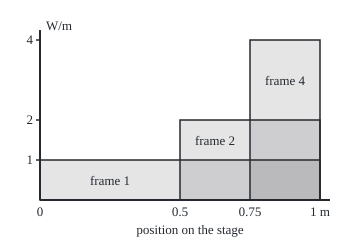
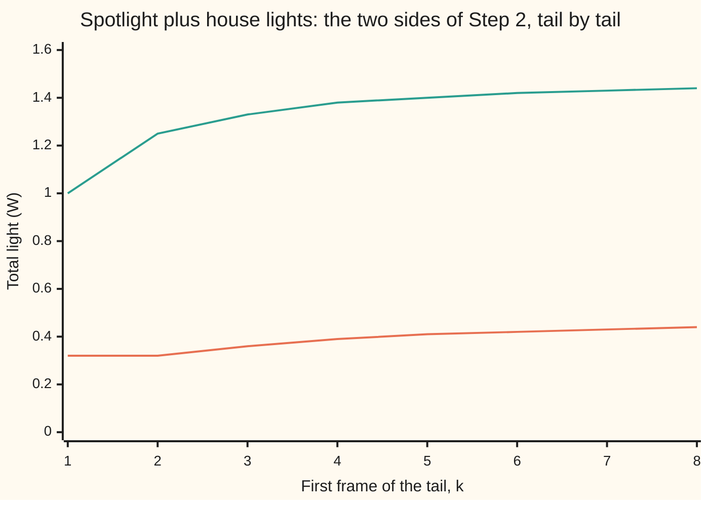

# Fatou's lemma: mass can leak away in a limit but never appear from nowhere

Measure and integration → Swapping Limits and Integrals → Light that leaks away → Fatou's lemma

---

## General Overview

A stage is 1 m wide, measured from the left wing. A spotlight runs a sequence of frames. In frame 1 it lights the whole stage at 1 watt per metre. In frame 2 it lights only the right half, from 0.5 m, at 2 W/m. In frame 4 it lights from 0.75 m at 4 W/m; in frame 1000, the last thousandth of a metre at 1000 W/m. Frame n lights a strip 1/n m wide, ending at the right wing, at brightness n W/m. Width times brightness is 1 W in every frame.

Now sit in one seat and watch. A seat at 0.9 m is lit in frames 1 to 10, brighter each time, then dark in frame 11 and every frame after. Every seat short of the right edge has the same fate: lit for a while, then dark for good. So frame by frame the brightness at each seat tends to 0. The limit of the frames is a dark stage, with total light 0 W.

Total first, then limit: 1 W. Limit first, then total: 0 W. The watt did not vanish from any single frame; it slid into a strip too narrow for any seat to keep. The question for this card is which way such a gap can go. The answer is one way only: the limit can lose total, never gain it. Pierre Fatou used the inequality in 1906.

**For functions of zero or more, the integral of the eventual floor is at most the eventual floor of the integrals: in a limit, total can leak away but never appear from nowhere; under one integrable roof, the reverse inequality holds for the eventual ceiling.**

**What kind of fact this is:** a theorem, proved on this card in Why it works from monotone convergence; the reverse form under a roof is a corollary, proved there too.

### The picture: three frames of the spotlight

Drawn to scale: 280 drawing units per metre across, 40 per W/m up. Each shaded block is one frame; each has area 1 W.

<p align="center"></p>

Caption: frame 1 covers the stage at height 1, frame 2 the right half at height 2, frame 4 the right quarter at height 4. The blocks grow taller and thinner and crowd against the right edge; a seat anywhere left of it is eventually outside every later block.

---

## The formula

Notation first, in words. A measure space $(\Omega,\mathcal F,\mu)$ is a set of points $\Omega$, the collection $\mathcal F$ of sets we allow ourselves to measure, and a measure $\mu$ giving each such set a size ([measures](../01-Sets%20You%20Can%20Measure/04-measures.md)). On the stage, $\Omega$ is [0, 1] in metres and the measure is length, $\lambda$. The integral $\int f\,d\mu$ is read "the integral of f against mu"; on the stage it is total light in watts ([integral-of-a-nonnegative-function](../04-The%20Lebesgue%20Integral/02-integral-of-a-nonnegative-function.md)). The indicator $\mathbf 1_A$ is one on A, zero off it, so frame n is $f_n = n\,\mathbf 1_{[1-1/n,\,1)}$.

A reminder from [limits-of-measurable-functions](../03-Measurable%20Functions/02-limits-of-measurable-functions.md): the **lower limit** of a sequence of numbers, written lim inf, is its eventual floor: take the smallest value from position k onward, then let k grow. The **upper limit**, lim sup, is the eventual ceiling. A sequence converges exactly when the two agree. For functions, both are taken seat by seat, and both are measurable.

**Fatou's lemma.** If every $f_n$ is measurable with values in $[0,\infty]$, then

$$\int \liminf_{n\to\infty} f_n \,d\mu \;\le\; \liminf_{n\to\infty} \int f_n\,d\mu .$$

**Read it aloud:** the total of the eventual floor is at most the eventual floor of the totals.

On the stage: the left side is the total light of the dark stage, 0 W; the right side is 1 W. Fatou reads 0 ≤ 1.

The proof runs through the **running infimum**, the dimmest reading at a seat from frame k onward:

$$g_k(x) = \inf_{n\ge k} f_n(x), \qquad g_1 \le g_2 \le \cdots, \qquad \lim_{k\to\infty} g_k = \liminf_{n\to\infty} f_n .$$

In words: drop the early frames one at a time; the floor can only rise, and it rises to the lower limit.

**Reverse Fatou.** If $0 \le f_n \le G$ for every n, with $\int G\,d\mu < \infty$, then

$$\limsup_{n\to\infty} \int f_n\,d\mu \;\le\; \int \limsup_{n\to\infty} f_n\,d\mu .$$

**Read it aloud:** under one roof of finite total, the eventual ceiling of the totals is at most the total of the eventual ceiling.

| Symbol | Plain meaning | In our example | Push it up and the answer… |
| --- | --- | --- | --- |
| $f_n$ | frame n: brightness at each point, W/m | n on the strip from 1 − 1/n m to the edge | brighter frames, larger totals |
| $n$, $k$ | frame numbers; k is where a tail of frames starts | frames 1, 2, 4, …, 1000 | later frames, narrower strips |
| $x$ | a seat: distance from the left wing, m | 0.9 m, lit in frames 1 to 10 | nearer the edge, lit for longer |
| $N$ | the last frame that lights a seat x | N = 10 at 0.9 m | grows without bound near the edge |
| $j$, $J$ | strip number: strip j runs from 1 − 1/j to 1 − 1/(j + 1) m, and frame j is the last one lighting it; J the last strip counted | strip 10 runs from 0.9 to 0.909091 m; J = 10, 100, 1000, 1000000 in the roof rows | more strips reach nearer the edge |
| $m$ | a counting number in the sum of 1/m^2 | m = 4, 5, 6, … for k = 3 | — |
| $\Omega$, $\mathcal F$, $\mu$, $Z_n$, $Z$ | the space, its measurable sets, a measure; $Z_n$ a set of measure zero where a hypothesis fails, $Z$ the union of the $Z_n$ | [0, 1], its Borel sets, length; no such set is needed on the stage | — |
| $\lambda$ | length on the line (Lebesgue measure) | strip of frame 4 has length 0.25 | — |
| $\mathbf 1_A$ | indicator: one on A, zero off it | one on [0.75, 1) in frame 4 | — |
| $\int f\,d\mu$, $b_k$ | integral of f against μ: total light; $b_k$ the smallest total from frame k on | 1 W in every frame; 1.3333 W at k = 3 with house lights | — |
| $\liminf_n$, $\limsup_n$ | eventual floor and eventual ceiling of a sequence | both 0 at every seat for the spotlight | — |
| $g_k$, $a_k$ | running infimum: the floor from frame k on; $a_k$ its total | 0 everywhere for the bare spotlight; 0.3641 W at k = 3 with house lights | rises with k |
| $h_n$, $h_k$ | house lights in frame n (or k), the same at every seat | 0.5(1 − 1/n) W/m; 0.3333 at frame 3 | raises every floor |
| $G$ | a roof: one function above every frame, with finite total | 2 W/m for the flicker; none exists for the spotlight | — |

### When it holds

- **Values of zero or more.** A shadow of depth n on the same strip, $-f_n$, has total −1 W in every frame and limit 0; Fatou would read 0 ≤ −1, which is false. Functions bounded below by one integrable function, $f_n \ge -G$, are fine: apply the lemma to $f_n + G$.
- **Measurable functions.** Nothing else is asked: no finite total, no convergence, no bound above.
- **Any measure space.** Infinite totals are allowed on either side, and $\mu(\Omega)$ may be infinite. A hypothesis that holds only almost everywhere, except on a set of size zero, is enough ([null-sets-and-almost-everywhere](../01-Sets%20You%20Can%20Measure/07-null-sets-and-almost-everywhere.md)).
- **The reverse form needs a roof.** Without one the spotlight gives lim sup of totals 1 W against a total of 0 W for the lim sup, and 1 ≤ 0 is false.
- **An inequality, not an equality.** Equality is guaranteed by rising frames (monotone convergence) or by one roof and a genuine limit (dominated convergence).

---

## Why it works

### Step 0: a floor that only rises

At one seat, look at all frames from k onward and keep the dimmest reading. That floor sits under every one of those frames. Drop one more early frame and the floor can only rise, since the minimum is taken over fewer readings. Monotone convergence handles rising functions ([monotone-convergence-theorem](../04-The%20Lebesgue%20Integral/03-monotone-convergence-theorem.md)). Fatou is monotone convergence applied to the floors.

### Step 1: the floors rise to the lower limit

The running infimum $g_k = \inf_{n\ge k} f_n$ is measurable, as an infimum of countably many measurable functions. It is at least 0. It rises with k. By the definition of the lower limit, it rises to $\liminf_n f_n$ at every seat.

For the bare spotlight, every floor is 0: any seat has a dark frame coming, so the dimmest reading in any tail is 0. The seat at 0.9 m is dark from frame 11 on; the seat at 0.999 m from frame 1001 on.

### Step 2: each floor sits under every later total

For each n ≥ k, $g_k \le f_n$ at every seat. The integral respects order, so $\int g_k\,d\mu \le \int f_n\,d\mu$. That holds for every n ≥ k, so

$$\int g_k\,d\mu \;\le\; \inf_{n\ge k} \int f_n\,d\mu .$$

### Step 3: let k grow

The left side rises to $\int \liminf_n f_n\,d\mu$, by monotone convergence on the rising floors. The right side is the running infimum of the totals, which rises to $\liminf_n \int f_n\,d\mu$ by definition. An inequality that holds at every k survives the limit. That is the lemma.

<details>
<summary>Detailed proof</summary>

**Setting.** $(\Omega,\mathcal F,\mu)$ is a measure space and each $f_n:\Omega\to[0,\infty]$ is measurable.

**1. The floors are measurable and rise.** Put $g_k=\inf_{n\ge k}f_n$. For a number a, $\{g_k<a\}=\bigcup_{n\ge k}\{f_n<a\}$: an infimum is below a exactly when some term is below a. A countable union of sets in $\mathcal F$ is in $\mathcal F$, so $g_k$ is measurable ([limits-of-measurable-functions](../03-Measurable%20Functions/02-limits-of-measurable-functions.md)). The set $\{n\ge k+1\}$ is inside $\{n\ge k\}$, and an infimum over fewer numbers is at least as large, so $g_k\le g_{k+1}$. Each $g_k\ge0$.

**2. Their limit is the lower limit.** By definition, $\liminf_n f_n(x)=\sup_k \inf_{n\ge k}f_n(x)=\lim_k g_k(x)$, the limit of a rising sequence in $[0,\infty]$.

**3. Monotone convergence.** The $g_k$ are measurable, at least 0 and rising to $\liminf_n f_n$. By [monotone-convergence-theorem](../04-The%20Lebesgue%20Integral/03-monotone-convergence-theorem.md), $\int \liminf_n f_n\,d\mu=\lim_k\int g_k\,d\mu$.

**4. Comparison.** For $n\ge k$, $g_k\le f_n$ everywhere, so $\int g_k\,d\mu\le\int f_n\,d\mu$ by monotonicity of the integral ([integral-of-a-nonnegative-function](../04-The%20Lebesgue%20Integral/02-integral-of-a-nonnegative-function.md)). Taking the infimum over $n\ge k$ on the right: $\int g_k\,d\mu\le b_k$, where $b_k=\inf_{n\ge k}\int f_n\,d\mu$.

**5. Pass to the limit.** The numbers $b_k$ rise with k, and $\lim_k b_k=\liminf_n\int f_n\,d\mu$ by definition. If $a_k\le b_k$ for every k and both sequences rise, then $\lim a_k\le\lim b_k$ in $[0,\infty]$: each $a_k\le b_k\le\lim b$, so the supremum of the $a_k$ is at most $\lim b$. With $a_k=\int g_k\,d\mu$ and step 3, $\int\liminf_n f_n\,d\mu\le\liminf_n\int f_n\,d\mu$. No subtraction was used, so infinite values cause no trouble. ∎

**Almost everywhere.** If each $f_n\ge0$ only outside a null set $Z_n$, let Z be the union of the $Z_n$, still of measure zero as a countable union of null sets. Set every $f_n$ to 0 on Z. Integrals do not change when a function changes on a null set ([integral-of-a-nonnegative-function](../04-The%20Lebesgue%20Integral/02-integral-of-a-nonnegative-function.md)), and the lower limit changes only on Z. Apply the lemma to the modified functions.

**Reverse Fatou.** Suppose $0\le f_n\le G$ with $\int G\,d\mu<\infty$. Then G is finite outside a null set, which the almost-everywhere paragraph lets us ignore, so $G-f_n$ is measurable and at least 0. Apply the lemma to $G-f_n$. Seat by seat, $\liminf_n(G-f_n)=G-\limsup_n f_n$, since subtracting from a fixed finite number turns floors into ceilings. Every $f_n$ and $\limsup_n f_n$ lies between 0 and G, so all of them are integrable and the integral subtracts ([integrable-functions-and-l1](../04-The%20Lebesgue%20Integral/04-integrable-functions-and-l1.md)): $\int(G-f_n)\,d\mu=\int G\,d\mu-\int f_n\,d\mu$, and likewise for the lim sup. The lemma becomes
$$\int G\,d\mu-\int\limsup_n f_n\,d\mu\le\liminf_n\Big(\int G\,d\mu-\int f_n\,d\mu\Big)=\int G\,d\mu-\limsup_n\int f_n\,d\mu .$$
Subtract the finite number $\int G\,d\mu$ from both sides and change signs: $\limsup_n\int f_n\,d\mu\le\int\limsup_n f_n\,d\mu$. ∎ The finite roof is used twice: to make $G-f_n$ a function of zero or more, and to make the subtraction legal.

</details>

### Step 4: the proof on the stage, with house lights

The bare spotlight's floors are all 0, which hides the machinery. Add house lights that fade up: in frame n they give $h_n = 0.5(1 - 1/n)$ W/m at every seat, on top of the spotlight. Frame n now carries $h_n + 1$ W.

At a seat left of $1 - 1/k$, every frame from k on is dark except for the house lights, which are dimmest at frame k: the floor is $h_k$. At a seat on the strip where frame j is the last lit one, with j ≥ k, the floor is the first dark frame's house lights, $h_{j+1}$. For k = 3 that is 0.3333 W/m on the first 0.6667 m, area 0.2222 W, plus 0.1419 W from the strips near the edge: 0.3641 W. That sits below every later total, the smallest being 1.3333 W at frame 3.

As k grows the floors rise: 0.3225, 0.3641, 0.3919, 0.4107, … W, reaching 0.4950 at k = 100 and 0.5000 at k = 10000. The limit is 0.5000 W: the house lights at full, 0.5 W/m over 1 m. The totals' floors rise to 1.5000 W. Fatou reads 0.5 ≤ 1.5. The gap, 1 W, is the spotlight, lost exactly as before.



Caption, values to 2 places: the lower line is $\int g_k$, the total of the floor from frame k on, rising toward 0.5 W. The upper line is the smallest frame total from frame k on, rising toward 1.5 W. The lower line never crosses the upper one; that is Step 2. The first two values of the lower line agree because frame 1 has no house light but a spotlight of 1 W/m over the whole stage, so it never sets the floor.

### Step 5: two ways to lose total

The spotlight loses its watt by escaping: it crowds against the edge, and every fixed stretch away from the edge, such as [0, 0.9], ends with 0 W.

A finite stage can lose total without anything escaping. Let the lights **flicker**: odd frames light the left half at 2 W/m, even frames the right half at 2 W/m. Each frame carries 1 W. Every seat's floor is 0, since each seat goes dark every other frame. Fatou reads 0 ≤ 1 again. Nothing slid off; the light took turns, and the floor sees only the gaps.

### Step 6: the reverse form under a roof

The flicker has a roof: $G = 2$ W/m everywhere, total 2 W, above every frame. Each seat's ceiling is 2, so the lim sup has total 2 W. Reverse Fatou reads 1 ≤ 2, and the full chain is 0 ≤ 1 ≤ 1 ≤ 2: total of the floor, floor of the totals, ceiling of the totals, total of the ceiling.

The spotlight has no roof. The smallest function above every frame is, on the strip where frame j is the last lit one, the brightness j of that frame. Its total over strips 1 to J is $1/2 + 1/3 + \cdots + 1/(J+1)$, a harmonic sum: 2.0199 W up to 0.909091 m, 4.1973 W up to 0.990099 m, 6.4865 W up to 0.999001 m, 13.3927 W up to 0.999999 m, growing without bound. With no finite roof, reverse Fatou has nothing to stand on, and indeed it fails: 1 W against 0 W.

Another route to the same inequality is to prove dominated convergence first and read Fatou off it, but that runs backwards: [dominated-convergence-theorem](02-dominated-convergence-theorem.md) proves dominated convergence by applying Fatou to roof plus and minus each frame.

---

## Worked numbers, by hand

| Step | Arithmetic | Value |
| --- | --- | --- |
| frame n's total | width 1/n m × brightness n W/m | 1 W |
| light on [0, 0.9] m in frame 4 | 4 W/m × (0.9 − 0.75) m | 0.6000 W |
| same in frame 10 | the strip starts at 0.9 m | 0 W |
| last frame lighting the seat at 0.9 m | 1 − 1/n ≤ 0.9 means n ≤ 10 | N = 10 |
| lower limit at every seat left of the edge | dark from frame N + 1 on | 0 W/m |
| total of the lower limit | 0 over the stage | 0 W |
| lower limit of the totals | every total is 1 | 1 W |
| **Fatou** | total of the floor ≤ floor of the totals | **0 ≤ 1** |
| house lights, k = 3: floor on [0, 0.6667) | 0.3333 W/m × 0.6667 m | 0.2222 W |
| house lights, k = 3: strips near the edge | half of the sum of 1/m^2 from m = 4, which is 0.2838 | 0.1419 W |
| house lights, k = 3: total of the floor | 0.2222 + 0.1419 | **0.3641 W** |

The dark stage has less light than any frame: a watt went missing in the limit, and Fatou says that is the only direction a limit can go.

### What breaks if you drop a piece

| Mistake | Comes out at | What went wrong |
| --- | --- | --- |
| Treating Fatou as an equality | 1 W predicted for the dark stage, which has 0 W | the lemma is one-sided; the spotlight's watt escapes |
| Dropping the sign condition: a shadow of depth n | 0 ≤ −1, false | values below zero can hide negative total that the limit drops |
| Reverse Fatou with no roof | lim sup of totals 1 W, above the lim sup's total 0 W | the smallest roof over the spotlight has infinite total |
| Believing only escape to the edge loses total | flicker: 0 ≤ 1 on a finite stage | light taking turns also leaves the floor at 0 |

---

## Code, from first principles, and it actually runs

The code takes each claim by two roads. The total light of each frame is counted on a grid of 10000 cells in whole-number arithmetic and compared with width times brightness. The last frame lighting a seat is found by scanning 100000 frames and compared with the formula n ≤ 1/(1 − x). The integral of each running floor under the house lights is computed by a closed-form series and by brute force, taking the minimum over frames strip by strip with no formula for the floor; the brute force brackets the series. The smallest roof's total is summed strip by strip and compared with the harmonic sum. The flicker chain and the shadow are counted on the grid. The limit's total is the grid's total in frame 20001, past the last lit frame of every grid seat.

What the code shows: these frames, these seats, these floors, to the printed precision. What only the proof shows: that the inequality holds for every sequence of measurable functions of zero or more on every measure space.

### Python

```python
# Fatou's lemma -- the check behind the card.  Standard library only.
# A spotlight on a 1 m stage: frame n lights the strip [1 - 1/n, 1) at
# brightness n watts per metre, so every frame carries 1 W, yet every seat
# goes dark for good.  Road one counts lit grid cells in whole numbers; road
# two is the formula.  Then the running infimum under house lights that fade
# up, by a closed-form series and by brute force over frames; the smallest
# roof, whose area is a harmonic sum; the flicker under a roof of 2; and the
# shadow that breaks the sign rule.
import math

M = 10_000                                   # grid cells, 0.1 mm each

def lit(n, p, q):                            # is the seat at p/q m lit in frame n?  p/q >= 1 - 1/n
    return p * n >= q * (n - 1)

def light(n, cells, sign=1):                 # watts on the first `cells` grid cells in frame n
    hit = sum(1 for i in range(cells) if lit(n, 2 * i + 1, 2 * M))
    return sign * n * hit / M

def house(n):                                # house lights fading up, W/m, the same at every seat
    return 0.5 * (1 - 1 / n)

print("frame n lights [1 - 1/n, 1) at brightness n W/m")
for n in (1, 2, 4, 10, 100, 1000):
    total, part = light(n, M), light(n, 9 * M // 10)
    print(f"frame {n:>4}: strip from {1 - 1 / n:.4f} m, total {total:.4f} W, on [0, 0.9] m {part:.4f} W")
    assert abs(total - 1) < 1e-12                           # grid count against n x (1/n)
    assert abs(part - max(0.0, 1 - 0.1 * n)) < 1e-12        # grid count against the overlap formula

for p, q in ((1, 2), (9, 10), (99, 100), (999, 1000)):
    last = max(n for n in range(1, 100_001) if lit(n, p, q))   # brute force over 100000 frames
    print(f"seat {p / q:.4f} m: lit in frames 1 to {last}, brightness climbs to {last} W/m, then dark from frame {last + 1} on")
    assert last == q // (q - p)                              # against n <= 1/(1 - x)
    assert all(lit(n, p, q) for n in range(1, last + 1))       # lit in every frame up to the last
dark = light(2 * M + 1, M)                   # every grid seat (at most 0.99995 m) is dark for good from frame 2M + 1 on
print(f"spotlight: integral of lim inf = {dark:.4f} W, lim inf of the integrals = {light(1000, M):.4f} W, lost {light(1000, M) - dark:.4f} W")

# the proof on the stage: f_n = house(n) + spotlight; g_k = inf over n >= k of f_n
def by_series(k):                            # g_k = house(k) left of 1 - 1/k, house(j + 1) on strip j >= k
    tail = math.pi ** 2 / 6 - sum(1 / m ** 2 for m in range(1, k + 1))
    return 0.5 * (1 - 1 / k) ** 2 + 0.5 * tail

J = 1000                                     # strips [1 - 1/j, 1 - 1/(j + 1)), j = 1..J, then a leftover sliver
def by_brute(k):
    s = 0.0
    for j in range(1, J + 1):
        frames = range(k, max(j, k) + 6)     # every frame from k up to a few past the strip's last lit one
        low = min(house(n) + (n if lit(n, j - 1, j) else 0) for n in frames)
        s += low / (j * (j + 1))
    return s + house(k) / (J + 1), s + 0.5 / (J + 1)

print("k, integral of g_k by series, by brute force (bracket), inf of integrals from frame k on")
prev, rows = 0.0, []
for k in range(1, 9):
    a, (lo, hi) = by_series(k), by_brute(k)
    rhs = min(house(n) + 1.0 for n in range(k, k + 4))   # integral of f_n is house(n) + 1 W
    print(f"k = {k}: {a:.4f}, {lo:.4f} to {hi:.4f}, {rhs:.4f}")
    assert lo - 1e-12 <= a <= hi + 1e-12      # two roads to the integral of g_k
    assert prev <= a <= rhs                   # g_k rises, and sits below every later integral
    prev = a
    rows.append(a)
for k in (100, 10_000):
    print(f"k = {k}: integral of g_k {by_series(k):.4f}")
tail3 = sum(1 / m ** 2 for m in range(4, 2_000_001))           # summed directly, not from pi^2/6
print(f"k = 3 by hand: floor {house(3):.4f} W/m on [0, {1 - 1 / 3:.4f}) m, area {house(3) * (1 - 1 / 3):.4f}; "
      f"sum of 1/m^2 from m = 4 is {tail3:.4f}, half of it {0.5 * tail3:.4f}")
assert abs(house(3) * (1 - 1 / 3) + 0.5 * tail3 - by_series(3)) < 1e-6
print(f"with house lights, read at k = 1000000: integral of lim inf = {by_series(10 ** 6):.4f} W, lim inf of the integrals = {1 + house(10 ** 6):.4f} W")
print("chart, integral of g_k to 2 places: " + ", ".join(f"{a:.2f}" for a in rows))
print("chart, inf of integrals to 2 places: " + ", ".join(f"{1 + house(k):.2f}" for k in range(1, 9)))

# the smallest roof over every frame: sup_n f_n = j on strip j
for Jr in (10, 100, 1000, 1_000_000):
    formula = sum(1 / (j + 1) for j in range(1, Jr + 1))
    if Jr <= 1000:
        brute = sum(max(n for n in range(1, j + 6) if lit(n, j - 1, j)) / (j * (j + 1)) for j in range(1, Jr + 1))
        assert abs(brute - formula) < 1e-9
    assert formula >= math.log((Jr + 2) / 2)
    print(f"roof over [0, {1 - 1 / (Jr + 1):.6f}) m: area {formula:.4f} W")

# flicker: odd frames 2 W/m on [0, 0.5), even frames 2 W/m on [0.5, 1); roof G = 2
odd = [2 if i < M // 2 else 0 for i in range(M)]
even = [2 - v for v in odd]
area = lambda row: sum(row) / M
low, high = [min(a, b) for a, b in zip(odd, even)], [max(a, b) for a, b in zip(odd, even)]
chain = (area(low), min(area(odd), area(even)), max(area(odd), area(even)), area(high))
print("flicker: " + " <= ".join(f"{v:.4f}" for v in chain) + f", roof area {area([2] * M):.4f}")
assert chain == (0.0, 1.0, 1.0, 2.0)

# what breaks
print(f"breaks, reverse Fatou with no roof: lim sup of integrals {light(1000, M):.4f} > integral of lim sup {dark:.4f}")
shadow = light(1000, M, -1)
print(f"breaks, shadow of depth n: integral of lim inf {dark:.4f} > lim inf of integrals {shadow:.4f}")
assert dark > shadow
print(f"breaks, equality claimed: {light(1000, M):.4f} W predicted for the limit, {dark:.4f} W there")
print("figure, x = 40 + 280 x, y = 200 - 40 brightness; " + "; ".join(
      f"frame {n}: {40 + 280 * (1 - 1 / n):.1f} to {40 + 280 * 1.0:.1f}, top {200 - 40 * n:.1f}" for n in (1, 2, 4)))
print("ALL CHECKS PASS")
```

**Ran 2026-10-07 on macOS, Python 3.14.6, standard library only. All checks passed. Output, pasted from the run:**

```
frame n lights [1 - 1/n, 1) at brightness n W/m
frame    1: strip from 0.0000 m, total 1.0000 W, on [0, 0.9] m 0.9000 W
frame    2: strip from 0.5000 m, total 1.0000 W, on [0, 0.9] m 0.8000 W
frame    4: strip from 0.7500 m, total 1.0000 W, on [0, 0.9] m 0.6000 W
frame   10: strip from 0.9000 m, total 1.0000 W, on [0, 0.9] m 0.0000 W
frame  100: strip from 0.9900 m, total 1.0000 W, on [0, 0.9] m 0.0000 W
frame 1000: strip from 0.9990 m, total 1.0000 W, on [0, 0.9] m 0.0000 W
seat 0.5000 m: lit in frames 1 to 2, brightness climbs to 2 W/m, then dark from frame 3 on
seat 0.9000 m: lit in frames 1 to 10, brightness climbs to 10 W/m, then dark from frame 11 on
seat 0.9900 m: lit in frames 1 to 100, brightness climbs to 100 W/m, then dark from frame 101 on
seat 0.9990 m: lit in frames 1 to 1000, brightness climbs to 1000 W/m, then dark from frame 1001 on
spotlight: integral of lim inf = 0.0000 W, lim inf of the integrals = 1.0000 W, lost 1.0000 W
k, integral of g_k by series, by brute force (bracket), inf of integrals from frame k on
k = 1: 0.3225, 0.3220 to 0.3225, 1.0000
k = 2: 0.3225, 0.3222 to 0.3225, 1.2500
k = 3: 0.3641, 0.3640 to 0.3641, 1.3333
k = 4: 0.3919, 0.3918 to 0.3919, 1.3750
k = 5: 0.4107, 0.4106 to 0.4107, 1.4000
k = 6: 0.4240, 0.4239 to 0.4240, 1.4167
k = 7: 0.4339, 0.4338 to 0.4339, 1.4286
k = 8: 0.4416, 0.4415 to 0.4416, 1.4375
k = 100: integral of g_k 0.4950
k = 10000: integral of g_k 0.5000
k = 3 by hand: floor 0.3333 W/m on [0, 0.6667) m, area 0.2222; sum of 1/m^2 from m = 4 is 0.2838, half of it 0.1419
with house lights, read at k = 1000000: integral of lim inf = 0.5000 W, lim inf of the integrals = 1.5000 W
chart, integral of g_k to 2 places: 0.32, 0.32, 0.36, 0.39, 0.41, 0.42, 0.43, 0.44
chart, inf of integrals to 2 places: 1.00, 1.25, 1.33, 1.38, 1.40, 1.42, 1.43, 1.44
roof over [0, 0.909091) m: area 2.0199 W
roof over [0, 0.990099) m: area 4.1973 W
roof over [0, 0.999001) m: area 6.4865 W
roof over [0, 0.999999) m: area 13.3927 W
flicker: 0.0000 <= 1.0000 <= 1.0000 <= 2.0000, roof area 2.0000
breaks, reverse Fatou with no roof: lim sup of integrals 1.0000 > integral of lim sup 0.0000
breaks, shadow of depth n: integral of lim inf 0.0000 > lim inf of integrals -1.0000
breaks, equality claimed: 1.0000 W predicted for the limit, 0.0000 W there
figure, x = 40 + 280 x, y = 200 - 40 brightness; frame 1: 40.0 to 320.0, top 160.0; frame 2: 180.0 to 320.0, top 120.0; frame 4: 250.0 to 320.0, top 40.0
ALL CHECKS PASS
```

### Rust

Same rows, same labels, built with `rustc --edition 2021 -O`. The two outputs are identical.

```rust
// Fatou's lemma -- the same check as the Python, in Rust.  No crates.
// A spotlight on a 1 m stage: frame n lights the strip [1 - 1/n, 1) at
// brightness n watts per metre, so every frame carries 1 W, yet every seat
// goes dark for good.  Road one counts lit grid cells in whole numbers; road
// two is the formula.  Then the running infimum under house lights that fade
// up, by a closed-form series and by brute force over frames; the smallest
// roof, whose area is a harmonic sum; the flicker under a roof of 2; and the
// shadow that breaks the sign rule.
const M: i64 = 10_000; // grid cells, 0.1 mm each
const J: i64 = 1000; // strips [1 - 1/j, 1 - 1/(j + 1)), j = 1..J, then a leftover sliver

fn lit(n: i64, p: i64, q: i64) -> bool {
    // is the seat at p/q m lit in frame n?  p/q >= 1 - 1/n
    p * n >= q * (n - 1)
}

fn light(n: i64, cells: i64, sign: f64) -> f64 {
    // watts on the first `cells` grid cells in frame n
    let hit = (0..cells).filter(|&i| lit(n, 2 * i + 1, 2 * M)).count() as f64;
    sign * n as f64 * hit / M as f64
}

fn house(n: i64) -> f64 {
    // house lights fading up, W/m, the same at every seat
    0.5 * (1.0 - 1.0 / n as f64)
}

fn by_series(k: i64) -> f64 {
    // g_k = house(k) left of 1 - 1/k, house(j + 1) on strip j >= k
    let head: f64 = (1..=k).map(|m| 1.0 / (m * m) as f64).sum();
    let tail = std::f64::consts::PI.powi(2) / 6.0 - head;
    0.5 * (1.0 - 1.0 / k as f64).powi(2) + 0.5 * tail
}

fn by_brute(k: i64) -> (f64, f64) {
    let mut s = 0.0;
    for j in 1..=J {
        // every frame from k up to a few past the strip's last lit one
        let low = (k..k.max(j) + 6)
            .map(|n| house(n) + if lit(n, j - 1, j) { n as f64 } else { 0.0 })
            .fold(f64::INFINITY, f64::min);
        s += low / (j * (j + 1)) as f64;
    }
    (s + house(k) / (J + 1) as f64, s + 0.5 / (J + 1) as f64)
}

fn main() {
    println!("frame n lights [1 - 1/n, 1) at brightness n W/m");
    for n in [1i64, 2, 4, 10, 100, 1000] {
        let (total, part) = (light(n, M, 1.0), light(n, 9 * M / 10, 1.0));
        println!("frame {:>4}: strip from {:.4} m, total {:.4} W, on [0, 0.9] m {:.4} W", n, 1.0 - 1.0 / n as f64, total, part);
        assert!((total - 1.0).abs() < 1e-12); // grid count against n x (1/n)
        assert!((part - (1.0 - 0.1 * n as f64).max(0.0)).abs() < 1e-12); // against the overlap formula
    }
    for (p, q) in [(1i64, 2i64), (9, 10), (99, 100), (999, 1000)] {
        let last = (1..=100_000).filter(|&n| lit(n, p, q)).max().unwrap(); // brute force over 100000 frames
        println!("seat {:.4} m: lit in frames 1 to {}, brightness climbs to {} W/m, then dark from frame {} on", p as f64 / q as f64, last, last, last + 1);
        assert!(last == q / (q - p)); // against n <= 1/(1 - x)
        assert!((1..=last).all(|n| lit(n, p, q))); // lit in every frame up to the last
    }
    let dark = light(2 * M + 1, M, 1.0); // every grid seat (at most 0.99995 m) is dark for good from frame 2M + 1 on
    println!("spotlight: integral of lim inf = {:.4} W, lim inf of the integrals = {:.4} W, lost {:.4} W", dark, light(1000, M, 1.0), light(1000, M, 1.0) - dark);

    // the proof on the stage: f_n = house(n) + spotlight; g_k = inf over n >= k of f_n
    println!("k, integral of g_k by series, by brute force (bracket), inf of integrals from frame k on");
    let (mut prev, mut rows) = (0.0f64, Vec::new());
    for k in 1..=8i64 {
        let (a, (lo, hi)) = (by_series(k), by_brute(k));
        let rhs = (k..k + 4).map(|n| house(n) + 1.0).fold(f64::INFINITY, f64::min); // integral of f_n is house(n) + 1 W
        println!("k = {}: {:.4}, {:.4} to {:.4}, {:.4}", k, a, lo, hi, rhs);
        assert!(lo - 1e-12 <= a && a <= hi + 1e-12); // two roads to the integral of g_k
        assert!(prev <= a && a <= rhs); // g_k rises, and sits below every later integral
        prev = a;
        rows.push(a);
    }
    for k in [100i64, 10_000] {
        println!("k = {}: integral of g_k {:.4}", k, by_series(k));
    }
    let tail3: f64 = (4..=2_000_000i64).map(|m| 1.0 / (m as f64 * m as f64)).sum(); // summed directly, not from pi^2/6
    println!("k = 3 by hand: floor {:.4} W/m on [0, {:.4}) m, area {:.4}; sum of 1/m^2 from m = 4 is {:.4}, half of it {:.4}",
             house(3), 1.0 - 1.0 / 3.0, house(3) * (1.0 - 1.0 / 3.0), tail3, 0.5 * tail3);
    assert!((house(3) * (1.0 - 1.0 / 3.0) + 0.5 * tail3 - by_series(3)).abs() < 1e-6);
    println!("with house lights, read at k = 1000000: integral of lim inf = {:.4} W, lim inf of the integrals = {:.4} W", by_series(1_000_000), 1.0 + house(1_000_000));
    let fmt = |v: Vec<f64>| v.iter().map(|a| format!("{:.2}", a)).collect::<Vec<_>>().join(", ");
    println!("chart, integral of g_k to 2 places: {}", fmt(rows));
    println!("chart, inf of integrals to 2 places: {}", fmt((1..=8).map(|k| 1.0 + house(k)).collect()));

    // the smallest roof over every frame: sup_n f_n = j on strip j
    for jr in [10i64, 100, 1000, 1_000_000] {
        let formula: f64 = (1..=jr).map(|j| 1.0 / (j + 1) as f64).sum();
        if jr <= 1000 {
            let brute: f64 = (1..=jr)
                .map(|j| (1..j + 6).filter(|&n| lit(n, j - 1, j)).max().unwrap() as f64 / (j * (j + 1)) as f64)
                .sum();
            assert!((brute - formula).abs() < 1e-9);
        }
        assert!(formula >= ((jr + 2) as f64 / 2.0).ln());
        println!("roof over [0, {:.6}) m: area {:.4} W", 1.0 - 1.0 / (jr + 1) as f64, formula);
    }

    // flicker: odd frames 2 W/m on [0, 0.5), even frames 2 W/m on [0.5, 1); roof G = 2
    let odd: Vec<i64> = (0..M).map(|i| if i < M / 2 { 2 } else { 0 }).collect();
    let even: Vec<i64> = odd.iter().map(|v| 2 - v).collect();
    let area = |row: &[i64]| row.iter().sum::<i64>() as f64 / M as f64;
    let low: Vec<i64> = odd.iter().zip(&even).map(|(a, b)| *a.min(b)).collect();
    let high: Vec<i64> = odd.iter().zip(&even).map(|(a, b)| *a.max(b)).collect();
    let chain = [area(&low), area(&odd).min(area(&even)), area(&odd).max(area(&even)), area(&high)];
    let shown: Vec<String> = chain.iter().map(|v| format!("{:.4}", v)).collect();
    println!("flicker: {}, roof area {:.4}", shown.join(" <= "), area(&vec![2; M as usize]));
    assert!(chain == [0.0, 1.0, 1.0, 2.0]);

    // what breaks
    println!("breaks, reverse Fatou with no roof: lim sup of integrals {:.4} > integral of lim sup {:.4}", light(1000, M, 1.0), dark);
    let shadow = light(1000, M, -1.0);
    println!("breaks, shadow of depth n: integral of lim inf {:.4} > lim inf of integrals {:.4}", dark, shadow);
    assert!(dark > shadow);
    println!("breaks, equality claimed: {:.4} W predicted for the limit, {:.4} W there", light(1000, M, 1.0), dark);
    let fig: Vec<String> = [1i64, 2, 4].iter()
        .map(|&n| format!("frame {}: {:.1} to {:.1}, top {:.1}", n, 40.0 + 280.0 * (1.0 - 1.0 / n as f64), 40.0 + 280.0 * 1.0, 200.0 - 40.0 * n as f64))
        .collect();
    println!("figure, x = 40 + 280 x, y = 200 - 40 brightness; {}", fig.join("; "));
    println!("ALL CHECKS PASS");
}
```

**Ran 2026-10-07 on macOS, rustc 1.98.1, no crates. All checks passed. Output, pasted from the run:**

```
frame n lights [1 - 1/n, 1) at brightness n W/m
frame    1: strip from 0.0000 m, total 1.0000 W, on [0, 0.9] m 0.9000 W
frame    2: strip from 0.5000 m, total 1.0000 W, on [0, 0.9] m 0.8000 W
frame    4: strip from 0.7500 m, total 1.0000 W, on [0, 0.9] m 0.6000 W
frame   10: strip from 0.9000 m, total 1.0000 W, on [0, 0.9] m 0.0000 W
frame  100: strip from 0.9900 m, total 1.0000 W, on [0, 0.9] m 0.0000 W
frame 1000: strip from 0.9990 m, total 1.0000 W, on [0, 0.9] m 0.0000 W
seat 0.5000 m: lit in frames 1 to 2, brightness climbs to 2 W/m, then dark from frame 3 on
seat 0.9000 m: lit in frames 1 to 10, brightness climbs to 10 W/m, then dark from frame 11 on
seat 0.9900 m: lit in frames 1 to 100, brightness climbs to 100 W/m, then dark from frame 101 on
seat 0.9990 m: lit in frames 1 to 1000, brightness climbs to 1000 W/m, then dark from frame 1001 on
spotlight: integral of lim inf = 0.0000 W, lim inf of the integrals = 1.0000 W, lost 1.0000 W
k, integral of g_k by series, by brute force (bracket), inf of integrals from frame k on
k = 1: 0.3225, 0.3220 to 0.3225, 1.0000
k = 2: 0.3225, 0.3222 to 0.3225, 1.2500
k = 3: 0.3641, 0.3640 to 0.3641, 1.3333
k = 4: 0.3919, 0.3918 to 0.3919, 1.3750
k = 5: 0.4107, 0.4106 to 0.4107, 1.4000
k = 6: 0.4240, 0.4239 to 0.4240, 1.4167
k = 7: 0.4339, 0.4338 to 0.4339, 1.4286
k = 8: 0.4416, 0.4415 to 0.4416, 1.4375
k = 100: integral of g_k 0.4950
k = 10000: integral of g_k 0.5000
k = 3 by hand: floor 0.3333 W/m on [0, 0.6667) m, area 0.2222; sum of 1/m^2 from m = 4 is 0.2838, half of it 0.1419
with house lights, read at k = 1000000: integral of lim inf = 0.5000 W, lim inf of the integrals = 1.5000 W
chart, integral of g_k to 2 places: 0.32, 0.32, 0.36, 0.39, 0.41, 0.42, 0.43, 0.44
chart, inf of integrals to 2 places: 1.00, 1.25, 1.33, 1.38, 1.40, 1.42, 1.43, 1.44
roof over [0, 0.909091) m: area 2.0199 W
roof over [0, 0.990099) m: area 4.1973 W
roof over [0, 0.999001) m: area 6.4865 W
roof over [0, 0.999999) m: area 13.3927 W
flicker: 0.0000 <= 1.0000 <= 1.0000 <= 2.0000, roof area 2.0000
breaks, reverse Fatou with no roof: lim sup of integrals 1.0000 > integral of lim sup 0.0000
breaks, shadow of depth n: integral of lim inf 0.0000 > lim inf of integrals -1.0000
breaks, equality claimed: 1.0000 W predicted for the limit, 0.0000 W there
figure, x = 40 + 280 x, y = 200 - 40 brightness; frame 1: 40.0 to 320.0, top 160.0; frame 2: 180.0 to 320.0, top 120.0; frame 4: 250.0 to 320.0, top 40.0
ALL CHECKS PASS
```

> [!TIP]
> **Try changing**
> Guess first, then run it.
> - **Cap the spotlight.** In `light`, replace `sign * n * hit` by `sign * min(n, 4) * hit`. Guess the total in frame 10. It is 0.4 W, and the first assert stops the run there: totals now fall toward 0, because a roof of 4 W/m stops the leak. That is dominated convergence at work.
> - **Move a seat to the edge.** Add the seat `(9999, 10000)` to the seat loop. Guess its last lit frame. It is 10000, and it is dark from frame 10001 on: nearer the edge means lit for longer, never lit for ever.
> - **Brighten the flicker.** Make `odd` 3 W/m on the left half and `even` 3 minus it. Guess the chain. It is 0 ≤ 1.5 ≤ 1.5 ≤ 3, and the flicker assert stops the run, since it is pinned to the 2 W/m case.
> - **Slow the house lights.** Change `house` to `0.5 * (1 - 1 / n ** 0.5)`. Guess the floor totals' limit. It is still 0.5 W; the floors climb more slowly, and the series road no longer matches, so its assert stops the run.

---

## The usual mistake

> [!warning]
> **Reading the lemma as an equality, or in the wrong direction.** Fatou gives a ceiling for the limit's total, not its value. On the spotlight the floor of the totals is 1 W and the limit's total is 0 W. The inequality runs from the limit up to the totals: total can be lost in a limit, never created.
>
> - **Dropping the sign condition.** A shadow of depth n has total −1 W in every frame and limit 0: the inequality would read 0 ≤ −1. Functions must be of zero or more, or bounded below by one integrable function.
> - **Using the reverse form without a roof.** It gives lim sup of totals ≤ total of the lim sup only under an integrable roof. The spotlight breaks it: 1 W against 0 W, because its smallest roof totals 13.3927 W by 0.999999 m and keeps growing.
> - **Confusing the name.** Fatou's theorem, about limits of bounded analytic functions at the edge of a disc, is a different result from the same 1906 paper.

---

## Where you meet it in real life

- **Probability.** For random quantities of zero or more, the average of the eventual floor is at most the eventual floor of the averages ([expectation-as-an-integral](../04-The%20Lebesgue%20Integral/06-expectation-as-an-integral.md)). A lottery paying n dollars with probability 1/n averages 1 dollar forever while the chance of any prize shrinks to 0: the same kind of leak, which [uniform-integrability](05-uniform-integrability.md) rules out.
- **Limits keep their size bounds.** If functions converge almost everywhere, the limit's total size is at most the eventual floor of theirs. That is how the proof that $L^p$ spaces are complete shows a limit stays in the space ([completeness-of-lp](../07-Sizes%20of%20Functions/05-completeness-of-lp.md)).
- **Martingales.** A fair game whose value is zero or more keeps a constant average in time. Once the game's value is known to settle to a limit, Fatou bounds the average of that limit by the constant ([filtrations-and-martingales](../09-Conditional%20Expectation/06-filtrations-and-martingales.md)).
- **Which convergence loses mass.** The spotlight converges at every seat yet not in total; sorting out which kinds of convergence carry totals with them is [modes-of-convergence](04-modes-of-convergence.md). The Riemann version of the same trap, tents of area 1 on [0, 1], is [swapping-limits-with-integrals-and-derivatives](../../06-Calculus%20and%20analysis/06-Series/08-swapping-limits-with-integrals-and-derivatives.md).

> **Say it back**
> A spotlight with 1 W in every frame slides its strip against the edge; every seat goes dark for good, so the limit has 0 W. Fatou's lemma says this is the only direction a gap can go: for functions of zero or more, the total of the eventual floor is at most the eventual floor of the totals. The proof takes the floor from frame k on, which only rises, and applies monotone convergence to it. Under one roof of finite total the reverse holds for ceilings; the spotlight has no such roof, and its light leaks away.

---

## What this builds on

- [monotone-convergence-theorem](../04-The%20Lebesgue%20Integral/03-monotone-convergence-theorem.md): rising functions of zero or more carry their integrals with them; Fatou applies it to the running floors.

## Where this goes next

- [dominated-convergence-theorem](02-dominated-convergence-theorem.md): Fatou tells which way the total can go, not whether it goes; applied to roof plus and minus each frame, it shows one integrable roof closes the leak and turns the inequality into equality.

---

## Sources

Verified 2026-09-29: every link below resolves to the publisher's or author's page.

- Folland, Gerald B. *Real Analysis: Modern Techniques and Their Applications*, 2nd ed. Wiley, 1999. [Publisher page](https://www.wiley.com/en-us/real-analysis-modern-techniques-and-their-applications-2nd-edition-p-9780471317166). Section 2.2 proves Fatou's lemma from monotone convergence by the running infimum.
- Stein, Elias M., and Rami Shakarchi. *Real Analysis: Measure Theory, Integration, and Hilbert Spaces*. Princeton University Press, 2005. [Publisher page](https://press.princeton.edu/books/hardcover/9780691113869/real-analysis). Chapter 2 gives Fatou and the other convergence theorems on the line, with examples where the inequality is strict.
- Axler, Sheldon. *Measure, Integration & Real Analysis*. Springer, 2020. [Author's page, with the free open-access edition](https://measure.axler.net/). The integral on a general measure space and its convergence theorems.
- Tao, Terence. "245A, Notes 3: Integration on abstract measure spaces, and the convergence theorems." *What's new*, 25 Sep 2010. [Lecture notes](https://terrytao.wordpress.com/2010/09/25/245a-notes-3-integration-on-abstract-measure-spaces-and-the-convergence-theorems/). Fatou's lemma as a corollary of monotone convergence, and the moving-bump examples of escaping mass.
