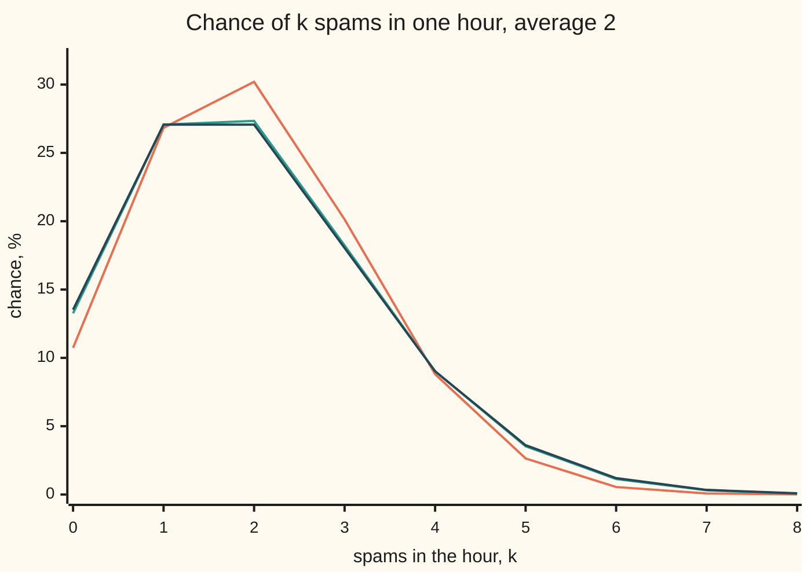
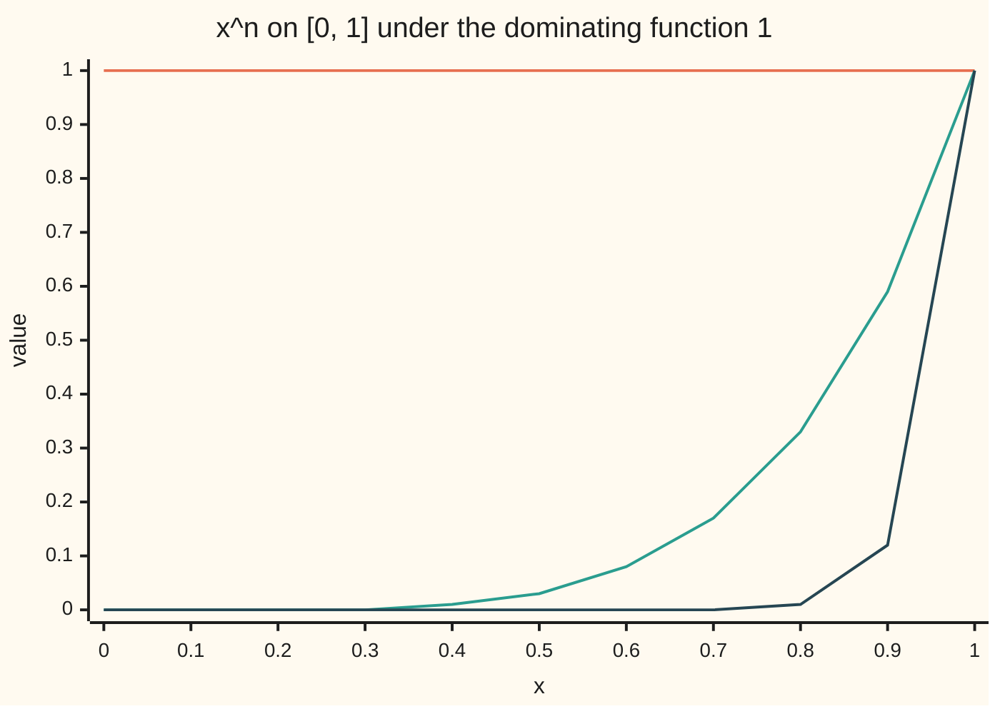

# Dominated convergence: one integrable roof over the whole sequence lets you swap limit and integral

[Syllabus](../../../SYLLABUS.md) → [Measure and integration](../README.md) → [Swapping Limits and Integrals](../README.md#s05) → Dominated convergence

---

## General Overview

A mail server logs spam at an average of 2 messages an hour. A standard model cuts the hour into n equal slots and lets each slot hold one spam with chance 2/n, independently of the others. With 10 slots the chance of a spam-free hour is 0.8^10 = 0.1074. With 100 slots it is 0.1326, with 1,000 it is 0.1351, closing in on e^(−2) = 0.1353. Every other count behaves the same way: the chance of exactly k spams settles on the Poisson value e^(−2) 2^k/k! ([Poisson](../../09-Probability%20and%20statistics/03-Discrete%20Distributions/04-poisson.md) proves this one count at a time).

One count at a time is not enough. The mean, the spread and the chance of a burst of 5 or more are all sums over every count at once, and a limit of sums need not equal the sum of the limits. Put all of an hour's chance on the count n: at any fixed count the chance is 0 once n has passed it, so the limit is 0 everywhere, yet the total is 1 for every n. The mass slid away and took its total with it.

What stops the slide is a roof: one function, with a finite total, that lies above every member of the sequence at the same time. The spam chances have one, 2^k/k! (two to the k over k factorial), with total e^2 = 7.3891. The sliding mass has none. From here on the roof is called by its standard name, a **dominating function**, and the theorem that uses it is **dominated convergence**, Henri Lebesgue's theorem.

**If functions converge at almost every point and one integrable function lies above all of their sizes at once, then their integrals converge to the integral of the limit, and the total error between them goes to zero.**

**What kind of fact this is:** a theorem, proved on this card in Why it works from Fatou's lemma; its two corollaries, bounded convergence and Scheffé's lemma, are proved there too.

### The picture: binomial chances settling on the Poisson chances



Caption: orange is the binomial with 10 slots, green with 100 slots, dark blue the Poisson limit. The 1,000-slot line would sit on the Poisson line to the chart's precision. Chances are in per cent here only; everywhere else on the card they are decimals.

---

## The formula

Notation first, in words. A measure space $(\Omega,\mathcal F,\mu)$ is a set $\Omega$ (omega), the collection $\mathcal F$ of sets we allow ourselves to measure, and a measure $\mu$ (mu) giving each such set a size ([Measures](../01-Sets%20You%20Can%20Measure/04-measures.md)). The integral $\int f\,d\mu$ is read "the integral of f against mu". "Almost everywhere", written a.e., means "except on a set of size zero" ([Null sets and almost everywhere](../01-Sets%20You%20Can%20Measure/07-null-sets-and-almost-everywhere.md)). A function is **integrable**, in $L^1$, when $\int |f|\,d\mu$ is finite ([Integrable functions](../04-The%20Lebesgue%20Integral/04-integrable-functions-and-l1.md)).

One new measure carries the spam example. **Counting measure** on the counts 0, 1, 2, … gives a set of counts its number of members. Integrating against it is adding up: a non-negative function's integral is its series, because the partial sums rise to it ([The monotone convergence theorem](../04-The%20Lebesgue%20Integral/03-monotone-convergence-theorem.md)).

The theorem. Let $f_n$ and $f$ be measurable functions on $\Omega$, and $g$ a non-negative one.

$$\text{If}\quad f_n\to f\ \text{a.e.},\qquad |f_n|\le g\ \text{a.e. for every } n,\qquad \int g\,d\mu<\infty,$$

$$\text{then}\quad \int |f_n-f|\,d\mu\;\longrightarrow\;0\qquad\text{and}\qquad \lim_{n\to\infty}\int f_n\,d\mu=\int f\,d\mu .$$

**Read it aloud:** if the functions settle down point by point, and one function with a finite integral sits above all their sizes at once, then the total error goes to zero and the limit may be taken inside the integral.

Two corollaries do most of the daily work.

**Bounded convergence.** If $\mu(\Omega)<\infty$, $f_n\to f$ a.e., and $|f_n|\le M$ for one number $M$ and every n, the constant $M$ is a dominating function, with integral $M\,\mu(\Omega)$.

**Scheffé's lemma.** If $f_n\ge 0$, $f_n\to f$ a.e., and every $f_n$ has the same finite total as $f$, then

$$\int |f_n-f|\,d\mu\;\longrightarrow\;0,\qquad\text{and for every set } A\in\mathcal F:\quad \Big|\int_A f_n\,d\mu-\int_A f\,d\mu\Big|\le \tfrac12\int|f_n-f|\,d\mu .$$

**Read it aloud:** densities that converge point by point and keep the same total converge in total error, and half that total error bounds the error in every probability at once.

On the spam example, $\Omega$ is the counts and $\mu$ is counting measure. With $p_n(k)=\binom{n}{k}(2/n)^k(1-2/n)^{n-k}$ the binomial chance of k spams in n slots, and $q(k)=e^{-2}2^k/k!$ the Poisson chance, the dominating function is $g(k)=2^k/k!$.

| Symbol | Plain meaning | In our example | Push it up and the answer… |
| --- | --- | --- | --- |
| $f_n$, $n$ | the n-th function of the sequence; its index | the binomial chances $p_n$; x^n on [0, 1] | larger n, closer to the limit |
| $f$, $e_n$ | the a.e. limit of the sequence; the error at stage n, the size of f_n − f | the Poisson chances $q$; 0 on [0, 1) | — |
| $g$ | dominating function: one integrable function above every $|f_n|$ | 2^k/k!, total 7.3891; the constant 1 | a larger roof is still a roof while its integral stays finite |
| $\Omega$, $\mu$ | the space and its measure | the counts with counting measure; [0, 1] with length | — |
| $\lambda$ | Lebesgue measure: length on the line | length on [0, 1] | — |
| $k$, $K$ | a count of spams; the random count itself | k = 0 to 60 in the code | tail chances shrink like 2^k/k! |
| $p_n$ | binomial chances with n slots and chance 2/n each | p_10(2) = 0.3020 | more slots, closer to q |
| $q$ | Poisson(2) chances, e^(−2) 2^k/k! | q(2) = 0.2707 | — |
| $h$ | a quantity computed from the count, then averaged | k^2; "5 or more" | faster growth needs a bigger roof |
| $M$ | a constant bound, for bounded convergence | 1, for x^n | — |
| $A$, $N$, $N_0$, $N_n$ | a measurable set (an event); null sets: all bad points, non-convergence points, points where f_n pokes above g | "5 or more spams"; the point x = 1 | — |
| $a^+$ | positive part: a when a > 0, else 0 | (q(k) − p_n(k))^+ | — |
| $u_n$ | any sequence of functions of zero or more, in the statement of Fatou's lemma | g + f_n and g − f_n in the proof | — |
| $R$ | the last count summed for the sliding mass | R = 10, 100, 1000 | the smallest roof's total grows with R |
| $x$, $\xi$, $i$ | a point of [0, 1] or of the line; a frequency (xi); the square root of −1 | x = 0.999, where x^1000 is still 0.3677 | — |

### When it holds

- **One dominating function for the whole sequence.** A separate bound for each n does not count. The tall spike (n+1)x^n on [0, 1] is bounded by n + 1 at stage n, a different constant each time, and keeps integral 1 while its limit has integral 0.
- **The dominating function is integrable.** The constant 1 dominates the sliding mass too, but on infinitely many counts its total is infinite, and the theorem says nothing.
- **It bounds the size, both signs.** A bound on one side only lets mass escape on the other: the negated spike −(n+1)x^n lies below 0 everywhere on [0, 1], and its integrals do not follow its limit.
- **Convergence almost everywhere.** A null set of bad points is harmless. Convergence only in a weaker sense, such as in probability, needs another route: a dominated family is uniformly integrable, and Vitali's theorem on [Uniform integrability](05-uniform-integrability.md) then gives the same conclusion.
- **Measurable functions.** Without measurability the integrals are not defined.

---

## Why it works

### Step 0: Fatou blocks leaks one way; a dominating function turns that into two ways

Fatou's lemma ([Fatou's lemma](01-fatous-lemma.md)) says that for non-negative functions, mass can vanish in a limit but never appear: $\int \liminf u_n\,d\mu \le \liminf \int u_n\,d\mu$, where liminf is the eventual lowest value. Signed functions could leak mass upward or downward. The trick is to add and subtract the dominating function: $g+f_n$ and $g-f_n$ are both non-negative. Fatou on the first stops a downward leak, Fatou on the second an upward one. Because $\int g\,d\mu$ is finite, it can be subtracted from both sides without meeting ∞ − ∞. Nothing leaks either way, so the integrals converge.

### Step 1: g + f_n gives the lower bound

The functions $g+f_n$ are non-negative and converge a.e. to $g+f$. Fatou gives $\int(g+f)\,d\mu\le\liminf\int(g+f_n)\,d\mu$. Split both integrals, which is legal because every piece is finite, and cancel $\int g\,d\mu$: the integral of the limit is at most the eventual lowest value of the integrals.

### Step 2: g − f_n gives the upper bound

The functions $g-f_n$ are non-negative too, converging to $g-f$. Fatou and the same cancellation give $-\int f\,d\mu\le\liminf(-\int f_n\,d\mu)=-\limsup\int f_n\,d\mu$. So the eventual highest value of the integrals is at most the integral of the limit. With Step 1, the eventual lowest and highest values both equal $\int f\,d\mu$, and the limit exists.

### Step 3: the total error goes to zero

Apply Steps 1 and 2 to the errors $|f_n-f|$. They converge to 0 a.e., and $|f_n-f|\le|f_n|+|f|\le 2g$, so $2g$ dominates them. Their integrals therefore converge to the integral of 0, which is 0. The first conclusion is stronger than the second: $|\int f_n\,d\mu-\int f\,d\mu|\le\int|f_n-f|\,d\mu$.

<details>
<summary>Detailed proof</summary>

**Setting.** $(\Omega,\mathcal F,\mu)$ is a measure space; $f_n$, $f$ are measurable and real-valued; $g$ is measurable with values in [0, ∞]; $f_n\to f$ a.e.; for each n, $|f_n|\le g$ a.e.; $\int g\,d\mu<\infty$.

**1. Clearing the null sets.** Let $N_0$ be the set where $f_n(x)$ does not converge to $f(x)$, and $N_n$ the set where $|f_n|>g$. Each is measurable and has measure 0 by hypothesis. The set $\{g=\infty\}$ has measure 0 too: for every whole number m, $m\,\mathbf 1_{\{g=\infty\}}\le g$, so $m\,\mu(g=\infty)\le\int g\,d\mu<\infty$ for every m. Let $N$ be the union of all these sets; it is a countable union of null sets, so $\mu(N)=0$ by countable subadditivity ([Measures](../01-Sets%20You%20Can%20Measure/04-measures.md)). Replace $f_n$, $f$ and $g$ by 0 on $N$. The new functions are measurable, and no integral changes, since functions equal a.e. have equal integrals ([The integral of a non-negative function](../04-The%20Lebesgue%20Integral/02-integral-of-a-nonnegative-function.md)). From here on convergence and domination hold at every point, and $g$ is finite.

**2. Everything is integrable.** Letting n → ∞ in $|f_n(x)|\le g(x)$ gives $|f(x)|\le g(x)$. Monotonicity of the integral gives $\int|f_n|\,d\mu\le\int g\,d\mu<\infty$ and $\int|f|\,d\mu\le\int g\,d\mu$, so every $f_n$ and $f$ is in $L^1$, and linearity of the integral holds for them ([Integrable functions](../04-The%20Lebesgue%20Integral/04-integrable-functions-and-l1.md)).

**3. Lower bound.** $g+f_n\ge0$ and $g+f_n\to g+f$ at every point, so $\liminf(g+f_n)=g+f$. Fatou's lemma: $\int(g+f)\,d\mu\le\liminf_n\int(g+f_n)\,d\mu$. By linearity on integrable functions, the left side is $\int g\,d\mu+\int f\,d\mu$ and the right side is $\int g\,d\mu+\liminf_n\int f_n\,d\mu$, since adding a fixed number commutes with liminf. Subtract the finite number $\int g\,d\mu$: $\int f\,d\mu\le\liminf_n\int f_n\,d\mu$.

**4. Upper bound.** $g-f_n\ge0$ and $g-f_n\to g-f$. Fatou and linearity give $\int g\,d\mu-\int f\,d\mu\le\int g\,d\mu+\liminf_n(-\int f_n\,d\mu)$. For any real sequence, $\liminf(-a_n)=-\limsup a_n$, since negation turns lowest tail values into highest ones. Subtract $\int g\,d\mu$ and multiply by −1: $\limsup_n\int f_n\,d\mu\le\int f\,d\mu$.

**5. The limit of the integrals.** From 3 and 4, $\limsup_n\int f_n\,d\mu\le\int f\,d\mu\le\liminf_n\int f_n\,d\mu$. A liminf never exceeds the limsup, so all three are equal, and $\int f_n\,d\mu\to\int f\,d\mu$.

**6. The total error.** Put $e_n=|f_n-f|$. These are measurable, $e_n\to0$ at every point, and $e_n\le|f_n|+|f|\le 2g$, with $\int 2g\,d\mu<\infty$. Steps 3 to 5 applied to $e_n$ with dominating function $2g$ give $\int e_n\,d\mu\to\int 0\,d\mu=0$. Finally $|\int f_n\,d\mu-\int f\,d\mu|=|\int(f_n-f)\,d\mu|\le\int|f_n-f|\,d\mu$, the triangle inequality for integrals. ∎

**Bounded convergence.** If $\mu(\Omega)<\infty$, $f_n\to f$ a.e., and $|f_n|\le M$ for all n, take $g=M$: $\int g\,d\mu=M\mu(\Omega)<\infty$. ∎

**Scheffé's lemma.** Suppose $f_n\ge0$, $f\ge0$, $f_n\to f$ a.e., and $\int f_n\,d\mu=\int f\,d\mu<\infty$ for all n. The functions $(f-f_n)^+$ are measurable, converge to $(f-f)^+=0$ a.e. because $a\mapsto a^+$ is continuous, and satisfy $0\le(f-f_n)^+\le f$ because $f_n\ge0$. So $f$ dominates them, and the theorem gives $\int(f-f_n)^+\,d\mu\to0$. For any real a, $|a|=a+2(-a)^+$. With $a=f_n-f$ this reads $|f_n-f|=(f_n-f)+2(f-f_n)^+$. Integrate, using linearity on integrable functions: $\int|f_n-f|\,d\mu=\int f_n\,d\mu-\int f\,d\mu+2\int(f-f_n)^+\,d\mu=2\int(f-f_n)^+\,d\mu\to0$.

For a set $A\in\mathcal F$: $\int_A f_n\,d\mu-\int_A f\,d\mu=\int_A(f_n-f)\,d\mu\le\int(f_n-f)^+\,d\mu$. Equal totals give $\int(f_n-f)\,d\mu=0$, so $\int(f_n-f)^+\,d\mu=\int(f-f_n)^+\,d\mu$, and each is half of $\int|f_n-f|\,d\mu$. The same argument with the roles of $f_n$ and $f$ swapped bounds the difference from below. ∎

</details>

### Step 4: the spam chances have a dominating function

Write the binomial chance as three factors:

$$p_n(k)=\underbrace{\frac{n}{n}\cdot\frac{n-1}{n}\cdots\frac{n-k+1}{n}}_{\text{each factor}\ \le 1}\;\cdot\;\frac{2^k}{k!}\;\cdot\;\underbrace{\Big(1-\frac2n\Big)^{n-k}}_{\le 1}\qquad(k\le n),$$

and $p_n(k)=0$ for $k>n$. For fixed k, the first factor tends to 1 and the last to $e^{-2}$, which is the Poisson limit. Both outer factors are at most 1 for every n, so $p_n(k)\le 2^k/k!$ at every count and every n. That is one dominating function for the whole sequence, with total $e^2$ = 7.3891.

Now any quantity $h(k)$ with $\sum_k |h(k)|\,2^k/k!<\infty$ passes to the limit: $|h(k)|\,2^k/k!$ dominates $h(k)\,p_n(k)$, so $\sum_k h(k)\,p_n(k)\to\sum_k h(k)\,q(k)$. For $h(k)=k^2$ the dominating total is $6e^2$ = 44.3343, finite. So the average of the squared count converges: 5.6000 at 10 slots, 5.9600 at 100, 5.9960 at 1,000, toward the Poisson value 6. The variance, average square minus squared mean, goes 1.6000, 1.9600, 1.9960, toward 2.

On counting measure this special case has its own name, Tannery's theorem: a series whose terms converge one by one, with every term bounded by the matching term of one convergent series, converges to the series of the limits. The Weierstrass M-test on [Uniform convergence](../../06-Calculus%20and%20analysis/06-Series/07-uniform-convergence.md) uses the same bound.

### Step 5: bounded convergence, and a limit that is not uniform

On [0, 1] with length $\lambda$, the functions x^n converge to 0 at every x below 1 and equal 1 at x = 1. That single point is a null set, so x^n → 0 a.e. The constant 1 dominates every one of them, and $\lambda([0,1])=1$, so bounded convergence gives $\int_0^1 x^n\,dx\to0$. The exact values 1/(n+1) agree: 0.500000, 0.090909, 0.009901, 0.000999 at n = 1, 10, 100, 1000.

The convergence is not uniform. At x = 0.999 the function x^1000 is still 0.3677, and just below 1 there are always points where x^n is close to 1. The Riemann-era theorem that swaps a limit and an integral needs uniform convergence ([Swapping limits](../../06-Calculus%20and%20analysis/06-Series/08-swapping-limits-with-integrals-and-derivatives.md)), so it cannot say this. The dominating function can.



Caption: orange is the dominating function 1, green is x^5, dark blue is x^20. The area under each curve drains toward 0 while the right end stays pinned at 1.

### Step 6: Scheffé, where equal totals supply the dominating function

The spam chances converge count by count, and every one of them totals 1, as the Poisson chances do. Scheffé's lemma needs nothing more. Its proof uses the limit $q$ itself as the dominating function, not for $p_n$ but for the shortfall $(q-p_n)^+$, which can never exceed $q$ because $p_n$ is never negative. The shortfall's total goes to 0, and equal totals make the full error exactly twice the shortfall: $\sum_k|p_n(k)-q(k)|=2\sum_k(q(k)-p_n(k))^+$.

The total errors are 0.1044, 0.0091 and 0.0009 at 10, 100 and 1,000 slots. Half of each bounds the error in the chance of every event at once. The chance of a burst of 5 or more spams is 0.0527 under Poisson and 0.0328 under the 10-slot binomial: the gap 0.0199 is under the bound 0.0522. At 1,000 slots the gap is 0.0002 against a bound of 0.0005. One number certifies every probability about the count, which is what makes the Poisson law safe to use in place of the binomial. An outside check agrees: Le Cam's inequality bounds the same total error by 8/n, that is 0.8000, 0.0800 and 0.0080, and every total error above sits under it.

### Step 7: a missing dominating function is the diagnosis

Any dominating function must lie above $\sup_n|f_n|$, the pointwise highest value over the whole sequence. So a dominating function exists exactly when that supremum has a finite integral. For the sliding mass, all of the chance at count n, the supremum is 1 at every count from 1 on. Its total over counts 1 to R is R: 10, 100, 1000, without end. No integrable roof exists.

The theorem also works backwards. If the integrals of a sequence fail to follow its a.e. limit, no integrable dominating function can exist, since one would force them to follow. The tall spike (n+1)x^n on [0, 1] tends to 0 below x = 1 but has integral 1.0000 for every n, so no roof over it has a finite integral. The sharp condition, weaker than a roof and exactly enough, is [Uniform integrability](05-uniform-integrability.md).

---

## Worked numbers, by hand

The 10-slot chance of exactly 2 spams, checked under the roof, then carried to the average square and Scheffé's bound.

| Step | Arithmetic | Value |
| --- | --- | --- |
| first factor at n = 10, k = 2 | 10 × 9 / 100 | 0.9000 |
| roof at k = 2 | 2^2 / 2! | 2.0000 |
| last factor | (1 − 2/10)^8 = 0.8^8 | 0.1678 |
| binomial chance p_10(2) | 0.9000 × 2.0000 × 0.1678 | 0.3020 |
| Poisson chance q(2) | e^(−2) × 2^2/2! = 0.135335 × 2 | 0.2707 |
| under the roof? | 0.3020 ≤ 2.0000 | yes |
| average square at n = 10 | variance 2(1 − 2/10) = 1.6000, plus mean^2 = 4 | 5.6000 |
| Poisson average square | 2 + 2^2 | 6.0000 |
| Scheffé total error at n = 10 | sum over k of the gaps, or twice the shortfalls | 0.1044 |
| burst of 5 or more | binomial 0.0328, Poisson 0.0527 | **gap 0.0199 ≤ 0.0522** |

With 10 slots, reading chances off the Poisson table instead of the binomial one is wrong by at most 0.0522 for any probability about the hour's count, and the burst question is off by 0.0199.

### What breaks if you drop a piece

| Mistake | Comes out at | What went wrong |
| --- | --- | --- |
| No dominating function: all the chance slides to count n | total 1 for every n; limit total 0 | the smallest roof sums to 10, 100, 1000 over counts up to 10, 100, 1000: infinite |
| A storm hour: n^2 spams with chance 1/n, binomial otherwise | total error 0.2037, 0.0200, 0.0020, yet mean 11.8000, 101.9800, 1001.9980, not 2 | Scheffé controls bounded questions only; k times the chance has no integrable roof |
| The tall spike (n+1)x^n on [0, 1] | integral 1.0000 at every n; limit 0 a.e. | its supremum has infinite integral; mass piles up at x = 1 |
| Using the limit q as the roof for p_n | p_10(2) = 0.3020 > q(2) = 0.2707 | the binomial peaks higher than the Poisson; the roof must lie above every member |

---

## Code, from first principles, and it actually runs

The code builds each binomial chance twice, by the three-factor product and by a recursion from count to count, and e^(−2) twice, from its own series and as the reciprocal of the series for e^2. It checks the roof 2^k/k! at every count for n = 10, 100 and 1,000, then takes the average and the average square by summing and compares them with the closed forms. Scheffé's total error is found as the sum of gaps and as twice the shortfall; the burst gap is checked against half of it and Le Cam's bound 8/n. For x^n a midpoint sum is compared with 1/(n+1). Every row of What breaks is printed.

The code checks three sequences at three stages each and sums counts up to 60; the roof's tail beyond that totals 4.7e-66. That the integrals converge for every sequence under every integrable roof, on every measure space, is what only the Detailed proof shows.

### Python

```python
# Dominated convergence -- the check behind the card.  Standard library only.
# Spam at 2 per hour: cut the hour into n slots, each holding one spam with
# chance 2/n.  The count K is binomial(n, 2/n); its masses p_n(k) tend to the
# Poisson(2) masses q(k).  A sum over k is an integral against counting measure.
# Road one builds each mass as a product; road two by a recursion or a closed
# form.  Then the roof 2^k/k!, the swapped limits, Scheffe's total error,
# x^n on [0, 1] under the roof 1, and what breaks when no roof exists.
KMAX = 60                                     # counts above 60: the roof's tail is printed
NS = (10, 100, 1000)

def exp_series(t, terms=90):                  # e^t from its power series
    s, term = 0.0, 1.0
    for j in range(terms):
        s += term
        term *= t / (j + 1)
    return s

def roof(k):                                  # g(k) = 2^k / k!
    r = 1.0
    for i in range(k):
        r *= 2 / (i + 1)
    return r

def binom_product(n, k):                      # [n(n-1)...(n-k+1)/n^k] x 2^k/k! x (1 - 2/n)^(n-k)
    if k > n:
        return 0.0
    c = 1.0
    for i in range(k):
        c *= (n - i) / n * 2 / (i + 1)
    return c * (1 - 2 / n) ** (n - k)

def binom_recursion(n):                       # p(k+1) = p(k) x (n-k)/(k+1) x 2/(n-2)
    p = [(1 - 2 / n) ** n]
    for k in range(KMAX):
        p.append(p[-1] * (n - k) / (k + 1) * 2 / (n - 2))
    return p

def midpoint(f, m=200000):                    # integral over [0, 1] by midpoints
    return sum(f((i + 0.5) / m) for i in range(m)) / m

# the limit q(k) = e^(-2) 2^k/k!, two ways to e^(-2)
e_a, e_b = exp_series(-2.0), 1 / exp_series(2.0)
q = [e_a * roof(k) for k in range(KMAX + 1)]
q2 = [e_b]
for k in range(KMAX):
    q2.append(q2[-1] * 2 / (k + 1))
assert max(abs(a - b) for a, b in zip(q, q2)) < 1e-15
print(f"e^(-2): series {e_a:.10f}, 1/(series for e^2) {e_b:.10f}")
print(f"by hand, n = 10, k = 2: 10 x 9/100 = {10 * 9 / 100:.4f}, roof {roof(2):.4f}, 0.8^8 = {0.8 ** 8:.4f},"
      f" product {10 * 9 / 100 * roof(2) * 0.8 ** 8:.4f}; q(2) = e^(-2) x 2 = {e_a:.6f} x 2 = {q[2]:.4f}")

P = {n: [binom_product(n, k) for k in range(KMAX + 1)] for n in NS}
for n in NS:
    assert max(abs(a - b) for a, b in zip(P[n], binom_recursion(n))) < 1e-13
print("k   n = 10   n = 100  n = 1000  Poisson  roof 2^k/k!")
for k in range(9):
    print(f"{k}   {P[10][k]:.4f}   {P[100][k]:.4f}   {P[1000][k]:.4f}    {q[k]:.4f}   {roof(k):.4f}")

# the roof: p_n(k) <= 2^k/k! at every count, for every n
under = [all(binom_product(n, k) <= roof(k) for k in range(n + 1)) for n in NS]
print("roof holds at every count: " + ", ".join(f"n = {n} {'yes' if u else 'no'}" for n, u in zip(NS, under)))
assert all(under)
tail = sum(roof(k) for k in range(KMAX + 1, 200))
print(f"roof totals: sum 2^k/k! = {sum(roof(k) for k in range(200)):.4f} = e^2; sum k^2 2^k/k! = "
      f"{sum(k * k * roof(k) for k in range(200)):.4f} = 6e^2; tail above k = {KMAX}: {tail:.1e}")

# dominated convergence: mean and E[K^2] follow the masses
for n in NS:
    m1 = sum(k * p for k, p in enumerate(P[n]))
    m2 = sum(k * k * p for k, p in enumerate(P[n]))
    print(f"n = {n}: mean {m1:.4f} (formula 2), E[K^2] {m2:.4f} (formula 6 - 4/n = {6 - 4 / n:.4f}),"
          f" variance {m2 - m1 * m1:.4f}")
    assert abs(m2 - (6 - 4 / n)) < 1e-9
m1 = sum(k * p for k, p in enumerate(q))
m2 = sum(k * k * p for k, p in enumerate(q))
print(f"Poisson: mean {m1:.4f}, E[K^2] {m2:.4f} (formula 2 + 4 = 6), variance {m2 - m1 * m1:.4f}")
assert abs(m2 - 6) < 1e-12

# Scheffe: equal totals turn pointwise convergence into total-error convergence
qb = 1 - sum(q[:5])
L1 = {}
for n in NS:
    L1[n] = sum(abs(a - b) for a, b in zip(P[n], q))
    pos = sum(max(b - a, 0.0) for a, b in zip(P[n], q))
    over = [k for k in range(KMAX + 1) if P[n][k] > q[k]]
    print(f"Scheffe, n = {n}: sum |p - q| = {L1[n]:.4f}; 2 x sum (q - p)+ = {2 * pos:.4f};"
          f" Le Cam bound 8/n = {8 / n:.4f}; p above q at counts {over}")
    assert abs(L1[n] - 2 * pos) < 1e-12
    assert L1[n] <= 8 / n
    pb = 1 - sum(P[n][:5])
    print(f"  burst of 5 or more: binomial {pb:.4f}, Poisson {qb:.4f}, gap {abs(pb - qb):.4f}"
          f" <= half the total error {L1[n] / 2:.4f}")
    assert abs(pb - qb) <= L1[n] / 2
for lab, row in (("n = 10", P[10]), ("n = 100", P[100]), ("Poisson", q)):
    print(f"chart %, {lab}: " + ", ".join(f"{100 * v:.2f}" for v in row[:9]))

# x^n on [0, 1] under the roof 1 (bounded convergence)
spike = {}
for n in (1, 10, 100, 1000):
    I = midpoint(lambda x: x ** n)
    spike[n] = (n + 1) * I
    print(f"x^n, n = {n}: midpoint sum {I:.6f}, exact 1/(n+1) = {1 / (n + 1):.6f};"
          f" at x = 0.999 still {0.999 ** n:.4f}")
    assert abs(I - 1 / (n + 1)) < 1e-6
print("chart roof g = 1: " + ", ".join(f"{1.0:.2f}" for j in range(11)))
for n in (5, 20):
    print(f"chart x^n, n = {n}: " + ", ".join(f"{(j / 10) ** n:.2f}" for j in range(11)))

# what breaks
env = [sum(max(1 if k == n else 0 for n in range(1, R + 1)) for k in range(1, R + 1)) for R in NS]
print(f"breaks, sliding mass at count n: total 1, limit 0 at every count;"   # all the chance at count n
      f" smallest roof summed over counts 1..R = {env[0]}, {env[1]}, {env[2]} for R = 10, 100, 1000")
for n in NS:                                  # storm hour: n^2 spams with chance 1/n
    s_l1 = sum(abs((1 - 1 / n) * a - b) for a, b in zip(P[n], q)) + 1 / n
    s_mean = sum(k * (1 - 1 / n) * p for k, p in enumerate(P[n])) + n * n / n
    print(f"breaks, storm hour, n = {n}: total error {s_l1:.4f}, mean {s_mean:.4f} (formula 2(1 - 1/n) + n = {2 * (1 - 1 / n) + n:.4f})")
    assert abs(s_mean - (2 * (1 - 1 / n) + n)) < 1e-9
print(f"breaks, spike (n+1)x^n: integral {spike[10]:.4f}, {spike[100]:.4f}, {spike[1000]:.4f} at n = 10, 100, 1000; limit 0 below x = 1")
assert abs(spike[1000] - 1) < 1e-3
print(f"breaks, the limit as roof: p_10(2) = {P[10][2]:.4f} > q(2) = {q[2]:.4f}")
assert P[10][2] > q[2]
print("ALL CHECKS PASS")
```

**Ran 2026-10-07 on macOS, Python 3.14.6, standard library only. All checks passed. Output, pasted from the run:**

```
e^(-2): series 0.1353352832, 1/(series for e^2) 0.1353352832
by hand, n = 10, k = 2: 10 x 9/100 = 0.9000, roof 2.0000, 0.8^8 = 0.1678, product 0.3020; q(2) = e^(-2) x 2 = 0.135335 x 2 = 0.2707
k   n = 10   n = 100  n = 1000  Poisson  roof 2^k/k!
0   0.1074   0.1326   0.1351    0.1353   1.0000
1   0.2684   0.2707   0.2707    0.2707   2.0000
2   0.3020   0.2734   0.2709    0.2707   2.0000
3   0.2013   0.1823   0.1806    0.1804   1.3333
4   0.0881   0.0902   0.0902    0.0902   0.6667
5   0.0264   0.0353   0.0360    0.0361   0.2667
6   0.0055   0.0114   0.0120    0.0120   0.0889
7   0.0008   0.0031   0.0034    0.0034   0.0254
8   0.0001   0.0007   0.0008    0.0009   0.0063
roof holds at every count: n = 10 yes, n = 100 yes, n = 1000 yes
roof totals: sum 2^k/k! = 7.3891 = e^2; sum k^2 2^k/k! = 44.3343 = 6e^2; tail above k = 60: 4.7e-66
n = 10: mean 2.0000 (formula 2), E[K^2] 5.6000 (formula 6 - 4/n = 5.6000), variance 1.6000
n = 100: mean 2.0000 (formula 2), E[K^2] 5.9600 (formula 6 - 4/n = 5.9600), variance 1.9600
n = 1000: mean 2.0000 (formula 2), E[K^2] 5.9960 (formula 6 - 4/n = 5.9960), variance 1.9960
Poisson: mean 2.0000, E[K^2] 6.0000 (formula 2 + 4 = 6), variance 2.0000
Scheffe, n = 10: sum |p - q| = 0.1044; 2 x sum (q - p)+ = 0.1044; Le Cam bound 8/n = 0.8000; p above q at counts [2, 3]
  burst of 5 or more: binomial 0.0328, Poisson 0.0527, gap 0.0199 <= half the total error 0.0522
Scheffe, n = 100: sum |p - q| = 0.0091; 2 x sum (q - p)+ = 0.0091; Le Cam bound 8/n = 0.0800; p above q at counts [2, 3]
  burst of 5 or more: binomial 0.0508, Poisson 0.0527, gap 0.0018 <= half the total error 0.0046
Scheffe, n = 1000: sum |p - q| = 0.0009; 2 x sum (q - p)+ = 0.0009; Le Cam bound 8/n = 0.0080; p above q at counts [2, 3]
  burst of 5 or more: binomial 0.0525, Poisson 0.0527, gap 0.0002 <= half the total error 0.0005
chart %, n = 10: 10.74, 26.84, 30.20, 20.13, 8.81, 2.64, 0.55, 0.08, 0.01
chart %, n = 100: 13.26, 27.07, 27.34, 18.23, 9.02, 3.53, 1.14, 0.31, 0.07
chart %, Poisson: 13.53, 27.07, 27.07, 18.04, 9.02, 3.61, 1.20, 0.34, 0.09
x^n, n = 1: midpoint sum 0.500000, exact 1/(n+1) = 0.500000; at x = 0.999 still 0.9990
x^n, n = 10: midpoint sum 0.090909, exact 1/(n+1) = 0.090909; at x = 0.999 still 0.9900
x^n, n = 100: midpoint sum 0.009901, exact 1/(n+1) = 0.009901; at x = 0.999 still 0.9048
x^n, n = 1000: midpoint sum 0.000999, exact 1/(n+1) = 0.000999; at x = 0.999 still 0.3677
chart roof g = 1: 1.00, 1.00, 1.00, 1.00, 1.00, 1.00, 1.00, 1.00, 1.00, 1.00, 1.00
chart x^n, n = 5: 0.00, 0.00, 0.00, 0.00, 0.01, 0.03, 0.08, 0.17, 0.33, 0.59, 1.00
chart x^n, n = 20: 0.00, 0.00, 0.00, 0.00, 0.00, 0.00, 0.00, 0.00, 0.01, 0.12, 1.00
breaks, sliding mass at count n: total 1, limit 0 at every count; smallest roof summed over counts 1..R = 10, 100, 1000 for R = 10, 100, 1000
breaks, storm hour, n = 10: total error 0.2037, mean 11.8000 (formula 2(1 - 1/n) + n = 11.8000)
breaks, storm hour, n = 100: total error 0.0200, mean 101.9800 (formula 2(1 - 1/n) + n = 101.9800)
breaks, storm hour, n = 1000: total error 0.0020, mean 1001.9980 (formula 2(1 - 1/n) + n = 1001.9980)
breaks, spike (n+1)x^n: integral 1.0000, 1.0000, 1.0000 at n = 10, 100, 1000; limit 0 below x = 1
breaks, the limit as roof: p_10(2) = 0.3020 > q(2) = 0.2707
ALL CHECKS PASS
```

### Rust

Same rows, same labels, built with `rustc --edition 2021 -O`. The two outputs are identical.

```rust
// Dominated convergence -- the same check as the Python, in Rust.  No crates.
// Spam at 2 per hour: cut the hour into n slots, each holding one spam with
// chance 2/n.  The count K is binomial(n, 2/n); its masses p_n(k) tend to the
// Poisson(2) masses q(k).  A sum over k is an integral against counting measure.
// Road one builds each mass as a product; road two by a recursion or a closed
// form.  Then the roof 2^k/k!, the swapped limits, Scheffe's total error,
// x^n on [0, 1] under the roof 1, and what breaks when no roof exists.
const KMAX: usize = 60; // counts above 60: the roof's tail is printed
const NS: [usize; 3] = [10, 100, 1000];

fn exp_series(t: f64) -> f64 {
    // e^t from its power series
    let (mut s, mut term) = (0.0, 1.0);
    for j in 0..90 {
        s += term;
        term *= t / (j as f64 + 1.0);
    }
    s
}

fn roof(k: usize) -> f64 {
    // g(k) = 2^k / k!
    (0..k).fold(1.0, |r, i| r * 2.0 / (i as f64 + 1.0))
}

fn binom_product(n: usize, k: usize) -> f64 {
    // [n(n-1)...(n-k+1)/n^k] x 2^k/k! x (1 - 2/n)^(n-k)
    if k > n {
        return 0.0;
    }
    let nf = n as f64;
    let c = (0..k).fold(1.0, |c, i| c * ((nf - i as f64) / nf * 2.0 / (i as f64 + 1.0)));
    c * (1.0 - 2.0 / nf).powi((n - k) as i32)
}

fn binom_recursion(n: usize) -> Vec<f64> {
    // p(k+1) = p(k) x (n-k)/(k+1) x 2/(n-2)
    let nf = n as f64;
    let mut p = vec![(1.0 - 2.0 / nf).powi(n as i32)];
    for k in 0..KMAX {
        let last = p[k];
        p.push(last * (nf - k as f64) / (k as f64 + 1.0) * 2.0 / (nf - 2.0));
    }
    p
}

fn midpoint(f: &dyn Fn(f64) -> f64) -> f64 {
    // integral over [0, 1] by midpoints
    let m = 200000;
    (0..m).map(|i| f((i as f64 + 0.5) / m as f64)).sum::<f64>() / m as f64
}

fn row(v: &[f64], scale: f64) -> String {
    v.iter().map(|x| format!("{:.2}", scale * x)).collect::<Vec<_>>().join(", ")
}

fn main() {
    // the limit q(k) = e^(-2) 2^k/k!, two ways to e^(-2)
    let (e_a, e_b) = (exp_series(-2.0), 1.0 / exp_series(2.0));
    let q: Vec<f64> = (0..=KMAX).map(|k| e_a * roof(k)).collect();
    let mut q2 = vec![e_b];
    for k in 0..KMAX {
        let last = q2[k];
        q2.push(last * 2.0 / (k as f64 + 1.0));
    }
    assert!(q.iter().zip(&q2).all(|(a, b)| (a - b).abs() < 1e-15));
    println!("e^(-2): series {:.10}, 1/(series for e^2) {:.10}", e_a, e_b);
    println!("by hand, n = 10, k = 2: 10 x 9/100 = {:.4}, roof {:.4}, 0.8^8 = {:.4}, product {:.4}; q(2) = e^(-2) x 2 = {:.6} x 2 = {:.4}",
        10.0 * 9.0 / 100.0, roof(2), 0.8f64.powi(8), 10.0 * 9.0 / 100.0 * roof(2) * 0.8f64.powi(8), e_a, q[2]);

    let p: Vec<Vec<f64>> = NS.iter().map(|&n| (0..=KMAX).map(|k| binom_product(n, k)).collect()).collect();
    for (i, &n) in NS.iter().enumerate() {
        assert!(p[i].iter().zip(binom_recursion(n)).all(|(a, b)| (a - b).abs() < 1e-13));
    }
    println!("k   n = 10   n = 100  n = 1000  Poisson  roof 2^k/k!");
    for k in 0..9 {
        println!("{}   {:.4}   {:.4}   {:.4}    {:.4}   {:.4}", k, p[0][k], p[1][k], p[2][k], q[k], roof(k));
    }

    // the roof: p_n(k) <= 2^k/k! at every count, for every n
    let under: Vec<bool> = NS.iter().map(|&n| (0..=n).all(|k| binom_product(n, k) <= roof(k))).collect();
    let shown: Vec<String> = NS.iter().zip(&under).map(|(n, u)| format!("n = {} {}", n, if *u { "yes" } else { "no" })).collect();
    println!("roof holds at every count: {}", shown.join(", "));
    assert!(under.iter().all(|u| *u));
    let tail: f64 = (KMAX + 1..200).map(roof).sum();
    let total: f64 = (0..200).map(roof).sum();
    let total2: f64 = (0..200).map(|k| (k * k) as f64 * roof(k)).sum();
    println!("roof totals: sum 2^k/k! = {:.4} = e^2; sum k^2 2^k/k! = {:.4} = 6e^2; tail above k = {}: {:.1e}", total, total2, KMAX, tail);

    // dominated convergence: mean and E[K^2] follow the masses
    let moments = |v: &[f64]| -> (f64, f64) {
        let m1: f64 = v.iter().enumerate().map(|(k, x)| k as f64 * x).sum();
        let m2: f64 = v.iter().enumerate().map(|(k, x)| (k * k) as f64 * x).sum();
        (m1, m2)
    };
    for (i, &n) in NS.iter().enumerate() {
        let (m1, m2) = moments(&p[i]);
        let f2 = 6.0 - 4.0 / n as f64;
        println!("n = {}: mean {:.4} (formula 2), E[K^2] {:.4} (formula 6 - 4/n = {:.4}), variance {:.4}", n, m1, m2, f2, m2 - m1 * m1);
        assert!((m2 - f2).abs() < 1e-9);
    }
    let (m1, m2) = moments(&q);
    println!("Poisson: mean {:.4}, E[K^2] {:.4} (formula 2 + 4 = 6), variance {:.4}", m1, m2, m2 - m1 * m1);
    assert!((m2 - 6.0).abs() < 1e-12);

    // Scheffe: equal totals turn pointwise convergence into total-error convergence
    let qb = 1.0 - q[..5].iter().sum::<f64>();
    for (i, &n) in NS.iter().enumerate() {
        let nf = n as f64;
        let l1: f64 = p[i].iter().zip(&q).map(|(a, b)| (a - b).abs()).sum();
        let pos: f64 = p[i].iter().zip(&q).map(|(a, b)| (b - a).max(0.0)).sum();
        let over: Vec<String> = (0..=KMAX).filter(|&k| p[i][k] > q[k]).map(|k| k.to_string()).collect();
        println!("Scheffe, n = {}: sum |p - q| = {:.4}; 2 x sum (q - p)+ = {:.4}; Le Cam bound 8/n = {:.4}; p above q at counts [{}]",
            n, l1, 2.0 * pos, 8.0 / nf, over.join(", "));
        assert!((l1 - 2.0 * pos).abs() < 1e-12);
        assert!(l1 <= 8.0 / nf);
        let pb = 1.0 - p[i][..5].iter().sum::<f64>();
        println!("  burst of 5 or more: binomial {:.4}, Poisson {:.4}, gap {:.4} <= half the total error {:.4}", pb, qb, (pb - qb).abs(), l1 / 2.0);
        assert!((pb - qb).abs() <= l1 / 2.0);
    }
    for (lab, v) in [("n = 10", &p[0]), ("n = 100", &p[1]), ("Poisson", &q)] {
        println!("chart %, {}: {}", lab, row(&v[..9], 100.0));
    }

    // x^n on [0, 1] under the roof 1 (bounded convergence)
    let mut spike = Vec::new();
    for n in [1i32, 10, 100, 1000] {
        let integral = midpoint(&|x: f64| x.powi(n));
        spike.push((n + 1) as f64 * integral);
        println!("x^n, n = {}: midpoint sum {:.6}, exact 1/(n+1) = {:.6}; at x = 0.999 still {:.4}", n, integral, 1.0 / (n + 1) as f64, 0.999f64.powi(n));
        assert!((integral - 1.0 / (n + 1) as f64).abs() < 1e-6);
    }
    println!("chart roof g = 1: {}", row(&[1.0; 11], 1.0));
    for n in [5i32, 20] {
        let v: Vec<f64> = (0..11).map(|j| (j as f64 / 10.0).powi(n)).collect();
        println!("chart x^n, n = {}: {}", n, row(&v, 1.0));
    }

    // what breaks
    let env: Vec<usize> = NS.iter().map(|&r| (1..=r).map(|k| (1..=r).map(|n| if k == n { 1 } else { 0 }).max().unwrap()).sum()).collect(); // all the chance at count n
    println!("breaks, sliding mass at count n: total 1, limit 0 at every count; smallest roof summed over counts 1..R = {}, {}, {} for R = 10, 100, 1000", env[0], env[1], env[2]);
    for (i, &n) in NS.iter().enumerate() {
        // storm hour: n^2 spams with chance 1/n
        let nf = n as f64;
        let s_l1: f64 = p[i].iter().zip(&q).map(|(a, b)| ((1.0 - 1.0 / nf) * a - b).abs()).sum::<f64>() + 1.0 / nf;
        let s_mean: f64 = p[i].iter().enumerate().map(|(k, x)| k as f64 * (1.0 - 1.0 / nf) * x).sum::<f64>() + nf * nf / nf;
        let f = 2.0 * (1.0 - 1.0 / nf) + nf;
        println!("breaks, storm hour, n = {}: total error {:.4}, mean {:.4} (formula 2(1 - 1/n) + n = {:.4})", n, s_l1, s_mean, f);
        assert!((s_mean - f).abs() < 1e-9);
    }
    println!("breaks, spike (n+1)x^n: integral {:.4}, {:.4}, {:.4} at n = 10, 100, 1000; limit 0 below x = 1", spike[1], spike[2], spike[3]);
    assert!((spike[3] - 1.0).abs() < 1e-3);
    println!("breaks, the limit as roof: p_10(2) = {:.4} > q(2) = {:.4}", p[0][2], q[2]);
    assert!(p[0][2] > q[2]);
    println!("ALL CHECKS PASS");
}
```

**Ran 2026-10-07 on macOS, rustc 1.98.1, no crates. All checks passed. Output, pasted from the run:**

```
e^(-2): series 0.1353352832, 1/(series for e^2) 0.1353352832
by hand, n = 10, k = 2: 10 x 9/100 = 0.9000, roof 2.0000, 0.8^8 = 0.1678, product 0.3020; q(2) = e^(-2) x 2 = 0.135335 x 2 = 0.2707
k   n = 10   n = 100  n = 1000  Poisson  roof 2^k/k!
0   0.1074   0.1326   0.1351    0.1353   1.0000
1   0.2684   0.2707   0.2707    0.2707   2.0000
2   0.3020   0.2734   0.2709    0.2707   2.0000
3   0.2013   0.1823   0.1806    0.1804   1.3333
4   0.0881   0.0902   0.0902    0.0902   0.6667
5   0.0264   0.0353   0.0360    0.0361   0.2667
6   0.0055   0.0114   0.0120    0.0120   0.0889
7   0.0008   0.0031   0.0034    0.0034   0.0254
8   0.0001   0.0007   0.0008    0.0009   0.0063
roof holds at every count: n = 10 yes, n = 100 yes, n = 1000 yes
roof totals: sum 2^k/k! = 7.3891 = e^2; sum k^2 2^k/k! = 44.3343 = 6e^2; tail above k = 60: 4.7e-66
n = 10: mean 2.0000 (formula 2), E[K^2] 5.6000 (formula 6 - 4/n = 5.6000), variance 1.6000
n = 100: mean 2.0000 (formula 2), E[K^2] 5.9600 (formula 6 - 4/n = 5.9600), variance 1.9600
n = 1000: mean 2.0000 (formula 2), E[K^2] 5.9960 (formula 6 - 4/n = 5.9960), variance 1.9960
Poisson: mean 2.0000, E[K^2] 6.0000 (formula 2 + 4 = 6), variance 2.0000
Scheffe, n = 10: sum |p - q| = 0.1044; 2 x sum (q - p)+ = 0.1044; Le Cam bound 8/n = 0.8000; p above q at counts [2, 3]
  burst of 5 or more: binomial 0.0328, Poisson 0.0527, gap 0.0199 <= half the total error 0.0522
Scheffe, n = 100: sum |p - q| = 0.0091; 2 x sum (q - p)+ = 0.0091; Le Cam bound 8/n = 0.0800; p above q at counts [2, 3]
  burst of 5 or more: binomial 0.0508, Poisson 0.0527, gap 0.0018 <= half the total error 0.0046
Scheffe, n = 1000: sum |p - q| = 0.0009; 2 x sum (q - p)+ = 0.0009; Le Cam bound 8/n = 0.0080; p above q at counts [2, 3]
  burst of 5 or more: binomial 0.0525, Poisson 0.0527, gap 0.0002 <= half the total error 0.0005
chart %, n = 10: 10.74, 26.84, 30.20, 20.13, 8.81, 2.64, 0.55, 0.08, 0.01
chart %, n = 100: 13.26, 27.07, 27.34, 18.23, 9.02, 3.53, 1.14, 0.31, 0.07
chart %, Poisson: 13.53, 27.07, 27.07, 18.04, 9.02, 3.61, 1.20, 0.34, 0.09
x^n, n = 1: midpoint sum 0.500000, exact 1/(n+1) = 0.500000; at x = 0.999 still 0.9990
x^n, n = 10: midpoint sum 0.090909, exact 1/(n+1) = 0.090909; at x = 0.999 still 0.9900
x^n, n = 100: midpoint sum 0.009901, exact 1/(n+1) = 0.009901; at x = 0.999 still 0.9048
x^n, n = 1000: midpoint sum 0.000999, exact 1/(n+1) = 0.000999; at x = 0.999 still 0.3677
chart roof g = 1: 1.00, 1.00, 1.00, 1.00, 1.00, 1.00, 1.00, 1.00, 1.00, 1.00, 1.00
chart x^n, n = 5: 0.00, 0.00, 0.00, 0.00, 0.01, 0.03, 0.08, 0.17, 0.33, 0.59, 1.00
chart x^n, n = 20: 0.00, 0.00, 0.00, 0.00, 0.00, 0.00, 0.00, 0.00, 0.01, 0.12, 1.00
breaks, sliding mass at count n: total 1, limit 0 at every count; smallest roof summed over counts 1..R = 10, 100, 1000 for R = 10, 100, 1000
breaks, storm hour, n = 10: total error 0.2037, mean 11.8000 (formula 2(1 - 1/n) + n = 11.8000)
breaks, storm hour, n = 100: total error 0.0200, mean 101.9800 (formula 2(1 - 1/n) + n = 101.9800)
breaks, storm hour, n = 1000: total error 0.0020, mean 1001.9980 (formula 2(1 - 1/n) + n = 1001.9980)
breaks, spike (n+1)x^n: integral 1.0000, 1.0000, 1.0000 at n = 10, 100, 1000; limit 0 below x = 1
breaks, the limit as roof: p_10(2) = 0.3020 > q(2) = 0.2707
ALL CHECKS PASS
```

> [!TIP]
> **Try changing**
> - **Guess first:** change both `[:5]` to `[:3]`, so the burst is 3 or more. Answer: binomial 0.3222 against Poisson 0.3233 at 10 slots, gap 0.0011; at 100 and 1,000 slots the gap prints as 0.0000. Every gap stays under the same half error, because Scheffé's bound covers every event.
> - **Guess first:** in the storm hour, replace `n * n / n` by `n / n`, a storm of n spams instead of n^2. Answer: the mean prints 2.8000 at n = 10 and the formula assert stops the run. A storm of n spams with chance 1/n adds 1 to the mean for every n, so the mean tends to 3, not 2: still no roof.
> - **Guess first:** set `m=100` in the midpoint sum. Answer: n = 1 still passes, since midpoints are exact for straight lines; n = 10 prints 0.090867 against 0.090909 and the assert stops the run. The code's integrator, not the theorem, broke.
> - **Guess first:** set `terms=5` in the exponential series. Answer: the two roads to e^(−2) disagree and the first assert stops the run.

---

## The usual mistake

> [!warning]
> **Bounding each function separately and calling it domination.** The sliding mass sits under the constant 1, whose total over all counts is infinite; the tall spike (n+1)x^n sits under n + 1, a different constant at each n. Neither is dominated: the theorem needs one function, the same for every n, with a finite integral. The test is the pointwise supremum over the whole sequence. If it has infinite integral, as the sliding mass's does (10, 100, 1000 over longer and longer ranges of counts), the theorem does not apply and the integrals may not follow the limit.
>
> - **Taking the limit as the roof.** The Poisson chances do not dominate the binomial ones: p_10(2) = 0.3020 exceeds q(2) = 0.2707. The roof 2^k/k! is higher, and still has finite total.
> - **Reading Scheffé as convergence of every average.** Total error 0.0020 at n = 1000 in the storm hour sits next to a mean of 1001.9980. Small total error controls bounded quantities; an unbounded one such as the count itself needs its own roof.
> - **Treating non-uniform convergence as fatal.** x^n is not uniformly close to 0 on [0, 1): x^1000 is still 0.3677 at x = 0.999. The integrals converge anyway, under the roof 1.
> - **Forgetting the null set.** x^n converges to 0 only below x = 1. The single point where it does not has length 0, and the theorem only asks for almost everywhere.

---

## Where you meet it in real life

- **Counting rare events.** Call-centre arrivals, insurance claims, defects on a line and server spam are modelled by Poisson counts. Scheffé's lemma is why swapping the exact binomial for the Poisson law is safe for every probability at once, with an error that shrinks as the slots do.
- **Statistics.** Proving that a sample average's expected value, or a likelihood's score, behaves in the limit means moving a limit inside an expectation. The standard justification is a dominating function, often a moment bound. Moving a derivative inside, as in [Differentiating under the integral sign](03-differentiating-under-the-integral.md), is this theorem applied to difference quotients.
- **Signals and the Fourier transform.** The Fourier transform of an integrable function is continuous because $|e^{-i\xi x}f(x)|\le|f(x)|$, one dominating function for every frequency (The Fourier transform of an absolutely integrable signal, and why it fades at infinity).
- **Conditional expectation.** Filtering and pricing move limits inside conditional averages; the conditional form of this theorem, proved from it, is what allows that ([The rules of conditional expectation](../09-Conditional%20Expectation/04-rules-of-conditional-expectation.md)).

> **Say it back**
> A limit of integrals is not always the integral of the limit: mass can slide or pile up and escape. One integrable function lying above every member of the sequence blocks that. The proof applies Fatou's lemma to the roof plus the functions and to the roof minus them, and the finite roof cancels. With a finite measure a constant bound is enough, and densities with equal totals dominate their own shortfalls, which is Scheffé's lemma. The binomial spam chances sit under 2^k/k!, so their averages and their probabilities all converge to the Poisson ones.

---

## What this builds on

- [Fatou's lemma](01-fatous-lemma.md): the one-sided inequality, used twice, that is the whole engine of the proof.
- [Integrable functions](../04-The%20Lebesgue%20Integral/04-integrable-functions-and-l1.md): signed integrals, linearity on integrable functions, and the finite subtraction the proof relies on.

## Where this goes next

- [Differentiating under the integral sign](03-differentiating-under-the-integral.md): difference quotients under one dominating function give the derivative of an integral.
- [Modes of convergence](04-modes-of-convergence.md): where total-error convergence sits among the other modes, with this theorem as the arrow from almost everywhere to in mean; the version for convergence in probability runs through [Uniform integrability](05-uniform-integrability.md).
- [The rules of conditional expectation](../09-Conditional%20Expectation/04-rules-of-conditional-expectation.md): the conditional version of dominated convergence.
- The Fourier transform of an absolutely integrable signal, and why it fades at infinity: continuity of the transform, one dominating function for all frequencies.
- Approximate identities: smoothing kernels that shrink to a point, whose limits are justified by domination.

---

## Sources

Verified 2026-09-29: every link below resolves to the page for the book or paper it names.

- Folland, Gerald B. *Real Analysis: Modern Techniques and Their Applications*, 2nd ed. Wiley, 1999. [Publisher page](https://www.wiley.com/en-us/Real+Analysis%3A+Modern+Techniques+and+Their+Applications%2C+2nd+Edition-p-9780471317166). The dominated convergence theorem proved by applying Fatou's lemma to g + f_n and g − f_n, the route this card follows.
- Axler, Sheldon. *Measure, Integration & Real Analysis*. Springer, Graduate Texts in Mathematics, 2020, open access. [Author's page with the free edition](https://measure.axler.net/). The dominated convergence theorem with full proof; Fatou's lemma as a guided exercise.
- Tao, Terence. *An Introduction to Measure Theory*. American Mathematical Society, Graduate Studies in Mathematics 126, 2011. [Author's page with the book](https://terrytao.wordpress.com/books/an-introduction-to-measure-theory/). The escape of mass to infinity, to width and to height, and why domination stops all three.
- Scheffé, Henry. "A Useful Convergence Theorem for Probability Distributions." *Annals of Mathematical Statistics* 18(3), 1947, 434–438. [DOI 10.1214/aoms/1177730390](https://doi.org/10.1214/aoms/1177730390). The lemma: pointwise convergence of densities gives convergence of every probability.
- Le Cam, Lucien. "An Approximation Theorem for the Poisson Binomial Distribution." *Pacific Journal of Mathematics* 10(4), 1960, 1181–1197. [DOI 10.2140/pjm.1960.10.1181](https://doi.org/10.2140/pjm.1960.10.1181). The bound 2Σp^2 on the total error between a sum of independent yes/no counts and the Poisson law, here 8/n.
