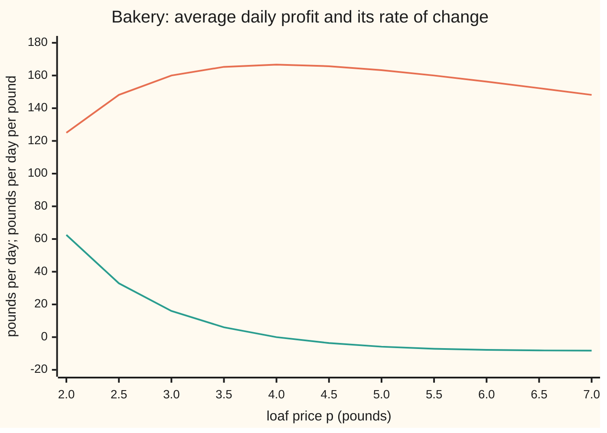

# Differentiating under the integral sign: when the derivative of an average is the average of the derivative

[Syllabus](../../../SYLLABUS.md) → [Measure and integration](../../../SYLLABUS.md#w10) → [Swapping Limits and Integrals](../../../SYLLABUS.md#w10-s05) → Differentiating under the integral sign

---

## General Overview

A bakery sells sourdough at £3 a loaf. Each loaf costs £1 to make. How many sell depends on the day. On some days customers shrug at the price; on others they walk out at every extra penny. Averaged over many days, the bakery makes **£160 a day**. The owner wants the marginal profit: how fast that average moves if the price moves.

There are two ways to get it. One: work out the average profit as a formula in the price, then differentiate. Two: on each kind of day, work out how fast that day's profit moves with the price, then average those rates. The second is often far easier, and it works unchanged when the average has no formula and must be simulated. Both give **£16 a day per £1 of price** here. They do not always agree. In a shop where each customer buys one loaf only if the price is at most a personal limit, the second road gives £0.60 per customer per £1 of price; the right answer, from the first, is £0.20.

The swap works when one fixed function, with a finite integral, caps every day's rate for all prices near £3. Then [Dominated convergence](02-dominated-convergence-theorem.md) does all the work. The calculus wing proves a Riemann version with continuous integrands on a closed rectangle ([Differentiating under the integral](../../06-Calculus%20and%20analysis/08-Multiple%20Integrals/05-differentiating-under-the-integral.md)). This card gives the dominated-convergence version: any measure, infinite ranges, rates that exist only almost everywhere in the averaging variable.

**If each integrand is differentiable in the parameter and one integrable function bounds every one of those rates on an interval of parameters, then the integral is differentiable there and its derivative is the integral of the rates.**

**What kind of fact this is:** a theorem, proved on this card in Why it works, with every step in the folded Detailed proof.

### The picture: average profit and marginal profit against price



Orange: average daily profit, £ per day. Teal: marginal profit, £ per day for each £1 of price, computed as the average of each day's rate. The teal line crosses zero at £4, exactly where the orange line peaks at £166.67.

---

## The formula

Notation first. A measure space $(\Omega,\mathcal F,\mu)$ is a set of points $\Omega$ (omega), the collection $\mathcal F$ of sets we allow ourselves to measure, and a measure $\mu$ (mu) giving each such set a size. The integral $\int f\,d\mu$ is read "the integral of f against mu" ([The integral of a non-negative function](../04-The%20Lebesgue%20Integral/02-integral-of-a-nonnegative-function.md)). "For almost every x", written a.e., means "except on a set of size zero". The curly $\partial f/\partial t$ is a partial derivative: the rate of change in $t$ with $x$ held still.

Now the setting. A function $f(t,x)$ has two inputs: a **parameter** $t$, a dial that ranges over an open interval $I$, and a point $x$ of $\Omega$ that the integral averages over. The integral depends on the parameter alone:

$$F(t)=\int_\Omega f(t,x)\,d\mu(x).$$

**The theorem**, known as Leibniz's rule. Suppose
1. for each $t$ in $I$, the function $x\mapsto f(t,x)$ is measurable and has a finite integral;
2. there is one set of size zero outside which, for every $x$, the function $t\mapsto f(t,x)$ is differentiable at every $t$ in $I$;
3. there is one function $g$ with $\int g\,d\mu<\infty$ and one set of size zero outside which, for every $x$, $|\partial f/\partial t\,(t,x)|\le g(x)$ at every $t$ in $I$.

Then $F$ is differentiable at every $t$ in $I$, the rate $x\mapsto \partial f/\partial t\,(t,x)$ has a finite integral, and

$$F'(t)=\frac{d}{dt}\int_\Omega f(t,x)\,d\mu(x)=\int_\Omega \frac{\partial f}{\partial t}(t,x)\,d\mu(x).$$

**Read it aloud:** if one integrable function caps every rate, the rate of the average is the average of the rates.

On the bakery, $\Omega$ is the range of possible sensitivities $z\ge 0$, and $\mu$ is the probability law of the day's sensitivity, with density $4z\,e^{-2z}$: a sum of two independent exponential waits of mean 0.5 ([Gamma and beta](../../09-Probability%20and%20statistics/04-Continuous%20Distributions/07-gamma-and-beta-distributions.md)). A day with sensitivity $z$ sells $N e^{-zp}$ loaves at price $p$. That day's profit and the average profit are

$$y(p,z)=(p-c)\,N e^{-zp},\qquad \Pi(p)=\int_0^\infty y(p,z)\,4z\,e^{-2z}\,dz .$$

The day's rate, by the product rule, is $\partial y/\partial p=N e^{-zp}\,\big(1-(p-c)z\big)$: one more pound on every loaf sold, minus the loaves lost.

| Symbol | Plain meaning | In our example | Push it up and the answer… |
| --- | --- | --- | --- |
| $p$ | the loaf price: the parameter | £3 | marginal profit falls, reaching 0 at £4 |
| $z$ | the day's price sensitivity, per pound | random, density 4z e^(−2z), mean 1 | fewer loaves sold that day |
| $c$, $N$ | cost per loaf; loaves sold if the bread were free | £1; 500 | best price is 2 + 2c; N up: everything scales |
| $y$, $\Pi$ | one day's profit y(p, z); its average Π(p) | Π(3) = £160 a day | — |
| $\Omega$, $\mu$ | the space averaged over and its measure | sensitivities z ≥ 0, their probability law | — |
| $t$, $x$ | the general parameter and the general point | t is p, x is z | — |
| $f$, $F$ | the integrand and its integral as a function of t | f is y, F is Π | — |
| $I$ | the open interval of parameters | prices from £2 to £4 | a wider interval may need a bigger bound |
| $g$ | one integrable cap on every rate over I | 500(1 + 3z)e^(−2z), integral 312.5 | a cap that is not integrable voids the theorem |
| $h$, $h_n$, $q_n$ | a price step; a sequence of steps shrinking to 0; the difference quotients | h = 0.1, 0.01, 0.001 | smaller steps, quotient closer to the rate |
| $\lambda$, $G$ | Lebesgue measure: length on the line; the Gaussian integral G(t), in which π is the circle constant 3.14159… | G(1) = √π = 1.772454 | t up: G(t) = √(π/t) falls |
| $W$ | a buyer's willingness to pay, in pounds | uniform on £1 to £6 | — |
| $Z$, $E[\cdot]$ | the day's sensitivity as a random quantity; the average against its law | E[e^(−3Z)] = 0.16 | — |
| $k$, $a$ | a power of z and a rate, in the one integral of Worked numbers | k = 1, a = 5 for E[e^(−3Z)] | — |
| $s$, $s_n$, $u$, $D$, $B$ | proof letters: parameter values (s between t and t + h in the mean value theorem, s running from t_0 to t in Another road, s and u any two in the Remark); the one picked for the step $h_n$; the limit of the quotients; the one null set of the proof | s between £3 and £3 + h; D is the rate ∂y/∂p at £3; B is empty for the bakery | — |
| $t_0$ | a fixed parameter: the floor of the Gaussian step's range, or the base point of Another road | t_0 = 0.5 serves t = 1 | a smaller t_0 needs a bigger cap |
| $X$, $s$, $u$, $i$, $\theta$, $p_\theta$ | in the applications: a random quantity; the generating function's variable; the characteristic function's frequency; the square root of −1; a model's parameter and its density | — | — |

### When it holds

- **Each integral finite.** If $\int |f(t,x)|\,d\mu$ is infinite for some $t$, then $F(t)$ is not a number and there is nothing to differentiate.
- **Differentiable in the parameter, off one null set.** The exceptional set must not move with $t$. The threshold buyer, profit $(p-1)$ if $W\ge p$ and 0 otherwise, jumps at $p=W$. Every $W$ between £2 and £4 has its jump inside $I$, so the exceptional set is the whole middle of the range, and the swap gives 0.6 where the truth is 0.2.
- **One integrable cap for all parameters in I.** The cap $g$ may depend on $x$ but not on $t$. For $f(t,x)=t^3e^{-t^2x}$ on $[0,\infty)$ each rate is finite, but on $I=(-1,1)$ any cap must be at least 1/(ex) for x ≥ 1, and that has an infinite integral; the swap gives 0 where the truth is 1.
- **The cap is local.** $I$ can be any small open interval around the price of interest. A cap that works on £2 to £4 proves the formula at every price inside it.

---

## Why it works

### Step 0: a derivative is a limit, and the question is whether a limit passes through an integral

The derivative of $F$ at $t$ is the limit of difference quotients $(F(t+h)-F(t))/h$ as the step $h$ shrinks to 0. Integrals add and scale, so the difference quotient of the average is the average of the difference quotients:

$$\frac{F(t+h)-F(t)}{h}=\int_\Omega \frac{f(t+h,x)-f(t,x)}{h}\,d\mu(x).$$

Nothing has been swapped yet: this is linearity, exact for every $h$. The swap is the next move: letting $h\to 0$ inside the integral. That is a limit passing through an integral, the exact job of [Dominated convergence](02-dominated-convergence-theorem.md). Its two demands are pointwise convergence and one integrable cap.

### Step 1: the quotients converge, point by point

Take any sequence of steps $h_n\to 0$, none equal to 0, with $t+h_n$ in $I$. Write $q_n(x)$ for the quotient $(f(t+h_n,x)-f(t,x))/h_n$. Off the one null set of hypothesis 2, $f(\cdot,x)$ is differentiable at $t$, so $q_n(x)\to\partial f/\partial t\,(t,x)$. On the bakery at £3 with $z=1$, the quotients approach $500e^{-3}(1-2)=-24.89$.

### Step 2: the mean value theorem turns a cap on the rate into a cap on every quotient

For a fixed $x$ off the null set, $f(\cdot,x)$ is differentiable on the segment from $t$ to $t+h_n$. By [Mean value theorem](../../06-Calculus%20and%20analysis/03-What%20Derivatives%20Tell%20You/02-mean-value-theorem.md), the quotient equals the rate at some point s between them: $q_n(x)=\partial f/\partial t\,(s,x)$. That point lies in $I$, so hypothesis 3 gives $|q_n(x)|\le g(x)$. This is where a single cap for all parameters matters: nobody knows in advance which s the theorem picks.

### Step 3: dominated convergence finishes

The quotients converge almost everywhere and are all capped by the integrable $g$. Dominated convergence gives $\int q_n\,d\mu\to\int \partial f/\partial t\,(t,\cdot)\,d\mu$. By Step 0 the left side is the difference quotient of $F$. Every sequence of steps gives the same limit, so $F'(t)$ exists and equals the average of the rates.

<details>
<summary>Detailed proof</summary>

**Setting.** $(\Omega,\mathcal F,\mu)$ is a measure space, $I$ an open interval, $f: I\times\Omega\to\mathbb R$, with hypotheses 1 to 3 of The formula. Let B be the null set of hypothesis 2 joined with the null set of hypothesis 3; a union of two null sets is null ([Null sets and almost everywhere](../01-Sets%20You%20Can%20Measure/07-null-sets-and-almost-everywhere.md)). Fix $t\in I$.

**1. The quotients are measurable and integrable.** Let $h_n\to0$, $h_n\ne0$, $t+h_n\in I$. Then $q_n=(f(t+h_n,\cdot)-f(t,\cdot))/h_n$ is a difference of two measurable functions with finite integrals, scaled by a constant, so it is measurable with finite integral, and by linearity of the integral ([Integrable functions](../04-The%20Lebesgue%20Integral/04-integrable-functions-and-l1.md))
$$\int q_n\,d\mu=\frac{F(t+h_n)-F(t)}{h_n}.$$

**2. Pointwise limit.** For $x\notin B$, the function $f(\cdot,x)$ is differentiable at $t$, so by the definition of the derivative along the sequence $h_n$, $q_n(x)\to\partial f/\partial t\,(t,x)$. Define $D(x)=\limsup_n q_n(x)$ for all $x$; a lim sup of measurable functions is measurable ([Sums, products, sups and limits](../03-Measurable%20Functions/02-limits-of-measurable-functions.md)), and $D=\partial f/\partial t\,(t,\cdot)$ off B. So the rate agrees a.e. with a measurable function, which is all an integral needs.

**3. Domination.** For $x\notin B$, $f(\cdot,x)$ is differentiable, hence continuous, on the closed segment between $t$ and $t+h_n$, which lies inside $I$ because $I$ is an interval. The mean value theorem gives $s_n(x)$ strictly between them with $q_n(x)=\partial f/\partial t\,(s_n(x),x)$. Since $s_n(x)\in I$ and $x\notin B$, hypothesis 3 gives $|q_n(x)|\le g(x)$. So $|q_n|\le g$ a.e., for every n.

**4. Limit.** $q_n\to D$ a.e., $|q_n|\le g$ a.e., $\int g\,d\mu<\infty$. By dominated convergence, D has a finite integral and $\int q_n\,d\mu\to\int D\,d\mu$. Also $|D|\le g$ a.e., so the rate is integrable.

**5. From sequences to the derivative.** Steps 1 to 4 show: for every sequence $h_n\to0$ with $h_n\neq0$ and $t+h_n\in I$, $(F(t+h_n)-F(t))/h_n\to\int D\,d\mu$. A function has limit L as $h\to 0$ exactly when it tends to L along every such sequence (the sequence criterion for limits). So $F'(t)$ exists and equals $\int_\Omega \partial f/\partial t\,(t,x)\,d\mu(x)$. As $t\in I$ was arbitrary, this holds on all of $I$. ∎

**Remark.** Step 3 used the cap only to bound the quotients. Any hypothesis giving $|q_n|\le g$ with $g$ integrable, and $q_n\to D$ a.e. at the fixed $t$, gives the same conclusion; a Lipschitz bound $|f(s,x)-f(u,x)|\le g(x)\,|s-u|$ is the usual one.

</details>

### Step 4: the cap for the bakery

For prices $p$ in $I=(2,4)$ and any sensitivity $z\ge0$: $e^{-zp}\le e^{-2z}$ because $p\ge 2$, and $|1-(p-1)z|\le 1+3z$ because $p-1\le 3$. So

$$\Big|\frac{\partial y}{\partial p}(p,z)\Big|\le g(z)=500\,(1+3z)\,e^{-2z}.$$

Its average against the sensitivity law is 312.5: finite. The code checks the cap on a grid of 101 prices by 801 sensitivities; the largest ratio of rate to cap is 1.0000, reached at z = 0, where every price's rate equals the cap, 500. All three hypotheses hold on $(2,4)$, so the average of the rates is the marginal profit at every price in between, £3 included.

### Step 5: the Gaussian moment trick

The Gaussian integral is $G(t)=\int_{-\infty}^{\infty}e^{-tx^2}\,d\lambda(x)=\sqrt{\pi/t}$, where $\lambda$ is length on the line ([The Gaussian integral](../../06-Calculus%20and%20analysis/08-Multiple%20Integrals/04-gaussian-integral.md)). At $t=1$ it is $\sqrt\pi=1.772454$. The rate of the integrand in $t$ is $-x^2e^{-tx^2}$. For all $t$ above a fixed $t_0>0$ it is capped by $x^2e^{-t_0x^2}$, which has a finite integral. So the theorem applies:

$$\int_{-\infty}^{\infty}x^2e^{-x^2}\,dx=-G'(1)=\tfrac12\sqrt\pi=0.886227 .$$

Once more, with cap $x^4e^{-t_0x^2}$: $\int x^4e^{-x^2}\,dx=G''(1)=\tfrac34\sqrt\pi=1.329340$. Two moments, with no integration by parts.

### Another road

When the rate is also continuous in the parameter, write $F(t)-F(t_0)=\int_\Omega\int_{t_0}^{t}\partial f/\partial t\,(s,x)\,ds\,d\mu(x)$, swap the two integrals by [Tonelli and Fubini](../06-Product%20Measures%20and%20Fubini/03-tonelli-and-fubini.md) (the cap $g$ keeps the double integral finite), and differentiate the outer integral in $t$. Dominated convergence, with the same cap, makes $t\mapsto\int\partial f/\partial t\,d\mu$ continuous, so the fundamental theorem of calculus applies. Without that continuity this route gives the formula only for almost every $t$, measured by length on $I$; the route above gives it at every $t$.

---

## Worked numbers, by hand

Write Z for the day's random sensitivity and E[·] for the average against its law. One integral does the averaging: for $a>0$, $\int_0^\infty z^k e^{-az}\,dz = k!/a^{k+1}$.

| Step | Arithmetic | Value |
| --- | --- | --- |
| average share sold, E[e^(−3Z)] | ∫ 4z e^(−2z) e^(−3z) dz = 4 × 1!/5^2 | 0.160000 |
| average profit Π(3) | (3 − 1) × 500 × 0.16 | £160.00 |
| weighted share, E[Z e^(−3Z)] | ∫ 4z^2 e^(−5z) dz = 4 × 2!/5^3 | 0.064000 |
| average of the rates | 500 × (0.16 − 2 × 0.064) = 500 × 0.032 | 16.000000 |
| Π as a formula | 500 (p − 1) × 4/(2 + p)^2 = 2000 (p − 1)/(2 + p)^2 | — |
| derivative of the average, from the formula | 2000 [(2 + p) − 2(p − 1)]/(2 + p)^3 = 2000 (4 − p)/(2 + p)^3 | — |
| at p = 3 | 2000 × 1/125 | **£16.00 a day per £1** |
| best price | 4 − p = 0 | £4, profit 2000 × 3/36 = £166.67 |

At £3 a small price rise still pays, at £16 a day for each pound, and rises keep paying until £4. Differentiating the average needed it as a closed formula; averaging the rates needed only E[e^(−3Z)] and E[Z e^(−3Z)], and would work unchanged on simulated days.

### What breaks if you drop a piece

| Mistake | Comes out at | What went wrong |
| --- | --- | --- |
| Threshold buyers: profit (p − 1) when W ≥ p, W uniform on £1 to £6, rates averaged | 0.6000 per buyer, truth 0.2000 | each buyer's profit jumps at p = W; the quotient −2/h sits on a strip of probability h/5 and carries a fixed −0.4 that no cap can hold |
| f(t, x) = t^3 e^(−t^2 x) on [0, ∞) at t = 0, I = (−1, 1) | average of rates 0; F(t) = t, so F′(0) = 1 | the quotients h^2 e^(−h^2 x) each have integral 1.000000 and spread out; any cap is at least 1/(ex), whose integral from 1 reaches 1.6941, 3.3883, 5.0824 by 100, 10000, 1000000 |
| Marginal profit at the average day, z = 1 | −£24.89 a day per £1; best price £2 | the rate at the average day is not the average of the rates; that day's profit is £49.79, not £160 |

---

## Code, from first principles, and it actually runs

The code finds the marginal profit at £3 by four independent roads: the hand formula, a central difference of the average (each average by the card's own Simpson rule), the average of each day's rate, and a simulation of 200,000 days drawn by a SplitMix64 generator written out in both languages. Then it checks the cap, finds the best price by bisection, prints the chart, runs the Gaussian moment trick against $\sqrt\pi/2$ and $3\sqrt\pi/4$, and prints both failures.

The code checks one bakery, one Gaussian and two counterexamples to the printed precision. That the swap holds for every integrand on every measure space satisfying the three hypotheses is what the Detailed proof shows.

### Python

```python
# Differentiating under the integral sign -- the check behind the card.
# Standard library only.  A bakery sells N e^(-z p) loaves at price p (in
# pounds) on a day whose price sensitivity is z; z is random with density
# 4 z e^(-2z), rate 2.  Profit that day: (p - c) N e^(-z p).
# The marginal average profit at p = 3 is found four ways: a formula worked
# by hand, the derivative of the average, the average of the derivative, and
# a simulation.  Then the dominating bound, the Gaussian moment trick, and
# two cases where the swap fails.
import math

N, C, RATE, P0 = 500.0, 1.0, 2.0, 3.0

def simpson(f, a, b, n):                    # composite Simpson rule, n even
    w = (b - a) / n
    s = f(a) + f(b) + sum((4 if i % 2 else 2) * f(a + i * w) for i in range(1, n))
    return s * w / 3

def dens(z):                                # sensitivity density, per pound
    return RATE * RATE * z * math.exp(-RATE * z)

def avg(g):                                 # integral of g(z) dens(z) dz over [0, 40]
    return simpson(lambda z: g(z) * dens(z), 0.0, 40.0, 16000)

def profit(p, z):
    return (p - C) * N * math.exp(-z * p)

def dprofit(p, z):                          # partial derivative in p, by hand
    return N * math.exp(-z * p) * (1 - (p - C) * z)

def avg_profit(p):
    return avg(lambda z: profit(p, z))

def avg_dprofit(p):
    return avg(lambda z: dprofit(p, z))

print(f"density: total {avg(lambda z: 1.0):.6f}, mean sensitivity {avg(lambda z: z):.6f} per pound")
formula = N * RATE ** 2 * (RATE + 2 * C - P0) / (RATE + P0) ** 3
print(f"road 1, formula: Pi(3) = {N * (P0 - C) * (RATE / (RATE + P0)) ** 2:.4f}, Pi'(3) = 2000(4 - p)/(2 + p)^3 = {formula:.4f}")
for h in (0.1, 0.01, 0.001):
    q = (avg_profit(P0 + h) - avg_profit(P0 - h)) / (2 * h)
    print(f"road 2, derivative of the average: h = {h}: (Pi(3 + h) - Pi(3 - h))/2h = {q:.6f}")
assert abs(q - formula) < 1e-5
road3 = avg_dprofit(P0)
e0, e1 = avg(lambda z: math.exp(-z * P0)), avg(lambda z: z * math.exp(-z * P0))
print(f"road 3, average of the derivative: 500 x ({e0:.6f} - 2 x {e1:.6f}) = {road3:.6f}")
assert abs(road3 - formula) < 1e-6

state = 20260929                            # SplitMix64, seed 20260929
def unif():
    global state
    state = (state + 0x9E3779B97F4A7C15) % 2 ** 64
    x = state
    x = ((x ^ (x >> 30)) * 0xBF58476D1CE4E5B9) % 2 ** 64
    x = ((x ^ (x >> 27)) * 0x94D049BB133111EB) % 2 ** 64
    return ((x ^ (x >> 31)) >> 11) * 2.0 ** -53 + 2.0 ** -54
n, s1, s2, fd = 200000, 0.0, 0.0, 0.0
for _ in range(n):
    z = (-math.log(unif()) - math.log(unif())) / RATE   # sum of two exponentials
    d = dprofit(P0, z)
    s1, s2 = s1 + d, s2 + d * d
    fd += (profit(P0 + 0.001, z) - profit(P0 - 0.001, z)) / 0.002
mean, se = s1 / n, math.sqrt((s2 / n - (s1 / n) ** 2) / n)
print(f"road 4, simulation of {n} days: average of the derivative {mean:.2f} (standard error {se:.2f}); difference quotient, same days {fd / n:.2f}")
assert abs(mean - formula) < 4 * se

g = lambda z: N * (1 + 3 * z) * math.exp(-2 * z)   # bound for p in [2, 4]
worst = max(abs(dprofit(2 + i / 50, j / 20)) / g(j / 20) for i in range(101) for j in range(801))
bound = avg(g)
print(f"bound on [2, 4]: g(z) = 500(1 + 3z)e^(-2z); largest |dy/dp|/g on a grid {worst:.4f}; integral of g = {bound:.4f}")
assert worst <= 1.0
assert abs(bound - N * (RATE ** 2 / (RATE + 2) ** 2 + 3 * 2 * RATE ** 2 / (RATE + 2) ** 3)) < 1e-6

def root(fn, lo, hi):                       # bisection: fn > 0 at lo, fn < 0 at hi
    for _ in range(60):
        mid = (lo + hi) / 2
        lo, hi = (mid, hi) if fn(mid) > 0 else (lo, mid)
    return lo
lo = root(avg_dprofit, 2.0, 7.0)            # best price: where the average derivative is zero
print(f"best price: average derivative zero at p = {lo:.4f}, Pi = {avg_profit(lo):.4f}; formula rate + 2c = {RATE + 2 * C:.4f}")
assert abs(lo - (RATE + 2 * C)) < 1e-6

def two(v):
    return f"{0.0 if abs(v) < 0.005 else v:.2f}"
ps = [2 + k / 2 for k in range(11)]
print("chart, price: " + ", ".join(f"{p:.1f}" for p in ps))
print("chart, average profit: " + ", ".join(two(avg_profit(p)) for p in ps))
print("chart, marginal profit: " + ", ".join(two(avg_dprofit(p)) for p in ps))
print(f"average day, z = 1: profit {two(profit(P0, 1.0))}, derivative {two(dprofit(P0, 1.0))}, best price {root(lambda p: dprofit(p, 1.0), 1.0, 7.0):.2f}")

G = lambda t: simpson(lambda x: math.exp(-t * x * x), -12.0, 12.0, 2400)
m2 = simpson(lambda x: x * x * math.exp(-x * x), -12.0, 12.0, 2400)
m4 = simpson(lambda x: x ** 4 * math.exp(-x * x), -12.0, 12.0, 2400)
d1 = -(G(1.001) - G(0.999)) / 0.002
d2 = (G(1.0001) - 2 * G(1.0) + G(0.9999)) / 1e-8
rp = math.sqrt(math.pi)
print(f"gauss: G(1) = {G(1.0):.6f}, sqrt(pi) = {rp:.6f}")
print(f"gauss: -G'(1) = {d1:.6f}; integral of x^2 e^(-x^2) = {m2:.6f}; sqrt(pi)/2 = {rp / 2:.6f}")
print(f"gauss: G''(1) = {d2:.6f}; integral of x^4 e^(-x^2) = {m4:.6f}; 3 sqrt(pi)/4 = {3 * rp / 4:.6f}")
assert abs(d1 - m2) < 1e-6
assert abs(m2 - rp / 2) < 1e-10
assert abs(d2 - m4) < 1e-6
assert abs(m4 - 3 * rp / 4) < 1e-10

# breaks 1: a buyer with willingness to pay W, uniform on [1, 6], buys one loaf if W >= p
K = 500000
def per_buyer(p):                           # average of (p - 1) 1{W >= p}, midpoint rule
    return sum(p - C for i in range(K) if 1 + (i + 0.5) * 5 / K >= p) / K
true_d = (per_buyer(3.001) - per_buyer(2.999)) / 0.002
inside = sum(1.0 for i in range(K) if 1 + (i + 0.5) * 5 / K > 3) / K
print(f"breaks, threshold buyer: average profit {per_buyer(3.0):.4f}; derivative of the average {true_d:.4f}; average of the derivative {inside:.4f}")
for h in (0.1, 0.01, 0.001):
    qa = (per_buyer(3 + h) - per_buyer(3.0)) / h
    strip = sum(1 for i in range(K) if 3 <= 1 + (i + 0.5) * 5 / K < 3 + h) / K
    print(f"breaks, threshold buyer: h = {h}: quotient -2/h = {-2 / h:.0f} on a strip of probability {strip:.4f}, carrying {strip * -2 / h:.4f}; average quotient {qa:.4f}")
assert abs(true_d - 0.2) < 1e-3
assert abs(inside - true_d) > 0.3

# breaks 2: f(t, x) = t^3 e^(-t^2 x) on [0, inf): F(t) = t, but df/dt(0, x) = 0
for h in (0.1, 0.01, 0.001):
    area = simpson(lambda x: h * h * math.exp(-h * h * x), 0.0, 40 / h ** 2, 4000)
    print(f"breaks, spreading: h = {h}: quotient h^2 e^(-h^2 x) has integral {area:.6f}, value at x = 1 {h * h * math.exp(-h * h):.8f}")
    assert abs(area - 1) < 1e-6
env = max((k / 1000) ** 2 * math.exp(-(k / 1000) ** 2 * 100) for k in range(1, 1001))
print(f"breaks, spreading: largest quotient at x = 100 over h in (0, 1]: {env:.6f}; 1/(100 e) = {1 / (100 * math.e):.6f}")
assert abs(env - 1 / (100 * math.e)) < 1e-6
for X in (100, 10000, 1000000):
    print(f"breaks, spreading: 1/(e x) integrated from 1 to {X} = {math.log(X) / math.e:.4f}")
print("ALL CHECKS PASS")
```

**Ran 2026-10-07 on macOS, Python 3.14.6, standard library only. All checks passed. Output, pasted from the run:**

```
density: total 1.000000, mean sensitivity 1.000000 per pound
road 1, formula: Pi(3) = 160.0000, Pi'(3) = 2000(4 - p)/(2 + p)^3 = 16.0000
road 2, derivative of the average: h = 0.1: (Pi(3 + h) - Pi(3 - h))/2h = 16.044833
road 2, derivative of the average: h = 0.01: (Pi(3 + h) - Pi(3 - h))/2h = 16.000448
road 2, derivative of the average: h = 0.001: (Pi(3 + h) - Pi(3 - h))/2h = 16.000004
road 3, average of the derivative: 500 x (0.160000 - 2 x 0.064000) = 16.000000
road 4, simulation of 200000 days: average of the derivative 15.92 (standard error 0.17); difference quotient, same days 15.92
bound on [2, 4]: g(z) = 500(1 + 3z)e^(-2z); largest |dy/dp|/g on a grid 1.0000; integral of g = 312.5000
best price: average derivative zero at p = 4.0000, Pi = 166.6667; formula rate + 2c = 4.0000
chart, price: 2.0, 2.5, 3.0, 3.5, 4.0, 4.5, 5.0, 5.5, 6.0, 6.5, 7.0
chart, average profit: 125.00, 148.15, 160.00, 165.29, 166.67, 165.68, 163.27, 160.00, 156.25, 152.25, 148.15
chart, marginal profit: 62.50, 32.92, 16.00, 6.01, 0.00, -3.64, -5.83, -7.11, -7.81, -8.14, -8.23
average day, z = 1: profit 49.79, derivative -24.89, best price 2.00
gauss: G(1) = 1.772454, sqrt(pi) = 1.772454
gauss: -G'(1) = 0.886227; integral of x^2 e^(-x^2) = 0.886227; sqrt(pi)/2 = 0.886227
gauss: G''(1) = 1.329340; integral of x^4 e^(-x^2) = 1.329340; 3 sqrt(pi)/4 = 1.329340
breaks, threshold buyer: average profit 1.2000; derivative of the average 0.2000; average of the derivative 0.6000
breaks, threshold buyer: h = 0.1: quotient -2/h = -20 on a strip of probability 0.0200, carrying -0.4000; average quotient 0.1800
breaks, threshold buyer: h = 0.01: quotient -2/h = -200 on a strip of probability 0.0020, carrying -0.4000; average quotient 0.1980
breaks, threshold buyer: h = 0.001: quotient -2/h = -2000 on a strip of probability 0.0002, carrying -0.4000; average quotient 0.1998
breaks, spreading: h = 0.1: quotient h^2 e^(-h^2 x) has integral 1.000000, value at x = 1 0.00990050
breaks, spreading: h = 0.01: quotient h^2 e^(-h^2 x) has integral 1.000000, value at x = 1 0.00009999
breaks, spreading: h = 0.001: quotient h^2 e^(-h^2 x) has integral 1.000000, value at x = 1 0.00000100
breaks, spreading: largest quotient at x = 100 over h in (0, 1]: 0.003679; 1/(100 e) = 0.003679
breaks, spreading: 1/(e x) integrated from 1 to 100 = 1.6941
breaks, spreading: 1/(e x) integrated from 1 to 10000 = 3.3883
breaks, spreading: 1/(e x) integrated from 1 to 1000000 = 5.0824
ALL CHECKS PASS
```

### Rust

Same rows, same labels, built with `rustc --edition 2021 -O`. The two outputs are identical.

```rust
// Differentiating under the integral sign -- the same check as the Python, in
// Rust.  No crates.  A bakery sells N e^(-z p) loaves at price p (in pounds)
// on a day whose price sensitivity is z; z is random with density
// 4 z e^(-2z), rate 2.  Profit that day: (p - c) N e^(-z p).
// The marginal average profit at p = 3 is found four ways: a formula worked
// by hand, the derivative of the average, the average of the derivative, and
// a simulation.  Then the dominating bound, the Gaussian moment trick, and
// two cases where the swap fails.
const N: f64 = 500.0;
const C: f64 = 1.0;
const RATE: f64 = 2.0;
const P0: f64 = 3.0;

fn simpson(f: &dyn Fn(f64) -> f64, a: f64, b: f64, n: usize) -> f64 {
    // composite Simpson rule, n even
    let w = (b - a) / n as f64;
    let mut acc = 0.0;
    for i in 1..n {
        acc += (if i % 2 == 1 { 4.0 } else { 2.0 }) * f(a + i as f64 * w);
    }
    (f(a) + f(b) + acc) * w / 3.0
}

fn dens(z: f64) -> f64 { RATE * RATE * z * (-RATE * z).exp() } // sensitivity density, per pound
fn avg(g: &dyn Fn(f64) -> f64) -> f64 { simpson(&|z| g(z) * dens(z), 0.0, 40.0, 16000) }
fn profit(p: f64, z: f64) -> f64 { (p - C) * N * (-z * p).exp() }
fn dprofit(p: f64, z: f64) -> f64 { N * (-z * p).exp() * (1.0 - (p - C) * z) } // partial in p, by hand
fn avg_profit(p: f64) -> f64 { avg(&|z| profit(p, z)) }
fn avg_dprofit(p: f64) -> f64 { avg(&|z| dprofit(p, z)) }

fn root(f: &dyn Fn(f64) -> f64, mut lo: f64, mut hi: f64) -> f64 {
    // bisection: f > 0 at lo, f < 0 at hi
    for _ in 0..60 {
        let mid = (lo + hi) / 2.0;
        if f(mid) > 0.0 { lo = mid; } else { hi = mid; }
    }
    lo
}

fn two(v: f64) -> String { format!("{:.2}", if v.abs() < 0.005 { 0.0 } else { v }) }

struct SplitMix(u64);
impl SplitMix {
    fn unif(&mut self) -> f64 {
        self.0 = self.0.wrapping_add(0x9E3779B97F4A7C15);
        let mut x = self.0;
        x = (x ^ (x >> 30)).wrapping_mul(0xBF58476D1CE4E5B9);
        x = (x ^ (x >> 27)).wrapping_mul(0x94D049BB133111EB);
        ((x ^ (x >> 31)) >> 11) as f64 * 2f64.powi(-53) + 2f64.powi(-54)
    }
}

fn main() {
    println!("density: total {:.6}, mean sensitivity {:.6} per pound", avg(&|_| 1.0), avg(&|z| z));
    let formula = N * RATE.powi(2) * (RATE + 2.0 * C - P0) / (RATE + P0).powi(3);
    println!("road 1, formula: Pi(3) = {:.4}, Pi'(3) = 2000(4 - p)/(2 + p)^3 = {:.4}", N * (P0 - C) * (RATE / (RATE + P0)).powi(2), formula);
    let mut q = 0.0;
    for h in [0.1, 0.01, 0.001] {
        q = (avg_profit(P0 + h) - avg_profit(P0 - h)) / (2.0 * h);
        println!("road 2, derivative of the average: h = {}: (Pi(3 + h) - Pi(3 - h))/2h = {:.6}", h, q);
    }
    assert!((q - formula).abs() < 1e-5);
    let road3 = avg_dprofit(P0);
    let (e0, e1) = (avg(&|z| (-z * P0).exp()), avg(&|z| z * (-z * P0).exp()));
    println!("road 3, average of the derivative: 500 x ({:.6} - 2 x {:.6}) = {:.6}", e0, e1, road3);
    assert!((road3 - formula).abs() < 1e-6);

    let mut rng = SplitMix(20260929); // SplitMix64, seed 20260929
    let n = 200000usize;
    let (mut s1, mut s2, mut fd) = (0.0f64, 0.0f64, 0.0f64);
    for _ in 0..n {
        let u1 = rng.unif();
        let u2 = rng.unif();
        let z = (-u1.ln() - u2.ln()) / RATE; // sum of two exponentials
        let d = dprofit(P0, z);
        s1 += d;
        s2 += d * d;
        fd += (profit(P0 + 0.001, z) - profit(P0 - 0.001, z)) / 0.002;
    }
    let nf = n as f64;
    let (mean, se) = (s1 / nf, ((s2 / nf - (s1 / nf).powi(2)) / nf).sqrt());
    println!("road 4, simulation of {} days: average of the derivative {:.2} (standard error {:.2}); difference quotient, same days {:.2}", n, mean, se, fd / nf);
    assert!((mean - formula).abs() < 4.0 * se);

    let g = |z: f64| N * (1.0 + 3.0 * z) * (-2.0 * z).exp(); // bound for p in [2, 4]
    let mut worst: f64 = 0.0;
    for i in 0..101 {
        for j in 0..801 {
            let (p, z) = (2.0 + i as f64 / 50.0, j as f64 / 20.0);
            worst = worst.max(dprofit(p, z).abs() / g(z));
        }
    }
    let bound = avg(&g);
    println!("bound on [2, 4]: g(z) = 500(1 + 3z)e^(-2z); largest |dy/dp|/g on a grid {:.4}; integral of g = {:.4}", worst, bound);
    assert!(worst <= 1.0);
    assert!((bound - N * (RATE.powi(2) / (RATE + 2.0).powi(2) + 3.0 * 2.0 * RATE.powi(2) / (RATE + 2.0).powi(3))).abs() < 1e-6);

    let lo = root(&avg_dprofit, 2.0, 7.0); // best price: where the average derivative is zero
    println!("best price: average derivative zero at p = {:.4}, Pi = {:.4}; formula rate + 2c = {:.4}", lo, avg_profit(lo), RATE + 2.0 * C);
    assert!((lo - (RATE + 2.0 * C)).abs() < 1e-6);

    let ps: Vec<f64> = (0..11).map(|k| 2.0 + k as f64 / 2.0).collect();
    let row = |f: &dyn Fn(f64) -> String| ps.iter().map(|&p| f(p)).collect::<Vec<_>>().join(", ");
    println!("chart, price: {}", row(&|p| format!("{:.1}", p)));
    println!("chart, average profit: {}", row(&|p| two(avg_profit(p))));
    println!("chart, marginal profit: {}", row(&|p| two(avg_dprofit(p))));
    println!("average day, z = 1: profit {}, derivative {}, best price {:.2}", two(profit(P0, 1.0)), two(dprofit(P0, 1.0)), root(&|p| dprofit(p, 1.0), 1.0, 7.0));

    let gg = |t: f64| simpson(&|x| (-t * x * x).exp(), -12.0, 12.0, 2400);
    let m2 = simpson(&|x| x * x * (-x * x).exp(), -12.0, 12.0, 2400);
    let m4 = simpson(&|x| x.powf(4.0) * (-x * x).exp(), -12.0, 12.0, 2400);
    let d1 = -(gg(1.001) - gg(0.999)) / 0.002;
    let d2 = (gg(1.0001) - 2.0 * gg(1.0) + gg(0.9999)) / 1e-8;
    let rp = std::f64::consts::PI.sqrt();
    println!("gauss: G(1) = {:.6}, sqrt(pi) = {:.6}", gg(1.0), rp);
    println!("gauss: -G'(1) = {:.6}; integral of x^2 e^(-x^2) = {:.6}; sqrt(pi)/2 = {:.6}", d1, m2, rp / 2.0);
    println!("gauss: G''(1) = {:.6}; integral of x^4 e^(-x^2) = {:.6}; 3 sqrt(pi)/4 = {:.6}", d2, m4, 3.0 * rp / 4.0);
    assert!((d1 - m2).abs() < 1e-6);
    assert!((m2 - rp / 2.0).abs() < 1e-10);
    assert!((d2 - m4).abs() < 1e-6);
    assert!((m4 - 3.0 * rp / 4.0).abs() < 1e-10);

    // breaks 1: a buyer with willingness to pay W, uniform on [1, 6], buys one loaf if W >= p
    let k = 500000usize;
    let w = |i: usize| 1.0 + (i as f64 + 0.5) * 5.0 / k as f64;
    let per_buyer = |p: f64| {
        // average of (p - 1) 1{W >= p}, midpoint rule
        let mut acc = 0.0;
        for i in 0..k { if w(i) >= p { acc += p - C; } }
        acc / k as f64
    };
    let true_d = (per_buyer(3.001) - per_buyer(2.999)) / 0.002;
    let inside = (0..k).filter(|&i| w(i) > 3.0).count() as f64 / k as f64;
    println!("breaks, threshold buyer: average profit {:.4}; derivative of the average {:.4}; average of the derivative {:.4}", per_buyer(3.0), true_d, inside);
    for h in [0.1, 0.01, 0.001] {
        let qa = (per_buyer(3.0 + h) - per_buyer(3.0)) / h;
        let strip = (0..k).filter(|&i| 3.0 <= w(i) && w(i) < 3.0 + h).count() as f64 / k as f64;
        println!("breaks, threshold buyer: h = {}: quotient -2/h = {:.0} on a strip of probability {:.4}, carrying {:.4}; average quotient {:.4}", h, -2.0 / h, strip, strip * -2.0 / h, qa);
    }
    assert!((true_d - 0.2).abs() < 1e-3);
    assert!((inside - true_d).abs() > 0.3);

    // breaks 2: f(t, x) = t^3 e^(-t^2 x) on [0, inf): F(t) = t, but df/dt(0, x) = 0
    for h in [0.1f64, 0.01, 0.001] {
        let area = simpson(&|x| h * h * (-h * h * x).exp(), 0.0, 40.0 / h.powi(2), 4000);
        println!("breaks, spreading: h = {}: quotient h^2 e^(-h^2 x) has integral {:.6}, value at x = 1 {:.8}", h, area, h * h * (-h * h).exp());
        assert!((area - 1.0).abs() < 1e-6);
    }
    let env = (1..1001).map(|k| (k as f64 / 1000.0).powi(2) * (-(k as f64 / 1000.0).powi(2) * 100.0).exp()).fold(0.0f64, f64::max);
    let e = std::f64::consts::E;
    println!("breaks, spreading: largest quotient at x = 100 over h in (0, 1]: {:.6}; 1/(100 e) = {:.6}", env, 1.0 / (100.0 * e));
    assert!((env - 1.0 / (100.0 * e)).abs() < 1e-6);
    for x in [100u64, 10000, 1000000] {
        println!("breaks, spreading: 1/(e x) integrated from 1 to {} = {:.4}", x, (x as f64).ln() / e);
    }
    println!("ALL CHECKS PASS");
}
```

**Ran 2026-10-07 on macOS, rustc 1.98.1, no crates. All checks passed. Output, pasted from the run:**

```
density: total 1.000000, mean sensitivity 1.000000 per pound
road 1, formula: Pi(3) = 160.0000, Pi'(3) = 2000(4 - p)/(2 + p)^3 = 16.0000
road 2, derivative of the average: h = 0.1: (Pi(3 + h) - Pi(3 - h))/2h = 16.044833
road 2, derivative of the average: h = 0.01: (Pi(3 + h) - Pi(3 - h))/2h = 16.000448
road 2, derivative of the average: h = 0.001: (Pi(3 + h) - Pi(3 - h))/2h = 16.000004
road 3, average of the derivative: 500 x (0.160000 - 2 x 0.064000) = 16.000000
road 4, simulation of 200000 days: average of the derivative 15.92 (standard error 0.17); difference quotient, same days 15.92
bound on [2, 4]: g(z) = 500(1 + 3z)e^(-2z); largest |dy/dp|/g on a grid 1.0000; integral of g = 312.5000
best price: average derivative zero at p = 4.0000, Pi = 166.6667; formula rate + 2c = 4.0000
chart, price: 2.0, 2.5, 3.0, 3.5, 4.0, 4.5, 5.0, 5.5, 6.0, 6.5, 7.0
chart, average profit: 125.00, 148.15, 160.00, 165.29, 166.67, 165.68, 163.27, 160.00, 156.25, 152.25, 148.15
chart, marginal profit: 62.50, 32.92, 16.00, 6.01, 0.00, -3.64, -5.83, -7.11, -7.81, -8.14, -8.23
average day, z = 1: profit 49.79, derivative -24.89, best price 2.00
gauss: G(1) = 1.772454, sqrt(pi) = 1.772454
gauss: -G'(1) = 0.886227; integral of x^2 e^(-x^2) = 0.886227; sqrt(pi)/2 = 0.886227
gauss: G''(1) = 1.329340; integral of x^4 e^(-x^2) = 1.329340; 3 sqrt(pi)/4 = 1.329340
breaks, threshold buyer: average profit 1.2000; derivative of the average 0.2000; average of the derivative 0.6000
breaks, threshold buyer: h = 0.1: quotient -2/h = -20 on a strip of probability 0.0200, carrying -0.4000; average quotient 0.1800
breaks, threshold buyer: h = 0.01: quotient -2/h = -200 on a strip of probability 0.0020, carrying -0.4000; average quotient 0.1980
breaks, threshold buyer: h = 0.001: quotient -2/h = -2000 on a strip of probability 0.0002, carrying -0.4000; average quotient 0.1998
breaks, spreading: h = 0.1: quotient h^2 e^(-h^2 x) has integral 1.000000, value at x = 1 0.00990050
breaks, spreading: h = 0.01: quotient h^2 e^(-h^2 x) has integral 1.000000, value at x = 1 0.00009999
breaks, spreading: h = 0.001: quotient h^2 e^(-h^2 x) has integral 1.000000, value at x = 1 0.00000100
breaks, spreading: largest quotient at x = 100 over h in (0, 1]: 0.003679; 1/(100 e) = 0.003679
breaks, spreading: 1/(e x) integrated from 1 to 100 = 1.6941
breaks, spreading: 1/(e x) integrated from 1 to 10000 = 3.3883
breaks, spreading: 1/(e x) integrated from 1 to 1000000 = 5.0824
ALL CHECKS PASS
```

> [!TIP]
> **Try changing**
> - **Guess first:** set `P0 = 4.0`. Answer: every road prints a marginal profit of about 0, since £4 is the best price; the simulation's figure sits within a few standard errors of 0.
> - **Guess first:** set `C = 1.5`, a dearer loaf. Answer: the best price moves to 2 + 2 × 1.5 = £5; the bisection line prints 5.0000 and the chart's teal line crosses zero one pound later. Then the threshold assert stops the run, since that buyer's true rate becomes 0.3.
> - **Guess first:** in `dprofit`, change `1 - (p - C) * z` to `1 + (p - C) * z`, forgetting the lost sales. Answer: road three prints 500 × (0.16 + 0.128) = 144, and the assert against the formula stops the run.
> - **Guess first:** in the threshold case, shrink h further. Answer: the strip gets thinner and taller, its quotient −2/h grows, and the average quotient creeps to 0.2, never to the 0.6 of the averaged rates.

---

## The usual mistake

> [!warning]
> **Averaging rates when the integrand jumps.** A quantity that switches on or off at a threshold that moves with the parameter, such as a sale that happens only if the price is below the buyer's limit, has rate 0 almost everywhere at every price, yet its average moves. The movement lives in the thin strip of buyers right at the threshold. The averaged rates miss it: 0.6 instead of 0.2 for the threshold buyer, off by the lost margin £2 times the density of buyers at the threshold. The fix is to differentiate the average itself, or to smooth the threshold first.
>
> - **Differentiating at the average day.** The average sensitivity is 1, and at z = 1 the rate is −£24.89: the bakery would cut its price. The average of the rates is +£16. Rates, like profits, must be averaged, not evaluated at an average.
> - **A cap that depends on the parameter.** Bounding the rate at each price separately is not enough; the mean value theorem picks an unknown price between two, so the cap must hold for all of I at once. The spreading example has a finite rate everywhere and still fails.
> - **Forgetting that the null set may not move with the price.** Almost-everywhere differentiability at each fixed price is weaker than one null set for all prices. The threshold buyer is differentiable a.e. at each price, and still fails.
> - **Expecting the swap for free on an infinite range.** On [0, ∞) mass can escape to infinity: each quotient in the spreading example has integral 1 while every point sees it tend to 0.

---

## Where you meet it in real life

- **Pricing and revenue management.** Marginal revenue under uncertain demand is computed as the average of per-scenario rates, often over simulated scenarios, as road four does for the bakery.
- **Moments from generating functions.** Differentiating $E[e^{sX}]$ at $s=0$ under the integral gives the mean, then the second moment ([Moment generating functions](../../09-Probability%20and%20statistics/02-Random%20Variables/07-moment-generating-functions.md)); the Gaussian trick above is the same move.
- **Statistics: the score has mean zero.** Differentiating $\int p_\theta\,dx=1$ in the parameter under the integral gives the facts behind Fisher information ([Fisher information](../../09-Probability%20and%20statistics/07-Sampling%20and%20Estimation/07-fisher-information-and-cramer-rao.md)).
- **Option sensitivities by simulation.** A pathwise estimate of an option's delta averages each path's rate of payoff in the spot price; the theorem says when that is right, and a digital option's jump is the threshold buyer again ([Delta](../../12-Financial%20mathematics/09-The%20Greeks%2C%20one%20each/01-delta.md)).

> **Say it back**
> A derivative is a limit of difference quotients, and the quotient of an average is the average of the quotients. So differentiating an average is a limit passing through an integral. The mean value theorem turns one integrable cap on the rates into a cap on every quotient, and dominated convergence then lets the limit through. The bakery's marginal profit at £3 is £16 a day per pound both ways. When the integrand jumps, or no integrable cap exists, the swap fails: 0.6 against 0.2, and 0 against 1.

---

## What this builds on

- [Dominated convergence](02-dominated-convergence-theorem.md): the limit-through-the-integral theorem that the whole proof reduces to.
- [Mean value theorem](../../06-Calculus%20and%20analysis/03-What%20Derivatives%20Tell%20You/02-mean-value-theorem.md): turns a cap on the rate into a cap on each difference quotient.
- [Differentiating under the integral](../../06-Calculus%20and%20analysis/08-Multiple%20Integrals/05-differentiating-under-the-integral.md): the Riemann version with continuous integrands on a closed rectangle, and the moving-endpoint terms this card does not need.

## Where this goes next

- [Characteristic functions](../10-The%20Limit%20Theorems%2C%20Proved/06-characteristic-functions.md): differentiates $E[e^{iuX}]$ in $u$ under the integral, capped by $|X|$, integrable when $E|X|$ is finite, to read moments off the characteristic function.

This card differentiates an average whose integrand is capped; what the average of $e^{iuX}$ reveals about a whole distribution, and how its derivatives at 0 give the moments, is the question [Characteristic functions](../10-The%20Limit%20Theorems%2C%20Proved/06-characteristic-functions.md) answers.

---

## Sources

Verified 2026-09-29: every link below resolves to the page for the book it names.

- Folland, Gerald B. *Real Analysis: Modern Techniques and Their Applications*, 2nd ed. Wiley, 1999. [Publisher page](https://www.wiley.com/en-us/Real+Analysis%3A+Modern+Techniques+and+Their+Applications%2C+2nd+Edition-p-9780471317166). The dominated convergence theorem and, right after it, differentiation of a parameter integral under an integrable bound on the partial derivative.
- Billingsley, Patrick. *Probability and Measure*, Anniversary ed. Wiley, 2012. [Publisher page](https://www.wiley.com/en-us/Probability+and+Measure%2C+Anniversary+Edition-p-9781118122372). Integration with respect to a parameter, stated for general measures, with applications to moment generating functions.
- Axler, Sheldon. *Measure, Integration & Real Analysis*. Springer, Graduate Texts in Mathematics, 2020, open access. [Author's page with the free edition](https://measure.axler.net/). The dominated convergence theorem with full proof, the tool every step here rests on.
