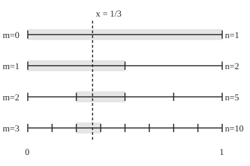
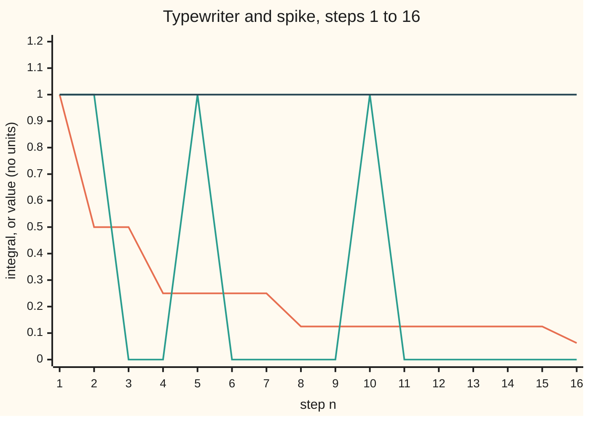
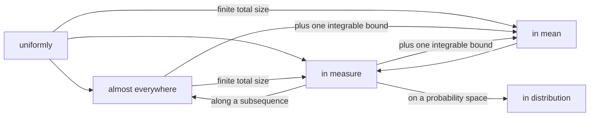

# Modes of convergence: almost everywhere, in measure, in mean, and the map of which implies which

[Syllabus](../../../SYLLABUS.md) → [Measure and integration](../../../SYLLABUS.md#w10) → [Swapping Limits and Integrals](../../../SYLLABUS.md#w10-s05) → Modes of convergence

---

## General Overview

A stage is 1 metre wide, and a spotlight sweeps it. On the first pass the whole stage is lit. On the second pass the stage is cut into two strips of 0.5 m, lit one after the other. On the third pass, four strips of 0.25 m; then eight of 0.125 m; and so on, forever. Steps are counted across passes: step 1 is the first pass, steps 2 and 3 the second, steps 4 to 7 the third. Step 16 lights a strip 0.0625 m wide.

Does the light die away? Measured by how much of the stage is lit, yes: 1, 0.5, 0.25, 0.125, 0.0625, heading to 0. Watched from one seat, no. The seat a third of the way across is lit at steps 1, 2, 5, 10, 21, 42, 85: once in every pass, because every pass covers the whole stage.

On a second stage, one unit of paint is piled n units high on the strip from the left edge to 1/n metres. At step 16 the pile is 16 high on 0.0625 m. Every seat right of the edge is dry from some step on: the seat at 0.1 m from step 10. Yet the paint totals 1 unit at every step.

Each stage passes one meaning of "goes to zero" and fails another. Written as functions, 1 on the lit strip and 0 off it, the first stage is the **typewriter sequence**: it runs across and returns like a typewriter carriage. The paint pile is the **growing spike**. Measure theory names four such tests and proves which forces which.

**A sequence of functions can settle at almost every point, in the size of the set where it is still far off, or in its average distance from the limit. A shrinking average distance forces a shrinking far-off set. So does settling at almost every point, when the whole space has finite size. A shrinking far-off set forces settling at almost every point along a subsequence. No other arrow holds.**

**What kind of fact this is:** four definitions (uniform, almost everywhere, in measure, in mean) and three theorems about them, plus Egorov's theorem and the uniform case, all proved on this card in Why it works.

### The picture: the first four passes of the typewriter

Four passes are drawn to scale, 280 units to the metre. Each row is one pass cut into equal strips; the shaded strip is the one containing the seat at 1/3 m, the dashed line. Every row has one such strip, so the seat at 1/3 is lit on every pass.

<p align="center"></p>

Pass m is cut into 2^m strips. The right-hand labels give the step n at which the shaded strip is lit.



Orange: the integral of the typewriter, its lit length, falling to 0. Green: the typewriter's value at the seat 1/3, which keeps returning to 1. Dark blue: the integral of the growing spike, 1 at every step. The code prints all three rows.

---

## The formula

Notation first, in words. A **measure space** $(\Omega, \mathcal{F}, \mu)$ is a set of points, the subsets we allow ourselves to measure, and a measure giving each a size. Here the points are the seats of [0, 1), the unit interval without its right end, and the size is length, the Lebesgue measure $\lambda$. The indicator $\mathbf{1}_A$ is one on the set A and zero off it. Every function below is measurable, so each set in braces has a size.

The typewriter at step $n$: write $n = 2^m + k$ with $0 \le k < 2^m$, and let $M = 2^m$. Then

$$f_n = \mathbf{1}_{[k/M,\ (k+1)/M)}, \qquad g_n = n\,\mathbf{1}_{[0,\ 1/n)}$$

**Read it aloud:** at step n the typewriter is one on the k-th strip of pass m and zero elsewhere; the spike is n high on the first 1/n of the stage.

Four tests of whether a sequence $f_n$ approaches a limit $f$. **Uniformly:** the worst gap over all points shrinks to zero ([Uniform convergence](../../06-Calculus%20and%20analysis/06-Series/07-uniform-convergence.md)):

$$\sup_{x \in \Omega} |f_n(x) - f(x)| \to 0$$

**Almost everywhere**, written a.e., read "except on a set of size zero" ([Null sets and almost everywhere](../01-Sets%20You%20Can%20Measure/07-null-sets-and-almost-everywhere.md)):

$$\mu\big(\{x : f_n(x) \not\to f(x)\}\big) = 0$$

**In measure:** for every tolerance, the set where the gap exceeds it shrinks to size zero:

$$\text{for every } \varepsilon > 0: \quad \mu\big(\{x : |f_n(x) - f(x)| > \varepsilon\}\big) \to 0$$

**In mean**, or in $L^1$: the total gap (an average when the space has size 1) shrinks to zero; in $L^p$ for a power $p \ge 1$, the total of the gap raised to the power p does:

$$\int |f_n - f|\, d\mu \to 0, \qquad \int |f_n - f|^p\, d\mu \to 0$$

**Read it aloud:** uniformly means one worst gap for every point; almost everywhere means each point settles on its own, apart from a null set; in measure means the badly-off set gets small; in mean means the total gap gets small.

When $\mu$ is a probability $P$, a.e. is called **almost surely** (a.s.) and in measure is called **in probability**. A fifth mode, **in distribution**, compares only laws, $P(f_n \le t) \to P(f \le t)$ where the limit's distribution function does not jump ([Convergence in distribution](../10-The%20Limit%20Theorems%2C%20Proved/05-convergence-in-distribution.md)).

The three theorems. Write $B_n = \{x : |f_n(x) - f(x)| > \varepsilon\}$ for the **bad set** at step n.

$$\mu(B_n) \le \frac{1}{\varepsilon} \int |f_n - f|\, d\mu \qquad \text{(in mean forces in measure)}$$

$$\mu(\Omega) < \infty,\ f_n \to f \text{ a.e.} \;\Longrightarrow\; \mu(E_N) \to 0, \quad E_N = \bigcup_{n \ge N} B_n \qquad \text{(a.e. forces in measure)}$$

$$\mu\big(\{|f_{n_j} - f| > 2^{-j}\}\big) \le 2^{-j} \text{ for each } j \;\Longrightarrow\; f_{n_j} \to f \text{ a.e.} \qquad \text{(a subsequence settles)}$$

**Read it aloud:** the bad set is never bigger than the total gap over the tolerance; on a space of finite size, if almost every point settles, the points still misbehaving after step N shrink to nothing; and a subsequence whose bad sets shrink fast settles at almost every point.

| Symbol | Plain meaning | In our example | Push it up and the answer… |
| --- | --- | --- | --- |
| $\Omega$, $\mathcal{F}$, $\mu$ | the points, the sets we may measure, and the measure giving them sizes | the stage [0, 1), its Borel sets, length | a bigger total size can break the second arrow |
| $\lambda$, $P$ | Lebesgue measure, meaning length; a probability, a measure of total size 1 | length on [0, 1), which is also a probability | — |
| $f_n$, $f$ | the n-th function, and the proposed limit | the typewriter; the limit 0 | — |
| $n$, $N$, $N_r$ | step number; a cut-off step | 16; 4 | later steps, smaller bad sets |
| $m$, $M$, $k$ | pass number; strips in the pass, M = 2^m; which strip, counting from 0 | step 10: m = 3, M = 8, k = 2 | a later pass, a narrower strip |
| $\mathbf{1}_A$, $A$ | the indicator of a set A: one on A, zero off it | the lit strip | — |
| $g_n$, $h_n$, $w_n$ | the growing spike, the sliding bump, the flat spread | g_16 is 16 high on [0, 1/16); w_32 is 1/32 on [0, 32) | — |
| $\varepsilon$ | the tolerance for "far off" | 1/2 | a bigger tolerance, a smaller bad set |
| $p$ | the power in $L^p$, 1 or more | 1 and 2 | a bigger p punishes tall spikes more |
| $B_n$, $E_N$, $F_J$ | the bad set at step n; the union of the bad sets from step N on; the same for a subsequence from j = J on | E_4 for the spike is [0, 1/4) | — |
| $n_j$, $n_1$, $j$, $J$ | the j-th step picked for a subsequence; a starting index | n_j = 2^j: 2, 4, 8, 16 | — |
| $\delta$ | a bound on the thrown-away set's size, in Egorov's theorem | above 0.1, to throw away [0, 0.1) | smaller δ, a later start for uniform settling |

### When it holds

- **One measure space and measurable functions.** The sets in the definitions need sizes. With two measures in play, "a.e." and "in measure" each name which one.
- **Finite total size, for a.e. to force in measure, and uniform to force in mean.** The sliding bump $h_n = \mathbf{1}_{[n,\,n+1)}$ on the half-line settles to 0 at every point, yet its bad set always has length 1. The flat spread $w_n = \tfrac{1}{n}\mathbf{1}_{[0,\,n)}$ settles uniformly, yet its integral stays 1.
- **Integrable gaps, for in mean.** The integral of $|f_n - f|$ must be finite for the test to say anything.
- **A subsequence only, for in measure to give a.e.** The full typewriter settles at no point; only a chosen subsequence settles.
- **A dominating function, for a.e. to give in mean.** The spike has no single integrable function above all its terms, and its average gap stays at 1 ([Dominated convergence](02-dominated-convergence-theorem.md)).

---

## Why it works

### Step 0: every mode is a statement about the bad set

Fix a tolerance, say 1/2. At each step, the bad set $B_n$ is where the function is more than 1/2 away from its limit. The modes differ in what they ask of that set. In measure asks that its size shrink. Almost everywhere asks that each point leave the bad sets for good, apart from a null set. In mean weighs each bad point by how bad it is, and asks that the total shrink. Uniformly asks that the bad set be empty from some step on.

Read the two stages this way. The typewriter's bad set is the lit strip: its size shrinks, and no seat leaves it for good. The spike's bad set is [0, 1/n): its size shrinks, every seat right of 0 leaves it for good, and the paint on it stays 1 unit. Fatou's spotlight ([Fatou's lemma](01-fatous-lemma.md)) is this spike, mirrored.

### Step 1: in mean forces in measure

On the bad set the gap is more than $\varepsilon$, so $\varepsilon \mathbf{1}_{B_n} \le |f_n - f|$ at every point. Integrate both sides: $\varepsilon\, \mu(B_n) \le \int |f_n - f|\, d\mu$. This is Markov's inequality ([Markov and Chebyshev](../04-The%20Lebesgue%20Integral/07-markov-and-chebyshev.md)) in measure language. If the total gap goes to zero, so does the size of the bad set, for every fixed tolerance.

Typewriter at step 10, tolerance 1/2: the average gap is 1/8, so the lit length is at most 2 × 1/8 = 1/4. It is 1/8. For $L^p$ the same move gives $\varepsilon^p \mu(B_n) \le \int |f_n - f|^p\, d\mu$.

The inequality alone does not give the reverse. The spike's bad set has length 1/16 at step 16 while its average gap is 1: the bound 2 is true and useless.

### Step 2: on a space of finite size, almost everywhere forces in measure

Fix $\varepsilon$. Let $E_N$ be the union of the bad sets from step N on: the points that are still more than $\varepsilon$ off at some later step. These sets shrink as N grows. A point in all of them is off by more than $\varepsilon$ infinitely often, so it does not settle, and the points that do not settle form a null set.

Continuity from above ([Continuity and subadditivity](../01-Sets%20You%20Can%20Measure/05-continuity-of-measure.md)) says the sizes of shrinking sets fall to the size of their intersection, provided the first has finite size. Here the intersection is null, so $\mu(E_N) \to 0$. The bad set at step N sits inside $E_N$, so its size goes to 0 too.

For the spike with tolerance 1/2, $E_N = [0, 1/N)$, of length 1, 1/2, 1/4, 1/8 at N = 1, 2, 4, 8. For the sliding bump on the half-line, $E_4 = [4, \infty)$ has infinite length, and continuity from above fails: inside [0, 64) it has length 60, inside [0, 128), 124.

Removing $E_N$ leaves a set on which every later step is within $\varepsilon$. Doing this for a list of shrinking tolerances at once, with removed sets of small total size, makes settling uniform off a small set: **Egorov's theorem**, proved in the Detailed proof. For the spike, throwing away [0, 0.1) leaves a set where the spike is exactly 0 from step 10 on; throwing away [0, 0.01) needs step 100. Step 10 is the first that works: the ninth spike still reaches 9 on [0.1, 1/9). On the full stage the worst gap is n, so settling there is never uniform.

### Step 3: in measure forces almost everywhere along a subsequence

Convergence in measure says the bad sets shrink, not how fast. Pick steps $n_1 < n_2 < \dots$ where they shrink fast enough to add up: the bad set for tolerance $2^{-j}$ at step $n_j$ has size at most $2^{-j}$.

Let $F_J$ be the union of these bad sets from $j = J$ on. Its size is at most $2^{-J} + 2^{-J-1} + \dots = 2^{1-J}$. A point outside $F_J$ is within $2^{-j}$ of the limit at every step $n_j$ with $j \ge J$, so it settles along the subsequence. A point that does not settle lies in every $F_J$, a set of size at most $2^{1-J}$ for every J: a null set.

The typewriter: the first step whose lit length is at most $2^{-j}$ is $n_j = 2^j$, the strip $[0, 2^{-j})$. The subsequence $f_2, f_4, f_8, f_{16}, \dots$ is one on ever shorter strips at the left edge, and every seat right of 0 is dark from some j on. The unions of bad sets from J on, taken to j = 4, have lengths 1/2, 1/4, 1/8, 1/16 against the bounds 1, 1/2, 1/4, 1/8. The same summing trick is the first Borel-Cantelli lemma ([The Borel-Cantelli lemmas](../10-The%20Limit%20Theorems%2C%20Proved/01-borel-cantelli-lemmas.md)).

<details>
<summary>Detailed proof</summary>

Throughout, $(\Omega, \mathcal{F}, \mu)$ is a measure space, the $f_n$ and $f$ are measurable real functions, and $B_n(\varepsilon) = \{|f_n - f| > \varepsilon\}$, which is in $\mathcal{F}$ because $|f_n - f|$ is measurable.

**Lemma 0.** The non-convergence set $\{f_n \not\to f\} = \bigcup_r \bigcap_N \bigcup_{n \ge N} B_n(1/r)$, over $r, N = 1, 2, \dots$, is built by countable operations, so it is in $\mathcal{F}$.

**Theorem 1 (in $L^p$ implies in measure).** For $\varepsilon > 0$ and $p \ge 1$, $\varepsilon^p \mathbf{1}_{B_n(\varepsilon)} \le |f_n - f|^p$ pointwise: on $B_n(\varepsilon)$ the right side exceeds $\varepsilon^p$, off it the left side is 0. Integrate, using that the integral keeps order and that an indicator integrates to its set's size: $\mu(B_n(\varepsilon)) \le \varepsilon^{-p} \int |f_n - f|^p d\mu \to 0$.

**Theorem 2 (a.e. implies in measure when $\mu(\Omega) < \infty$).** Fix $\varepsilon$. Put $E_N = \bigcup_{n \ge N} B_n(\varepsilon)$, a decreasing sequence of sets in $\mathcal{F}$. If $x$ lies in every $E_N$, then $|f_n(x) - f(x)| > \varepsilon$ for infinitely many n, so $x \in \{f_n \not\to f\}$, a null set by hypothesis. By continuity from above, valid because $\mu(E_1) \le \mu(\Omega) < \infty$, $\mu(E_N) \to \mu(\bigcap_N E_N) = 0$. Since $B_N(\varepsilon) \subseteq E_N$, $\mu(B_N(\varepsilon)) \to 0$.

**Theorem 3 (Egorov).** If $\mu(\Omega) < \infty$ and $f_n \to f$ a.e., then for every $\delta > 0$ there is a set $A$ with $\mu(A) < \delta$ such that $f_n \to f$ uniformly off $A$. *Proof.* For each $r = 1, 2, \dots$ apply Theorem 2's argument with $\varepsilon = 1/r$: $\mu(E_N(1/r)) \to 0$, so choose $N_r$ with $\mu(E_{N_r}(1/r)) < \delta 2^{-r}$. Let $A = \bigcup_r E_{N_r}(1/r)$. By countable subadditivity $\mu(A) < \delta \sum_r 2^{-r} = \delta$. Off $A$, for each r and every $n \ge N_r$, $|f_n - f| \le 1/r$ at every point: one step $N_r$ serves the whole set, which is uniform convergence.

**Theorem 4 (Riesz: in measure implies a.e. along a subsequence).** Suppose $\mu(B_n(\varepsilon)) \to 0$ for every $\varepsilon$. Choose $n_1$ with $\mu(B_{n_1}(1/2)) \le 1/2$, then inductively $n_j > n_{j-1}$ with $\mu(B_{n_j}(2^{-j})) \le 2^{-j}$; each choice exists because the sizes tend to 0. Put $F_J = \bigcup_{j \ge J} B_{n_j}(2^{-j})$; by subadditivity $\mu(F_J) \le \sum_{j \ge J} 2^{-j} = 2^{1-J}$. If $x \notin F_J$ then $|f_{n_j}(x) - f(x)| \le 2^{-j}$ for all $j \ge J$, so $f_{n_j}(x) \to f(x)$. The points where the subsequence fails lie in $\bigcap_J F_J$, whose size is at most $2^{1-J}$ for every J, hence 0. No finiteness of $\mu(\Omega)$ was used.

**Theorem 5 (uniform).** If $\sup |f_n - f| \to 0$ then $B_n(\varepsilon)$ is empty from some step on, giving convergence everywhere and in measure. If also $\mu(\Omega) < \infty$, then $\int |f_n - f| d\mu \le \mu(\Omega) \sup |f_n - f| \to 0$.

**The counterexamples.** (a) Typewriter: $\int f_n d\lambda = \lambda(B_n(\varepsilon)) = 1/M \to 0$ for $0 < \varepsilon < 1$. Each pass's strips partition [0, 1), so every x has $f_n(x) = 1$ for one n and $f_n(x) = 0$ for another n in each pass from m = 1 on; $f_n(x)$ converges at no x. (b) Spike: $g_n(x) = 0$ once $n \ge 1/x$ when x > 0, so $g_n \to 0$ a.e., while $\int g_n d\lambda = n \cdot (1/n) = 1$. (c) Bump: $h_n(x) = 0$ once $n > x$, while $\lambda(B_n(1/2)) = 1$; Theorem 2 needs $\lambda(\Omega) < \infty$. (d) Spread: $\sup w_n = 1/n$, while $\int w_n d\lambda = 1$; Theorem 5's second part needs $\lambda(\Omega) < \infty$.

</details>

### Step 4: four examples settle the whole map

An arrow missing from the map needs an example where one mode holds and another fails. Four examples cover every missing arrow among the three main modes, with the limit 0 each time.

| Example | a.e. | in measure | in mean |
| --- | --- | --- | --- |
| typewriter $f_n$, on [0, 1) | no: settles at no point | yes: lit length 1/M | yes: integral 1/M |
| growing spike $g_n$, on [0, 1) | yes: every point but 0 | yes: bad length 1/n | no: integral 1 |
| sliding bump $h_n$, on [0, ∞) | yes: every point | no: bad length 1 | no: integral 1 |
| flat spread $w_n$, on [0, ∞) | yes, and uniformly | yes: bad set empty from n = 2 | no: integral 1 |

Read down the columns: in mean does not force a.e. (typewriter); a.e. does not force in mean, even on a space of size 1 (spike); on an infinite space a.e. does not force in measure (bump), and even uniform settling does not force in mean (spread).



Every arrow is proved here except two: the dominated one from a.e., on [Dominated convergence](02-dominated-convergence-theorem.md), and the last, on [Convergence in distribution](../10-The%20Limit%20Theorems%2C%20Proved/05-convergence-in-distribution.md). The one from in measure follows: given one integrable function above every $|f_n|$, every subsequence, still converging in measure, has by Step 3 a further one settling a.e., along which dominated convergence sends $\int |f_n - f|\, d\mu$ to 0, and numbers with this property tend to 0. On a space of finite size, the exact condition for in measure to give in mean is uniform integrability ([Uniform integrability](05-uniform-integrability.md)).

<details>
<summary>Why a subsequence is the best possible</summary>

On a space of finite size, a sequence converges in measure exactly when every subsequence has a further subsequence converging a.e. No choice of null set rescues the whole typewriter, which fails at every point, so a subsequence is the most that can be promised.

</details>

A second road to Step 1 runs through $L^2$: the Chebyshev form $\varepsilon^2 \mu(B_n) \le \int |f_n - f|^2 d\mu$ is the version wing 09 used for the law of large numbers, done there without measure ([Law of large numbers](../../09-Probability%20and%20statistics/06-Limit%20Theorems%20in%20Practice/01-law-of-large-numbers.md)).

---

## Worked numbers, by hand

| Step | Arithmetic | Value |
| --- | --- | --- |
| typewriter, step 10 | 10 = 8 + 2, so m = 3, M = 8, k = 2 | strip [2/8, 3/8) |
| its integral and lit length | 1/8 | 0.125 |
| Markov bound on the lit length, tolerance 1/2 | 2 × 1/8 | 1/4 |
| steps lighting the seat 1/3 | 2^m + floor(2^m / 3) for m = 0 to 6 | 1, 2, 5, 10, 21, 42, 85 |
| typewriter subsequence | first step with lit length at most 2^-j | **n_j = 2, 4, 8, 16** |
| spike, step 16 | 16 × 1/16 | integral **1** |
| spike's bad length, step 16 | 1/16 | 0.0625 |
| spike's E_N, tolerance 1/2 | [0, 1/N) for N = 1, 2, 4, 8 | 1, 1/2, 1/4, 1/8 |
| Egorov, throw away [0, 0.1) | g_n = 0 on [0.1, 1) once 1/n ≤ 0.1 | from step **10** |

The typewriter shrinks in size and in average and still lights the seat at 1/3 at steps 21, 42, 85; the spike vanishes seat by seat and still holds 1 unit of paint at step 16.

### What breaks if you drop a piece

| Mistake | Comes out at | What went wrong |
| --- | --- | --- |
| Finite size dropped: sliding bump on the half-line | settles at every point, yet bad length 1 at every step; E_4 has length 60 inside [0, 64), 124 inside [0, 128) | continuity from above needs a first set of finite size |
| In measure read as a.e. | typewriter lit length 0.0625 at step 16, yet seat 1/3 lit again at step 21 | small bad sets can keep moving |
| a.e. read as in mean | spike integral 1 at every step; its square integrates to 16 at step 16 | no integrable bound sits over all the spikes |
| Uniform read as in mean | flat spread: worst gap 1/32 at step 32, integral 1 | on an infinite space a thin layer can carry a fixed total |

The code prints all four.

---

## Code, from first principles, and it actually runs

The code checks finite stages; that the typewriter settles nowhere and the spike everywhere but 0 rests on the proofs. Every number is reached by two roads sharing no arithmetic: the formula derived above, and a count of grid cells. The stage [0, 1) is cut into 5040 cells, a number divisible by 1 to 10 and 16, so every strip whose length or integral is printed starts and ends on a cell boundary and testing each cell's midpoint gives exact lengths and integrals. The half-line is cut at 64 into cells of 1/8. The steps lighting the seat 1/3 are found by search and by the formula 2^m + floor(2^m / 3); the subsequence and the Egorov cut-offs are found by search and checked against 2^j and 1/0.1, 1/0.01. The Rust does the same with integer fractions written by hand.

### Python

```python
# Modes of convergence -- the check behind the card.  Standard library only.
# Four sequences, each number found twice: by the formula the card derives and
# by counting grid cells that every step of the functions lines up with.  A
# grid point is the midpoint t/D of a cell, t odd.  The code checks finite
# stages only; every statement about the limit rests on the proofs.
from fractions import Fraction as Q

L = 5040                                 # cells per unit on [0, 1); 1..10, 16 divide it
D = 2 * L
TS = range(1, D, 2)

def tw(n, t):                            # typewriter f_n: 1 on [k/M, (k+1)/M)
    M = 1 << (n.bit_length() - 1)
    k = n - M
    return 1 if D * k <= t * M < D * (k + 1) else 0

def spike(n, t):                         # growing spike g_n: n on [0, 1/n)
    return n if t * n < D else 0

def g_int(f, n, p=1):                    # integral of f_n^p, cell by cell
    return Q(sum(f(n, t) ** p for t in TS), L)

def g_len(f, n):                         # length of {f_n > 1/2}, cell by cell
    return Q(sum(1 for t in TS if 2 * f(n, t) > 1), L)

def dec(q):
    return f"{float(q):.4f}".rstrip("0").rstrip(".")

markov = []                              # (length above 1/2, integral) pairs
print("typewriter f_n on [0, 1): n = M + k, M = 2^m, f_n = 1 on [k/M, (k+1)/M)")
tw_formula, tw_grid = [], []
for n in range(1, 32):
    M = 1 << (n.bit_length() - 1)
    k = n - M
    tw_formula.append(Q(1, M))
    tw_grid.append(g_int(tw, n))
    markov.append((g_len(tw, n), tw_grid[-1]))
    at_third = tw(n, D // 3)                  # the seat x = 1/3 is the grid value t = D/3
    if n <= 16:
        print(f"n={n:2d} m={M.bit_length() - 1} [{k}/{M}, {k + 1}/{M}) integral "
              f"{float(tw_formula[-1]):.4f} grid {float(tw_grid[-1]):.4f} f_n(1/3)={at_third}")
once = all(sum(tw(n, t) for n in range(1 << m, 2 << m)) == 1 for m in range(5) for t in TS)
print(f"every one of {L} grid points is hit exactly once in each stage m=0..4: {'yes' if once else 'no'}")
hits = [n for n in range(1, 128) if tw(n, D // 3) == 1]
hits_formula = [(1 << m) + (1 << m) // 3 for m in range(7)]
print("x = 1/3 is hit at n =", ", ".join(map(str, hits)), "(one per stage m=0..6)")

# Riesz: pick n_j with length{f_n > 2^-j} at most 2^-j, then look at the tail sets
riesz = [next(n for n in range(1, 32) if g_len(tw, n) <= Q(1, 2 ** j)) for j in range(1, 5)]
print("subsequence n_j, j=1..4, by search:", ", ".join(map(str, riesz)),
      "; by formula 2^j:", ", ".join(str(2 ** j) for j in range(1, 5)))
tails = []
for J in range(1, 5):
    union = Q(sum(1 for t in TS if any(tw(riesz[j - 1], t) for j in range(J, 5))), L)
    tails.append(union)
    print(f"J={J}: length of union of bad sets j>=J (to j=4) {union}, bound sum 2^-j = {Q(2, 2 ** J)}")

print("growing spike g_n = n on [0, 1/n): n, integral, length{g_n > 1/2}, integral g_n^2, g_n(1/10)")
sp_formula, sp_grid = [], []
for n in (1, 2, 4, 8, 16):
    sp_formula.append((Q(1), Q(1, n), Q(n)))
    sp_grid.append((g_int(spike, n), g_len(spike, n), g_int(spike, n, 2)))
    markov.append((sp_grid[-1][1], sp_grid[-1][0]))
    print(f"n={n:2d}: {sp_grid[-1][0]}, {sp_grid[-1][1]}, {sp_grid[-1][2]}, {spike(n, D // 10)}")
sp_all = [g_int(spike, n) for n in list(range(1, 11)) + [16]]
print("spike integral, n = 1..16, by formula: 1 each; by grid, n = 1..10 and 16:", " ".join(map(str, sp_all)))
EN = [Q(sum(1 for t in TS if any(2 * spike(n, t) > 1 for n in range(N, 65))), L) for N in (1, 2, 4, 8)]
print("E_N = union over n >= N of {g_n > 1/2}, lengths N=1,2,4,8:", ", ".join(map(str, EN)))
egorov = [next(n for n in range(1, 500) if all(spike(n, t) == 0 for t in TS if t * d >= D)) for d in (10, 100)]
sup9 = max(spike(9, t) for t in TS if 10 * t >= D)
print(f"Egorov: g_n = 0 on [1/10, 1) from n = {egorov[0]}; on [1/100, 1) from n = {egorov[1]}; sup of g_9 on [1/10, 1) = {sup9}")

C, W = 8, 64                             # the half-line, cut at W, C cells per unit
XS = range(1, 2 * C * W, 2)              # midpoints s/(2C)
bump = lambda n, s: 1 if 2 * C * n <= s < 2 * C * (n + 1) else 0
spread = lambda n, s: Q(1, n) if s < 2 * C * n else Q(0)
print(f"sliding bump h_n = 1 on [n, n+1) and flat spread w_n = 1/n on [0, n), on [0, {W}), cells of 1/{C}:")
hw = []
for n in (1, 2, 4, 8, 16, 32):
    bl, bi = Q(sum(1 for s in XS if 2 * bump(n, s) > 1), C), Q(sum(bump(n, s) for s in XS), C)
    sl, si = Q(sum(1 for s in XS if 2 * spread(n, s) > 1), C), sum(spread(n, s) for s in XS) / C
    markov += [(bl, bi), (sl, si)]
    hw.append((bl, bi, sl, si))
    print(f"n={n:2d}: bump length{{>1/2}} {bl}, integral {bi}; spread sup {Q(1, n)}, length{{>1/2}} {sl}, integral {si}")
wins = [Q(sum(1 for s in range(1, 2 * C * w, 2) if any(bump(n, s) for n in range(4, w))), C) for w in (W, 2 * W)]
print(f"bump E_4 inside [0, W): W={W} gives {wins[0]}, W={2 * W} gives {wins[1]}; formula W - 4")
print(f"Markov: length{{|f_n| > 1/2}} <= 2 x integral held in all {len(markov)} rows: "
      f"{'yes' if all(a <= 2 * b for a, b in markov) else 'no'}; typewriter n=10: {markov[9][0]} <= "
      f"{2 * markov[9][1]}; spike n=16: {markov[35][0]} <= {2 * markov[35][1]}")
px = lambda q: dec(40 + 280 * q)            # figure: [0, 1) drawn from x=40 to x=320
shade = [f"{px(Q(n - (1 << m), 1 << m))}-{px(Q(n - (1 << m) + 1, 1 << m))}" for m, n in enumerate(hits[:4])]
print(f"figure, 280 per metre from x=40; x=1/3 at {float(px(Q(1, 3))):.2f}; rows m=0..3 at y 50, 95, 140, 185; "
      f"shaded n = {', '.join(map(str, hits[:4]))}: x {', '.join(shade)}")

assert tw_grid == tw_formula                              # two roads to each integral
assert once and hits == hits_formula                      # every point hit every stage
assert [(a, b, c) for a, b, c in sp_grid] == sp_formula  # spike: grid against formula
assert riesz == [2 ** j for j in range(1, 5)] and tails == [Q(1, 2 ** J) for J in range(1, 5)]
assert EN == [Q(1, N) for N in (1, 2, 4, 8)] and egorov == [10, 100] and sup9 == 9
assert wins == [W - 4, 2 * W - 4] and all(a <= 2 * b for a, b in markov) and sp_all == [1] * 11
assert hw == [(1, 1, Q(1 if n == 1 else 0), 1) for n in (1, 2, 4, 8, 16, 32)]  # bump, spread
```

**Ran 2026-10-06 on macOS, Python 3.14.6, standard library only. All checks passed. Output, pasted from the run:**

```
typewriter f_n on [0, 1): n = M + k, M = 2^m, f_n = 1 on [k/M, (k+1)/M)
n= 1 m=0 [0/1, 1/1) integral 1.0000 grid 1.0000 f_n(1/3)=1
n= 2 m=1 [0/2, 1/2) integral 0.5000 grid 0.5000 f_n(1/3)=1
n= 3 m=1 [1/2, 2/2) integral 0.5000 grid 0.5000 f_n(1/3)=0
n= 4 m=2 [0/4, 1/4) integral 0.2500 grid 0.2500 f_n(1/3)=0
n= 5 m=2 [1/4, 2/4) integral 0.2500 grid 0.2500 f_n(1/3)=1
n= 6 m=2 [2/4, 3/4) integral 0.2500 grid 0.2500 f_n(1/3)=0
n= 7 m=2 [3/4, 4/4) integral 0.2500 grid 0.2500 f_n(1/3)=0
n= 8 m=3 [0/8, 1/8) integral 0.1250 grid 0.1250 f_n(1/3)=0
n= 9 m=3 [1/8, 2/8) integral 0.1250 grid 0.1250 f_n(1/3)=0
n=10 m=3 [2/8, 3/8) integral 0.1250 grid 0.1250 f_n(1/3)=1
n=11 m=3 [3/8, 4/8) integral 0.1250 grid 0.1250 f_n(1/3)=0
n=12 m=3 [4/8, 5/8) integral 0.1250 grid 0.1250 f_n(1/3)=0
n=13 m=3 [5/8, 6/8) integral 0.1250 grid 0.1250 f_n(1/3)=0
n=14 m=3 [6/8, 7/8) integral 0.1250 grid 0.1250 f_n(1/3)=0
n=15 m=3 [7/8, 8/8) integral 0.1250 grid 0.1250 f_n(1/3)=0
n=16 m=4 [0/16, 1/16) integral 0.0625 grid 0.0625 f_n(1/3)=0
every one of 5040 grid points is hit exactly once in each stage m=0..4: yes
x = 1/3 is hit at n = 1, 2, 5, 10, 21, 42, 85 (one per stage m=0..6)
subsequence n_j, j=1..4, by search: 2, 4, 8, 16 ; by formula 2^j: 2, 4, 8, 16
J=1: length of union of bad sets j>=J (to j=4) 1/2, bound sum 2^-j = 1
J=2: length of union of bad sets j>=J (to j=4) 1/4, bound sum 2^-j = 1/2
J=3: length of union of bad sets j>=J (to j=4) 1/8, bound sum 2^-j = 1/4
J=4: length of union of bad sets j>=J (to j=4) 1/16, bound sum 2^-j = 1/8
growing spike g_n = n on [0, 1/n): n, integral, length{g_n > 1/2}, integral g_n^2, g_n(1/10)
n= 1: 1, 1, 1, 1
n= 2: 1, 1/2, 2, 2
n= 4: 1, 1/4, 4, 4
n= 8: 1, 1/8, 8, 8
n=16: 1, 1/16, 16, 0
spike integral, n = 1..16, by formula: 1 each; by grid, n = 1..10 and 16: 1 1 1 1 1 1 1 1 1 1 1
E_N = union over n >= N of {g_n > 1/2}, lengths N=1,2,4,8: 1, 1/2, 1/4, 1/8
Egorov: g_n = 0 on [1/10, 1) from n = 10; on [1/100, 1) from n = 100; sup of g_9 on [1/10, 1) = 9
sliding bump h_n = 1 on [n, n+1) and flat spread w_n = 1/n on [0, n), on [0, 64), cells of 1/8:
n= 1: bump length{>1/2} 1, integral 1; spread sup 1, length{>1/2} 1, integral 1
n= 2: bump length{>1/2} 1, integral 1; spread sup 1/2, length{>1/2} 0, integral 1
n= 4: bump length{>1/2} 1, integral 1; spread sup 1/4, length{>1/2} 0, integral 1
n= 8: bump length{>1/2} 1, integral 1; spread sup 1/8, length{>1/2} 0, integral 1
n=16: bump length{>1/2} 1, integral 1; spread sup 1/16, length{>1/2} 0, integral 1
n=32: bump length{>1/2} 1, integral 1; spread sup 1/32, length{>1/2} 0, integral 1
bump E_4 inside [0, W): W=64 gives 60, W=128 gives 124; formula W - 4
Markov: length{|f_n| > 1/2} <= 2 x integral held in all 48 rows: yes; typewriter n=10: 1/8 <= 1/4; spike n=16: 1/16 <= 2
figure, 280 per metre from x=40; x=1/3 at 133.33; rows m=0..3 at y 50, 95, 140, 185; shaded n = 1, 2, 5, 10: x 40-320, 40-180, 110-180, 110-145
```

### Rust

```rust
// Modes of convergence -- the check behind the card.  Rust std only.
// Four sequences, each number found twice: by the formula the card derives and
// by counting grid cells that every step of the functions lines up with.  A
// grid point is the midpoint t/D of a cell, t odd.  Fractions are exact pairs
// of integers.  The code checks finite stages only; limits rest on the proofs.
const L: i64 = 5040; // cells per unit on [0, 1); 1..10, 16 divide it
const D: i64 = 2 * L;

fn gcd(a: i64, b: i64) -> i64 {
    if b == 0 { a.abs() } else { gcd(b, a % b) }
}
fn q(n: i64, d: i64) -> (i64, i64) {
    let g = gcd(n, d).max(1);
    (n / g, d / g)
}
fn show(x: (i64, i64)) -> String {
    if x.1 == 1 { format!("{}", x.0) } else { format!("{}/{}", x.0, x.1) }
}
fn dec(x: (i64, i64)) -> String {
    let s = format!("{:.4}", x.0 as f64 / x.1 as f64);
    s.trim_end_matches('0').trim_end_matches('.').to_string()
}
fn le(a: (i64, i64), b: (i64, i64)) -> bool {
    a.0 * b.1 <= b.0 * a.1
}
fn top(n: i64) -> i64 {
    1 << (63 - n.leading_zeros() as i64)
}
fn tw(n: i64, t: i64) -> i64 {
    let (m, k) = (top(n), n - top(n));
    if D * k <= t * m && t * m < D * (k + 1) { 1 } else { 0 }
}
fn spike(n: i64, t: i64) -> i64 {
    if t * n < D { n } else { 0 }
}
fn ts() -> impl Iterator<Item = i64> {
    (1..D).step_by(2)
}
fn g_int(f: fn(i64, i64) -> i64, n: i64, p: u32) -> (i64, i64) {
    q(ts().map(|t| f(n, t).pow(p)).sum(), L)
}
fn g_len(f: fn(i64, i64) -> i64, n: i64) -> (i64, i64) {
    q(ts().filter(|&t| 2 * f(n, t) > 1).count() as i64, L)
}
fn join(v: &[i64]) -> String {
    v.iter().map(|x| x.to_string()).collect::<Vec<_>>().join(", ")
}

fn main() {
    let mut markov: Vec<((i64, i64), (i64, i64))> = Vec::new();
    println!("typewriter f_n on [0, 1): n = M + k, M = 2^m, f_n = 1 on [k/M, (k+1)/M)");
    let (mut tw_formula, mut tw_grid) = (Vec::new(), Vec::new());
    for n in 1..32i64 {
        let (m, k) = (top(n), n - top(n));
        tw_formula.push(q(1, m));
        tw_grid.push(g_int(tw, n, 1));
        markov.push((g_len(tw, n), g_int(tw, n, 1)));
        let at_third = tw(n, D / 3); // the seat x = 1/3 is the grid value t = D/3
        if n <= 16 {
            println!("n={:2} m={} [{}/{}, {}/{}) integral {:.4} grid {:.4} f_n(1/3)={}", n, 63 - m.leading_zeros(), k, m, k + 1, m,
                1.0 / m as f64, { let g = g_int(tw, n, 1); g.0 as f64 / g.1 as f64 }, at_third);
        }
    }
    let once = (0..5).all(|m| ts().all(|t| ((1i64 << m)..(2i64 << m)).map(|n| tw(n, t)).sum::<i64>() == 1));
    println!("every one of {} grid points is hit exactly once in each stage m=0..4: {}", L, if once { "yes" } else { "no" });
    let hits: Vec<i64> = (1..128i64).filter(|&n| tw(n, D / 3) == 1).collect();
    let hits_formula: Vec<i64> = (0..7).map(|m| (1i64 << m) + (1i64 << m) / 3).collect();
    println!("x = 1/3 is hit at n = {} (one per stage m=0..6)", join(&hits));

    let riesz: Vec<i64> = (1..5).map(|j| (1..32).find(|&n| le(g_len(tw, n), q(1, 1 << j))).unwrap()).collect();
    println!("subsequence n_j, j=1..4, by search: {} ; by formula 2^j: {}", join(&riesz), join(&[2, 4, 8, 16]));
    let mut tails = Vec::new();
    for jj in 1..5usize {
        let u = q(ts().filter(|&t| (jj..5).any(|j| tw(riesz[j - 1], t) == 1)).count() as i64, L);
        tails.push(u);
        println!("J={}: length of union of bad sets j>=J (to j=4) {}, bound sum 2^-j = {}", jj, show(u), show(q(2, 1 << jj)));
    }

    println!("growing spike g_n = n on [0, 1/n): n, integral, length{{g_n > 1/2}}, integral g_n^2, g_n(1/10)");
    let (mut sp_formula, mut sp_grid) = (Vec::new(), Vec::new());
    for &n in [1i64, 2, 4, 8, 16].iter() {
        sp_formula.push((q(1, 1), q(1, n), q(n, 1)));
        let row = (g_int(spike, n, 1), g_len(spike, n), g_int(spike, n, 2));
        sp_grid.push(row);
        markov.push((row.1, row.0));
        println!("n={:2}: {}, {}, {}, {}", n, show(row.0), show(row.1), show(row.2), spike(n, D / 10));
    }
    let sp_all: Vec<(i64, i64)> = (1..11).chain([16]).map(|n| g_int(spike, n, 1)).collect();
    println!("spike integral, n = 1..16, by formula: 1 each; by grid, n = 1..10 and 16: {}", sp_all.iter().map(|&x| show(x)).collect::<Vec<_>>().join(" "));
    let en: Vec<(i64, i64)> = [1i64, 2, 4, 8].iter().map(|&nn| q(ts().filter(|&t| (nn..65).any(|n| 2 * spike(n, t) > 1)).count() as i64, L)).collect();
    println!("E_N = union over n >= N of {{g_n > 1/2}}, lengths N=1,2,4,8: {}", en.iter().map(|&x| show(x)).collect::<Vec<_>>().join(", "));
    let egorov: Vec<i64> = [10i64, 100].iter().map(|&d| (1..500).find(|&n| ts().filter(|&t| t * d >= D).all(|t| spike(n, t) == 0)).unwrap()).collect();
    let sup9 = ts().filter(|&t| 10 * t >= D).map(|t| spike(9, t)).max().unwrap();
    println!("Egorov: g_n = 0 on [1/10, 1) from n = {}; on [1/100, 1) from n = {}; sup of g_9 on [1/10, 1) = {}", egorov[0], egorov[1], sup9);

    let (c, w) = (8i64, 64i64); // the half-line, cut at W, C cells per unit
    let bump = |n: i64, s: i64| if 2 * c * n <= s && s < 2 * c * (n + 1) { 1i64 } else { 0 };
    let spread = |n: i64, s: i64| if s < 2 * c * n { (1i64, n) } else { (0, 1) }; // w_n at s/(2C), a fraction
    println!("sliding bump h_n = 1 on [n, n+1) and flat spread w_n = 1/n on [0, n), on [0, {}), cells of 1/{}:", w, c);
    let mut hw = Vec::new();
    for &n in [1i64, 2, 4, 8, 16, 32].iter() {
        let xs = (1..2 * c * w).step_by(2);
        let bl = q(xs.clone().filter(|&s| 2 * bump(n, s) > 1).count() as i64, c);
        let bi = q(xs.clone().map(|s| bump(n, s)).sum(), c);
        let inside = xs.clone().filter(|&s| s < 2 * c * n).count() as i64; // cells where w_n = 1/n
        let sl = q(xs.clone().filter(|&s| { let v = spread(n, s); 2 * v.0 > v.1 }).count() as i64, c);
        let si = q(inside, n * c);
        markov.push((bl, bi));
        markov.push((sl, si));
        hw.push((bl, bi, sl, si));
        println!("n={:2}: bump length{{>1/2}} {}, integral {}; spread sup {}, length{{>1/2}} {}, integral {}",
            n, show(bl), show(bi), show(q(1, n)), show(sl), show(si));
    }
    let wins: Vec<i64> = [w, 2 * w].iter().map(|&ww| (1..2 * c * ww).step_by(2).filter(|&s| (4..ww).any(|n| bump(n, s) == 1)).count() as i64 / c).collect();
    println!("bump E_4 inside [0, W): W={} gives {}, W={} gives {}; formula W - 4", w, wins[0], 2 * w, wins[1]);
    let mk = markov.iter().all(|&(a, b)| le(a, (2 * b.0, b.1)));
    let (t10, s16) = (markov[9], markov[35]);
    println!("Markov: length{{|f_n| > 1/2}} <= 2 x integral held in all {} rows: {}; typewriter n=10: {} <= {}; spike n=16: {} <= {}",
        markov.len(), if mk { "yes" } else { "no" }, show(t10.0), show(q(2 * t10.1 .0, t10.1 .1)), show(s16.0), show(q(2 * s16.1 .0, s16.1 .1)));
    let px = |a: i64, b: i64| dec(q(40 * b + 280 * a, b)); // [0, 1) drawn from x=40 to x=320
    let shade: Vec<String> = hits[..4].iter().enumerate().map(|(m, &n)| { let mm = 1i64 << m; format!("{}-{}", px(n - mm, mm), px(n - mm + 1, mm)) }).collect();
    println!("figure, 280 per metre from x=40; x=1/3 at {:.2}; rows m=0..3 at y 50, 95, 140, 185; shaded n = {}: x {}",
        (40.0 + 280.0 / 3.0), join(&hits[..4]), shade.join(", "));

    assert_eq!(tw_grid, tw_formula); // two roads to each integral
    assert!(once && hits == hits_formula); // every point hit every stage
    assert_eq!(sp_grid, sp_formula); // spike: grid against formula
    assert!(riesz == vec![2, 4, 8, 16] && tails == (1..5).map(|j| q(1, 1 << j)).collect::<Vec<_>>());
    assert!(en == vec![q(1, 1), q(1, 2), q(1, 4), q(1, 8)] && egorov == vec![10, 100] && sup9 == 9);
    assert!(wins == vec![w - 4, 2 * w - 4] && mk && sp_all.iter().all(|&x| x == (1, 1)));
    let hw_formula: Vec<_> = [1i64, 2, 4, 8, 16, 32].iter().map(|&n| ((1, 1), (1, 1), if n == 1 { (1, 1) } else { (0, 1) }, (1, 1))).collect();
    assert_eq!(hw, hw_formula); // bump, spread
}
```

**Ran 2026-10-06 on macOS, rustc 1.98.1, no crates. All checks passed. Output, pasted from the run:**

```
typewriter f_n on [0, 1): n = M + k, M = 2^m, f_n = 1 on [k/M, (k+1)/M)
n= 1 m=0 [0/1, 1/1) integral 1.0000 grid 1.0000 f_n(1/3)=1
n= 2 m=1 [0/2, 1/2) integral 0.5000 grid 0.5000 f_n(1/3)=1
n= 3 m=1 [1/2, 2/2) integral 0.5000 grid 0.5000 f_n(1/3)=0
n= 4 m=2 [0/4, 1/4) integral 0.2500 grid 0.2500 f_n(1/3)=0
n= 5 m=2 [1/4, 2/4) integral 0.2500 grid 0.2500 f_n(1/3)=1
n= 6 m=2 [2/4, 3/4) integral 0.2500 grid 0.2500 f_n(1/3)=0
n= 7 m=2 [3/4, 4/4) integral 0.2500 grid 0.2500 f_n(1/3)=0
n= 8 m=3 [0/8, 1/8) integral 0.1250 grid 0.1250 f_n(1/3)=0
n= 9 m=3 [1/8, 2/8) integral 0.1250 grid 0.1250 f_n(1/3)=0
n=10 m=3 [2/8, 3/8) integral 0.1250 grid 0.1250 f_n(1/3)=1
n=11 m=3 [3/8, 4/8) integral 0.1250 grid 0.1250 f_n(1/3)=0
n=12 m=3 [4/8, 5/8) integral 0.1250 grid 0.1250 f_n(1/3)=0
n=13 m=3 [5/8, 6/8) integral 0.1250 grid 0.1250 f_n(1/3)=0
n=14 m=3 [6/8, 7/8) integral 0.1250 grid 0.1250 f_n(1/3)=0
n=15 m=3 [7/8, 8/8) integral 0.1250 grid 0.1250 f_n(1/3)=0
n=16 m=4 [0/16, 1/16) integral 0.0625 grid 0.0625 f_n(1/3)=0
every one of 5040 grid points is hit exactly once in each stage m=0..4: yes
x = 1/3 is hit at n = 1, 2, 5, 10, 21, 42, 85 (one per stage m=0..6)
subsequence n_j, j=1..4, by search: 2, 4, 8, 16 ; by formula 2^j: 2, 4, 8, 16
J=1: length of union of bad sets j>=J (to j=4) 1/2, bound sum 2^-j = 1
J=2: length of union of bad sets j>=J (to j=4) 1/4, bound sum 2^-j = 1/2
J=3: length of union of bad sets j>=J (to j=4) 1/8, bound sum 2^-j = 1/4
J=4: length of union of bad sets j>=J (to j=4) 1/16, bound sum 2^-j = 1/8
growing spike g_n = n on [0, 1/n): n, integral, length{g_n > 1/2}, integral g_n^2, g_n(1/10)
n= 1: 1, 1, 1, 1
n= 2: 1, 1/2, 2, 2
n= 4: 1, 1/4, 4, 4
n= 8: 1, 1/8, 8, 8
n=16: 1, 1/16, 16, 0
spike integral, n = 1..16, by formula: 1 each; by grid, n = 1..10 and 16: 1 1 1 1 1 1 1 1 1 1 1
E_N = union over n >= N of {g_n > 1/2}, lengths N=1,2,4,8: 1, 1/2, 1/4, 1/8
Egorov: g_n = 0 on [1/10, 1) from n = 10; on [1/100, 1) from n = 100; sup of g_9 on [1/10, 1) = 9
sliding bump h_n = 1 on [n, n+1) and flat spread w_n = 1/n on [0, n), on [0, 64), cells of 1/8:
n= 1: bump length{>1/2} 1, integral 1; spread sup 1, length{>1/2} 1, integral 1
n= 2: bump length{>1/2} 1, integral 1; spread sup 1/2, length{>1/2} 0, integral 1
n= 4: bump length{>1/2} 1, integral 1; spread sup 1/4, length{>1/2} 0, integral 1
n= 8: bump length{>1/2} 1, integral 1; spread sup 1/8, length{>1/2} 0, integral 1
n=16: bump length{>1/2} 1, integral 1; spread sup 1/16, length{>1/2} 0, integral 1
n=32: bump length{>1/2} 1, integral 1; spread sup 1/32, length{>1/2} 0, integral 1
bump E_4 inside [0, W): W=64 gives 60, W=128 gives 124; formula W - 4
Markov: length{|f_n| > 1/2} <= 2 x integral held in all 48 rows: yes; typewriter n=10: 1/8 <= 1/4; spike n=16: 1/16 <= 2
figure, 280 per metre from x=40; x=1/3 at 133.33; rows m=0..3 at y 50, 95, 140, 185; shaded n = 1, 2, 5, 10: x 40-320, 40-180, 110-180, 110-145
```

The two outputs are identical line for line.

> [!TIP]
> **Try changing**
> - **The seat.** Guess first: does some seat escape the light? Replace the seat D // 3 by 7 * D // 10 in the hits test. The list changes and still has one step in every pass: no seat escapes. The assert for 1/3 then fails, as it should.
> - **The subsequence rule.** Guess first: what if the rule asks for lit length strictly below 2^-j? Each chosen step doubles, the search runs past step 31 and the check stops with an error. The rule is a choice; any subsequence whose bad sets shrink fast enough works.
> - **The spike's height.** Guess first: with height the square root of n in place of n, which modes change? The integral becomes 1 over the square root of n, falling to 0: the spike now converges in mean, and still a.e. and in measure.
> - **The bump's window.** Guess first: widen the half-line cut from 64 to a larger window. The bump's bad length stays 1 at every step, and E_4 inside the window is always 4 shorter than the window: the union's size grows without limit.

---

## The usual mistake

> [!warning]
> **Reading "in probability" as "each run eventually settles".** Convergence in measure says the set of badly-off points is small at each late step. It says nothing about any one point over time. The typewriter's bad set has length 0.0625 at step 16 and every seat is still lit once in every later pass. Settling point by point is almost everywhere convergence, a separate and stronger promise on a space of finite size.
>
> - **Treating a.e. convergence as enough to swap limit and integral.** The spike tends to 0 at every seat but 0; its integral is 1 at every step.
> - **Expecting the whole sequence to settle when only a subsequence must.** The typewriter subsequence 2, 4, 8, 16 settles; the full sequence settles nowhere.
> - **Mixing up in distribution with the others.** A fair ±1 coin Z and its negative −Z have the same law, yet always differ by 2: in distribution compares laws, not values.

---

## Where you meet it in real life

- **Statistical estimation.** A consistent estimator converges in probability to the true value: the chance of a large error shrinks. The weak law of large numbers gives this for a running average ([The weak law of large numbers](../10-The%20Limit%20Theorems%2C%20Proved/03-weak-law-of-large-numbers.md)); the strong law promises more, almost sure convergence.
- **Simulation.** A Monte Carlo average is judged by its mean squared error, convergence in $L^2$; by Step 1 this bounds the chance of a large error, a crude but safe error bar.
- **Signal processing.** A Fourier series of a square-integrable signal converges to it in mean square; a.e. convergence is a far deeper theorem.
- **Approximation schemes.** Approximations that converge in mean have, by Steps 1 and 3, a subsequence converging at almost every point, which identifies the limit as a function ([Riesz-Fischer](../07-Sizes%20of%20Functions/05-completeness-of-lp.md)).

> **Say it back**
> A sequence of functions can settle at almost every point, have a bad set that shrinks in size, or have a total gap that shrinks. A shrinking total gap forces a shrinking bad set, by Markov's inequality. Settling almost everywhere forces it too when the space has finite size, by continuity from above, and then settling is even uniform off a small set, which is Egorov's theorem. A shrinking bad set gives settling almost everywhere only along a subsequence. The typewriter, the growing spike, the sliding bump and the flat spread show no other arrow holds.

---

## What this builds on

- [Dominated convergence](02-dominated-convergence-theorem.md): the condition that turns a.e. convergence into convergence in mean, and the spike as its failure.
- [Null sets and almost everywhere](../01-Sets%20You%20Can%20Measure/07-null-sets-and-almost-everywhere.md): what "almost everywhere" means, and why countably many exceptions stay null.
- [Continuity and subadditivity](../01-Sets%20You%20Can%20Measure/05-continuity-of-measure.md): continuity from above, used in Step 2.
- [Uniform convergence](../../06-Calculus%20and%20analysis/06-Series/07-uniform-convergence.md): the strongest mode, one tolerance for every point.

## Where this goes next

- [Uniform integrability](05-uniform-integrability.md): on a space of finite size, the exact extra condition under which in measure gives in mean.
- [Riesz-Fischer](../07-Sizes%20of%20Functions/05-completeness-of-lp.md): the subsequence trick of Step 3 building limits in $L^p$.
- [The Borel-Cantelli lemmas](../10-The%20Limit%20Theorems%2C%20Proved/01-borel-cantelli-lemmas.md): the summing argument of Step 3 as a statement about events.
- [The weak law of large numbers](../10-The%20Limit%20Theorems%2C%20Proved/03-weak-law-of-large-numbers.md): convergence in probability of averages, from Step 1's inequality.
- [Convergence in distribution](../10-The%20Limit%20Theorems%2C%20Proved/05-convergence-in-distribution.md): the weakest mode, comparing laws only.
- Weak convergence: convergence tested against every fixed function, weaker than in mean.

The spike shows that settling at almost every point cannot carry the integral along without help; what the help must be, exactly, is the question [Uniform integrability](05-uniform-integrability.md) answers.

---

## Sources

Verified 2026-09-29: every link below resolves to the publisher's or author's page for the book named.

- Folland, Gerald B. *Real Analysis: Modern Techniques and Their Applications*, 2nd ed. Wiley, 1999. [Publisher page](https://www.wiley.com/en-us/Real+Analysis%3A+Modern+Techniques+and+Their+Applications%2C+2nd+Edition-p-9780471317166). Section 2.4: the modes, the four examples, the subsequence theorem, Egorov.
- Tao, Terence. *An Introduction to Measure Theory*. American Mathematical Society, Graduate Studies in Mathematics 126, 2011. [Author's page](https://terrytao.wordpress.com/books/an-introduction-to-measure-theory/). Section 1.5 compares the modes through the bump, spike, spread and typewriter.
- Axler, Sheldon. *Measure, Integration & Real Analysis*. Springer, Graduate Texts in Mathematics 282, 2020. [Author's page with free edition](https://measure.axler.net/). Chapter 2 proves Egorov's theorem.
- Billingsley, Patrick. *Probability and Measure*, Anniversary ed. Wiley, 2012. [Publisher page](https://www.wiley.com/en-us/Probability+and+Measure%2C+Anniversary+Edition-p-9781118122372). Convergence in probability and almost surely, and the subsequence criterion linking them.
