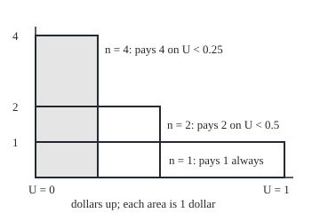
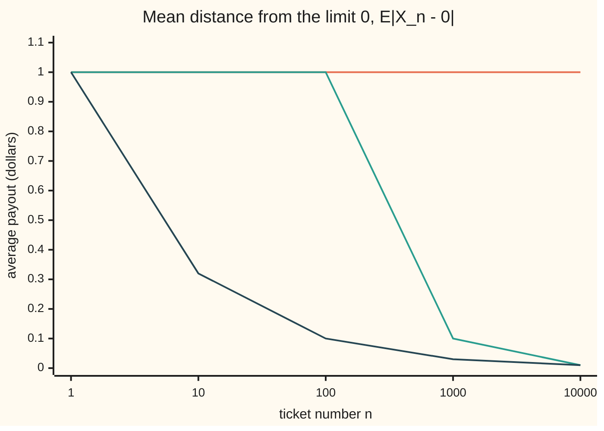

# Uniform integrability: no mass escaping to infinity, and the exact condition for convergence in mean

[Syllabus](../../../SYLLABUS.md) → [Measure and integration](../README.md) → [Swapping Limits and Integrals](../README.md#s05) → Uniform integrability

---

## General Overview

A lottery sells ticket number n for every n = 1, 2, 3, and so on. Ticket n pays n dollars with probability 1/n and nothing otherwise. Ticket 10 pays 10 dollars one time in ten. Ticket 1,000,000 pays a million dollars one time in a million. Every ticket is worth 1 dollar on average: n dollars times 1/n.

Along the row, the chance that a ticket pays anything falls to zero: 0.1, then 0.01, then 0.000001. So the payouts shrink toward 0 in probability. Yet the average payout, which is also the average distance from 0, stays at 1 dollar forever. The mass of the average has not vanished. It has moved to ever larger, ever rarer jackpots: it has escaped to infinity.

Cap the jackpot at 100 dollars and the escape stops. Ticket 1,000 then pays 100 dollars one time in a thousand, an average of 0.10 dollars, and the averages fall to 0 along with the chances. The cap works because it gives every ticket's rare large values a common ceiling. The property it restores is called **uniform integrability**: across a whole family, the part of the average carried by values above a cutoff K becomes small for every member at once as K grows.

**A family of integrable random variables is uniformly integrable when the part of each one's average carried by values above a cutoff shrinks to zero, uniformly, as the cutoff rises; on a probability space this is exactly what convergence in probability needs to become convergence in mean.**

**What kind of fact this is:** a definition, with four theorems proved on this card in Why it works: three tests that give it, its equivalence with uniform absolute continuity of the integral, and Vitali's theorem with its converse.

### The picture: three tickets, each of area one dollar

Tickets 1, 2 and 4 drawn to scale as functions of a uniform point U in [0, 1): 280 units to the whole interval across, 40 units to the dollar up. Ticket n pays n dollars where U is below 1/n.

<p align="center"></p>

Each rectangle's base is the chance of winning and its height is the prize. The bases shrink, the areas do not. The code prints the drawn sizes on its `figure,` line.

---

## The formula

Notation first, in words. Work on a probability space $(\Omega, \mathcal{F}, P)$: outcomes, the events we allow ourselves to measure, and their probabilities. For the lottery, the outcomes are points U of [0, 1) and P is length, the Lebesgue measure λ. The expectation $E[X]$ is the integral of X against P, read "the average of X" ([Expectation as an integral](../04-The%20Lebesgue%20Integral/06-expectation-as-an-integral.md)). A random variable is **integrable**, in $L^1$, when $E|X|$ is finite ([Integrable functions](../04-The%20Lebesgue%20Integral/04-integrable-functions-and-l1.md)). The indicator $\mathbf{1}_A$ is one on the event A, zero off it.

Two modes of convergence from [Modes of convergence](04-modes-of-convergence.md): $X_n$ converges to $X$ **in probability** when $P(|X_n - X| > \varepsilon) \to 0$ for every $\varepsilon > 0$, and **in mean**, or in $L^1$, when $E|X_n - X| \to 0$.

The definition. A family $\mathcal{H}$ of integrable random variables is **uniformly integrable**, written UI, when

$$\lim_{K \to \infty}\ \sup_{X \in \mathcal{H}}\ E\big[\,|X|\,\mathbf{1}_{\{|X| > K\}}\big] \;=\; 0.$$

**Read it aloud:** pick a cutoff K; for each member, take the part of its average that comes from values larger than K; look at the worst member; that worst tail must shrink to zero as K grows.

That inner average is the **tail** of X at K. One integrable X always has a vanishing tail; UI asks one cutoff to serve the whole family.

Three tests that give UI, all proved below. A finite family of integrable variables is UI. A **dominated** family, one with an integrable **envelope** $Z$ such that $|X| \le Z$ for every member, is UI. A family bounded in $L^p$ for some power $p > 1$ is UI, by the bound

$$E\big[|X|\,\mathbf{1}_{\{|X| > K\}}\big] \;\le\; \frac{E|X|^p}{K^{p-1}}.$$

The equivalent form. On a probability space, $\mathcal{H}$ is UI exactly when two things hold: the averages $E|X|$ are bounded over the family, and for every $\varepsilon > 0$ there is a $\delta > 0$ with

$$P(A) < \delta \ \Longrightarrow\ \sup_{X \in \mathcal{H}} E\big[|X|\,\mathbf{1}_A\big] < \varepsilon.$$

**Read it aloud:** no member hides much of its average on a small event. For one integrable X this always holds, and is called **absolute continuity of the integral**; UI is its uniform version.

Vitali's theorem. For integrable $X_n$ and a random variable $X$ on one probability space,

$$X_n \to X \text{ in probability, and } \{X_n\} \text{ UI} \iff X \in L^1 \text{ and } E|X_n - X| \to 0.$$

**Read it aloud:** convergence in probability upgrades to convergence in mean exactly when the sequence is uniformly integrable.

| Symbol | Plain meaning | In our example | Push it up and the answer… |
| --- | --- | --- | --- |
| $n$ | the ticket number | ticket 1,000 pays 1,000 dollars with probability 0.001 | rarer, larger jackpot |
| $X_n$ | ticket n's payout in dollars | n on the event U < 1/n, else 0 | — |
| $X$ | the limit | 0, the in-probability limit of every family here | — |
| $Y_n$, $C$ | the capped ticket, and the cap | $Y_n$ pays min(n, 100) with probability 1/n; C = 100 | a higher cap needs a higher cutoff |
| $R_n$, $W_n$ | two more families: the square-root ticket and the disjoint ticket | $R_n$ pays √n with probability 1/n; $W_n$ pays n with probability 1/(n(n + 1)) | — |
| $K$ | the cutoff | K = 10: the tickets' worst tails are 1, 1, 0.0995, 0.0833 | smaller tails in a UI family |
| $\mathcal{H}$ | a family of integrable random variables | all the lottery tickets | a bigger family is harder to make UI |
| $Z$, $p$ | an integrable envelope; a power above 1 | $W_n$ has no integrable envelope; $R_n$ has $E R_n^2$ = 1, p = 2 | — |
| $\varepsilon$, $\delta$ | a tolerance; the size of a small event | δ = 0.001: capped tickets carry at most 0.1 dollars on it | — |
| $A$, $A_n$, $\mathbf{1}_A$ | an event; the event where $X_n$ misses $X$ by more than ε; the indicator | A = {U < 0.001}; for capped tickets $A_n$ = {U < 1/n} | — |
| $U$, $P$, $E$ | the uniform point; probability; expectation | P(U < 0.01) = 0.01; $E X_n$ = 1 | — |
| $\Omega$, $\mu$, $\lambda$ | the space of outcomes; a general measure; Lebesgue measure | [0, 1) with λ as P; the whole line with λ, not a probability | — |
| $M$, $N$ | a bound on the averages, or on p-th-power averages in the $L^p$ test; a ticket past which the error is small | M = 1 for the lottery | — |
| $T(K)$, $L$, $\wedge$ | the worst tail at K; a cap level in Vitali's proof, not the L of $L^1$; the smaller of two numbers | T(10) = 1 for the lottery; the capped prize is n ∧ 100 | — |
| $\varphi$ | an increasing function with φ(x)/x unbounded | φ(x) = x^2 | — |

### When it holds

- **A finite measure.** Everything here is on a probability space; the same proofs work for any finite measure μ. On the whole line with length λ, the flat spread 1/n on [0, n) of [Modes of convergence](04-modes-of-convergence.md) never exceeds 1, so every tail above K = 1 is zero, yet its integral stays 1. The mass escapes sideways, and a separate condition, tightness (most of every member's mass stays on one set of finite measure), is needed to stop that.
- **Convergence in probability, on one space.** UI alone gives no convergence: fair coin flips of ±1 dollar are bounded, hence UI, and never settle. Vitali's theorem needs both hypotheses.
- **Integrable members.** A family containing one variable with $E|X| = \infty$ is not UI: its tail at every K is infinite.
- **Uniform, not member by member.** Each lottery ticket alone has tail 0 once K reaches n; the family still fails, since one cutoff must serve all members.

---

## Why it works

### Step 0: split every average at a cutoff

Take a cutoff K. Any average splits into the part from values at most K and the part from values above K, the tail. The first part behaves like a bounded variable: an event carries at most K times its probability. Uniform integrability makes the second part small for every member at once. Every proof below is this split, with one estimate for each part. The lottery defeats it: ticket n has all its mass above any K below n.

### Step 1: the lottery is not UI, and the cap makes it UI

Fix K. Every ticket n with n > K has tail n × (1/n) = 1 dollar. The worst tail is 1 for every K and never falls: not UI.

The capped ticket $Y_n$ pays min(n, 100). For K ≥ 100 no payout exceeds K and every tail is 0: UI. Below 100 its worst tail is still 1; UI concerns the limit as K grows, not any fixed K.

The square-root ticket $R_n$ has tail 1/√n when √n > K. The worst is at the smallest n above K^2: at K = 10, 1/√101 = 0.0995. It falls like 1/K: UI.

### Step 2: three tests that give UI

**Finite families.** One integrable X has a tail that vanishes: the integrand falls to zero wherever X is finite, which is almost everywhere, and stays under |X|, so dominated convergence ([Dominated convergence](02-dominated-convergence-theorem.md)) applies. For finitely many members take the largest of their cutoffs.

**Dominated families.** If $|X| \le Z$, then where |X| > K also Z > K, so each member's tail lies under the envelope's tail, which vanishes. The cap at 100 is the case Z = 100.

**Bounded in $L^p$, with $p > 1$.** Where |X| > K, the ratio |X|/K exceeds 1, so its power p − 1 does too: $|X| \le |X|^p / K^{p-1}$ there. Averaging gives the displayed bound. For the square-root ticket $E R_n^2 = 1$, so every tail is at most 1/K; at K = 100 the worst is 1/√10,001, just under the bound 0.0100.

The lottery is bounded in $L^1$, every average 1, and Step 1 shows that is not enough: at p = 1 the factor K^0 = 1 gives no decay.

### Step 3: UI is uniform absolute continuity of the integral

For one integrable X and any event A, split at K:

$$E\big[|X|\mathbf{1}_A\big] \;\le\; K\,P(A) + E\big[|X|\mathbf{1}_{\{|X| > K\}}\big].$$

Choose K with the tail below ε/2, then δ = ε/(2K): any event smaller than δ carries less than ε. That is absolute continuity of the integral. With a supremum over the family, UI gives one K, hence one δ, for all members; taking A to be all of Ω, of probability 1, bounds the averages by K plus the tail; here the finite measure is needed.

The other direction works for any measure. With averages at most M, Markov's inequality ([Markov and Chebyshev](../04-The%20Lebesgue%20Integral/07-markov-and-chebyshev.md)) gives $P(|X| > K) \le M/K$ for every member, so for large K the event {|X| > K} is below δ for everyone and carries less than ε.

On the event {U < 0.001}, ticket 1,000 and every later lottery ticket carry their whole dollar. The capped tickets carry at most 100 × 0.001 = 0.1 dollars there, the square-root tickets at most √0.001 = 0.0316.

### Step 4: Vitali's theorem, forward

Suppose $X_n \to X$ in probability and the $X_n$ are UI, with averages at most M.

*The limit is integrable.* Cap at a level L: $|X|$ capped at L is at most $|X_n|$ capped at L plus $|X - X_n|$ capped at L. The first averages at most M; the second at most ε plus L times $P(|X_n - X| > \varepsilon)$, which tends to ε. So every capped average of |X| is at most M, and monotone convergence ([The monotone convergence theorem](../04-The%20Lebesgue%20Integral/03-monotone-convergence-theorem.md)) gives $E|X| \le M$.

*The error goes to zero.* Let $A_n$ be the event $|X_n - X| > \varepsilon$. Off it the error is at most ε; on it, at most $|X_n| + |X|$:

$$E|X_n - X| \;\le\; \varepsilon + E\big[|X_n|\mathbf{1}_{A_n}\big] + E\big[|X|\mathbf{1}_{A_n}\big].$$

As $P(A_n) \to 0$, uniform absolute continuity shrinks the middle term, whichever n it is, and absolute continuity for X shrinks the last. The error ends below 3ε, for any ε.

For the capped tickets with ε = 0.01, $A_n$ is {U < 1/n}, where any capped ticket carries at most min(1, 100/n). At n = 1,000 the bound is 0.11 and the true error 0.1. For the lottery the bound exceeds 1 and proves nothing, correctly: the error is 1.

### Step 5: the converse

If X is integrable and $E|X_n - X| \to 0$, Markov's inequality gives convergence in probability. For UI, use Step 3's test: $E|X_n| \le E|X| + E|X_n - X|$ bounds the averages, and $E[|X_n|\mathbf{1}_A] \le E|X_n - X| + E[|X|\mathbf{1}_A]$. Past some ticket N the first term is below ε/2; absolute continuity for X and for the first N tickets gives one δ for the rest. So, given convergence in probability, a sequence converges in mean exactly when it is UI.

### Step 6: UI is weaker than domination

Ticket $W_n$ pays n dollars when U lies in [1/(n + 1), 1/n), probability 1/(n(n + 1)), and these events do not overlap. Its average is 1/(n + 1) and its worst tail at K is 1/(K + 2): UI, so Vitali gives $E W_n \to 0$. The smallest envelope, $\sup_n W_n$, equals n on the n-th event and averages 1/2 + 1/3 + … + 1/(N + 1) up to ticket N, the harmonic series less its first term: 11.0902 by N = 100,000, without bound. No integrable envelope exists, so dominated convergence cannot see what Vitali proves.



Orange: the lottery, flat at 1 dollar, not UI, no convergence in mean. Green: the jackpot capped at 100 dollars, flat until n reaches the cap, then falling as 100/n. Dark: the square-root ticket, bounded in $L^2$, falling as 1/√n. All three converge to 0 in probability.

<details>
<summary>Detailed proof</summary>

Throughout, $(\Omega, \mathcal{F}, P)$ is a probability space; for a finite measure μ replace P(Ω) = 1 by μ(Ω) where it appears. $\mathcal{H}$ is a non-empty family of integrable random variables, and $T(K) = \sup_{X \in \mathcal{H}} E[|X|\mathbf{1}_{\{|X| > K\}}]$.

**Lemma 1 (one variable).** If $E|X| < \infty$ then $E[|X|\mathbf{1}_{\{|X| > K\}}] \to 0$ as $K \to \infty$. *Proof.* $|X|$ is finite a.e. ([The integral of a non-negative function](../04-The%20Lebesgue%20Integral/02-integral-of-a-nonnegative-function.md), finite integral gives finite a.e.). At each such point the integrand is 0 once K ≥ |X|. The integrands lie under |X|; dominated convergence along K = 1, 2, 3, … gives the limit 0, and the tail is non-increasing in K.

**Theorem 1 (three tests).** (a) A finite family is UI: $T(K)$ is the largest of finitely many tails, each tending to 0 by Lemma 1. (b) If $|X| \le Z$ for all $X \in \mathcal{H}$ with $EZ < \infty$: on $\{|X| > K\}$, $Z \ge |X| > K$, so $|X|\mathbf{1}_{\{|X| > K\}} \le Z\mathbf{1}_{\{Z > K\}}$ pointwise; monotonicity of the integral gives $T(K) \le E[Z\mathbf{1}_{\{Z > K\}}] \to 0$ by Lemma 1. (c) If $p > 1$ and $E|X|^p \le M$ for all members: on $\{|X| > K\}$, $(|X|/K)^{p-1} \ge 1$, so $|X|\mathbf{1}_{\{|X| > K\}} \le |X|^p/K^{p-1}$; averaging gives $T(K) \le M/K^{p-1} \to 0$.

**Theorem 2 (characterization).** $\mathcal{H}$ is UI if and only if (i) $\sup_{\mathcal{H}} E|X| < \infty$ and (ii) for every $\varepsilon > 0$ there is $\delta > 0$ with $\sup_{\mathcal{H}} E[|X|\mathbf{1}_A] < \varepsilon$ whenever $P(A) < \delta$. *Proof.* Suppose UI. For any event A and any K, $|X|\mathbf{1}_A \le K\mathbf{1}_A + |X|\mathbf{1}_{\{|X| > K\}}$ pointwise (split by whether $|X| \le K$), so $E[|X|\mathbf{1}_A] \le K\,P(A) + T(K)$. With $A = \Omega$ and K chosen so $T(K) \le 1$, $E|X| \le K + 1$: (i). Given ε, choose K with $T(K) < \varepsilon/2$ and set $\delta = \varepsilon/(2K)$: (ii). Conversely, let M bound the averages and, given ε, take δ from (ii). Markov's inequality gives $P(|X| > K) \le M/K$ for every member. For $K > M/\delta$ each event $\{|X| > K\}$ has probability below δ, so (ii) with $A = \{|X| > K\}$ gives $E[|X|\mathbf{1}_{\{|X| > K\}}] < \varepsilon$ for every member: $T(K) \le \varepsilon$. The case of a one-member family, with Lemma 1, is **absolute continuity of the integral**: for integrable X and every ε there is δ with $E[|X|\mathbf{1}_A] < \varepsilon$ whenever $P(A) < \delta$.

**Theorem 3 (Vitali, forward).** If $X_n \to X$ in probability and $\{X_n\}$ is UI, then $X \in L^1$ and $E|X_n - X| \to 0$. *Proof.* Let M bound $E|X_n|$ (Theorem 2 (i)). For $a, b \ge 0$ and $L > 0$, $(a + b) \wedge L \le a \wedge L + b \wedge L$: if either term on the right is L it is clear, otherwise the right is $a + b$. With $|X| \le |X_n| + |X - X_n|$ and monotonicity of $t \mapsto t \wedge L$, $E[|X| \wedge L] \le M + E[|X - X_n| \wedge L] \le M + \varepsilon + L\,P(|X_n - X| > \varepsilon)$. Let $n \to \infty$, then $\varepsilon \to 0$: $E[|X| \wedge L] \le M$. As $L \uparrow \infty$, $|X| \wedge L \uparrow |X|$, and monotone convergence gives $E|X| \le M$. Now fix ε and let $A_n = \{|X_n - X| > \varepsilon\}$. Pointwise, $|X_n - X| \le \varepsilon + (|X_n| + |X|)\mathbf{1}_{A_n}$, so $E|X_n - X| \le \varepsilon + E[|X_n|\mathbf{1}_{A_n}] + E[|X|\mathbf{1}_{A_n}]$. Take δ from Theorem 2 (ii) for the family $\{X_n\} \cup \{X\}$, which is UI by Theorem 1 (a) together with the definition (the supremum over a union is the larger of two suprema). Since $P(A_n) \to 0$, for large n both terms are below ε, and $E|X_n - X| < 3\varepsilon$. So $\limsup_n E|X_n - X| \le 3\varepsilon$ for every ε.

**Theorem 4 (Vitali, converse).** If $X \in L^1$ and $E|X_n - X| \to 0$, then $X_n \to X$ in probability and $\{X_n\}$ is UI. *Proof.* Markov's inequality applied to $|X_n - X|$ gives $P(|X_n - X| > \varepsilon) \le E|X_n - X|/\varepsilon \to 0$. For (i): $E|X_n| \le E|X| + E|X_n - X|$, and a convergent sequence of numbers is bounded. For (ii): given ε, choose N with $E|X_n - X| < \varepsilon/2$ for $n > N$. The finite family $\{X, X_1, \ldots, X_N\}$ is UI (Theorem 1 (a)), so Theorem 2 gives δ with $E[|Y|\mathbf{1}_A] < \varepsilon/2$ for each of its members Y when $P(A) < \delta$. For $n > N$, $E[|X_n|\mathbf{1}_A] \le E|X_n - X| + E[|X|\mathbf{1}_A] < \varepsilon$; for $n \le N$ the bound is immediate. Theorem 2 gives UI.

**The families.** $X_n = n\mathbf{1}_{\{U < 1/n\}}$ has $E X_n = 1$, $P(X_n > \varepsilon) = 1/n$ for $0 < \varepsilon < 1$, and tail 1 at every K < n, so $T(K) = 1$: not UI, as Theorem 3 forces, since UI would give $E X_n \to 0$. $Y_n \le 100$ is UI by Theorem 1 (b); $E R_n^2 = 1$ gives $T(K) \le 1/K$ by Theorem 1 (c). For $W_n$ the sets are disjoint, so $\sup_n W_n = \sum_n W_n$ and monotone convergence gives $E\sup_n W_n = \sum_n 1/(n + 1) = \infty$.

</details>

A second test, due to de la Vallée Poussin, replaces the power x^p by any increasing φ with φ(x)/x growing without bound; this card proves only the power case. The martingale use of UI is on [Stopping without a bound](../../11-Stochastic%20processes%20and%20calculus/02-Martingales/06-uniform-integrability-and-unbounded-stopping.md).

---

## Worked numbers, by hand

| Step | Arithmetic | Value |
| --- | --- | --- |
| ticket 1,000's chance of paying | 1/1,000 | 0.001 |
| its average payout | 1,000 × 0.001 | **1 dollar** |
| chance it is more than 0.5 from 0 | P(U < 0.001) | 0.001, falling to 0 |
| average distance from 0 | same as the average | 1 dollar, for every n |
| capped at 100: average of ticket 1,000 | 100 × 0.001 | 0.1 dollars |
| capped: tail at K = 100 | no payout above 100 | **0**: UI |
| square-root ticket 1,000: average | √1,000 × 0.001 | 0.0316 dollars |
| square-root: worst tail at K = 100 | 1/√10,001, at most 1/100 | 0.0100 |

The lottery is worth 1 dollar a ticket, forever, although late tickets almost never pay; a cap of 100 dollars turns that into an average that dies away as 100/n.

### What breaks if you drop a piece

| Mistake | Comes out at | What went wrong |
| --- | --- | --- |
| Using convergence in probability without UI | P(win) 0.000001 at n = 1,000,000, yet mean distance from 0 still 1.0000 | the mass sits on ever rarer, ever larger jackpots |
| Taking bounded averages for UI | every lottery mean 1.0000, worst tail 1.0000 at every K | $L^1$-bounded is p = 1, where the $L^p$ test gives no decay |
| Dropping the finite measure | on the line, height 0.0100 at n = 100 and every tail 0, but area 1.0000 | the mass escapes sideways, which tails above K cannot see |
| Trusting a sample to see the tail | 200,000 tickets at n = 1,000,000: 0 winners, sample mean 0.0000, true mean 1 | a jackpot of probability 0.000001 is almost never drawn |

The code prints all four.

---

## Code, from first principles, and it actually runs

The code checks four ticket families; statements about every family rest on the proofs. Each average is computed two ways: value times probability over the ticket's law, and the area under its survival curve P(X > t), a midpoint sum over t in which P(X > t) is the length of the part of [0, 1) where the ticket, written as a function of U, pays more than t; the second road never reads the law, so a wrong law fails the check. Every worst tail and worst mass on a small event is found by brute force over tickets 1 to 100,000 and compared with the closed form from the proofs, and the square-root tickets are held to the $L^2$ bound 1/K. Vitali's bound is checked on the capped tickets, the disjoint tickets' envelope between ln((N + 2)/2) and ln(N + 1) from a logarithm series written out, and a SplitMix64 generator, seed 20260929, simulates 200,000 tickets, asserting within four standard errors.

### Python

```python
# Uniform integrability -- the check behind the card.  Standard library only.
# Ticket n pays n dollars with probability 1/n: X_n = n on {U < 1/n}, U uniform on [0, 1).
# Roads: (1) value x probability summed over each ticket's law, in fractions where exact;
# (2) the area under the survival curve P(X > t), a midpoint sum over t, with P(X > t) measured
# on [0, 1) from the ticket as a function of U, not from its law; (3) brute-force
# suprema over tickets 1..N_MAX against closed forms; (4) a SplitMix64 simulation.
from fractions import Fraction as F

C, N_MAX = 100, 100_000                      # capped jackpot; tickets searched by brute force

def lottery(n):  return [(0, 1 - F(1, n)), (n, F(1, n))]           # (value, probability)
def capped(n):   return [(0, 1 - F(1, n)), (min(n, C), F(1, n))]
def root(n):     return [(0, 1 - F(1, n)), (n ** 0.5, F(1, n))]    # pays sqrt(n)
def disjoint(n): return [(0, 1 - F(1, n * (n + 1))), (n, F(1, n * (n + 1)))]
FAMILIES = [("lottery", lottery), ("capped", capped), ("root", root), ("disjoint", disjoint)]

def tail(law, K):                             # road 1: E[X 1{X > K}] as value x probability
    return sum(v * p for v, p in law if v > K)

V = {"lottery": lambda n: n, "capped": lambda n: min(n, C), "root": lambda n: n ** 0.5, "disjoint": lambda n: n}
S = {"lottery": lambda n: (0.0, 1 / n), "capped": lambda n: (0.0, 1 / n), "root": lambda n: (0.0, 1 / n),
     "disjoint": lambda n: (1 / (n + 1), 1 / n)}     # ticket as a function of U: V(n) on [a, b), 0 elsewhere

def survival_area(name, n, M=1000):           # road 2: midpoint sum over t of P(X_n > t), read off [0, 1)
    v, (a, b) = V[name](n), S[name](n)
    surv = lambda t: (b - a) if v > t else 0.0  # length of {U : X_n(U) > t}, for t >= 0
    h = 2 * v / M                               # P(X_n > t) = 0 from t = v on
    return sum(surv((j + 0.5) * h) * h for j in range(M))

def ln(y):                                    # natural log by the series 2(z + z^3/3 + ...)
    z = (y - 1) / (y + 1); p, total, i = z, 0.0, 0
    while abs(p) > 1e-17:
        total += p / (2 * i + 1); p, i = p * z * z, i + 1
    return 2 * total

print("n, P(ticket pays), mean by law, mean by survival area, mean capped at 100, mean of sqrt(n) ticket")
chart = {name: [] for name, _ in FAMILIES[:3]}
for n in (1, 10, 100, 1000, 10_000, 100_000, 1_000_000):
    means = [float(tail(f(n), 0)) for _, f in FAMILIES]
    for (name, _), m in zip(FAMILIES, means):
        assert abs(m - survival_area(name, n)) < 1e-12                 # roads 1 and 2 agree
    assert abs(survival_area("root", n) - n ** -0.5) < 1e-12        # E R_n = 1/sqrt(n), off the survival curve
    print(f"{n:7d}, {1 / n:.6f}, {means[0]:.4f}, {survival_area('lottery', n):.4f}, "
          f"{means[1]:.4f}, {means[2]:.4f}")
    if n <= 10_000:
        for name, m in zip(chart, means): chart[name].append(m)
for name in chart: print(f"chart, {name}:", ", ".join(f"{v:.2f}" for v in chart[name]))

def brute(value, piece, K=None, delta=None):  # road 3: sup over n of E[X_n 1{X_n > K}] or E[X_n 1{U < delta}]
    best = 0.0
    for n in range(1, N_MAX + 1):
        v, (a, b) = value(n), piece(n)
        mass = (b - a) if delta is None else max(0.0, min(b, delta) - a)
        if (K is None or v > K): best = max(best, v * mass)
    return best

print("K, worst tail E[X_n 1{X_n > K}] over tickets: lottery, capped, root, disjoint; bound 1/K for root")
for K in (1, 10, 100, 300):
    got = [brute(V[k], S[k], K=K) for k in V]
    closed = [1.0, 1.0 if K < C else 0.0, 1 / (K * K + 1) ** 0.5, 1 / (K + 2)]
    assert all(abs(g - c) < 1e-12 for g, c in zip(got, closed))       # brute force = closed form
    assert got[2] <= 1 / K and abs(float(tail(root(K * K + 1), K)) - got[2]) < 1e-12
    print(f"{K:3d}, " + ", ".join(f"{g:.4f}" for g in got) + f"; {1 / K:.4f}")

print("delta, worst E[X_n 1{U < delta}] over tickets: lottery, capped, root, disjoint")
for delta in (0.01, 0.001, 0.0001):
    got = [brute(V[k], S[k], delta=delta) for k in V]
    closed = [1.0, min(1.0, C * delta), delta ** 0.5, delta / (1 + delta)]
    assert all(abs(g - c) < 1e-9 for g, c in zip(got, closed))
    print(f"{delta}, " + ", ".join(f"{g:.4f}" for g in got))

eps = 0.01                                     # Vitali's bound for the capped tickets
for n in (1000, 10_000, 100_000):
    bound = eps + brute(V["capped"], S["capped"], delta=1 / n)
    actual = survival_area("capped", n)                             # E|Y_n - 0| by road 2, not from the law
    assert actual <= bound                                           # Vitali's bound: road 2 against road 3
    assert abs(bound - eps - min(1, C / n)) < 1e-12                   # road 3 = eps + min(1, C/n)
    print(f"vitali, capped n = {n}: E|Y_n - 0| = {actual:.4f} <= eps + worst mass on P = 1/n: {bound:.4f}")

print("N, integral of the envelope sup_n W_n up to ticket N, bounds ln((N + 2)/2) and ln(N + 1)")
for N in (10, 100, 1000, 10_000, 100_000):
    env = sum(float(tail(disjoint(n), 0)) for n in range(1, N + 1))    # pieces are disjoint
    assert ln((N + 2) / 2) <= env <= ln(N + 1)                       # integral test, both sides
    print(f"{N:6d}, {env:.4f}, {ln((N + 2) / 2):.4f}, {ln(N + 1):.4f}")

for n in (1, 10, 100):                         # infinite measure: height 1/n on [0, n) of the line
    M = 1024; h = 1 / 8                         # one grid for every n: cells of 1/8 on [0, 128)
    cells = [1 / n if (i + 0.5) * h < n else 0.0 for i in range(M)]
    area, over = sum(c * h for c in cells), sum(c * h for c in cells if c > 1)
    assert abs(area - 1) < 1e-9                                      # grid area against the closed form 1
    print(f"line, n = {n}: height {1 / n:.4f}, area {area:.4f}, tail above K = 1: {over:.4f}")

MASK = (1 << 64) - 1
def splitmix(state):
    state = (state + 0x9E3779B97F4A7C15) & MASK
    z = state
    z = ((z ^ (z >> 30)) * 0xBF58476D1CE4E5B9) & MASK
    z = ((z ^ (z >> 27)) * 0x94D049BB133111EB) & MASK
    return state, (z ^ (z >> 31)) >> 11
state, DRAWS = 20260929, 200_000
us = []
for _ in range(DRAWS):
    state, r = splitmix(state); us.append(r / 2 ** 53)
for n in (10, 1000, 1_000_000):
    wins = sum(1 for u in us if u < 1 / n)
    mean, se = wins * n / DRAWS, ((n - 1) / DRAWS) ** 0.5
    if n <= 1000: assert abs(mean - 1) <= 4 * se                  # road 4 within 4 standard errors
    print(f"simulate n = {n}: {DRAWS} tickets, {wins} winners, sample mean {mean:.4f}, standard error {se:.4f}")
PX_U, PX_D = 280, 40                           # figure scale: px for all of [0, 1), px per dollar
print("figure, rect widths px " + ", ".join(str(PX_U // n) for n in (1, 2, 4)) + "; heights px "
      + ", ".join(str(PX_D * n) for n in (1, 2, 4)) + "; base y 200")
print("ALL CHECKS PASS")
```

**Ran 2026-10-06 on macOS, Python 3.14.6, standard library only. All checks passed. Output, pasted from the run:**

```
n, P(ticket pays), mean by law, mean by survival area, mean capped at 100, mean of sqrt(n) ticket
      1, 1.000000, 1.0000, 1.0000, 1.0000, 1.0000
     10, 0.100000, 1.0000, 1.0000, 1.0000, 0.3162
    100, 0.010000, 1.0000, 1.0000, 1.0000, 0.1000
   1000, 0.001000, 1.0000, 1.0000, 0.1000, 0.0316
  10000, 0.000100, 1.0000, 1.0000, 0.0100, 0.0100
 100000, 0.000010, 1.0000, 1.0000, 0.0010, 0.0032
1000000, 0.000001, 1.0000, 1.0000, 0.0001, 0.0010
chart, lottery: 1.00, 1.00, 1.00, 1.00, 1.00
chart, capped: 1.00, 1.00, 1.00, 0.10, 0.01
chart, root: 1.00, 0.32, 0.10, 0.03, 0.01
K, worst tail E[X_n 1{X_n > K}] over tickets: lottery, capped, root, disjoint; bound 1/K for root
  1, 1.0000, 1.0000, 0.7071, 0.3333; 1.0000
 10, 1.0000, 1.0000, 0.0995, 0.0833; 0.1000
100, 1.0000, 0.0000, 0.0100, 0.0098; 0.0100
300, 1.0000, 0.0000, 0.0033, 0.0033; 0.0033
delta, worst E[X_n 1{U < delta}] over tickets: lottery, capped, root, disjoint
0.01, 1.0000, 1.0000, 0.1000, 0.0099
0.001, 1.0000, 0.1000, 0.0316, 0.0010
0.0001, 1.0000, 0.0100, 0.0100, 0.0001
vitali, capped n = 1000: E|Y_n - 0| = 0.1000 <= eps + worst mass on P = 1/n: 0.1100
vitali, capped n = 10000: E|Y_n - 0| = 0.0100 <= eps + worst mass on P = 1/n: 0.0200
vitali, capped n = 100000: E|Y_n - 0| = 0.0010 <= eps + worst mass on P = 1/n: 0.0110
N, integral of the envelope sup_n W_n up to ticket N, bounds ln((N + 2)/2) and ln(N + 1)
    10, 2.0199, 1.7918, 2.3979
   100, 4.1973, 3.9318, 4.6151
  1000, 6.4865, 6.2166, 6.9088
 10000, 8.7877, 8.5174, 9.2104
100000, 11.0902, 10.8198, 11.5129
line, n = 1: height 1.0000, area 1.0000, tail above K = 1: 0.0000
line, n = 10: height 0.1000, area 1.0000, tail above K = 1: 0.0000
line, n = 100: height 0.0100, area 1.0000, tail above K = 1: 0.0000
simulate n = 10: 200000 tickets, 19868 winners, sample mean 0.9934, standard error 0.0067
simulate n = 1000: 200000 tickets, 199 winners, sample mean 0.9950, standard error 0.0707
simulate n = 1000000: 200000 tickets, 0 winners, sample mean 0.0000, standard error 2.2361
figure, rect widths px 280, 140, 70; heights px 40, 80, 160; base y 200
ALL CHECKS PASS
```

### Rust

Same numbers, same labels, built with `rustc --edition 2021 -O`. The lottery's and the capped ticket's averages are also computed as integer fractions, checked against the survival area.

```rust
// Uniform integrability -- the same check in Rust, std only.
// Ticket n pays n dollars with probability 1/n: X_n = n on {U < 1/n}, U uniform on [0, 1).
// Roads: (1) value x probability over each ticket's law, exact integer fractions for the
// lottery; (2) the area under the survival curve P(X > t), a midpoint sum over t, with P(X > t)
// measured on [0, 1) from the ticket as a function of U, not from its law; (3) brute-force
// suprema over tickets 1..N_MAX against closed forms; (4) a SplitMix64 simulation.

const C: u64 = 100;
const N_MAX: u64 = 100_000;

type Law = Vec<(f64, f64)>; // (value, probability)

fn law(family: usize, n: u64) -> Law {
    let nf = n as f64;
    match family {
        0 => vec![(0.0, 1.0 - 1.0 / nf), (nf, 1.0 / nf)],
        1 => vec![(0.0, 1.0 - 1.0 / nf), (n.min(C) as f64, 1.0 / nf)],
        2 => vec![(0.0, 1.0 - 1.0 / nf), (nf.sqrt(), 1.0 / nf)],
        _ => vec![(0.0, 1.0 - 1.0 / (nf * (nf + 1.0))), (nf, 1.0 / (nf * (nf + 1.0)))],
    }
}

fn tail(l: &Law, k: f64) -> f64 { // road 1: E[X 1{X > K}] as value x probability
    l.iter().filter(|(v, _)| *v > k).map(|(v, p)| v * p).sum()
}

fn ln(y: f64) -> f64 { // natural log by the series 2(z + z^3/3 + ...)
    let z = (y - 1.0) / (y + 1.0);
    let (mut p, mut total, mut i) = (z, 0.0, 0.0);
    while p.abs() > 1e-17 { total += p / (2.0 * i + 1.0); p *= z * z; i += 1.0; }
    2.0 * total
}

fn gcd(a: u64, b: u64) -> u64 { if b == 0 { a } else { gcd(b, a % b) } }

fn exact_mean(f: usize, n: u64) -> (u64, u64) { // lottery (0) or capped (1): sum of value x count, over n
    let terms = [(0u64, n - 1), (if f == 0 { n } else { n.min(C) }, 1u64)]; // (value, chances in n)
    let num: u64 = terms.iter().map(|(v, c)| v * c).sum();
    let g = gcd(num, n);
    (num / g, n / g)
}

fn value(f: usize, n: u64) -> f64 {
    match f { 1 => n.min(C) as f64, 2 => (n as f64).sqrt(), _ => n as f64 }
}

fn piece(f: usize, n: u64) -> (f64, f64) {
    let nf = n as f64;
    if f == 3 { (1.0 / (nf + 1.0), 1.0 / nf) } else { (0.0, 1.0 / nf) }
} // ticket as a function of U: value(f, n) on [a, b), 0 elsewhere

fn survival_area(f: usize, n: u64) -> f64 { // road 2: midpoint sum over t of P(X_n > t), read off [0, 1)
    let (v, (a, b)) = (value(f, n), piece(f, n));
    let surv = |t: f64| if v > t { b - a } else { 0.0 }; // length of {U : X_n(U) > t}, for t >= 0
    let (m, h) = (1000, 2.0 * v / 1000.0); // P(X_n > t) = 0 from t = v on
    (0..m).map(|j| surv((j as f64 + 0.5) * h) * h).sum()
}

// road 3: sup over n of E[X_n 1{X_n > K}] (delta < 0) or of E[X_n 1{U < delta}] (k < 0)
fn brute(f: usize, k: f64, delta: f64) -> f64 {
    let mut best = 0.0f64;
    for n in 1..=N_MAX {
        let (v, (a, b)) = (value(f, n), piece(f, n));
        let mass = if delta < 0.0 { b - a } else { (b.min(delta) - a).max(0.0) };
        if k < 0.0 || v > k { best = best.max(v * mass) }
    }
    best
}

fn join(v: &[f64], d: usize) -> String {
    v.iter().map(|x| format!("{:.*}", d, x)).collect::<Vec<_>>().join(", ")
}

fn splitmix(state: &mut u64) -> u64 {
    *state = state.wrapping_add(0x9E3779B97F4A7C15);
    let mut z = *state;
    z = (z ^ (z >> 30)).wrapping_mul(0xBF58476D1CE4E5B9);
    z = (z ^ (z >> 27)).wrapping_mul(0x94D049BB133111EB);
    (z ^ (z >> 31)) >> 11
}

fn main() {
    println!("n, P(ticket pays), mean by law, mean by survival area, mean capped at 100, mean of sqrt(n) ticket");
    let mut chart: Vec<Vec<f64>> = vec![vec![], vec![], vec![]];
    for &n in [1u64, 10, 100, 1000, 10_000, 100_000, 1_000_000].iter() {
        let means: Vec<f64> = (0..4).map(|f| tail(&law(f, n), 0.0)).collect();
        for f in 0..4 { assert!((means[f] - survival_area(f, n)).abs() < 1e-12); } // roads 1 and 2
        for f in 0..2 { let (a, b) = exact_mean(f, n); assert!((a as f64 / b as f64 - survival_area(f, n)).abs() < 1e-12); }
        assert!((survival_area(2, n) - 1.0 / (n as f64).sqrt()).abs() < 1e-12); // E R_n = 1/sqrt(n), off the survival curve
        println!("{:7}, {:.6}, {:.4}, {:.4}, {:.4}, {:.4}", n, 1.0 / n as f64, means[0],
                 survival_area(0, n), means[1], means[2]);
        if n <= 10_000 { for f in 0..3 { chart[f].push(means[f]) } }
    }
    for (f, name) in ["lottery", "capped", "root"].iter().enumerate() {
        println!("chart, {}: {}", name, join(&chart[f], 2));
    }

    println!("K, worst tail E[X_n 1{{X_n > K}}] over tickets: lottery, capped, root, disjoint; bound 1/K for root");
    for &k in [1.0f64, 10.0, 100.0, 300.0].iter() {
        let got: Vec<f64> = (0..4).map(|f| brute(f, k, -1.0)).collect();
        let closed = [1.0, if k < C as f64 { 1.0 } else { 0.0 }, 1.0 / (k * k + 1.0).sqrt(), 1.0 / (k + 2.0)];
        for f in 0..4 { assert!((got[f] - closed[f]).abs() < 1e-12); } // brute force = closed form
        assert!(got[2] <= 1.0 / k && (tail(&law(2, (k * k) as u64 + 1), k) - got[2]).abs() < 1e-12);
        println!("{:3}, {}; {:.4}", k, join(&got, 4), 1.0 / k);
    }

    println!("delta, worst E[X_n 1{{U < delta}}] over tickets: lottery, capped, root, disjoint");
    for &delta in [0.01f64, 0.001, 0.0001].iter() {
        let got: Vec<f64> = (0..4).map(|f| brute(f, -1.0, delta)).collect();
        let closed = [1.0, (C as f64 * delta).min(1.0), delta.sqrt(), delta / (1.0 + delta)];
        for f in 0..4 { assert!((got[f] - closed[f]).abs() < 1e-9); }
        println!("{}, {}", delta, join(&got, 4));
    }

    let eps = 0.01; // Vitali's bound for the capped tickets
    for &n in [1000u64, 10_000, 100_000].iter() {
        let bound = eps + brute(1, -1.0, 1.0 / n as f64);
        let actual = survival_area(1, n); // E|Y_n - 0| by road 2, not from the law
        assert!(actual <= bound); // Vitali's bound: road 2 against road 3
        assert!((bound - eps - (C as f64 / n as f64).min(1.0)).abs() < 1e-12); // road 3 = eps + min(1, C/n)
        println!("vitali, capped n = {}: E|Y_n - 0| = {:.4} <= eps + worst mass on P = 1/n: {:.4}", n, actual, bound);
    }

    println!("N, integral of the envelope sup_n W_n up to ticket N, bounds ln((N + 2)/2) and ln(N + 1)");
    for &big in [10u64, 100, 1000, 10_000, 100_000].iter() {
        let env: f64 = (1..=big).map(|n| tail(&law(3, n), 0.0)).sum(); // pieces are disjoint
        let (lo, hi) = (ln((big as f64 + 2.0) / 2.0), ln(big as f64 + 1.0));
        assert!(lo <= env && env <= hi); // integral test, both sides
        println!("{:6}, {:.4}, {:.4}, {:.4}", big, env, lo, hi);
    }

    for &n in [1u64, 10, 100].iter() { // infinite measure: height 1/n on [0, n) of the line
        let (m, nf) = (1024, n as f64);
        let h = 1.0 / 8.0; // one grid for every n: cells of 1/8 on [0, 128)
        let cells: Vec<f64> = (0..m).map(|i| if (i as f64 + 0.5) * h < nf { 1.0 / nf } else { 0.0 }).collect();
        let area: f64 = cells.iter().map(|c| c * h).sum();
        let over = cells.iter().filter(|&&c| c > 1.0).fold(0.0f64, |acc, c| acc + c * h);
        assert!((area - 1.0).abs() < 1e-9); // grid area against the closed form 1
        println!("line, n = {}: height {:.4}, area {:.4}, tail above K = 1: {:.4}", n, 1.0 / nf, area, over);
    }

    let (mut state, draws) = (20260929u64, 200_000usize);
    let us: Vec<f64> = (0..draws).map(|_| splitmix(&mut state) as f64 / (1u64 << 53) as f64).collect();
    for &n in [10u64, 1000, 1_000_000].iter() {
        let wins = us.iter().filter(|&&u| u < 1.0 / n as f64).count();
        let mean = (wins as u64 * n) as f64 / draws as f64;
        let se = ((n - 1) as f64 / draws as f64).sqrt();
        if n <= 1000 { assert!((mean - 1.0).abs() <= 4.0 * se); } // road 4 within 4 standard errors
        println!("simulate n = {}: {} tickets, {} winners, sample mean {:.4}, standard error {:.4}", n, draws, wins, mean, se);
    }
    let (px_u, px_d) = (280u64, 40u64); // figure scale: px for all of [0, 1), px per dollar
    let w: Vec<String> = [1u64, 2, 4].iter().map(|n| (px_u / n).to_string()).collect();
    let hts: Vec<String> = [1u64, 2, 4].iter().map(|n| (px_d * n).to_string()).collect();
    println!("figure, rect widths px {}; heights px {}; base y 200", w.join(", "), hts.join(", "));
    println!("ALL CHECKS PASS");
}
```

**Ran 2026-10-06 on macOS, rustc 1.98.1, no crates. All checks passed. Output, pasted from the run:**

```
n, P(ticket pays), mean by law, mean by survival area, mean capped at 100, mean of sqrt(n) ticket
      1, 1.000000, 1.0000, 1.0000, 1.0000, 1.0000
     10, 0.100000, 1.0000, 1.0000, 1.0000, 0.3162
    100, 0.010000, 1.0000, 1.0000, 1.0000, 0.1000
   1000, 0.001000, 1.0000, 1.0000, 0.1000, 0.0316
  10000, 0.000100, 1.0000, 1.0000, 0.0100, 0.0100
 100000, 0.000010, 1.0000, 1.0000, 0.0010, 0.0032
1000000, 0.000001, 1.0000, 1.0000, 0.0001, 0.0010
chart, lottery: 1.00, 1.00, 1.00, 1.00, 1.00
chart, capped: 1.00, 1.00, 1.00, 0.10, 0.01
chart, root: 1.00, 0.32, 0.10, 0.03, 0.01
K, worst tail E[X_n 1{X_n > K}] over tickets: lottery, capped, root, disjoint; bound 1/K for root
  1, 1.0000, 1.0000, 0.7071, 0.3333; 1.0000
 10, 1.0000, 1.0000, 0.0995, 0.0833; 0.1000
100, 1.0000, 0.0000, 0.0100, 0.0098; 0.0100
300, 1.0000, 0.0000, 0.0033, 0.0033; 0.0033
delta, worst E[X_n 1{U < delta}] over tickets: lottery, capped, root, disjoint
0.01, 1.0000, 1.0000, 0.1000, 0.0099
0.001, 1.0000, 0.1000, 0.0316, 0.0010
0.0001, 1.0000, 0.0100, 0.0100, 0.0001
vitali, capped n = 1000: E|Y_n - 0| = 0.1000 <= eps + worst mass on P = 1/n: 0.1100
vitali, capped n = 10000: E|Y_n - 0| = 0.0100 <= eps + worst mass on P = 1/n: 0.0200
vitali, capped n = 100000: E|Y_n - 0| = 0.0010 <= eps + worst mass on P = 1/n: 0.0110
N, integral of the envelope sup_n W_n up to ticket N, bounds ln((N + 2)/2) and ln(N + 1)
    10, 2.0199, 1.7918, 2.3979
   100, 4.1973, 3.9318, 4.6151
  1000, 6.4865, 6.2166, 6.9088
 10000, 8.7877, 8.5174, 9.2104
100000, 11.0902, 10.8198, 11.5129
line, n = 1: height 1.0000, area 1.0000, tail above K = 1: 0.0000
line, n = 10: height 0.1000, area 1.0000, tail above K = 1: 0.0000
line, n = 100: height 0.0100, area 1.0000, tail above K = 1: 0.0000
simulate n = 10: 200000 tickets, 19868 winners, sample mean 0.9934, standard error 0.0067
simulate n = 1000: 200000 tickets, 199 winners, sample mean 0.9950, standard error 0.0707
simulate n = 1000000: 200000 tickets, 0 winners, sample mean 0.0000, standard error 2.2361
figure, rect widths px 280, 140, 70; heights px 40, 80, 160; base y 200
ALL CHECKS PASS
```

The two outputs are identical line for line.

> [!TIP]
> **Try changing**
> - **Raise the cap.** Guess first: with the jackpot capped at 1,000 instead of 100, is the family still UI, and what does ticket 1,000 average? Change `C` to 1000 in both files. Ticket 1,000 now averages 1.0000 and the worst tail at K = 100 is 1.0000; the asserts still pass. Any finite cap gives UI; a higher cap needs a higher cutoff.
> - **A fatter root.** Guess first: tickets paying n^0.9 dollars with probability 1/n, are they UI? In `root` and `V`, change `n ** 0.5` to `n ** 0.9`. The run stops at the assert that expects the square-root averages 1/√n. The family is still UI: $E R_n^p$ = n^(0.9p − 1) stays bounded for p up to 10/9, a power above 1, so the $L^p$ test applies, but its tails now fall only like K^(−1/9).
> - **More tickets in the sample.** Guess first: how many draws until the million-dollar ticket's sample mean is trustworthy? Change `200_000` to `2_000_000` in the Python. One winner appears, and the sample mean reads 0.5000 against a true 1, with a standard error of 0.7071: still useless. A simulation needs many times 1/P(win) draws to see a rare tail.

---

## The usual mistake

> [!warning]
> **Reading "converges to 0 in probability" as "its average goes to 0".** Ticket 1,000,000 almost never pays, and its average is still 1 dollar. Convergence in probability says where most of the probability goes; the average also counts how far the rest goes. Only uniform integrability ties the two.
>
> - **Taking a bounded average for UI.** Every lottery ticket averages 1 dollar, a bound as tight as it gets, and the worst tail is 1.0000 at every cutoff.
> - **Checking one member at a time.** Every single ticket is integrable, and ticket n's own tail is 0 once K reaches n. UI needs one cutoff for the whole family.
> - **Expecting UI to need a dominating function.** The disjoint tickets are UI, with worst tail 0.0833 at K = 10, yet the smallest envelope averages 11.0902 by ticket 100,000 and grows without bound.

---

## Where you meet it in real life

- **Fair games that stop late.** A doubling strategy at a fair coin wins 1 dollar almost surely, yet each version forced to stop by a fixed toss averages 0. Its gains are not UI, which is why its average does not follow its limit ([Stopping without a bound](../../11-Stochastic%20processes%20and%20calculus/02-Martingales/06-uniform-integrability-and-unbounded-stopping.md)).
- **Simulating rare, large losses.** A Monte Carlo average sees only the tail its sample reaches: 200,000 draws usually miss a one-in-a-million loss of a million, and the estimate reads 0.
- **Insurance limits.** Capping each claim is Step 2's dominated test: capped losses form a UI family. Uncapped catastrophe losses need their tails checked directly.
- **Averages of samples.** For independent draws from one integrable law, the sample means form a UI family: on a small event A, each draw's contribution is at most the largest $E[|X|\mathbf{1}_B]$ over events B no bigger than A, the same bound for every draw, and averaging keeps it. So the law of large numbers in probability upgrades to convergence in mean.

> **Say it back**
> A family is uniformly integrable when the part of each member's average carried by values above a cutoff becomes small for all members at once as the cutoff rises. The lottery ticket paying n dollars with probability 1/n fails: its average of 1 dollar always sits above any cutoff below n. Capping the jackpot, bounding a higher moment, or having one integrable envelope each restores UI. UI is the same as bounded averages plus no member hiding much on a small event. Vitali's theorem: on a probability space, convergence in probability plus UI is exactly convergence in mean.

---

## What this builds on

- [Modes of convergence](04-modes-of-convergence.md): convergence in probability and in mean, and the growing spike between them, this lottery as a function of U; this card supplies the condition that joins the two.
- [Integrable functions](../04-The%20Lebesgue%20Integral/04-integrable-functions-and-l1.md): integrable random variables and the average absolute distance $E|X_n - X|$ used throughout.

Within the shelf, [Dominated convergence](02-dominated-convergence-theorem.md) is the special case with an envelope, and [Fatou's lemma](01-fatous-lemma.md) gives only the one-sided inequality that UI closes.

## Where this goes next

- [Stopping without a bound](../../11-Stochastic%20processes%20and%20calculus/02-Martingales/06-uniform-integrability-and-unbounded-stopping.md): UI as the condition under which a fair game stopped at an unbounded random time keeps its fair value, and why the doubling strategy fails it.

Which fair games stopped at an unbounded random time are UI is the question [Stopping without a bound](../../11-Stochastic%20processes%20and%20calculus/02-Martingales/06-uniform-integrability-and-unbounded-stopping.md) answers.

---

## Sources

Verified 2026-09-29: every link below resolves to the publisher's or author's page for the book named.

- Williams, David. *Probability with Martingales*. Cambridge University Press, 1991. [Publisher page](https://www.cambridge.org/core/books/probability-with-martingales/B4CFCE0D08930FB46C6E93E775503926). Chapter 13 defines uniform integrability, gives the dominated and $L^p$ tests, and proves that convergence in probability plus UI is convergence in mean, with the converse.
- Billingsley, Patrick. *Probability and Measure*, Anniversary Edition. Wiley, 2012. [Publisher page](https://www.wiley.com/en-us/Probability+and+Measure%2C+Anniversary+Edition-p-9781118122372). Section 16 treats uniform integrability and its use in passing limits through integrals.
- Durrett, Rick. *Probability: Theory and Examples*, 5th ed. Cambridge University Press, 2019. [Author's page](https://services.math.duke.edu/~rtd/PTE/pte.html). The section "Uniform Integrability, Convergence in L1" in the martingale chapter proves the Vitali equivalence and uses it for martingales.
