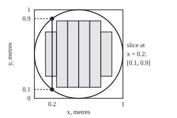

# Product sigma-algebras: the smallest family on pairs that keeps both coordinates measurable, and every slice of a measurable set is measurable

[Syllabus](../../../SYLLABUS.md) → [Measure and integration](../../../SYLLABUS.md#w10) → [Product Measures and Fubini](../../../SYLLABUS.md#w10-s06) → Product sigma-algebras

---

## General Overview

A dart lands on a square board 1 m on each side. Its landing point is a pair of numbers: x, metres from the left edge, and y, metres from the bottom edge. Some questions ask about one number only. "Did it land in the left fifth?" asks about x. "Did it land in the top half?" asks about y. Each of those picks out a strip of the board.

The scoring question asks about both at once. "Did it land within 0.5 m of the centre?" picks out a disc, and a disc is no strip, nor a rectangle made by crossing two strips. It is still built from them. Small squares with corners on a fine grid fill the disc from inside: 32 squares of side 1/8 m cover half the board's area, and finer grids creep up on the disc's area of 0.785398 square metres.

Cut the disc along the vertical line 0.3 m left of centre, at x = 0.2. The cut is the stretch of y from 0.1 to 0.9, 0.8 m long: the **slice** of the disc at x = 0.2. Every set built from rectangles has slices the y-axis can measure, and the rest of this shelf depends on it: area comes from adding up slice lengths.

**The product sigma-algebra on pairs is the smallest family of sets that holds every rectangle made of measurable sides; every set in it has measurable slices, every function measurable for it has measurable slices, and on the plane it is exactly the Borel sets.**

**What kind of fact this is:** a definition (the product sigma-algebra), and three theorems proved on this card in Why it works: three ways of building it agree, slices of its sets and functions are measurable, and on the plane it equals the Borel sets.

### The picture: the disc, its slice at x = 0.2, and the squares of side 1/8 inside it

<p align="center"></p>

To scale: 180 units per metre, the board's corner (0, 0) at (70, 200). Each shaded column is a run of squares of side 1/8 m lying wholly inside the disc: 32 squares in all. The vertical line is the slice at x = 0.2.

---

## The formula

Notation first, in words. $\Omega_1$ and $\Omega_2$ are two spaces: here the possible values of x and of y, each the interval from 0 to 1. $\Omega_1 \times \Omega_2$ is the set of all pairs $(x, y)$ with $x$ from the first and $y$ from the second ([Ordered pairs and the Cartesian product](../../01-Foundations/07-Sets/05-ordered-pairs-and-cartesian-product.md)). $\mathcal{F}_1$ and $\mathcal{F}_2$ are sigma-algebras on them: families of sets closed under complements and countable unions, read "the collections of sets we allow ourselves to measure". For sets $A$ in $\mathcal{F}_1$ and $B$ in $\mathcal{F}_2$, the **measurable rectangle** $A \times B$ is every pair with $x$ in $A$ and $y$ in $B$. $\sigma(\cdot)$ is "the sigma-algebra generated by": the smallest one holding the sets named inside ([Generated sigma-algebras and Borel sets](../01-Sets%20You%20Can%20Measure/03-generated-and-borel-sigma-algebras.md)). The symbol $\otimes$, read "product", joins two sigma-algebras.

$$\mathcal{F}_1 \otimes \mathcal{F}_2 \;=\; \sigma\{\, A \times B \;:\; A \in \mathcal{F}_1,\ B \in \mathcal{F}_2 \,\}$$

**Read it aloud:** the product sigma-algebra is the smallest sigma-algebra on pairs that holds every rectangle whose two sides are measurable.

A set $E$ of pairs has a **slice** at each $x$, written $E_x$, and one at each $y$, written $E^y$:

$$E_x = \{\, y \in \Omega_2 : (x, y) \in E \,\}, \qquad E^y = \{\, x \in \Omega_1 : (x, y) \in E \,\}.$$

**Read it aloud:** the slice at x is every y that makes the pair land in E; the slice at y is every x that does.

Let $\pi_1(x, y) = x$ and $\pi_2(x, y) = y$ be the **coordinate maps**; $\pi_1^{-1}(A)$ is the strip of pairs whose x lies in $A$. The three results, proved below:

$$\mathcal{F}_1 \otimes \mathcal{F}_2 = \sigma\{\pi_1^{-1}(A),\ \pi_2^{-1}(B) : A \in \mathcal{F}_1,\ B \in \mathcal{F}_2\}; \qquad E \in \mathcal{F}_1 \otimes \mathcal{F}_2 \;\Rightarrow\; E_x \in \mathcal{F}_2 \text{ and } E^y \in \mathcal{F}_1; \qquad \mathcal{B}(\mathbb{R}^2) = \mathcal{B}(\mathbb{R}) \otimes \mathcal{B}(\mathbb{R}).$$

The first says the product is the smallest family making both coordinate maps measurable. A function $f$ of pairs has slices too: $f_x(y) = f(x, y)$, with $x$ held fixed. If $f$ is measurable for the product, every $f_x$ is measurable for $\mathcal{F}_2$.

| Symbol | Plain meaning | In our example | Push it up and the answer… |
| --- | --- | --- | --- |
| $\Omega_1$, $\Omega_2$, $x$, $y$ | the two spaces; a point of each | x and y from 0 to 1 m; x = 0.2 | — |
| $\mathcal{F}_1$, $\mathcal{F}_2$ | sigma-algebras on each space | the Borel sets of each axis; the scoring machine's 4 sets | finer families give a finer product |
| $A$, $B$, $A \times B$ | measurable sets on each axis; the rectangle they make | left half times top half | a bigger side, a bigger rectangle |
| $\sigma$ | the generated sigma-algebra: smallest holding the named sets | 10 rectangles generate 16 sets | more generators: never a smaller family |
| $\mathcal{F}_1 \otimes \mathcal{F}_2$, $\otimes$ | the product sigma-algebra; the sign joining two families | the machine's 16 sets; the Borel sets of the plane | — |
| $\pi_1$, $\pi_2$ | coordinate maps: read off x, read off y | $\pi_1$(0.2, 0.5) = 0.2 | — |
| $E$, $E_x$, $E^y$ | a set of pairs; its slice at x; its slice at y | the disc; $E_x$ = [0.1, 0.9] at x = 0.2 | slices move with x |
| $f$, $f_x$, $\mathbf{1}_D$ | a function of pairs; its slice with x fixed; the indicator of D, one on D, zero off it | the disc's indicator; 1 on [0.1, 0.9] at x = 0.2 | — |
| $\mathcal{B}(\mathbb{R})$, $\mathcal{B}(\mathbb{R}^2)$, $V$ | Borel sets of the line; of the plane, generated by open sets; a set of the line that is not Borel | intervals; the disc; the Vitali set | — |
| $D$, $r$ | the disc; its radius | centre (0.5, 0.5), $r$ = 0.5 m | a bigger disc, longer slices |
| $\mathcal{G}$, $U$, $p$, $s$, $k$ | proof letters: the good sets, whose slices are measurable; an open set of the plane; a point of it; room around that point; a place in a countable list | the open disc; the point (0.2, 0.5) | — |
| $\mathcal{D}$, $a$, $b$, $E_k$, $A_k$ | more proof letters: the sets of the line whose strip is Borel in the plane; the ends of an open interval; the k-th set of pairs, or of the line, in a countable union | — | — |
| $p_1$, $p_2$, $u_1$, $z_1$, $u_2$, $z_2$ | the two coordinates of the point $p$; rationals just below and just above each coordinate | $p$ = (0.2, 0.5) | — |
| $n$ | grid count: squares of side 1/n | 8 gives 32 squares | more squares, closer to the disc |

### When it holds

- **No measure is needed.** The definition and the slice theorems use only the two sigma-algebras, so they hold for any two measurable spaces.
- **Every slice, for the product family only.** Enlarge the family to the Lebesgue sets of the plane and slices fail at some x; and measurable slices alone do not put a set in the product. Both are in The usual mistake.
- **A countable supply of small boxes.** $\mathcal{B}(\mathbb{R}^2) = \mathcal{B}(\mathbb{R}) \otimes \mathcal{B}(\mathbb{R})$ rests on every open set being a countable union of rational rectangles, true in the plane and in higher dimensions. For much larger spaces the Borel sets of the product can outgrow the product of the Borel sets (wing 17).

---

## Why it works

### Step 0: slicing respects every set operation

The slice of a complement is the complement of the slice: y is in the slice at x of "not E" exactly when (x, y) is not in E. The slice of a union is the union of the slices. So the sets whose slices are measurable form a sigma-algebra. That family holds every rectangle, and the product is the smallest sigma-algebra that does. So the product sits inside it.

### Step 1: a scoring machine small enough to list

A scoring machine has two coarse sensors. One reports whether the dart hit the left third, column L; it cannot tell the middle column M from the right column R. The other reports bottom half or top half. So $\Omega_1$ is L, M, R with $\mathcal{F}_1$ = nothing, L, M-or-R, everything: 4 sets. $\Omega_2$ is bottom, top with all 4 of its subsets. The board has 6 cells and 64 subsets of cells.

The pairs of sides give 16 rectangles, but only 10 distinct ones: every rectangle with an empty side is the same empty set. The product holds 16 sets. The code builds it three ways:

- **from the rectangles**, adding complements and unions until nothing changes;
- **from the strips** alone, sets like "column L, either half" and "top half, any column", which are the questions about one coordinate;
- **from the atom cells**: the machine's smallest nonempty sets on each axis are L and M-or-R, bottom and top, and their products L-bottom, L-top, M-or-R-bottom, M-or-R-top cut the board into 4 blocks, so the product is all $2^4 = 16$ unions of those blocks.

All three give 16 sets. The first two agree in general, because a rectangle is where two strips overlap: $A \times B = \pi_1^{-1}(A) \cap \pi_2^{-1}(B)$. So the product sigma-algebra is also the smallest family that makes both coordinate maps measurable, the "keeps both coordinates measurable" of the title.

### Step 2: rectangles alone are not enough

The staircase set L-bottom, M-top, R-top is the union of two rectangles, so it is in the product, but it is no rectangle. On the real board the complement of a rectangle is an L-shape or a frame, and the disc is no rectangle at all. So the definition takes the generated family, not the rectangles.

### Step 3: every slice of a product set is measurable

Fix x. Collect every set of pairs whose slice at x lies in $\mathcal{F}_2$, and call the collection $\mathcal{G}$. A rectangle $A \times B$ has slice $B$ at an x in $A$ and the empty set elsewhere: both measurable, so rectangles are in $\mathcal{G}$. By Step 0, $\mathcal{G}$ is a sigma-algebra. The product is the smallest sigma-algebra holding the rectangles, so every product set lies in $\mathcal{G}$. The same argument works for slices at y.

This is the **good-sets principle**: to show every set in a generated family has a property, show the sets with the property form a sigma-algebra and include the generators.

On the machine the code checks all 16 product sets: every slice is allowed. The single cell M-bottom fails: its slice at bottom is the column M alone, which the machine cannot single out. So M-bottom is not in the product. A slice that is not measurable certifies that a set is not product-measurable. Here the converse also holds, because the machine tells the rows apart; on the plane it fails (The usual mistake).

### Step 4: slices of measurable functions are measurable

Let $f$ be a function of pairs, measurable for the product: for every Borel set $B$ of values, the pairs with $f$ in $B$ form a product set ([Measurable functions](../03-Measurable%20Functions/01-measurable-functions.md)). Hold x fixed. The y with $f_x(y)$ in $B$ are exactly the slice at x of the pairs with $f$ in $B$. Step 3 makes that slice measurable. So $f_x$ is measurable.

The dart's score, 1 inside the disc and 0 outside, is the indicator $\mathbf{1}_D$, read "one on D, zero off it". Its slice at x = 0.2 is 1 on [0.1, 0.9] and 0 elsewhere: the indicator of the set's slice.

### Step 5: the disc is in the product, and so is every Borel set of the plane

The disc $D$ is the set of pairs within $r$ = 0.5 m of the centre (0.5, 0.5). Its slice at x is an interval of half-width $\sqrt{r^2 - (x - 0.5)^2}$ about 0.5. At x = 0.2 the half-width is 0.4, so the slice is [0.1, 0.9]. At x = 0.95 it is [0.2821, 0.7179]. At x = 1 it is the single point 0.5.

Why is the disc in the product? Take the grid of squares of side $1/n$ and keep those lying wholly inside the open disc. Each is a rectangle of two intervals. At $n$ = 8 there are 32, covering area 0.5. At $n$ = 512 there are 204836, covering 0.781387, short of $\pi/4$ = 0.785398 by 0.004011. Every point of the open disc has a little room around it, so some square of some grid holds it. Over all grids there are countably many squares, and their union is the open disc: a member of the product. The closed disc is the complement of an open set, the outside, which the same argument covers.

The argument never used the disc's shape: every open set of the plane is a countable union of rectangles with rational corners. So the product holds every open set, and so every Borel set of the plane. The other way, a strip "x in A" is Borel in the plane whenever $A$ is Borel on the line, since the coordinate map is continuous; so rectangles are Borel. The two families are equal.

<details>
<summary>Detailed proof</summary>

**Claim 1: rectangles and strips generate the same family, the smallest making both coordinate maps measurable.** A strip $\pi_1^{-1}(A) = A \times \Omega_2$ is a rectangle, since $\Omega_2 \in \mathcal{F}_2$; likewise $\Omega_1 \times B$. A rectangle is the intersection of two strips, $A \times B = (A \times \Omega_2) \cap (\Omega_1 \times B)$, and a sigma-algebra holds the intersection of two members, the complement of the union of their complements. So each generating family lies in the sigma-algebra the other generates, and by the comparison rule of [Generated sigma-algebras and Borel sets](../01-Sets%20You%20Can%20Measure/03-generated-and-borel-sigma-algebras.md) the two generated families are equal. A sigma-algebra on the pairs makes $\pi_1$ measurable exactly when it holds every strip $\pi_1^{-1}(A)$ with $A \in \mathcal{F}_1$ ([Measurable functions](../03-Measurable%20Functions/01-measurable-functions.md)), so the smallest one making both maps measurable is the one the strips generate.

**Claim 2: slices of product sets are measurable.** Fix $x \in \Omega_1$ and let $\mathcal{G} = \{E \subseteq \Omega_1 \times \Omega_2 : E_x \in \mathcal{F}_2\}$. (i) $(A \times B)_x$ is $B$ when $x \in A$ and empty otherwise; both lie in $\mathcal{F}_2$. (ii) For the complement $E^c$: $y \in (E^c)_x \iff (x, y) \notin E \iff y \notin E_x$, so $(E^c)_x = (E_x)^c$, in $\mathcal{F}_2$ when $E_x$ is. (iii) $y \in (\bigcup_k E_k)_x \iff (x, y) \in E_k$ for some $k \iff y \in \bigcup_k (E_k)_x$, a countable union of members of $\mathcal{F}_2$. So $\mathcal{G}$ is a sigma-algebra holding every rectangle, and the product, being the smallest such, lies inside it. The slice at $y$ is the same argument with the coordinates swapped.

**Claim 3: slices of measurable functions are measurable.** Let $f$ be real-valued and measurable for $\mathcal{F}_1 \otimes \mathcal{F}_2$, and fix $x$. For a Borel set $B$ of values, $\{y : f_x(y) \in B\} = \{y : (x, y) \in f^{-1}(B)\} = (f^{-1}(B))_x$. The set $f^{-1}(B)$ is in the product, so its slice is in $\mathcal{F}_2$ by Claim 2.

**Claim 4: $\mathcal{B}(\mathbb{R}) \otimes \mathcal{B}(\mathbb{R}) \subseteq \mathcal{B}(\mathbb{R}^2)$.** Let $\mathcal{D} = \{A \subseteq \mathbb{R} : A \times \mathbb{R} \in \mathcal{B}(\mathbb{R}^2)\}$. It holds every open interval $(a, b)$, since $(a, b) \times \mathbb{R}$ is open: each of its points has a small disc around it inside the strip. It is a sigma-algebra, because $(A^c) \times \mathbb{R} = (A \times \mathbb{R})^c$ and $(\bigcup_k A_k) \times \mathbb{R} = \bigcup_k (A_k \times \mathbb{R})$. Open intervals generate $\mathcal{B}(\mathbb{R})$, so $\mathcal{B}(\mathbb{R}) \subseteq \mathcal{D}$. The same holds for strips $\mathbb{R} \times B$. So each rectangle $A \times B$, the intersection of two such strips, is in $\mathcal{B}(\mathbb{R}^2)$, and by the comparison rule the product lies inside $\mathcal{B}(\mathbb{R}^2)$.

**Claim 5: $\mathcal{B}(\mathbb{R}^2) \subseteq \mathcal{B}(\mathbb{R}) \otimes \mathcal{B}(\mathbb{R})$.** Let $U$ be open in the plane and $p = (p_1, p_2)$ a point of $U$. Openness gives $s > 0$ with every point within distance $s$ of $p$ inside $U$. By density of the rationals choose rationals $u_1 < p_1 < z_1$ and $u_2 < p_2 < z_2$, each within $s/2$ of the coordinate it brackets. Every point of $(u_1, z_1) \times (u_2, z_2)$ is within $\sqrt{(s/2)^2 + (s/2)^2} < s$ of $p$, so the rectangle lies in $U$ and holds $p$. Hence $U$ is the union of all rational-corner open rectangles inside it. Each is named by four rationals, so there are countably many, and each is a rectangle of Borel sets. So $U$ is in the product. The open sets generate $\mathcal{B}(\mathbb{R}^2)$, and by the comparison rule $\mathcal{B}(\mathbb{R}^2)$ lies inside the product. With Claim 4, the two are equal.

</details>

One more property: two rectangles meet in a rectangle, so rectangles form a pi-system, and two measures agreeing on them agree on the whole product ([Pi-systems and Dynkin's theorem](../01-Sets%20You%20Can%20Measure/06-pi-systems-and-uniqueness.md)). [Product measure](02-product-measure.md) uses this to fix area from rectangles alone.

---

## Worked numbers, by hand

| Step | Arithmetic | Value |
| --- | --- | --- |
| distance of x = 0.2 from the centre line, squared | (0.2 − 0.5)^2 | 0.09 |
| room left inside the disc, squared | 0.25 − 0.09 | 0.16 |
| half-width of the slice | square root of 0.16 | 0.4 |
| slice at x = 0.2 | 0.5 − 0.4 to 0.5 + 0.4 | **[0.1, 0.9], length 0.8** |
| slice at x = 0.95 | the same three steps | [0.2821, 0.7179] |
| squares of side 1/8 inside the disc | columns of 4, 6, 6, 6, 6, 4 | 32, area 0.5 |
| the machine's product family | 4 atom cells, every union | **16 sets** |

A dart at x = 0.2 m scores exactly when its height lies in [0.1, 0.9]: a question about y alone.

### What breaks if you drop a piece

| Mistake | Comes out at | What went wrong |
| --- | --- | --- |
| Rectangles only, no complements or unions | 10 sets, not 16; the staircase and the disc left out | complements and unions of rectangles are not rectangles |
| A set outside the product: the cell M-bottom | its slice at bottom is M alone, not allowed | the machine cannot tell M from R, so it cannot measure this cell |
| One grid only, no countable union | 32 squares at $n$ = 8, area 0.5 against 0.785398 | the disc needs squares from every grid |
| Reading Step 3 backwards | a set with every slice measurable, not in the product | argued in The usual mistake; no code builds it |

The code prints the first three.

---

## Code, from first principles, and it actually runs

Part one lists the scoring machine in full: the product built by three roads (rectangles, strips, atom cells) and every slice of every product set tested. Part two finds the disc's slices by the square-root formula and by an exact integer scan in steps of 1/10000 m. Part three counts the squares inside the disc by testing corners and, separately, from the slices at each column's edges, then compares the area with $\pi/4$ from Machin's series and the bound $\pi\sqrt{2}/n$ (every missed square lies within one diagonal of the rim). The code checks one finite family, a few slices and finite grids; the statements for every set are what the proof shows.

### Python

```python
# Product sigma-algebras -- the check behind the card.  Standard library only.
# Part 1: a coarse scoring machine on six cells of the dartboard; every family
# is listed and the product sigma-algebra is built by three roads.  Part 2:
# slices of the disc of radius 0.5 m, by formula and by an exact integer scan.
# Part 3: the disc as a union of grid squares, counted by corners and by slices.
# The code checks instances and finite stages; the proofs cover every set.
COLS, ROWS = ["L", "M", "R"], ["bottom", "top"]
F1 = [0b000, 0b001, 0b110, 0b111]   # the machine tells column L from M-or-R, no more
F2 = [0b00, 0b01, 0b10, 0b11]       # it tells the bottom half from the top half
FULL = 63                           # a set of cells is a 6-bit mask; cell (i, j) is bit 2i + j

def rect(A, B):                     # the rectangle A x B, as a set of cells
    return sum(1 << (2 * i + j) for i in range(3) for j in range(2) if A >> i & 1 and B >> j & 1)

def closure(C):                     # add complements and unions until nothing new
    S = set(C) | {0}
    while True:
        new = S | {FULL ^ m for m in S} | {a | b for a in S for b in S}
        if new == S:
            return S
        S = new

def xsec(E, i):                     # the slice of E at column i: the rows it hits there
    return sum(1 << j for j in range(2) if E >> (2 * i + j) & 1)

def ysec(E, j):                     # the slice of E at row j: the columns it hits there
    return sum(1 << i for i in range(3) if E >> (2 * i + j) & 1)

def show(E):
    return "{" + ", ".join(f"{COLS[i]}-{ROWS[j]}" for i in range(3) for j in range(2) if E >> (2 * i + j) & 1) + "}"

def atoms(F):                       # smallest nonempty members of a finite sigma-algebra
    return [a for a in F if a and not any(b and b != a and a & b == b for b in F)]

yn = lambda c: "yes" if c else "no"
rects = {rect(A, B) for A in F1 for B in F2}
road1 = closure(rects)                                           # generated by rectangles
road2 = closure({rect(A, 3) for A in F1} | {rect(7, B) for B in F2})  # by strips: one coordinate asked
cells = [rect(a, b) for a in atoms(F1) for b in atoms(F2)]
road3 = {sum(c for k, c in enumerate(cells) if s >> k & 1) for s in range(1 << len(cells))}
good = {E for E in range(64)
        if all(xsec(E, i) in F2 for i in range(3)) and all(ysec(E, j) in F1 for j in range(2))}
stair = rect(0b001, 0b01) | rect(0b110, 0b10)
single = rect(0b010, 0b01)
print(f"scoring machine: 6 cells, 64 subsets; F1 has {len(F1)} sets, F2 has {len(F2)} sets")
print(f"distinct rectangles A x B: {len(rects)}")
print(f"product sigma-algebra: from rectangles {len(road1)}, from strips {len(road2)}, from atom cells {len(road3)}")
print("atom cells: " + " | ".join(show(c) for c in sorted(cells)))
print(f"staircase {show(stair)}: in product {yn(stair in road1)}, a rectangle {yn(stair in rects)}")
print(f"single cell {show(single)}: in product {yn(single in road1)}; "
      f"its slice at bottom is {{M}}, allowed by F1 {yn(ysec(single, 0) in F1)}")
print(f"subsets whose every slice is allowed: {len(good)}; every product set among them: {yn(road1 <= good)}")
assert road1 == road2 == road3 and len(road1) == 16            # three roads, one family
assert road1 <= good and single not in road1                    # slices of product sets are allowed
assert len(rects) == 10 and stair in road1 and stair not in rects

# ---- Part 2: slices of the disc (x - 0.5)^2 + (y - 0.5)^2 <= 0.25 on the 1 m board ----
def sqrt(v):                        # Newton's method, written out
    if v <= 0:
        return 0.0
    r = max(v, 1.0)
    for _ in range(80):
        r = (r + v / r) / 2
    return r

N = 10000                           # the scan: y = K / N, integers only
for X in [2000, 5000, 8000, 9500, 10000]:
    x = X / N
    h = sqrt(0.25 - (x - 0.5) ** 2)                          # formula: half-width of the slice
    inside = [K for K in range(N + 1) if (X - 5000) ** 2 + (K - 5000) ** 2 <= 5000 ** 2]
    lo, hi = inside[0] / N, inside[-1] / N
    assert abs(lo - (0.5 - h)) <= 1 / N and abs(hi - (0.5 + h)) <= 1 / N
    print(f"x = {x:.3f}: slice by formula [{0.5 - h:.4f}, {0.5 + h:.4f}], length {2 * h:.4f}; "
          f"by integer scan [{lo:.4f}, {hi:.4f}]")
d2 = (0.2 - 0.5) ** 2
print(f"by hand, x = 0.2: distance from centre {0.5 - 0.2:.1f}, (0.2 - 0.5)^2 = {d2:.2f}, 0.25 - {d2:.2f} = {0.25 - d2:.2f}, half-width {sqrt(0.25 - d2):.1f}")

# ---- Part 3: grid squares of side 1/n inside the open disc ----
def isqrt(m):                       # largest t with t*t <= m, integers only
    t = m
    while t * t > m:
        t = (t + m // t) // 2
    return t

s = 0.0                           # pi/4 by Machin: 4 arctan(1/5) - arctan(1/239)
for q, w in [(5, 4), (239, -1)]:
    for i in range(40):
        s += w * (-1) ** i / ((2 * i + 1) * q ** (2 * i + 1))
quarter_pi = s
print(f"disc area pi/4 = {quarter_pi:.6f} (Machin series)")
cols8 = []
for n in [2, 4, 8, 16, 32, 64, 128, 256, 512]:
    c, R2 = n // 2, (n // 2) ** 2   # centre and radius squared, in units of 1/n
    by_corners = sum(1 for i in range(n) for j in range(n)
                     if all((u - c) ** 2 + (v - c) ** 2 < R2 for u in (i, i + 1) for v in (j, j + 1)))
    t = [isqrt(R2 - (u - c) ** 2 - 1) if R2 - (u - c) ** 2 >= 1 else 0 for u in range(n + 1)]
    by_slices = sum(2 * min(t[i], t[i + 1]) for i in range(n))  # each column: the shorter edge slice
    area = by_corners / n ** 2
    gap, bound = quarter_pi - area, 4 * quarter_pi * sqrt(2.0) / n
    assert by_corners == by_slices and 0 < gap <= bound
    if n == 8:
        cols8 = [min(t[i], t[i + 1]) for i in range(n)]
    print(f"n = {n:3}: squares by corners {by_corners:6}, by slices {by_slices:6}, "
          f"area {area:.6f}, pi/4 - area {gap:.6f}, bound pi*sqrt2/n {bound:.6f}")
print("n = 8 column runs of squares: " + ", ".join(str(2 * t) for t in cols8 if t))
fx = lambda v: 70 + 180 * v         # the picture: 180 units per metre, origin at (70, 200)
fy = lambda v: 200 - 180 * v
print("figure, board (70, 20) to (250, 200); disc centre (%g, %g) radius %g; slice x = 0.2 at %g from y %g to %g"
      % (fx(0.5), fy(0.5), 180 * 0.5, fx(0.2), fy(0.1), fy(0.9)))
print("figure, n = 8 columns (x, top, height): " + "; ".join(
    f"{fx(i / 8):g}, {fy((4 + t) / 8):g}, {180 * 2 * t / 8:g}" for i, t in enumerate(cols8) if t))
print("ALL CHECKS PASS")
```

**Ran 2026-10-06 on macOS, Python 3.14.6, standard library only. All checks passed. Output, pasted from the run:**

```
scoring machine: 6 cells, 64 subsets; F1 has 4 sets, F2 has 4 sets
distinct rectangles A x B: 10
product sigma-algebra: from rectangles 16, from strips 16, from atom cells 16
atom cells: {L-bottom} | {L-top} | {M-bottom, R-bottom} | {M-top, R-top}
staircase {L-bottom, M-top, R-top}: in product yes, a rectangle no
single cell {M-bottom}: in product no; its slice at bottom is {M}, allowed by F1 no
subsets whose every slice is allowed: 16; every product set among them: yes
x = 0.200: slice by formula [0.1000, 0.9000], length 0.8000; by integer scan [0.1000, 0.9000]
x = 0.500: slice by formula [0.0000, 1.0000], length 1.0000; by integer scan [0.0000, 1.0000]
x = 0.800: slice by formula [0.1000, 0.9000], length 0.8000; by integer scan [0.1000, 0.9000]
x = 0.950: slice by formula [0.2821, 0.7179], length 0.4359; by integer scan [0.2821, 0.7179]
x = 1.000: slice by formula [0.5000, 0.5000], length 0.0000; by integer scan [0.5000, 0.5000]
by hand, x = 0.2: distance from centre 0.3, (0.2 - 0.5)^2 = 0.09, 0.25 - 0.09 = 0.16, half-width 0.4
disc area pi/4 = 0.785398 (Machin series)
n =   2: squares by corners      0, by slices      0, area 0.000000, pi/4 - area 0.785398, bound pi*sqrt2/n 2.221441
n =   4: squares by corners      4, by slices      4, area 0.250000, pi/4 - area 0.535398, bound pi*sqrt2/n 1.110721
n =   8: squares by corners     32, by slices     32, area 0.500000, pi/4 - area 0.285398, bound pi*sqrt2/n 0.555360
n =  16: squares by corners    164, by slices    164, area 0.640625, pi/4 - area 0.144773, bound pi*sqrt2/n 0.277680
n =  32: squares by corners    732, by slices    732, area 0.714844, pi/4 - area 0.070554, bound pi*sqrt2/n 0.138840
n =  64: squares by corners   3080, by slices   3080, area 0.751953, pi/4 - area 0.033445, bound pi*sqrt2/n 0.069420
n = 128: squares by corners  12596, by slices  12596, area 0.768799, pi/4 - area 0.016599, bound pi*sqrt2/n 0.034710
n = 256: squares by corners  50920, by slices  50920, area 0.776978, pi/4 - area 0.008421, bound pi*sqrt2/n 0.017355
n = 512: squares by corners 204836, by slices 204836, area 0.781387, pi/4 - area 0.004011, bound pi*sqrt2/n 0.008678
n = 8 column runs of squares: 4, 6, 6, 6, 6, 4
figure, board (70, 20) to (250, 200); disc centre (160, 110) radius 90; slice x = 0.2 at 106 from y 182 to 38
figure, n = 8 columns (x, top, height): 92.5, 65, 90; 115, 42.5, 135; 137.5, 42.5, 135; 160, 42.5, 135; 182.5, 42.5, 135; 205, 65, 90
ALL CHECKS PASS
```

### Rust

Same numbers, same labels, built with `rustc --edition 2021 -O`.

```rust
// Product sigma-algebras -- the same check as the Python, in Rust, std only.
// Part 1: a coarse scoring machine on six cells of the dartboard; the product
// sigma-algebra built by three roads.  Part 2: slices of the disc of radius
// 0.5 m, by formula and by an exact integer scan.  Part 3: the disc as a union
// of grid squares, counted by corners and by slices.
use std::collections::BTreeSet;

const COLS: [&str; 3] = ["L", "M", "R"];
const ROWS: [&str; 2] = ["bottom", "top"];
const F1: [u32; 4] = [0b000, 0b001, 0b110, 0b111]; // tells column L from M-or-R, no more
const F2: [u32; 4] = [0b00, 0b01, 0b10, 0b11]; // tells bottom half from top half
const FULL: u32 = 63; // a set of cells is a 6-bit mask; cell (i, j) is bit 2i + j

fn rect(a: u32, b: u32) -> u32 {
    let mut m = 0;
    for i in 0..3 { for j in 0..2 { if a >> i & 1 == 1 && b >> j & 1 == 1 { m |= 1 << (2 * i + j); } } }
    m
}
// add complements and unions until nothing new
fn closure(c: &BTreeSet<u32>) -> BTreeSet<u32> {
    let mut s = c.clone();
    s.insert(0);
    loop {
        let mut new = s.clone();
        for &a in &s {
            new.insert(FULL ^ a);
            for &b in &s { new.insert(a | b); }
        }
        if new == s { return s; }
        s = new;
    }
}
fn xsec(e: u32, i: u32) -> u32 { (0..2).filter(|j| e >> (2 * i + j) & 1 == 1).map(|j| 1 << j).sum() }
fn ysec(e: u32, j: u32) -> u32 { (0..3).filter(|i| e >> (2 * i + j) & 1 == 1).map(|i| 1 << i).sum() }
fn show(e: u32) -> String {
    let mut v = vec![];
    for i in 0..3 { for j in 0..2 { if e >> (2 * i + j) & 1 == 1 { v.push(format!("{}-{}", COLS[i], ROWS[j])); } } }
    format!("{{{}}}", v.join(", "))
}
fn atoms(f: &[u32]) -> Vec<u32> {
    f.iter().copied().filter(|&a| a != 0 && !f.iter().any(|&b| b != 0 && b != a && a & b == b)).collect()
}
fn yn(c: bool) -> &'static str { if c { "yes" } else { "no" } }
fn sqrt(v: f64) -> f64 { // Newton's method, written out
    if v <= 0.0 { return 0.0; }
    let mut r = if v > 1.0 { v } else { 1.0 };
    for _ in 0..80 { r = (r + v / r) / 2.0; }
    r
}
fn isqrt(m: i64) -> i64 { // largest t with t*t <= m, integers only
    let mut t = m;
    while t * t > m { t = (t + m / t) / 2; }
    t
}

fn main() {
    let rects: BTreeSet<u32> = F1.iter().flat_map(|&a| F2.iter().map(move |&b| rect(a, b))).collect();
    let road1 = closure(&rects); // generated by rectangles
    let strips: BTreeSet<u32> = F1.iter().map(|&a| rect(a, 3)).chain(F2.iter().map(|&b| rect(7, b))).collect();
    let road2 = closure(&strips); // by strips: one coordinate asked
    let mut cells: Vec<u32> = vec![];
    for &a in &atoms(&F1) { for &b in &atoms(&F2) { cells.push(rect(a, b)); } }
    let road3: BTreeSet<u32> = (0..1u32 << cells.len())
        .map(|s| (0..cells.len()).filter(|k| s >> k & 1 == 1).map(|k| cells[k]).sum()).collect();
    let good: BTreeSet<u32> = (0..64)
        .filter(|&e| (0..3).all(|i| F2.contains(&xsec(e, i))) && (0..2).all(|j| F1.contains(&ysec(e, j)))).collect();
    let stair = rect(0b001, 0b01) | rect(0b110, 0b10);
    let single = rect(0b010, 0b01);
    cells.sort();
    println!("scoring machine: 6 cells, 64 subsets; F1 has {} sets, F2 has {} sets", F1.len(), F2.len());
    println!("distinct rectangles A x B: {}", rects.len());
    println!("product sigma-algebra: from rectangles {}, from strips {}, from atom cells {}", road1.len(), road2.len(), road3.len());
    let a: Vec<String> = cells.iter().map(|&c| show(c)).collect();
    println!("atom cells: {}", a.join(" | "));
    println!("staircase {}: in product {}, a rectangle {}", show(stair), yn(road1.contains(&stair)), yn(rects.contains(&stair)));
    println!("single cell {}: in product {}; its slice at bottom is {{M}}, allowed by F1 {}",
             show(single), yn(road1.contains(&single)), yn(F1.contains(&ysec(single, 0))));
    println!("subsets whose every slice is allowed: {}; every product set among them: {}", good.len(), yn(road1.is_subset(&good)));
    assert!(road1 == road2 && road2 == road3 && road1.len() == 16); // three roads, one family
    assert!(road1.is_subset(&good) && !road1.contains(&single)); // slices of product sets are allowed
    assert!(rects.len() == 10 && road1.contains(&stair) && !rects.contains(&stair));

    // ---- Part 2: slices of the disc (x - 0.5)^2 + (y - 0.5)^2 <= 0.25 on the 1 m board ----
    let n_scan: i64 = 10000; // the scan: y = K / N, integers only
    for xi in [2000i64, 5000, 8000, 9500, 10000] {
        let x = xi as f64 / n_scan as f64;
        let h = sqrt(0.25 - (x - 0.5) * (x - 0.5)); // formula: half-width of the slice
        let inside: Vec<i64> = (0..=n_scan).filter(|k| (xi - 5000).pow(2) + (k - 5000).pow(2) <= 5000 * 5000).collect();
        let (lo, hi) = (inside[0] as f64 / n_scan as f64, inside[inside.len() - 1] as f64 / n_scan as f64);
        assert!((lo - (0.5 - h)).abs() <= 1.0 / n_scan as f64 && (hi - (0.5 + h)).abs() <= 1.0 / n_scan as f64);
        println!("x = {:.3}: slice by formula [{:.4}, {:.4}], length {:.4}; by integer scan [{:.4}, {:.4}]",
                 x, 0.5 - h, 0.5 + h, 2.0 * h, lo, hi);
    }
    let d2 = (0.2f64 - 0.5).powi(2);
    println!("by hand, x = 0.2: distance from centre {:.1}, (0.2 - 0.5)^2 = {:.2}, 0.25 - {:.2} = {:.2}, half-width {:.1}", 0.5 - 0.2, d2, d2, 0.25 - d2, sqrt(0.25 - d2));

    // ---- Part 3: grid squares of side 1/n inside the open disc ----
    let mut s = 0.0f64; // pi/4 by Machin: 4 arctan(1/5) - arctan(1/239)
    for (q, w) in [(5.0f64, 4.0f64), (239.0, -1.0)] {
        for i in 0..40 { s += w * (-1.0f64).powi(i) / ((2 * i + 1) as f64 * q.powi(2 * i + 1)); }
    }
    let quarter_pi = s;
    println!("disc area pi/4 = {:.6} (Machin series)", quarter_pi);
    let mut cols8: Vec<i64> = vec![];
    for n in [2i64, 4, 8, 16, 32, 64, 128, 256, 512] {
        let (c, r2) = (n / 2, (n / 2) * (n / 2)); // centre and radius squared, in units of 1/n
        let mut by_corners = 0i64;
        for i in 0..n { for j in 0..n {
            let ok = [i, i + 1].iter().all(|&u| [j, j + 1].iter().all(|&v| (u - c).pow(2) + (v - c).pow(2) < r2));
            if ok { by_corners += 1; }
        } }
        let t: Vec<i64> = (0..=n).map(|u| { let m = r2 - (u - c).pow(2); if m >= 1 { isqrt(m - 1) } else { 0 } }).collect();
        let by_slices: i64 = (0..n as usize).map(|i| 2 * t[i].min(t[i + 1])).sum(); // the shorter edge slice
        let area = by_corners as f64 / (n * n) as f64;
        let (gap, bound) = (quarter_pi - area, 4.0 * quarter_pi * sqrt(2.0) / n as f64);
        assert!(by_corners == by_slices && 0.0 < gap && gap <= bound);
        if n == 8 { cols8 = (0..8).map(|i| t[i].min(t[i + 1])).collect(); }
        println!("n = {:3}: squares by corners {:6}, by slices {:6}, area {:.6}, pi/4 - area {:.6}, bound pi*sqrt2/n {:.6}",
                 n, by_corners, by_slices, area, gap, bound);
    }
    let runs: Vec<String> = cols8.iter().filter(|&&t| t > 0).map(|t| (2 * t).to_string()).collect();
    println!("n = 8 column runs of squares: {}", runs.join(", "));
    let fx = |v: f64| 70.0 + 180.0 * v; // the picture: 180 units per metre, origin at (70, 200)
    let fy = |v: f64| 200.0 - 180.0 * v;
    println!("figure, board (70, 20) to (250, 200); disc centre ({}, {}) radius {}; slice x = 0.2 at {} from y {} to {}",
             fx(0.5), fy(0.5), 180.0 * 0.5, fx(0.2), fy(0.1), fy(0.9));
    let cs: Vec<String> = cols8.iter().enumerate().filter(|(_, &t)| t > 0)
        .map(|(i, &t)| format!("{}, {}, {}", fx(i as f64 / 8.0), fy((4 + t) as f64 / 8.0), 180.0 * 2.0 * t as f64 / 8.0)).collect();
    println!("figure, n = 8 columns (x, top, height): {}", cs.join("; "));
    println!("ALL CHECKS PASS");
}
```

**Ran 2026-10-06 on macOS, rustc 1.98.1, no crates. All checks passed. Output, pasted from the run:**

```
scoring machine: 6 cells, 64 subsets; F1 has 4 sets, F2 has 4 sets
distinct rectangles A x B: 10
product sigma-algebra: from rectangles 16, from strips 16, from atom cells 16
atom cells: {L-bottom} | {L-top} | {M-bottom, R-bottom} | {M-top, R-top}
staircase {L-bottom, M-top, R-top}: in product yes, a rectangle no
single cell {M-bottom}: in product no; its slice at bottom is {M}, allowed by F1 no
subsets whose every slice is allowed: 16; every product set among them: yes
x = 0.200: slice by formula [0.1000, 0.9000], length 0.8000; by integer scan [0.1000, 0.9000]
x = 0.500: slice by formula [0.0000, 1.0000], length 1.0000; by integer scan [0.0000, 1.0000]
x = 0.800: slice by formula [0.1000, 0.9000], length 0.8000; by integer scan [0.1000, 0.9000]
x = 0.950: slice by formula [0.2821, 0.7179], length 0.4359; by integer scan [0.2821, 0.7179]
x = 1.000: slice by formula [0.5000, 0.5000], length 0.0000; by integer scan [0.5000, 0.5000]
by hand, x = 0.2: distance from centre 0.3, (0.2 - 0.5)^2 = 0.09, 0.25 - 0.09 = 0.16, half-width 0.4
disc area pi/4 = 0.785398 (Machin series)
n =   2: squares by corners      0, by slices      0, area 0.000000, pi/4 - area 0.785398, bound pi*sqrt2/n 2.221441
n =   4: squares by corners      4, by slices      4, area 0.250000, pi/4 - area 0.535398, bound pi*sqrt2/n 1.110721
n =   8: squares by corners     32, by slices     32, area 0.500000, pi/4 - area 0.285398, bound pi*sqrt2/n 0.555360
n =  16: squares by corners    164, by slices    164, area 0.640625, pi/4 - area 0.144773, bound pi*sqrt2/n 0.277680
n =  32: squares by corners    732, by slices    732, area 0.714844, pi/4 - area 0.070554, bound pi*sqrt2/n 0.138840
n =  64: squares by corners   3080, by slices   3080, area 0.751953, pi/4 - area 0.033445, bound pi*sqrt2/n 0.069420
n = 128: squares by corners  12596, by slices  12596, area 0.768799, pi/4 - area 0.016599, bound pi*sqrt2/n 0.034710
n = 256: squares by corners  50920, by slices  50920, area 0.776978, pi/4 - area 0.008421, bound pi*sqrt2/n 0.017355
n = 512: squares by corners 204836, by slices 204836, area 0.781387, pi/4 - area 0.004011, bound pi*sqrt2/n 0.008678
n = 8 column runs of squares: 4, 6, 6, 6, 6, 4
figure, board (70, 20) to (250, 200); disc centre (160, 110) radius 90; slice x = 0.2 at 106 from y 182 to 38
figure, n = 8 columns (x, top, height): 92.5, 65, 90; 115, 42.5, 135; 137.5, 42.5, 135; 160, 42.5, 135; 182.5, 42.5, 135; 205, 65, 90
ALL CHECKS PASS
```

The two outputs match line for line.

> [!TIP]
> **Try changing**
> - **Give the machine a sharper x-sensor.** Guess first: with columns L, M, R all told apart, how big is the product? Set `F1` to all 8 subsets of the three columns, `[0, 1, 2, 3, 4, 5, 6, 7]`. Answer: 64, every subset of the board; the length asserts stop the run, but the three roads still agree.
> - **Slide the slice.** Guess first: where is the slice at x = 0.1? Add `1000` to the list of `X` values. Answer: [0.2, 0.8], the same 3-4-5 triangle turned round, with a distance of 0.4 from the centre line and a half-width of 0.3.
> - **Skip the shorter edge.** Guess first: what happens if each column counts squares by its longer edge slice? Change `min` to `max` in `by_slices`. Answer: squares that poke out of the disc get counted and the corner count and slice count disagree; the assert stops it.

---

## The usual mistake

> [!warning]
> **Reading the product sigma-algebra as the rectangles.** Rectangles are only the generators. On the scoring machine there are 10 of them and 16 product sets; on the board the disc, its complement, and every curved region are product sets and none is a rectangle. A proof that checks a property on rectangles alone has proved nothing about the disc until the good-sets principle carries it across.
>
> - **Reading Step 3 backwards.** Measurable slices do not make a set product-measurable. Take a set $V$ on the line that is not Borel, such as the Vitali set ([Translation invariance and the Vitali set](../02-Length%20Done%20Properly/04-translation-invariance-and-the-vitali-set.md)), and put its points on the diagonal: the pairs (v, v) for v in $V$. Every slice is one point or nothing, so Borel. Yet the set is not a Borel set of the plane: if it were, its preimage under the continuous map taking v to (v, v) would be Borel on the line, and that preimage is $V$.
> - **Lebesgue sets of the plane are not the product of Lebesgue sets.** The set of pairs (0, v) with v in $V$ lies inside a line of zero area, so the Lebesgue sets of the plane hold it. Its slice at x = 0 is $V$, not Lebesgue-measurable, so the product of the Lebesgue sets does not hold it. For the larger family, slices are measurable only at almost every x, which is how [Tonelli and Fubini](03-tonelli-and-fubini.md) states its Lebesgue version.
> - **"Measurable" without naming the family.** The cell M-bottom is a Borel set of the real board, yet not measurable for the scoring machine.
> - **Slices with the wrong coordinate fixed.** $E_x$ holds x fixed and collects y; at x = 0.2 it is [0.1, 0.9], a set of heights, not of positions across.

---

## Where you meet it in real life

- **Two measurements at once.** A dart's two coordinates, or a patient's height and weight: every question about the pair is a product set. When the two are independent their joint law is a product measure: [Independence as a product](04-independence-as-a-product-measure.md).
- **Integrating in two orders.** Adding up slice lengths needs every slice measurable, which Step 3 supplies: [Tonelli and Fubini](03-tonelli-and-fubini.md).
- **Sums of two quantities.** The total of two scores is a measurable function of the pair, so questions about the total are product sets: [Convolution](05-convolution-and-sums.md).
- **The region under a graph.** The pairs (point, height) under a graph form a product set; slicing it by height gives the layer-cake formula: [The layer-cake formula](06-layer-cake-and-tail-integrals.md).
- **Infinitely many tosses.** Rectangles fixing finitely many coordinates generate the family for a coin tossed forever: [Infinitely many coin tosses](07-infinite-sequences-and-kolmogorov-extension.md).

> **Say it back**
> A rectangle crosses a measurable set on one axis with a measurable set on the other. The product sigma-algebra is the smallest family holding them all, which is also the smallest family that keeps both coordinates measurable. Slicing respects complements and unions, so every product set has measurable slices, and every product-measurable function has measurable slices. On the plane every open set is a countable union of rational rectangles, so the product of the Borel sets is the Borel sets of the plane. The disc on the dartboard is one, and its slice at x = 0.2 is [0.1, 0.9].

---

## What this builds on

- [Generated sigma-algebras and Borel sets](../01-Sets%20You%20Can%20Measure/03-generated-and-borel-sigma-algebras.md): the generated family, the comparison rule, and open sets as countable unions of rational intervals.
- [Measurable functions](../03-Measurable%20Functions/01-measurable-functions.md): preimages, the good-sets argument in its first form, and continuous maps as measurable.
- [Ordered pairs and the Cartesian product](../../01-Foundations/07-Sets/05-ordered-pairs-and-cartesian-product.md): pairs and the set of all pairs.

## Where this goes next

- [Product measure](02-product-measure.md): an area on the product family, fixed by length times width on rectangles.

The disc is now a set that can be measured, and each of its slices has a length; whether adding up those lengths gives its area, 0.785398 square metres, is [Product measure](02-product-measure.md).

---

## Sources

Verified 2026-09-29: every link below resolves to the publisher's or author's page, and each page names the book.

- Axler, Sheldon. *Measure, Integration & Real Analysis*. Springer, Graduate Texts in Mathematics, 2020, open access. [Author's page with the free PDF](https://measure.axler.net/). Section 5A: rectangles, the product sigma-algebra, and cross sections of sets and functions.
- Folland, Gerald B. *Real Analysis: Modern Techniques and Their Applications*, 2nd ed. Wiley, 1999. [Publisher page](https://www.wiley.com/en-us/Real+Analysis%3A+Modern+Techniques+and+Their+Applications%2C+2nd+Edition-p-9780471317166). Section 1.2 defines product sigma-algebras and proves the Borel sets of the plane are the product; Section 2.5 proves sections measurable.
- Billingsley, Patrick. *Probability and Measure*, Anniversary Edition. Wiley, 2012. [Publisher page](https://www.wiley.com/en-us/Probability+and+Measure%2C+Anniversary+Edition-p-9781118122372). Section 18: product spaces, measurable rectangles and sections, with the probability reading.
- Williams, David. *Probability with Martingales*. Cambridge University Press, 1991. [Publisher page](https://www.cambridge.org/core/books/probability-with-martingales/B4CFCE0D08930FB46C6E93E775503926). Chapter 8: product sigma-algebras and the monotone-class route to sections.
