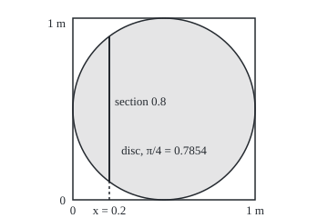
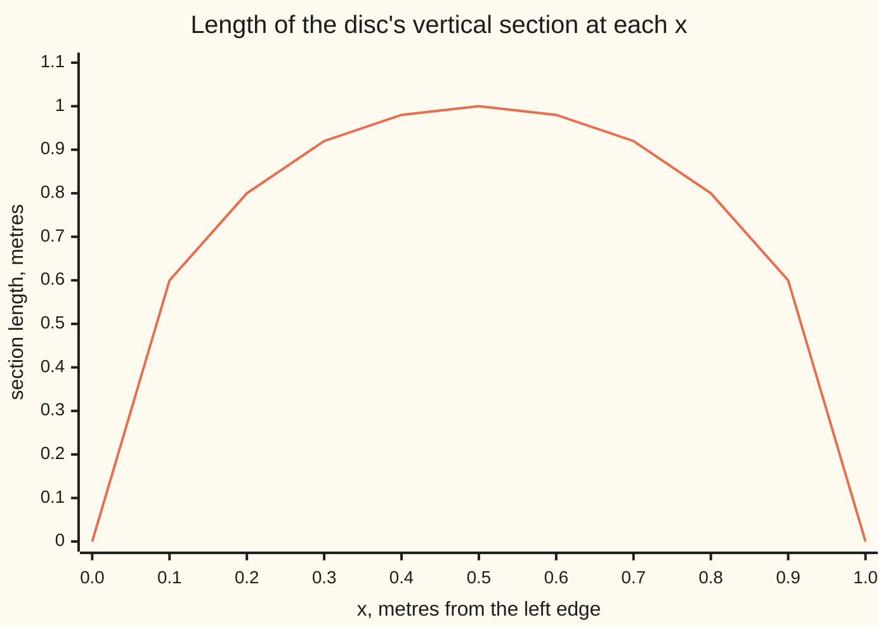

# Product measure: rectangles get width times height, and the extension is unique when both factors are sigma-finite

[Syllabus](../../../SYLLABUS.md) → [Measure and integration](../../../SYLLABUS.md#w10) → [Product Measures and Fubini](../../../SYLLABUS.md#w10-s06) → Product measure

---

## General Overview

A dart lands on a square board 1 m by 1 m, every point equally likely. Its position is two numbers: x, metres from the left edge, and y, metres from the bottom. A disc of radius 0.5 m is painted in the middle. What is the chance the dart lands in the disc?

The school answer is area: 0.7854 of the board. That answer hides a question. "Area" has to be a measure on the board: a rule giving every allowed set of points a size, adding up over countably many non-overlapping pieces. Width times height handles rectangles. The disc is no rectangle, and neither is the strip of points whose x is a rational number of metres. The double Riemann integral fails on that strip: every little rectangle of every grid holds points in it and out of it, so upper sums stay at the whole board and lower sums at nothing. Yet thin vertical strips, the k-th one 0.01/2^k wide, cover the vertical lines at the 279 rationals with denominator up to 30 using total area 0.01 × (1 − 2^(−279)), just under 0.01, and the trick works for every rational and any smaller total. The strip should have size zero.

This card builds that size for every set generated by rectangles. The recipe is slicing. Cut the set with vertical lines. Each cut is a set on the line, a **section** (the product sigma-algebras card calls it a slice), with a length. Integrate the section lengths along x. The disc's section at x = 0.2 runs from y = 0.1 to y = 0.9, length 0.8; integrating all the section lengths gives 0.7854, which is π/4. For the rational strip, every section is the full height of the board, but the sections sit over a set of x-values of length zero, so the total is zero.

**A measure on each of two spaces gives exactly one measure on pairs that assigns every rectangle width times height, provided each space can be cut into countably many pieces of finite size; its value on any set in the product sigma-algebra is the integral of its section sizes, taken in either direction.**

**What kind of fact this is:** a theorem, proved on this card in Why it works, with the full proof folded; the change of variables at the end is a theorem stated with its proof outlined and cited.

### The picture: the disc and one of its sections

The board is the square, drawn to scale at 200 units per metre. The vertical line is the disc's section at x = 0.2, length 0.8.

<p align="center"></p>

Sliding the line across the board and adding each section's length times its sliver of width sweeps out the disc.

---

## The formula

Notation first, in words. $X$ and $Y$ are two spaces, here the board's two sides, each the interval from 0 to 1 metre. $\mathcal{F}$ and $\mathcal{G}$ are their sigma-algebras: the collections of sets allowed a size, here the Borel sets of each side. (The product sigma-algebras card writes these as Ω1, Ω2, F1, F2.) $\mu$ and $\nu$ are measures on them, here length on each side. A **rectangle** $A \times B$ is every pair $(x, y)$ with $x$ in $A$ and $y$ in $B$. The product sigma-algebra $\mathcal{F} \otimes \mathcal{G}$, read "F tensor G", is the smallest sigma-algebra holding every rectangle ([Product sigma-algebras](01-product-sigma-algebras.md)). The product measure is written $\mu \otimes \nu$ and read "mu tensor nu".

A measure is **sigma-finite** when its space is a union of countably many pieces, each of finite size. Length on the whole real line is: the pieces are the intervals from k to k + 1. Counting measure on the interval from 0 to 1, which gives a set its number of points, is not: countably many finite sets hold only countably many points.

For a set $E$ of pairs, its **section** at $x$ is the set of heights above that spot, and its section at $y$ is the set of positions across at that level:

$$E_x = \{\, y : (x, y) \in E \,\}, \qquad E^y = \{\, x : (x, y) \in E \,\}$$

The theorem. If $\mu$ and $\nu$ are sigma-finite, there is exactly one measure $\mu \otimes \nu$ on $\mathcal{F} \otimes \mathcal{G}$ with

$$(\mu \otimes \nu)(A \times B) = \mu(A)\,\nu(B) \quad \text{for every } A \in \mathcal{F},\ B \in \mathcal{G},$$

and for every $E$ in $\mathcal{F} \otimes \mathcal{G}$ it is found by slicing, in either direction:

$$(\mu \otimes \nu)(E) = \int_X \nu(E_x)\, d\mu(x) = \int_Y \mu(E^y)\, d\nu(y)$$

**Read it aloud:** a rectangle's size is its width's size times its height's size, and any other set's size is its section sizes integrated along the other side, in whichever order is convenient.

For the dartboard, $\lambda$ is length on each side and $\lambda_2 = \lambda \otimes \lambda$ is area. The disc $D$ has vertical sections of length $2\sqrt{0.25 - (x - 0.5)^2}$, so

$$\lambda_2(D) = \int_0^1 2\sqrt{0.25 - (x - 0.5)^2}\; dx = \frac{\pi}{4} = 0.785398$$

| Symbol | Plain meaning | In our example | Push it up and the answer… |
| --- | --- | --- | --- |
| $X$, $Y$, $x$, $y$ | the two factor spaces, and a point of each | the board's two sides, 0 to 1 m; x = 0.2 | — |
| $\mathcal{F}$, $\mathcal{G}$, $\mathcal{F} \otimes \mathcal{G}$ | the sets allowed a size on each side, and on pairs | Borel sets of each side; the sets generated by rectangles | — |
| $\mu$, $\nu$ | measures on each side | length on each side | a bigger side measure makes every product size bigger |
| $A$, $B$, $1_A$ | a set on each side, making the rectangle $A \times B$; the indicator of A, one on A and zero off it | middle band 0.2 to 0.7, high band 0.4 to 1 | wider sides, bigger rectangle |
| $E$, $D$ | a set of pairs; the disc | the disc, radius 0.5 m, centre (0.5, 0.5) | — |
| $E_x$, $E^y$ | the vertical section at x, the horizontal section at y | at x = 0.2: from 0.1 to 0.9, length 0.8 | longer sections, bigger total |
| $X_k$, $Y_k$, $Q$ | the countably many finite pieces making a measure sigma-finite; a block $X_k \times Y_k$ | the board is one piece; for the real line, k to k + 1 | — |
| $\lambda$, $\lambda_2$, $\lambda_n$ | length, area, volume in n dimensions | $\lambda_2(D)$ = 0.785398 | — |
| $\rho$, $\rho'$, $\rho_1$, $\rho_2$ | candidate product measures inside the proof | slicing vertically, slicing horizontally | — |
| $T$, $U$, $V$, $f$ | a change of coordinates from region U onto region V, and a function integrated over V | polar coordinates onto the disc; f = 1 | — |
| $r$, $\theta$ | distance from the centre, and angle | r from 0 to 0.5, θ from 0 to 2π | the stretching factor grows with r |
| $n$, $k$ | the dimension, and a counting index | n = 2 | — |
| $\mathcal{R}$, $\mathcal{L}$, $\nu_k$, $E'$, $E_n$, $u$, $DT$ | proof letters: the rectangles; the sets whose section size is measurable in x; $\nu$ cut down to the k-th finite piece; a set holding $E$; the n-th set of a sequence; a point of $U$; the matrix of partial derivatives of $T$ | for polar coordinates, $u$ = (r, θ) | — |

### When it holds

- **Both measures sigma-finite.** Drop it and slicing in the two directions can disagree. Length on the x-side against counting measure on the y-side, on the diagonal of the board: each vertical section is one point, counted 1, integrating to 1.000000; each horizontal section is one point of length 0, adding to 0.000000.
- **The set lies in the product sigma-algebra.** Sections of a set outside it can all have lengths while the two orders disagree: Sierpiński built such a set in 1920, assuming the continuum hypothesis, whose vertical slices integrate to nothing and whose horizontal slices integrate to the whole square.
- **Completeness is a separate matter.** A null set on one side times any set on the other lies inside a rectangle of size 0, yet need not be a Borel set of the plane; adding such sets is the completion (Step 5).

---

## Why it works

### Step 0: measure a flat set by slicing it

The idea is Cavalieri's, from 1635: solids with equal slices at every height have equal volume. Here it becomes a definition. Fix $x$. The section $E_x$ is a set on the vertical side, and $\nu$ gives it a size. Doing that for every $x$ gives a function of $x$, and integrating that function against $\mu$ gives a number. For a rectangle $A \times B$ the section is $B$ above points of $A$ and empty elsewhere, so the function is $\nu(B)$ on $A$ and 0 off it, and the integral is $\mu(A)\nu(B)$: width times height, as required.

For the disc, the function is the section length drawn below. The area under it is the disc's area.



The single line is $\lambda(D_x)$, a half-ellipse in shape; the area beneath it is 0.785398.

Three things must be shown: the function of $x$ can be integrated, the result is a measure, and it is the only measure with the rectangle values, which is why slicing the other way gives the same number.

### Step 1: every section can be measured

If $E$ is in $\mathcal{F} \otimes \mathcal{G}$, every section $E_x$ is in $\mathcal{G}$. The sets whose sections are all measurable form a sigma-algebra holding every rectangle, so they hold all of $\mathcal{F} \otimes \mathcal{G}$; [Product sigma-algebras](01-product-sigma-algebras.md) proves it. So $\nu(E_x)$ is a number, possibly infinite, for every $x$.

### Step 2: section size is a measurable function of x

Take $\nu$ finite first, and collect the sets $E$ for which $x \mapsto \nu(E_x)$ is measurable. Rectangles qualify: the function is $\nu(B)$ times the indicator $1_A$. The collection is closed under proper differences, since finite sizes of nested sections subtract, and under increasing unions, since a limit of measurable functions is measurable ([Sums, products, sups and limits](../03-Measurable%20Functions/02-limits-of-measurable-functions.md)): a lambda-system. Rectangles overlap in rectangles, a pi-system, so Dynkin's theorem ([Pi-systems and Dynkin's theorem](../01-Sets%20You%20Can%20Measure/06-pi-systems-and-uniqueness.md)) puts all of $\mathcal{F} \otimes \mathcal{G}$ in it. A sigma-finite $\nu$ is a countable sum of finite pieces, and so is $\nu(E_x)$.

### Step 3: the integral of section sizes is a measure

Define $\rho(E) = \int_X \nu(E_x)\, d\mu(x)$. If $E_1, E_2, \dots$ do not overlap, neither do their sections, so the section size of the union is the sum of the section sizes. The integral of a sum of non-negative functions is the sum of the integrals, by monotone convergence ([The monotone convergence theorem](../04-The%20Lebesgue%20Integral/03-monotone-convergence-theorem.md)). So $\rho$ adds over countably many disjoint pieces: it is a measure, and Step 0 showed it gives rectangles $\mu(A)\nu(B)$.

### Step 4: there is only one, so both orders agree

Slicing the other way, $\int_Y \mu(E^y)\, d\nu(y)$, is also a measure giving rectangles $\mu(A)\nu(B)$, by Steps 1 to 3 with the roles swapped. With finite measures the two candidates share the total $\mu(X)\nu(Y)$ and agree on rectangles, a pi-system generating $\mathcal{F} \otimes \mathcal{G}$, so the uniqueness theorem makes them equal. With sigma-finite ones the argument runs inside each finite block $X_k \times Y_k$, and the blocks grow to fill the space. On the diagonal of When it holds this step fails: counting measure on an interval cannot be split into countably many finite pieces.

<details>
<summary>Detailed proof</summary>

**Setting.** $(X, \mathcal{F}, \mu)$ and $(Y, \mathcal{G}, \nu)$ are measure spaces. $\mathcal{R}$ is the set of rectangles $A \times B$ with $A \in \mathcal{F}$, $B \in \mathcal{G}$. It is a pi-system: $(A \times B) \cap (A' \times B') = (A \cap A') \times (B \cap B')$. By definition $\sigma(\mathcal{R}) = \mathcal{F} \otimes \mathcal{G}$.

**Lemma 1 (sections).** For $E \in \mathcal{F} \otimes \mathcal{G}$, every $E_x$ is in $\mathcal{G}$ and every $E^y$ in $\mathcal{F}$: Claim 2 of the product sigma-algebras card.

**Lemma 2 (measurable section sizes), $\nu$ finite.** Let $\mathcal{L} = \{E \in \mathcal{F} \otimes \mathcal{G} : x \mapsto \nu(E_x) \text{ is } \mathcal{F}\text{-measurable}\}$. (a) $X \times Y \in \mathcal{L}$: the function is the constant $\nu(Y)$. (b) If $E \subseteq E'$ are in $\mathcal{L}$, then $E_x \subseteq E'_x$ and $\nu((E' \setminus E)_x) = \nu(E'_x) - \nu(E_x)$, a difference of finite measurable functions, so measurable. (c) If $E_1 \subseteq E_2 \subseteq \dots$ are in $\mathcal{L}$ with union $E$, then $(E_n)_x$ increase to $E_x$, and by continuity from below $\nu((E_n)_x) \to \nu(E_x)$ for every $x$; a pointwise limit of measurable functions is measurable. So $\mathcal{L}$ is a lambda-system. For $A \times B \in \mathcal{R}$ the function is $\nu(B) 1_A$, measurable since $A \in \mathcal{F}$, so $\mathcal{R} \subseteq \mathcal{L}$. Dynkin's pi-lambda theorem gives $\mathcal{F} \otimes \mathcal{G} \subseteq \mathcal{L}$.

**Lemma 2, $\nu$ sigma-finite.** Take disjoint $Y_k \in \mathcal{G}$ with $\nu(Y_k) < \infty$ and union $Y$. Each $\nu_k(B) = \nu(B \cap Y_k)$ is a finite measure on $\mathcal{G}$, and Lemma 2 applies to it. Countable additivity of $\nu$ gives $\nu(E_x) = \sum_k \nu_k(E_x)$, a countable sum of non-negative measurable functions, which is measurable as the increasing limit of its partial sums.

**Lemma 3 (existence).** For $E \in \mathcal{F} \otimes \mathcal{G}$ put $\rho(E) = \int_X \nu(E_x)\, d\mu(x)$, defined by Lemma 2. Then $\rho(\varnothing) = 0$. If $E_1, E_2, \dots$ are disjoint with union $E$, the sections $(E_n)_x$ are disjoint with union $E_x$, so $\nu(E_x) = \sum_n \nu((E_n)_x)$ by countable additivity of $\nu$. The partial sums increase, so monotone convergence gives $\int_X \sum_n \nu((E_n)_x)\, d\mu = \sum_n \int_X \nu((E_n)_x)\, d\mu$, that is, $\rho(E) = \sum_n \rho(E_n)$. On a rectangle, $\rho(A \times B) = \int_X \nu(B) 1_A\, d\mu = \nu(B)\mu(A)$, with $0 \times \infty = 0$ matching the integral of the zero function on a null set. With the roles of the factors swapped, $\rho'(E) = \int_Y \mu(E^y)\, d\nu(y)$ is a measure with the same rectangle values.

**Lemma 4 (uniqueness).** Let $\rho_1$ and $\rho_2$ be measures on $\mathcal{F} \otimes \mathcal{G}$ with $\rho_i(A \times B) = \mu(A)\nu(B)$ on $\mathcal{R}$. Take $X_k \uparrow X$, $Y_k \uparrow Y$ with finite measures (unions of the first k pieces). Fix k and put $Q = X_k \times Y_k$, a rectangle of finite size. The restrictions $E \mapsto \rho_i(E \cap Q)$ are finite measures with the same total $\mu(X_k)\nu(Y_k)$, and they agree on $\mathcal{R}$, since $(A \times B) \cap Q = (A \cap X_k) \times (B \cap Y_k)$ is a rectangle. By the uniqueness theorem for finite measures agreeing on a pi-system, $\rho_1(E \cap Q) = \rho_2(E \cap Q)$ for every $E \in \mathcal{F} \otimes \mathcal{G}$. As k grows, $E \cap (X_k \times Y_k)$ increases to $E$, and continuity from below gives $\rho_1(E) = \rho_2(E)$.

**Conclusion.** $\rho$ exists by Lemma 3 and is the only measure with the rectangle values by Lemma 4; since $\rho'$ has the same rectangle values, $\rho = \rho'$, which is the two-way slicing formula. Sigma-finiteness was used in Lemma 2 for the general case and in Lemma 4 for both.

</details>

### Step 5: area in the plane and volume in n dimensions

Length $\lambda$ on the Borel sets of the real line is sigma-finite, with pieces from k to k + 1. So $\lambda_2 = \lambda \otimes \lambda$ exists, is unique, and gives each rectangle width times height. Its domain, the product of the Borel sets of two lines, is the Borel sets of the plane ([Product sigma-algebras](01-product-sigma-algebras.md)). Lebesgue measure on the plane is the completion of $\lambda_2$, adding every subset of a set of size 0.

The same step repeats. $\lambda_3 = \lambda_2 \otimes \lambda$ gives a box the product of its three sides, and so does $\lambda \otimes \lambda_2$; both are measures agreeing on boxes, a pi-system, so they are equal. The order of multiplying factors does not matter, and $\lambda_n$ is volume in n dimensions.

### Step 6: changing coordinates stretches size by a Jacobian

The disc is round, so polar coordinates suit it: distance $r$ from the centre and angle $\theta$. The map $T(r, \theta) = (0.5 + r\cos\theta,\ 0.5 + r\sin\theta)$ takes the rectangle $U$ of $r$ from 0 to 0.5 and $\theta$ from 0 to 2π onto the disc $V$, one-to-one except on the edges r = 0 and θ = 2π, which have area 0. A small patch of size $dr\, d\theta$ lands on a patch of area $r\, dr\, d\theta$, the polar rule of [Change of variables](../../06-Calculus%20and%20analysis/08-Multiple%20Integrals/03-change-of-variables-and-jacobians.md) for Riemann integrals: near the centre the angle wedges are thin, far out they are wide. The stretching factor, here $r$, is the absolute value of the determinant of $DT(u)$, the matrix of partial derivatives of $T$ at a point $u$ of $U$: the **Jacobian**. For any non-negative Borel function $f$ on $V$,

$$\int_{V} f \, d\lambda_n = \int_U f(T(u))\, \lvert \det DT(u) \rvert \; d\lambda_n(u)$$

For the disc, $f = 1$ and the determinant is $r$: area $= \int_0^{2\pi}\!\int_0^{0.5} r\, dr\, d\theta = 2\pi \times 0.125 = 0.785398$. Without the factor $r$ the same integral gives 3.141593, four times too big.

<details>
<summary>Why the determinant, and where the full proof lives</summary>

**Linear maps.** Let $T$ be an invertible linear map of n-dimensional space. The rule $E \mapsto \lambda_n(T(E))$ is a measure, finite on bounded sets and unchanged by shifting $E$, since $T$ carries shifts to shifts and $\lambda_n$ ignores them ([Translation invariance and the Vitali set](../02-Length%20Done%20Properly/04-translation-invariance-and-the-vitali-set.md), carried to boxes by the product). A shift-invariant measure finite on boxes is a constant times $\lambda_n$: its value on the unit cube fixes every rational box by cutting into equal cubes, and boxes are a pi-system. The constant multiplies along compositions. Every invertible matrix is a product of swaps of two coordinates (constant 1), scalings of one coordinate (constant: the scale's size, by the box formula) and shears adding one coordinate to another (constant 1: each section is only shifted, so slicing gives the same size). The determinant multiplies the same way, so the constant is $\lvert \det T \rvert$.

**Smooth maps.** A one-to-one smooth map $T$ from an open set $U$ onto an open set $V$, with invertible derivative, is nearly the linear map $DT(u)$ on each small cube near $u$, so it scales that cube's volume by nearly $\lvert \det DT(u) \rvert$. Summing over ever finer grids gives the formula for boxes, then for every non-negative Borel $f$ by simple functions and monotone convergence. Folland, *Real Analysis*, Theorem 2.47, carries out the estimates in full. The polar case has $\det DT = r\cos^2\theta + r\sin^2\theta = r$.

</details>

A second route to $\lambda_2$ skips the product: build outer area from covers by rectangles and restrict it, as [Caratheodory's extension theorem](../02-Length%20Done%20Properly/05-caratheodory-extension-theorem.md) does for length. It gives the same measure, by the uniqueness of Step 4.

---

## Worked numbers, by hand

| Step | Arithmetic | Value |
| --- | --- | --- |
| section at x = 0.1 | 2√(0.25 − 0.16) = 2 × 0.3 | 0.6 |
| section at x = 0.2 | 2√(0.25 − 0.09) = 2 × 0.4 | 0.8 |
| section at x = 0.5 | 2√0.25 | 1 |
| integrate the sections | put x − 0.5 = 0.5 sin t: the section is cos t, dx is 0.5 cos t dt, t from −π/2 to π/2 | 0.5 × π/2 = π/4 |
| polar, with the Jacobian | 2π × (0.5^2 / 2) = 2π × 0.125 | π/4 |
| **the dart's chance** | π/4 over a board of area 1 | **0.785398** |

The dart lands in the disc with chance 0.785398; 200,000 simulated darts put 157,382 there, a fraction of 0.7869, within two standard errors (one standard error is 0.0009).

A board cut into six cells shows the two orders on something small enough to list. Cut x into bands of widths 0.2 (left), 0.5 (middle) and 0.3 (right), and y into bands of heights 0.4 (low) and 0.6 (high). The event "middle band or high band" is no rectangle: it is four of the six cells, a T: the whole middle column and the whole top row.

| Step | Arithmetic | Value |
| --- | --- | --- |
| x-order, left band | width 0.2 × section {high}, 0.6 | 0.12 |
| x-order, middle band | width 0.5 × section {low, high}, 1 | 0.50 |
| x-order, right band | width 0.3 × section {high}, 0.6 | 0.18 |
| y-order, low band | height 0.4 × section {middle}, 0.5 | 0.20 |
| y-order, high band | height 0.6 × section {left, middle, right}, 1 | 0.60 |
| **both orders** | 0.12 + 0.50 + 0.18 and 0.20 + 0.60 | **0.80** |

The 22 distinct rectangles of this board overlap in rectangles and generate all 64 events; on each of the 64, the two orders and the plain sum of cell areas agree.

### What breaks if you drop a piece

| Mistake | Comes out at | What went wrong |
| --- | --- | --- |
| Length on x, counting measure on y, on the diagonal | vertical order 1.000000, horizontal order 0.000000 | Counting measure on an interval is not sigma-finite, so uniqueness and the two-way formula fail |
| Polar coordinates without the Jacobian r | 3.141593 instead of 0.785398 | The map stretches patches by r; dropping it counts the thin centre wedges as wide |
| Section lengths added, not weighted by width | 7.9300 at 10 slices, 78.5641 at 100 | Sections are integrated against μ, not counted; the total grows with the slice count |
| Stopping at a 10 × 10 grid of squares | 0.600000 inside, 0.880000 touching | Rectangles only bracket the disc; the size comes from the limit, or from sections |

The code prints all four.

---

## Code, from first principles, and it actually runs

The disc's 0.785398 is reached by five roads. One: vertical section lengths from the formula, integrated in x by the midpoint rule at 10 to 10,000 slices. Two: the other order, horizontal sections whose ends are found by bisection, testing points against the disc and never using the square-root formula. By the disc's symmetry this road meets the same lengths at the same points, so it checks the section ends; the six-cell board checks that the orders agree. Three: a grid of squares, counting those inside the disc and those touching it, which bracket the area from below and above. Four: polar coordinates with the Jacobian r. Five: 200,000 darts from SplitMix64, a small random-number generator written out in both languages. The reference π comes from Machin's formula, π = 16 arctan(1/5) − 4 arctan(1/239), summed as a series. Then the six-cell board is listed in full, and the four failures computed. The diagonal is sampled at 1,000 points; counting measure adds a length for every one of uncountably many y, which the code cannot, so its 0 rests on every term being 0.

What the code shows: one set's area by independent roads, and the theorem on a board small enough to list every event. What only the proof shows: that slicing gives a measure, and the only one, on every set of the uncountable product sigma-algebra.

### Python

```python
# Product measure -- the check behind the card.  Standard library only:
# fractions for exact sums, math.sqrt for square roots.  A dart lands
# uniformly on a 1 m by 1 m board; the disc of radius 0.5 m centred at
# (0.5, 0.5) should have chance pi/4.  Roads: vertical section lengths
# integrated in x; horizontal sections found by bisection and integrated
# in y; inner and outer squares of a grid; polar coordinates with the
# Jacobian r; SplitMix64 darts; a six-cell board listed in full.
from fractions import Fraction as Fr
from math import sqrt

def atan_inv(k):                             # arctan(1/k) by its series
    s, t, n, sign = 0.0, 1.0 / k, 1, 1
    while t > 1e-18:
        s += sign * t / n
        t, n, sign = t / (k * k), n + 2, -sign
    return s

PI = 16 * atan_inv(5) - 4 * atan_inv(239)    # Machin's formula, no math.pi
AREA = PI / 4

def inside(x, y):
    return (x - 0.5) ** 2 + (y - 0.5) ** 2 <= 0.25

def sec_len(x):                              # the vertical section at x
    return 2 * sqrt(max(0.0, 0.25 - (x - 0.5) ** 2))

def edge(y, lo, hi, want_in_at_hi):          # bisection for a section's end
    for _ in range(60):
        mid = (lo + hi) / 2
        if inside(mid, y) == want_in_at_hi: hi = mid
        else: lo = mid
    return (lo + hi) / 2

def vertical(n):                             # sum of section length x slice width
    tot = 0.0
    for i in range(n):
        tot += sec_len((i + 0.5) / n)
    return tot / n

def horizontal(n):                           # never uses the square-root formula
    tot = 0.0
    for j in range(n):
        y = (j + 0.5) / n
        tot += edge(y, 0.5, 1.0, False) - edge(y, 0.0, 0.5, True)
    return tot / n

def grid(n):                                 # squares of side 1/n, scaled by 2n
    inner = outer = 0
    for i in range(n):
        far_x = max(abs(2 * i - n), abs(2 * i + 2 - n))
        near_x = 0 if 2 * i <= n <= 2 * i + 2 else min(abs(2 * i - n), abs(2 * i + 2 - n))
        for j in range(n):
            far_y = max(abs(2 * j - n), abs(2 * j + 2 - n))
            near_y = 0 if 2 * j <= n <= 2 * j + 2 else min(abs(2 * j - n), abs(2 * j + 2 - n))
            inner += far_x ** 2 + far_y ** 2 <= n * n
            outer += near_x ** 2 + near_y ** 2 < n * n
    return inner / (n * n), outer / (n * n)

MASK = (1 << 64) - 1
def splitmix(seed):                          # SplitMix64, uniform in [0, 1)
    s = seed
    while True:
        s = (s + 0x9E3779B97F4A7C15) & MASK
        z = s
        z = ((z ^ (z >> 30)) * 0xBF58476D1CE4E5B9) & MASK
        z = ((z ^ (z >> 27)) * 0x94D049BB133111EB) & MASK
        yield ((z ^ (z >> 31)) >> 11) / 2.0 ** 53

print(f"pi by Machin's formula: {PI:.9f}; the disc's area pi/4 = {AREA:.6f}, to four places {AREA:.4f}")
print("sections at x = 0.1, 0.2, 0.5: " + ", ".join(f"{sec_len(x):.4f}" for x in (0.1, 0.2, 0.5)))
print("chart, x: " + ", ".join(f"{i / 10:.1f}" for i in range(11)))
print("chart, section length: " + ", ".join(f"{sec_len(i / 10):.2f}" for i in range(11)))
V, H = {}, {}
for n in (10, 100, 1000, 10000):
    V[n], H[n] = vertical(n), horizontal(n)
    print(f"n = {n:5d}: vertical sections {V[n]:.9f}, horizontal by bisection {H[n]:.9f}, error {V[n] - AREA:.1e}")
G = {}
for n in (10, 100, 1000):
    G[n] = grid(n)
    print(f"grid {n:4d} x {n:<4d}: inner squares {G[n][0]:.6f} <= area <= touching squares {G[n][1]:.6f}")
polar = 0.0                                  # r from 0 to 0.5, theta from 0 to 2 pi
for k in range(1000):
    polar += (k + 0.5) * 0.0005 * 0.0005     # r times dr, midpoint rule
polar *= 2 * PI
print(f"polar, integral of r dr dtheta: {polar:.6f}; without the Jacobian r: {0.5 * 2 * PI:.6f}")
rng, N, hits = splitmix(2026), 200000, 0
for _ in range(N):
    hits += inside(next(rng), next(rng))
se = sqrt(AREA * (1 - AREA) / N)
print(f"darts: {hits} of {N} in the disc, fraction {hits / N:.4f}, standard error {se:.4f}")
# ---- a coarse board listed in full: x bands 0.2, 0.5, 0.3; y bands 0.4, 0.6 ----
mu, nu = [Fr(2, 10), Fr(5, 10), Fr(3, 10)], [Fr(4, 10), Fr(6, 10)]
cells = [(i, j) for i in range(3) for j in range(2)]
def order_x(E):                              # integrate nu(section at x) against mu
    return sum(mu[i] * sum(nu[j] for j in range(2) if (i, j) in E) for i in range(3))
def order_y(E):
    return sum(nu[j] * sum(mu[i] for i in range(3) if (i, j) in E) for j in range(2))
events = [frozenset(c for k, c in enumerate(cells) if m >> k & 1) for m in range(64)]
agree = sum(order_x(E) == order_y(E) == sum(mu[i] * nu[j] for i, j in E) for E in events)
rects = {frozenset((i, j) for i in range(3) if a >> i & 1 for j in range(2) if b >> j & 1)
         for a in range(8) for b in range(4)}
pi_sys = all(A & B in rects for A in rects for B in rects)
sig, full = set(rects), frozenset(cells)
while True:
    new = {full - A for A in sig} | {A | B for A in sig for B in sig}
    if new <= sig: break
    sig |= new
E = frozenset(c for c in cells if c[0] == 1 or c[1] == 1)       # middle band or high band
print(f"coarse board: {len(rects)} distinct rectangles, closed under overlap: {'yes' if pi_sys else 'no'}; they generate {len(sig)} sets")
print(f"all {len(events)} events: x-order, y-order and cell sums agree on {agree}")
print(f"middle band or high band: x-order {float(order_x(E)):.2f}, y-order {float(order_y(E)):.2f}")
print("  x-order pieces " + ", ".join(f"{float(mu[i] * sum(nu[j] for j in range(2) if (i, j) in E)):.2f}" for i in range(3))
      + "; y-order pieces " + ", ".join(f"{float(nu[j] * sum(mu[i] for i in range(3) if (i, j) in E)):.2f}" for j in range(2)))
# ---- what breaks ----
naive = 10 * V[10]                           # the lengths themselves, not times 1/n
print(f"section lengths added without the width 1/n: n = 10 gives {naive:.4f}, n = 100 gives {100 * V[100]:.4f}")
diag = [(t, t) for t in ((i + 0.5) / 1000 for i in range(1000))]   # the diagonal at 1000 points; counting on y is not sigma-finite
d1 = sum(sum(1 for u, v in diag if u == x) for x, _ in diag) / 1000   # count each vertical section, times width 1/1000
d2 = sum(max(u for u, v in diag if v == y) - min(u for u, v in diag if v == y) for _, y in diag)   # each horizontal section [y, y]: its length, counted once
print(f"diagonal at 1000 points, lambda x counting: vertical order {d1:.6f}, horizontal order {d2:.6f}")
qs = sorted({Fr(p, q) for q in range(1, 31) for p in range(q + 1)})
cover = sum(Fr(1, 100) / 2 ** k for k in range(1, len(qs) + 1))   # k-th strip 0.01 / 2^k wide
print(f"rational-x strip: {len(qs)} rationals with denominator <= 30, strips of total area {float(cover):.6f} = 0.01 x (1 - 2^-{len(qs)})")
print("figure, x = 80 + 200u, y = 220 - 200v: centre (180, 120), radius 100; "
      f"section at u = 0.2 from ({80 + 200 * 0.2:.0f}, {220 - 200 * (0.5 - sec_len(0.2) / 2):.0f}) "
      f"to ({80 + 200 * 0.2:.0f}, {220 - 200 * (0.5 + sec_len(0.2) / 2):.0f})")
assert abs(V[10000] - AREA) < 3e-7                            # sections against Machin's pi
assert all(abs(H[n] - V[n]) < 1e-9 for n in V)                # the other order; by symmetry it checks the ends
assert all(G[n][0] < AREA < G[n][1] for n in G) and G[1000][1] - G[1000][0] < 0.01
assert abs(hits / N - V[10000]) < 4 * se                      # darts against the sections
assert agree == 64 and pi_sys and len(sig) == 64              # finite board, every event
assert abs(polar - V[10000]) < 3e-7                           # the Jacobian road
print("ALL CHECKS PASS")
```

**Ran 2026-10-06 on macOS, Python 3.14.6, standard library only. All checks passed. Output, pasted from the run:**

```
pi by Machin's formula: 3.141592654; the disc's area pi/4 = 0.785398, to four places 0.7854
sections at x = 0.1, 0.2, 0.5: 0.6000, 0.8000, 1.0000
chart, x: 0.0, 0.1, 0.2, 0.3, 0.4, 0.5, 0.6, 0.7, 0.8, 0.9, 1.0
chart, section length: 0.00, 0.60, 0.80, 0.92, 0.98, 1.00, 0.98, 0.92, 0.80, 0.60, 0.00
n =    10: vertical sections 0.792996956, horizontal by bisection 0.792996956, error 7.6e-03
n =   100: vertical sections 0.785641388, horizontal by bisection 0.785641388, error 2.4e-04
n =  1000: vertical sections 0.785405864, horizontal by bisection 0.785405864, error 7.7e-06
n = 10000: vertical sections 0.785398407, horizontal by bisection 0.785398407, error 2.4e-07
grid   10 x 10  : inner squares 0.600000 <= area <= touching squares 0.880000
grid  100 x 100 : inner squares 0.764400 <= area <= touching squares 0.802400
grid 1000 x 1000: inner squares 0.783348 <= area <= touching squares 0.787320
polar, integral of r dr dtheta: 0.785398; without the Jacobian r: 3.141593
darts: 157382 of 200000 in the disc, fraction 0.7869, standard error 0.0009
coarse board: 22 distinct rectangles, closed under overlap: yes; they generate 64 sets
all 64 events: x-order, y-order and cell sums agree on 64
middle band or high band: x-order 0.80, y-order 0.80
  x-order pieces 0.12, 0.50, 0.18; y-order pieces 0.20, 0.60
section lengths added without the width 1/n: n = 10 gives 7.9300, n = 100 gives 78.5641
diagonal at 1000 points, lambda x counting: vertical order 1.000000, horizontal order 0.000000
rational-x strip: 279 rationals with denominator <= 30, strips of total area 0.010000 = 0.01 x (1 - 2^-279)
figure, x = 80 + 200u, y = 220 - 200v: centre (180, 120), radius 100; section at u = 0.2 from (120, 200) to (120, 40)
ALL CHECKS PASS
```

### Rust

Same numbers, same labels, built with `rustc --edition 2021 -O`. The six-cell board is summed in whole hundredths, integers standing in for Python's fractions.

```rust
// Product measure -- the same check as the Python, in Rust.  No crates.
// Exact sums on the coarse board are done in whole hundredths (i64).
// A dart lands uniformly on a 1 m by 1 m board; the disc of radius 0.5 m
// centred at (0.5, 0.5) should have chance pi/4.  Roads: vertical sections,
// horizontal sections by bisection, inner and outer grid squares, polar
// coordinates with the Jacobian r, SplitMix64 darts, a six-cell board.

fn atan_inv(k: f64) -> f64 {                 // arctan(1/k) by its series
    let (mut s, mut t, mut n, mut sign) = (0.0, 1.0 / k, 1.0, 1.0);
    while t > 1e-18 {
        s += sign * t / n;
        t /= k * k; n += 2.0; sign = -sign;
    }
    s
}
fn inside(x: f64, y: f64) -> bool { (x - 0.5).powi(2) + (y - 0.5).powi(2) <= 0.25 }
fn sec_len(x: f64) -> f64 { 2.0 * (0.25 - (x - 0.5).powi(2)).max(0.0).sqrt() }
fn edge(y: f64, mut lo: f64, mut hi: f64, want_in_at_hi: bool) -> f64 {
    for _ in 0..60 {
        let mid = (lo + hi) / 2.0;
        if inside(mid, y) == want_in_at_hi { hi = mid } else { lo = mid }
    }
    (lo + hi) / 2.0
}
fn vertical(n: usize) -> f64 {               // sum of section length x slice width
    let mut tot = 0.0;
    for i in 0..n { tot += sec_len((i as f64 + 0.5) / n as f64); }
    tot / n as f64
}
fn horizontal(n: usize) -> f64 {             // never uses the square-root formula
    let mut tot = 0.0;
    for j in 0..n {
        let y = (j as f64 + 0.5) / n as f64;
        tot += edge(y, 0.5, 1.0, false) - edge(y, 0.0, 0.5, true);
    }
    tot / n as f64
}
fn far_near(i: i64, n: i64) -> (i64, i64) {
    let (a, b) = ((2 * i - n).abs(), (2 * i + 2 - n).abs());
    (a.max(b), if 2 * i <= n && n <= 2 * i + 2 { 0 } else { a.min(b) })
}
fn grid(n: i64) -> (f64, f64) {              // squares of side 1/n, scaled by 2n
    let (mut inner, mut outer) = (0i64, 0i64);
    for i in 0..n {
        let (fx, nx) = far_near(i, n);
        for j in 0..n {
            let (fy, ny) = far_near(j, n);
            if fx * fx + fy * fy <= n * n { inner += 1; }
            if nx * nx + ny * ny < n * n { outer += 1; }
        }
    }
    (inner as f64 / (n * n) as f64, outer as f64 / (n * n) as f64)
}
struct Mix(u64);                             // SplitMix64, uniform in [0, 1)
impl Mix {
    fn next(&mut self) -> f64 {
        self.0 = self.0.wrapping_add(0x9E3779B97F4A7C15);
        let mut z = self.0;
        z = (z ^ (z >> 30)).wrapping_mul(0xBF58476D1CE4E5B9);
        z = (z ^ (z >> 27)).wrapping_mul(0x94D049BB133111EB);
        ((z ^ (z >> 31)) >> 11) as f64 / 9007199254740992.0
    }
}
fn sci(x: f64) -> String {                   // 7.6e-03, as Python prints it
    let s = format!("{:.1e}", x);
    let (m, e) = s.split_once('e').unwrap();
    let e: i32 = e.parse().unwrap();
    format!("{}e{}{:02}", m, if e < 0 { "-" } else { "+" }, e.abs())
}
fn gcd(a: i64, b: i64) -> i64 { if b == 0 { a } else { gcd(b, a % b) } }
fn j(v: &[String]) -> String { v.join(", ") }

fn main() {
    let pi = 16.0 * atan_inv(5.0) - 4.0 * atan_inv(239.0);   // Machin's formula
    let area = pi / 4.0;
    println!("pi by Machin's formula: {:.9}; the disc's area pi/4 = {:.6}, to four places {:.4}", pi, area, area);
    println!("sections at x = 0.1, 0.2, 0.5: {}", j(&[0.1, 0.2, 0.5].iter().map(|&x| format!("{:.4}", sec_len(x))).collect::<Vec<_>>()));
    println!("chart, x: {}", j(&(0..11).map(|i| format!("{:.1}", i as f64 / 10.0)).collect::<Vec<_>>()));
    println!("chart, section length: {}", j(&(0..11).map(|i| format!("{:.2}", sec_len(i as f64 / 10.0))).collect::<Vec<_>>()));
    let ns = [10usize, 100, 1000, 10000];
    let mut v = [0.0; 4];
    let mut h = [0.0; 4];
    for (k, &n) in ns.iter().enumerate() {
        v[k] = vertical(n); h[k] = horizontal(n);
        println!("n = {:5}: vertical sections {:.9}, horizontal by bisection {:.9}, error {}", n, v[k], h[k], sci(v[k] - area));
    }
    let mut g = Vec::new();
    for &n in &[10i64, 100, 1000] {
        let (a, b) = grid(n);
        g.push((a, b));
        println!("grid {:4} x {:<4}: inner squares {:.6} <= area <= touching squares {:.6}", n, n, a, b);
    }
    let mut polar = 0.0;                     // r from 0 to 0.5, theta from 0 to 2 pi
    for k in 0..1000 { polar += (k as f64 + 0.5) * 0.0005 * 0.0005; }
    polar *= 2.0 * pi;
    println!("polar, integral of r dr dtheta: {:.6}; without the Jacobian r: {:.6}", polar, 0.5 * 2.0 * pi);
    let (mut rng, n_darts) = (Mix(2026), 200000);
    let mut hits = 0;
    for _ in 0..n_darts {
        let (x, y) = (rng.next(), rng.next());
        if inside(x, y) { hits += 1; }
    }
    let frac = hits as f64 / n_darts as f64;
    let se = (area * (1.0 - area) / n_darts as f64).sqrt();
    println!("darts: {} of {} in the disc, fraction {:.4}, standard error {:.4}", hits, n_darts, frac, se);
    // ---- a coarse board listed in full: x bands 0.2, 0.5, 0.3; y bands 0.4, 0.6 (tenths) ----
    let (mu, nu) = ([2i64, 5, 3], [4i64, 6]);
    let has = |e: u32, i: usize, jj: usize| e >> (2 * i + jj) & 1 == 1;   // cell (i, j) is bit 2i + j
    let order_x = |e: u32| (0..3).map(|i| mu[i] * (0..2).filter(|&jj| has(e, i, jj)).map(|jj| nu[jj]).sum::<i64>()).sum::<i64>();
    let order_y = |e: u32| (0..2).map(|jj| nu[jj] * (0..3).filter(|&i| has(e, i, jj)).map(|i| mu[i]).sum::<i64>()).sum::<i64>();
    let cells = |e: u32| (0..6).filter(|&c| e >> c & 1 == 1).map(|c| mu[c / 2] * nu[c % 2]).sum::<i64>();
    let agree = (0..64u32).filter(|&e| order_x(e) == order_y(e) && order_y(e) == cells(e)).count();
    let mut rects = std::collections::BTreeSet::new();
    for a in 0..8u32 { for b in 0..4u32 {
        let mut e = 0u32;
        for i in 0..3 { for jj in 0..2 { if a >> i & 1 == 1 && b >> jj & 1 == 1 { e |= 1 << (2 * i + jj); } } }
        rects.insert(e);
    } }
    let pi_sys = rects.iter().all(|&a| rects.iter().all(|&b| rects.contains(&(a & b))));
    let mut sig = rects.clone();
    loop {
        let mut new = std::collections::BTreeSet::new();
        for &a in &sig { new.insert(63 ^ a); for &b in &sig { new.insert(a | b); } }
        if new.is_subset(&sig) { break; }
        sig.extend(new);
    }
    let e: u32 = (0..6).filter(|&c| c / 2 == 1 || c % 2 == 1).map(|c| 1u32 << c).sum();   // middle band or high band
    println!("coarse board: {} distinct rectangles, closed under overlap: {}; they generate {} sets", rects.len(), if pi_sys { "yes" } else { "no" }, sig.len());
    println!("all 64 events: x-order, y-order and cell sums agree on {}", agree);
    println!("middle band or high band: x-order {:.2}, y-order {:.2}", order_x(e) as f64 / 100.0, order_y(e) as f64 / 100.0);
    let px: Vec<String> = (0..3).map(|i| format!("{:.2}", (mu[i] * (0..2).filter(|&jj| has(e, i, jj)).map(|jj| nu[jj]).sum::<i64>()) as f64 / 100.0)).collect();
    let py: Vec<String> = (0..2).map(|jj| format!("{:.2}", (nu[jj] * (0..3).filter(|&i| has(e, i, jj)).map(|i| mu[i]).sum::<i64>()) as f64 / 100.0)).collect();
    println!("  x-order pieces {}; y-order pieces {}", j(&px), j(&py));
    // ---- what breaks ----
    println!("section lengths added without the width 1/n: n = 10 gives {:.4}, n = 100 gives {:.4}", 10.0 * v[0], 100.0 * v[1]);
    let diag: Vec<(f64, f64)> = (0..1000).map(|i| (i as f64 + 0.5) / 1000.0).map(|t| (t, t)).collect(); // counting on y is not sigma-finite
    let d1 = diag.iter().map(|&(x, _)| diag.iter().filter(|&&(u, _)| u == x).count()).sum::<usize>() as f64 / 1000.0; // count each vertical section, times width 1/1000
    let d2: f64 = diag.iter().map(|&(_, y)| { // each horizontal section [y, y]: its length, counted once
        let s: Vec<f64> = diag.iter().filter(|&&(_, v)| v == y).map(|&(u, _)| u).collect();
        s.iter().cloned().fold(f64::MIN, f64::max) - s.iter().cloned().fold(f64::MAX, f64::min)
    }).sum();
    println!("diagonal at 1000 points, lambda x counting: vertical order {:.6}, horizontal order {:.6}", d1, d2);
    let nq = (1..31i64).map(|q| (0..=q).filter(|&p| gcd(p, q) == 1).count()).sum::<usize>();
    let mut cover = 0.0;
    for k in 1..=nq as i32 { cover += 0.01 / 2f64.powi(k); }   // k-th strip 0.01 / 2^k wide
    println!("rational-x strip: {} rationals with denominator <= 30, strips of total area {:.6} = 0.01 x (1 - 2^-{})", nq, cover, nq);
    let s = sec_len(0.2);
    println!("figure, x = 80 + 200u, y = 220 - 200v: centre (180, 120), radius 100; section at u = 0.2 from ({:.0}, {:.0}) to ({:.0}, {:.0})",
             80.0 + 200.0 * 0.2, 220.0 - 200.0 * (0.5 - s / 2.0), 80.0 + 200.0 * 0.2, 220.0 - 200.0 * (0.5 + s / 2.0));
    assert!((v[3] - area).abs() < 3e-7);                          // sections against Machin's pi
    assert!((0..4).all(|k| (h[k] - v[k]).abs() < 1e-9));          // the other order; by symmetry it checks the ends
    assert!(g.iter().all(|&(a, b)| a < area && area < b) && g[2].1 - g[2].0 < 0.01);
    assert!((frac - v[3]).abs() < 4.0 * se);                      // darts against the sections
    assert!(agree == 64 && pi_sys && sig.len() == 64);            // finite board, every event
    assert!((polar - v[3]).abs() < 3e-7);                         // the Jacobian road
    println!("ALL CHECKS PASS");
}
```

**Ran 2026-10-06 on macOS, rustc 1.98.1, no crates. All checks passed. Output, pasted from the run:**

```
pi by Machin's formula: 3.141592654; the disc's area pi/4 = 0.785398, to four places 0.7854
sections at x = 0.1, 0.2, 0.5: 0.6000, 0.8000, 1.0000
chart, x: 0.0, 0.1, 0.2, 0.3, 0.4, 0.5, 0.6, 0.7, 0.8, 0.9, 1.0
chart, section length: 0.00, 0.60, 0.80, 0.92, 0.98, 1.00, 0.98, 0.92, 0.80, 0.60, 0.00
n =    10: vertical sections 0.792996956, horizontal by bisection 0.792996956, error 7.6e-03
n =   100: vertical sections 0.785641388, horizontal by bisection 0.785641388, error 2.4e-04
n =  1000: vertical sections 0.785405864, horizontal by bisection 0.785405864, error 7.7e-06
n = 10000: vertical sections 0.785398407, horizontal by bisection 0.785398407, error 2.4e-07
grid   10 x 10  : inner squares 0.600000 <= area <= touching squares 0.880000
grid  100 x 100 : inner squares 0.764400 <= area <= touching squares 0.802400
grid 1000 x 1000: inner squares 0.783348 <= area <= touching squares 0.787320
polar, integral of r dr dtheta: 0.785398; without the Jacobian r: 3.141593
darts: 157382 of 200000 in the disc, fraction 0.7869, standard error 0.0009
coarse board: 22 distinct rectangles, closed under overlap: yes; they generate 64 sets
all 64 events: x-order, y-order and cell sums agree on 64
middle band or high band: x-order 0.80, y-order 0.80
  x-order pieces 0.12, 0.50, 0.18; y-order pieces 0.20, 0.60
section lengths added without the width 1/n: n = 10 gives 7.9300, n = 100 gives 78.5641
diagonal at 1000 points, lambda x counting: vertical order 1.000000, horizontal order 0.000000
rational-x strip: 279 rationals with denominator <= 30, strips of total area 0.010000 = 0.01 x (1 - 2^-279)
figure, x = 80 + 200u, y = 220 - 200v: centre (180, 120), radius 100; section at u = 0.2 from (120, 200) to (120, 40)
ALL CHECKS PASS
```

> [!TIP]
> **Try changing**
> - **Guess first: does the seed matter?** Change 2026 to another seed. The fraction moves by about one standard error, 0.0009; the dart assert allows four, so it almost always holds.
> - **Guess first: which assert catches a formula slip?** Change the 2 in `sec_len` to 1. The vertical road halves and the first assert fails at once; the horizontal road tests points against the disc, never uses `sec_len`, and keeps the true area.
> - **Guess first: what does a 2000 grid add?** Add 2000 to the grid sizes. The gap between inside and touching halves, roughly: only edge squares fall in it, about 4n of them, each of area 1/n^2.
> - **Guess first: can other widths split the orders?** Make the x bands 0.3, 0.3, 0.4. The event's size changes, but the orders still agree on all 64 events: the proof never used the widths.

---

## The usual mistake

> [!warning]
> **Assuming the two orders of slicing always agree.** They agree because only one measure gives rectangles width times height, and that uniqueness needs both measures sigma-finite. On the diagonal of the board, length against counting measure gives 1.000000 one way and 0.000000 the other.
>
> - **Calling $\lambda \otimes \lambda$ Lebesgue measure on the plane.** It lives on the Borel sets; Lebesgue measure is its completion.
> - **Reading 0 × ∞ as undefined.** A line in the plane is a rectangle of width 0 and infinite height, and its size is 0.
> - **Dropping the Jacobian.** Polar coordinates without the factor r give 3.141593, four times the disc's 0.785398.

---

## Where you meet it in real life

- **Monte Carlo estimates.** Throwing random points and counting hits estimates an area or a probability; 157,382 of 200,000 darts gave 0.7869. It works because the uniform law on the square is the product of two uniform laws.
- **Independent quantities.** Two independent measurements have a joint law equal to the product of their laws, so a joint probability is found by slicing ([Independence as a product](04-independence-as-a-product-measure.md)).
- **Volumes from scans.** A CT scanner reports cross-section areas at fixed spacing; an organ's volume is those areas integrated along the axis.
- **The bell curve's constant.** The integral of e^(−x^2/2) has no elementary antiderivative; squared, it is an integral over the plane, and in polar coordinates the Jacobian r makes it elementary ([The Gaussian integral](../../06-Calculus%20and%20analysis/08-Multiple%20Integrals/04-gaussian-integral.md)).

> **Say it back**
> Rectangles get width times height. Any other set's size is the integral of its section sizes. That integral is a measure, and when both sides split into countably many finite pieces it is the only one with the rectangle values, so slicing either way agrees. Repeated, it gives volume in any dimension; a change of coordinates rescales by the Jacobian. The dart lands in the disc with chance π/4 = 0.785398, by sections, by squares, by polar coordinates and by darts.

---

## What this builds on

- [Product sigma-algebras](01-product-sigma-algebras.md): the sets on pairs that get a size, and why their sections are measurable.
- [Pi-systems and Dynkin's theorem](../01-Sets%20You%20Can%20Measure/06-pi-systems-and-uniqueness.md): rectangles are a pi-system, which gives measurability of section sizes and uniqueness.
- [The monotone convergence theorem](../04-The%20Lebesgue%20Integral/03-monotone-convergence-theorem.md): the swap of sum and integral that makes the slice integral countably additive.
- [Lebesgue measure](../02-Length%20Done%20Properly/03-lebesgue-measure.md): length on each side, the factor from which area and volume are built.
- [Double integrals](../../06-Calculus%20and%20analysis/08-Multiple%20Integrals/01-double-integrals.md): the Riemann version of slicing, which this card extends to every set in the product sigma-algebra.

## Where this goes next

- [Tonelli and Fubini](03-tonelli-and-fubini.md): from sizes of sets to integrals of functions, in either order.
- [Independence as a product](04-independence-as-a-product-measure.md): independence read as a joint law that is a product measure.
- [Infinitely many coin tosses](07-infinite-sequences-and-kolmogorov-extension.md): a product of infinitely many factors, for a coin tossed forever.

This card slices sets, where every section size is non-negative; whether a function taking both signs can be integrated in either order, and what goes wrong when it cannot, is [Tonelli and Fubini](03-tonelli-and-fubini.md).

---

## Sources

Verified 2026-09-29: every link below resolves to the publisher's or author's page.

- Folland, Gerald B. *Real Analysis: Modern Techniques and Their Applications*, 2nd ed. Wiley, 1999. [Publisher page](https://www.wiley.com/en-us/Real+Analysis%3A+Modern+Techniques+and+Their+Applications%2C+2nd+Edition-p-9780471317166). Section 2.5 builds product measures and proves uniqueness; Section 2.6 treats Lebesgue measure in n dimensions and proves the change of variables, Theorem 2.47.
- Billingsley, Patrick. *Probability and Measure*, Anniversary Edition. Wiley, 2012. [Publisher page](https://www.wiley.com/en-us/Probability+and+Measure%2C+Anniversary+Edition-p-9781118122372). Section 18 constructs the product measure by integrating section sizes, as here.
- Durrett, Rick. *Probability: Theory and Examples*, 5th ed. Cambridge University Press, 2019. [Author's page, with the full text](https://sites.math.duke.edu/~rtd/PTE/pte.html). Section 1.7 constructs product measures and proves Fubini's theorem, in the probability setting.
- Tao, Terence. *An Introduction to Measure Theory*. American Mathematical Society, 2011. [Author's page, with the full text](https://terrytao.wordpress.com/books/an-introduction-to-measure-theory/). Section 1.7 builds product measures from pre-measures and relates them to Lebesgue measure in higher dimensions.
