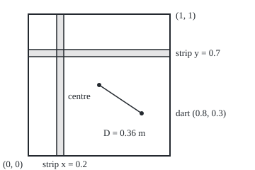
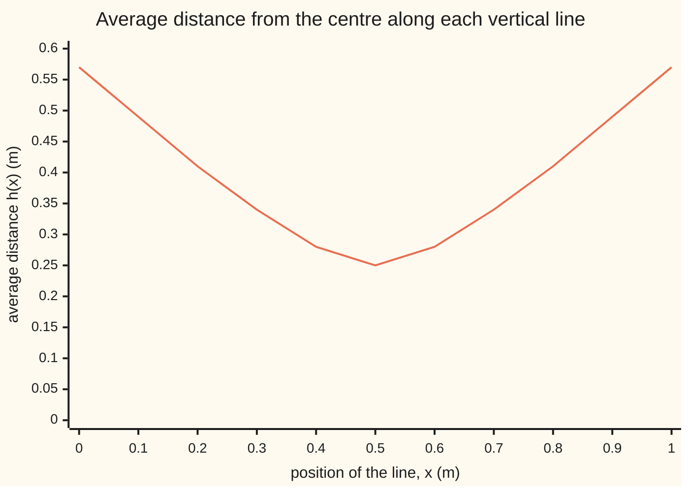
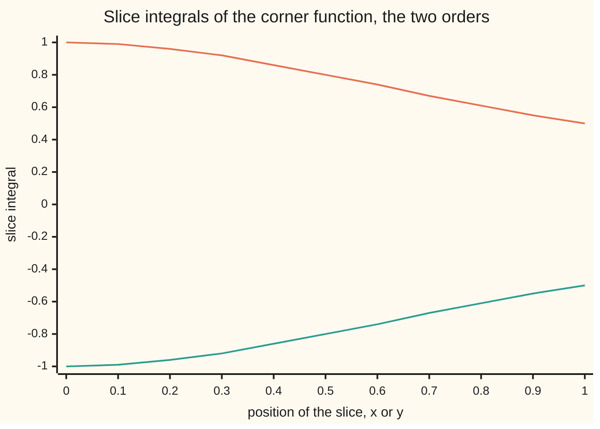

# Tonelli and Fubini: integrate one variable at a time in either order, free for non-negative functions, and for signed ones once the absolute integral is finite

[Syllabus](../../../SYLLABUS.md) → [Measure and integration](../README.md) → [Product Measures and Fubini](../README.md#s06) → Tonelli and Fubini

---

## General Overview

A dart lands on a square board 1 m on a side, every spot equally likely. How far from the centre does it land, on average? The answer, an average over an area, is 0.3826 m. It is found by slicing: fix the dart's left-right position, average the distance along that vertical line, then average those line averages across the board. Horizontal lines first gives 0.3826 m too.

Slicing is not always safe. Take the function (x^2 − y^2)/(x^2 + y^2)^2 on the same square, x across and y up. Vertical lines first, its total is π/4 = 0.7854. Horizontal lines first, it is −0.7854. Same function, same square, two answers. The Riemann version of slicing ([Double integrals](../../06-Calculus%20and%20analysis/08-Multiple%20Integrals/01-double-integrals.md)) needs a function that is continuous on a closed rectangle. This one blows up at the corner (0, 0), so that theorem says nothing either way.

Measure theory says exactly when slicing is safe. Integrating in one variable, then the other, is called **iterated integration**, the term used from here on. Leonida Tonelli's theorem (1909): for a function that is never negative, both iterated integrals equal the integral over the square, always, even when that integral is infinite. Guido Fubini's theorem (1907): for a function of either sign, the same holds once the integral of its absolute value is finite. The corner function fails that test. On the numbers 1, 2, 3, …, where an integral is a sum, the same pair of theorems says when a double series may be summed rows first or columns first.

**A double integral may be computed one variable at a time, in either order: without conditions when the function is never negative, and for a signed function whenever the integral of its absolute value is finite.**

**What kind of fact this is:** two theorems, proved on this card in Why it works from the construction of the product measure; the double-series version is the same theorems on counting measure.

### The picture: the board, one dart and two slices

<p align="center"></p>

The dart at (0.8, 0.3) lands 0.3606 m from the centre. Averaging the distance D over each thin vertical strip, then over the strips, is one order; the horizontal strips give the other.

---

## The formula

Notation, as a reminder. $(X,\mathcal F,\mu)$ and $(Y,\mathcal G,\nu)$ are measure spaces: a set, the collection of its subsets we allow ourselves to measure, and a measure ([Measures](../01-Sets%20You%20Can%20Measure/04-measures.md)). $\mathcal F\otimes\mathcal G$ is the product sigma-algebra, generated by rectangles ([Product sigma-algebras](01-product-sigma-algebras.md)), and $\mu\otimes\nu$ the product measure, giving each rectangle the product of its side sizes ([Product measure](02-product-measure.md)). **Sigma-finite** means the space is a countable union of pieces of finite size.

Fixing one coordinate of a function of two variables leaves a function of the other, its **section**: $f_x$ is $y\mapsto f(x,y)$, one vertical line of the board.

**Tonelli.** Let $\mu$ and $\nu$ be sigma-finite and $f:X\times Y\to[0,\infty]$ measurable with respect to $\mathcal F\otimes\mathcal G$. Then $x\mapsto\int_Y f(x,y)\,d\nu(y)$ is $\mathcal F$-measurable, $y\mapsto\int_X f(x,y)\,d\mu(x)$ is $\mathcal G$-measurable, and

$$\int_{X\times Y} f\,d(\mu\otimes\nu)\;=\;\int_X\Big(\int_Y f(x,y)\,d\nu(y)\Big)d\mu(x)\;=\;\int_Y\Big(\int_X f(x,y)\,d\mu(x)\Big)d\nu(y),$$

with ∞ allowed on all three.

**Read it aloud:** for a function that is never negative, the integral over the product equals the integral of the slice integrals, whichever variable is sliced first.

**Fubini.** Let $\mu$ and $\nu$ be sigma-finite and $f$ real-valued and $\mathcal F\otimes\mathcal G$-measurable with

$$\int_{X\times Y}|f|\,d(\mu\otimes\nu)<\infty .$$

Then for almost every x (all x outside a set of μ-size zero) the section $f_x$ is ν-integrable, the slice integral $\int_Y f(x,y)\,d\nu(y)$, set to 0 on that null set, is μ-integrable, the same holds with the roles swapped, and the three integrals in Tonelli's line are equal and finite.

**Read it aloud:** once the absolute value has a finite integral, a signed function may be sliced in either order too.

By Tonelli applied to |f|, the hypothesis can be checked by either iterated integral of |f|: one finite iterated integral of the absolute value is enough.

**Double series.** With counting measure on 1, 2, 3, … on both sides, integrals are sums. For entries $a_{ij}\ge0$,

$$\sum_{i}\sum_{j}a_{ij}=\sum_{j}\sum_{i}a_{ij}\qquad(\text{possibly }\infty),$$

and for signed entries the same holds once $\sum_{i,j}|a_{ij}|<\infty$.

| Symbol | Plain meaning | In our example | Push it up and the answer… |
| --- | --- | --- | --- |
| $X$, $Y$, $\mu$, $\nu$ | the two spaces and their measures | [0, 1] with length each; or 1, 2, 3, … with counting | — |
| $\lambda$ | Lebesgue measure: length on the line | length on [0, 1] | — |
| $\mathcal F$, $\mathcal G$ | the sigma-algebras of measurable sets on each side | Borel sets of [0, 1]; all sets of counts | — |
| $\mathcal F\otimes\mathcal G$, $\mu\otimes\nu$ | product sigma-algebra and product measure | area on the board, λ ⊗ λ | — |
| $f$ | the function integrated; $\lvert f\rvert$ is its absolute value | D; (x^2 − y^2)/(x^2 + y^2)^2 | — |
| $f^+$, $f^-$ | positive and negative parts: f = f+ − f−, each ≥ 0 | for the corner function, f+ lives below the diagonal y = x | both infinite for the corner function |
| $f_x$, $s_x$, $E_x$, $E^y$, $E$ | section of f or of a simple function at a fixed x; section of a set E at a fixed x, or at a fixed y; a measurable set of pairs | the vertical line through the dart | — |
| $D$, $h$, $\varphi$, $\varphi_k$ | the dart's distance from the centre; its average along one vertical line; in the proof, the slice integral of f and of s_k | D = 0.3606 at (0.8, 0.3); h = 0.2500 at x = 0.5 | lines nearer the edge average more |
| $s_k$, $E_i$ | simple functions (finitely many values) rising to f; the sets their indicators sit on | staircases under D | — |
| $N$, $N^c$ | the null set of x where a section of f is not integrable; every other x | empty for D | — |
| $H$, $U$, $V$, $\Phi$, $c_i$, $m$ | proof letters: the slice integrals of abs f, of f+ and of f−; the slice integral of f, set to 0 on N; the values of a simple function and how many there are; in step 5, any whole number | for D, U = H and V = 0 | — |
| $a_{ij}$, $a_{nk}$, $b_{ij}$, $\zeta$ | double-series entries; the ±1 table; zeta, ζ(n) = 1 + 2^(−n) + 3^(−n) + … | a = k^(−n); b = +1 on the diagonal, −1 just right of it | — |
| $\epsilon$ | the cut-off corner size | 0.1, 0.01, 0.001 | shrink it and the integral of abs f over [ε, 1]^2 grows without bound |

### When it holds

- **Sigma-finite measures.** With length on x and counting measure on y, the diagonal y = x gets 1 slicing one way and 0 the other ([Product measure](02-product-measure.md) works it).
- **Measurable with respect to the product sigma-algebra.** Measurable sections alone are not enough; Sierpiński's set on the same card, built assuming the continuum hypothesis, has two iterated integrals that differ.
- **Never negative, for Tonelli.** Nothing else is needed, and the common value may be ∞.
- **Absolute integral finite, for Fubini.** Two finite iterated integrals do not certify it: the corner function has iterated integrals 0.7854 and −0.7854, both finite, while ∫|f| is infinite.
- **Almost every x, not every x.** In Fubini a section may fail to be integrable on a null set of x; the slice integral is set to 0 there, which changes no integral. Lebesgue measure on the square adds to λ ⊗ λ every subset of a null set; for a function measurable only in that larger sense the theorems still hold, but a section is guaranteed measurable only for almost every x.

---

## Why it works

### Step 0: the product measure was built by slicing

The product-measure card finds the size of a set E of pairs by slicing: measure each section $E_x$ with ν, integrate those sizes with μ; the other order gives the same number. That is Tonelli for the indicator of E, one on E and zero off it. The rest is the standard ladder of the Lebesgue integral: indicators, then simple functions by adding, then every non-negative function by monotone convergence, then signed functions by splitting into positive and negative parts. Only the last rung can fail: when the positive and negative parts are both infinite.

### Step 1: indicators

For E in $\mathcal F\otimes\mathcal G$, every section $E_x$ lies in $\mathcal G$ ([Product sigma-algebras](01-product-sigma-algebras.md)). For sigma-finite μ and ν, x ↦ ν(E_x) is measurable and (μ ⊗ ν)(E) = ∫ ν(E_x) dμ(x) = ∫ μ(E^y) dν(y), where E^y is the horizontal section ([Product measure](02-product-measure.md)). The integral of the indicator of $E_x$ against ν is ν(E_x). That is Tonelli's line for the indicator of E.

### Step 2: simple functions

A non-negative simple function is c_1 times the indicator of E_1, plus up to c_m times the indicator of E_m, with every c ≥ 0. The inner integral, the outer integral and the product integral are each additive and scale with a non-negative constant ([The integral of a simple function](../04-The%20Lebesgue%20Integral/01-integral-of-a-simple-function.md)). So Tonelli's line for each indicator adds up to Tonelli's line for the sum.

### Step 3: every non-negative function, by monotone convergence twice

Take simple functions $s_k$ rising to f at every point ([Simple functions](../03-Measurable%20Functions/03-simple-functions-and-approximation.md)). On each vertical line the sections of $s_k$ rise to the section $f_x$, so monotone convergence ([The monotone convergence theorem](../04-The%20Lebesgue%20Integral/03-monotone-convergence-theorem.md)) makes their slice integrals rise to the slice integral of f. That limit is measurable in x as a limit of measurable functions. Monotone convergence once more, now in x, carries Step 2's equality to the limit. The same argument runs with y first. Nothing is subtracted anywhere, so ∞ causes no trouble.

### Step 4: signed functions, by Tonelli on |f|, f+ and f−

Tonelli on |f| turns the hypothesis into $\int_X\big(\int_Y|f(x,y)|\,d\nu(y)\big)d\mu(x)<\infty$. A non-negative function with finite integral is finite almost everywhere, so the slice integral of |f| is finite for x outside a null set N. There, f+ and f− have finite slice integrals, and their difference is the slice integral of f. Tonelli on f+ and on f− separately gives two finite equalities; subtracting them gives Fubini's line. Without the hypothesis both sides can be ∞ − ∞, and the order of slicing decides which cancellation happens.

<details>
<summary>Detailed proof</summary>

**Setting.** $(X,\mathcal F,\mu)$ and $(Y,\mathcal G,\nu)$ are sigma-finite measure spaces; $\mu\otimes\nu$ is the product measure on $\mathcal F\otimes\mathcal G$.

**Facts used from the product-measure card.** For every $E\in\mathcal F\otimes\mathcal G$: (i) $E_x=\{y:(x,y)\in E\}\in\mathcal G$ for every x and $E^y=\{x:(x,y)\in E\}\in\mathcal F$ for every y; (ii) $x\mapsto\nu(E_x)$ is $\mathcal F$-measurable and $y\mapsto\mu(E^y)$ is $\mathcal G$-measurable; (iii) $(\mu\otimes\nu)(E)=\int_X\nu(E_x)\,d\mu(x)=\int_Y\mu(E^y)\,d\nu(y)$. Sigma-finiteness is used in (ii) and (iii) only.

**1. Indicators.** Let $f=\mathbf 1_E$. For fixed x, $f_x=\mathbf 1_{E_x}$, which is $\mathcal G$-measurable by (i), with $\int_Y f_x\,d\nu=\nu(E_x)$ by the definition of the integral of an indicator. By (ii) this is measurable in x, and by (iii) its integral is $\int\mathbf 1_E\,d(\mu\otimes\nu)$. The same holds with y first.

**2. Non-negative simple functions.** Let $s=\sum_{i=1}^m c_i\mathbf 1_{E_i}$ with $c_i\ge0$ and $E_i\in\mathcal F\otimes\mathcal G$. For fixed x, $s_x=\sum c_i\mathbf 1_{(E_i)_x}$ is $\mathcal G$-measurable, and $\int_Y s_x\,d\nu=\sum c_i\,\nu((E_i)_x)$ by additivity and positive homogeneity of the integral on non-negative simple functions. A finite non-negative combination of measurable functions is measurable, so this is measurable in x. Integrating in x and using additivity and homogeneity again, then step 1 for each $E_i$: $\int_X\int_Y s\,d\nu\,d\mu=\sum c_i(\mu\otimes\nu)(E_i)=\int s\,d(\mu\otimes\nu)$. Same with y first.

**3. Non-negative measurable functions.** Let $f\ge0$ be $\mathcal F\otimes\mathcal G$-measurable. There are non-negative simple functions $s_k$ with $s_k\uparrow f$ at every point. For fixed x, $(s_k)_x\uparrow f_x$ pointwise on Y; each $(s_k)_x$ is $\mathcal G$-measurable by step 2, so $f_x$ is $\mathcal G$-measurable as a pointwise limit, and by monotone convergence on Y, $\varphi_k(x):=\int_Y(s_k)_x\,d\nu\uparrow\varphi(x):=\int_Y f_x\,d\nu$. Each $\varphi_k$ is $\mathcal F$-measurable (step 2) and $\varphi_k$ rises with k because $s_k$ does and the integral is monotone; so $\varphi$ is $\mathcal F$-measurable as a pointwise limit. Monotone convergence on X: $\int_X\varphi_k\,d\mu\uparrow\int_X\varphi\,d\mu$. Monotone convergence on the product: $\int s_k\,d(\mu\otimes\nu)\uparrow\int f\,d(\mu\otimes\nu)$. Step 2 says the two sequences are equal term by term, so their limits are equal. The same argument with y first proves the second equality. All values lie in [0, ∞]. ∎ (Tonelli)

**4. Signed functions.** Let f be real-valued, $\mathcal F\otimes\mathcal G$-measurable, with $\int|f|\,d(\mu\otimes\nu)<\infty$. Write $f=f^+-f^-$ with $f^\pm\ge0$ measurable and $f^++f^-=|f|$. By step 3 applied to |f|, $H(x):=\int_Y|f(x,y)|\,d\nu(y)$ is measurable and $\int_X H\,d\mu=\int|f|\,d(\mu\otimes\nu)<\infty$.

**5. The exceptional set is null.** $N=\{x:H(x)=\infty\}$ is in $\mathcal F$ because H is measurable. For every whole number m, $m\mathbf 1_N\le H$, so $m\,\mu(N)\le\int H\,d\mu<\infty$ for all m, forcing $\mu(N)=0$ ([Null sets and almost everywhere](../01-Sets%20You%20Can%20Measure/07-null-sets-and-almost-everywhere.md)).

**6. Slice integrals off N.** Put $U(x)=\int_Y f^+(x,y)\,d\nu(y)$ and $V(x)=\int_Y f^-(x,y)\,d\nu(y)$. By step 3 both are $\mathcal F$-measurable, with values in [0, ∞], and $U+V=H$. For $x\notin N$, U(x) and V(x) are finite, so $f_x$ is ν-integrable with $\int_Y f_x\,d\nu=U(x)-V(x)$ ([Integrable functions](../04-The%20Lebesgue%20Integral/04-integrable-functions-and-l1.md)). Define $\Phi=(U-V)\mathbf 1_{N^c}$: it is measurable, being $U\mathbf 1_{N^c}-V\mathbf 1_{N^c}$, a difference of finite measurable functions, and $|\Phi|\le H$, so Φ is μ-integrable.

**7. The equality.** Step 3 on $f^+$ and $f^-$: $\int_X U\,d\mu=\int f^+\,d(\mu\otimes\nu)$ and $\int_X V\,d\mu=\int f^-\,d(\mu\otimes\nu)$, both at most $\int|f|\,d(\mu\otimes\nu)<\infty$. Changing a function on the null set N does not change its integral, so $\int_X U\mathbf 1_{N^c}\,d\mu=\int f^+\,d(\mu\otimes\nu)$, and likewise for V. Linearity on integrable functions: $\int_X \Phi\,d\mu=\int f^+\,d(\mu\otimes\nu)-\int f^-\,d(\mu\otimes\nu)=\int f\,d(\mu\otimes\nu)$, a difference of two finite numbers. Swapping the roles of x and y gives the other order. ∎ (Fubini)

**8. Double series.** Take X = Y = {1, 2, 3, …} with counting measure, which is sigma-finite (the finite sets {1, …, n} cover it) and for which every set of pairs is measurable (a countable union of single points, each a rectangle). The integral of a function against counting measure is its sum, by monotone convergence on the partial sums. Steps 3 and 7 read: non-negative double series may be summed in either order; absolutely convergent ones too. ∎

</details>

### Step 5: the dartboard, where Tonelli asks nothing

The distance $D(x,y)=\sqrt{(x-0.5)^2+(y-0.5)^2}$ is continuous, so measurable, and never negative. Tonelli applies with no check at all. Slicing in y first, write a = |x − 0.5| for the line's distance from the centre line. The average of D along that vertical line has a closed form, found from the antiderivative of the square root of a^2 + u^2:

$$h(x)=\int_0^1 D(x,y)\,dy=\tfrac12\sqrt{a^2+\tfrac14}\;+\;a^2\ln\frac{\tfrac12+\sqrt{a^2+\tfrac14}}{a},\qquad a=|x-0.5|,$$

with h = 0.25 on the centre line itself. Averaging h over x gives the expected distance:

$$\mathbb E[D]=\int_0^1 h(x)\,dx=\frac{\sqrt2+\ln(1+\sqrt2)}{6}=0.382598\ \text{m}.$$

The code confirms it by four more roads: h integrated numerically and slices in x first with every inner integral numerical, both 0.382598; a 600 × 600 grid of small squares added row by row and column by column, 0.382597 both ways; and 100,000 thrown darts, 0.3820 with standard error 0.0004.



Caption: the one line is h(x), the inner integral of the y-first order. Its average over x, the area under this curve, is the answer 0.3826 m. The dip at x = 0.5 is the line through the centre, whose average is 0.25 m.

<details>
<summary>Where the closed form comes from</summary>

Cut the board through the centre by its two diagonals and two mid-lines: eight equal right triangles, each with its right angle at a mid-edge point. In polar coordinates about the centre ([Change of variables](../../06-Calculus%20and%20analysis/08-Multiple%20Integrals/03-change-of-variables-and-jacobians.md)), one triangle is 0 ≤ θ ≤ π/4 and 0 ≤ r ≤ 1/(2 cos θ). The distance is r and the area element is r dr dθ. Tonelli in (θ, r), r first: ∫ r·r dr from 0 to 1/(2 cos θ) is 1/(24 cos^3 θ). Times 8 and integrated over θ: (1/3) ∫ sec^3 θ dθ from 0 to π/4 = (1/3) · ½ [sec θ tan θ + ln(sec θ + tan θ)] from 0 to π/4 = (1/6)(√2 + ln(1 + √2)).

</details>

### Step 6: the corner function, where Fubini's test fails

Let $f(x,y)=(x^2-y^2)/(x^2+y^2)^2$ on (0, 1] × (0, 1]. For fixed x, the function y/(x^2 + y^2) has derivative f(x, y) in y, so the vertical slice integral is 1/(1 + x^2). For fixed y, x/(x^2 + y^2) has derivative −f(x, y) in x, so the horizontal slice integral is −1/(1 + y^2). Integrating these: arctan 1 = π/4 one way, −π/4 the other.



Caption: orange is the vertical-slice integral 1/(1 + x^2), with area π/4 = 0.7854 under it; green is the horizontal-slice integral −1/(1 + y^2), with area −0.7854. Every single slice integral is finite; the disagreement is in the whole.

Fubini is not contradicted: its hypothesis fails. Integrate |f| over [ε, 1] × [ε, 1], the square with its corner cut off. The slice integrals of |f| have a closed form, and the total is ln(1/ε) − arctan(1/ε) + arctan ε: 0.9311 at ε = 0.1, 3.0544 at 0.01, 5.3390 at 0.001, growing like ln(1/ε) without bound. So ∫|f| = ∞. The function is antisymmetric, f(y, x) = −f(x, y), so reflecting in the diagonal swaps its positive and negative parts: they have equal integrals, each infinite. The integral of f over the square is ∞ − ∞, undefined.

Different ways of approaching the corner pick different values. Every square [ε, 1]^2 gives total 0, by antisymmetry. On [0, 1] × [0, 2] the orders give arctan(1/2) = 0.4636 and −arctan 2 = −1.1071, again a gap of π/2 = 1.5708: the disagreement sits at the corner, where f is unbounded.

### Step 7: double series, both theorems on counting measure

**Tonelli on counting measure.** Let $a_{nk}=k^{-n}$ for n ≥ 2 and k ≥ 2, all positive. Summing each row over k gives ζ(n) − 1, where ζ(n) = 1 + 2^(−n) + 3^(−n) + … is the zeta function: ζ(2) − 1 = 0.644934 = π^2/6 − 1, ζ(3) − 1 = 0.202057. Adding those row totals for n = 2 to 60 gives 1.000000000. Summing each column over n first is a geometric series, 1/k^2 + 1/k^3 + … = 1/(k(k − 1)) = 1/(k − 1) − 1/k, and those telescope: columns 2 to 1000 give 1 − 1/1000 = 0.999000, with limit 1. Tonelli guarantees the agreement with no convergence check: the ζ(n) − 1 add up to exactly 1.

**Fubini's failure on counting measure.** Let $b_{ij}$ be +1 when j = i, −1 when j = i + 1, and 0 elsewhere. Each row holds one +1 and one −1, so every row sums to 0, and rows first gives 0. Column 1 holds only a +1; every later column holds one of each. Columns first gives 1. The first 10 rows alone carry 20 entries of size 1, and the whole table infinitely many, so Σ|b| = ∞ and Fubini is silent. Every corner with at least as many rows as columns, such as the 10 × 10 one, sums to 1; one with more columns than rows, such as 10 × 11, sums to 0. The cut-off shape picks the answer; the trouble lives only in the infinite table.

An alternative route proves the set case with the monotone class lemma in place of Dynkin's theorem; Folland takes it, then climbs the same ladder of simple functions and monotone convergence. For continuous functions on a closed rectangle, the Riemann route is [Double integrals](../../06-Calculus%20and%20analysis/08-Multiple%20Integrals/01-double-integrals.md).

---

## Worked numbers, by hand

| Step | Arithmetic | Value |
| --- | --- | --- |
| slice average on the edge line x = 0, a = 0.5 | ½ √0.5 + 0.25 ln(1 + √2) = 0.3536 + 0.2203 | 0.5739 m |
| slice average on the centre line x = 0.5, a = 0 | ½ × ½ | 0.2500 m |
| √2 | | 1.414214 |
| ln(1 + √2) | ln(1 + 1.414214) | 0.881374 |
| expected distance | (1.414214 + 0.881374)/6 = 2.295587/6 | **0.382598 m** |
| corner function, vertical slice at x = 0.5 | [y/(0.25 + y^2)] from 0 to 1 = 1/1.25 | 0.8000 |
| vertical slices first | arctan 1 = π/4 | 0.785398 |
| horizontal slices first | −arctan 1 | −0.785398 |

A dart thrown at random lands 0.3826 m from the centre on average, about half as far again as the 0.25 m of a dart confined to the line through the centre.

### What breaks if you drop a piece

| Mistake | Comes out at | What went wrong |
| --- | --- | --- |
| Swap the order for the corner function | 0.7854 one way, −0.7854 the other; on [0, 1] × [0, 2], 0.4636 and −1.1071 | the integral of abs f over [ε, 1]^2 is 0.9311, 3.0544, 5.3390 at ε = 0.1, 0.01, 0.001: infinite, so Fubini never applied |
| Sum the ±1 table rows first, then columns first | 0 and 1 | the absolute entries total 20 in the first 10 rows alone, and ∞ overall |
| Drop sigma-finiteness: the diagonal, length on x, counting on y | 1 and 0 | counting measure on [0, 1] is not a countable union of finite pieces |
| Trust one truncation | 0 for f on every square [ε, 1]^2; 1 for the 10 × 10 corner of the table, 0 for the 10 × 11 | a cut-off picks one of many answers; the full integral does not exist |

---

## Code, from first principles, and it actually runs

The code computes the dart's expected distance by five roads: the closed form; y first with the exact slice average and Simpson's rule outside; x first with Simpson's rule inside and out; a 600 × 600 grid summed by rows and by columns; and 100,000 darts from a SplitMix64 generator written out in both languages, seed 2026. For the corner function it checks one slice integral of each order numerically against its antiderivative, integrates both orders against π/4 from Machin's series, repeats on [0, 1] × [0, 2], and integrates |f| over [ε, 1]^2 numerically against its closed form. On counting measure it sums ζ(n) − 1 by rows against the telescoped columns, and the ±1 table both ways and on two finite corners; the not-sigma-finite diagonal is sampled at 1,000 points.

The code shows instances and finite approximations. That every non-negative measurable function on every pair of sigma-finite spaces can be sliced in either order is what only the Detailed proof shows.

### Python

```python
# Tonelli and Fubini -- the check behind the card.  Standard library only.
# A dart lands uniformly on the 1 m x 1 m board [0, 1] x [0, 1]; D is its
# distance from the centre (0.5, 0.5).  E[D] five ways: y first with an exact
# inner integral, x first with numerical inner integrals, a grid of small
# squares summed by rows and by columns, the closed form, and thrown darts.
# Then f = (x^2 - y^2)/(x^2 + y^2)^2, whose two orders disagree; a
# non-negative double series summed both ways; and the +1/-1 table.
import math

def simpson(g, a, b, n):                      # n even
    h = (b - a) / n
    s = g(a) + g(b) + sum((4 if i % 2 else 2) * g(a + i * h) for i in range(1, n))
    return s * h / 3

def dist(x, y):
    return math.sqrt((x - 0.5) ** 2 + (y - 0.5) ** 2)

def slice_y(x):                               # integral of D over y in [0, 1], by antiderivative
    a = abs(x - 0.5)
    r = math.sqrt(a * a + 0.25)
    return 0.5 * r + (a * a * math.log((0.5 + r) / a) if a > 0 else 0.0)

def arctan_series(t):                         # |t| < 1
    s, p, k = 0.0, t, 0
    while abs(p) > 1e-18:
        s += p / (2 * k + 1)
        p *= -t * t
        k += 1
    return s

M64 = (1 << 64) - 1
def splitmix(s):                              # SplitMix64: returns (new state, 64 random bits)
    s = (s + 0x9E3779B97F4A7C15) & M64
    z = ((s ^ (s >> 30)) * 0xBF58476D1CE4E5B9) & M64
    z = ((z ^ (z >> 27)) * 0x94D049BB133111EB) & M64
    return s, z ^ (z >> 31)

def row(v):
    return ", ".join(f"{t:.2f}" for t in v)

PI = 16 * arctan_series(1 / 5) - 4 * arctan_series(1 / 239)     # Machin's formula
print(f"pi by Machin's series: {PI:.11f}")

# 1. the dartboard, E[D] by several roads
r2, l2 = math.sqrt(2), math.log(1 + math.sqrt(2))
closed = (r2 + l2) / 6
y_first = simpson(slice_y, 0.0, 1.0, 2000)
x_first = simpson(lambda y: simpson(lambda x: dist(x, y), 0.0, 1.0, 400), 0.0, 1.0, 400)
m = 600
cell = [[dist((i + 0.5) / m, (j + 0.5) / m) for j in range(m)] for i in range(m)]
rows_first = sum(sum(cell[i][j] for j in range(m)) for i in range(m)) / m ** 2
cols_first = sum(sum(cell[i][j] for i in range(m)) for j in range(m)) / m ** 2
state, n_darts, s1, s2 = 2026, 100000, 0.0, 0.0
for _ in range(n_darts):
    state, u = splitmix(state)
    state, v = splitmix(state)
    d = dist((u >> 11) / 2 ** 53, (v >> 11) / 2 ** 53)
    s1, s2 = s1 + d, s2 + d * d
mc = s1 / n_darts
se = math.sqrt((s2 / n_darts - mc * mc) / n_darts)
print(f"dart, closed form (sqrt 2 + ln(1 + sqrt 2))/6: {closed:.6f}")
print(f"dart, y first (exact inner, Simpson outer): {y_first:.6f}")
print(f"dart, x first (Simpson inner and outer): {x_first:.6f}")
print(f"dart, grid of {m} x {m} squares: rows first {rows_first:.6f}, columns first {cols_first:.6f}")
print(f"dart, {n_darts} thrown darts, SplitMix64 seed 2026: mean {mc:.4f}, standard error {se:.4f}")
assert abs(y_first - closed) < 1e-8
assert abs(x_first - closed) < 1e-5
assert abs(rows_first - closed) < 1e-5
assert abs(mc - closed) < 4 * se
print("slice averages at x = 0, 0.1, ..., 1: " + row(slice_y(k / 10) for k in range(11)))
print(f"by hand, slice at x = 0: 0.5 sqrt(0.5) = {0.5 * math.sqrt(0.5):.4f}, 0.25 ln(1 + sqrt 2) = {0.25 * l2:.4f},"
      f" sum {slice_y(0):.4f}; slice at x = 0.5: {slice_y(0.5):.4f}")
print(f"by hand, sqrt 2 = {r2:.6f}, ln(1 + sqrt 2) = {l2:.6f}, sum {r2 + l2:.6f}, divided by 6 = {closed:.6f}")
print(f"figure, board 0 to 1 m, centre (0.5, 0.5), dart (0.8, 0.3) at D = {dist(0.8, 0.3):.4f},"
      f" strips x 0.2 to 0.25 and y 0.7 to 0.75")

# 2. f = (x^2 - y^2)/(x^2 + y^2)^2 on (0, 1] x (0, 1]: the two orders disagree
f = lambda x, y: (x * x - y * y) / (x * x + y * y) ** 2
A = lambda x: 1 / (1 + x * x)                 # y-integral of f: [y/(x^2 + y^2)] from 0 to 1
iy, ix = simpson(lambda y: f(0.5, y), 0.0, 1.0, 2000), simpson(lambda x: f(x, 0.5), 0.0, 1.0, 2000)
print(f"f, inner y-integral at x = 0.5: Simpson {iy:.6f}, antiderivative 1/(1 + x^2) = {A(0.5):.6f}")
print(f"f, inner x-integral at y = 0.5: Simpson {ix:.6f}, antiderivative -1/(1 + y^2) = {-A(0.5):.6f}")
assert abs(iy - A(0.5)) < 1e-9
assert abs(ix + A(0.5)) < 1e-9
yx = simpson(A, 0.0, 1.0, 2000)
xy = simpson(lambda y: -1 / (1 + y * y), 0.0, 1.0, 2000)
print(f"f, y first then x: {yx:.6f} (pi/4 = {PI / 4:.6f}); x first then y: {xy:.6f} (-pi/4 = {-PI / 4:.6f})")
assert abs(yx - PI / 4) < 1e-10
assert abs(xy + PI / 4) < 1e-10
print("chart, y-first inner integral 1/(1 + x^2): " + row(A(k / 10) for k in range(11)))
print("chart, x-first inner integral -1/(1 + y^2): " + row(-A(k / 10) for k in range(11)))
ry = simpson(lambda x: 2 / (x * x + 4), 0.0, 1.0, 2000)
rx = -simpson(lambda y: 1 / (1 + y * y), 0.0, 2.0, 2000)
print(f"f on [0, 1] x [0, 2]: y first {ry:.6f}, x first {rx:.6f}, gap {ry - rx:.6f} (pi/2 = {PI / 2:.6f})")
assert abs((ry - rx) - PI / 2) < 1e-10
for e in (0.1, 0.01, 0.001):                  # |f| over [e, 1]^2, exact inner integral, outer in t = ln x
    g = lambda x: 1 / x - e / (x * x + e * e) - 1 / (1 + x * x)
    num = simpson(lambda t: g(math.exp(t)) * math.exp(t), math.log(e), 0.0, 4000)
    form = math.log(1 / e) - (PI / 2 - arctan_series(e)) + arctan_series(e)
    sq = simpson(lambda t: (1 / (1 + math.exp(2 * t)) - e / (math.exp(2 * t) + e * e)) * math.exp(t),
                 math.log(e), 0.0, 4000)
    print(f"|f| on [e, 1]^2, e = {e}: Simpson {num:.6f}, formula ln(1/e) - arctan(1/e) + arctan(e)"
          f" = {form:.6f}; f itself, size of total {abs(sq):.6f}")
    gx = sum(simpson(lambda y: abs(f(0.5, y)), a, b, 2000) for a, b in ((e, 0.5), (0.5, 1.0)))
    assert abs(gx - g(0.5)) < 1e-6              # the exact inner integral of |f| matches |f| itself
    assert abs(num - form) < 1e-6
    assert abs(sq) < 1e-6

# 3. double series: the +1/-1 table b(i, j) = [j = i] - [j = i + 1]
band = lambda i, j: (j == i) - (j == i + 1)
N = 10
rows = [sum(band(i, j) for j in range(1, i + 2)) for i in range(1, N + 1)]   # row i lives on j = i, i + 1
cols = [sum(band(i, j) for i in range(1, j + 1)) for j in range(1, N + 1)]   # column j lives on i = j - 1, j
square, wide = [sum(band(i, j) for i in range(1, N + 1) for j in range(1, c + 1)) for c in (N, N + 1)]   # N x N and N x (N + 1) corners
print(f"table, complete rows {rows[:4]}...: rows first {sum(rows)}; complete columns {cols[:4]}...: columns first"
      f" {sum(cols)}; absolute entries in the first {N} rows {sum(abs(band(i, j)) for i in range(1, N + 1) for j in range(1, N + 2))}")
print(f"table, finite {N} x {N} corner: total {square} in either order; {N} x {N + 1} corner, more columns than rows: total {wide}")
assert sum(rows) == 0
assert sum(cols) == 1
assert (square, wide) == (1, 0)

# 4. Tonelli on counting measure: sum over n >= 2 of (zeta(n) - 1), rows versus columns
def zeta_minus_1(n, M=1000):                  # direct sum to M plus Euler-Maclaurin tail
    return sum(k ** -n for k in range(2, M + 1)) + M ** (1 - n) / (n - 1) - M ** -n / 2 + n * M ** (-n - 1) / 12
z = [zeta_minus_1(n) for n in range(2, 61)]
print(f"zeta(2) - 1: series {z[0]:.6f}, pi^2/6 - 1 = {PI * PI / 6 - 1:.6f}; zeta(3) - 1 = {z[1]:.6f}")
assert abs(z[0] - (PI * PI / 6 - 1)) < 1e-12
print(f"rows first, sum over n = 2..60 of zeta(n) - 1: {sum(z):.9f}")
col2 = sum(2.0 ** -n for n in range(2, 61))
cols_z = sum(1 / (k * (k - 1)) for k in range(2, 1001))
print(f"columns first, column k totals 1/(k(k - 1)); column 2 by its series {col2:.6f};"
      f" columns 2..1000: {cols_z:.6f} = 1 - 1/1000")
assert abs(sum(z) - 1) < 1e-12
assert abs(cols_z - (1 - 1 / 1000)) < 1e-12
diag = [(t, t) for t in ((i + 0.5) / 1000 for i in range(1000))]   # the diagonal at 1000 points
v_d = sum(sum(1 for u, v in diag if u == x) for x, _ in diag) / 1000   # length on x: count each vertical section, times width
h_d = sum(max(u for u, v in diag if v == y) - min(u for u, v in diag if v == y) for _, y in diag)   # counting on y: add each horizontal section's length
print(f"breaks, not sigma-finite: diagonal of [0, 1]^2 at 1000 points, length on x and counting on y; the orders give {v_d:g} and {h_d:g}")
print("ALL CHECKS PASS")
```

**Ran 2026-10-06 on macOS, Python 3.14.6, standard library only. All checks passed. Output, pasted from the run:**

```
pi by Machin's series: 3.14159265359
dart, closed form (sqrt 2 + ln(1 + sqrt 2))/6: 0.382598
dart, y first (exact inner, Simpson outer): 0.382598
dart, x first (Simpson inner and outer): 0.382598
dart, grid of 600 x 600 squares: rows first 0.382597, columns first 0.382597
dart, 100000 thrown darts, SplitMix64 seed 2026: mean 0.3820, standard error 0.0004
slice averages at x = 0, 0.1, ..., 1: 0.57, 0.49, 0.41, 0.34, 0.28, 0.25, 0.28, 0.34, 0.41, 0.49, 0.57
by hand, slice at x = 0: 0.5 sqrt(0.5) = 0.3536, 0.25 ln(1 + sqrt 2) = 0.2203, sum 0.5739; slice at x = 0.5: 0.2500
by hand, sqrt 2 = 1.414214, ln(1 + sqrt 2) = 0.881374, sum 2.295587, divided by 6 = 0.382598
figure, board 0 to 1 m, centre (0.5, 0.5), dart (0.8, 0.3) at D = 0.3606, strips x 0.2 to 0.25 and y 0.7 to 0.75
f, inner y-integral at x = 0.5: Simpson 0.800000, antiderivative 1/(1 + x^2) = 0.800000
f, inner x-integral at y = 0.5: Simpson -0.800000, antiderivative -1/(1 + y^2) = -0.800000
f, y first then x: 0.785398 (pi/4 = 0.785398); x first then y: -0.785398 (-pi/4 = -0.785398)
chart, y-first inner integral 1/(1 + x^2): 1.00, 0.99, 0.96, 0.92, 0.86, 0.80, 0.74, 0.67, 0.61, 0.55, 0.50
chart, x-first inner integral -1/(1 + y^2): -1.00, -0.99, -0.96, -0.92, -0.86, -0.80, -0.74, -0.67, -0.61, -0.55, -0.50
f on [0, 1] x [0, 2]: y first 0.463648, x first -1.107149, gap 1.570796 (pi/2 = 1.570796)
|f| on [e, 1]^2, e = 0.1: Simpson 0.931126, formula ln(1/e) - arctan(1/e) + arctan(e) = 0.931126; f itself, size of total 0.000000
|f| on [e, 1]^2, e = 0.01: Simpson 3.054373, formula ln(1/e) - arctan(1/e) + arctan(e) = 3.054373; f itself, size of total 0.000000
|f| on [e, 1]^2, e = 0.001: Simpson 5.338959, formula ln(1/e) - arctan(1/e) + arctan(e) = 5.338959; f itself, size of total 0.000000
table, complete rows [0, 0, 0, 0]...: rows first 0; complete columns [1, 0, 0, 0]...: columns first 1; absolute entries in the first 10 rows 20
table, finite 10 x 10 corner: total 1 in either order; 10 x 11 corner, more columns than rows: total 0
zeta(2) - 1: series 0.644934, pi^2/6 - 1 = 0.644934; zeta(3) - 1 = 0.202057
rows first, sum over n = 2..60 of zeta(n) - 1: 1.000000000
columns first, column k totals 1/(k(k - 1)); column 2 by its series 0.500000; columns 2..1000: 0.999000 = 1 - 1/1000
breaks, not sigma-finite: diagonal of [0, 1]^2 at 1000 points, length on x and counting on y; the orders give 1 and 0
ALL CHECKS PASS
```

### Rust

Same rows, same labels, built with `rustc --edition 2021 -O`. The two outputs are identical.

```rust
// Tonelli and Fubini -- the same check as the Python, in Rust.  No crates.
// A dart lands uniformly on the 1 m x 1 m board [0, 1] x [0, 1]; D is its
// distance from the centre (0.5, 0.5).  E[D] five ways: y first with an exact
// inner integral, x first with numerical inner integrals, a grid of small
// squares summed by rows and by columns, the closed form, and thrown darts.
// Then f = (x^2 - y^2)/(x^2 + y^2)^2, whose two orders disagree; a
// non-negative double series summed both ways; and the +1/-1 table.

fn simpson(g: &dyn Fn(f64) -> f64, a: f64, b: f64, n: usize) -> f64 {
    // n even
    let h = (b - a) / n as f64;
    let inner: f64 = (1..n).map(|i| (if i % 2 == 1 { 4.0 } else { 2.0 }) * g(a + i as f64 * h)).sum();
    (g(a) + g(b) + inner) * h / 3.0
}

fn dist(x: f64, y: f64) -> f64 {
    ((x - 0.5).powi(2) + (y - 0.5).powi(2)).sqrt()
}

fn slice_y(x: f64) -> f64 {
    // integral of D over y in [0, 1], by antiderivative
    let a = (x - 0.5).abs();
    let r = (a * a + 0.25).sqrt();
    0.5 * r + if a > 0.0 { a * a * ((0.5 + r) / a).ln() } else { 0.0 }
}

fn arctan_series(t: f64) -> f64 {
    // |t| < 1
    let (mut s, mut p, mut k) = (0.0, t, 0.0);
    while p.abs() > 1e-18 {
        s += p / (2.0 * k + 1.0);
        p *= -t * t;
        k += 1.0;
    }
    s
}

fn splitmix(s: u64) -> (u64, u64) {
    // SplitMix64: returns (new state, 64 random bits)
    let s = s.wrapping_add(0x9E3779B97F4A7C15);
    let z = (s ^ (s >> 30)).wrapping_mul(0xBF58476D1CE4E5B9);
    let z = (z ^ (z >> 27)).wrapping_mul(0x94D049BB133111EB);
    (s, z ^ (z >> 31))
}

fn row(v: impl Iterator<Item = f64>) -> String {
    v.map(|t| format!("{:.2}", t)).collect::<Vec<_>>().join(", ")
}

fn main() {
    let pi = 16.0 * arctan_series(1.0 / 5.0) - 4.0 * arctan_series(1.0 / 239.0); // Machin's formula
    println!("pi by Machin's series: {:.11}", pi);

    // 1. the dartboard, E[D] by several roads
    let (r2, l2) = (2f64.sqrt(), (1.0 + 2f64.sqrt()).ln());
    let closed = (r2 + l2) / 6.0;
    let y_first = simpson(&slice_y, 0.0, 1.0, 2000);
    let x_first = simpson(&|y: f64| simpson(&|x: f64| dist(x, y), 0.0, 1.0, 400), 0.0, 1.0, 400);
    let m = 600;
    let mf = m as f64;
    let cell: Vec<Vec<f64>> = (0..m).map(|i| (0..m).map(|j| dist((i as f64 + 0.5) / mf, (j as f64 + 0.5) / mf)).collect()).collect();
    let rows_first = (0..m).map(|i| (0..m).map(|j| cell[i][j]).sum::<f64>()).sum::<f64>() / (mf * mf);
    let cols_first = (0..m).map(|j| (0..m).map(|i| cell[i][j]).sum::<f64>()).sum::<f64>() / (mf * mf);
    let (mut state, n_darts, mut s1, mut s2) = (2026u64, 100000, 0.0, 0.0);
    for _ in 0..n_darts {
        let (st, u) = splitmix(state);
        let (st, v) = splitmix(st);
        state = st;
        let d = dist((u >> 11) as f64 / 2f64.powi(53), (v >> 11) as f64 / 2f64.powi(53));
        s1 += d;
        s2 += d * d;
    }
    let mc = s1 / n_darts as f64;
    let se = ((s2 / n_darts as f64 - mc * mc) / n_darts as f64).sqrt();
    println!("dart, closed form (sqrt 2 + ln(1 + sqrt 2))/6: {:.6}", closed);
    println!("dart, y first (exact inner, Simpson outer): {:.6}", y_first);
    println!("dart, x first (Simpson inner and outer): {:.6}", x_first);
    println!("dart, grid of {} x {} squares: rows first {:.6}, columns first {:.6}", m, m, rows_first, cols_first);
    println!("dart, {} thrown darts, SplitMix64 seed 2026: mean {:.4}, standard error {:.4}", n_darts, mc, se);
    assert!((y_first - closed).abs() < 1e-8);
    assert!((x_first - closed).abs() < 1e-5);
    assert!((rows_first - closed).abs() < 1e-5);
    assert!((mc - closed).abs() < 4.0 * se);
    println!("slice averages at x = 0, 0.1, ..., 1: {}", row((0..11).map(|k| slice_y(k as f64 / 10.0))));
    println!("by hand, slice at x = 0: 0.5 sqrt(0.5) = {:.4}, 0.25 ln(1 + sqrt 2) = {:.4}, sum {:.4}; slice at x = 0.5: {:.4}",
        0.5 * 0.5f64.sqrt(), 0.25 * l2, slice_y(0.0), slice_y(0.5));
    println!("by hand, sqrt 2 = {:.6}, ln(1 + sqrt 2) = {:.6}, sum {:.6}, divided by 6 = {:.6}", r2, l2, r2 + l2, closed);
    println!("figure, board 0 to 1 m, centre (0.5, 0.5), dart (0.8, 0.3) at D = {:.4}, strips x 0.2 to 0.25 and y 0.7 to 0.75", dist(0.8, 0.3));

    // 2. f = (x^2 - y^2)/(x^2 + y^2)^2 on (0, 1] x (0, 1]: the two orders disagree
    let f = |x: f64, y: f64| (x * x - y * y) / (x * x + y * y).powi(2);
    let a_in = |x: f64| 1.0 / (1.0 + x * x); // y-integral of f: [y/(x^2 + y^2)] from 0 to 1
    let (iy, ix) = (simpson(&|y: f64| f(0.5, y), 0.0, 1.0, 2000), simpson(&|x: f64| f(x, 0.5), 0.0, 1.0, 2000));
    println!("f, inner y-integral at x = 0.5: Simpson {:.6}, antiderivative 1/(1 + x^2) = {:.6}", iy, a_in(0.5));
    println!("f, inner x-integral at y = 0.5: Simpson {:.6}, antiderivative -1/(1 + y^2) = {:.6}", ix, -a_in(0.5));
    assert!((iy - a_in(0.5)).abs() < 1e-9);
    assert!((ix + a_in(0.5)).abs() < 1e-9);
    let yx = simpson(&a_in, 0.0, 1.0, 2000);
    let xy = simpson(&|y: f64| -1.0 / (1.0 + y * y), 0.0, 1.0, 2000);
    println!("f, y first then x: {:.6} (pi/4 = {:.6}); x first then y: {:.6} (-pi/4 = {:.6})", yx, pi / 4.0, xy, -pi / 4.0);
    assert!((yx - pi / 4.0).abs() < 1e-10);
    assert!((xy + pi / 4.0).abs() < 1e-10);
    println!("chart, y-first inner integral 1/(1 + x^2): {}", row((0..11).map(|k| a_in(k as f64 / 10.0))));
    println!("chart, x-first inner integral -1/(1 + y^2): {}", row((0..11).map(|k| -a_in(k as f64 / 10.0))));
    let ry = simpson(&|x: f64| 2.0 / (x * x + 4.0), 0.0, 1.0, 2000);
    let rx = -simpson(&|y: f64| 1.0 / (1.0 + y * y), 0.0, 2.0, 2000);
    println!("f on [0, 1] x [0, 2]: y first {:.6}, x first {:.6}, gap {:.6} (pi/2 = {:.6})", ry, rx, ry - rx, pi / 2.0);
    assert!(((ry - rx) - pi / 2.0).abs() < 1e-10);
    for e in [0.1f64, 0.01, 0.001] {
        // |f| over [e, 1]^2, exact inner integral, outer in t = ln x
        let g = |x: f64| 1.0 / x - e / (x * x + e * e) - 1.0 / (1.0 + x * x);
        let num = simpson(&|t: f64| g(t.exp()) * t.exp(), e.ln(), 0.0, 4000);
        let form = (1.0 / e).ln() - (pi / 2.0 - arctan_series(e)) + arctan_series(e);
        let sq = simpson(&|t: f64| (1.0 / (1.0 + (2.0 * t).exp()) - e / ((2.0 * t).exp() + e * e)) * t.exp(), e.ln(), 0.0, 4000);
        println!("|f| on [e, 1]^2, e = {}: Simpson {:.6}, formula ln(1/e) - arctan(1/e) + arctan(e) = {:.6}; f itself, size of total {:.6}",
            e, num, form, sq.abs());
        let gx: f64 = [(e, 0.5), (0.5, 1.0)].iter().map(|&(a, b)| simpson(&|y: f64| f(0.5, y).abs(), a, b, 2000)).sum();
        assert!((gx - g(0.5)).abs() < 1e-6); // the exact inner integral of |f| matches |f| itself
        assert!((num - form).abs() < 1e-6);
        assert!(sq.abs() < 1e-6);
    }

    // 3. double series: the +1/-1 table b(i, j) = [j = i] - [j = i + 1]
    let band = |i: i64, j: i64| (j == i) as i64 - (j == i + 1) as i64;
    let n = 10i64;
    let rows: Vec<i64> = (1..=n).map(|i| (1..=i + 1).map(|j| band(i, j)).sum()).collect(); // row i lives on j = i, i + 1
    let cols: Vec<i64> = (1..=n).map(|j| (1..=j).map(|i| band(i, j)).sum()).collect(); // column j lives on i = j - 1, j
    let corner = |c: i64| -> i64 { (1..=n).map(|i| (1..=c).map(|j| band(i, j)).sum::<i64>()).sum() };
    let (square, wide) = (corner(n), corner(n + 1)); // n x n and n x (n + 1) corners
    let absn: i64 = (1..=n).map(|i| (1..=n + 1).map(|j| band(i, j).abs()).sum::<i64>()).sum();
    let (rs, cs): (i64, i64) = (rows.iter().sum(), cols.iter().sum());
    println!("table, complete rows {:?}...: rows first {}; complete columns {:?}...: columns first {}; absolute entries in the first {} rows {}",
        &rows[..4], rs, &cols[..4], cs, n, absn);
    println!("table, finite {} x {} corner: total {} in either order; {} x {} corner, more columns than rows: total {}", n, n, square, n, n + 1, wide);
    assert_eq!(rs, 0);
    assert_eq!(cs, 1);
    assert_eq!((square, wide), (1, 0));

    // 4. Tonelli on counting measure: sum over n >= 2 of (zeta(n) - 1), rows versus columns
    let zeta_minus_1 = |n: i32| -> f64 {
        // direct sum to M plus Euler-Maclaurin tail
        let mm = 1000f64;
        (2..=1000).map(|k| (k as f64).powi(-n)).sum::<f64>() + mm.powi(1 - n) / (n - 1) as f64 - mm.powi(-n) / 2.0
            + n as f64 * mm.powi(-n - 1) / 12.0
    };
    let z: Vec<f64> = (2..61).map(zeta_minus_1).collect();
    println!("zeta(2) - 1: series {:.6}, pi^2/6 - 1 = {:.6}; zeta(3) - 1 = {:.6}", z[0], pi * pi / 6.0 - 1.0, z[1]);
    assert!((z[0] - (pi * pi / 6.0 - 1.0)).abs() < 1e-12);
    let zs: f64 = z.iter().sum();
    println!("rows first, sum over n = 2..60 of zeta(n) - 1: {:.9}", zs);
    let col2: f64 = (2..61).map(|n| 2f64.powi(-n)).sum();
    let cols_z: f64 = (2..1001).map(|k| 1.0 / (k as f64 * (k - 1) as f64)).sum();
    println!("columns first, column k totals 1/(k(k - 1)); column 2 by its series {:.6}; columns 2..1000: {:.6} = 1 - 1/1000", col2, cols_z);
    assert!((zs - 1.0).abs() < 1e-12);
    assert!((cols_z - (1.0 - 1.0 / 1000.0)).abs() < 1e-12);
    let diag: Vec<(f64, f64)> = (0..1000).map(|i| (i as f64 + 0.5) / 1000.0).map(|t| (t, t)).collect(); // the diagonal at 1000 points
    let v_d = diag.iter().map(|&(x, _)| diag.iter().filter(|&&(u, _)| u == x).count()).sum::<usize>() as f64 / 1000.0; // length on x: count each vertical section, times width
    let h_d: f64 = diag.iter().map(|&(_, y)| { // counting on y: add each horizontal section's length
        let s: Vec<f64> = diag.iter().filter(|&&(_, v)| v == y).map(|&(u, _)| u).collect();
        s.iter().cloned().fold(f64::MIN, f64::max) - s.iter().cloned().fold(f64::MAX, f64::min)
    }).sum();
    println!("breaks, not sigma-finite: diagonal of [0, 1]^2 at 1000 points, length on x and counting on y; the orders give {} and {}", v_d, h_d);
    println!("ALL CHECKS PASS");
}
```

**Ran 2026-10-06 on macOS, rustc 1.98.1, no crates. All checks passed. Output, pasted from the run:**

```
pi by Machin's series: 3.14159265359
dart, closed form (sqrt 2 + ln(1 + sqrt 2))/6: 0.382598
dart, y first (exact inner, Simpson outer): 0.382598
dart, x first (Simpson inner and outer): 0.382598
dart, grid of 600 x 600 squares: rows first 0.382597, columns first 0.382597
dart, 100000 thrown darts, SplitMix64 seed 2026: mean 0.3820, standard error 0.0004
slice averages at x = 0, 0.1, ..., 1: 0.57, 0.49, 0.41, 0.34, 0.28, 0.25, 0.28, 0.34, 0.41, 0.49, 0.57
by hand, slice at x = 0: 0.5 sqrt(0.5) = 0.3536, 0.25 ln(1 + sqrt 2) = 0.2203, sum 0.5739; slice at x = 0.5: 0.2500
by hand, sqrt 2 = 1.414214, ln(1 + sqrt 2) = 0.881374, sum 2.295587, divided by 6 = 0.382598
figure, board 0 to 1 m, centre (0.5, 0.5), dart (0.8, 0.3) at D = 0.3606, strips x 0.2 to 0.25 and y 0.7 to 0.75
f, inner y-integral at x = 0.5: Simpson 0.800000, antiderivative 1/(1 + x^2) = 0.800000
f, inner x-integral at y = 0.5: Simpson -0.800000, antiderivative -1/(1 + y^2) = -0.800000
f, y first then x: 0.785398 (pi/4 = 0.785398); x first then y: -0.785398 (-pi/4 = -0.785398)
chart, y-first inner integral 1/(1 + x^2): 1.00, 0.99, 0.96, 0.92, 0.86, 0.80, 0.74, 0.67, 0.61, 0.55, 0.50
chart, x-first inner integral -1/(1 + y^2): -1.00, -0.99, -0.96, -0.92, -0.86, -0.80, -0.74, -0.67, -0.61, -0.55, -0.50
f on [0, 1] x [0, 2]: y first 0.463648, x first -1.107149, gap 1.570796 (pi/2 = 1.570796)
|f| on [e, 1]^2, e = 0.1: Simpson 0.931126, formula ln(1/e) - arctan(1/e) + arctan(e) = 0.931126; f itself, size of total 0.000000
|f| on [e, 1]^2, e = 0.01: Simpson 3.054373, formula ln(1/e) - arctan(1/e) + arctan(e) = 3.054373; f itself, size of total 0.000000
|f| on [e, 1]^2, e = 0.001: Simpson 5.338959, formula ln(1/e) - arctan(1/e) + arctan(e) = 5.338959; f itself, size of total 0.000000
table, complete rows [0, 0, 0, 0]...: rows first 0; complete columns [1, 0, 0, 0]...: columns first 1; absolute entries in the first 10 rows 20
table, finite 10 x 10 corner: total 1 in either order; 10 x 11 corner, more columns than rows: total 0
zeta(2) - 1: series 0.644934, pi^2/6 - 1 = 0.644934; zeta(3) - 1 = 0.202057
rows first, sum over n = 2..60 of zeta(n) - 1: 1.000000000
columns first, column k totals 1/(k(k - 1)); column 2 by its series 0.500000; columns 2..1000: 0.999000 = 1 - 1/1000
breaks, not sigma-finite: diagonal of [0, 1]^2 at 1000 points, length on x and counting on y; the orders give 1 and 0
ALL CHECKS PASS
```

> [!TIP]
> **Try changing**
> - **Guess first:** make the rectangle [0, 1] × [0, 3]: change `2 / (x * x + 4)` to `3 / (x * x + 9)` and the upper limit `2.0` to `3.0`. Answer: y first 0.321751, x first −1.249046, gap 1.570796 again. The gap is π/2 on every rectangle with a corner at the origin.
> - **Guess first:** stop the rows at n = 10, `range(2, 11)` in the ζ sum. Answer: the rows total 0.999015 and the assert stops the run. The missing rows n ≥ 11 carry the rest, since each ζ(n) − 1 is close to 2^(−n).
> - **Guess first:** set `m = 60` for the grid. Answer: rows first and columns first both print 0.382557, equal to each other, since a finite sum regroups freely, but short of 0.382598, and the grid assert stops the run. The grid, not the theorem, is too coarse.
> - **Guess first:** add ε = 0.0001 to the cut-off list. Answer: the integral of |f| over [ε, 1]^2 is 7.639744 by both roads, still growing like ln(1/ε).

---

## The usual mistake

> [!warning]
> **Checking that both iterated integrals exist and are finite, and calling that Fubini's hypothesis.** The corner function's iterated integrals are 0.7854 and −0.7854, each finite, each built from finite slice integrals. The hypothesis is about the absolute value, tested by one iterated integral of |f|, which for the corner function is ∞. Two iterated integrals that happen to agree do not certify it either.
>
> - **Checking integrability for a non-negative function.** Tonelli needs none: the dartboard's 0.3826 m needs no argument.
> - **Summing a double series in the convenient order.** The ±1 table gives 0 rows first and 1 columns first. Positive entries, as in the ζ table, may be regrouped freely; signed ones need Σ|a| < ∞ first.
> - **Trusting a truncation.** Every square [ε, 1]^2 gives the corner function total 0; the ±1 table gives 1 on its 10 × 10 corner and 0 on its 10 × 11 corner. A cut-off shape chooses the answer when the integral does not exist.
> - **Forgetting sigma-finiteness.** Length against counting measure on the diagonal gives 1 and 0. Probability measures and volume on R^n are sigma-finite.

---

## Where you meet it in real life

- **Joint densities.** A marginal density, one coordinate's density found by integrating out the other, is Tonelli on a non-negative joint density ([Joint densities](../../09-Probability%20and%20statistics/05-Transformations%20and%20Joint%20Laws/02-joint-densities-and-marginals.md)).
- **Independence.** The average of a product of independent quantities is the product of averages because their joint law is a product measure and Fubini splits the integral ([Independence as a product](04-independence-as-a-product-measure.md)).
- **Sums of random quantities.** The density of a sum is a convolution, and that it integrates to 1 is Tonelli ([Convolution](05-convolution-and-sums.md)).
- **Tail formulas.** The expected value of a non-negative quantity equals the integral of its tail probabilities: Tonelli on the region under its graph ([The layer-cake formula](06-layer-cake-and-tail-integrals.md)).
- **Signal processing.** Fourier inversion swaps two integrals by Fubini, which is why it assumes an integrable transform (Fourier inversion).

> **Say it back**
> A double integral can be computed one variable at a time. For a function that is never negative, either order gives the product-measure integral, possibly infinite: Tonelli, which follows from the product measure's slicing construction by adding indicators and taking monotone limits. For a signed function the same holds once the integral of its absolute value is finite: Fubini, which applies Tonelli to the positive and negative parts and subtracts finite numbers. The dart's expected distance, 0.3826 m, comes out the same both ways; the corner function (x^2 − y^2)/(x^2 + y^2)^2 gives π/4 and −π/4 because its absolute value has infinite integral. On counting measure the same pair of theorems governs double series.

---

## What this builds on

- [Product measure](02-product-measure.md): the product measure built by slicing sets, in either order, which is Tonelli for indicators.

## Where this goes next

- [Independence as a product](04-independence-as-a-product-measure.md): independence as a product law, and the average of a product as a product of averages.
- [The layer-cake formula](06-layer-cake-and-tail-integrals.md): an integral rewritten as the integral of its tail sizes, by Tonelli.
- [Conditioning on a random variable](../09-Conditional%20Expectation/05-conditioning-on-a-random-variable.md): conditional averages computed by integrating out one coordinate.
- Fourier inversion: recovering a function from its transform, with Fubini justifying each swap.
- Levy's inversion formula: a distribution recovered from its characteristic function, again by swapping integrals.

What the swap buys for two independent quantities, whose joint law is a product, is [Independence as a product](04-independence-as-a-product-measure.md).

---

## Sources

Verified 2026-09-29: every link below resolves to the page for the book it names.

- Folland, Gerald B. *Real Analysis: Modern Techniques and Their Applications*, 2nd ed. Wiley, 1999. [Publisher page](https://www.wiley.com/en-us/Real+Analysis%3A+Modern+Techniques+and+Their+Applications%2C+2nd+Edition-p-9780471317166). Product measures and the Fubini-Tonelli theorem: the monotone class lemma for sets, then the same ladder of simple functions and monotone convergence.
- Axler, Sheldon. *Measure, Integration & Real Analysis*. Springer, Graduate Texts in Mathematics, 2020, open access. [Author's page with the free edition](https://measure.axler.net/). Tonelli proved from the slicing construction of the product measure, then Fubini, with the double-series case and the failing examples.
- Tao, Terence. *An Introduction to Measure Theory*. American Mathematical Society, Graduate Studies in Mathematics 126, 2011. [Author's page with the book](https://terrytao.wordpress.com/books/an-introduction-to-measure-theory/). Tonelli for series first, then for integrals, and why absolute integrability is the right condition.
- Billingsley, Patrick. *Probability and Measure*, Anniversary ed. Wiley, 2012. [Publisher page](https://www.wiley.com/en-us/Probability+and+Measure%2C+Anniversary+Edition-p-9781118122372). Product measure and Fubini's theorem in the probability setting, including independence and convolution.
