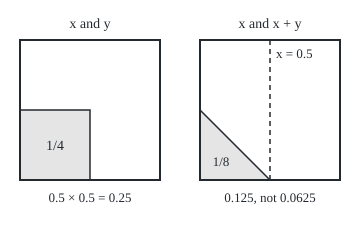

# Independence as a product: two quantities are independent exactly when their joint law is the product of their laws, so E[XY] = E[X]E[Y]

[Syllabus](../../../SYLLABUS.md) → [Measure and integration](../../../SYLLABUS.md#w10) → [Product Measures and Fubini](../../../SYLLABUS.md#w10-s06) → Independence as a product

---

## General Overview

A dart lands at a random point on a square board 1 m on a side, every point equally likely. Its position is two numbers: x, the distance from the left edge, and y, the distance from the bottom edge, both in metres. Each lies between 0 and 1, and each averages 0.5.

What is the average of x times y? The chance that x is at most 0.5 is 0.5, and so is the chance that y is. The chance of both is the area of the bottom-left quarter, 0.25, the product. That product rule holds for every pair of ranges, and it makes the average of xy the product of the averages, 0.25. Two hundred thousand simulated darts give 0.250056.

Now pair x with the sum x + y. The chance that x + y is at most 0.5 is a corner triangle's area, 0.125. Adding "x at most 0.5" changes nothing, since the triangle sits in the left half. The product rule would say 0.0625, half the truth, and the average of x(x + y) is 7/12, not the product of averages, 1/2.

The product rule for every pair of ranges is **independence**, the term used from here on. This card defines it for whole families of events, shows that the ranges "at most s" and "at most t" suffice to check it, and proves that it makes the pair's joint probability a product measure.

**Two random quantities are independent exactly when their joint law is the product measure of their separate laws; then, by Fubini, the average of their product is the product of their averages, and the variance of their sum is the sum of their variances.**

**What kind of fact this is:** a definition (independence of sigma-algebras and of random variables) and three theorems built on it, all proved on this card in Why it works.

### The picture: one rectangle, two pairs

Both squares are the board, to scale, x across and y up. Left: "x at most 0.5 and y at most 0.5". Right: "x at most 0.5 and x + y at most 0.5", the shaded triangle; the dashed line is x = 0.5.

<p align="center"></p>

On the right, learning that x + y is small forces x to be small too.

---

## The formula

Notation first, in words. A probability space $(\Omega, \mathcal{F}, P)$ is a set of outcomes, the sets we allow ourselves to measure, and a probability on them: here the board, its Borel sets, and area, Lebesgue measure $\lambda$. $\sigma(X)$ is the sigma-algebra a random variable X generates, every event "X lands in B" for a Borel set B: what learning X can tell ([Random variables as measurable maps](../03-Measurable%20Functions/04-random-variables-and-their-information.md)). $\mu_X$ is the law of X, $P(X \in B)$ as a measure on the line ([The law of a random variable](../03-Measurable%20Functions/05-pushforward-and-the-law.md)). $\mu_{(X,Y)}$ is the joint law, $P((X, Y) \in C)$ for Borel sets C of the plane. $\mu \otimes \nu$ is the product measure, giving every rectangle A × B the size $\mu(A)\,\nu(B)$ ([Product measure](02-product-measure.md)).

**Definition.** Two sigma-algebras $\mathcal{G}$ and $\mathcal{H}$ inside $\mathcal{F}$ are independent when every event of one and every event of the other multiply:

$$P(A \cap B) = P(A)\,P(B) \quad \text{for every } A \in \mathcal{G} \text{ and every } B \in \mathcal{H}.$$

Two random variables are independent when their sigma-algebras are:

$$X, Y \text{ independent} \iff P(X \in A,\ Y \in B) = P(X \in A)\,P(Y \in B) \quad \text{for all Borel sets } A, B.$$

**Read it aloud:** anything learnable from X and anything learnable from Y happen together with the product of their chances.

**Theorem 1, the pi-system test.** If $\mathcal{P}_1$ and $\mathcal{P}_2$ are pi-systems (families closed under overlap of two members) and every member of one multiplies with every member of the other, the sigma-algebras they generate are independent. For random variables the rays are enough:

$$P(X \le s,\ Y \le t) = P(X \le s)\,P(Y \le t) \ \text{ for all } s, t \;\Longrightarrow\; X, Y \text{ independent.}$$

**Read it aloud:** the product rule on "at most s, at most t" for all thresholds gives it on all Borel sets.

**Theorem 2, the joint law is a product.**

$$X, Y \text{ independent} \iff \mu_{(X,Y)} = \mu_X \otimes \mu_Y.$$

**Read it aloud:** independence means the pair's law is the product of the two laws.

**Theorem 3, products and sums.** Write E for the average, the integral against P, and Var for the variance. If X and Y are independent and each has a finite average of its absolute value, then

$$E[XY] = E[X]\,E[Y],$$

and if each has a finite average square, then

$$\mathrm{Var}(X + Y) = \mathrm{Var}(X) + \mathrm{Var}(Y).$$

**Read it aloud:** for independent quantities the product's average is the product of averages, and the sum's variance is the sum of variances.

| Symbol | Plain meaning | In our example | Push it up and the answer… |
| --- | --- | --- | --- |
| $\Omega$, $\mathcal{F}$, $P$, $\lambda$ | outcomes, measurable sets, probability; $\lambda$ is Lebesgue measure (area here) | the board, its Borel sets, area | — |
| $x$, $y$, $u$, $w$ | the dart's coordinates in metres; u = x − 0.5 and w = u^2 (What breaks) | a point such as (0.3, 0.8) | — |
| $X$, $Y$ | two random variables in general | x and y; or x and x + y | — |
| $\mathcal{G}$, $\mathcal{H}$, $\sigma(X)$ | sigma-algebras inside $\mathcal{F}$; $\sigma(X)$ is what learning X can tell | $\sigma(x)$: every event "x lands in B" | a bigger family is harder to keep independent |
| $A$, $B$, $L$, $C$ | events, or Borel sets of the line; C is also a Borel set of the plane in the notation and proofs | x ≤ 0.5; L = left half, B = bottom half (Step 1), C = "bottom-left or top-right quarter" | — |
| $\mathcal{P}_1$, $\mathcal{P}_2$ | pi-systems: families closed under overlap of two members | the rays {x ≤ s} and {y ≤ t} | — |
| $s$, $t$ | ray thresholds | 0.5 and 0.5 | raise either and the rectangle grows |
| $\mathcal{B}(\mathbb{R})$ | the Borel sets of the line | [0, 0.5] | — |
| $\mu_X$, $\mu_Y$, $\mu_{(X,Y)}$ | the laws of X and Y; their joint law on the plane | uniform on [0, 1]; area on the board | — |
| $\otimes$ | product measure: rectangles get the product of side sizes | area = length ⊗ length | — |
| $\mathcal{D}_A$, $\mathcal{D}'_B$, $\mathcal{R}_X$, $h$, $f$, $X'$, $Y'$, $\omega$ | in the folded proofs: the events that multiply with A, or with B; the ray events {X ≤ s}; a function of the pair; the shift x ↦ x − E[X]; the centred X − E[X] and Y − E[Y]; one outcome | $\mathcal{R}_x$: the strips {x ≤ s}; x' = x − 0.5 | — |
| $E$, $\mathrm{Var}$, $\mathrm{Cov}$ | average; variance, the average squared distance from the average; covariance, E[XY] − E[X]E[Y] | E[x] = 1/2, Var(x) = 1/12 | — |

### When it holds

- **The product rule on every pair of events, not on a few.** One cell that multiplies proves nothing: on a 4 by 4 grid of the pair (x, x + y), 10 ray pairs out of 28 multiply, and each of those 10 has a ray that is the whole board.
- **The generators are pi-systems.** Drop closure under overlap and Theorem 1 fails: the events L and B each multiply with C, yet their overlap does not (Step 1).
- **Finite averages.** For quantities never negative, E[XY] = E[X]E[Y] holds outright, infinite values allowed, since Tonelli needs no integrability; signed quantities need finite averages, or a side can be infinity minus infinity. The variance rule needs finite average squares.
- **All at once, not two at a time.** For three or more variables every finite subfamily must multiply (C in Step 1).

---

## Why it works

### Step 0: independence is two measures agreeing on rectangles

Two measures live on the plane. The joint law gives the true chance that the pair (X, Y) lands in a set. The product law $\mu_X \otimes \mu_Y$ gives the chance it would have if its coordinates ignored each other. On a rectangle A × B they give $P(X \in A, Y \in B)$ and $P(X \in A)\,P(Y \in B)$. Independence says these agree on every rectangle.

Rectangles overlap in rectangles, so they form a pi-system, and they generate the Borel sets of the plane ([Product sigma-algebras](01-product-sigma-algebras.md)). Dynkin's theorem ([Pi-systems and Dynkin's theorem](../01-Sets%20You%20Can%20Measure/06-pi-systems-and-uniqueness.md)) does the rest: two probability measures that agree on a pi-system agree on everything it generates. Theorem 1 is Dynkin's theorem applied twice, once from each side; Theorem 2 is that uniqueness on the rectangle pi-system; Theorem 3 integrates against the product.

### Step 1: the definition, on examples small enough to list

Quarter the board. Let L be the left half and B the bottom half. The sigma-algebra L generates has four events: nothing, L, its complement, the whole board; likewise for B. All 16 pairs multiply, P(L ∩ B) = 0.25 = 0.5 × 0.5 among them: independent. Now let C be "bottom-left or top-right quarter". C multiplies with L and with B, yet P(L ∩ B ∩ C) = 1/4, not 1/8. So C is not independent of the sigma-algebra L and B generate together. The family {L, B} is not closed under overlap: its member L ∩ B was never tested, and Theorem 1 needs it.

Cut a 4 by 4 grid and record the dart's column and row, each 0 to 3. Each generates 16 events, one per set of values, and all 256 pairs multiply: the definition met.

Now record the column and the column plus the row, 0 to 6, which generates 128 events. Of the 2048 pairs, 696 multiply. One failure settles it: column 0 has chance 4/16, a sum of 0 has 1/16, and both, the same cell, have 1/16, not 4/256. The definition fails, on a grid copy of (x, x + y).

### Step 2: rays are enough (Theorem 1)

Fix one event A of the first pi-system and collect every event that multiplies with A. That collection holds the whole space, survives proper differences because chances of nested events subtract, and survives increasing unions because chances pass to the limit. So it is a lambda-system containing the second pi-system, and Dynkin's theorem puts the whole generated sigma-algebra inside it. Swap the roles and repeat.

Rays overlap in rays and generate $\sigma(X)$, so the chance of "X at most s and Y at most t" settles independence. On the dart it is the area s × t of a corner rectangle, and the code checks four against simulation.

<details>
<summary>Detailed proof of Theorem 1</summary>

**Setting.** $\mathcal{P}_1$ and $\mathcal{P}_2$ are pi-systems inside $\mathcal{F}$, and $P(A \cap B) = P(A)P(B)$ for every $A \in \mathcal{P}_1$, $B \in \mathcal{P}_2$.

**First half.** Fix $A \in \mathcal{P}_1$ and let $\mathcal{D}_A$ be the events $B \in \mathcal{F}$ with $P(A \cap B) = P(A)P(B)$.
- $\Omega \in \mathcal{D}_A$: $P(A \cap \Omega) = P(A) = P(A) \cdot 1$.
- Proper differences: if $B \subseteq C$ are in $\mathcal{D}_A$, then $A \cap (C \setminus B) = (A \cap C) \setminus (A \cap B)$ with $A \cap B \subseteq A \cap C$, so by additivity of $P$, with every chance finite, $P(A \cap (C \setminus B)) = P(A \cap C) - P(A \cap B) = P(A)(P(C) - P(B)) = P(A)P(C \setminus B)$.
- Increasing unions: if $B_1 \subseteq B_2 \subseteq \dots$ are in $\mathcal{D}_A$ with union $B$, then $A \cap B_n$ increases to $A \cap B$, and continuity from below ([Continuity and subadditivity](../01-Sets%20You%20Can%20Measure/05-continuity-of-measure.md)) gives $P(A \cap B) = \lim P(A \cap B_n) = \lim P(A)P(B_n) = P(A)P(B)$.

So $\mathcal{D}_A$ is a lambda-system containing $\mathcal{P}_2$. Dynkin's pi-lambda theorem gives $\sigma(\mathcal{P}_2) \subseteq \mathcal{D}_A$. As $A$ was any member of $\mathcal{P}_1$: every $A \in \mathcal{P}_1$ multiplies with every $B \in \sigma(\mathcal{P}_2)$.

**Second half.** Fix $B \in \sigma(\mathcal{P}_2)$ and let $\mathcal{D}'_B$ be the events $A$ with $P(A \cap B) = P(A)P(B)$. The same three checks, with the roles swapped, show it is a lambda-system; the first half shows it contains $\mathcal{P}_1$. Dynkin gives $\sigma(\mathcal{P}_1) \subseteq \mathcal{D}'_B$. So $\sigma(\mathcal{P}_1)$ and $\sigma(\mathcal{P}_2)$ are independent.

**Rays.** Let $\mathcal{R}_X$ be the events $\{X \le s\}$, $s$ real. It is a pi-system: $\{X \le s\} \cap \{X \le s'\} = \{X \le \min(s, s')\}$. Its sigma-algebra is $\sigma(X)$. One way, each ray event lies in $\sigma(X)$, so $\sigma(\mathcal{R}_X) \subseteq \sigma(X)$. The other way, the Borel sets $B$ with $\{X \in B\} \in \sigma(\mathcal{R}_X)$ form a sigma-algebra, because taking preimages commutes with complements and countable unions; it holds every ray $(-\infty, s]$, and rays generate $\mathcal{B}(\mathbb{R})$ ([Generated sigma-algebras and Borel sets](../01-Sets%20You%20Can%20Measure/03-generated-and-borel-sigma-algebras.md)), so it holds every Borel set. Apply the first two parts to $\mathcal{R}_X$ and $\mathcal{R}_Y$.

</details>

### Step 3: the joint law is the product law (Theorem 2)

Independence makes the joint law and the product law agree on rectangles; both have total 1, so uniqueness makes them equal. Read backwards, equal laws agree on rectangles, which is the definition.

On the dart the joint law is area, which is length ⊗ length. The pair (x, x + y) lives on a slanted band, between "second = first" and "second = first + 1", while the product of its laws spreads over [0, 1] × [0, 2]. They differ on the picture's rectangle: 0.125 against 0.0625.

<details>
<summary>Detailed proof of Theorem 2</summary>

**The pair is measurable.** The preimage of a rectangle $A \times B$ under $\omega \mapsto (X(\omega), Y(\omega))$ is $\{X \in A\} \cap \{Y \in B\}$, which lies in $\mathcal{F}$. The sets of the plane whose preimage lies in $\mathcal{F}$ form a sigma-algebra, since preimages commute with complements and countable unions; it holds every rectangle, so it holds the product sigma-algebra $\mathcal{B}(\mathbb{R}) \otimes \mathcal{B}(\mathbb{R})$, which equals the Borel sets of the plane ([Product sigma-algebras](01-product-sigma-algebras.md)). So $\mu_{(X,Y)}(C) = P((X, Y) \in C)$ is a probability measure on the plane, the pushforward of $P$.

**Independent implies product.** For Borel $A$, $B$: $\mu_{(X,Y)}(A \times B) = P(X \in A, Y \in B) = P(X \in A)P(Y \in B) = \mu_X(A)\mu_Y(B) = (\mu_X \otimes \mu_Y)(A \times B)$, the last step by the defining property of product measure ([Product measure](02-product-measure.md)). Rectangles form a pi-system, since $(A \times B) \cap (A' \times B') = (A \cap A') \times (B \cap B')$, and generate the product sigma-algebra. Both measures have total 1. The uniqueness theorem ([Pi-systems and Dynkin's theorem](../01-Sets%20You%20Can%20Measure/06-pi-systems-and-uniqueness.md)) gives $\mu_{(X,Y)} = \mu_X \otimes \mu_Y$.

**Product implies independent.** Evaluate both sides on $A \times B$ and read the chain above from right to left.

</details>

### Step 4: averages of products factor (Theorem 3, first half)

The average of a function of the pair is its integral against the pair's law ([Expectation as an integral](../04-The%20Lebesgue%20Integral/06-expectation-as-an-integral.md)). By Theorem 2 that law is a product measure, so the integral goes one coordinate at a time ([Tonelli and Fubini](03-tonelli-and-fubini.md)): over y, xy gives x E[Y]; over x, that gives E[X]E[Y]. Tonelli, on the never-negative |x||y|, first shows the product has a finite average, the licence Fubini needs. On the dart: x/2, then 1/4.

<details>
<summary>Detailed proof of Theorem 3, the product</summary>

**Change of variables on the plane.** For a Borel function $h \ge 0$ on the plane, $E[h(X, Y)] = \int h \, d\mu_{(X,Y)}$. For an indicator $h = 1_C$ this is the definition of $\mu_{(X,Y)}$; it passes to simple functions by linearity and to every $h \ge 0$ by monotone convergence, the same three steps as on the line ([Expectation as an integral](../04-The%20Lebesgue%20Integral/06-expectation-as-an-integral.md)). For integrable h, split into positive and negative parts.

**Integrability, by Tonelli.** Take $h(x, y) = |x|\,|y| \ge 0$. By the change of variables and Theorem 2,
$$E|XY| = \int |x|\,|y| \; d(\mu_X \otimes \mu_Y) = \int \Big( \int |x|\,|y| \, \mu_Y(dy) \Big) \mu_X(dx) = \int |x| \, E|Y| \, \mu_X(dx) = E|X| \, E|Y| < \infty,$$
the second step by Tonelli, the third and fourth by the change of variables on the line. So XY is integrable.

**The value, by Fubini.** Now $h(x, y) = xy$ is integrable against $\mu_X \otimes \mu_Y$, so Fubini allows the iterated integral:
$$E[XY] = \int \Big( \int x y \, \mu_Y(dy) \Big) \mu_X(dx) = \int x \, E[Y] \, \mu_X(dx) = E[X]\,E[Y].$$
The inner integral is $x \int y \, \mu_Y(dy) = x E[Y]$ by linearity, and $E[Y]$ is a constant that leaves the outer integral.

</details>

### Step 5: variances add (Theorem 3, second half)

Measurable functions of independent quantities are independent: whatever x − 0.5 can tell, x can tell. So the centred quantities X − E[X] and Y − E[Y] are independent, each averages zero, and by Step 4 so does their product. Square the centred sum and the cross term drops out.

<details>
<summary>Detailed proof of Theorem 3, the variances</summary>

Suppose $E[X^2]$ and $E[Y^2]$ are finite. Then $E|X| \le 1 + E[X^2]$, since $|x| \le 1 + x^2$, so X and Y are integrable. Put $X' = X - E[X]$ and $Y' = Y - E[Y]$.

$X' = f(X)$ with $f(x) = x - E[X]$ continuous, hence Borel, so $\{X' \in B\} = \{X \in f^{-1}(B)\}$ and $\sigma(X') \subseteq \sigma(X)$; likewise $\sigma(Y') \subseteq \sigma(Y)$. Events of the smaller families are events of the larger ones, so they multiply: $X'$ and $Y'$ are independent. By Step 4, $E[X'Y'] = E[X']E[Y'] = 0 \cdot 0 = 0$.

By linearity of the integral, $\mathrm{Var}(X + Y) = E[(X' + Y')^2] = E[X'^2] + 2E[X'Y'] + E[Y'^2] = \mathrm{Var}(X) + \mathrm{Var}(Y)$. Every term is finite because $|X'Y'| \le (X'^2 + Y'^2)/2$.

</details>

### Step 6: reading the failure

For (x, x + y) the average of the product is E[x^2] + E[xy] = 1/3 + 1/4 = 7/12: the second term factors, the first does not, since x is not independent of itself. The product of averages is 1/2 × 1 = 1/2. The gap, 1/12, is the covariance, and equals Var(x).

The probability wing computes E[XY] = E[X]E[Y] for tables and densities separately ([Two variables at once](../../09-Probability%20and%20statistics/02-Random%20Variables/04-joint-distributions-and-covariance.md)); the measure version covers every law at once. The code checks finite grids in full and the dart's numbers three ways; only the proofs reach every Borel set and every integrable pair.

---

## Worked numbers, by hand

The dart, x and y each uniform on [0, 1] m and independent, since the board's area is length times length.

| Step | Arithmetic | Value |
| --- | --- | --- |
| average of x | integral of x from 0 to 1 | 1/2 |
| average of x^2 | integral of x^2 from 0 to 1 | 1/3 |
| variance of x | 1/3 − (1/2)^2 | 1/12 |
| average of xy, inner integral | integral of xy over y from 0 to 1 | x/2 |
| average of xy, outer integral | integral of x/2 over x from 0 to 1 | **1/4 = 0.5 × 0.5** |
| variance of x + y | 1/12 + 1/12 | **1/6** |
| the pair (x, x + y): x ≤ 0.5 and x + y ≤ 0.5 | triangle with legs 0.5: 0.5 × 0.5 / 2 | 1/8 = 0.125 |
| product of the two chances | 1/2 × 1/8 | 1/16 = 0.0625 |
| average of x(x + y) | E[x^2] + E[x]E[y] = 1/3 + 1/4 | **7/12**, not 1/2 |

The coordinates multiply to 0.25 m^2 on average, and x + y has twice one coordinate's variance. Paired with x + y, the same x breaks the product rule on the first rectangle tried.

### What breaks if you drop a piece

| Mistake | Comes out at | What went wrong |
| --- | --- | --- |
| Multiplying averages for the pair (x, x + y) | 1/2, against the true 7/12 = 0.583333 | x + y carries x inside it; the gap is the covariance, 1/12 |
| Adding the variances of x and x | 1/6 = 0.166667, against Var(2x) = 1/3 = 0.333333 | x is not independent of itself |
| Testing generators that are not a pi-system: L and B each against C | P(L ∩ B ∩ C) = 1/4, against the product 1/8 | L ∩ B was never tested; pairs multiplying does not reach what they generate |
| Taking zero covariance for independence: u = x − 0.5, w = u^2 | E[uw] = 0 = E[u]E[w], yet u ≤ −1/4 and w ≤ 1/16 has chance 0, against 1/8 | w is a function of u; one average matching is not every event matching |

The code prints all four.

---

## Code, from first principles, and it actually runs

Three roads that share no arithmetic. Exact fractions give averages, variances and rectangle chances, the (x, x + y) triangle integrated by hand. Finite grids are listed in full: 4 by 4 cells test every pair of sets and of rays, and n by n grids give lower sums (integrals of step functions under xy) climbing to 1/4 within 1/n. Two hundred thousand darts from SplitMix64, a small generator written out in both languages, seed 20260929, check chances and averages within about four standard errors. Rust carries its own fraction type.

### Python

```python
# Independence as a product -- the check behind the card.  Standard library
# only; Fraction does exact arithmetic.  A dart lands uniformly on a 1 m by
# 1 m board at (x, y).  Three roads: exact formulas in fractions, finite grids
# listed in full, and 200000 simulated darts from SplitMix64, seed 20260929.
from fractions import Fraction as Fr
from math import sqrt

MASK, N = (1 << 64) - 1, 200000
state = 20260929

def uniform():                        # SplitMix64, top 53 bits scaled into [0, 1)
    global state
    state = (state + 0x9E3779B97F4A7C15) & MASK
    z = ((state ^ (state >> 30)) * 0xBF58476D1CE4E5B9) & MASK
    z = ((z ^ (z >> 27)) * 0x94D049BB133111EB) & MASK
    return ((z ^ (z >> 31)) >> 11) / 2.0 ** 53

def g(s, t):                          # exact P(x <= s, x + y <= t): integrate min(1, max(0, t - x)) over x in [0, s]
    full = max(Fr(0), min(s, t - 1))
    a, b = max(Fr(0), t - 1), min(s, t)
    return full + (t * (b - a) - (b * b - a * a) / 2 if b > a else 0)

def lower_sum(n, h):                  # integral of the simple function h(lower-left corner) on an n by n grid
    return Fr(sum(h(i, j) for i in range(n) for j in range(n)), n ** 4)

def count(pairs, test):
    return sum(1 for u, v in pairs if test(u, v))

def ray_pairs(pairs, nv):             # rays {first <= a} and {second <= b}; 16 equally likely cells
    return sum(16 * count(pairs, lambda u, v: u <= a and v <= b)
               == count(pairs, lambda u, v: u <= a) * count(pairs, lambda u, v: v <= b)
               for a in range(4) for b in range(nv)), 4 * nv

def set_pairs(pairs, nv):             # every set of first values against every set of second values
    return sum(16 * count(pairs, lambda u, v: A >> u & 1 and B >> v & 1)
               == count(pairs, lambda u, v: A >> u & 1) * count(pairs, lambda u, v: B >> v & 1)
               for A in range(16) for B in range(1 << nv)), 16 << nv

def show(q):
    return f"{q.numerator}/{q.denominator} = {float(q):.6f}"

half, quarter = Fr(1, 2), Fr(1, 4)
ex, ex2 = half, Fr(1, 3)                          # exact moments of one uniform coordinate
var = ex2 - ex * ex
rays = [(quarter, half), (half, half), (half, Fr(3, 4)), (Fr(3, 4), quarter)]
sums = [0.0] * 5                                  # xy, (xy)^2, x + y, (x + y)^2, x(x + y)
hits = [0] * 11                                   # 4 ray rectangles, x marginal at 1/4 1/2 3/4, y marginal at 1/4 1/2 3/4, x + y <= 1/2
both = [0, 0, 0]                                  # {x <= 1/2 and x + y <= 1/2}, {u <= -1/4}, {u <= -1/4 and w <= 1/16}
w_hits, uw_sum = 0, 0.0
for _ in range(N):
    x = uniform(); y = uniform()
    for k, v in enumerate((x * y, x * y * x * y, x + y, (x + y) * (x + y), x * (x + y))):
        sums[k] += v
    for k, (s, t) in enumerate(rays):
        hits[k] += x <= s and y <= t
    for k, c in enumerate((0.25, 0.5, 0.75)):
        hits[4 + k] += x <= c; hits[7 + k] += y <= c
    hits[10] += x + y <= 0.5
    u = x - 0.5; w = u * u
    both[0] += x <= 0.5 and x + y <= 0.5; both[1] += u <= -0.25; both[2] += u <= -0.25 and w <= 0.0625
    w_hits += w <= 0.0625; uw_sum += u * w
m = [v / N for v in sums]
se_xy = sqrt((m[1] - m[0] * m[0]) / N)
sim_var = m[3] - m[2] * m[2]
marg = {Fr(1, 4): 0, Fr(1, 2): 1, Fr(3, 4): 2}
print(f"dart: x and y uniform on [0, 1] m; {N} simulated darts, seed 20260929")
print(f"exact E[x] = 1/2, E[x^2] = 1/3, Var(x) = {var.numerator}/{var.denominator}")
print(f"exact E[x]E[y] = {show(ex * ex)}")
low = [lower_sum(n, lambda i, j: i * j) for n in (4, 16, 64, 256)]
print("lower sums of xy, n by n grid: " + ", ".join(f"n={n} {float(q):.6f}" for n, q in zip((4, 16, 64, 256), low)))
print(f"simulated E[xy] = {m[0]:.6f}, standard error {se_xy:.6f}")
print(f"exact Var(x + y) = Var(x) + Var(y) = {show(2 * var)}; simulated {sim_var:.6f}")
for k, (s, t) in enumerate(rays):
    sim_prod = hits[4 + marg[s]] / N * (hits[7 + marg[t]] / N)
    print(f"ray rectangle x <= {float(s):.2f}, y <= {float(t):.2f}: exact {show(s * t)}; "
          f"simulated joint {hits[k] / N:.6f}, product {sim_prod:.6f}")
cells_ij = [(i, j) for i in range(4) for j in range(4)]
cells_iw = [(i, i + j) for i in range(4) for j in range(4)]
r_ij, s_ij, r_iw, s_iw = ray_pairs(cells_ij, 4), set_pairs(cells_ij, 4), ray_pairs(cells_iw, 7), set_pairs(cells_iw, 7)
print(f"4 by 4 cells, (column, row): ray pairs multiplying {r_ij[0]} of {r_ij[1]}; set pairs {s_ij[0]} of {s_ij[1]}")
print(f"4 by 4 cells, (column, column + row): ray pairs {r_iw[0]} of {r_iw[1]}; set pairs {s_iw[0]} of {s_iw[1]}, "
      f"from 16 x {1 << 7} events")
c0, w0 = count(cells_iw, lambda u, v: u == 0), count(cells_iw, lambda u, v: v == 0)
print(f"  one failing pair: column 0 has {c0}/16, sum 0 has {w0}/16, both {count(cells_iw, lambda u, v: u == 0 and v == 0)}/16, "
      f"product {c0 * w0}/256")
gv, fv = g(half, half), g(Fr(1), half)
print(f"pair (x, x + y), rectangle x <= 1/2, x + y <= 1/2: exact {show(gv)}; product 1/2 x {fv} = {show(half * fv)}")
print(f"  simulated joint {both[0] / N:.6f}, product {hits[5] / N * (hits[10] / N):.6f}")
for t in (Fr(1), Fr(3, 2)):
    print(f"  ray x <= 1/2, x + y <= {float(t):.1f}: exact {show(g(half, t))}, product {show(half * g(Fr(1), t))}")
exy2 = ex2 + ex * ex                              # E[x(x + y)] = E[x^2] + E[x]E[y], since x and y are independent
low2 = lower_sum(256, lambda i, j: i * (i + j))
print(f"E[x(x + y)] exact {show(exy2)}; lower sum n=256 {float(low2):.6f}; simulated {m[4]:.6f}; "
      f"E[x]E[x + y] = 1/2 x {2 * ex} = {ex * 2 * ex}; covariance {exy2 - ex * 2 * ex}")
print(f"mistake, Var(x + x) read as Var(x) + Var(x): {show(2 * var)}; true Var(2x) {show(4 * var)}")
board = [(i, j) for i in range(2) for j in range(2)]                        # quadrants, 1/4 each
L, B, C = (lambda i, j: i == 0), (lambda i, j: j == 0), (lambda i, j: i == j)
p = lambda *evs: Fr(count(board, lambda i, j: all(e(i, j) for e in evs)), 4)
print(f"mistake, generators {{L, B}} and {{C}}: P(L and C) = {p(L, C)}, P(B and C) = {p(B, C)}, "
      f"P(L and B) = {p(L, B)}; P(L and B and C) = {p(L, B, C)}, not {p(L, B) * p(C)}")
lo, hi = max(Fr(0), quarter), min(quarter, Fr(3, 4))                  # {x <= 1/4} meets {1/4 <= x <= 3/4}
rect_uw = max(Fr(0), hi - lo)
print(f"mistake, u = x - 1/2, w = u^2: E[uw] = E[u^3] = 0 = E[u]E[w]; simulated E[uw] {uw_sum / N:.6f}")
print(f"  rectangle u <= -1/4, w <= 1/16: exact {rect_uw}, product {quarter * half}; "
      f"simulated {both[2] / N:.6f} and {both[1] / N * (w_hits / N):.6f}")
print("figure, 140 px per metre; left square 20..160, right 200..340, top 40, bottom 180; "
      f"left rectangle 70 by 70 px, area {float(half * half):.6f}; right triangle legs 70 px, area {float(gv):.6f}")
assert Fr(0) < ex * ex - low[-1] < Fr(1, 256)     # grid lower sums climb to the exact 1/4 within 1/n
assert abs(m[0] - 0.25) < 4 * se_xy               # 200000 darts agree with E[x]E[y] = 1/4
assert abs(sim_var - float(2 * var)) < 0.002      # about 4.5 standard errors of a sample variance
assert r_ij[0] == r_ij[1] and s_ij[0] == s_ij[1]   # rays multiply, and so does every set pair
assert r_iw[0] < r_iw[1] and s_iw[0] < s_iw[1]     # a failing ray pair shows up among the sets
assert abs(both[0] / N - float(gv)) < 4 * sqrt(float(gv * (1 - gv)) / N)   # simulation meets the exact 1/8
assert gv != half * fv                            # (x, x + y) fails on this rectangle
assert Fr(0) < exy2 - low2 < Fr(2, 256)           # upper minus lower sum of x^2 + xy is 2/n
assert p(L, B, C) != p(L, B) * p(C)               # pairs multiply, the generated sets do not
print("ALL CHECKS PASS")
```

**Ran 2026-09-29 on macOS, Python 3.14.6, standard library only. All checks passed. Output, pasted from the run:**

```
dart: x and y uniform on [0, 1] m; 200000 simulated darts, seed 20260929
exact E[x] = 1/2, E[x^2] = 1/3, Var(x) = 1/12
exact E[x]E[y] = 1/4 = 0.250000
lower sums of xy, n by n grid: n=4 0.140625, n=16 0.219727, n=64 0.242249, n=256 0.248051
simulated E[xy] = 0.250056, standard error 0.000492
exact Var(x + y) = Var(x) + Var(y) = 1/6 = 0.166667; simulated 0.166726
ray rectangle x <= 0.25, y <= 0.50: exact 1/8 = 0.125000; simulated joint 0.125200, product 0.124953
ray rectangle x <= 0.50, y <= 0.50: exact 1/4 = 0.250000; simulated joint 0.251015, product 0.250518
ray rectangle x <= 0.50, y <= 0.75: exact 3/8 = 0.375000; simulated joint 0.375715, product 0.375575
ray rectangle x <= 0.75, y <= 0.25: exact 3/16 = 0.187500; simulated joint 0.187910, product 0.187399
4 by 4 cells, (column, row): ray pairs multiplying 16 of 16; set pairs 256 of 256
4 by 4 cells, (column, column + row): ray pairs 10 of 28; set pairs 696 of 2048, from 16 x 128 events
  one failing pair: column 0 has 4/16, sum 0 has 1/16, both 1/16, product 4/256
pair (x, x + y), rectangle x <= 1/2, x + y <= 1/2: exact 1/8 = 0.125000; product 1/2 x 1/8 = 1/16 = 0.062500
  simulated joint 0.125495, product 0.062788
  ray x <= 1/2, x + y <= 1.0: exact 3/8 = 0.375000, product 1/4 = 0.250000
  ray x <= 1/2, x + y <= 1.5: exact 1/2 = 0.500000, product 7/16 = 0.437500
E[x(x + y)] exact 7/12 = 0.583333; lower sum n=256 0.579433; simulated 0.583182; E[x]E[x + y] = 1/2 x 1 = 1/2; covariance 1/12
mistake, Var(x + x) read as Var(x) + Var(x): 1/6 = 0.166667; true Var(2x) 1/3 = 0.333333
mistake, generators {L, B} and {C}: P(L and C) = 1/4, P(B and C) = 1/4, P(L and B) = 1/4; P(L and B and C) = 1/4, not 1/8
mistake, u = x - 1/2, w = u^2: E[uw] = E[u^3] = 0 = E[u]E[w]; simulated E[uw] 0.000040
  rectangle u <= -1/4, w <= 1/16: exact 0, product 1/8; simulated 0.000000 and 0.125030
figure, 140 px per metre; left square 20..160, right 200..340, top 40, bottom 180; left rectangle 70 by 70 px, area 0.250000; right triangle legs 70 px, area 0.125000
ALL CHECKS PASS
```

### Rust

Same numbers, same labels, built with `rustc --edition 2021 -O`.

```rust
// Independence as a product -- the same check as the Python, in Rust.  No
// crates; exact fractions by hand on small integers.  A dart lands uniformly on
// a 1 m by 1 m board at (x, y).  Three roads: exact formulas in fractions,
// finite grids listed in full, and 200000 simulated darts from SplitMix64.
use std::fmt;

#[derive(Clone, Copy, PartialEq)]
struct R { n: i64, d: i64 }                        // a fraction n/d, kept in lowest terms, d > 0

fn gcd(a: i64, b: i64) -> i64 { if b == 0 { a.abs() } else { gcd(b, a % b) } }
fn r(n: i64, d: i64) -> R { let g = gcd(n, d).max(1); let s = if d < 0 { -1 } else { 1 }; R { n: s * n / g, d: s * d / g } }
impl std::ops::Add for R { type Output = R; fn add(self, o: R) -> R { r(self.n * o.d + o.n * self.d, self.d * o.d) } }
impl std::ops::Sub for R { type Output = R; fn sub(self, o: R) -> R { r(self.n * o.d - o.n * self.d, self.d * o.d) } }
impl std::ops::Mul for R { type Output = R; fn mul(self, o: R) -> R { r(self.n * o.n, self.d * o.d) } }
impl fmt::Display for R {
    fn fmt(&self, f: &mut fmt::Formatter) -> fmt::Result { if self.d == 1 { write!(f, "{}", self.n) } else { write!(f, "{}/{}", self.n, self.d) } }
}
fn val(q: R) -> f64 { q.n as f64 / q.d as f64 }
fn show(q: R) -> String { format!("{}/{} = {:.6}", q.n, q.d, val(q)) }
fn mn(a: R, b: R) -> R { if less(a, b) { a } else { b } }
fn less(a: R, b: R) -> bool { a.n * b.d < b.n * a.d }
fn max_r(a: R, b: R) -> R { if less(a, b) { b } else { a } }

fn uniform(state: &mut u64) -> f64 {               // SplitMix64, top 53 bits scaled into [0, 1)
    *state = state.wrapping_add(0x9E3779B97F4A7C15);
    let mut z = (*state ^ (*state >> 30)).wrapping_mul(0xBF58476D1CE4E5B9);
    z = (z ^ (z >> 27)).wrapping_mul(0x94D049BB133111EB);
    ((z ^ (z >> 31)) >> 11) as f64 / 9007199254740992.0
}

fn g(s: R, t: R) -> R {                            // exact P(x <= s, x + y <= t)
    let one = r(1, 1);
    let full = max_r(r(0, 1), mn(s, t - one));
    let (a, b) = (max_r(r(0, 1), t - one), mn(s, t));
    if less(a, b) { full + t * (b - a) - (b * b - a * a) * r(1, 2) } else { full }
}

fn lower_sum(n: i64, h: fn(i64, i64) -> i64) -> R {  // simple function at each cell's lower-left corner
    let mut s = 0;
    for i in 0..n { for j in 0..n { s += h(i, j) } }
    r(s, n * n * n * n)
}

fn count(pairs: &[(usize, usize)], test: &dyn Fn(usize, usize) -> bool) -> i64 {
    pairs.iter().filter(|&&(u, v)| test(u, v)).count() as i64
}

fn ray_pairs(p: &[(usize, usize)], nv: usize) -> (usize, usize) {
    let mut ok = 0;
    for a in 0..4 { for b in 0..nv {
        ok += (16 * count(p, &|u, v| u <= a && v <= b) == count(p, &|u, _| u <= a) * count(p, &|_, v| v <= b)) as usize;
    } }
    (ok, 4 * nv)
}

fn set_pairs(p: &[(usize, usize)], nv: usize) -> (usize, usize) {
    let mut ok = 0;
    for sa in 0..16usize { for sb in 0..(1usize << nv) {
        ok += (16 * count(p, &|u, v| sa >> u & 1 == 1 && sb >> v & 1 == 1)
               == count(p, &|u, _| sa >> u & 1 == 1) * count(p, &|_, v| sb >> v & 1 == 1)) as usize;
    } }
    (ok, 16 << nv)
}

fn main() {
    let n = 200000usize;
    let mut state: u64 = 20260929;
    let (half, quarter) = (r(1, 2), r(1, 4));
    let (ex, ex2) = (half, r(1, 3));
    let var = ex2 - ex * ex;
    let rays = [(quarter, half), (half, half), (half, r(3, 4)), (r(3, 4), quarter)];
    let (mut sums, mut hits, mut both) = ([0.0f64; 5], [0usize; 11], [0usize; 3]);
    let (mut w_hits, mut uw_sum) = (0usize, 0.0f64);
    for _ in 0..n {
        let x = uniform(&mut state); let y = uniform(&mut state);
        for (k, v) in [x * y, x * y * x * y, x + y, (x + y) * (x + y), x * (x + y)].iter().enumerate() { sums[k] += v }
        for (k, &(s, t)) in rays.iter().enumerate() { hits[k] += (x <= val(s) && y <= val(t)) as usize }
        for (k, c) in [0.25, 0.5, 0.75].iter().enumerate() { hits[4 + k] += (x <= *c) as usize; hits[7 + k] += (y <= *c) as usize }
        hits[10] += (x + y <= 0.5) as usize;
        let u = x - 0.5; let w = u * u;
        both[0] += (x <= 0.5 && x + y <= 0.5) as usize; both[1] += (u <= -0.25) as usize;
        both[2] += (u <= -0.25 && w <= 0.0625) as usize;
        w_hits += (w <= 0.0625) as usize; uw_sum += u * w;
    }
    let nf = n as f64;
    let m: Vec<f64> = sums.iter().map(|v| v / nf).collect();
    let se_xy = ((m[1] - m[0] * m[0]) / nf).sqrt();
    let sim_var = m[3] - m[2] * m[2];
    let marg = |q: R| if q == quarter { 0 } else if q == half { 1 } else { 2 };
    println!("dart: x and y uniform on [0, 1] m; {} simulated darts, seed 20260929", n);
    println!("exact E[x] = 1/2, E[x^2] = 1/3, Var(x) = {}/{}", var.n, var.d);
    println!("exact E[x]E[y] = {}", show(ex * ex));
    let grids = [4i64, 16, 64, 256];
    let low: Vec<R> = grids.iter().map(|&k| lower_sum(k, |i, j| i * j)).collect();
    let parts: Vec<String> = grids.iter().zip(&low).map(|(k, q)| format!("n={} {:.6}", k, val(*q))).collect();
    println!("lower sums of xy, n by n grid: {}", parts.join(", "));
    println!("simulated E[xy] = {:.6}, standard error {:.6}", m[0], se_xy);
    println!("exact Var(x + y) = Var(x) + Var(y) = {}; simulated {:.6}", show(r(2, 1) * var), sim_var);
    for (k, &(s, t)) in rays.iter().enumerate() {
        let sim_prod = hits[4 + marg(s)] as f64 / nf * (hits[7 + marg(t)] as f64 / nf);
        println!("ray rectangle x <= {:.2}, y <= {:.2}: exact {}; simulated joint {:.6}, product {:.6}",
                 val(s), val(t), show(s * t), hits[k] as f64 / nf, sim_prod);
    }
    let cells_ij: Vec<(usize, usize)> = (0..16).map(|c| (c / 4, c % 4)).collect();
    let cells_iw: Vec<(usize, usize)> = (0..16).map(|c| (c / 4, c / 4 + c % 4)).collect();
    let (r_ij, s_ij, r_iw, s_iw) = (ray_pairs(&cells_ij, 4), set_pairs(&cells_ij, 4), ray_pairs(&cells_iw, 7), set_pairs(&cells_iw, 7));
    println!("4 by 4 cells, (column, row): ray pairs multiplying {} of {}; set pairs {} of {}", r_ij.0, r_ij.1, s_ij.0, s_ij.1);
    println!("4 by 4 cells, (column, column + row): ray pairs {} of {}; set pairs {} of {}, from 16 x {} events", r_iw.0, r_iw.1, s_iw.0, s_iw.1, 1 << 7);
    let (c0, w0) = (count(&cells_iw, &|u, _| u == 0), count(&cells_iw, &|_, v| v == 0));
    println!("  one failing pair: column 0 has {}/16, sum 0 has {}/16, both {}/16, product {}/256",
             c0, w0, count(&cells_iw, &|u, v| u == 0 && v == 0), c0 * w0);
    let (gv, fv) = (g(half, half), g(r(1, 1), half));
    println!("pair (x, x + y), rectangle x <= 1/2, x + y <= 1/2: exact {}; product 1/2 x {} = {}", show(gv), fv, show(half * fv));
    println!("  simulated joint {:.6}, product {:.6}", both[0] as f64 / nf, hits[5] as f64 / nf * (hits[10] as f64 / nf));
    for t in [r(1, 1), r(3, 2)] {
        println!("  ray x <= 1/2, x + y <= {:.1}: exact {}, product {}", val(t), show(g(half, t)), show(half * g(r(1, 1), t)));
    }
    let exy2 = ex2 + ex * ex;                     // E[x(x + y)] = E[x^2] + E[x]E[y], since x and y are independent
    let low2 = lower_sum(256, |i, j| i * (i + j));
    println!("E[x(x + y)] exact {}; lower sum n=256 {:.6}; simulated {:.6}; E[x]E[x + y] = 1/2 x {} = {}; covariance {}",
             show(exy2), val(low2), m[4], r(2, 1) * ex, ex * r(2, 1) * ex, exy2 - ex * r(2, 1) * ex);
    println!("mistake, Var(x + x) read as Var(x) + Var(x): {}; true Var(2x) {}", show(r(2, 1) * var), show(r(4, 1) * var));
    let board: Vec<(usize, usize)> = (0..4).map(|c| (c / 2, c % 2)).collect();   // quadrants, 1/4 each
    let p = |evs: &[fn(usize, usize) -> bool]| r(count(&board, &|i, j| evs.iter().all(|e| e(i, j))), 4);
    let (l, b, c): (fn(usize, usize) -> bool, fn(usize, usize) -> bool, fn(usize, usize) -> bool) =
        (|i, _| i == 0, |_, j| j == 0, |i, j| i == j);
    println!("mistake, generators {{L, B}} and {{C}}: P(L and C) = {}, P(B and C) = {}, P(L and B) = {}; P(L and B and C) = {}, not {}",
             p(&[l, c]), p(&[b, c]), p(&[l, b]), p(&[l, b, c]), p(&[l, b]) * p(&[c]));
    let (lo, hi) = (max_r(r(0, 1), quarter), mn(quarter, r(3, 4)));   // {x <= 1/4} meets {1/4 <= x <= 3/4}
    let rect_uw = max_r(r(0, 1), hi - lo);
    println!("mistake, u = x - 1/2, w = u^2: E[uw] = E[u^3] = 0 = E[u]E[w]; simulated E[uw] {:.6}", uw_sum / nf);
    println!("  rectangle u <= -1/4, w <= 1/16: exact {}, product {}; simulated {:.6} and {:.6}",
             rect_uw, quarter * half, both[2] as f64 / nf, both[1] as f64 / nf * (w_hits as f64 / nf));
    println!("figure, 140 px per metre; left square 20..160, right 200..340, top 40, bottom 180; left rectangle 70 by 70 px, area {:.6}; right triangle legs 70 px, area {:.6}",
             val(half * half), val(gv));
    let gap = ex * ex - low[3];
    assert!(less(r(0, 1), gap) && less(gap, r(1, 256)));        // grid lower sums climb to the exact 1/4 within 1/n
    assert!((m[0] - 0.25).abs() < 4.0 * se_xy);                  // 200000 darts agree with E[x]E[y] = 1/4
    assert!((sim_var - val(r(2, 1) * var)).abs() < 0.002);       // about 4.5 standard errors of a sample variance
    assert!(r_ij.0 == r_ij.1 && s_ij.0 == s_ij.1);               // rays multiply, and so does every set pair
    assert!(r_iw.0 < r_iw.1 && s_iw.0 < s_iw.1);                 // a failing ray pair shows up among the sets
    assert!((both[0] as f64 / nf - val(gv)).abs() < 4.0 * (val(gv * (r(1, 1) - gv)) / nf).sqrt());
    assert!(gv != half * fv);                                    // (x, x + y) fails on this rectangle
    let gap2 = exy2 - low2;
    assert!(less(r(0, 1), gap2) && less(gap2, r(2, 256)));      // upper minus lower sum of x^2 + xy is 2/n
    assert!(p(&[l, b, c]) != p(&[l, b]) * p(&[c]));              // pairs multiply, the generated sets do not
    println!("ALL CHECKS PASS");
}
```

**Ran 2026-09-29 on macOS, rustc 1.98.1, no crates. All checks passed. Output, pasted from the run:**

```
dart: x and y uniform on [0, 1] m; 200000 simulated darts, seed 20260929
exact E[x] = 1/2, E[x^2] = 1/3, Var(x) = 1/12
exact E[x]E[y] = 1/4 = 0.250000
lower sums of xy, n by n grid: n=4 0.140625, n=16 0.219727, n=64 0.242249, n=256 0.248051
simulated E[xy] = 0.250056, standard error 0.000492
exact Var(x + y) = Var(x) + Var(y) = 1/6 = 0.166667; simulated 0.166726
ray rectangle x <= 0.25, y <= 0.50: exact 1/8 = 0.125000; simulated joint 0.125200, product 0.124953
ray rectangle x <= 0.50, y <= 0.50: exact 1/4 = 0.250000; simulated joint 0.251015, product 0.250518
ray rectangle x <= 0.50, y <= 0.75: exact 3/8 = 0.375000; simulated joint 0.375715, product 0.375575
ray rectangle x <= 0.75, y <= 0.25: exact 3/16 = 0.187500; simulated joint 0.187910, product 0.187399
4 by 4 cells, (column, row): ray pairs multiplying 16 of 16; set pairs 256 of 256
4 by 4 cells, (column, column + row): ray pairs 10 of 28; set pairs 696 of 2048, from 16 x 128 events
  one failing pair: column 0 has 4/16, sum 0 has 1/16, both 1/16, product 4/256
pair (x, x + y), rectangle x <= 1/2, x + y <= 1/2: exact 1/8 = 0.125000; product 1/2 x 1/8 = 1/16 = 0.062500
  simulated joint 0.125495, product 0.062788
  ray x <= 1/2, x + y <= 1.0: exact 3/8 = 0.375000, product 1/4 = 0.250000
  ray x <= 1/2, x + y <= 1.5: exact 1/2 = 0.500000, product 7/16 = 0.437500
E[x(x + y)] exact 7/12 = 0.583333; lower sum n=256 0.579433; simulated 0.583182; E[x]E[x + y] = 1/2 x 1 = 1/2; covariance 1/12
mistake, Var(x + x) read as Var(x) + Var(x): 1/6 = 0.166667; true Var(2x) 1/3 = 0.333333
mistake, generators {L, B} and {C}: P(L and C) = 1/4, P(B and C) = 1/4, P(L and B) = 1/4; P(L and B and C) = 1/4, not 1/8
mistake, u = x - 1/2, w = u^2: E[uw] = E[u^3] = 0 = E[u]E[w]; simulated E[uw] 0.000040
  rectangle u <= -1/4, w <= 1/16: exact 0, product 1/8; simulated 0.000000 and 0.125030
figure, 140 px per metre; left square 20..160, right 200..340, top 40, bottom 180; left rectangle 70 by 70 px, area 0.250000; right triangle legs 70 px, area 0.125000
ALL CHECKS PASS
```

The two outputs match line for line: the same generator, the same order of floating-point sums, and the same correctly rounded printing.

> [!TIP]
> **Try changing**
> Guess first, then run it.
> - **A dart stuck on the diagonal.** Set `y = x` in the simulation loop. Guess the average of xy. It moves to E[x^2] = 1/3, and the second assert stops the run: E[x^2] is not E[x]^2.
> - **Wrap the sum round.** In `cells_iw`, replace `i + j` by `(i + j) % 4`. Guess whether the pair is still dependent. Independent: all 28 ray pairs and 2048 set pairs multiply, since a uniform row shifted by any column stays uniform; the fifth assert stops the run.
> - **Another seed.** Change `20260929` to any other number. The simulated values move in the third or fourth decimal place, and every assert still passes.

---

## The usual mistake

> [!warning]
> **Treating E[XY] = E[X]E[Y] as the definition of independence.** It is one number; independence is every pair of events. u = x − 0.5 and w = u^2 have E[uw] = 0 = E[u]E[w], yet "u at most −1/4 and w at most 1/16" is impossible, chance 0 where independence gives 1/8. Zero covariance implies independence only in special families, such as jointly normal pairs.
>
> - **Disjoint for independent.** Two events that exclude each other, each with positive chance, are dependent: their overlap has chance 0, not the positive product.
> - **Asking independence of sums of averages.** E[X + Y] = E[X] + E[Y] always holds, by linearity; only products and variances need independence.
> - **Pairwise independent taken for independent.** L, B and C multiply two at a time, each pair overlapping in 1/4 = 0.5 × 0.5, yet all three overlap in 1/4, not the 1/8 that independence needs.

---

## Where you meet it in real life

- **Error bars on an average.** The standard error of a sample mean, spread divided by the square root of the sample size, is Theorem 3's variance rule applied to independent measurements ([Standard error](../../09-Probability%20and%20statistics/07-Sampling%20and%20Estimation/02-sample-mean-and-standard-error.md)).
- **Tolerances in engineering.** For a stack of parts with independent errors, the stack's variance is the sum of the parts' variances, so spreads add as squares.
- **Simulation.** A Monte Carlo estimate, an average over simulated draws, is trusted because its draws behave as independent; generators are tested against the product rule.
- **Sums of random quantities.** The law of x + y for independent x and y is the product measure pushed through addition, worked out in [Convolution](05-convolution-and-sums.md).

> **Say it back**
> Independence means every event of one sigma-algebra and every event of the other multiply. Rays overlap in rays and generate the Borel sets, so by Dynkin's theorem the product rule on "at most s, at most t" is enough, and the joint law is the product of the laws. Fubini on that product gives E[XY] = E[X]E[Y], and variances add. The dart's x and y pass, E[xy] = 1/4; x and x + y fail on the first rectangle, 0.125 against 0.0625.

---

## What this builds on

- [Tonelli and Fubini](03-tonelli-and-fubini.md): integrating one coordinate at a time, the step that factors E[XY].
- [Pi-systems and Dynkin's theorem](../01-Sets%20You%20Can%20Measure/06-pi-systems-and-uniqueness.md): Dynkin's theorem and uniqueness of measures, used in every proof here.
- [The law of a random variable](../03-Measurable%20Functions/05-pushforward-and-the-law.md): the law of a random variable, and of a pair.
- [Independence](../../09-Probability%20and%20statistics/01-Chance%20and%20Events/07-independence.md): the product rule for two events, which this card extends to whole sigma-algebras.

## Where this goes next

- [Convolution](05-convolution-and-sums.md): the law of the sum of two independent quantities.
- [Infinitely many coin tosses](07-infinite-sequences-and-kolmogorov-extension.md): infinitely many independent coordinates on one space.
- [The Borel-Cantelli lemmas](../10-The%20Limit%20Theorems%2C%20Proved/01-borel-cantelli-lemmas.md): independence turns a divergent sum of chances into "infinitely many happen".
- [Kolmogorov's zero-one law](../10-The%20Limit%20Theorems%2C%20Proved/02-kolmogorov-zero-one-law.md): an event fixed by the far tail of an independent sequence has chance 0 or 1.
- [The weak law of large numbers](../10-The%20Limit%20Theorems%2C%20Proved/03-weak-law-of-large-numbers.md): variances adding make the spread of an average shrink.
- [Characteristic functions](../10-The%20Limit%20Theorems%2C%20Proved/06-characteristic-functions.md): E[XY] = E[X]E[Y] for complex exponentials turns sums into products.
- [The central limit theorem, proved](../10-The%20Limit%20Theorems%2C%20Proved/07-central-limit-theorem.md): the normal shape of a sum of many independent quantities.

Independence makes the pair's law a product; what law that product gives the sum x + y is the question [Convolution](05-convolution-and-sums.md) answers.

---

## Sources

Verified 2026-09-29: every link below resolves to the publisher's or author's page.

- Billingsley, Patrick. *Probability and Measure*, Anniversary Edition. Wiley, 2012. [Publisher page](https://www.wiley.com/en-us/Probability+and+Measure%2C+Anniversary+Edition-p-9781118122372). Independent classes of events through pi-systems, the joint distribution of independent variables as a product measure, and the product rule for expected values.
- Williams, David. *Probability with Martingales*. Cambridge University Press, 1991. [Publisher page](https://www.cambridge.org/highereducation/books/probability-with-martingales/B4CFCE0D08930FB46C6E93E775503926). Chapter 4 defines independence of sigma-algebras and proves the pi-system lemma; the product-measure chapter reads independence as a product law.
- Durrett, Rick. *Probability: Theory and Examples*, 5th ed. [Author's page, with the full text](https://sites.math.duke.edu/~rtd/PTE/pte.html). Section 2.1, Independence: the pi-system test, the distribution function criterion, the product law and E[XY] = E[X]E[Y] by Fubini.
