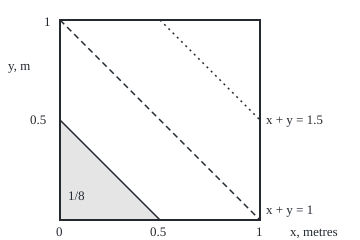
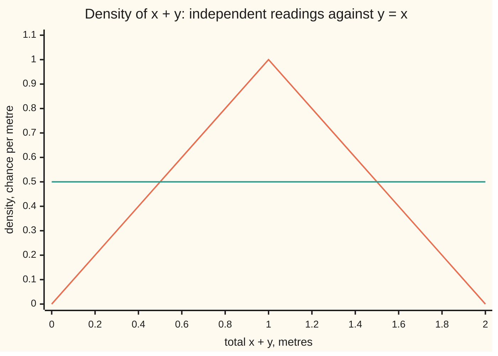

# Convolution: the law of a sum of independent quantities, and why densities convolve

Measure and integration → Product Measures and Fubini → Sums of independent laws → Convolution

---

## General Overview

A dart lands on a square board 1 metre by 1 metre, at a point chosen uniformly: every patch of the board is hit with chance equal to its area. Call its distance from the left edge x and its distance from the bottom edge y, both in metres. The two readings are independent: knowing x says nothing about y.

Add them. The total x + y runs from 0 to 2. How likely is a total under half a metre? Both readings would have to be small at once. On the board that is the corner triangle below the line x + y = 0.5, with legs of 0.5 metres, so its area is 0.5 × 0.5 / 2 = 0.125. The chance is 1/8.

Area settles this one question. It gives no rule for readings that are not uniform, or that come in steps, like a ruler marked only in tenths. The chance that the total is near a value s collects every way of splitting s into an x part and a y part, and multiplies their chances, because the readings are independent. For the dart it gives a triangle: the total's density (chance per metre) rises straight from 0 at a total of 0 to 1 at a total of 1, then falls back to 0 at 2. That operation of combining two laws by adding over all splits is called **convolution**, the word used from here on.

The probability wing computes the convolution of two densities for bus and train legs ([sums-and-convolution](../../09-Probability%20and%20statistics/05-Transformations%20and%20Joint%20Laws/04-sums-and-convolution.md)). This card proves the measure version: it holds for any two laws, with densities, in steps, or a mix, and the density formula falls out of it by Tonelli's theorem.

**When two quantities are independent, the law of their sum is the product law of the pair carried through addition; that measure is the convolution of the two laws, and when both have densities its density is the integral of f(x) g(s − x) over x.**

**What kind of fact this is:** a theorem, proved on this card in Why it works; the convolution of two measures is a definition, and commutativity and associativity are proved with it.

### The picture: the board, and the event x + y < 0.5

<p align="center"></p>

Caption: to scale, 200 units to the metre. The shaded corner is every dart with x + y below 0.5; its area is 1/8 of the board. Each line x + y = s is one value of the total. The dashed diagonal, s = 1, is the longest line across the board, which is why the total's density peaks there. The dotted line is s = 1.5; the region above it is the mirror image of the shaded corner, so its chance is 1/8 too.

---

## The formula

Notation first, in words. $P$ is a probability measure on a space $\Omega$ of outcomes, here the dart throws. The law of a reading $X$, written $\mu_X$ and read "the law of X", gives each Borel set $B$ of values the chance that $X$ lands in it: $\mu_X(B)=P(X\in B)$ ([pushforward-and-the-law](../03-Measurable%20Functions/05-pushforward-and-the-law.md)). The product measure $\mu\otimes\nu$, read "mu times nu", is the measure on the plane that gives a rectangle the product of its two side measures ([product-measure](02-product-measure.md)). Writing $\nu(dy)$ under an integral means integrating in y against $\nu$, the same as $\int\cdots\,d\nu(y)$. Lebesgue measure $\lambda$ is length.

One new piece of notation. For a set $B$ of numbers and a number x, $B-x$ is $B$ slid left by x: every b − x with b in $B$. If $B$ is the totals below 0.5 and x = 0.2, then $B-x$ is the numbers below 0.3.

**Definition.** The convolution of two probability measures $\mu$ and $\nu$ on the line is the measure

$$(\mu*\nu)(B)\;=\;(\mu\otimes\nu)\big(\{(x,y):x+y\in B\}\big)\;=\;\int_{\mathbb R}\nu(B-x)\,\mu(dx),\qquad B\ \text{Borel}.$$

**Read it aloud:** the convolution gives a set of totals the product-law chance of all pairs that add up into it; equivalently, fix the first value x, ask the second to land in the set slid back by x, and average that chance over x.

**Theorem.** If $X$ and $Y$ are independent real readings with laws $\mu$ and $\nu$, and $S=X+Y$, then

$$\mu_S\;=\;\mu*\nu .$$

**Read it aloud:** the law of an independent sum is the convolution of the two laws, whatever those laws are.

**Densities.** If $\mu$ has density $f$ and $\nu$ has density $g$ against $\lambda$ (that is, $\mu(B)=\int_B f\,d\lambda$), then $\mu*\nu$ has density

$$h(s)\;=\;(f*g)(s)\;=\;\int_{\mathbb R} f(x)\,g(s-x)\,\lambda(dx).$$

**Read it aloud:** the density of the total at s adds, over every first value x, the density of x times the density of the remainder s − x.

**Steps.** If $\mu$ and $\nu$ sit on whole numbers with chances $p$ and $q$ (a law in steps), the same definition with counting measure in place of $\lambda$ gives

$$(p*q)(k)\;=\;\sum_a p(a)\,q(k-a).$$

**The algebra.** $\mu*\nu=\nu*\mu$, and $(\mu*\nu)*\rho=\mu*(\nu*\rho)$ for a third law $\rho$: the order and the grouping of independent summands do not matter.

On the dart, $\mu=\nu$ is length on [0, 1], $f=g=1$ on [0, 1] and 0 elsewhere, and $h(s)=s$ on [0, 1], $h(s)=2-s$ on [1, 2], 0 outside.

| Symbol | Plain meaning | In our example | Push it up and the answer… |
| --- | --- | --- | --- |
| $\Omega$, $P$ | the outcomes and the probability measure on them | dart throws; chance equals area | — |
| $X$, $Y$, $S$ | two independent readings and their sum | x and y in metres; S = x + y | — |
| $x$, $y$, $s$, $a$, $b$, $k$ | values of the first reading, the second, the total; whole-number values in the step case | x = 0.2, s = 0.5; tenths of a metre | — |
| $\mu$, $\nu$, $\rho$ | laws of the summands: measures on the line with total 1 | length on [0, 1], twice | a wider law widens the total |
| $\mu_X$, $\mu_S$ | the law of a reading, $B$ ↦ $P(X\in B)$ | $\mu_S$ = the triangle law | — |
| $\mu\otimes\nu$ | product measure: rectangle gets the product of its sides | area on the board | — |
| $\mu*\nu$ | the convolution: product measure of the pairs whose sum lands in $B$ | the triangle law on [0, 2] | — |
| $B$, $B-x$ | a Borel set of totals; the same set slid left by x | totals below 0.5; below 0.3 when x = 0.2 | a bigger $B$ gets more chance |
| $f$, $g$, $\lambda$ | densities of $\mu$ and $\nu$ against $\lambda$, Lebesgue measure (length) | 1 on [0, 1], 0 elsewhere | — |
| $h$ | density of the total, $f*g$ | $h(0.5)=0.5$, peak $h(1)=1$ | — |
| $A$, $T$, $E$, $U$, $N$, $\varphi$ | in the Detailed proof: addition as a map of the plane; the coordinate swap; a Borel set; an open set; the totals where h is infinite; a non-negative test function | A(x, y) = x + y | — |
| $p$, $q$ | chances of a law in steps | tenths ruler 0.1 each; fifths ruler 0.2 each | — |
| $F$ | the distribution function (CDF) of one reading, F(t) = P(x ≤ t); in Detailed proof 8, a second Borel set beside $E$ | F(0.5) = 0.5 | a larger t, a larger F(t) |

### When it holds

- **Independence.** The joint law must be the product $\mu\otimes\nu$. With y = 1 − x both readings are still uniform on [0, 1], but the total is always 1: the chance of a total below 0.5 is 0, not 1/8.
- **Measurable readings.** $X$ and $Y$ must be measurable, so that their laws exist; addition then keeps $S$ measurable.
- **Values on the line.** The proof uses only that addition is measurable and that length does not change when a set slides, so it works unchanged in the plane or on a circle.
- **Densities, only for the density formula.** The theorem for laws needs no density. The formula for $h$ needs both, or at least one: if only $\mu$ has a density $f$, the total still has density $\int f(s-y)\,\nu(dy)$.
- **No integrability condition.** Every integrand here is non-negative, so Tonelli's theorem applies with no finiteness check. The density $h$ may be infinite at some totals, but only on a set of length zero.

---

## Why it works

### Step 0: a sum is a function of the pair, and independence fixes the pair's law

The total is the pair (X, Y) sent through one fixed map, addition. So the chance that the total lands in $B$ is the chance that the pair lands in the region of the plane where x + y is in $B$. That is a question about the pair's joint law, and independence says the joint law is $\mu\otimes\nu$ ([independence-as-a-product-measure](04-independence-as-a-product-measure.md)). A product measure of a region is computed slice by slice, which is Tonelli's theorem ([tonelli-and-fubini](03-tonelli-and-fubini.md)). Slicing the region at a fixed x leaves the slid set $B-x$. The density formula is the same slicing done inside an integral.

### Step 1: the region "x + y in B" is one the product measure can measure

Addition, (x, y) ↦ x + y, is continuous on the plane. The preimage of an open set under a continuous map is open, so the preimage of every Borel set is a Borel set of the plane ([measurable-functions](../03-Measurable%20Functions/01-measurable-functions.md)). The Borel sets of the plane are exactly the product sigma-algebra of the Borel sets of the line ([product-sigma-algebras](01-product-sigma-algebras.md)). So the region is in the collection of sets $\mu\otimes\nu$ measures, and $S$ is a measurable reading.

### Step 2: the law of the sum is the product law of that region

For a Borel set $B$ of totals, $S$ lands in $B$ exactly when the pair lands in the region $\{(x,y):x+y\in B\}$. So $P(S\in B)$ is the joint law of that region. By independence, the joint law is $\mu\otimes\nu$. That gives the first form of the definition: $\mu_S(B)=(\mu\otimes\nu)(\{x+y\in B\})$.

### Step 3: slice the region at each x

Tonelli's theorem computes the product measure of a region as an iterated integral: measure the slice at each x with $\nu$, then integrate over x with $\mu$. The slice at x is the set of y with x + y in $B$, which is $B-x$. So $\mu_S(B)=\int\nu(B-x)\,\mu(dx)$, the second form.

On the dart, with $B$ the totals below 0.5: the slice at x is the y below 0.5 − x, which has length 0.5 − x for x below 0.5 and is empty after. Integrating, $\int_0^{0.5}(0.5-x)\,dx=0.125$. That is the corner area again, now as a sum of slice lengths.

### Step 4: when both laws have densities, the slices become the density formula

Write $\nu(B-x)$ with the density $g$: it is $\int\mathbf 1_B(x+y)\,g(y)\,dy$, where $\mathbf 1_B$ is one on $B$ and zero off it. Substitute s = x + y. Length does not change when a set slides ([translation-invariance-and-the-vitali-set](../02-Length%20Done%20Properly/04-translation-invariance-and-the-vitali-set.md)), so this is $\int\mathbf 1_B(s)\,g(s-x)\,ds$. Put it into Step 3 and use Tonelli once more to integrate over x first:

$$\mu_S(B)=\int\!\!\int \mathbf 1_B(s)\,f(x)\,g(s-x)\,ds\,dx=\int_B\Big(\int f(x)\,g(s-x)\,dx\Big)ds=\int_B h(s)\,ds.$$

So $h$ is a density of the total. Nothing here needed the integrals to be finite: the integrand is non-negative, which is all Tonelli asks.

For the dart, f(x) g(s − x) is 1 exactly when x is in [0, 1] and s − x is in [0, 1], that is, x in [s − 1, s] as well. The inner integral is the length of the overlap of [0, 1] and [s − 1, s]: s for s in [0, 1], 2 − s for s in [1, 2]. That is the triangle: the density is proportional to the length of the line x + y = s across the board.

### Step 5: laws in steps, and a mix of the two

With counting measure in place of length, integrals become sums and Step 4 reads $(p*q)(k)=\sum_a p(a)q(k-a)$. Read x off a ruler marked in tenths and y off a ruler marked in fifths, both in tenths of a metre: p puts 0.1 on each of 0, 1, …, 9, and q puts 0.2 on each of 0, 2, 4, 6, 8. Their convolution, in chances times 50, is 1, 1, 2, 2, 3, 3, 4, 4, 5, 5, 4, 4, 3, 3, 2, 2, 1, 1 on totals 0 to 17 tenths. The same numbers come from listing all 50 pairs and adding their chances, which is the product-measure form of the definition.

The theorem covers a mix too. Keep x exact, uniform on [0, 1], and read y off the fifths ruler. Step 3 with $\nu$ the fifths law gives $P(S<0.5)=\sum_b 0.2\times\lambda([0,0.5-b))$, over the marks b = 0, 0.2 and 0.4 that leave room: 0.2 × (0.5 + 0.3 + 0.1) = 0.18. The two-density formula $f*g$ does not apply, since $\nu$ has no density; the one-density form does, and the measure version needs none.

### Step 6: order and grouping do not matter

Swapping the coordinates, (x, y) ↦ (y, x), carries $\mu\otimes\nu$ to $\nu\otimes\mu$, because it carries each rectangle to its mirror image with the same product of sides, and a measure is fixed by its rectangles ([pi-systems-and-uniqueness](../01-Sets%20You%20Can%20Measure/06-pi-systems-and-uniqueness.md)). The swap does not change x + y. So $\mu*\nu=\nu*\mu$. For grouping, take three independent readings with laws $\mu$, $\nu$, $\rho$. (X + Y) + Z and X + (Y + Z) are the same reading. Applying the theorem to the first grouping gives $(\mu*\nu)*\rho$, and to the second $\mu*(\nu*\rho)$, so they are equal. The tenths and fifths rulers confirm both in exact fractions.

<details>
<summary>Detailed proof</summary>

**Setting.** $(\Omega,\mathcal F,P)$ is a probability space. $X,Y:\Omega\to\mathbb R$ are measurable with respect to $\mathcal F$ and the Borel sets $\mathcal B(\mathbb R)$, with laws $\mu$ and $\nu$, and they are independent. $A:\mathbb R^2\to\mathbb R$ is addition, $A(x,y)=x+y$.

**1. The sum is measurable.** $A$ is continuous, so $A^{-1}(U)$ is open for open $U$. The sets $E$ with $A^{-1}(E)$ Borel form a sigma-algebra containing the open sets, hence all of $\mathcal B(\mathbb R)$ ([measurable-functions](../03-Measurable%20Functions/01-measurable-functions.md)). And $\mathcal B(\mathbb R^2)=\mathcal B(\mathbb R)\otimes\mathcal B(\mathbb R)$ ([product-sigma-algebras](01-product-sigma-algebras.md)). The pair map $\omega\mapsto(X(\omega),Y(\omega))$ is measurable into the product sigma-algebra because both coordinates are. So $S=A\circ(X,Y)$ is measurable, a composition of measurable maps.

**2. The law of S.** For $B\in\mathcal B(\mathbb R)$, $\{S\in B\}=\{(X,Y)\in A^{-1}(B)\}$. So $\mu_S(B)=\mu_{(X,Y)}(A^{-1}(B))$. Independence means $\mu_{(X,Y)}=\mu\otimes\nu$ on $\mathcal B(\mathbb R)\otimes\mathcal B(\mathbb R)$ ([independence-as-a-product-measure](04-independence-as-a-product-measure.md)). Hence $\mu_S(B)=(\mu\otimes\nu)(A^{-1}(B))=(\mu*\nu)(B)$, by the first form of the definition. This proves the theorem.

**3. The two forms of the definition agree.** The function $(x,y)\mapsto\mathbf 1_B(x+y)=\mathbf 1_{A^{-1}(B)}(x,y)$ is non-negative and product-measurable by 1. Tonelli's theorem for the finite measures $\mu,\nu$ ([tonelli-and-fubini](03-tonelli-and-fubini.md)) gives $(\mu\otimes\nu)(A^{-1}(B))=\int\big(\int\mathbf 1_B(x+y)\,\nu(dy)\big)\mu(dx)$, and the inner integral is $\nu(\{y:x+y\in B\})=\nu(B-x)$. Tonelli also says $x\mapsto\nu(B-x)$ is measurable, so the outer integral is defined.

**4. It is a probability measure.** $\mu*\nu$ is the pushforward of the probability measure $\mu\otimes\nu$ under the measurable map $A$, and a pushforward of a measure is a measure with the same total ([pushforward-and-the-law](../03-Measurable%20Functions/05-pushforward-and-the-law.md)). Its total is $(\mu\otimes\nu)(\mathbb R^2)=1$.

**5. The density.** Suppose $\mu(E)=\int_E f\,d\lambda$ and $\nu(E)=\int_E g\,d\lambda$ with $f,g\ge0$ Borel. Then integrating against $\nu$ is integrating against $g\,d\lambda$ (true for indicators by definition, for simple functions by linearity, for non-negative measurable functions by monotone convergence; [monotone-convergence-theorem](../04-The%20Lebesgue%20Integral/03-monotone-convergence-theorem.md)), and likewise for $\mu$. So $\nu(B-x)=\int\mathbf 1_B(x+y)g(y)\,\lambda(dy)$. Lebesgue measure is translation invariant, so $\int\varphi(x+y)\,\lambda(dy)=\int\varphi(s)\,\lambda(ds)$ for non-negative Borel $\varphi$ (for indicators this is $\lambda(E-x)=\lambda(E)$; then simple functions and monotone limits as before). With $\varphi(s)=\mathbf 1_B(s)g(s-x)$: $\nu(B-x)=\int\mathbf 1_B(s)g(s-x)\,\lambda(ds)$. The map $(x,s)\mapsto f(x)g(s-x)\mathbf 1_B(s)$ is non-negative and Borel on the plane, because $(x,s)\mapsto s-x$ is continuous and products of Borel functions are Borel. Step 3 and Tonelli for $\lambda\otimes\lambda$ (both sigma-finite) give
$$(\mu*\nu)(B)=\int f(x)\Big(\int\mathbf 1_B(s)g(s-x)\,\lambda(ds)\Big)\lambda(dx)=\int_B\Big(\int f(x)g(s-x)\,\lambda(dx)\Big)\lambda(ds)=\int_B h\,d\lambda.$$
Tonelli also makes $h$ Borel, with values in [0, ∞].

**6. h is finite almost everywhere.** Take $B=\mathbb R$: $\int h\,d\lambda=1$. Let $N=\{h=\infty\}$. For every whole number m, $m\mathbf 1_N\le h$, so $m\,\lambda(N)\le1$, and $\lambda(N)=0$. Setting $h=0$ on $N$ changes no integral ([null-sets-and-almost-everywhere](../01-Sets%20You%20Can%20Measure/07-null-sets-and-almost-everywhere.md)). The exception is real: with $f(x)=1/(2\sqrt x)$ on (0, 1) and $g(y)=1/(2\sqrt{-y})$ on (−1, 0), the integrand at s = 0 is $1/(4x)$ on (0, 1), whose integral is infinite.

**7. One density is enough.** If only $\mu$ has a density $f$, use the commuted form $\mu*\nu=\nu*\mu$ (proved in 8) and slice the other way: $(\mu*\nu)(B)=\int\mu(B-y)\,\nu(dy)=\int\!\int\mathbf 1_B(s)f(s-y)\,\lambda(ds)\,\nu(dy)=\int_B\big(\int f(s-y)\,\nu(dy)\big)\lambda(ds)$, by the same translation step and Tonelli for $\lambda\otimes\nu$.

**8. Commutativity.** Let $T(x,y)=(y,x)$. For a rectangle, $(\mu\otimes\nu)(T^{-1}(E\times F))=(\mu\otimes\nu)(F\times E)=\mu(F)\nu(E)=(\nu\otimes\mu)(E\times F)$. Rectangles are closed under intersection and generate the product sigma-algebra, and both measures are finite with equal totals, so the pushforward of $\mu\otimes\nu$ under $T$ is $\nu\otimes\mu$ ([pi-systems-and-uniqueness](../01-Sets%20You%20Can%20Measure/06-pi-systems-and-uniqueness.md)). Since $A\circ T=A$, $(\nu*\mu)(B)=(\nu\otimes\mu)(A^{-1}B)=(\mu\otimes\nu)(T^{-1}A^{-1}B)=(\mu\otimes\nu)((A\circ T)^{-1}B)=(\mu*\nu)(B)$.

**9. Associativity.** On the product space $\mathbb R^3$ with $\mu\otimes\nu\otimes\rho$ (built as $(\mu\otimes\nu)\otimes\rho$, and equal to $\mu\otimes(\nu\otimes\rho)$ because both give a box the product of its three sides, with 8's uniqueness argument), the coordinates X, Y, Z are independent with laws $\mu,\nu,\rho$. The pair (X + Y, Z) is independent with laws $\mu*\nu$ and $\rho$: X + Y is a measurable function of (X, Y), and independent blocks stay independent after measurable functions. By the theorem, X + Y + Z has law $(\mu*\nu)*\rho$. Grouping as X + (Y + Z) gives $\mu*(\nu*\rho)$. They are the laws of the same reading, so they are equal. ∎

</details>

Alternative route: the characteristic function, the Fourier transform of a law, turns convolution into multiplication; [characteristic-functions](../10-The%20Limit%20Theorems%2C%20Proved/06-characteristic-functions.md) takes that road.

---

## Worked numbers, by hand

| Step | Arithmetic | Value |
| --- | --- | --- |
| slice at x, for x below 0.5 | length of the y below 0.5 − x | 0.5 − x |
| integrate the slices | 0.5 × 0.5 − 0.5^2 / 2 | 0.125 |
| density at s = 0.5 | overlap of [0, 1] and [−0.5, 0.5] | 0.5 |
| area under the density to 0.5 | 0.5 × 0.5 × 0.5 | 0.125 |
| corner of the board | 0.5 × 0.5 / 2 | 0.125 |
| peak density | overlap of [0, 1] and [0, 1] at s = 1 | 1 |
| P(S ≤ 1), P(S > 1.5), the middle | 1/2 by symmetry; 1/8 by the mirror corner; 1 − 1/8 − 1/8 | 1/2, 1/8, 3/4 |
| 10 × 10 grid, darts read at cell midpoints | pairs of cells with a + b ≤ 3: 1 + 2 + 3 + 4 = 10, out of 100 | 0.10 |
| x exact, y on the fifths ruler | 0.2 × (0.5 + 0.3 + 0.1) | 0.18 |
| **P(x + y < 0.5)** | | **1/8 = 0.125** |

One dart in eight lands with its two readings adding to less than half a metre. The grid undercounts because it reads each dart at its cell's centre: the gap is 1/(4n) for an n by n grid with n even, 0.025 at n = 10 and 0.00025 at n = 1000.

### What breaks if you drop a piece

| Mistake | Comes out at | What went wrong |
| --- | --- | --- |
| Tie the readings: y = 1 − x | 0 in the simulation, not 0.125 | both laws still uniform, but the pair is not the product law; the total is always 1 |
| Tie the readings: y = x | 0.2495 simulated, exact 0.25 | the total is 2x, flat at density 0.5 on [0, 2]: same margins, different sum |
| Multiply the two CDFs (distribution functions, F(t) = P(x ≤ t)): F(0.5) × F(0.5) | 1/4, simulated 0.2510 | that is the chance both readings are below 0.5, the law of the larger one, not of the sum |
| Read the peak density as a chance | h(1) = 1 | a density is chance per metre; the chance of a total of exactly 1 is 0 |



Caption: orange is the independent dart, the triangle $h$; green is y = x, whose total 2x is flat at 0.5. Both readings are uniform on [0, 1] in each case. Only the joint law differs, and the sum's law follows it.

---

## Code, from first principles, and it actually runs

Four independent roads lead to P(S < 0.5) = 1/8: the triangle density integrated exactly, piece by straight piece; the shoelace area of the shaded corner in the figure; grids of 10, 100 and 1,000 cells a side, whose discrete laws are convolved in whole numbers, with the gap checked against 1/(4n); and 200,000 darts from a SplitMix64 generator written out in both languages. The code also computes the convolution integral by a midpoint sum, convolves the two rulers by the slide formula and by listing pairs, tests commutativity and associativity exactly, and prints every row of What breaks.

The code checks one pair of laws, a few grids and a finite sample. That the law of every independent sum is the convolution, for every pair of laws, is what only the Detailed proof shows.

### Python

```python
# Convolution and sums -- the check behind the card.  Standard library only.
# The dart: x and y independent, each uniform on [0, 1] metres; S = x + y.
# Roads to P(S < 0.5) = 1/8: the triangle density integrated exactly, the
# corner area of the square, grids of cells convolved exactly, and simulated
# darts.  Then the numerical convolution of the two densities, two discrete
# rulers, a continuous plus a discrete reading, the algebra, and what breaks.
from fractions import Fraction as Fr
from math import sqrt

def h_exact(s):                                   # the triangle: s on [0, 1], 2 - s on [1, 2]
    return max(Fr(0), 1 - abs(s - 1))

def trapezoid(f, a, b, pieces):                   # exact when f is a straight line on each piece
    w = (b - a) / pieces
    return sum((f(a + i * w) + f(a + (i + 1) * w)) * w / 2 for i in range(pieces))

def shoelace(pts):                                # area of a polygon from its corners
    n = len(pts)
    return abs(sum(pts[i][0] * pts[(i + 1) % n][1] - pts[(i + 1) % n][0] * pts[i][1] for i in range(n))) / 2

def slide(p, q):                                  # (p * q)(k) = sum over a of p(a) q(k - a)
    ks = range(min(p) + min(q), max(p) + max(q) + 1)
    return {k: sum(p[a] * q.get(k - a, 0) for a in p) for k in ks}

def push(p, q):                                   # law of a + b under the product law: add over pairs
    out = {}
    for a in p:
        for b in q:
            out[a + b] = out.get(a + b, 0) + p[a] * q[b]
    return out

def splitmix(seed):                               # SplitMix64: uniform draws in [0, 1)
    s, M = seed, (1 << 64) - 1
    while True:
        s = (s + 0x9E3779B97F4A7C15) & M
        z = ((s ^ (s >> 30)) * 0xBF58476D1CE4E5B9) & M
        z = ((z ^ (z >> 27)) * 0x94D049BB133111EB) & M
        yield ((z ^ (z >> 31)) >> 11) / 2 ** 53

def fmt(v):
    return ", ".join(f"{float(x):.2f}" for x in v)

# road 1 and road 2: the triangle density against the corner of the square
half = Fr(1, 2)
r1 = trapezoid(h_exact, Fr(0), half, 5)
r2 = shoelace([(Fr(0), Fr(0)), (half, Fr(0)), (Fr(0), half)])
print(f"P(S < 0.5): integral of the triangle density = {r1}; corner area of the square = {r2}")
assert r1 == r2
lo, hi = trapezoid(h_exact, Fr(0), Fr(1), 4), trapezoid(h_exact, Fr(3, 2), Fr(2), 5)
tot = trapezoid(h_exact, Fr(0), Fr(2), 8)
print(f"P(S <= 1) = {lo}; P(S > 1.5) = {hi}; P(0.5 <= S <= 1.5) = {1 - r1 - hi}; total {tot}; peak h(1) = {h_exact(Fr(1))}")
assert tot == 1

# road 3: cut the board into n x n cells, read each dart at its cell's midpoint,
# and convolve the two discrete cell laws exactly
for n in (10, 100, 1000):
    cells = {a: 1 for a in range(n)}              # counts; each cell has chance 1/n
    c = slide(cells, cells)
    hits = sum(v for k, v in c.items() if 2 * (k + 1) < n)   # (a + b + 1)/n < 1/2
    gap = Fr(1, 8) - Fr(hits, n * n)
    print(f"grid of {n} x {n} cells: P(S < 0.5) = {hits}/{n * n} = {hits / n ** 2:.5f}; gap to 1/8 = {float(gap):.5f}")
    assert gap == Fr(1, 4 * n)
    if n == 10:
        dens = [Fr(c[k], n) for k in range(2 * n - 1)]      # chance c/n^2 spread over width 1/n
        print(f"tenths grid, density at s = 0.1, 0.2, ..., 1.9: {fmt(dens)}")
        assert all(dens[k] == h_exact(Fr(k + 1, n)) for k in range(2 * n - 1))

# the convolution integral itself, by a midpoint sum, f = g = 1 on [0, 1)
m = 1000
def h_num(s):
    return sum(1 for i in range(m) if 0 <= s - (i + 0.5) / m < 1) / m
hn = [h_num(j / 5) for j in range(11)]
print(f"midpoint convolution, m = {m}, at s = 0, 0.2, ..., 2: {', '.join(f'{v:.4f}' for v in hn)}")
assert all(abs(v - float(h_exact(Fr(j, 5)))) <= 1 / m for j, v in enumerate(hn))
print(f"chart, independent: {fmt(h_exact(Fr(j, 5)) for j in range(11))}")
print(f"chart, y = x: {fmt(half * (0 <= Fr(j, 10) <= 1) for j in range(11))}")

# two discrete laws: x read in tenths, y read in fifths (units: tenths of a metre)
p = {a: Fr(1, 10) for a in range(10)}
q = {b: Fr(1, 5) for b in range(0, 10, 2)}
pq = slide(p, q)
print(f"tenths + fifths, chance x 50 at 0, 1, ..., 17 tenths: {', '.join(str(v * 50) for v in pq.values())}")
assert pq == push(p, q)
assert pq == slide(q, p)
assert slide(slide(p, q), p) == slide(p, slide(q, p))
print("slide formula = sum over pairs: yes; p * q = q * p: yes; (p * q) * p = p * (q * p): yes")

# a continuous law plus a discrete one: x uniform, y in fifths
mixed = sum(q[b] * min(max(half - Fr(b, 10), 0), 1) for b in q)
print(f"x uniform + y in fifths: P(S < 0.5) = 0.2 x (0.5 + 0.3 + 0.1) = {mixed} = {float(mixed):.2f}")

# road 4: simulated darts; and what breaks when x and y are tied together
N, g = 200000, splitmix(20260929)
ind = same = anti = mix = mx = 0
for _ in range(N):
    x, y = next(g), next(g)
    ind += x + y < 0.5
    same += x + x < 0.5
    anti += x + (1 - x) < 0.5
    mix += 10 * x < 5 - 2 * int(5 * y)
    mx += max(x, y) < 0.5
se = sqrt(0.125 * 0.875 / N)
print(f"{N} simulated darts, seed 20260929: P(S < 0.5) = {ind / N:.4f} (1/8 = 0.1250, standard error {se:.4f})")
assert abs(ind / N - 0.125) < 4 * se
print(f"simulated, x uniform + y in fifths: {mix / N:.4f} (exact 0.18)")
assert abs(mix / N - float(mixed)) < 4 * sqrt(0.18 * 0.82 / N)
print(f"breaks, y = 1 - x: {anti / N:.4f} (the sum is always 1)")
print(f"breaks, y = x: {same / N:.4f} (exact 0.25)")
assert abs(same / N - 0.25) < 4 * sqrt(0.25 * 0.75 / N)
print(f"breaks, product of CDFs F(0.5) x F(0.5) = {half * half} is P(max < 0.5), simulated {mx / N:.4f}")

# the picture: metre (x, y) -> SVG (60 + 200x, 220 - 200y)
def pt(x, y):
    return f"{int(60 + 200 * x)},{int(220 - 200 * y)}"
print(f"figure, square {pt(0, 1)} to {pt(1, 0)}; corner x + y < 0.5: {pt(0, 0)} {pt(half, 0)} {pt(0, half)};"
      f" x + y = 1: {pt(0, 1)} {pt(1, 0)}; x + y = 1.5: {pt(half, 1)} {pt(1, half)}")
print("ALL CHECKS PASS")
```

**Ran 2026-10-06 on macOS, Python 3.14.6, standard library only. All checks passed. Output, pasted from the run:**

```
P(S < 0.5): integral of the triangle density = 1/8; corner area of the square = 1/8
P(S <= 1) = 1/2; P(S > 1.5) = 1/8; P(0.5 <= S <= 1.5) = 3/4; total 1; peak h(1) = 1
grid of 10 x 10 cells: P(S < 0.5) = 10/100 = 0.10000; gap to 1/8 = 0.02500
tenths grid, density at s = 0.1, 0.2, ..., 1.9: 0.10, 0.20, 0.30, 0.40, 0.50, 0.60, 0.70, 0.80, 0.90, 1.00, 0.90, 0.80, 0.70, 0.60, 0.50, 0.40, 0.30, 0.20, 0.10
grid of 100 x 100 cells: P(S < 0.5) = 1225/10000 = 0.12250; gap to 1/8 = 0.00250
grid of 1000 x 1000 cells: P(S < 0.5) = 124750/1000000 = 0.12475; gap to 1/8 = 0.00025
midpoint convolution, m = 1000, at s = 0, 0.2, ..., 2: 0.0000, 0.2000, 0.4000, 0.6000, 0.8000, 1.0000, 0.8000, 0.6000, 0.4000, 0.2000, 0.0000
chart, independent: 0.00, 0.20, 0.40, 0.60, 0.80, 1.00, 0.80, 0.60, 0.40, 0.20, 0.00
chart, y = x: 0.50, 0.50, 0.50, 0.50, 0.50, 0.50, 0.50, 0.50, 0.50, 0.50, 0.50
tenths + fifths, chance x 50 at 0, 1, ..., 17 tenths: 1, 1, 2, 2, 3, 3, 4, 4, 5, 5, 4, 4, 3, 3, 2, 2, 1, 1
slide formula = sum over pairs: yes; p * q = q * p: yes; (p * q) * p = p * (q * p): yes
x uniform + y in fifths: P(S < 0.5) = 0.2 x (0.5 + 0.3 + 0.1) = 9/50 = 0.18
200000 simulated darts, seed 20260929: P(S < 0.5) = 0.1255 (1/8 = 0.1250, standard error 0.0007)
simulated, x uniform + y in fifths: 0.1803 (exact 0.18)
breaks, y = 1 - x: 0.0000 (the sum is always 1)
breaks, y = x: 0.2495 (exact 0.25)
breaks, product of CDFs F(0.5) x F(0.5) = 1/4 is P(max < 0.5), simulated 0.2510
figure, square 60,20 to 260,220; corner x + y < 0.5: 60,220 160,220 60,120; x + y = 1: 60,20 260,220; x + y = 1.5: 160,20 260,120
ALL CHECKS PASS
```

### Rust

Same rows, same labels, built with `rustc --edition 2021 -O`. The two outputs are identical.

```rust
// Convolution and sums -- the same check as the Python, in Rust.  No crates.
// The dart: x and y independent, each uniform on [0, 1] metres; S = x + y.
// Roads to P(S < 0.5) = 1/8: the triangle density integrated exactly, the
// corner area of the square, grids of cells convolved exactly, and simulated
// darts.  Then the numerical convolution of the two densities, two discrete
// rulers, a continuous plus a discrete reading, the algebra, and what breaks.
use std::collections::BTreeMap;
use std::ops::{Add, Div, Mul, Sub};

#[derive(Clone, Copy, PartialEq, Eq, Debug)]
struct Fr { n: i128, d: i128 }
fn gcd(a: i128, b: i128) -> i128 { if b == 0 { a.abs() } else { gcd(b, a % b) } }
fn fr(n: i128, d: i128) -> Fr {
    let g = gcd(n, d).max(1);
    let s = if d < 0 { -1 } else { 1 };
    Fr { n: s * n / g, d: s * d / g }
}
impl Add for Fr { type Output = Fr; fn add(self, o: Fr) -> Fr { fr(self.n * o.d + o.n * self.d, self.d * o.d) } }
impl Sub for Fr { type Output = Fr; fn sub(self, o: Fr) -> Fr { fr(self.n * o.d - o.n * self.d, self.d * o.d) } }
impl Mul for Fr { type Output = Fr; fn mul(self, o: Fr) -> Fr { fr(self.n * o.n, self.d * o.d) } }
impl Div for Fr { type Output = Fr; fn div(self, o: Fr) -> Fr { fr(self.n * o.d, self.d * o.n) } }
impl PartialOrd for Fr { fn partial_cmp(&self, o: &Fr) -> Option<std::cmp::Ordering> { (self.n * o.d).partial_cmp(&(o.n * self.d)) } }
impl std::fmt::Display for Fr {
    fn fmt(&self, f: &mut std::fmt::Formatter) -> std::fmt::Result {
        if self.d == 1 { write!(f, "{}", self.n) } else { write!(f, "{}/{}", self.n, self.d) }
    }
}
impl Fr { fn f(self) -> f64 { self.n as f64 / self.d as f64 } }
fn maxf(a: Fr, b: Fr) -> Fr { if a < b { b } else { a } }
fn minf(a: Fr, b: Fr) -> Fr { if a < b { a } else { b } } // exact fractions by hand, on i128

type Law = BTreeMap<i64, Fr>;
fn z(n: i128) -> Fr { fr(n, 1) }

fn h_exact(s: Fr) -> Fr {
    // the triangle: s on [0, 1], 2 - s on [1, 2]
    let dist = if s < z(1) { z(1) - s } else { s - z(1) };
    maxf(z(0), z(1) - dist)
}

fn trapezoid(f: fn(Fr) -> Fr, a: Fr, b: Fr, pieces: i128) -> Fr {
    // exact when f is a straight line on each piece
    let w = (b - a) / z(pieces);
    (0..pieces).fold(z(0), |acc, i| acc + (f(a + z(i) * w) + f(a + z(i + 1) * w)) * w / z(2))
}

fn shoelace(pts: &[(Fr, Fr)]) -> Fr {
    // area of a polygon from its corners
    let n = pts.len();
    let s = (0..n).fold(z(0), |acc, i| acc + pts[i].0 * pts[(i + 1) % n].1 - pts[(i + 1) % n].0 * pts[i].1);
    (if s < z(0) { z(0) - s } else { s }) / z(2)
}

fn slide(p: &Law, q: &Law) -> Law {
    // (p * q)(k) = sum over a of p(a) q(k - a)
    let lo = p.keys().next().unwrap() + q.keys().next().unwrap();
    let hi = p.keys().last().unwrap() + q.keys().last().unwrap();
    (lo..=hi).map(|k| (k, p.iter().fold(z(0), |acc, (a, pa)| acc + *pa * *q.get(&(k - a)).unwrap_or(&z(0))))).collect()
}

fn push(p: &Law, q: &Law) -> Law {
    // law of a + b under the product law: add over pairs
    let mut out = Law::new();
    for (a, pa) in p {
        for (b, qb) in q {
            let e = out.entry(a + b).or_insert(z(0));
            *e = *e + *pa * *qb;
        }
    }
    out
}

struct SplitMix(u64);
impl SplitMix {
    fn next(&mut self) -> f64 {
        // SplitMix64: uniform draws in [0, 1)
        self.0 = self.0.wrapping_add(0x9E3779B97F4A7C15);
        let mut x = self.0;
        x = (x ^ (x >> 30)).wrapping_mul(0xBF58476D1CE4E5B9);
        x = (x ^ (x >> 27)).wrapping_mul(0x94D049BB133111EB);
        ((x ^ (x >> 31)) >> 11) as f64 / (1u64 << 53) as f64
    }
}

fn fmt(v: &[Fr]) -> String { v.iter().map(|x| format!("{:.2}", x.f())).collect::<Vec<_>>().join(", ") }

fn main() {
    // road 1 and road 2: the triangle density against the corner of the square
    let half = fr(1, 2);
    let r1 = trapezoid(h_exact, z(0), half, 5);
    let r2 = shoelace(&[(z(0), z(0)), (half, z(0)), (z(0), half)]);
    println!("P(S < 0.5): integral of the triangle density = {}; corner area of the square = {}", r1, r2);
    assert_eq!(r1, r2);
    let (lo, hi) = (trapezoid(h_exact, z(0), z(1), 4), trapezoid(h_exact, fr(3, 2), z(2), 5));
    let tot = trapezoid(h_exact, z(0), z(2), 8);
    println!("P(S <= 1) = {}; P(S > 1.5) = {}; P(0.5 <= S <= 1.5) = {}; total {}; peak h(1) = {}", lo, hi, z(1) - r1 - hi, tot, h_exact(z(1)));
    assert_eq!(tot, z(1));

    // road 3: cut the board into n x n cells, read each dart at its cell's midpoint,
    // and convolve the two discrete cell laws exactly
    for n in [10i64, 100, 1000] {
        let cells: Law = (0..n).map(|a| (a, z(1))).collect(); // counts; each cell has chance 1/n
        let c = slide(&cells, &cells);
        let hits = c.iter().filter(|(k, _)| 2 * (*k + 1) < n).fold(z(0), |acc, (_, v)| acc + *v); // (a + b + 1)/n < 1/2
        let nn = (n * n) as i128;
        let gap = fr(1, 8) - hits / z(nn);
        println!("grid of {} x {} cells: P(S < 0.5) = {}/{} = {:.5}; gap to 1/8 = {:.5}", n, n, hits, nn, hits.f() / nn as f64, gap.f());
        assert_eq!(gap, fr(1, 4 * n as i128));
        if n == 10 {
            let dens: Vec<Fr> = (0..2 * n - 1).map(|k| c[&k] / z(n as i128)).collect(); // chance c/n^2 over width 1/n
            println!("tenths grid, density at s = 0.1, 0.2, ..., 1.9: {}", fmt(&dens));
            assert!((0..2 * n - 1).all(|k| dens[k as usize] == h_exact(fr((k + 1) as i128, n as i128))));
        }
    }

    // the convolution integral itself, by a midpoint sum, f = g = 1 on [0, 1)
    let m = 1000;
    let h_num = |s: f64| (0..m).filter(|i| { let t = s - (*i as f64 + 0.5) / m as f64; 0.0 <= t && t < 1.0 }).count() as f64 / m as f64;
    let hn: Vec<f64> = (0..11).map(|j| h_num(j as f64 / 5.0)).collect();
    println!("midpoint convolution, m = {}, at s = 0, 0.2, ..., 2: {}", m, hn.iter().map(|v| format!("{:.4}", v)).collect::<Vec<_>>().join(", "));
    assert!(hn.iter().enumerate().all(|(j, v)| (v - h_exact(fr(j as i128, 5)).f()).abs() <= 1.0 / m as f64));
    let tri: Vec<Fr> = (0..11).map(|j| h_exact(fr(j, 5))).collect();
    println!("chart, independent: {}", fmt(&tri));
    let flat: Vec<Fr> = (0..11).map(|j| if z(0) <= fr(j, 10) && fr(j, 10) <= z(1) { half } else { z(0) }).collect();
    println!("chart, y = x: {}", fmt(&flat));

    // two discrete laws: x read in tenths, y read in fifths (units: tenths of a metre)
    let p: Law = (0..10).map(|a| (a, fr(1, 10))).collect();
    let q: Law = (0..10).step_by(2).map(|b| (b, fr(1, 5))).collect();
    let pq = slide(&p, &q);
    println!("tenths + fifths, chance x 50 at 0, 1, ..., 17 tenths: {}", pq.values().map(|v| (*v * z(50)).to_string()).collect::<Vec<_>>().join(", "));
    assert_eq!(pq, push(&p, &q));
    assert_eq!(pq, slide(&q, &p));
    assert_eq!(slide(&slide(&p, &q), &p), slide(&p, &slide(&q, &p)));
    println!("slide formula = sum over pairs: yes; p * q = q * p: yes; (p * q) * p = p * (q * p): yes");

    // a continuous law plus a discrete one: x uniform, y in fifths
    let mixed = q.iter().fold(z(0), |acc, (b, qb)| acc + *qb * minf(maxf(half - fr(*b as i128, 10), z(0)), z(1)));
    println!("x uniform + y in fifths: P(S < 0.5) = 0.2 x (0.5 + 0.3 + 0.1) = {} = {:.2}", mixed, mixed.f());

    // road 4: simulated darts; and what breaks when x and y are tied together
    let (n_darts, mut g) = (200000usize, SplitMix(20260929));
    let (mut ind, mut same, mut anti, mut mix, mut mx) = (0usize, 0usize, 0usize, 0usize, 0usize);
    for _ in 0..n_darts {
        let (x, y) = (g.next(), g.next());
        ind += (x + y < 0.5) as usize;
        same += (x + x < 0.5) as usize;
        anti += (x + (1.0 - x) < 0.5) as usize;
        mix += (10.0 * x < (5 - 2 * (5.0 * y) as i64) as f64) as usize;
        mx += (x.max(y) < 0.5) as usize;
    }
    let nf = n_darts as f64;
    let se = (0.125 * 0.875 / nf).sqrt();
    println!("{} simulated darts, seed 20260929: P(S < 0.5) = {:.4} (1/8 = 0.1250, standard error {:.4})", n_darts, ind as f64 / nf, se);
    assert!((ind as f64 / nf - 0.125).abs() < 4.0 * se);
    println!("simulated, x uniform + y in fifths: {:.4} (exact 0.18)", mix as f64 / nf);
    assert!((mix as f64 / nf - mixed.f()).abs() < 4.0 * (0.18 * 0.82 / nf).sqrt());
    println!("breaks, y = 1 - x: {:.4} (the sum is always 1)", anti as f64 / nf);
    println!("breaks, y = x: {:.4} (exact 0.25)", same as f64 / nf);
    assert!((same as f64 / nf - 0.25).abs() < 4.0 * (0.25 * 0.75 / nf).sqrt());
    println!("breaks, product of CDFs F(0.5) x F(0.5) = {} is P(max < 0.5), simulated {:.4}", half * half, mx as f64 / nf);

    // the picture: metre (x, y) -> SVG (60 + 200x, 220 - 200y)
    let pt = |x: Fr, y: Fr| format!("{},{}", (z(60) + z(200) * x).f() as i64, (z(220) - z(200) * y).f() as i64);
    println!("figure, square {} to {}; corner x + y < 0.5: {} {} {}; x + y = 1: {} {}; x + y = 1.5: {} {}",
        pt(z(0), z(1)), pt(z(1), z(0)), pt(z(0), z(0)), pt(half, z(0)), pt(z(0), half),
        pt(z(0), z(1)), pt(z(1), z(0)), pt(half, z(1)), pt(z(1), half));
    println!("ALL CHECKS PASS");
}
```

**Ran 2026-10-06 on macOS, rustc 1.98.1, no crates. All checks passed. Output, pasted from the run:**

```
P(S < 0.5): integral of the triangle density = 1/8; corner area of the square = 1/8
P(S <= 1) = 1/2; P(S > 1.5) = 1/8; P(0.5 <= S <= 1.5) = 3/4; total 1; peak h(1) = 1
grid of 10 x 10 cells: P(S < 0.5) = 10/100 = 0.10000; gap to 1/8 = 0.02500
tenths grid, density at s = 0.1, 0.2, ..., 1.9: 0.10, 0.20, 0.30, 0.40, 0.50, 0.60, 0.70, 0.80, 0.90, 1.00, 0.90, 0.80, 0.70, 0.60, 0.50, 0.40, 0.30, 0.20, 0.10
grid of 100 x 100 cells: P(S < 0.5) = 1225/10000 = 0.12250; gap to 1/8 = 0.00250
grid of 1000 x 1000 cells: P(S < 0.5) = 124750/1000000 = 0.12475; gap to 1/8 = 0.00025
midpoint convolution, m = 1000, at s = 0, 0.2, ..., 2: 0.0000, 0.2000, 0.4000, 0.6000, 0.8000, 1.0000, 0.8000, 0.6000, 0.4000, 0.2000, 0.0000
chart, independent: 0.00, 0.20, 0.40, 0.60, 0.80, 1.00, 0.80, 0.60, 0.40, 0.20, 0.00
chart, y = x: 0.50, 0.50, 0.50, 0.50, 0.50, 0.50, 0.50, 0.50, 0.50, 0.50, 0.50
tenths + fifths, chance x 50 at 0, 1, ..., 17 tenths: 1, 1, 2, 2, 3, 3, 4, 4, 5, 5, 4, 4, 3, 3, 2, 2, 1, 1
slide formula = sum over pairs: yes; p * q = q * p: yes; (p * q) * p = p * (q * p): yes
x uniform + y in fifths: P(S < 0.5) = 0.2 x (0.5 + 0.3 + 0.1) = 9/50 = 0.18
200000 simulated darts, seed 20260929: P(S < 0.5) = 0.1255 (1/8 = 0.1250, standard error 0.0007)
simulated, x uniform + y in fifths: 0.1803 (exact 0.18)
breaks, y = 1 - x: 0.0000 (the sum is always 1)
breaks, y = x: 0.2495 (exact 0.25)
breaks, product of CDFs F(0.5) x F(0.5) = 1/4 is P(max < 0.5), simulated 0.2510
figure, square 60,20 to 260,220; corner x + y < 0.5: 60,220 160,220 60,120; x + y = 1: 60,20 260,220; x + y = 1.5: 160,20 260,120
ALL CHECKS PASS
```

> [!TIP]
> **Try changing**
> - **Guess first:** in the simulation, replace `x + y < 0.5` by `x + (x + y) % 1 < 0.5`, pairing x with the fractional part of x + y. Answer: 0.1257, still 1/8 within the standard error. The fractional part of x + y is again uniform and independent of x, so the pair is again the product law, though the second reading is built from the first.
> - **Guess first:** change the grid sizes to `(10, 11, 1000)`. Answer: the 11 by 11 grid gives 15/121 = 0.12397, a gap of 0.00103 rather than 1/44, and the assert stops the run. With an odd count the line x + y = 0.5 no longer runs along the cell corners, and the gap formula 1/(4n) holds only for even n.
> - **Guess first:** throw 2,000 darts instead of 200,000. Answer: 0.1285 with standard error 0.0074, and the y = x row reads 0.2455. The estimates wander by about ten times as much, and every assert still passes because its tolerance grows with the standard error.

---

## The usual mistake

> [!warning]
> **Convolving the two laws without checking independence.** Convolution uses only the two separate laws, so it cannot see how the readings are tied together. y = 1 − x and y = x both leave each reading uniform on [0, 1], and the convolution still predicts 1/8 for a total below 0.5. The true chances are 0 and 0.25. The theorem's hypothesis is that the joint law is the product $\mu\otimes\nu$; two correct margins are not enough.
>
> - **Multiplying distribution functions.** F(0.5) × F(0.5) = 1/4 is the chance that both readings are below 0.5, which is the law of the larger reading. The sum needs the convolution, 1/8.
> - **Reading a density as a chance.** h(1) = 1 does not mean the total is 1 for certain. It is chance per metre; the chance of any single total is 0.
> - **Thinking a density is needed.** The fifths ruler has no density, and the theorem still gives the law of x plus that reading: P(S < 0.5) = 0.18.

---

## Where you meet it in real life

- **Measurement error.** A length measured in two independent stages carries the convolution of the two error laws. Uniform rounding errors from two rulers add to a triangle, which is why a total read from two rounded parts is more often near its true value than at the extremes.
- **Insurance and risk.** The total of independent claims, or of independent positions' gains and losses, has the convolution of their laws. Actuaries compute it by the step formula on a grid of amounts, the same calculation as the tenths and fifths rulers.
- **Images and signals.** A blur replaces each pixel by a weighted average of its neighbours: the image convolved with a blur kernel. Sharpening, smoothing and the other filters are convolutions too (convolution-and-youngs-inequality).
- **The central limit theorem.** The law of a sum of n independent readings is the n-fold convolution; its shape tends to the bell curve. The triangle is the second step from the flat uniform law on the way there.

> **Say it back**
> A sum of two readings is the pair of readings sent through addition. When the readings are independent, the pair's law is the product measure, so the sum's law is the product measure of the region where x + y lands in the set: that is the convolution. Slicing the region at each x with Tonelli's theorem gives the average of the slid chances, and with densities it gives the integral of f(x) g(s − x). For the dart the density is a triangle peaking at 1, and the chance of a total below half a metre is 1/8. The order and the grouping of independent summands do not matter, and none of it holds without independence.

---

## What this builds on

- [independence-as-a-product-measure](04-independence-as-a-product-measure.md): independence is the statement that the pair's law is the product measure, the hypothesis the whole proof runs on.
- [sums-and-convolution](../../09-Probability%20and%20statistics/05-Transformations%20and%20Joint%20Laws/04-sums-and-convolution.md): the density formula computed for two normal legs of a commute, before measure theory; this card proves it for any laws.

## Where this goes next

- convolution-and-mollifiers: convolving with a smooth narrow bump makes any integrable function smooth, and recovers it as the bump shrinks.
- convolution-and-youngs-inequality: convolution of functions that are not densities, and how its size is bounded by the sizes of the two ingredients.
- convolution-of-densities: the Fourier transform turns the convolution of two laws into a product of their transforms.

This card gives the law of a sum as an integral, but computing an n-fold convolution directly means n − 1 nested integrals; the Fourier transform on convolution-of-densities replaces them with one multiplication.

---

## Sources

Verified 2026-09-29: every link below resolves to the page for the book it names.

- Folland, Gerald B. *Real Analysis: Modern Techniques and Their Applications*, 2nd ed. Wiley, 1999. [Publisher page](https://www.wiley.com/en-us/Real+Analysis%3A+Modern+Techniques+and+Their+Applications%2C+2nd+Edition-p-9780471317166). Convolution of functions and of measures, with the Fubini-Tonelli argument for the density formula.
- Billingsley, Patrick. *Probability and Measure*, Anniversary Edition. Wiley, 2012. [Publisher page](https://www.wiley.com/en-us/Probability+and+Measure%2C+Anniversary+Edition-p-9781118122372). The law of a sum of independent random variables as the convolution of their distributions, proved from the product measure.
- Durrett, Rick. *Probability: Theory and Examples*, 5th ed. Cambridge University Press, 2019. [Author's page with the free edition](https://services.math.duke.edu/~rtd/PTE/pte.html). Product measures and Fubini's theorem in chapter 1, then independence and the distribution of sums in chapter 2.
