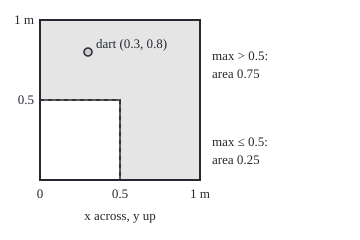
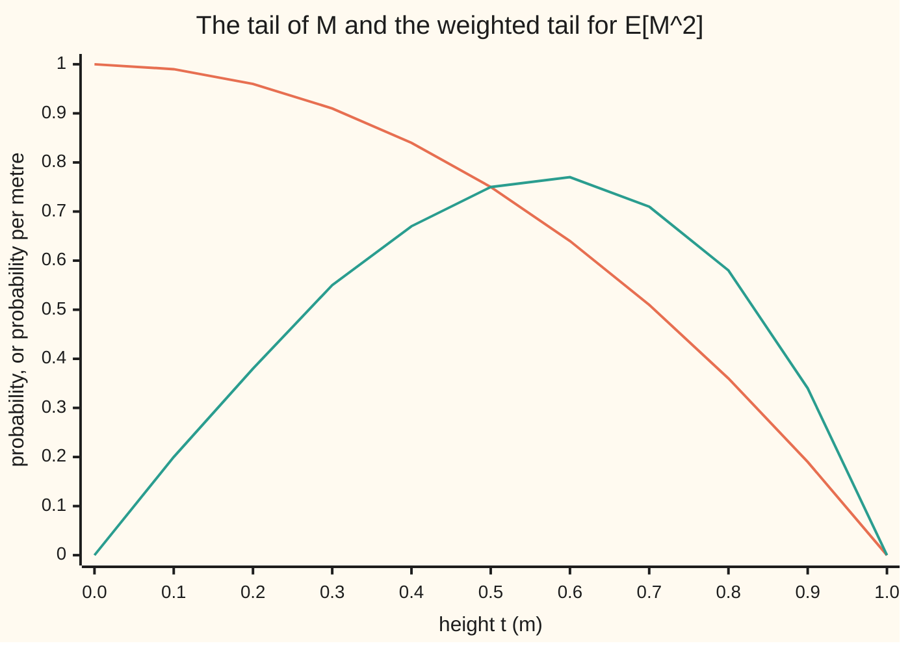

# The layer-cake formula: an integral is the area under the tail sizes, so averages become statements about probabilities

Measure and integration → Product Measures and Fubini → Averages from tails → The layer-cake formula

---

## General Overview

A dart lands uniformly at random on a square board 1 m on a side. Its position is two numbers, x across and y up, each between 0 and 1 m. Take the larger of the two numbers. How large is that larger coordinate on average?

The direct road averages it over the board, split along the diagonal: the larger coordinate is x on one half and y on the other. A second road asks, at every height t, for the chance that the larger coordinate exceeds t. At t = 0.5 m the dart must miss the lower-left quarter of the board, so the chance is 0.75. At general t it is 1 − t^2. Add those chances up over every height from 0 to 1, as an area under a curve, and the answer is 2/3 m. The direct road gives 2/3 m too.

This is not luck. A non-negative quantity is a stack of thin horizontal layers, one for each height it reaches, and each layer adds its thickness times the chance of reaching it. The picture is a layer cake: slice it horizontally instead of vertically and the volume is unchanged. The real tool behind the picture is Tonelli's theorem ([tonelli-and-fubini](03-tonelli-and-fubini.md)): a non-negative double integral can be done in either order.

**The integral of a non-negative function equals the integral, over every height t, of the size of the set where the function exceeds t; for a random quantity, its average is the area under its tail probabilities, and its p-th power's average is the same area with a weight p t^(p−1).**

**What kind of fact this is:** a theorem, proved on this card in Why it works, twice: once by Tonelli and once from simple functions.

### The picture: the tail set at height 0.5 m

<p align="center"></p>

To scale: 160 drawing units per metre, the board's corner (0, 0) at (40, 180) and (1, 1) at (200, 20). The dashed square is where both coordinates are at most 0.5 m, area 0.5 × 0.5 = 0.25. Everything else, the shaded L, is the tail set at height 0.5 m: area 0.75. The dart at (0.3, 0.8) has larger coordinate 0.8 and sits in the L.

---

## The formula

Notation first, in words. A measure space $(\Omega, \mathcal F, \mu)$ is a set $\Omega$ (omega), the collection $\mathcal F$ of its subsets we allow ourselves to measure, and a measure $\mu$ (mu) giving each such set a size. Here $\Omega$ is the board, $\mathcal F$ its Borel sets, and $\mu$ is area. The **tail set** at height $t$ is $\{f > t\}$, short for the set of points where f exceeds t; its size $\mu(f > t)$ is the **tail size**. The letter $\lambda$ (lambda) is length on the height axis.

The layer-cake formula, for every measurable $f \ge 0$ (the value $+\infty$ allowed):

$$\int_\Omega f\,d\mu \;=\; \int_0^\infty \mu(f > t)\,dt .$$

**Read it aloud:** the integral of f equals the area under the curve that gives, at each height, the size of the set where f is above that height.

For a non-negative random variable $X$ on a probability space, with probability $P$ and expectation $E$ (the integral against P, [expectation-as-an-integral](../04-The%20Lebesgue%20Integral/06-expectation-as-an-integral.md)), this is the **tail formula**. Its weighted form, for the average of $X^p$ (the **p-th moment**), is the **moment formula**, for every power $p > 0$:

$$E[X] = \int_0^\infty P(X > t)\,dt, \qquad E[X^p] = \int_0^\infty p\,t^{p-1}\,P(X > t)\,dt .$$

**Read it aloud:** the average of X is the area under its tail; the average of X to the power p is the same area with each height weighted by p t^(p−1).

Starting the area at a height $K$ gives the average excess over K; a signed quantity splits into an upper and a lower tail:

$$E[(X - K)^+] = \int_K^\infty P(X > t)\,dt, \qquad E[X] = \int_0^\infty P(X > t)\,dt - \int_0^\infty P(X < -t)\,dt .$$

Here $(X - K)^+$ means max(X − K, 0), the part of X above K. The signed formula needs at least one of the two areas finite.

On the board, $x$ and $y$ are the coordinates and $M$ = max(x, y). The dart misses the tail set exactly when both coordinates are at most t, a square of area t^2, so $P(M > t) = 1 - t^2$ for t between 0 and 1, and 0 from 1 on.

| Symbol | Plain meaning | In our example | Push it up and the answer… |
| --- | --- | --- | --- |
| $\Omega$, $\mathcal F$, $\mu$ | a space, the sets we allow ourselves to measure, a measure on them | the board; its Borel sets; area | a larger measure, a larger integral |
| $f$ | a non-negative measurable function on the space | the larger coordinate of the dart, in metres | a taller f, a larger integral |
| $t$, $\lambda$ | a height on the value axis; length along that axis | t = 0.5 m | a higher t, a smaller tail |
| $\{f > t\}$, $\mu(f > t)$ | the tail set: where f exceeds t; its size | the shaded L; area 0.75 at t = 0.5 | — |
| $x$, $y$ | the dart's coordinates, across and up | (0.3, 0.8) | — |
| $X$, $M$ | a non-negative random variable; the one on this card, max(x, y) | E[M] = 2/3 m | — |
| $P$, $E$ | a probability; expectation, the integral against P | P is area on the board | — |
| $p$ | the power in a moment E[X^p] | 1, 2, 3 | weight moves to large heights |
| $H$ | the region under the graph of f, in the space times the height axis | its volume is 2/3 | — |
| $K$ | the height where a shifted tail area starts | 0.5 m | smaller average excess |
| $D$, $Y$ | two warning cases: D = x − y, which can be negative; Y = 1/x, with a heavy tail | E[D] = 0; E[Y] infinite | — |
| $n$, $T$, $s$, $s_n$ | grid size; a cut-off height; simple functions rising to f | n = 4; T = 1000 | finer grids, nearer 2/3 |
| $\omega$, $a$, $k$, $r$, $H'$, $b_j$, $B_j$, $m$, $u$ | in the steps and proofs: a point of the space; a non-negative number, such as a value of f (in Step 6, the power in a tail $t^{-a}$); a whole-number counter (k/4 in Step 3, 1/k in Claim 1); a positive rational height; the region under the graph with its top edge, $0 \le t \le f$; the values of a simple function, the sets where it takes them, and how many values there are; the height $u = t^p$ | ω = the dart at (0.3, 0.8); a = 0.8 | — |

### When it holds

- **f non-negative and measurable.** Measurable makes each tail set measurable, so its size exists. Drop non-negativity and the formula counts only the upper part: D = x − y has upper-tail area 1/6 but average 0.
- **Any measure.** The Tonelli proof needs $\mu$ σ-finite: the space is a countable union of pieces of finite measure, as every probability space is. The second proof, from simple functions, needs nothing, so the formula holds for every measure.
- **Infinite values allowed.** Both sides may be $+\infty$, and then both are. Y = 1/x (x read as a plain number) has tail 1/t above 1, whose area grows like 1 + ln T up to height T: the mean is infinite on both roads.
- **Strict or not.** The tail $\mu(f \ge t)$ gives the same area as $\mu(f > t)$, even when some value carries positive probability; the proof handles both at once.
- **The weight p t^(p−1) is part of the moment formula.** Leave it out and $\int_0^\infty P(M > t)\,dt$ returns E[M] = 2/3, not E[M^2] = 1/2.

---

## Why it works

### Step 0: a height is the length of the stack of levels below it

A number $a \ge 0$ is the length of the interval [0, a): the set of heights t with t < a. So at every point ω (omega) of the space,

$$f(\omega) = \int_0^\infty \mathbf 1\{t < f(\omega)\}\,dt ,$$

where $\mathbf 1\{\cdot\}$ is 1 when the condition holds and 0 when it fails. Integrate this over the space. The result is a double integral, over the space and over heights, of an indicator. Do it in the other order: fix the height t first, and the inner integral over the space is the size of the set where t < f, the tail size. Tonelli's theorem says the two orders give the same number. That is the whole proof; the rest is checking that Tonelli's hypotheses hold.

### Step 1: the region under the graph is measurable

The region under the graph is $H = \{(\omega, t) : 0 \le t < f(\omega)\}$, a subset of the space times the half-line. Tonelli needs $H$ measurable for the product sigma-algebra ([product-sigma-algebras](01-product-sigma-algebras.md)). Whenever t < f(ω), some rational number r sits strictly between them, so $H$ is the union, over positive rationals r, of the rectangles $\{f > r\} \times [0, r)$: countably many measurable rectangles, so a measurable set. On the board, $H$ is a solid over the square of height max(x, y); both orders compute its volume under the product of area and length ([product-measure](02-product-measure.md)).

### Step 2: slice vertically, slice horizontally

Slice $H$ above one point ω: the heights under f(ω) form [0, f(ω)), of length f(ω). Integrating over the space gives $\int f\,d\mu$. Slice $H$ at one height t: the points with f above t form the tail set, of size $\mu(f > t)$. Integrating over heights gives $\int_0^\infty \mu(f > t)\,dt$. Tonelli: both equal the product measure of $H$.

On the board both slicings are done by hand. Vertically, split at the diagonal: where y < x the maximum is x, the strip of y below has length x, and the other half mirrors it, so the integral is $2\int_0^1 x \cdot x\,dx = 2/3$. Horizontally, $\int_0^1 (1 - t^2)\,dt = 1 - 1/3 = 2/3$. Neither road uses the other.



Caption: the orange curve is the tail $P(M > t) = 1 - t^2$; the area under it is E[M] = 2/3. The green curve is the weighted tail 2t(1 − t^2); the area under it is E[M^2] = 1/2. Both are plotted to two decimals, as both checks print them. The two curves cross at t = 0.5, where the weight 2t equals 1.

### Step 3: the same argument on sixteen points

The measure-free version is a finite count. Round the dart's coordinates up to the next multiple of 1/4 m. The board becomes 16 equally likely points, each coordinate one of 1/4, 2/4, 3/4, 1. The larger coordinate takes the value k/4 on 2k − 1 points: 1, 3, 5, 7 of them. Averaging directly:

$$E[M_4] = \frac{1 \cdot 1 + 2 \cdot 3 + 3 \cdot 5 + 4 \cdot 7}{4 \times 16} = \frac{50}{64} = \frac{25}{32}.$$

By layers: the points with max above 0, 1/4, 2/4, 3/4 number 16, 15, 12, 7. Each layer is 1/4 m thick, so the area under the tail is $\tfrac14\left(\tfrac{16}{16} + \tfrac{15}{16} + \tfrac{12}{16} + \tfrac{7}{16}\right) = \tfrac{25}{32}$. The two sums count the same blocks by columns and by rows. On an n by n grid both give (n + 1)(4n − 1)/(6n^2), checked for n = 2, 4, 10 and 100; rounding up raises the coordinates, so this overshoots 2/3 by (3n − 1)/(6n^2), less than 1/(2n).

### Step 4: moments, by weighting the layers

For the p-th power, write the height $f(\omega)^p$ as a stack too, but with layers of varying thickness: $a^p = \int_0^a p\,t^{p-1}\,dt$, since p t^(p−1) is the slope of t^p. Run Steps 0 to 2 with the measure $p\,t^{p-1}\,dt$ on the height axis in place of plain length:

$$\int_\Omega f^p\,d\mu = \int_0^\infty p\,t^{p-1}\,\mu(f > t)\,dt .$$

On the board, $E[M^2] = \int_0^1 2t(1 - t^2)\,dt = 1 - 1/2 = 1/2$, and the diagonal split gives $2\int_0^1 x^2 \cdot x\,dx = 1/2$ again. So the variance, the average squared distance from the mean, is 1/2 − 4/9 = 1/18. For every p, both roads give E[M^p] = 2/(p + 2): 2/3, 1/2, 2/5 for p = 1, 2, 3.

### Step 5: shifted and signed versions

The part of a height a above K is the length of the heights between K and a: $(a - K)^+ = \int_K^\infty \mathbf 1\{t < a\}\,dt$. The same swap gives $E[(X - K)^+] = \int_K^\infty P(X > t)\,dt$. On the board with K = 0.5 m, the tail road gives $\int_{0.5}^1 (1 - t^2)\,dt = 5/24$, and the diagonal split gives $2\int_{0.5}^1 (x - 0.5)\,x\,dx = 5/24$.

A signed X is its positive part minus its negative part, X = X^+ − X^−. Each part is non-negative, and $X^- > t$ exactly when $X < -t$. Apply the formula to each part and subtract, which is allowed when at least one part has finite integral.

### Step 6: reading moments off tails

Two readings of the formula are used constantly. First, a tail bound limits the mean. The tail is non-increasing, so the rectangle of width t and height $P(X > t)$ fits under it: $t\,P(X > t) \le E[X]$. That is Markov's inequality ([markov-and-chebyshev](../04-The%20Lebesgue%20Integral/07-markov-and-chebyshev.md)) read as a picture. On the board, 0.5 × 0.75 = 3/8, below 2/3.

Second, the speed at which a tail dies decides which moments are finite. If $P(X > t)$ falls like $t^{-a}$ for large t, then the weighted tail $p\,t^{p-1} t^{-a}$ has finite area exactly when p < a. Y = 1/x has a = 1: its tail area up to height T is 1 + ln T, which passes every bound, so E[Y] is infinite.

<details>
<summary>Detailed proof</summary>

Setting: $(\Omega, \mathcal F, \mu)$ a measure space, $f : \Omega \to [0, \infty]$ measurable, $\lambda$ Lebesgue measure on the Borel sets of $[0, \infty)$.

**Claim 1: the region is measurable.** Let $H = \{(\omega, t) : 0 \le t < f(\omega)\}$. If $t < f(\omega)$, the rationals are dense, so some rational $r > t$ has $r < f(\omega)$ (also when $f(\omega) = \infty$). Hence $H = \bigcup_{r \in \mathbb Q,\, r > 0} \{f > r\} \times [0, r)$. Each $\{f > r\}$ is in $\mathcal F$ because f is measurable, and each $[0, r)$ is Borel, so each term is a measurable rectangle and the countable union is in the product sigma-algebra ([product-sigma-algebras](01-product-sigma-algebras.md)). The same holds for $H' = \{(\omega, t) : 0 \le t \le f(\omega)\} = \bigcap_{k \ge 1} \{(\omega, t) : 0 \le t < f(\omega) + 1/k\}$, each term measurable by the same argument for the measurable function $f + 1/k$.

**Claim 2: the formula, for σ-finite $\mu$.** $\lambda$ on $[0, \infty)$ is σ-finite. Tonelli's theorem ([tonelli-and-fubini](03-tonelli-and-fubini.md)) applies to the non-negative measurable function $\mathbf 1_H$ and gives
$$\int_\Omega \left(\int_0^\infty \mathbf 1_H(\omega, t)\,dt\right) d\mu(\omega) = \int_0^\infty \left(\int_\Omega \mathbf 1_H(\omega, t)\,d\mu(\omega)\right) dt .$$
The inner integral on the left is $\lambda([0, f(\omega))) = f(\omega)$. The inner integral on the right is $\mu(\{\omega : f(\omega) > t\})$. This is the formula, with $+\infty$ allowed on both sides. The same computation with $H'$ gives $\lambda([0, f(\omega)]) = f(\omega)$ on the left and $\mu(f \ge t)$ on the right, so $\int_0^\infty \mu(f \ge t)\,dt = \int f\,d\mu$ as well.

**Claim 3: the formula, for any measure.** First let $s$ be a non-negative simple function taking distinct values $0 < b_1 < \dots < b_m$ on disjoint sets $B_1, \dots, B_m$ in $\mathcal F$ and 0 elsewhere. For each t, $\mu(s > t) = \sum_{j : b_j > t} \mu(B_j) = \sum_j \mu(B_j)\,\mathbf 1\{t < b_j\}$, a finite sum of non-negative functions of t. Integrating term by term, $\int_0^\infty \mu(s > t)\,dt = \sum_j \mu(B_j)\,b_j = \int s\,d\mu$ ([integral-of-a-simple-function](../04-The%20Lebesgue%20Integral/01-integral-of-a-simple-function.md)). For general f take simple $s_n \uparrow f$ pointwise ([simple-functions-and-approximation](../03-Measurable%20Functions/03-simple-functions-and-approximation.md)). Each $t \mapsto \mu(s_n > t)$ and $t \mapsto \mu(f > t)$ is non-increasing, hence Borel measurable. For fixed t, the sets $\{s_n > t\}$ increase, and their union is $\{f > t\}$: if $f(\omega) > t$ then $s_n(\omega) > t$ for large n. Continuity of measure from below ([continuity-of-measure](../01-Sets%20You%20Can%20Measure/05-continuity-of-measure.md)) gives $\mu(s_n > t) \uparrow \mu(f > t)$ for every t. The monotone convergence theorem ([monotone-convergence-theorem](../04-The%20Lebesgue%20Integral/03-monotone-convergence-theorem.md)), once on $[0, \infty)$ and once on $\Omega$, gives $\int_0^\infty \mu(f > t)\,dt = \lim_n \int_0^\infty \mu(s_n > t)\,dt = \lim_n \int s_n\,d\mu = \int f\,d\mu$.

**Claim 4: moments.** Let $p > 0$. For $a \in [0, \infty]$, $a^p = \int_0^\infty p\,t^{p-1}\,\mathbf 1\{t < a\}\,dt$ by the fundamental theorem of calculus on $[0, a)$ (and monotone convergence when $a = \infty$). The measure $p\,t^{p-1}\,dt$ on $[0, \infty)$ is σ-finite. Claim 1 and Tonelli with it in place of $\lambda$ give $\int f^p\,d\mu = \int_0^\infty p\,t^{p-1}\,\mu(f > t)\,dt$ for σ-finite $\mu$; for a general measure, apply Claim 3 to $f^p$, use $\{f^p > u\} = \{f > u^{1/p}\}$, and substitute $u = t^p$.

**Claim 5: shift.** For real K and $a \in [-\infty, \infty]$, $(a - K)^+ = \lambda([K, \infty) \cap [K, a)) = \int_K^\infty \mathbf 1\{t < a\}\,dt$. The region $\{(\omega, t) : K \le t < X(\omega)\}$ is the union over rationals $r > K$ of $\{X > r\} \times [K, r)$. Tonelli gives $E[(X - K)^+] = \int_K^\infty P(X > t)\,dt$.

**Claim 6: signed X.** Write $X = X^+ - X^-$ with $X^+ = \max(X, 0)$, $X^- = \max(-X, 0)$. For $t \ge 0$, $\{X^+ > t\} = \{X > t\}$ and $\{X^- > t\} = \{X < -t\}$. Claim 2 for each part gives $E[X^+] = \int_0^\infty P(X > t)\,dt$ and $E[X^-] = \int_0^\infty P(X < -t)\,dt$. When at least one is finite, $E[X] = E[X^+] - E[X^-]$ by the definition of the integral of a signed function ([integrable-functions-and-l1](../04-The%20Lebesgue%20Integral/04-integrable-functions-and-l1.md)).

**Claim 7: the board.** $\{M \le t\} = [0, t]^2$ for $0 \le t \le 1$, so $P(M > t) = 1 - t^2$ there and 0 beyond. Claim 4 gives $E[M^p] = 1 - \frac{p}{p+2} = \frac{2}{p+2}$; Tonelli on the triangle $\{y < x\}$, doubled by symmetry (the diagonal has area 0), gives $2\int_0^1 x^{p+1}\,dx$, the same.

</details>

The code checks three moments, one shifted tail, four grids and one simulation. That the formula holds for every measurable function on every measure space is what the proof shows.

---

## Worked numbers, by hand

| Step | Arithmetic | Value |
| --- | --- | --- |
| miss the tail set at height t | both coordinates at most t: t × t | P(M ≤ t) = t^2 |
| tail at 0.5 m | 1 − 0.5^2 | 0.75 |
| E[M] by the tail | integral of 1 − t^2 over [0, 1]: 1 − 1/3 | **2/3 m** |
| E[M] on the board | 2 × integral of x^2 over [0, 1] | 2/3 m |
| E[M^2] by the weighted tail | integral of 2t(1 − t^2): 1 − 1/2 | 1/2 m^2 |
| variance | 1/2 − 4/9 | 1/18 = 0.0556 m^2; standard deviation 0.2357 m |
| average excess over 0.5 m | integral of 1 − t^2 over [0.5, 1] | 5/24 = 0.2083 m |
| 16-point grid by layers | (16 + 15 + 12 + 7)/(4 × 16) | 25/32 |
| Markov rectangle | 0.5 × 0.75 | 3/8, below 2/3 |

The larger coordinate of a random dart is 2/3 m on average, and the three tail roads, weighted and unweighted, agree with the direct average on the board.

### What breaks if you drop a piece

| Mistake | Comes out at | What went wrong |
| --- | --- | --- |
| Use the tail formula for D = x − y, which can be negative | 1/6, not E[D] = 0 | only the upper tail was counted; the lower tail P(D < −t) also has area 1/6 and must be subtracted |
| Integrate the plain tail for E[M^2], or weight it by t | 2/3 or 1/4, not 1/2 | the layers of M^2 have thickness 2t dt, not dt or t dt |
| Integrate P(M ≤ t) instead of the tail | 1/3, not 2/3 | that area is the average of 1 − M, the gap to the top |
| Stop at a height T for Y = 1/x | 3.3026, 5.6052, 7.9078 at T = 10, 100, 1000 | nothing breaks: the tail 1/t has infinite area, and the mean is infinite on both roads |

For D, the set $\{D > t\}$ is a triangle of area (1 − t)^2/2, whose area over t from 0 to 1 is 1/6.

---

## Code, from first principles, and it actually runs

The code takes four roads. Road one integrates the tail and the weighted tail exactly, in fractions. Road two integrates over the board, split at the diagonal, never touching the tail. Road three sums n by n grids by points and by layers. Road four throws 100000 darts with a SplitMix64 generator, seed 2026, written out in both languages. The failures print beside the working cases; the heavy tail uses a midpoint rule written out. The code checks finitely many cases; the proof covers every measurable function.

### Python

```python
# The layer-cake formula -- the check behind the card.  Standard library only.
# A dart lands uniformly on a 1 m by 1 m board; M = max(x, y) is its larger
# coordinate, with tail P(M > t) = 1 - t^2.  The moments of M are found by the
# tail integral, by a double integral on the board, by exact enumeration on
# finite grids and by a seeded simulation; the failures are printed as well.
from fractions import Fraction as Fr
from math import log, sqrt

def integral(p, a=Fr(0), b=Fr(1)):     # exact integral over [a, b] of a polynomial, lowest power first
    return sum(c * (b ** (m + 1) - a ** (m + 1)) / (m + 1) for m, c in enumerate(p))

def pmul(p, q):                        # multiply two polynomials
    out = [Fr(0)] * (len(p) + len(q) - 1)
    for i, a in enumerate(p):
        for j, b in enumerate(q):
            out[i + j] += a * b
    return out

def mono(c, k):                        # c t^k as a coefficient list
    return [Fr(0)] * k + [Fr(c)]

TAIL = [Fr(1), Fr(0), Fr(-1)]          # P(M > t) = 1 - t^2 on [0, 1], and 0 from t = 1 on
# road 1, the tail: E[M^p] = integral of p t^(p-1) P(M > t) dt
tail_road = {p: integral(pmul(mono(p, p - 1), TAIL)) for p in (1, 2, 3)}
# road 2, the board: where y < x the max is x, the strip under it has length x,
# and the half where x < y gives the same again
board_road = {p: 2 * integral(pmul(mono(1, p), [Fr(0), Fr(1)])) for p in (1, 2, 3)}
print("moment | tail integral | on the board | decimal")
for p in (1, 2, 3):
    print(f"E[M^{p}] | {tail_road[p]} | {board_road[p]} | {float(tail_road[p]):.4f}")
var = tail_road[2] - tail_road[1] ** 2
print(f"variance E[M^2] - E[M]^2 = {tail_road[2]} - {tail_road[1] ** 2} = {var} = {float(var):.4f} m^2, sd {sqrt(var):.4f} m")
half = Fr(1, 2)
tail_k = integral(TAIL, half)                            # integral of P(M > t) from 0.5 to 1
board_k = 2 * integral(pmul([-half, Fr(1)], [Fr(0), Fr(1)]), half)
print(f"shifted, E[(M - 0.5)^+]: tail from 0.5 = {tail_k}, on the board = {board_k} = {float(tail_k):.4f}")
markov = half * sum(c * half ** m for m, c in enumerate(TAIL))   # the rectangle t P(M > t) under the tail curve
print(f"markov, rectangle 0.5 x P(M > 0.5) = {markov} = {float(markov):.4f} <= E[M] = {float(tail_road[1]):.4f}")

print("grid n | direct average | layer-cake sum | (n+1)(4n-1)/(6n^2) | excess over 2/3 | bound 1/(2n)")
grid = []
for n in (2, 4, 10, 100):              # the dart's coordinates rounded up to multiples of 1/n
    pts = [(i, j) for i in range(1, n + 1) for j in range(1, n + 1)]
    direct = sum(Fr(max(i, j), n) for i, j in pts) / n ** 2
    layer = sum(Fr(sum(1 for i, j in pts if max(i, j) > k), n ** 2) for k in range(n)) / n
    closed = Fr((n + 1) * (4 * n - 1), 6 * n * n)
    grid.append((n, direct, layer, closed))
    print(f"n = {n:3} | {direct} | {layer} | {closed} | {float(direct - Fr(2, 3)):.6f} | {1 / (2 * n):.6f}")
pts4 = [(i, j) for i in range(1, 5) for j in range(1, 5)]
sq_direct = sum(Fr(max(i, j) ** 2, 16) for i, j in pts4) / 16
sq_layer = sum(Fr(sum(1 for i, j in pts4 if max(i, j) > k), 16) * Fr(2 * k + 1, 16) for k in range(4))
print("grid n = 4, points with max 1/4, 2/4, 3/4, 1: " + ", ".join(str(sum(1 for i, j in pts4 if max(i, j) == k)) for k in range(1, 5))
      + "; points with max > 0, 1/4, 2/4, 3/4: " + ", ".join(str(sum(1 for i, j in pts4 if max(i, j) > k)) for k in range(4)))
print(f"grid n = 4, E[M^2]: direct {sq_direct}, layer-cake with weight 2t {sq_layer}")

ts = [k / 10 for k in range(11)]
print("chart, t = " + ", ".join(f"{t:.1f}" for t in ts))
print("chart, tail 1 - t^2 = " + ", ".join(f"{1 - t * t:.2f}" for t in ts))
print("chart, weighted 2t(1 - t^2) = " + ", ".join(f"{2 * t * (1 - t * t):.2f}" for t in ts))

state, N = 2026, 100000                # SplitMix64, seed 2026, two draws per dart
def uniform():
    global state
    state = (state + 0x9E3779B97F4A7C15) % 2 ** 64
    z = ((state ^ (state >> 30)) * 0xBF58476D1CE4E5B9) % 2 ** 64
    z = ((z ^ (z >> 27)) * 0x94D049BB133111EB) % 2 ** 64
    return ((z ^ (z >> 31)) >> 11) / 2 ** 53
s = [0.0] * 6                          # sums of M, M^2, [M > 0.5], (M - 0.5)^+, x - y, (x - y)^+
for _ in range(N):
    x, y = uniform(), uniform()
    m = max(x, y)
    for i, v in enumerate((m, m * m, float(m > 0.5), max(m - 0.5, 0.0), x - y, max(x - y, 0.0))):
        s[i] += v
sim = [v / N for v in s]
se = [sqrt(v / N) for v in (1 / 18, 1 / 12, 3 / 16, 1 / 18)]   # standard errors from exact variances
print(f"simulation, {N} darts: E[M] {sim[0]:.4f}, E[M^2] {sim[1]:.4f}, P(M > 0.5) {sim[2]:.4f}, "
      f"E[(M - 0.5)^+] {sim[3]:.4f}; standard errors {se[0]:.4f}, {se[1]:.4f}, {se[2]:.4f}")
print(f"simulation, signed D = x - y: E[D] {sim[4]:.4f}, E[D^+] {sim[5]:.4f}, standard error {se[3]:.4f}")

d_tail = [half, Fr(-1), half]          # P(D > t) = (1 - t)^2 / 2, and P(D < -t) is the same
pos, neg = integral(d_tail), integral(d_tail)
print(f"break, signed D = x - y: positive tail alone {pos}, true E[D] = {pos - neg} (positive tail {pos} minus negative tail {neg})")
print(f"break, E[M^2] without the weight 2t: integral of the tail {integral(TAIL)}, "
      f"integral of t times the tail {integral(pmul(mono(1, 1), TAIL))}; true {tail_road[2]}")
print(f"break, integrating P(M <= t) instead of the tail: {integral(mono(1, 2))}, not {tail_road[1]}")

def midpoint(f, a, b, steps):          # composite midpoint rule
    h = (b - a) / steps
    return h * sum(f(a + (k + 0.5) * h) for k in range(steps))
print("heavy tail Y = 1/x, cut at T | tail integral to T | E[min(Y, T)] on the board | 1 + ln T")
heavy = []
for T in (10.0, 100.0, 1000.0):
    by_tail = midpoint(lambda t: min(1.0, 1.0 / t), 0.0, T, 200000)
    on_board = midpoint(lambda u: min(1.0 / u, T), 0.0, 1.0, 200000)
    heavy.append((by_tail, on_board, 1 + log(T)))
    print(f"T = {T:6.0f} | {by_tail:.4f} | {on_board:.4f} | {1 + log(T):.4f}")
print(f"figure, x = 40 + 160 u, y = 180 - 160 v; board (40, 20) to (200, 180); "
      f"inner square to ({40 + 160 * 0.5:.0f}, {180 - 160 * 0.5:.0f}), area {0.5 * 0.5:.2f}; "
      f"shaded L area {1 - 0.5 * 0.5:.2f}; dart (0.3, 0.8) at ({40 + 160 * 0.3:.0f}, {180 - 160 * 0.8:.0f}), max 0.8")

assert tail_road == board_road                                  # tail road against the board, three moments
assert tail_road[1] == Fr(2, 3) and tail_road[2] == Fr(1, 2)
assert tail_k == board_k == Fr(5, 24)                           # shifted tail against a direct payoff
assert all(d == l == c for _, d, l, c in grid)                  # exact finite layer cake, three ways
assert all(0 < d - Fr(2, 3) <= Fr(1, 2 * n) for n, d, _, _ in grid)
assert sq_direct == sq_layer == Fr(85, 128)
assert abs(sim[0] - 2 / 3) < 4 * se[0] and abs(sim[1] - 0.5) < 4 * se[1]
assert abs(sim[2] - 0.75) < 4 * se[2] and abs(sim[3] - 5 / 24) < 0.002
assert abs(float(markov) - 0.5 * sim[2]) < 2 * se[2]           # Markov rectangle against 0.5 x simulated P(M > 0.5)
assert abs(sim[5] - float(pos)) < 4 * se[3] and abs(sim[4] - float(pos - neg)) < 4 * sqrt(1 / (6 * N))   # simulated D^+, D against tails
assert all(abs(a - b) < 1e-4 and abs(a - c) < 1e-4 for a, b, c in heavy)
print("ALL CHECKS PASS")
```

**Ran 2026-10-06 on macOS, Python 3.14.6, standard library only. All checks passed. Output, pasted from the run:**

```
moment | tail integral | on the board | decimal
E[M^1] | 2/3 | 2/3 | 0.6667
E[M^2] | 1/2 | 1/2 | 0.5000
E[M^3] | 2/5 | 2/5 | 0.4000
variance E[M^2] - E[M]^2 = 1/2 - 4/9 = 1/18 = 0.0556 m^2, sd 0.2357 m
shifted, E[(M - 0.5)^+]: tail from 0.5 = 5/24, on the board = 5/24 = 0.2083
markov, rectangle 0.5 x P(M > 0.5) = 3/8 = 0.3750 <= E[M] = 0.6667
grid n | direct average | layer-cake sum | (n+1)(4n-1)/(6n^2) | excess over 2/3 | bound 1/(2n)
n =   2 | 7/8 | 7/8 | 7/8 | 0.208333 | 0.250000
n =   4 | 25/32 | 25/32 | 25/32 | 0.114583 | 0.125000
n =  10 | 143/200 | 143/200 | 143/200 | 0.048333 | 0.050000
n = 100 | 13433/20000 | 13433/20000 | 13433/20000 | 0.004983 | 0.005000
grid n = 4, points with max 1/4, 2/4, 3/4, 1: 1, 3, 5, 7; points with max > 0, 1/4, 2/4, 3/4: 16, 15, 12, 7
grid n = 4, E[M^2]: direct 85/128, layer-cake with weight 2t 85/128
chart, t = 0.0, 0.1, 0.2, 0.3, 0.4, 0.5, 0.6, 0.7, 0.8, 0.9, 1.0
chart, tail 1 - t^2 = 1.00, 0.99, 0.96, 0.91, 0.84, 0.75, 0.64, 0.51, 0.36, 0.19, 0.00
chart, weighted 2t(1 - t^2) = 0.00, 0.20, 0.38, 0.55, 0.67, 0.75, 0.77, 0.71, 0.58, 0.34, 0.00
simulation, 100000 darts: E[M] 0.6664, E[M^2] 0.4995, P(M > 0.5) 0.7507, E[(M - 0.5)^+] 0.2080; standard errors 0.0007, 0.0009, 0.0014
simulation, signed D = x - y: E[D] -0.0010, E[D^+] 0.1665, standard error 0.0007
break, signed D = x - y: positive tail alone 1/6, true E[D] = 0 (positive tail 1/6 minus negative tail 1/6)
break, E[M^2] without the weight 2t: integral of the tail 2/3, integral of t times the tail 1/4; true 1/2
break, integrating P(M <= t) instead of the tail: 1/3, not 2/3
heavy tail Y = 1/x, cut at T | tail integral to T | E[min(Y, T)] on the board | 1 + ln T
T =     10 | 3.3026 | 3.3026 | 3.3026
T =    100 | 5.6052 | 5.6052 | 5.6052
T =   1000 | 7.9078 | 7.9078 | 7.9078
figure, x = 40 + 160 u, y = 180 - 160 v; board (40, 20) to (200, 180); inner square to (120, 100), area 0.25; shaded L area 0.75; dart (0.3, 0.8) at (88, 52), max 0.8
ALL CHECKS PASS
```

### Rust

Same numbers, same labels, built with `rustc --edition 2021 -O`. Exact fractions are pairs of 128-bit integers reduced by hand; the simulation and the midpoint sums repeat the Python's float steps in the same order.

```rust
// The layer-cake formula -- the same check as the Python, in Rust.  No crates.
// A dart lands uniformly on a 1 m by 1 m board; M = max(x, y) is its larger
// coordinate, with tail P(M > t) = 1 - t^2.  Exact fractions are pairs of i128
// kept in lowest terms by hand; the float roads repeat the Python's steps.
type Q = (i128, i128);

fn gcd(a: i128, b: i128) -> i128 { if b == 0 { a.abs() } else { gcd(b, a % b) } }
fn q(n: i128, d: i128) -> Q { let g = gcd(n, d) * d.signum(); (n / g, d / g) }
fn add(a: Q, b: Q) -> Q { q(a.0 * b.1 + b.0 * a.1, a.1 * b.1) }
fn sub(a: Q, b: Q) -> Q { add(a, (-b.0, b.1)) }
fn mul(a: Q, b: Q) -> Q { q(a.0 * b.0, a.1 * b.1) }
fn div(a: Q, b: Q) -> Q { q(a.0 * b.1, a.1 * b.0) }
fn pw(a: Q, k: u32) -> Q { q(a.0.pow(k), a.1.pow(k)) }
fn show(a: Q) -> String { if a.1 == 1 { format!("{}", a.0) } else { format!("{}/{}", a.0, a.1) } }
fn fl(a: Q) -> f64 { a.0 as f64 / a.1 as f64 }

fn integral(p: &[Q], a: Q, b: Q) -> Q {             // exact integral over [a, b], lowest power first
    p.iter().enumerate().fold((0, 1), |s, (m, &c)| {
        let k = m as u32 + 1;
        add(s, div(mul(c, sub(pw(b, k), pw(a, k))), (k as i128, 1)))
    })
}
fn pmul(p: &[Q], r: &[Q]) -> Vec<Q> {               // multiply two polynomials
    let mut out = vec![(0, 1); p.len() + r.len() - 1];
    for (i, &a) in p.iter().enumerate() {
        for (j, &b) in r.iter().enumerate() { out[i + j] = add(out[i + j], mul(a, b)); }
    }
    out
}
fn mono(c: i128, k: usize) -> Vec<Q> { let mut v = vec![(0, 1); k]; v.push((c, 1)); v }

struct Rng(u64);                                    // SplitMix64
impl Rng {
    fn uniform(&mut self) -> f64 {
        self.0 = self.0.wrapping_add(0x9E3779B97F4A7C15);
        let mut z = (self.0 ^ (self.0 >> 30)).wrapping_mul(0xBF58476D1CE4E5B9);
        z = (z ^ (z >> 27)).wrapping_mul(0x94D049BB133111EB);
        ((z ^ (z >> 31)) >> 11) as f64 / 9007199254740992.0
    }
}
fn midpoint(f: &dyn Fn(f64) -> f64, a: f64, b: f64, steps: usize) -> f64 {
    let h = (b - a) / steps as f64;
    h * (0..steps).fold(0.0, |s, k| s + f(a + (k as f64 + 0.5) * h))
}
fn join(v: &[f64], d: usize) -> String { v.iter().map(|x| format!("{:.*}", d, x)).collect::<Vec<_>>().join(", ") }

fn main() {
    let (zero, one, half) = ((0, 1), (1, 1), (1, 2));
    let tail: Vec<Q> = vec![(1, 1), (0, 1), (-1, 1)];  // P(M > t) = 1 - t^2 on [0, 1]
    // road 1, the tail: E[M^p] = integral of p t^(p-1) P(M > t) dt
    let tail_road: Vec<Q> = (1..4).map(|p| integral(&pmul(&mono(p as i128, p - 1), &tail), zero, one)).collect();
    // road 2, the board: where y < x the max is x, the strip under it has length x, twice
    let board_road: Vec<Q> = (1..4).map(|p| mul((2, 1), integral(&pmul(&mono(1, p), &[(0, 1), (1, 1)]), zero, one))).collect();
    println!("moment | tail integral | on the board | decimal");
    for p in 0..3 {
        println!("E[M^{}] | {} | {} | {:.4}", p + 1, show(tail_road[p]), show(board_road[p]), fl(tail_road[p]));
    }
    let var = sub(tail_road[1], mul(tail_road[0], tail_road[0]));
    println!("variance E[M^2] - E[M]^2 = {} - {} = {} = {:.4} m^2, sd {:.4} m", show(tail_road[1]), show(mul(tail_road[0], tail_road[0])),
             show(var), fl(var), fl(var).sqrt());
    let tail_k = integral(&tail, half, one);
    let board_k = mul((2, 1), integral(&pmul(&[(-1, 2), (1, 1)], &[(0, 1), (1, 1)]), half, one));
    println!("shifted, E[(M - 0.5)^+]: tail from 0.5 = {}, on the board = {} = {:.4}", show(tail_k), show(board_k), fl(tail_k));
    let markov = mul(half, tail.iter().enumerate().fold(zero, |s, (m, &c)| add(s, mul(c, pw(half, m as u32)))));  // rectangle t P(M > t)
    println!("markov, rectangle 0.5 x P(M > 0.5) = {} = {:.4} <= E[M] = {:.4}", show(markov), fl(markov), fl(tail_road[0]));

    println!("grid n | direct average | layer-cake sum | (n+1)(4n-1)/(6n^2) | excess over 2/3 | bound 1/(2n)");
    let mut grid: Vec<(i128, Q, Q, Q)> = Vec::new();
    for n in [2i128, 4, 10, 100] {                  // the dart's coordinates rounded up to multiples of 1/n
        let pts: Vec<(i128, i128)> = (1..=n).flat_map(|i| (1..=n).map(move |j| (i, j))).collect();
        let direct = div(pts.iter().fold(zero, |s, &(i, j)| add(s, (i.max(j), n))), (n * n, 1));
        let layer = div((0..n).fold(zero, |s, k| {
            add(s, (pts.iter().filter(|&&(i, j)| i.max(j) > k).count() as i128, n * n))
        }), (n, 1));
        let closed = q((n + 1) * (4 * n - 1), 6 * n * n);
        grid.push((n, direct, layer, closed));
        println!("n = {:3} | {} | {} | {} | {:.6} | {:.6}", n, show(direct), show(layer), show(closed),
                 fl(sub(direct, (2, 3))), 1.0 / (2.0 * n as f64));
    }
    let pts4: Vec<(i128, i128)> = (1..=4).flat_map(|i| (1..=4).map(move |j| (i, j))).collect();
    let sq_direct = div(pts4.iter().fold(zero, |s, &(i, j)| add(s, (i.max(j).pow(2), 16))), (16, 1));
    let sq_layer = (0..4).fold(zero, |s, k| {
        add(s, mul((pts4.iter().filter(|&&(i, j)| i.max(j) > k).count() as i128, 16), (2 * k + 1, 16)))
    });
    let count = |test: &dyn Fn(i128) -> bool| pts4.iter().filter(|&&(i, j)| test(i.max(j))).count().to_string();
    println!("grid n = 4, points with max 1/4, 2/4, 3/4, 1: {}; points with max > 0, 1/4, 2/4, 3/4: {}",
             (1..5).map(|k| count(&|m| m == k)).collect::<Vec<_>>().join(", "), (0..4).map(|k| count(&|m| m > k)).collect::<Vec<_>>().join(", "));
    println!("grid n = 4, E[M^2]: direct {}, layer-cake with weight 2t {}", show(sq_direct), show(sq_layer));

    let ts: Vec<f64> = (0..11).map(|k| k as f64 / 10.0).collect();
    println!("chart, t = {}", join(&ts, 1));
    println!("chart, tail 1 - t^2 = {}", join(&ts.iter().map(|t| 1.0 - t * t).collect::<Vec<_>>(), 2));
    println!("chart, weighted 2t(1 - t^2) = {}", join(&ts.iter().map(|t| 2.0 * t * (1.0 - t * t)).collect::<Vec<_>>(), 2));

    let (mut rng, n_darts) = (Rng(2026), 100000);   // SplitMix64, seed 2026, two draws per dart
    let mut s = [0.0f64; 6];                        // sums of M, M^2, [M > 0.5], (M - 0.5)^+, x - y, (x - y)^+
    for _ in 0..n_darts {
        let x = rng.uniform();
        let y = rng.uniform();
        let m = x.max(y);
        let vals = [m, m * m, if m > 0.5 { 1.0 } else { 0.0 }, (m - 0.5).max(0.0), x - y, (x - y).max(0.0)];
        for i in 0..6 { s[i] += vals[i]; }
    }
    let sim: Vec<f64> = s.iter().map(|v| v / n_darts as f64).collect();
    let se: Vec<f64> = [1.0 / 18.0, 1.0 / 12.0, 3.0 / 16.0, 1.0 / 18.0].iter().map(|v| (v / n_darts as f64).sqrt()).collect();
    println!("simulation, {} darts: E[M] {:.4}, E[M^2] {:.4}, P(M > 0.5) {:.4}, E[(M - 0.5)^+] {:.4}; standard errors {:.4}, {:.4}, {:.4}",
             n_darts, sim[0], sim[1], sim[2], sim[3], se[0], se[1], se[2]);
    println!("simulation, signed D = x - y: E[D] {:.4}, E[D^+] {:.4}, standard error {:.4}", sim[4], sim[5], se[3]);

    let d_tail: Vec<Q> = vec![half, (-1, 1), half]; // P(D > t) = (1 - t)^2 / 2, and P(D < -t) is the same
    let (pos, neg) = (integral(&d_tail, zero, one), integral(&d_tail, zero, one));
    println!("break, signed D = x - y: positive tail alone {}, true E[D] = {} (positive tail {} minus negative tail {})",
             show(pos), show(sub(pos, neg)), show(pos), show(neg));
    println!("break, E[M^2] without the weight 2t: integral of the tail {}, integral of t times the tail {}; true {}",
             show(integral(&tail, zero, one)), show(integral(&pmul(&mono(1, 1), &tail), zero, one)), show(tail_road[1]));
    println!("break, integrating P(M <= t) instead of the tail: {}, not {}", show(integral(&mono(1, 2), zero, one)), show(tail_road[0]));

    println!("heavy tail Y = 1/x, cut at T | tail integral to T | E[min(Y, T)] on the board | 1 + ln T");
    let mut heavy: Vec<(f64, f64, f64)> = Vec::new();
    for big_t in [10.0f64, 100.0, 1000.0] {
        let by_tail = midpoint(&|t: f64| (1.0f64).min(1.0 / t), 0.0, big_t, 200000);
        let on_board = midpoint(&|u: f64| (1.0 / u).min(big_t), 0.0, 1.0, 200000);
        heavy.push((by_tail, on_board, 1.0 + big_t.ln()));
        println!("T = {:6.0} | {:.4} | {:.4} | {:.4}", big_t, by_tail, on_board, 1.0 + big_t.ln());
    }
    println!("figure, x = 40 + 160 u, y = 180 - 160 v; board (40, 20) to (200, 180); inner square to ({:.0}, {:.0}), area {:.2}; \
              shaded L area {:.2}; dart (0.3, 0.8) at ({:.0}, {:.0}), max 0.8",
             40.0 + 160.0 * 0.5, 180.0 - 160.0 * 0.5, 0.5 * 0.5, 1.0 - 0.5 * 0.5, 40.0 + 160.0 * 0.3, 180.0 - 160.0 * 0.8);

    assert!(tail_road == board_road);                               // tail road against the board, three moments
    assert!(tail_road[0] == (2, 3) && tail_road[1] == (1, 2));
    assert!(tail_k == board_k && board_k == (5, 24));               // shifted tail against a direct payoff
    assert!(grid.iter().all(|&(_, d, l, c)| d == l && l == c));     // exact finite layer cake, three ways
    assert!(grid.iter().all(|&(n, d, _, _)| { let e = sub(d, (2, 3)); e.0 > 0 && e.0 * 2 * n <= e.1 }));
    assert!(sq_direct == sq_layer && sq_layer == (85, 128));
    assert!((sim[0] - 2.0 / 3.0).abs() < 4.0 * se[0] && (sim[1] - 0.5).abs() < 4.0 * se[1]);
    assert!((sim[2] - 0.75).abs() < 4.0 * se[2] && (sim[3] - 5.0 / 24.0).abs() < 0.002);
    assert!((fl(markov) - 0.5 * sim[2]).abs() < 2.0 * se[2]);      // Markov rectangle against 0.5 x simulated P(M > 0.5)
    assert!((sim[5] - fl(pos)).abs() < 4.0 * se[3] && (sim[4] - fl(sub(pos, neg))).abs() < 4.0 * (1.0 / (6.0 * n_darts as f64)).sqrt());
    assert!(heavy.iter().all(|&(a, b, c)| (a - b).abs() < 1e-4 && (a - c).abs() < 1e-4));
    println!("ALL CHECKS PASS");
}
```

**Ran 2026-10-06 on macOS, rustc 1.98.1, no crates. All checks passed. Output, pasted from the run:**

```
moment | tail integral | on the board | decimal
E[M^1] | 2/3 | 2/3 | 0.6667
E[M^2] | 1/2 | 1/2 | 0.5000
E[M^3] | 2/5 | 2/5 | 0.4000
variance E[M^2] - E[M]^2 = 1/2 - 4/9 = 1/18 = 0.0556 m^2, sd 0.2357 m
shifted, E[(M - 0.5)^+]: tail from 0.5 = 5/24, on the board = 5/24 = 0.2083
markov, rectangle 0.5 x P(M > 0.5) = 3/8 = 0.3750 <= E[M] = 0.6667
grid n | direct average | layer-cake sum | (n+1)(4n-1)/(6n^2) | excess over 2/3 | bound 1/(2n)
n =   2 | 7/8 | 7/8 | 7/8 | 0.208333 | 0.250000
n =   4 | 25/32 | 25/32 | 25/32 | 0.114583 | 0.125000
n =  10 | 143/200 | 143/200 | 143/200 | 0.048333 | 0.050000
n = 100 | 13433/20000 | 13433/20000 | 13433/20000 | 0.004983 | 0.005000
grid n = 4, points with max 1/4, 2/4, 3/4, 1: 1, 3, 5, 7; points with max > 0, 1/4, 2/4, 3/4: 16, 15, 12, 7
grid n = 4, E[M^2]: direct 85/128, layer-cake with weight 2t 85/128
chart, t = 0.0, 0.1, 0.2, 0.3, 0.4, 0.5, 0.6, 0.7, 0.8, 0.9, 1.0
chart, tail 1 - t^2 = 1.00, 0.99, 0.96, 0.91, 0.84, 0.75, 0.64, 0.51, 0.36, 0.19, 0.00
chart, weighted 2t(1 - t^2) = 0.00, 0.20, 0.38, 0.55, 0.67, 0.75, 0.77, 0.71, 0.58, 0.34, 0.00
simulation, 100000 darts: E[M] 0.6664, E[M^2] 0.4995, P(M > 0.5) 0.7507, E[(M - 0.5)^+] 0.2080; standard errors 0.0007, 0.0009, 0.0014
simulation, signed D = x - y: E[D] -0.0010, E[D^+] 0.1665, standard error 0.0007
break, signed D = x - y: positive tail alone 1/6, true E[D] = 0 (positive tail 1/6 minus negative tail 1/6)
break, E[M^2] without the weight 2t: integral of the tail 2/3, integral of t times the tail 1/4; true 1/2
break, integrating P(M <= t) instead of the tail: 1/3, not 2/3
heavy tail Y = 1/x, cut at T | tail integral to T | E[min(Y, T)] on the board | 1 + ln T
T =     10 | 3.3026 | 3.3026 | 3.3026
T =    100 | 5.6052 | 5.6052 | 5.6052
T =   1000 | 7.9078 | 7.9078 | 7.9078
figure, x = 40 + 160 u, y = 180 - 160 v; board (40, 20) to (200, 180); inner square to (120, 100), area 0.25; shaded L area 0.75; dart (0.3, 0.8) at (88, 52), max 0.8
ALL CHECKS PASS
```

The two outputs match line for line. The simulated E[M], 0.6664, is within one standard error, 0.0007, of 2/3.

> [!TIP]
> **Try changing**
> - **A different board.** Guess first: set `TAIL = [Fr(1), Fr(-1)]`, the tail 1 − t of a single coordinate. Answer: the tail road now prints 1/2 for E[M], the board road still prints 2/3, and the first assert stops the run: the tail belongs to x alone, not to the larger coordinate.
> - **Drop the weight.** Guess first: replace `mono(p, p - 1)` by `mono(1, p - 1)`. Answer: E[M^2] by the tail prints 1/4 against the board's 1/2, the variance 1/4 − 4/9 turns negative, and the run halts at its square root before any assert.
> - **Raise the cut-off.** Guess first: add T = 10000 to the heavy-tail loop. Answer: the new row reads about 10.210, ln 10 = 2.3026 above the last; the area never settles, which is what an infinite mean looks like. The 200000-step midpoint sums now miss 1 + ln T by 0.0001, so the last assert stops the run until the steps are raised.

---

## The usual mistake

> [!warning]
> **Using the tail formula on a quantity that can be negative.** The formula averages a height by stacking layers from 0 upward, so it sees only the part above 0. For D = x − y the upper tail has area 1/6, yet the average of D is 0. The fix is the signed formula: subtract the area of the lower tail P(D < −t), also 1/6.
>
> - **The weight forgotten.** The area under the tail is E[M] = 2/3, whatever power was wanted. E[M^2] needs the weight 2t, and gives 1/2.
> - **The distribution function in place of the tail.** The area under P(M ≤ t) on [0, 1] is 1/3, the average distance from M up to 1 m, not E[M].
> - **A finite tail at every height read as a finite mean.** Y = 1/x has P(Y > t) = 1/t, finite for each t, yet the area is infinite.

---

## Where you meet it in real life

- **Reliability and survival.** A component's expected lifetime is the area under its survival curve, the probability it still works at time t; no density is needed.
- **Stop-loss insurance.** A reinsurer pays the part of a loss above a retention K; its expected payment is the tail area from K on, the shifted formula.
- **Heavy tails.** Claim sizes and file sizes have tails falling like a power of t; the exponent decides which moments exist.
- **Inequalities.** Markov's inequality is the rectangle under the tail curve ([markov-and-chebyshev](../04-The%20Lebesgue%20Integral/07-markov-and-chebyshev.md)); in harmonic analysis the size of a function in $L^p$ is computed from its tail sizes by the moment formula.
- **Maxima of independent readings.** P(M ≤ t) = t × t because the coordinates are independent ([independence-as-a-product-measure](04-independence-as-a-product-measure.md)); the tail of a sum x + y comes from [convolution-and-sums](05-convolution-and-sums.md).

> **Say it back**
> A non-negative height is the length of the stack of levels below it. Integrating over the space and swapping the order by Tonelli turns the integral of f into the area under its tail sizes. The mean of a random quantity is the area under P(X > t); the p-th moment weights each level by p t^(p−1). The dart's larger coordinate has tail 1 − t^2, mean 2/3 m and mean square 1/2. A signed quantity needs its lower tail subtracted.

---

## What this builds on

- [tonelli-and-fubini](03-tonelli-and-fubini.md): the swap of the two integrals, for non-negative functions on a product of σ-finite spaces.
- [expectation-as-an-integral](../04-The%20Lebesgue%20Integral/06-expectation-as-an-integral.md): expectation as the integral against P, so the tail formula is a statement about the integral.

## Where this goes next

- [lebesgue-stieltjes-integral](../11-Derivatives%20Meet%20the%20Lebesgue%20Integral/05-lebesgue-stieltjes-integral.md): integrals against a distribution function, where the tail formula becomes integration by parts.

This card integrates tail chances against length on the height axis; how to integrate against the distribution function itself, even when the law has jumps, as a die roll does, is the question [lebesgue-stieltjes-integral](../11-Derivatives%20Meet%20the%20Lebesgue%20Integral/05-lebesgue-stieltjes-integral.md) answers.

---

## Sources

Verified 2026-09-29: every link below opens a page naming the cited work.

- Billingsley, Patrick. *Probability and Measure*, Anniversary Edition. Wiley, 2012. [Publisher page](https://www.wiley.com/en-us/Probability+and+Measure%2C+Anniversary+Edition-p-9781118122372). Sections 18 and 21: Fubini's theorem, and the expected value of a non-negative random variable as the integral of its tail.
- Folland, Gerald B. *Real Analysis: Modern Techniques and Their Applications*, 2nd ed. Wiley, 1999. [Publisher page](https://www.wiley.com/en-us/Real+Analysis%3A+Modern+Techniques+and+Their+Applications%2C+2nd+Edition-p-9780471317166). Section 6.4: distribution functions, and the p-th power integral written as a weighted integral of tail sizes.
- Axler, Sheldon. *Measure, Integration & Real Analysis*. Springer, Graduate Texts in Mathematics, 2020, open access. [Author's page with the free PDF](https://measure.axler.net/). Chapter 5: product measures and Tonelli's theorem.
