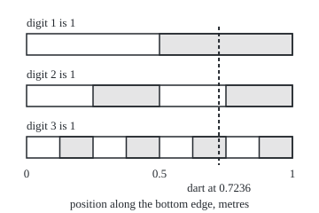

# Infinitely many coin tosses: build them from one uniform number, and Kolmogorov's theorem for every other infinite sequence


Measure and integration → Product Measures and Fubini → Sequences from one dart → Infinitely many coin tosses

---

## General Overview

A dart lands on a 1 m by 1 m board, 0.7236 m from the left edge, every point equally likely. Write that distance in binary, the base-2 system of 0s and 1s: 0.1011100100111101… Each digit answers one yes-or-no question. The first says whether the dart is in the right half of the edge (1) or the left (0). The second says which half of that half, and so on forever.

The laws of large numbers talk about a coin tossed forever. "The share of heads tends to one half" is a statement about all the tosses at once, so it needs one probability governing an endless sequence. A simulation of a few thousand tosses never needs that. A proof does. Where does such a probability come from?

From the dart. Measured by length, the digits of one uniform point are independent fair coin tosses. Deal the digits into infinitely many separate piles and each pile spells a new uniform number, independent of the others. Two uniforms make a new dart; any other law comes from a uniform through its quantile map, the inverse of its distribution function. For sequences whose terms depend on each other, Kolmogorov's extension theorem does the building, provided the laws of the first few terms fit together.

**Under length on the unit interval, the binary digits of one uniform point are independent fair coin tosses; regrouping them gives infinitely many independent uniforms, hence independent draws of any law, and Kolmogorov's theorem builds any sequence whose laws for the first n terms agree with one another.**

**What kind of fact this is:** three theorems. The digit theorem and the splitting theorem are proved on this card in Why it works. Kolmogorov's extension theorem is stated precisely; its proof is outlined in a folded note and given in full by Billingsley and Durrett (Sources).

### The picture: three digits, three fair coins

Each row is the bottom edge of the board, 0 to 1 m, shaded where one digit equals 1. Every row shades exactly half the edge, in 1, 2 and 4 pieces. Two rows overlap in a quarter; all three in an eighth, the last piece. The dashed line is the dart at 0.7236 m: shaded in rows 1 and 3, not in row 2, so its first three digits are 1, 0, 1. Drawn to scale.

<p align="center"></p>

---

## The formula

Notation first, in words. $\Omega$ is the bottom edge of the board, the interval from 0 up to but not including 1, and $\lambda$ is length on it: Lebesgue measure ([lebesgue-measure](../02-Length%20Done%20Properly/03-lebesgue-measure.md)). A uniform dart is a point drawn with probability $\lambda$. The n-th binary digit of a point x is $d_n$: double x n times, keep the whole-number part, and read whether it is odd.

$$d_n(x) = \lfloor 2^n x \rfloor \bmod 2$$

Here $\lfloor y \rfloor$ is the whole-number part of y, and "mod 2" is the remainder on division by 2.

**The digit theorem.** For every n and every pattern of 0s and 1s $e_1, \dots, e_n$:

$$\lambda\{x : d_1(x) = e_1, \dots, d_n(x) = e_n\} = 2^{-n} = \prod_{i=1}^{n} \lambda\{x : d_i(x) = e_i\}$$

**Read it aloud:** any fixed pattern in the first n digits has chance one half multiplied by itself n times, the product of the digits' separate chances; so the digits are independent fair coins.

**The splitting theorem.** Every whole number n ≥ 1 is a power of 2 times an odd number in exactly one way, $n = 2^{k-1}(2j - 1)$. Call (k, j) the slot of position n. Pile k collects the digits in slots (k, 1), (k, 2), (k, 3), … and reads them as a new binary number:

$$U_k = \sum_{j=1}^{\infty} d_{2^{k-1}(2j-1)}\, 2^{-j}, \qquad k = 1, 2, 3, \dots$$

**Read it aloud:** the k-th new number takes as its j-th digit the old digit in slot (k, j).

Then $U_1, U_2, U_3, \dots$ are independent and each is uniform on the unit interval. For any distribution function $F$ with quantile map $Q(u) = \inf\{t : F(t) \ge u\}$ for 0 < u < 1, the draws $X_k = Q(U_k)$ are independent, each with law $F$ ([pushforward-and-the-law](../03-Measurable%20Functions/05-pushforward-and-the-law.md)). The pairs $(U_1, U_2), (U_3, U_4), \dots$ are independent darts on the board.

**Kolmogorov's extension theorem.** For every n let $\mu_n$ be a probability on the Borel sets of $\mathbb{R}^n$, the n-long lists of reals. The family is **consistent** when adding a coordinate and asking nothing of it changes nothing:

$$\mu_{n+1}(A \times \mathbb{R}) = \mu_n(A) \quad \text{for every } n \text{ and every Borel set } A \subseteq \mathbb{R}^n$$

Then there is exactly one probability $P$ on the whole sequences $\mathbb{R}^{\mathbb{N}}$, with the product sigma-algebra, such that

$$P\{\omega : (\omega_1, \dots, \omega_n) \in A\} = \mu_n(A) \quad \text{for every } n \text{ and every Borel set } A \subseteq \mathbb{R}^n$$

**Read it aloud:** if the laws of the first n terms fit together, one law for the whole infinite sequence has all of them as its pieces.

The product sigma-algebra is the smallest sigma-algebra holding every **cylinder set**: a set that constrains only the first n coordinates, for some n, and leaves the rest free ([product-sigma-algebras](01-product-sigma-algebras.md)).

| Symbol | Plain meaning | In our example | Push it up and the answer… |
| --- | --- | --- | --- |
| $\Omega$, $\lambda$ | the unit interval and length on it | the board's bottom edge, 1 m | — |
| $x$ | the dart's distance from the left edge | 0.7236 m | its digits change |
| $d_n$, $n$ | the n-th binary digit of x, and its position | digits 1, 0, 1, 1 | a later digit halves a finer interval |
| $e_1$, $e_n$ | a fixed pattern of 0s and 1s to match | 1, 0, 1 | a longer pattern halves the chance each time |
| $U_k$, $k$, $j$ | the k-th new uniform; pile number, and place inside the pile | U_1 = 0.900990 | a higher k takes sparser positions |
| $F$, $Q$ | a distribution function, and its quantile map | a fair die: Q(u) = ⌊6u⌋ + 1 a.e. | a larger u gives a larger value |
| $X_k$ | the k-th draw with law F | die rolls 6, 1, 6, 5 | — |
| $\mu_n$ | the law of the first n terms, a probability on n-long lists | sticky coin: 0.32 on three heads | — |
| $A$ | a Borel set of n-long lists | "heads, heads, heads" | a bigger A has a bigger chance |
| $P$, $\omega$, $\omega_i$ | the law of the whole sequence; one sequence; its i-th term | all sticky-coin sequences | — |
| $T$, $J$, $\mu_J$ | any index set; a finite part of it; the law on the coordinates in J | T = the whole numbers | — |
| $A_k$, $B_i$, $C_i$, $D_m$ | sets used inside the folded proofs | — | — |
| $r$, $N$, $m$, $i$, $\varepsilon$, $s(k, j)$ | in the steps and proofs: how many positions are fixed, and the last of them; the whole number a pattern spells (Step 1), later how many digits of a pile are read, with i the number they spell; a small positive floor on chances; the position in slot (k, j), $2^{k-1}(2j-1)$ | positions 2, 5, 7: r = 3, N = 7; pattern 1, 0, 1: m = 5; s(2, 3) = 10 | — |

### When it holds

- **The dart is uniform.** A dart whose density is 2x, rising towards the right, has first digit 1 with chance 0.75, and both of the first two digits are 1 with chance 0.4375, not 0.75 × 0.625 = 0.46875.
- **The piles share no digits.** U built from digits 1, 2, 3, … and V from digits 2, 3, 4, … are correlated at 0.5.
- **The finite laws are consistent.** "Uniform over the words with an even number of heads" gives the first toss heads with chance 0 on one toss and 0.5 on two; no P has both as pieces.
- **Coordinates are real, or live in a space like the reals.** The existence proof uses that a probability on n-long lists of reals sits almost entirely on a closed, bounded set. On arbitrary coordinate spaces the theorem can fail.
- **Questions touch countably many coordinates.** Any index set $T$ works, with laws $\mu_J$ on each finite part $J$ that agree whenever coordinates are dropped. But every event of the product sigma-algebra depends on countably many coordinates, so for a process in continuous time "the path is continuous" is not an event. Brownian motion, in wing 11, needs a further step.

---

## Why it works

### Step 0: a pattern in the first n digits is one interval of length 2^-n

Fixing the first digit to 1 keeps the right half of the edge. Fixing the second to 0 keeps the left half of that. Each fixed digit halves an interval, so n fixed digits leave one interval of length $2^{-n}$. Halving multiplies lengths, and so the chances multiply. The rest is bookkeeping about which digits are fixed.

### Step 1: the digit events, exactly

Read $e_1 e_2 \dots e_n$ as a whole number m in binary. The first n digits of x match exactly when $\lfloor 2^n x \rfloor = m$: when x lies from $m/2^n$ up to but not including $(m+1)/2^n$, an interval of length $2^{-n}$.

The dart: doubling 0.7236 gives 1.4472, so the first digit is 1; keep 0.4472 and double to 0.8944, digit 0; then 1.7888, digit 1; then 1.5776, digit 1. The pattern 1, 0, 1 is m = 5 with n = 3, the interval from 5/8 = 0.625 up to 6/8, and 0.7236 is inside it.

### Step 2: any finite set of digits multiplies

Fix positions 2, 5 and 7 to 1, 0, 1 and leave the rest free. The four free positions among the first seven each take 0 or 1, so the event is 2^4 = 16 disjoint intervals of length 2^-7: 16/128 = 0.125 = 0.5^3.

In general, r fixed positions, the last at position N, give 2^(N−r) intervals of length 2^-N: chance 2^-r, the product of r halves. A digit's information is the four sets ∅, "digit is 0", "digit is 1" and the whole edge, and the product rule on every finite subfamily of such events is the definition of independence ([independence-as-a-product-measure](04-independence-as-a-product-measure.md)). So $d_1, d_2, d_3, \dots$ are independent fair coins. The code checks all 8,190 patterns of length 1 to 12.

A point such as 0.5 has two binary expansions, 0.1000… and 0.0111…; the rule above always picks the first. Such points are fractions with a power of 2 below the line, countably many, so their total length is 0 and no chance on this card changes.

### Step 3: deal the digits into infinitely many piles

The slot rule pairs positions with pairs (k, j) one-to-one: strip every factor 2 from n, count them to get k − 1, and the odd number left is 2j − 1. That the pairs of whole numbers can be listed one-to-one against the whole numbers is [countable-sets](../../01-Foundations/09-Sizes%20of%20Infinity/02-countable-sets.md). Pile 1 takes the odd positions 1, 3, 5, …; pile 2 takes 2, 6, 10, …; pile 3 takes 4, 12, 20, …; pile 4 takes 8, 24, 40, …

The dart's first sixteen positions go to piles 1 2 1 3 1 2 1 4 1 2 1 3 1 2 1 5. Twenty digits from each of the first four piles give U_1 = 0.900990, U_2 = 0.107787, U_3 = 0.959763 and U_4 = 0.764359.

### Step 4: each pile is a uniform number

The digits of pile k are a subsequence of independent fair coins, so any pattern in its first m digits has chance $2^{-m}$. So $U_k$ lands in each interval from $i/2^m$ to $(i+1)/2^m$ with chance equal to its length. These dyadic intervals are nested or disjoint, so with ∅ they form a pi-system, a family closed under overlap, and they generate the Borel sets. Two probabilities that agree on a generating pi-system agree everywhere ([pi-systems-and-uniqueness](../01-Sets%20You%20Can%20Measure/06-pi-systems-and-uniqueness.md)), so the law of $U_k$ is length.

### Step 5: different piles are independent

Events about the first m digits of different piles fix disjoint sets of old digits, so by Step 2 their chances multiply. Such events generate each pile's information, and independence checked on generating pi-systems passes to the whole sigma-algebras ([independence-as-a-product-measure](04-independence-as-a-product-measure.md)).

The code checks this at level 12. The first 12 old digits give pile 1 six digits, pile 2 three, pile 3 two and pile 4 one: 64 × 8 × 4 × 2 = 4096 value combinations. The 4096 intervals of length 1/4096 produce every combination exactly once, which is the product law.

<details>
<summary>Detailed proof: the piles are independent uniforms</summary>

**Setting.** $\lambda$ on the Borel sets of $\Omega$; the $d_n$ are independent fair coins (Step 2); $s(k, j) = 2^{k-1}(2j-1)$ is one-to-one from pairs onto positions.

**1. Each $U_k$ is measurable.** Its partial sums are step functions, and a limit of measurable functions is measurable ([limits-of-measurable-functions](../03-Measurable%20Functions/02-limits-of-measurable-functions.md)).

**2. Each $U_k$ is uniform.** Let $D_m$ be the event that every pile-k digit after the m-th is 1. It lies inside "pile digits m + 1 to r are all 1", of chance $2^{-(r-m)}$ for every r, so it is null, and so is the union over m. Off that null set, $U_k \in [i/2^m, (i+1)/2^m)$ exactly when the first m pile digits spell i, of chance $2^{-m}$ by Step 2. The law of $U_k$ and $\lambda$ agree on the dyadic intervals, a pi-system generating the Borel sets, and both have total 1; the uniqueness theorem makes them equal.

**3. $U_1, \dots, U_r$ are independent.** For each k let the events "the first m digits of pile k spell i", over all m and i, with ∅ and $\Omega$, be the family for pile k. It is closed under overlap and generates the information of pile k's digits, which contains that of $U_k$. Pick $A_k$ from the family for pile k, for k = 1 to r. The overlap of the $A_k$ fixes old digits in distinct slots, so by Step 2 its chance is the product of their chances. Independence on generating pi-systems gives independence of the information of $U_1, \dots, U_r$, by the Dynkin argument of [independence-as-a-product-measure](04-independence-as-a-product-measure.md) applied one family at a time, the other r − 1 events held fixed; an infinite family is independent when every finite part is.

**4. Other laws, and darts.** $Q$ is non-decreasing, so measurable, and $Q(U_k)$ has law F ([pushforward-and-the-law](../03-Measurable%20Functions/05-pushforward-and-the-law.md)). The event $Q(U_k) \in B$ is the event $U_k \in Q^{-1}(B)$, so functions of independent variables stay independent. The pairs of uniforms have law length times length on the square ([product-measure](02-product-measure.md)).

</details>

### Step 6: any law, and more darts

For a fair die, $Q(u) = \lfloor 6u \rfloor + 1$ except at the five points where 6u is whole, a set of length 0, and the dart's four uniforms roll 6, 1, 6, 5. Paired, they are dart 1 at (0.900990, 0.107787) and dart 2 at (0.959763, 0.764359). One throw has become a sequence of independent throws.

### Step 7: Kolmogorov's theorem, when the terms depend on each other

A **sticky coin** is fair on the first toss; each later toss repeats the one before with chance 0.8. Its law for three tosses gives heads three times the chance 0.5 × 0.8 × 0.8 = 0.32. Summing its law for n + 1 tosses over the last toss returns its law for n tosses; the code checks every pattern up to length 10. That is consistency, and the theorem gives one law P on all infinite toss sequences.

Consistency is also necessary. If P exists, "the first n terms lie in A" and "the first n + 1 terms lie in A × ℝ" are the same set, so both laws must give it one number. The even-heads family gives 0 and 0.5, so no P exists for it.

Uniqueness is Step 4's argument again: cylinder sets form a pi-system generating the product sigma-algebra. Existence is the hard half. Set P on each cylinder set by its $\mu_n$, which consistency makes unambiguous, and extend. The extension needs countable additivity on cylinder sets, and that is where real coordinates matter.

<details>
<summary>Detailed proof, in outline: Kolmogorov's extension theorem</summary>

Full proofs: Billingsley, Section 36; Durrett, Theorem A.3.1.

**1. Cylinder sets form an algebra**, closed under complements and finite unions: two of them can be written over a common n, where union and complement act on Borel sets of $\mathbb{R}^n$.

**2. P is well defined and finitely additive there.** A cylinder set with base A over n has base A × ℝ over n + 1, and consistency gives the same value. Disjoint cylinder sets over a common n have disjoint bases.

**3. P is countably additive there.** It suffices that cylinder sets $B_1 \supseteq B_2 \supseteq \dots$ with every $P(B_i) \ge \varepsilon > 0$ share a point. For if disjoint cylinder sets $A_1, A_2, \dots$ have a cylinder set $A$ as their union, the sets $B_i = A \setminus (A_1 \cup \dots \cup A_i)$ decrease and share no point, and finite additivity gives $P(A) = P(A_1) + \dots + P(A_i) + P(B_i)$; so countable additivity is exactly $P(B_i) \to 0$. A probability on $\mathbb{R}^n$ gives each Borel set nearly its full size on a closed, bounded subset (proved in Billingsley). Shrink the base of $B_i$ that way, losing less than $\varepsilon/2^{i+1}$, and intersect the first i shrunken sets to get $C_i$ inside $B_i$ with $P(C_i) > \varepsilon/2$, so $C_i$ holds a point. Each coordinate of these points stays in a closed, bounded set, so a diagonal choice of subsequences, as in Cantor's diagonal argument, makes every coordinate converge. The limit lies in every $C_i$, since the bases are closed, hence in every $B_i$.

**4. Extend** to the product sigma-algebra ([caratheodory-extension-theorem](../02-Length%20Done%20Properly/05-caratheodory-extension-theorem.md)).

**5. Unique**, since cylinder sets are a generating pi-system ([pi-systems-and-uniqueness](../01-Sets%20You%20Can%20Measure/06-pi-systems-and-uniqueness.md)).

Only item 3 uses real coordinates. For an arbitrary index set $T$ the proof runs on finite parts $J$, since each cylinder set involves finitely many coordinates.

</details>

The sticky coin also has a road back to the dart: toss 1 is heads when $U_1 < 0.5$, and toss k + 1 repeats toss k when $U_{k+1} < 0.8$. Any sequence whose next term has a stated law given the past can be built by such conditional quantile maps; that is the Ionescu-Tulcea theorem. Kolmogorov's theorem asks only for the consistent laws of the first n terms.

**What the code shows, and what only the proof shows.** The code checks every digit pattern of length at most 12, twenty digits of four piles, sticky-coin consistency up to 10 tosses, and 200,000 simulated darts. That every digit of every point behaves, and that every consistent family has a P, only the proofs cover.

---

## Worked numbers, by hand

| Step | Arithmetic | Value |
| --- | --- | --- |
| first digits of the dart | double 0.7236: 1.4472, 0.8944, 1.7888, 1.5776 | 1, 0, 1, 1 |
| the interval for 1, 0, 1 | 5/8 up to 6/8 | contains 0.7236 |
| digits 2, 5, 7 read 1, 0, 1 | 16 intervals of length 1/128 | **0.125 = 0.5^3** |
| piles of the first 16 positions | strip factors of 2 | 1 2 1 3 1 2 1 4 1 2 1 3 1 2 1 5 |
| the first four uniforms | 20 digits from each pile | 0.900990, 0.107787, 0.959763, 0.764359 |
| die rolls | ⌊6U⌋ + 1 | **6, 1, 6, 5** |
| sticky coin, three heads | 0.5 × 0.8 × 0.8 | **0.32** |

One dart at 0.7236 m has become two independent darts, four independent die rolls, and the start of a sticky-coin sequence, with infinitely many more to come.

### What breaks if you drop a piece

The shared-digit case takes one line of algebra. If U reads digits 1, 2, 3, … and V reads 2, 3, 4, …, then V = 2U − d_1. A uniform has variance 1/12 = 0.083333. U times d_1 averages 3/8, the area under x from 0.5 to 1, so their covariance is 3/8 − 1/4 = 0.125. The covariance of U and V is 2 × 0.083333 − 0.125 = 0.041667; divided by their common variance 0.083333, correlation 0.5.

| Mistake | Comes out at | What went wrong |
| --- | --- | --- |
| Two piles share digits: U from 1, 2, 3, …, V from 2, 3, 4, … | correlation 0.497050 on 4 digits, 0.500000 on 12; limit 0.5 | V = 2U − d_1 is built from U |
| A dart with density 2x | P(d_1 = 1) = 0.75; first two digits both 1 with 0.4375, not 0.46875 | length no longer splits evenly |
| An inconsistent family: uniform over words with an even number of heads | first toss heads: 0 on one toss, 0.5 on two | no single P has both as pieces |

The code prints all three.

---

## Code, from first principles, and it actually runs

Three roads. Road 1 reads the dart's digits by exact doubling and deals them into piles twice: by the slot rule, and by slicing every second, fourth, eighth and sixteenth digit. Road 2 counts the 4,096 intervals of length 1/4096 and sets every digit pattern against the product rule 0.5^n; it also counts the pile combinations, the three breaks and both families' consistency. Road 3 simulates 200,000 darts with SplitMix64, a small random-number generator written out in both languages, seed 20260929. Each dart holds 128 binary digits, so the four piles get 64, 32, 16 and 8; U4 is then a multiple of 1/256, so "top half" is tested as U4 ≥ 0.5, of chance exactly 0.5. Asserts on simulated numbers allow four standard errors; the largest miss, the three-uniform event, is about 1.3.

### Python

```python
# Infinitely many coin tosses from one dart -- the check behind the card.
# Standard library only.  Roads: (1) one dart x = 0.7236 m, its digits read by
# exact doubling and split two ways; (2) Lebesgue measure of digit events,
# counted exactly on the 4,096 dyadic cells of level 12 and set against the
# product rule 0.5^n; (3) a simulation: SplitMix64, seed 20260929, 200,000
# darts, each x held to 128 binary digits.
from fractions import Fraction as Fr
def digits(p, q, n):                         # first n binary digits of p/q, by doubling
    out = []
    for _ in range(n):
        p *= 2
        out.append(1 if p >= q else 0)
        p -= q * out[-1]
    return out
def slot(n):                                 # position n = 2^(k-1) * (2j - 1)  ->  (k, j)
    k = 1
    while n % 2 == 0:
        n, k = n // 2, k + 1
    return k, (n + 1) // 2
def split(ds, count):                        # U_k = sum of digit(slot (k, j)) / 2^j
    u = [Fr(0)] * count
    for n, d in enumerate(ds, start=1):
        k, j = slot(n)
        if k <= count:
            u[k - 1] += Fr(d, 2 ** j)
    return u
def dec(v): return f"{float(v):.6f}"
# ---- road 1: one dart ----
ds = digits(1809, 2500, 320)                 # x = 0.7236 = 1809/2500
y, dbl = Fr(1809, 2500), []
for _ in range(4):
    y = 2 * y; dbl.append(f"{float(y):.4f}"); y -= int(y)
print("doubling 0.7236 four times:", ", ".join(dbl))
print("dart x = 0.7236 m, binary digits 1-16:", " ".join(map(str, ds[:16])))
print("position 1-16 goes to uniform k:     ", " ".join(str(slot(n)[0]) for n in range(1, 17)))
U = split(ds, 4)
by_slicing = [sum(Fr(d, 2 ** (j + 1)) for j, d in enumerate(ds[2 ** k - 1::2 ** (k + 1)][:20])) for k in range(4)]
print("U1..U4 from 20 digits each:", ", ".join(dec(v) for v in by_slicing))
print(f"dart 1 = (U1, U2) = ({dec(by_slicing[0])}, {dec(by_slicing[1])}); dart 2 = (U3, U4) = ({dec(by_slicing[2])}, {dec(by_slicing[3])})")
print("die rolls floor(6U) + 1:", [int(6 * v) + 1 for v in by_slicing])
assert all(abs(U[k] - by_slicing[k]) < Fr(1, 2 ** 20) for k in range(4))   # two readings of the split
x_px = 30 + 300 * Fr(1809, 2500)
print(f"figure, x scale 30 + 300x px; dart at {float(x_px):.2f} px; digit-1 cells row 1 [0.5,1], row 2 [0.25,0.5] [0.75,1], row 3 [0.125,0.25] [0.375,0.5] [0.625,0.75] [0.875,1]")
# ---- road 2: Lebesgue measure on the 4,096 cells of level 12 ----
M = 12
cells = [digits(2 * i + 1, 2 ** (M + 1), M) for i in range(2 ** M)]      # digits of each cell's midpoint
worst = Fr(0)
for n in range(1, M + 1):
    tally = {}
    for c in cells:
        tally[tuple(c[:n])] = tally.get(tuple(c[:n]), 0) + 1
    assert len(tally) == 2 ** n
    worst = max([worst] + [abs(Fr(t, 2 ** M) - Fr(1, 2) ** n) for t in tally.values()])
print(f"all 8,190 words of lengths 1 to 12: measure = 0.5^n, largest gap {worst}")
pair = Fr(sum(1 for c in cells if c[1] == 1 and c[4] == 0 and c[6] == 1), 2 ** M)
print(f"P(d2 = 1, d5 = 0, d7 = 1) = {float(pair)} by counting cells; 0.5^3 = {0.5 ** 3}")
combos = {tuple(split(c, 4)) for c in cells}
print(f"U1..U4 read from 12 digits: 64 x 8 x 4 x 2 = {64 * 8 * 4 * 2} value combinations, {len(combos)} distinct, each measure 1/4096")
rect = Fr(sum(1 for c in cells if split(c, 2)[0] < Fr(1, 2) and split(c, 2)[1] < Fr(1, 4)), 2 ** M)
print(f"P(U1 < 0.5, U2 < 0.25) = {float(rect)} by counting cells; 0.5 x 0.25 = {0.5 * 0.25}")
assert worst == 0 and pair == Fr(1, 8) and len(combos) == 4096 and rect == Fr(1, 2) * Fr(1, 4)
# ---- what breaks ----
for m in (4, 8, 12, 16):                     # U from digits 1..m, V from digits 2..m: a reused digit
    us, vs = [], []
    for i in range(2 ** m):
        c = digits(2 * i + 1, 2 ** (m + 1), m)
        us.append(sum(Fr(d, 2 ** (j + 1)) for j, d in enumerate(c)))
        vs.append(sum(Fr(d, 2 ** j) for j, d in enumerate(c) if j >= 1))
    N = 2 ** m; mu, mv = sum(us) / N, sum(vs) / N
    cov = sum((a - mu) * (b - mv) for a, b in zip(us, vs)) / N
    vu, vv = sum((a - mu) ** 2 for a in us) / N, sum((b - mv) ** 2 for b in vs) / N
    corr = float(cov) / (float(vu) * float(vv)) ** 0.5
    print(f"shifted digits, m = {m:2d}: correlation of U and V = {corr:.6f}")
var, cov_d1 = Fr(1, 12), Fr(3, 8) - Fr(1, 2) * Fr(1, 2)   # Var U; Cov(U, d1) = E[U d1] - E[U] E[d1]
limit = (2 * var - cov_d1) / var             # V = 2U - d1, worked on the card
print(f"shifted digits, by hand: Var U = {dec(var)}, Cov(U, d1) = {dec(cov_d1)}, Cov(U, V) = {dec(2 * var - cov_d1)}, limit {float(limit)}")
assert abs(corr - float(limit)) < 1e-3
cdf = lambda a: a * a                        # a dart with density 2x: P(x <= a) = a^2
anti = [1 - cdf(Fr(1, 2)), cdf(Fr(1, 2)) - cdf(Fr(1, 4)) + 1 - cdf(Fr(3, 4)), 1 - cdf(Fr(3, 4))]
mid = [Fr(0)] * 3                            # the same three chances by midpoint sums
for i, c in enumerate(cells):
    w = 2 * Fr(2 * i + 1, 2 ** (M + 1)) / 2 ** M
    mid[0] += w * c[0]; mid[1] += w * c[1]; mid[2] += w * c[0] * c[1]
print(f"density-2x dart: P(d1 = 1) = {float(anti[0])}, P(d2 = 1) = {float(anti[1])}, "
      f"P(both) = {float(anti[2])}, product {float(anti[0] * anti[1])}")
assert anti == mid and anti[2] != anti[0] * anti[1]
# ---- Kolmogorov's consistency condition ----
def sticky(w):                               # first toss fair, each later toss repeats with 0.8
    p = Fr(1, 2)
    for a, b in zip(w, w[1:]):
        p *= Fr(4, 5) if a == b else Fr(1, 5)
    return p
def parity(w): return Fr(1, 2 ** (len(w) - 1)) if w.count("H") % 2 == 0 else Fr(0)   # even heads only
def words(n): return [""] if n == 0 else [w + s for w in words(n - 1) for s in "HT"]
ok = all(sticky(w + "H") + sticky(w + "T") == sticky(w) for n in range(1, 10) for w in words(n))
print(f"sticky coin, consistent for n = 1 to 10: {'yes' if ok else 'no'}; mu_3(HHH) = {float(sticky('HHH'))}")
print(f"parity family: mu_1(H) = {float(parity('H')):.2f}, but mu_2 gives the first toss H with {float(parity('HH') + parity('HT')):.2f}")
assert ok and parity("H") != parity("HH") + parity("HT")
# ---- road 3: simulation ----
MASK = 2 ** 64 - 1
state = 20260929
def splitmix():
    global state
    state = (state + 0x9E3779B97F4A7C15) & MASK
    z = state
    z = ((z ^ (z >> 30)) * 0xBF58476D1CE4E5B9) & MASK
    z = ((z ^ (z >> 27)) * 0x94D049BB133111EB) & MASK
    return z ^ (z >> 31)
def uniforms(x):                             # U1..U4 from the 128 digits of x, by slot
    u = [0, 0, 0, 0]
    for k in range(1, 5):
        bits = 2 ** (7 - k)
        for j in range(1, bits + 1):
            n = 2 ** (k - 1) * (2 * j - 1)
            u[k - 1] = 2 * u[k - 1] + ((x >> (128 - n)) & 1)
        u[k - 1] = u[k - 1] / 2 ** bits
    return u
T = 200000
s1 = s11 = s2 = s22 = s12 = 0.0
three = six = hhh = darts = 0
for _ in range(T):
    x = (splitmix() << 64) | splitmix()
    u1, u2, u3, u4 = uniforms(x)
    s1 += u1; s11 += u1 * u1; s2 += u2; s22 += u2 * u2; s12 += u1 * u2
    three += u1 < 0.5 and u2 < 0.5 and u3 < 0.5
    six += int(6 * u1) + 1 == 6
    t1 = u1 < 0.5; t2 = t1 if u2 < 0.8 else not t1; t3 = t2 if u3 < 0.8 else not t2
    hhh += t1 and t2 and t3
    darts += u1 < 0.5 and u4 >= 0.5
m1, m2 = s1 / T, s2 / T
r = (s12 / T - m1 * m2) / ((s11 / T - m1 * m1) * (s22 / T - m2 * m2)) ** 0.5
print(f"simulated, {T} darts: mean U1 {m1:.6f}, correlation U1 U2 {r:.6f}")
sims = [("P(U1, U2, U3 all < 0.5)", three, 0.125), ("P(die from U1 shows 6)", six, 1 / 6),
        ("P(sticky HHH)", hhh, 0.32), ("P(dart 1 left half, dart 2 top half)", darts, 0.25)]
for label, hits, exact in sims:
    f, se = hits / T, (exact * (1 - exact) / T) ** 0.5
    print(f"simulated {label} = {f:.6f}; exact {exact:.6f}; standard error {se:.6f}")
    assert abs(f - exact) < 4 * se
assert abs(m1 - 0.5) < 4 * (1 / 12 / T) ** 0.5 and abs(r) < 4 / T ** 0.5
print("ALL CHECKS PASS")
```

**Ran 2026-10-06 on macOS, Python 3.14.6, standard library only. All checks passed. Output, pasted from the run:**

```
doubling 0.7236 four times: 1.4472, 0.8944, 1.7888, 1.5776
dart x = 0.7236 m, binary digits 1-16: 1 0 1 1 1 0 0 1 0 0 1 1 1 1 0 1
position 1-16 goes to uniform k:      1 2 1 3 1 2 1 4 1 2 1 3 1 2 1 5
U1..U4 from 20 digits each: 0.900990, 0.107787, 0.959763, 0.764359
dart 1 = (U1, U2) = (0.900990, 0.107787); dart 2 = (U3, U4) = (0.959763, 0.764359)
die rolls floor(6U) + 1: [6, 1, 6, 5]
figure, x scale 30 + 300x px; dart at 247.08 px; digit-1 cells row 1 [0.5,1], row 2 [0.25,0.5] [0.75,1], row 3 [0.125,0.25] [0.375,0.5] [0.625,0.75] [0.875,1]
all 8,190 words of lengths 1 to 12: measure = 0.5^n, largest gap 0
P(d2 = 1, d5 = 0, d7 = 1) = 0.125 by counting cells; 0.5^3 = 0.125
U1..U4 read from 12 digits: 64 x 8 x 4 x 2 = 4096 value combinations, 4096 distinct, each measure 1/4096
P(U1 < 0.5, U2 < 0.25) = 0.125 by counting cells; 0.5 x 0.25 = 0.125
shifted digits, m =  4: correlation of U and V = 0.497050
shifted digits, m =  8: correlation of U and V = 0.499989
shifted digits, m = 12: correlation of U and V = 0.500000
shifted digits, m = 16: correlation of U and V = 0.500000
shifted digits, by hand: Var U = 0.083333, Cov(U, d1) = 0.125000, Cov(U, V) = 0.041667, limit 0.5
density-2x dart: P(d1 = 1) = 0.75, P(d2 = 1) = 0.625, P(both) = 0.4375, product 0.46875
sticky coin, consistent for n = 1 to 10: yes; mu_3(HHH) = 0.32
parity family: mu_1(H) = 0.00, but mu_2 gives the first toss H with 0.50
simulated, 200000 darts: mean U1 0.499981, correlation U1 U2 -0.000449
simulated P(U1, U2, U3 all < 0.5) = 0.124015; exact 0.125000; standard error 0.000740
simulated P(die from U1 shows 6) = 0.166925; exact 0.166667; standard error 0.000833
simulated P(sticky HHH) = 0.320230; exact 0.320000; standard error 0.001043
simulated P(dart 1 left half, dart 2 top half) = 0.248970; exact 0.250000; standard error 0.000968
ALL CHECKS PASS
```

### Rust

Same numbers, same labels, built with `rustc --edition 2021 -O`. Exact chances are whole-number counts over powers of 2, where Python uses fractions.

```rust
// Infinitely many coin tosses from one dart -- the same check in Rust, std only.
// Exact work is done in whole numbers: a dyadic chance is a count of cells over
// a power of two.  Roads: (1) one dart x = 0.7236 m, digits by exact doubling,
// split two ways; (2) Lebesgue measure of digit events on the 4,096 cells of
// level 12 against the product rule 0.5^n; (3) SplitMix64, seed 20260929,
// 200,000 darts, each x held to 128 binary digits.
use std::collections::{HashMap, HashSet};

fn digits(mut p: u128, q: u128, n: usize) -> Vec<u64> { // first n binary digits of p/q
    (0..n).map(|_| { p *= 2; let d = (p >= q) as u128; p -= q * d; d as u64 }).collect()
}
fn slot(mut n: usize) -> (usize, usize) {    // position n = 2^(k-1) * (2j - 1)  ->  (k, j)
    let mut k = 1;
    while n % 2 == 0 { n /= 2; k += 1; }
    (k, (n + 1) / 2)
}
fn split(ds: &[u64], count: usize, cap: usize) -> Vec<f64> { // U_k from slots (k, 1..cap)
    let mut u = vec![0.0; count];
    for (i, &d) in ds.iter().enumerate() {
        let (k, j) = slot(i + 1);
        if k <= count && j <= cap { u[k - 1] += d as f64 / 2f64.powi(j as i32); }
    }
    u
}
fn splitmix(state: &mut u64) -> u64 {
    *state = state.wrapping_add(0x9E3779B97F4A7C15);
    let mut z = *state;
    z = (z ^ (z >> 30)).wrapping_mul(0xBF58476D1CE4E5B9);
    z = (z ^ (z >> 27)).wrapping_mul(0x94D049BB133111EB);
    z ^ (z >> 31)
}
fn uniforms(x: u128) -> [f64; 4] {           // U1..U4 from the 128 digits of x, by slot
    let mut u = [0.0; 4];
    for k in 1..=4u32 {
        let bits = 1u32 << (7 - k);
        let mut v: u64 = 0;
        for j in 1..=bits {
            let n = (1u32 << (k - 1)) * (2 * j - 1);
            v = 2 * v + ((x >> (128 - n)) & 1) as u64;
        }
        u[(k - 1) as usize] = v as f64 / 2f64.powi(bits as i32);
    }
    u
}
fn main() {
    // ---- road 1: one dart ----
    let ds = digits(1809, 2500, 320);         // x = 0.7236 = 1809/2500
    let (mut p, mut dbl) = (1809u64, Vec::new());
    for _ in 0..4 { p *= 2; dbl.push(format!("{:.4}", p as f64 / 2500.0)); if p >= 2500 { p -= 2500 } }
    println!("doubling 0.7236 four times: {}", dbl.join(", "));
    let s: Vec<String> = ds[..16].iter().map(|d| d.to_string()).collect();
    println!("dart x = 0.7236 m, binary digits 1-16: {}", s.join(" "));
    let s: Vec<String> = (1..=16).map(|n| slot(n).0.to_string()).collect();
    println!("position 1-16 goes to uniform k:      {}", s.join(" "));
    let u = split(&ds, 4, 20);
    let sl: Vec<f64> = (0..4).map(|k| ds.iter().skip((1 << k) - 1).step_by(1 << (k + 1)).take(20)
        .enumerate().map(|(j, &d)| d as f64 / 2f64.powi(j as i32 + 1)).sum()).collect();
    let f6: Vec<String> = sl.iter().map(|v| format!("{:.6}", v)).collect();
    println!("U1..U4 from 20 digits each: {}", f6.join(", "));
    println!("dart 1 = (U1, U2) = ({}, {}); dart 2 = (U3, U4) = ({}, {})", f6[0], f6[1], f6[2], f6[3]);
    let die: Vec<i64> = sl.iter().map(|v| (6.0 * v) as i64 + 1).collect();
    println!("die rolls floor(6U) + 1: {:?}", die);
    assert!(u == sl);                         // two readings of the split
    println!("figure, x scale 30 + 300x px; dart at {:.2} px; digit-1 cells row 1 [0.5,1], row 2 [0.25,0.5] [0.75,1], row 3 [0.125,0.25] [0.375,0.5] [0.625,0.75] [0.875,1]",
             30.0 + 300.0 * 1809.0 / 2500.0);

    // ---- road 2: Lebesgue measure on the 4,096 cells of level 12 ----
    let m = 12usize;
    let cells: Vec<Vec<u64>> = (0..1u128 << m).map(|i| digits(2 * i + 1, 1 << (m + 1), m)).collect();
    let mut worst = 0i64;
    for n in 1..=m {
        let mut tally: HashMap<Vec<u64>, i64> = HashMap::new();
        for c in &cells { *tally.entry(c[..n].to_vec()).or_insert(0) += 1; }
        assert!(tally.len() == 1 << n);
        for &t in tally.values() { worst = worst.max((t * (1 << n) - (1 << m)).abs()); }
    }
    println!("all 8,190 words of lengths 1 to 12: measure = 0.5^n, largest gap {}", worst);
    let pair = cells.iter().filter(|c| c[1] == 1 && c[4] == 0 && c[6] == 1).count();
    println!("P(d2 = 1, d5 = 0, d7 = 1) = {} by counting cells; 0.5^3 = {}", pair as f64 / 4096.0, 0.5f64.powi(3));
    let combos: HashSet<Vec<u64>> = cells.iter().map(|c| split(c, 4, 12).iter().map(|v| v.to_bits()).collect()).collect();
    println!("U1..U4 read from 12 digits: 64 x 8 x 4 x 2 = {} value combinations, {} distinct, each measure 1/4096", 64 * 8 * 4 * 2, combos.len());
    let rect = cells.iter().filter(|c| { let v = split(c, 2, 12); v[0] < 0.5 && v[1] < 0.25 }).count();
    println!("P(U1 < 0.5, U2 < 0.25) = {} by counting cells; 0.5 x 0.25 = {}", rect as f64 / 4096.0, 0.5 * 0.25);
    assert!(worst == 0 && pair * 8 == 4096 && combos.len() == 4096 && rect * 8 == 4096);

    // ---- what breaks ----
    let mut corr = 0.0;
    for &mm in &[4u32, 8, 12, 16] {           // U from digits 1..m, V from digits 2..m: a reused digit
        let n = 1i128 << mm;
        let (mut sa, mut sb, mut saa, mut sbb, mut sab) = (0i128, 0i128, 0i128, 0i128, 0i128);
        for i in 0..n {
            let c = digits(2 * i as u128 + 1, 1 << (mm + 1), mm as usize);
            let a = c.iter().fold(0i128, |acc, &d| 2 * acc + d as i128);          // U = a / 2^m
            let b = c[1..].iter().fold(0i128, |acc, &d| 2 * acc + d as i128);     // V = b / 2^(m-1)
            sa += a; sb += b; saa += a * a; sbb += b * b; sab += a * b;
        }
        let cov = (n * sab - sa * sb) as f64;
        let (vu, vv) = ((n * saa - sa * sa) as f64, (n * sbb - sb * sb) as f64);
        corr = cov / (vu * vv).sqrt();
        println!("shifted digits, m = {:2}: correlation of U and V = {:.6}", mm, corr);
    }
    let (var, cov_d1) = (2i64, 9 - 6);        // in 24ths: Var U = 1/12; Cov(U, d1) = 3/8 - 1/4
    let limit = (2 * var - cov_d1) as f64 / var as f64; // V = 2U - d1, worked on the card
    println!("shifted digits, by hand: Var U = {:.6}, Cov(U, d1) = {:.6}, Cov(U, V) = {:.6}, limit {}",
             var as f64 / 24.0, cov_d1 as f64 / 24.0, (2 * var - cov_d1) as f64 / 24.0, limit);
    assert!((corr - limit).abs() < 1e-3);
    let cdf16 = |a4: i64| a4 * a4;            // density 2x: P(x <= a4/4) = a4^2 / 16
    let anti = [16 - cdf16(2), cdf16(2) - cdf16(1) + 16 - cdf16(3), 16 - cdf16(3)]; // sixteenths
    let mut mid = [0i64; 3];                  // the same three chances by midpoint sums, in 2^-24
    for (i, c) in cells.iter().enumerate() {
        let w = 2 * i as i64 + 1;
        mid[0] += w * c[0] as i64; mid[1] += w * c[1] as i64; mid[2] += w * (c[0] * c[1]) as i64;
    }
    println!("density-2x dart: P(d1 = 1) = {}, P(d2 = 1) = {}, P(both) = {}, product {}",
             anti[0] as f64 / 16.0, anti[1] as f64 / 16.0, anti[2] as f64 / 16.0, (anti[0] * anti[1]) as f64 / 256.0);
    assert!((0..3).all(|t| mid[t] == anti[t] << 20) && anti[2] * 16 != anti[0] * anti[1]);

    // ---- Kolmogorov's consistency condition ----
    let sticky = |w: &[u8]| -> i64 {          // numerator over 2 * 5^(n-1): repeat weighs 4, switch 1
        w.windows(2).map(|p| if p[0] == p[1] { 4 } else { 1 }).product()
    };
    let mut ok = true;
    for n in 1..10u32 {
        for code in 0..1u32 << n {
            let w: Vec<u8> = (0..n).map(|i| ((code >> i) & 1) as u8).collect();
            let (h, t) = ([&w[..], &[1]].concat(), [&w[..], &[0]].concat());
            ok &= sticky(&h) + sticky(&t) == 5 * sticky(&w);
        }
    }
    println!("sticky coin, consistent for n = 1 to 10: {}; mu_3(HHH) = {}", if ok { "yes" } else { "no" },
             sticky(&[1, 1, 1]) as f64 / 50.0);
    let parity = |w: &[u8]| -> f64 {          // uniform on the words with an even number of heads
        if w.iter().filter(|&&d| d == 1).count() % 2 == 0 { 1.0 / 2f64.powi(w.len() as i32 - 1) } else { 0.0 }
    };
    let (p1, p2) = (parity(&[1]), parity(&[1, 1]) + parity(&[1, 0]));
    println!("parity family: mu_1(H) = {:.2}, but mu_2 gives the first toss H with {:.2}", p1, p2);
    assert!(ok && p1 != p2);

    // ---- road 3: simulation ----
    let mut state: u64 = 20260929;
    let t = 200000usize;
    let (mut s1, mut s11, mut s2, mut s22, mut s12) = (0.0, 0.0, 0.0, 0.0, 0.0);
    let (mut three, mut six, mut hhh, mut darts) = (0usize, 0usize, 0usize, 0usize);
    for _ in 0..t {
        let hi = splitmix(&mut state) as u128;
        let x = (hi << 64) | splitmix(&mut state) as u128;
        let [u1, u2, u3, u4] = uniforms(x);
        s1 += u1; s11 += u1 * u1; s2 += u2; s22 += u2 * u2; s12 += u1 * u2;
        three += (u1 < 0.5 && u2 < 0.5 && u3 < 0.5) as usize;
        six += ((6.0 * u1) as i64 + 1 == 6) as usize;
        let t1 = u1 < 0.5;
        let t2 = if u2 < 0.8 { t1 } else { !t1 }; let t3 = if u3 < 0.8 { t2 } else { !t2 };
        hhh += (t1 && t2 && t3) as usize;
        darts += (u1 < 0.5 && u4 >= 0.5) as usize;
    }
    let tf = t as f64; let (m1, m2) = (s1 / tf, s2 / tf);
    let r = (s12 / tf - m1 * m2) / ((s11 / tf - m1 * m1) * (s22 / tf - m2 * m2)).sqrt();
    println!("simulated, {} darts: mean U1 {:.6}, correlation U1 U2 {:.6}", t, m1, r);
    let sims = [("P(U1, U2, U3 all < 0.5)", three, 0.125), ("P(die from U1 shows 6)", six, 1.0 / 6.0),
                ("P(sticky HHH)", hhh, 0.32), ("P(dart 1 left half, dart 2 top half)", darts, 0.25)];
    for (label, hits, exact) in sims {
        let (f, se) = (hits as f64 / tf, (exact * (1.0 - exact) / tf).sqrt());
        println!("simulated {} = {:.6}; exact {:.6}; standard error {:.6}", label, f, exact, se);
        assert!((f - exact).abs() < 4.0 * se);
    }
    assert!((m1 - 0.5).abs() < 4.0 * (1.0 / 12.0 / tf).sqrt() && r.abs() < 4.0 / tf.sqrt());
    println!("ALL CHECKS PASS");
}
```

**Ran 2026-10-06 on macOS, rustc 1.98.1, no crates. All checks passed. Output, pasted from the run:**

```
doubling 0.7236 four times: 1.4472, 0.8944, 1.7888, 1.5776
dart x = 0.7236 m, binary digits 1-16: 1 0 1 1 1 0 0 1 0 0 1 1 1 1 0 1
position 1-16 goes to uniform k:      1 2 1 3 1 2 1 4 1 2 1 3 1 2 1 5
U1..U4 from 20 digits each: 0.900990, 0.107787, 0.959763, 0.764359
dart 1 = (U1, U2) = (0.900990, 0.107787); dart 2 = (U3, U4) = (0.959763, 0.764359)
die rolls floor(6U) + 1: [6, 1, 6, 5]
figure, x scale 30 + 300x px; dart at 247.08 px; digit-1 cells row 1 [0.5,1], row 2 [0.25,0.5] [0.75,1], row 3 [0.125,0.25] [0.375,0.5] [0.625,0.75] [0.875,1]
all 8,190 words of lengths 1 to 12: measure = 0.5^n, largest gap 0
P(d2 = 1, d5 = 0, d7 = 1) = 0.125 by counting cells; 0.5^3 = 0.125
U1..U4 read from 12 digits: 64 x 8 x 4 x 2 = 4096 value combinations, 4096 distinct, each measure 1/4096
P(U1 < 0.5, U2 < 0.25) = 0.125 by counting cells; 0.5 x 0.25 = 0.125
shifted digits, m =  4: correlation of U and V = 0.497050
shifted digits, m =  8: correlation of U and V = 0.499989
shifted digits, m = 12: correlation of U and V = 0.500000
shifted digits, m = 16: correlation of U and V = 0.500000
shifted digits, by hand: Var U = 0.083333, Cov(U, d1) = 0.125000, Cov(U, V) = 0.041667, limit 0.5
density-2x dart: P(d1 = 1) = 0.75, P(d2 = 1) = 0.625, P(both) = 0.4375, product 0.46875
sticky coin, consistent for n = 1 to 10: yes; mu_3(HHH) = 0.32
parity family: mu_1(H) = 0.00, but mu_2 gives the first toss H with 0.50
simulated, 200000 darts: mean U1 0.499981, correlation U1 U2 -0.000449
simulated P(U1, U2, U3 all < 0.5) = 0.124015; exact 0.125000; standard error 0.000740
simulated P(die from U1 shows 6) = 0.166925; exact 0.166667; standard error 0.000833
simulated P(sticky HHH) = 0.320230; exact 0.320000; standard error 0.001043
simulated P(dart 1 left half, dart 2 top half) = 0.248970; exact 0.250000; standard error 0.000968
ALL CHECKS PASS
```

The two outputs match line for line.

> [!TIP]
> **Try changing**
> Guess first, then run the Python. The asserts are pinned to the card's numbers.
> - **Put two positions in one slot.** In `slot`, return `(k, (n + 1) // 4 + 1)`, which sends places 2 and 3 of every pile to one slot, and 4 and 5, and so on. The two readings of the split disagree and the first assert stops it.
> - **Break the sticky coin.** Change `Fr(4, 5)` to `Fr(3, 5)`. The weights after a toss add to 0.8, sums over the last toss stop matching, and the consistency assert fails.
> - **Drop the uniform dart.** In the simulation loop, square `u1` after it is read. U1 falls below 0.5 with chance about 0.71, and the first simulated assert stops the run.
> - **Tighten the tolerance.** In the assert inside the simulation's printing loop, change 4 standard errors to 1. The three-uniform event, 1.3 out, now fails: simulations drift by chance, and a band of one standard error is missed about one time in three.

---

## The usual mistake

> [!warning]
> **Thinking simulated random numbers settle the question.** A simulation draws finitely many digits. The laws of large numbers speak about the whole endless sequence, "the share of heads tends to 0.5 except on a set of chance zero", and that needs one probability on all sequences at once: the digit theorem or Kolmogorov's theorem.
>
> - **Reusing digits.** U from digits 1, 2, 3, … and V from 2, 3, 4, … are both uniform, yet correlated at 0.5.
> - **Assuming consistency.** Finite laws written one n at a time can contradict each other: the even-heads family gives the first toss heads with chance 0 and 0.5.
> - **Confusing the law with the space.** Kolmogorov fixes the law of the sequence, not where it lives: the digit construction and the product space carry the same coin-toss law.
> - **Asking uncountable questions.** Indexed by continuous time, "the path is continuous" is not an event of the product sigma-algebra.

---

## Where you meet it in real life

- **Random-number generators.** A 64-bit word from a generator is meant to be 64 fair coin tosses, and one word is routinely cut into several smaller numbers, as the simulation above deals 128 digits into four piles.
- **Monte Carlo pricing.** A simulation estimate of an option price, such as the call in [black-scholes-call](../../12-Financial%20mathematics/08-The%20Black-Scholes%20call%20and%20put/01-black-scholes-call.md), averages over thousands of independent normal shocks, each a uniform sent through the normal quantile map.
- **Markov chains.** The sticky coin is a two-state Markov chain, whose next term depends only on the last. Queues, credit ratings and weather states are modelled this way, and Kolmogorov's theorem is why such a chain is one probability on whole paths.

> **Say it back**
> The binary digits of a uniform point are independent fair coins, because fixing n digits leaves one interval of length 2^-n. Every position is a power of 2 times an odd number in one way only, so the digits deal into infinitely many disjoint piles, each spelling an independent uniform. Quantile maps turn those into independent draws of any law, and pairs of them into independent darts. For dependent sequences, Kolmogorov's theorem gives one law on whole sequences whenever the laws of the first n terms fit together.

---

## What this builds on

- [independence-as-a-product-measure](04-independence-as-a-product-measure.md): independence as products on every finite subfamily, checked on generating pi-systems.
- [lebesgue-measure](../02-Length%20Done%20Properly/03-lebesgue-measure.md): length on the unit interval, which measures every digit event.
- [pushforward-and-the-law](../03-Measurable%20Functions/05-pushforward-and-the-law.md): the quantile map, turning one uniform into a draw of any law.
- [countable-sets](../../01-Foundations/09-Sizes%20of%20Infinity/02-countable-sets.md): pairs of whole numbers listed one-to-one against the whole numbers, which is the slot rule.

## Where this goes next

- [kolmogorov-zero-one-law](../10-The%20Limit%20Theorems%2C%20Proved/02-kolmogorov-zero-one-law.md): on this card's space of independent tosses, every event unaffected by any finite number of tosses has chance 0 or 1.

This card builds one space that carries a whole independent sequence; which of its events can have a chance strictly between 0 and 1 is the question [kolmogorov-zero-one-law](../10-The%20Limit%20Theorems%2C%20Proved/02-kolmogorov-zero-one-law.md) answers for the events that live far out in the tail.

---

## Sources

Verified 2026-09-29: every link below resolves to the publisher's or author's page.

- Borel, Émile. "Les probabilités dénombrables et leurs applications arithmétiques." *Rendiconti del Circolo Matematico di Palermo* 27 (1909), 247–271. [doi:10.1007/BF03019651](https://doi.org/10.1007/BF03019651). The normal-number paper, which treats binary digits as independent coin tosses.
- Kolmogoroff, A. *Grundbegriffe der Wahrscheinlichkeitsrechnung*. Springer, 1933. [doi:10.1007/978-3-642-49888-6](https://doi.org/10.1007/978-3-642-49888-6). The book that founded probability on measure; it proves the extension theorem for consistent families.
- Billingsley, Patrick. *Probability and Measure*, Anniversary Edition. Wiley, 2012. [Publisher page](https://www.wiley.com/en-us/Probability+and+Measure%2C+Anniversary+Edition-p-9781118122372). Opens with dyadic digits as coin tosses and proves Kolmogorov's existence theorem in Section 36.
- Durrett, Rick. *Probability: Theory and Examples*, 5th ed. [Author's page, with the full text](https://sites.math.duke.edu/~rtd/PTE/pte.html). States the extension theorem as Theorem 2.1.21 to build independent sequences, proves it as Theorem A.3.1, and notes in Chapter 7 that continuous paths are not an event of the product sigma-algebra.
