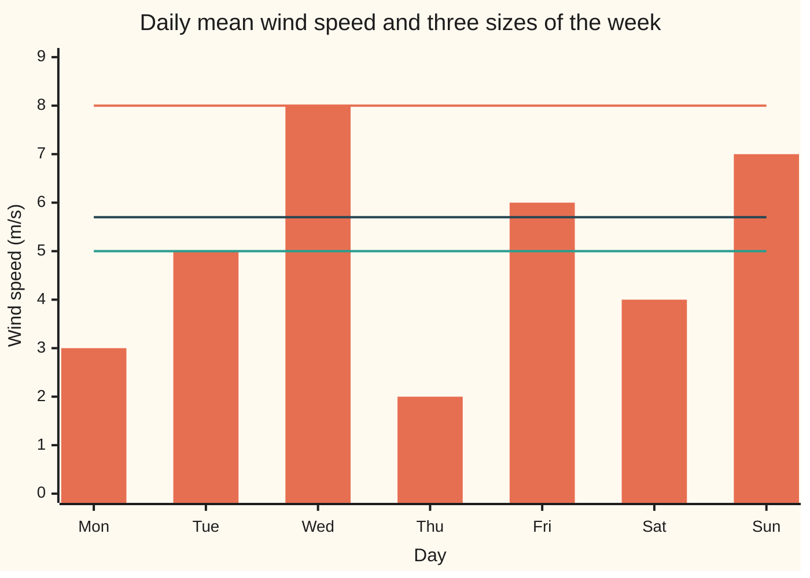
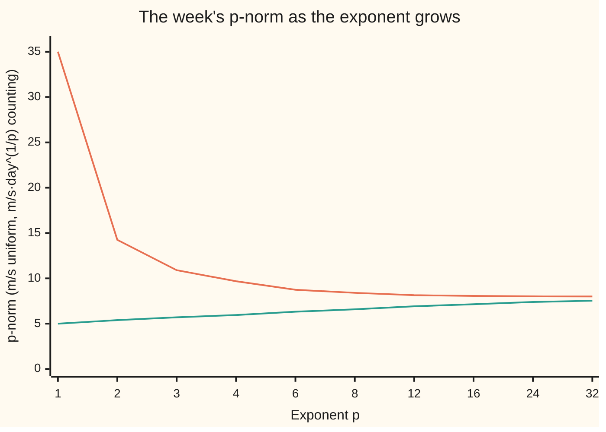

# Lp spaces: measure a function's size by the p-th root of the integral of its p-th power, and treat almost-everywhere-equal functions as one

[Syllabus](../../../SYLLABUS.md) → [Measure and integration](../../../SYLLABUS.md#w10) → [Sizes of Functions](../../../SYLLABUS.md#w10-s07) → Lp spaces

---

## General Overview

A wind turbine logs one mean wind speed per day. Over one week the log reads 3, 5, 8, 2, 6, 4 and 7 metres per second. How windy was the week? Three people give three honest answers.

The accountant adds: 35 m/s·days in total, 5 m/s on an average day. The energy analyst knows a turbine's power grows with the cube of the wind speed, so she averages the cubes, 185, and takes the cube root: 5.698 m/s, the steady speed that would deliver the same energy. The structural engineer cares only about the worst day: 8 m/s, which sets the load the blades must survive.

All three come from one recipe: raise each speed to a power p, average, take the p-th root. The power decides how much the windy days count; as p grows without limit only the worst day survives. The root puts the answer back in m/s. The result is the **p-norm**, the word used from here on, and the functions with finite p-norm form a space called **L^p**, read "L-p".

Now suppose a logger that records the speed at every instant misfires once and records 40 m/s. An instant has length zero, so no integral notices it and no p-norm moves. A size that cannot see a difference cannot tell the two records apart, so L^p counts functions that agree **almost everywhere**, except on a set of measure zero, as one element.

**Size a function by integrating the p-th power of its absolute value and taking the p-th root; for p = ∞ use the smallest ceiling it breaks only on a set of measure zero; and count two functions as one element of L^p when they differ only on such a set, which makes L^p a vector space on which the p-norm is zero only at zero.**

**What kind of fact this is:** a definition (the p-norm, the essential supremum, conjugate exponents, the space L^p), with the facts that make it work proved on this card in Why it works; the triangle inequality is proved on [Minkowski's inequality](03-minkowskis-inequality.md).

### The picture: one week, three sizes



The bars are the seven days. With each day weighing 1/7, the lowest line is the 1-norm, the plain mean, 5 m/s. The middle line is the 3-norm, the cube-mean speed, 5.70 m/s. The top line is the ∞-norm, the worst day, 8 m/s.

---

## The formula

Notation first. A measure space $(\Omega, \mathcal F, \mu)$ is a set of points $\Omega$, the collection $\mathcal F$ of sets we allow ourselves to measure, and a measure $\mu$ giving each such set a size ([Measures](../01-Sets%20You%20Can%20Measure/04-measures.md)). For the week, $\Omega$ is the seven days, $\mathcal F$ is every set of days, and two measures are in play: **counting measure**, each day weighing 1, and the **uniform probability**, each day weighing 1/7. The integral $\int f\,d\mu$, read "the integral of f against mu", is here the weighted sum of the seven values. A property holds **almost everywhere**, written a.e., when it fails only on a set of measure zero, a **null set** ([Null sets and almost everywhere](../01-Sets%20You%20Can%20Measure/07-null-sets-and-almost-everywhere.md)). Double bars $\lVert f\rVert$ denote a size.

For a measurable $f$ and an exponent $p$ with $1 \le p < \infty$, the **p-norm** is

$$\lVert f\rVert_p = \Big(\int \lvert f\rvert^p\,d\mu\Big)^{1/p}.$$

**Read it aloud:** take the size of f at each point, raise it to the power p, integrate against mu, and take the p-th root.

For $p = \infty$ the norm is the **essential supremum**, the smallest ceiling that f breaks only on a set of measure zero:

$$\lVert f\rVert_\infty = \inf\{\, M \ge 0 : \mu(\lvert f\rvert > M) = 0 \,\}.$$

**Read it aloud:** the least height M such that the set where the size of f climbs above M has measure zero.

The space $\mathcal L^p(\mu)$ is every measurable function with $\lVert f\rVert_p < \infty$. The space $L^p(\mu)$ is the same collection with a.e.-equal functions counted as one: its elements are **classes** $[f]$, each the set of functions equal to f almost everywhere. With $\mathcal N$ the functions that are zero a.e., $[f] = f + \mathcal N$.

Two exponents $p$ and $q$ are **conjugate** when

$$\frac1p + \frac1q = 1, \qquad\text{that is}\qquad q = \frac{p}{p-1},$$

with 1 and ∞ counted as a conjugate pair. So 2 pairs with 2, and 3 with 3/2. Conjugate pairs are the exponents that [Holder's inequality](02-holders-inequality.md) can pair; Step 6 shows why no other pair can work.

| Symbol | Plain meaning | In our example | Push it up and the answer… |
| --- | --- | --- | --- |
| $\Omega$, $\mathcal F$ | the points; the sets we may measure | the 7 days; every set of days | more points, more to add |
| $\mu$ | the measure: a size for each measurable set | counting (1 a day) or uniform (1/7 a day) | multiply it by c and the p-norm grows by c^(1/p) |
| $f$, $g$ | measurable functions with real values | the week's speeds; the constant 5 | — |
| $v$, $u$, $s$ | the week; a gust $u(t) = 8t$; a spike $s(t) = 1/\sqrt t$ | 3, 5, 8, 2, 6, 4, 7 m/s; 0 to 8 m/s in one hour; unbounded near 0 | — |
| $p$ | the exponent, 1 or more | 1, 2, 3 | big values count for more |
| $\lVert f\rVert_p$ | the p-norm | 14.25 counting, 5.385 uniform, at p = 2 | — |
| $\lVert f\rVert_\infty$, $M$, $S$ | the essential supremum; a candidate ceiling; its value in the proof | 8 m/s, despite a 40 m/s glitch | — |
| $q$ | the conjugate exponent, p/(p − 1) | 2 for p = 2; 3/2 for p = 3; ∞ for p = 1 | p up, q down toward 1 |
| $\mathcal N$, $[f]$, $L^p$ | functions zero a.e.; f's class; the space of classes | the glitch indicator lies in $\mathcal N$ | — |
| $a$, $b$, $c$ | real scalars; a factor multiplying the measure | a = 2; c = 1/7 turns counting into uniform | a: norm grows by the size of a |
| $\lambda$, $t$ | length, Lebesgue measure; time in hours | the hour [0, 1] | — |
| $A$, $n$, $h$, $\varepsilon$, $C$ | proof helpers: a set, a whole-number index, a non-negative function, a threshold, a constant | A = where the size of f exceeds M | — |

### When it holds

A definition, so nothing can fail; each piece earns its place:

- **Measurability.** Without it $\lvert f\rvert^p$ has no integral.
- **An exponent of at least 1.** Below 1 the triangle inequality fails: Step 2.
- **Classes, not functions.** Otherwise the glitch alone, a nonzero function, has norm zero.
- **Any measure.** Counting measure gives sequence spaces, length gives functions on the line, a probability gives random quantities with a finite p-th moment.

---

## Why it works

### Step 0: raise, integrate, root

A size for functions should behave like the length of an arrow: grow in proportion when the function is scaled, be zero only for zero, and obey the triangle inequality, the size of a sum at most the sum of the sizes. The power picks which values dominate, the integral adds them with the measure's weights, the root restores the scale. Each step below checks one demand, or names the card that does.

### Step 1: the root makes the size scale

Double every speed. The sum of squares goes from 203 to 812, four times as much. The square root goes from 14.2478 to 28.4956, exactly twice. In general $\lvert af\rvert^p = \lvert a\rvert^p \lvert f\rvert^p$, so the integral grows by $\lvert a\rvert^p$ and its p-th root by $\lvert a\rvert$:

$$\lVert af\rVert_p = \lvert a\rvert\,\lVert f\rVert_p.$$

The root also keeps the units: m/s under the uniform probability; under counting, where each day weighs 1 day, the p-norm is in m/s·day^(1/p), so the 1-norm 35 is in m/s·days and the 2-norm 14.2478 in m/s·day^(1/2).

### Step 2: why the exponent starts at 1

Let f be 1 on Monday and 0 elsewhere, g be 1 on Tuesday and 0 elsewhere, and count days. At p = 1/2 each has size $1^{1/2}$ squared, 1. Their sum is 1 on two days, of size $(1 + 1)^2 = 4$. The size of the sum beats the sum of the sizes, 4 > 2, so the triangle inequality fails.

For $p \ge 1$ the triangle inequality holds, because $t^p$ bends upward exactly then; [Minkowski's inequality](03-minkowskis-inequality.md) proves it.

### Step 3: p = ∞ is the limit, and why "essential"

Watch the week's norm as p grows. Under counting measure it falls from 35 toward 8; under the uniform probability it rises from 5 toward 8. Both are squeezed: every term is at most $8^p$ and one term equals it, so

$$8 \le \lVert v\rVert_p \le 7^{1/p}\cdot 8 \quad\text{(counting)}, \qquad 7^{-1/p}\cdot 8 \le \lVert v\rVert_p \le 8 \quad\text{(uniform)},$$

and $7^{1/p}$ tends to 1. At p = 32 the bounds are 8.5016 and 7.5280.



The falling line is counting measure, the rising line the uniform probability. Both close on 8 from opposite sides, because the week weighs 7 under counting and 1 under the probability.

Now move to a continuous record: a gust whose speed climbs steadily from 0 to 8 m/s over one hour, $u(t) = 8t$ for t in [0, 1], with length $\lambda$ as the measure. Its norms are $8/(p+1)^{1/p}$: 4 at p = 1, 4.6188 at p = 2, 5.0397 at p = 3, and 7.9449 at p = 1000, climbing to 8.

Add the logger's glitch: 40 m/s at the instant t = 0.5. The plain supremum, the largest value taken, jumps to 40. No p-norm moves, since a set of length 0 carries no integral, so their limit stays 8. The essential supremum agrees: the speed exceeds 7 on a set of length 0.125 and exceeds 8 on a set of length 0, so the least ceiling broken only on a null set is 8. On any finite measure $\lVert f\rVert_p \to \lVert f\rVert_\infty$ (Detailed proof, part 8). Under counting measure no nonempty set is null, so the essential supremum is the maximum.

### Step 4: L^p is closed under sums

If f and g have finite p-norm, does f + g? At every point $\lvert f + g\rvert$ is at most twice the larger of $\lvert f\rvert$ and $\lvert g\rvert$, so

$$\lvert f+g\rvert^p \le 2^p\big(\lvert f\rvert^p + \lvert g\rvert^p\big).$$

Integrate: the left side is finite whenever the right is. With Step 1, $\mathcal L^p(\mu)$ is a vector space, closed under adding and scaling ([Vector spaces and subspaces](../../03-Algebra/03-Vectors/02-vector-spaces-and-subspaces.md)). Minkowski's inequality replaces this crude bound with the sharp one, $\lVert f+g\rVert_p \le \lVert f\rVert_p + \lVert g\rVert_p$.

Not every function is in. The spike $s(t) = 1/\sqrt t$ on (0, 1] has 1-norm 2. But $s^2 = 1/t$ puts ln 2 = 0.6931 on every halving, 1/2 to 1, 1/4 to 1/2, and on forever: 27.73 by $2^{-40}$ and no end. The spike is in $L^1$, not in $L^2$.

### Step 5: a.e.-equal functions become one element

A space small enough to list in full: Monday and Tuesday weigh 1 each, the glitch instant weighs 0. A function with values 0 or 1 is a triple (Mon, Tue, glitch): eight in all. Two agree a.e. when they differ at most at the glitch, which sorts the eight into four classes of two, such as (1, 0, 0) with (1, 0, 1). The squared 2-norm is constant on each class: 0, 1, 1, 2. Norm zero picks out one class, the zero function and the glitch alone.

Three facts make classes behave on every measure:

- **The functions zero a.e. form a subspace.** The union of two null sets is null, so $\mathcal N$ is closed under sums and scaling.
- **Norm zero means zero a.e.** If $\int \lvert f\rvert^p\,d\mu = 0$, Markov's inequality ([Markov and Chebyshev](../04-The%20Lebesgue%20Integral/07-markov-and-chebyshev.md)) gives the set where $\lvert f\rvert^p \ge 1/n$ measure 0 for every n, and those countably many null sets cover everywhere f is nonzero.
- **The norm and the operations ignore representatives.** Changing f on a null set changes no integral ([Integrable functions](../04-The%20Lebesgue%20Integral/04-integrable-functions-and-l1.md), Detailed proof, part 5), and if e and e' are zero a.e., $(f + e) + (g + e') = (f + g) + (e + e')$ with $e + e'$ still in $\mathcal N$. On the listed space all 256 choices of representatives add into the class predicted.

So $L^p(\mu)$, the classes, is a vector space, and the p-norm on it is zero only at the zero class. With Minkowski's triangle inequality it is a **normed space**: a vector space with a size obeying Steps 0 to 2.

### Step 6: why conjugate exponents

A pairing bound, the integral of $\lvert fg\rvert$ at most a constant times $\lVert f\rVert_p\lVert g\rVert_q$, links L^p and L^q. Which p and q allow one constant for every measure? Multiply the measure by c: the integral of $\lvert fg\rvert$ grows by c, $\lVert f\rVert_p$ by $c^{1/p}$, and $\lVert g\rVert_q$ by $c^{1/q}$. Their ratio grows by

$$c^{\,1 - 1/p - 1/q}.$$

Unless the exponent is 0, sending c toward 0 or infinity makes the ratio as large as anyone likes, and no constant can serve. Take the week and g the constant 1. For p = 2 and q = 2 the ratio is 0.9285 at weights 1/7, 1, 7 and 49. For p = 3 and q = 3/2 it is 0.8775 at all four. For p = 2 and q = 3, not conjugate, it runs 0.9285, 1.2842, 1.7761, 2.4565, growing as $c^{1/6}$. The best constant for conjugate pairs is 1, which is [Holder's inequality](02-holders-inequality.md).

<details>
<summary>Detailed proof</summary>

Throughout, $(\Omega, \mathcal F, \mu)$ is a measure space, $f$ and $g$ are measurable with real values, and $a$, $b$ are real numbers. Facts used: **(I1)** for non-negative measurable functions the integral adds, scales by non-negative constants and respects order ([The integral of a non-negative function](../04-The%20Lebesgue%20Integral/02-integral-of-a-nonnegative-function.md)); **(I2)** a non-negative function that is zero off a null set has integral 0 ([Integrable functions](../04-The%20Lebesgue%20Integral/04-integrable-functions-and-l1.md), part 5); **(I3)** Markov: for a non-negative measurable function h and a threshold $\varepsilon > 0$, $\mu(h \ge \varepsilon) \le \frac1\varepsilon\int h\,d\mu$ ([Markov and Chebyshev](../04-The%20Lebesgue%20Integral/07-markov-and-chebyshev.md)); **(I4)** a countable union of null sets is null, by countable subadditivity ([Null sets and almost everywhere](../01-Sets%20You%20Can%20Measure/07-null-sets-and-almost-everywhere.md)); **(I5)** a continuous function of a measurable function is measurable, so $\lvert f\rvert^p$ is.

**1. Scaling.** $\lvert af\rvert^p = \lvert a\rvert^p\lvert f\rvert^p$ pointwise; by (I1) $\int\lvert af\rvert^p = \lvert a\rvert^p\int\lvert f\rvert^p$; take p-th roots. For $p = \infty$: $\lvert af\rvert > \lvert a\rvert M$ exactly where $\lvert f\rvert > M$ (for $a \ne 0$), so the admissible ceilings scale by $\lvert a\rvert$.

**2. Closure under sums.** Pointwise $\lvert f+g\rvert \le \lvert f\rvert + \lvert g\rvert \le 2\max(\lvert f\rvert, \lvert g\rvert)$, so $\lvert f+g\rvert^p \le 2^p\max(\lvert f\rvert^p, \lvert g\rvert^p) \le 2^p(\lvert f\rvert^p + \lvert g\rvert^p)$. By (I1), $\int\lvert f+g\rvert^p \le 2^p(\int\lvert f\rvert^p + \int\lvert g\rvert^p) < \infty$. For $p = \infty$: off the union of the null sets where $\lvert f\rvert > \lVert f\rVert_\infty$ and $\lvert g\rvert > \lVert g\rVert_\infty$ (null by part 5), $\lvert f + g\rvert \le \lVert f\rVert_\infty + \lVert g\rVert_\infty$. With 1, $\mathcal L^p(\mu)$ is a vector space for $1 \le p \le \infty$.

**3. The null functions.** Let $\mathcal N$ be the measurable functions zero a.e. The zero function is in it. If $f = 0$ off a null set $Z$ and $g = 0$ off a null set $Z'$, then $af + bg = 0$ off $Z \cup Z'$, which is null by (I4). So $\mathcal N$ is a subspace of $\mathcal L^p(\mu)$; each member has norm 0, by (I2) for finite p and by definition for $p = \infty$.

**4. Norm zero means zero a.e.** Suppose $\int\lvert f\rvert^p = 0$. By (I3), $\mu(\lvert f\rvert^p \ge 1/n) \le n \cdot 0 = 0$ for every whole number $n \ge 1$. The set where $f \ne 0$ is the union over n of those sets, null by (I4). For $p = \infty$: $\lVert f\rVert_\infty = 0$ means $\mu(\lvert f\rvert > 0) = 0$ by part 5.

**5. The essential supremum is attained.** Let $S = \lVert f\rVert_\infty$, finite. For each n some admissible M is below $S + 1/n$, and $\{\lvert f\rvert > S + 1/n\} \subseteq \{\lvert f\rvert > M\}$, which is null. The set $\{\lvert f\rvert > S\}$ is the union over n of these, null by (I4). So $\lvert f\rvert \le S$ a.e.

**6. The norm ignores representatives.** If $f = g$ off a null set $Z$, then $\lvert f\rvert^p = \lvert g\rvert^p$ off $Z$. Splitting each over $Z$ and its complement, the pieces on $Z$ have integral 0 by (I2), so by (I1) both integrals equal the common integral off $Z$. For $p = \infty$, the sets $\{\lvert f\rvert > M\}$ and $\{\lvert g\rvert > M\}$ differ only inside $Z$, so one is null exactly when the other is.

**7. The quotient.** Define $[f] + [g] = [f + g]$ and $a[f] = [af]$. These do not depend on the representatives: if $f' = f + e$ and $g' = g + e'$ with $e, e' \in \mathcal N$, then $f' + g' = (f+g) + (e + e')$ and $af' = af + ae$, and part 3 puts $e + e'$ and $a\,e$ in $\mathcal N$. The vector-space rules hold for classes because they hold for representatives. By 6 the norm $\lVert [f]\rVert_p = \lVert f\rVert_p$ is well defined; by 4 it is zero only on $[0] = \mathcal N$; by 1 it scales. The triangle inequality is [Minkowski's inequality](03-minkowskis-inequality.md) for $1 \le p < \infty$ and part 2 for $p = \infty$.

**8. The limit p → ∞.** Let $\mu(\Omega)$ be finite and $S = \lVert f\rVert_\infty$ finite. Upper: $\lvert f\rvert^p \le S^p$ a.e. by 5, so by (I1), (I2) $\lVert f\rVert_p \le S\,\mu(\Omega)^{1/p}$, which tends to S (or equals 0 if $\mu(\Omega) = 0$). Lower: for $M < S$ the set $A = \{\lvert f\rvert > M\}$ has $\mu(A) > 0$, else M would be admissible; $\lvert f\rvert^p \ge M^p\mathbf 1_A$, so $\lVert f\rVert_p \ge M\mu(A)^{1/p}$, which tends to M. So every limit point of $\lVert f\rVert_p$ lies between M and S for every $M < S$, and the limit is S. If $S = \infty$, the lower bound alone holds for every M, and $\lVert f\rVert_p \to \infty$.

**9. Conjugates.** Under $c\mu$ the three quantities scale by c, $c^{1/p}$ and $c^{1/q}$ (by (I1) and a p-th root). A bound with one constant $C$ for every $c > 0$ keeps $c^{1 - 1/p - 1/q}$ times a fixed positive ratio below $C$, which forces $1 - 1/p - 1/q = 0$.

</details>

On counting measure over the whole numbers the same definitions give the sequence spaces, sized by sums instead of integrals; Sequence spaces studies them as spaces in their own right.

---

## Worked numbers, by hand

The week, three exponents, two measures.

| Step | Arithmetic | Value |
| --- | --- | --- |
| sum of speeds | 3 + 5 + 8 + 2 + 6 + 4 + 7 | 35 |
| sum of squares | 9 + 25 + 64 + 4 + 36 + 16 + 49 | 203 |
| sum of cubes | 27 + 125 + 512 + 8 + 216 + 64 + 343 | 1295 |
| counting 1-, 2-, 3-norms | 35; square root of 203; cube root of 1295 | **35, 14.2478, 10.8999** |
| uniform: divide each sum by 7 | 35/7, 203/7, 1295/7 | 5, 29, 185 |
| uniform 1-, 2-, 3-norms | 5; square root of 29; cube root of 185 | **5, 5.3852, 5.6980** |
| ∞-norm, both measures | every day has positive weight, so the largest value | **8** |
| deviation from the mean | −2, 0, 3, −3, 1, −1, 2; squares sum to 28; 28/7 | 4, so 2-norm **2 m/s** |

Under the uniform probability the 2-norm is the root-mean-square speed, 5.3852 m/s. Its square, 29, splits as 25 + 4: the squared mean plus the squared 2-norm of the deviation. That 2 m/s is the week's standard deviation; the split is Pythagoras in L^2, the subject of [L2 as a Hilbert space](06-l2-as-a-hilbert-space.md).

In the world: the week's energy matches a steady 5.70 m/s, not the average 5, and the blades must survive 8.

### What breaks if you drop a piece

| Mistake | Comes out at | What went wrong |
| --- | --- | --- |
| Exponent 1/2 | Monday plus Tuesday has size 4 > 1 + 1 | the triangle inequality fails below p = 1 |
| Plain supremum for p = ∞ | 40 m/s from one glitched instant | a null set moved the size; the p-norms say 8 |
| No root | doubling the week turns 203 into 812, four times | the size scaled by 2^p, not 2 |
| Assume every function lies in every L^p | the spike's 1/t piles up 6.93, 13.86, 27.73 down to 2^-10, 2^-20, 2^-40 | $s$ is in $L^1$, not in $L^2$ |

The code prints all four.

---

## Code, from first principles, and it actually runs

Nothing imported knows a norm. The week's power sums take two roads: point by point, and by slicing at each height level, adding the rise in the p-th power times the number of days at or above that level. The uniform norms come directly, with a scaling check against $7^{-1/p}$ times the counting norms; the split 29 = 25 + 4 is exact. The gust's norms come from the formula and from a midpoint sum on 100000 cells; the glitched gust is stored as straight pieces, the glitch one of length 0, and its plain supremum and essential supremum are both computed from those pieces; the spike is summed over 60 halvings; the a.e. classes are listed in full with all 256 representative sums. The code checks these functions and finite stages; that the definitions work on every measure is the proof's job. Rust keeps fractions by hand.

### Python

```python
# Lp spaces -- the check behind the card.  Standard library only; nothing
# imported knows a norm.  The week's wind (3, 5, 8, 2, 6, 4, 7) m/s is sized
# under counting measure and under the uniform probability 1/7, each size by
# two roads; a one-hour gust is sized by an exact formula and by a midpoint
# sum; a three-point space is listed in full to show the a.e. classes.
from fractions import Fraction as Fr

V = [3, 5, 8, 2, 6, 4, 7]

def power_sum(f, p):                     # road one: add up |f|^p, point by point
    return sum(abs(x) ** p for x in f)

def layer_cake(f, p):                    # road two: slice by height, never touch a point
    total, below = 0, 0                  # (t^p - s^p) times the count of points above s
    for t in sorted(set(abs(x) for x in f)):
        total += (t ** p - below ** p) * sum(1 for x in f if abs(x) >= t)
        below = t
    return total

def norm(f, p, w=1.0):                   # p-norm with every point weighing w
    return (w * power_sum(f, p)) ** (1 / p)

def midpoint(g, a, b, n):                # our own integrator: n equal cells
    h = (b - a) / n
    return h * sum(g(a + (k + 0.5) * h) for k in range(n))

print("1. the week under counting measure (each day weighs 1)")
for p in (1, 2, 3):
    print(f"   p = {p}: sum of |v|^p = {power_sum(V, p)}, by layers {layer_cake(V, p)}, norm {norm(V, p):.4f}")
print(f"   sup-norm = {max(V)}: every day weighs 1, so no day can be ignored")
print("2. the week under the uniform probability (each day weighs 1/7)")
for p in (1, 2, 3):
    exact = Fr(power_sum(V, p), 7)
    print(f"   p = {p}: mean of |v|^p = {exact}, norm {norm(V, p, 1 / 7):.4f}, "
          f"= 7^(-1/{p}) x counting norm {7 ** (-1 / p) * norm(V, p):.4f}")
dev = [x - 5 for x in V]
print(f"   deviation from the mean {dev}: squares sum to {power_sum(dev, 2)}, 2-norm "
      f"{norm(dev, 2, 1 / 7):.4f} m/s, and {Fr(power_sum(V, 2), 7)} = 5^2 + {Fr(power_sum(dev, 2), 7)}")
print("3. the p-norm as p grows (chart)")
PS = [1, 2, 3, 4, 6, 8, 12, 16, 24, 32]
cnt = [norm(V, p) for p in PS]
uni = [norm(V, p, 1 / 7) for p in PS]
print("   p        " + " ".join(f"{p:>5}" for p in PS))
print("   counting " + " ".join(f"{x:5.2f}" for x in cnt))
print("   uniform  " + " ".join(f"{x:5.2f}" for x in uni))
print(f"   squeeze at p = 32: {8 * 7 ** (-1 / 32):.4f} <= uniform <= 8 <= counting <= {8 * 7 ** (1 / 32):.4f}")
print("4. a one-hour gust u(t) = 8t on [0, 1], length as the measure")
for p in (1, 2, 3):
    exact = 8 / (p + 1) ** (1 / p)
    mid = midpoint(lambda t: (8 * t) ** p, 0.0, 1.0, 100000) ** (1 / p)
    print(f"   p = {p}: exact 8/(p+1)^(1/p) = {exact:.4f}, midpoint sum {mid:.4f}")
# the logger's glitch: 40 m/s at the single instant t = 0.5.  The glitched record as pieces
# (a, b, c0, c1), speed c0 + c1 t from a to b; the glitch is the piece of length 0
rec = [(0.0, 0.5, 0, 8), (0.5, 0.5, 40, 0), (0.5, 1.0, 0, 8)]
plain = max(c0 + c1 * t for a, b, c0, c1 in rec for t in (a, b))     # largest value; a straight piece peaks at an end
above = lambda M: sum(midpoint(lambda t: float(c0 + c1 * t > M), a, b, 1000) for a, b, c0, c1 in rec)  # length above M
ess = next(M for M in range(0, 41) if above(M) == 0)                 # least ceiling broken only on length 0
print(f"   with a 40 m/s glitch at t = 0.5: plain sup {plain:.0f}, ess sup {ess} "
      f"(length above 7 is {above(7):.4f}, above 8 is {above(8):.4f})")
print(f"   p-norms climb to the ess sup, not the glitch: p = 100 gives {8 / 101 ** (1 / 100):.4f}, "
      f"p = 1000 gives {8 / 1001 ** (1 / 1000):.4f}")
print("5. the spike s(t) = 1/sqrt(t) on (0, 1]: in L^1, not in L^2")
one = sum(midpoint(lambda t: t ** -0.5, 2.0 ** -(j + 1), 2.0 ** -j, 2000) for j in range(60))
piece = midpoint(lambda t: 1 / t, 0.5, 1.0, 2000)
print(f"   1-norm by 60 halvings {one:.4f}; exact 2")
print(f"   integral of s^2 = 1/t over each halving [2^-(j+1), 2^-j]: {piece:.4f} every time")
print(f"   down to 2^-10, 2^-20, 2^-40: {10 * piece:.2f}, {20 * piece:.2f}, {40 * piece:.2f}: no finite 2-norm")
print("6. a.e. classes, listed in full: Mon and Tue weigh 1, the glitch instant weighs 0")
W3 = [1, 1, 0]
funcs = [(a, b, c) for a in (0, 1) for b in (0, 1) for c in (0, 1)]
same = lambda f, g: sum(w for x, y, w in zip(f, g, W3) if x != y) == 0   # differ on a null set only
n2 = lambda f: Fr(sum(w * x * x for x, w in zip(f, W3)))                  # squared 2-norm, exact
classes = []
for f in funcs:
    for cl in classes:
        if same(f, cl[0]):
            cl.append(f)
            break
    else:
        classes.append([f])
for cl in classes:
    print(f"   class {cl}: squared 2-norm {sorted(set(int(n2(f)) for f in cl))}")
zero = [f for f in funcs if n2(f) == 0]
add = lambda f, g: tuple(x + y for x, y in zip(f, g))
checks = [(f1, f2, g1, g2) for c1 in classes for c2 in classes
          for f1 in c1 for f2 in c1 for g1 in c2 for g2 in c2]
good = sum(1 for f1, f2, g1, g2 in checks if same(add(f1, g1), add(f2, g2)))
print(f"   {len(funcs)} functions, {len(classes)} classes; norm zero on {zero}")
print(f"   sums of representatives landing in one class: {good} of {len(checks)}")
print("7. conjugate exponents and why 1/p + 1/q = 1")
for p, q in ((Fr(1), "infinity"), (Fr(3, 2), 3), (Fr(2), 2), (Fr(3), Fr(3, 2))):
    print(f"   p = {p}: q = {q}" + ("" if p == 1 else f", 1/p + 1/q = {1 / p + 1 / Fr(q)}"))
def ratio(p, q, c):                      # integral of v times 1, over ||v||_p ||1||_q, weight c
    return c * sum(V) / (norm(V, p, c) * norm([1] * 7, q, c))
for p, q in ((2, 2), (3, 1.5), (2, 3)):
    print(f"   p = {p}, q = {q}: ratio at weight 1/7, 1, 7, 49 = "
          + ", ".join(f"{ratio(p, q, c):.4f}" for c in (1 / 7, 1, 7, 49)))
print("8. what breaks")
a, b = [1, 0, 0, 0, 0, 0, 0], [0, 1, 0, 0, 0, 0, 0]
half = lambda f: sum(abs(x) ** 0.5 for x in f) ** 2
print(f"   p = 1/2 on Mon and Tue alone: size of the sum {half(add(a, b)):.0f} > {half(a) + half(b):.0f}")
print(f"   no root: sum of |2v|^2 = {power_sum([2 * x for x in V], 2)} = 4 x 203; "
      f"with the root {norm([2 * x for x in V], 2):.4f} = 2 x {norm(V, 2):.4f}")
print("figure, bars 3 5 8 2 6 4 7; levels 5.00 5.70 8.00")

for p in (1, 2, 3, 4):                   # two roads to each counting power sum
    assert power_sum(V, p) == layer_cake(V, p)
assert Fr(power_sum(V, 2), 7) == Fr(sum(V), 7) ** 2 + Fr(power_sum(dev, 2), 7)   # 29 = 25 + 4
for p in (1, 2, 3):                      # exact gust norm against the midpoint sum
    assert abs(8 / (p + 1) ** (1 / p) - midpoint(lambda t: (8 * t) ** p, 0, 1, 100000) ** (1 / p)) < 1e-6
assert abs(one - 2) < 1e-4 and abs(piece - 0.6931471805599453) < 1e-6
assert len(classes) == 4 and all(len(c) == 2 for c in classes) and good == len(checks)
assert all(8 * 7 ** (-1 / p) <= u <= 8 <= c <= 8 * 7 ** (1 / p) for p, u, c in zip(PS, uni, cnt))
for p in (1, 2, 3):                      # uniform norm, directly and through 7^(-1/p)
    assert abs(norm(V, p, 1 / 7) - 7 ** (-1 / p) * norm(V, p)) < 1e-12
assert plain == 40 and ess == 8 and zero in classes and half(add(a, b)) > half(a) + half(b)
for p, q in ((2, 2), (3, 1.5)):          # conjugate pairs: the ratio ignores the weight
    assert all(abs(ratio(p, q, c) - ratio(p, q, 1)) < 1e-12 for c in (1 / 7, 7, 49))
assert abs(ratio(2, 3, 49) / ratio(2, 3, 1) - 49 ** (1 - 1 / 2 - 1 / 3)) < 1e-9   # scales as c^(1/6)
print("ALL CHECKS PASS")
```

**Ran 2026-10-06 on macOS, Python 3.14.6, standard library only. All checks passed. Output, pasted from the run:**

```
1. the week under counting measure (each day weighs 1)
   p = 1: sum of |v|^p = 35, by layers 35, norm 35.0000
   p = 2: sum of |v|^p = 203, by layers 203, norm 14.2478
   p = 3: sum of |v|^p = 1295, by layers 1295, norm 10.8999
   sup-norm = 8: every day weighs 1, so no day can be ignored
2. the week under the uniform probability (each day weighs 1/7)
   p = 1: mean of |v|^p = 5, norm 5.0000, = 7^(-1/1) x counting norm 5.0000
   p = 2: mean of |v|^p = 29, norm 5.3852, = 7^(-1/2) x counting norm 5.3852
   p = 3: mean of |v|^p = 185, norm 5.6980, = 7^(-1/3) x counting norm 5.6980
   deviation from the mean [-2, 0, 3, -3, 1, -1, 2]: squares sum to 28, 2-norm 2.0000 m/s, and 29 = 5^2 + 4
3. the p-norm as p grows (chart)
   p            1     2     3     4     6     8    12    16    24    32
   counting 35.00 14.25 10.90  9.68  8.74  8.40  8.14  8.06  8.01  8.00
   uniform   5.00  5.39  5.70  5.95  6.32  6.58  6.92  7.14  7.39  7.53
   squeeze at p = 32: 7.5280 <= uniform <= 8 <= counting <= 8.5016
4. a one-hour gust u(t) = 8t on [0, 1], length as the measure
   p = 1: exact 8/(p+1)^(1/p) = 4.0000, midpoint sum 4.0000
   p = 2: exact 8/(p+1)^(1/p) = 4.6188, midpoint sum 4.6188
   p = 3: exact 8/(p+1)^(1/p) = 5.0397, midpoint sum 5.0397
   with a 40 m/s glitch at t = 0.5: plain sup 40, ess sup 8 (length above 7 is 0.1250, above 8 is 0.0000)
   p-norms climb to the ess sup, not the glitch: p = 100 gives 7.6392, p = 1000 gives 7.9449
5. the spike s(t) = 1/sqrt(t) on (0, 1]: in L^1, not in L^2
   1-norm by 60 halvings 2.0000; exact 2
   integral of s^2 = 1/t over each halving [2^-(j+1), 2^-j]: 0.6931 every time
   down to 2^-10, 2^-20, 2^-40: 6.93, 13.86, 27.73: no finite 2-norm
6. a.e. classes, listed in full: Mon and Tue weigh 1, the glitch instant weighs 0
   class [(0, 0, 0), (0, 0, 1)]: squared 2-norm [0]
   class [(0, 1, 0), (0, 1, 1)]: squared 2-norm [1]
   class [(1, 0, 0), (1, 0, 1)]: squared 2-norm [1]
   class [(1, 1, 0), (1, 1, 1)]: squared 2-norm [2]
   8 functions, 4 classes; norm zero on [(0, 0, 0), (0, 0, 1)]
   sums of representatives landing in one class: 256 of 256
7. conjugate exponents and why 1/p + 1/q = 1
   p = 1: q = infinity
   p = 3/2: q = 3, 1/p + 1/q = 1
   p = 2: q = 2, 1/p + 1/q = 1
   p = 3: q = 3/2, 1/p + 1/q = 1
   p = 2, q = 2: ratio at weight 1/7, 1, 7, 49 = 0.9285, 0.9285, 0.9285, 0.9285
   p = 3, q = 1.5: ratio at weight 1/7, 1, 7, 49 = 0.8775, 0.8775, 0.8775, 0.8775
   p = 2, q = 3: ratio at weight 1/7, 1, 7, 49 = 0.9285, 1.2842, 1.7761, 2.4565
8. what breaks
   p = 1/2 on Mon and Tue alone: size of the sum 4 > 2
   no root: sum of |2v|^2 = 812 = 4 x 203; with the root 28.4956 = 2 x 14.2478
figure, bars 3 5 8 2 6 4 7; levels 5.00 5.70 8.00
ALL CHECKS PASS
```

### Rust

Same numbers, same labels, built with `rustc --edition 2021 -O`.

```rust
// Lp spaces -- the same check as the Python, in Rust.  No crates.  The week's
// wind (3, 5, 8, 2, 6, 4, 7) m/s is sized under counting measure and under the
// uniform probability 1/7, each size by two roads; a one-hour gust is sized by
// an exact formula and by a midpoint sum; a three-point space is listed in full
// to show the a.e. classes.  Fractions are kept by hand as (numerator, denominator).
const V: [i64; 7] = [3, 5, 8, 2, 6, 4, 7];

fn gcd(a: i64, b: i64) -> i64 { if b == 0 { a.abs() } else { gcd(b, a % b) } }
fn frac(n: i64, d: i64) -> String {                // a fraction in lowest terms, as text
    let g = gcd(n, d);
    if d / g == 1 { format!("{}", n / g) } else { format!("{}/{}", n / g, d / g) }
}
fn power_sum(f: &[i64], p: u32) -> i64 { f.iter().map(|x| x.abs().pow(p)).sum() }
fn layer_cake(f: &[i64], p: u32) -> i64 {          // road two: slice by height
    let mut levels: Vec<i64> = f.iter().map(|x| x.abs()).collect();
    levels.sort();
    levels.dedup();
    let (mut total, mut below) = (0, 0i64);
    for &t in &levels {
        total += (t.pow(p) - below.pow(p)) * f.iter().filter(|x| x.abs() >= t).count() as i64;
        below = t;
    }
    total
}
fn norm(f: &[f64], p: f64, w: f64) -> f64 {        // p-norm with every point weighing w
    (w * f.iter().map(|x| x.abs().powf(p)).sum::<f64>()).powf(1.0 / p)
}
fn midpoint(g: &dyn Fn(f64) -> f64, a: f64, b: f64, n: usize) -> f64 {
    let h = (b - a) / n as f64;
    h * (0..n).map(|k| g(a + (k as f64 + 0.5) * h)).sum::<f64>()
}
fn fl(f: &[i64]) -> Vec<f64> { f.iter().map(|&x| x as f64).collect() }
fn half(f: &[i64]) -> f64 { f.iter().map(|&x| (x.abs() as f64).powf(0.5)).sum::<f64>().powi(2) }

fn main() {
    let vf = fl(&V);
    println!("1. the week under counting measure (each day weighs 1)");
    for p in 1..=3u32 {
        println!("   p = {}: sum of |v|^p = {}, by layers {}, norm {:.4}", p, power_sum(&V, p), layer_cake(&V, p), norm(&vf, p as f64, 1.0));
    }
    println!("   sup-norm = {}: every day weighs 1, so no day can be ignored", V.iter().max().unwrap());
    println!("2. the week under the uniform probability (each day weighs 1/7)");
    for p in 1..=3u32 {
        let pf = p as f64;
        println!("   p = {}: mean of |v|^p = {}, norm {:.4}, = 7^(-1/{}) x counting norm {:.4}", p, frac(power_sum(&V, p), 7),
                 norm(&vf, pf, 1.0 / 7.0), p, 7f64.powf(-1.0 / pf) * norm(&vf, pf, 1.0));
    }
    let dev: Vec<i64> = V.iter().map(|x| x - 5).collect();
    println!("   deviation from the mean {:?}: squares sum to {}, 2-norm {:.4} m/s, and {} = 5^2 + {}", dev, power_sum(&dev, 2),
             norm(&fl(&dev), 2.0, 1.0 / 7.0), frac(power_sum(&V, 2), 7), frac(power_sum(&dev, 2), 7));
    println!("3. the p-norm as p grows (chart)");
    let ps = [1, 2, 3, 4, 6, 8, 12, 16, 24, 32];
    let cnt: Vec<f64> = ps.iter().map(|&p| norm(&vf, p as f64, 1.0)).collect();
    let uni: Vec<f64> = ps.iter().map(|&p| norm(&vf, p as f64, 1.0 / 7.0)).collect();
    println!("   p        {}", ps.iter().map(|p| format!("{:>5}", p)).collect::<Vec<_>>().join(" "));
    println!("   counting {}", cnt.iter().map(|x| format!("{:5.2}", x)).collect::<Vec<_>>().join(" "));
    println!("   uniform  {}", uni.iter().map(|x| format!("{:5.2}", x)).collect::<Vec<_>>().join(" "));
    println!("   squeeze at p = 32: {:.4} <= uniform <= 8 <= counting <= {:.4}", 8.0 * 7f64.powf(-1.0 / 32.0), 8.0 * 7f64.powf(1.0 / 32.0));
    println!("4. a one-hour gust u(t) = 8t on [0, 1], length as the measure");
    let gust = |p: f64| midpoint(&|t: f64| (8.0 * t).powf(p), 0.0, 1.0, 100000).powf(1.0 / p);
    for p in 1..=3 {
        let pf = p as f64;
        println!("   p = {}: exact 8/(p+1)^(1/p) = {:.4}, midpoint sum {:.4}", p, 8.0 / (pf + 1.0).powf(1.0 / pf), gust(pf));
    }
    // the logger's glitch: 40 m/s at the single instant t = 0.5.  The glitched record as pieces
    // (a, b, c0, c1), speed c0 + c1 t from a to b; the glitch is the piece of length 0
    let rec: [(f64, f64, f64, f64); 3] = [(0.0, 0.5, 0.0, 8.0), (0.5, 0.5, 40.0, 0.0), (0.5, 1.0, 0.0, 8.0)];
    let plain = rec.iter().map(|&(a, b, c0, c1)| f64::max(c0 + c1 * a, c0 + c1 * b)).fold(f64::MIN, f64::max); // a straight piece peaks at an end
    let above = |m: f64| rec.iter().map(|&(a, b, c0, c1)| midpoint(&|t: f64| if c0 + c1 * t > m { 1.0 } else { 0.0 }, a, b, 1000)).sum::<f64>();
    let ess = (0..41).find(|&m| above(m as f64) == 0.0).unwrap();      // least ceiling broken only on length 0
    println!("   with a 40 m/s glitch at t = 0.5: plain sup {:.0}, ess sup {} (length above 7 is {:.4}, above 8 is {:.4})", plain, ess, above(7.0), above(8.0));
    println!("   p-norms climb to the ess sup, not the glitch: p = 100 gives {:.4}, p = 1000 gives {:.4}",
             8.0 / 101f64.powf(1.0 / 100.0), 8.0 / 1001f64.powf(1.0 / 1000.0));
    println!("5. the spike s(t) = 1/sqrt(t) on (0, 1]: in L^1, not in L^2");
    let one: f64 = (0..60).map(|j| midpoint(&|t: f64| t.powf(-0.5), 2f64.powf(-(j as f64 + 1.0)), 2f64.powf(-(j as f64)), 2000)).sum();
    let piece = midpoint(&|t: f64| 1.0 / t, 0.5, 1.0, 2000);
    println!("   1-norm by 60 halvings {:.4}; exact 2", one);
    println!("   integral of s^2 = 1/t over each halving [2^-(j+1), 2^-j]: {:.4} every time", piece);
    println!("   down to 2^-10, 2^-20, 2^-40: {:.2}, {:.2}, {:.2}: no finite 2-norm", 10.0 * piece, 20.0 * piece, 40.0 * piece);
    println!("6. a.e. classes, listed in full: Mon and Tue weigh 1, the glitch instant weighs 0");
    type F3 = (i64, i64, i64);
    let w3 = [1, 1, 0];
    let arr = |f: F3| [f.0, f.1, f.2];
    let same = |f: F3, g: F3| (0..3).filter(|&i| arr(f)[i] != arr(g)[i]).map(|i| w3[i]).sum::<i64>() == 0;
    let n2 = |f: F3| (0..3).map(|i| w3[i] * arr(f)[i] * arr(f)[i]).sum::<i64>();   // squared 2-norm, exact
    let mut funcs: Vec<F3> = Vec::new();
    for a in 0..2 { for b in 0..2 { for c in 0..2 { funcs.push((a, b, c)) } } }
    let mut classes: Vec<Vec<F3>> = Vec::new();
    for &f in &funcs {
        match classes.iter_mut().find(|cl| same(f, cl[0])) { Some(cl) => cl.push(f), None => classes.push(vec![f]) }
    }
    for cl in &classes {
        let mut sq: Vec<i64> = cl.iter().map(|&f| n2(f)).collect();
        sq.sort();
        sq.dedup();
        println!("   class {:?}: squared 2-norm {:?}", cl, sq);
    }
    let zero: Vec<F3> = funcs.iter().copied().filter(|&f| n2(f) == 0).collect();
    let add = |f: F3, g: F3| (f.0 + g.0, f.1 + g.1, f.2 + g.2);
    let (mut good, mut total) = (0, 0);
    for c1 in &classes { for c2 in &classes { for &f1 in c1 { for &f2 in c1 { for &g1 in c2 { for &g2 in c2 {
        total += 1;
        if same(add(f1, g1), add(f2, g2)) { good += 1 }
    } } } } } }
    println!("   {} functions, {} classes; norm zero on {:?}", funcs.len(), classes.len(), zero);
    println!("   sums of representatives landing in one class: {} of {}", good, total);
    println!("7. conjugate exponents and why 1/p + 1/q = 1");
    println!("   p = 1: q = infinity");
    for &(pn, pd) in &[(3i64, 2i64), (2, 1), (3, 1)] {
        let (qn, qd) = (pn, pn - pd);                  // q = p/(p - 1)
        println!("   p = {}: q = {}, 1/p + 1/q = {}", frac(pn, pd), frac(qn, qd), frac(pd * qn + qd * pn, pn * qn));
    }
    let ratio = |p: f64, q: f64, c: f64| c * 35.0 / (norm(&vf, p, c) * norm(&[1.0; 7], q, c));
    for &(p, q, lab) in &[(2.0, 2.0, "p = 2, q = 2"), (3.0, 1.5, "p = 3, q = 1.5"), (2.0, 3.0, "p = 2, q = 3")] {
        println!("   {}: ratio at weight 1/7, 1, 7, 49 = {}", lab,
                 [1.0 / 7.0, 1.0, 7.0, 49.0].iter().map(|&c| format!("{:.4}", ratio(p, q, c))).collect::<Vec<_>>().join(", "));
    }
    println!("8. what breaks");
    let (a, b) = ([1i64, 0, 0, 0, 0, 0, 0], [0i64, 1, 0, 0, 0, 0, 0]);
    let ab: Vec<i64> = (0..7).map(|i| a[i] + b[i]).collect();
    println!("   p = 1/2 on Mon and Tue alone: size of the sum {:.0} > {:.0}", half(&ab), half(&a) + half(&b));
    let v2: Vec<i64> = V.iter().map(|x| 2 * x).collect();
    println!("   no root: sum of |2v|^2 = {} = 4 x 203; with the root {:.4} = 2 x {:.4}", power_sum(&v2, 2), norm(&fl(&v2), 2.0, 1.0), norm(&vf, 2.0, 1.0));
    println!("figure, bars 3 5 8 2 6 4 7; levels 5.00 5.70 8.00");

    for p in 1..=4 { assert_eq!(power_sum(&V, p), layer_cake(&V, p)) }      // two roads to each power sum
    assert_eq!(power_sum(&V, 2) * 7, 35 * 35 + 7 * power_sum(&dev, 2));     // 29 = 25 + 4, times 49
    for p in 1..=3 { let pf = p as f64; assert!((8.0 / (pf + 1.0).powf(1.0 / pf) - gust(pf)).abs() < 1e-6) }
    assert!((one - 2.0).abs() < 1e-4 && (piece - 0.6931471805599453).abs() < 1e-6);
    assert!(classes.len() == 4 && classes.iter().all(|c| c.len() == 2) && good == total);
    for i in 0..ps.len() {
        let p = ps[i] as f64;
        assert!(8.0 * 7f64.powf(-1.0 / p) <= uni[i] && uni[i] <= 8.0 && 8.0 <= cnt[i] && cnt[i] <= 8.0 * 7f64.powf(1.0 / p));
    }
    for p in 1..=3 { let pf = p as f64; assert!((norm(&vf, pf, 1.0 / 7.0) - 7f64.powf(-1.0 / pf) * norm(&vf, pf, 1.0)).abs() < 1e-12) }
    assert!(plain == 40.0 && ess == 8 && classes.contains(&zero) && half(&ab) > half(&a) + half(&b));
    for &(p, q) in &[(2.0, 2.0), (3.0, 1.5)] { for &c in &[1.0 / 7.0, 7.0, 49.0] { assert!((ratio(p, q, c) - ratio(p, q, 1.0)).abs() < 1e-12) } }
    assert!((ratio(2.0, 3.0, 49.0) / ratio(2.0, 3.0, 1.0) - 49f64.powf(1.0 - 0.5 - 1.0 / 3.0)).abs() < 1e-9);
    println!("ALL CHECKS PASS");
}
```

**Ran 2026-10-06 on macOS, rustc 1.98.1, no crates. All checks passed. Output, pasted from the run:**

```
1. the week under counting measure (each day weighs 1)
   p = 1: sum of |v|^p = 35, by layers 35, norm 35.0000
   p = 2: sum of |v|^p = 203, by layers 203, norm 14.2478
   p = 3: sum of |v|^p = 1295, by layers 1295, norm 10.8999
   sup-norm = 8: every day weighs 1, so no day can be ignored
2. the week under the uniform probability (each day weighs 1/7)
   p = 1: mean of |v|^p = 5, norm 5.0000, = 7^(-1/1) x counting norm 5.0000
   p = 2: mean of |v|^p = 29, norm 5.3852, = 7^(-1/2) x counting norm 5.3852
   p = 3: mean of |v|^p = 185, norm 5.6980, = 7^(-1/3) x counting norm 5.6980
   deviation from the mean [-2, 0, 3, -3, 1, -1, 2]: squares sum to 28, 2-norm 2.0000 m/s, and 29 = 5^2 + 4
3. the p-norm as p grows (chart)
   p            1     2     3     4     6     8    12    16    24    32
   counting 35.00 14.25 10.90  9.68  8.74  8.40  8.14  8.06  8.01  8.00
   uniform   5.00  5.39  5.70  5.95  6.32  6.58  6.92  7.14  7.39  7.53
   squeeze at p = 32: 7.5280 <= uniform <= 8 <= counting <= 8.5016
4. a one-hour gust u(t) = 8t on [0, 1], length as the measure
   p = 1: exact 8/(p+1)^(1/p) = 4.0000, midpoint sum 4.0000
   p = 2: exact 8/(p+1)^(1/p) = 4.6188, midpoint sum 4.6188
   p = 3: exact 8/(p+1)^(1/p) = 5.0397, midpoint sum 5.0397
   with a 40 m/s glitch at t = 0.5: plain sup 40, ess sup 8 (length above 7 is 0.1250, above 8 is 0.0000)
   p-norms climb to the ess sup, not the glitch: p = 100 gives 7.6392, p = 1000 gives 7.9449
5. the spike s(t) = 1/sqrt(t) on (0, 1]: in L^1, not in L^2
   1-norm by 60 halvings 2.0000; exact 2
   integral of s^2 = 1/t over each halving [2^-(j+1), 2^-j]: 0.6931 every time
   down to 2^-10, 2^-20, 2^-40: 6.93, 13.86, 27.73: no finite 2-norm
6. a.e. classes, listed in full: Mon and Tue weigh 1, the glitch instant weighs 0
   class [(0, 0, 0), (0, 0, 1)]: squared 2-norm [0]
   class [(0, 1, 0), (0, 1, 1)]: squared 2-norm [1]
   class [(1, 0, 0), (1, 0, 1)]: squared 2-norm [1]
   class [(1, 1, 0), (1, 1, 1)]: squared 2-norm [2]
   8 functions, 4 classes; norm zero on [(0, 0, 0), (0, 0, 1)]
   sums of representatives landing in one class: 256 of 256
7. conjugate exponents and why 1/p + 1/q = 1
   p = 1: q = infinity
   p = 3/2: q = 3, 1/p + 1/q = 1
   p = 2: q = 2, 1/p + 1/q = 1
   p = 3: q = 3/2, 1/p + 1/q = 1
   p = 2, q = 2: ratio at weight 1/7, 1, 7, 49 = 0.9285, 0.9285, 0.9285, 0.9285
   p = 3, q = 1.5: ratio at weight 1/7, 1, 7, 49 = 0.8775, 0.8775, 0.8775, 0.8775
   p = 2, q = 3: ratio at weight 1/7, 1, 7, 49 = 0.9285, 1.2842, 1.7761, 2.4565
8. what breaks
   p = 1/2 on Mon and Tue alone: size of the sum 4 > 2
   no root: sum of |2v|^2 = 812 = 4 x 203; with the root 28.4956 = 2 x 14.2478
figure, bars 3 5 8 2 6 4 7; levels 5.00 5.70 8.00
ALL CHECKS PASS
```

The two outputs match line for line.

> [!TIP]
> **Try changing**
> Guess first, then run the Python.
> - **A calmer Sunday.** Change the last 7 in `V` to 1. Guess: the sum drops to 29 and the uniform 1-norm to 29/7 = 4.1429; the ∞-norm stays 8, since Wednesday still sets it. The second assert then stops the run: the deviations are still taken from 5, and the mean of squares splits as squared mean plus squared deviation only about the true mean, now 29/7.
> - **Weigh the glitch.** Change `W3 = [1, 1, 0]` to `[1, 1, 1]`. Guess: the instant now counts, no two triples agree a.e., the run lists eight classes of one, and the class assert stops it.
> - **Mis-predict the growth rate.** In the last assert replace `1 / 3` with `1 / 4`. Guess: the pair p = 2, q = 3 still grows as $c^{1/6}$, not $c^{1/4}$, so the scaling assert stops the run.

---

## The usual mistake

> [!warning]
> **Treating L^p as a space of functions rather than of classes.** The zero function and the glitch alone are different functions, yet both have every p-norm 0. As separate elements they would break "norm zero means zero". An element of L^p is a class, and its value at a single point has no meaning.
>
> - **The plain maximum for p = ∞.** The glitched gust has maximum 40 m/s, essential supremum 8.
> - **Assuming bigger p gives a bigger norm.** Under the uniform probability, yes: 5, 5.39, 5.70. Under counting, the opposite: 35, 14.25, 10.90; [Jensen's inequality](04-jensens-inequality.md) proves the probability direction.
> - **Assuming the spaces coincide.** The spike $1/\sqrt t$ is in $L^1$ of the unit interval and not in $L^2$.

---

## Where you meet it in real life

- **Wind energy.** Power grows with the cube of wind speed, so yield follows the 3-norm of the speed record under the time average, not the mean.
- **Root-mean-square.** Mains voltage is quoted by its 2-norm under the time average over a cycle; the standard deviation is the 2-norm of the deviation from the mean.
- **Fitting and tolerances.** Fitting by the 1-norm of the errors resists outliers better than least squares, the 2-norm; safety limits use the ∞-norm.
- **Simulation error.** Finite-element codes report their error as an L^2 norm over the domain: Assembly and error.
- **Signal energy.** The energy of a signal is its squared L^2 norm, and the Fourier transform keeps it: Plancherel.

> **Say it back**
> The p-norm is the p-th root of the integral of the p-th power of a function's size. The power sets how much big values count; the root makes the size scale with the function. For p = ∞ it is the least ceiling broken only on a null set, the limit of the p-norms on a finite measure. Functions equal a.e. share every norm, so L^p counts them as one; the classes form a vector space where only zero has norm zero. Exponents with 1/p + 1/q = 1 are conjugate, the only pairs a pairing bound can use on every measure.

---

## What this builds on

- [Integrable functions](../04-The%20Lebesgue%20Integral/04-integrable-functions-and-l1.md): the space L^1, and the fact that changing a function on a null set changes no integral.
- [Vector spaces and subspaces](../../03-Algebra/03-Vectors/02-vector-spaces-and-subspaces.md): what closure under adding and scaling means, and subspaces such as the null functions.
- [Roots](../../01-Foundations/03-Powers%2C%20Roots%20and%20Logarithms/03-roots-and-fractional-exponents.md): the p-th root, and powers such as 1/2 and 1/p.

## Where this goes next

- [Holder's inequality](02-holders-inequality.md): the pairing bound with constant 1 for conjugate exponents.
- [Jensen's inequality](04-jensens-inequality.md): why the p-norms rise with p on a probability.
- Assembly and error: L^2 norms as the yardstick for simulation error.
- The distance menu: the p-norm of a difference as a distance.
- Sequence spaces: the counting-measure case on the whole numbers.
- Function spaces C and Lp: L^p beside the continuous functions, as normed spaces.
- Dual spaces: L^q as the dual of L^p for conjugate exponents.
- Reflexive spaces: L^p as its own second dual for 1 < p < ∞.
- Weak derivatives: functions whose derivatives also lie in L^p.
- Unbounded operators: operators defined only on part of L^2.
- Sobolev spaces: L^p sizes of a solution and its derivatives.
- Plancherel: the Fourier transform preserving the L^2 norm.
- Convolution: L^p norms of a smoothed function.
- The maximal function: an operator bounded on L^p for p > 1 but not on L^1.
- Singular integrals: L^p bounds for the Hilbert transform.
- Interpolation: bounds at two exponents giving bounds at every exponent between.

The p-norm is a size, but a size is not yet a distance one can take limits in: whether a sequence whose members crowd together in p-norm always has a limit inside L^p is the question [Riesz-Fischer](05-completeness-of-lp.md) answers.

---

## Sources

Verified 29 Sep 2026: every link below opens a publisher or author page naming the cited book.

- Axler, Sheldon. *Measure, Integration & Real Analysis*. Springer Graduate Texts in Mathematics, 2020, open access. [Author's page with the free edition](https://measure.axler.net/). Chapter 7: the p-norm, the essential supremum, and L^p as a quotient by a.e. equality.
- Folland, Gerald B. *Real Analysis: Modern Techniques and Their Applications*, 2nd ed. Wiley, 1999. [Publisher page](https://www.wiley.com/en-us/Real+Analysis%3A+Modern+Techniques+and+Their+Applications%2C+2nd+Edition-p-9780471317166). Chapter 6: L^p spaces, conjugate exponents, and the limit of p-norms.
- Stein, Elias M., and Rami Shakarchi. *Functional Analysis: Introduction to Further Topics in Analysis*. Princeton University Press, 2011. [Publisher page](https://press.princeton.edu/books/hardcover/9780691113876/functional-analysis). Chapter 1: L^p spaces and the Banach-space view.
- Brezis, Haim. *Functional Analysis, Sobolev Spaces and Partial Differential Equations*. Springer, 2011. [Publisher page](https://link.springer.com/book/10.1007/978-0-387-70914-7). Chapter 4: L^p spaces as used in analysis of differential equations.
