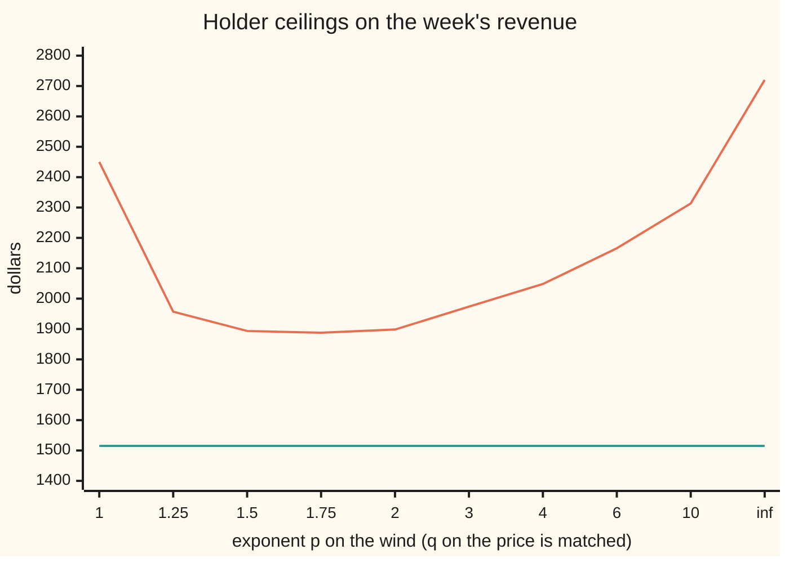
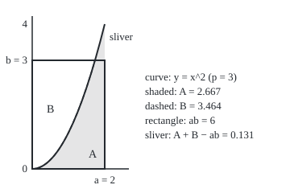

# Holder's inequality: the integral of a product is at most the product of the sizes in matched exponents, with Cauchy-Schwarz as the p = 2 case

Measure and integration → Sizes of Functions → Pairing two sizes → Holder's inequality

---

## General Overview

A small wind turbine sells its output daily for a week. The mean wind speeds are 3, 5, 8, 2, 6, 4 and 7 m/s. To keep the arithmetic visible, take the output in megawatt-hours (MWh) to equal the wind speed in m/s, a straight-line stand-in for the real power curve. The prices on the same days are 60, 50, 30, 70, 40, 55 and 35 dollars per MWh. The revenue is the sum of the seven products, 180 + 250 + 240 + 140 + 240 + 220 + 245 = **\$1,515**.

Suppose only summaries of the two lists are known, not how the days line up. How large could the revenue be? The root of the sum of squares of the winds, 14.247807, times the same for the prices, 133.229126, gives a ceiling of \$1,898.22. The windiest day, 8 m/s, times the total of the prices, \$340, gives \$2,720. Both hold for every pairing of the days, and both come from one theorem.

That theorem is Holder's inequality. It caps the integral of a product by the product of two sizes measured with **matched exponents**: powers p and q with 1/p + 1/q = 1. It rests on an inequality between two numbers, Young's inequality. At p = q = 2 it is the Cauchy-Schwarz inequality, which keeps every correlation between −1 and 1.

**The integral of a product of two functions is at most the p-size of the first times the q-size of the second whenever 1/p + 1/q = 1; for p strictly between 1 and infinity, equality holds exactly when the p-th power of one is a constant multiple of the q-th power of the other.**

**What kind of fact this is:** a theorem, with Young's inequality as its lemma and Cauchy-Schwarz as a special case, all proved on this card in Why it works.

### The picture: one revenue, a family of ceilings

Every matched pair of exponents gives a ceiling on the same \$1,515. The x-axis lists p, with q = p/(p − 1) matched to it; the positions are evenly spaced labels, not to scale.



Orange: the ceiling for each p. Green: the true revenue, \$1,515. The lowest ceiling is not at p = 2 but \$1,886.91 at p = 1.675270, found by search in the checks. At the ends, p = 1 and p = "inf" (infinity), a largest value replaces a sum of powers.

---

## The formula

Notation, as a reminder. A measure space $(\Omega, \mathcal{F}, \mu)$ is a set of points, the sets we allow ourselves to measure, and a measure giving each a size; $\int f \, d\mu$ is read "the integral of f against mu". For p from 1 up, the **p-size** of a measurable function f, called its p-norm on lp-spaces, is $\lVert f \rVert_p = \left(\int \lvert f \rvert^p \, d\mu\right)^{1/p}$, and $\lVert f \rVert_\infty$, its essential supremum, is the smallest M with $\lvert f \rvert \le M$ almost everywhere, meaning except on a set of measure zero ([lp-spaces](01-lp-spaces.md)).

On the turbine, $\Omega$ is the seven days, $\mathcal{F}$ is every set of days, and $\mu$ is counting measure: each day has size 1, so an integral is a sum. The wind $w$ and price $c$ are functions on $\Omega$, with values $w_i$ and $c_i$ on day $i$. Under the uniform probability $P$, each day has size 1/7 and an integral is an average.

Two exponents $p$ and $q$ are **conjugate**, or matched, when

$$\frac{1}{p} + \frac{1}{q} = 1, \qquad 1 \le p, q \le \infty,$$

with $1/\infty$ read as 0. So $q = p/(p - 1)$: 2 goes with 2, 3 with 3/2, and 1 with infinity.

**Young's inequality.** For numbers $a, b \ge 0$ and conjugate $p, q$ strictly between 1 and infinity,

$$ab \;\le\; \frac{a^p}{p} + \frac{b^q}{q},$$

with equality exactly when $a^p = b^q$.

**Read it aloud:** a product of two non-negative numbers is at most the first to the p over p plus the second to the q over q.

**Holder's inequality.** For a measure space $(\Omega, \mathcal{F}, \mu)$, functions $f$ and $g$ measurable with respect to $\mathcal{F}$, and conjugate $p, q$,

$$\int \lvert fg \rvert \, d\mu \;\le\; \lVert f \rVert_p \, \lVert g \rVert_q .$$

**Read it aloud:** the integral of the size of a product is at most the p-size of the first times the q-size of the second.

The signed integral $\lvert \int fg \, d\mu \rvert$ is no larger, so it obeys the same ceiling. At $p = q = 2$ it is the **Cauchy-Schwarz inequality**, $\int \lvert fg \rvert \, d\mu \le \lVert f \rVert_2 \lVert g \rVert_2$. On the turbine, with sums:

$$\sum_{i=1}^{7} w_i c_i = 1515 \;\le\; \Big(\sum_i w_i^2\Big)^{1/2} \Big(\sum_i c_i^2\Big)^{1/2} = \sqrt{203}\,\sqrt{17750} = 1898.22.$$

**Equality.** For $1 < p < \infty$ and finite sizes, equality holds exactly when $\alpha \lvert f \rvert^p = \beta \lvert g \rvert^q$ almost everywhere for constants $\alpha, \beta \ge 0$, not both 0.

| Symbol | Plain meaning | In our example | Push it up and the answer… |
| --- | --- | --- | --- |
| $\Omega$, $\mathcal{F}$ | the points, and the sets allowed a size | the seven days; every set of days | — |
| $\mu$, $P$ | a measure; a measure of total size 1 | counting measure; each day 1/7 | $P$ divides every ceiling by 7 |
| $w$, $c$, $w_i$, $c_i$, $i$, $j$ | wind in m/s (= MWh sold) and price in \$/MWh, on days $i$ and $j$ | 3, 5, 8, 2, 6, 4, 7; 60, 50, 30, 70, 40, 55, 35 | a larger value raises both sides |
| $f$, $g$, $fg$ | measurable functions on $\Omega$, and their product | $f = w$, $g = c$ | — |
| $p$, $q$ | conjugate exponents, $1/p + 1/q = 1$ | 2 and 2; 3 and 1.5; 1 and infinity | the ceiling moves; lowest near p = 1.68 here |
| $\lVert f \rVert_p$, $\lVert f \rVert_\infty$ | the p-size (p-norm) of f, and its essential supremum | 14.247807 and 8 for the wind | a larger size raises the ceiling |
| $a$, $b$, $ab$, $A$, $B$ | two non-negative numbers, their product, and the two areas of the figure | 2, 3, 6; 2.667 and 3.464 | — |
| $F$, $G$ | $\lvert f \rvert$ and $\lvert g \rvert$ divided by their sizes | day 3: 0.5615 and 0.2252 at p = 2 | — |
| $\alpha$, $\beta$ | constants in the equality case | price 10 times wind: 100 and 1 | — |
| $X$, $Y$, $m_X$, $\rho$, $k$ | random variables, a mean, their correlation, a constant | wind and price on a random day; $m_X$ = 5; $\rho$ = −0.994566 | $\lvert \rho \rvert$ never passes 1 |
| $t$, $n$, $x$, $y$, $\ln$, $\exp$ | a weight between 0 and 1; a whole number in the proof; two positive numbers in Step 1, the axes of the figure, and in Step 5 x is any number; the natural logarithm and its inverse, the exponential | $t = 1/p$; $x = a^p$, $y = b^q$ | — |
| $\infty$, $M$, $N$ | infinity; the essential top (essential supremum) of a function; the null set above it | $\lVert w \rVert_\infty$ = 8 | — |

### When it holds

- **Matched exponents.** Otherwise the sizes scale wrongly. On the turbine, $p = q = 3$ gives a "ceiling" of \$1,084.24, below the true \$1,515.
- **Exponents at least 1.** Below 1 the inequality turns round: $p = 1/2$, $q = -1$ gives \$1,501.38, again below the truth.
- **Measurable functions, any measure.** Measurability gives $\lvert f \rvert^p$ an integral. The measure need not be finite: counting measure and length on the line both work.
- **Infinite or zero sizes.** An infinite size on the right makes the inequality empty but true; a size of 0 means that function is 0 almost everywhere, and both sides are 0.

---

## Why it works

### Step 0: rescale, then compare day by day

Both sides of Holder's inequality double when $f$ doubles. So divide $f$ and $g$ by their sizes first, making both sizes 1; the claim becomes that the product integrates to at most 1. At every point, the product of the two rescaled values is at most a weighted sum of their powers: Young's inequality. Integrate, and the weights add up to $1/p + 1/q = 1$.

### Step 1: Young's inequality, from the shape of the logarithm

Take $a, b > 0$ (if either is 0 the left side is 0 and there is nothing to prove). Put $t = 1/p$, so $1 - t = 1/q$. The logarithm is concave: its graph lies above every chord, so $\ln(t x + (1 - t) y) \ge t \ln x + (1 - t) \ln y$ for $x, y > 0$, with equality only when $x = y$ ([convex-functions](../../06-Calculus%20and%20analysis/07-Several%20Variables/09-convex-functions.md)). Choose $x = a^p$ and $y = b^q$:

$$\ln\!\Big(\frac{a^p}{p} + \frac{b^q}{q}\Big) \;\ge\; \frac{1}{p}\ln a^p + \frac{1}{q}\ln b^q \;=\; \ln a + \ln b \;=\; \ln(ab).$$

The exponential keeps order, so $ab \le a^p/p + b^q/q$. Equality needs $x = y$, that is $a^p = b^q$.

At $p = q = 2$ it is $ab \le (a^2 + b^2)/2$, which is $(a - b)^2 \ge 0$ rearranged.

### The picture: Young's inequality as two areas

Draw the curve $y = x^{p-1}$. Its inverse is $x = y^{q-1}$, because $(p - 1)(q - 1) = 1$ when $1/p + 1/q = 1$. The area under the curve from 0 to $a$ is $a^p/p$. The area to the left of the curve from height 0 to $b$ is $b^q/q$. Together they cover the rectangle of area $ab$, and whatever lies outside the rectangle is the gap in Young's inequality. It vanishes exactly when the corner $(a, b)$ sits on the curve, $b = a^{p-1}$, which is $a^p = b^q$.

Drawn to scale for $p = 3$, $a = 2$, $b = 3$, 45 drawing units to one unit on both axes, with the curve $y = x^2$. Shaded, $A = a^3/3$ = 2.667; dashed, $B = b^{1.5}/1.5$ = 3.464; the rectangle, 6. The sliver of $A$ above the rectangle, between $x = \sqrt{3}$ and 2, is 0.131 = 2.667 + 3.464 − 6. The checks compute all three areas by Simpson's rule (thin slices with parabola-shaped tops).

<p align="center"></p>

### Step 2: Holder for p and q strictly between 1 and infinity

Take both sizes finite and not 0; the other cases are in the detailed proof. Put $F = \lvert f \rvert / \lVert f \rVert_p$ and $G = \lvert g \rvert / \lVert g \rVert_q$. Then $\int F^p \, d\mu = 1$ and $\int G^q \, d\mu = 1$. Young's inequality at each point gives $FG \le F^p/p + G^q/q$. The integral keeps order and adds ([integral-of-a-nonnegative-function](../04-The%20Lebesgue%20Integral/02-integral-of-a-nonnegative-function.md)), so

$$\int FG \, d\mu \;\le\; \frac{1}{p}\int F^p \, d\mu + \frac{1}{q}\int G^q \, d\mu \;=\; \frac{1}{p} + \frac{1}{q} \;=\; 1.$$

Multiply through by $\lVert f \rVert_p \lVert g \rVert_q$. On the turbine at $p = 2$, the seven rescaled products add to 0.798115 and the seven Young gaps to the missing 0.201885; the worked numbers list them by day.

### Step 3: the ends, p = 1 and q = infinity

No Young is needed. Except on a null set (a set of measure 0), $\lvert g \rvert \le \lVert g \rVert_\infty$, and a null set carries no integral. Multiply by $\lvert f \rvert$ and integrate: $\int \lvert fg \rvert \, d\mu \le \lVert f \rVert_1 \lVert g \rVert_\infty$. On the turbine: the price's top, \$70, times the total wind, 35, is \$2,450; the wind's top, 8, times the total price, \$340, is \$2,720.

### Step 4: the equality cases

Equality in Step 2 means the gap $F^p/p + G^q/q - FG$ integrates to 0. The gap is never negative, so it is 0 almost everywhere (proved on [markov-and-chebyshev](../04-The%20Lebesgue%20Integral/07-markov-and-chebyshev.md)). Young's equality case then gives $F^p = G^q$ almost everywhere: $\lvert f \rvert^p$ is a constant multiple of $\lvert g \rvert^q$. For the signed integral, $fg$ must also keep one sign.

On the turbine, a price of 10 times the wind meets the Cauchy-Schwarz ceiling: revenue \$2,030, ceiling 2030.000000. At $p = 3$ the rule asks for $w^3$ in proportion to $c^{3/2}$, so a price in proportion to $w^2$: 9, 25, 64, 4, 36, 16, 49 gives revenue \$1,295 and ceiling 1295.000000. At $p = 1$, equality needs $\lvert g \rvert = \lVert g \rVert_\infty$ almost everywhere where $f \ne 0$.

### Step 5: Cauchy-Schwarz and correlation

At $p = q = 2$ there is a second proof with no Young: $(f - xg)^2$ integrates to something non-negative for every number $x$, and the smallest value over $x$ gives $(\int fg)^2 \le \int f^2 \int g^2$. That is the argument of [dot-product](../../03-Algebra/06-Dot%20Products%20and%20Best%20Fits/01-dot-product.md) with integrals for sums. On finitely many points the slack has an exact form, Lagrange's identity (expand the right side and the cross terms cancel):

$$\Big(\sum_i w_i^2\Big)\Big(\sum_i c_i^2\Big) - \Big(\sum_i w_i c_i\Big)^2 \;=\; \sum_{i<j} (w_i c_j - w_j c_i)^2 .$$

On the turbine both sides are 203 × 17750 − 1515^2 = 1308025, a sum of 21 squares. So the ceiling is $\sqrt{1515^2 + 1308025}$ = 1898.222853, reached only if every pair of days has $w_i c_j = w_j c_i$.

For random variables $X$ and $Y$ with finite $\int X^2 \, dP$ and $\int Y^2 \, dP$, Cauchy-Schwarz on $X$ and $Y$ minus their means says the covariance (the average product of the centred values) is at most the product of the standard deviations in size. So the correlation $\rho$, their ratio, lies between −1 and 1, reaching ±1 exactly when one centred variable is a constant multiple of the other almost surely. On a random day the wind averages 5 m/s and the price \$48.571429; the centred products add to −185 and the centred squares to 28 and 1235.714286, so $\rho = -185/\sqrt{28 \times 1235.714286} = -0.994566$. Windy days are cheap days, almost on a straight line.

<details>
<summary>Detailed proof</summary>

**Setting.** $(\Omega, \mathcal{F}, \mu)$ is a measure space; $f, g$ are measurable with respect to $\mathcal{F}$, real or complex. For non-negative measurable functions the integral is monotone, additive and pulls out constants; a non-negative function with integral 0 is 0 almost everywhere ([integral-of-a-nonnegative-function](../04-The%20Lebesgue%20Integral/02-integral-of-a-nonnegative-function.md), [markov-and-chebyshev](../04-The%20Lebesgue%20Integral/07-markov-and-chebyshev.md)). Conventions: $1/\infty = 0$, $0 \cdot \infty = 0$.

**Lemma 1 (Young).** Let $1 < p < \infty$, $q = p/(p - 1)$, $a, b \ge 0$. Then $ab \le a^p/p + b^q/q$, with equality if and only if $a^p = b^q$. *Proof.* If $a$ or $b$ is 0, the left side is 0 and the right side is at least 0, with equality exactly when both are 0. Otherwise put $x = a^p$, $y = b^q$, $t = 1/p \in (0, 1)$. The second derivative of $\ln$ is $-1/x^2 < 0$, so $\ln$ is strictly concave: $\ln(tx + (1 - t)y) \ge t \ln x + (1 - t)\ln y = \ln(ab)$, with equality if and only if $x = y$. Apply the increasing function $\exp$.

**Theorem 1 (Holder, $1 < p < \infty$).** $\int \lvert fg \rvert \, d\mu \le \lVert f \rVert_p \lVert g \rVert_q$. *Proof.* If $\lVert f \rVert_p = 0$, then $\lvert f \rvert^p$ has integral 0, so $f = 0$ almost everywhere, so $fg = 0$ almost everywhere and the left side is 0; likewise for $g$. If neither size is 0 and one is infinite, the right side is $\infty$. Otherwise set $F = \lvert f \rvert/\lVert f \rVert_p$ and $G = \lvert g \rvert/\lVert g \rVert_q$, so $\int F^p \, d\mu = \int G^q \, d\mu = 1$. Lemma 1 at each point gives $FG \le F^p/p + G^q/q$; monotonicity and additivity give $\int FG \, d\mu \le 1/p + 1/q = 1$. Multiply by $\lVert f \rVert_p \lVert g \rVert_q$.

**Theorem 2 (the ends).** $\int \lvert fg \rvert \, d\mu \le \lVert f \rVert_1 \lVert g \rVert_\infty$. *Proof.* The cases with a size 0 or infinite go as in Theorem 1. Let $M = \lVert g \rVert_\infty$. Each set $\{\lvert g \rvert > M + 1/n\}$, for $n$ a whole number, has measure 0 because $M$ is the least bound that holds almost everywhere; their countable union $N = \{\lvert g \rvert > M\}$ has measure 0. Off $N$, $\lvert fg \rvert \le M\lvert f \rvert$, and a null set carries no integral.

**Corollary 1.** If $fg$ is integrable, $\lvert \int fg \, d\mu \rvert \le \int \lvert fg \rvert \, d\mu$ ([integrable-functions-and-l1](../04-The%20Lebesgue%20Integral/04-integrable-functions-and-l1.md)); Theorems 1 and 2 show that $f$ in $L^p$ and $g$ in $L^q$ make $fg$ integrable.

**Theorem 3 (equality, $1 < p < \infty$, finite positive sizes).** Equality holds if and only if $\alpha \lvert f \rvert^p = \beta \lvert g \rvert^q$ almost everywhere, with $\alpha, \beta \ge 0$ not both 0. *Proof.* Equality means $\int (F^p/p + G^q/q - FG) \, d\mu = 0$, all three integrals finite. The integrand is non-negative by Lemma 1, so it is 0 almost everywhere, so $F^p = G^q$ almost everywhere by Lemma 1's equality case: $\lVert g \rVert_q^q \lvert f \rvert^p = \lVert f \rVert_p^p \lvert g \rvert^q$. Conversely, integrating $\alpha \lvert f \rvert^p = \beta \lvert g \rvert^q$ gives $\alpha \lVert f \rVert_p^p = \beta \lVert g \rVert_q^q$; both sizes are positive, so $\alpha, \beta > 0$, and $F^p = G^q$, the integrand is 0 and $\int FG \, d\mu = 1$.

**Theorem 4 (correlation).** For a probability measure $P$ with $\int X^2 \, dP$ and $\int Y^2 \, dP$ finite and both variances positive (so $\rho$ is defined), $\lvert X \rvert \le (1 + X^2)/2$ makes the mean $m_X$ finite, and likewise for $Y$. Theorem 1 at $p = q = 2$ with Corollary 1, applied to $X - m_X$ and $Y - m_Y$, bounds the covariance by the product of the standard deviations, so $\rho$ lies in `[-1, 1]`; Theorem 3 with the sign condition gives $\rho = \pm 1$ exactly when $Y - m_Y = k(X - m_X)$ almost surely for a constant $k$.

</details>

Another road runs through Jensen's inequality, of which Young's is the two-point case with weights $1/p$ and $1/q$: [jensens-inequality](04-jensens-inequality.md).

---

## Worked numbers, by hand

The proof of Step 2 at $p = 2$, run on the seven days. Each wind is divided by $\sqrt{203}$ = 14.247807 and each price by $\sqrt{17750}$ = 133.229126. The gap is $F^2/2 + G^2/2 - FG$, never negative.

| Step | Arithmetic | Value |
| --- | --- | --- |
| revenue, day by day | 3 × 60, 5 × 50, 8 × 30, 2 × 70, 6 × 40, 4 × 55, 7 × 35 | 180, 250, 240, 140, 240, 220, 245 |
| revenue | sum of the seven | \$1,515 |
| wind 2-size | $\sqrt{9 + 25 + 64 + 4 + 36 + 16 + 49} = \sqrt{203}$ | 14.247807 |
| price 2-size | $\sqrt{3600 + 2500 + 900 + 4900 + 1600 + 3025 + 1225} = \sqrt{17750}$ | 133.229126 |
| day 3, rescaled | F = 8/14.247807, G = 30/133.229126 | 0.5615, 0.2252 |
| day 3, product and gap | 0.5615 × 0.2252; (0.5615^2 + 0.2252^2)/2 − 0.1264 | 0.1264; 0.0566 |
| day 2, product and gap | F = 0.3509, G = 0.3753: nearly equal, so almost no gap | 0.1317; 0.0003 |
| day 4, product and gap | F = 0.1404, G = 0.5254: far apart, the largest gap | 0.0738; 0.0741 |
| all seven products | 0.0948 + 0.1317 + 0.1264 + 0.0738 + 0.1264 + 0.1159 + 0.1291 | 0.798115 |
| all seven gaps | 0.0288 + 0.0003 + 0.0566 + 0.0741 + 0.0073 + 0.0087 + 0.0261 | 0.201885 = 1 − 0.798115 |
| **Cauchy-Schwarz ceiling** | 14.247807 × 133.229126 | **\$1,898.22** |
| ends | 8 × 340; 35 × 70 | \$2,720; \$2,450 |
| p = 3, q = 3/2 | $1295^{1/3}$ × $(\sum_i c_i^{1.5})^{2/3}$ = 10.899919 × 181.055502 | \$1,973.49 |

Given only the two sizes, no pairing of these winds with these prices earns more than \$1,898.22; the actual week earns 79.8% of that, because windy days carry low prices. Under the uniform probability the average daily revenue is \$216.428571 against a ceiling of \$271.174693, one seventh of each: with matched exponents, $(1/7)^{1/p}(1/7)^{1/q} = 1/7$.

### What breaks if you drop a piece

| Mistake | Comes out at | What went wrong |
| --- | --- | --- |
| unmatched exponents $p = q = 3$ | a "ceiling" of \$1,084.24, below the true \$1,515 | 1/3 + 1/3 is not 1; no theorem stands behind this product |
| $p = 1/2$ with $q = -1$ (matched, but below 1) | \$1,501.38 = 234.273652 / 0.156039, below \$1,515 | below 1 the weights leave (0, 1) and the inequality turns round |
| $g = 1$ under counting measure, its size forgotten | "total wind ≤ its 2-size": 35 ≤ 14.247807, false | here $\lVert 1 \rVert_2 = \sqrt{7}$; only under a probability is $\lVert w \rVert_1 \le \lVert w \rVert_2$: 5 ≤ 5.385165 |
| Cauchy-Schwarz on the raw lists read as a correlation | 0.798115, a strong "positive" link | the lists were not centred; the correlation is −0.994566 |

---

## Code, from first principles, and it actually runs

The code checks one week and 20,000 random pairs; that the inequality holds for all measurable functions on every measure space rests on the proof. Two roads lead to the ceilings, and a third runs the proof. Road one computes the sizes for ten matched pairs and finds the lowest ceiling by golden-section search (repeatedly shrinking a bracket around the minimum). Road two gets the Cauchy-Schwarz slack in whole numbers by Lagrange's identity and rebuilds the ceiling from it. Road three runs the proof day by day: it rescales, prints each day's Young gap, and checks that no gap is negative. That the gaps add to one minus the ratio of revenue to ceiling is only a consistency check, true by algebra once 1/p + 1/q = 1. The correlation comes from centred values and again from whole-number sums; the figure's areas from Simpson's rule and from their formulas. The random pairs use a SplitMix64 generator seeded 20260929, written out in both languages.

### Python

```python
# Holder's inequality on a week of wind and prices: the check behind the card.
# Standard library only. Own Simpson integrator, own minimiser, own random numbers.
W = [3, 5, 8, 2, 6, 4, 7]           # mean wind speed each day, m/s = MWh sold that day
C = [60, 50, 30, 70, 40, 55, 35]    # electricity price each day, $/MWh
INF = float("inf")

def norm(v, p, mu=None):            # the p-size of v against weights mu (counting measure if None)
    mu = mu or [1.0] * len(v)
    if p == INF: return float(max(abs(x) for x, m in zip(v, mu) if m > 0))
    return sum(m * abs(x) ** p for x, m in zip(v, mu)) ** (1.0 / p)
def conj(p): return INF if p == 1 else (1.0 if p == INF else p / (p - 1))
def bound(u, v, p, mu=None): return norm(u, p, mu) * norm(v, conj(p), mu)
def f6(x): return f"{x:.6f}"

dot = sum(a * b for a, b in zip(W, C))
print("data,revenue by day $," + " ".join(str(a * b) for a, b in zip(W, C)))
print("data,revenue sum w*c $," + str(dot))
print("norms,wind 1 2 3 inf," + " ".join(f6(norm(W, p)) for p in (1, 2, 3, INF)))
print("norms,price 1 3/2 2 inf," + " ".join(f6(norm(C, p)) for p in (1, 1.5, 2, INF)))
print(f"norms,sum w^2 sum c^2,{sum(a * a for a in W)} {sum(b * b for b in C)}")

# road 1: the bound for many conjugate pairs, and the best p by golden-section search
ps = [1, 1.25, 1.5, 1.75, 2, 3, 4, 6, 10, INF]
for p in ps:
    b = bound(W, C, p)
    assert b >= dot, p
    print(f"sweep,p={p} q={conj(p):.4f},{b:.2f}")
lo, hi, g = 1.01, 6.0, (5 ** 0.5 - 1) / 2
for _ in range(80):
    m1, m2 = hi - g * (hi - lo), lo + g * (hi - lo)
    if bound(W, C, m1) < bound(W, C, m2): hi = m2
    else: lo = m1
pbest = (lo + hi) / 2
print("best,p q bound," + f6(pbest) + " " + f6(conj(pbest)) + " " + f6(bound(W, C, pbest)))

# road 2: Cauchy-Schwarz slack in whole numbers, by Lagrange's identity
lhs = sum(a * a for a in W) * sum(b * b for b in C) - dot * dot
rhs = sum((W[i] * C[j] - W[j] * C[i]) ** 2 for i in range(7) for j in range(i + 1, 7))
assert lhs == rhs
cs_by_identity = (dot * dot + rhs) ** 0.5
assert abs(cs_by_identity - bound(W, C, 2)) < 1e-9
print(f"lagrange,norms route,{lhs}")
print(f"lagrange,pairs route,{rhs}")
print("lagrange,sqrt(1515^2 + pairs)," + f6(cs_by_identity))

# road 3: the proof itself, day by day: Young on the rescaled values at p = 2 and p = 3
for p in (2, 3):
    q = conj(p); F = [a / norm(W, p) for a in W]; G = [b / norm(C, q) for b in C]
    gaps = [f ** p / p + h ** q / q - f * h for f, h in zip(F, G)]
    assert min(gaps) >= 0                                   # Young at every day: the step that can fail
    assert abs(sum(gaps) - (1 - dot / bound(W, C, p))) < 1e-12   # consistency only: algebra once 1/p + 1/q = 1
    if p == 2:
        for i in range(7):
            print(f"young p=2,day {i + 1} F G FG gap,{F[i]:.4f} {G[i]:.4f} {F[i] * G[i]:.4f} {gaps[i]:.4f}")
    print(f"young p={p},sum FG sum gaps," + f6(sum(f * h for f, h in zip(F, G))) + " " + f6(sum(gaps)))

# the same week as an average: uniform probability 1/7 on each day
P = [1 / 7] * 7
avg = sum(m * a * b for m, a, b in zip(P, W, C))
assert abs(bound(W, C, 2, P) - bound(W, C, 2) / 7) < 1e-9 and avg <= bound(W, C, 2, P)
print("average,mean wind mean price," + f6(sum(W) / 7) + " " + f6(sum(C) / 7))
print("average,E[wc] and its p=2 bound," + f6(avg) + " " + f6(bound(W, C, 2, P)))

# correlation, two roads: centred vectors in floats, raw sums in whole numbers
mw, mc = sum(W) / 7, sum(C) / 7
dw, dc = [a - mw for a in W], [b - mc for b in C]
r1 = sum(a * b for a, b in zip(dw, dc)) / (norm(dw, 2) * norm(dc, 2))
num = 7 * dot - sum(W) * sum(C)
r2 = num / ((7 * sum(a * a for a in W) - sum(W) ** 2) * (7 * sum(b * b for b in C) - sum(C) ** 2)) ** 0.5
assert abs(r1 - r2) < 1e-12 and abs(r1) <= 1
print("correlation,centred sums of squares," + f6(norm(dw, 2) ** 2) + " " + f6(norm(dc, 2) ** 2))
print(f"correlation,sum of centred products,{num / 7:.6f}")
print("correlation,centred route raw route," + f6(r1) + " " + f6(r2))
print("correlation,uncentred cosine," + f6(dot / bound(W, C, 2)))

# equality: sizes in proportion
for p, v, lab in ((2, [10 * a for a in W], "p=2 price 10w"), (3, [a * a for a in W], "p=3 price w^2"),
                  (4, [a ** 3 for a in W], "p=4 price w^3")):
    s = sum(a * b for a, b in zip(W, v))
    assert abs(bound(W, v, p) - s) < 1e-9 * s
    print(f"equality,{lab} sum bound,{s} " + f6(bound(W, v, p)))

ws, cs = sorted(W), sorted(C)     # windiest day paired with the highest price
srt = sum(a * b for a, b in zip(ws, cs))
assert dot < srt <= bound(ws, cs, 2)
print(f"equality,sorted pairing revenue and its p=2 bound,{srt} " + f6(bound(ws, cs, 2)))

# what breaks
fake33 = norm(W, 3) * norm(C, 3)
rev = sum(a ** 0.5 for a in W) ** 2 / sum(1 / b for b in C)
assert fake33 < dot and rev < dot
print("breaks,p=q=3 not conjugate," + f6(fake33))
print("breaks,p=1/2 q=-1 pieces (sum sqrt w)^2 sum 1/c," + f6(sum(a ** 0.5 for a in W) ** 2) + " " + f6(sum(1 / b for b in C)))
print("breaks,p=1/2 q=-1," + f6(rev))
print("breaks,sum w vs ||w||_2 counting," + f6(norm(W, 1)) + " " + f6(norm(W, 2)))
print("breaks,mean w vs ||w||_2 probability," + f6(norm(W, 1, P)) + " " + f6(norm(W, 2, P)))

# Young's inequality as areas: a = 2, b = 3, p = 3, curve y = x^2
def simpson(f, a, b, n=2000):
    h = (b - a) / n
    return (f(a) + f(b) + sum((4 if i % 2 else 2) * f(a + i * h) for i in range(1, n))) * h / 3
a, b = 2.0, 3.0
A, B = simpson(lambda x: x * x, 0, a), simpson(lambda x: b - x * x, 0, b ** 0.5)   # B: left of the curve
sliver = simpson(lambda x: x * x - b, b ** 0.5, a)
assert abs(A - a ** 3 / 3) < 1e-9 and abs(B - b ** 1.5 / 1.5) < 1e-6 and abs(A + B - a * b - sliver) < 1e-6
print("young area,A B ab sliver," + " ".join(f6(x) for x in (A, B, a * b, sliver)))
print(f"figure,origin 40 210 unit 45,a_x {40 + 45 * a:.2f} b_y {210 - 45 * b:.2f} "
      f"top_y {210 - 45 * a * a:.2f} cross_x {40 + 45 * b ** 0.5:.2f} ctrl_x {40 + 45 * a / 2:.2f} {40 + 45 * b ** 0.5 / 2:.2f}")

# random pairs: SplitMix64, seed 20260929; no pair beats its bound
S, MASK = 20260929, (1 << 64) - 1
def rnd():
    global S
    S = (S + 0x9E3779B97F4A7C15) & MASK; z = S
    z = ((z ^ (z >> 30)) * 0xBF58476D1CE4E5B9) & MASK
    z = ((z ^ (z >> 27)) * 0x94D049BB133111EB) & MASK
    return ((z ^ (z >> 31)) >> 11) / 2.0 ** 53
worst = 0.0
for _ in range(20000):
    p = 1.1 + 6.9 * rnd()
    u = [2 * rnd() - 1 for _ in range(7)]; v = [2 * rnd() - 1 for _ in range(7)]
    worst = max(worst, sum(abs(x * y) for x, y in zip(u, v)) / bound(u, v, p))
assert worst <= 1 + 1e-12
print("random,20000 pairs p in 1.1 to 8 largest sum/bound," + f6(worst))
print("All checks passed.")
```

**Ran 2026-10-06 on macOS, Python 3.14.6, standard library only. All checks passed. Output, pasted from the run:**

```
data,revenue by day $,180 250 240 140 240 220 245
data,revenue sum w*c $,1515
norms,wind 1 2 3 inf,35.000000 14.247807 10.899919 8.000000
norms,price 1 3/2 2 inf,340.000000 181.055502 133.229126 70.000000
norms,sum w^2 sum c^2,203 17750
sweep,p=1 q=inf,2450.00
sweep,p=1.25 q=5.0000,1956.90
sweep,p=1.5 q=3.0000,1893.48
sweep,p=1.75 q=2.3333,1887.71
sweep,p=2 q=2.0000,1898.22
sweep,p=3 q=1.5000,1973.49
sweep,p=4 q=1.3333,2048.15
sweep,p=6 q=1.2000,2165.70
sweep,p=10 q=1.1111,2313.37
sweep,p=inf q=1.0000,2720.00
best,p q bound,1.675270 2.480889 1886.906704
lagrange,norms route,1308025
lagrange,pairs route,1308025
lagrange,sqrt(1515^2 + pairs),1898.222853
young p=2,day 1 F G FG gap,0.2106 0.4504 0.0948 0.0288
young p=2,day 2 F G FG gap,0.3509 0.3753 0.1317 0.0003
young p=2,day 3 F G FG gap,0.5615 0.2252 0.1264 0.0566
young p=2,day 4 F G FG gap,0.1404 0.5254 0.0738 0.0741
young p=2,day 5 F G FG gap,0.4211 0.3002 0.1264 0.0073
young p=2,day 6 F G FG gap,0.2807 0.4128 0.1159 0.0087
young p=2,day 7 F G FG gap,0.4913 0.2627 0.1291 0.0261
young p=2,sum FG sum gaps,0.798115 0.201885
young p=3,sum FG sum gaps,0.767675 0.232325
average,mean wind mean price,5.000000 48.571429
average,E[wc] and its p=2 bound,216.428571 271.174693
correlation,centred sums of squares,28.000000 1235.714286
correlation,sum of centred products,-185.000000
correlation,centred route raw route,-0.994566 -0.994566
correlation,uncentred cosine,0.798115
equality,p=2 price 10w sum bound,2030 2030.000000
equality,p=3 price w^2 sum bound,1295 1295.000000
equality,p=4 price w^3 sum bound,8771 8771.000000
equality,sorted pairing revenue and its p=2 bound,1885 1898.222853
breaks,p=q=3 not conjugate,1084.239098
breaks,p=1/2 q=-1 pieces (sum sqrt w)^2 sum 1/c,234.273652 0.156039
breaks,p=1/2 q=-1,1501.379210
breaks,sum w vs ||w||_2 counting,35.000000 14.247807
breaks,mean w vs ||w||_2 probability,5.000000 5.385165
young area,A B ab sliver,2.666667 3.464102 6.000000 0.130768
figure,origin 40 210 unit 45,a_x 130.00 b_y 75.00 top_y 30.00 cross_x 117.94 ctrl_x 85.00 78.97
random,20000 pairs p in 1.1 to 8 largest sum/bound,0.996097
All checks passed.
```

### Rust

```rust
// Holder's inequality on a week of wind and prices: the check behind the card.
// Rust std only. Own Simpson integrator, own minimiser, own random numbers.
const W: [f64; 7] = [3.0, 5.0, 8.0, 2.0, 6.0, 4.0, 7.0]; // mean wind speed each day, m/s = MWh sold
const C: [f64; 7] = [60.0, 50.0, 30.0, 70.0, 40.0, 55.0, 35.0]; // price each day, $/MWh
const INF: f64 = f64::INFINITY;

fn norm(v: &[f64], p: f64, mu: &[f64]) -> f64 { // the p-size of v against the weights mu
    if p == INF {
        return v.iter().zip(mu).filter(|(_, m)| **m > 0.0).map(|(x, _)| x.abs()).fold(0.0, f64::max);
    }
    v.iter().zip(mu).map(|(x, m)| m * x.abs().powf(p)).sum::<f64>().powf(1.0 / p)
}
fn conj(p: f64) -> f64 { if p == 1.0 { INF } else if p == INF { 1.0 } else { p / (p - 1.0) } }
fn bound(u: &[f64], v: &[f64], p: f64, mu: &[f64]) -> f64 { norm(u, p, mu) * norm(v, conj(p), mu) }
fn dotp(u: &[f64], v: &[f64]) -> f64 { u.iter().zip(v).map(|(a, b)| a * b).sum() }
fn simpson(f: &dyn Fn(f64) -> f64, a: f64, b: f64, n: usize) -> f64 {
    let h = (b - a) / n as f64;
    let mut s = f(a) + f(b);
    for i in 1..n { s += (if i % 2 == 1 { 4.0 } else { 2.0 }) * f(a + i as f64 * h); }
    s * h / 3.0
}
struct Rng(u64);
impl Rng {
    fn next(&mut self) -> f64 { // SplitMix64
        self.0 = self.0.wrapping_add(0x9E3779B97F4A7C15);
        let mut z = self.0;
        z = (z ^ (z >> 30)).wrapping_mul(0xBF58476D1CE4E5B9);
        z = (z ^ (z >> 27)).wrapping_mul(0x94D049BB133111EB);
        ((z ^ (z >> 31)) >> 11) as f64 / 9007199254740992.0
    }
}
fn j(v: &[f64]) -> String { v.iter().map(|x| format!("{:.6}", x)).collect::<Vec<_>>().join(" ") }

fn main() {
    let one = [1.0; 7];
    let dot = dotp(&W, &C);
    let days: Vec<String> = (0..7).map(|i| format!("{}", W[i] * C[i])).collect();
    println!("data,revenue by day $,{}", days.join(" "));
    println!("data,revenue sum w*c $,{}", dot);
    println!("norms,wind 1 2 3 inf,{}", j(&[1.0, 2.0, 3.0, INF].map(|p| norm(&W, p, &one))));
    println!("norms,price 1 3/2 2 inf,{}", j(&[1.0, 1.5, 2.0, INF].map(|p| norm(&C, p, &one))));
    println!("norms,sum w^2 sum c^2,{} {}", W.iter().map(|a| a * a).sum::<f64>(), C.iter().map(|b| b * b).sum::<f64>());

    // road 1: the bound for many conjugate pairs, and the best p by golden-section search
    let ps = [1.0, 1.25, 1.5, 1.75, 2.0, 3.0, 4.0, 6.0, 10.0, INF];
    let labs = ["1", "1.25", "1.5", "1.75", "2", "3", "4", "6", "10", "inf"];
    for (p, l) in ps.iter().zip(labs) {
        let b = bound(&W, &C, *p, &one);
        assert!(b >= dot);
        println!("sweep,p={} q={:.4},{:.2}", l, conj(*p), b);
    }
    let (mut lo, mut hi, g) = (1.01f64, 6.0f64, (5f64.powf(0.5) - 1.0) / 2.0);
    for _ in 0..80 {
        let (m1, m2) = (hi - g * (hi - lo), lo + g * (hi - lo));
        if bound(&W, &C, m1, &one) < bound(&W, &C, m2, &one) { hi = m2 } else { lo = m1 }
    }
    let pb = (lo + hi) / 2.0;
    println!("best,p q bound,{}", j(&[pb, conj(pb), bound(&W, &C, pb, &one)]));

    // road 2: Cauchy-Schwarz slack in whole numbers, by Lagrange's identity
    let wi: Vec<i64> = W.iter().map(|x| *x as i64).collect();
    let ci: Vec<i64> = C.iter().map(|x| *x as i64).collect();
    let di: i64 = (0..7).map(|k| wi[k] * ci[k]).sum();
    let lhs = wi.iter().map(|a| a * a).sum::<i64>() * ci.iter().map(|b| b * b).sum::<i64>() - di * di;
    let mut rhs = 0i64;
    for a in 0..7 { for b in a + 1..7 { rhs += (wi[a] * ci[b] - wi[b] * ci[a]).pow(2); } }
    assert_eq!(lhs, rhs);
    let csi = ((di * di + rhs) as f64).sqrt();
    assert!((csi - bound(&W, &C, 2.0, &one)).abs() < 1e-9);
    println!("lagrange,norms route,{}", lhs);
    println!("lagrange,pairs route,{}", rhs);
    println!("lagrange,sqrt(1515^2 + pairs),{:.6}", csi);

    // road 3: the proof itself, day by day: Young on the rescaled values at p = 2 and p = 3
    for p in [2.0, 3.0] {
        let q = conj(p);
        let (nw, nc) = (norm(&W, p, &one), norm(&C, q, &one));
        let f: Vec<f64> = W.iter().map(|a| a / nw).collect();
        let h: Vec<f64> = C.iter().map(|b| b / nc).collect();
        let gaps: Vec<f64> = (0..7).map(|k| f[k].powf(p) / p + h[k].powf(q) / q - f[k] * h[k]).collect();
        let gs: f64 = gaps.iter().sum();
        assert!(gaps.iter().all(|x| *x >= 0.0));                            // Young at every day: the step that can fail
        assert!((gs - (1.0 - dot / bound(&W, &C, p, &one))).abs() < 1e-12); // consistency only: algebra once 1/p + 1/q = 1
        if p == 2.0 {
            for k in 0..7 {
                println!("young p=2,day {} F G FG gap,{:.4} {:.4} {:.4} {:.4}", k + 1, f[k], h[k], f[k] * h[k], gaps[k]);
            }
        }
        println!("young p={},sum FG sum gaps,{:.6} {:.6}", p, dotp(&f, &h), gs);
    }

    // the same week as an average: uniform probability 1/7 on each day
    let pr = [1.0 / 7.0; 7];
    let avg: f64 = (0..7).map(|k| pr[k] * W[k] * C[k]).sum();
    assert!((bound(&W, &C, 2.0, &pr) - bound(&W, &C, 2.0, &one) / 7.0).abs() < 1e-9 && avg <= bound(&W, &C, 2.0, &pr));
    println!("average,mean wind mean price,{:.6} {:.6}", W.iter().sum::<f64>() / 7.0, C.iter().sum::<f64>() / 7.0);
    println!("average,E[wc] and its p=2 bound,{:.6} {:.6}", avg, bound(&W, &C, 2.0, &pr));

    // correlation, two roads: centred vectors in floats, raw sums in whole numbers
    let (mw, mc) = (W.iter().sum::<f64>() / 7.0, C.iter().sum::<f64>() / 7.0);
    let dw: Vec<f64> = W.iter().map(|a| a - mw).collect();
    let dc: Vec<f64> = C.iter().map(|b| b - mc).collect();
    let r1 = dotp(&dw, &dc) / (norm(&dw, 2.0, &one) * norm(&dc, 2.0, &one));
    let (sw, sc) = (wi.iter().sum::<i64>(), ci.iter().sum::<i64>());
    let num = 7 * di - sw * sc;
    let den = (7 * wi.iter().map(|a| a * a).sum::<i64>() - sw * sw) * (7 * ci.iter().map(|b| b * b).sum::<i64>() - sc * sc);
    let r2 = num as f64 / (den as f64).powf(0.5);
    assert!((r1 - r2).abs() < 1e-12 && r1.abs() <= 1.0);
    println!("correlation,centred sums of squares,{:.6} {:.6}", norm(&dw, 2.0, &one).powf(2.0), norm(&dc, 2.0, &one).powf(2.0));
    println!("correlation,sum of centred products,{:.6}", num as f64 / 7.0);
    println!("correlation,centred route raw route,{:.6} {:.6}", r1, r2);
    println!("correlation,uncentred cosine,{:.6}", dot / bound(&W, &C, 2.0, &one));

    // equality: sizes in proportion
    let v10: Vec<f64> = W.iter().map(|a| 10.0 * a).collect();
    let vsq: Vec<f64> = W.iter().map(|a| a * a).collect();
    let vcu: Vec<f64> = W.iter().map(|a| a.powf(3.0)).collect();
    for (p, v, lab) in [(2.0, &v10, "p=2 price 10w"), (3.0, &vsq, "p=3 price w^2"), (4.0, &vcu, "p=4 price w^3")] {
        let s = dotp(&W, v);
        assert!((bound(&W, v, p, &one) - s).abs() < 1e-9 * s);
        println!("equality,{} sum bound,{} {:.6}", lab, s, bound(&W, v, p, &one));
    }

    let (mut ws, mut cs) = (W.to_vec(), C.to_vec()); // windiest day paired with the highest price
    ws.sort_by(|a, b| a.partial_cmp(b).unwrap());
    cs.sort_by(|a, b| a.partial_cmp(b).unwrap());
    let srt = dotp(&ws, &cs);
    assert!(dot < srt && srt <= bound(&ws, &cs, 2.0, &one));
    println!("equality,sorted pairing revenue and its p=2 bound,{} {:.6}", srt, bound(&ws, &cs, 2.0, &one));

    // what breaks
    let fake33 = norm(&W, 3.0, &one) * norm(&C, 3.0, &one);
    let rev = W.iter().map(|a| a.powf(0.5)).sum::<f64>().powf(2.0) / C.iter().map(|b| 1.0 / b).sum::<f64>();
    assert!(fake33 < dot && rev < dot);
    println!("breaks,p=q=3 not conjugate,{:.6}", fake33);
    let sq = W.iter().map(|a| a.powf(0.5)).sum::<f64>().powf(2.0);
    println!("breaks,p=1/2 q=-1 pieces (sum sqrt w)^2 sum 1/c,{:.6} {:.6}", sq, C.iter().map(|b| 1.0 / b).sum::<f64>());
    println!("breaks,p=1/2 q=-1,{:.6}", rev);
    println!("breaks,sum w vs ||w||_2 counting,{}", j(&[norm(&W, 1.0, &one), norm(&W, 2.0, &one)]));
    println!("breaks,mean w vs ||w||_2 probability,{}", j(&[norm(&W, 1.0, &pr), norm(&W, 2.0, &pr)]));

    // Young's inequality as areas: a = 2, b = 3, p = 3, curve y = x^2
    let (a, b) = (2.0f64, 3.0f64);
    let area_a = simpson(&|x| x * x, 0.0, a, 2000);
    let area_b = simpson(&|x| b - x * x, 0.0, b.powf(0.5), 2000); // left of the curve
    let sliver = simpson(&|x| x * x - b, b.powf(0.5), a, 2000);
    assert!((area_a - a.powf(3.0) / 3.0).abs() < 1e-9 && (area_b - b.powf(1.5) / 1.5).abs() < 1e-6);
    assert!((area_a + area_b - a * b - sliver).abs() < 1e-6);
    println!("young area,A B ab sliver,{}", j(&[area_a, area_b, a * b, sliver]));
    println!("figure,origin 40 210 unit 45,a_x {:.2} b_y {:.2} top_y {:.2} cross_x {:.2} ctrl_x {:.2} {:.2}",
        40.0 + 45.0 * a, 210.0 - 45.0 * b, 210.0 - 45.0 * a * a, 40.0 + 45.0 * b.powf(0.5), 40.0 + 45.0 * a / 2.0, 40.0 + 45.0 * b.powf(0.5) / 2.0);

    // random pairs: SplitMix64, seed 20260929; no pair beats its bound
    let mut rng = Rng(20260929);
    let mut worst = 0.0f64;
    for _ in 0..20000 {
        let p = 1.1 + 6.9 * rng.next();
        let u: Vec<f64> = (0..7).map(|_| 2.0 * rng.next() - 1.0).collect();
        let v: Vec<f64> = (0..7).map(|_| 2.0 * rng.next() - 1.0).collect();
        let s: f64 = u.iter().zip(&v).map(|(x, y)| (x * y).abs()).sum();
        worst = worst.max(s / bound(&u, &v, p, &one));
    }
    assert!(worst <= 1.0 + 1e-12);
    println!("random,20000 pairs p in 1.1 to 8 largest sum/bound,{:.6}", worst);
    println!("All checks passed.");
}
```

**Ran 2026-10-06 on macOS, rustc 1.98.1, no crates. All checks passed. Output, pasted from the run:**

```
data,revenue by day $,180 250 240 140 240 220 245
data,revenue sum w*c $,1515
norms,wind 1 2 3 inf,35.000000 14.247807 10.899919 8.000000
norms,price 1 3/2 2 inf,340.000000 181.055502 133.229126 70.000000
norms,sum w^2 sum c^2,203 17750
sweep,p=1 q=inf,2450.00
sweep,p=1.25 q=5.0000,1956.90
sweep,p=1.5 q=3.0000,1893.48
sweep,p=1.75 q=2.3333,1887.71
sweep,p=2 q=2.0000,1898.22
sweep,p=3 q=1.5000,1973.49
sweep,p=4 q=1.3333,2048.15
sweep,p=6 q=1.2000,2165.70
sweep,p=10 q=1.1111,2313.37
sweep,p=inf q=1.0000,2720.00
best,p q bound,1.675270 2.480889 1886.906704
lagrange,norms route,1308025
lagrange,pairs route,1308025
lagrange,sqrt(1515^2 + pairs),1898.222853
young p=2,day 1 F G FG gap,0.2106 0.4504 0.0948 0.0288
young p=2,day 2 F G FG gap,0.3509 0.3753 0.1317 0.0003
young p=2,day 3 F G FG gap,0.5615 0.2252 0.1264 0.0566
young p=2,day 4 F G FG gap,0.1404 0.5254 0.0738 0.0741
young p=2,day 5 F G FG gap,0.4211 0.3002 0.1264 0.0073
young p=2,day 6 F G FG gap,0.2807 0.4128 0.1159 0.0087
young p=2,day 7 F G FG gap,0.4913 0.2627 0.1291 0.0261
young p=2,sum FG sum gaps,0.798115 0.201885
young p=3,sum FG sum gaps,0.767675 0.232325
average,mean wind mean price,5.000000 48.571429
average,E[wc] and its p=2 bound,216.428571 271.174693
correlation,centred sums of squares,28.000000 1235.714286
correlation,sum of centred products,-185.000000
correlation,centred route raw route,-0.994566 -0.994566
correlation,uncentred cosine,0.798115
equality,p=2 price 10w sum bound,2030 2030.000000
equality,p=3 price w^2 sum bound,1295 1295.000000
equality,p=4 price w^3 sum bound,8771 8771.000000
equality,sorted pairing revenue and its p=2 bound,1885 1898.222853
breaks,p=q=3 not conjugate,1084.239098
breaks,p=1/2 q=-1 pieces (sum sqrt w)^2 sum 1/c,234.273652 0.156039
breaks,p=1/2 q=-1,1501.379210
breaks,sum w vs ||w||_2 counting,35.000000 14.247807
breaks,mean w vs ||w||_2 probability,5.000000 5.385165
young area,A B ab sliver,2.666667 3.464102 6.000000 0.130768
figure,origin 40 210 unit 45,a_x 130.00 b_y 75.00 top_y 30.00 cross_x 117.94 ctrl_x 85.00 78.97
random,20000 pairs p in 1.1 to 8 largest sum/bound,0.996097
All checks passed.
```

The two outputs are identical line for line.

> [!TIP]
> **Try changing**
> - **Line the days up.** Guess first: sort both lists from smallest to largest, so the windiest day gets the highest price. The revenue becomes 2 × 30 + 3 × 35 + 4 × 40 + 5 × 50 + 6 × 55 + 7 × 60 + 8 × 70 = \$1,885, just under the Cauchy-Schwarz ceiling of \$1,898.22, which does not move: sizes ignore the order of the days. The checks print this pairing.
> - **Unmatched exponents in the sweep.** Guess first: replace `conj(p)` in `bound` by `p`. The sweep's assert stops the run at p = 3, the first p in the list where the product of the two p-sizes, 1084.239098, falls below the revenue.
> - **A price in proportion to the cube of the wind.** Guess first: which p makes the ceiling exact? The equality rule $\lvert w \rvert^p \propto \lvert c \rvert^q$ with $c \propto w^3$ needs $p = 3q$, so $p = 4$, $q = 4/3$. The checks print it: revenue 8771, ceiling 8771.000000.

---

## The usual mistake

> [!warning]
> **Using exponents that do not match.** Holder is not "a product is at most any product of sizes". The powers must satisfy $1/p + 1/q = 1$, or the sizes scale wrongly: stretch the measure by a factor k and the left side grows by k while the right grows by $k^{1/p + 1/q}$. On the turbine, $p = q = 3$ gives \$1,084.24 against a revenue of \$1,515.
>
> - **Believing p = 2 is always best.** Cauchy-Schwarz gives \$1,898.22 here; p = 1.675270 gives \$1,886.91. Which p is lowest depends on the data.
> - **Dropping the absolute values in the equality rule.** A price of −10 times the wind still meets the ceiling for $\int \lvert fg \rvert \, d\mu$; the signed revenue is then −2030, which meets the ceiling in size only.
> - **Nesting sizes on the wrong measure.** $\lVert w \rVert_1 \le \lVert w \rVert_2$ holds under a probability (5 ≤ 5.385165) and fails under counting measure (35 against 14.247807).

---

## Where you meet it in real life

- **Correlation and portfolio risk.** Every correlation lies between −1 and 1 because of Step 5 (covariances from tables are on [joint-distributions-and-covariance](../../09-Probability%20and%20statistics/02-Random%20Variables/04-joint-distributions-and-covariance.md)), so a portfolio's standard deviation never exceeds the sum of its parts' standard deviations.
- **The triangle inequality for sizes.** Holder is the key step in proving $\lVert f + g \rVert_p \le \lVert f \rVert_p + \lVert g \rVert_p$ ([minkowskis-inequality](03-minkowskis-inequality.md)), which makes the p-size a distance.
- **Moments of random variables.** With $g = 1$ on a probability space, Holder gives $\lVert X \rVert_1 \le \lVert X \rVert_p$: a finite p-th moment forces a finite mean ([jensens-inequality](04-jensens-inequality.md) orders all the moments).
- **Signal processing and physics.** The uncertainty principle, that a signal cannot be sharply located in both time and frequency, starts from Cauchy-Schwarz (uncertainty-principle).

> **Say it back**
> Young's inequality, ab ≤ a^p/p + b^q/q when 1/p + 1/q = 1, comes from the concavity of the logarithm. Rescale two functions to size 1, apply Young at every point and integrate: the product integrates to at most 1. Undoing the rescaling is Holder's inequality; p = q = 2 is Cauchy-Schwarz, which keeps correlations between −1 and 1. Equality needs the p-th power of one function in proportion to the q-th power of the other. The turbine earned \$1,515 against ceilings of \$1,898.22 at p = 2 and \$1,886.91 at the best p.

---

## What this builds on

- [lp-spaces](01-lp-spaces.md): the p-size of a function and the essential top $\lVert g \rVert_\infty$, which are the two sides of the inequality.
- [dot-product](../../03-Algebra/06-Dot%20Products%20and%20Best%20Fits/01-dot-product.md): Cauchy-Schwarz for lists of numbers by the smallest squared length, the road Step 5 reuses with integrals.
- [convex-functions](../../06-Calculus%20and%20analysis/07-Several%20Variables/09-convex-functions.md): chords below a concave graph, which is all Young's inequality needs.

## Where this goes next

- [minkowskis-inequality](03-minkowskis-inequality.md): Holder on $\lvert f + g \rvert^{p-1}$ proves the triangle inequality for p-sizes.
- [l2-as-a-hilbert-space](06-l2-as-a-hilbert-space.md): Cauchy-Schwarz makes $\int fg \, d\mu$ an inner product, with angles and projections.
- dual-spaces-and-lp-duality: the equality case makes $L^q$ the dual of $L^p$.
- sobolev-embedding-and-poincare-inequality: Holder turns bounds on a derivative into bounds on the function.
- uncertainty-principle: Cauchy-Schwarz caps how concentrated a signal and its spectrum can be together.
- interpolation-riesz-thorin-and-marcinkiewicz: Holder's convexity in 1/p grows into operator bounds between the ends.

Holder caps the integral of a product; whether the p-size of a sum is capped by the sum of the p-sizes is the question [minkowskis-inequality](03-minkowskis-inequality.md) answers.

---

## Sources

Verified 2026-09-29: every link below resolves to a publisher's, author's or library-catalogue page for the book named.

- Axler, Sheldon. *Measure, Integration & Real Analysis*. Springer, Graduate Texts in Mathematics 282, 2020. [Author's page with free edition](https://measure.axler.net/). Chapter 7 defines the p-sizes and proves Young's and Holder's inequalities on a general measure space.
- Folland, Gerald B. *Real Analysis: Modern Techniques and Their Applications*, 2nd ed. Wiley, 1999. [Catalogue record, ISBN 0-471-31716-0](https://openlibrary.org/isbn/0471317160). Chapter 6 opens with Holder's inequality from the concavity of the logarithm, with the equality case.
- Steele, J. Michael. *The Cauchy-Schwarz Master Class*. Cambridge University Press, 2004. [Publisher page](https://doi.org/10.1017/CBO9780511817106). Cauchy-Schwarz by many routes, Lagrange's identity, and a chapter on Holder's inequality.
- Durrett, Rick. *Probability: Theory and Examples*, 5th ed. Cambridge University Press, 2019. [Author's page for the book](https://services.math.duke.edu/~rtd/PTE/pte.html). Section 1.6 states Holder and Cauchy-Schwarz for expectations and uses them for moments.
