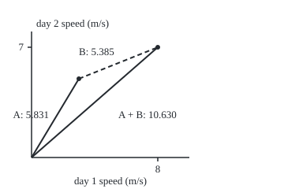
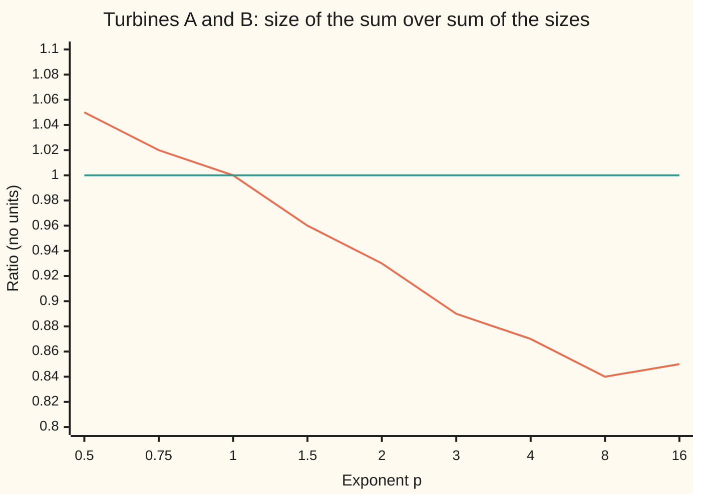

# Minkowski's inequality: the size of a sum is at most the sum of the sizes, so Lp is a normed space

[Syllabus](../../../SYLLABUS.md) → [Measure and integration](../README.md) → [Sizes of Functions](../README.md#s07) → Minkowski's inequality

---

## General Overview

Turbine A logs one daily mean wind speed for a week: 3, 5, 8, 2, 6, 4 and 7 m/s. Turbine B stands 3 km away and logs 5, 2, 4, 6, 1, 3 and 2 m/s. Add them day by day and the pair's combined reading is 8, 7, 12, 8, 7, 7 and 9 m/s.

Each week is a list of seven numbers, so it is a point, or an arrow from the origin, in a space with one direction per day. The usual length of that arrow is the square root of the sum of squares: √203 = 14.2478 for A, √95 = 9.7468 for B, and √500 = 22.3607 for the combined week. The two lengths added make 23.9946. The combined week is shorter than that by 1.6339. Two arrows laid end to end reach no further than the lengths added: this is the triangle inequality of school geometry, now in seven directions.

The [Lp spaces](01-lp-spaces.md) card measures a function with a whole family of sizes, one for each exponent p. The square-root-of-squares length is the case p = 2. This card proves that every size in the family with p at least 1 obeys the same rule, on any measure space, and that this makes each such size a genuine length: a **norm**. Hermann Minkowski used the inequality for sums in his 1896 book on the geometry of numbers.

**The size of a sum is at most the sum of the sizes, for every exponent p from 1 to infinity; with that, the p-size is a norm and the space of functions of finite p-size is a normed space.**

**What kind of fact this is:** a theorem, proved on this card in Why it works, from Hölder's inequality for 1 < p < ∞ and from the triangle inequality for numbers at p = 1 and p = ∞.

### The picture: two days of the week, drawn to scale

The seven-day arrows cannot be drawn, so keep days 1 and 2 only. Turbine A's arrow is (3, 5), B's is (5, 2), and their sum is (8, 7). Drawn at 20 units per m/s, with B's arrow slid to start at A's tip.

<p align="center"></p>

Caption: the solid arrow from the origin to (3, 5) is A, of length 5.831; the dashed arrow is B, of length 5.385, slid to start at A's tip; the long solid arrow is the sum, of length 10.630. The detour through A's tip is 11.216, longer than the direct route.

---

## The formula

Notation first, in words, as a reminder from [Lp spaces](01-lp-spaces.md). A measure space $(\Omega,\mathcal F,\mu)$ is a set of points, the collection of sets we allow ourselves to measure, and a measure giving each such set a size. Here $\Omega$ is the seven days, and $\mu$ is either **counting measure**, which gives each day weight 1, or the **uniform probability**, which gives each day weight 1/7. For a measurable function $f$ and an exponent $p$ with $1 \le p < \infty$, the **p-norm**, which this card also calls the p-size, is

$$\|f\|_p = \Big(\int_\Omega |f|^p \, d\mu\Big)^{1/p}.$$

In words: raise the size of each value to the power p, integrate, then take the p-th root to return to the original units. On the seven days, the integral against counting measure is a plain sum. The **sup-norm** $\|f\|_\infty$ is the smallest number that $|f|$ stays at or below almost everywhere, that is, except on a set of measure zero. On seven days of weight 1 it is the largest value: 8 m/s for turbine A.

**Minkowski's inequality.** For measurable $f$ and $g$ and any $p$ with $1 \le p \le \infty$,

$$\|f+g\|_p \;\le\; \|f\|_p + \|g\|_p .$$

**Read it aloud:** the p-size of the sum is at most the p-size of the first plus the p-size of the second.

With the sum of the sizes finite, the left side is finite too, so the sum of two functions of finite p-size again has finite p-size.

The proof borrows Hölder's inequality ([Holder's inequality](02-holders-inequality.md)): for measurable $u$ and $v$, $1 < p < \infty$ and the **conjugate exponent** $q = p/(p-1)$, the number with $1/p + 1/q = 1$,

$$\int_\Omega |u\,v| \, d\mu \;\le\; \|u\|_p \, \|v\|_q .$$

In words: the integral of a product is at most the product of the two sizes, measured with matched exponents.

**The norm axioms.** A **norm** is a size with three properties, and the p-norm has all three:

$$\|f\|_p = 0 \iff f = 0 \text{ a.e.}, \qquad \|c f\|_p = |c|\,\|f\|_p, \qquad \|f+g\|_p \le \|f\|_p + \|g\|_p .$$

In words: only the zero function has size zero, once functions that agree almost everywhere count as one; scaling a function by a number $c$ scales its size by the size of $c$; and the triangle inequality. **L^p**, the space of functions of finite p-size with that identification, is therefore a **normed space**: a space of things that can be added and scaled, with a length that behaves like length. The distance between two functions is $\|f-g\|_p$.

| Symbol | Plain meaning | In our example | Push it up and the answer… |
| --- | --- | --- | --- |
| $\Omega$ | the space of points | the seven days of the week | more days, more terms in each sum |
| $\mu$ | the measure: a weight on sets of days | 1 per day (counting) or 1/7 per day (uniform probability) | every p-size scales by the weight to the power 1/p; the inequality is unchanged |
| $\mathcal F$ | the sets we allow ourselves to measure | every set of days | — |
| $f$, $g$ | two measurable functions, the summands | turbine A and turbine B, in m/s | larger values, larger sizes |
| $p$ | the exponent that picks the size | 2, the square-root-of-squares length | the size leans harder on the largest values |
| $q$ | the conjugate exponent, p/(p − 1) | 2 when p = 2 | falls toward 1 as p grows |
| $\|f\|_p$ | the p-norm: p-th root of the integral of the p-th power | 14.2478 for A at p = 2 under counting measure | — |
| $\|f\|_\infty$ | the sup-norm: the largest value, ignoring sets of measure zero | 8 for A, 6 for B, 12 for the sum | — |
| $u$, $v$ | the two factors fed to Hölder | u = A, v = (A + B) to the power p − 1 | — |
| $c$ | a number that scales a function | −2.5 in the scaling check | the size grows by the factor 2.5 |
| $t$ | the ratio in the equality case, g = t f with t ≥ 0 | t = 2 when B is twice A | — |
| $M$, $N_f$, $N_g$ | in the proof: the sup-norm of f, and the sets of measure zero where f or g passes its sup-norm | M = 8 for A; both sets empty here | — |

### When it holds

- **p at least 1.** Below 1 the inequality fails. At p = 1/2 the turbines give 402.3318 for the sum against 384.2390 for the two sizes added. The proof's tool fails with it: q = p/(p − 1) is negative, and Hölder's inequality needs p ≥ 1; the split in Step 3 uses 1 < p < ∞.
- **Measurable functions on any measure space.** No finiteness, no continuity, no bound. A size may be infinite; the inequality then holds with ∞ on the right.
- **Size zero means zero almost everywhere, not everywhere.** A day of weight zero, such as a day with the sensor offline, carries any value at no cost: the function 9 on that day and 0 elsewhere has 2-norm 0.0000. The norm axioms hold only once such functions count as the zero function ([Null sets and almost everywhere](../01-Sets%20You%20Can%20Measure/07-null-sets-and-almost-everywhere.md)).
- **Equality needs the same direction.** For 1 < p < ∞, equality holds exactly when one function is a multiple $t \ge 0$ of the other almost everywhere. Opposite directions do not count: B = −2A gives 14.2478 against 42.7434.

---

## Why it works

### Step 0: add the sizes point by point, then repair the exponent

At every day, the triangle inequality for numbers says |A + B| ≤ |A| + |B|. Integrating that is already the whole story at p = 1. For larger p the trouble is the p-th power: it is not additive. The trick is to split the p-th power of the sum into two pieces, one carrying A and one carrying B, and bound each piece with Hölder. The bound comes out with one factor of the sum's size too many, and dividing it away leaves the inequality.

### Step 1: p = 1, the triangle inequality integrated

At each point, $|f+g| \le |f| + |g|$. The integral respects order and adds ([The integral of a non-negative function](../04-The%20Lebesgue%20Integral/02-integral-of-a-nonnegative-function.md)), so the size of the sum is at most the sum of sizes. For the turbines both sides are 58.0000: every reading is positive, so the day-by-day triangle inequality is an equality on every day.

### Step 2: p = ∞, the largest values

Off a set of measure zero, $|f| \le \|f\|_\infty$ and $|g| \le \|g\|_\infty$. Two sets of measure zero together still have measure zero. Off both, $|f+g| \le \|f\|_\infty + \|g\|_\infty$. The sup-norm of the sum is the smallest such bound, so it is at most that sum. For the turbines the combined maximum is 12, on day 3, against 8 + 6 = 14: A peaks on day 3 and B on day 4, so their peaks do not add.

The sup-norm is also the limit of the p-norms as p grows. For turbine A the p-norms at p = 8, 16 and 64 are 8.3956, 8.0607 and 8.0000, closing on the maximum, 8.

### Step 3: 1 < p < ∞, split and apply Hölder

First make sure the size of the sum is finite. At each point $|f+g| \le 2\max(|f|,|g|)$, so the p-th power is at most $2^p(|f|^p + |g|^p)$, which has a finite integral when both sizes are finite.

Now write the p-th power of the sum as the sum times its (p − 1)-th power, and split the first factor:

$$|f+g|^p \;\le\; |f|\,|f+g|^{p-1} + |g|\,|f+g|^{p-1}.$$

Apply Hölder to each piece with $v = |f+g|^{p-1}$. Because $(p-1)q = p$, the q-size of $v$ is the p-size of the sum to the power p − 1. Each piece is at most one summand's size times $\|f+g\|_p^{p-1}$. Adding them,

$$\|f+g\|_p^{\,p} \;\le\; \big(\|f\|_p + \|g\|_p\big)\,\|f+g\|_p^{\,p-1}.$$

Divide by $\|f+g\|_p^{p-1}$, which is finite, and positive unless the sum is zero almost everywhere, in which case there is nothing to prove.

On the turbines at p = 2, the sum of squares of the combined week, 500, splits as 304 from A's piece and 196 from B's. Hölder caps them at 318.59 and 217.94. At p = 3 the cubes sum to 4510 = 2774 + 1736, capped at 2975.37 and 2090.26.

### Step 4: the other two axioms, and a normed space

Scaling: the integral of $|cf|^p$ is $|c|^p$ times the integral of $|f|^p$, and the p-th root turns $|c|^p$ back into $|c|$. The check scales turbine A by −2.5 and gets a 3-norm of 27.2498 both ways.

Zero: the integral of the function $|f|^p$, which is zero or more, is zero exactly when that function is zero almost everywhere. So $\|f\|_p = 0$ exactly when $f = 0$ almost everywhere.

With all three axioms, the functions of finite p-size, with functions equal almost everywhere counted as one, form a normed space. Minkowski supplies the two facts the axioms need beyond arithmetic: the sum of two members is a member, and distance obeys the triangle inequality.

<details>
<summary>Detailed proof</summary>

**Setting.** $(\Omega,\mathcal F,\mu)$ is a measure space, $f$ and $g$ are measurable with real values, and $1 \le p \le \infty$. If the right side $\|f\|_p + \|g\|_p$ is infinite there is nothing to prove, so assume both sizes are finite. The sum $f + g$ is measurable, as a sum of measurable functions ([Measurable functions](../03-Measurable%20Functions/01-measurable-functions.md)).

**Case p = 1.** For every point, $|f+g| \le |f| + |g|$, the triangle inequality for numbers. The integral of functions of zero or more is monotone and additive ([The integral of a non-negative function](../04-The%20Lebesgue%20Integral/02-integral-of-a-nonnegative-function.md)), so $\int|f+g|\,d\mu \le \int|f|\,d\mu + \int|g|\,d\mu$.

**Case p = ∞.** Let $M = \|f\|_\infty$. The set where $|f| > M$ is the union over n of the sets where $|f| > M + 1/n$; each has measure zero, because $M$ is the greatest lower bound of the almost-everywhere bounds, so some such bound lies below $M + 1/n$; and a countable union of sets of measure zero has measure zero. So $|f| \le M$ off a null set $N_f$. Likewise $|g| \le \|g\|_\infty$ off a null set $N_g$. Off $N_f \cup N_g$, still null, $|f+g| \le \|f\|_\infty + \|g\|_\infty$. The sup-norm of $f + g$ is the smallest bound of this kind, so it is at most $\|f\|_\infty + \|g\|_\infty$.

**Case 1 < p < ∞.**
1. *The sum has finite size.* At each point, $|f+g| \le |f| + |g| \le 2\max(|f|,|g|)$, so $|f+g|^p \le 2^p \max(|f|^p, |g|^p) \le 2^p(|f|^p + |g|^p)$. Integrating, $\int|f+g|^p\,d\mu \le 2^p(\|f\|_p^p + \|g\|_p^p) < \infty$.
2. *Nothing to do at zero.* If $\|f+g\|_p = 0$, the inequality holds, since the right side is zero or more.
3. *Split.* At each point, $|f+g|^p = |f+g|\cdot|f+g|^{p-1} \le |f|\,|f+g|^{p-1} + |g|\,|f+g|^{p-1}$, by the triangle inequality for numbers times a factor of zero or more.
4. *Hölder on each piece.* Let $q = p/(p-1)$, so $1/p + 1/q = 1$ and $(p-1)q = p$. Put $v = |f+g|^{p-1}$. Then $\int v^q\,d\mu = \int|f+g|^p\,d\mu$, so $\|v\|_q = \big(\int|f+g|^p\,d\mu\big)^{1/q} = \|f+g\|_p^{p/q} = \|f+g\|_p^{p-1}$, finite by 1. Hölder ([Holder's inequality](02-holders-inequality.md)) gives $\int|f|\,v\,d\mu \le \|f\|_p\,\|f+g\|_p^{p-1}$, and the same with $g$ in place of $f$.
5. *Add.* Integrating 3 and using 4, $\|f+g\|_p^p \le (\|f\|_p + \|g\|_p)\,\|f+g\|_p^{p-1}$.
6. *Divide.* By 1 and 2, $\|f+g\|_p^{p-1}$ is finite and positive. Dividing by it gives $\|f+g\|_p \le \|f\|_p + \|g\|_p$. ∎

**Norm axioms.** Scaling: $\int|cf|^p\,d\mu = |c|^p\int|f|^p\,d\mu$ because the integral pulls out constants; take p-th roots. At p = ∞, $|cf| \le |c|M$ off a null set exactly when $|f| \le M$ there, for $c \ne 0$. Zero: $\int|f|^p\,d\mu = 0$ exactly when $|f|^p = 0$ off a null set, since a function of zero or more with integral zero vanishes almost everywhere (by Markov's bound, $\mu(|f|^p > 1/n) \le n\cdot 0$ for every n, [Markov and Chebyshev](../04-The%20Lebesgue%20Integral/07-markov-and-chebyshev.md)). Identifying functions equal almost everywhere, as [Lp spaces](01-lp-spaces.md) does, makes "size zero" mean "the zero element". Closure: $c\,f$ has finite size by scaling, $f + g$ by the case above. So $L^p$ is a vector space and the p-norm is a norm on it.

**Equality, 1 < p < ∞.** If equality holds with $\|f+g\|_p > 0$, both inequalities used must be equalities almost everywhere. Item 3 is an equality exactly where $f$ and $g$ have the same sign, or one of $f$, $g$, $f + g$ is zero. Item 4 is Hölder, whose equality case makes $|f|^p$ a constant multiple of $|f+g|^p$ almost everywhere, and the same for $|g|^p$. Together, $g = t f$ almost everywhere for a constant $t \ge 0$, or $f = 0$. Conversely, if $g = t f$ with $t \ge 0$, both sides equal $(1+t)\|f\|_p$.

</details>

### Step 5: why p below 1 fails

At p = 1/2 the p-th power is the square root, which is bent the wrong way: it rewards spreading a total over several days. The turbines' combined week has 1/2-size 402.3318 against 384.2390 for the two sizes added. In 3000 random pairs of weeks with readings from −9 to 9, the inequality fails 179 times at p = 1/2 and never at p = 1, 1.5, 2, 3 or ∞.

Geometrically, a size obeys the triangle inequality, given scaling, exactly when its **unit ball**, the set of functions of size at most 1, is convex: the segment between any two of its points stays inside ([Convex sets](../../05-Geometry%20and%20trig/07-Points%2C%20Convexity%20and%20Fractals/02-convex-sets-and-convex-hulls.md)). In two dimensions the unit balls are a diamond at p = 1, a circle at p = 2 and a square at p = ∞. At p = 1/2 the ball pinches inward between the axes and is not convex.

### The ratio across exponents



Caption: the first line is $\|A+B\|_p$ divided by $\|A\|_p + \|B\|_p$ for the turbines under counting measure; the flat second line is 1, where equality would sit. Minkowski says the first line stays at or below the second for p from 1 on. It crosses at p = 1, where every reading being positive makes the two sides equal, and it rises above 1 for p below 1. As p grows the ratio tends to 12/14, the sup-norms' ratio.

Another route to the same inequality runs through convexity of the p-th power alone ([Convex functions](../../06-Calculus%20and%20analysis/07-Several%20Variables/09-convex-functions.md)): normalise both functions to size 1, note the unit ball is convex because the p-th power is a convex function for p ≥ 1, and scale back. At p = 2 there is a third route, through the inner product, taken in [L2 as a Hilbert space](06-l2-as-a-hilbert-space.md).

---

## Worked numbers, by hand

The house example, turbine A, and its neighbour B, under counting measure at p = 2.

| Step | Arithmetic | Value |
| --- | --- | --- |
| A squared, summed | 9 + 25 + 64 + 4 + 36 + 16 + 49 | 203 |
| B squared, summed | 25 + 4 + 16 + 36 + 1 + 9 + 4 | 95 |
| A + B day by day | 8, 7, 12, 8, 7, 7, 9 | — |
| A + B squared, summed | 64 + 49 + 144 + 64 + 49 + 49 + 81 | 500 |
| the cross term | 3 × 5 + 5 × 2 + 8 × 4 + 2 × 6 + 6 × 1 + 4 × 3 + 7 × 2 | 101 |
| check the expansion | 203 + 2 × 101 + 95 | 500 |
| two sizes | √203 and √95 | 14.2478 and 9.7468 |
| their sum | 14.2478 + 9.7468 | 23.9946 |
| size of the sum | √500 | 22.3607 |
| slack | 23.9946 − 22.3607 | **1.6339** |
| second road, squares | 2 × (√(203 × 95) − 101) | 75.7409 |
| second road, slack | 75.7409 ÷ (14.2478 + 9.7468 + 22.3607) | **1.6339** |

The second road uses (sum of sizes)^2 − (size of sum)^2 = 2(‖A‖‖B‖ − cross term), then divides the gap in squares by the sum of the two lengths.

Under the uniform probability, each day weighs 1/7 and each 2-norm is the **root mean square** (RMS) speed. Every p-size is then its counting-measure value times $(1/7)^{1/p}$, and the inequality survives unchanged: RMS of the combined week 8.4515, against 5.3852 + 3.6839 = 9.0691. Halve it: the fleet's average turbine has RMS 4.2258, at most the average of the two RMS values, 4.5346. Pooling two sites never makes the RMS larger than the mean of the RMS values.

### What breaks if you drop a piece

| Mistake | Comes out at | What went wrong |
| --- | --- | --- |
| Drop the p-th root at p = 2 | 500 against 203 + 95 = 298 | a sum of squares is not a size; squaring rewards the cross term |
| Use p = 1/2 | 402.3318 against 384.2390 | below p = 1 the unit ball is not convex |
| Read size zero as the zero function | 2-norm 0.0000 for a function that is 9 on day 7 | size zero means zero almost everywhere |
| Expect equality for opposite arrows | B = −2A: 14.2478 against 42.7434 | equality needs the same direction, t ≥ 0 |

The code prints all four.

---

## Code, from first principles, and it actually runs

The code computes both sides of the inequality for the turbines at seven exponents, then reaches the p = 2 slack a second way from whole-number sums and a hand-written square root. It prints the Hölder split from the proof, tests 3000 random pairs from a SplitMix64 generator written out in both languages, and prints each mistake. Code checks instances and finite samples; the statement for every function on every measure space is shown only by the proof.

### Python

```python
# Minkowski's inequality -- the check behind the card.  Standard library only.
# Turbine A's week of daily mean wind speeds (m/s) is the shelf's house example;
# turbine B stands 3 km away.  Each week is a function on 7 days.  Roads: the two
# sides computed directly; p = 2 again from whole-number sums and a square root
# written out here; the Hoelder split of the proof; 3000 random SplitMix64 pairs.
INF = float("inf")
A = [3, 5, 8, 2, 6, 4, 7]
B = [5, 2, 4, 6, 1, 3, 2]
S = [a + b for a, b in zip(A, B)]
COUNT, PROB = [1.0] * 7, [1.0 / 7] * 7

def norm(f, p, w=COUNT):                 # (sum of |f|^p times weight)^(1/p); max where p = inf
    if p == INF:
        return max(abs(x) for x, wt in zip(f, w) if wt > 0)
    return sum(abs(x) ** p * wt for x, wt in zip(f, w)) ** (1 / p)

def sqrt_newton(x):                      # square root by Newton's method, written out
    r = x if x > 1 else 1.0
    for _ in range(60):
        r = 0.5 * (r + x / r)
    return r

def splitmix(state):                     # SplitMix64: returns (new state, 64-bit output)
    state = (state + 0x9E3779B97F4A7C15) & 0xFFFFFFFFFFFFFFFF
    z = state
    z = ((z ^ (z >> 30)) * 0xBF58476D1CE4E5B9) & 0xFFFFFFFFFFFFFFFF
    z = ((z ^ (z >> 27)) * 0x94D049BB133111EB) & 0xFFFFFFFFFFFFFFFF
    return state, z ^ (z >> 31)

def pname(p):
    return "inf" if p == INF else f"{p:g}"

print(f"A = {A}, B = {B}, A + B = {S}  (m/s)")
print("counting measure: p, ||A+B||_p, ||A||_p + ||B||_p, slack, holds")
for p in (0.5, 1, 1.5, 2, 3, 4, INF):
    l, r = norm(S, p), norm(A, p) + norm(B, p)
    print(f"  p = {pname(p):>3}: {l:10.4f} {r:10.4f} {r - l:+9.4f}  {'yes' if l <= r + 1e-12 else 'NO'}")
nA, nB, nS = norm(A, 2), norm(B, 2), norm(S, 2)
print(f"p = 2 parts: ||A|| = {nA:.4f}, ||B|| = {nB:.4f}, ||A+B|| = {nS:.4f}")
sa, sb, dot = sum(a * a for a in A), sum(b * b for b in B), sum(a * b for a, b in zip(A, B))
ss = sa + 2 * dot + sb                   # ||A+B||^2 expanded: no square root taken of it
gap_sq = 2 * (sqrt_newton(sa * sb) - dot)            # (||A||+||B||)^2 - ||A+B||^2
slack2 = gap_sq / (sqrt_newton(sa) + sqrt_newton(sb) + sqrt_newton(ss))
print(f"p = 2 by whole numbers: sum A^2 = {sa}, sum B^2 = {sb}, sum A*B = {dot}, sum (A+B)^2 = {ss}")
print(f"  gap in squares 2(sqrt({sa}*{sb}) - {dot}) = {gap_sq:.4f}; slack = {slack2:.4f}")
print(f"uniform probability 1/7: RMS A = {norm(A, 2, PROB):.4f}, RMS B = {norm(B, 2, PROB):.4f}, "
      f"RMS A+B = {norm(S, 2, PROB):.4f}, sum = {norm(A, 2, PROB) + norm(B, 2, PROB):.4f}")
print(f"  fleet average (A+B)/2: RMS {norm(S, 2, PROB) / 2:.4f} <= mean of RMS {(norm(A, 2, PROB) + norm(B, 2, PROB)) / 2:.4f}")
print(f"  cube-mean p = 3: A {norm(A, 3, PROB):.4f}, B {norm(B, 3, PROB):.4f}, A+B {norm(S, 3, PROB):.4f}")
split = []
for p in (2, 3):                         # the proof's split, with Hoelder on each half
    iA = sum(a * s ** (p - 1) for a, s in zip(A, S))
    iB = sum(b * s ** (p - 1) for b, s in zip(B, S))
    hA, hB = norm(A, p) * norm(S, p) ** (p - 1), norm(B, p) * norm(S, p) ** (p - 1)
    print(f"Hoelder split p = {p}: sum (A+B)^{p} = {sum(s ** p for s in S)} = {iA} + {iB}; "
          f"bounds {hA:.2f} + {hB:.2f}")
    split.append(iA <= hA and iB <= hB)
print(f"p = inf as a limit: ||A||_p at p = 8, 16, 64: "
      + ", ".join(f"{norm(A, p):.4f}" for p in (8, 16, 64)) + f"; max = {norm(A, INF)}")
c = -2.5
cA = [c * a for a in A]
print(f"scaling: ||(-2.5)A||_3 = {norm(cA, 3):.4f}, 2.5 * ||A||_3 = {abs(c) * norm(A, 3):.4f}")
off = [1.0] * 6 + [0.0]                  # day 7 given weight zero: sensor offline
Z = [0, 0, 0, 0, 0, 0, 9]
print(f"weight 0 on day 7: ||{Z}||_2 = {norm(Z, 2, off):.4f}, yet the function is not 0 on day 7")
twice, minus = [2 * a for a in A], [-2 * a for a in A]
print(f"B = 2A: ||A+2A||_2 = {norm([3 * a for a in A], 2):.4f}, ||A|| + ||2A|| = {nA + norm(twice, 2):.4f}")
print(f"B = -2A: ||A-2A||_2 = {norm([-a for a in A], 2):.4f}, ||A|| + ||-2A|| = {nA + norm(minus, 2):.4f}")
print(f"mistake, no root at p = 2: sum (A+B)^2 = {ss} > {sa} + {sb} = {sa + sb}")
print(f"mistake, p = 1/2: {norm(S, 0.5):.4f} > {norm(A, 0.5) + norm(B, 0.5):.4f}")
state, fails, worst = 20260929, {}, {}
ps = (0.5, 1, 1.5, 2, 3, INF)
for _ in range(3000):
    vec = []
    for _ in range(14):
        state, z = splitmix(state)
        vec.append((z >> 33) % 19 - 9)
    f, g = vec[:7], vec[7:]
    h = [x + y for x, y in zip(f, g)]
    for p in ps:
        l, r = norm(h, p), norm(f, p) + norm(g, p)
        if r > 0:
            worst[p] = max(worst.get(p, 0.0), l / r)
            fails[p] = fails.get(p, 0) + (l > r * (1 + 1e-12))
print("3000 random pairs, entries -9..9: p, failures, largest ||f+g|| / (||f|| + ||g||)")
for p in ps:
    print(f"  p = {pname(p):>3}: {fails[p]:4d}  {worst[p]:.6f}")
chart = (0.5, 0.75, 1, 1.5, 2, 3, 4, 8, 16)
print("chart, p:     " + " ".join(f"{p:g}" for p in chart))
print("chart, ratio: " + " ".join(f"{norm(S, p) / (norm(A, p) + norm(B, p)):.2f}" for p in chart))
print("figure, days 1-2 at 20 units per m/s from (40, 200): A tip (100, 100), sum tip (200, 60), "
      f"lengths {norm(A[:2], 2):.3f} + {norm(B[:2], 2):.3f} = {norm(A[:2], 2) + norm(B[:2], 2):.3f} "
      f"vs {norm(S[:2], 2):.3f}")
assert abs((nA + nB - nS) - slack2) < 1e-9           # p = 2 slack: roots of sums vs whole numbers
assert all(split)                                    # Hoelder bounds each half of the split
assert all(fails[p] == 0 for p in ps if p >= 1) and fails[0.5] > 0
assert abs(norm(cA, 3) - 2.5 * norm(A, 3)) < 1e-9       # scaling, list rescaled vs norm rescaled
assert abs(norm(A, 64) - norm(A, INF)) < 1e-3          # large p approaches the sup-norm
assert abs(norm([3 * a for a in A], 2) - (nA + norm(twice, 2))) < 1e-9   # t = 2: equality
assert norm([-a for a in A], 2) < nA + norm(minus, 2) - 1                # t = -2: strict
assert norm(Z, 2, off) == 0                            # size zero, function not zero
print("ALL CHECKS PASS")
```

**Ran 2026-10-06 on macOS, Python 3.14.6, standard library only. All checks passed. Output, pasted from the run:**

```
A = [3, 5, 8, 2, 6, 4, 7], B = [5, 2, 4, 6, 1, 3, 2], A + B = [8, 7, 12, 8, 7, 7, 9]  (m/s)
counting measure: p, ||A+B||_p, ||A||_p + ||B||_p, slack, holds
  p = 0.5:   402.3318   384.2390  -18.0927  NO
  p =   1:    58.0000    58.0000   +0.0000  yes
  p = 1.5:    30.6137    31.8232   +1.2095  yes
  p =   2:    22.3607    23.9946   +1.6339  yes
  p =   3:    16.5219    18.5573   +2.0355  yes
  p =   4:    14.3743    16.5959   +2.2216  yes
  p = inf:    12.0000    14.0000   +2.0000  yes
p = 2 parts: ||A|| = 14.2478, ||B|| = 9.7468, ||A+B|| = 22.3607
p = 2 by whole numbers: sum A^2 = 203, sum B^2 = 95, sum A*B = 101, sum (A+B)^2 = 500
  gap in squares 2(sqrt(203*95) - 101) = 75.7409; slack = 1.6339
uniform probability 1/7: RMS A = 5.3852, RMS B = 3.6839, RMS A+B = 8.4515, sum = 9.0691
  fleet average (A+B)/2: RMS 4.2258 <= mean of RMS 4.5346
  cube-mean p = 3: A 5.6980, B 4.0030, A+B 8.6369
Hoelder split p = 2: sum (A+B)^2 = 500 = 304 + 196; bounds 318.59 + 217.94
Hoelder split p = 3: sum (A+B)^3 = 4510 = 2774 + 1736; bounds 2975.37 + 2090.26
p = inf as a limit: ||A||_p at p = 8, 16, 64: 8.3956, 8.0607, 8.0000; max = 8
scaling: ||(-2.5)A||_3 = 27.2498, 2.5 * ||A||_3 = 27.2498
weight 0 on day 7: ||[0, 0, 0, 0, 0, 0, 9]||_2 = 0.0000, yet the function is not 0 on day 7
B = 2A: ||A+2A||_2 = 42.7434, ||A|| + ||2A|| = 42.7434
B = -2A: ||A-2A||_2 = 14.2478, ||A|| + ||-2A|| = 42.7434
mistake, no root at p = 2: sum (A+B)^2 = 500 > 203 + 95 = 298
mistake, p = 1/2: 402.3318 > 384.2390
3000 random pairs, entries -9..9: p, failures, largest ||f+g|| / (||f|| + ||g||)
  p = 0.5:  179  1.337382
  p =   1:    0  1.000000
  p = 1.5:    0  0.996816
  p =   2:    0  0.995253
  p =   3:    0  0.991652
  p = inf:    0  1.000000
chart, p:     0.5 0.75 1 1.5 2 3 4 8 16
chart, ratio: 1.05 1.02 1.00 0.96 0.93 0.89 0.87 0.84 0.85
figure, days 1-2 at 20 units per m/s from (40, 200): A tip (100, 100), sum tip (200, 60), lengths 5.831 + 5.385 = 11.216 vs 10.630
ALL CHECKS PASS
```

### Rust

Same numbers, same labels, built with `rustc --edition 2021 -O`.

```rust
// Minkowski's inequality -- the same check as the Python, in Rust.  No crates.
// Turbine A's week of daily mean wind speeds (m/s) is the shelf's house example;
// turbine B stands 3 km away.  Each week is a function on 7 days.  Roads: the two
// sides computed directly; p = 2 again from whole-number sums and a square root
// written out here; the Hoelder split of the proof; 3000 random SplitMix64 pairs.
const INF: f64 = f64::INFINITY;

fn norm(f: &[f64], p: f64, w: &[f64]) -> f64 {  // (sum of |f|^p times weight)^(1/p); max where p = inf
    if p == INF {
        return f.iter().zip(w).filter(|(_, wt)| **wt > 0.0).map(|(x, _)| x.abs()).fold(0.0, f64::max);
    }
    f.iter().zip(w).map(|(x, wt)| x.abs().powf(p) * wt).sum::<f64>().powf(1.0 / p)
}

fn sqrt_newton(x: f64) -> f64 {                 // square root by Newton's method, written out
    let mut r = if x > 1.0 { x } else { 1.0 };
    for _ in 0..60 { r = 0.5 * (r + x / r) }
    r
}

fn splitmix(state: u64) -> (u64, u64) {         // SplitMix64: returns (new state, 64-bit output)
    let s = state.wrapping_add(0x9E3779B97F4A7C15);
    let mut z = s;
    z = (z ^ (z >> 30)).wrapping_mul(0xBF58476D1CE4E5B9);
    z = (z ^ (z >> 27)).wrapping_mul(0x94D049BB133111EB);
    (s, z ^ (z >> 31))
}

fn pname(p: f64) -> String { if p == INF { "inf".to_string() } else { format!("{}", p) } }

fn main() {
    let ai: [i64; 7] = [3, 5, 8, 2, 6, 4, 7];
    let bi: [i64; 7] = [5, 2, 4, 6, 1, 3, 2];
    let si: Vec<i64> = ai.iter().zip(&bi).map(|(a, b)| a + b).collect();
    let (a, b): (Vec<f64>, Vec<f64>) = (ai.iter().map(|&x| x as f64).collect(), bi.iter().map(|&x| x as f64).collect());
    let s: Vec<f64> = si.iter().map(|&x| x as f64).collect();
    let (count, prob) = (vec![1.0; 7], vec![1.0 / 7.0; 7]);
    let n = |f: &[f64], p: f64| norm(f, p, &count);
    println!("A = {:?}, B = {:?}, A + B = {:?}  (m/s)", ai, bi, si);
    println!("counting measure: p, ||A+B||_p, ||A||_p + ||B||_p, slack, holds");
    for p in [0.5, 1.0, 1.5, 2.0, 3.0, 4.0, INF] {
        let (l, r) = (n(&s, p), n(&a, p) + n(&b, p));
        println!("  p = {:>3}: {:10.4} {:10.4} {:+9.4}  {}", pname(p), l, r, r - l, if l <= r + 1e-12 { "yes" } else { "NO" });
    }
    let (na, nb, ns) = (n(&a, 2.0), n(&b, 2.0), n(&s, 2.0));
    println!("p = 2 parts: ||A|| = {:.4}, ||B|| = {:.4}, ||A+B|| = {:.4}", na, nb, ns);
    let sa: i64 = ai.iter().map(|x| x * x).sum();
    let sb: i64 = bi.iter().map(|x| x * x).sum();
    let dot: i64 = ai.iter().zip(&bi).map(|(x, y)| x * y).sum();
    let ss = sa + 2 * dot + sb;                 // ||A+B||^2 expanded: no square root taken of it
    let gap_sq = 2.0 * (sqrt_newton((sa * sb) as f64) - dot as f64);
    let slack2 = gap_sq / (sqrt_newton(sa as f64) + sqrt_newton(sb as f64) + sqrt_newton(ss as f64));
    println!("p = 2 by whole numbers: sum A^2 = {}, sum B^2 = {}, sum A*B = {}, sum (A+B)^2 = {}", sa, sb, dot, ss);
    println!("  gap in squares 2(sqrt({}*{}) - {}) = {:.4}; slack = {:.4}", sa, sb, dot, gap_sq, slack2);
    let (ra, rb, rs) = (norm(&a, 2.0, &prob), norm(&b, 2.0, &prob), norm(&s, 2.0, &prob));
    println!("uniform probability 1/7: RMS A = {:.4}, RMS B = {:.4}, RMS A+B = {:.4}, sum = {:.4}", ra, rb, rs, ra + rb);
    println!("  fleet average (A+B)/2: RMS {:.4} <= mean of RMS {:.4}", rs / 2.0, (ra + rb) / 2.0);
    println!("  cube-mean p = 3: A {:.4}, B {:.4}, A+B {:.4}", norm(&a, 3.0, &prob), norm(&b, 3.0, &prob), norm(&s, 3.0, &prob));
    let mut split = Vec::new();
    for p in [2u32, 3] {                        // the proof's split, with Hoelder on each half
        let ia: i64 = ai.iter().zip(&si).map(|(x, t)| x * t.pow(p - 1)).sum();
        let ib: i64 = bi.iter().zip(&si).map(|(x, t)| x * t.pow(p - 1)).sum();
        let tot: i64 = si.iter().map(|t| t.pow(p)).sum();
        let pf = p as f64;
        let (ha, hb) = (n(&a, pf) * n(&s, pf).powf(pf - 1.0), n(&b, pf) * n(&s, pf).powf(pf - 1.0));
        println!("Hoelder split p = {}: sum (A+B)^{} = {} = {} + {}; bounds {:.2} + {:.2}", p, p, tot, ia, ib, ha, hb);
        split.push((ia as f64) <= ha && (ib as f64) <= hb);
    }
    println!("p = inf as a limit: ||A||_p at p = 8, 16, 64: {:.4}, {:.4}, {:.4}; max = {}",
             n(&a, 8.0), n(&a, 16.0), n(&a, 64.0), n(&a, INF));
    let c = -2.5;
    let ca: Vec<f64> = a.iter().map(|x| c * x).collect();
    println!("scaling: ||(-2.5)A||_3 = {:.4}, 2.5 * ||A||_3 = {:.4}", n(&ca, 3.0), f64::abs(c) * n(&a, 3.0));
    let off = [1.0, 1.0, 1.0, 1.0, 1.0, 1.0, 0.0]; // day 7 given weight zero: sensor offline
    let z: [i64; 7] = [0, 0, 0, 0, 0, 0, 9];
    let zf: Vec<f64> = z.iter().map(|&x| x as f64).collect();
    println!("weight 0 on day 7: ||{:?}||_2 = {:.4}, yet the function is not 0 on day 7", z, norm(&zf, 2.0, &off));
    let scaled = |k: f64| -> Vec<f64> { a.iter().map(|x| k * x).collect() };
    println!("B = 2A: ||A+2A||_2 = {:.4}, ||A|| + ||2A|| = {:.4}", n(&scaled(3.0), 2.0), na + n(&scaled(2.0), 2.0));
    println!("B = -2A: ||A-2A||_2 = {:.4}, ||A|| + ||-2A|| = {:.4}", n(&scaled(-1.0), 2.0), na + n(&scaled(-2.0), 2.0));
    println!("mistake, no root at p = 2: sum (A+B)^2 = {} > {} + {} = {}", ss, sa, sb, sa + sb);
    println!("mistake, p = 1/2: {:.4} > {:.4}", n(&s, 0.5), n(&a, 0.5) + n(&b, 0.5));
    let ps = [0.5, 1.0, 1.5, 2.0, 3.0, INF];
    let (mut state, mut fails, mut worst) = (20260929u64, [0u32; 6], [0.0f64; 6]);
    for _ in 0..3000 {
        let mut v = Vec::new();
        for _ in 0..14 {
            let (st, zz) = splitmix(state);
            state = st;
            v.push(((zz >> 33) % 19) as f64 - 9.0);
        }
        let (f, g) = (&v[..7], &v[7..]);
        let h: Vec<f64> = f.iter().zip(g).map(|(x, y)| x + y).collect();
        for (i, &p) in ps.iter().enumerate() {
            let (l, r) = (n(&h, p), n(f, p) + n(g, p));
            if r > 0.0 {
                worst[i] = worst[i].max(l / r);
                if l > r * (1.0 + 1e-12) { fails[i] += 1 }
            }
        }
    }
    println!("3000 random pairs, entries -9..9: p, failures, largest ||f+g|| / (||f|| + ||g||)");
    for (i, &p) in ps.iter().enumerate() { println!("  p = {:>3}: {:4}  {:.6}", pname(p), fails[i], worst[i]) }
    let chart = [0.5, 0.75, 1.0, 1.5, 2.0, 3.0, 4.0, 8.0, 16.0];
    let cp: Vec<String> = chart.iter().map(|&p| pname(p)).collect();
    let cr: Vec<String> = chart.iter().map(|&p| format!("{:.2}", n(&s, p) / (n(&a, p) + n(&b, p)))).collect();
    println!("chart, p:     {}", cp.join(" "));
    println!("chart, ratio: {}", cr.join(" "));
    let (la, lb, ls) = (n(&a[..2], 2.0), n(&b[..2], 2.0), n(&s[..2], 2.0));
    println!("figure, days 1-2 at 20 units per m/s from (40, 200): A tip (100, 100), sum tip (200, 60), lengths {:.3} + {:.3} = {:.3} vs {:.3}",
             la, lb, la + lb, ls);
    assert!(((na + nb - ns) - slack2).abs() < 1e-9);   // p = 2 slack: roots of sums vs whole numbers
    assert!(split.iter().all(|&ok| ok));                // Hoelder bounds each half of the split
    assert!(fails[1..].iter().all(|&k| k == 0) && fails[0] > 0);
    assert!((n(&ca, 3.0) - 2.5 * n(&a, 3.0)).abs() < 1e-9); // scaling, list rescaled vs norm rescaled
    assert!((n(&a, 64.0) - n(&a, INF)).abs() < 1e-3);   // large p approaches the sup-norm
    assert!((n(&scaled(3.0), 2.0) - (na + n(&scaled(2.0), 2.0))).abs() < 1e-9); // t = 2: equality
    assert!(n(&scaled(-1.0), 2.0) < na + n(&scaled(-2.0), 2.0) - 1.0);          // t = -2: strict
    assert!(norm(&zf, 2.0, &off) == 0.0);               // size zero, function not zero
    println!("ALL CHECKS PASS");
}
```

**Ran 2026-10-06 on macOS, rustc 1.98.1, no crates. All checks passed. Output, pasted from the run:**

```
A = [3, 5, 8, 2, 6, 4, 7], B = [5, 2, 4, 6, 1, 3, 2], A + B = [8, 7, 12, 8, 7, 7, 9]  (m/s)
counting measure: p, ||A+B||_p, ||A||_p + ||B||_p, slack, holds
  p = 0.5:   402.3318   384.2390  -18.0927  NO
  p =   1:    58.0000    58.0000   +0.0000  yes
  p = 1.5:    30.6137    31.8232   +1.2095  yes
  p =   2:    22.3607    23.9946   +1.6339  yes
  p =   3:    16.5219    18.5573   +2.0355  yes
  p =   4:    14.3743    16.5959   +2.2216  yes
  p = inf:    12.0000    14.0000   +2.0000  yes
p = 2 parts: ||A|| = 14.2478, ||B|| = 9.7468, ||A+B|| = 22.3607
p = 2 by whole numbers: sum A^2 = 203, sum B^2 = 95, sum A*B = 101, sum (A+B)^2 = 500
  gap in squares 2(sqrt(203*95) - 101) = 75.7409; slack = 1.6339
uniform probability 1/7: RMS A = 5.3852, RMS B = 3.6839, RMS A+B = 8.4515, sum = 9.0691
  fleet average (A+B)/2: RMS 4.2258 <= mean of RMS 4.5346
  cube-mean p = 3: A 5.6980, B 4.0030, A+B 8.6369
Hoelder split p = 2: sum (A+B)^2 = 500 = 304 + 196; bounds 318.59 + 217.94
Hoelder split p = 3: sum (A+B)^3 = 4510 = 2774 + 1736; bounds 2975.37 + 2090.26
p = inf as a limit: ||A||_p at p = 8, 16, 64: 8.3956, 8.0607, 8.0000; max = 8
scaling: ||(-2.5)A||_3 = 27.2498, 2.5 * ||A||_3 = 27.2498
weight 0 on day 7: ||[0, 0, 0, 0, 0, 0, 9]||_2 = 0.0000, yet the function is not 0 on day 7
B = 2A: ||A+2A||_2 = 42.7434, ||A|| + ||2A|| = 42.7434
B = -2A: ||A-2A||_2 = 14.2478, ||A|| + ||-2A|| = 42.7434
mistake, no root at p = 2: sum (A+B)^2 = 500 > 203 + 95 = 298
mistake, p = 1/2: 402.3318 > 384.2390
3000 random pairs, entries -9..9: p, failures, largest ||f+g|| / (||f|| + ||g||)
  p = 0.5:  179  1.337382
  p =   1:    0  1.000000
  p = 1.5:    0  0.996816
  p =   2:    0  0.995253
  p =   3:    0  0.991652
  p = inf:    0  1.000000
chart, p:     0.5 0.75 1 1.5 2 3 4 8 16
chart, ratio: 1.05 1.02 1.00 0.96 0.93 0.89 0.87 0.84 0.85
figure, days 1-2 at 20 units per m/s from (40, 200): A tip (100, 100), sum tip (200, 60), lengths 5.831 + 5.385 = 11.216 vs 10.630
ALL CHECKS PASS
```

The two outputs match line for line.

> [!TIP]
> **Try changing**
> Guess first, then run it.
> - **Same direction.** Set `B` to `[6, 10, 16, 4, 12, 8, 14]`, twice A. The slack reads ±0.0000 at every exponent, even p = 1/2, and the chart ratio is 1.00 throughout. The Hölder assert then stops the run: each piece meets its cap exactly, and rounding decides which side is larger.
> - **Readings of zero or more.** In the Python, change the random readings from `% 19 - 9` to `% 10`. At p = 1/2 all 3000 pairs fail: for functions of zero or more the inequality reverses below p = 1.
> - **Just below 1.** In the Python, replace `0.5` with `0.9` in the list of exponents `ps` and in the third assert. Fewer pairs fail, and by less; the failures shrink to none as p reaches 1.

---

## The usual mistake

> [!warning]
> **Adding the p-th powers instead of the sizes.** The inequality is about the p-th root of the integral, not the integral of the p-th power. The combined week's sum of squares is 500, far above 203 + 95 = 298, because squaring a sum adds a cross term, 2 × 101 here. Take the roots first: 22.3607 against 23.9946.
>
> - **Using it below p = 1.** The same formula at p = 1/2 fails: 402.3318 against 384.2390. The quantity is still defined; it is just not a norm.
> - **Reading size zero as the zero function.** On a day of weight zero a function can be 9 and still have size 0.0000. The p-norm is a norm only on classes of functions equal almost everywhere.
> - **Expecting equality whenever the arrows are parallel.** B = −2A is parallel to A but opposite, and the sizes are 14.2478 against 42.7434. Equality needs one function to be a multiple $t \ge 0$ of the other.
> - **Treating p = 1 equality as luck.** For the turbines both sides are 58.0000 because every reading is positive. Any two functions of zero or more give equality at p = 1.

---

## Where you meet it in real life

- **Wind resource assessment.** Sites are compared by RMS speed and by the cube-mean speed, the 3-norm under the uniform probability, because a turbine's power grows with the cube of wind speed. For A, B and their sum the cube-means are 5.6980, 4.0030 and 8.6369 m/s; Minkowski guarantees the sum never exceeds the two added.
- **Error budgets.** An instrument's RMS error from two sources, added reading by reading, is at most the sum of the two RMS errors, with equality only when the two errors move in lockstep.
- **Distances in data.** Nearest-neighbour search uses the 1-norm, 2-norm and sup-norm distances between records. Each obeys the triangle inequality by this theorem, which is what lets search trees prune candidates; a "distance" built from p = 1/2 does not, and pruning with it misses true neighbours.
- **Risk.** Volatility, the 2-norm of a centred return under the probability, is at most the sum of the parts' volatilities: the arithmetic behind diversification.

> **Say it back**
> The p-size of a function is the p-th root of the integral of its p-th power. For p from 1 to infinity, the p-size of a sum is at most the sum of the p-sizes. At p = 1 and p = ∞ that is the triangle inequality for numbers, integrated or maximised; in between, split the p-th power of the sum into two pieces, cap each with Hölder, and divide out the extra factor. With scaling and "size zero means zero almost everywhere", that makes the p-size a norm. Below p = 1 it fails, and equality needs one function to be a non-negative multiple of the other.

---

## What this builds on

- [Holder's inequality](02-holders-inequality.md): the cap on each piece of the split in Step 3.

## Where this goes next

- [Riesz-Fischer](05-completeness-of-lp.md): with a norm in hand, distance between functions makes sense, and the Riesz-Fischer theorem shows no Cauchy sequence escapes the space.
- Convolution: an integral of shifted copies, bounded by Minkowski applied under the integral sign.

Also on this shelf: [Jensen's inequality](04-jensens-inequality.md) compares sizes at different exponents under a probability.

L^p now has a distance, $\|f-g\|_p$; whether a sequence whose members crowd together in that distance always has a limit inside L^p is the question [Riesz-Fischer](05-completeness-of-lp.md) answers.

---

## Sources

Verified 2026-09-29: each link opens a page naming the cited work.

- Axler, Sheldon. *Measure, Integration & Real Analysis*. Springer, 2020. [Author's page with the free edition](https://measure.axler.net/). Chapter 7 proves Hölder and Minkowski and builds the L^p spaces as normed spaces.
- Folland, Gerald B. *Real Analysis: Modern Techniques and Their Applications*, 2nd ed. Wiley, 1999. [Publisher page](https://www.wiley.com/en-us/Real+Analysis%3A+Modern+Techniques+and+Their+Applications%2C+2nd+Edition-p-9780471317166). Chapter 6 gives the Hölder-then-divide proof used here, with the p = ∞ case.
- Minkowski, Hermann. *Geometrie der Zahlen*. Teubner, 1896. [Scan of the 1910 printing at the Internet Archive](https://archive.org/details/geometriederzahl00minkrich). The book where convex bodies and their distance functions enter number theory.
