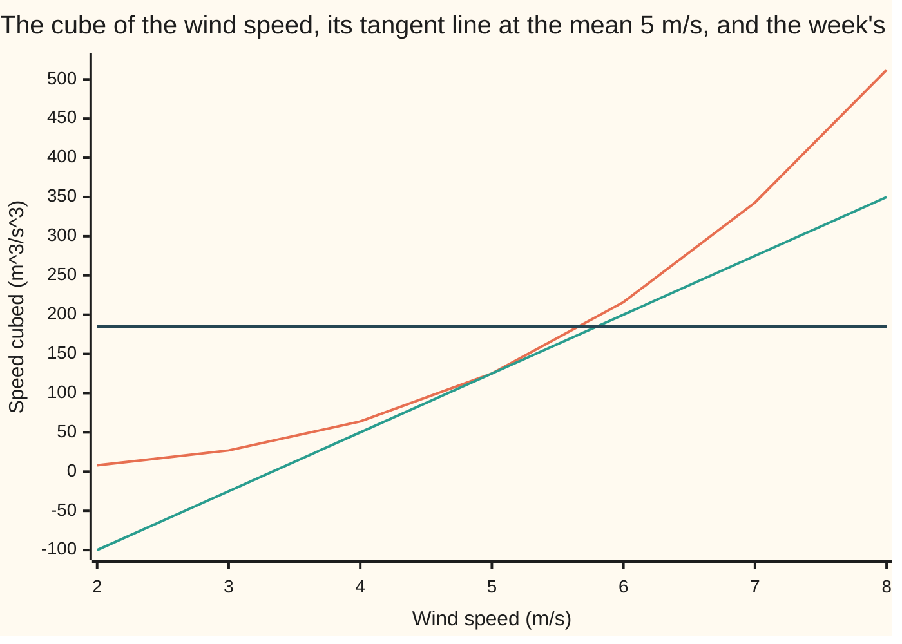
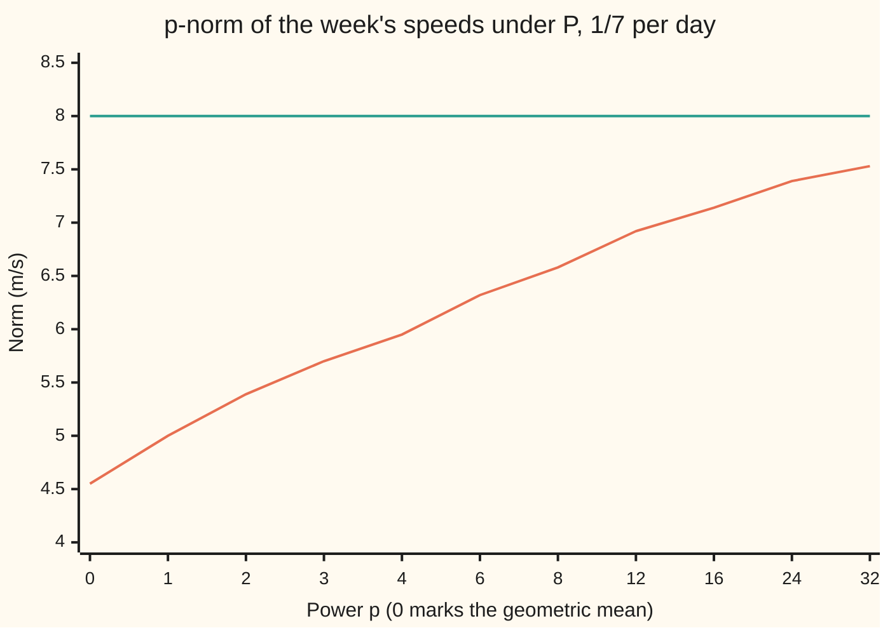

# Jensen's inequality: a convex function of an average never exceeds the average of the function, and moments nest on a probability space

[Syllabus](../../../SYLLABUS.md) → [Measure and integration](../README.md) → [Sizes of Functions](../README.md#s07) → Jensen's inequality

---

## General Overview

A wind turbine logs one mean speed per day for a week: 3, 5, 8, 2, 6, 4 and 7 metres per second. The average speed is 5 m/s. The power carried by wind through each square metre of rotor grows with the cube of the speed: half the air density times the speed cubed.

Feed the average speed into the cube and a steady 5 m/s wind gives 5 × 5 × 5 = 125. Cube each day's speed first and average the seven cubes, and the week gives 185. With air at 1.225 kg per cubic metre, that is 76.56 watts per square metre from the steady wind against 113.31 watts from the real week. A forecast built on the average speed misses 60 of every 185 units. The calm days cannot pay back what the windy days add, because the cube bends upward.

The probability wing proves this for random variables with a list of values or a density ([Jensen's inequality](../../09-Probability%20and%20statistics/02-Random%20Variables/06-jensens-inequality.md)). This card proves it for any integrable function on any space of total size 1, reads off three consequences, and shows it failing on a space of total size 7 or of infinite size.

**On a space of total size 1, a function that bends upward, applied after integrating, gives at most what it gives applied before integrating; the one line that proves it uses the total size exactly twice.**

**What kind of fact this is:** a theorem, proved on this card in Why it works; the three consequences are corollaries proved there too.

### The picture: the cube, and a straight line under it



Orange is the cube. Green is the straight line touching it at the mean speed 5, where both read 125; it lies under the cube at every other speed of 0 or more. Dark blue is the week's mean cube, 185. Averaging a straight line over the week lands on the line at the mean, 125. The cube sits on or above the line on every day, and strictly above on six of them, so its average sits above 125.

---

## The formula

Notation, as a reminder. A measure space $(\Omega, \mathcal{F}, \mu)$ is a set of points, the sets we allow ourselves to measure, and a measure giving each a size. A probability measure $P$ has total size $P(\Omega) = 1$. The integral $\int f \, dP$, read "the integral of f against P", is also written $E[f]$, the mean of f ([Expectation as an integral](../04-The%20Lebesgue%20Integral/06-expectation-as-an-integral.md)). $L^1(P)$ is the set of measurable functions with $\int \lvert f \rvert \, dP$ finite. A function $\varphi$ on an interval is **convex** when each chord between two points of its graph lies on or above the graph ([Convex functions](../../06-Calculus%20and%20analysis/07-Several%20Variables/09-convex-functions.md)); **strictly convex** when the chord lies strictly above except at its ends. $\varphi \circ f$, read "phi after f", is the function that sends a point $\omega$ to $\varphi(f(\omega))$.

On the turbine, $\Omega$ is the seven days, $\mathcal{F}$ is every subset of them, $P$ gives each day 1/7, and $f$ is the day's speed; its integral is a weighted sum of seven values.

**Jensen's inequality.** Let $(\Omega, \mathcal{F}, P)$ be a probability space, $I$ an interval, $\varphi$ convex on $I$, and $f$ in $L^1(P)$ with every value in $I$. Then the integral of $\varphi \circ f$ exists (it may be $+\infty$) and

$$\varphi\Big(\int f \, dP\Big) \;\le\; \int \varphi \circ f \, dP.$$

If $\varphi$ is strictly convex and the right side is finite, equality holds exactly when $f$ equals its mean almost surely, written a.s.: except on a set of probability zero.

**Read it aloud:** on a probability space, the convex function of the integral is at most the integral of the convex function.

Three corollaries, each Jensen with one chosen $\varphi$:

$$\Big(\int f \, dP\Big)^2 \le \int f^2 \, dP, \qquad \exp\Big(\int \ln f \, dP\Big) \le \int f \, dP \ \ (f > 0), \qquad \lVert f \rVert_p \le \lVert f \rVert_q \ \ (0 < p < q).$$

**Read them aloud:** the square of the mean is at most the mean of the square; the geometric mean, e raised to the mean logarithm, is at most the ordinary mean; the p-norm grows with p.

The p-norm, from [Lp spaces](01-lp-spaces.md), is $\lVert f \rVert_p = \big(\int \lvert f \rvert^p \, dP\big)^{1/p}$. The third inequality is **Lyapunov's inequality**: on a probability space $L^q(P)$ sits inside $L^p(P)$ whenever $p < q$.

| Symbol | Plain meaning | In our example | Push it up and the answer… |
| --- | --- | --- | --- |
| $\Omega$, $\omega$, $\mathcal{F}$ | the space; one point of it; the sets we allow ourselves to measure | the seven days; one day; every subset of them | — |
| $\mu$, $P$, $\lambda$ | a measure; one of total size 1; Lebesgue measure, length | counting measure, 1 per day; $P$, 1/7 per day; $\lambda$ on `[1, ∞)` in What breaks | total size above 1 can reverse the inequality |
| $f$ | a measurable function | the day's speed in m/s | a windier top day widens the gap |
| $\varphi$ | a convex function on $I$ | $x^3$, $x^2$, $-\ln x$, $x^{q/p}$ | a sharper bend, a bigger gap |
| $I$ | an interval holding every value of $f$ | `[0, ∞)`, or `(0, ∞)` for the logarithm | — |
| $m$ | the mean, $\int f \, dP$ | 5 m/s | — |
| $s$, $\ell$ | a slope, and the supporting line $\ell(x) = \varphi(m) + s(x - m)$ | 75; $\ell(x) = 125 + 75(x - 5)$ | — |
| $g$ | in the proofs, the gap $\varphi \circ f - \ell \circ f$, never negative | 52, 0, 162, 108, 16, 14, 68 day by day | its mean is the Jensen gap, 60 |
| $p$, $q$ | powers, with $0 < p < q$ | 1, 2, 3 | the norm rises with the power |
| $\lVert f \rVert_p$ | the p-norm, $(\int \lvert f \rvert^p \, dP)^{1/p}$ | 5.00, 5.39, 5.70 for p = 1, 2, 3 | climbs toward the largest speed, 8 |
| $N$, $c$ | a cut-off on the line; a total size $\mu(\Omega)$ | N = 10 to 10000; c = 7 for counting measure | — |
| $\alpha$, $\beta$ | in Step 0, a line's height at 0 and its slope | — | — |
| $a$, $t$, $u$, $v$, $y$, $n$, $w_i$, $a_i$ | in the Detailed proof: an end of $I$; a level; points of $I$; a count of points, their weights and values | — | — |

### When it holds

- **Total size 1.** The proof integrates a constant, $\varphi(m)$, and gets $\varphi(m)$ back; that needs $P(\Omega) = 1$. Under counting measure the week has total size 7: the integral of the speed is 35, its cube 42875, far above the integral of the cubes, 1295.
- **The function is integrable.** With no finite $\int f \, dP$ there is no mean to feed into $\varphi$. The right side needs no assumption: it may be $+\infty$, and the inequality still holds.
- **Convex on an interval holding every value.** The cube is convex on `[0, ∞)` but bends the other way below 0. A concave function such as the square root reverses the inequality: the mean root speed is 2.1866 against 2.2361, the root of the mean.
- **Equality means no spread.** For strictly convex $\varphi$, any spread in $f$ on a set of positive probability opens a gap. A steady 5 m/s all week gives mean cube 125, cube of mean 125.

---

## Why it works

### Step 0: a straight line passes through an integral unchanged

For a line $\ell(x) = \alpha + \beta x$, with height $\alpha$ at 0 and slope $\beta$, integrating against $P$ gives $\int (\alpha + \beta f) \, dP = \alpha\,P(\Omega) + \beta \int f \, dP$ by linearity ([Integrable functions](../04-The%20Lebesgue%20Integral/04-integrable-functions-and-l1.md)). When $P(\Omega) = 1$, that is $\ell$ of the mean. Only bending breaks the swap. So slide a straight line under the convex curve, touching it at the mean, and let the line do the integrating.

### Step 1: a convex curve has a line under it at the mean

A **supporting line** at $m$ meets the graph of $\varphi$ at $m$ and lies on or below it everywhere on $I$. For the cube at $m = 5$ the tangent does it: slope $3 \times 5^2 = 75$, so $\ell(x) = 125 + 75(x - 5)$. The gap $x^3 - \ell(x)$ factorises as $(x - 5)^2 (x + 10)$, never negative for $x \ge 0$. Day by day it is 52, 0, 162, 108, 16, 14 and 68.

A curve with a corner, like $\lvert x \rvert$ at 0, has no tangent there, but a supporting line still exists at every point inside the interval: every slope from the left is at most every slope to the right, and any number between them works. The wing-09 card proves this in full; part 3 of the Detailed proof below repeats it.

### Step 2: integrate the line, and watch where total size 1 enters

The curve sits on or above the line at every point, so $\varphi \circ f \ge \ell \circ f$ on all of $\Omega$. The integral respects order, so

$$\int \varphi \circ f \, dP \;\ge\; \int \ell \circ f \, dP \;=\; \varphi(m)\,P(\Omega) + s\Big(\int f \, dP - m\,P(\Omega)\Big) \;=\; \varphi(m).$$

The last step uses $P(\Omega) = 1$ twice: once to integrate the constant $\varphi(m)$ back to itself, once to make the slope term vanish. That is the whole proof.

On the week: the line averages to 125, the gaps average to 60, and 125 + 60 = 185, the mean cube found directly. That is the second road the code takes, and it never cubes a daily speed.

### Step 3: equality forces the function to sit still

The gap $g = \varphi \circ f - \ell \circ f$ is never negative, and its integral is $\int \varphi \circ f \, dP - \varphi(m)$. If Jensen is an equality with a finite right side, $g$ has integral zero, so $g = 0$ almost surely ([The integral of a non-negative function](../04-The%20Lebesgue%20Integral/02-integral-of-a-nonnegative-function.md)). A strictly convex curve meets a supporting line only at $m$, so $f = m$ almost surely. For the cube, the week's gaps are zero only on the day that blew exactly 5 m/s.

### Step 4: three corollaries, three choices of curve

- **The square.** Take $\varphi(x) = x^2$. The gap $x^2 - m^2 - 2m(x - m)$ is $(x - m)^2$, so the Jensen gap is exactly the variance, $\int (f - m)^2 \, dP$. On the week: 29 against 25, and the variance is 4. Jensen needs a finite mean first; a function in $L^2(P)$ has one, since $\lvert f \rvert \le 1 + f^2$ and $P(\Omega) = 1$.
- **The geometric mean.** The logarithm bends downward, so $-\ln$ is convex on `(0, ∞)`. Jensen gives $-\ln m \le \int (-\ln f) \, dP$; flip the signs and raise e to both sides, which keeps order because the exponential only rises. On a finite space with weights that sum to 1, this is the arithmetic-geometric mean inequality. On the week, the product of the speeds is 40320, its seventh root is 4.549163, and 4.549163 is below 5.
- **Lyapunov.** For $0 < p < q$, the function $x^{q/p}$ is convex on `[0, ∞)`, since $q/p > 1$. Apply Jensen to $\lvert f \rvert^p$: $\big(\int \lvert f \rvert^p \, dP\big)^{q/p} \le \int \lvert f \rvert^q \, dP$. Take the q-th root of both sides. On the week, in exact fractions: 25 ≤ 29 for p = 1, q = 2; 125 ≤ 185 for p = 1, q = 3; 841 ≤ 1253 for p = 2, q = 4.

### The picture: the week's norms climbing with the power



Orange is the p-norm under $P$, with the geometric mean 4.55 at the left: it is the limit of the p-norm as p falls to 0, and the first step, from 4.55 to 5.00, is the arithmetic-geometric mean inequality. Green is the largest speed, 8 m/s, which the norm approaches as p grows ([Lp spaces](01-lp-spaces.md)). Every later step up is Lyapunov's inequality. The axis spaces the powers evenly although they are not (after 4 they jump to 6, 8, 12, 16, 24, 32), so the curve looks straighter than it is against p.

<details>
<summary>Detailed proof</summary>

**Setting.** $(\Omega, \mathcal{F}, P)$ is a probability space. $I$ is an interval, $\varphi : I \to \mathbb{R}$ is convex, and $f : \Omega \to I$ is measurable with respect to $\mathcal{F}$ with $\int \lvert f \rvert \, dP < \infty$. Put $m = \int f \, dP$.

**1. The mean lies in $I$.** If $I$ has a lower end $a$, then $f \ge a$, and monotonicity with $P(\Omega) = 1$ gives $m \ge a$. If $a$ is excluded from $I$ and $m = a$, then $f - a \ge 0$ has integral 0, so $f = a$ a.s. ([The integral of a non-negative function](../04-The%20Lebesgue%20Integral/02-integral-of-a-nonnegative-function.md)), impossible since $f > a$ everywhere and $P(\Omega) = 1 > 0$. The upper end is the same. If $m$ is an included end, the same argument gives $f = m$ a.s., both sides equal $\varphi(m)$, and the theorem holds. From here $m$ is inside $I$.

**2. $\varphi \circ f$ is measurable.** For $x < y < z$ in $I$, writing $y$ as a weighted average of $x$ and $z$ in the chord inequality gives $\frac{\varphi(y) - \varphi(x)}{y - x} \le \frac{\varphi(z) - \varphi(x)}{z - x} \le \frac{\varphi(z) - \varphi(y)}{z - y}$. On a closed interval $[u, v]$ strictly inside $I$, with points $u' < u$ and $v' > v$ of $I$, every slope between two points of $[u, v]$ is therefore at least the slope from $u'$ to $u$ and at most the slope from $v$ to $v'$. So the slopes of $\varphi$ on $[u, v]$ are bounded (it is Lipschitz there), hence $\varphi$ is continuous on the inside of $I$. The set $\{\varphi > t\}$ is then an open subset of the inside of $I$ together with at most the two ends, a Borel set; so $\varphi$ is Borel measurable and $\varphi \circ f$ is measurable with respect to $\mathcal{F}$.

**3. A supporting line at $m$.** By the slope inequality of part 2, every slope from a point left of $m$ to $m$ is at most every slope from $m$ to a point right of it. The left slopes are bounded above, so they have a least upper bound $s$, and $s$ is at most every right slope. Rearranged, $\varphi(x) \ge \ell(x) = \varphi(m) + s(x - m)$ for every $x$ in $I$, with equality at $m$.

**4. The integral of $\varphi \circ f$ exists.** $\lvert \ell \circ f \rvert \le \lvert \varphi(m) \rvert + \lvert s \rvert\,\lvert m \rvert + \lvert s \rvert\,\lvert f \rvert$, whose integral is finite because $P(\Omega) = 1$ and $f \in L^1(P)$. Since $\varphi \circ f \ge \ell \circ f$, the negative part of $\varphi \circ f$ is at most $\lvert \ell \circ f \rvert$ and has finite integral. So $\int \varphi \circ f \, dP$ is defined, as a number or $+\infty$.

**5. Jensen.** If the right side is $+\infty$ there is nothing to prove. Otherwise $\varphi \circ f$ and $\ell \circ f$ are both integrable, and monotonicity with linearity ([Integrable functions](../04-The%20Lebesgue%20Integral/04-integrable-functions-and-l1.md)) gives $\int \varphi \circ f \, dP \ge \int \ell \circ f \, dP = \varphi(m) + s(m - m) = \varphi(m)$.

**6. Equality.** Let $\varphi$ be strictly convex. The function $g = \varphi \circ f - \ell \circ f \ge 0$ has integral $\int \varphi \circ f \, dP - \varphi(m)$. If this is 0, then $g = 0$ a.s. If $\varphi(x) = \ell(x)$ at some $x \ne m$, the chord from $m$ to $x$ lies on or above $\varphi$, and $\varphi$ lies on or above $\ell$, which is that chord; so $\varphi$ is straight between $m$ and $x$, against strict convexity. Hence $g(\omega) = 0$ only where $f(\omega) = m$, and $f = m$ a.s. Conversely $f = m$ a.s. makes both sides $\varphi(m)$.

**7. Corollaries.** (a) $\varphi(x) = x^2$ on $\mathbb{R}$, with $\int f^2 \, dP$ finite. Since $\lvert f \rvert \le 1 + f^2$ and $P(\Omega) = 1$, $f \in L^1(P)$, so Jensen applies: $m^2 \le \int f^2 \, dP$, and the difference is $\int (f - m)^2 \, dP$ by expanding the square and linearity. (b) For $f > 0$ with $f \in L^1(P)$, take $\varphi = -\ln$ on `(0, ∞)`. Part 4 shows $\int \ln f \, dP$ exists in `[−∞, ∞)`, and Jensen gives $\int \ln f \, dP \le \ln m$; the exponential is increasing, with $\exp(-\infty) = 0$. For weights $w_i > 0$ summing to 1 on points $1, \dots, n$ and values $a_i > 0$, this reads $\prod a_i^{w_i} \le \sum w_i a_i$. (c) Let $0 < p < q$ and $\lVert f \rVert_q < \infty$. Since $\lvert f \rvert^p \le 1 + \lvert f \rvert^q$ and $P(\Omega) = 1$, $\lvert f \rvert^p \in L^1(P)$. The function $x^{q/p}$ is convex on `[0, ∞)`, so Jensen gives $\big(\int \lvert f \rvert^p \, dP\big)^{q/p} \le \int \lvert f \rvert^q \, dP$. Raising both sides to the power $1/q$ keeps the order, giving $\lVert f \rVert_p \le \lVert f \rVert_q$ and $L^q(P) \subseteq L^p(P)$.

</details>

A second road to Lyapunov goes through Hölder's inequality with the exponents $q/p$ and $q/(q - p)$, applied to $\lvert f \rvert^p$ times the constant 1: $\int \lvert f \rvert^p \, dP \le \big(\int \lvert f \rvert^q \, dP\big)^{p/q} P(\Omega)^{(q - p)/q}$, and the last factor is 1. Take the p-th root of both sides. It uses $P(\Omega) = 1$ in the same place, through the integral of the constant. The case p = 1 is worked on [Holder's inequality](02-holders-inequality.md).

---

## Worked numbers, by hand

The week: 3, 5, 8, 2, 6, 4, 7 m/s, each day weighted 1/7.

| Step | Arithmetic | Value |
| --- | --- | --- |
| mean speed $m$ | (3 + 5 + 8 + 2 + 6 + 4 + 7) / 7 = 35 / 7 | 5 |
| cube of the mean | 5 × 5 × 5 | 125 |
| mean of the cubes | (27 + 125 + 512 + 8 + 216 + 64 + 343) / 7 = 1295 / 7 | **185** |
| supporting line at 5 | slope 3 × 5 × 5 | $\ell(x) = 125 + 75(x - 5)$ |
| gaps $(x - 5)^2(x + 10)$ | 4 × 13, 0, 9 × 18, 9 × 12, 1 × 16, 1 × 14, 4 × 17 | 52, 0, 162, 108, 16, 14, 68 |
| mean gap | 420 / 7 | 60 |
| line plus gap | 125 + 60 | **185** |
| steady-wind power | 0.5 × 1.225 × 125 | 76.56 W per square metre |
| real power | 0.5 × 1.225 × 185 | 113.31 W per square metre |
| square side | 203 / 7 against 5 × 5 | 29 against 25; gap 4, the variance |
| geometric mean | seventh root of 3 × 5 × 8 × 2 × 6 × 4 × 7 = 40320 | 4.549163 |
| norms, p = 1, 2, 3 | 5, square root of 29, cube root of 185 | 5.00, 5.39, 5.70 |

The ratio 185 / 125 is 1.4800: this week carried 1.48 times the energy that a steady wind at the average speed would deliver.

### What breaks if you drop a piece

| Mistake | Comes out at | What went wrong |
| --- | --- | --- |
| Counting measure, total size 7, in place of $P$ | integral of the speed 35, cubed 42875; integral of the cubes 1295 | The constant $\varphi(m)$ integrates to $7\varphi(m)$; the proof's last line fails |
| Nesting norms under counting measure | 35.00, 14.25, 10.90 for p = 1, 2, 3: falling, not rising | Each day has size 1, not 1/7; dividing by $7^{1/p}$ gives back 5.00, 5.39, 5.70 |
| Nesting norms on the line, $\lambda$ of infinite size | $f(x) = 1/x$ on `[1, N]`: $\int f^2 \, d\lambda$ = 0.9000, 0.9900, 0.9990, 0.9999; $\int f \, d\lambda$ = 2.3026, 4.6052, 6.9078, 9.2103 for N = 10, 100, 1000, 10000 | $f$ is in $L^2(\lambda)$ with norm 1 but not in $L^1(\lambda)$: the integral grows like ln N without end |
| A concave curve read as convex | mean root speed 2.1866, below 2.2361, the root of the mean | The square root bends down; Jensen flips |

On a space of finite total size $c$, Jensen survives for the rescaled measure $\mu / c$, of total size 1: dividing the counting integrals by 7 gives back 5 and 185. On a space of infinite size there is nothing to divide by.

---

## Code, from first principles, and it actually runs

The code does the week three ways. Road one sums both sides of Jensen in exact fractions. Road two builds the supporting line at the mean and integrates it against $P$, which gives back the cube of the mean only because $P(\Omega) = 1$. It then averages the factorised gaps, never cubing a day's speed, and must land on the same 185. Road three draws 70000 days from $P$ with a SplitMix64 generator written out in both languages, seed 20260929, and checks the sampled mean cube against 185 within four standard errors; the sample lands low, inside that tolerance. The geometric mean comes by logarithms and by bisection; Lyapunov in floating point and in exact integers. The failures print beside the working cases, with $1/x$ integrated by a hand-written midpoint rule against the closed forms ln N and 1 − 1/N. What the code shows is one week and a few cut-offs; that Jensen holds for every probability space, every convex curve and every integrable function is what the proof shows.

### Python

```python
# Jensen's inequality on a measure space -- the check behind the card.
# Standard library only: fractions for exact sums, math for log, exp and
# powers.  The space: seven days, wind speeds (3, 5, 8, 2, 6, 4, 7) m/s.
# Under P each day weighs 1/7; under counting measure each weighs 1.
from fractions import Fraction as Q
import math

SPEEDS = [3, 5, 8, 2, 6, 4, 7]
P = [Q(1, 7)] * 7                        # the uniform probability
COUNT = [Q(1)] * 7                       # counting measure, total mass 7

def integral(g, weights):                # a simple function: value times weight
    return sum(w * g(x) for x, w in zip(SPEEDS, weights))

def dec(v, digits):                        # fixed decimals, same in both checks
    return f"{v:.{digits}f}"

# ---- road 1: both sides of Jensen, summed exactly ----
m = integral(lambda x: x, P)
print(f"speeds in m/s: {SPEEDS}; weight under P {P[0]} each, under counting measure {COUNT[0]}")
mean_cube, mean_square = integral(lambda x: x ** 3, P), integral(lambda x: x ** 2, P)
print(f"mean speed E[f] = {m}; cube of the mean = {m ** 3}; mean cube E[f^3] = {mean_cube}")
print(f"ratio mean cube / cube of mean = {dec(float(mean_cube / m ** 3), 4)}")
rho = 1.225                              # air density, kg per cubic metre
print(f"power per square metre, 0.5 rho v^3 with rho = {rho}: steady {dec(0.5 * rho * float(m ** 3), 2)} W, "
      f"actual average {dec(0.5 * rho * float(mean_cube), 2)} W")

# ---- road 2: the supporting line at the mean, never cubing a day's speed ----
slope = 3 * m * m                        # derivative of x^3 at m
gaps = [(x - m) ** 2 * (x + 2 * m) for x in SPEEDS]   # x^3 - line(x), factorised
print(f"tangent at the mean: line(x) = {m ** 3} + {slope}(x - {m})")
print(f"gap cube minus line, day by day: {[int(g) for g in gaps]}")
print("figure, cube at speeds 2 to 8: " + ", ".join(str(x ** 3) for x in range(2, 9)))
print("figure, line at speeds 2 to 8: " + ", ".join(str(m ** 3 + slope * (x - m)) for x in range(2, 9)))
line_avg = integral(lambda x: m ** 3 + slope * (x - m), P)   # the line itself, integrated against P
gap_avg = sum(g * w for g, w in zip(gaps, P))
print(f"average of the line = {line_avg}; average gap = {gap_avg}; line + gap = {line_avg + gap_avg}")
assert line_avg + gap_avg == mean_cube                  # two roads to 185
assert all(g >= 0 for g in gaps) and gap_avg > 0
assert line_avg == m ** 3                               # P(Omega) = 1: the line averages to its value at m

# ---- road 3: sampling days from P with SplitMix64, seed 20260929 ----
MASK = (1 << 64) - 1
SEED = 20260929
state = SEED
def splitmix():
    global state
    state = (state + 0x9E3779B97F4A7C15) & MASK
    z = state
    z = ((z ^ (z >> 30)) * 0xBF58476D1CE4E5B9) & MASK
    z = ((z ^ (z >> 27)) * 0x94D049BB133111EB) & MASK
    return z ^ (z >> 31)
n, total = 70000, 0
for _ in range(n):
    total += SPEEDS[splitmix() % 7] ** 3
sd = math.sqrt(float(integral(lambda x: x ** 6, P) - mean_cube ** 2))
print(f"seed {SEED}: sampled mean cube over {n} days = {dec(total / n, 4)}; standard error {dec(sd / math.sqrt(n), 4)}")
assert abs(total / n - float(mean_cube)) < 4 * sd / math.sqrt(n)

# ---- the square: Jensen's gap is the variance ----
var = integral(lambda x: (x - m) ** 2, P)
print(f"E[f^2] = {mean_square}; (E[f])^2 = {m ** 2}; gap {mean_square - m ** 2}; variance {var}")
assert mean_square - m ** 2 == var                      # two roads to 4

# ---- AM-GM: the logarithm is concave ----
prod = math.prod(SPEEDS)
gm_log = math.exp(sum(math.log(x) for x in SPEEDS) / 7)
lo, hi = 1.0, 8.0                                       # bisection on g^7 = product
for _ in range(60):
    mid = (lo + hi) / 2
    lo, hi = (mid, hi) if mid ** 7 < prod else (lo, mid)
print(f"product of speeds {prod}; geometric mean by logs {dec(gm_log, 6)}, by bisection {dec(lo, 6)}")
assert abs(gm_log - lo) < 1e-9 and gm_log < m

# ---- Lyapunov: p-norms under P rise with p ----
def norm(p, weights):
    return float(integral(lambda x: Q(x) ** p, weights)) ** (1 / p)
ps = [1, 2, 3, 4, 6, 8, 12, 16, 24, 32]
means = [norm(p, P) for p in ps]
print("figure, p: 0 " + " ".join(str(p) for p in ps))
print("figure, norm under P: " + ", ".join(dec(v, 2) for v in [gm_log] + means))
for p, q in [(1, 2), (1, 3), (2, 4)]:                # exact: (E f^p)^(q/p) <= E f^q
    lhs, rhs = integral(lambda x: x ** p, P) ** (q // p), integral(lambda x: x ** q, P)
    print(f"exact, p = {p}, q = {q}: (E[f^{p}])^{q // p} = {lhs} <= E[f^{q}] = {rhs}")
    assert lhs <= rhs and (norm(p, P) <= norm(q, P))
assert all(a < b for a, b in zip(means, means[1:])) and means[-1] < max(SPEEDS)

# ---- what breaks 1: counting measure, total mass 7 ----
s1, s3 = integral(lambda x: x, COUNT), integral(lambda x: x ** 3, COUNT)
print(f"counting measure: integral of f = {s1}, cubed {s1 ** 3}; integral of f^3 = {s3}")
counts = [norm(p, COUNT) for p in (1, 2, 3)]
print(f"counting measure norms p = 1, 2, 3: {', '.join(dec(v, 2) for v in counts)}")
print(f"divided by 7^(1/p): {', '.join(dec(v / 7 ** (1 / p), 2) for v, p in zip(counts, (1, 2, 3)))}")
assert s1 ** 3 > s3 and counts[0] > counts[1] > counts[2]
assert abs(counts[2] / 7 ** (1 / 3) - means[2]) < 1e-12

# ---- what breaks 2: infinite measure, f(x) = 1/x on [1, N] under lambda ----
for N in (10, 100, 1000, 10000):
    k = 200 * (N - 1)
    h = (N - 1) / k
    mids = [1 + (i + 0.5) * h for i in range(k)]         # midpoint rule, both integrals
    i1, i2 = h * sum(1 / t for t in mids), h * sum(1 / (t * t) for t in mids)
    print(f"N = {N}: integral of f = {dec(i1, 4)} (ln N = {dec(math.log(N), 4)}); "
          f"integral of f^2 = {dec(i2, 4)} (1 - 1/N = {dec(1 - 1 / N, 4)})")
    assert abs(i1 - math.log(N)) < 1e-5 and abs(i2 - (1 - 1 / N)) < 1e-5

# ---- what breaks 3: a concave function, and equality for a still day ----
root_mean = sum(math.sqrt(x) for x in SPEEDS) / 7
print(f"square root: E[sqrt f] = {dec(root_mean, 4)} < sqrt(E[f]) = {dec(math.sqrt(m), 4)}")
still = [5] * 7
print(f"steady 5 m/s every day: mean cube {sum(x ** 3 for x in still) // 7}, cube of mean {Q(sum(still), 7) ** 3}")
assert root_mean < math.sqrt(m)
print("ALL CHECKS PASS")
```

**Ran 2026-10-07 on macOS, Python 3.14.6, standard library only. All checks passed. Output, pasted from the run:**

```
speeds in m/s: [3, 5, 8, 2, 6, 4, 7]; weight under P 1/7 each, under counting measure 1
mean speed E[f] = 5; cube of the mean = 125; mean cube E[f^3] = 185
ratio mean cube / cube of mean = 1.4800
power per square metre, 0.5 rho v^3 with rho = 1.225: steady 76.56 W, actual average 113.31 W
tangent at the mean: line(x) = 125 + 75(x - 5)
gap cube minus line, day by day: [52, 0, 162, 108, 16, 14, 68]
figure, cube at speeds 2 to 8: 8, 27, 64, 125, 216, 343, 512
figure, line at speeds 2 to 8: -100, -25, 50, 125, 200, 275, 350
average of the line = 125; average gap = 60; line + gap = 185
seed 20260929: sampled mean cube over 70000 days = 183.5171; standard error 0.6506
E[f^2] = 29; (E[f])^2 = 25; gap 4; variance 4
product of speeds 40320; geometric mean by logs 4.549163, by bisection 4.549163
figure, p: 0 1 2 3 4 6 8 12 16 24 32
figure, norm under P: 4.55, 5.00, 5.39, 5.70, 5.95, 6.32, 6.58, 6.92, 7.14, 7.39, 7.53
exact, p = 1, q = 2: (E[f^1])^2 = 25 <= E[f^2] = 29
exact, p = 1, q = 3: (E[f^1])^3 = 125 <= E[f^3] = 185
exact, p = 2, q = 4: (E[f^2])^2 = 841 <= E[f^4] = 1253
counting measure: integral of f = 35, cubed 42875; integral of f^3 = 1295
counting measure norms p = 1, 2, 3: 35.00, 14.25, 10.90
divided by 7^(1/p): 5.00, 5.39, 5.70
N = 10: integral of f = 2.3026 (ln N = 2.3026); integral of f^2 = 0.9000 (1 - 1/N = 0.9000)
N = 100: integral of f = 4.6052 (ln N = 4.6052); integral of f^2 = 0.9900 (1 - 1/N = 0.9900)
N = 1000: integral of f = 6.9078 (ln N = 6.9078); integral of f^2 = 0.9990 (1 - 1/N = 0.9990)
N = 10000: integral of f = 9.2103 (ln N = 9.2103); integral of f^2 = 0.9999 (1 - 1/N = 0.9999)
square root: E[sqrt f] = 2.1866 < sqrt(E[f]) = 2.2361
steady 5 m/s every day: mean cube 125, cube of mean 125
ALL CHECKS PASS
```

### Rust

Same rows, same labels, built with `rustc --edition 2021 -O`. The exact fractions are a small struct on 128-bit integers.

```rust
// Jensen's inequality on a measure space -- the same check as the Python, in
// Rust.  No crates.  Exact fractions are written out by hand on i128.  The
// space: seven days, wind speeds (3, 5, 8, 2, 6, 4, 7) m/s.  Under P each day
// weighs 1/7; under counting measure each weighs 1.
use std::fmt;
use std::ops::{Add, Mul, Sub};

const SPEEDS: [i128; 7] = [3, 5, 8, 2, 6, 4, 7];

#[derive(Clone, Copy, PartialEq)]
struct Q { n: i128, d: i128 }            // n / d with d > 0, in lowest terms
fn gcd(a: i128, b: i128) -> i128 { if b == 0 { a.abs() } else { gcd(b, a % b) } }
fn q(n: i128, d: i128) -> Q { let g = gcd(n, d); Q { n: n / g, d: d / g } }
impl Add for Q { type Output = Q; fn add(self, o: Q) -> Q { q(self.n * o.d + o.n * self.d, self.d * o.d) } }
impl Sub for Q { type Output = Q; fn sub(self, o: Q) -> Q { q(self.n * o.d - o.n * self.d, self.d * o.d) } }
impl Mul for Q { type Output = Q; fn mul(self, o: Q) -> Q { q(self.n * o.n, self.d * o.d) } }
impl PartialOrd for Q {                  // compare by cross-multiplying
    fn partial_cmp(&self, o: &Q) -> Option<std::cmp::Ordering> { (self.n * o.d).partial_cmp(&(o.n * self.d)) }
}
impl fmt::Display for Q {
    fn fmt(&self, f: &mut fmt::Formatter) -> fmt::Result {
        if self.d == 1 { write!(f, "{}", self.n) } else { write!(f, "{}/{}", self.n, self.d) }
    }
}
impl Q { fn pow(self, k: u32) -> Q { q(self.n.pow(k), self.d.pow(k)) } fn fl(self) -> f64 { self.n as f64 / self.d as f64 } }

fn integral(g: &dyn Fn(i128) -> Q, w: Q) -> Q {  // a simple function: value times weight
    SPEEDS.iter().fold(q(0, 1), |acc, &x| acc + g(x) * w)
}
fn norm(p: u32, w: Q) -> f64 { integral(&|x| q(x, 1).pow(p), w).fl().powf(1.0 / p as f64) }

fn splitmix(state: &mut u64) -> u64 {
    *state = state.wrapping_add(0x9E3779B97F4A7C15);
    let mut z = *state;
    z = (z ^ (z >> 30)).wrapping_mul(0xBF58476D1CE4E5B9);
    z = (z ^ (z >> 27)).wrapping_mul(0x94D049BB133111EB);
    z ^ (z >> 31)
}

fn main() {
    let (p, count) = (q(1, 7), q(1, 1));  // the uniform probability; counting measure
    // ---- road 1: both sides of Jensen, summed exactly ----
    let m = integral(&|x| q(x, 1), p);
    println!("speeds in m/s: {:?}; weight under P {} each, under counting measure {}", SPEEDS, p, count);
    let mean_cube = integral(&|x| q(x * x * x, 1), p);
    let mean_square = integral(&|x| q(x * x, 1), p);
    println!("mean speed E[f] = {}; cube of the mean = {}; mean cube E[f^3] = {}", m, m.pow(3), mean_cube);
    println!("ratio mean cube / cube of mean = {:.4}", mean_cube.fl() / m.pow(3).fl());
    let rho = 1.225;                      // air density, kg per cubic metre
    println!("power per square metre, 0.5 rho v^3 with rho = {}: steady {:.2} W, actual average {:.2} W",
             rho, 0.5 * rho * m.pow(3).fl(), 0.5 * rho * mean_cube.fl());

    // ---- road 2: the supporting line at the mean, never cubing a day's speed ----
    let slope = q(3, 1) * m * m;          // derivative of x^3 at m
    let gaps: Vec<Q> = SPEEDS.iter().map(|&x| (q(x, 1) - m).pow(2) * (q(x, 1) + q(2, 1) * m)).collect();
    println!("tangent at the mean: line(x) = {} + {}(x - {})", m.pow(3), slope, m);
    let shown: Vec<String> = gaps.iter().map(|g| g.to_string()).collect();
    println!("gap cube minus line, day by day: [{}]", shown.join(", "));
    let cubes: Vec<String> = (2i128..=8).map(|x| (x * x * x).to_string()).collect();
    let line: Vec<String> = (2i128..=8).map(|x| (m.pow(3) + slope * (q(x, 1) - m)).to_string()).collect();
    println!("figure, cube at speeds 2 to 8: {}", cubes.join(", "));
    println!("figure, line at speeds 2 to 8: {}", line.join(", "));
    let line_avg = integral(&|x| m.pow(3) + slope * (q(x, 1) - m), p); // the line itself, integrated against P
    let gap_avg = gaps.iter().fold(q(0, 1), |a, &g| a + g * p);
    println!("average of the line = {}; average gap = {}; line + gap = {}", line_avg, gap_avg, line_avg + gap_avg);
    assert!(line_avg + gap_avg == mean_cube);                   // two roads to 185
    assert!(gaps.iter().all(|&g| g >= q(0, 1)) && gap_avg > q(0, 1));
    assert!(line_avg == m.pow(3));                              // P(Omega) = 1: the line averages to its value at m

    // ---- road 3: sampling days from P with SplitMix64, seed 20260929 ----
    const SEED: u64 = 20260929;
    let (n, mut total, mut state) = (70000u64, 0i128, SEED);
    for _ in 0..n { let x = SPEEDS[(splitmix(&mut state) % 7) as usize]; total += x * x * x; }
    let sd = (integral(&|x| q(x.pow(6), 1), p) - mean_cube.pow(2)).fl().sqrt();
    let (mc, se) = (total as f64 / n as f64, sd / (n as f64).sqrt());
    println!("seed {}: sampled mean cube over {} days = {:.4}; standard error {:.4}", SEED, n, mc, se);
    assert!((mc - mean_cube.fl()).abs() < 4.0 * se);

    // ---- the square: Jensen's gap is the variance ----
    let var = integral(&|x| (q(x, 1) - m).pow(2), p);
    println!("E[f^2] = {}; (E[f])^2 = {}; gap {}; variance {}", mean_square, m.pow(2), mean_square - m.pow(2), var);
    assert!(mean_square - m.pow(2) == var);                     // two roads to 4

    // ---- AM-GM: the logarithm is concave ----
    let prod: i128 = SPEEDS.iter().product();
    let gm_log = (SPEEDS.iter().map(|&x| (x as f64).ln()).sum::<f64>() / 7.0).exp();
    let (mut lo, mut hi) = (1.0f64, 8.0f64);                    // bisection on g^7 = product
    for _ in 0..60 {
        let mid = (lo + hi) / 2.0;
        if mid.powi(7) < prod as f64 { lo = mid } else { hi = mid }
    }
    println!("product of speeds {}; geometric mean by logs {:.6}, by bisection {:.6}", prod, gm_log, lo);
    assert!((gm_log - lo).abs() < 1e-9 && gm_log < m.fl());

    // ---- Lyapunov: p-norms under P rise with p ----
    let ps: [u32; 10] = [1, 2, 3, 4, 6, 8, 12, 16, 24, 32];
    let means: Vec<f64> = ps.iter().map(|&k| norm(k, p)).collect();
    let pstr: Vec<String> = ps.iter().map(|k| k.to_string()).collect();
    println!("figure, p: 0 {}", pstr.join(" "));
    let mut fig = vec![format!("{:.2}", gm_log)];
    fig.extend(means.iter().map(|v| format!("{:.2}", v)));
    println!("figure, norm under P: {}", fig.join(", "));
    for (a, b) in [(1u32, 2u32), (1, 3), (2, 4)] {              // exact: (E f^a)^(b/a) <= E f^b
        let lhs = integral(&|x| q(x.pow(a), 1), p).pow(b / a);
        let rhs = integral(&|x| q(x.pow(b), 1), p);
        println!("exact, p = {}, q = {}: (E[f^{}])^{} = {} <= E[f^{}] = {}", a, b, a, b / a, lhs, b, rhs);
        assert!(lhs <= rhs && norm(a, p) <= norm(b, p));
    }
    assert!(means.windows(2).all(|w| w[0] < w[1]) && means[9] < 8.0);

    // ---- what breaks 1: counting measure, total mass 7 ----
    let (s1, s3) = (integral(&|x| q(x, 1), count), integral(&|x| q(x * x * x, 1), count));
    println!("counting measure: integral of f = {}, cubed {}; integral of f^3 = {}", s1, s1.pow(3), s3);
    let counts: Vec<f64> = [1u32, 2, 3].iter().map(|&k| norm(k, count)).collect();
    println!("counting measure norms p = 1, 2, 3: {:.2}, {:.2}, {:.2}", counts[0], counts[1], counts[2]);
    let scaled: Vec<f64> = (0..3).map(|i| counts[i] / 7f64.powf(1.0 / (i + 1) as f64)).collect();
    println!("divided by 7^(1/p): {:.2}, {:.2}, {:.2}", scaled[0], scaled[1], scaled[2]);
    assert!(s1.pow(3) > s3 && counts[0] > counts[1] && counts[1] > counts[2]);
    assert!((scaled[2] - means[2]).abs() < 1e-12);

    // ---- what breaks 2: infinite measure, f(x) = 1/x on [1, N] under lambda ----
    for nn in [10u64, 100, 1000, 10000] {
        let k = 200 * (nn - 1);
        let h = (nn - 1) as f64 / k as f64;
        let (mut i1, mut i2) = (0.0f64, 0.0f64);                 // midpoint rule, both integrals
        for i in 0..k { let t = 1.0 + (i as f64 + 0.5) * h; i1 += 1.0 / t; i2 += 1.0 / (t * t); }
        let (i1, i2, ln_n, tail) = (h * i1, h * i2, (nn as f64).ln(), 1.0 - 1.0 / nn as f64);
        println!("N = {}: integral of f = {:.4} (ln N = {:.4}); integral of f^2 = {:.4} (1 - 1/N = {:.4})",
                 nn, i1, ln_n, i2, tail);
        assert!((i1 - ln_n).abs() < 1e-5 && (i2 - tail).abs() < 1e-5);
    }

    // ---- what breaks 3: a concave function, and equality for a still day ----
    let root_mean = SPEEDS.iter().map(|&x| (x as f64).sqrt()).sum::<f64>() / 7.0;
    println!("square root: E[sqrt f] = {:.4} < sqrt(E[f]) = {:.4}", root_mean, m.fl().sqrt());
    let still = [5i128; 7];
    println!("steady 5 m/s every day: mean cube {}, cube of mean {}", still.iter().map(|x| x * x * x).sum::<i128>() / 7, q(still.iter().sum::<i128>(), 7).pow(3));
    assert!(root_mean < m.fl().sqrt());
    println!("ALL CHECKS PASS");
}
```

**Ran 2026-10-07 on macOS, rustc 1.98.1, no crates. All checks passed. Output, pasted from the run:**

```
speeds in m/s: [3, 5, 8, 2, 6, 4, 7]; weight under P 1/7 each, under counting measure 1
mean speed E[f] = 5; cube of the mean = 125; mean cube E[f^3] = 185
ratio mean cube / cube of mean = 1.4800
power per square metre, 0.5 rho v^3 with rho = 1.225: steady 76.56 W, actual average 113.31 W
tangent at the mean: line(x) = 125 + 75(x - 5)
gap cube minus line, day by day: [52, 0, 162, 108, 16, 14, 68]
figure, cube at speeds 2 to 8: 8, 27, 64, 125, 216, 343, 512
figure, line at speeds 2 to 8: -100, -25, 50, 125, 200, 275, 350
average of the line = 125; average gap = 60; line + gap = 185
seed 20260929: sampled mean cube over 70000 days = 183.5171; standard error 0.6506
E[f^2] = 29; (E[f])^2 = 25; gap 4; variance 4
product of speeds 40320; geometric mean by logs 4.549163, by bisection 4.549163
figure, p: 0 1 2 3 4 6 8 12 16 24 32
figure, norm under P: 4.55, 5.00, 5.39, 5.70, 5.95, 6.32, 6.58, 6.92, 7.14, 7.39, 7.53
exact, p = 1, q = 2: (E[f^1])^2 = 25 <= E[f^2] = 29
exact, p = 1, q = 3: (E[f^1])^3 = 125 <= E[f^3] = 185
exact, p = 2, q = 4: (E[f^2])^2 = 841 <= E[f^4] = 1253
counting measure: integral of f = 35, cubed 42875; integral of f^3 = 1295
counting measure norms p = 1, 2, 3: 35.00, 14.25, 10.90
divided by 7^(1/p): 5.00, 5.39, 5.70
N = 10: integral of f = 2.3026 (ln N = 2.3026); integral of f^2 = 0.9000 (1 - 1/N = 0.9000)
N = 100: integral of f = 4.6052 (ln N = 4.6052); integral of f^2 = 0.9900 (1 - 1/N = 0.9900)
N = 1000: integral of f = 6.9078 (ln N = 6.9078); integral of f^2 = 0.9990 (1 - 1/N = 0.9990)
N = 10000: integral of f = 9.2103 (ln N = 9.2103); integral of f^2 = 0.9999 (1 - 1/N = 0.9999)
square root: E[sqrt f] = 2.1866 < sqrt(E[f]) = 2.2361
steady 5 m/s every day: mean cube 125, cube of mean 125
ALL CHECKS PASS
```

The two outputs match line for line.

> [!TIP]
> **Try changing**
> Guess first, then run the Python.
> - **A still week.** Set `SPEEDS` to seven 5s. Guess the gap. Every daily gap is 0, the mean cube is 125, and the run stops at the second assert: strict convexity allows no gap without spread.
> - **One gusty day.** Replace the 8 with 15. Guess the ratio of mean cube to cube of mean. The mean rises to 6 and the mean cube to 594, a ratio of 2.7500 against 1.4800: one storm widens the gap sharply. Every assert still passes.
> - **Another seed.** Set `SEED = 1`. The sampled mean cube moves to 183.9003, still within four standard errors of 185, and the exact roads do not move at all.

---

## The usual mistake

> [!warning]
> **Using the average input as if it gave the average output.** A turbine sited on a 5 m/s average does not see 125 units of cubed speed; this week it saw 185. Anything that bends upward in its input, from wind power to a squared error, is understated by plugging in the mean.
>
> - **Forgetting total size 1.** Jensen with counting measure on the week gives 42875 against 1295: the wrong way round. Rescale to a probability first.
> - **Expecting the norms to nest on every space.** On the line, $1/x$ on `[1, ∞)` has 2-norm 1 and no finite 1-norm; under counting measure the norms fall with p, 35.00, 14.25, 10.90.
> - **Flipping the direction.** A curve that bends down, such as the square root or the logarithm, gives the reverse: the mean root speed 2.1866 is below 2.2361.
> - **Reading "strictly" out of equality.** A straight line gives equality for every spread; only a strictly convex curve forces $f$ to be constant almost surely.

---

## Where you meet it in real life

- **Wind resource assessment.** Energy estimates cube each measured speed and then average; the ratio of the two orders, 1.4800 for this week, is what wind engineers call the energy pattern factor.
- **Variance is never negative.** The square case is $\int f^2 \, dP \ge (\int f \, dP)^2$, and its gap is the variance, 4 on the week.
- **Growth rates.** A portfolio's long-run growth factor is the geometric mean of its yearly factors, at or below their average.
- **Moments in probability.** Lyapunov's inequality says a random variable with a finite variance has a finite mean, and with a finite fourth moment a finite variance; it is why $L^2(P) \subseteq L^1(P)$ on every probability space ([Lp spaces](01-lp-spaces.md)).
- **Comparing two probability measures.** A density between two probability measures has mean 1, and Jensen on its logarithm shows the relative entropy between them is never negative ([Densities and likelihood ratios](../08-Densities%20and%20Changing%20Measure/06-densities-and-likelihood-ratios.md)).

> **Say it back**
> On a space of total size 1, a straight line passes through an integral unchanged. A convex curve has a straight line under it touching at the mean, so its integral is at least the line's, which is the curve at the mean. The square gives the variance, the logarithm gives the arithmetic-geometric mean inequality, and powers give Lyapunov's nesting of p-norms. The proof spends total size 1 twice; under counting measure or on the whole line it fails. The week's cube of the mean speed is 125 and its mean cube 185.

---

## What this builds on

- [Lp spaces](01-lp-spaces.md): the p-norm and the spaces $L^p$ that Lyapunov nests.
- [Expectation as an integral](../04-The%20Lebesgue%20Integral/06-expectation-as-an-integral.md): the mean as an integral against a probability measure.
- [Convex functions](../../06-Calculus%20and%20analysis/07-Several%20Variables/09-convex-functions.md): the chord definition of convexity and the ordering of slopes.
- [Jensen's inequality](../../09-Probability%20and%20statistics/02-Random%20Variables/06-jensens-inequality.md): the same inequality for random variables with a list of values or a density, with the supporting line built in full.

## Where this goes next

- [Densities and likelihood ratios](../08-Densities%20and%20Changing%20Measure/06-densities-and-likelihood-ratios.md): a likelihood ratio has mean 1 under its base measure, so by Jensen its logarithm has mean at most 0.
- [The rules of conditional expectation](../09-Conditional%20Expectation/04-rules-of-conditional-expectation.md): the same inequality with the mean replaced by a conditional mean given partial information.

---

## Sources

Verified 2026-09-29: every link below resolves to a page that names the cited work.

- Jensen, J. L. W. V. "Sur les fonctions convexes et les inégalités entre les valeurs moyennes." *Acta Mathematica* 30 (1906), 175–193. [DOI](https://doi.org/10.1007/BF02418571). The original inequality between means for convex functions.
- Durrett, Rick. *Probability: Theory and Examples*, 5th ed. Cambridge University Press, 2019. [Author's page with the full text](https://sites.math.duke.edu/~rtd/PTE/pte.html). Section 1.5 proves Jensen's inequality for an integral against a probability measure by a supporting line.
- Williams, David. *Probability with Martingales*. Cambridge University Press, 1991. [Publisher page](https://doi.org/10.1017/CBO9780511813658). Chapter 6 proves Jensen and deduces from it that the p-norms on a probability space increase with p.
