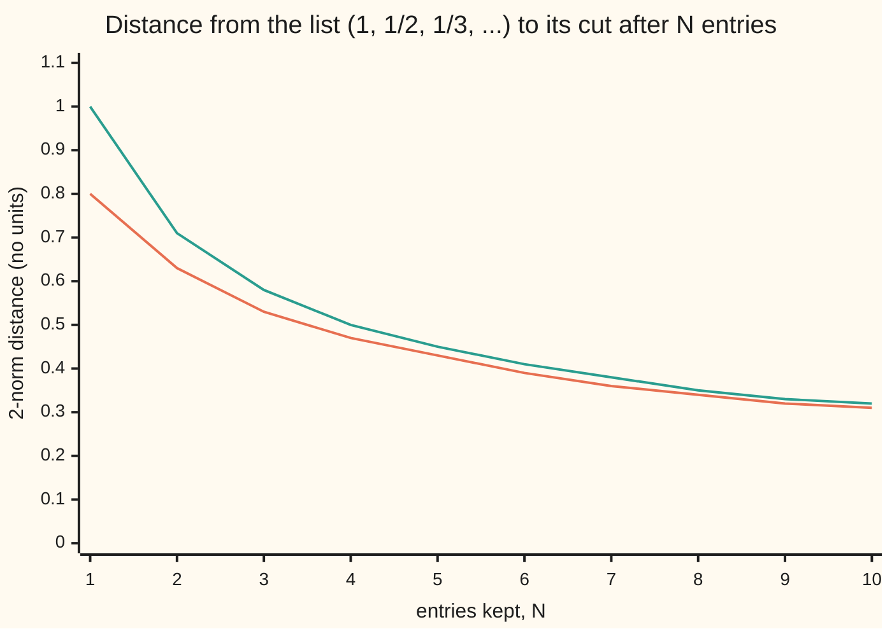
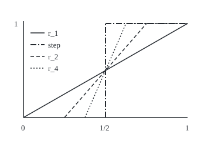

# Riesz-Fischer: Lp is complete, so approximating sequences have limits inside the space, and simple functions get arbitrarily close

[Syllabus](../../../SYLLABUS.md) → [Measure and integration](../README.md) → [Sizes of Functions](../README.md#s07) → Riesz-Fischer

---

## General Overview

Take the endless list 1, 1/2, 1/3, 1/4, and so on. Cut it after N entries and fill the rest with zeros. After one entry the cut list is (1, 0, 0, ...). After ten it is (1, 1/2, ..., 1/10, 0, 0, ...). Measure the distance between two cut lists the way a ruler measures a diagonal: square the entry-by-entry differences, add them, take the square root.

The cut lists crowd together. Every cut list from the tenth on lies within 0.3162 of the tenth. From the thousandth on, within 0.0316. So they must be closing in on something. Inside the lists that stop after finitely many entries, there is nothing to close in on: the target would need every entry non-zero. Inside the lists whose squares add to a finite total, the target is there. It is the whole list, and its length is π/√6 = 1.2825.

The rational numbers have the same kind of hole. The decimal approximations to the square root of 2 crowd together, and the number they close in on is not a fraction. A space without such holes is called **complete**, the word used from here on. The theorem of Frigyes Riesz and Ernst Fischer, proved for squares in 1907 and soon extended to every power, says that every space of p-th-power integrable functions is complete. A second result rides with it: every such function is a limit of simple functions, which take finitely many values.

**In every space of p-th-power integrable functions, with p at least 1 and finite, a sequence whose terms crowd together has a limit inside the space; some subsequence also converges at almost every point; and simple functions come as close as desired to any member.**

**What kind of fact this is:** a theorem, with a corollary and two approximation theorems, proved on this card in Why it works; the full proof sits in a folded Detailed proof. "Banach space" is a definition.

### The picture: how far each cut list is from the whole list



Orange: the distance from the whole list to the list cut after N entries. Green: the bound 1/√N, which the distance stays under. Both fall towards 0; the code prints both rows.

---

## The formula

Notation first, in words. A measure space $(\Omega, \mathcal{F}, \mu)$ is a set of points, the collection of sets we allow ourselves to measure, and a measure giving each such set a size. For a power $p$ of 1 or more, the $p$-norm of a function is ([Lp spaces](01-lp-spaces.md)):

$$\|f\|_p = \Big(\int |f|^p \, d\mu\Big)^{1/p}$$

$L^p(\mu)$ is the set of measurable functions with a finite $p$-norm, where two functions equal almost everywhere (a.e., except on a set of size zero) count as one. The distance between $f$ and $h$ is $\|f - h\|_p$. With $\Omega$ the whole numbers 1, 2, 3, ... and $\mu$ counting measure, which gives each point size 1, the integral is a sum, and $L^2$ is written $\ell^2$: the lists whose squares add to a finite total.

A sequence $f_n$ is **Cauchy** when its terms crowd together: for every tolerance $\varepsilon > 0$ there is a step $N$ past which any two terms are within $\varepsilon$ of each other ([Sequences](../../06-Calculus%20and%20analysis/01-Limits%20and%20Continuity/03-sequences-and-limits.md)).

**Riesz-Fischer.** For $1 \le p < \infty$ and any measure space,

$$\|f_n - f_m\|_p \to 0 \text{ as } n, m \to \infty \quad\Longrightarrow\quad \text{there is } f \in L^p(\mu) \text{ with } \|f_n - f\|_p \to 0$$

**Read it aloud:** if the terms of a sequence in $L^p$ get close to each other, they get close to one function that is itself in $L^p$.

**The subsequence corollary.** If $\|f_n - f\|_p \to 0$, some subsequence $f_{n_k}$ converges to $f$ at almost every point.

**Simple functions are dense.** For every $f$ in $L^p$ and every $\varepsilon > 0$ there is a simple function $\varphi$, zero outside a set of finite size, with $\|f - \varphi\|_p < \varepsilon$. "Dense" means exactly that: members of the smaller set come within any tolerance of every member of the larger.

**Continuous functions are dense** for Lebesgue measure $\lambda$ on the line: the simple functions may be replaced by continuous functions that are zero outside a bounded interval.

A **Banach space** is a set of things that can be added and scaled, with a norm (a length obeying the triangle inequality), in which every Cauchy sequence converges. Riesz-Fischer says: each $L^p$ with $1 \le p < \infty$ is a Banach space.

The example. The whole list is $t = (1, \tfrac12, \tfrac13, \dots)$, the list cut after $N$ entries is $t_N$, and

$$\|t - t_N\|_2^2 = \sum_{n > N} \frac{1}{n^2}, \qquad \frac{1}{N+1} < \|t - t_N\|_2^2 < \frac{1}{N}, \qquad \|t\|_2 = \frac{\pi}{\sqrt 6}$$

**Read it aloud:** the squared distance from the whole list to the cut list is the sum of the squares left out, which sits between one over N plus one and one over N.

| Symbol | Plain meaning | In our example | Push it up and the answer… |
| --- | --- | --- | --- |
| $\Omega$, $\mathcal{F}$, $\mu$, $\lambda$ | the points, the sets we may measure, the measure; Lebesgue measure, meaning length | the whole numbers, all their subsets, counting; length on [0, 1] for the ramps | — |
| $p$ | the power in the norm, 1 or more | 2; also 1 | bigger p punishes tall values more |
| $\lVert f \rVert_p$ | the p-norm: the size of $f$ | $\lVert t \rVert_2 = 1.2825$ | — |
| $f_n$, $f$, $f_{n_k}$, $\tilde f$, $f^+$, $f^-$ | a sequence in $L^p$; its limit; the fast subsequence; its a.e. limit; the positive and negative parts | the cut lists; the whole list | — |
| $t$, $t_N$, $t_m$, $t_{10}$ | the list of 1/n; the same list cut after $N$, $m$ or 10 entries | $t_{10}$ ends at 1/10 | larger N, closer to $t$ |
| $\varepsilon$, $N$ | a tolerance; the step past which it is met | $\varepsilon$ = 0.3162 from $N$ = 10 | smaller $\varepsilon$, later $N$ |
| $n$, $m$, $n_k$, $k$ | steps; the steps picked for the fast subsequence; its counter | $n_k = 4^k$: 4, 16, 64, 256 | — |
| $g_K$, $g$, $C$, $Z$ | the running total of the subsequence's step sizes; its limit; their norm bound; where $g = \infty$ | $g = t$ here; $C$ = 2.1932 | — |
| $\varphi$, $\varphi_k$ | a simple function; the k-th staircase | $\varphi_k(n) = \lfloor 2^k/n \rfloor / 2^k$ | larger k, closer to $t$ |
| $r_n$ ($r_1$, $r_2$, $r_4$, $r_{16}$, $r_{32}$), $h$, $\eta$ | the n-th ramp; a continuous function in general; a small margin | $r_4$ climbs over [3/8, 5/8] | larger n, steeper ramp |
| $\mathbf{1}_A$, $A$, $U$, $I_j$, $a$, $b$, $J$, $V$, $\delta$ | the indicator of A (one on A, zero off it); in the proof of Step 6, a set of finite length, an open set around it, its intervals, the ends of one, how many are kept, those kept joined, the width of each slope | the step is $\mathbf{1}_{[1/2, 1]}$ | smaller $\delta$, a closer trapezoid |
| $w$, $w_d$ | the wind week; the week cut after d days | (3, 5, 8, 2, 6, 4, 7) m/s | — |

### When it holds

- **A power p from 1 up, finite.** Below 1 the p-th-root "norm" breaks the triangle inequality. At p = ∞ (the essential supremum, the largest value once null sets are ignored) the space is still complete by an easier proof, but continuous functions stop being dense: every ramp stays 1/2 from the step.
- **Any measure space.** No finite total size is needed: counting measure on the whole numbers has none.
- **Functions equal a.e. counted as one.** Otherwise a non-zero function can have norm 0, and the limit is unique only up to a null set.
- **The whole of $L^p$, not a part of it.** The lists that stop after finitely many entries, or the continuous functions on [0, 1] measured by the 1-norm, are not complete: the cut lists and the ramps are Cauchy there with no limit inside.
- **The right norm.** The same cut lists are not Cauchy in $\ell^1$: the whole list has no finite 1-norm.

---

## Why it works

### Step 0: make the steps add up

A Cauchy sequence only promises that late terms are close; its values at a fixed point may never settle. So pick a subsequence whose steps shrink fast enough that their sizes add to a finite total, 1/2 + 1/4 + 1/8 + ... = 1. The total of the steps' absolute values is then one function with a finite norm. It is finite almost everywhere, so the subsequence settles at almost every point, and it is the single integrable bound that dominated convergence needs.

### Step 1: pick a fast subsequence

The sequence is Cauchy, so for each k there is a step $n_k$ past which all terms are within $2^{-k}$ of each other. Take the steps increasing. Then $\|f_{n_{k+1}} - f_{n_k}\|_p < 2^{-k}$.

In the example the distance between $t_m$ and $t_N$, for m past N, never exceeds $\|t - t_N\|_2$. So $n_k$ is the first $N$ with $\|t - t_N\|_2 \le 2^{-k}$. The two bounds in the formula pin it down: $N$ = $4^k$ exactly. The code finds 4, 16, 64, 256, 1024 by search, and the gaps 0.4009, 0.2123, 0.1077, 0.0541 sit below 1/2, 1/4, 1/8, 1/16.

### Step 2: the total of the steps has a finite norm

Let $g_K$ be $|f_{n_1}|$ plus the absolute values of the first K steps. Minkowski's inequality, the triangle inequality for $p$-norms ([Minkowski's inequality](03-minkowskis-inequality.md)), bounds its norm by $\|f_{n_1}\|_p + 1/2 + 1/4 + \dots < \|f_{n_1}\|_p + 1$. The $g_K$ rise to a limit $g$. The monotone convergence theorem carries the bound to the limit ([The monotone convergence theorem](../04-The%20Lebesgue%20Integral/03-monotone-convergence-theorem.md)). A function with finite integral of $g^p$ is infinite only on a null set.

In the example every entry of every step is positive and the steps sit on separate entries, so $g$ is $t$ itself. The bound reads 1.2825 ≤ $\|t_4\|_2$ + 1 = 2.1932.

### Step 3: a limit at almost every point

Where $g$ is finite, the steps add up absolutely at that point, so the running sums converge by the completeness of the real numbers ([No gaps](../../06-Calculus%20and%20analysis/01-Limits%20and%20Continuity/02-supremum-and-completeness.md)). The running sums are the $f_{n_k}$ themselves. Define $f$ as their limit there, and 0 on the null set. Every $|f_{n_k}|$ is at most $g$, so $|f| \le g$ and $f$ is in $L^p$.

### Step 4: from a limit at points to a limit in norm

The gap $|f_{n_k} - f|^p$ goes to 0 almost everywhere and never exceeds $(2g)^p$, which has finite integral. The dominated convergence theorem ([Dominated convergence](../05-Swapping%20Limits%20and%20Integrals/02-dominated-convergence-theorem.md)) gives $\|f_{n_k} - f\|_p \to 0$. A Cauchy sequence with one convergent subsequence converges in full: $\|f_n - f\|_p \le \|f_n - f_{n_k}\|_p + \|f_{n_k} - f\|_p$, and both terms are small once $n$ and $n_k$ are late.

The corollary comes free. A sequence converging in $L^p$ is Cauchy, so Steps 1 to 3 give a subsequence converging at almost every point. Its pointwise limit and the norm limit agree a.e., since two norm limits are at distance 0. The whole sequence need not converge anywhere: the typewriter sequence converges in $L^1$ and settles at no point ([Modes of convergence](../05-Swapping%20Limits%20and%20Integrals/04-modes-of-convergence.md)). In $\ell^2$ the subsequence is not needed, because each entry has size 1 under counting measure and so no entry can differ by more than the whole distance.

### Step 5: simple functions come arbitrarily close

For $f \ge 0$ the staircase $\varphi_k$ rounds $f$ down to a multiple of $2^{-k}$ and caps it at k ([Simple functions](../03-Measurable%20Functions/03-simple-functions-and-approximation.md)). It rises to $f$, and the gap $|f - \varphi_k|^p$ never exceeds $f^p$, so dominated convergence sends $\|f - \varphi_k\|_p$ to 0. The staircase is zero where $f$ is below $2^{-k}$. By Markov's inequality ([Markov and Chebyshev](../04-The%20Lebesgue%20Integral/07-markov-and-chebyshev.md)) the rest has finite size. A signed $f$ is its positive part ($f$ where $f > 0$, else 0) minus its negative part (the same for $-f$).

On the list $t$, the staircase is $\varphi_k(n) = \lfloor 2^k/n \rfloor / 2^k$ (the floor $\lfloor x \rfloor$ is $x$ rounded down), zero past entry $2^k$. At k = 8 it uses 32 values and sits 0.0695 from $t$. Each rounding is under $2^{-k}$ on the first $2^k$ entries, and the tail beyond has squared norm under $2^{-k}$, so the distance stays under $\sqrt{2}\, 2^{-k/2}$, here 0.0884.

### Step 6: continuous functions come arbitrarily close, on the line

Under Lebesgue measure, an indicator of a set of finite length is close in $p$-norm to the indicator of an open set around it, which is a union of disjoint open intervals ([Outer measure](../02-Length%20Done%20Properly/01-lebesgue-outer-measure.md)). Finitely many of those intervals carry nearly all the length. Each interval's indicator is close to a trapezoid: 0 outside, 1 inside, sloped over a short stretch at each end. Minkowski's inequality assembles the pieces.

The ramps show the last move. The ramp $r_n$ is 0 left of $1/2 - 1/(2n)$, 1 right of $1/2 + 1/(2n)$, straight between. Its 1-norm distance to the step $\mathbf{1}_{[1/2, 1]}$ is two triangles, $1/(4n)$: 1/4, 1/8, 1/16, 1/32, 1/64 for n = 1, 2, 4, 8, 16. The ramps are Cauchy in the 1-norm, $\|r_n - r_{2n}\|_1 = 1/(8n)$, and their limit is the step, which is not continuous. So the continuous functions on [0, 1] under the 1-norm are not complete, and $L^1$ is what fills their holes.

### The picture: ramps closing on a step

Drawn to scale, 280 units to one unit of x and 160 to one unit of height. Each ramp is the step with its jump replaced by a straight climb over a stretch 1/n wide.

<p align="center"></p>

The step is dash-dot, and its flat top is shared by every ramp once it reaches 1. The steeper the ramp, the smaller the two triangles between it and the step: area 1/4 for $r_1$, 1/8 for $r_2$, 1/16 for $r_4$.

### Step 7: the finite picture

On a finite space the theorem adds nothing. The wind week $w$ = (3, 5, 8, 2, 6, 4, 7) m/s over seven days is one point of seven-dimensional space. Cut it after d days, as $w_d$, and the 2-norm distances under counting measure are 14.2478, 13.9284, 13.0000, 10.2470, 10.0499, 8.0623, 7.0000, 0.0000 for d = 0 to 7. A Cauchy sequence of weeks is Cauchy day by day, and each day's values converge because the real line is complete. Under the uniform probability 1/7 per day every distance shrinks by $\sqrt 7$: $\|w\|_2 = \sqrt{29} = 5.3852$. The theorem is needed once there are infinitely many coordinates, as in $\ell^2$ or on the line.

<details>
<summary>Detailed proof</summary>

Throughout, $(\Omega, \mathcal{F}, \mu)$ is a measure space, $1 \le p < \infty$, and members of $L^p$ are functions up to a.e. equality; each statement about a class holds for any representative.

**Lemma A (a Cauchy sequence with a convergent subsequence converges).** If $(f_n)$ is Cauchy and $\|f_{n_k} - f\|_p \to 0$, then given $\varepsilon$ pick $N$ with $\|f_n - f_m\|_p < \varepsilon/2$ for $n, m \ge N$, and $k$ with $n_k \ge N$ and $\|f_{n_k} - f\|_p < \varepsilon/2$. Minkowski gives $\|f_n - f\|_p < \varepsilon$ for all $n \ge N$.

**Theorem 1 (Riesz-Fischer).** Let $(f_n)$ be Cauchy in $L^p$. Choose $n_1 < n_2 < \dots$ with $\|f_n - f_m\|_p < 2^{-k}$ for all $n, m \ge n_k$; in particular $\|f_{n_{k+1}} - f_{n_k}\|_p < 2^{-k}$. Put $g_K = |f_{n_1}| + \sum_{k=1}^{K} |f_{n_{k+1}} - f_{n_k}|$. By Minkowski, $\|g_K\|_p < \|f_{n_1}\|_p + 1 =: C$. The $g_K$ are non-negative, measurable and increasing, with limit $g$ valued in $[0, \infty]$; $g_K^p$ increases to $g^p$, so by monotone convergence $\int g^p d\mu = \lim \int g_K^p d\mu \le C^p$. Hence the set $Z = \{g = \infty\}$ has $\mu(Z) = 0$: on it $g^p$ is infinite, and a set of positive size would make the integral infinite. For $x \notin Z$ the series $f_{n_1}(x) + \sum_k (f_{n_{k+1}}(x) - f_{n_k}(x))$ converges absolutely, so it converges, since the reals are complete; its K-th partial sum is $f_{n_{K+1}}(x)$. Set $f(x) = \lim_k f_{n_k}(x)$ off $Z$ and $f = 0$ on $Z$; $f$ is measurable as a limit of measurable functions (the card [Sums, products, sups and limits](../03-Measurable%20Functions/02-limits-of-measurable-functions.md)). Each $|f_{n_k}| \le g$, so $|f| \le g$ and $\int |f|^p d\mu \le C^p$: $f \in L^p$. Next, $|f_{n_k} - f|^p \le (|f_{n_k}| + |f|)^p \le 2^p g^p$, an integrable bound, and $|f_{n_k} - f|^p \to 0$ off $Z$; dominated convergence gives $\|f_{n_k} - f\|_p \to 0$. Lemma A finishes.

**Corollary (a.e. subsequence).** If $\|f_n - f\|_p \to 0$ then $(f_n)$ is Cauchy by Minkowski, so Theorem 1's construction gives $n_k$ and $\tilde f$ with $f_{n_k} \to \tilde f$ a.e. and in norm. Then $\|f - \tilde f\|_p \le \|f - f_{n_k}\|_p + \|f_{n_k} - \tilde f\|_p \to 0$, so $\int |f - \tilde f|^p d\mu = 0$ and $f = \tilde f$ a.e.

**Theorem 2 (simple functions are dense).** First $f \ge 0$ in $L^p$. The staircase $\varphi_k = \min(k, \lfloor 2^k f \rfloor / 2^k)$ is simple, $0 \le \varphi_k \le f$, and $\varphi_k \to f$ at every point where $f$ is finite, which is a.e. Then $|f - \varphi_k|^p \le f^p$, integrable, and dominated convergence gives $\|f - \varphi_k\|_p \to 0$. The set $\{\varphi_k > 0\}$ lies in $\{f \ge 2^{-k}\}$, whose size is at most $2^{kp} \int f^p d\mu < \infty$ by Markov. For real $f$ write $f = f^+ - f^-$, approximate each within $\varepsilon/2$, and add by Minkowski.

**Theorem 3 (continuous functions are dense, Lebesgue measure on the line).** By Theorem 2 and Minkowski it suffices to approximate $\mathbf{1}_A$ with $\lambda(A) < \infty$. By the definition of Lebesgue outer measure there are open intervals covering $A$ of total length below $\lambda(A) + \varepsilon$; their union $U$ is open, contains $A$, and $\|\mathbf{1}_U - \mathbf{1}_A\|_p^p = \lambda(U \setminus A) < \varepsilon$. An open set on the line is a countable union of disjoint open intervals $I_j$ with $\sum_j \lambda(I_j) = \lambda(U) < \infty$, so some $J$ has $\sum_{j > J} \lambda(I_j) < \varepsilon$, and $V = I_1 \cup \dots \cup I_J$ has $\|\mathbf{1}_U - \mathbf{1}_V\|_p^p < \varepsilon$. For each $I_j = (a, b)$ and small $\delta$, the trapezoid equal to 1 on $[a + \delta, b - \delta]$, 0 off $(a, b)$ and straight between is continuous, zero outside a bounded interval, and differs from $\mathbf{1}_{I_j}$ by at most 1 on a set of length $2\delta$, so the $p$-th power of the gap integrates to at most $2\delta$. Minkowski combines the three errors, each of p-norm at most $\varepsilon^{1/p}$ or $(2J\delta)^{1/p}$.

**Remarks.** At $p = \infty$, the union $Z$ of the null sets where $|f_n - f_m| > \|f_n - f_m\|_\infty$ is null, off $Z$ the sequence is uniformly Cauchy, and its uniform limit is the $L^\infty$ limit; so $L^\infty$ is complete. Theorem 3 fails there. Take $h$ continuous and $\eta > 0$. If $h(1/2) \le 1/2$, continuity gives $h < 1/2 + \eta$ on an interval just right of 1/2, where the step is 1; if $h(1/2) > 1/2$, it gives $h > 1/2 - \eta$ on an interval just left of 1/2, where the step is 0. Either way $|h - \mathbf{1}_{[1/2, 1]}| > 1/2 - \eta$ on a set of positive length, so the essential supremum of the gap is at least 1/2.

</details>

A second road to completeness of $\ell^2$ goes entry by entry: each entry of a Cauchy sequence of lists is a Cauchy sequence of reals, and Fatou's lemma ([Fatou's lemma](../05-Swapping%20Limits%20and%20Integrals/01-fatous-lemma.md)) shows the entrywise limit is the norm limit. It works because each point has size 1; the general case needs the fast subsequence.

---

## Worked numbers, by hand

| Step | Arithmetic | Value |
| --- | --- | --- |
| length of the whole list | square root of 1 + 1/4 + 1/9 + ... = π^2/6 | $\lVert t \rVert_2$ = **1.2825** |
| list cut after 10 entries | square root of 1 + 1/4 + ... + 1/100 | $\lVert t_{10} \rVert_2$ = 1.2449 |
| distance to the whole list | square root of the squares left out | 0.3085 |
| bounds on that distance | 1/√11 and 1/√10 | 0.3015 < 0.3085 < 0.3162 |
| fast subsequence | first N with distance at most $2^{-k}$ | **4, 16, 64, 256, 1024** |
| total of the steps, bounded | $\lVert t_4 \rVert_2$ + 1/2 + 1/4 + ... | 1.2825 ≤ 2.1932 |
| staircase at k = 8 | round each 1/n down to a multiple of 1/256 | distance 0.0695 |
| ramp $r_{16}$ against the step | two triangles, 1/(4 × 16) | 1/64 in the 1-norm |
| wind week to its first three days | square root of 4 + 36 + 16 + 49 | 10.2470 |

The whole list is a genuine member of $\ell^2$ at distance 0.3085 from its tenth cut, and every cut list converges to it; the ramps converge in the 1-norm to a step that is not continuous.

### What breaks if you drop a piece

| Mistake | Comes out at | What went wrong |
| --- | --- | --- |
| Only lists that stop after finitely many entries | cut lists 0.3085 from $t$ at N = 10, 0.0998 at N = 100, 0.0316 at N = 1000, and $t$ not in the space | the space has a hole where the limit belongs |
| The 1-norm instead of the 2-norm | $\lVert t_{2N} - t_N \rVert_1$ = 0.6688, 0.6907, 0.6929 at N = 10, 100, 1000, heading to ln 2 = 0.6931 | not Cauchy: $\lVert t_N \rVert_1$ grows as 2.9290, 5.1874, 7.4855 |
| Continuous functions under the 1-norm | ramps Cauchy, $\lVert r_n - r_{2n} \rVert_1$ = 1/(8n), limit a step | the limit left the space |
| Density read at p = ∞ | every ramp's largest gap from the step is 1/2 | a continuous function cannot jump |

The code prints all four.

---

## Code, from first principles, and it actually runs

The code checks finite stages; that $L^p$ has no holes rests on the proof. Every headline number is reached by two independent roads. The length π/√6 is reached through π by Machin's formula and a Newton square root, and separately by summing 1/n^2 to 4000 and adding the Euler-Maclaurin estimate of the rest. The fast subsequence is found by search and checked against $4^k$ from the two bounds. The staircase is checked against rounding down by search and its distance against the bound $\sqrt 2\, 2^{-k/2}$ derived above, and the ℓ1 gaps against ln 2 − 1/(4N) with ln 2 from its own series. The ramp distances are computed exactly on a grid of 20160 cells and checked against 1/(4n) and 1/(8n). The grid hits the sup gap 1/2 only at x = 1/2, a null set; it is still the essential supremum, approached from both sides. The Rust does the ramps with integer numerators by hand.

### Python

```python
# Riesz-Fischer -- the check behind the card.  Standard library only.
# The example: t = (1, 1/2, 1/3, ...) in l2, which is L2 of counting measure on
# 1, 2, 3, ..., and its truncations t_N.  Road one reaches ||t||_2 through pi
# (Machin's formula) and a square root (Newton), both written here; road two
# sums 1/n^2 directly and adds the Euler-Maclaurin tail.  The wind week and
# the ramps use exact fractions.  Code checks finite stages; the proof does
# the rest.
from fractions import Fraction as Q

def atan_inv(x, terms=40):              # arctan(1/x) by its power series
    s, p = 0.0, 1.0 / x
    for k in range(terms):
        s += (-1) ** k * p / (2 * k + 1)
        p /= x * x
    return s

def sqrt(a):                            # Newton's method for the square root
    if a == 0:
        return 0.0
    r = max(a, 1.0)
    for _ in range(80):
        r = 0.5 * (r + a / r)
    return r

PI = 4 * (4 * atan_inv(5) - atan_inv(239))
Z1 = PI * PI / 6                        # road one: sum of 1/n^2 is pi^2/6
M = 4000
H2 = [0.0]                              # H2[N] = 1 + 1/4 + ... + 1/N^2
for n in range(1, M + 1):
    H2.append(H2[-1] + 1.0 / (n * n))

def tail2(N):                           # road one: sum over n > N of 1/n^2
    return Z1 - H2[N]

def tail2_direct(N):                    # road two: sum to M, Euler-Maclaurin after
    s = sum(1.0 / (n * n) for n in range(M, N, -1))
    return s + 1 / M - 1 / (2 * M * M) + 1 / (6 * M ** 3) - 1 / (30 * M ** 5)

print(f"pi by Machin's formula {PI:.8f}")
print(f"||t||_2 = pi/sqrt(6): road one {sqrt(Z1):.8f}, road two {sqrt(tail2_direct(0)):.8f}")
print("N, ||t_N||_2, ||t - t_N||_2, lower 1/sqrt(N+1), Cauchy bound 1/sqrt(N)")
for N in (1, 2, 5, 10, 100, 1000):
    print(f"{N}, {sqrt(H2[N]):.4f}, {sqrt(tail2(N)):.4f}, {1 / sqrt(N + 1):.4f}, {1 / sqrt(N):.4f}")
print("chart, ||t - t_N||_2, N=1..10:", ", ".join(f"{sqrt(tail2(N)):.2f}" for N in range(1, 11)))
print("chart, 1/sqrt(N), N=1..10:", ", ".join(f"{1 / sqrt(N):.2f}" for N in range(1, 11)))

# the fast subsequence: n_k = first N with ||t - t_N||_2 <= 2^-k
nk = [next(N for N in range(1, M) if tail2(N) <= 4.0 ** -k) for k in range(1, 6)]
print("fast subsequence n_k, k=1..5, by search:", ", ".join(map(str, nk)),
      "; by the bounds, 4^k:", ", ".join(str(4 ** k) for k in range(1, 6)))
gaps = [sqrt(H2[nk[i + 1]] - H2[nk[i]]) for i in range(4)]
print("gaps ||t_n(k+1) - t_n(k)||_2, k=1..4:", ", ".join(f"{g:.4f}" for g in gaps),
      "; each below 2^-k:", "yes" if all(g < 2.0 ** -(i + 1) for i, g in enumerate(gaps)) else "no")
print(f"Minkowski bound on g: ||g||_2 = {sqrt(Z1):.4f} <= ||t_4||_2 + 1 = {sqrt(H2[4]) + 1:.4f}")

# simple functions: the staircase phi_k(n) = floor(2^k/n)/2^k, zero past n = 2^k
print("staircase k, values used, ||t - phi_k||_2, bound sqrt(2) 2^(-k/2)")
stair, roads = [], []
for k in range(1, 9):
    near = sum((1 / n - (2 ** k // n) / 2 ** k) ** 2 for n in range(1, 2 ** k + 1))
    down = [max(j for j in range(2 ** k + 1) if j * n <= 2 ** k) for n in range(1, 2 ** k + 1)]
    roads.append(abs(near - sum((1 / n - j / 2 ** k) ** 2 for n, j in enumerate(down, 1))) < 1e-12)
    stair.append(sqrt(near + tail2(2 ** k)))
    vals = len({2 ** k // n for n in range(1, 2 ** k + 2)})
    print(f"{k}, {vals}, {stair[-1]:.4f}, {sqrt(2) * 2 ** (-k / 2):.4f}")

# what breaks in l1: the same truncations are not Cauchy there
ln2 = 2 * sum((1 / 3) ** (2 * j + 1) / (2 * j + 1) for j in range(40))
H1 = lambda N: sum(1.0 / n for n in range(N, 0, -1))
for N in (10, 100, 1000):
    print(f"l1: N={N}, ||t_2N - t_N||_1 = {H1(2 * N) - H1(N):.4f}, ||t_N||_1 = {H1(N):.4f}")
print(f"ln 2 by its own series {ln2:.4f}")

# the wind week under counting measure, truncated to the first d days
w = [3, 5, 8, 2, 6, 4, 7]
wt = [sum(x * x for x in w[d:]) for d in range(8)]
wp = [sum(x * x for x in w) - sum(x * x for x in w[:d]) for d in range(8)]
print("wind, ||w - w_d||_2^2, d=0..7:", ", ".join(map(str, wt)))
print("wind, ||w - w_d||_2, d=0..7:", ", ".join(f"{sqrt(x):.4f}" for x in wt))
print(f"wind under the uniform 1/7: ||w||_2 = sqrt({Q(wt[0], 7)}) = {sqrt(wt[0] / 7):.4f}")

# ramps r_n: 0 left of 1/2 - 1/(2n), 1 right of 1/2 + 1/(2n), straight between
D = 20160                               # cells on [0, 1]; kinks land on cell edges
def ramp(n, x):
    return min(Q(1), max(Q(0), n * (x - Q(1, 2)) + Q(1, 2)))
def step(x):
    return Q(1) if x >= Q(1, 2) else Q(0)
def l1_grid(f, g):                      # midpoint rule, exact for pieces that are straight
    return sum(abs(f(Q(2 * t + 1, 2 * D)) - g(Q(2 * t + 1, 2 * D))) for t in range(D)) / D
ramps = []
for n in (1, 2, 4, 8, 16):
    to_step = l1_grid(lambda x: ramp(n, x), step)
    to_next = l1_grid(lambda x: ramp(n, x), lambda x: ramp(2 * n, x))
    sup = max(abs(ramp(n, Q(t, D)) - step(Q(t, D))) for t in range(D + 1))
    ramps.append((n, to_step, to_next, sup))
    print(f"ramp n={n}: ||r_n - step||_1 = {to_step} (formula 1/(4n) = {Q(1, 4 * n)}), "
          f"||r_n - r_2n||_1 = {to_next}, sup gap {sup}")
for n in (1, 2, 4):
    a, b = Q(1, 2) - Q(1, 2 * n), Q(1, 2) + Q(1, 2 * n)
    print(f"figure, r_{n} rises from ({float(40 + 280 * a):g},200) to ({float(40 + 280 * b):g},40)")
print("figure, step: 0 on [0, 1/2) at y=200, 1 on [1/2, 1] at y=40, x=180 at 1/2")

assert abs(sqrt(Z1) - sqrt(tail2_direct(0))) < 1e-10          # two roads to pi/sqrt(6)
assert all(1 / (N + 1) < tail2(N) < 1 / N for N in range(1, 1001))   # telescoping bounds
assert nk == [4 ** k for k in range(1, 6)] and all(g < 2.0 ** -(i + 1) for i, g in enumerate(gaps))
assert all(roads)                        # staircase: floor formula agrees with rounding down by search
assert all(s < sqrt(2) * 2 ** (-k / 2) for k, s in enumerate(stair, 1)) and stair == sorted(stair, reverse=True)
assert all(abs(H1(2 * N) - H1(N) - (ln2 - 1 / (4 * N))) < 1 / N ** 2 for N in (10, 100, 1000))
assert wt == wp and all(a == Q(1, 4 * n) and b == Q(1, 8 * n) and s == Q(1, 2) for n, a, b, s in ramps)
print("ALL CHECKS PASS")
```

**Ran 2026-09-29 on macOS, Python 3.14.6, standard library only. All checks passed. Output, pasted from the run:**

```
pi by Machin's formula 3.14159265
||t||_2 = pi/sqrt(6): road one 1.28254983, road two 1.28254983
N, ||t_N||_2, ||t - t_N||_2, lower 1/sqrt(N+1), Cauchy bound 1/sqrt(N)
1, 1.0000, 0.8031, 0.7071, 1.0000
2, 1.1180, 0.6284, 0.5774, 0.7071
5, 1.2098, 0.4258, 0.4082, 0.4472
10, 1.2449, 0.3085, 0.3015, 0.3162
100, 1.2787, 0.0998, 0.0995, 0.1000
1000, 1.2822, 0.0316, 0.0316, 0.0316
chart, ||t - t_N||_2, N=1..10: 0.80, 0.63, 0.53, 0.47, 0.43, 0.39, 0.36, 0.34, 0.32, 0.31
chart, 1/sqrt(N), N=1..10: 1.00, 0.71, 0.58, 0.50, 0.45, 0.41, 0.38, 0.35, 0.33, 0.32
fast subsequence n_k, k=1..5, by search: 4, 16, 64, 256, 1024 ; by the bounds, 4^k: 4, 16, 64, 256, 1024
gaps ||t_n(k+1) - t_n(k)||_2, k=1..4: 0.4009, 0.2123, 0.1077, 0.0541 ; each below 2^-k: yes
Minkowski bound on g: ||g||_2 = 1.2825 <= ||t_4||_2 + 1 = 2.1932
staircase k, values used, ||t - phi_k||_2, bound sqrt(2) 2^(-k/2)
1, 3, 0.6284, 1.0000
2, 4, 0.4778, 0.7071
3, 5, 0.3635, 0.5000
4, 8, 0.2618, 0.3536
5, 11, 0.1917, 0.2500
6, 16, 0.1375, 0.1768
7, 22, 0.0981, 0.1250
8, 32, 0.0695, 0.0884
l1: N=10, ||t_2N - t_N||_1 = 0.6688, ||t_N||_1 = 2.9290
l1: N=100, ||t_2N - t_N||_1 = 0.6907, ||t_N||_1 = 5.1874
l1: N=1000, ||t_2N - t_N||_1 = 0.6929, ||t_N||_1 = 7.4855
ln 2 by its own series 0.6931
wind, ||w - w_d||_2^2, d=0..7: 203, 194, 169, 105, 101, 65, 49, 0
wind, ||w - w_d||_2, d=0..7: 14.2478, 13.9284, 13.0000, 10.2470, 10.0499, 8.0623, 7.0000, 0.0000
wind under the uniform 1/7: ||w||_2 = sqrt(29) = 5.3852
ramp n=1: ||r_n - step||_1 = 1/4 (formula 1/(4n) = 1/4), ||r_n - r_2n||_1 = 1/8, sup gap 1/2
ramp n=2: ||r_n - step||_1 = 1/8 (formula 1/(4n) = 1/8), ||r_n - r_2n||_1 = 1/16, sup gap 1/2
ramp n=4: ||r_n - step||_1 = 1/16 (formula 1/(4n) = 1/16), ||r_n - r_2n||_1 = 1/32, sup gap 1/2
ramp n=8: ||r_n - step||_1 = 1/32 (formula 1/(4n) = 1/32), ||r_n - r_2n||_1 = 1/64, sup gap 1/2
ramp n=16: ||r_n - step||_1 = 1/64 (formula 1/(4n) = 1/64), ||r_n - r_2n||_1 = 1/128, sup gap 1/2
figure, r_1 rises from (40,200) to (320,40)
figure, r_2 rises from (110,200) to (250,40)
figure, r_4 rises from (145,200) to (215,40)
figure, step: 0 on [0, 1/2) at y=200, 1 on [1/2, 1] at y=40, x=180 at 1/2
ALL CHECKS PASS
```

### Rust

Same numbers, same labels, built with `rustc --edition 2021 -O`.

```rust
// Riesz-Fischer -- the same check as the Python, in Rust.  No crates.
// The example: t = (1, 1/2, 1/3, ...) in l2, which is L2 of counting measure on
// 1, 2, 3, ..., and its truncations t_N.  Road one reaches ||t||_2 through pi
// (Machin's formula) and a square root (Newton), both written here; road two
// sums 1/n^2 directly and adds the Euler-Maclaurin tail.  The wind week and
// the ramps use exact fractions, kept as integer pairs by hand.
const M: usize = 4000;
const D: i64 = 20160; // cells on [0, 1]; kinks land on cell edges

fn atan_inv(x: f64) -> f64 { // arctan(1/x) by its power series
    let (mut s, mut p) = (0.0, 1.0 / x);
    for k in 0..40 {
        let sign = if k % 2 == 0 { 1.0 } else { -1.0 };
        s += sign * p / (2 * k + 1) as f64;
        p /= x * x;
    }
    s
}

fn sqrt(a: f64) -> f64 { // Newton's method for the square root
    if a == 0.0 { return 0.0 }
    let mut r = if a > 1.0 { a } else { 1.0 };
    for _ in 0..80 { r = 0.5 * (r + a / r) }
    r
}

fn gcd(a: i64, b: i64) -> i64 { if b == 0 { a.abs() } else { gcd(b, a % b) } }

fn frac(num: i64, den: i64) -> String { // a reduced fraction, printed as Python's Fraction
    let g = gcd(num, den);
    if den / g == 1 { format!("{}", num / g) } else { format!("{}/{}", num / g, den / g) }
}

fn ramp2d(n: i64, num: i64, den: i64) -> i64 { // r_n(num/den) times 2*den, clamped to [0, 2*den]
    (n * (2 * num - den) + den).clamp(0, 2 * den)
}

fn step2d(num: i64, den: i64) -> i64 { if 2 * num >= den { 2 * den } else { 0 } }

fn main() {
    let pi = 4.0 * (4.0 * atan_inv(5.0) - atan_inv(239.0));
    let z1 = pi * pi / 6.0; // road one: sum of 1/n^2 is pi^2/6
    let mut h2 = vec![0.0f64];
    for n in 1..=M { let last = h2[n - 1]; h2.push(last + 1.0 / (n * n) as f64) }
    let tail2 = |n: usize| z1 - h2[n];
    let mf = M as f64;
    let tail2_direct = |nn: usize| { // road two: sum to M, Euler-Maclaurin after
        let mut s = 0.0;
        for n in ((nn + 1)..=M).rev() { s += 1.0 / (n * n) as f64 }
        s + 1.0 / mf - 1.0 / (2.0 * mf * mf) + 1.0 / (6.0 * mf.powi(3)) - 1.0 / (30.0 * mf.powi(5))
    };
    println!("pi by Machin's formula {:.8}", pi);
    println!("||t||_2 = pi/sqrt(6): road one {:.8}, road two {:.8}", sqrt(z1), sqrt(tail2_direct(0)));
    println!("N, ||t_N||_2, ||t - t_N||_2, lower 1/sqrt(N+1), Cauchy bound 1/sqrt(N)");
    for &n in &[1usize, 2, 5, 10, 100, 1000] {
        println!("{}, {:.4}, {:.4}, {:.4}, {:.4}", n, sqrt(h2[n]), sqrt(tail2(n)),
                 1.0 / sqrt((n + 1) as f64), 1.0 / sqrt(n as f64));
    }
    let c1: Vec<String> = (1..=10).map(|n| format!("{:.2}", sqrt(tail2(n)))).collect();
    let c2: Vec<String> = (1..=10).map(|n| format!("{:.2}", 1.0 / sqrt(n as f64))).collect();
    println!("chart, ||t - t_N||_2, N=1..10: {}", c1.join(", "));
    println!("chart, 1/sqrt(N), N=1..10: {}", c2.join(", "));

    // the fast subsequence: n_k = first N with ||t - t_N||_2 <= 2^-k
    let nk: Vec<usize> = (1..=5).map(|k| (1..M).find(|&n| tail2(n) <= 4f64.powi(-k)).unwrap()).collect();
    let p4: Vec<usize> = (1..=5).map(|k| 4usize.pow(k)).collect();
    let s = |v: &Vec<usize>| v.iter().map(|x| x.to_string()).collect::<Vec<_>>().join(", ");
    println!("fast subsequence n_k, k=1..5, by search: {} ; by the bounds, 4^k: {}", s(&nk), s(&p4));
    let gaps: Vec<f64> = (0..4).map(|i| sqrt(h2[nk[i + 1]] - h2[nk[i]])).collect();
    let below = gaps.iter().enumerate().all(|(i, g)| *g < 2f64.powi(-(i as i32 + 1)));
    let gs: Vec<String> = gaps.iter().map(|g| format!("{:.4}", g)).collect();
    println!("gaps ||t_n(k+1) - t_n(k)||_2, k=1..4: {} ; each below 2^-k: {}", gs.join(", "), if below { "yes" } else { "no" });
    println!("Minkowski bound on g: ||g||_2 = {:.4} <= ||t_4||_2 + 1 = {:.4}", sqrt(z1), sqrt(h2[4]) + 1.0);

    // simple functions: the staircase phi_k(n) = floor(2^k/n)/2^k, zero past n = 2^k
    println!("staircase k, values used, ||t - phi_k||_2, bound sqrt(2) 2^(-k/2)");
    let (mut stair, mut roads) = (Vec::new(), true);
    for k in 1..=8u32 {
        let p = 1usize << k;
        let near: f64 = (1..=p).map(|n| { let d = 1.0 / n as f64 - (p / n) as f64 / p as f64; d * d }).sum();
        let near2: f64 = (1..=p).map(|n| { // rounding down by search, not by integer division
            let j = (0..=p).filter(|j| j * n <= p).max().unwrap();
            let d = 1.0 / n as f64 - j as f64 / p as f64; d * d }).sum();
        roads &= (near - near2).abs() < 1e-12;
        stair.push(sqrt(near + tail2(p)));
        let mut vals: Vec<usize> = (1..=p + 1).map(|n| p / n).collect();
        vals.sort();
        vals.dedup();
        println!("{}, {}, {:.4}, {:.4}", k, vals.len(), stair[stair.len() - 1], sqrt(2.0) * 2f64.powf(-(k as f64) / 2.0));
    }

    // what breaks in l1: the same truncations are not Cauchy there
    let ln2: f64 = 2.0 * (0..40).map(|j| (1.0f64 / 3.0).powi(2 * j + 1) / (2 * j + 1) as f64).sum::<f64>();
    let h1 = |n: usize| (1..=n).rev().map(|i| 1.0 / i as f64).sum::<f64>();
    for &n in &[10usize, 100, 1000] {
        println!("l1: N={}, ||t_2N - t_N||_1 = {:.4}, ||t_N||_1 = {:.4}", n, h1(2 * n) - h1(n), h1(n));
    }
    println!("ln 2 by its own series {:.4}", ln2);

    // the wind week under counting measure, truncated to the first d days
    let w: [i64; 7] = [3, 5, 8, 2, 6, 4, 7];
    let wt: Vec<i64> = (0..8).map(|d| w[d..].iter().map(|x| x * x).sum()).collect();
    let total: i64 = w.iter().map(|x| x * x).sum();
    let wp: Vec<i64> = (0..8).map(|d| total - w[..d].iter().map(|x| x * x).sum::<i64>()).collect();
    println!("wind, ||w - w_d||_2^2, d=0..7: {}", wt.iter().map(|x| x.to_string()).collect::<Vec<_>>().join(", "));
    println!("wind, ||w - w_d||_2, d=0..7: {}", wt.iter().map(|&x| format!("{:.4}", sqrt(x as f64))).collect::<Vec<_>>().join(", "));
    println!("wind under the uniform 1/7: ||w||_2 = sqrt({}) = {:.4}", frac(wt[0], 7), sqrt(wt[0] as f64 / 7.0));

    // ramps r_n: 0 left of 1/2 - 1/(2n), 1 right of 1/2 + 1/(2n), straight between
    let mut ok = true;
    for &n in &[1i64, 2, 4, 8, 16] {
        let (mut a, mut b, mut sup) = (0i64, 0i64, 0i64); // numerators over 2*(2D) per cell
        for t in 0..D { // midpoint rule, exact for pieces that are straight
            let (num, den) = (2 * t + 1, 2 * D);
            a += (ramp2d(n, num, den) - step2d(num, den)).abs();
            b += (ramp2d(n, num, den) - ramp2d(2 * n, num, den)).abs();
        }
        for t in 0..=D { sup = sup.max((ramp2d(n, t, D) - step2d(t, D)).abs()) }
        // integral = sum over cells of (numerator / (4D)) * (1/D)
        println!("ramp n={}: ||r_n - step||_1 = {} (formula 1/(4n) = {}), ||r_n - r_2n||_1 = {}, sup gap {}",
                 n, frac(a, 4 * D * D), frac(1, 4 * n), frac(b, 4 * D * D), frac(sup, 2 * D));
        ok &= a * 4 * n == 4 * D * D && b * 8 * n == 4 * D * D && sup * 2 == 2 * D;
    }
    for &n in &[1i64, 2, 4] {
        println!("figure, r_{} rises from ({},200) to ({},40)", n, 180 - 140 / n, 180 + 140 / n);
    }
    println!("figure, step: 0 on [0, 1/2) at y=200, 1 on [1/2, 1] at y=40, x=180 at 1/2");

    assert!((sqrt(z1) - sqrt(tail2_direct(0))).abs() < 1e-10); // two roads to pi/sqrt(6)
    assert!((1..=1000).all(|n| 1.0 / ((n + 1) as f64) < tail2(n) && tail2(n) < 1.0 / n as f64)); // telescoping bounds
    assert!(nk == p4 && below); // search agrees with the bounds; gaps below 2^-k
    assert!(roads); // staircase: floor formula agrees with rounding down by search
    assert!(stair.iter().enumerate().all(|(i, s)| *s < sqrt(2.0) * 2f64.powf(-((i + 1) as f64) / 2.0))
            && stair.windows(2).all(|p| p[1] < p[0]));
    assert!([10usize, 100, 1000].iter().all(|&n| (h1(2 * n) - h1(n) - (ln2 - 1.0 / (4 * n) as f64)).abs() < 1.0 / (n * n) as f64));
    assert!(wt == wp && ok);
    println!("ALL CHECKS PASS");
}
```

**Ran 2026-09-29 on macOS, rustc 1.98.1, no crates. All checks passed. Output, pasted from the run:**

```
pi by Machin's formula 3.14159265
||t||_2 = pi/sqrt(6): road one 1.28254983, road two 1.28254983
N, ||t_N||_2, ||t - t_N||_2, lower 1/sqrt(N+1), Cauchy bound 1/sqrt(N)
1, 1.0000, 0.8031, 0.7071, 1.0000
2, 1.1180, 0.6284, 0.5774, 0.7071
5, 1.2098, 0.4258, 0.4082, 0.4472
10, 1.2449, 0.3085, 0.3015, 0.3162
100, 1.2787, 0.0998, 0.0995, 0.1000
1000, 1.2822, 0.0316, 0.0316, 0.0316
chart, ||t - t_N||_2, N=1..10: 0.80, 0.63, 0.53, 0.47, 0.43, 0.39, 0.36, 0.34, 0.32, 0.31
chart, 1/sqrt(N), N=1..10: 1.00, 0.71, 0.58, 0.50, 0.45, 0.41, 0.38, 0.35, 0.33, 0.32
fast subsequence n_k, k=1..5, by search: 4, 16, 64, 256, 1024 ; by the bounds, 4^k: 4, 16, 64, 256, 1024
gaps ||t_n(k+1) - t_n(k)||_2, k=1..4: 0.4009, 0.2123, 0.1077, 0.0541 ; each below 2^-k: yes
Minkowski bound on g: ||g||_2 = 1.2825 <= ||t_4||_2 + 1 = 2.1932
staircase k, values used, ||t - phi_k||_2, bound sqrt(2) 2^(-k/2)
1, 3, 0.6284, 1.0000
2, 4, 0.4778, 0.7071
3, 5, 0.3635, 0.5000
4, 8, 0.2618, 0.3536
5, 11, 0.1917, 0.2500
6, 16, 0.1375, 0.1768
7, 22, 0.0981, 0.1250
8, 32, 0.0695, 0.0884
l1: N=10, ||t_2N - t_N||_1 = 0.6688, ||t_N||_1 = 2.9290
l1: N=100, ||t_2N - t_N||_1 = 0.6907, ||t_N||_1 = 5.1874
l1: N=1000, ||t_2N - t_N||_1 = 0.6929, ||t_N||_1 = 7.4855
ln 2 by its own series 0.6931
wind, ||w - w_d||_2^2, d=0..7: 203, 194, 169, 105, 101, 65, 49, 0
wind, ||w - w_d||_2, d=0..7: 14.2478, 13.9284, 13.0000, 10.2470, 10.0499, 8.0623, 7.0000, 0.0000
wind under the uniform 1/7: ||w||_2 = sqrt(29) = 5.3852
ramp n=1: ||r_n - step||_1 = 1/4 (formula 1/(4n) = 1/4), ||r_n - r_2n||_1 = 1/8, sup gap 1/2
ramp n=2: ||r_n - step||_1 = 1/8 (formula 1/(4n) = 1/8), ||r_n - r_2n||_1 = 1/16, sup gap 1/2
ramp n=4: ||r_n - step||_1 = 1/16 (formula 1/(4n) = 1/16), ||r_n - r_2n||_1 = 1/32, sup gap 1/2
ramp n=8: ||r_n - step||_1 = 1/32 (formula 1/(4n) = 1/32), ||r_n - r_2n||_1 = 1/64, sup gap 1/2
ramp n=16: ||r_n - step||_1 = 1/64 (formula 1/(4n) = 1/64), ||r_n - r_2n||_1 = 1/128, sup gap 1/2
figure, r_1 rises from (40,200) to (320,40)
figure, r_2 rises from (110,200) to (250,40)
figure, r_4 rises from (145,200) to (215,40)
figure, step: 0 on [0, 1/2) at y=200, 1 on [1/2, 1] at y=40, x=180 at 1/2
ALL CHECKS PASS
```

The two outputs match line for line.

> [!TIP]
> **Try changing**
> Guess first, then run it.
> - **Ask for slower steps.** In the fast-subsequence search change `4.0 ** -k` to `2.0 ** -k`. The search now finds 2, 4, 8, 16, 32, which are $2^k$, and the third assert stops the run because it still expects $4^k$.
> - **Knock the kinks off the grid.** Set `D` to 20000. The ramp $r_{32}$ now bends inside a cell, the midpoint rule stops being exact, and $\|r_{16} - r_{32}\|_1$ prints as 195313/25000000 instead of 1/128; the last assert stops it.
> - **Climb the staircase further.** Change `range(1, 9)` in the staircase loop to `range(1, 12)`. At k = 11 the staircase uses 90 values and sits 0.0248 from $t$, under the bound 0.0312: every two steps of k roughly halve the distance.

---

## The usual mistake

> [!warning]
> **Reading "Cauchy" as "convergent".** Crowding together only says the terms approach each other. Whether something is there to approach depends on the space. The cut lists crowd together in $\ell^2$ and in the lists that stop after finitely many entries alike; only in $\ell^2$ is the limit a member. Completeness is the property that closes the gap, and it has to be proved for each space.
>
> - **Expecting the whole sequence to converge at every point.** Norm convergence gives a.e. convergence only along a subsequence, as the typewriter sequence of Step 4 shows.
> - **Forgetting the norm.** The cut lists are Cauchy in the 2-norm, not in the 1-norm; What breaks has the numbers.
> - **Carrying density to p = ∞.** Continuous ramps close on the step in the 1-norm, yet stay 1/2 away in the largest-gap norm.
> - **Treating a limit as a function with values everywhere.** The $L^p$ limit is fixed only up to a null set; changing it on a set of size zero gives the same member.

---

## Where you meet it in real life

- **Fourier series.** A list of coefficients whose squares add to a finite total is the coefficient list of some square-integrable function, because the partial sums are Cauchy and $L^2$ is complete. That is the form Riesz and Fischer proved in 1907 (Convergence in energy).
- **Signal processing.** Energy-preserving transforms of sound and images are defined first on nice signals and extended to all finite-energy signals by density and completeness (Plancherel).
- **Least squares and forecasting.** The best approximation of a quantity from a closed subspace of predictors exists because $L^2$ is complete; that projection is the subject of [L2 as a Hilbert space](06-l2-as-a-hilbert-space.md).

> **Say it back**
> A sequence in $L^p$ whose terms crowd together always has a limit that is itself in $L^p$, for p from 1 up. The proof picks a subsequence whose steps add to a finite total, adds up the steps' absolute values into one integrable function, and uses monotone and dominated convergence. The same subsequence converges at almost every point. Simple functions, and on the line continuous ones, come as close as desired to any member. The cut lists of (1, 1/2, 1/3, ...) converge in $\ell^2$ to a whole list of length 1.2825, while ramps converge in the 1-norm to a step that is not continuous.

---

## What this builds on

- [Minkowski's inequality](03-minkowskis-inequality.md): the triangle inequality that bounds the total of the steps.
- [Modes of convergence](../05-Swapping%20Limits%20and%20Integrals/04-modes-of-convergence.md): convergence in $L^p$ against a.e., and the typewriter that separates them.
- [Sequences](../../06-Calculus%20and%20analysis/01-Limits%20and%20Continuity/03-sequences-and-limits.md): Cauchy sequences of numbers and why they converge on the real line.

## Where this goes next

- [L2 as a Hilbert space](06-l2-as-a-hilbert-space.md): completeness plus an inner product, giving orthogonal projection.
- [The Lebesgue differentiation theorem](../11-Derivatives%20Meet%20the%20Lebesgue%20Integral/02-lebesgue-differentiation-theorem.md): density of continuous functions, used to prove that averages over shrinking intervals recover a function.
- Function spaces C and Lp: $L^p$ and the continuous functions side by side as Banach spaces.
- Convergence in energy: the 1907 form, square-summable coefficients matched to square-integrable functions.
- Plancherel: a transform extended from nice functions to all of $L^2$ by density and completeness.

Completeness guarantees limits exist, but says nothing about the nearest point of a subspace; in $L^2$, where lengths come with angles, that nearest point exists and is found by dropping a perpendicular, which is [L2 as a Hilbert space](06-l2-as-a-hilbert-space.md).

---

## Sources

Verified 2026-09-29: every link below opens a page naming the cited work.

- Folland, Gerald B. *Real Analysis: Modern Techniques and Their Applications*, 2nd ed. Wiley, 1999. [Publisher page](https://www.wiley.com/en-us/Real+Analysis%3A+Modern+Techniques+and+Their+Applications%2C+2nd+Edition-p-9780471317166). Chapter 6 proves completeness of $L^p$ and the density of simple functions.
- Axler, Sheldon. *Measure, Integration & Real Analysis*. Springer, 2020. [Author's page with the free edition](https://measure.axler.net/). Chapter 7 proves that $L^p(\mu)$ is a Banach space.
- Stein, Elias M., and Rami Shakarchi. *Real Analysis: Measure Theory, Integration, and Hilbert Spaces*. Princeton University Press, 2005. [Publisher page](https://press.princeton.edu/books/hardcover/9780691113869/real-analysis). The Riesz-Fischer theorem for $L^1$ and $L^2$, and approximation by continuous functions.
- "Riesz–Fischer theorem." Wikipedia. [Article](https://en.wikipedia.org/wiki/Riesz%E2%80%93Fischer_theorem). Dates the independent 1907 proofs by Riesz and Fischer.
