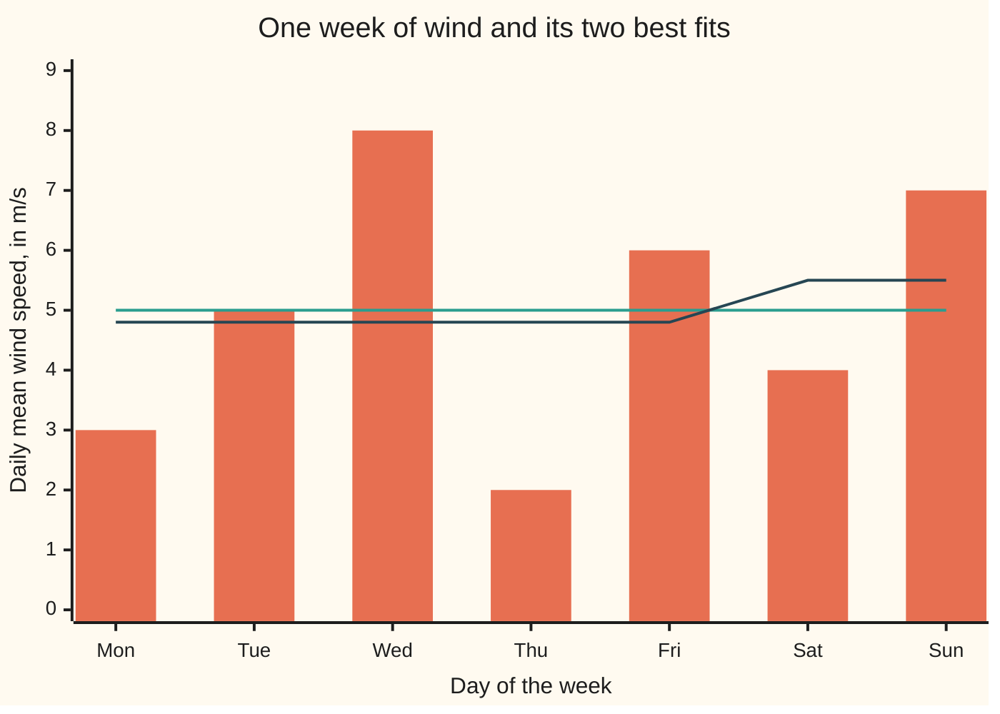
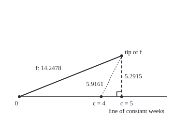

# L2 as a Hilbert space: functions have lengths and angles, the closest point in a closed subspace is a perpendicular drop, and every continuous linear rule is an inner product

[Syllabus](../../../SYLLABUS.md) → [Measure and integration](../README.md) → [Sizes of Functions](../README.md#s07) → L2 as a Hilbert space

---

## General Overview

A turbine logs one daily mean wind speed for a week, Monday to Sunday: 3, 5, 8, 2, 6, 4 and 7 m/s. A planner wants the week summed up by one steady speed, the constant that sits closest to the seven readings. Closest in which sense? Measure the miss by squaring each day's error and adding. The best constant is then 5 m/s, the mean, and the smallest possible total of squared misses is 28. Its square root, 5.2915, is the length of what the constant cannot explain.

Now let the planner use two numbers: one speed for weekdays, one for the weekend. The best pair is 4.80 and 5.50, the two separate means, and the total of squared misses falls to 273/10.

Both answers are drops. Treat the week as an arrow with one direction per day. The constant weeks form a line through the origin, the two-level weeks a plane, and the best fit is the foot of the perpendicular from the arrow's tip, as in [Projection](../../03-Algebra/06-Dot%20Products%20and%20Best%20Fits/02-orthogonal-projection.md). The same geometry works for functions on any measure space when size is the square-root-of-squares size. That space of functions is **L2**, and its geometry makes it a **Hilbert space**: a space with lengths and angles in which every sequence that settles down has a limit inside it.

Two theorems follow. The **projection theorem**: for every closed family of functions that is closed under adding and scaling, there is exactly one closest member, and the miss is perpendicular to the whole family. The **Riesz representation theorem**: every linear rule that turns a function into a number, and does not jump when the function moves slightly, is an inner product with one fixed function.

**On L2 the size of a function comes from an inner product, so best fits are perpendicular drops that always exist and are unique on a closed subspace, and every continuous linear rule is "take the inner product with one fixed function".**

**What kind of fact this is:** the inner product is a definition; the projection theorem and the Riesz representation theorem are theorems, both proved on this card in Why it works.

### The picture: the week, the constant fit and the two-level fit



Caption: the bars are the seven readings. The first line is the best constant, 5 m/s. The second line is the best two-level fit, 4.80 m/s on weekdays and 5.50 m/s at the weekend.

---

## The formula

Notation first, in words. A measure space $(\Omega,\mathcal F,\mu)$ is a set of points $\Omega$, the collection $\mathcal F$ of sets we allow ourselves to measure, and a measure $\mu$ giving each such set a size ([Lp spaces](01-lp-spaces.md) has the reminder). Here $\Omega$ is the seven days and $\mu$ is **counting measure**, weight 1 per day; a second run uses the uniform probability $P$, weight 1/7 per day. **L2** is the space of measurable functions whose square has a finite integral, with two functions counted as one when they agree almost everywhere, that is, except on a set of measure zero.

The **inner product** of two functions in L2 multiplies them point by point and integrates:

$$\langle f, g\rangle = \int_\Omega f\,g \; d\mu, \qquad \|f\|_2 = \sqrt{\langle f, f\rangle}.$$

**Read it aloud:** the inner product of f and g is the integral of their product; the length of f is the square root of its inner product with itself.

On the seven days under counting measure the integral is a plain sum: the dot product of two lists. Hölder's inequality at p = 2 ([Holder's inequality](02-holders-inequality.md)), here called the **Cauchy–Schwarz inequality**, keeps it finite: $|\langle f,g\rangle| \le \|f\|_2\,\|g\|_2$. Two functions are **orthogonal**, or perpendicular, when their inner product is 0.

A **subspace** $M$ is a family of functions closed under adding and scaling. It is **closed** when the limit, in L2 length, of any sequence of members is again a member. The **projection theorem**:

$$\hat f \in M,\qquad \|f - \hat f\|_2 = \min_{h \in M} \|f - h\|_2, \qquad \langle f - \hat f,\, h\rangle = 0 \ \text{ for every } h \in M.$$

**Read it aloud:** for a closed subspace M, some member f-hat of M sits closest to f, it is the only one, and the miss f minus f-hat is perpendicular to every member of M.

Consequently the length splits like the sides of a right triangle, $\|f\|_2^2 = \|\hat f\|_2^2 + \|f-\hat f\|_2^2$.

A **linear rule** $\varphi$ turns each function into a number and respects adding and scaling. It is **continuous**, or **bounded**, when some constant C has $|\varphi(f)| \le C\,\|f\|_2$ for every f; the smallest such C is the rule's size $\|\varphi\|$. The **Riesz representation theorem**:

$$\varphi(f) = \langle f, g\rangle \ \text{ for every } f \text{ in L2}, \qquad \|\varphi\| = \|g\|_2 .$$

**Read it aloud:** every continuous linear rule on L2 is the inner product with one function g, found once and for all, and the rule's size is the length of g.

| Symbol | Plain meaning | In our example | Push it up and the answer… |
| --- | --- | --- | --- |
| $\Omega$, $\mathcal F$ | the points, and the sets we allow ourselves to measure | the seven days; every set of days | more days, more directions |
| $\mu$, $P$, $\lambda$ | measures: counting, uniform probability, Lebesgue length | 1 per day; 1/7 per day; length on [0, 1] in What breaks | heavier weights stretch every length |
| $f$, $h$, $u$, $v$ | functions in L2 | f is the wind week in m/s; h is any other week; u, v: any two | — |
| $\langle f, g\rangle$ | the inner product: the integral of the product | ⟨f, f⟩ = 203 | — |
| $\|f\|_2$ | the length: square root of ⟨f, f⟩ | 14.2478 | — |
| $M$ | a closed subspace: the family of allowed fits | constant weeks; weeks with one weekday level and one weekend level | a bigger family, a shorter miss |
| $\hat f$ | the projection: the member of M closest to f | 5 every day; or 24/5 on weekdays and 11/2 at the weekend | — |
| $d$, $m_n$, $m_k$, $m_0$, $r$, $t$, $n$ | in the proof: the shortest distance from f to M, members of M closing in on it, a member whose miss is perpendicular, the miss $f - \hat f$, and a slide size; n also sets the ramp width 1/n | d = 5.2915 for the constants | — |
| $\varphi$, $C$, $\|\varphi\|$ | a continuous linear rule; any constant with the rule at most C times the length; its size, the least such C | weekend mean minus weekday mean: 7/10 on f; size 0.8367 | — |
| $g$ | the Riesz representer: the function whose inner product is the rule | −1/5 on each weekday, 1/2 on Saturday and Sunday | — |
| $N$, $z$, $\hat u$, $g'$ | in the proof: the rule's kernel, where it gives 0, a direction perpendicular to it, u dropped onto N, and a rival representer | z is a multiple of g | — |
| $\mathbf 1$, $w$, $c$ | the constant function 1, the weekend indicator (one on Saturday and Sunday, zero off them), and a constant | c = 5 is the best constant | — |

### When it holds

- **The exponent is 2.** Only the p = 2 size comes from an inner product. For finite p above 1 a closest point in a closed subspace still exists and is unique, but away from p = 2 it is not a perpendicular drop. At p = 1 even uniqueness fails: 4, 5, 5.5, 6 and 7 all sit at distance 3 from the weekend readings 4 and 7. At p = 2 the closest is 5.5 alone, at 2.1213.
- **The subspace is closed.** On [0, 1] with Lebesgue measure, the continuous functions form a subspace that is not closed. Continuous ramps get within 0.0183 of a calm-to-wind step, and closer still, but no continuous function reaches it: the best fit does not exist.
- **The space is complete.** The proof builds the best fit as a limit, and L2 contains all its limits by [Riesz-Fischer](05-completeness-of-lp.md). A space of functions with holes, such as the continuous ones under this length, loses the theorem.
- **The rule is continuous.** On continuous functions on [0, 1], "the value at t = 1/2" is linear but not continuous in L2 length: ever narrower tents of height 1 at t = 1/2 have lengths shrinking to 0 while the value stays 1, so no g reproduces it. On L2 it is not even defined: two functions equal almost everywhere may differ at one point, and L2 counts them as one.

---

## Why it works

### Step 0: the length comes from an inner product, and that gives a right angle

The L2 length is built from an inner product, so the expansion of arrow geometry holds for any two functions u and v: $\|u+v\|_2^2 = \|u\|_2^2 + 2\langle u,v\rangle + \|v\|_2^2$. Everything below is that expansion used three times, plus completeness to make a limit exist.

### Step 1: the parallelogram law

Add the expansions for u + v and u − v. The cross terms cancel:

$$\|u+v\|_2^2 + \|u-v\|_2^2 = 2\|u\|_2^2 + 2\|v\|_2^2 .$$

With u and v the indicators of Monday and Tuesday, the left side is 4.0000 against 4 at p = 2, but 8.0000 at p = 1 and 3.1748 at p = 3. A size obeys the law exactly when it comes from an inner product, and among the Lp sizes only p = 2 does: that is why this card is about L2.

### Step 2: fits that close in on the best distance close in on each other

Let d be the shortest distance from f to M, the value the misses approach from above. Pick members $m_n$ of M whose squared misses are within 1/n of $d^2$. The midpoint of any two of them is in M, so its miss is at least d, and the parallelogram law then forces the members themselves together: the squared distance between $m_n$ and $m_k$ is at most 2/n + 2/k. The sequence settles down.

### Step 3: completeness supplies the limit, closedness keeps it in M

By Riesz–Fischer ([Riesz-Fischer](05-completeness-of-lp.md)) the sequence has a limit $\hat f$ in L2. Because M is closed, the limit is in M, and its miss is exactly d.

### Step 4: the miss is perpendicular to M

Slide the best fit by t times any member h of M. The result is still in M, so its squared miss, a quadratic in t, is smallest at t = 0. Its slope there is −2 times the inner product of the miss with h, so that inner product is 0.

On the wind week the miss after the constant fit is −2, 0, 3, −3, 1, −1, 2, which sums to 0: perpendicular to the constant 1. After the two-level fit, the miss is perpendicular both to 1 and to the weekend indicator.

### Step 5: perpendicular means unique, and Pythagoras

If a member of M has a miss perpendicular to M, the expansion gives any other member h a squared miss equal to that one plus the squared distance between them, so h is strictly farther. On the week, the constant 4 has squared miss 35 = 28 + 7 × 1^2, distance 5.9161 against 5.2915.

Applied to h = 0, the same expansion is Pythagoras: 203 = 175 + 28 for the constants, and 203 = 1757/10 + 273/10 for the two levels.

### The picture: the constant fit is a perpendicular drop

The week is an arrow of length 14.2478. The constant weeks are the line through the origin in the direction of 1. Drawn to scale, 16 units per m/s of length, in the flat plane that holds the arrow and that line.

<p align="center"></p>

Caption: the solid arrow is the week f, length 14.2478. The dashed vertical is the drop to the constant 5, length 5.2915, at a right angle to the line. The dotted segment is the miss to the constant 4, length 5.9161, the hypotenuse of a second right triangle. The constant c sits c times the square root of 7 from the origin.

### Step 6: every continuous linear rule is an inner product

Take the rule "weekend mean minus weekday mean". On the week it gives 11/2 − 24/5 = 7/10. It is linear. It is continuous, because each mean is at most a fixed multiple of the length.

Two roads find its representer g. The quick road applies the rule to each day's indicator: Monday alone gives −1/5, Saturday alone 1/2, and under counting measure those seven values are g. It works because each day has positive measure. Under Lebesgue measure on [0, 1] a single point has measure zero, its indicator is 0 in L2, and this road has nothing to apply the rule to.

The proof's road does generalise. The **kernel** N of the rule, the functions it sends to 0, is a closed subspace: closed because the rule is continuous. A rule that is not identically 0 leaves some function u outside N. Drop u onto N by the projection theorem; the miss z is perpendicular to N and not zero. Every function f splits as a member of N plus a multiple of z, the multiple being φ(f)/φ(z). Taking the inner product with z kills the N part and leaves

$$\varphi(f) = \Big\langle f,\ \tfrac{\varphi(z)}{\|z\|_2^2}\, z\Big\rangle .$$

That bracketed multiple of z is g. The code does this in exact fractions, with u the Monday indicator and the kernel's basis made perpendicular by Gram–Schmidt ([Gram-Schmidt](../../03-Algebra/06-Dot%20Products%20and%20Best%20Fits/03-gram-schmidt-and-orthonormal-bases.md)), and lands on the same g: −1/5 on weekdays, 1/2 at the weekend.

The size of the rule is the length of g. Cauchy–Schwarz bounds |φ(h)| by the length of g times the length of h, and h = g attains it. The length of g is the square root of 7/10, 0.8367. Among 2000 random weeks the largest ratio of |φ(h)| to the length of h is 0.7762, under the bound; at h = g it is 0.8367.

The representer depends on the measure. Under the uniform probability, each day's product is weighted by 1/7, so the representer must be seven times larger: −7/5 on weekdays and 7/2 at the weekend. It reproduces 7/10. The representer is the rule's density against the measure, which is how [The Radon-Nikodym theorem](../08-Densities%20and%20Changing%20Measure/03-radon-nikodym-theorem.md) will use it.

<details>
<summary>Detailed proof</summary>

**Setting.** $(\Omega,\mathcal F,\mu)$ is a measure space and L2 is the space of real measurable functions with $\int f^2\,d\mu < \infty$, functions equal almost everywhere counted as one.

**L2 is an inner product space.** For f, g in L2, $|fg| \le \tfrac12(f^2 + g^2)$ at each point, so the inner product is finite. It is symmetric, linear in each slot, and $\langle f,f\rangle = 0$ exactly when $f = 0$ almost everywhere, since a function of zero or more with integral zero vanishes almost everywhere. Cauchy–Schwarz is Hölder at p = q = 2 ([Holder's inequality](02-holders-inequality.md)). The length $\|f\|_2$ is the p = 2 norm, which obeys the triangle inequality by [Minkowski's inequality](03-minkowskis-inequality.md). By [Riesz-Fischer](05-completeness-of-lp.md), every Cauchy sequence in L2 converges in L2. An inner product space complete in its length is a **Hilbert space**, so L2 is one.

**Expansion and parallelogram law.** By linearity and symmetry, $\|u \pm v\|_2^2 = \|u\|_2^2 \pm 2\langle u,v\rangle + \|v\|_2^2$. Adding the two signs gives the parallelogram law.

**Projection theorem.** Let M be a closed subspace, f in L2, and $d = \inf_{h\in M}\|f-h\|_2$, finite since 0 is in M.
1. *A minimising sequence.* For each n choose $m_n$ in M with $\|f-m_n\|_2^2 < d^2 + 1/n$, possible by the definition of an infimum.
2. *It is Cauchy.* Apply the parallelogram law to $u = f - m_n$, $v = f - m_k$: $\|m_k - m_n\|_2^2 = 2\|f-m_n\|_2^2 + 2\|f-m_k\|_2^2 - 4\|f - \tfrac12(m_n+m_k)\|_2^2$. The midpoint $\tfrac12(m_n+m_k)$ is in M, a subspace, so the last norm is at least d. Hence $\|m_k-m_n\|_2^2 < 2(d^2+1/n) + 2(d^2+1/k) - 4d^2 = 2/n + 2/k$.
3. *The limit exists and is in M.* L2 is complete, so $m_n \to \hat f$ in L2. M is closed, so $\hat f \in M$.
4. *It attains d.* By Minkowski, $\big|\|f-m_n\|_2 - \|f-\hat f\|_2\big| \le \|m_n - \hat f\|_2 \to 0$, so $\|f - \hat f\|_2 = d$.
5. *The miss is perpendicular.* Put $r = f - \hat f$ and take h in M with $h \ne 0$. For every real t, $\hat f + th \in M$, so $d^2 \le \|r - th\|_2^2 = d^2 - 2t\langle r,h\rangle + t^2\|h\|_2^2$. Choose $t = \langle r,h\rangle/\|h\|_2^2$: then $0 \le -\langle r,h\rangle^2/\|h\|_2^2$, which forces $\langle r,h\rangle = 0$.
6. *Perpendicular implies closest, and unique.* If $m_0 \in M$ and $f - m_0$ is perpendicular to M, then for every h in M, $m_0 - h \in M$ and the expansion gives $\|f-h\|_2^2 = \|f-m_0\|_2^2 + \|m_0-h\|_2^2$. So $m_0$ is closest, and any other closest h has $\|m_0-h\|_2 = 0$, that is, $h = m_0$ almost everywhere. With h = 0 this is Pythagoras, $\|f\|_2^2 = \|\hat f\|_2^2 + \|f-\hat f\|_2^2$. ∎

**Riesz representation theorem.** Let φ be linear on L2 with $|\varphi(f)| \le C\|f\|_2$.
1. *The kernel is a closed subspace.* $N = \{f : \varphi(f) = 0\}$ is closed under adding and scaling by linearity. If $f_n \in N$ and $f_n \to f$, then $|\varphi(f)| = |\varphi(f - f_n)| \le C\|f-f_n\|_2 \to 0$, so $f \in N$.
2. *A perpendicular direction.* If $N$ is all of L2, take g = 0. Otherwise pick u with $\varphi(u) \ne 0$, let $\hat u$ be its projection onto N, and put $z = u - \hat u$. Then z is perpendicular to N by the projection theorem, and $\varphi(z) = \varphi(u) - \varphi(\hat u) = \varphi(u) \ne 0$, so $z \ne 0$.
3. *Every function splits.* For f in L2, $f - \tfrac{\varphi(f)}{\varphi(z)}z$ is sent to $\varphi(f) - \varphi(f) = 0$, so it is in N and perpendicular to z. Hence $\langle f, z\rangle = \tfrac{\varphi(f)}{\varphi(z)}\|z\|_2^2$, that is, $\varphi(f) = \langle f, g\rangle$ with $g = \tfrac{\varphi(z)}{\|z\|_2^2}z$.
4. *Size.* Cauchy–Schwarz gives $|\varphi(f)| \le \|g\|_2\|f\|_2$, so $\|\varphi\| \le \|g\|_2$; and $\varphi(g) = \|g\|_2^2$, so $\|\varphi\| \ge \|g\|_2$ when $g \ne 0$.
5. *Uniqueness.* If $\langle f, g\rangle = \langle f, g'\rangle$ for every f, take $f = g - g'$: then $\|g-g'\|_2^2 = 0$ and $g = g'$ almost everywhere. ∎

</details>

The finite-dimensional version, where every subspace is closed and completeness is automatic, is [Least squares](../../03-Algebra/06-Dot%20Products%20and%20Best%20Fits/04-least-squares.md); the general Hilbert-space treatment is Inner products.

---

## Worked numbers, by hand

The house example, counting measure.

| Step | Arithmetic | Value |
| --- | --- | --- |
| squared length of the week | 9 + 25 + 64 + 4 + 36 + 16 + 49 | 203 |
| best constant | ⟨f, 1⟩ / ⟨1, 1⟩ = 35/7 | **5** |
| miss | f − 5 day by day | −2, 0, 3, −3, 1, −1, 2 |
| perpendicular check | −2 + 0 + 3 − 3 + 1 − 1 + 2 | 0 |
| squared miss | 4 + 0 + 9 + 9 + 1 + 1 + 4 | 28 |
| length of the miss | square root of 28 | **5.2915** |
| Pythagoras | 7 × 5^2 + 28 | 175 + 28 = 203 |
| weekday level | (3 + 5 + 8 + 2 + 6) / 5 | 24/5 = 4.80 |
| weekend level | (4 + 7) / 2 | 11/2 = 5.50 |
| squared miss, two levels | 203 − (5 × (24/5)^2 + 2 × (11/2)^2) | 273/10 |
| length of the miss | square root of 273/10 | **5.2249** |
| gain from the second level | 5 × (1/5)^2 + 2 × (1/2)^2 | 7/10 = 28 − 273/10 |

The steady 5 m/s leaves a miss of length 5.2915; letting the weekend have its own level removes only 7/10 of the 28, so this week's wind barely depends on the day type. Under the uniform probability, each squared miss is divided by 7: the constant fit's miss has length 2.0000, which is the week's standard deviation, and the two-level fit's is 1.9748.

The step from the constant fit to the two-level fit is a multiple of Step 6's representer g: g is perpendicular to 1, and together they span the two-level weeks. The multiple is $\varphi(f)/\|g\|_2^2$ = (7/10)/(7/10) = 1 for this week, so here the two-level fit is exactly 5 + g. Another week gives another multiple.

### What breaks if you drop a piece

| Mistake | Comes out at | What went wrong |
| --- | --- | --- |
| A subspace that is not closed: continuous ramps against a calm-to-wind step | distances 0.4082, 0.1826, 0.0577, 0.0183, never 0 | the closest point is missing from the subspace |
| Measuring the miss at p = 1 | constants 4, 5, 5.5, 6, 7 all at distance 3 from the weekend readings | the miss stays at 3 for every constant from 4 to 7: no unique closest point |
| Using the counting-measure representer under the uniform probability | 1/10 instead of 7/10 | the representer is a density and must change with the measure |
| Adding the projections onto 1 and onto the weekend indicator separately | 5 on weekdays, 21/2 at the weekend, miss 8.8034 | 1 and the weekend indicator are not perpendicular, so the single projections overlap |

The code prints all four. The ramps live on [0, 1] with Lebesgue measure: each rises from 0 to 1 over width 1/n from t = 1/2, where the step jumps, and sits at distance the square root of 1/(3n).

---

## Code, from first principles, and it actually runs

Python uses exact fractions; Rust carries its own rational type on 64-bit integers. The projection is reached three ways: the normal equations (the miss perpendicular to each basis function), averages over each cell of days, and a search over every level 0.0, 0.1, …, 10.0. The representer is reached two ways: the rule on each day's indicator, and the proof's kernel construction. A SplitMix64 generator, seed 20260929, draws 2000 random weeks to test the rule's size, and the ramps are integrated by midpoint sums. Code checks one seven-day instance and a few ramps; the theorems in general are shown only by the proof.

### Python

```python
# L2 as a Hilbert space -- the check behind the card.  Standard library only.
# Turbine A's week of daily mean wind speeds (m/s), Monday to Sunday, is a
# function on 7 days.  Projection three ways: normal equations, cell averages,
# grid search.  The Riesz representer two ways: the rule applied to each day,
# and the proof's direction perpendicular to the rule's kernel.  Fractions keep
# every rational answer exact; floats appear only for square roots.
from fractions import Fraction as Fr

F = [3, 5, 8, 2, 6, 4, 7]
ONE, WKND, DAYS, P = [1] * 7, [0, 0, 0, 0, 0, 1, 1], range(7), Fr(1, 7)  # P: uniform weight per day
CELLS = [[0, 1, 2, 3, 4], [5, 6]]                  # weekdays, weekend

def ip(u, v, w=1):                                 # <u, v> = sum of u times v times each day's weight
    return sum(Fr(a) * b for a, b in zip(u, v)) * w

def sqrt(x):                                       # square root by Newton's method, written out
    x, r = float(x), max(float(x), 1.0)
    for _ in range(60):
        r = (r + x / r) / 2
    return r

show = lambda v: "[" + ", ".join(str(a) for a in v) + "]"

def project(f, basis):                             # road 1: normal equations, Cramer's rule
    G = [[ip(b, c) for c in basis] for b in basis]
    r = [ip(f, b) for b in basis]
    if len(basis) == 1:
        a = [r[0] / G[0][0]]
    else:
        det = G[0][0] * G[1][1] - G[0][1] * G[1][0]
        a = [(r[0] * G[1][1] - G[0][1] * r[1]) / det, (G[0][0] * r[1] - G[1][0] * r[0]) / det]
    return [sum(ak * b[i] for ak, b in zip(a, basis)) for i in DAYS]

def cell_average(f, cells):                        # road 2: average f over each cell
    out = [0] * 7
    for cell in cells:
        for i in cell:
            out[i] = Fr(sum(f[j] for j in cell), len(cell))
    return out

def grid(cells):                                   # road 3: every height 0.0, 0.1, ..., 10.0 per cell
    best = None
    tries = [(k,) for k in range(101)] if len(cells) == 1 else [(k, j) for k in range(101) for j in range(101)]
    for ks in tries:
        s = sum((10 * F[i] - k) ** 2 for k, cell in zip(ks, cells) for i in cell)
        if best is None or s < best[0]:
            best = (s, ks)
    return Fr(best[0], 100), [Fr(k, 10) for k in best[1]]

def dist2(u, v, w=1):
    d = [a - b for a, b in zip(u, v)]
    return ip(d, d, w)

def rule(h):                                       # weekend mean minus weekday mean
    return (h[5] + h[6]) / 2 - (h[0] + h[1] + h[2] + h[3] + h[4]) / 5

unit = lambda i: [Fr(int(j == i)) for j in DAYS]  # the indicator of day i

def riesz_by_kernel(w):                            # road 2: the proof's construction
    phi = [rule(unit(i)) for i in DAYS]
    kernel = [[unit(i)[j] - phi[i] / phi[0] * unit(0)[j] for j in DAYS] for i in range(1, 7)]
    q = []                                         # Gram-Schmidt: an orthogonal basis of the kernel
    for v in kernel:
        for b in q:
            c = ip(v, b, w) / ip(b, b, w)
            v = [x - c * y for x, y in zip(v, b)]
        q.append(v)
    z = unit(0)
    for b in q:                                    # z = e_Mon minus its projection onto the kernel
        c = ip(unit(0), b, w) / ip(b, b, w)
        z = [x - c * y for x, y in zip(z, b)]
    return [rule(z) / ip(z, z, w) * x for x in z]

print(f"wind f = {F} m/s, Mon to Sun; counting measure: <f, f> = {ip(F, F)}, ||f|| = {sqrt(ip(F, F)):.4f}")
c1 = project(F, [ONE])
g1, h1 = grid([list(DAYS)])
r1 = [a - b for a, b in zip(F, c1)]
print(f"constants, normal equations: c = <f, 1>/<1, 1> = {ip(F, ONE)}/{ip(ONE, ONE)} = {c1[0]}")
print(f"constants, grid search: best c = {h1[0]}, least squared distance {g1}")
print(f"residual f - 5 = {show(r1)}; <residual, 1> = {ip(r1, ONE)}")
print(f"residual norm sqrt({dist2(F, c1)}) = {sqrt(dist2(F, c1)):.4f}; Pythagoras {ip(c1, c1)} + {dist2(F, c1)} = {ip(c1, c1) + dist2(F, c1)}")
print(f"constant 4 instead: squared distance {dist2(F, [4] * 7)} = 28 + 7 x 1^2, distance {sqrt(dist2(F, [4] * 7)):.4f}")
s1 = project(F, [ONE, WKND])
s2 = cell_average(F, CELLS)
g2, h2 = grid(CELLS)
r2 = [a - b for a, b in zip(F, s1)]
print(f"steps, normal equations on 1 and the weekend indicator: {show(s1)}")
print(f"steps, cell averages: weekday {s2[0]} = {float(s2[0]):.2f}, weekend {s2[6]} = {float(s2[6]):.2f}")
print(f"steps, grid search: best heights {h2[0]} and {h2[1]}, least squared distance {g2}")
print(f"residual = {show(r2)}; <residual, 1> = {ip(r2, ONE)}, <residual, weekend> = {ip(r2, WKND)}")
print(f"residual norm sqrt({dist2(F, s1)}) = {sqrt(dist2(F, s1)):.4f}; Pythagoras {ip(s1, s1)} + {dist2(F, s1)} = {ip(s1, s1) + dist2(F, s1)}")
print(f"nested: ||steps - constants||^2 = {dist2(s1, c1)} = 28 - 273/10")
print(f"uniform probability 1/7: residual norms {sqrt(dist2(F, c1, P)):.4f} (constants), {sqrt(dist2(F, s1, P)):.4f} (steps)")
print(f"chart, bars {F}, constants line {float(c1[0]):.2f}, steps line {float(s2[0]):.2f} weekdays, {float(s2[6]):.2f} weekend")
print(f"figure, 16 px per m/s: O (40, 200), foot at c = 5 ({40 + 16 * 5 * sqrt(7):.2f}, 200), "
      f"tip ({40 + 16 * 5 * sqrt(7):.2f}, {200 - 16 * sqrt(28):.2f}), c = 4 at ({40 + 16 * 4 * sqrt(7):.2f}, 200)")
g_day = [rule(unit(i)) for i in DAYS]              # road 1: the rule applied to each day's indicator
g_ker = riesz_by_kernel(1)
print(f"rule(f) = weekend mean - weekday mean = {rule([Fr(a) for a in F])}")
print(f"Riesz, rule on each day: g = {show(g_day)}")
print(f"Riesz, perpendicular to the kernel: g = {show(g_ker)}")
print(f"<f, g> = {ip(F, g_ker)}; ||g||^2 = {ip(g_ker, g_ker)}, ||g|| = {sqrt(ip(g_ker, g_ker)):.4f}")
gP = riesz_by_kernel(P)
print(f"uniform probability: g = {show(gP)}; <f, g>_P = {ip(F, gP, P)}")
M64, seed, top = (1 << 64) - 1, 20260929, 0.0
for _ in range(2000):                              # SplitMix64 search for the rule's size
    h = []
    for _ in DAYS:
        seed = (seed + 0x9E3779B97F4A7C15) & M64
        z = ((seed ^ (seed >> 30)) * 0xBF58476D1CE4E5B9) & M64
        z = ((z ^ (z >> 27)) * 0x94D049BB133111EB) & M64
        h.append(((z ^ (z >> 31)) >> 11) * 2.0 ** -53 * 2 - 1)
    top = max(top, abs(rule(h)) / sqrt(sum(x * x for x in h)))
at_g = float(rule(g_ker)) / sqrt(ip(g_ker, g_ker))
print(f"2000 random weeks, seed 20260929: largest |rule(h)|/||h|| = {top:.4f}; at h = g: {at_g:.4f}")
print("breaks 1, not closed: continuous ramps against the calm-to-wind step on [0, 1], Lebesgue measure")
rs = {n: sum((1.0 - min(max(((j + 0.5) / K - 0.5) * n, 0.0), 1.0)) ** 2 for j in range(K // 2, K)) / K
      for n, K in ((2, 100000), (10, 100000), (100, 100000), (1000, 100000))}   # squared distance per ramp
for n, s in rs.items():
    print(f"  ramp width 1/{n}: distance by midpoint sums {sqrt(s):.4f}, by formula sqrt(1/(3n)) {sqrt(1 / (3 * n)):.4f}")
l1 = [abs(4 - c) + abs(7 - c) for c in (4, 5, 5.5, 6, 7)]
l2 = [sqrt((4 - c) ** 2 + (7 - c) ** 2) for c in (4, 5, 5.5, 6, 7)]
print(f"breaks 2, L1: weekend readings 4 and 7, constants 4, 5, 5.5, 6, 7 at distance {', '.join(f'{x:g}' for x in l1)}")
print(f"  L2 distances {', '.join(f'{x:.4f}' for x in l2)}: one closest constant, 5.5")
par = {p: sum(float(sum(abs(a + sg * b) ** p for a, b in zip(unit(0), unit(1)))) ** (2 / p) for sg in (1, -1)) for p in (1, 2, 3)}
for p, lhs in par.items():                         # squared p-sizes of Mon + Tue and Mon - Tue, added
    print(f"  parallelogram, Mon and Tue indicators, p = {p}: {lhs:.4f} against 4")
print(f"breaks 3, counting-measure g used under 1/7: <f, g>_P = {ip(F, g_ker, P)}, not 7/10")
wrong = [a + b for a, b in zip(c1, project(F, [WKND]))]
print(f"breaks 4, separate projections added: {show(wrong)}, distance {sqrt(dist2(F, wrong)):.4f}")
assert s1 == s2 and h2 == [s2[0], s2[6]] and g2 == dist2(F, s1)   # three roads, one projection
assert h1 == [c1[0]] and g1 == 28 and ip(r2, ONE) == 0 == ip(r2, WKND)
assert ip(s1, s1) + dist2(F, s1) == sum(x * x for x in F)          # Pythagoras against the raw sum
assert g_day == g_ker and ip(F, g_ker) == rule([Fr(a) for a in F])  # two roads to the representer
assert gP == [7 * x for x in g_day] and ip(F, gP, P) == Fr(7, 10)
assert top <= at_g + 1e-12 and abs(at_g - sqrt(Fr(7, 10))) < 1e-12
assert set(l1) == {3} and min(l2) == l2[2] < l2[1] and ip(F, g_ker, P) == Fr(1, 10) and dist2(F, wrong) > 28  # breaks
assert all(abs(sqrt(s) - sqrt(1 / (3 * n))) < 1e-6 for n, s in rs.items())        # breaks 1: two roads to each ramp
assert all(abs(x - 2 * 2 ** (2 / p)) < 1e-12 for p, x in par.items()) and wrong == [5] * 5 + [Fr(21, 2)] * 2  # breaks 2 and 4
print("ALL CHECKS PASS")
```

**Ran 2026-10-07 on macOS, Python 3.14.6, standard library only. All checks passed. Output, pasted from the run:**

```
wind f = [3, 5, 8, 2, 6, 4, 7] m/s, Mon to Sun; counting measure: <f, f> = 203, ||f|| = 14.2478
constants, normal equations: c = <f, 1>/<1, 1> = 35/7 = 5
constants, grid search: best c = 5, least squared distance 28
residual f - 5 = [-2, 0, 3, -3, 1, -1, 2]; <residual, 1> = 0
residual norm sqrt(28) = 5.2915; Pythagoras 175 + 28 = 203
constant 4 instead: squared distance 35 = 28 + 7 x 1^2, distance 5.9161
steps, normal equations on 1 and the weekend indicator: [24/5, 24/5, 24/5, 24/5, 24/5, 11/2, 11/2]
steps, cell averages: weekday 24/5 = 4.80, weekend 11/2 = 5.50
steps, grid search: best heights 24/5 and 11/2, least squared distance 273/10
residual = [-9/5, 1/5, 16/5, -14/5, 6/5, -3/2, 3/2]; <residual, 1> = 0, <residual, weekend> = 0
residual norm sqrt(273/10) = 5.2249; Pythagoras 1757/10 + 273/10 = 203
nested: ||steps - constants||^2 = 7/10 = 28 - 273/10
uniform probability 1/7: residual norms 2.0000 (constants), 1.9748 (steps)
chart, bars [3, 5, 8, 2, 6, 4, 7], constants line 5.00, steps line 4.80 weekdays, 5.50 weekend
figure, 16 px per m/s: O (40, 200), foot at c = 5 (251.66, 200), tip (251.66, 115.34), c = 4 at (209.33, 200)
rule(f) = weekend mean - weekday mean = 7/10
Riesz, rule on each day: g = [-1/5, -1/5, -1/5, -1/5, -1/5, 1/2, 1/2]
Riesz, perpendicular to the kernel: g = [-1/5, -1/5, -1/5, -1/5, -1/5, 1/2, 1/2]
<f, g> = 7/10; ||g||^2 = 7/10, ||g|| = 0.8367
uniform probability: g = [-7/5, -7/5, -7/5, -7/5, -7/5, 7/2, 7/2]; <f, g>_P = 7/10
2000 random weeks, seed 20260929: largest |rule(h)|/||h|| = 0.7762; at h = g: 0.8367
breaks 1, not closed: continuous ramps against the calm-to-wind step on [0, 1], Lebesgue measure
  ramp width 1/2: distance by midpoint sums 0.4082, by formula sqrt(1/(3n)) 0.4082
  ramp width 1/10: distance by midpoint sums 0.1826, by formula sqrt(1/(3n)) 0.1826
  ramp width 1/100: distance by midpoint sums 0.0577, by formula sqrt(1/(3n)) 0.0577
  ramp width 1/1000: distance by midpoint sums 0.0183, by formula sqrt(1/(3n)) 0.0183
breaks 2, L1: weekend readings 4 and 7, constants 4, 5, 5.5, 6, 7 at distance 3, 3, 3, 3, 3
  L2 distances 3.0000, 2.2361, 2.1213, 2.2361, 3.0000: one closest constant, 5.5
  parallelogram, Mon and Tue indicators, p = 1: 8.0000 against 4
  parallelogram, Mon and Tue indicators, p = 2: 4.0000 against 4
  parallelogram, Mon and Tue indicators, p = 3: 3.1748 against 4
breaks 3, counting-measure g used under 1/7: <f, g>_P = 1/10, not 7/10
breaks 4, separate projections added: [5, 5, 5, 5, 5, 21/2, 21/2], distance 8.8034
ALL CHECKS PASS
```

### Rust

Same numbers, same labels, built with `rustc --edition 2021 -O`.

```rust
// L2 as a Hilbert space -- the same check as the Python, in Rust.  No crates.
// Turbine A's week of daily mean wind speeds (m/s), Monday to Sunday, is a
// function on 7 days.  Projection three ways: normal equations, cell averages,
// grid search.  The Riesz representer two ways: the rule applied to each day,
// and the proof's direction perpendicular to the rule's kernel.  A hand-written
// rational type keeps every rational answer exact; floats only for square roots.
use std::fmt;

#[derive(Clone, Copy, PartialEq, Debug)]
struct Q(i64, i64); // numerator, denominator > 0, in lowest terms

fn gcd(a: i64, b: i64) -> i64 { if b == 0 { a.abs() } else { gcd(b, a % b) } }
fn q(n: i64, d: i64) -> Q { let (g, s) = (gcd(n, d).max(1), if d < 0 { -1 } else { 1 }); Q(s * n / g, s * d / g) }
fn add(a: Q, b: Q) -> Q { q(a.0 * b.1 + b.0 * a.1, a.1 * b.1) }
fn sub(a: Q, b: Q) -> Q { q(a.0 * b.1 - b.0 * a.1, a.1 * b.1) }
fn mul(a: Q, b: Q) -> Q { q(a.0 * b.0, a.1 * b.1) }
fn div(a: Q, b: Q) -> Q { q(a.0 * b.1, a.1 * b.0) }
fn fl(a: Q) -> f64 { a.0 as f64 / a.1 as f64 }
impl fmt::Display for Q {
    fn fmt(&self, f: &mut fmt::Formatter) -> fmt::Result {
        if self.1 == 1 { write!(f, "{}", self.0) } else { write!(f, "{}/{}", self.0, self.1) }
    }
}
fn show(v: &[Q]) -> String { format!("[{}]", v.iter().map(|a| a.to_string()).collect::<Vec<_>>().join(", ")) }
fn qs(v: &[i64]) -> Vec<Q> { v.iter().map(|&a| q(a, 1)).collect() }

fn ip(u: &[Q], v: &[Q], w: Q) -> Q {             // <u, v> = sum of u times v times each day's weight
    mul(u.iter().zip(v).fold(q(0, 1), |s, (&a, &b)| add(s, mul(a, b))), w)
}
fn sqrt(x: f64) -> f64 {                          // square root by Newton's method, written out
    let mut r = x.max(1.0);
    for _ in 0..60 { r = (r + x / r) / 2.0 } r
}
fn dist2(u: &[Q], v: &[Q], w: Q) -> Q { let d: Vec<Q> = u.iter().zip(v).map(|(&a, &b)| sub(a, b)).collect(); ip(&d, &d, w) }
fn project(f: &[Q], basis: &[Vec<Q>]) -> Vec<Q> { // road 1: normal equations, Cramer's rule
    let one = q(1, 1);
    let g: Vec<Vec<Q>> = basis.iter().map(|b| basis.iter().map(|c| ip(b, c, one)).collect()).collect();
    let r: Vec<Q> = basis.iter().map(|b| ip(f, b, one)).collect();
    let a = if basis.len() == 1 { vec![div(r[0], g[0][0])] } else {
        let det = sub(mul(g[0][0], g[1][1]), mul(g[0][1], g[1][0]));
        vec![div(sub(mul(r[0], g[1][1]), mul(g[0][1], r[1])), det), div(sub(mul(g[0][0], r[1]), mul(g[1][0], r[0])), det)]
    };
    (0..7).map(|i| a.iter().zip(basis).fold(q(0, 1), |s, (&ak, b)| add(s, mul(ak, b[i])))).collect()
}
fn cell_average(f: &[i64], cells: &[Vec<usize>]) -> Vec<Q> { // road 2: average f over each cell
    let mut out = vec![q(0, 1); 7];
    for cell in cells {
        for &i in cell { out[i] = q(cell.iter().map(|&j| f[j]).sum(), cell.len() as i64) }
    }
    out
}
fn grid(f: &[i64], cells: &[Vec<usize>]) -> (Q, Vec<Q>) { // road 3: every height 0.0, 0.1, ..., 10.0
    let tries: Vec<Vec<i64>> = if cells.len() == 1 { (0..101).map(|k| vec![k]).collect() }
        else { (0..101).flat_map(|k| (0..101).map(move |j| vec![k, j])).collect() };
    let mut best: Option<(i64, Vec<i64>)> = None;
    for ks in tries {
        let s: i64 = ks.iter().zip(cells).map(|(&k, c)| c.iter().map(|&i| (10 * f[i] - k).pow(2)).sum::<i64>()).sum();
        if best.as_ref().map_or(true, |b| s < b.0) { best = Some((s, ks)) }
    }
    let b = best.unwrap(); (q(b.0, 100), b.1.iter().map(|&k| q(k, 10)).collect())
}
fn rule(h: &[Q]) -> Q {                           // weekend mean minus weekday mean
    let wd = h[..5].iter().fold(q(0, 1), |s, &a| add(s, a));
    sub(div(add(h[5], h[6]), q(2, 1)), div(wd, q(5, 1)))
}
fn rule_f(h: &[f64]) -> f64 { (h[5] + h[6]) / 2.0 - (h[0] + h[1] + h[2] + h[3] + h[4]) / 5.0 }
fn unit(i: usize) -> Vec<Q> { (0..7).map(|j| q((j == i) as i64, 1)).collect() }
fn riesz_by_kernel(w: Q) -> Vec<Q> {              // road 2: the proof's construction
    let phi: Vec<Q> = (0..7).map(|i| rule(&unit(i))).collect();
    let mut basis: Vec<Vec<Q>> = Vec::new();      // Gram-Schmidt: an orthogonal basis of the kernel
    for i in 1..7 {
        let mut v: Vec<Q> = (0..7).map(|j| sub(unit(i)[j], mul(div(phi[i], phi[0]), unit(0)[j]))).collect();
        for b in &basis {
            let c = div(ip(&v, b, w), ip(b, b, w));
            v = v.iter().zip(b).map(|(&x, &y)| sub(x, mul(c, y))).collect();
        }
        basis.push(v);
    }
    let mut z = unit(0);                           // z = e_Mon minus its projection onto the kernel
    for b in &basis {
        let c = div(ip(&unit(0), b, w), ip(b, b, w));
        z = z.iter().zip(b).map(|(&x, &y)| sub(x, mul(c, y))).collect();
    }
    let k = div(rule(&z), ip(&z, &z, w));
    z.iter().map(|&x| mul(k, x)).collect()
}

fn main() {
    let fi = [3i64, 5, 8, 2, 6, 4, 7];
    let (f, one, wknd, c1w) = (qs(&fi), qs(&[1; 7]), qs(&[0, 0, 0, 0, 0, 1, 1]), q(1, 1));
    let p = q(1, 7);
    let cells = vec![vec![0usize, 1, 2, 3, 4], vec![5, 6]];
    println!("wind f = {:?} m/s, Mon to Sun; counting measure: <f, f> = {}, ||f|| = {:.4}", fi, ip(&f, &f, c1w), sqrt(fl(ip(&f, &f, c1w))));
    let c1 = project(&f, &[one.clone()]);
    let (g1, h1) = grid(&fi, &[(0..7).collect()]);
    let r1: Vec<Q> = f.iter().zip(&c1).map(|(&a, &b)| sub(a, b)).collect();
    println!("constants, normal equations: c = <f, 1>/<1, 1> = {}/{} = {}", ip(&f, &one, c1w), ip(&one, &one, c1w), c1[0]);
    println!("constants, grid search: best c = {}, least squared distance {}", h1[0], g1);
    println!("residual f - 5 = {}; <residual, 1> = {}", show(&r1), ip(&r1, &one, c1w));
    let d1 = dist2(&f, &c1, c1w);
    println!("residual norm sqrt({}) = {:.4}; Pythagoras {} + {} = {}", d1, sqrt(fl(d1)), ip(&c1, &c1, c1w), d1, add(ip(&c1, &c1, c1w), d1));
    let d4 = dist2(&f, &qs(&[4; 7]), c1w);
    println!("constant 4 instead: squared distance {} = 28 + 7 x 1^2, distance {:.4}", d4, sqrt(fl(d4)));
    let s1 = project(&f, &[one.clone(), wknd.clone()]);
    let s2 = cell_average(&fi, &cells);
    let (g2, h2) = grid(&fi, &cells);
    let r2: Vec<Q> = f.iter().zip(&s1).map(|(&a, &b)| sub(a, b)).collect();
    println!("steps, normal equations on 1 and the weekend indicator: {}", show(&s1));
    println!("steps, cell averages: weekday {} = {:.2}, weekend {} = {:.2}", s2[0], fl(s2[0]), s2[6], fl(s2[6]));
    println!("steps, grid search: best heights {} and {}, least squared distance {}", h2[0], h2[1], g2);
    println!("residual = {}; <residual, 1> = {}, <residual, weekend> = {}", show(&r2), ip(&r2, &one, c1w), ip(&r2, &wknd, c1w));
    let d2 = dist2(&f, &s1, c1w);
    println!("residual norm sqrt({}) = {:.4}; Pythagoras {} + {} = {}", d2, sqrt(fl(d2)), ip(&s1, &s1, c1w), d2, add(ip(&s1, &s1, c1w), d2));
    println!("nested: ||steps - constants||^2 = {} = 28 - 273/10", dist2(&s1, &c1, c1w));
    println!("uniform probability 1/7: residual norms {:.4} (constants), {:.4} (steps)", sqrt(fl(dist2(&f, &c1, p))), sqrt(fl(dist2(&f, &s1, p))));
    println!("chart, bars {:?}, constants line {:.2}, steps line {:.2} weekdays, {:.2} weekend", fi, fl(c1[0]), fl(s2[0]), fl(s2[6]));
    let s7 = sqrt(7.0);
    println!("figure, 16 px per m/s: O (40, 200), foot at c = 5 ({:.2}, 200), tip ({:.2}, {:.2}), c = 4 at ({:.2}, 200)",
             40.0 + 16.0 * 5.0 * s7, 40.0 + 16.0 * 5.0 * s7, 200.0 - 16.0 * sqrt(28.0), 40.0 + 16.0 * 4.0 * s7);
    let g_day: Vec<Q> = (0..7).map(|i| rule(&unit(i))).collect(); // road 1: the rule on each day's indicator
    let g_ker = riesz_by_kernel(c1w);
    println!("rule(f) = weekend mean - weekday mean = {}", rule(&f));
    println!("Riesz, rule on each day: g = {}", show(&g_day));
    println!("Riesz, perpendicular to the kernel: g = {}", show(&g_ker));
    let gg = ip(&g_ker, &g_ker, c1w);
    println!("<f, g> = {}; ||g||^2 = {}, ||g|| = {:.4}", ip(&f, &g_ker, c1w), gg, sqrt(fl(gg)));
    let gp = riesz_by_kernel(p);
    println!("uniform probability: g = {}; <f, g>_P = {}", show(&gp), ip(&f, &gp, p));
    let (mut seed, mut top) = (20260929u64, 0.0f64);
    for _ in 0..2000 {                             // SplitMix64 search for the rule's size
        let mut h = Vec::new();
        for _ in 0..7 {
            seed = seed.wrapping_add(0x9E3779B97F4A7C15);
            let mut z = (seed ^ (seed >> 30)).wrapping_mul(0xBF58476D1CE4E5B9);
            z = (z ^ (z >> 27)).wrapping_mul(0x94D049BB133111EB);
            h.push(((z ^ (z >> 31)) >> 11) as f64 * 2f64.powi(-53) * 2.0 - 1.0);
        }
        top = top.max(rule_f(&h).abs() / sqrt(h.iter().fold(0.0, |s, x| s + x * x)));
    }
    let at_g = fl(rule(&g_ker)) / sqrt(fl(gg));
    println!("2000 random weeks, seed 20260929: largest |rule(h)|/||h|| = {:.4}; at h = g: {:.4}", top, at_g);
    println!("breaks 1, not closed: continuous ramps against the calm-to-wind step on [0, 1], Lebesgue measure");
    let mut ramps = Vec::new();                    // (n, squared distance) per ramp
    for (n, k) in [(2.0f64, 100000usize), (10.0, 100000), (100.0, 100000), (1000.0, 100000)] {
        let s: f64 = (k / 2..k).map(|j| (1.0 - ((((j as f64) + 0.5) / k as f64 - 0.5) * n).max(0.0).min(1.0)).powi(2)).sum::<f64>() / k as f64;
        println!("  ramp width 1/{}: distance by midpoint sums {:.4}, by formula sqrt(1/(3n)) {:.4}", n, sqrt(s), sqrt(1.0 / (3.0 * n)));
        ramps.push((n, s));
    }
    let cs = [4.0f64, 5.0, 5.5, 6.0, 7.0];
    let l1: Vec<String> = cs.iter().map(|c| format!("{}", (4.0 - c).abs() + (7.0 - c).abs())).collect();
    let l2: Vec<f64> = cs.iter().map(|c| sqrt((4.0 - c).powi(2) + (7.0 - c).powi(2))).collect();
    println!("breaks 2, L1: weekend readings 4 and 7, constants 4, 5, 5.5, 6, 7 at distance {}", l1.join(", "));
    println!("  L2 distances {}: one closest constant, 5.5", l2.iter().map(|x| format!("{:.4}", x)).collect::<Vec<_>>().join(", "));
    let par: Vec<(f64, f64)> = [1.0f64, 2.0, 3.0].iter().map(|&pp| (pp, [1.0f64, -1.0].iter().map(|sg| (0..7).map(|j| (fl(unit(0)[j]) + sg * fl(unit(1)[j])).abs().powf(pp)).sum::<f64>().powf(2.0 / pp)).sum::<f64>())).collect();
    for &(pp, lhs) in &par { println!("  parallelogram, Mon and Tue indicators, p = {}: {:.4} against 4", pp, lhs) } // squared p-sizes of Mon + Tue and Mon - Tue, added
    println!("breaks 3, counting-measure g used under 1/7: <f, g>_P = {}, not 7/10", ip(&f, &g_ker, p));
    let pw = project(&f, &[wknd.clone()]);
    let wrong: Vec<Q> = c1.iter().zip(&pw).map(|(&a, &b)| add(a, b)).collect();
    println!("breaks 4, separate projections added: {}, distance {:.4}", show(&wrong), sqrt(fl(dist2(&f, &wrong, c1w))));
    assert!(s1 == s2 && h2 == vec![s2[0], s2[6]] && g2 == dist2(&f, &s1, c1w)); // three roads, one projection
    assert!(h1 == vec![c1[0]] && g1 == q(28, 1) && ip(&r2, &one, c1w) == q(0, 1) && ip(&r2, &wknd, c1w) == q(0, 1));
    assert!(add(ip(&s1, &s1, c1w), d2) == q(fi.iter().map(|x| x * x).sum(), 1)); // Pythagoras against the raw sum
    assert!(g_day == g_ker && ip(&f, &g_ker, c1w) == rule(&f)); // two roads to the representer
    assert!(gp == g_day.iter().map(|&x| mul(q(7, 1), x)).collect::<Vec<Q>>() && ip(&f, &gp, p) == q(7, 10));
    assert!(top <= at_g + 1e-12 && (at_g - sqrt(0.7)).abs() < 1e-12);
    assert!(cs.iter().all(|c| (4.0 - c).abs() + (7.0 - c).abs() == 3.0) && ip(&f, &g_ker, p) == q(1, 10) && fl(dist2(&f, &wrong, c1w)) > 28.0 && l2.iter().all(|&x| x >= l2[2]) && l2[2] < l2[1]); // breaks
    assert!(ramps.iter().all(|&(n, s)| (sqrt(s) - sqrt(1.0 / (3.0 * n))).abs() < 1e-6)); // breaks 1: two roads to each ramp
    assert!(par.iter().all(|&(pp, x)| (x - 2.0 * 2f64.powf(2.0 / pp)).abs() < 1e-12) && wrong == [vec![q(5, 1); 5], vec![q(21, 2); 2]].concat()); // breaks 2 and 4
    println!("ALL CHECKS PASS");
}
```

**Ran 2026-10-07 on macOS, rustc 1.98.1, no crates. All checks passed. Output, pasted from the run:**

```
wind f = [3, 5, 8, 2, 6, 4, 7] m/s, Mon to Sun; counting measure: <f, f> = 203, ||f|| = 14.2478
constants, normal equations: c = <f, 1>/<1, 1> = 35/7 = 5
constants, grid search: best c = 5, least squared distance 28
residual f - 5 = [-2, 0, 3, -3, 1, -1, 2]; <residual, 1> = 0
residual norm sqrt(28) = 5.2915; Pythagoras 175 + 28 = 203
constant 4 instead: squared distance 35 = 28 + 7 x 1^2, distance 5.9161
steps, normal equations on 1 and the weekend indicator: [24/5, 24/5, 24/5, 24/5, 24/5, 11/2, 11/2]
steps, cell averages: weekday 24/5 = 4.80, weekend 11/2 = 5.50
steps, grid search: best heights 24/5 and 11/2, least squared distance 273/10
residual = [-9/5, 1/5, 16/5, -14/5, 6/5, -3/2, 3/2]; <residual, 1> = 0, <residual, weekend> = 0
residual norm sqrt(273/10) = 5.2249; Pythagoras 1757/10 + 273/10 = 203
nested: ||steps - constants||^2 = 7/10 = 28 - 273/10
uniform probability 1/7: residual norms 2.0000 (constants), 1.9748 (steps)
chart, bars [3, 5, 8, 2, 6, 4, 7], constants line 5.00, steps line 4.80 weekdays, 5.50 weekend
figure, 16 px per m/s: O (40, 200), foot at c = 5 (251.66, 200), tip (251.66, 115.34), c = 4 at (209.33, 200)
rule(f) = weekend mean - weekday mean = 7/10
Riesz, rule on each day: g = [-1/5, -1/5, -1/5, -1/5, -1/5, 1/2, 1/2]
Riesz, perpendicular to the kernel: g = [-1/5, -1/5, -1/5, -1/5, -1/5, 1/2, 1/2]
<f, g> = 7/10; ||g||^2 = 7/10, ||g|| = 0.8367
uniform probability: g = [-7/5, -7/5, -7/5, -7/5, -7/5, 7/2, 7/2]; <f, g>_P = 7/10
2000 random weeks, seed 20260929: largest |rule(h)|/||h|| = 0.7762; at h = g: 0.8367
breaks 1, not closed: continuous ramps against the calm-to-wind step on [0, 1], Lebesgue measure
  ramp width 1/2: distance by midpoint sums 0.4082, by formula sqrt(1/(3n)) 0.4082
  ramp width 1/10: distance by midpoint sums 0.1826, by formula sqrt(1/(3n)) 0.1826
  ramp width 1/100: distance by midpoint sums 0.0577, by formula sqrt(1/(3n)) 0.0577
  ramp width 1/1000: distance by midpoint sums 0.0183, by formula sqrt(1/(3n)) 0.0183
breaks 2, L1: weekend readings 4 and 7, constants 4, 5, 5.5, 6, 7 at distance 3, 3, 3, 3, 3
  L2 distances 3.0000, 2.2361, 2.1213, 2.2361, 3.0000: one closest constant, 5.5
  parallelogram, Mon and Tue indicators, p = 1: 8.0000 against 4
  parallelogram, Mon and Tue indicators, p = 2: 4.0000 against 4
  parallelogram, Mon and Tue indicators, p = 3: 3.1748 against 4
breaks 3, counting-measure g used under 1/7: <f, g>_P = 1/10, not 7/10
breaks 4, separate projections added: [5, 5, 5, 5, 5, 21/2, 21/2], distance 8.8034
ALL CHECKS PASS
```

The two outputs match line for line.

> [!TIP]
> **Try changing**
> Guess first, then run it.
> - **A three-day weekend.** Set `WKND` to `[0, 0, 0, 0, 1, 1, 1]` and `CELLS` to `[[0, 1, 2, 3], [4, 5, 6]]`. The levels become 9/2 and 17/3. The first assert stops the run: 17/3 is not on the grid of tenths, so the brute-force road can no longer land on the exact fit.
> - **A different rule.** Change `rule` to Sunday's reading minus Monday's. The representer becomes −1 on Monday and 1 on Sunday, of length the square root of 2; the two roads still agree, and the fifth assert stops the run because the rule now gives 4, not 7/10.
> - **A windier Monday.** Set Monday to 10 m/s. The best constant becomes 6 and the squared miss 42; the second assert, pinned to 28, stops it.

---

## The usual mistake

> [!warning]
> **Treating "closest" as automatic.** In seven dimensions every subspace is closed and a closest point always exists. In L2 of an interval it can fail: continuous ramps come within 0.0183 of a step, and closer with each narrowing, but no continuous function is at distance 0. The projection theorem needs a closed subspace, and completeness of L2 is what makes the limit exist.
>
> - **Projecting onto each basis function and adding.** Valid only for perpendicular basis functions; What breaks shows the overlap.
> - **Expecting the same geometry in L1.** A closest constant need not be unique, and the parallelogram law fails (What breaks).
> - **Reusing a representer under another measure.** The counting-measure representer used with the uniform probability gives 1/10, not 7/10.

---

## Where you meet it in real life

- **Regression and forecasting.** Every least-squares fit, from a trend line to a weather model's calibration, is a projection onto the span of its predictors ([Least squares](../../03-Algebra/06-Dot%20Products%20and%20Best%20Fits/04-least-squares.md)).
- **Best prediction from partial information.** The best guess of a random quantity from what is known, under squared error, is its projection onto the functions of what is known: [Conditional expectation as a projection](../09-Conditional%20Expectation/03-conditional-expectation-as-projection.md). The two-level fit here is that projection for the information "weekday or weekend".
- **Fourier series and signal compression.** Keeping the first few sine and cosine terms of a signal is projecting onto their span; the coefficients are inner products (Fourier coefficients).
- **Engineering simulation.** The finite-element method finds the member of a space of piecewise-linear functions whose error is perpendicular to that space in the energy inner product, the integral of the product of slopes, not this card's (Finite elements).

> **Say it back**
> On L2 the length of a function comes from an inner product, the integral of a product. The parallelogram law forces fits approaching the best distance to settle down, and completeness supplies their limit. On a closed subspace the best fit exists, is unique, and leaves a miss perpendicular to the subspace. A continuous linear rule is the inner product with the direction perpendicular to its kernel. For the wind week the best constant is 5 with miss 5.2915, and the rule "weekend mean minus weekday mean" is the inner product with −1/5 on weekdays and 1/2 at the weekend.

---

## What this builds on

- [Riesz-Fischer](05-completeness-of-lp.md): every Cauchy sequence in L2 has a limit, which Step 3 needs.
- [Holder's inequality](02-holders-inequality.md): at p = 2 it is Cauchy–Schwarz, which makes the inner product finite and bounds each rule.
- [Projection](../../03-Algebra/06-Dot%20Products%20and%20Best%20Fits/02-orthogonal-projection.md): the perpendicular drop for arrows, which this card extends to functions.
- [Least squares](../../03-Algebra/06-Dot%20Products%20and%20Best%20Fits/04-least-squares.md): the normal equations, used here as the first road to the fit.

## Where this goes next

- [The Radon-Nikodym theorem](../08-Densities%20and%20Changing%20Measure/03-radon-nikodym-theorem.md): von Neumann's proof applies Riesz representation on an L2 space to produce a density.
- [Conditional expectation as a projection](../09-Conditional%20Expectation/03-conditional-expectation-as-projection.md): conditional expectation defined as the projection onto the functions of the known information.
- Finite elements: projection onto hat functions to solve differential equations.
- Inner products: the same geometry on any complete inner product space.
- Riesz representation: the representation theorem for every Hilbert space and its consequences.
- The Fredholm alternative: solvability of equations read off from perpendicular complements.
- Fourier coefficients: sines and cosines as a perpendicular family in L2.
- Partial sums are the best fit: the projection theorem applied to trigonometric polynomials.

---

## Sources

Verified 2026-09-29: every link below resolves to a page naming the cited work.

- Axler, Sheldon. *Measure, Integration & Real Analysis*. Springer, Graduate Texts in Mathematics, 2020. [Book page, with the free open-access PDF](https://measure.axler.net/). Builds L2 from the measure-theoretic integral and proves the projection and representation theorems in full.
- Stein, Elias M., and Rami Shakarchi. *Real Analysis: Measure Theory, Integration, and Hilbert Spaces*. Princeton University Press, 2005. [Publisher page](https://press.princeton.edu/books/hardcover/9780691113869/real-analysis). L2 as the model Hilbert space, with the projection theorem and Riesz representation.
- Folland, Gerald B. *Real Analysis: Modern Techniques and Their Applications*, 2nd ed. Wiley, 1999. [Publisher page](https://www.wiley.com/en-us/Real+Analysis%3A+Modern+Techniques+and+Their+Applications%2C+2nd+Edition-p-9780471317166). Chapter 5 proves the projection theorem and Riesz representation for Hilbert spaces.
- Kreyszig, Erwin. *Introductory Functional Analysis with Applications*. Wiley, 1978. [Publisher page](https://www.wiley.com/en-us/Introductory+Functional+Analysis+with+Applications-p-9780471504597). The minimising-sequence proof of the projection theorem, at a gentle pace.
- O'Connor, J. J., and E. F. Robertson. "Frigyes Riesz." MacTutor Archive, University of St Andrews. [Biography](https://mathshistory.st-andrews.ac.uk/Biographies/Riesz/). Riesz's 1907 work on square-integrable functions in the Comptes Rendus.
