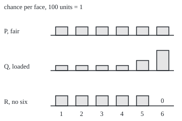
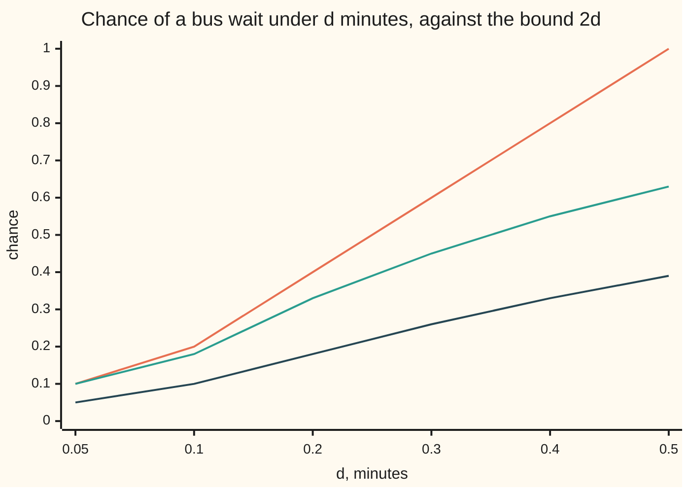

# Absolutely continuous and singular measures: one measure that ignores everything the other calls impossible, or two that live on separate sets

[Syllabus](../../../SYLLABUS.md) → [Measure and integration](../../../SYLLABUS.md#w10) → [Densities and Changing Measure](../../../SYLLABUS.md#w10-s08) → Absolutely continuous and singular measures

---

## General Overview

A fair die gives each face the chance 1/6, about 0.1667. A loaded die gives faces 1 to 4 the chance 0.1 each, face 5 the chance 0.2 and face 6 the chance 0.4. The two dice disagree about every face. They agree on one thing: what is impossible. Under either die, the only event of chance zero is the empty one, "no face at all".

A third die has no six: faces 1 to 5 get 0.2 each. It calls "a six" impossible and the fair die does not. The fair die calls nothing impossible except the empty event, so whatever it rules out, the no-six die rules out too. The reverse fails.

On the number line, a trick die that always shows 6 puts all its weight on the point 6. A dart dropped uniformly on a stick from 0 to 1 metre gives each piece of the stick its length as a chance. Each puts all its weight where the other puts none. They live apart.

Think of the reference measure as holding a veto: whatever it calls impossible, the other must too. From here on the veto has its proper name. When every set of size zero under $\mu$ has size zero under $\nu$, the measure $\nu$ is **absolutely continuous** with respect to $\mu$. When one piece of the space carries all of $\mu$ and the rest carries all of $\nu$, the two are **mutually singular**. Absolutely continuous both ways is **equivalent**.

**Absolute continuity compares two measures only by the sets they call impossible, never by how large the other sets are; mutual singularity is the opposite extreme, two measures with separate homes; and any measure given by a density is absolutely continuous.**

**What kind of fact this is:** three definitions (absolute continuity, mutual singularity, equivalence), with four theorems proved on this card in Why it works: a density always gives absolute continuity; for a finite measure, absolute continuity is the same as an epsilon-delta condition; a measure both absolutely continuous and singular with respect to $\mu$ is zero; on a finite space both tests reduce to comparing which points carry weight.

### The picture: three dice, where each puts its weight

Drawn to scale, 100 units of height to a chance of 1; each bar is one face's chance. Only the no-six die has a face with no bar.

<p align="center"></p>

Bar heights do not decide absolute continuity; missing bars do. The code prints the bar positions on its `figure,` line.

---

## The formula

Notation first, in words. A measure space $(\Omega, \mathcal{F}, \mu)$ is a set of outcomes, the collection of its subsets we allow ourselves to measure, and a measure giving each a size ([Null sets and almost everywhere](../01-Sets%20You%20Can%20Measure/07-null-sets-and-almost-everywhere.md)). Two measures $\mu$ and $\nu$ on the same $\Omega$ and $\mathcal{F}$ are compared. The sign $\nu \ll \mu$ is read "nu is absolutely continuous with respect to mu". The sign $\mu \perp \nu$ is read "mu and nu are mutually singular". The sign $\mu \sim \nu$ is read "mu and nu are equivalent".

$$\nu \ll \mu \quad\text{means}\quad \mu(A) = 0 \;\Longrightarrow\; \nu(A) = 0 \quad\text{for every } A \in \mathcal{F}$$

**Read it aloud:** every set that mu calls size zero, nu calls size zero too.

$$\mu \perp \nu \quad\text{means}\quad \text{some } S \in \mathcal{F} \text{ has } \mu(\Omega \setminus S) = 0 \text{ and } \nu(S) = 0$$

**Read it aloud:** one measurable set S holds all of mu and none of nu; mu lives on S, nu lives off it.

Equivalence, $\mu \sim \nu$, is $\nu \ll \mu$ and $\mu \ll \nu$ together: the same null sets.

A nonnegative measurable function $f$, called a **density**, turns $\mu$ into a new measure, always absolutely continuous:

$$\nu(A) = \int_A f \, d\mu \quad\text{for every } A \in \mathcal{F} \qquad\Longrightarrow\qquad \nu \ll \mu$$

**Read it aloud:** weigh every outcome by f and add up against mu; whatever mu ignores, the total ignores. Here $\int_A f\,d\mu$ is the integral of $f$ times $1_A$, which is one on $A$ and zero off it.

For a finite $\nu$, absolute continuity is the same as a quantitative promise:

$$\nu \ll \mu \iff \text{for every } \varepsilon > 0 \text{ there is a } \delta > 0 \text{ with } \mu(A) < \delta \;\Longrightarrow\; \nu(A) < \varepsilon$$

**Read it aloud:** sets that are small enough under mu are as small as wished under nu.

| Symbol | Plain meaning | In our example | Push it up and the answer… |
| --- | --- | --- | --- |
| $\Omega$, $\mathcal{F}$ | the outcomes; the sets we measure | faces 1 to 6 and all 64 sets of faces; or the line and its Borel sets | more sets, more tests |
| $\mu$, $\nu$, $\rho$ | measures on the same sets; $\mu$ is the reference | $\mu$ = the fair die, $\nu$ = the no-six die | more $\mu$-null sets make $\nu \ll \mu$ easier to break |
| $P$, $Q$ | the fair die; the loaded die | 0.1667 each; 0.1, 0.1, 0.1, 0.1, 0.2, 0.4 | — |
| $R$, $T$, $D$, $M$ | dice that never show 6, never show 1, always show 6; $M$ is half $D$ plus half $U$ | 0.2 on five faces; 1 on face 6 | — |
| $\lambda$, $U$ | length on the line; length on the stick from 0 to 1 only | $U$ of any piece of [0, 1] is its length | — |
| $E_1$, $E_2$ | bus waits in minutes, densities $e^{-x}$ and $2e^{-2x}$ for $x \ge 0$ | $E_2$ of a wait under 0.01 minutes: 0.0198 | — |
| $C$, $\kappa$ | the Cantor set; the Cantor measure | stage 10: 1024 intervals, length 0.0173 | — |
| $A$, $S$, $A_n$, $A_k$, $B_k$, $B$ | measurable sets; $S$ separates two singular measures | $S$ = {1, 2, 3, 4, 5} separates $R$ from $D$ | — |
| $f$, $1_A$ | a density; the indicator of $A$ | $Q$ against $P$: 0.6, 0.6, 0.6, 0.6, 1.2, 2.4 | bigger $\nu$, same null sets |
| $\varepsilon$, $\delta$ | a target size under $\nu$; a $\mu$-size small enough to meet it | $E_2$ against $\lambda$: $\delta = \varepsilon / 2$ | smaller $\varepsilon$, smaller $\delta$ |
| $\ll$, $\perp$, $\sim$ | absolutely continuous; mutually singular; equivalent | $R \ll P$; $R \perp D$; $P \sim Q$ | — |
| $k$, $n$ | a face; a counting index | face 6; stage $n$ of the Cantor set | — |
| $x$, $d$, $h$ | a wait in minutes; a bound on the wait; a half-width around the point 6 | $d$ = 0.01: chance 0.0198; $h$ = 0.1: length 0.2 | larger $d$, larger chance and bound $2d$ |

### When it holds

The three relations are definitions, so they need no hypotheses; the theorems about them do.

- **The same sets on both sides.** With different collections, "every set $\mu$ calls null" names different sets.
- **The reference matters.** On the die $D \ll P$, since $P$ gives face 6 the chance 0.1667; on the line $D \perp \lambda$, since the point 6 has length zero.
- **The epsilon-delta form needs $\nu$ finite.** Counting measure on 1, 2, 3, … is absolutely continuous with respect to the weights $2^{-n}$, yet the point 20 has weight 1/1048576 and count 1. No $\delta$ keeps the count below 1.
- **The density theorem needs only $f \ge 0$ and measurable.** The converse, that an absolutely continuous $\nu$ always has a density, needs more: [The Radon-Nikodym theorem](03-radon-nikodym-theorem.md) proves it when both measures are sigma-finite.
- **The finite-space shortcut needs every single point measurable.** With a coarser $\mathcal{F}$, compare the smallest measurable blocks instead of points.

---

## Why it works

### Step 0: only the zero sets are compared

Absolute continuity asks one yes-or-no question per set: if $\mu$ gives it zero, does $\nu$? Other sizes are irrelevant. The loaded die gives face 6 a chance 2.4 times the fair die's, and the two are still equivalent. Mutual singularity asks the opposite: can the outcomes be split so each measure sits wholly on its own side? On a finite space both questions reduce to which points carry weight. On the line, where every point has length zero, they do not.

### Step 1: on a die, compare the faces that carry weight

A measure **charges** a face when it gives it positive chance. If $\nu$ charges face $k$ and $\mu$ does not, the set {k} is $\mu$-null and not $\nu$-null, so $\nu \ll \mu$ fails. If $\mu$ charges every face $\nu$ charges, a $\mu$-null set holds no face $\mu$ charges, hence none $\nu$ charges, and its $\nu$-size is a sum of zeros. So $\nu \ll \mu$ exactly when $\nu$'s charged faces sit among $\mu$'s. For singularity, take $S$ to be $\mu$'s charged faces: $\nu(S) = 0$ exactly when the two charge no face in common.

The code tests all ten pairs of the five dice both ways, by the definitions over all 64 sets of faces and by comparing charged faces. The roads agree.

| Pair | Charged faces | Verdict |
| --- | --- | --- |
| $P$ and $Q$ | all six; all six | equivalent |
| $P$ and $R$ | all six; 1 to 5 | $R \ll P$ only |
| $P$ and $D$ | all six; 6 | $D \ll P$ only |
| $R$ and $T$ | 1 to 5; 2 to 6 | neither |
| $R$ and $D$ | 1 to 5; 6 | mutually singular, $S$ = {1, 2, 3, 4, 5} |

$R$ and $T$ are neither: each charges a face the other misses, and they share faces 2 to 5. Absolute continuity is transitive (if $\nu \ll \mu$ and $\mu \ll \rho$, a $\rho$-null set is $\mu$-null, hence $\nu$-null), so the dice charging all six faces form one equivalence class.

### Step 2: a density always gives absolute continuity

The loaded die is the fair die reweighted. Multiply the fair chance 0.1667 by 0.6 on faces 1 to 4, by 1.2 on face 5 and by 2.4 on face 6, and the loaded chances appear. That multiplier is a density $f$ of $Q$ against $P$. The chance of "5 or 6" comes out as the integral of $f$ over those two faces against $P$: (1.2 + 2.4) × 0.1667 = 0.6.

Why a density forces absolute continuity: if $\mu(A) = 0$, the function $f$ times $1_A$ is zero everywhere off $A$, a null set. A nonnegative function that is zero almost everywhere has integral zero ([The integral of a non-negative function](../04-The%20Lebesgue%20Integral/02-integral-of-a-nonnegative-function.md)). So $\nu(A) = 0$.

On the line, the bus waits $E_1$ and $E_2$ have densities $e^{-x}$ and $2e^{-2x}$ against length, so both are absolutely continuous with respect to $\lambda$. $E_2$ has the density $2e^{-x}$ against $E_1$, positive everywhere, and the reverse density is positive too: the two bus services are equivalent. A density that vanishes somewhere gives a one-way relation: $R$ is $P$ reweighted by 1.2 on faces 1 to 5 and by 0 on face 6. The code reweights $R$ by all 729 densities with values 0, 1 or 2 on each face; every result is absolutely continuous with respect to $R$.

### Step 3: for a finite measure, small in one means small in the other

For $E_2$ against length, the density $2e^{-2x}$ never exceeds 2. So the chance of any set of waits is at most twice its length, and $\delta = \varepsilon / 2$ works. A wait under 0.01 minutes has chance 0.0198, below 2 × 0.01 = 0.02. The chart shows the whole run.



Orange: the bound 2d. Green: $E_2$, the chance $1 - e^{-2d}$. Dark blue: $E_1$, the chance $1 - e^{-d}$, below d itself. Values rounded to two places.

Without a bounded density the promise still holds when $\nu$ is finite. The proof runs by contradiction. Suppose some $\varepsilon$ has no $\delta$. Then for each $n$ there is a set $A_n$ of $\mu$-size under $2^{-n}$ and $\nu$-size at least $\varepsilon$. Collect the outcomes that lie in infinitely many of the $A_n$. Their $\mu$-size is under every tail sum $2^{-n} + 2^{-n-1} + \cdots$, so it is zero. Their $\nu$-size is at least $\varepsilon$, because $\nu$ is finite and so is continuous along shrinking sets. A $\mu$-null set with positive $\nu$-size contradicts $\nu \ll \mu$.

A countable example: on 1, 2, 3, …, let $\mu$ give $n$ the weight $2^{-n}$ and $\nu$ the weight $1/(n(n+1))$. Take $\varepsilon = 0.1$ and $\delta = 1/1024$. A set of $\mu$-size under 1/1024 contains none of 1 to 10, so its $\nu$-size is at most the weight of 11, 12, 13, …, which telescopes to 1/11 = 0.0909. No set reaches 1/11, since the whole tail has $\mu$-size exactly 1/1024; 1/11 is the supremum. The code finds 0.0909 again by searching all 65536 sets drawn from 1 to 16 and adding the weight beyond 16, 1/17.

<details>
<summary>Detailed proof</summary>

**Theorem 1 (a density gives absolute continuity).** Let $f \ge 0$ be measurable with respect to $\mathcal{F}$ and set $\nu(A) = \int f 1_A \, d\mu$. Then $\nu$ is a measure and $\nu \ll \mu$.

*Proof.* $\nu(\emptyset) = 0$, since $f 1_\emptyset$ is the zero function. For disjoint $A_1, A_2, \ldots$ with union $A$, the functions $f(1_{A_1} + \cdots + 1_{A_k})$ rise with $k$ to $f 1_A$, so the monotone convergence theorem ([The monotone convergence theorem](../04-The%20Lebesgue%20Integral/03-monotone-convergence-theorem.md)) gives $\nu(A) = \sum_k \nu(A_k)$. If $\mu(A) = 0$, then $f 1_A$ is zero off $A$, so zero $\mu$-a.e., and a nonnegative function zero a.e. has integral 0 ([The integral of a non-negative function](../04-The%20Lebesgue%20Integral/02-integral-of-a-nonnegative-function.md)). So $\nu(A) = 0$.

**Theorem 2 (epsilon-delta).** Let $\nu$ be a finite measure on $\mathcal{F}$. Then $\nu \ll \mu$ exactly when for every $\varepsilon > 0$ there is $\delta > 0$ such that $\mu(A) < \delta$ implies $\nu(A) < \varepsilon$ for every $A \in \mathcal{F}$.

*Proof, condition implies $\nu \ll \mu$.* If $\mu(A) = 0$, then $\mu(A) < \delta$ for every $\delta > 0$, so $\nu(A) < \varepsilon$ for every $\varepsilon > 0$, and $\nu(A) = 0$.

*Proof, $\nu \ll \mu$ implies the condition.* Suppose the condition fails for some $\varepsilon > 0$. Then no $\delta$ works, in particular not $\delta = 2^{-n}$, so for each $n = 1, 2, \ldots$ there is $A_n \in \mathcal{F}$ with $\mu(A_n) < 2^{-n}$ and $\nu(A_n) \ge \varepsilon$. Let $B_k = A_k \cup A_{k+1} \cup \cdots$ and let $B$ be the set of outcomes lying in every $B_k$: those in infinitely many $A_n$. Each $B_k$ is a countable union of sets in $\mathcal{F}$ and $B$ a countable intersection, so both are in $\mathcal{F}$.

Size under $\mu$: $B \subseteq B_k$, so by monotonicity and countable subadditivity ([Continuity and subadditivity](../01-Sets%20You%20Can%20Measure/05-continuity-of-measure.md)) $\mu(B) \le \sum_{n \ge k} 2^{-n} = 2^{1-k}$ for every $k$. So $\mu(B) = 0$.

Size under $\nu$: the $B_k$ shrink as $k$ grows and $\nu(B_1) \le \nu(\Omega) < \infty$, so continuity from above (same card) gives $\nu(B) = \lim_k \nu(B_k)$. Each $B_k$ contains $A_k$, so $\nu(B_k) \ge \varepsilon$, and $\nu(B) \ge \varepsilon$.

So $B$ is $\mu$-null and not $\nu$-null, contradicting $\nu \ll \mu$. The finiteness of $\nu$ was used once, in continuity from above; the counting-measure example of When it holds shows it cannot be dropped.

**Theorem 3 (both at once means zero).** If $\nu \ll \mu$ and $\nu \perp \mu$, then $\nu(A) = 0$ for every $A \in \mathcal{F}$.

*Proof.* Singularity gives $S$ with $\mu(\Omega \setminus S) = 0$ and $\nu(S) = 0$. Absolute continuity turns the first into $\nu(\Omega \setminus S) = 0$. Additivity gives $\nu(\Omega) = \nu(S) + \nu(\Omega \setminus S) = 0$, and monotonicity gives $\nu(A) \le \nu(\Omega) = 0$.

**Theorem 4 (finite spaces)** is proved in full in Step 1; for the singular half's converse, a separating $S$ must hold every point $\mu$ charges (else $\mu(\Omega \setminus S) > 0$) and none that $\nu$ charges (else $\nu(S) > 0$).

</details>

### Step 4: mutually singular measures, with and without atoms

On the line, $D$ puts weight 1 on the point 6, which fits inside an interval of length 2h for every h: 0.2 for h = 0.1, 0.002 for h = 0.001. So $\lambda$({6}) = 0 and $S$ = {6} separates $D$ from $\lambda$. The stick $U$ is singular to $D$ too, separated by [0, 1].

Singular does not require a point with weight, an **atom**. The Cantor set $C$ is what remains of [0, 1] after removing middle thirds for ever ([The Cantor set](../02-Length%20Done%20Properly/07-the-cantor-set.md)). Stage $n$ keeps $2^n$ intervals of total length $(2/3)^n$: at stage 10, 1024 intervals of total length 0.0173. The Cantor measure $\kappa$ gives each kept interval half its parent's weight, so each stage-10 interval weighs 1/1024. It exists as the Lebesgue–Stieltjes measure of the Cantor function, the measure giving each interval the rise of that function across it ([Distribution functions and Lebesgue-Stieltjes measures](../02-Length%20Done%20Properly/06-lebesgue-stieltjes-measures.md)).

Then $\kappa(C) = 1$ while $\lambda(C) \le (2/3)^n$ for every $n$, so $\lambda(C) = 0$ and $C$ separates $\kappa$ from $\lambda$. Yet each point of $C$ lies in one stage-$n$ interval, so its $\kappa$-weight is at most $2^{-n}$ for every $n$: zero. Points off $C$ weigh nothing. No atoms, and still singular.

Theorem 3 shows the two relations are opposite ends: only the zero measure is both absolutely continuous and singular with respect to $\mu$.

### Step 5: most pairs are neither

Mix the trick die with the dart: $M$ puts half its weight on the point 6 and spreads the other half as length over the stick, so $M$([0, 1]) = 0.5. Against $U$, the set {6} has length 0.0 and $M$-weight 0.5, so $M \ll U$ fails. A set carrying all of $U$ misses only length zero of the stick, so its $M$-weight is at least half of length 1, which is 0.5: $M \perp U$ fails too. $M$ is a piece absolutely continuous with respect to $U$ plus a piece singular to it; that every measure splits this way is [Lebesgue decomposition](05-lebesgue-decomposition.md).

The road back from Step 2 (every absolutely continuous measure has a density when both measures are sigma-finite, each a countable union of pieces of finite size) is [The Radon-Nikodym theorem](03-radon-nikodym-theorem.md).

---

## Worked numbers, by hand

| Step | Arithmetic | Value |
| --- | --- | --- |
| null sets of $P$ | every face has chance 0.1667 | only the empty set: 1 of 64 |
| null sets of $R$ | only face 6 has chance 0 | the empty set and {6}: 2 of 64 |
| $R \ll P$? | $P$'s only null set is empty | **yes** |
| $P \ll R$? | $R$(6) = 0, $P$(6) = 0.1667 | **no** |
| density of $Q$ against $P$ | 0.1 ÷ 0.1667, 0.2 ÷ 0.1667, 0.4 ÷ 0.1667 | 0.6, 1.2, 2.4 |
| $Q$(5 or 6) through the density | (1.2 + 2.4) × 0.1667 | 0.6 |
| $P \sim Q$? | both have only the empty set null | **yes** |
| $R \perp D$? | $S$ = {1, 2, 3, 4, 5}: $R$ off $S$ is 0, $D$ on $S$ is 0 | **yes** |
| $E_2$ of a wait under 0.01 minutes | 1 − e^(−0.02) | 0.0198, below 2 × 0.01 = 0.02 |

On the die, absolute continuity is a statement about missing faces, and the fair die misses none, so every die is absolutely continuous with respect to it.

### What breaks if you drop a piece

| Mistake | Comes out at | What went wrong |
| --- | --- | --- |
| Reading $R \ll P$ as "and so $P \ll R$" | $P$(6) = 0.1667 while $R$(6) = 0 | the relation runs one way |
| Comparing sizes: "$Q \ll P$ means $Q(A) \le P(A)$" | $Q$(6) = 0.4 against $P$(6) = 0.1667, and still $Q \ll P$ | only zero sets are compared |
| Dropping finiteness from the epsilon-delta form | the point 20: weight 1/1048576, count 1 | continuity from above needs $\nu$ finite |
| "Not absolutely continuous, so singular" | $R$ and $T$: neither | each charges a face the other misses, and they share four faces |
| "Singular means it has atoms" | Cantor stage 10: length 0.0173, every point at most 1/1024 | $\kappa$ has no atoms and is singular to length |

The code prints every entry.

---

## Code, from first principles, and it actually runs

The code proves the die verdicts outright, since it tries all 64 sets of faces; everything on the line it checks on witness sets and finite stages, and the statements for every measure rest on the proofs above. Five pairs of independent roads: the ten die verdicts by the definitions over every set and by comparing charged faces; 729 densities each tested against the definition; the epsilon-delta bound by searching 65536 sets and by telescoping; the bus-wait chances by the closed form $1 - e^{-2d}$, with $e^x$ summed from its series, and by Simpson's rule on the density; the Cantor stages by listing intervals and by $(2/3)^n$. Python works the dice, the epsilon-delta search and the Cantor stages in exact fractions; Rust does that exact work in whole numbers, counting die chances in sixtieths, and divides out the density of $Q$ against $P$ in floating point. The bus waits are floating point in both.

### Python

```python
# Absolutely continuous and singular measures -- the check behind the card.
# Standard library only.  Five dice on the faces 1 to 6, every one of the 64
# sets of faces tested against the definitions and, by a second road, against
# a comparison of which faces carry weight.  Then the epsilon-delta form on a
# countable space, a density on the line by two integrals, and Cantor stages.
from fractions import Fraction as Fr

DICE = {"P": [Fr(1, 6)] * 6,                            # fair
        "Q": [Fr(1, 10)] * 4 + [Fr(2, 10), Fr(4, 10)],  # loaded
        "R": [Fr(1, 5)] * 5 + [Fr(0)],                  # never shows 6
        "T": [Fr(0)] + [Fr(1, 5)] * 5,                  # never shows 1
        "D": [Fr(0)] * 5 + [Fr(1)]}                     # always shows 6

def size(w, A):                          # A is a bit pattern: bit k-1 = face k
    return sum(w[k] for k in range(6) if A >> k & 1)

def ac(nu, mu):                          # road one: every mu-null set is nu-null
    return all(size(nu, A) == 0 for A in range(64) if size(mu, A) == 0)

def sing(nu, mu):                        # road one: some S with mu(off S) = 0 = nu(S)
    return any(size(mu, 63 ^ S) == 0 and size(nu, S) == 0 for S in range(64))

def faces(w):                            # road two: the faces that carry weight
    return {k + 1 for k in range(6) if w[k] > 0}

def verdict(a, b):
    x, y = DICE[a], DICE[b]
    if sing(x, y): return "mutually singular"
    if ac(x, y) and ac(y, x): return "equivalent"
    if ac(x, y): return f"{a} << {b} only"
    if ac(y, x): return f"{b} << {a} only"
    return "neither"

print("face weights, faces 1 to 6; faces with weight; count of null sets out of 64")
for n, w in DICE.items():
    nulls = sum(1 for A in range(64) if size(w, A) == 0)
    print(f"{n}: {' '.join(f'{float(p):.4f}' for p in w)}; {sorted(faces(w))}; {nulls}")
agree, table = True, []
for i, a in enumerate(DICE):
    for b in list(DICE)[i + 1:]:
        x, y = DICE[a], DICE[b]
        agree &= ac(x, y) == (faces(x) <= faces(y)) and ac(y, x) == (faces(y) <= faces(x))
        agree &= sing(x, y) == (not faces(x) & faces(y))
        table.append(verdict(a, b))
        print(f"{a} and {b}: {table[-1]}")
print(f"definition over 64 sets agrees with the face comparison: {'yes' if agree else 'no'}")
f = [q / p for q, p in zip(DICE["Q"], DICE["P"])]
print(f"density of Q against P: {' '.join(f'{float(v):.2f}' for v in f)}")
print(f"Q(5 or 6) as the integral of f against P: {float((f[4] + f[5]) / 6):.4f}")
print(f"P(6) = {float(DICE['P'][5]):.4f}, R(6) = {float(DICE['R'][5]):.4f}, Q(6) = {float(DICE['Q'][5]):.4f}")
dens_ok = all(ac([g // 3 ** k % 3 * r for k, r in enumerate(DICE["R"])], DICE["R"])
              for g in range(729))
print(f"all 729 densities with values 0, 1, 2 give measures << R: {'yes' if dens_ok else 'no'}")

# epsilon-delta on the counting numbers: mu(n) = 1/2^n, nu(n) = 1/(n(n+1))
eps, delta = Fr(1, 10), Fr(1, 2 ** 10)
best = max(sum(Fr(1, n * (n + 1)) for n in range(1, 17) if A >> (n - 1) & 1)
           for A in range(1 << 16)
           if sum(Fr(1, 2 ** n) for n in range(1, 17) if A >> (n - 1) & 1) < delta)
best += Fr(1, 17)                        # nu of 17, 18, 19, ... together
print(f"searched {1 << 16} sets of the numbers 1 to 16; weight beyond 16: 1/17")
print(f"eps 0.1, delta 1/1024: sup of nu(A) over mu(A) < delta, by search {float(best):.4f}, "
      f"by telescoping 1/11 = {1 / 11:.4f}")
for n in (10, 20):
    print(f"infinite nu (counting): mu({n}) = 1/{2 ** n}, nu({n}) = 1")

def ex(x):                               # e^x by its series, written out here
    total, term = 0.0, 1.0
    for k in range(1, 40):
        total, term = total + term, term * x / k
    return total

def simpson(g, a, b, m=200):
    h = (b - a) / m
    return h / 3 * sum((1 if j in (0, m) else 4 if j % 2 else 2) * g(a + j * h)
                       for j in range(m + 1))

print("bus waits: d, E1[0,d] = 1 - e^-d, E2[0,d] closed form, E2 by Simpson, bound 2d")
gap, below, chart = 0.0, True, [[], [], []]
for d in (0.01, 0.05, 0.1, 0.2, 0.3, 0.4, 0.5):
    e1, e2 = 1 - ex(-d), 1 - ex(-2 * d)
    for row, v in zip(chart, (2 * d, e2, e1)):
        row += [f"{v:.2f}"] if d > 0.01 else []
    s2 = simpson(lambda x: 2 * ex(-2 * x), 0.0, d)
    gap, below = max(gap, abs(e2 - s2)), below and e1 <= d and e2 <= 2 * d
    print(f"{d:.2f}, {e1:.4f}, {e2:.4f}, {s2:.4f}, {2 * d:.2f}")

print("chart, d = 0.05 to 0.5; 2d, E2, E1 to two places: " + "; ".join(", ".join(r) for r in chart))
print("point mass at 6 on the line: lambda({6}) <= 2h, D({6}) = 1")
for h in (0.1, 0.001):
    print(f"h = {h}: interval length {2 * h}")
def overlap(a, b):                      # length of [a, b] inside [0, 1]
    return max(0.0, min(b, 1.0) - max(a, 0.0))
m6, m01 = 0.5 * 1 + 0.5 * overlap(6, 6), 0.5 * 0 + 0.5 * overlap(0, 1)
print(f"M = half D plus half length on [0, 1]: M({{6}}) = {m6:.1f}, length({{6}}) = {overlap(6, 6):.1f}, M([0, 1]) = {m01:.1f}")

print("Cantor stages: n, intervals, total length by list, (2/3)^n, kappa per interval")
stage, cantor_ok = [(Fr(0), Fr(1))], True
for n in range(1, 11):
    stage = [iv for a, b in stage for iv in ((a, a + (b - a) / 3), (b - (b - a) / 3, b))]
    total = sum(b - a for a, b in stage)
    cantor_ok &= total == Fr(2, 3) ** n
    if n in (1, 2, 5, 10):
        print(f"{n}, {len(stage)}, {float(total):.4f}, {(2 / 3) ** n:.4f}, 1/{2 ** n}")
print("figure, bars 100 px per unit on baselines y=70,140,210; x=110+40(k-1), width 24; "
      "P 16.67 px, Q 10,10,10,10,20,40 px, R 20 px and none at face 6")

assert agree                                               # two roads, 20 verdicts
assert table[:4] == ["equivalent", "R << P only", "T << P only", "D << P only"]
assert "mutually singular" in table and table.count("neither") == 1
assert f == [Fr(3, 5)] * 4 + [Fr(6, 5), Fr(12, 5)]        # density against the hand values
assert dens_ok and best == Fr(1, 11)                       # density; search against telescoping
assert best < eps                                          # delta 1/1024 meets eps 0.1
assert gap < 1e-9 and below and cantor_ok                  # two integrals; stages
```

**Ran 2026-10-06 on macOS, Python 3.14.6, standard library only. All checks passed. Output, pasted from the run:**

```
face weights, faces 1 to 6; faces with weight; count of null sets out of 64
P: 0.1667 0.1667 0.1667 0.1667 0.1667 0.1667; [1, 2, 3, 4, 5, 6]; 1
Q: 0.1000 0.1000 0.1000 0.1000 0.2000 0.4000; [1, 2, 3, 4, 5, 6]; 1
R: 0.2000 0.2000 0.2000 0.2000 0.2000 0.0000; [1, 2, 3, 4, 5]; 2
T: 0.0000 0.2000 0.2000 0.2000 0.2000 0.2000; [2, 3, 4, 5, 6]; 2
D: 0.0000 0.0000 0.0000 0.0000 0.0000 1.0000; [6]; 32
P and Q: equivalent
P and R: R << P only
P and T: T << P only
P and D: D << P only
Q and R: R << Q only
Q and T: T << Q only
Q and D: D << Q only
R and T: neither
R and D: mutually singular
T and D: D << T only
definition over 64 sets agrees with the face comparison: yes
density of Q against P: 0.60 0.60 0.60 0.60 1.20 2.40
Q(5 or 6) as the integral of f against P: 0.6000
P(6) = 0.1667, R(6) = 0.0000, Q(6) = 0.4000
all 729 densities with values 0, 1, 2 give measures << R: yes
searched 65536 sets of the numbers 1 to 16; weight beyond 16: 1/17
eps 0.1, delta 1/1024: sup of nu(A) over mu(A) < delta, by search 0.0909, by telescoping 1/11 = 0.0909
infinite nu (counting): mu(10) = 1/1024, nu(10) = 1
infinite nu (counting): mu(20) = 1/1048576, nu(20) = 1
bus waits: d, E1[0,d] = 1 - e^-d, E2[0,d] closed form, E2 by Simpson, bound 2d
0.01, 0.0100, 0.0198, 0.0198, 0.02
0.05, 0.0488, 0.0952, 0.0952, 0.10
0.10, 0.0952, 0.1813, 0.1813, 0.20
0.20, 0.1813, 0.3297, 0.3297, 0.40
0.30, 0.2592, 0.4512, 0.4512, 0.60
0.40, 0.3297, 0.5507, 0.5507, 0.80
0.50, 0.3935, 0.6321, 0.6321, 1.00
chart, d = 0.05 to 0.5; 2d, E2, E1 to two places: 0.10, 0.20, 0.40, 0.60, 0.80, 1.00; 0.10, 0.18, 0.33, 0.45, 0.55, 0.63; 0.05, 0.10, 0.18, 0.26, 0.33, 0.39
point mass at 6 on the line: lambda({6}) <= 2h, D({6}) = 1
h = 0.1: interval length 0.2
h = 0.001: interval length 0.002
M = half D plus half length on [0, 1]: M({6}) = 0.5, length({6}) = 0.0, M([0, 1]) = 0.5
Cantor stages: n, intervals, total length by list, (2/3)^n, kappa per interval
1, 2, 0.6667, 0.6667, 1/2
2, 4, 0.4444, 0.4444, 1/4
5, 32, 0.1317, 0.1317, 1/32
10, 1024, 0.0173, 0.0173, 1/1024
figure, bars 100 px per unit on baselines y=70,140,210; x=110+40(k-1), width 24; P 16.67 px, Q 10,10,10,10,20,40 px, R 20 px and none at face 6
```

### Rust

```rust
// Absolutely continuous and singular measures -- the same check in Rust, std
// only.  Die weights are whole numbers of sixtieths, so every set's size is
// exact.  Every one of the 64 sets of faces is tested against the definitions
// and, by a second road, against the faces that carry weight.  Then the
// epsilon-delta form, a density on the line by two integrals, Cantor stages.
const NAMES: [&str; 5] = ["P", "Q", "R", "T", "D"];
const DICE: [[i64; 6]; 5] = [[10, 10, 10, 10, 10, 10], [6, 6, 6, 6, 12, 24],
    [12, 12, 12, 12, 12, 0], [0, 12, 12, 12, 12, 12], [0, 0, 0, 0, 0, 60]];

fn size(w: &[i64; 6], a: usize) -> i64 { (0..6).filter(|k| a >> k & 1 == 1).map(|k| w[k]).sum() }
fn ac(nu: &[i64; 6], mu: &[i64; 6]) -> bool {       // road one: mu-null sets are nu-null
    (0..64).all(|a| size(mu, a) != 0 || size(nu, a) == 0)
}
fn sing(nu: &[i64; 6], mu: &[i64; 6]) -> bool {     // road one: a separating set S
    (0..64).any(|s| size(mu, 63 ^ s) == 0 && size(nu, s) == 0)
}
fn faces(w: &[i64; 6]) -> u32 { (0..6).filter(|&k| w[k] > 0).fold(0, |m, k| m | 1 << k) }
fn verdict(i: usize, j: usize) -> String {
    let (x, y, a, b) = (&DICE[i], &DICE[j], NAMES[i], NAMES[j]);
    if sing(x, y) { return "mutually singular".to_string() }
    match (ac(x, y), ac(y, x)) {
        (true, true) => "equivalent".to_string(),
        (true, false) => format!("{} << {} only", a, b),
        (false, true) => format!("{} << {} only", b, a),
        _ => "neither".to_string(),
    }
}
fn ex(x: f64) -> f64 {                              // e^x by its series, written out here
    let (mut total, mut term) = (0.0, 1.0);
    for k in 1..40 { total += term; term = term * x / k as f64; }
    total
}
fn simpson(g: &dyn Fn(f64) -> f64, a: f64, b: f64, m: usize) -> f64 {
    let h = (b - a) / m as f64;
    let s = (0..=m).fold(0.0, |s, j| s + (if j == 0 || j == m { 1.0 } else if j % 2 == 1 { 4.0 } else { 2.0 }) * g(a + j as f64 * h));
    h / 3.0 * s
}
fn overlap(a: f64, b: f64) -> f64 { (b.min(1.0) - a.max(0.0)).max(0.0) }

fn main() {
    println!("face weights, faces 1 to 6; faces with weight; count of null sets out of 64");
    for (n, w) in NAMES.iter().zip(DICE.iter()) {
        let ws: Vec<String> = w.iter().map(|&p| format!("{:.4}", p as f64 / 60.0)).collect();
        let fs: Vec<String> = (0..6).filter(|&k| w[k] > 0).map(|k| (k + 1).to_string()).collect();
        let nulls = (0..64).filter(|&a| size(w, a) == 0).count();
        println!("{}: {}; [{}]; {}", n, ws.join(" "), fs.join(", "), nulls);
    }
    let (mut agree, mut table) = (true, Vec::new());
    for i in 0..5 {
        for j in i + 1..5 {
            let (x, y, fx, fy) = (&DICE[i], &DICE[j], faces(&DICE[i]), faces(&DICE[j]));
            agree &= ac(x, y) == (fx & !fy == 0) && ac(y, x) == (fy & !fx == 0);
            agree &= sing(x, y) == (fx & fy == 0);
            table.push(verdict(i, j));
            println!("{} and {}: {}", NAMES[i], NAMES[j], table.last().unwrap());
        }
    }
    println!("definition over 64 sets agrees with the face comparison: {}", if agree { "yes" } else { "no" });
    let f: Vec<f64> = (0..6).map(|k| DICE[1][k] as f64 / DICE[0][k] as f64).collect();
    let fs: Vec<String> = f.iter().map(|v| format!("{:.2}", v)).collect();
    println!("density of Q against P: {}", fs.join(" "));
    println!("Q(5 or 6) as the integral of f against P: {:.4}", (f[4] + f[5]) / 6.0);
    println!("P(6) = {:.4}, R(6) = {:.4}, Q(6) = {:.4}", DICE[0][5] as f64 / 60.0, DICE[2][5] as f64 / 60.0, DICE[1][5] as f64 / 60.0);
    let dens_ok = (0..729).all(|g: i64| {
        let mut nu = [0i64; 6];
        for k in 0..6 { nu[k] = g / 3i64.pow(k as u32) % 3 * DICE[2][k]; }
        ac(&nu, &DICE[2])
    });
    println!("all 729 densities with values 0, 1, 2 give measures << R: {}", if dens_ok { "yes" } else { "no" });

    // epsilon-delta: mu(n) = 1/2^n in units of 1/2^16, nu(n) = 1/(n(n+1)) in units of 1/L
    let l: i64 = 12252240;                          // the least common multiple of 1 to 17
    let mut best = 0;
    for a in 0..1usize << 16 {
        let mu: i64 = (1..17).filter(|n| a >> (n - 1) & 1 == 1).map(|n| 1i64 << (16 - n)).sum();
        if mu < 1 << 6 {                           // mu(A) below delta = 1/1024
            best = best.max((1..17i64).filter(|n| a >> (n - 1) & 1 == 1).map(|n| l / (n * (n + 1))).sum());
        }
    }
    best += l / 17;                                 // nu of 17, 18, 19, ... together
    println!("searched {} sets of the numbers 1 to 16; weight beyond 16: 1/17", 1u32 << 16);
    println!("eps 0.1, delta 1/1024: sup of nu(A) over mu(A) < delta, by search {:.4}, by telescoping 1/11 = {:.4}",
             best as f64 / l as f64, 1.0 / 11.0);
    for n in [10u32, 20] { println!("infinite nu (counting): mu({}) = 1/{}, nu({}) = 1", n, 1u64 << n, n); }

    println!("bus waits: d, E1[0,d] = 1 - e^-d, E2[0,d] closed form, E2 by Simpson, bound 2d");
    let (mut gap, mut below, mut chart) = (0.0f64, true, vec![Vec::new(), Vec::new(), Vec::new()]);
    for d in [0.01, 0.05, 0.1, 0.2, 0.3, 0.4, 0.5] {
        let (e1, e2) = (1.0 - ex(-d), 1.0 - ex(-2.0 * d));
        if d > 0.01 { for (row, v) in chart.iter_mut().zip([2.0 * d, e2, e1]) { row.push(format!("{:.2}", v)) } }
        let s2 = simpson(&|x| 2.0 * ex(-2.0 * x), 0.0, d, 200);
        gap = gap.max((e2 - s2).abs());
        below = below && e1 <= d && e2 <= 2.0 * d;
        println!("{:.2}, {:.4}, {:.4}, {:.4}, {:.2}", d, e1, e2, s2, 2.0 * d);
    }
    let rows: Vec<String> = chart.iter().map(|r| r.join(", ")).collect();
    println!("chart, d = 0.05 to 0.5; 2d, E2, E1 to two places: {}", rows.join("; "));
    println!("point mass at 6 on the line: lambda({{6}}) <= 2h, D({{6}}) = 1");
    for h in [0.1f64, 0.001] { println!("h = {}: interval length {}", h, 2.0 * h); }
    let (m6, m01) = (0.5 * 1.0 + 0.5 * overlap(6.0, 6.0), 0.5 * 0.0 + 0.5 * overlap(0.0, 1.0));
    println!("M = half D plus half length on [0, 1]: M({{6}}) = {:.1}, length({{6}}) = {:.1}, M([0, 1]) = {:.1}",
             m6, overlap(6.0, 6.0), m01);

    println!("Cantor stages: n, intervals, total length by list, (2/3)^n, kappa per interval");
    let top: i64 = 59049;                           // 3^10: every endpoint is a whole number of these
    let (mut stage, mut cantor_ok) = (vec![(0i64, top)], true);
    for n in 1..=10u32 {
        stage = stage.iter().flat_map(|&(a, b)| { let t = (b - a) / 3; vec![(a, a + t), (b - t, b)] }).collect();
        let total: i64 = stage.iter().map(|&(a, b)| b - a).sum();
        cantor_ok &= total * 3i64.pow(n) == 2i64.pow(n) * top;
        if [1, 2, 5, 10].contains(&n) {
            println!("{}, {}, {:.4}, {:.4}, 1/{}", n, stage.len(), total as f64 / top as f64, (2.0f64 / 3.0).powi(n as i32), 1u32 << n);
        }
    }
    println!("figure, bars 100 px per unit on baselines y=70,140,210; x=110+40(k-1), width 24; P 16.67 px, Q 10,10,10,10,20,40 px, R 20 px and none at face 6");

    assert!(agree);                                                  // two roads, 20 verdicts
    assert!(table[..4] == ["equivalent", "R << P only", "T << P only", "D << P only"]);
    assert!(table.iter().any(|v| v == "mutually singular") && table.iter().filter(|v| *v == "neither").count() == 1);
    assert!(f.iter().zip([0.6, 0.6, 0.6, 0.6, 1.2, 2.4]).all(|(a, b)| (a - b).abs() < 1e-12)); // density against the hand values
    assert!(dens_ok && best * 11 == l);                              // density; search against telescoping
    assert!(best * 10 < l);                                          // delta 1/1024 meets eps 0.1
    assert!(gap < 1e-9 && below && cantor_ok);                       // two integrals; stages
}
```

**Ran 2026-10-06 on macOS, rustc 1.98.1, no crates. All checks passed. Output, pasted from the run:**

```
face weights, faces 1 to 6; faces with weight; count of null sets out of 64
P: 0.1667 0.1667 0.1667 0.1667 0.1667 0.1667; [1, 2, 3, 4, 5, 6]; 1
Q: 0.1000 0.1000 0.1000 0.1000 0.2000 0.4000; [1, 2, 3, 4, 5, 6]; 1
R: 0.2000 0.2000 0.2000 0.2000 0.2000 0.0000; [1, 2, 3, 4, 5]; 2
T: 0.0000 0.2000 0.2000 0.2000 0.2000 0.2000; [2, 3, 4, 5, 6]; 2
D: 0.0000 0.0000 0.0000 0.0000 0.0000 1.0000; [6]; 32
P and Q: equivalent
P and R: R << P only
P and T: T << P only
P and D: D << P only
Q and R: R << Q only
Q and T: T << Q only
Q and D: D << Q only
R and T: neither
R and D: mutually singular
T and D: D << T only
definition over 64 sets agrees with the face comparison: yes
density of Q against P: 0.60 0.60 0.60 0.60 1.20 2.40
Q(5 or 6) as the integral of f against P: 0.6000
P(6) = 0.1667, R(6) = 0.0000, Q(6) = 0.4000
all 729 densities with values 0, 1, 2 give measures << R: yes
searched 65536 sets of the numbers 1 to 16; weight beyond 16: 1/17
eps 0.1, delta 1/1024: sup of nu(A) over mu(A) < delta, by search 0.0909, by telescoping 1/11 = 0.0909
infinite nu (counting): mu(10) = 1/1024, nu(10) = 1
infinite nu (counting): mu(20) = 1/1048576, nu(20) = 1
bus waits: d, E1[0,d] = 1 - e^-d, E2[0,d] closed form, E2 by Simpson, bound 2d
0.01, 0.0100, 0.0198, 0.0198, 0.02
0.05, 0.0488, 0.0952, 0.0952, 0.10
0.10, 0.0952, 0.1813, 0.1813, 0.20
0.20, 0.1813, 0.3297, 0.3297, 0.40
0.30, 0.2592, 0.4512, 0.4512, 0.60
0.40, 0.3297, 0.5507, 0.5507, 0.80
0.50, 0.3935, 0.6321, 0.6321, 1.00
chart, d = 0.05 to 0.5; 2d, E2, E1 to two places: 0.10, 0.20, 0.40, 0.60, 0.80, 1.00; 0.10, 0.18, 0.33, 0.45, 0.55, 0.63; 0.05, 0.10, 0.18, 0.26, 0.33, 0.39
point mass at 6 on the line: lambda({6}) <= 2h, D({6}) = 1
h = 0.1: interval length 0.2
h = 0.001: interval length 0.002
M = half D plus half length on [0, 1]: M({6}) = 0.5, length({6}) = 0.0, M([0, 1]) = 0.5
Cantor stages: n, intervals, total length by list, (2/3)^n, kappa per interval
1, 2, 0.6667, 0.6667, 1/2
2, 4, 0.4444, 0.4444, 1/4
5, 32, 0.1317, 0.1317, 1/32
10, 1024, 0.0173, 0.0173, 1/1024
figure, bars 100 px per unit on baselines y=70,140,210; x=110+40(k-1), width 24; P 16.67 px, Q 10,10,10,10,20,40 px, R 20 px and none at face 6
```

The two outputs are identical line for line.

> [!TIP]
> **Try changing**
> - **Paint a faint six on the no-six die.** Guess first: which verdicts move? In the Python, set `R` to `[Fr(99, 500)] * 5 + [Fr(1, 100)]`. $R$ now charges all six faces, so $P$, $Q$ and $R$ become equivalent, $R$ and $D$ stop being singular ($D \ll R$ only), and $R$ and $T$ turn into $T \ll R$ only. The second assert stops the run.
> - **A looser delta.** Guess first: with $\delta = 1/32$ instead of 1/1024, is the epsilon-delta promise for $\varepsilon = 0.1$ kept? Change `Fr(1, 2 ** 10)` to `Fr(1, 2 ** 5)`. The search finds 0.1667, the weight of 6, 7, 8, …, and the fifth assert fails.
> - **A coarse integral.** Guess first: how far is Simpson's rule off with 2 slices instead of 200? Set `m=2`. At d = 0.5 it gives 0.6323 against the exact 0.6321, and the last assert, which demands agreement to 1e-9, stops the run.

---

## The usual mistake

> [!warning]
> **Treating absolute continuity as a comparison of sizes.** The loaded die gives face 6 the chance 0.4, over twice the fair die's 0.1667, and the two are still equivalent. Only the sets given zero are compared.
>
> - **Reversing the direction.** $R \ll P$, yet $P \ll R$ fails: $P$(6) = 0.1667 while $R$(6) = 0.
> - **Calling every failure singular.** $R$ and $T$ are neither: each charges a face the other misses, and they share faces 2 to 5.
> - **Expecting atoms.** At Cantor stage 10 the kept length is 0.0173 and every point weighs at most 1/1024 under $\kappa$, which is still singular to length.
> - **Dropping finiteness.** Counting measure gives the point 20 the size 1 against a weight of 1/1048576, so no $\delta$ works.
> - **Forgetting the reference.** $D$ is absolutely continuous with respect to the fair die and singular to length.

---

## Where you meet it in real life

- **Pricing with two sets of odds.** A derivatives desk prices under odds different from the real ones, and the two sets of odds must be equivalent: same impossible events, or a free bet appears ([The fundamental theorems](../../12-Financial%20mathematics/05-Black-Scholes%20from%20the%20Ground%20Up/02-risk-neutral-measure-and-the-fundamental-theorems.md)).
- **Comparing statistical models.** The ratio of two models' chances needs absolute continuity ([Densities and likelihood ratios](06-densities-and-likelihood-ratios.md)). A model that calls a six impossible is ruled out by a single six.
- **Simulating with other odds.** Sampling from one measure to estimate chances under $P$ needs $P$ absolutely continuous with respect to the sampler: the no-six die never reports on sixes.
- **Insurance claims.** A claim is zero with positive chance and otherwise spread over a range: like $M$, neither absolutely continuous nor singular with respect to length.
- **"Has a density".** A distribution on the line has a density exactly when it is absolutely continuous with respect to length; the Cantor measure has a continuous distribution function and no density.

> **Say it back**
> One measure is absolutely continuous with respect to another when every set the second calls size zero, the first calls size zero too. Sizes of other sets play no part: the loaded die and the fair die are equivalent. Any measure made from a density is absolutely continuous, and for a finite measure the property is an epsilon-delta promise. Two measures are mutually singular when one set holds all of one and none of the other, like the trick die and the stick, or the Cantor measure and length. Only the zero measure is both, and most pairs are neither.

---

## What this builds on

- [The integral of a non-negative function](../04-The%20Lebesgue%20Integral/02-integral-of-a-nonnegative-function.md): the integral that turns a density into a measure, and ignores null sets.
- [Null sets and almost everywhere](../01-Sets%20You%20Can%20Measure/07-null-sets-and-almost-everywhere.md): null sets, the only thing absolute continuity compares.

## Where this goes next

- [Signed measures](02-signed-measures-and-hahn-jordan.md): the difference of two measures, and the split of the space into where each one wins.
- [Absolutely continuous functions and the fundamental theorem](../11-Derivatives%20Meet%20the%20Lebesgue%20Integral/04-absolutely-continuous-functions-and-the-fundamental-theorem.md): the epsilon-delta form moved from measures to functions, and the Cantor function as the singular case.

A density was shown to give absolute continuity; whether every absolutely continuous measure has a density is [The Radon-Nikodym theorem](03-radon-nikodym-theorem.md), whose proof runs through the Hahn decomposition of [Signed measures](02-signed-measures-and-hahn-jordan.md).

---

## Sources

Verified 2026-09-29: every link below resolves to the publisher's or author's page for the book named.

- Folland, Gerald B. *Real Analysis: Modern Techniques and Their Applications*, 2nd ed. Wiley, 1999. [Publisher page](https://www.wiley.com/en-us/Real+Analysis%3A+Modern+Techniques+and+Their+Applications%2C+2nd+Edition-p-9780471317166). Chapter 3 (sections 3.1 and 3.2) defines mutual singularity and absolute continuity and proves the epsilon-delta form for finite measures.
- Billingsley, Patrick. *Probability and Measure*, Anniversary ed. Wiley, 2012. [Publisher page](https://www.wiley.com/en-us/Probability+and+Measure%2C+Anniversary+Edition-p-9781118122372). Absolute continuity and singularity of probability measures, with the Radon-Nikodym theorem.
- Axler, Sheldon. *Measure, Integration & Real Analysis*. Springer, Graduate Texts in Mathematics 282, 2020. [Author's page with free edition](https://measure.axler.net/). Chapter 9 treats absolute continuity, singular measures and the decomposition theorems.
