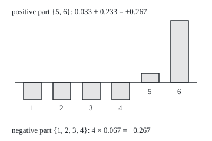
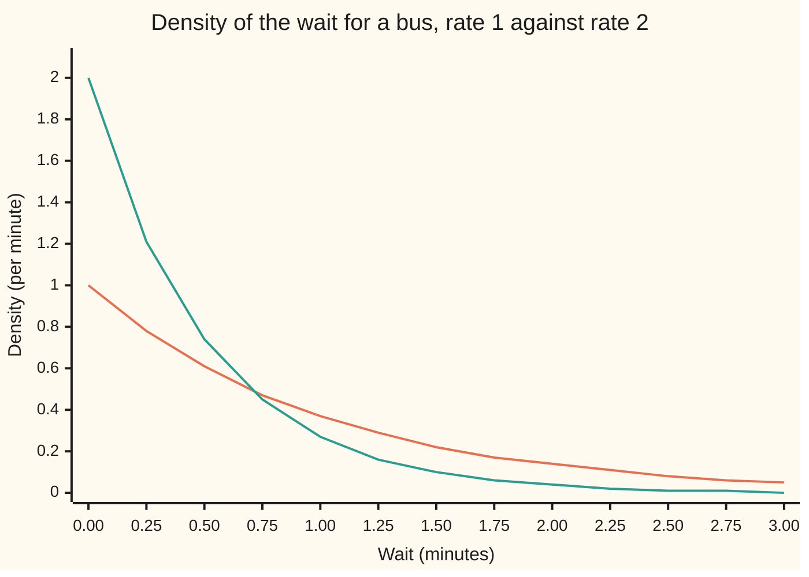

# Signed measures: sizes that may go negative, the split of the space into a positive and a negative part, and total variation as a distance

[Syllabus](../../../SYLLABUS.md) → [Measure and integration](../../../SYLLABUS.md#w10) → [Densities and Changing Measure](../../../SYLLABUS.md#w10-s08) → Signed measures

---

## General Overview

A casino keeps two dice on the table. One is fair: each face comes up with probability 1/6, about 0.167. The other is loaded: faces 1 to 4 come up with probability 0.1 each, face 5 with 0.2, face 6 with 0.4. A bet can be placed on any event, meaning any set of faces, such as "5 or 6". Each face is in or out, so there are $2^6 = 64$ events.

Which event does the loaded die favour most, and by how much? Checking all 64 events answers it for a die, but not for a bus wait of any length in minutes, whose events cannot be listed.

The tool is the difference itself: the loaded die's probability minus the fair die's, event by event. It behaves like a measure (a rule that gives each allowed set a size and adds sizes over disjoint pieces), except that some sizes are negative. "5 or 6" gets +0.267; "1, 2, 3 or 4" gets −0.267. It is a ledger of gains and losses; from here on it is called a **signed measure** (older texts say a charge).

Every signed measure splits the space into a part where every piece has size at least 0 and a part where every piece has size at most 0: the **Hahn decomposition**, here faces 5 and 6 against faces 1 to 4. The two parts' sizes added without signs give the **total variation**, 0.533. Half of it, 0.267, is the largest gap between the dice on any event: their **total variation distance**.

**A signed measure is a difference of sizes; the space always splits into a part where it only gains and a part where it only loses, the gains and losses are two ordinary measures living on those parts, and for two probability measures the gain on the positive part is the largest disagreement on any event.**

**What kind of fact this is:** a theorem, the Hahn decomposition, proved on this card in Why it works; the Jordan decomposition and the total variation formula follow from it there; "signed measure" and "total variation distance" are definitions.

### The picture: the loaded die minus the fair die, face by face

<p align="center"></p>

Drawn to scale, 450 pixels to one unit of probability; the horizontal line is zero. Bars above it are faces the loaded die favours. All six bars together measure 0.533, the total variation.

---

## The formula

Notation first, from shelf 01: $\Omega$ is the whole space, $\mathcal{F}$ a sigma-algebra (the collection of sets we allow ourselves to measure), and a measure gives each set in it a size from 0 to infinity. Here $\Omega$ is the six faces, $\mathcal{F}$ is all 64 sets of faces, $P$ is the fair die and $Q$ the loaded one. Write $p_i$ and $q_i$ for the probabilities of face i alone.

A **signed measure** $\nu$ (the Greek letter nu) on $(\Omega, \mathcal{F})$ gives each set in $\mathcal{F}$ a size between minus infinity and plus infinity, with three rules:

- the empty set has size 0;
- it takes at most one of the two values plus infinity and minus infinity;
- it is **countably additive**: for sets $E_k$, $k = 1, 2, \dots$, that pairwise share no point, $\nu(E_1 \cup E_2 \cup \cdots) = \nu(E_1) + \nu(E_2) + \cdots$, and when the left side is finite the series converges absolutely, so the order of the pieces does not matter.

On the die, $\nu = Q - P$, so $\nu(A) = Q(A) - P(A)$ for every event $A$. A set $A$ is **positive** for $\nu$ when every set $B$ in $\mathcal{F}$ inside it has $\nu(B) \ge 0$; **negative** when every such $B$ has $\nu(B) \le 0$.

**Hahn decomposition.** For every signed measure $\nu$ there are sets $\Omega^+$ and $\Omega^-$ in $\mathcal{F}$ with

$$\Omega = \Omega^+ \cup \Omega^-, \qquad \Omega^+ \cap \Omega^- = \emptyset, \qquad \Omega^+ \text{ positive}, \quad \Omega^- \text{ negative}.$$

**Read it aloud:** the space splits into two pieces that do not overlap; on the first, every piece gains; on the second, every piece loses.

**Jordan decomposition.** Put $\nu^+(E) = \nu(E \cap \Omega^+)$ and $\nu^-(E) = -\nu(E \cap \Omega^-)$. Then

$$\nu = \nu^+ - \nu^-, \qquad \nu^+(\Omega^-) = 0 = \nu^-(\Omega^+).$$

**Read it aloud:** the signed measure is the gains minus the losses, two ordinary measures living on disjoint parts of the space: mutually singular, in the word of [Absolutely continuous and singular measures](01-absolutely-continuous-and-singular-measures.md).

**Total variation**, written $\lvert\nu\rvert$ and read "the variation of nu":

$$\lvert\nu\rvert(E) = \nu^+(E) + \nu^-(E) = \sup \Big\{ \sum_{k=1}^{n} \lvert \nu(E_k) \rvert \;:\; E_1, \dots, E_n \text{ cut } E \text{ into disjoint sets in } \mathcal{F} \Big\}.$$

**Read it aloud:** a set's total variation is its gains plus its losses, and also the most that cutting it into pieces and adding their sizes without signs can collect.

**Total variation distance** between two probability measures:

$$d_{TV}(P, Q) = \sup_{A \in \mathcal{F}} \lvert Q(A) - P(A) \rvert = \tfrac12 \lvert Q - P\rvert(\Omega) = \tfrac12 \sum_{i=1}^{6} \lvert q_i - p_i \rvert .$$

**Read it aloud:** the largest disagreement on any event is half the total variation of the difference; on a die, half the sum of the face-by-face gaps. Some texts use the full sum; the half is the convention here.

| Symbol | Plain meaning | In our example | Push it up and the answer… |
| --- | --- | --- | --- |
| $\Omega$ | the whole space | the six faces; for the bus, waits of 0 minutes or more | — |
| $\mathcal{F}$ | the sigma-algebra: the sets allowed a size | all 64 sets of faces | — |
| $P$, $Q$, $p_i$, $q_i$ | two probability measures, and their values on face i | fair die 0.167 each; loaded 0.1, 0.1, 0.1, 0.1, 0.2, 0.4 | move $q_i$ away from $p_i$: the distance grows |
| $\nu$ | a signed measure: sizes that may be negative | $Q - P$: −0.067 on faces 1 to 4, +0.033 on 5, +0.233 on 6 | — |
| $A$, $B$, $E$, $E_k$ | sets in $\mathcal{F}$; $E_k$ a list of disjoint pieces | $A = \{5, 6\}$, $\nu(A) = 0.267$ | — |
| $\Omega^+$, $\Omega^-$, $\Omega_1^+$, $\Omega_1^-$ | the Hahn sets: every piece gains, every piece loses; a second Hahn split | $\{5, 6\}$ and $\{1, 2, 3, 4\}$ | — |
| $\nu^+$, $\nu^-$ | the Jordan parts: gains and losses, both ordinary measures | $\nu^+(\Omega) = 0.267$, $\nu^-(\Omega) = 0.267$ | — |
| $\lvert\nu\rvert$ | total variation: gains plus losses | $\lvert\nu\rvert(\Omega) = 0.533$ | more disagreement face by face, larger |
| $d_{TV}$ | total variation distance, between 0 and 1 | 0.267 | 1 when the two measures live on disjoint sets |
| $\mu$, $\mu_1$, $\mu_2$ | measures; $\mu_1$ and $\mu_2$ any two whose difference is $\nu$ | $Q$ and $P$ themselves, total 2 | — |
| $f_P$, $f_Q$, $\lambda$, $t$ | bus-wait densities against length $\lambda$; a wait in minutes | $e^{-t}$ and $2e^{-2t}$ | — |
| $m$, $G_j$, $H_j$, $B_j$, $n_1$, $n_j$, $n$, $j$, $F$, $G$ | inside the proof: the best value, positive sets, removed pieces, whole numbers, two disjoint sets | on the die $m = 0.267$ | — |

### When it holds

- **Countable additivity.** The proof glues countably many positive sets into one; finite additivity cannot.
- **At most one infinity.** Evens minus odds on the whole numbers gives the evens +∞ and the odds −∞, and the whole space no size: its partial sums swing between −1 and 0 in the order 1, 2, 3, …, and reach 1000 after 3000 terms in the order 2, 4, 1, 6, 8, 3, …. It is not a signed measure.
- **Uniqueness only up to null sets.** A null set, every piece of which has size 0, can sit on either side. No face has $q_i = p_i$, so the die's split is unique: brute force finds one.
- **Equal totals, for the distance.** The half uses $\nu(\Omega) = 0$; for measures of different totals the gains and losses differ.

---

## Why it works

### Step 0: on a finite space, sort the points by sign

On the die the split is found face by face. Faces where $q_i > p_i$ go to $\Omega^+$; faces where $q_i < p_i$ go to $\Omega^-$. Every piece of $\{5, 6\}$ then gains, and every piece of $\{1, 2, 3, 4\}$ loses, because a piece's size is the sum of its faces' sizes.

For the bus, a wait of exactly 0.5 minutes has probability 0 under both rates, so sorting points sorts nothing. In general the proof builds the positive part as the positive set of largest size, reached as a limit.

### Step 1: a positive size is not a positive set

The event $\{4, 5, 6\}$ has $\nu = -0.067 + 0.033 + 0.233 = 0.200$, above zero. It is not a positive set: its piece $\{4\}$ has size −0.067. Testing every one of the 64 events against every piece inside it finds exactly 4 positive sets, the subsets of $\{5, 6\}$, and 16 negative sets, the subsets of $\{1, 2, 3, 4\}$.

In general, a set inside a positive set is positive, and a countable union of positive sets is positive: cut any piece of the union into disjoint bits, each inside one positive set, and add them by countable additivity.

### Step 2: inside any set of positive size sits a positive set at least as large

Take $\{4, 5, 6\}$, size 0.200, and remove its negative piece $\{4\}$. What is left, $\{5, 6\}$, is positive and larger: 0.267.

The general lemma removes infinitely many pieces. From a set $E$ of finite positive size, remove a piece of size below −1 if there is one; if not, below −1/2; if not, below −1/3; always the first threshold in that list that finds a piece. Repeat on what is left. The removed sizes add to a finite number, because $\nu(E)$ is finite, so the thresholds shrink to zero. What remains, $A$, has $\nu(A) \ge \nu(E) > 0$, and it is positive: a negative piece of $A$ would have been caught at some threshold.

### Step 3: take the positive set of largest size

Let $m$ be the supremum of $\nu$ over positive sets. On the die $m = 0.267$, at $\{5, 6\}$. In general choose positive sets $G_1, G_2, \dots$ with sizes approaching $m$. Their union is positive (Step 1). The unions $H_j = G_1 \cup \cdots \cup G_j$ rise, each at least as large as $G_j$. Continuity from below ([Continuity and subadditivity](../01-Sets%20You%20Can%20Measure/05-continuity-of-measure.md), whose layer proof works unchanged for signed measures) sends their sizes to the union's. So the union, called $\Omega^+$, has size exactly $m$, finite because $\nu$ never takes plus infinity (if it avoids minus infinity instead, use $-\nu$).

### Step 4: what is left over loses everywhere

Put $\Omega^- = \Omega \setminus \Omega^+$, everything outside $\Omega^+$. Suppose some piece $E$ of it had positive size. Step 2 would find a positive set $A$ inside $E$ with $\nu(A) > 0$. Then $\Omega^+ \cup A$ is positive and has size $m + \nu(A)$, above the largest possible $m$. That cannot happen, so every piece of $\Omega^-$ has size at most 0. The Hahn decomposition is proved.

Two Hahn splits differ only on a set that is both positive and negative, so every piece of it has size 0: a null set.

### Step 5: gains and losses, and why this split is the cheapest

Define $\nu^+(E) = \nu(E \cap \Omega^+)$ and $\nu^-(E) = -\nu(E \cap \Omega^-)$. Both are never negative, by Steps 3 and 4, and both are countably additive because $\nu$ is. Every $E$ is the disjoint union of its part in $\Omega^+$ and its part in $\Omega^-$, so $\nu(E) = \nu^+(E) - \nu^-(E)$. On the die, $\nu^+$ is 0.033 on face 5 and 0.233 on face 6, and $\nu^-$ is 0.067 on each of faces 1 to 4.

$Q - P$ is itself a split into two measures, of combined total 2; the Jordan split totals 0.533, and none does better. If $\nu = \mu_1 - \mu_2$ for measures, then $\nu^+(E) = \mu_1(E \cap \Omega^+) - \mu_2(E \cap \Omega^+) \le \mu_1(E)$. On the die $Q - \nu^+$ is 0.1 on faces 1 to 4 and 0.167 on faces 5 and 6, never negative. It is also the only split into mutually singular measures (Detailed proof).

### Step 6: total variation, three ways

Any cut of $E$ into pieces collects at most $\nu^+(E) + \nu^-(E)$, since each piece's size is its gain minus its loss, and an unsigned difference is at most the sum. Cutting along $\Omega^+$ and $\Omega^-$ collects exactly that. On the die the 203 ways to cut six faces into blocks give a best of 0.533, which equals $0.267 + 0.267$ and equals the face-by-face sum $\sum \lvert q_i - p_i \rvert$.

### Step 7: the distance between two probability measures

For any event $A$, $\nu(A) = \nu^+(A) - \nu^-(A)$ lies between $-\nu^-(\Omega)$ and $\nu^+(\Omega)$. Both dice have total 1, so $\nu(\Omega) = 0$ and $\nu^+(\Omega) = \nu^-(\Omega)$: each is half of $\lvert\nu\rvert(\Omega)$. So no event has $\lvert Q(A) - P(A)\rvert$ above $\tfrac12\lvert\nu\rvert(\Omega)$, and $\Omega^+$ reaches it: $Q(\{5, 6\}) - P(\{5, 6\}) = 0.6 - 0.333 = 0.267$. Brute force over 64 events finds nothing larger; only the complement $\{1, 2, 3, 4\}$ ties.

The same number is one minus the overlap of the two dice, $1 - \sum \min(p_i, q_i) = 1 - 0.733$, because $\min(p_i, q_i) = q_i - \nu^+(\{i\})$ face by face.

<details>
<summary>The bus: the same split with densities</summary>

Buses at rate 1 per minute give waits the density $f_P(t) = e^{-t}$; at rate 2, $f_Q(t) = 2e^{-2t}$. A density's integral over a set against length $\lambda$ is the set's probability. So $\nu = Q - P$ has density $f_Q - f_P$, and $\Omega^+$ is the waits under the crossing, where $2e^{-2t} = e^{-t}$: $t = \ln 2 = 0.693$ minutes. Integrating $f_Q - f_P$ up to it gives $\nu^+(\Omega) = e^{-\ln 2} - e^{-2\ln 2} = 0.25$; integrating $\lvert f_Q - f_P\rvert$ over all waits gives 0.5, so the distance is 0.25. The event "the bus comes within t minutes" peaks at t = 0.693, gap 0.25. The sibling card [Densities and likelihood ratios](06-densities-and-likelihood-ratios.md) reads $\Omega^+$ as the waits where the ratio $f_Q / f_P$ exceeds 1.

</details>

<details>
<summary>Detailed proof</summary>

Throughout, $\nu$ is a signed measure on $(\Omega, \mathcal{F})$ that never takes $+\infty$; otherwise apply everything to $-\nu$ and swap the roles of positive and negative. "Piece" means a set in $\mathcal{F}$.

**Fact 1: pieces of a finite-size set have finite size.** If $\nu(E)$ is finite and $B \subseteq E$, then $\nu(E) = \nu(B) + \nu(E \setminus B)$ by additivity. Neither term is $+\infty$. If either were $-\infty$, the sum would be $-\infty$. So both are finite.

**Fact 2: a countable union of positive sets is positive.** Let $G_1, G_2, \dots$ be positive and $B$ a piece of their union. Put $B_j = (B \cap G_j) \setminus (G_1 \cup \cdots \cup G_{j-1})$. These are disjoint, their union is $B$, and each lies in $G_j$, so $\nu(B_j) \ge 0$. Countable additivity gives $\nu(B) = \sum_j \nu(B_j) \ge 0$.

**Fact 3: continuity from below.** If $H_1 \subseteq H_2 \subseteq \cdots$, then $\nu(\bigcup H_j) = \lim \nu(H_j)$: the layer proof of [Continuity and subadditivity](../01-Sets%20You%20Can%20Measure/05-continuity-of-measure.md) uses only countable additivity.

**Lemma.** If $0 < \nu(E) < \infty$, then $E$ contains a positive set $A$ with $\nu(A) \ge \nu(E)$. If $E$ is positive, take $A = E$. Otherwise let $n_1$ be the smallest whole number for which some piece $B_1 \subseteq E$ has $\nu(B_1) < -1/n_1$. Having chosen $B_1, \dots, B_{j-1}$, if $E \setminus (B_1 \cup \cdots \cup B_{j-1})$ is positive, stop and take it as $A$; its size is $\nu(E)$ minus negative numbers, so at least $\nu(E)$. Otherwise let $n_j$ be the smallest whole number for which some piece $B_j$ of that remainder has $\nu(B_j) < -1/n_j$. If the process never stops, put $A = E \setminus \bigcup_j B_j$. Then $E$ is the disjoint union of $A$ and the $B_j$, so $\nu(E) = \nu(A) + \sum_j \nu(B_j)$. By Fact 1 every term is finite, so the series converges; its terms are below $-1/n_j$, so $\sum_j 1/n_j$ is finite and $n_j \to \infty$. Also $\nu(A) = \nu(E) - \sum_j \nu(B_j) \ge \nu(E)$. Suppose a piece $B$ of $A$ had $\nu(B) < 0$. Choose a whole number $n$ with $\nu(B) < -1/n$, then $j$ with $n_j > n$. Since $B$ lies in $E \setminus (B_1 \cup \cdots \cup B_{j-1})$, the threshold $1/n$ would have found a piece at stage $j$, so $n_j \le n$, a contradiction. So $A$ is positive.

**Hahn.** Let $m = \sup\{\nu(A) : A \text{ positive}\}$; the empty set is positive, so $m \ge 0$. Choose positive $G_j$ with $\nu(G_j) \to m$ and put $\Omega^+ = \bigcup_j G_j$, positive by Fact 2. Put $H_j = G_1 \cup \cdots \cup G_j$, positive by Fact 2; then $\nu(H_j) = \nu(G_j) + \nu(H_j \setminus G_j) \ge \nu(G_j)$, since $H_j \setminus G_j$ is a piece of $H_j$. Fact 3 gives $\nu(\Omega^+) = \lim \nu(H_j) \ge m$, and $\nu(\Omega^+) \le m$ because $\Omega^+$ is positive. So $\nu(\Omega^+) = m$, finite as $\nu$ never takes $+\infty$. Put $\Omega^- = \Omega \setminus \Omega^+$. If a piece $E$ of $\Omega^-$ had $\nu(E) > 0$, then $\nu(E) < \infty$ and the Lemma gives a positive $A \subseteq E$ with $\nu(A) > 0$; $\Omega^+ \cup A$ is positive by Fact 2 and, the two being disjoint, has size $m + \nu(A) > m$, contradicting the choice of $m$. So $\Omega^-$ is negative.

**Uniqueness up to null sets.** If $(\Omega_1^+, \Omega_1^-)$ is another Hahn decomposition, $\Omega^+ \cap \Omega_1^-$ lies in a positive and a negative set, so it is null; so is $\Omega_1^+ \cap \Omega^-$. Hence $\nu(E \cap \Omega^+) = \nu(E \cap \Omega_1^+)$ for every $E$.

**Jordan.** $\nu^+(E) = \nu(E \cap \Omega^+) \ge 0$ and $\nu^-(E) = -\nu(E \cap \Omega^-) \ge 0$ by positivity and negativity; each is countably additive, as $\nu$ is. Additivity on $E = (E \cap \Omega^+) \cup (E \cap \Omega^-)$ gives $\nu = \nu^+ - \nu^-$, and $\nu^+(\Omega^-) = 0 = \nu^-(\Omega^+)$. If $\nu = \mu_1 - \mu_2$ with $\mu_1, \mu_2$ measures, then $\nu^+(E) = \mu_1(E \cap \Omega^+) - \mu_2(E \cap \Omega^+) \le \mu_1(E)$, and likewise $\nu^-(E) \le \mu_2(E)$. If moreover $\mu_1$ and $\mu_2$ are mutually singular, living on disjoint $F$ and $G$ with union $\Omega$, then every piece $B$ of $F$ has $\nu(B) = \mu_1(B) \ge 0$ and every piece of $G$ has $\nu(B) = -\mu_2(B) \le 0$, so $(F, G)$ is a Hahn decomposition; by uniqueness, $\nu^+(E) = \nu(E \cap F) = \mu_1(E \cap F) = \mu_1(E)$, and likewise $\nu^- = \mu_2$.

**Total variation.** For disjoint pieces $E_1, \dots, E_n$ with union $E$: $\sum_k \lvert\nu(E_k)\rvert = \sum_k \lvert \nu^+(E_k) - \nu^-(E_k) \rvert \le \sum_k (\nu^+(E_k) + \nu^-(E_k)) = \lvert\nu\rvert(E)$. The cut $E \cap \Omega^+$, $E \cap \Omega^-$ gives $\nu^+(E) + \nu^-(E)$ exactly.

**Distance.** For probability measures $P, Q$ and $\nu = Q - P$, no value is infinite and $\nu(\Omega) = 0$, so $\nu^+(\Omega) = \nu^-(\Omega) = \tfrac12\lvert\nu\rvert(\Omega)$. For every event, $-\nu^-(\Omega) \le -\nu^-(A) \le \nu(A) \le \nu^+(A) \le \nu^+(\Omega)$, so $\lvert\nu(A)\rvert \le \tfrac12\lvert\nu\rvert(\Omega)$, with equality at $A = \Omega^+$.

</details>

A second route: when $\nu$ has a density, $\Omega^+$ is where it is positive, as on the die and for the bus. That needs the density first, and one standard proof of [The Radon-Nikodym theorem](03-radon-nikodym-theorem.md) uses Hahn to build it, so on this shelf Hahn comes first.

---

## Worked numbers, by hand

| Step | Arithmetic | Value |
| --- | --- | --- |
| gap on faces 1 to 4 | 0.1 − 0.167 | −0.067 each |
| gap on face 5 | 0.2 − 0.167 | +0.033 |
| gap on face 6 | 0.4 − 0.167 | +0.233 |
| Hahn split | faces by sign | $\Omega^+ = \{5, 6\}$, $\Omega^- = \{1, 2, 3, 4\}$ |
| gains $\nu^+(\Omega)$ | 0.033 + 0.233 | 0.267 |
| losses $\nu^-(\Omega)$ | 4 × 0.067 | 0.267 |
| total variation $\lvert\nu\rvert(\Omega)$ | 0.267 + 0.267 | **0.533** |
| distance $d_{TV}(P, Q)$ | 0.533 / 2, or $Q(\{5,6\}) - P(\{5,6\}) = 0.6 - 0.333$ | **0.267** |
| overlap | 0.1 × 4 + 0.167 + 0.167 | 0.733 = 1 − 0.267 |

Swapping the fair die for the loaded one changes no bet's probability by more than 0.267, and "5 or 6" changes by exactly that.

### The picture: two bus-wait densities, crossing at ln 2



Orange: $f_P$, buses at rate 1 per minute. Green: $f_Q$, rate 2. They cross at 0.693 minutes. The area between them to the left of the crossing is $\nu^+(\Omega) = 0.25$; to the right, $\nu^-(\Omega) = 0.25$. The positive part $\Omega^+$ is the waits under 0.693 minutes.

### What breaks if you drop a piece

| Mistake | Comes out at | What went wrong |
| --- | --- | --- |
| Take $\{4, 5, 6\}$, of size above 0, as the positive part | 0.200 in place of 0.267 | its piece $\{4\}$ has −0.067 |
| Read $\lvert\nu(\Omega)\rvert$ as the total variation | 0 in place of 0.533 | gains and losses cancel |
| Allow both infinities: evens minus odds on the whole numbers | partial sums −1, 0, −1, 0, … in one order; 1000 after 3000 terms in another | the whole space has no size |
| Quote the full sum of gaps as the distance | 0.533 | no event differs by more than 0.267 |

---

## Code, from first principles, and it actually runs

The die is worked exactly, in fractions in Python and whole thirtieths in Rust, by three roads. Road 1 is the definition: every event is tested piece by piece for positivity, and the largest positive set is kept, as in Step 3. Road 2 sorts faces by the sign of $q_i - p_i$. Road 3 tries all 203 ways to cut the faces into blocks, and all 64 events for the distance. The bus uses bisection, midpoint sums and a grid scan, checked against the closed form through ln 2. The code checks two examples; that every signed measure has a Hahn split is the proof's work.

### Python

```python
# Signed measures, Hahn and Jordan -- the check behind the card.  Standard
# library only; fractions keeps every die probability exact.
# The die: P fair, Q loaded (0.1, 0.1, 0.1, 0.1, 0.2, 0.4), nu = Q - P.
# Road 1: the definition -- test all 64 events for positivity by testing every
#         subset, as the Hahn proof's "largest positive set" does.
# Road 2: the sign of q_i - p_i face by face, as a density would give it.
# Road 3: total variation as the best sum |nu(E_1)| + ... over all 203 ways
#         to cut the six faces into blocks; and the distance by brute force.
# Bus waits: rate 1 against rate 2, by bisection and midpoint integration.
# The code checks these examples exactly; only the proof covers every space.
from fractions import Fraction as F
import math

p = [F(1, 6)] * 6
q = [F(1, 10)] * 4 + [F(2, 10), F(4, 10)]
nu = [qi - pi for pi, qi in zip(p, q)]
d6 = lambda x: f"{float(x):.6f}"
faces = lambda m: "{" + ", ".join(str(i + 1) for i in range(6) if m >> i & 1) + "}"
size = lambda w, m: sum((w[i] for i in range(6) if m >> i & 1), F(0))
subs = lambda m: [b for b in range(64) if b & m == b]

print("face: p_i fair | q_i loaded | nu = q_i - p_i")
for i in range(6):
    print(f"face {i + 1}: {d6(p[i])} | {d6(q[i])} | {d6(nu[i])}")

# Road 1: positive set = every subset has nu >= 0; negative = every subset <= 0
pos = [m for m in range(64) if all(size(nu, b) >= 0 for b in subs(m))]
neg = [m for m in range(64) if all(size(nu, b) <= 0 for b in subs(m))]
m_best = max(pos, key=lambda m: size(nu, m))
hahn = [m for m in pos if (63 ^ m) in neg]
print(f"road 1, events tested: 64; positive sets: {len(pos)}; negative sets: {len(neg)}")
print(f"road 1, largest nu over positive sets: {d6(size(nu, m_best))} at {faces(m_best)}")
print(f"road 1, Hahn splits found: {len(hahn)}: {faces(hahn[0])} and {faces(63 ^ hahn[0])}")

# Road 2: the sign of each face's difference
plus = sum(1 << i for i in range(6) if nu[i] > 0)
print(f"road 2, faces with q_i > p_i: {faces(plus)}; faces with q_i < p_i: {faces(63 ^ plus)}")
assert hahn == [plus] and pos == subs(plus) and neg == subs(63 ^ plus)

# Jordan: nu+(A) = nu(A n Omega+), nu-(A) = -nu(A n Omega-)
nplus = [max(x, F(0)) for x in nu]
nminus = [max(-x, F(0)) for x in nu]
jp, jm = size(nplus, 63), size(nminus, 63)
assert jp == size(nu, m_best)
print(f"Jordan, nu+ by face: {' '.join(d6(x) for x in nplus)}")
print(f"Jordan, nu- by face: {' '.join(d6(x) for x in nminus)}")
print(f"Jordan, nu+(Omega) {d6(jp)} | nu-(Omega) {d6(jm)} | nu(Omega) {d6(size(nu, 63))}")

def partitions(items):                         # every way to cut a list into blocks
    if not items:
        yield []
        return
    first, rest = items[0], items[1:]
    for part in partitions(rest):
        for k in range(len(part)):
            yield part[:k] + [[first] + part[k]] + part[k + 1:]
        yield [[first]] + part

parts = list(partitions(list(range(6))))
best_cut = max(sum(abs(sum(nu[i] for i in blk)) for blk in pt) for pt in parts)
tv_abs = sum(abs(x) for x in nu)
assert len(parts) == 203 and best_cut == jp + jm
print(f"total variation |nu|(Omega): nu+ + nu- {d6(jp + jm)} | sum |q_i - p_i| {d6(tv_abs)}"
      f" | best of {len(parts)} partitions {d6(best_cut)}")

gaps = [abs(size(q, m) - size(p, m)) for m in range(64)]
dist = max(gaps)
winners = [faces(m) for m in range(64) if gaps[m] == dist]
overlap = sum(min(a, b) for a, b in zip(p, q))
assert dist == tv_abs / 2 == 1 - overlap
print(f"distance, max over 64 events |Q(A) - P(A)|: {d6(dist)} at {' and '.join(winners)}")
print(f"distance, half of |nu|(Omega): {d6(tv_abs / 2)} | sum min(p_i, q_i): {d6(overlap)}, 1 minus it {d6(1 - overlap)}")
print(f"distance, Q({{5, 6}}) {d6(size(q, 48))} - P({{5, 6}}) {d6(size(p, 48))}")

# any other split nu = mu1 - mu2 costs more: here mu1 = Q, mu2 = P
extra = [qi - x for qi, x in zip(q, nplus)]
assert size(q, 63) + size(p, 63) > jp + jm
print(f"other split Q - P: Q(Omega) + P(Omega) = {d6(size(q, 63) + size(p, 63))}"
      f" against |nu|(Omega) {d6(jp + jm)}; Q - nu+ by face: {' '.join(d6(e) for e in extra)}")

# what breaks
s456 = size(nu, 0b111000)
print(f"breaks, {{4, 5, 6}}: nu = {d6(s456)} > 0, but nu({{4}}) = {d6(nu[3])}: not a positive set")
print(f"breaks, |nu(Omega)| read as total variation: {d6(abs(size(nu, 63)))}")
print(f"breaks, full sum read as the distance: {d6(tv_abs)}")
sign = lambda k: 1 if k % 2 == 0 else -1      # evens minus odds, counting measure
order2 = [k for t in range(1, 1001) for k in (4 * t - 2, 4 * t, 2 * t - 1)]
run = lambda ks: [sum(sign(k) for k in ks[:n]) for n in range(1, len(ks) + 1)]
nat, re2 = run(list(range(1, 3001))), run(order2)
assert nat[-1] == 0 and re2[-1] == 2000 - 1000
print(f"breaks, evens minus odds, order 1, 2, 3, ...: partial sums {' '.join(map(str, nat[:9]))} ... after 3000: {nat[-1]}")
print(f"breaks, evens minus odds, order 2, 4, 1, 6, 8, 3, ...: {' '.join(map(str, re2[:9]))} ... after 3000: {re2[-1]}")

# bus waits in minutes: P rate 1, Q rate 2; nu = Q - P has density fQ - fP
fP, fQ = (lambda x: math.exp(-x)), (lambda x: 2 * math.exp(-2 * x))
lo, hi = 0.0, 5.0                              # bisection for fQ = fP
for _ in range(60):
    mid = (lo + hi) / 2
    lo, hi = (mid, hi) if fQ(mid) > fP(mid) else (lo, mid)
cross = (lo + hi) / 2
def midpoint(g, a, b, n):
    h = (b - a) / n
    return h * sum(g(a + (k + 0.5) * h) for k in range(n))
nu_plus = midpoint(lambda x: fQ(x) - fP(x), 0.0, cross, 100000)
tv_bus = midpoint(lambda x: abs(fQ(x) - fP(x)), 0.0, 40.0, 400000)
closed = math.exp(-math.log(2)) - math.exp(-2 * math.log(2))
scan = max((math.exp(-k / 1000) - math.exp(-2 * k / 1000), k / 1000) for k in range(1, 5001))
assert abs(cross - math.log(2)) < 1e-12 and abs(nu_plus - closed) < 1e-8
assert abs(tv_bus - 2 * closed) < 1e-6 and abs(scan[0] - closed) < 1e-6
print(f"bus, densities cross at (bisection): {cross:.6f} min; ln 2 = {math.log(2):.6f}")
print(f"bus, nu+ = integral of fQ - fP up to the crossing: {nu_plus:.6f}; closed form {closed:.6f}")
print(f"bus, best wait window [0, t] on a grid: t = {scan[1]:.3f}, Q - P = {scan[0]:.6f}")
print(f"bus, |nu|(Omega) = integral of |fQ - fP|: {tv_bus:.6f}; distance {tv_bus / 2:.6f}")
xs = [k / 4 for k in range(13)]
print("chart, wait x min:", " ".join(f"{x:.2f}" for x in xs))
print("chart, fP rate 1:", " ".join(f"{fP(x):.2f}" for x in xs))
print("chart, fQ rate 2:", " ".join(f"{fQ(x):.2f}" for x in xs))
print("figure, bar ends y (450 px per unit, baseline 140):", " ".join(str(140 - 450 * x) for x in nu))
print("ALL CHECKS PASS")
```

**Ran 2026-10-06 on macOS, Python 3.14.6, standard library only. All checks passed. Output, pasted from the run:**

```
face: p_i fair | q_i loaded | nu = q_i - p_i
face 1: 0.166667 | 0.100000 | -0.066667
face 2: 0.166667 | 0.100000 | -0.066667
face 3: 0.166667 | 0.100000 | -0.066667
face 4: 0.166667 | 0.100000 | -0.066667
face 5: 0.166667 | 0.200000 | 0.033333
face 6: 0.166667 | 0.400000 | 0.233333
road 1, events tested: 64; positive sets: 4; negative sets: 16
road 1, largest nu over positive sets: 0.266667 at {5, 6}
road 1, Hahn splits found: 1: {5, 6} and {1, 2, 3, 4}
road 2, faces with q_i > p_i: {5, 6}; faces with q_i < p_i: {1, 2, 3, 4}
Jordan, nu+ by face: 0.000000 0.000000 0.000000 0.000000 0.033333 0.233333
Jordan, nu- by face: 0.066667 0.066667 0.066667 0.066667 0.000000 0.000000
Jordan, nu+(Omega) 0.266667 | nu-(Omega) 0.266667 | nu(Omega) 0.000000
total variation |nu|(Omega): nu+ + nu- 0.533333 | sum |q_i - p_i| 0.533333 | best of 203 partitions 0.533333
distance, max over 64 events |Q(A) - P(A)|: 0.266667 at {1, 2, 3, 4} and {5, 6}
distance, half of |nu|(Omega): 0.266667 | sum min(p_i, q_i): 0.733333, 1 minus it 0.266667
distance, Q({5, 6}) 0.600000 - P({5, 6}) 0.333333
other split Q - P: Q(Omega) + P(Omega) = 2.000000 against |nu|(Omega) 0.533333; Q - nu+ by face: 0.100000 0.100000 0.100000 0.100000 0.166667 0.166667
breaks, {4, 5, 6}: nu = 0.200000 > 0, but nu({4}) = -0.066667: not a positive set
breaks, |nu(Omega)| read as total variation: 0.000000
breaks, full sum read as the distance: 0.533333
breaks, evens minus odds, order 1, 2, 3, ...: partial sums -1 0 -1 0 -1 0 -1 0 -1 ... after 3000: 0
breaks, evens minus odds, order 2, 4, 1, 6, 8, 3, ...: 1 2 1 2 3 2 3 4 3 ... after 3000: 1000
bus, densities cross at (bisection): 0.693147 min; ln 2 = 0.693147
bus, nu+ = integral of fQ - fP up to the crossing: 0.250000; closed form 0.250000
bus, best wait window [0, t] on a grid: t = 0.693, Q - P = 0.250000
bus, |nu|(Omega) = integral of |fQ - fP|: 0.500000; distance 0.250000
chart, wait x min: 0.00 0.25 0.50 0.75 1.00 1.25 1.50 1.75 2.00 2.25 2.50 2.75 3.00
chart, fP rate 1: 1.00 0.78 0.61 0.47 0.37 0.29 0.22 0.17 0.14 0.11 0.08 0.06 0.05
chart, fQ rate 2: 2.00 1.21 0.74 0.45 0.27 0.16 0.10 0.06 0.04 0.02 0.01 0.01 0.00
figure, bar ends y (450 px per unit, baseline 140): 170 170 170 170 125 35
ALL CHECKS PASS
```

### Rust

Same numbers, same labels, built with `rustc --edition 2021 -O`.

```rust
// Signed measures, Hahn and Jordan -- the same check as the Python, in Rust,
// no crates.  Exact arithmetic by hand: every die probability is a whole
// number of thirtieths, so nothing on the die is rounded.
// The die: P fair, Q loaded (0.1, 0.1, 0.1, 0.1, 0.2, 0.4), nu = Q - P.
// Road 1: the definition -- test all 64 events for positivity by testing every
//         subset, as the Hahn proof's "largest positive set" does.
// Road 2: the sign of q_i - p_i face by face, as a density would give it.
// Road 3: total variation as the best sum |nu(E_1)| + ... over all 203 ways
//         to cut the six faces into blocks; and the distance by brute force.
// Bus waits: rate 1 against rate 2, by bisection and midpoint integration.
// The code checks these examples exactly; only the proof covers every space.
const P: [i64; 6] = [5, 5, 5, 5, 5, 5]; // thirtieths
const Q: [i64; 6] = [3, 3, 3, 3, 6, 12];

fn d6(x: i64) -> String { format!("{:.6}", x as f64 / 30.0) }
fn faces(m: usize) -> String {
    let v: Vec<String> = (0..6).filter(|i| m >> i & 1 == 1).map(|i| (i + 1).to_string()).collect();
    format!("{{{}}}", v.join(", "))
}
fn size(w: &[i64], m: usize) -> i64 { (0..6).filter(|i| m >> i & 1 == 1).map(|i| w[i]).sum() }
fn subs(m: usize) -> Vec<usize> { (0..64).filter(|b| b & m == *b).collect() }
fn row(w: &[i64]) -> String { w.iter().map(|&x| d6(x)).collect::<Vec<_>>().join(" ") }

// every way to cut six faces into blocks: block labels in restricted-growth form
fn partitions(labels: &mut Vec<usize>, top: usize, out: &mut Vec<Vec<usize>>) {
    if labels.len() == 6 { out.push(labels.clone()); return; }
    for b in 0..=top {
        labels.push(b);
        partitions(labels, if b == top { top + 1 } else { top }, out);
        labels.pop();
    }
}

fn main() {
    let nu: Vec<i64> = (0..6).map(|i| Q[i] - P[i]).collect();
    println!("face: p_i fair | q_i loaded | nu = q_i - p_i");
    for i in 0..6 { println!("face {}: {} | {} | {}", i + 1, d6(P[i]), d6(Q[i]), d6(nu[i])); }

    // Road 1: positive set = every subset has nu >= 0; negative = every subset <= 0
    let pos: Vec<usize> = (0..64).filter(|&m| subs(m).iter().all(|&b| size(&nu, b) >= 0)).collect();
    let neg: Vec<usize> = (0..64).filter(|&m| subs(m).iter().all(|&b| size(&nu, b) <= 0)).collect();
    let mut m_best = pos[0];
    for &m in &pos { if size(&nu, m) > size(&nu, m_best) { m_best = m; } }
    let hahn: Vec<usize> = pos.iter().copied().filter(|&m| neg.contains(&(63 ^ m))).collect();
    println!("road 1, events tested: 64; positive sets: {}; negative sets: {}", pos.len(), neg.len());
    println!("road 1, largest nu over positive sets: {} at {}", d6(size(&nu, m_best)), faces(m_best));
    println!("road 1, Hahn splits found: {}: {} and {}", hahn.len(), faces(hahn[0]), faces(63 ^ hahn[0]));

    // Road 2: the sign of each face's difference
    let plus: usize = (0..6).filter(|&i| nu[i] > 0).map(|i| 1usize << i).sum();
    println!("road 2, faces with q_i > p_i: {}; faces with q_i < p_i: {}", faces(plus), faces(63 ^ plus));
    assert!(hahn == vec![plus] && pos == subs(plus) && neg == subs(63 ^ plus));

    // Jordan: nu+(A) = nu(A n Omega+), nu-(A) = -nu(A n Omega-)
    let nplus: Vec<i64> = nu.iter().map(|&x| x.max(0)).collect();
    let nminus: Vec<i64> = nu.iter().map(|&x| (-x).max(0)).collect();
    let (jp, jm) = (size(&nplus, 63), size(&nminus, 63));
    assert!(jp == size(&nu, m_best));
    println!("Jordan, nu+ by face: {}", row(&nplus));
    println!("Jordan, nu- by face: {}", row(&nminus));
    println!("Jordan, nu+(Omega) {} | nu-(Omega) {} | nu(Omega) {}", d6(jp), d6(jm), d6(size(&nu, 63)));

    let mut parts = Vec::new();
    partitions(&mut Vec::new(), 0, &mut parts);
    let mut best_cut = 0;
    for pt in &parts {
        let nb = pt.iter().max().unwrap() + 1;
        let cut: i64 = (0..nb).map(|b| (0..6).filter(|&i| pt[i] == b).map(|i| nu[i]).sum::<i64>().abs()).sum();
        best_cut = best_cut.max(cut);
    }
    let tv_abs: i64 = nu.iter().map(|x| x.abs()).sum();
    assert!(parts.len() == 203 && best_cut == jp + jm);
    println!("total variation |nu|(Omega): nu+ + nu- {} | sum |q_i - p_i| {} | best of {} partitions {}",
             d6(jp + jm), d6(tv_abs), parts.len(), d6(best_cut));

    let gaps: Vec<i64> = (0..64).map(|m| (size(&Q, m) - size(&P, m)).abs()).collect();
    let dist = *gaps.iter().max().unwrap();
    let winners: Vec<String> = (0..64).filter(|&m| gaps[m] == dist).map(faces).collect();
    let overlap: i64 = (0..6).map(|i| P[i].min(Q[i])).sum();
    assert!(2 * dist == tv_abs && dist == 30 - overlap);
    println!("distance, max over 64 events |Q(A) - P(A)|: {} at {}", d6(dist), winners.join(" and "));
    // tv_abs is even (checked above), so the halving below is exact
    println!("distance, half of |nu|(Omega): {} | sum min(p_i, q_i): {}, 1 minus it {}", d6(tv_abs / 2), d6(overlap), d6(30 - overlap));
    println!("distance, Q({{5, 6}}) {} - P({{5, 6}}) {}", d6(size(&Q, 48)), d6(size(&P, 48)));

    // any other split nu = mu1 - mu2 costs more: here mu1 = Q, mu2 = P
    let extra: Vec<i64> = (0..6).map(|i| Q[i] - nplus[i]).collect();
    assert!(size(&Q, 63) + size(&P, 63) > jp + jm);
    println!("other split Q - P: Q(Omega) + P(Omega) = {} against |nu|(Omega) {}; Q - nu+ by face: {}",
             d6(size(&Q, 63) + size(&P, 63)), d6(jp + jm), row(&extra));

    // what breaks
    println!("breaks, {{4, 5, 6}}: nu = {} > 0, but nu({{4}}) = {}: not a positive set", d6(size(&nu, 0b111000)), d6(nu[3]));
    println!("breaks, |nu(Omega)| read as total variation: {}", d6(size(&nu, 63).abs()));
    println!("breaks, full sum read as the distance: {}", d6(tv_abs));
    let sign = |k: i64| if k % 2 == 0 { 1i64 } else { -1 }; // evens minus odds, counting measure
    let order2: Vec<i64> = (1..=1000i64).flat_map(|t| [4 * t - 2, 4 * t, 2 * t - 1]).collect();
    let run = |ks: &[i64]| -> Vec<i64> { let mut s = 0; ks.iter().map(|&k| { s += sign(k); s }).collect() };
    let nat = run(&(1..=3000i64).collect::<Vec<_>>());
    let re2 = run(&order2);
    assert!(nat[2999] == 0 && re2[2999] == 2000 - 1000);
    let first = |v: &[i64]| v[..9].iter().map(|x| x.to_string()).collect::<Vec<_>>().join(" ");
    println!("breaks, evens minus odds, order 1, 2, 3, ...: partial sums {} ... after 3000: {}", first(&nat), nat[2999]);
    println!("breaks, evens minus odds, order 2, 4, 1, 6, 8, 3, ...: {} ... after 3000: {}", first(&re2), re2[2999]);

    // bus waits in minutes: P rate 1, Q rate 2; nu = Q - P has density fQ - fP
    let f_p = |x: f64| (-x).exp();
    let f_q = |x: f64| 2.0 * (-2.0 * x).exp();
    let (mut lo, mut hi) = (0.0f64, 5.0f64); // bisection for fQ = fP
    for _ in 0..60 {
        let mid = (lo + hi) / 2.0;
        if f_q(mid) > f_p(mid) { lo = mid } else { hi = mid }
    }
    let cross = (lo + hi) / 2.0;
    let midpoint = |g: &dyn Fn(f64) -> f64, a: f64, b: f64, n: usize| -> f64 {
        let h = (b - a) / n as f64;
        h * (0..n).map(|k| g(a + (k as f64 + 0.5) * h)).sum::<f64>()
    };
    let nu_plus = midpoint(&|x| f_q(x) - f_p(x), 0.0, cross, 100000);
    let tv_bus = midpoint(&|x| (f_q(x) - f_p(x)).abs(), 0.0, 40.0, 400000);
    let ln2 = 2f64.ln();
    let closed = (-ln2).exp() - (-2.0 * ln2).exp();
    let mut scan = (f64::MIN, 0.0);
    for k in 1..=5000 {
        let t = k as f64 / 1000.0;
        let v = (-t).exp() - (-2.0 * t).exp();
        if v > scan.0 || (v == scan.0 && t > scan.1) { scan = (v, t); }
    }
    assert!((cross - ln2).abs() < 1e-12 && (nu_plus - closed).abs() < 1e-8);
    assert!((tv_bus - 2.0 * closed).abs() < 1e-6 && (scan.0 - closed).abs() < 1e-6);
    println!("bus, densities cross at (bisection): {:.6} min; ln 2 = {:.6}", cross, ln2);
    println!("bus, nu+ = integral of fQ - fP up to the crossing: {:.6}; closed form {:.6}", nu_plus, closed);
    println!("bus, best wait window [0, t] on a grid: t = {:.3}, Q - P = {:.6}", scan.1, scan.0);
    println!("bus, |nu|(Omega) = integral of |fQ - fP|: {:.6}; distance {:.6}", tv_bus, tv_bus / 2.0);
    let xs: Vec<f64> = (0..13).map(|k| k as f64 / 4.0).collect();
    let line = |g: &dyn Fn(f64) -> f64| xs.iter().map(|&x| format!("{:.2}", g(x))).collect::<Vec<_>>().join(" ");
    println!("chart, wait x min: {}", line(&|x| x));
    println!("chart, fP rate 1: {}", line(&f_p));
    println!("chart, fQ rate 2: {}", line(&f_q));
    let bars: Vec<String> = nu.iter().map(|&x| (140 - 15 * x).to_string()).collect();
    println!("figure, bar ends y (450 px per unit, baseline 140): {}", bars.join(" "));
    println!("ALL CHECKS PASS");
}
```

**Ran 2026-10-06 on macOS, rustc 1.98.1, no crates. All checks passed. Output, pasted from the run:**

```
face: p_i fair | q_i loaded | nu = q_i - p_i
face 1: 0.166667 | 0.100000 | -0.066667
face 2: 0.166667 | 0.100000 | -0.066667
face 3: 0.166667 | 0.100000 | -0.066667
face 4: 0.166667 | 0.100000 | -0.066667
face 5: 0.166667 | 0.200000 | 0.033333
face 6: 0.166667 | 0.400000 | 0.233333
road 1, events tested: 64; positive sets: 4; negative sets: 16
road 1, largest nu over positive sets: 0.266667 at {5, 6}
road 1, Hahn splits found: 1: {5, 6} and {1, 2, 3, 4}
road 2, faces with q_i > p_i: {5, 6}; faces with q_i < p_i: {1, 2, 3, 4}
Jordan, nu+ by face: 0.000000 0.000000 0.000000 0.000000 0.033333 0.233333
Jordan, nu- by face: 0.066667 0.066667 0.066667 0.066667 0.000000 0.000000
Jordan, nu+(Omega) 0.266667 | nu-(Omega) 0.266667 | nu(Omega) 0.000000
total variation |nu|(Omega): nu+ + nu- 0.533333 | sum |q_i - p_i| 0.533333 | best of 203 partitions 0.533333
distance, max over 64 events |Q(A) - P(A)|: 0.266667 at {1, 2, 3, 4} and {5, 6}
distance, half of |nu|(Omega): 0.266667 | sum min(p_i, q_i): 0.733333, 1 minus it 0.266667
distance, Q({5, 6}) 0.600000 - P({5, 6}) 0.333333
other split Q - P: Q(Omega) + P(Omega) = 2.000000 against |nu|(Omega) 0.533333; Q - nu+ by face: 0.100000 0.100000 0.100000 0.100000 0.166667 0.166667
breaks, {4, 5, 6}: nu = 0.200000 > 0, but nu({4}) = -0.066667: not a positive set
breaks, |nu(Omega)| read as total variation: 0.000000
breaks, full sum read as the distance: 0.533333
breaks, evens minus odds, order 1, 2, 3, ...: partial sums -1 0 -1 0 -1 0 -1 0 -1 ... after 3000: 0
breaks, evens minus odds, order 2, 4, 1, 6, 8, 3, ...: 1 2 1 2 3 2 3 4 3 ... after 3000: 1000
bus, densities cross at (bisection): 0.693147 min; ln 2 = 0.693147
bus, nu+ = integral of fQ - fP up to the crossing: 0.250000; closed form 0.250000
bus, best wait window [0, t] on a grid: t = 0.693, Q - P = 0.250000
bus, |nu|(Omega) = integral of |fQ - fP|: 0.500000; distance 0.250000
chart, wait x min: 0.00 0.25 0.50 0.75 1.00 1.25 1.50 1.75 2.00 2.25 2.50 2.75 3.00
chart, fP rate 1: 1.00 0.78 0.61 0.47 0.37 0.29 0.22 0.17 0.14 0.11 0.08 0.06 0.05
chart, fQ rate 2: 2.00 1.21 0.74 0.45 0.27 0.16 0.10 0.06 0.04 0.02 0.01 0.01 0.00
figure, bar ends y (450 px per unit, baseline 140): 170 170 170 170 125 35
ALL CHECKS PASS
```

The two outputs match line for line.

> [!TIP]
> **Try changing**
> Guess first, then run the Python.
> - **Make face 5 fair.** Change the loaded die's `F(2, 10)` to `F(1, 6)` and `F(4, 10)` to `F(13, 30)`. Guess: face 5 is null, so brute force finds 2 Hahn splits, prints `{6}` against `{1, 2, 3, 4, 5}`, and the assert expecting one stops the run.
> - **Load the die completely.** Put all the loaded die's weight on face 6: `[F(0)] * 5 + [F(1)]`. Guess: gains 0.833 on face 6, losses 0.167 on each other face, total variation 1.667, distance 0.833. Every assert still passes.
> - **Compare equal dice.** Set `q = p`. Guess: every set is null, 64 Hahn splits, and the uniqueness assert stops the run.

---

## The usual mistake

> [!warning]
> **Taking any set of positive size as a positive set.** Every piece inside must have size at least 0. The event $\{4, 5, 6\}$ has size 0.200 yet contains $\{4\}$ at −0.067; the Hahn part is $\{5, 6\}$, at 0.267. The proof removes negative pieces because a positive total hides them.
>
> - **Using the Jordan parts as the original measures.** $Q - P$ and $\nu^+ - \nu^-$ are the same signed measure, but $Q$ has total 1 and $\nu^+$ has total 0.267; the Jordan parts strip out the common part, 0.733.
> - **Reading $\lvert\nu(\Omega)\rvert$ as the total variation.** It comes out at 0, not 0.533: the gains and losses cancel.
> - **Quoting the full sum of gaps as the distance.** It gives 0.533, yet no event differs by more than 0.267.

---

## Where you meet it in real life

- **Telling two distributions apart.** One roll must decide between the fair die and the loaded one. Any rule's two error probabilities add to at least 1 − 0.267 = 0.733, and "say loaded on 5 or 6" achieves it.
- **Card shuffling.** How many riffle shuffles make a deck close to random is measured in total variation distance from the uniform order; Levin, Peres and Wilmer build mixing times on it.
- **Electric charge.** Charge in a region is a signed measure; the Hahn split separates where positive and negative charge sit.
- **Likelihood ratios.** For the bus, $\Omega^+$ is the waits where $f_Q / f_P > 1$, and saying "rate 2" exactly there is the best one-wait test: see [Densities and likelihood ratios](06-densities-and-likelihood-ratios.md).
- **Splitting a measure in two.** A part with a density and a part with none, the unsigned cousin of Jordan's split: [Lebesgue decomposition](05-lebesgue-decomposition.md).

> **Say it back**
> A signed measure gives sets sizes that may be negative, adds them over disjoint pieces, and takes at most one infinity. Its space splits into a positive part, where every piece gains, and a negative part, where every piece loses; the positive part is the largest positive set. Gains and losses are two ordinary measures on separate parts, and their sum is the total variation. For two probability measures, the gains equal the losses, so half the total variation is the largest gap on any event. For the dice that is 0.267, on the event "5 or 6".

---

## What this builds on

- [Absolutely continuous and singular measures](01-absolutely-continuous-and-singular-measures.md): mutually singular measures, the relation between the Jordan parts.
- [Continuity and subadditivity](../01-Sets%20You%20Can%20Measure/05-continuity-of-measure.md): continuity from below, which turns a list of positive sets into the largest one.

## Where this goes next

- [The Radon-Nikodym theorem](03-radon-nikodym-theorem.md): one standard proof applies the Hahn split to $\nu - c\mu$, for measures $\nu$ and $\mu$ and each number c, to build a density.

On the die the density of $Q$ against $P$ was in hand: $q_i / p_i$, face by face. Whether every measure that is zero wherever another is zero has such a density is what the Radon-Nikodym theorem answers.

---

## Sources

Verified 29 Sep 2026: every link below opens a page naming the cited work.

- Folland, Gerald B. *Real Analysis: Modern Techniques and Their Applications*, 2nd ed. Wiley, 1999. [Publisher page](https://www.wiley.com/en-us/Real+Analysis%3A+Modern+Techniques+and+Their+Applications%2C+2nd+Edition-p-9780471317166). Section 3.1 defines signed measures and proves the Hahn and Jordan decompositions by the largest-positive-set argument used here.
- Axler, Sheldon. *Measure, Integration & Real Analysis*. Springer Graduate Texts in Mathematics, 2020, open access. [Author's page with the free edition](https://measure.axler.net/). Chapter 9 treats total variation as a supremum over partitions and proves both decompositions.
- Billingsley, Patrick. *Probability and Measure*, Anniversary Edition. Wiley, 2012. [Publisher page](https://www.wiley.com/en-us/Probability+and+Measure%2C+Anniversary+Edition-p-9781118122372). The Hahn decomposition as the first step towards the Radon-Nikodym theorem.
- Levin, David A., and Yuval Peres, with Elizabeth L. Wilmer. *Markov Chains and Mixing Times*, 2nd ed. American Mathematical Society, 2017. [Authors' page with the free edition](https://pages.uoregon.edu/dlevin/MARKOV/). Chapter 4 proves that the largest gap on an event is half the sum of the point gaps, and uses it to measure shuffling.
