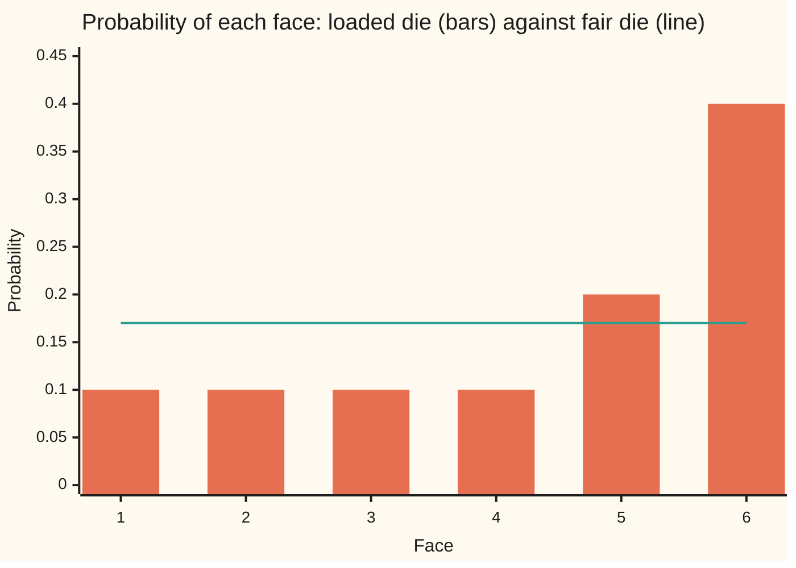
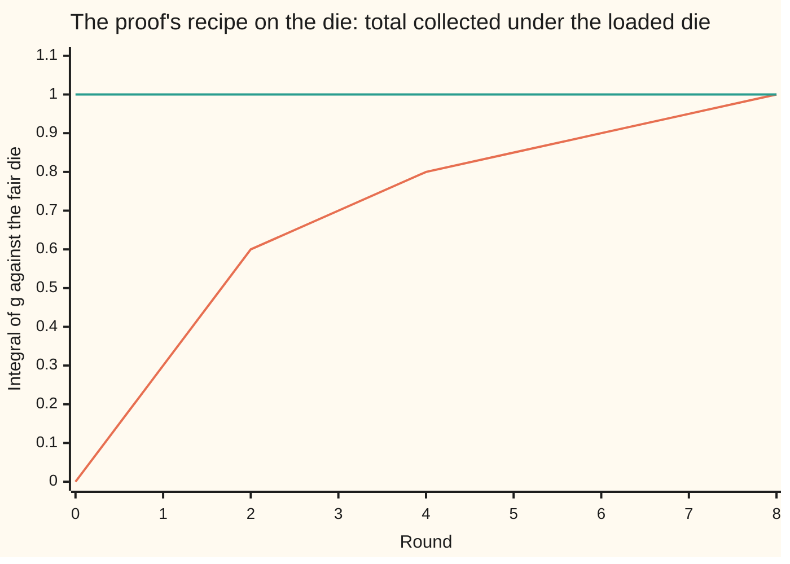

# The Radon-Nikodym theorem: absolute continuity is exactly having a density, when both measures are sigma-finite

[Syllabus](../../../SYLLABUS.md) → [Measure and integration](../README.md) → [Densities and Changing Measure](../README.md#s08) → The Radon-Nikodym theorem

---

## General Overview

A die is loaded. Faces 1 to 4 each come up with probability 0.1, face 5 with 0.2, face 6 with 0.4. A fair die gives every face 1/6, about 0.1667. The loaded die can be written as the fair die reweighted: multiply the fair probability of each face by a factor. The factors are 0.6 on faces 1 to 4, 1.2 on face 5 and 2.4 on face 6. Check face 1: 0.6 times 1/6 is 0.1.

The factors work for every event. "An even number" has loaded probability 0.1 + 0.1 + 0.4 = 0.6, and (0.6 + 0.6 + 2.4) times 1/6 is again 0.6. Factors that turn one measure into another this way are a **density** of the second against the first.

On a die the factor is a division. Division fails when single points carry no weight. Under one bus timetable the wait in minutes is exponential at rate 1; under another, at rate 2. Every exact wait has probability zero under both, so the ratio is 0/0. Yet the rate-2 probabilities are the rate-1 probabilities reweighted by 2e^(-x) at a wait of x minutes. When does such a factor exist, and how is it found without dividing?

One condition is needed: a factor times zero is zero, so whatever the reference measure calls impossible, the other must too. The Radon-Nikodym theorem says this is enough, provided each measure can be cut into countably many pieces of finite size. The proof does not divide. It builds the density from below, as the best function that never overshoots.

**For sigma-finite measures, one measure has a density against another exactly when every set the second calls size zero, the first also calls size zero; the density is unique except on a set of size zero.**

**What kind of fact this is:** a theorem, proved on this card in Why it works: for finite measures by the Hahn-decomposition argument, with the L2 argument folded, then for sigma-finite ones, with uniqueness.

### The picture: two dice, face by face



Bars: the loaded die. Line: the fair die at 1/6, drawn as 0.17. The density is bar over line: 0.6 below the line, 1.2 and 2.4 above it.

---

## The formula

Notation first. A measure space $(\Omega, \mathcal{F}, \mu)$ is a whole space $\Omega$, a sigma-algebra $\mathcal{F}$ (the collection of sets we allow ourselves to measure) and a measure $\mu$. A second measure $\nu$ on $\mathcal{F}$ is **absolutely continuous** with respect to $\mu$, written $\nu \ll \mu$, when $\mu(A) = 0$ forces $\nu(A) = 0$ ([Absolutely continuous and singular measures](01-absolutely-continuous-and-singular-measures.md)). A measure is **sigma-finite** when $\Omega$ is a countable union of sets $E_1, E_2, \dots$ of finite size; length on the line is, with pieces $[k, k+1)$.

$$\nu \ll \mu \quad\Longleftrightarrow\quad \text{there is a measurable } f \ge 0 \text{ with } \nu(A) = \int_A f\,d\mu \text{ for every } A \in \mathcal{F} \qquad (\mu,\ \nu \text{ sigma-finite})$$

**Read it aloud:** when both measures are sigma-finite, ν ignores every set μ ignores exactly when ν is μ reweighted by a non-negative function.

The function is unique up to a μ-null set (a set of μ-size zero). It is written $\frac{d\nu}{d\mu}$, read "the density of ν against μ". On the die, $\mu$ is the fair die $P$, $\nu$ the loaded die $Q$, and the integral is a sum:

$$Q(A) = \sum_{i \in A} f(i)\,P(\{i\}) = \frac{1}{6}\sum_{i \in A} f(i), \qquad f = (0.6,\ 0.6,\ 0.6,\ 0.6,\ 1.2,\ 2.4)$$

**Read it aloud:** the loaded chance of an event is the fair chance of each of its faces, scaled by that face's factor, added up.

Right to left is easy: an integral over a μ-null set is zero. The theorem is left to right: a condition on null sets alone produces a function.

| Symbol | Plain meaning | In our example | Push it up and the answer… |
| --- | --- | --- | --- |
| $\Omega$, $\mathcal{F}$, $A$, $B$ | the whole space; the sets allowed a size; events in it | six faces; all 64 events; "even" = faces 2, 4, 6 | — |
| $\mu$ | the reference measure, the one reweighted | the fair die $P$, 1/6 per face | larger μ-size, smaller factor needed |
| $\nu$ | the measure to be written with a density | the loaded die $Q$ | larger ν-size, larger factor |
| $P$, $Q$, $M$, $V$ | fair and loaded die (or rate-1 and rate-2 bus waits); a die that never shows 6; a measure absolutely continuous with respect to $M$ | 0.1667 each; 0.1, 0.1, 0.1, 0.1, 0.2, 0.4; 0.2 on faces 1 to 5 | — |
| $f$, $f_k$, $f_n$ | the density $d\nu/d\mu$: the reweighting factor; its version on piece k; the proof's rising functions | 0.6, 0.6, 0.6, 0.6, 1.2, 2.4; for the buses 2e^(-x) | a face's factor up, its ν-size up |
| $\mathcal{G}$, $g$, $g_1$, $g_2$, $g_n$, $m$ | the proof's class of functions that never overshoot ν; members of it; their best total | $g$ rises round by round; $m = 1$ | — |
| $\nu_0$ | what ν has left after the best function is taken out | 0 at the end | — |
| $t$, $\varepsilon$, $H$, $N$ | a level; the proof's small step; positive and negative Hahn sets | t = 0.9 gives faces 5, 6; step 0.3 | higher t, smaller positive set |
| $\lambda$, $c$, $\ll$ | length; counting measure (number of points); "is absolutely continuous with respect to" | [0, 1] as the failure case | — |
| $\rho$, $h$, $Z$ | the L2 route: $\mu + \nu$; the density of ν against it; where $h = 1$ | 0.375 on faces 1 to 4 | — |
| $E_k$, $F_i$, $G_j$, $A_n$ | pieces of finite size; the sets where one density beats another by $1/n$ | $[k, k+1)$ on the bus waits | — |
| $i$, $j$, $k$, $n$ | whole-number counters | faces, pieces, rounds | — |

### When it holds

- **Absolute continuity, $\nu \ll \mu$.** A die $M$ that never shows 6 gives face 6 the chance 0, $Q$ gives it 0.4, and no factor times 0 makes 0.4. The best function that never overshoots collects 0.6 and strands 0.4; splitting off that part is [Lebesgue decomposition](05-lebesgue-decomposition.md).
- **The reference μ is sigma-finite.** Counting measure $c$ on [0, 1] against length $\lambda$: only the empty set has count 0, so $\lambda \ll c$. But every point has length 0, forcing the factor to 0 everywhere, and the integral of 0 is 0, not 1.
- **ν is sigma-finite.** This makes the density finite. On [0, 1], the measure giving every set of positive length the size infinity is absolutely continuous with respect to length, but its densities are infinite except on a null set.
- **One sigma-algebra.** Both measures live on $\mathcal{F}$, and the density is measurable with respect to it; changing it on a μ-null set gives another version.

---

## Why it works

### Step 0: build the density from below, and let the Hahn decomposition find what is missing

Collect every non-negative function whose integral against μ never exceeds ν on any set, and take the best. If ν had anything left over, the Hahn decomposition (a split of the space into a part where a signed measure is positive and a part where it is negative) would locate a set where the leftover beats a small multiple of μ; absolute continuity makes that set visible to μ. Raising the function a little there would beat the best. So nothing is left over.

### Step 1: the class of functions that never overshoot has a best member

Let $\mathcal{G}$ be the measurable $g \ge 0$ with $\int_A g\,d\mu \le \nu(A)$ for every $A$ in $\mathcal{F}$; zero is one. The larger of two members at each point is a member: where $g_1$ is larger it stays under ν, and on the rest $g_2$ does. Let $m$ be the supremum (least upper bound) of $\int g\,d\mu$ over $\mathcal{G}$, at most $\nu(\Omega)$. Running maxima of members whose totals approach $m$ rise, and the monotone convergence theorem ([The monotone convergence theorem](../04-The%20Lebesgue%20Integral/03-monotone-convergence-theorem.md)) carries the inequality on every set to the limit $f$. So $f$ is in $\mathcal{G}$ and its total is exactly $m$.

On the die, $m = 1$: the best member takes all of the loaded die's probability.

### Step 2: nothing is left over

The leftover $\nu_0(A) = \nu(A) - \int_A f\,d\mu$ is a measure, never negative. Suppose $\nu_0(\Omega) > 0$. With μ finite, pick $\varepsilon > 0$ with $\nu_0(\Omega) > \varepsilon\,\mu(\Omega)$.

The difference $\nu_0 - \varepsilon\mu$ is a signed measure (it can be negative). The Hahn decomposition ([Signed measures](02-signed-measures-and-hahn-jordan.md)) splits $\Omega$ into a positive set $H$, where every subset has signed size at least 0, and a negative set $N$, where every subset has signed size at most 0. The whole space has positive signed size, so $H$ does too. Hence $\nu_0(H) > 0$, so $\nu(H) > 0$, so $\mu(H) > 0$: this is where absolute continuity enters.

Raise $f$ by $\varepsilon$ on $H$. On any set $A$ the extra integral is $\varepsilon\,\mu(A \cap H)$, at most $\nu_0(A \cap H)$ since $A \cap H$ lies in the positive set. The raised function still never overshoots ν, and its total $m + \varepsilon\,\mu(H)$ beats $m$: a contradiction. So $\nu_0 = 0$ and $\nu(A) = \int_A f\,d\mu$ for every $A$.

### Step 3: the contradiction, run forwards on the die

Start from $g = 0$. Each round, find the positive set of $\nu_0 - 0.3P$, where $\nu_0 = Q - \int g\,dP$ is the leftover, and raise $g$ by 0.3 there. A face joins when its leftover is at least 0.3 times 1/6, which is 0.05.

| Round | Positive set | $g$ afterwards | $\int g\,dP$ |
| --- | --- | --- | --- |
| 1 | faces 1 to 6 | 0.3 on every face | 0.3000 |
| 2 | faces 1 to 6 | 0.6 on every face | 0.6000 |
| 3 | faces 5, 6 | 0.9 on faces 5, 6 | 0.7000 |
| 4 | faces 5, 6 | 1.2 on faces 5, 6 | 0.8000 |
| 5 to 8 | face 6 | face 6 climbs 1.5, 1.8, 2.1, 2.4 | 0.8500, 0.9000, 0.9500, 1.0000 |
| 9 | empty | unchanged | leftover 0.0000 |

The code checks all 64 events after each round: $g$ never leaves $\mathcal{G}$.



Rising line: the total collected, $\int g\,dP$. Flat line: $Q(\Omega) = 1$, the ceiling for every member of $\mathcal{G}$.

### Step 4: the density's level sets are Hahn sets

The positive set of $Q - tP$ is where the density is at least $t$. So the density at a face is the highest level whose positive set contains it:

| Level $t$ | Positive set of $Q - tP$ | Its signed size |
| --- | --- | --- |
| 0.3 | faces 1 to 6 | 0.7000 |
| 0.6 | faces 1 to 6 | 0.4000 |
| 0.9, 1.2 | faces 5, 6 | 0.3000, 0.2000 |
| 1.8, 2.4 | face 6 | 0.1000, 0.0000 |
| 2.7 | none | 0.0000 |

No division is needed, so this works for the bus waits. Searched over the intervals $[0, b]$, the positive set of $Q - tP$ is $[0, \ln(2/t))$: it ends at 0.693147 minutes for level 1 and 1.386294 for level 0.5. The highest level, on a grid 0.01 apart, whose interval contains the wait x is 0.73 at x = 1, against 2e^(-1) = 0.7358.

### Step 5: from finite to sigma-finite

Cut $\Omega$ into disjoint pieces $E_1, E_2, \dots$ of finite μ-size and finite ν-size, by intersecting μ's pieces with ν's. The finite theorem gives a density $f_k$ on each piece; set $f = f_k$ on $E_k$. The monotone convergence theorem, in its term-by-term form, adds the pieces' integrals into one: $\nu(A) = \int_A f\,d\mu$.

The rate-2 bus wait against length on $[0, \infty)$ is an example. Length is infinite there, but the pieces $[k, k+1)$ have length 1. The density on each is $2e^{-2x}$, the pieces carry 0.8647, 0.1170, 0.0158, 0.0021, and twenty pieces glued give 1.000000.

### Step 6: unique, except on a null set

Let $f$ and $g$ both be densities of a finite ν. On $A_n$, where $f \ge g + 1/n$, the two integrals agree and are finite, so $0 = \int_{A_n}(f - g)\,d\mu \ge \mu(A_n)/n$. Every $A_n$ is null, so their union, where $f > g$, is null. Swap the roles, and run this piece by piece in the sigma-finite case.

On the fair die no face is null: raising face 6's factor by 0.1 breaks 32 of the 64 events. Against the five-face die $M$, face 6 is null. The measure $V = (0.1, 0.1, 0.2, 0.2, 0.4, 0)$ has density $(0.5, 0.5, 1, 1, 2)$ on faces 1 to 5, and face-6 values 0 and 7 both reproduce $V$ on all 64 events.

### Step 7: where sigma-finiteness is used, and what fails without it

Step 2 needed $\varepsilon\,\mu(\Omega)$ finite. With counting measure $c$ on [0, 1] as the reference, $c(\Omega)$ is infinite, and [0, 1] is uncountable, so no countable split into finite-count pieces exists. A density for length would need $0 = \lambda(\{x\}) = f(x)$ at every point, so $f = 0$ and $\lambda([0, 1]) = 0$, which is false.

Finite grids show the squeeze. Give each of $k$ equally spaced points the length $1/k$. Against counting, the density is $1/k$: 0.1 for 10 points, 0.000001 for a million, total 1 each time. As the grid fills the interval the density shrinks towards 0, which keeps nothing.

<details>
<summary>Detailed proof</summary>

**Setting.** $(\Omega, \mathcal{F})$ carries measures μ and ν with $\nu \ll \mu$. Integrals of non-negative functions allow the value infinity, with $0 \cdot \infty = 0$.

**1. The easy direction.** If $\nu(A) = \int_A f\,d\mu$ and $\mu(A) = 0$, every simple function under $f 1_A$ has its positive levels on subsets of A, of μ-size 0, so $\nu(A) = 0$.

**2. Finite case: the class is closed under maxima.** Assume μ and ν finite. Let $\mathcal{G}$ be the measurable $g: \Omega \to [0, \infty]$ with $\int_A g\,d\mu \le \nu(A)$ for all $A \in \mathcal{F}$. For $g_1, g_2 \in \mathcal{G}$ put $B = \{g_1 \ge g_2\}$, a set in $\mathcal{F}$. Then $\int_A \max(g_1, g_2)\,d\mu = \int_{A \cap B} g_1\,d\mu + \int_{A \setminus B} g_2\,d\mu \le \nu(A \cap B) + \nu(A \setminus B) = \nu(A)$, by additivity of the integral over disjoint sets and of ν.

**3. A best member.** Put $m = \sup\{\int g\,d\mu : g \in \mathcal{G}\} \le \nu(\Omega) < \infty$. Choose $g_n \in \mathcal{G}$ with $\int g_n\,d\mu \to m$, and $f_n = \max(g_1, \dots, g_n)$, in $\mathcal{G}$ by step 2. The $f_n$ rise to a measurable $f$. For each A, $f_n 1_A$ rises to $f 1_A$, so the monotone convergence theorem gives $\int_A f\,d\mu = \lim_n \int_A f_n\,d\mu \le \nu(A)$. So $f \in \mathcal{G}$, and $m \ge \int f\,d\mu \ge \int f_n\,d\mu \ge \int g_n\,d\mu \to m$ gives $\int f\,d\mu = m$.

**4. The leftover is a measure.** Put $\nu_0(A) = \nu(A) - \int_A f\,d\mu$, a difference of finite numbers, non-negative by step 3. It is countably additive because ν is and because $A \mapsto \int_A f\,d\mu$ is, by the term-by-term form of monotone convergence. And $\nu_0 \le \nu$, so $\nu_0 \ll \mu$.

**5. The leftover is zero.** Suppose $\nu_0(\Omega) > 0$ and fix $\varepsilon > 0$ with $\varepsilon\,\mu(\Omega) < \nu_0(\Omega)$. The set function $\nu_0 - \varepsilon\mu$ is a finite signed measure, so it has a Hahn decomposition $\Omega = H \cup N$, disjoint, with $(\nu_0 - \varepsilon\mu)(A) \ge 0$ for $A \subseteq H$ and $\le 0$ for $A \subseteq N$ ([Signed measures](02-signed-measures-and-hahn-jordan.md)). Then $(\nu_0 - \varepsilon\mu)(H) = (\nu_0 - \varepsilon\mu)(\Omega) - (\nu_0 - \varepsilon\mu)(N) > 0$, so $\nu_0(H) > \varepsilon\,\mu(H) \ge 0$. By $\nu_0 \ll \mu$, $\mu(H) > 0$. Put $g = f + \varepsilon 1_H$. For any A, $\int_A g\,d\mu = \int_A f\,d\mu + \varepsilon\,\mu(A \cap H) \le \int_A f\,d\mu + \nu_0(A \cap H) \le \int_A f\,d\mu + \nu_0(A) = \nu(A)$, using that $A \cap H \subseteq H$ and that $\nu_0$ is a measure. So $g \in \mathcal{G}$ with $\int g\,d\mu = m + \varepsilon\,\mu(H) > m$, contradicting step 3. Hence $\nu_0 = 0$.

**6. A finite version.** $\{f = \infty\}$ lies inside $\{f \ge j\}$, of μ-size at most $\nu(\Omega)/j$ for every whole number j, so it is null; set $f = 0$ there.

**7. Sigma-finite case.** Let $\Omega = \bigcup_i F_i = \bigcup_j G_j$ with $\mu(F_i) < \infty$ and $\nu(G_j) < \infty$. The sets $F_i \cap G_j$, made disjoint, form a countable list $E_1, E_2, \dots$ with both sizes finite. On $E_k$, the measures $\mu(\cdot \cap E_k)$ and $\nu(\cdot \cap E_k)$ are finite and absolute continuity still holds between them, so steps 2 to 6 give a finite $f_k \ge 0$ with $\nu(A \cap E_k) = \int_{A \cap E_k} f_k\,d\mu$. Put $f = \sum_k f_k 1_{E_k}$, measurable as a limit of partial sums. Countable additivity of ν and the term-by-term form of the monotone convergence theorem give $\nu(A) = \sum_k \nu(A \cap E_k) = \sum_k \int_A f_k 1_{E_k}\,d\mu = \int_A f\,d\mu$.

**8. Uniqueness.** Let $f$, $g$ be densities of ν. On a piece $E_k$ as in step 7, for $A \subseteq E_k$ both integrals equal $\nu(A) < \infty$. Put $A_n = E_k \cap \{f \ge g + 1/n\}$. Then $\int_{A_n} f\,d\mu = \int_{A_n} g\,d\mu$ and both are finite, so $0 = \int_{A_n}(f - g)\,d\mu \ge \mu(A_n)/n$ and $\mu(A_n) = 0$. The set $\{f > g\}$, the union over n and k of the $A_n$, is μ-null. Exchanging f and g finishes.

**9. Counting measure.** On $([0, 1], \mathcal{B})$, with $\mathcal{B}$ the Borel sets, let $c$ count points and $\lambda$ be length. $c(A) = 0$ only for $A$ empty, so $\lambda \ll c$. If $\lambda(A) = \int_A f\,dc$ for all Borel A, then A = {x} gives $0 = f(x)$ for every x, so $\lambda([0, 1]) = \int 0\,dc = 0$, false. And $c$ is not sigma-finite: a countable union of finite sets is countable, and [0, 1] is not.

</details>

<details>
<summary>Another proof: von Neumann's L2 argument</summary>

Put $\rho = \mu + \nu$, finite. The map $g \mapsto \int g\,d\nu$ on $L^2(\rho)$ is linear and, by Cauchy-Schwarz, bounded: $|\int g\,d\nu| \le \int |g|\,d\rho \le \rho(\Omega)^{1/2} \|g\|_{L^2(\rho)}$. Every bounded linear map on this complete inner-product space is an inner product with a fixed function ([L2 as a Hilbert space](../07-Sizes%20of%20Functions/06-l2-as-a-hilbert-space.md)), so there is $h$ with $\int g\,d\nu = \int g h\,d\rho$ for all $g$ in $L^2(\rho)$. Testing on $g = 1_A$ gives $0 \le \nu(A) \le \rho(A)$, which forces $0 \le h \le 1$ except on a ρ-null set. Rearranged, $\int g(1 - h)\,d\nu = \int g h\,d\mu$. On $Z = \{h = 1\}$, taking $g = 1_Z$ gives $\mu(Z) = 0$, so $\nu(Z) = 0$ by absolute continuity. Off Z, take $g = 1_A(1 + h + \dots + h^n)$: the left side is $\int_A (1 - h^{n+1})\,d\nu$, which rises to $\nu(A \setminus Z)$, and the right side rises to $\int_{A \setminus Z} h/(1 - h)\,d\mu$, both by monotone convergence. So $f = h/(1 - h)$ off Z, and 0 on Z, is the density.

On the die, $h$ is the density of $Q$ against $P + Q$: 0.3750 on faces 1 to 4, 0.5455 on face 5 and 0.7059 on face 6. Then $h/(1 - h)$ is 0.6, 1.2, 2.4 again.

</details>

Working with the density once it exists is [The Radon-Nikodym derivative](04-radon-nikodym-derivative.md).

---

## Worked numbers, by hand

| Step | Arithmetic | Value |
| --- | --- | --- |
| fair die, per face | 1/6 | 0.1667 |
| factor, faces 1 to 4 | 0.1 ÷ (1/6) = 0.1 × 6 | 0.6 |
| factor, face 5 | 0.2 × 6 | 1.2 |
| factor, face 6 | 0.4 × 6 | 2.4 |
| check "even" | (0.6 + 0.6 + 2.4) × 1/6 against 0.1 + 0.1 + 0.4 | 0.6 = 0.6 |
| recipe after 8 rounds | (4 × 0.6 + 1.2 + 2.4) × 1/6 = 6 × 1/6 | 1 |
| L2 route, face 6 | h = 0.4 ÷ (1/6 + 0.4), then h ÷ (1 − h) | 0.7059; **2.4** |
| bus wait of 1 minute | 2e^(-1) | 0.7358 |

**The loaded die's density against the fair die is (0.6, 0.6, 0.6, 0.6, 1.2, 2.4).** In the world: a six on this die is 2.4 times as likely as on a fair one, and each of 1 to 4 is 0.6 times as likely.

### What breaks if you drop a piece

| Mistake | Comes out at | What went wrong |
| --- | --- | --- |
| Reference die $M$ never shows 6 (no absolute continuity) | the staircase collects 0.6000; 0.4000 of $Q$ is left on face 6, where M is 0; face 6 hits the level cap 3.0 | no factor turns size 0 into 0.4 |
| Counting measure on [0, 1] as the reference (not sigma-finite) | the only candidate is 0, integral 0 against length 1; grid densities 0.1, 0.01, 0.001, 0.000001 | $\varepsilon\,c(\Omega)$ is infinite, and no countable finite pieces exist |
| Density taken the wrong way round, $dP/dQ$ | 1.6667 on faces 1 to 4, 0.8333, 0.4167; its integral against $P$ is 1.3194, not 1 | $dP/dQ$ reweights $Q$ into $P$, not $P$ into $Q$ |
| Treating the density as unique at every point | against $M$, face-6 values 0 and 7 agree on 64 of 64 events | on a null set any value works |

---

## Code, from first principles, and it actually runs

Three independent roads lead to the die's density: division face by face; the Hahn staircase, each positive set found by searching all 64 events; and the proof's recipe, checked after every round never to overshoot. All three must agree exactly and reproduce $Q$ on all 64 events. The L2 route through $h = dQ/d(P + Q)$ is not a fourth road, since $h/(1 - h)$ is $Q/P$ by algebra; the code checks that it recovers the ratio. The bus waits use a golden-section search (a shrinking-bracket search for a maximum) for each positive set and Simpson's rule for integrals. The failures are printed beside the working case. Python keeps the die in exact fractions; Rust uses a small fraction type written by hand. The code checks finite cases and grids; that every sigma-finite pair has a density is the proof's work.

### Python

```python
# The Radon-Nikodym theorem -- the check behind the card.  Standard library only;
# fractions keeps every die calculation exact.
# Die: fair die P against loaded die Q = (0.1, 0.1, 0.1, 0.1, 0.2, 0.4).
# Road 1: the definition: Q(face) / P(face), then tested on all 64 events.
# Road 2: the Hahn staircase: f(x) is the highest level t with x in the positive
#         set of Q - tP, each positive set found by searching all 64 events.
# Road 3: the proof's recipe: raise g by eps on the positive set of
#         (Q - integral of g) - eps P until nothing is left over.
# L2 check: von Neumann's route, h = dQ/d(P + Q), then h / (1 - h) = Q/P.
# Bus waits, rate 1 (P) against rate 2 (Q): positive sets of Q - tP found by
# maximising over intervals [0, b], and the staircase set against 2e^(-x).
# Failures: a die that never shows 6, and counting measure against length.
# The code checks finite cases and grids; that every sigma-finite pair has a
# density is the proof's work.
from fractions import Fraction as Fr
from math import exp, log

EV = [[i for i in range(6) if m >> i & 1] for m in range(64)]      # all 64 events
P = [Fr(1, 6)] * 6
Q = [Fr(1, 10)] * 4 + [Fr(2, 10), Fr(4, 10)]
def meas(w, A): return sum((w[i] for i in A), Fr(0))
def integ(f, w, A): return sum((f[i] * w[i] for i in A), Fr(0))
def dec(v): return " ".join(f"{float(x):.4f}" for x in v)
def faces(A): return " ".join(str(i + 1) for i in A) if A else "none"
def hahn(sig):                          # largest event of greatest signed size
    best = max(meas(sig, A) for A in EV)
    return max((A for A in EV if meas(sig, A) == best), key=len)

ratio = [Q[i] / P[i] for i in range(6)]                                # road 1
print(f"die, P: {dec(P)}; Q: {dec(Q)}")
print("die, density by ratio Q/P:", dec(ratio))
stair, shown = [Fr(0)] * 6, (3, 6, 9, 12, 18, 24, 27)
for k in range(31):                                                    # road 2
    t = Fr(k, 10)
    H = hahn([Q[i] - t * P[i] for i in range(6)])
    for i in H: stair[i] = max(stair[i], t)
    if k in shown: print(f"hahn, positive set of Q - {float(t):.1f} P: faces {faces(H)}; its size {float(meas(Q, H) - t * meas(P, H)):.4f}")
print("die, density by Hahn staircase:", dec(stair))
g, eps, totals, rnd = [Fr(0)] * 6, Fr(3, 10), [Fr(0)], 0               # road 3
while True:
    left = [Q[i] - g[i] * P[i] for i in range(6)]                      # nu_0 on each face
    H = hahn([left[i] - eps * P[i] for i in range(6)])
    rnd += 1
    if not H:
        print(f"recipe, round {rnd}: positive set empty; left over {float(sum(left)):.4f}")
        break
    for i in H: g[i] += eps
    assert all(integ(g, P, A) <= meas(Q, A) for A in EV)              # g stays in the class G
    totals.append(integ(g, P, range(6)))
    assert totals[-1] > totals[-2]
    print(f"recipe, round {rnd}: raise faces {faces(H)}; g = {dec(g)}; total {float(totals[-1]):.4f}")
h = [Q[i] / (P[i] + Q[i]) for i in range(6)]                           # L2 check
vn = [x / (1 - x) for x in h]
print("L2 route, h = dQ/d(P+Q):", dec(h), "| h/(1-h):", dec(vn))
assert ratio == stair == g                                            # three roads agree
assert vn == ratio                                                     # the L2 formula recovers Q/P
assert all(integ(g, P, A) == meas(Q, A) for A in EV)
assert totals[-1] == meas(Q, range(6))
print(f"die, event 'even' = faces 2 4 6: Q {float(meas(Q, [1, 3, 5])):.4f}; integral of f against P {float(integ(g, P, [1, 3, 5])):.4f}")
print(f"die, all 64 events: integral of f against P equals Q; best total m = {float(totals[-1]):.4f} = Q(whole die)")

M = [Fr(1, 5)] * 5 + [Fr(0)]                                           # never shows a 6
st6 = [max(Fr(k, 10) for k in range(31) if i in hahn([Q[j] - Fr(k, 10) * M[j] for j in range(6)])) for i in range(6)]
got = integ(st6[:5] + [Fr(0)], M, range(6))
assert got + Q[5] == meas(Q, range(6))                               # short by exactly Q(face 6)
print(f"no abs. continuity, five-face die M: staircase {dec(st6)} (face 6 hits the cap 3.0); integral against M {float(got):.4f}; missing Q(6) = {float(Q[5]):.4f} on a set M calls 0")
wr = [P[i] / Q[i] for i in range(6)]
print(f"wrong way round, dP/dQ: {dec(wr)}; its integral against P {float(integ(wr, P, range(6))):.4f}")
V = [Fr(1, 10), Fr(1, 10), Fr(2, 10), Fr(2, 10), Fr(4, 10), Fr(0)]
f1 = [V[i] / M[i] for i in range(5)] + [Fr(0)]
f2 = f1[:5] + [Fr(7)]
agree = sum(integ(f1, M, A) == meas(V, A) == integ(f2, M, A) for A in EV)
bump = g[:5] + [g[5] + Fr(1, 10)]
differ = sum(integ(bump, P, A) != meas(Q, A) for A in EV)
assert agree == 64
assert differ == 32
print(f"uniqueness, V = {dec(V)} against M: versions {dec(f1)} and face-6 value 7 agree on {agree} of 64 events")
print(f"uniqueness, fair die: raise face 6 of f by 0.1, events that now disagree: {differ} of 64")
print("counting vs length, k grid points each given length 1/k: density against counting, total")
for k in (10, 100, 1000, 10 ** 6):
    print(f"  k = {k}: density {1 / k:.6f}, total {k * Fr(1, k)}")
print("counting vs length on [0, 1]: singletons force f = 0; integral of 0 = 0, length 1")

def gold(fn, a, b):                     # own golden-section search for a maximum
    r = (5 ** 0.5 - 1) / 2
    for _ in range(90):
        c, d = b - r * (b - a), a + r * (b - a)
        if fn(c) > fn(d): b = d
        else: a = c
    return (a + b) / 2
def bstar(t): return gold(lambda b: (1 - exp(-2 * b)) - t * (1 - exp(-b)), 0.0, 10.0)
for t in (0.25, 0.5, 1.0, 1.5):
    b = bstar(t)
    assert abs(b - log(2 / t)) < 1e-7
    print(f"bus, positive set of Q - {t} P is [0, b): best b {b:.6f}; ln(2/t) {log(2 / t):.6f}")
cuts = [bstar(j / 100) for j in range(1, 200)]
for x in (0.25, 0.5, 1.0, 2.0):
    s = max((j + 1) / 100 for j in range(199) if x < cuts[j])
    assert 0 <= 2 * exp(-x) - s < 0.01
    print(f"bus, x = {x}: staircase {s:.2f}; 2e^(-x) {2 * exp(-x):.4f}")
def simpson(fn, a, b, n=1000):
    w = (b - a) / n
    return w / 3 * sum(fn(a + i * w) * (1 if i in (0, n) else 4 if i % 2 else 2) for i in range(n + 1))
qa = simpson(lambda x: 2 * exp(-x) * exp(-x), 0.0, 1.0)
assert abs(qa - (1 - exp(-2))) < 1e-10
print(f"bus, Q([0, 1]) as integral of 2e^(-x) against P: {qa:.4f}; closed form 1 - e^(-2) {1 - exp(-2):.4f}")
pieces = [simpson(lambda x: 2 * exp(-2 * x), k, k + 1.0) for k in range(20)]
assert all(abs(pieces[k] - (exp(-2 * k) - exp(-2 * k - 2))) < 1e-10 for k in range(20))
print("sigma-finite, rate-2 wait against length, pieces [k, k+1), k = 0..3:", " ".join(f"{v:.4f}" for v in pieces[:4]),
      f"| 20 pieces glued: {sum(pieces):.6f}")
print("chart, loaded die weights: " + " ".join(f"{float(q):.2f}" for q in Q) + f"; fair die {float(P[0]):.2f}")
print("chart, recipe totals by round 0..8: " + " ".join(f"{float(v):.2f}" for v in totals))
print("ALL CHECKS PASS")
```

**Ran 2026-10-06 on macOS, Python 3.14.6, standard library only. All checks passed. Output, pasted from the run:**

```
die, P: 0.1667 0.1667 0.1667 0.1667 0.1667 0.1667; Q: 0.1000 0.1000 0.1000 0.1000 0.2000 0.4000
die, density by ratio Q/P: 0.6000 0.6000 0.6000 0.6000 1.2000 2.4000
hahn, positive set of Q - 0.3 P: faces 1 2 3 4 5 6; its size 0.7000
hahn, positive set of Q - 0.6 P: faces 1 2 3 4 5 6; its size 0.4000
hahn, positive set of Q - 0.9 P: faces 5 6; its size 0.3000
hahn, positive set of Q - 1.2 P: faces 5 6; its size 0.2000
hahn, positive set of Q - 1.8 P: faces 6; its size 0.1000
hahn, positive set of Q - 2.4 P: faces 6; its size 0.0000
hahn, positive set of Q - 2.7 P: faces none; its size 0.0000
die, density by Hahn staircase: 0.6000 0.6000 0.6000 0.6000 1.2000 2.4000
recipe, round 1: raise faces 1 2 3 4 5 6; g = 0.3000 0.3000 0.3000 0.3000 0.3000 0.3000; total 0.3000
recipe, round 2: raise faces 1 2 3 4 5 6; g = 0.6000 0.6000 0.6000 0.6000 0.6000 0.6000; total 0.6000
recipe, round 3: raise faces 5 6; g = 0.6000 0.6000 0.6000 0.6000 0.9000 0.9000; total 0.7000
recipe, round 4: raise faces 5 6; g = 0.6000 0.6000 0.6000 0.6000 1.2000 1.2000; total 0.8000
recipe, round 5: raise faces 6; g = 0.6000 0.6000 0.6000 0.6000 1.2000 1.5000; total 0.8500
recipe, round 6: raise faces 6; g = 0.6000 0.6000 0.6000 0.6000 1.2000 1.8000; total 0.9000
recipe, round 7: raise faces 6; g = 0.6000 0.6000 0.6000 0.6000 1.2000 2.1000; total 0.9500
recipe, round 8: raise faces 6; g = 0.6000 0.6000 0.6000 0.6000 1.2000 2.4000; total 1.0000
recipe, round 9: positive set empty; left over 0.0000
L2 route, h = dQ/d(P+Q): 0.3750 0.3750 0.3750 0.3750 0.5455 0.7059 | h/(1-h): 0.6000 0.6000 0.6000 0.6000 1.2000 2.4000
die, event 'even' = faces 2 4 6: Q 0.6000; integral of f against P 0.6000
die, all 64 events: integral of f against P equals Q; best total m = 1.0000 = Q(whole die)
no abs. continuity, five-face die M: staircase 0.5000 0.5000 0.5000 0.5000 1.0000 3.0000 (face 6 hits the cap 3.0); integral against M 0.6000; missing Q(6) = 0.4000 on a set M calls 0
wrong way round, dP/dQ: 1.6667 1.6667 1.6667 1.6667 0.8333 0.4167; its integral against P 1.3194
uniqueness, V = 0.1000 0.1000 0.2000 0.2000 0.4000 0.0000 against M: versions 0.5000 0.5000 1.0000 1.0000 2.0000 0.0000 and face-6 value 7 agree on 64 of 64 events
uniqueness, fair die: raise face 6 of f by 0.1, events that now disagree: 32 of 64
counting vs length, k grid points each given length 1/k: density against counting, total
  k = 10: density 0.100000, total 1
  k = 100: density 0.010000, total 1
  k = 1000: density 0.001000, total 1
  k = 1000000: density 0.000001, total 1
counting vs length on [0, 1]: singletons force f = 0; integral of 0 = 0, length 1
bus, positive set of Q - 0.25 P is [0, b): best b 2.079442; ln(2/t) 2.079442
bus, positive set of Q - 0.5 P is [0, b): best b 1.386294; ln(2/t) 1.386294
bus, positive set of Q - 1.0 P is [0, b): best b 0.693147; ln(2/t) 0.693147
bus, positive set of Q - 1.5 P is [0, b): best b 0.287682; ln(2/t) 0.287682
bus, x = 0.25: staircase 1.55; 2e^(-x) 1.5576
bus, x = 0.5: staircase 1.21; 2e^(-x) 1.2131
bus, x = 1.0: staircase 0.73; 2e^(-x) 0.7358
bus, x = 2.0: staircase 0.27; 2e^(-x) 0.2707
bus, Q([0, 1]) as integral of 2e^(-x) against P: 0.8647; closed form 1 - e^(-2) 0.8647
sigma-finite, rate-2 wait against length, pieces [k, k+1), k = 0..3: 0.8647 0.1170 0.0158 0.0021 | 20 pieces glued: 1.000000
chart, loaded die weights: 0.10 0.10 0.10 0.10 0.20 0.40; fair die 0.17
chart, recipe totals by round 0..8: 0.00 0.30 0.60 0.70 0.80 0.85 0.90 0.95 1.00
ALL CHECKS PASS
```

### Rust

Same numbers, same labels, built with `rustc --edition 2021 -O`.

```rust
// The Radon-Nikodym theorem -- the same check as the Python, in Rust, no crates.
// Exact fractions are written by hand: a numerator and denominator in i64.
// Die: fair die P against loaded die Q = (0.1, 0.1, 0.1, 0.1, 0.2, 0.4).
// Road 1: the definition: Q(face) / P(face), then tested on all 64 events.
// Road 2: the Hahn staircase: f(x) is the highest level t with x in the positive
//         set of Q - tP, each positive set found by searching all 64 events.
// Road 3: the proof's recipe: raise g by eps on the positive set of
//         (Q - integral of g) - eps P until nothing is left over.
// L2 check: von Neumann's route, h = dQ/d(P + Q), then h / (1 - h) = Q/P.
// Bus waits, rate 1 (P) against rate 2 (Q): positive sets of Q - tP found by
// maximising over intervals [0, b], and the staircase set against 2e^(-x).
// Failures: a die that never shows 6, and counting measure against length.
// The code checks finite cases and grids; that every sigma-finite pair has a
// density is the proof's work.
#[derive(Clone, Copy, Debug)]
struct Fr(i64, i64); // numerator, denominator > 0
fn gcd(a: i64, b: i64) -> i64 { if b == 0 { a.abs().max(1) } else { gcd(b, a % b) } }
fn fr(n: i64, d: i64) -> Fr { let g = gcd(n, d) * d.signum(); Fr(n / g, d / g) }
impl std::ops::Add for Fr { type Output = Fr; fn add(self, o: Fr) -> Fr { fr(self.0 * o.1 + o.0 * self.1, self.1 * o.1) } }
impl std::ops::Sub for Fr { type Output = Fr; fn sub(self, o: Fr) -> Fr { fr(self.0 * o.1 - o.0 * self.1, self.1 * o.1) } }
impl std::ops::Mul for Fr { type Output = Fr; fn mul(self, o: Fr) -> Fr { fr(self.0 * o.0, self.1 * o.1) } }
impl std::ops::Div for Fr { type Output = Fr; fn div(self, o: Fr) -> Fr { fr(self.0 * o.1, self.1 * o.0) } }
impl PartialEq for Fr { fn eq(&self, o: &Fr) -> bool { self.0 * o.1 == o.0 * self.1 } }
impl PartialOrd for Fr { fn partial_cmp(&self, o: &Fr) -> Option<std::cmp::Ordering> { (self.0 * o.1).partial_cmp(&(o.0 * self.1)) } }
impl Fr { fn f(self) -> f64 { self.0 as f64 / self.1 as f64 } }

fn events() -> Vec<Vec<usize>> { (0..64).map(|m| (0..6).filter(|i| m >> i & 1 == 1).collect()).collect() }
fn meas(w: &[Fr], a: &[usize]) -> Fr { a.iter().fold(fr(0, 1), |s, &i| s + w[i]) }
fn integ(f: &[Fr], w: &[Fr], a: &[usize]) -> Fr { a.iter().fold(fr(0, 1), |s, &i| s + f[i] * w[i]) }
fn dec(v: &[Fr]) -> String { v.iter().map(|x| format!("{:.4}", x.f())).collect::<Vec<_>>().join(" ") }
fn faces(a: &[usize]) -> String {
    if a.is_empty() { "none".to_string() } else { a.iter().map(|i| (i + 1).to_string()).collect::<Vec<_>>().join(" ") }
}
fn hahn(sig: &[Fr]) -> Vec<usize> { // largest event of greatest signed size
    let ev = events();
    let best = ev.iter().map(|a| meas(sig, a)).fold(fr(-1000, 1), |m, v| if v > m { v } else { m });
    ev.into_iter().filter(|a| meas(sig, a) == best).max_by_key(|a| a.len()).unwrap()
}
fn gold(f: &dyn Fn(f64) -> f64, mut a: f64, mut b: f64) -> f64 { // own golden-section search for a maximum
    let r = (5f64.sqrt() - 1.0) / 2.0;
    for _ in 0..90 {
        let (c, d) = (b - r * (b - a), a + r * (b - a));
        if f(c) > f(d) { b = d } else { a = c }
    }
    (a + b) / 2.0
}
fn bstar(t: f64) -> f64 { gold(&|b: f64| (1.0 - (-2.0 * b).exp()) - t * (1.0 - (-b).exp()), 0.0, 10.0) }
fn simpson(f: &dyn Fn(f64) -> f64, a: f64, b: f64, n: usize) -> f64 {
    let w = (b - a) / n as f64;
    w / 3.0 * (0..=n).map(|i| f(a + i as f64 * w) * if i == 0 || i == n { 1.0 } else if i % 2 == 1 { 4.0 } else { 2.0 }).sum::<f64>()
}

fn main() {
    let ev = events();
    let all: Vec<usize> = (0..6).collect();
    let p = vec![fr(1, 6); 6];
    let q = vec![fr(1, 10), fr(1, 10), fr(1, 10), fr(1, 10), fr(2, 10), fr(4, 10)];
    let ratio: Vec<Fr> = (0..6).map(|i| q[i] / p[i]).collect(); // road 1
    println!("die, P: {}; Q: {}", dec(&p), dec(&q));
    println!("die, density by ratio Q/P: {}", dec(&ratio));
    let mut stair = vec![fr(0, 1); 6];
    for k in 0..31 { // road 2
        let t = fr(k, 10);
        let h = hahn(&(0..6).map(|i| q[i] - t * p[i]).collect::<Vec<_>>());
        for &i in &h { if t > stair[i] { stair[i] = t } }
        if [3, 6, 9, 12, 18, 24, 27].contains(&k) {
            println!("hahn, positive set of Q - {:.1} P: faces {}; its size {:.4}", t.f(), faces(&h), (meas(&q, &h) - t * meas(&p, &h)).f());
        }
    }
    println!("die, density by Hahn staircase: {}", dec(&stair));
    let (mut g, eps, mut totals, mut rnd) = (vec![fr(0, 1); 6], fr(3, 10), vec![fr(0, 1)], 0); // road 3
    loop {
        let left: Vec<Fr> = (0..6).map(|i| q[i] - g[i] * p[i]).collect(); // nu_0 on each face
        let h = hahn(&(0..6).map(|i| left[i] - eps * p[i]).collect::<Vec<_>>());
        rnd += 1;
        if h.is_empty() {
            println!("recipe, round {}: positive set empty; left over {:.4}", rnd, meas(&left, &all).f());
            break;
        }
        for &i in &h { g[i] = g[i] + eps }
        assert!(ev.iter().all(|a| integ(&g, &p, a) <= meas(&q, a))); // g stays in the class G
        totals.push(integ(&g, &p, &all));
        assert!(totals[totals.len() - 1] > totals[totals.len() - 2]);
        println!("recipe, round {}: raise faces {}; g = {}; total {:.4}", rnd, faces(&h), dec(&g), totals[totals.len() - 1].f());
    }
    let h: Vec<Fr> = (0..6).map(|i| q[i] / (p[i] + q[i])).collect(); // L2 check
    let vn: Vec<Fr> = h.iter().map(|&x| x / (fr(1, 1) - x)).collect();
    println!("L2 route, h = dQ/d(P+Q): {} | h/(1-h): {}", dec(&h), dec(&vn));
    assert!(ratio == stair && stair == g); // three roads agree
    assert!(vn == ratio); // the L2 formula recovers Q/P
    assert!(ev.iter().all(|a| integ(&g, &p, a) == meas(&q, a)));
    assert!(totals[totals.len() - 1] == meas(&q, &all));
    println!("die, event 'even' = faces 2 4 6: Q {:.4}; integral of f against P {:.4}", meas(&q, &[1, 3, 5]).f(), integ(&g, &p, &[1, 3, 5]).f());
    println!("die, all 64 events: integral of f against P equals Q; best total m = {:.4} = Q(whole die)", totals[totals.len() - 1].f());

    let m = vec![fr(1, 5), fr(1, 5), fr(1, 5), fr(1, 5), fr(1, 5), fr(0, 1)]; // never shows a 6
    let st6: Vec<Fr> = (0..6).map(|i| (0..31).map(|k| fr(k, 10))
        .filter(|&t| hahn(&(0..6).map(|j| q[j] - t * m[j]).collect::<Vec<_>>()).contains(&i))
        .fold(fr(0, 1), |a, t| if t > a { t } else { a })).collect();
    let mut st5 = st6.clone();
    st5[5] = fr(0, 1);
    let got = integ(&st5, &m, &all);
    assert!(got + q[5] == meas(&q, &all)); // short by exactly Q(face 6)
    println!("no abs. continuity, five-face die M: staircase {} (face 6 hits the cap 3.0); integral against M {:.4}; missing Q(6) = {:.4} on a set M calls 0", dec(&st6), got.f(), q[5].f());
    let wr: Vec<Fr> = (0..6).map(|i| p[i] / q[i]).collect();
    println!("wrong way round, dP/dQ: {}; its integral against P {:.4}", dec(&wr), integ(&wr, &p, &all).f());
    let v = vec![fr(1, 10), fr(1, 10), fr(2, 10), fr(2, 10), fr(4, 10), fr(0, 1)];
    let mut f1: Vec<Fr> = (0..5).map(|i| v[i] / m[i]).collect();
    f1.push(fr(0, 1));
    let mut f2 = f1.clone();
    f2[5] = fr(7, 1);
    let agree = ev.iter().filter(|a| integ(&f1, &m, a) == meas(&v, a) && meas(&v, a) == integ(&f2, &m, a)).count();
    let mut bump = g.clone();
    bump[5] = bump[5] + fr(1, 10);
    let differ = ev.iter().filter(|a| integ(&bump, &p, a) != meas(&q, a)).count();
    assert_eq!(agree, 64);
    assert_eq!(differ, 32);
    println!("uniqueness, V = {} against M: versions {} and face-6 value 7 agree on {} of 64 events", dec(&v), dec(&f1), agree);
    println!("uniqueness, fair die: raise face 6 of f by 0.1, events that now disagree: {} of 64", differ);
    println!("counting vs length, k grid points each given length 1/k: density against counting, total");
    for k in [10i64, 100, 1000, 1000000] {
        let t = fr(k, 1) * fr(1, k);
        println!("  k = {}: density {:.6}, total {}", k, 1.0 / k as f64, t.0 / t.1);
    }
    println!("counting vs length on [0, 1]: singletons force f = 0; integral of 0 = 0, length 1");

    for t in [0.25f64, 0.5, 1.0, 1.5] {
        let b = bstar(t);
        assert!((b - (2.0 / t).ln()).abs() < 1e-7);
        println!("bus, positive set of Q - {:?} P is [0, b): best b {:.6}; ln(2/t) {:.6}", t, b, (2.0 / t).ln());
    }
    let cuts: Vec<f64> = (1..200).map(|j| bstar(j as f64 / 100.0)).collect();
    for x in [0.25f64, 0.5, 1.0, 2.0] {
        let s = (0..199).filter(|&j| x < cuts[j]).map(|j| (j + 1) as f64 / 100.0).fold(f64::MIN, f64::max);
        assert!(0.0 <= 2.0 * (-x).exp() - s && 2.0 * (-x).exp() - s < 0.01);
        println!("bus, x = {:?}: staircase {:.2}; 2e^(-x) {:.4}", x, s, 2.0 * (-x).exp());
    }
    let qa = simpson(&|x: f64| 2.0 * (-x).exp() * (-x).exp(), 0.0, 1.0, 1000);
    assert!((qa - (1.0 - (-2.0f64).exp())).abs() < 1e-10);
    println!("bus, Q([0, 1]) as integral of 2e^(-x) against P: {:.4}; closed form 1 - e^(-2) {:.4}", qa, 1.0 - (-2.0f64).exp());
    let pieces: Vec<f64> = (0..20).map(|k| simpson(&|x: f64| 2.0 * (-2.0 * x).exp(), k as f64, k as f64 + 1.0, 1000)).collect();
    assert!((0..20).all(|k| (pieces[k] - ((-2.0 * k as f64).exp() - (-2.0 * k as f64 - 2.0).exp())).abs() < 1e-10));
    println!("sigma-finite, rate-2 wait against length, pieces [k, k+1), k = 0..3: {} | 20 pieces glued: {:.6}",
        pieces[..4].iter().map(|v| format!("{:.4}", v)).collect::<Vec<_>>().join(" "), pieces.iter().sum::<f64>());
    println!("chart, loaded die weights: {}; fair die {:.2}", q.iter().map(|x| format!("{:.2}", x.f())).collect::<Vec<_>>().join(" "), p[0].f());
    println!("chart, recipe totals by round 0..8: {}", totals.iter().map(|x| format!("{:.2}", x.f())).collect::<Vec<_>>().join(" "));
    println!("ALL CHECKS PASS");
}
```

**Ran 2026-10-06 on macOS, rustc 1.98.1, no crates. All checks passed. Output, pasted from the run:**

```
die, P: 0.1667 0.1667 0.1667 0.1667 0.1667 0.1667; Q: 0.1000 0.1000 0.1000 0.1000 0.2000 0.4000
die, density by ratio Q/P: 0.6000 0.6000 0.6000 0.6000 1.2000 2.4000
hahn, positive set of Q - 0.3 P: faces 1 2 3 4 5 6; its size 0.7000
hahn, positive set of Q - 0.6 P: faces 1 2 3 4 5 6; its size 0.4000
hahn, positive set of Q - 0.9 P: faces 5 6; its size 0.3000
hahn, positive set of Q - 1.2 P: faces 5 6; its size 0.2000
hahn, positive set of Q - 1.8 P: faces 6; its size 0.1000
hahn, positive set of Q - 2.4 P: faces 6; its size 0.0000
hahn, positive set of Q - 2.7 P: faces none; its size 0.0000
die, density by Hahn staircase: 0.6000 0.6000 0.6000 0.6000 1.2000 2.4000
recipe, round 1: raise faces 1 2 3 4 5 6; g = 0.3000 0.3000 0.3000 0.3000 0.3000 0.3000; total 0.3000
recipe, round 2: raise faces 1 2 3 4 5 6; g = 0.6000 0.6000 0.6000 0.6000 0.6000 0.6000; total 0.6000
recipe, round 3: raise faces 5 6; g = 0.6000 0.6000 0.6000 0.6000 0.9000 0.9000; total 0.7000
recipe, round 4: raise faces 5 6; g = 0.6000 0.6000 0.6000 0.6000 1.2000 1.2000; total 0.8000
recipe, round 5: raise faces 6; g = 0.6000 0.6000 0.6000 0.6000 1.2000 1.5000; total 0.8500
recipe, round 6: raise faces 6; g = 0.6000 0.6000 0.6000 0.6000 1.2000 1.8000; total 0.9000
recipe, round 7: raise faces 6; g = 0.6000 0.6000 0.6000 0.6000 1.2000 2.1000; total 0.9500
recipe, round 8: raise faces 6; g = 0.6000 0.6000 0.6000 0.6000 1.2000 2.4000; total 1.0000
recipe, round 9: positive set empty; left over 0.0000
L2 route, h = dQ/d(P+Q): 0.3750 0.3750 0.3750 0.3750 0.5455 0.7059 | h/(1-h): 0.6000 0.6000 0.6000 0.6000 1.2000 2.4000
die, event 'even' = faces 2 4 6: Q 0.6000; integral of f against P 0.6000
die, all 64 events: integral of f against P equals Q; best total m = 1.0000 = Q(whole die)
no abs. continuity, five-face die M: staircase 0.5000 0.5000 0.5000 0.5000 1.0000 3.0000 (face 6 hits the cap 3.0); integral against M 0.6000; missing Q(6) = 0.4000 on a set M calls 0
wrong way round, dP/dQ: 1.6667 1.6667 1.6667 1.6667 0.8333 0.4167; its integral against P 1.3194
uniqueness, V = 0.1000 0.1000 0.2000 0.2000 0.4000 0.0000 against M: versions 0.5000 0.5000 1.0000 1.0000 2.0000 0.0000 and face-6 value 7 agree on 64 of 64 events
uniqueness, fair die: raise face 6 of f by 0.1, events that now disagree: 32 of 64
counting vs length, k grid points each given length 1/k: density against counting, total
  k = 10: density 0.100000, total 1
  k = 100: density 0.010000, total 1
  k = 1000: density 0.001000, total 1
  k = 1000000: density 0.000001, total 1
counting vs length on [0, 1]: singletons force f = 0; integral of 0 = 0, length 1
bus, positive set of Q - 0.25 P is [0, b): best b 2.079442; ln(2/t) 2.079442
bus, positive set of Q - 0.5 P is [0, b): best b 1.386294; ln(2/t) 1.386294
bus, positive set of Q - 1.0 P is [0, b): best b 0.693147; ln(2/t) 0.693147
bus, positive set of Q - 1.5 P is [0, b): best b 0.287682; ln(2/t) 0.287682
bus, x = 0.25: staircase 1.55; 2e^(-x) 1.5576
bus, x = 0.5: staircase 1.21; 2e^(-x) 1.2131
bus, x = 1.0: staircase 0.73; 2e^(-x) 0.7358
bus, x = 2.0: staircase 0.27; 2e^(-x) 0.2707
bus, Q([0, 1]) as integral of 2e^(-x) against P: 0.8647; closed form 1 - e^(-2) 0.8647
sigma-finite, rate-2 wait against length, pieces [k, k+1), k = 0..3: 0.8647 0.1170 0.0158 0.0021 | 20 pieces glued: 1.000000
chart, loaded die weights: 0.10 0.10 0.10 0.10 0.20 0.40; fair die 0.17
chart, recipe totals by round 0..8: 0.00 0.30 0.60 0.70 0.80 0.85 0.90 0.95 1.00
ALL CHECKS PASS
```

The two outputs match line for line.

> [!TIP]
> **Try changing**
> Guess first, then run the Python.
> - **Take a step that is not on the grid.** Change `eps` from `Fr(3, 10)` to `Fr(1, 4)`. Guess: faces 1 to 4 stop at 0.5, since their leftover is then below 0.25 × 1/6. The recipe halts after 9 raising rounds with 0.125 left over, and the assert that the three roads agree fails.
> - **Take the smallest Hahn set.** In `hahn`, change `key=len` to `key=lambda A: -len(A)`. Guess: at levels 0.6, 1.2 and 2.4 faces of signed size exactly 0 drop out, so the staircase reads 0.5, 1.1 and 2.3. Hahn sets are unique only up to such pieces.
> - **Move the loading.** Set `Q` to 0.2, 0.2, 0.1, 0.1, 0.1, 0.3. Guess: the density becomes 1.2, 1.2, 0.6, 0.6, 0.6, 1.8, reached in 6 raising rounds.

---

## The usual mistake

> [!warning]
> **Believing the density is a ratio of point probabilities.** On a die it is. For the bus waits every single wait has probability 0 under both timetables, and 0/0 says nothing. The theorem produces the factor 2e^(-x) from null sets alone.
>
> - **Reading absolute continuity backwards.** $\nu \ll \mu$ means ν is zero wherever μ is. $Q$ against the five-face die $M$ fails; 0.4 of $Q$ is stranded on face 6.
> - **Taking the density the wrong way round.** $dP/dQ$ integrated against $P$ gives 1.3194, not 1.
> - **Forgetting sigma-finiteness.** Counting measure on [0, 1] passes the null-set test against length, yet no density exists.
> - **Speaking of "the" density at a point.** Against $M$, face 6's factor can be 0 or 7.

---

## Where you meet it in real life

- **Likelihood ratios in statistics.** A test weighs each outcome by the density of one model against the other: [Densities and likelihood ratios](06-densities-and-likelihood-ratios.md) and [Likelihood ratio tests](../../09-Probability%20and%20statistics/08-Confidence%20Intervals%20and%20Tests/07-likelihood-ratio-tests.md).
- **Importance sampling.** Draws from one distribution, reweighted by a density, estimate averages under another: [Importance sampling](../../09-Probability%20and%20statistics/11-Simulation/06-importance-sampling.md). The weight exists only if the drawing distribution is not zero where the target is not.
- **Probability densities themselves.** A density function is the density of a law against length; a probability mass function is the density against counting measure on the whole numbers, which is sigma-finite.
- **Pricing.** Risk-neutral pricing reweights real-world probabilities by a density: [The fundamental theorems](../../12-Financial%20mathematics/05-Black-Scholes%20from%20the%20Ground%20Up/02-risk-neutral-measure-and-the-fundamental-theorems.md).
- **Conditional expectation.** An average given partial information is defined as a density on a smaller sigma-algebra, in [Conditional expectation on a sigma-algebra](../09-Conditional%20Expectation/02-conditional-expectation-on-a-sigma-algebra.md).

> **Say it back**
> A density of ν against μ is a function whose integral over each set gives ν of that set. If one exists, ν ignores every set μ ignores. For sigma-finite measures that is enough: take the best function that never overshoots ν; the Hahn decomposition shows any leftover could be collected, so there is none. The density is unique except on a μ-null set. Without absolute continuity part of ν is stranded; without sigma-finiteness, as with counting measure against length, no density exists.

---

## What this builds on

- [Signed measures](02-signed-measures-and-hahn-jordan.md): the Hahn decomposition that finds where the leftover beats a multiple of μ.
- [L2 as a Hilbert space](../07-Sizes%20of%20Functions/06-l2-as-a-hilbert-space.md): bounded linear maps as inner products, the engine of the folded L2 proof.
- [The monotone convergence theorem](../04-The%20Lebesgue%20Integral/03-monotone-convergence-theorem.md): carries the never-overshoot inequality to the limit, and glues the sigma-finite pieces.

## Where this goes next

- [The Radon-Nikodym derivative](04-radon-nikodym-derivative.md): the density as an object in its own right.
- [Lebesgue decomposition](05-lebesgue-decomposition.md): what to do with the stranded part when absolute continuity fails.
- [Conditional expectation on a sigma-algebra](../09-Conditional%20Expectation/02-conditional-expectation-on-a-sigma-algebra.md): conditional expectation built as a density on a smaller sigma-algebra.
- [Absolutely continuous functions and the fundamental theorem](../11-Derivatives%20Meet%20the%20Lebesgue%20Integral/04-absolutely-continuous-functions-and-the-fundamental-theorem.md): the same idea for functions on the line, where the density becomes an ordinary derivative.
- Bochner's theorem: a positive-definite function as the Fourier transform of a measure; when that measure has a density against length, the density is an ordinary function behind it.

The theorem guarantees a density but no formula for it; [The Radon-Nikodym derivative](04-radon-nikodym-derivative.md) takes the density as given and asks how it behaves.

---

## Sources

Verified 29 Sep 2026: every link below opens a page naming the cited work.

- Folland, Gerald B. *Real Analysis: Modern Techniques and Their Applications*, 2nd ed. Wiley, 1999. [Publisher page](https://www.wiley.com/en-us/Real+Analysis%3A+Modern+Techniques+and+Their+Applications%2C+2nd+Edition-p-9780471317166). Section 3.2 proves the Lebesgue-Radon-Nikodym theorem through the Hahn decomposition of ν − εμ.
- Billingsley, Patrick. *Probability and Measure*, Anniversary Edition. Wiley, 2012. [Publisher page](https://www.wiley.com/en-us/Probability+and+Measure%2C+Anniversary+Edition-p-9781118122372). Section 32 proves the theorem for sigma-finite measures; Section 33 uses it for conditional probability.
- Axler, Sheldon. *Measure, Integration & Real Analysis*. Springer Graduate Texts in Mathematics, 2020, open access. [Author's page with the free edition](https://measure.axler.net/). Chapter 9 treats real measures, the Hahn decomposition and the Radon-Nikodym theorem.
- Hunter, John K. *Measure Theory*, lecture notes, University of California, Davis. [PDF](https://www.math.ucdavis.edu/~hunter/measure_theory/measure_notes.pdf). Section 6.8 states and proves the Radon-Nikodym theorem after the Hahn and Jordan decompositions of Section 6.7.
