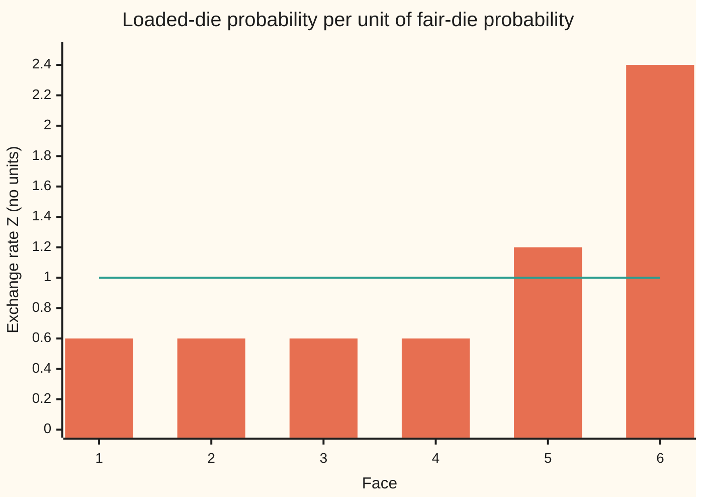
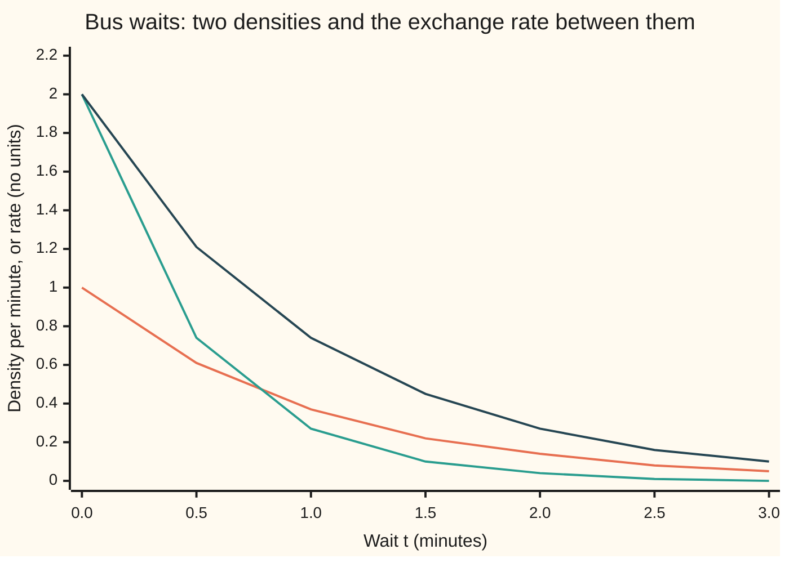

# The Radon-Nikodym derivative: an exchange rate between measures, with a chain rule and a rule for changing measure under an integral

[Syllabus](../../../SYLLABUS.md) → [Measure and integration](../../../SYLLABUS.md#w10) → [Densities and Changing Measure](../../../SYLLABUS.md#w10-s08) → The Radon-Nikodym derivative

---

## General Overview

A fair die shows each face with probability 0.1667, and its average face is 3.5. A loaded die from the same shop shows faces 1 to 4 with probability 0.1 each, face 5 with 0.2 and face 6 with 0.4. Its average face is 4.4.

That 4.4 can be reached without ever rolling the loaded die. Give each face a weight: how many times more likely the loaded die makes it than the fair one. Faces 1 to 4 get 0.60, face 5 gets 1.20, face 6 gets 2.40. Now average "face times weight" over fair rolls. The answer is 4.4 again. The weights turn fair-die averages into loaded-die averages.

Think of an exchange rate. A price list in one currency becomes a price list in another when each price is multiplied by the rate. Here the "currency" is probability: the weight at each face converts fair-die probability into loaded-die probability. From here on that weight has its proper name, the **Radon-Nikodym derivative** of the loaded die against the fair one, also called the **density** of one measure against the other.

The [The Radon-Nikodym theorem](03-radon-nikodym-theorem.md) says such a weight exists whenever one measure never gives weight where the other gives none. This card proves what the weight does. It moves any integral from one measure to the other. It chains through a third measure by multiplying. It turns round by taking the reciprocal. In probability, it turns an average under one set of odds into an average under another. Converting through a third die gives the same 4.4; converting back gives the fair 3.5.

**The Radon-Nikodym derivative is an exchange rate between two measures: multiply by it inside an integral to switch measures, multiply two of them to pass through a third, and invert it to go back.**

**What kind of fact this is:** four theorems about the derivative that the Radon-Nikodym theorem supplies, all proved on this card in Why it works.

### The picture: the exchange rate on each face



The bars are the exchange rate at each face. The flat line at 1 is the fair die measured against itself. Faces below the line lose weight under the loaded die; faces 5 and 6 gain it. Averaged over fair rolls, the bars come to exactly 1.

---

## The formula

Notation first, in words. $\Omega$ (omega) is the space of outcomes, here the six faces. $\mathcal F$ is the collection of sets we allow ourselves to measure; on a die it is all 64 sets of faces. A **measure** gives each such set a size; $\mu$ (mu), $\nu$ (nu) and $\rho$ (rho) name three of them. $P$ is the fair die, $Q$ the loaded die and $R$ a third die, loaded towards the low faces: 0.25, 0.25, 0.2, 0.1, 0.1, 0.1. $\int g\,d\mu$ is the integral of a function $g$ against $\mu$. $\nu \ll \mu$, read "$\nu$ is absolutely continuous with respect to $\mu$", means every set of $\mu$-size zero also has $\nu$-size zero. Two measures that are each absolutely continuous with respect to the other are **equivalent**.

The derivative itself, from the [The Radon-Nikodym theorem](03-radon-nikodym-theorem.md), read "the density of $\nu$ against $\mu$": the measurable function $f = \frac{d\nu}{d\mu} \ge 0$ with

$$\nu(A) = \int_A \frac{d\nu}{d\mu}\,d\mu \quad\text{for every } A \in \mathcal F .$$

It is unique almost everywhere, a.e., meaning except on a set of $\mu$-size zero.

**1. Change of measure.** For every measurable $g \ge 0$, and for every $g$ integrable against $\nu$:

$$\int_\Omega g\,d\nu \;=\; \int_\Omega g\,\frac{d\nu}{d\mu}\,d\mu .$$

**Read it aloud:** to integrate against $\nu$, integrate against $\mu$ after multiplying by the exchange rate.

**2. Chain rule.** If $\rho \ll \nu \ll \mu$:

$$\frac{d\rho}{d\mu} \;=\; \frac{d\rho}{d\nu}\,\frac{d\nu}{d\mu} \quad \mu\text{-a.e.}$$

**Read it aloud:** converting from $\mu$ to $\rho$ directly is the same as converting to $\nu$ first and then on to $\rho$.

**3. Reciprocal rule.** If $\mu$ and $\nu$ are equivalent, then $\frac{d\nu}{d\mu} > 0$ a.e. and

$$\frac{d\mu}{d\nu} \;=\; 1 \Big/ \frac{d\nu}{d\mu} \quad \text{a.e.}$$

**Read it aloud:** the rate back is one over the rate forward.

**4. Changing probability.** If $P$ and $Q$ are probabilities with $Q \ll P$, write $Z = \frac{dQ}{dP}$, and write $E_P$, $E_Q$ for the average under $P$ and under $Q$. Then $Z \ge 0$, $E_P[Z] = 1$, and for every random quantity $X$ that is non-negative or integrable against $Q$:

$$E_Q[X] \;=\; E_P[X\,Z] .$$

**Read it aloud:** an average under the new odds is an average under the old odds, with each outcome reweighted by the exchange rate.

On the die, $Z$ at a face is the loaded probability divided by 0.1667: 0.60 on faces 1 to 4, 1.20 on face 5, 2.40 on face 6. With $X$ the face shown, both sides of rule 4 are 4.4.

| Symbol | Plain meaning | In our example | Push it up and the answer… |
| --- | --- | --- | --- |
| $\Omega$, $\mathcal F$ | the outcomes; the sets allowed to be measured | faces 1 to 6; all 64 sets of faces | — |
| $\mu$, $\nu$, $\rho$ | three measures on the same sets | the fair, loaded and third dice | — |
| $P$, $Q$, $R$ | fair die, loaded die, third die | 0.1667 each; 0.1, 0.1, 0.1, 0.1, 0.2, 0.4; 0.25, 0.25, 0.2, 0.1, 0.1, 0.1 | more weight on 6 under Q raises E_Q of the face |
| $A$ | one set in the collection | faces 5 and 6 | — |
| $\ll$ | absolutely continuous: no weight where the other has none | Q ≪ P, since P misses no face | — |
| $\frac{d\nu}{d\mu}$, $f$ | the Radon-Nikodym derivative: density of ν against μ | dQ/dR on face 6 is 4.00 | a larger rate, more ν-weight per unit of μ |
| $Z$ | dQ/dP, the exchange rate from fair to loaded | 0.60, 0.60, 0.60, 0.60, 1.20, 2.40 | larger Z on 6, larger E_Q of the face |
| $Q'$, $Z'$ | a die that never shows 1; its rate dQ'/dP | 0, 0.2, 0.1, 0.1, 0.2, 0.4; Z' = 0, 1.20, 0.60, 0.60, 1.20, 2.40 | — |
| $g$, $X$ | a function being integrated; a random quantity | the face shown | — |
| $E_P$, $E_Q$, $E_R$ | averages under P, Q, R | E_P of the face 3.5, E_Q 4.4 | — |
| $\mathbf 1_A$ | indicator: one on A, zero off it | one on faces 5 and 6 | — |
| $s_n$ | simple functions rising to g, used in the proof | — | larger n, closer to g |
| $s$, $c_k$, $A_k$, $g^+$, $g^-$, $h$, $B$, $L^1$ | in the proof: a simple function, its values and the sets that carry them; the positive and negative parts of g; the rate dρ/dν; a set of waits; the functions whose absolute value has a finite integral | — | — |
| $T$, $t$ | a bus wait and a value of it, in minutes | Z(t) = 2e^(−t) | — |

### When it holds

- **Absolute continuity, $\nu \ll \mu$.** Without it no density exists. Take a die Q' with weights 0, 0.2, 0.1, 0.1, 0.2, 0.4: it never shows a 1. The fair die is not absolutely continuous with respect to Q': P gives face 1 weight 0.1667, and any density times Q'-weight 0 is 0.
- **$\mu$ σ-finite**, meaning Ω splits into countably many pieces of finite μ-size. The theorem card needs it for existence and for uniqueness a.e.; the chain and reciprocal rules lean on that uniqueness. Rule 1 alone needs only some $f \ge 0$ with $\nu(A) = \int_A f\,d\mu$.
- **For the reciprocal, equivalence in both directions.** Drop it and the rate back is infinite where the rate forward is 0. For Q', with $Z' = \frac{dQ'}{dP}$ equal to 0 at face 1, the average under Q' of face ÷ Z' over the faces where Z' > 0 is 3.3333, not 3.5.
- **Integrability for signed functions.** For $g$ of both signs the rule needs $\int \lvert g\rvert\,d\nu < \infty$; then both sides are finite and equal. Otherwise each side may read ∞ − ∞.
- **Equalities hold almost everywhere, not everywhere.** A density may be changed on a set of μ-size zero without changing any integral.

---

## Why it works

### Step 0: the definition is the rule for indicators

Take $g = \mathbf 1_A$, one on A and zero off it. Then $\int \mathbf 1_A\,d\nu = \nu(A)$, and $\int \mathbf 1_A \frac{d\nu}{d\mu}\,d\mu = \int_A \frac{d\nu}{d\mu}\,d\mu$. The definition of the derivative says these are equal. So the change-of-measure rule already holds for indicators. The integral is built from indicators in three climbs: simple functions, then non-negative functions as rising limits, then signed functions as a difference. The rule climbs with it. The chain and reciprocal rules then follow from one more fact: two densities that give the same measure agree a.e.

### Step 1: simple functions, by adding up

A **simple function** takes finitely many values, each on a measurable set: $s = \sum_k c_k \mathbf 1_{A_k}$ with $c_k \ge 0$ ([The integral of a simple function](../04-The%20Lebesgue%20Integral/01-integral-of-a-simple-function.md)). Both sides of the rule are linear in $g$: the integral of a sum is the sum of the integrals. Step 0 holds for each indicator, so it holds for every simple function.

On the die every function is simple, and the code checks the indicator case on all 64 sets of faces: $Q(A)$ equals the sum over A of Z times $P$, every time.

### Step 2: non-negative functions, by monotone convergence

Any measurable $g \ge 0$ is the rising limit of simple functions $s_1 \le s_2 \le \dots$. Then $s_n \frac{d\nu}{d\mu}$ also rises, to $g\frac{d\nu}{d\mu}$, because the density is non-negative. The monotone convergence theorem ([The monotone convergence theorem](../04-The%20Lebesgue%20Integral/03-monotone-convergence-theorem.md)) lets the limit pass inside both integrals. Step 1's equality at each stage survives the limit, the value +∞ included.

### Step 3: signed functions, by splitting

Write $g = g^+ - g^-$, its positive and negative parts. Step 2 applies to each, and gives $\int \lvert g\rvert\,d\nu = \int \lvert g\rvert \frac{d\nu}{d\mu}\,d\mu$. So $g$ is integrable against $\nu$ exactly when $g\frac{d\nu}{d\mu}$ is integrable against $\mu$ ([Integrable functions](../04-The%20Lebesgue%20Integral/04-integrable-functions-and-l1.md)). Subtract the two finite equalities. That is rule 1.

### Step 4: the chain rule, from uniqueness

Rule 1 with $g = \mathbf 1_A \frac{d\rho}{d\nu}$, a non-negative function, gives

$$\rho(A) = \int_A \frac{d\rho}{d\nu}\,d\nu = \int_A \frac{d\rho}{d\nu}\,\frac{d\nu}{d\mu}\,d\mu .$$

So the product is a density of $\rho$ against $\mu$. The derivative $\frac{d\rho}{d\mu}$ is another. Uniqueness makes them equal μ-a.e.

On the dice: $\frac{dQ}{dR}$ is 0.40, 0.40, 0.50, 1.00, 2.00, 4.00, and $\frac{dR}{dP}$ is 1.50, 1.50, 1.20, 0.60, 0.60, 0.60. Their products are 0.60, 0.60, 0.60, 0.60, 1.20, 2.40: exactly Z.

### Step 5: the reciprocal, as a chain that returns home

Run the chain rule from $\mu$ to $\nu$ and back to $\mu$. That is allowed because $\mu \ll \nu \ll \mu$:

$$\frac{d\mu}{d\mu} = \frac{d\mu}{d\nu}\,\frac{d\nu}{d\mu} \quad \mu\text{-a.e.}$$

The left side is 1, since $\mu(A) = \int_A 1\,d\mu$. A product equal to 1 has neither factor 0, so $\frac{d\nu}{d\mu} > 0$ a.e., and dividing gives rule 3. On the dice, $\frac{dP}{dQ}$ is 1.6667 on faces 1 to 4, 0.8333 on 5 and 0.4167 on 6, and each times Z is 1.

### Step 6: probability is the special case

Put $\mu = P$, $\nu = Q$, $g = X$. Rule 1 reads $E_Q[X] = E_P[XZ]$. With $X = 1$ it gives $E_P[Z] = Q(\Omega) = 1$: an exchange rate between probabilities averages 1 under the old odds. Averages are integrals ([Expectation as an integral](../04-The%20Lebesgue%20Integral/06-expectation-as-an-integral.md)), so nothing new is needed.

The same holds with a density on the line. Bus waits T, in minutes, are exponential at rate 1 under P and at rate 2 under Q. The densities are $e^{-t}$ and $2e^{-2t}$, so $Z(t) = 2e^{-t}$. Rule 4 gives $E_Q[T] = \int_0^\infty t \cdot 2e^{-t}\cdot e^{-t}\,dt$, which is 0.5, the mean wait at rate 2.

<details>
<summary>Detailed proof</summary>

**Setting.** $(\Omega, \mathcal F)$ a measurable space; $\mu$, $\nu$, $\rho$ measures on it, all σ-finite; $\nu \ll \mu$, and $f = \frac{d\nu}{d\mu}$ a non-negative measurable function with $\nu(A) = \int_A f\,d\mu$ for all $A \in \mathcal F$. Existence and uniqueness a.e. of such $f$ are the [The Radon-Nikodym theorem](03-radon-nikodym-theorem.md).

**Rule 1, indicators.** For $A \in \mathcal F$: $\int \mathbf 1_A\,d\nu = \nu(A) = \int_A f\,d\mu = \int \mathbf 1_A f\,d\mu$. The first equality is the integral of an indicator; the second is the definition of $f$; the third is what an integral over A means.

**Rule 1, simple functions.** Let $s = \sum_{k=1}^m c_k \mathbf 1_{A_k}$ with $c_k \ge 0$. The integral of a non-negative simple function is linear, and so is the integral of non-negative measurable functions. So $\int s\,d\nu = \sum_k c_k \nu(A_k) = \sum_k c_k \int \mathbf 1_{A_k} f\,d\mu = \int s f\,d\mu$.

**Rule 1, non-negative functions.** Let $g \ge 0$ be measurable. The simple-approximation theorem gives simple $0 \le s_1 \le s_2 \le \dots$ with $s_n \to g$ pointwise. Since $f \ge 0$, $s_n f$ rises to $g f$ pointwise. Monotone convergence, applied once against $\nu$ and once against $\mu$: $\int g\,d\nu = \lim_n \int s_n\,d\nu = \lim_n \int s_n f\,d\mu = \int g f\,d\mu$, both sides possibly $+\infty$.

**Rule 1, integrable functions.** Let $g$ be measurable. Applying the previous paragraph to $\lvert g\rvert$ gives $\int \lvert g\rvert\,d\nu = \int \lvert g\rvert f\,d\mu$, so $g \in L^1(\nu)$ exactly when $g f \in L^1(\mu)$. In that case, apply it to $g^+$ and $g^-$: both equalities are between finite numbers, and $(g f)^\pm = g^\pm f$ because $f \ge 0$. Subtract: $\int g\,d\nu = \int g f\,d\mu$.

**Rule 2.** Suppose $\rho \ll \nu \ll \mu$. Then $\rho \ll \mu$, since a μ-null set is ν-null and so ρ-null. Let $h = \frac{d\rho}{d\nu}$. For $A \in \mathcal F$, apply rule 1 to the non-negative function $\mathbf 1_A h$: $\rho(A) = \int \mathbf 1_A h\,d\nu = \int \mathbf 1_A h f\,d\mu$. So $h f$ is a non-negative measurable function whose integrals over every set give $\rho$. By uniqueness in the Radon-Nikodym theorem, $h f = \frac{d\rho}{d\mu}$ μ-a.e.

**Rule 3.** Suppose also $\mu \ll \nu$. Take $\rho = \mu$ in rule 2, with the chain $\mu \ll \nu \ll \mu$: $\frac{d\mu}{d\nu} f = \frac{d\mu}{d\mu}$ μ-a.e. The constant 1 satisfies $\mu(A) = \int_A 1\,d\mu$, so by uniqueness $\frac{d\mu}{d\mu} = 1$ μ-a.e. Hence $\frac{d\mu}{d\nu} \cdot f = 1$ off a set of μ-size zero. Off that set neither factor is 0, so $f > 0$ and $\frac{d\mu}{d\nu} = 1/f$. That set also has ν-size zero, since $\nu \ll \mu$; so the equality holds ν-a.e. as well.

**Rule 4.** Take $\mu = P$, $\nu = Q$, $Z = f$. $Z \ge 0$ by the theorem. Rule 1 with $g = 1$ gives $E_P[Z] = \int Z\,dP = Q(\Omega) = 1$, so $Z$ is integrable and finite a.e. Rule 1 with $g = X$ gives $E_Q[X] = E_P[XZ]$ for $X \ge 0$, and for $X$ integrable against $Q$, in which case $X\,Z$ is integrable against $P$.

**The bus waits.** Under P, T has density $e^{-t}$ against length on $[0, \infty)$; under Q, $2e^{-2t}$. For a Borel set B of waits, $Q(T \in B) = \int_B 2e^{-2t}\,dt = \int_B 2e^{-t}\,e^{-t}\,dt$, so $2e^{-t}$ is the density of the law of T under Q against its law under P. Rule 1 on the line: $E_Q[T] = \int_0^\infty t\,2e^{-t}e^{-t}\,dt = 2\int_0^\infty t e^{-2t}\,dt = 2 \cdot \tfrac14 = \tfrac12$.

</details>

On a finite space all four rules have a shorter road: every measure is a list of weights and each derivative is a ratio of weights, so rule 1 is a rearranged sum and rule 2 is cancelling a fraction. The proof above is what survives on a line, where single points carry no weight to divide. Densities against length, and the ratio of two of them, are [Densities and likelihood ratios](06-densities-and-likelihood-ratios.md).

---

## Worked numbers, by hand

| Step | Arithmetic | Value |
| --- | --- | --- |
| Z on faces 1 to 4 | 0.1 ÷ 0.1667, which is 0.1 × 6 | 0.60 |
| Z on face 5 | 0.2 × 6 | 1.20 |
| Z on face 6 | 0.4 × 6 | 2.40 |
| E_P[Z] | (0.60 × 4 + 1.20 + 2.40) ÷ 6 | 1 |
| E_Q of the face, directly | 0.1 × (1 + 2 + 3 + 4) + 0.2 × 5 + 0.4 × 6 | 4.4 |
| E_P of face × Z | (0.60 × (1 + 2 + 3 + 4) + 1.20 × 5 + 2.40 × 6) ÷ 6 | 4.4 |
| dQ/dR | 0.1 ÷ 0.25, 0.1 ÷ 0.25, 0.1 ÷ 0.2, 0.1 ÷ 0.1, 0.2 ÷ 0.1, 0.4 ÷ 0.1 | 0.40, 0.40, 0.50, 1.00, 2.00, 4.00 |
| dR/dP | 0.25 × 6, 0.25 × 6, 0.2 × 6, then 0.1 × 6 three times | 1.50, 1.50, 1.20, 0.60, 0.60, 0.60 |
| chain, dQ/dR × dR/dP | 0.40 × 1.50, 0.50 × 1.20, 1.00 × 0.60, 2.00 × 0.60, 4.00 × 0.60 | 0.60, 0.60, 0.60, 0.60, 1.20, 2.40 = Z |
| E_Q of face × dP/dQ | each face gets Q-weight × (1 ÷ Z) = 0.1667 | **3.5** |
| E_R of face × dQ/dR, through R | R-weight × dQ/dR is Q-weight on each face, so this is the direct sum | **4.4** |

The loaded die averages 4.4 per roll, and the fair die's rolls, reweighted by the exchange rate, say the same; turning the rate round recovers the fair die's 3.5.

The bus waits give the same shape of answer: $E_P[T\,Z]$ with $Z(t) = 2e^{-t}$ is 0.5, the mean wait at rate 2. The code reaches 0.5 by Simpson's rule and by 200000 weighted draws.



The first line is the rate-1 density under P, the second the rate-2 density under Q, the third the exchange rate Z(t) = 2e^(−t), their ratio. Z is above 1 for short waits, where Q puts more weight, and below 1 for long ones.

### What breaks if you drop a piece

| Mistake | Comes out at | What went wrong |
| --- | --- | --- |
| Exchange rate forgotten: average the face under P | 3.5, not 4.4 | That is the fair die's average |
| Rate applied under Q instead of P | 7.56, above the top face 6 | The loaded weights are counted twice |
| Reciprocal without equivalence: Q' never shows 1 | 3.3333, not 3.5 | 1/Z' is infinite at face 1; dropping it loses P's weight 0.1667 there |
| Density of P against Q' | f(1) × 0 = 0 for f(1) = 1, 10, 1000; P needs 0.1667 | P is not ≪ Q': no density exists |

---

## Code, from first principles, and it actually runs

Python works in exact fractions from the standard library; Rust writes its own fractions on small integers. Four roads reach the loaded die's 4.4: the direct sum under Q, the exchange rate under P, the chain through the third die R, and 200000 fair rolls reweighted by Z, set beside 200000 loaded rolls averaged plainly. On a die the rate, chain and reciprocal roads are the direct sum again once each ratio cancels against its weight, so their asserts pass for any dice: they check the wiring, not the numbers. The independent checks are the direct sum against 22/5, each face's rate and rate back against the hand values of the worked numbers, the draws, and Simpson's rule. The rolls come from SplitMix64, a short random-number generator written out in both languages with seed 2026, so both print the same draws. The bus waits take three roads to 0.5: Simpson's rule on the rate-2 density, Simpson's rule on the reweighted rate-1 density, and weighted rate-1 draws. The code checks instances on one die and one pair of bus laws; only the proof covers every σ-finite measure space.

### Python

```python
# The Radon-Nikodym derivative -- the check behind the card.  Standard library
# only.  A fair die P, a loaded die Q and a third die R, in exact fractions:
# the exchange rate Z = dQ/dP, the change-of-measure rule, the chain rule
# through R and the reciprocal rule back.  Then two roads that share none of
# that arithmetic: SplitMix64 rolls (seed 2026), and the bus-wait companion
# (waits exponential at rate 1 under P, rate 2 under Q) by Simpson's rule and
# by weighted draws.  Last, the four mistakes of the card, each computed.
from fractions import Fraction as F
import math

FACES = [1, 2, 3, 4, 5, 6]
P = [F(1, 6)] * 6
Q = [F(1, 10)] * 4 + [F(2, 10), F(4, 10)]
R = [F(1, 4), F(1, 4), F(2, 10), F(1, 10), F(1, 10), F(1, 10)]
Q0 = [F(0), F(2, 10), F(1, 10), F(1, 10), F(2, 10), F(4, 10)]  # never shows a 1

def rate(nu, mu):                  # d nu / d mu on a die: weight over weight
    return [n / m for n, m in zip(nu, mu)]

def mean(weights, values):         # the integral of values against weights
    return sum(w * v for w, v in zip(weights, values))

def show(x):
    return f"{x} = {float(x):.4f}" if x.denominator > 1 else f"{x}"

Z, ZQR, ZRP = rate(Q, P), rate(Q, R), rate(R, P)
ZPQ = rate(P, Q)
events = [[i for i in range(6) if mask >> i & 1] for mask in range(64)]
every_event = all(sum(Q[i] for i in A) == sum(Z[i] * P[i] for i in A) for A in events)
direct = mean(Q, FACES)
changed = mean(P, [f * z for f, z in zip(FACES, Z)])
chain = [a * b for a, b in zip(ZQR, ZRP)]
via_r = mean(R, [f * z for f, z in zip(FACES, ZQR)])
back = mean(Q, [f * z for f, z in zip(FACES, ZPQ)])

print(f"dice as decimals: P {float(P[0]):.4f} each; Q {', '.join(str(float(x)) for x in Q)}; "
      f"R {', '.join(str(float(x)) for x in R)}")
print("face | P | Q | R | Z = dQ/dP | dQ/dR | dR/dP | dP/dQ")
for i in range(6):
    print(f"{FACES[i]} | {P[i]} | {Q[i]} | {R[i]} | {float(Z[i]):.2f} | "
          f"{float(ZQR[i]):.2f} | {float(ZRP[i]):.2f} | {float(ZPQ[i]):.4f}")
print("figure, Z per face:", ", ".join(f"{float(z):.2f}" for z in Z))
print(f"Q(A) equals the sum over A of Z times P, for all {len(events)} events A:",
      "yes" if every_event else "no")
print(f"E_P[Z] = {mean(P, Z)}")
print(f"E_Q[face], directly: {show(direct)}")
print(f"E_P[face x Z], by the change of measure: {show(changed)}")
print("chain: dQ/dR x dR/dP equals dQ/dP on every face:", "yes" if chain == Z else "no")
print(f"E_R[face x dQ/dR], through the third die: {show(via_r)}")
print("reciprocal: dP/dQ x dQ/dP on the six faces:", ", ".join(str(a * b) for a, b in zip(ZPQ, Z)))
print(f"E_Q[dP/dQ] = {mean(Q, ZPQ)}; E_Q[face x dP/dQ] = {show(back)}; "
      f"E_P[face] = {show(mean(P, FACES))}")

state = 2026
def uniform():                     # SplitMix64, written out; 53 bits into [0, 1)
    global state
    state = (state + 0x9E3779B97F4A7C15) % 2**64
    z = state
    z = (z ^ (z >> 30)) * 0xBF58476D1CE4E5B9 % 2**64
    z = (z ^ (z >> 27)) * 0x94D049BB133111EB % 2**64
    return ((z ^ (z >> 31)) >> 11) / 2.0**53

N = 200000
zf = [float(z) for z in Z]
cum = [sum(float(q) for q in Q[:k + 1]) for k in range(6)]
s1 = s2 = s3 = s4 = 0.0
for _ in range(N):
    face = int(6 * uniform()) + 1  # a fair roll, weighted by the exchange rate
    w = face * zf[face - 1]
    s1 += w
    s2 += w * w
    u = uniform()                  # a loaded roll, by its cumulative weights
    f = next(k + 1 for k in range(6) if u < cum[k] or k == 5)
    s3 += f
    s4 += f * f
m1, m3 = s1 / N, s3 / N
se1 = math.sqrt((s2 / N - m1 * m1) / N)
se3 = math.sqrt((s4 / N - m3 * m3) / N)
print(f"draws, seed 2026: {N} fair rolls, mean of face x Z = {m1:.4f} (s.e. {se1:.4f})")
print(f"draws: {N} loaded rolls, mean face = {m3:.4f} (s.e. {se3:.4f})")

def simpson(g, a, b, n):           # Simpson's rule, n even
    h = (b - a) / n
    s = g(a) + g(b) + sum((4 if k % 2 else 2) * g(a + k * h) for k in range(1, n))
    return s * h / 3

zb = lambda t: 2 * math.exp(-t)    # bus: dQ/dP at wait t minutes
pb = lambda t: math.exp(-t)
ez = simpson(lambda t: zb(t) * pb(t), 0.0, 40.0, 4000)
et = simpson(lambda t: t * zb(t) * pb(t), 0.0, 40.0, 4000)
eq = simpson(lambda t: t * 2 * math.exp(-2 * t), 0.0, 40.0, 4000)
sw = sw2 = 0.0
for _ in range(N):
    t = -math.log(1.0 - uniform())  # a rate-1 wait, weighted by the exchange rate
    w = t * zb(t)
    sw += w
    sw2 += w * w
mw = sw / N
sew = math.sqrt((sw2 / N - mw * mw) / N)
print(f"bus: E_P[Z] by Simpson = {ez:.6f}")
print(f"bus: E_Q[T] by Simpson on the rate-2 density = {eq:.6f}; exact 1/2")
print(f"bus: E_P[T x Z] by Simpson = {et:.6f}")
print(f"bus: {N} rate-1 draws, mean of T x Z = {mw:.4f} (s.e. {sew:.4f})")
ts = [0.5 * k for k in range(7)]
print("figure, t:", ", ".join(f"{t:.1f}" for t in ts))
print("figure, P density:", ", ".join(f"{pb(t):.2f}" for t in ts))
print("figure, Q density:", ", ".join(f"{2 * math.exp(-2 * t):.2f}" for t in ts))
print("figure, Z(t):", ", ".join(f"{zb(t):.2f}" for t in ts))

forgot = mean(P, FACES)
twice = mean(Q, [f * z for f, z in zip(FACES, Z)])
Z0 = rate(Q0, P)
dropped = sum(Q0[i] * FACES[i] / Z0[i] for i in range(6) if Z0[i] > 0)
print(f"mistake 1, Z forgotten: E_P[face] = {show(forgot)}, not 22/5")
print(f"mistake 2, Z applied under Q: E_Q[face x Z] = {show(twice)}, above the top face")
print(f"mistake 3, Q' never shows 1, Z' = {', '.join(str(z) for z in Z0)}: "
      f"sum of face / Z' under Q' = {show(dropped)}, not 7/2")
tries = [F(1), F(10), F(1000)]
print(f"mistake 4, P not << Q': P({{1}}) = {P[0]}, but f(1) x Q'({{1}}) for f(1) = 1, 10, 1000:",
      ", ".join(str(f * Q0[0]) for f in tries))

assert every_event and direct == F(22, 5)                     # exact: Q(A) on all 64 events
assert Z == [F(3, 5)] * 4 + [F(6, 5), F(12, 5)]               # each rate against the hand value
assert ZPQ == [F(5, 3)] * 4 + [F(5, 6), F(5, 12)]             # each rate back against the hand value
assert changed == direct and mean(P, Z) == 1                  # change of measure; Z averages 1
assert chain == Z and via_r == direct and back == forgot      # chain through R; reciprocal back
assert abs(m1 - 4.4) < 4 * se1 and abs(m3 - 4.4) < 4 * se3  # draws against the exact answer
assert abs(et - 0.5) < 1e-6 and abs(mw - 0.5) < 4 * sew      # bus: Simpson and draws against 1/2
assert abs(eq - 0.5) < 1e-6 and abs(ez - 1) < 1e-6           # bus: rate-2 mean; Z averages 1
assert twice == F(189, 25) and dropped == F(10, 3)            # the mistakes, exactly
print("ALL CHECKS PASS")
```

**Ran 2026-09-29 on macOS, Python 3.14.6, standard library only. All checks passed. Output, pasted from the run:**

```
dice as decimals: P 0.1667 each; Q 0.1, 0.1, 0.1, 0.1, 0.2, 0.4; R 0.25, 0.25, 0.2, 0.1, 0.1, 0.1
face | P | Q | R | Z = dQ/dP | dQ/dR | dR/dP | dP/dQ
1 | 1/6 | 1/10 | 1/4 | 0.60 | 0.40 | 1.50 | 1.6667
2 | 1/6 | 1/10 | 1/4 | 0.60 | 0.40 | 1.50 | 1.6667
3 | 1/6 | 1/10 | 1/5 | 0.60 | 0.50 | 1.20 | 1.6667
4 | 1/6 | 1/10 | 1/10 | 0.60 | 1.00 | 0.60 | 1.6667
5 | 1/6 | 1/5 | 1/10 | 1.20 | 2.00 | 0.60 | 0.8333
6 | 1/6 | 2/5 | 1/10 | 2.40 | 4.00 | 0.60 | 0.4167
figure, Z per face: 0.60, 0.60, 0.60, 0.60, 1.20, 2.40
Q(A) equals the sum over A of Z times P, for all 64 events A: yes
E_P[Z] = 1
E_Q[face], directly: 22/5 = 4.4000
E_P[face x Z], by the change of measure: 22/5 = 4.4000
chain: dQ/dR x dR/dP equals dQ/dP on every face: yes
E_R[face x dQ/dR], through the third die: 22/5 = 4.4000
reciprocal: dP/dQ x dQ/dP on the six faces: 1, 1, 1, 1, 1, 1
E_Q[dP/dQ] = 1; E_Q[face x dP/dQ] = 7/2 = 3.5000; E_P[face] = 7/2 = 3.5000
draws, seed 2026: 200000 fair rolls, mean of face x Z = 4.3780 (s.e. 0.0107)
draws: 200000 loaded rolls, mean face = 4.4009 (s.e. 0.0039)
bus: E_P[Z] by Simpson = 1.000000
bus: E_Q[T] by Simpson on the rate-2 density = 0.500000; exact 1/2
bus: E_P[T x Z] by Simpson = 0.500000
bus: 200000 rate-1 draws, mean of T x Z = 0.4997 (s.e. 0.0005)
figure, t: 0.0, 0.5, 1.0, 1.5, 2.0, 2.5, 3.0
figure, P density: 1.00, 0.61, 0.37, 0.22, 0.14, 0.08, 0.05
figure, Q density: 2.00, 0.74, 0.27, 0.10, 0.04, 0.01, 0.00
figure, Z(t): 2.00, 1.21, 0.74, 0.45, 0.27, 0.16, 0.10
mistake 1, Z forgotten: E_P[face] = 7/2 = 3.5000, not 22/5
mistake 2, Z applied under Q: E_Q[face x Z] = 189/25 = 7.5600, above the top face
mistake 3, Q' never shows 1, Z' = 0, 6/5, 3/5, 3/5, 6/5, 12/5: sum of face / Z' under Q' = 10/3 = 3.3333, not 7/2
mistake 4, P not << Q': P({1}) = 1/6, but f(1) x Q'({1}) for f(1) = 1, 10, 1000: 0, 0, 0
ALL CHECKS PASS
```

### Rust

Same numbers, same labels, built with `rustc --edition 2021 -O`.

```rust
// The Radon-Nikodym derivative -- the same check as the Python, in Rust.  No
// crates.  Exact fractions are done by hand on small integers: a fair die P, a
// loaded die Q, a third die R, the exchange rate Z = dQ/dP, the change of
// measure, the chain rule through R and the reciprocal rule back.  Then
// SplitMix64 rolls (seed 2026), and the bus-wait companion (rate 1 under P,
// rate 2 under Q) by Simpson's rule and by weighted draws, then the mistakes.
#[derive(Clone, Copy, PartialEq)]
struct Fr { n: i64, d: i64 }

fn gcd(a: i64, b: i64) -> i64 { if b == 0 { a.abs() } else { gcd(b, a % b) } }
fn fr(n: i64, d: i64) -> Fr {
    let g = gcd(n, d).max(1);
    let s = if d < 0 { -1 } else { 1 };
    Fr { n: s * n / g, d: s * d / g }
}
fn add(a: Fr, b: Fr) -> Fr { fr(a.n * b.d + b.n * a.d, a.d * b.d) }
fn mul(a: Fr, b: Fr) -> Fr { fr(a.n * b.n, a.d * b.d) }
fn div(a: Fr, b: Fr) -> Fr { fr(a.n * b.d, a.d * b.n) }
fn fl(a: Fr) -> f64 { a.n as f64 / a.d as f64 }
fn st(a: Fr) -> String { if a.d == 1 { format!("{}", a.n) } else { format!("{}/{}", a.n, a.d) } }
fn show(a: Fr) -> String { if a.d > 1 { format!("{} = {:.4}", st(a), fl(a)) } else { st(a) } }
fn rate(nu: &[Fr], mu: &[Fr]) -> Vec<Fr> { nu.iter().zip(mu).map(|(&n, &m)| div(n, m)).collect() }
fn mean(w: &[Fr], v: &[Fr]) -> Fr { w.iter().zip(v).fold(fr(0, 1), |s, (&a, &b)| add(s, mul(a, b))) }
fn times(a: &[Fr], b: &[Fr]) -> Vec<Fr> { a.iter().zip(b).map(|(&x, &y)| mul(x, y)).collect() }
fn join(v: &[String]) -> String { v.join(", ") }

struct Rng(u64);
impl Rng {                                  // SplitMix64, written out; 53 bits into [0, 1)
    fn uniform(&mut self) -> f64 {
        self.0 = self.0.wrapping_add(0x9E3779B97F4A7C15);
        let mut z = self.0;
        z = (z ^ (z >> 30)).wrapping_mul(0xBF58476D1CE4E5B9);
        z = (z ^ (z >> 27)).wrapping_mul(0x94D049BB133111EB);
        ((z ^ (z >> 31)) >> 11) as f64 / 9007199254740992.0
    }
}

fn simpson(g: &dyn Fn(f64) -> f64, a: f64, b: f64, n: usize) -> f64 {
    let h = (b - a) / n as f64;
    let mut inner = 0.0;
    for k in 1..n { inner += (if k % 2 == 1 { 4.0 } else { 2.0 }) * g(a + k as f64 * h) }
    (g(a) + g(b) + inner) * h / 3.0
}

fn main() {
    let faces: Vec<Fr> = (1..=6).map(|k| fr(k, 1)).collect();
    let p = vec![fr(1, 6); 6];
    let q = vec![fr(1, 10), fr(1, 10), fr(1, 10), fr(1, 10), fr(2, 10), fr(4, 10)];
    let r = vec![fr(1, 4), fr(1, 4), fr(2, 10), fr(1, 10), fr(1, 10), fr(1, 10)];
    let q0 = vec![fr(0, 1), fr(2, 10), fr(1, 10), fr(1, 10), fr(2, 10), fr(4, 10)]; // never a 1
    let (z, zqr, zrp, zpq) = (rate(&q, &p), rate(&q, &r), rate(&r, &p), rate(&p, &q));
    let every_event = (0..64u32).all(|mask| {
        let a: Vec<usize> = (0..6).filter(|i| mask >> i & 1 == 1).collect();
        a.iter().fold(fr(0, 1), |s, &i| add(s, q[i])) == a.iter().fold(fr(0, 1), |s, &i| add(s, mul(z[i], p[i])))
    });
    let direct = mean(&q, &faces);
    let changed = mean(&p, &times(&faces, &z));
    let chain = times(&zqr, &zrp);
    let via_r = mean(&r, &times(&faces, &zqr));
    let back = mean(&q, &times(&faces, &zpq));
    let dec = |v: &[Fr]| join(&v.iter().map(|&x| format!("{:?}", fl(x))).collect::<Vec<_>>());
    println!("dice as decimals: P {:.4} each; Q {}; R {}", fl(p[0]), dec(&q), dec(&r));
    println!("face | P | Q | R | Z = dQ/dP | dQ/dR | dR/dP | dP/dQ");
    for i in 0..6 {
        println!("{} | {} | {} | {} | {:.2} | {:.2} | {:.2} | {:.4}", i + 1, st(p[i]), st(q[i]), st(r[i]),
                 fl(z[i]), fl(zqr[i]), fl(zrp[i]), fl(zpq[i]));
    }
    println!("figure, Z per face: {}", join(&z.iter().map(|&x| format!("{:.2}", fl(x))).collect::<Vec<_>>()));
    println!("Q(A) equals the sum over A of Z times P, for all 64 events A: {}", if every_event { "yes" } else { "no" });
    println!("E_P[Z] = {}", st(mean(&p, &z)));
    println!("E_Q[face], directly: {}", show(direct));
    println!("E_P[face x Z], by the change of measure: {}", show(changed));
    println!("chain: dQ/dR x dR/dP equals dQ/dP on every face: {}", if chain == z { "yes" } else { "no" });
    println!("E_R[face x dQ/dR], through the third die: {}", show(via_r));
    println!("reciprocal: dP/dQ x dQ/dP on the six faces: {}", join(&times(&zpq, &z).iter().map(|&x| st(x)).collect::<Vec<_>>()));
    let forgot = mean(&p, &faces);
    println!("E_Q[dP/dQ] = {}; E_Q[face x dP/dQ] = {}; E_P[face] = {}", st(mean(&q, &zpq)), show(back), show(forgot));

    let n = 200000usize;
    let mut rng = Rng(2026);
    let zf: Vec<f64> = z.iter().map(|&x| fl(x)).collect();
    let mut cum = vec![0.0f64; 6];
    let mut acc = 0.0;
    for k in 0..6 { acc += fl(q[k]); cum[k] = acc; }
    let (mut s1, mut s2, mut s3, mut s4) = (0.0, 0.0, 0.0, 0.0);
    for _ in 0..n {
        let face = (6.0 * rng.uniform()) as usize + 1;   // a fair roll, weighted by the exchange rate
        let w = face as f64 * zf[face - 1];
        s1 += w;
        s2 += w * w;
        let u = rng.uniform();                           // a loaded roll, by its cumulative weights
        let f = (0..6).find(|&k| u < cum[k] || k == 5).unwrap() as f64 + 1.0;
        s3 += f;
        s4 += f * f;
    }
    let nf = n as f64;
    let (m1, m3) = (s1 / nf, s3 / nf);
    let se1 = ((s2 / nf - m1 * m1) / nf).sqrt();
    let se3 = ((s4 / nf - m3 * m3) / nf).sqrt();
    println!("draws, seed 2026: {} fair rolls, mean of face x Z = {:.4} (s.e. {:.4})", n, m1, se1);
    println!("draws: {} loaded rolls, mean face = {:.4} (s.e. {:.4})", n, m3, se3);

    let zb = |t: f64| 2.0 * (-t).exp();              // bus: dQ/dP at wait t minutes
    let pb = |t: f64| (-t).exp();
    let ez = simpson(&|t| zb(t) * pb(t), 0.0, 40.0, 4000);
    let et = simpson(&|t| t * zb(t) * pb(t), 0.0, 40.0, 4000);
    let eq = simpson(&|t| t * 2.0 * (-2.0 * t).exp(), 0.0, 40.0, 4000);
    let (mut sw, mut sw2) = (0.0, 0.0);
    for _ in 0..n {
        let t = -(1.0 - rng.uniform()).ln();         // a rate-1 wait, weighted by the exchange rate
        let w = t * zb(t);
        sw += w;
        sw2 += w * w;
    }
    let mw = sw / nf;
    let sew = ((sw2 / nf - mw * mw) / nf).sqrt();
    println!("bus: E_P[Z] by Simpson = {:.6}", ez);
    println!("bus: E_Q[T] by Simpson on the rate-2 density = {:.6}; exact 1/2", eq);
    println!("bus: E_P[T x Z] by Simpson = {:.6}", et);
    println!("bus: {} rate-1 draws, mean of T x Z = {:.4} (s.e. {:.4})", n, mw, sew);
    let ts: Vec<f64> = (0..7).map(|k| 0.5 * k as f64).collect();
    let row = |g: &dyn Fn(f64) -> f64, dp: usize| join(&ts.iter().map(|&t| format!("{:.*}", dp, g(t))).collect::<Vec<_>>());
    println!("figure, t: {}", row(&|t| t, 1));
    println!("figure, P density: {}", row(&pb, 2));
    println!("figure, Q density: {}", row(&|t| 2.0 * (-2.0 * t).exp(), 2));
    println!("figure, Z(t): {}", row(&zb, 2));

    let twice = mean(&q, &times(&faces, &z));
    let z0 = rate(&q0, &p);
    let dropped = (0..6).filter(|&i| z0[i].n > 0).fold(fr(0, 1), |s, i| add(s, div(mul(q0[i], faces[i]), z0[i])));
    println!("mistake 1, Z forgotten: E_P[face] = {}, not 22/5", show(forgot));
    println!("mistake 2, Z applied under Q: E_Q[face x Z] = {}, above the top face", show(twice));
    println!("mistake 3, Q' never shows 1, Z' = {}: sum of face / Z' under Q' = {}, not 7/2",
             join(&z0.iter().map(|&x| st(x)).collect::<Vec<_>>()), show(dropped));
    let tries = [fr(1, 1), fr(10, 1), fr(1000, 1)];
    println!("mistake 4, P not << Q': P({{1}}) = {}, but f(1) x Q'({{1}}) for f(1) = 1, 10, 1000: {}",
             st(p[0]), join(&tries.iter().map(|&f| st(mul(f, q0[0]))).collect::<Vec<_>>()));

    assert!(every_event && direct == fr(22, 5));                // exact: Q(A) on all 64 events
    assert!(z == vec![fr(3, 5), fr(3, 5), fr(3, 5), fr(3, 5), fr(6, 5), fr(12, 5)]);   // each rate against the hand value
    assert!(zpq == vec![fr(5, 3), fr(5, 3), fr(5, 3), fr(5, 3), fr(5, 6), fr(5, 12)]); // each rate back against the hand value
    assert!(changed == direct && mean(&p, &z) == fr(1, 1));     // change of measure; Z averages 1
    assert!(chain == z && via_r == direct && back == forgot);   // chain through R; reciprocal back
    assert!((m1 - 4.4).abs() < 4.0 * se1 && (m3 - 4.4).abs() < 4.0 * se3); // draws against the exact answer
    assert!((et - 0.5).abs() < 1e-6 && (mw - 0.5).abs() < 4.0 * sew);      // bus: Simpson and draws against 1/2
    assert!((eq - 0.5).abs() < 1e-6 && (ez - 1.0).abs() < 1e-6);   // bus: rate-2 mean; Z averages 1
    assert!(twice == fr(189, 25) && dropped == fr(10, 3));      // the mistakes, exactly
    println!("ALL CHECKS PASS");
}
```

**Ran 2026-09-29 on macOS, rustc 1.98.1, no crates. All checks passed. Output, pasted from the run:**

```
dice as decimals: P 0.1667 each; Q 0.1, 0.1, 0.1, 0.1, 0.2, 0.4; R 0.25, 0.25, 0.2, 0.1, 0.1, 0.1
face | P | Q | R | Z = dQ/dP | dQ/dR | dR/dP | dP/dQ
1 | 1/6 | 1/10 | 1/4 | 0.60 | 0.40 | 1.50 | 1.6667
2 | 1/6 | 1/10 | 1/4 | 0.60 | 0.40 | 1.50 | 1.6667
3 | 1/6 | 1/10 | 1/5 | 0.60 | 0.50 | 1.20 | 1.6667
4 | 1/6 | 1/10 | 1/10 | 0.60 | 1.00 | 0.60 | 1.6667
5 | 1/6 | 1/5 | 1/10 | 1.20 | 2.00 | 0.60 | 0.8333
6 | 1/6 | 2/5 | 1/10 | 2.40 | 4.00 | 0.60 | 0.4167
figure, Z per face: 0.60, 0.60, 0.60, 0.60, 1.20, 2.40
Q(A) equals the sum over A of Z times P, for all 64 events A: yes
E_P[Z] = 1
E_Q[face], directly: 22/5 = 4.4000
E_P[face x Z], by the change of measure: 22/5 = 4.4000
chain: dQ/dR x dR/dP equals dQ/dP on every face: yes
E_R[face x dQ/dR], through the third die: 22/5 = 4.4000
reciprocal: dP/dQ x dQ/dP on the six faces: 1, 1, 1, 1, 1, 1
E_Q[dP/dQ] = 1; E_Q[face x dP/dQ] = 7/2 = 3.5000; E_P[face] = 7/2 = 3.5000
draws, seed 2026: 200000 fair rolls, mean of face x Z = 4.3780 (s.e. 0.0107)
draws: 200000 loaded rolls, mean face = 4.4009 (s.e. 0.0039)
bus: E_P[Z] by Simpson = 1.000000
bus: E_Q[T] by Simpson on the rate-2 density = 0.500000; exact 1/2
bus: E_P[T x Z] by Simpson = 0.500000
bus: 200000 rate-1 draws, mean of T x Z = 0.4997 (s.e. 0.0005)
figure, t: 0.0, 0.5, 1.0, 1.5, 2.0, 2.5, 3.0
figure, P density: 1.00, 0.61, 0.37, 0.22, 0.14, 0.08, 0.05
figure, Q density: 2.00, 0.74, 0.27, 0.10, 0.04, 0.01, 0.00
figure, Z(t): 2.00, 1.21, 0.74, 0.45, 0.27, 0.16, 0.10
mistake 1, Z forgotten: E_P[face] = 7/2 = 3.5000, not 22/5
mistake 2, Z applied under Q: E_Q[face x Z] = 189/25 = 7.5600, above the top face
mistake 3, Q' never shows 1, Z' = 0, 6/5, 3/5, 3/5, 6/5, 12/5: sum of face / Z' under Q' = 10/3 = 3.3333, not 7/2
mistake 4, P not << Q': P({1}) = 1/6, but f(1) x Q'({1}) for f(1) = 1, 10, 1000: 0, 0, 0
ALL CHECKS PASS
```

The two outputs match line for line, the random draws included.

> [!TIP]
> **Try changing**
> Guess first, then run it.
> - **A fair Q.** Set `Q` to six copies of `F(1, 6)`. Every rate becomes 1 and E_Q of the face falls to 3.5; the first assert stops the run, since it expects 22/5.
> - **A third die that misses face 6.** Set `R` to `[F(3, 10), F(3, 10), F(2, 10), F(1, 10), F(1, 10), F(0)]`. Python stops with a division by zero at face 6: Q is not ≪ R, so dQ/dR does not exist and the chain has no middle link.
> - **A faster bus under Q.** Change `zb` to `3 * math.exp(-2 * t)`, the rate from rate 1 to rate 3. The reweighted mean falls below 0.5 and the bus assert stops the run.
> - **Another seed.** Set `state = 7`. The draw averages move in the second or third decimal, and stay within four standard errors of 4.4 and 0.5; the label still reads 2026, since it is fixed text.

---

## The usual mistake

> [!warning]
> **Using the rate on the wrong side.** $Z = \frac{dQ}{dP}$ converts P-weight into Q-weight, so it multiplies inside an average under P. Inside an average under Q it counts the loading twice: $E_Q[\text{face} \times Z]$ is 7.56, above the largest face. To go from Q back to P, use $\frac{dP}{dQ}$.
>
> - **Taking Z for a probability.** It is a rate. It reaches 2.40 on face 6 and 2.00 at a zero-minute wait; what it satisfies is $E_P[Z] = 1$.
> - **Inverting without equivalence.** Against Q', which never shows 1, the rate 1/Z' is infinite at face 1; skipping that face gives 3.3333 in place of 3.5.
> - **Assuming a density always exists.** P against Q' has none: at face 1 any value times 0 is 0, and P needs 0.1667.
> - **Reading "a.e." as "everywhere".** Two versions of a density may differ on a set of size zero; only integrals over sets are pinned down.

---

## Where you meet it in real life

- **Simulating rare events.** Importance sampling draws from convenient odds and reweights each draw by the exchange rate to the odds of interest, exactly as the code's weighted fair rolls do. It is how rare losses and rare failures are estimated without waiting for them.
- **Statistics.** The ratio of two models' densities at the observed data is the likelihood ratio, the basis of the strongest tests: [Densities and likelihood ratios](06-densities-and-likelihood-ratios.md).
- **Conditional averages.** An average given partial information is defined as a Radon-Nikodym derivative of one measure on the coarser sets against another: [Conditional expectation on a sigma-algebra](../09-Conditional%20Expectation/02-conditional-expectation-on-a-sigma-algebra.md). Switching such an average to new odds reweights it by Z (abstract Bayes): [Conditioning on a random variable](../09-Conditional%20Expectation/05-conditioning-on-a-random-variable.md).
- **Pricing.** A price is one average taken under odds chosen for pricing, reached from real-world odds by an exchange rate: [Changing the measure](../../11-Stochastic%20processes%20and%20calculus/07-Changing%20Measure/01-change-of-measure-and-density-processes.md).

> **Say it back**
> When one measure gives no weight where another gives none, there is a function that converts the second into the first, set by set. Multiplying by it inside an integral changes the measure the integral is taken against. Converting through a middle measure multiplies two such rates, and converting back takes the reciprocal, provided both directions have no weight where the other has none. For probabilities, the rate averages 1 under the old odds, and any average under the new odds is the old average of the quantity times the rate. On the dice, 4.4 comes out every way it is computed.

---

## What this builds on

- [The Radon-Nikodym theorem](03-radon-nikodym-theorem.md): the derivative exists when ν ≪ μ with μ σ-finite, and is unique almost everywhere; every rule here rests on those two facts.

## Where this goes next

- [Densities and likelihood ratios](06-densities-and-likelihood-ratios.md): densities against length, and the ratio of two as a likelihood ratio.
- [Conditioning on a random variable](../09-Conditional%20Expectation/05-conditioning-on-a-random-variable.md): abstract Bayes, a conditional average under new odds as the old conditional average of X times Z, divided by that of Z.
- [Filtrations and martingales](../09-Conditional%20Expectation/06-filtrations-and-martingales.md): the exchange rate restricted to growing information, a martingale.
- [Changing the measure](../../11-Stochastic%20processes%20and%20calculus/07-Changing%20Measure/01-change-of-measure-and-density-processes.md): exchange rates that evolve in continuous time.

Every rule here assumes one measure gives no weight where the other gives none; what can be said of a measure that breaks that, split into a part with a density and a part with none, is [Lebesgue decomposition](05-lebesgue-decomposition.md).

---

## Sources

Verified 2026-09-29: every link below resolves to the publisher's page.

- Nikodym, Otton. "Sur une généralisation des intégrales de M. J. Radon." *Fundamenta Mathematicae* 15 (1930), 131–179. [EuDML record](https://eudml.org/doc/212339). The general theorem that gives the derivative its name.
- Folland, Gerald B. *Real Analysis: Modern Techniques and Their Applications*, 2nd ed. Wiley, 1999. [Publisher page](https://www.wiley.com/en-us/Real+Analysis%3A+Modern+Techniques+and+Their+Applications%2C+2nd+Edition-p-9780471317166). Chapter 3 proves the Lebesgue-Radon-Nikodym theorem, the chain rule and the reciprocal rule for equivalent measures.
- Billingsley, Patrick. *Probability and Measure*, Anniversary Edition. Wiley, 2012. [Publisher page](https://www.wiley.com/en-us/Probability+and+Measure%2C+Anniversary+Edition-p-9781118122372). Densities, the Radon-Nikodym theorem and the change of measure in integrals, in the language of probability.
- Williams, David. *Probability with Martingales*. Cambridge University Press, 1991. [Publisher page](https://www.cambridge.org/core/books/probability-with-martingales/B4CFCE0D08930FB46C6E93E775503926). Proves the Radon-Nikodym theorem with martingales and uses densities to change probability.
