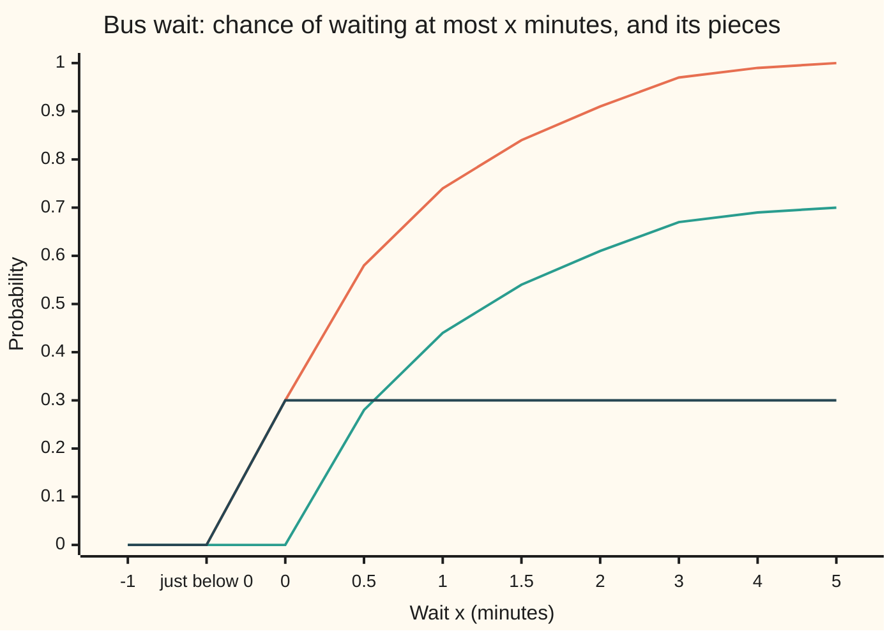
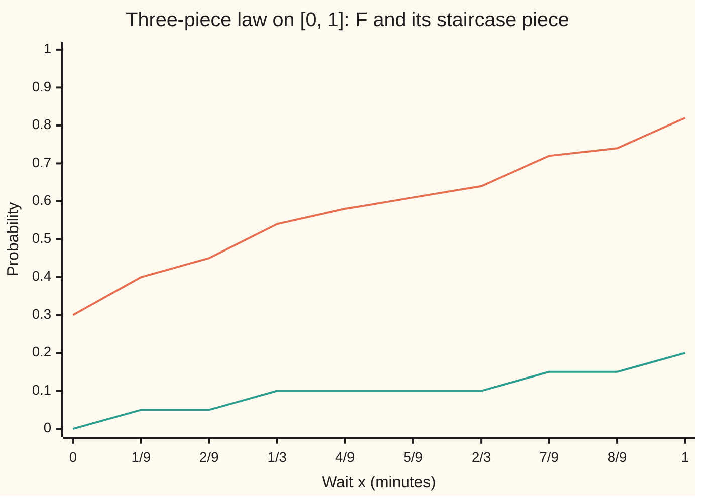

# Lebesgue decomposition: any measure splits into a part with a density and a part on a null set, and on the line that means density, jumps and staircase

[Syllabus](../../../SYLLABUS.md) → [Measure and integration](../../../SYLLABUS.md#w10) → [Densities and Changing Measure](../../../SYLLABUS.md#w10-s08) → Lebesgue decomposition

---

## General Overview

A commuter times the wait for the 8:10 bus. On 30% of mornings the bus is already there: the wait is exactly 0 minutes. On the other 70% the wait is exponential at rate 1 per minute: given a wait, the chance it exceeds x minutes is e^(−x). The chance of waiting at most 1 minute is 0.742484; of waiting exactly 0, it is 0.3.

A density (a curve whose area over a stretch is that stretch's probability) gives every single point probability zero, so it cannot hold the 0.3 at zero. A list of point probabilities cannot hold the spread. The wait's law is a sum of two kinds of mass: 0.7 smeared out with a density, 0.3 on one point of length zero.

For every probability law, that split exists and is unique. On the line the part on a length-zero set splits once more, into jumps and a third kind of mass: a continuous staircase such as the Cantor function, which climbs from 0 to 1 with slope zero almost everywhere. The bus has no staircase; a law built with all three pieces shows it.

**Every probability law, and more generally every σ-finite measure (defined below), splits in exactly one way into a part that respects a chosen reference measure's empty sets, with a density against it when the reference is σ-finite too, and a part living on a set the reference calls empty; on the line, against length, the second part splits again into point masses and a continuous singular part, so every distribution function is density plus jumps plus staircase.**

**What kind of fact this is:** a theorem, proved on this card in Why it works, with the density supplied by [The Radon-Nikodym theorem](03-radon-nikodym-theorem.md).

### The picture: the bus wait and its two pieces



Three lines. Top (orange): the distribution function F, the chance of a wait of at most x. Levelling off at 0.70 (green): the density piece. Flat at 0.30 from zero on (dark): the jump piece. At every x the top line is the sum of the other two. "Just below 0" sits right beside 0, and the steps widen from half a minute to a minute after 2.

---

## The formula

Notation first, in words. The **reference measure** $\mu$ decides which sets count as empty; $\nu$ is the measure being split. Both size the sets of one sigma-algebra $\mathcal{F}$, the collection of sets we allow ourselves to measure, on a space $\Omega$. A $\mu$-**null set** is a set $A$ with $\mu(A) = 0$. On the line the reference is Lebesgue measure $\lambda$: length.

Two reminders from [Absolutely continuous and singular measures](01-absolutely-continuous-and-singular-measures.md). $\nu \ll \mu$, read "$\nu$ is absolutely continuous with respect to $\mu$", means every $\mu$-null set is $\nu$-null. $\nu \perp \mu$, read "$\nu$ is singular to $\mu$", means $\nu$ lives entirely on one $\mu$-null set. A measure is **σ-finite** when the space is a countable union of pieces of finite measure; every probability law is.

$$\nu = \nu_{ac} + \nu_s, \qquad \nu_{ac} \ll \mu, \qquad \nu_s \perp \mu, \qquad \nu_{ac}(A) = \int_A f \, d\mu$$

**Read it aloud:** $\nu$ is the sum of a part that respects $\mu$'s empty sets and has a density $f$ against it, and a part that sits wholly on a set $\mu$ calls empty.

Both pieces are unique; $f$ is unique up to a $\mu$-null set. For the bus against length, $\nu_{ac}(A) = \int_A 0.7 e^{-x} \, dx$ over the positive part of A, and $\nu_s = 0.3\,\delta_0$. Here $\delta_x$ is the **point mass** at x: 1 on every set containing x, 0 on the rest.

On the line, against length, a law splits three ways:

$$\nu = \nu_{ac} + \nu_d + \nu_{sc}, \qquad F = F_{ac} + F_d + F_{sc}$$

**Read it aloud:** a law on the line is a density part, plus point masses, plus a part with no point masses that still lives on a length-zero set; its distribution function adds up the same way.

The **discrete part** $\nu_d = \sum_k p_k \, \delta_{x_k}$ puts mass $p_k$ on each of countably many points $x_k$. The **singular continuous part** $\nu_{sc}$ gives every point mass 0 yet lives on a set of length zero. $F_{ac}$ has a slope and no jumps, $F_d$ only jumps, and $F_{sc}$ is a continuous staircase such as the Cantor function $C$ ([The Cantor set](../02-Length%20Done%20Properly/07-the-cantor-set.md)).

| Symbol | Plain meaning | In our example | Push it up and the answer… |
| --- | --- | --- | --- |
| $\mu$ | reference measure: decides which sets are empty | length $\lambda$; on the die, a die with faces 5 and 6 blank | more non-empty sets, less room for $\nu_s$ |
| $\nu$ | the measure being split | law of the bus wait | — |
| $\lambda$ | Lebesgue measure: length | length of {0} is 0 | — |
| $\Omega$, $\Omega_k$, $\mathcal{F}$, $A$, $E$, $A_n$ | the space and its finite-mass pieces; the sigma-algebra; sets in it | the line; Borel sets; A = (0, 2] | — |
| $\nu_{ac}$, $\nu_s$ | the part with a density; the part on a $\mu$-null set | 0.7 spread out; 0.3 at zero | — |
| $\nu_d$, $\nu_{sc}$ | point-mass part; continuous singular part | 0.3 at zero; none for the bus | — |
| $f$ | density of $\nu_{ac}$ against $\mu$, also written $d\nu_{ac}/d\mu$ | $0.7 e^{-x}$ for x > 0 | taller f, more mass there |
| $N$, $s$, $N_1$, $N_2$ | the $\mu$-null set carrying $\nu_s$; the most $\nu$-mass any $\mu$-null set holds; null sets of a rival split | N = {0}, s = 0.3 | larger s, larger singular part |
| $\delta_x$, $p_k$, $x_k$ | point mass at x; the k-th jump size and place | $0.3\,\delta_0$ | — |
| $F$, $F_{ac}$, $F_d$, $F_{sc}$ | distribution function and its three pieces | F(1) = 0.742484 = 0.442484 + 0.3 + 0 | — |
| $C$ | Cantor function: the standard staircase | C(1/3) = 1/2 | — |
| $n$, $h$ | stage counter; cell width $3^{-n}$ | n = 10 | finer cells, sharper split |

### When it holds

- **Same sigma-algebra.** Otherwise "null for $\mu$" means nothing to $\nu$.
- **$\nu$ σ-finite.** Counting measure on [0, 1], mass 1 on each point, has no split against length (What breaks, last row).
- **$\mu$ σ-finite, for the density.** The split itself needs only $\nu$ σ-finite. Writing $\nu_{ac}$ as $\int f \, d\mu$ is Radon-Nikodym, which fails for length against counting measure ([The Radon-Nikodym theorem](03-radon-nikodym-theorem.md)).
- **On the line, finite on bounded sets.** Then the distribution function exists ([Distribution functions and Lebesgue-Stieltjes measures](../02-Length%20Done%20Properly/06-lebesgue-stieltjes-measures.md)) and the point masses are countable. A law, with total mass 1, always qualifies.

---

## Why it works

### Step 0: find the biggest set the reference cannot see

Mass that $\nu$ puts on a $\mu$-null set cannot come from a density against $\mu$. So collect as much $\nu$-mass as possible onto one $\mu$-null set N. Outside N no null set holds any $\nu$-mass, or it would have been added to N. So the part outside N respects $\mu$'s null sets, and Radon-Nikodym gives it a density.

### Step 1: on a die, list every null set

Take the house die, loaded with face weights $\nu$ = (0.1, 0.1, 0.1, 0.1, 0.2, 0.4). Measure it against a reference die $\mu$ whose faces 5 and 6 are blank and never come up: $\mu$ = (0.25, 0.25, 0.25, 0.25, 0, 0). Of the 64 sets of faces, 4 are $\mu$-null: the subsets of {5, 6}. The one $\nu$ weighs most is {5, 6}, with 0.6. So N = {5, 6} and s = 0.6.

The split: $\nu_s$ = (0, 0, 0, 0, 0.2, 0.4), the loaded die's mass on the blank faces. $\nu_{ac}$ = (0.1, 0.1, 0.1, 0.1, 0, 0). Its density against $\mu$ is 0.1/0.25 = 0.4 on faces 1 to 4. The code confirms $\nu(A) = \int_A f \, d\mu + \nu_s(A)$ on all 64 sets.

### Step 2: the biggest null set exists

Take $\nu$ finite first. Let s be the supremum (least upper bound) of $\nu(A)$ over $\mu$-null sets A. Pick null sets $A_n$ with $\nu(A_n) > s - 1/n$ and let N be their union. A countable union of null sets is null, so N is a candidate, and it holds at least $s - 1/n$ for every n. So N holds exactly s: the supremum is attained. On a die it is a maximum over 64 sets; on the line the countable union does the work.

### Step 3: split on N

Set $\nu_s$ = $\nu$ restricted to N, and $\nu_{ac}$ = $\nu$ restricted to the rest. They add to $\nu$. $\nu_s$ is singular because it lives on N. $\nu_{ac}$ is absolutely continuous: if a $\mu$-null set E held $\nu$-mass outside N, adding that part to N would give a null set holding more than s. The comparison subtracts s, so s must be finite; a σ-finite $\nu$ is split piece by piece.

### Step 4: the split is unique

Two splits have singular parts living on null sets $N_1$ and $N_2$. On their union, still null, both absolutely continuous parts give 0, so both singular parts equal $\nu$ there; off it, both singular parts give 0. So the singular parts agree, and then so do the rest. The code searches all 240 splits of the loaded die into tenths and finds exactly 1.

### Step 5: the density

$\nu_{ac} \ll \mu$, and with $\mu$ σ-finite the Radon-Nikodym theorem gives a measurable $f \ge 0$ with $\nu_{ac}(A) = \int_A f \, d\mu$ for every A. Against the fair die $\mu$ = (1/6, …, 1/6) instead, the only null set is the empty set, so the same loaded die has no singular part at all and density (0.6, 0.6, 0.6, 0.6, 1.2, 2.4). The split depends on the reference measure.

<details>
<summary>Detailed proof: Lebesgue decomposition for σ-finite measures</summary>

*Setting.* $\mu$ and $\nu$ are measures on $(\Omega, \mathcal{F})$, $\nu$ σ-finite. Claim: there are unique measures $\nu_{ac} \ll \mu$ and $\nu_s \perp \mu$ with $\nu = \nu_{ac} + \nu_s$. If $\mu$ is σ-finite too, $\nu_{ac}(A) = \int_A f \, d\mu$ for a measurable $f \ge 0$, unique $\mu$-a.e.

*Finite case.* Assume $\nu(\Omega) < \infty$. Let $\mathcal{N} = \{A \in \mathcal{F} : \mu(A) = 0\}$ and $s = \sup_{A \in \mathcal{N}} \nu(A) \le \nu(\Omega) < \infty$. Choose $A_n \in \mathcal{N}$ with $\nu(A_n) > s - 1/n$. Set $N = \bigcup_n A_n$. By countable subadditivity $\mu(N) \le \sum_n \mu(A_n) = 0$, so $N \in \mathcal{N}$ and $\nu(N) \le s$. By monotonicity $\nu(N) \ge \nu(A_n) > s - 1/n$ for all n, so $\nu(N) = s$.

Define $\nu_s(E) = \nu(E \cap N)$ and $\nu_{ac}(E) = \nu(E \cap N^c)$, with $N^c$ the complement of N. Intersecting a disjoint union with a fixed set leaves it disjoint, so both are measures, and they add to $\nu$.

$\nu_s \perp \mu$: $\nu_s(N^c) = \nu(\varnothing) = 0$ and $\mu(N) = 0$.

$\nu_{ac} \ll \mu$: let $\mu(E) = 0$. Then $N \cup (E \cap N^c) \in \mathcal{N}$, so $s \ge \nu(N \cup (E \cap N^c)) = \nu(N) + \nu(E \cap N^c) = s + \nu_{ac}(E)$. As $s < \infty$, $\nu_{ac}(E) = 0$.

*σ-finite case.* Write $\Omega = \bigcup_k \Omega_k$, disjoint, $\nu(\Omega_k) < \infty$. Apply the finite case to $\nu$ restricted to $\Omega_k$, giving null sets $N_k \subseteq \Omega_k$. Let $N = \bigcup_k N_k$; $\mu(N) = 0$ by subadditivity. Define $\nu_s$ and $\nu_{ac}$ from N as above. If $\mu(E) = 0$ then $\nu(E \cap \Omega_k \cap N_k^c) = 0$ for each k by the finite case, and summing over k gives $\nu_{ac}(E) = 0$.

*Uniqueness.* Let $\nu = a + b = a' + b'$ with $a, a' \ll \mu$, $b(N_1^c) = 0 = b'(N_2^c)$, $\mu(N_1) = \mu(N_2) = 0$. Put $M = N_1 \cup N_2$, so $\mu(M) = 0$. For any E: $a(E \cap M) = a'(E \cap M) = 0$, so $b(E \cap M) = \nu(E \cap M) = b'(E \cap M)$; and $b(E \cap M^c) = 0 = b'(E \cap M^c)$. Adding, $b(E) = b'(E)$. Then for $E \subseteq \Omega_k$, $a(E) = \nu(E) - b(E) = a'(E)$, all terms finite; summing over k gives $a = a'$.

*Density.* $\nu_{ac} \ll \mu$, both σ-finite ($\nu_{ac} \le \nu$). By the Radon-Nikodym theorem there is a measurable $f \ge 0$, unique $\mu$-a.e., with $\nu_{ac}(A) = \int_A f \, d\mu$.

</details>

### Step 6: on the line, pull the jumps out

Now $\mu = \lambda$ and $\nu$ is a law. A point has length 0, so $\nu_{ac}$ gives it mass 0: every point mass of $\nu$ belongs to $\nu_s$.

The points with mass above 1/m number fewer than m, or their masses would add past 1. Taking m = 1, 2, 3, … lists every point with positive mass: countably many, the $x_k$ with masses $p_k$. Set $\nu_d(E) = \sum_{x_k \in E} p_k$, a measure since nonnegative sums regroup freely, and singular since a countable set has length 0.

Set $\nu_{sc} = \nu_s - \nu_d$. It is never negative: $\nu_s(E)$ is at least $\nu_s$ of the $x_k$ in E, which is $\nu_d(E)$. A nonnegative difference of finite measures is a measure. It has no point masses, since each $p_k$ was removed, and gives nothing outside N. So $\nu_{sc}$ is continuous and singular. The jumps fix $\nu_d$ and Step 4 fixes the rest, so the three-way split is unique.

Adding the three measures of the half-line $(-\infty, x]$ gives $F = F_{ac} + F_d + F_{sc}$. A jump of a distribution function is a point mass ([Distribution functions and Lebesgue-Stieltjes measures](../02-Length%20Done%20Properly/06-lebesgue-stieltjes-measures.md)), so $F_{ac}$ and $F_{sc}$ are continuous and every jump of F sits in $F_d$.

### Step 7: read the three pieces off a distribution function

For the bus, a length-zero set holding the most law-mass is N = {0}. Any length-zero set gets at most the 0.3 at zero, since the density part gives length-zero sets nothing. The jump at zero is F(0) − F(0−) = 0.3 − 0 = 0.3. The density part has total mass $\int_0^\infty 0.7 e^{-x} \, dx = 0.7$. The two account for 1, so $F_{sc} = 0$.

To see the third piece, build a law with all three: mass 0.3 at zero, 0.5 spread exponentially at rate 1, and 0.2 following the Cantor function on [0, 1]. Its N is {0} together with the Cantor set, of length 0 and law-mass 0.5.



Two lines. The upper (orange) is F for the three-piece law, starting at 0.30 because of the jump at zero. The lower (green) is the staircase piece $0.2\,C$, flat across the middle ninths and ending at 0.20. At the ninths the staircase moves only in steps; between the ninths it keeps climbing on ever-finer pieces of the Cantor set.

The code reads the pieces back from F alone. It cuts (−1, 2] into cells of width $h = 3^{-n}$ and sorts each cell's rise of F: at least 0.05 is a **jump**, more than 1 per minute of width is **steep**, the rest is **flat**; mass beyond 2 minutes counts as flat. At n = 2 the Cantor pieces rise 0.05 each and pass for jumps, so the jump total reads 0.643295. At n = 10 the census reads jump 0.300000, steep 0.205593, flat 0.494407, closing in on 0.3, 0.2 and 0.5. From n = 4 on the error is at most 0.5 × (2/3)^n, 0.008671 at n = 10: the steep cells are the $2^n$ Cantor cells, of total width $(2/3)^n$, and the exponential adds at most 0.5 per minute on them.

### What the code shows and what only the proof shows

The code lists every set of a die and sorts cells for one law at five mesh sizes. That the biggest null set exists for every σ-finite measure, and that the split is unique, only the proof shows. That flat cells recover the density part for every law rests on slopes recovering the density almost everywhere, proved on [Lebesgue's theorem on monotone functions](../11-Derivatives%20Meet%20the%20Lebesgue%20Integral/03-monotone-functions-differentiable-almost-everywhere.md).

A second route to the whole theorem, when $\mu$ is σ-finite too, applies Radon-Nikodym to $\nu$ against $\mu + \nu$, which always dominates $\nu$; the set where the resulting density equals 1 is where $\mu$ has no say, and it becomes N. The route in the steps above needs no density until the end.

---

## Worked numbers, by hand

| Step | Arithmetic | Value |
| --- | --- | --- |
| Jump at zero | F(0) − F(0−) = 0.3 − 0 | **0.3** |
| Density piece to 1 minute | 0.7 × (1 − e^(−1)) | 0.442484 |
| F(1) | 0.442484 + 0.3 + 0 | **0.742484** |
| Wait in (0, 2] | F(2) − F(0) = 0.7 × (1 − e^(−2)) | 0.605265 |
| Total density mass | integral of 0.7 e^(−x) over (0, ∞) | 0.7 |
| Left for a staircase | 1 − 0.7 − 0.3 | **0** |
| Mean wait | 0.3 × 0 + integral of x × 0.7 e^(−x) | 0.7 minutes |
| Three-piece F(1/3) | 0.3 + 0.5 × (1 − e^(−1/3)) + 0.2 × 0.5 | 0.541734 |
| Three-piece mean | 0.3 × 0 + 0.5 × 1 + 0.2 × 0.5 | **0.6** |

Out of 100 mornings, about 30 have no wait, about 44 more a wait of up to a minute, and the average wait is 0.7 minutes. The staircase piece is centred at 0.5 by symmetry. A separate road confirms the three-piece mean: a nonnegative wait's average is the area under the chance of waiting longer than x ([The layer-cake formula](../06-Product%20Measures%20and%20Fubini/06-layer-cake-and-tail-integrals.md)), 0.600000.

### What breaks if you drop a piece

| Mistake | Comes out at | What went wrong |
| --- | --- | --- |
| Bus: keep only the density | total 0.700000, missing 0.300000 | a density gives the point zero nothing |
| Cantor law alone: keep jumps plus density | jump 0.000000, flat 0.000000, of a total 1 | the staircase is the third piece |
| Loaded die against the fair die instead | singular part 0.0, not 0.6 | the split depends on the reference measure |
| Counting measure on [0, 1] against length | N = 4097 dyadic points misses 1/3, N = 6562 triadic points misses 1/2; the would-be density part gives that point mass 1, length 0 | $\nu$ not σ-finite: no split exists |

The last row is a hypothesis failing. The code tries two length-zero sets for N, of counting mass 4097 and 6562; finer grids hold more, so the most mass a null set can hold is infinite. Off each, a search finds a point, and the would-be density part gives it mass 1 on a set of length 0: that part is not ≪ length. The same happens for every length-zero N, since none holds all of [0, 1].

---

## Code, from first principles, and it actually runs

Three roads. Road 0 runs the proof's construction on the die in exact fractions, then searches all 240 splits into tenths for uniqueness. Road 1 builds the bus pieces from the story and integrates the density with a hand-written Simpson rule. Road 2 reads the three-piece law's pieces back from F alone by the cell census, and checks its mean by the layer-cake area. The exponential and the Cantor function are written out in both languages; Rust does the die's fractions by hand.

### Python

```python
# Lebesgue decomposition -- the check behind the card.  Standard library only:
# exact fractions for the die, and a hand-written exponential, Cantor function
# and Simpson rule for the line.  Waits in minutes, probabilities as decimals.
from fractions import Fraction as Fr
from itertools import product

def exp_pos(x):                               # e^x for x >= 0, summed term by term
    total, term, k = 1.0, 1.0, 0
    while term > 1e-17 * total:
        k += 1
        term *= x / k
        total += term
    return total

def e_neg(x): return 1.0 / exp_pos(x)         # e^(-x)

def cantor(p, q, digits=40):                  # Cantor function at p/q in [0, 1], base-3 digits
    if p >= q: return 1.0
    value, half = 0.0, 0.5
    for _ in range(digits):
        p *= 3
        d, p = p // q, p % q
        if d == 1: return value + half        # inside a removed middle third: flat
        value += half if d == 2 else 0.0
        half /= 2
    return value

def simpson(g, a, b, m=6000):                 # Simpson's rule, m even
    h = (b - a) / m
    s = g(a) + g(b) + sum((4 if i % 2 else 2) * g(a + i * h) for i in range(1, m))
    return s * h / 3

# ---- Road 0: the proof's construction on a die, every set listed ----
sets = [[i for i in range(6) if m >> i & 1] for m in range(64)]
def decompose(mu, nu):                        # largest mu-null set in nu's eyes, then split
    null_sets = [A for A in sets if sum(mu[i] for i in A) == 0]
    N = max(null_sets, key=lambda A: sum(nu[i] for i in A))
    nu_s = [nu[i] if i in N else Fr(0) for i in range(6)]
    nu_ac = [nu[i] - nu_s[i] for i in range(6)]
    return null_sets, N, nu_s, nu_ac, [nu_ac[i] / mu[i] if mu[i] else Fr(0) for i in range(6)]
mu = [Fr(1, 4)] * 4 + [Fr(0)] * 2             # reference die: faces 5 and 6 never come up
nu = [Fr(1, 10)] * 4 + [Fr(2, 10), Fr(4, 10)] # the loaded die
null_sets, N, nu_s, nu_ac, f = decompose(mu, nu)
fmt = lambda v: ", ".join(str(float(x)) for x in v)
print(f"die: mu = ({fmt(mu)}); nu = ({fmt(nu)})")
print(f"die: {len(null_sets)} of 64 sets are mu-null; the one nu weighs most is faces "
      f"{[i + 1 for i in N]}, nu mass {float(sum(nu[i] for i in N))}")
print(f"die: nu_s = ({fmt(nu_s)}); nu_ac = ({fmt(nu_ac)}); density f = ({fmt(f)})")
for A in sets:                                # nu(A) = integral of f over A against mu + nu_s(A)
    assert sum(nu[i] for i in A) == sum(f[i] * mu[i] for i in A) + sum(nu_s[i] for i in A)
grid = [[Fr(k, 10) for k in range(int(10 * v) + 1)] for v in nu]
splits = [a for a in product(*grid)
          if all(a[i] == 0 for i in range(6) if mu[i] == 0)                  # a << mu
          and all(nu[i] - a[i] == 0 for i in range(6) if mu[i] > 0)]         # nu - a lives on a null set
print(f"die: splits of nu into tenths checked: {len(list(product(*grid)))}, valid: {len(splits)}")
assert splits == [tuple(nu_ac)]               # uniqueness, found by search
_, N2, s2, _, f2 = decompose([Fr(1, 6)] * 6, nu)
print(f"die against the fair die instead: largest null set {N2}, nu_s = ({fmt(s2)}); density ({fmt(f2)})")

# ---- Road 1: the bus, pieces from the story ----
F_ac = lambda x: 0.7 * (1 - e_neg(x)) if x > 0 else 0.0
F_d = lambda x: 0.3 if x >= 0 else 0.0
F = lambda x: F_ac(x) + F_d(x)
xs = [-1, None, 0, 0.5, 1, 1.5, 2, 3, 4, 5]
for name, G in (("F", F), ("F_ac", F_ac), ("F_d", F_d)):
    print(f"chart, bus {name} at -1, just below 0, 0, 0.5, 1, 1.5, 2, 3, 4, 5: "
          + ", ".join(f"{G(-1e-9 if x is None else x):.2f}" for x in xs))
print(f"bus: F(1) = {F(1):.6f} = F_ac(1) {F_ac(1):.6f} + F_d(1) {F_d(1):.1f}; "
      f"P(0 < X <= 2) = {F(2) - F(0):.6f}")
dens = simpson(lambda x: 0.7 * e_neg(x), 0.0, 40.0)            # second road: integrate the density
mean = simpson(lambda x: x * 0.7 * e_neg(x), 0.0, 40.0)             # the atom at 0 adds 0.3 x 0
print(f"bus, second road: integral of 0.7 e^(-x) over (0, 40] = {dens:.6f}; jump 0.3; "
      f"left for a staircase {round(1 - dens - 0.3, 6) + 0.0:.6f}; mean wait {mean:.6f}")
assert abs(dens - F_ac(40)) < 1e-9 and abs(1 - dens - 0.3) < 1e-9 and abs(mean - 0.7) < 1e-9

# ---- Road 2: the three-piece law read from F alone, cell by cell ----
F3 = lambda j, n: 0.3 + 0.5 * (1 - e_neg(j / 3**n)) + 0.2 * cantor(j, 3**n)   # F at j / 3^n >= 0
print("three-piece law: 0.3 at zero, 0.5 exponential at rate 1, 0.2 Cantor on [0, 1]")
print("chart, three-piece at 0, 1/9, ..., 1: F " + ", ".join(f"{F3(k, 2):.2f}" for k in range(10)))
print("chart, three-piece at 0, 1/9, ..., 1: staircase piece "
      + ", ".join(f"{0.2 * cantor(k, 9):.2f}" for k in range(10)))
print(f"three-piece: F(1/3) = {F3(3, 2):.6f}; C(1/3) = {cantor(1, 3)}")
def census(n, wj, we, wc):                   # cells of width 3^-n on (-1, 2]: rise sorted three ways
    jump, steep, flat = 0.0, 0.0, we * e_neg(2.0)                    # mass beyond 2 minutes: density
    prev = 0.0
    for j in range(-3**n + 1, 2 * 3**n + 1):
        cur = 0.0 if j < 0 else wj + we * (1 - e_neg(j / 3**n)) + wc * cantor(j, 3**n)
        rise, prev = cur - prev, cur
        if rise >= 0.05: jump += rise
        elif rise * 3**n > 1: steep += rise
        else: flat += rise
    return jump, steep, flat
print("census of cells of width 3^-n on (-1, 2]: jump (rise >= 0.05), steep (slope > 1), flat")
for n in (2, 4, 6, 8, 10):
    jump, steep, flat = census(n, 0.3, 0.5, 0.2)
    print(f"  n = {n:2d}: jump {jump:.6f}, steep {steep:.6f}, flat {flat:.6f}; bound 0.5(2/3)^n = {0.5 * (2/3)**n:.6f}")
assert abs(jump - 0.3) < 1e-12 and abs(steep - 0.2) <= 0.5 * (2/3)**n and abs(flat - 0.5) <= 0.5 * (2/3)**n
cj, cs, cf = census(10, 0.0, 0.0, 1.0)
m = 3**9                                      # layer cake: mean = integral of P(X > x)
cake = sum(0.2 * (1 - cantor(2 * k + 1, 2 * m)) + 0.5 * e_neg((2 * k + 1) / (2 * m)) for k in range(m)) / m
cake += simpson(lambda x: 0.5 * e_neg(x), 1.0, 40.0)
print(f"three-piece mean: pieces 0.3 x 0 + 0.5 x 1 + 0.2 x 0.5 = {0.3 * 0 + 0.5 * 1 + 0.2 * 0.5:.6f}; "
      f"layer cake {cake:.6f}")
assert abs(cake - 0.6) < 1e-6

# ---- What breaks ----
print(f"mistake 1, density only on the bus: total {dens:.6f}, missing {1 - dens:.6f}")
print(f"mistake 2, jumps plus density on the Cantor law alone, n = 10: jump {cj:.6f}, flat {cf:.6f}, "
      f"steep {cs:.6f}")
assert cj == 0 and cf == 0 and abs(cs - 1) < 1e-12
print(f"mistake 3, the loaded die against the fair die: singular part {float(sum(s2))}, not 0.6")
def split_count(N, E):                        # counting measure split on N: (would-be nu_ac(E), nu_s(E))
    return sum(1 for x in E if x not in N), sum(1 for x in E if x in N)
for name, N in (("dyadic", {Fr(k, 2**12) for k in range(2**12 + 1)}),
                ("triadic", {Fr(k, 3**8) for k in range(3**8 + 1)})):    # two length-zero candidates for N
    x = next(Fr(1, m) for m in range(1, 10**6) if Fr(1, m) not in N)     # search: a point of [0, 1] off N
    ac, sing = split_count(N, {x})
    print(f"mistake 4, counting measure on [0, 1]: N = {len(N)} {name} points, counting mass {len(N)}, "
          f"length 0; first 1/m off N: {x}; nu_ac({{{x}}}) = {ac}, nu_s({{{x}}}) = {sing}, length 0")
    assert ac == 1                            # the would-be density part charges a set of length 0
print("ALL CHECKS PASS")
```

**Ran 2026-09-29 on macOS, Python 3.14.6, standard library only. All checks passed. Output, pasted from the run:**

```
die: mu = (0.25, 0.25, 0.25, 0.25, 0.0, 0.0); nu = (0.1, 0.1, 0.1, 0.1, 0.2, 0.4)
die: 4 of 64 sets are mu-null; the one nu weighs most is faces [5, 6], nu mass 0.6
die: nu_s = (0.0, 0.0, 0.0, 0.0, 0.2, 0.4); nu_ac = (0.1, 0.1, 0.1, 0.1, 0.0, 0.0); density f = (0.4, 0.4, 0.4, 0.4, 0.0, 0.0)
die: splits of nu into tenths checked: 240, valid: 1
die against the fair die instead: largest null set [], nu_s = (0.0, 0.0, 0.0, 0.0, 0.0, 0.0); density (0.6, 0.6, 0.6, 0.6, 1.2, 2.4)
chart, bus F at -1, just below 0, 0, 0.5, 1, 1.5, 2, 3, 4, 5: 0.00, 0.00, 0.30, 0.58, 0.74, 0.84, 0.91, 0.97, 0.99, 1.00
chart, bus F_ac at -1, just below 0, 0, 0.5, 1, 1.5, 2, 3, 4, 5: 0.00, 0.00, 0.00, 0.28, 0.44, 0.54, 0.61, 0.67, 0.69, 0.70
chart, bus F_d at -1, just below 0, 0, 0.5, 1, 1.5, 2, 3, 4, 5: 0.00, 0.00, 0.30, 0.30, 0.30, 0.30, 0.30, 0.30, 0.30, 0.30
bus: F(1) = 0.742484 = F_ac(1) 0.442484 + F_d(1) 0.3; P(0 < X <= 2) = 0.605265
bus, second road: integral of 0.7 e^(-x) over (0, 40] = 0.700000; jump 0.3; left for a staircase 0.000000; mean wait 0.700000
three-piece law: 0.3 at zero, 0.5 exponential at rate 1, 0.2 Cantor on [0, 1]
chart, three-piece at 0, 1/9, ..., 1: F 0.30, 0.40, 0.45, 0.54, 0.58, 0.61, 0.64, 0.72, 0.74, 0.82
chart, three-piece at 0, 1/9, ..., 1: staircase piece 0.00, 0.05, 0.05, 0.10, 0.10, 0.10, 0.10, 0.15, 0.15, 0.20
three-piece: F(1/3) = 0.541734; C(1/3) = 0.5
census of cells of width 3^-n on (-1, 2]: jump (rise >= 0.05), steep (slope > 1), flat
  n =  2: jump 0.643295, steep 0.000000, flat 0.356705; bound 0.5(2/3)^n = 0.222222
  n =  4: jump 0.300000, steep 0.263703, flat 0.436297; bound 0.5(2/3)^n = 0.098765
  n =  6: jump 0.300000, steep 0.228313, flat 0.471687; bound 0.5(2/3)^n = 0.043896
  n =  8: jump 0.300000, steep 0.212583, flat 0.487417; bound 0.5(2/3)^n = 0.019509
  n = 10: jump 0.300000, steep 0.205593, flat 0.494407; bound 0.5(2/3)^n = 0.008671
three-piece mean: pieces 0.3 x 0 + 0.5 x 1 + 0.2 x 0.5 = 0.600000; layer cake 0.600000
mistake 1, density only on the bus: total 0.700000, missing 0.300000
mistake 2, jumps plus density on the Cantor law alone, n = 10: jump 0.000000, flat 0.000000, steep 1.000000
mistake 3, the loaded die against the fair die: singular part 0.0, not 0.6
mistake 4, counting measure on [0, 1]: N = 4097 dyadic points, counting mass 4097, length 0; first 1/m off N: 1/3; nu_ac({1/3}) = 1, nu_s({1/3}) = 0, length 0
mistake 4, counting measure on [0, 1]: N = 6562 triadic points, counting mass 6562, length 0; first 1/m off N: 1/2; nu_ac({1/2}) = 1, nu_s({1/2}) = 0, length 0
ALL CHECKS PASS
```

### Rust

Same numbers, same labels, built with `rustc --edition 2021 -O`.

```rust
// Lebesgue decomposition -- the same check as the Python, in Rust.  No crates.
// Exact rationals by hand on i64 for the die; a hand-written exponential,
// Cantor function and Simpson rule for the line.  Waits in minutes.
use std::collections::HashSet;

#[derive(Clone, Copy, PartialEq, Eq, Hash, Debug)]
struct Q { n: i64, d: i64 }                   // n / d, d > 0, lowest terms
fn gcd(a: i64, b: i64) -> i64 { if b == 0 { a.abs() } else { gcd(b, a % b) } }
fn q(n: i64, d: i64) -> Q { let g = gcd(n, d).max(1) * d.signum(); Q { n: n / g, d: d / g } }
fn add(a: Q, b: Q) -> Q { q(a.n * b.d + b.n * a.d, a.d * b.d) }
fn sub(a: Q, b: Q) -> Q { q(a.n * b.d - b.n * a.d, a.d * b.d) }
fn mul(a: Q, b: Q) -> Q { q(a.n * b.n, a.d * b.d) }
fn div(a: Q, b: Q) -> Q { q(a.n * b.d, a.d * b.n) }
fn fl(a: Q) -> f64 { a.n as f64 / a.d as f64 }
fn zero() -> Q { q(0, 1) }

fn exp_pos(x: f64) -> f64 {                   // e^x for x >= 0, summed term by term
    let (mut total, mut term, mut k) = (1.0f64, 1.0f64, 0.0f64);
    while term > 1e-17 * total { k += 1.0; term *= x / k; total += term; }
    total
}
fn e_neg(x: f64) -> f64 { 1.0 / exp_pos(x) }  // e^(-x)

fn cantor(mut p: i64, qd: i64) -> f64 {       // Cantor function at p/qd in [0, 1], base-3 digits
    if p >= qd { return 1.0; }
    let (mut value, mut half) = (0.0f64, 0.5f64);
    for _ in 0..40 {
        p *= 3;
        let d = p / qd; p %= qd;
        if d == 1 { return value + half; }    // inside a removed middle third: flat
        if d == 2 { value += half; }
        half /= 2.0;
    }
    value
}

fn simpson(g: &dyn Fn(f64) -> f64, a: f64, b: f64) -> f64 {   // Simpson's rule, 6000 steps
    let m = 6000; let h = (b - a) / m as f64;
    let s = g(a) + g(b) + (1..m).map(|i| (if i % 2 == 1 { 4.0 } else { 2.0 }) * g(a + i as f64 * h)).sum::<f64>();
    s * h / 3.0
}

fn mass(w: &[Q], a: &[usize]) -> Q { a.iter().fold(zero(), |s, &i| add(s, w[i])) }
fn decompose(mu: &[Q], nu: &[Q], sets: &[Vec<usize>]) -> (usize, Vec<usize>, Vec<Q>, Vec<Q>, Vec<Q>) {
    let nulls: Vec<&Vec<usize>> = sets.iter().filter(|a| mass(mu, a) == zero()).collect();
    let mut n = nulls[0].clone();             // largest mu-null set in nu's eyes, first found
    for a in &nulls { if fl(mass(nu, a)) > fl(mass(nu, &n)) { n = (*a).clone(); } }
    let s: Vec<Q> = (0..6).map(|i| if n.contains(&i) { nu[i] } else { zero() }).collect();
    let ac: Vec<Q> = (0..6).map(|i| sub(nu[i], s[i])).collect();
    let f = (0..6).map(|i| if mu[i] != zero() { div(ac[i], mu[i]) } else { zero() }).collect();
    (nulls.len(), n, s, ac, f)
}
fn fmt(v: &[Q]) -> String { v.iter().map(|&x| format!("{:?}", fl(x))).collect::<Vec<_>>().join(", ") }
fn census(n: u32, wj: f64, we: f64, wc: f64) -> (f64, f64, f64) {   // cells of width 3^-n on (-1, 2]
    let t = 3i64.pow(n);
    let (mut jump, mut steep, mut flat, mut prev) = (0.0, 0.0, we * e_neg(2.0), 0.0);   // beyond 2: density
    for j in (-t + 1)..=(2 * t) {
        let cur = if j < 0 { 0.0 } else { wj + we * (1.0 - e_neg(j as f64 / t as f64)) + wc * cantor(j, t) };
        let rise = cur - prev; prev = cur;
        if rise >= 0.05 { jump += rise } else if rise * t as f64 > 1.0 { steep += rise } else { flat += rise }
    }
    (jump, steep, flat)
}
fn split_count(nn: &HashSet<Q>, e: &[Q]) -> (usize, usize) {   // counting measure split on N: (would-be nu_ac(E), nu_s(E))
    (e.iter().filter(|x| !nn.contains(x)).count(), e.iter().filter(|x| nn.contains(x)).count())
}
fn j2(v: Vec<f64>) -> String { v.iter().map(|x| format!("{:.2}", x)).collect::<Vec<_>>().join(", ") }

fn main() {
    // ---- Road 0: the proof's construction on a die, every set listed ----
    let sets: Vec<Vec<usize>> = (0..64).map(|m: usize| (0..6).filter(|i| m >> i & 1 == 1).collect()).collect();
    let mu = [q(1, 4), q(1, 4), q(1, 4), q(1, 4), zero(), zero()];       // faces 5 and 6 never come up
    let nu = [q(1, 10), q(1, 10), q(1, 10), q(1, 10), q(2, 10), q(4, 10)];   // the loaded die
    let (nn, n, s, ac, f) = decompose(&mu, &nu, &sets);
    println!("die: mu = ({}); nu = ({})", fmt(&mu), fmt(&nu));
    let faces: Vec<usize> = n.iter().map(|i| i + 1).collect();
    println!("die: {} of 64 sets are mu-null; the one nu weighs most is faces {:?}, nu mass {:?}", nn, faces, fl(mass(&nu, &n)));
    println!("die: nu_s = ({}); nu_ac = ({}); density f = ({})", fmt(&s), fmt(&ac), fmt(&f));
    for a in &sets {                          // nu(A) = integral of f over A against mu + nu_s(A)
        assert!(mass(&nu, a) == add(a.iter().fold(zero(), |t, &i| add(t, mul(f[i], mu[i]))), mass(&s, a)));
    }
    let (mut total, mut splits) = (0, Vec::new());   // every split into tenths: odometer over faces
    let tops: Vec<i64> = nu.iter().map(|x| x.n * 10 / x.d).collect();
    let mut a = vec![0i64; 6];
    loop {
        total += 1;
        let aq: Vec<Q> = a.iter().map(|&k| q(k, 10)).collect();
        if (0..6).all(|i| mu[i] != zero() || aq[i] == zero())              // a << mu
            && (0..6).all(|i| mu[i] == zero() || sub(nu[i], aq[i]) == zero()) { splits.push(aq); }
        let mut i = 0;
        while i < 6 && a[i] == tops[i] { a[i] = 0; i += 1; }
        if i == 6 { break; }
        a[i] += 1;
    }
    println!("die: splits of nu into tenths checked: {}, valid: {}", total, splits.len());
    assert!(splits == vec![ac.clone()]);     // uniqueness, found by search
    let (_, n2, s2, _, f2) = decompose(&[q(1, 6); 6], &nu, &sets);
    println!("die against the fair die instead: largest null set {:?}, nu_s = ({}); density ({})", n2, fmt(&s2), fmt(&f2));

    // ---- Road 1: the bus, pieces from the story ----
    let f_ac = |x: f64| if x > 0.0 { 0.7 * (1.0 - e_neg(x)) } else { 0.0 };
    let f_d = |x: f64| if x >= 0.0 { 0.3 } else { 0.0 };
    let ff = |x: f64| f_ac(x) + f_d(x);
    let xs = [-1.0, -1e-9, 0.0, 0.5, 1.0, 1.5, 2.0, 3.0, 4.0, 5.0];
    let lines: [(&str, &dyn Fn(f64) -> f64); 3] = [("F", &ff), ("F_ac", &f_ac), ("F_d", &f_d)];
    for (name, g) in lines.iter() {
        println!("chart, bus {} at -1, just below 0, 0, 0.5, 1, 1.5, 2, 3, 4, 5: {}", name, j2(xs.iter().map(|&x| g(x)).collect()));
    }
    println!("bus: F(1) = {:.6} = F_ac(1) {:.6} + F_d(1) {:.1}; P(0 < X <= 2) = {:.6}", ff(1.0), f_ac(1.0), f_d(1.0), ff(2.0) - ff(0.0));
    let dens = simpson(&|x| 0.7 * e_neg(x), 0.0, 40.0);                   // second road: integrate the density
    let mean = simpson(&|x| x * 0.7 * e_neg(x), 0.0, 40.0);                // the atom at 0 adds 0.3 x 0
    println!("bus, second road: integral of 0.7 e^(-x) over (0, 40] = {:.6}; jump 0.3; left for a staircase {:.6}; mean wait {:.6}",
             dens, ((1.0 - dens - 0.3) * 1e6).round() / 1e6 + 0.0, mean);
    assert!((dens - f_ac(40.0)).abs() < 1e-9 && (1.0 - dens - 0.3).abs() < 1e-9 && (mean - 0.7).abs() < 1e-9);

    // ---- Road 2: the three-piece law read from F alone, cell by cell ----
    let f3 = |j: i64, t: i64| 0.3 + 0.5 * (1.0 - e_neg(j as f64 / t as f64)) + 0.2 * cantor(j, t);
    println!("three-piece law: 0.3 at zero, 0.5 exponential at rate 1, 0.2 Cantor on [0, 1]");
    println!("chart, three-piece at 0, 1/9, ..., 1: F {}", j2((0..10).map(|k| f3(k, 9)).collect()));
    println!("chart, three-piece at 0, 1/9, ..., 1: staircase piece {}", j2((0..10).map(|k| 0.2 * cantor(k, 9)).collect()));
    println!("three-piece: F(1/3) = {:.6}; C(1/3) = {:?}", f3(3, 9), cantor(1, 3));
    println!("census of cells of width 3^-n on (-1, 2]: jump (rise >= 0.05), steep (slope > 1), flat");
    let (mut jump, mut steep, mut flat, mut bound) = (0.0, 0.0, 0.0, 0.0);
    for n in [2u32, 4, 6, 8, 10] {
        let r = census(n, 0.3, 0.5, 0.2); jump = r.0; steep = r.1; flat = r.2;
        bound = 0.5 * (2.0f64 / 3.0).powi(n as i32);
        println!("  n = {:2}: jump {:.6}, steep {:.6}, flat {:.6}; bound 0.5(2/3)^n = {:.6}", n, jump, steep, flat, bound);
    }
    assert!((jump - 0.3).abs() < 1e-12 && (steep - 0.2).abs() <= bound && (flat - 0.5).abs() <= bound);
    let (cj, cs, cf) = census(10, 0.0, 0.0, 1.0);
    let m = 3i64.pow(9);                      // layer cake: mean = integral of P(X > x)
    let mut cake = (0..m).map(|k| 0.2 * (1.0 - cantor(2 * k + 1, 2 * m)) + 0.5 * e_neg((2 * k + 1) as f64 / (2 * m) as f64)).sum::<f64>() / m as f64;
    cake += simpson(&|x| 0.5 * e_neg(x), 1.0, 40.0);
    println!("three-piece mean: pieces 0.3 x 0 + 0.5 x 1 + 0.2 x 0.5 = {:.6}; layer cake {:.6}", 0.3 * 0.0 + 0.5 * 1.0 + 0.2 * 0.5, cake);
    assert!((cake - 0.6).abs() < 1e-6);

    // ---- What breaks ----
    println!("mistake 1, density only on the bus: total {:.6}, missing {:.6}", dens, 1.0 - dens);
    println!("mistake 2, jumps plus density on the Cantor law alone, n = 10: jump {:.6}, flat {:.6}, steep {:.6}", cj, cf, cs);
    assert!(cj == 0.0 && cf == 0.0 && (cs - 1.0).abs() < 1e-12);
    println!("mistake 3, the loaded die against the fair die: singular part {:?}, not 0.6", fl(s2.iter().fold(zero(), |t, &x| add(t, x))));
    for (name, t) in [("dyadic", 4096i64), ("triadic", 6561)] {      // two length-zero candidates for N
        let nn: HashSet<Q> = (0..=t).map(|k| q(k, t)).collect();
        let x = (1..1_000_000i64).map(|m| q(1, m)).find(|y| !nn.contains(y)).unwrap();   // search: a point of [0, 1] off N
        let (ac, sing) = split_count(&nn, &[x]);
        println!("mistake 4, counting measure on [0, 1]: N = {} {} points, counting mass {}, length 0; first 1/m off N: {}/{}; nu_ac({{{}/{}}}) = {}, nu_s({{{}/{}}}) = {}, length 0",
                 nn.len(), name, nn.len(), x.n, x.d, x.n, x.d, ac, x.n, x.d, sing);
        assert!(ac == 1);                     // the would-be density part charges a set of length 0
    }
    println!("ALL CHECKS PASS");
}
```

**Ran 2026-09-29 on macOS, rustc 1.98.1, no crates. All checks passed. Output, pasted from the run:**

```
die: mu = (0.25, 0.25, 0.25, 0.25, 0.0, 0.0); nu = (0.1, 0.1, 0.1, 0.1, 0.2, 0.4)
die: 4 of 64 sets are mu-null; the one nu weighs most is faces [5, 6], nu mass 0.6
die: nu_s = (0.0, 0.0, 0.0, 0.0, 0.2, 0.4); nu_ac = (0.1, 0.1, 0.1, 0.1, 0.0, 0.0); density f = (0.4, 0.4, 0.4, 0.4, 0.0, 0.0)
die: splits of nu into tenths checked: 240, valid: 1
die against the fair die instead: largest null set [], nu_s = (0.0, 0.0, 0.0, 0.0, 0.0, 0.0); density (0.6, 0.6, 0.6, 0.6, 1.2, 2.4)
chart, bus F at -1, just below 0, 0, 0.5, 1, 1.5, 2, 3, 4, 5: 0.00, 0.00, 0.30, 0.58, 0.74, 0.84, 0.91, 0.97, 0.99, 1.00
chart, bus F_ac at -1, just below 0, 0, 0.5, 1, 1.5, 2, 3, 4, 5: 0.00, 0.00, 0.00, 0.28, 0.44, 0.54, 0.61, 0.67, 0.69, 0.70
chart, bus F_d at -1, just below 0, 0, 0.5, 1, 1.5, 2, 3, 4, 5: 0.00, 0.00, 0.30, 0.30, 0.30, 0.30, 0.30, 0.30, 0.30, 0.30
bus: F(1) = 0.742484 = F_ac(1) 0.442484 + F_d(1) 0.3; P(0 < X <= 2) = 0.605265
bus, second road: integral of 0.7 e^(-x) over (0, 40] = 0.700000; jump 0.3; left for a staircase 0.000000; mean wait 0.700000
three-piece law: 0.3 at zero, 0.5 exponential at rate 1, 0.2 Cantor on [0, 1]
chart, three-piece at 0, 1/9, ..., 1: F 0.30, 0.40, 0.45, 0.54, 0.58, 0.61, 0.64, 0.72, 0.74, 0.82
chart, three-piece at 0, 1/9, ..., 1: staircase piece 0.00, 0.05, 0.05, 0.10, 0.10, 0.10, 0.10, 0.15, 0.15, 0.20
three-piece: F(1/3) = 0.541734; C(1/3) = 0.5
census of cells of width 3^-n on (-1, 2]: jump (rise >= 0.05), steep (slope > 1), flat
  n =  2: jump 0.643295, steep 0.000000, flat 0.356705; bound 0.5(2/3)^n = 0.222222
  n =  4: jump 0.300000, steep 0.263703, flat 0.436297; bound 0.5(2/3)^n = 0.098765
  n =  6: jump 0.300000, steep 0.228313, flat 0.471687; bound 0.5(2/3)^n = 0.043896
  n =  8: jump 0.300000, steep 0.212583, flat 0.487417; bound 0.5(2/3)^n = 0.019509
  n = 10: jump 0.300000, steep 0.205593, flat 0.494407; bound 0.5(2/3)^n = 0.008671
three-piece mean: pieces 0.3 x 0 + 0.5 x 1 + 0.2 x 0.5 = 0.600000; layer cake 0.600000
mistake 1, density only on the bus: total 0.700000, missing 0.300000
mistake 2, jumps plus density on the Cantor law alone, n = 10: jump 0.000000, flat 0.000000, steep 1.000000
mistake 3, the loaded die against the fair die: singular part 0.0, not 0.6
mistake 4, counting measure on [0, 1]: N = 4097 dyadic points, counting mass 4097, length 0; first 1/m off N: 1/3; nu_ac({1/3}) = 1, nu_s({1/3}) = 0, length 0
mistake 4, counting measure on [0, 1]: N = 6562 triadic points, counting mass 6562, length 0; first 1/m off N: 1/2; nu_ac({1/2}) = 1, nu_s({1/2}) = 0, length 0
ALL CHECKS PASS
```

The two outputs match line for line.

> [!TIP]
> **Try changing**
> Guess first, then run it.
> - **Unblank face 5.** Change `mu` to `[Fr(3, 16)] * 4 + [Fr(1, 4), Fr(0)]`. Guess the singular part: only face 6 is null now, so 0.4. The density becomes 0.1/(3/16) = 0.533… on faces 1 to 4 and 0.2/0.25 = 0.8 on face 5; every assert passes, and the search again finds one split.
> - **Move the jump.** In `F_d`, change `x >= 0` to `x > 0`. Guess F at zero: 0.00. F is then no longer right-continuous at zero, so it is not a distribution function.
> - **Coarser cells.** Change the census loop to `for n in (2,):`. Guess: the Cantor pieces pass for jumps, the jump total reads 0.643295, and the census assert stops the run. With `(2, 3)` it passes: at width 1/27 the pieces rise 0.025 each, under the jump threshold.

---

## The usual mistake

> [!warning]
> **Believing every distribution function is jumps plus a density.** Differentiate F where it has a slope, add up the jumps, and the rest is assumed to be nothing. For the Cantor law that procedure finds 0 of a total 1: the slope is 0 almost everywhere and there are no jumps. Only checking that the pieces add to the total catches it.
>
> - **Calling the singular part "the jumps".** Singular means living on a null set. Point masses are one kind; the staircase is another, with no point masses at all.
> - **Forgetting the reference measure.** The loaded die has singular part 0.6 against a die with two blank faces and 0 against the fair die. "Has a density" always means "against something".
> - **Reading a density's value as a probability.** 0.7 e^(−x) is a rate per minute; the chance of a wait of exactly 0 is the jump, 0.3.

---

## Where you meet it in real life

- **Insurance claims and rainfall.** A day's rainfall, like a policy's claim, is exactly 0 with positive probability and spread out otherwise ([Distribution functions and Lebesgue-Stieltjes measures](../02-Length%20Done%20Properly/06-lebesgue-stieltjes-measures.md)); models fit the jump and the density separately.
- **Likelihood ratios.** Comparing two laws uses the density of one against the other. The singular part is where one law puts mass the other calls impossible: an observation there settles the question outright ([Densities and likelihood ratios](06-densities-and-likelihood-ratios.md)).
- **Changing measure in pricing.** Risk-neutral pricing reweights one law by a density against another, which needs no singular part in either direction: both laws must agree on which events are impossible.
- **Spectra of signals.** A signal's frequency content is a measure: pure tones are point masses, broadband noise has a density, and a singular continuous kind exists too.

> **Say it back**
> Pick a reference measure. Collect as much of the other measure as possible onto one set the reference calls empty; a countable union reaches the maximum. What sits there is the singular part; the rest respects the reference's empty sets, so Radon-Nikodym gives it a density. The split is unique. On the line against length, the singular part splits again into point masses and a continuous staircase part, so the bus wait is 0.7 density plus a 0.3 jump at zero, with no staircase.

---

## What this builds on

- [The Radon-Nikodym theorem](03-radon-nikodym-theorem.md): turns the absolutely continuous part into an integral of a density.
- [The Cantor set](../02-Length%20Done%20Properly/07-the-cantor-set.md): the staircase that is the model third piece, continuous and singular.
- [Distribution functions and Lebesgue-Stieltjes measures](../02-Length%20Done%20Properly/06-lebesgue-stieltjes-measures.md): the match between laws and distribution functions, with jumps as point masses.

## Where this goes next

- [Lebesgue's theorem on monotone functions](../11-Derivatives%20Meet%20the%20Lebesgue%20Integral/03-monotone-functions-differentiable-almost-everywhere.md): F has a slope almost everywhere; it equals the density there, and the jump and staircase pieces have slope 0 almost everywhere.
- [Densities and likelihood ratios](06-densities-and-likelihood-ratios.md): the density of one law against another put to work.

The census found the density part through slopes, justified here only by a bound for one law; that slopes recover the density of every distribution function is what the first card above proves.

---

## Sources

Verified 2026-09-29: every link below resolves to the publisher's page.

- Folland, Gerald B. *Real Analysis: Modern Techniques and Their Applications*, 2nd ed. Wiley, 1999. [Publisher page](https://www.wiley.com/en-us/Real+Analysis%3A+Modern+Techniques+and+Their+Applications%2C+2nd+Edition-p-9780471317166). Chapter 3 proves the Lebesgue decomposition together with Radon-Nikodym, and splits Lebesgue-Stieltjes measures into discrete, absolutely continuous and singular continuous parts.
- Axler, Sheldon. *Measure, Integration & Real Analysis*. Graduate Texts in Mathematics 282, Springer, 2020. [Publisher page](https://doi.org/10.1007/978-3-030-33143-6); [free edition from the author](https://measure.axler.net/). Chapter 9 proves the Lebesgue decomposition theorem alongside the Hahn, Jordan and Radon-Nikodym theorems.
- Billingsley, Patrick. *Probability and Measure*, Anniversary ed. Wiley, 2012. [Publisher page](https://www.wiley.com/en-us/Probability+and+Measure%2C+Anniversary+Edition-p-9781118122372). Splits distribution functions on the line into jump, absolutely continuous and singular parts, with the Cantor function as the singular example.
