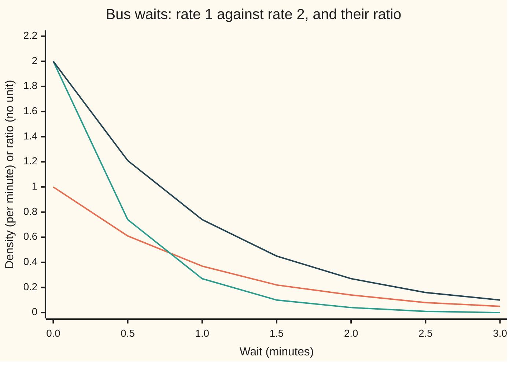
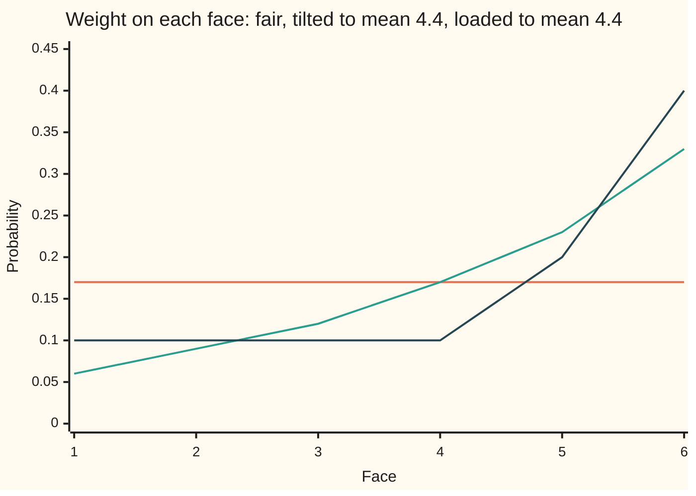

# Densities and likelihood ratios: the everyday density is a Radon-Nikodym derivative against length, and a ratio of two tilts one model into another

[Syllabus](../../../SYLLABUS.md) → [Measure and integration](../README.md) → [Densities and Changing Measure](../README.md#s08) → Densities and likelihood ratios

---

## General Overview

A rider times the wait at a busy city stop: 0.30 minutes. Two models compete, both with exponential waits. Model P says buses come at a rate of 1 a minute, so the average wait is 1 minute. Model Q says 2 a minute: average wait half a minute.

Which model does 0.30 minutes favour, and by how much? Under both models a wait of exactly 0.30 minutes has probability zero: a single point has no length. A ratio of two zeros says nothing. Yet statisticians answer at once: Q favours this wait by a factor of 1.4816. A wait of 2 minutes goes the other way: Q's weight is 0.2707 of P's.

That factor is a **likelihood ratio**: how much more weight one model puts at a wait than the other. The everyday density of a waiting time ([Densities](../../09-Probability%20and%20statistics/04-Continuous%20Distributions/01-densities-and-cdfs.md)) is an exchange rate between probability and length. A ratio of two densities is the exchange rate between the two models, with length cancelled: multiply P by it and Q comes out. The average logarithm of the ratio, the **Kullback-Leibler divergence**, measures how far apart the models sit, and is never negative. An exponential ratio leans a fair die, by a controlled amount, towards sixes.

**A density is a Radon-Nikodym derivative against length, the ratio of two densities is the Radon-Nikodym derivative of one model against the other, and its average logarithm is a distance-like number that is zero only when the models agree.**

**What kind of fact this is:** a theorem, proved on this card in Why it works: the likelihood ratio is dQ/dP, and the divergence is never negative. The density, the divergence and the tilt are definitions built on it.

### The picture: two densities and the ratio between them



Orange is model P's density, $e^{-x}$. Green is model Q's, $2e^{-2x}$. Dark blue is their ratio, $2e^{-x}$. The ratio crosses 1 at $\ln 2 = 0.6931$ minutes: shorter waits favour Q, longer ones favour P. Q's density starts at 2 per minute, above 1: a density is probability per minute, not a probability.

---

## The formula

Notation first, in words. As on [The Radon-Nikodym derivative](04-radon-nikodym-derivative.md), $dQ/dP$ is read "the density of Q against P": the function that turns P into Q under an integral. Here the space $\Omega$ is the waits `[0, ∞)` and $\mathcal{F}$, the collection of sets we allow ourselves to measure, is its Borel sets. P and Q are probability measures on them, and $\lambda$ is length.

**Density.** A probability measure P has density $p$ against a reference measure $\nu$ when, for every set A in $\mathcal{F}$,

$$P(A) = \int_A p \, d\nu, \qquad \text{that is,} \qquad p = \frac{dP}{d\nu}.$$

With $\nu = \lambda$ this is the everyday density: $P(\text{wait} \le 1) = \int_0^1 e^{-x}\,dx = 0.632121$.

**Likelihood ratio (the theorem).** If P and Q have densities $p$ and $q$ against the same $\nu$, and Q puts no mass where P puts none, then

$$\frac{dQ}{dP}(x) = L(x) = \frac{q(x)}{p(x)} \quad \text{wherever } p(x) > 0.$$

**Read it aloud:** the density of Q against P is Q's density divided by P's, whatever reference measure both were taken against.

**Kullback-Leibler divergence.** The log-ratio, averaged under Q:

$$D(Q\,\|\,P) = \int \ln L \, dQ = \int L \ln L \, dP \;\ge\; 0, \quad \text{with equality only when } Q = P.$$

**Exponential tilt.** For a number $\theta$, reweight P by an exponential in the outcome:

$$\frac{dQ_\theta}{dP}(x) = \frac{e^{\theta x}}{M(\theta)}, \qquad M(\theta) = \int e^{\theta x} \, dP(x).$$

**Read them aloud:** the divergence is the log-ratio averaged when Q is true; a tilt multiplies each outcome's weight by an exponential and rescales to total 1.

| Symbol | Plain meaning | In our example | Push it up and the answer… |
| --- | --- | --- | --- |
| $\Omega$, $\mathcal{F}$, $A$ | the outcomes; the sets we may measure; one such set | waits `[0, ∞)` and its Borel sets; "wait over 1 minute" | — |
| $x$, $X$, $k$ | one wait in minutes; the outcome as a measurable function; one face of a die | 0.3, 1, 2; the wait itself; faces 1 to 6 | a longer wait favours P |
| $\lambda$, $\nu$ | Lebesgue measure, that is length; a reference measure for both models | $\lambda$ of `[0, 1]` is 1; $\nu$ is $\lambda$ for waits, counting measure for the die | $\nu$ cancels out of every ratio |
| $P$, $Q$ | two probability measures: the two models | rate 1 a minute; rate 2 a minute | a faster Q moves the crossing left |
| $F$, $f$ | distribution function, $F(x) = P(\text{wait} \le x)$; its slope, in the proof | $1 - e^{-x}$; 0.632121 at 1; $f = e^{-x}$ | its slope is the density |
| $p$, $q$ | densities of P and Q against $\nu$ | $e^{-x}$ and $2e^{-2x}$ | may exceed 1: q is 2 at 0 |
| $L$ | the likelihood ratio $dQ/dP = q/p$ | $2e^{-x}$; 1.4816 at 0.3, 0.2707 at 2 | above 1, the wait favours Q |
| $D(Q\,\|\,P)$ | Kullback-Leibler divergence of Q from P | 0.193147; the other way round 0.306853 | grows as the models part |
| $\theta$, $M$ | tilt strength; the normaliser $M(\theta)$ | $\theta = -1$ turns P into Q; the die needs 0.328605407, $M$ = 3.679036 | a bigger $\theta$ leans harder to large outcomes |
| $Q_\theta$, $m$ | the tilted measure; its mean | the tilted die, mean 4.4 | $m$ rises with $\theta$ |
| $R$, $h$ | any other model with the same mean; the half-width of a window around 6 | the loaded die (0.1, 0.1, 0.1, 0.1, 0.2, 0.4); h = 0.1, 0.01, 0.001 | — |
| $N$, $B$, $Z$, $w$, $g$, $c$, $t$ | in the proofs: the set where $p = 0$; a set; the tilt's density $e^{\theta X}/M$; the function $1/L$; a function being averaged; a constant; a number between 0 and 1 | $N$ is empty for the bus; $Z = 2e^{-x}$ at $\theta = -1$ | — |

### When it holds

- **Q puts no mass where P puts none**, written $Q \ll P$ and read "Q is absolutely continuous with respect to P" ([Absolutely continuous and singular measures](01-absolutely-continuous-and-singular-measures.md)). Drop it and the ratio loses mass: Q uniform on `[0, 2]` against P uniform on `[0, 1]` gives $\int (q/p)\,dP = 0.5$, not 1.
- **Each model has a density against the reference.** A law has a density against length only if it gives zero to every set of length zero. The fair die puts 1/6 on the single point 6; its "probability per unit length" near 6 reads 0.8333, 8.3333, 83.3333 as the window shrinks, and grows without bound.
- **The reference measure is σ-finite**: the space splits into countably many pieces of finite size, as for length. The Radon-Nikodym theorem needs it ([The Radon-Nikodym theorem](03-radon-nikodym-theorem.md)).
- **The divergence needs $Q \ll P$ too.** Without it, $D(Q\,\|\,P)$ is defined to be $+\infty$: Q expects outcomes that P calls impossible.
- **The tilt needs a finite $M(\theta)$.** For the bus under P, $M(\theta) = 1/(1 - \theta)$, finite only for $\theta < 1$. For the die, any $\theta$ works, but only means strictly between 1 and 6 can be reached.

---

## Why it works

### Step 0: a density is an exchange rate, and exchange rates chain

A density says how much probability sits per unit of the reference measure: against length, probability per minute. Two models against one reference each have an exchange rate into it. Divide one by the other and the reference cancels, as dollars per euro over pounds per euro gives dollars per pound. The Radon-Nikodym theorem and the change-of-measure rule make that cancellation exact.

### Step 1: the everyday density is dP/dλ

In wing 09 a density is a curve whose area over an interval is that interval's probability. Measure theory asks for area over every Borel set A, not only intervals: $P(A) = \int_A p \, d\lambda$. That is the definition of the Radon-Nikodym derivative $dP/d\lambda$.

Two consequences follow. First, a density exists exactly when P gives zero to every set of length zero. The bus passes; the die fails, since the point 6 has length 0 and probability 1/6. Against counting measure the die does have a density: 1/6 at each face. Second, a density is fixed only almost everywhere: change it on a set of length zero and no integral moves. "The density at 0.3" means the continuous version, which is the slope of F. At 0.5, 1 and 2 minutes the slope of $1 - e^{-x}$ and the formula $e^{-x}$ agree: 0.606531, 0.367879, 0.135335.

### Step 2: the ratio of densities is dQ/dP

Take densities $p$ and $q$ against one reference $\nu$, and $Q \ll P$. Set $L = q/p$ where $p > 0$, and 0 elsewhere. The claim: $Q(A) = \int_A L \, dP$ for every A. Three moves:

1. **Q ignores the places P ignores.** On the set where $p = 0$, P has mass $\int p \, d\nu = 0$. Since $Q \ll P$, Q has mass 0 there too.
2. **Rewrite Q's density as ratio times P's density.** Off that set, $q = (q/p)\,p = L\,p$.
3. **Move p into the measure.** The change-of-measure rule from [The Radon-Nikodym derivative](04-radon-nikodym-derivative.md) says $\int g\,p \, d\nu = \int g \, dP$. With $g = L$ on A, $Q(A) = \int_A L\,p\,d\nu = \int_A L\,dP$.

So $L$ satisfies the defining property of $dQ/dP$, and the Radon-Nikodym theorem says any two such functions agree P-almost everywhere. For the bus, $L(x) = 2e^{-2x}/e^{-x} = 2e^{-x}$.

The reference has vanished from the answer. Timed in seconds, both densities shrink by 60 and $L$ does not change: 18 seconds still favours Q by 1.4816.

The working consequence is the reweighting rule: $\int g\,dQ = \int g\,L\,dP$ for any non-negative g. An average under Q can be computed from P's draws, each weighted by $L$. For "wait over 1 minute", $\int_1^\infty 2e^{-x}\,e^{-x}\,dx = e^{-2} = 0.135335$, exactly $Q(\text{wait} > 1)$.

### Step 3: the divergence is never negative

Define $D(Q\,\|\,P) = \int \ln L \, dQ$ when $Q \ll P$, and $+\infty$ otherwise. By the reweighting rule it is also $\int L \ln L \, dP$.

The proof that $D \ge 0$ is one use of Jensen's inequality ([Jensen's inequality](../07-Sizes%20of%20Functions/04-jensens-inequality.md)). The logarithm bends downward, so the average of a logarithm is at most the logarithm of the average:

$$-D(Q\,\|\,P) = \int \ln\frac{1}{L}\,dQ \;\le\; \ln \int \frac{1}{L}\,dQ = \ln P(L > 0) \;\le\; \ln 1 = 0.$$

The middle equality is the reweighting rule: $\int (1/L)\,dQ = \int_{L>0} (1/L)\,L\,dP$. Equality in Jensen forces $L$ to be constant, and a constant density of total mass 1 is 1: $Q = P$.

For the bus: $\ln L(x) = \ln 2 - x$, and Q's average wait is 1/2, so $D(Q\,\|\,P) = \ln 2 - 1/2 = 0.193147$. The other way round, $D(P\,\|\,Q) = \int (x - \ln 2)\,dP = 1 - \ln 2 = 0.306853$. The divergence is not symmetric, so it is not a distance; hence the name divergence.

### Step 4: an exponential tilt, and why it is the closest model with a given mean

Set $Z = e^{\theta X}/M(\theta)$, with $X$ the outcome. It is positive with P-average 1, so $Q_\theta(A) = \int_A Z \, dP$ is a probability measure with the same null sets as P. Its mean $m(\theta) = M'(\theta)/M(\theta)$ has derivative equal to the variance under $Q_\theta$, which is positive, so each reachable target mean is hit by exactly one $\theta$.

The bus model Q is itself a tilt of P. With $\theta = -1$, $M(-1) = 1/2$ and $Z = 2e^{-x}$: the likelihood ratio of Step 2. The tilt formula gives the divergence a third time: $D(Q_\theta\,\|\,P) = \int (\theta x - \ln M)\,dQ_\theta = \theta\,m - \ln M(\theta)$, here $-1/2 + \ln 2 = 0.193147$.

Now the die, fair with mean 3.5. Tilting by $e^{\theta k}$ with $\theta = 0.328605407$ gives mean 4.4 and weights 0.0629, 0.0874, 0.1214, 0.1686, 0.2342, 0.3254. The shelf's loaded die, (0.1, 0.1, 0.1, 0.1, 0.2, 0.4), also has mean 4.4; [The Radon-Nikodym derivative](04-radon-nikodym-derivative.md) calls it Q, and below it is R. The tilt lies closer to fair, by a fixed rule: for any model R with the same mean as $Q_\theta$,

$$D(R\,\|\,P) = D(R\,\|\,Q_\theta) + D(Q_\theta\,\|\,P).$$

The chain rule splits $\ln dR/dP$ into $\ln dR/dQ_\theta$ plus $\theta k - \ln M$, and the second part averages under R to $\theta m - \ln M$. The first term is never negative (Step 3). On the dice: 0.182322 = 0.039109 + 0.143213.

### The picture: the fair die, its tilt to mean 4.4, and the loaded die



Orange is the fair die. Green is the tilt: each step up a face multiplies the weight by the same factor, $e^{\theta}$. Dark blue is the loaded die, flat for four faces, then jumping. Both have mean 4.4; divergence from fair 0.143213 for the tilt, 0.182322 for the loaded die.

<details>
<summary>Detailed proof</summary>

**Setting.** $(\Omega, \mathcal{F})$ is a measurable space, $\nu$ a σ-finite measure on it, and P, Q probability measures with $P = p\,\nu$ and $Q = q\,\nu$, meaning $P(A) = \int_A p\,d\nu$ and $Q(A) = \int_A q\,d\nu$, with $p, q \ge 0$ measurable with respect to $\mathcal{F}$.

**1. Densities against length.** A probability measure P on the Borel sets of the line has a density against $\lambda$ if and only if $P(A) = 0$ whenever $\lambda(A) = 0$: this is the Radon-Nikodym theorem for the σ-finite $\lambda$ ([The Radon-Nikodym theorem](03-radon-nikodym-theorem.md)), and two densities agree $\lambda$-a.e. If F is continuous and has a continuous derivative f except at finitely many points, the fundamental theorem of calculus, applied piece by piece, gives $\int_{(-\infty, x]} f\,d\lambda = F(x)$, so the measures $A \mapsto \int_A f\,d\lambda$ and P agree on half-lines. Half-lines are closed under intersection and generate the Borel sets, so the two measures agree everywhere (shelf 01). Hence $f = dP/d\lambda$.

**2. P ignores $\{p = 0\}$, and so does Q.** Let $N = \{p = 0\}$. Then $P(N) = \int_N p\,d\nu = \int_N 0\,d\nu = 0$. Since $Q \ll P$, $Q(N) = 0$.

**3. $L$ is dQ/dP.** Define $L = q/p$ off N and $L = 0$ on N; it is measurable. For A in $\mathcal{F}$, step 2 and $q = L\,p$ off N give $Q(A) = Q(A \setminus N) = \int_{A \setminus N} L\,p\,d\nu$. The change-of-measure rule ([The Radon-Nikodym derivative](04-radon-nikodym-derivative.md): $\int g\,p\,d\nu = \int g\,dP$ for measurable $g \ge 0$) with $g = L\,1_{A \setminus N}$ turns this into $\int_{A \setminus N} L\,dP = \int_A L\,dP$, since $P(N) = 0$. Any other function with this property equals $L$ P-a.e., by the uniqueness in the Radon-Nikodym theorem. The reweighting rule $\int g\,dQ = \int g\,L\,dP$ follows from indicators by linearity and monotone convergence.

**4. Without $Q \ll P$.** The measure $A \mapsto \int_A L\,dP$ is still defined and equals $A \mapsto Q(A \setminus N)$: the absolutely continuous part of Q in the Lebesgue decomposition ([Lebesgue decomposition](05-lebesgue-decomposition.md)), and $Q(N) > 0$ is exactly the mass it misses.

**5. The divergence is well defined.** Assume $Q \ll P$ and $L = dQ/dP$. Then $Q(L = 0) = \int_{\{L=0\}} L\,dP = 0$, so $\ln L$ is finite Q-a.s. Its negative part has $\int (\ln L)^- \,dQ = \int_{\{L<1\}} L \ln(1/L)\,dP \le 1/e$, because $t\ln(1/t) \le 1/e$ for $0 < t < 1$ (its derivative $\ln(1/t) - 1$ vanishes at $t = 1/e$) and $P(\Omega) = 1$. So $D(Q\,\|\,P) = \int \ln L\,dQ$ is defined in `[−1/e, ∞]`, and by the reweighting rule applied to the positive and negative parts it equals $\int L \ln L\,dP$.

**6. Gibbs' inequality.** On the probability space $(\Omega, \mathcal{F}, Q)$ take $w = 1/L$, positive Q-a.s., with $\int w\,dQ = \int_{\{L>0\}} (1/L)\,L\,dP = P(L > 0) \le 1$, so $w$ is in $L^1(Q)$. The function $-\ln$ is convex on `(0, ∞)`, so Jensen's inequality gives $-\ln \int w\,dQ \le \int -\ln w\,dQ$, that is $\int \ln(1/L)\,dQ \le \ln P(L > 0) \le 0$. Hence $D(Q\,\|\,P) = -\int \ln(1/L)\,dQ \ge 0$.

**7. Equality.** If $D = 0$, both inequalities in step 6 are equalities. The second gives $P(L > 0) = 1$. The first, since $-\ln$ is strictly convex, gives $1/L = c$ Q-a.s. for a constant c, by the equality case of Jensen. The set $B = \{L \ne 1/c\}$ has $0 = Q(B) = \int_B L\,dP$, with $L > 0$ P-a.s., so $P(B) = 0$ and $L = 1/c$ P-a.s. Then $1 = Q(\Omega) = \int L\,dP = 1/c$, so $L = 1$ P-a.s. and $Q = P$. Conversely $Q = P$ gives $L = 1$ and $D = 0$.

**8. The tilt.** Let X be a real measurable function with $M(\theta) = \int e^{\theta X}\,dP < \infty$. Then $Z = e^{\theta X}/M(\theta) > 0$ and $\int Z\,dP = 1$, so $Q_\theta = Z\,P$ is a probability measure, and $Q_\theta(A) = 0$ exactly when $P(A) = 0$ because $Z > 0$. For the die, $M(\theta) = \frac{1}{6}\sum_{k=1}^{6} e^{\theta k}$ is a finite sum, differentiated term by term: $M' = \int X e^{\theta X}\,dP$, $M'' = \int X^2 e^{\theta X}\,dP$. So $m(\theta) = \int X\,dQ_\theta = M'/M$ and $m' = M''/M - (M'/M)^2$, the variance of X under $Q_\theta$, positive because the faces differ. As $\theta \to \pm\infty$, $m \to 6$ or 1; by the intermediate value theorem and strict increase, each target in `(1, 6)` has exactly one $\theta$. Since $\ln Z = \theta X - \ln M(\theta)$, $D(Q_\theta\,\|\,P) = \int (\theta X - \ln M)\,dQ_\theta = \theta\,m(\theta) - \ln M(\theta)$.

**9. The tilt minimises the divergence.** Let R be a probability measure with $R \ll P$ and $\int X\,dR = m(\theta)$. Since $Q_\theta$ and P have the same null sets, $R \ll Q_\theta$, and the chain rule ([The Radon-Nikodym derivative](04-radon-nikodym-derivative.md)) gives $dR/dP = (dR/dQ_\theta)\,Z$ P-a.s. Taking logarithms and integrating against R, $D(R\,\|\,P) = D(R\,\|\,Q_\theta) + \int (\theta X - \ln M)\,dR = D(R\,\|\,Q_\theta) + \theta\,m(\theta) - \ln M(\theta) = D(R\,\|\,Q_\theta) + D(Q_\theta\,\|\,P)$. By step 6 the first term is at least 0, with equality only when $R = Q_\theta$. Equivalently, the convex function $t \mapsto \ln M(t) - m\,t$ has derivative $m(t) - m$, so it is least at $t = \theta$, where its value is $-D(Q_\theta\,\|\,P)$.

</details>

---

## Worked numbers, by hand

The bus: P at rate 1 a minute, density $e^{-x}$; Q at rate 2, density $2e^{-2x}$. The die: fair against a tilt to mean 4.4.

| Step | Arithmetic | Value |
| --- | --- | --- |
| P(wait ≤ 1) | $1 - e^{-1}$, or the area under $e^{-x}$ from 0 to 1 | 0.632121 |
| likelihood ratio | $2e^{-2x} / e^{-x}$ | $L(x) = 2e^{-x}$ |
| L at 0.30 minutes | $2 \times e^{-0.3}$ | 1.4816 |
| L at 2 minutes | $2 \times e^{-2}$ | 0.2707 |
| the waits favour neither | $2e^{-x} = 1$, so $x = \ln 2$ | 0.6931 minutes |
| Q(wait > 1), directly | $e^{-2 \times 1}$ | 0.135335 |
| the same, through P | $\int_1^\infty 2e^{-x} \cdot e^{-x}\,dx = e^{-2}$ | **0.135335** |
| P(wait > 1), for contrast | $e^{-1}$ | 0.367879 |
| D(Q ‖ P) | average of $\ln 2 - x$ under Q, whose mean wait is 1/2 | **0.193147** |
| D(P ‖ Q) | average of $x - \ln 2$ under P, whose mean wait is 1 | 0.306853 |
| die tilt | solve $\sum k\,e^{\theta k} / \sum e^{\theta k} = 4.4$ | $\theta$ = 0.328605407 |
| its normaliser | $\frac16 \sum e^{0.3286 k}$ | $M$ = 3.679036 |
| D(tilt ‖ fair) | $0.328605407 \times 4.4 - \ln 3.679036$ | 0.143213 |
| D(loaded ‖ fair) | $4 \times 0.1 \ln 0.6 + 0.2 \ln 1.2 + 0.4 \ln 2.4$ | 0.182322 |
| split through the tilt | 0.039109 + 0.143213 | **0.182322** |

In the world: one wait of 0.30 minutes shifts the odds by a factor of 1.4816 towards the faster timetable. When that timetable is true, each wait supplies on average 0.193147 nats of evidence for it (a nat is the unit of a natural logarithm).

### What breaks if you drop a piece

| Mistake | Comes out at | What went wrong |
| --- | --- | --- |
| The die given a density against length | 0.8333, 8.3333, 83.3333 for h = 0.1, 0.01, 0.001 | Face 6 has probability 1/6 on a set of length 0; the die is not absolutely continuous with respect to $\lambda$ |
| Q uniform on `[0, 2]`, P uniform on `[0, 1]` | $\int (q/p)\,dP$ = 0.500000, not 1 | Q puts 0.500000 where $p = 0$; the ratio carries only the absolutely continuous part of Q |
| The log-ratio averaged under P, not Q | −0.306853 | That is $-D(P\,\|\,Q)$: negative, and the wrong divergence |
| A density read as a probability | $q(0)$ = 2.0000 | A density is probability per minute; only its areas are probabilities |

---

## Code, from first principles, and it actually runs

Four roads. Road one: the density is the slope of F, and its area over `[0, 1]` is F(1). Road two: Q(wait > 1) by the closed form, by a Simpson's-rule integral of $L$ against P, and by 200000 waits drawn from P with a SplitMix64 generator (seed 20260929) weighted by $L$. Road three: $D(Q\,\|\,P)$ by closed form, integral, draws from Q and the tilt formula, with $M(-1)$ and the tilt's mean integrated against P. Road four: the die's tilt to mean 4.4 by bisection, by Newton's method (the mean's slope is the tilted variance), and by golden-section search on $\ln M(\theta) - 4.4\,\theta$, good to about seven digits; then the split of the divergence. The failures print beside them. The code shows one pair of models and one die; that the ratio is dQ/dP and the divergence non-negative for every pair is what the proof shows.

### Python

```python
# Densities and likelihood ratios -- the check behind the card.
# Standard library only: math for exp, log and sqrt.  Bus waits in minutes:
# model P says buses come at rate 1 a minute (density e^-x), model Q says
# rate 2 (density 2 e^-2x).  Then the fair die is tilted by e^(theta x face)
# until its mean is 4.4, and set beside the loaded die with the same mean.
import math

def p(x): return math.exp(-x)                  # density of P against length
def q(x): return 2.0 * math.exp(-2.0 * x)      # density of Q against length
def lr(x): return 2.0 * math.exp(-x)           # the claimed dQ/dP, 2 e^-x
def cdf(x): return 1.0 - math.exp(-x)          # P(wait <= x)

def simpson(g, a, b, n=20000):                 # composite Simpson's rule, n even
    h = (b - a) / n
    s = g(a) + g(b) + sum((4 if i % 2 else 2) * g(a + i * h) for i in range(1, n))
    return s * h / 3

class SplitMix64:                              # the same generator in both checks
    def __init__(self, seed): self.s = seed
    def uniform(self):                         # in (0, 1], never 0, so log is safe
        self.s = (self.s + 0x9E3779B97F4A7C15) & 0xFFFFFFFFFFFFFFFF
        z = self.s
        z = ((z ^ (z >> 30)) * 0xBF58476D1CE4E5B9) & 0xFFFFFFFFFFFFFFFF
        z = ((z ^ (z >> 27)) * 0x94D049BB133111EB) & 0xFFFFFFFFFFFFFFFF
        z ^= z >> 31
        return ((z >> 11) + 1) / 9007199254740992.0

def mean_se(xs):                               # sample mean and its standard error
    n = len(xs); m = sum(xs) / n
    return m, math.sqrt(sum((x - m) * (x - m) for x in xs) / (n - 1) / n)

# ---- road 1: the density is the slope of the distribution function ----
for x in (0.5, 1.0, 2.0):
    h = 1e-4
    print(f"density at {x}: slope of F {(cdf(x + h) - cdf(x - h)) / (2 * h):.6f}, formula e^-x {p(x):.6f}")
slope_err = max(abs((cdf(x + 1e-4) - cdf(x - 1e-4)) / 2e-4 - p(x)) for x in (0.5, 1.0, 2.0))
print(f"P(wait <= 1): area under the density {simpson(p, 0, 1):.6f}, F(1) {cdf(1):.6f}")

# ---- the two densities and their ratio, the points of the chart ----
xs = [0.5 * i for i in range(7)]
print("chart x:", ", ".join(f"{x:.1f}" for x in xs))
print("chart p:", ", ".join(f"{p(x):.2f}" for x in xs))
print("chart q:", ", ".join(f"{q(x):.2f}" for x in xs))
print("chart L:", ", ".join(f"{lr(x):.2f}" for x in xs))
print(f"L at 0.3 = {lr(0.3):.4f}; L at 2 = {lr(2):.4f}; L = 1 at x = ln 2 = {math.log(2):.4f}")

# ---- road 2: Q(wait > 1) three ways ----
exact = math.exp(-2)
by_integral = simpson(lambda x: lr(x) * p(x), 1, 41)
rng = SplitMix64(20260929)
draws = [-math.log(rng.uniform()) for _ in range(200000)]      # waits drawn from P
tail_mc, tail_se = mean_se([lr(x) if x > 1 else 0.0 for x in draws])
mass_mc, mass_se = mean_se([lr(x) for x in draws])
print(f"Q(wait > 1): closed form e^-2 {exact:.6f}; integral of L dP {by_integral:.6f}")
print(f"  reweighted P-draws, n = 200000: {tail_mc:.6f} (standard error {tail_se:.6f})")
print(f"  plain P-probability of the same event {1 - cdf(1):.6f}")
print(f"P-average of L: integral {simpson(lambda x: lr(x) * p(x), 0, 40):.6f}; P-draws {mass_mc:.6f} (se {mass_se:.6f})")

# ---- road 3: Kullback-Leibler divergence three ways ----
kl_exact = math.log(2) - 0.5
kl_int = simpson(lambda x: q(x) * math.log(q(x) / p(x)), 0, 40)
qdraws = [-math.log(rng.uniform()) / 2 for _ in range(200000)]  # waits drawn from Q
kl_mc, kl_se = mean_se([math.log(lr(x)) for x in qdraws])
theta = -1.0                                                    # Q is P tilted by theta = -1
big_m = simpson(lambda x: math.exp(theta * x) * p(x), 0, 40)    # M(theta), integrated against P
m_tilt = simpson(lambda x: x * math.exp(theta * x) / big_m * p(x), 0, 40)   # the tilt's mean
kl_tilt = theta * m_tilt - math.log(big_m)
print(f"D(Q||P): ln 2 - 1/2 = {kl_exact:.6f}; integral {kl_int:.6f}; Q-draws {kl_mc:.6f} (se {kl_se:.6f})")
print(f"  as a tilt, theta = -1, M {big_m:.6f} and m {m_tilt:.6f} integrated against P: theta m - ln M {kl_tilt:.6f}")
kl_rev = simpson(lambda x: p(x) * math.log(p(x) / q(x)), 0, 40)
print(f"D(P||Q): 1 - ln 2 = {1 - math.log(2):.6f}; integral {kl_rev:.6f}")

# ---- road 4: tilt the fair die to mean 4.4, three root-finders ----
faces, target = [1, 2, 3, 4, 5, 6], 4.4
def moments(t):                                # M(theta), mean and variance of the tilt
    w = [math.exp(t * k) / 6 for k in faces]
    big = sum(w); mean = sum(k * x for k, x in zip(faces, w)) / big
    return big, mean, sum((k - mean) * (k - mean) * x for k, x in zip(faces, w)) / big
lo, hi = 0.0, 3.0
for _ in range(100):                           # bisection on mean(theta) = 4.4
    mid = (lo + hi) / 2
    lo, hi = (mid, hi) if moments(mid)[1] < target else (lo, mid)
th_bis = (lo + hi) / 2
th_new = 0.0
for i in range(5):                             # Newton: slope of the mean is the variance
    _, mean, var = moments(th_new)
    th_new -= (mean - target) / var
    print(f"Newton step {i + 1}: theta {th_new:.12f}")
a, b, g = 0.0, 3.0, (math.sqrt(5) - 1) / 2
obj = lambda t: math.log(moments(t)[0]) - target * t              # convex; its minimum is the tilt
for _ in range(80):                            # golden-section search, no derivatives
    c, d = b - g * (b - a), a + g * (b - a)
    a, b = (a, d) if obj(c) < obj(d) else (c, b)
th_gold = (a + b) / 2
big, mean, var = moments(th_bis)
tilt = [math.exp(th_bis * k) / 6 / big for k in faces]
print(f"theta: bisection {th_bis:.9f}; Newton {th_new:.9f}; golden section {th_gold:.7f}")
print(f"tilted die: M(theta) {big:.6f}, mean {mean:.6f}, variance {var:.6f}")
loaded = [0.1, 0.1, 0.1, 0.1, 0.2, 0.4]
print("tilted die weights:", ", ".join(f"{w:.4f}" for w in tilt))
print("chart fair:  ", ", ".join(f"{1 / 6:.2f}" for _ in faces))
print("chart tilted:", ", ".join(f"{w:.2f}" for w in tilt))
print("chart loaded:", ", ".join(f"{w:.2f}" for w in loaded))
print(f"dQ/dP for the tilt, e^(theta k)/M: {', '.join(f'{6 * w:.4f}' for w in tilt)}")
kl_t_sum = sum(w * math.log(6 * w) for w in tilt)
kl_t_formula = th_bis * target - math.log(big)
kl_l = sum(w * math.log(6 * w) for w in loaded)
kl_lt = sum(w * math.log(w / t) for w, t in zip(loaded, tilt))
print(f"D(tilt||fair): by the sum {kl_t_sum:.6f}; theta m - ln M {kl_t_formula:.6f}")
print(f"D(loaded||fair) {kl_l:.6f} = D(loaded||tilt) {kl_lt:.6f} + D(tilt||fair) {kl_t_sum:.6f}")

# ---- what breaks ----
for h in (0.1, 0.01, 0.001):                  # the die against length: no density
    print(f"die, P(face in [6 - h, 6 + h]) / length 2h, h = {h}: {(1 / 6) / (2 * h):.4f}")
pu = lambda x: 1.0 if x <= 1 else 0.0          # P uniform on [0, 1]
qu = lambda x: 0.5 if x <= 2 else 0.0          # Q uniform on [0, 2]: not << P
seen = simpson(lambda x: (qu(x) / pu(x) if pu(x) > 0 else 0.0) * pu(x), 0, 1)
unseen = simpson(qu, 1, 2)                     # Q's mass where p = 0
print(f"Q uniform on [0, 2], P on [0, 1]: integral of q/p dP {seen:.6f}; Q-mass where p = 0 {unseen:.6f}")
wrong = simpson(lambda x: p(x) * math.log(lr(x)), 0, 40)
print(f"log-ratio averaged under P instead of Q: {wrong:.6f}; Q's density at 0: {q(0):.4f}")

assert slope_err < 1e-7                                 # density = slope of F
assert abs(by_integral - exact) < 1e-9                  # integral of L dP = Q(A)
assert abs(tail_mc - exact) < 4 * tail_se               # reweighted draws land on it
assert abs(kl_int - kl_exact) < 1e-9                    # KL by integral vs closed form
assert abs(kl_mc - kl_int) < 4 * kl_se                  # KL by sampling from Q
assert abs(kl_tilt - kl_int) < 1e-9                     # KL by the tilt formula
assert abs(kl_rev - (1 - math.log(2))) < 1e-9           # the reverse divergence
assert abs(th_bis - th_new) < 1e-12                     # two root-finders agree
assert abs(th_gold - th_bis) < 1e-6                     # KL minimiser is the tilt
assert abs(kl_l - (kl_lt + kl_t_sum)) < 1e-12           # Pythagoras for the tilt
assert abs(kl_t_sum - kl_t_formula) < 1e-12             # tilt KL two ways
print("ALL CHECKS PASS")
```

**Ran 2026-09-29 on macOS, Python 3.14.6, standard library only. All checks passed. Output, pasted from the run:**

```
density at 0.5: slope of F 0.606531, formula e^-x 0.606531
density at 1.0: slope of F 0.367879, formula e^-x 0.367879
density at 2.0: slope of F 0.135335, formula e^-x 0.135335
P(wait <= 1): area under the density 0.632121, F(1) 0.632121
chart x: 0.0, 0.5, 1.0, 1.5, 2.0, 2.5, 3.0
chart p: 1.00, 0.61, 0.37, 0.22, 0.14, 0.08, 0.05
chart q: 2.00, 0.74, 0.27, 0.10, 0.04, 0.01, 0.00
chart L: 2.00, 1.21, 0.74, 0.45, 0.27, 0.16, 0.10
L at 0.3 = 1.4816; L at 2 = 0.2707; L = 1 at x = ln 2 = 0.6931
Q(wait > 1): closed form e^-2 0.135335; integral of L dP 0.135335
  reweighted P-draws, n = 200000: 0.134758 (standard error 0.000489)
  plain P-probability of the same event 0.367879
P-average of L: integral 1.000000; P-draws 1.001462 (se 0.001291)
D(Q||P): ln 2 - 1/2 = 0.193147; integral 0.193147; Q-draws 0.192501 (se 0.001117)
  as a tilt, theta = -1, M 0.500000 and m 0.500000 integrated against P: theta m - ln M 0.193147
D(P||Q): 1 - ln 2 = 0.306853; integral 0.306853
Newton step 1: theta 0.308571428571
Newton step 2: theta 0.328394420999
Newton step 3: theta 0.328605382482
Newton step 4: theta 0.328605406842
Newton step 5: theta 0.328605406842
theta: bisection 0.328605407; Newton 0.328605407; golden section 0.3286054
tilted die: M(theta) 3.679036, mean 4.400000, variance 2.413103
tilted die weights: 0.0629, 0.0874, 0.1214, 0.1686, 0.2342, 0.3254
chart fair:   0.17, 0.17, 0.17, 0.17, 0.17, 0.17
chart tilted: 0.06, 0.09, 0.12, 0.17, 0.23, 0.33
chart loaded: 0.10, 0.10, 0.10, 0.10, 0.20, 0.40
dQ/dP for the tilt, e^(theta k)/M: 0.3776, 0.5244, 0.7285, 1.0118, 1.4055, 1.9522
D(tilt||fair): by the sum 0.143213; theta m - ln M 0.143213
D(loaded||fair) 0.182322 = D(loaded||tilt) 0.039109 + D(tilt||fair) 0.143213
die, P(face in [6 - h, 6 + h]) / length 2h, h = 0.1: 0.8333
die, P(face in [6 - h, 6 + h]) / length 2h, h = 0.01: 8.3333
die, P(face in [6 - h, 6 + h]) / length 2h, h = 0.001: 83.3333
Q uniform on [0, 2], P on [0, 1]: integral of q/p dP 0.500000; Q-mass where p = 0 0.500000
log-ratio averaged under P instead of Q: -0.306853; Q's density at 0: 2.0000
ALL CHECKS PASS
```

### Rust

```rust
// Densities and likelihood ratios -- the check behind the card.
// Rust std only.  Bus waits in minutes: model P says buses come at rate 1 a
// minute (density e^-x), model Q says rate 2 (density 2 e^-2x).  Then the
// fair die is tilted by e^(theta x face) until its mean is 4.4, and set
// beside the loaded die with the same mean.
fn p(x: f64) -> f64 { (-x).exp() }                  // density of P against length
fn q(x: f64) -> f64 { 2.0 * (-2.0 * x).exp() }      // density of Q against length
fn lr(x: f64) -> f64 { 2.0 * (-x).exp() }           // the claimed dQ/dP, 2 e^-x
fn cdf(x: f64) -> f64 { 1.0 - (-x).exp() }          // P(wait <= x)

fn simpson(g: &dyn Fn(f64) -> f64, a: f64, b: f64) -> f64 {   // composite Simpson, n even
    let n = 20000;
    let h = (b - a) / n as f64;
    let mut acc = 0.0;
    for i in 1..n { acc += (if i % 2 == 1 { 4.0 } else { 2.0 }) * g(a + i as f64 * h) }
    (g(a) + g(b) + acc) * h / 3.0
}

struct SplitMix64 { s: u64 }                         // the same generator in both checks
impl SplitMix64 {
    fn uniform(&mut self) -> f64 {                   // in (0, 1], never 0, so log is safe
        self.s = self.s.wrapping_add(0x9E3779B97F4A7C15);
        let mut z = self.s;
        z = (z ^ (z >> 30)).wrapping_mul(0xBF58476D1CE4E5B9);
        z = (z ^ (z >> 27)).wrapping_mul(0x94D049BB133111EB);
        z ^= z >> 31;
        ((z >> 11) + 1) as f64 / 9007199254740992.0
    }
}

fn mean_se(xs: &[f64]) -> (f64, f64) {               // sample mean and its standard error
    let n = xs.len() as f64;
    let m = xs.iter().fold(0.0, |s, x| s + x) / n;
    let ss = xs.iter().fold(0.0, |s, x| s + (x - m) * (x - m));
    (m, (ss / (n - 1.0) / n).sqrt())
}

fn moments(t: f64) -> (f64, f64, f64) {              // M(theta), mean and variance of the tilt
    let w: Vec<f64> = (1..=6).map(|k| (t * k as f64).exp() / 6.0).collect();
    let big = w.iter().fold(0.0, |s, x| s + x);
    let mean = w.iter().enumerate().fold(0.0, |s, (i, x)| s + (i + 1) as f64 * x) / big;
    let var = w.iter().enumerate().fold(0.0, |s, (i, x)| {
        let d = (i + 1) as f64 - mean; s + d * d * x }) / big;
    (big, mean, var)
}

fn join(v: &[f64], d: usize) -> String {
    v.iter().map(|x| format!("{:.*}", d, x)).collect::<Vec<_>>().join(", ")
}

fn main() {
    // ---- road 1: the density is the slope of the distribution function ----
    let mut slope_err: f64 = 0.0;
    for &x in &[0.5, 1.0, 2.0] {
        let h = 1e-4;
        let slope = (cdf(x + h) - cdf(x - h)) / (2.0 * h);
        println!("density at {:.1}: slope of F {:.6}, formula e^-x {:.6}", x, slope, p(x));
        slope_err = slope_err.max((slope - p(x)).abs());
    }
    println!("P(wait <= 1): area under the density {:.6}, F(1) {:.6}", simpson(&p, 0.0, 1.0), cdf(1.0));

    // ---- the two densities and their ratio, the points of the chart ----
    let xs: Vec<f64> = (0..7).map(|i| 0.5 * i as f64).collect();
    println!("chart x: {}", join(&xs, 1));
    println!("chart p: {}", join(&xs.iter().map(|&x| p(x)).collect::<Vec<_>>(), 2));
    println!("chart q: {}", join(&xs.iter().map(|&x| q(x)).collect::<Vec<_>>(), 2));
    println!("chart L: {}", join(&xs.iter().map(|&x| lr(x)).collect::<Vec<_>>(), 2));
    println!("L at 0.3 = {:.4}; L at 2 = {:.4}; L = 1 at x = ln 2 = {:.4}", lr(0.3), lr(2.0), 2f64.ln());

    // ---- road 2: Q(wait > 1) three ways ----
    let exact = (-2f64).exp();
    let by_integral = simpson(&|x| lr(x) * p(x), 1.0, 41.0);
    let mut rng = SplitMix64 { s: 20260929 };
    let draws: Vec<f64> = (0..200000).map(|_| -rng.uniform().ln()).collect();   // waits from P
    let (tail_mc, tail_se) = mean_se(&draws.iter().map(|&x| if x > 1.0 { lr(x) } else { 0.0 }).collect::<Vec<_>>());
    let (mass_mc, mass_se) = mean_se(&draws.iter().map(|&x| lr(x)).collect::<Vec<_>>());
    println!("Q(wait > 1): closed form e^-2 {:.6}; integral of L dP {:.6}", exact, by_integral);
    println!("  reweighted P-draws, n = 200000: {:.6} (standard error {:.6})", tail_mc, tail_se);
    println!("  plain P-probability of the same event {:.6}", 1.0 - cdf(1.0));
    println!("P-average of L: integral {:.6}; P-draws {:.6} (se {:.6})", simpson(&|x| lr(x) * p(x), 0.0, 40.0), mass_mc, mass_se);

    // ---- road 3: Kullback-Leibler divergence three ways ----
    let kl_exact = 2f64.ln() - 0.5;
    let kl_int = simpson(&|x| q(x) * (q(x) / p(x)).ln(), 0.0, 40.0);
    let qdraws: Vec<f64> = (0..200000).map(|_| -rng.uniform().ln() / 2.0).collect();   // waits from Q
    let (kl_mc, kl_se) = mean_se(&qdraws.iter().map(|&x| lr(x).ln()).collect::<Vec<_>>());
    let theta: f64 = -1.0;                                          // Q is P tilted by theta = -1
    let big_m = simpson(&|x| (theta * x).exp() * p(x), 0.0, 40.0);  // M(theta), integrated against P
    let m_tilt = simpson(&|x| x * (theta * x).exp() / big_m * p(x), 0.0, 40.0);   // the tilt's mean
    let kl_tilt = theta * m_tilt - big_m.ln();
    println!("D(Q||P): ln 2 - 1/2 = {:.6}; integral {:.6}; Q-draws {:.6} (se {:.6})", kl_exact, kl_int, kl_mc, kl_se);
    println!("  as a tilt, theta = -1, M {:.6} and m {:.6} integrated against P: theta m - ln M {:.6}", big_m, m_tilt, kl_tilt);
    let kl_rev = simpson(&|x| p(x) * (p(x) / q(x)).ln(), 0.0, 40.0);
    println!("D(P||Q): 1 - ln 2 = {:.6}; integral {:.6}", 1.0 - 2f64.ln(), kl_rev);

    // ---- road 4: tilt the fair die to mean 4.4, three root-finders ----
    let target = 4.4;
    let (mut lo, mut hi) = (0.0, 3.0);
    for _ in 0..100 {                                // bisection on mean(theta) = 4.4
        let mid = (lo + hi) / 2.0;
        if moments(mid).1 < target { lo = mid } else { hi = mid }
    }
    let th_bis = (lo + hi) / 2.0;
    let mut th_new = 0.0;
    for i in 0..5 {                                  // Newton: slope of the mean is the variance
        let (_, mean, var) = moments(th_new);
        th_new -= (mean - target) / var;
        println!("Newton step {}: theta {:.12}", i + 1, th_new);
    }
    let (mut a, mut b, g) = (0.0, 3.0, (5f64.sqrt() - 1.0) / 2.0);
    let obj = |t: f64| moments(t).0.ln() - target * t;   // convex; its minimum is the tilt
    for _ in 0..80 {                                 // golden-section search, no derivatives
        let (c, d) = (b - g * (b - a), a + g * (b - a));
        if obj(c) < obj(d) { b = d } else { a = c }
    }
    let th_gold = (a + b) / 2.0;
    let (big, mean, var) = moments(th_bis);
    let tilt: Vec<f64> = (1..=6).map(|k| (th_bis * k as f64).exp() / 6.0 / big).collect();
    println!("theta: bisection {:.9}; Newton {:.9}; golden section {:.7}", th_bis, th_new, th_gold);
    println!("tilted die: M(theta) {:.6}, mean {:.6}, variance {:.6}", big, mean, var);
    let loaded = [0.1, 0.1, 0.1, 0.1, 0.2, 0.4];
    println!("tilted die weights: {}", join(&tilt, 4));
    println!("chart fair:   {}", join(&[1.0 / 6.0; 6], 2));
    println!("chart tilted: {}", join(&tilt, 2));
    println!("chart loaded: {}", join(&loaded, 2));
    println!("dQ/dP for the tilt, e^(theta k)/M: {}", join(&tilt.iter().map(|w| 6.0 * w).collect::<Vec<_>>(), 4));
    let kl_t_sum = tilt.iter().fold(0.0, |s, w| s + w * (6.0 * w).ln());
    let kl_t_formula = th_bis * target - big.ln();
    let kl_l = loaded.iter().fold(0.0, |s, w| s + w * (6.0 * w).ln());
    let kl_lt = loaded.iter().zip(&tilt).fold(0.0, |s, (w, t)| s + w * (w / t).ln());
    println!("D(tilt||fair): by the sum {:.6}; theta m - ln M {:.6}", kl_t_sum, kl_t_formula);
    println!("D(loaded||fair) {:.6} = D(loaded||tilt) {:.6} + D(tilt||fair) {:.6}", kl_l, kl_lt, kl_t_sum);

    // ---- what breaks ----
    for &h in &[0.1, 0.01, 0.001] {                 // the die against length: no density
        println!("die, P(face in [6 - h, 6 + h]) / length 2h, h = {}: {:.4}", h, (1.0 / 6.0) / (2.0 * h));
    }
    let pu = |x: f64| if x <= 1.0 { 1.0 } else { 0.0 };        // P uniform on [0, 1]
    let qu = |x: f64| if x <= 2.0 { 0.5 } else { 0.0 };        // Q uniform on [0, 2]: not << P
    let seen = simpson(&|x| (if pu(x) > 0.0 { qu(x) / pu(x) } else { 0.0 }) * pu(x), 0.0, 1.0);
    let unseen = simpson(&qu, 1.0, 2.0);                       // Q's mass where p = 0
    println!("Q uniform on [0, 2], P on [0, 1]: integral of q/p dP {:.6}; Q-mass where p = 0 {:.6}", seen, unseen);
    let wrong = simpson(&|x| p(x) * lr(x).ln(), 0.0, 40.0);
    println!("log-ratio averaged under P instead of Q: {:.6}; Q's density at 0: {:.4}", wrong, q(0.0));

    assert!(slope_err < 1e-7);                                 // density = slope of F
    assert!((by_integral - exact).abs() < 1e-9);               // integral of L dP = Q(A)
    assert!((tail_mc - exact).abs() < 4.0 * tail_se);          // reweighted draws land on it
    assert!((kl_int - kl_exact).abs() < 1e-9);                 // KL by integral vs closed form
    assert!((kl_mc - kl_int).abs() < 4.0 * kl_se);             // KL by sampling from Q
    assert!((kl_tilt - kl_int).abs() < 1e-9);                  // KL by the tilt formula
    assert!((kl_rev - (1.0 - 2f64.ln())).abs() < 1e-9);        // the reverse divergence
    assert!((th_bis - th_new).abs() < 1e-12);                  // two root-finders agree
    assert!((th_gold - th_bis).abs() < 1e-6);                  // KL minimiser is the tilt
    assert!((kl_l - (kl_lt + kl_t_sum)).abs() < 1e-12);        // Pythagoras for the tilt
    assert!((kl_t_sum - kl_t_formula).abs() < 1e-12);          // tilt KL two ways
    println!("ALL CHECKS PASS");
}
```

**Ran 2026-09-29 on macOS, rustc 1.98.1, no crates. All checks passed. Output, pasted from the run:**

```
density at 0.5: slope of F 0.606531, formula e^-x 0.606531
density at 1.0: slope of F 0.367879, formula e^-x 0.367879
density at 2.0: slope of F 0.135335, formula e^-x 0.135335
P(wait <= 1): area under the density 0.632121, F(1) 0.632121
chart x: 0.0, 0.5, 1.0, 1.5, 2.0, 2.5, 3.0
chart p: 1.00, 0.61, 0.37, 0.22, 0.14, 0.08, 0.05
chart q: 2.00, 0.74, 0.27, 0.10, 0.04, 0.01, 0.00
chart L: 2.00, 1.21, 0.74, 0.45, 0.27, 0.16, 0.10
L at 0.3 = 1.4816; L at 2 = 0.2707; L = 1 at x = ln 2 = 0.6931
Q(wait > 1): closed form e^-2 0.135335; integral of L dP 0.135335
  reweighted P-draws, n = 200000: 0.134758 (standard error 0.000489)
  plain P-probability of the same event 0.367879
P-average of L: integral 1.000000; P-draws 1.001462 (se 0.001291)
D(Q||P): ln 2 - 1/2 = 0.193147; integral 0.193147; Q-draws 0.192501 (se 0.001117)
  as a tilt, theta = -1, M 0.500000 and m 0.500000 integrated against P: theta m - ln M 0.193147
D(P||Q): 1 - ln 2 = 0.306853; integral 0.306853
Newton step 1: theta 0.308571428571
Newton step 2: theta 0.328394420999
Newton step 3: theta 0.328605382482
Newton step 4: theta 0.328605406842
Newton step 5: theta 0.328605406842
theta: bisection 0.328605407; Newton 0.328605407; golden section 0.3286054
tilted die: M(theta) 3.679036, mean 4.400000, variance 2.413103
tilted die weights: 0.0629, 0.0874, 0.1214, 0.1686, 0.2342, 0.3254
chart fair:   0.17, 0.17, 0.17, 0.17, 0.17, 0.17
chart tilted: 0.06, 0.09, 0.12, 0.17, 0.23, 0.33
chart loaded: 0.10, 0.10, 0.10, 0.10, 0.20, 0.40
dQ/dP for the tilt, e^(theta k)/M: 0.3776, 0.5244, 0.7285, 1.0118, 1.4055, 1.9522
D(tilt||fair): by the sum 0.143213; theta m - ln M 0.143213
D(loaded||fair) 0.182322 = D(loaded||tilt) 0.039109 + D(tilt||fair) 0.143213
die, P(face in [6 - h, 6 + h]) / length 2h, h = 0.1: 0.8333
die, P(face in [6 - h, 6 + h]) / length 2h, h = 0.01: 8.3333
die, P(face in [6 - h, 6 + h]) / length 2h, h = 0.001: 83.3333
Q uniform on [0, 2], P on [0, 1]: integral of q/p dP 0.500000; Q-mass where p = 0 0.500000
log-ratio averaged under P instead of Q: -0.306853; Q's density at 0: 2.0000
ALL CHECKS PASS
```

The two outputs match line for line. Python's `sum` adds floats with a compensated method and Rust's fold does not; the difference shows only in the golden-section search, which is why that line prints seven digits.

> [!TIP]
> **Try changing**
> Guess first, then run the Python.
> - **Another seed.** Set `SplitMix64(1)`. The reweighted estimate of Q(wait > 1) moves to 0.135057 and the sampled divergence to 0.193383. Both stay within four standard errors; the integrals do not move at all.
> - **A target the fair die already meets.** Set the target to 3.5. Guess $\theta$. It is 0: the tilt is the fair die, its divergence is 0.000000, and D(loaded ‖ tilt) is D(loaded ‖ fair), 0.182322.
> - **A target the loaded die does not share.** Set the target to 5.5 and raise Newton's steps from 5 to 9. $\theta$ becomes 1.086963747 and the tilt puts 0.6637 on face 6. The Pythagoras assert now fails: 0.539573 + 0.838409 is not 0.182322, because the split holds only for models with the tilt's mean.
> - **The ratio from the densities.** Replace the body of `lr` with `q(x) / p(x)`. Guess what changes. Nothing: every line of output is the same, because $2e^{-x}$ is the ratio of the two densities.

---

## The usual mistake

> [!warning]
> **Reading a likelihood ratio as a ratio of probabilities.** At a wait of exactly 0.30 minutes both probabilities are 0. The ratio is of densities, and it is the Radon-Nikodym derivative dQ/dP. It does not depend on the units: timed in seconds, both densities shrink by 60 and the ratio stays 1.4816. The densities alone do depend on the units, and so neither is a probability.
>
> - **Averaging under the wrong model.** $D(Q\,\|\,P)$ averages $\ln(dQ/dP)$ under Q. Averaged under P, the same log-ratio gives −0.306853: negative, and it is $-D(P\,\|\,Q)$.
> - **Treating the divergence as symmetric.** $D(P\,\|\,Q)$ is 0.306853; $D(Q\,\|\,P)$ is 0.193147. Which model is true changes the answer.
> - **Ignoring where one model is zero.** Uniform on `[0, 2]` against uniform on `[0, 1]`: the ratio integrates to 0.500000, and weights built from it silently lose half of Q.
> - **Taking any model with the right mean for the tilt.** The loaded die and the tilted die both average 4.4; only the tilt is the closest to fair, 0.143213 against 0.182322.

---

## Where you meet it in real life

- **Hypothesis tests.** The Neyman-Pearson lemma says the most powerful test between two simple models rejects when the likelihood ratio is large; the test statistic is $dQ/dP$ evaluated at the data ([Likelihood ratio tests](../../09-Probability%20and%20statistics/08-Confidence%20Intervals%20and%20Tests/07-likelihood-ratio-tests.md)).
- **Maximum likelihood.** The average log-likelihood of the data estimates $-D(\text{true law}\,\|\,\text{model})$ plus a term that does not involve the model, so maximising it aims at the model closest to the true law ([Maximum likelihood](../../09-Probability%20and%20statistics/07-Sampling%20and%20Estimation/04-maximum-likelihood.md)).
- **Rare-event simulation.** Sampling from a tilted model that makes the rare event common, then weighting each draw by the likelihood ratio, is importance sampling ([Importance sampling](../../09-Probability%20and%20statistics/11-Simulation/06-importance-sampling.md)).
- **Machine learning.** The cross-entropy loss that trains classifiers is $D(\text{true labels}\,\|\,\text{predictions})$ plus a constant.
- **Insurance.** The Esscher transform, an exponential tilt of the claims distribution, dates from 1932.
- **Physics.** The Boltzmann distribution, weight proportional to $e^{-\text{energy}/\text{temperature}}$, is the tilt of the uniform distribution that fixes the average energy.

> **Say it back**
> A density is the Radon-Nikodym derivative of a probability against a reference measure such as length. The ratio of two densities against one reference is the derivative of one model against the other; the reference cancels. The Kullback-Leibler divergence averages the log of that ratio under the numerator model, and Jensen makes it non-negative, zero only for identical models. An exponential tilt reweights by $e^{\theta x}$, and the tilt to a given mean is the closest model to the original with that mean. For the bus: ratio $2e^{-x}$, divergence 0.193147.

---

## What this builds on

- [The Radon-Nikodym derivative](04-radon-nikodym-derivative.md): the change-of-measure rule for integrals and the chain rule, used in Steps 2 and 4.
- [Jensen's inequality](../07-Sizes%20of%20Functions/04-jensens-inequality.md): the inequality, with its equality case, that makes the divergence non-negative.
- [Expectation as an integral](../04-The%20Lebesgue%20Integral/06-expectation-as-an-integral.md): averages under P and Q as integrals against them.
- [Densities](../../09-Probability%20and%20statistics/04-Continuous%20Distributions/01-densities-and-cdfs.md): the density as a curve whose areas are probabilities, and the distribution function it is the slope of.
- [Maximum likelihood](../../09-Probability%20and%20statistics/07-Sampling%20and%20Estimation/04-maximum-likelihood.md): the likelihood as a density evaluated at the data.

## Where this goes next

- [Changing the measure](../../11-Stochastic%20processes%20and%20calculus/07-Changing%20Measure/01-change-of-measure-and-density-processes.md): the likelihood ratio followed through time, as a process whose value on each day is dQ/dP for what is known by then.
- [The fundamental theorems](../../12-Financial%20mathematics/05-Black-Scholes%20from%20the%20Ground%20Up/02-risk-neutral-measure-and-the-fundamental-theorems.md): pricing under a second set of odds, reached from the real-world ones by a density.

This card compares two models on one draw; the open question is how the ratio behaves as draws pile up over time, and whether it can switch one random walk's drift for another's.

---

## Sources

Verified 2026-09-29: every link below resolves to a page that names the cited work.

- Kullback, S., and Leibler, R. A. "On Information and Sufficiency." *Annals of Mathematical Statistics* 22(1) (1951), 79–86. [DOI](https://doi.org/10.1214/aoms/1177729694). Defines the divergence as the mean information for discrimination and proves it is non-negative.
- Esscher, F. "On the probability function in the collective theory of risk." *Skandinavisk Aktuarietidskrift* (1932), 175–195. [DOI](https://doi.org/10.1080/03461238.1932.10405883). The exponential tilt, introduced to approximate the distribution of total insurance claims.
- Csiszár, I. "I-Divergence Geometry of Probability Distributions and Minimization Problems." *Annals of Probability* 3(1) (1975), 146–158. [DOI](https://doi.org/10.1214/aop/1176996454). The Pythagorean split of the divergence and the tilt as the closest model under a mean constraint.
- Durrett, Rick. *Probability: Theory and Examples*, 5th ed. Cambridge University Press, 2019. [Author's page with the full text](https://sites.math.duke.edu/~rtd/PTE/pte.html). Densities as measures with respect to length, and the Radon-Nikodym theorem in its appendix.
