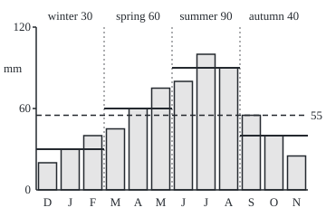
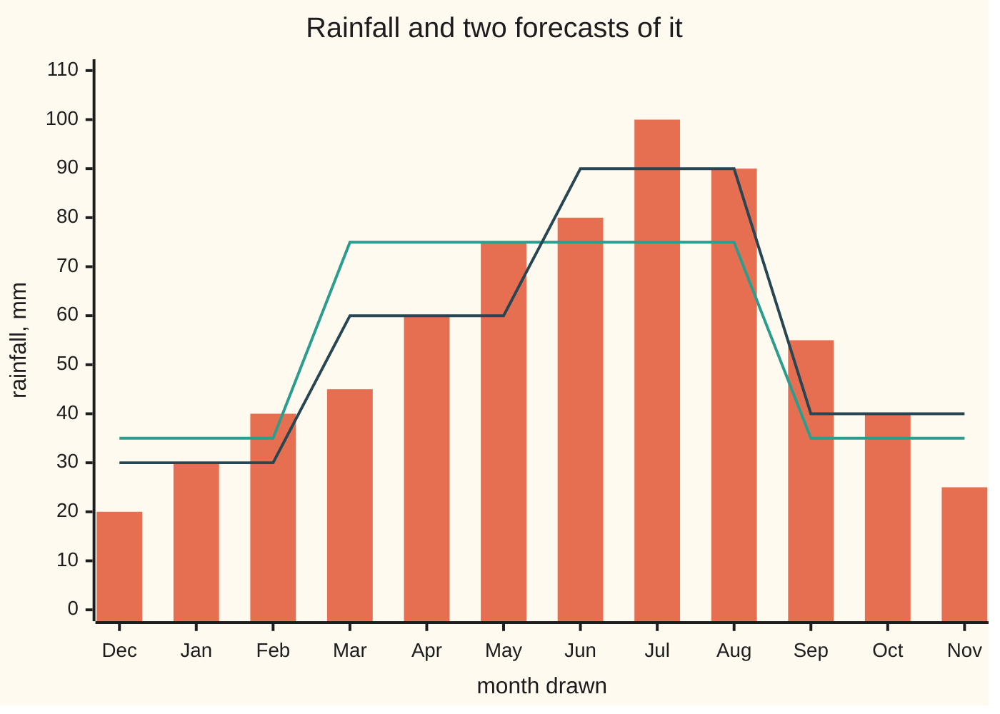

# Conditioning on a partition: the best forecast given which cell you are in is the cell average, and the cells' sigma-algebra is the information

Measure and integration → Conditional Expectation → Forecasting from coarse information → Conditioning on a partition

---

## General Overview

A rain gauge at one station has twelve monthly averages on file, from 20 mm in December to 100 mm in July. Draw a month at random, each equally likely, and read its rainfall. Before the draw, the best single guess is the yearly average: 55 mm.

Now a report arrives that names only the season. Winter (December, January, February) averages 30 mm, spring 60, summer 90, autumn 40. Told "summer", the forecast moves to 90 mm. Told "winter", it drops to 30. Before the report comes in, the forecast is itself uncertain: one of four numbers, each with chance 0.25. Averaged with those chances they give 0.25 × (30 + 60 + 90 + 40) = 55, the yearly average again.

The probability wing computes averages like these from tables, group by group ([conditional-expectation-in-tables](../../09-Probability%20and%20statistics/02-Random%20Variables/05-conditional-expectation-in-tables.md)). This card rebuilds them with measure, in a form that the next card extends to information whose cells all have probability zero. What is known is a **partition**: the outcomes split into cells that do not overlap, and the report names the cell. The forecast is constant on each cell, and over any union of cells its integral equals the rainfall's. Those unions form a sigma-algebra, and from here on that collection *is* the information.

**Given a partition of the outcomes into cells, the conditional expectation of X is the random quantity that equals, on each cell of positive probability, X's average over that cell; it is constant on cells, it has the same integral as X over every union of cells, and apart from cells of probability zero nothing else does both.**

**What kind of fact this is:** a definition, the within-cell average; that it is the only quantity passing both tests, and the best forecast in mean square, is a theorem proved on this card in Why it works.

### The picture: twelve months, four cells

<p align="center"></p>

To scale, 1.5 units per mm. Each bar is one month, December first; the dotted verticals mark the four cells. The solid step over each cell is that season's average, and the dashed line is the yearly average, 55 mm. The steps are the forecast from the season: flat inside a cell, free to jump between cells.

---

## The formula

Notation first, in words. The outcomes are $\Omega$ (omega), here the twelve months; one outcome is $\omega$. $P$ is the probability measure: each month carries 1/12. $X$ is the rainfall of the month drawn. A **partition** $\mathcal{P}$ is a list of sets $B_1, B_2, \ldots$, the **cells**, that do not overlap and together cover $\Omega$; here the four seasons, $k$ = 4 of them. The indicator $1_B$ is one on $B$, zero off it, so $E[X 1_B]$ is the integral of $X$ over $B$ alone: the probability-weighted total of the rainfall in the months of $B$ ([expectation-as-an-integral](../04-The%20Lebesgue%20Integral/06-expectation-as-an-integral.md)). The sigma-algebra generated by the partition, written $\sigma(\mathcal{P})$ and read "the information in the partition", is the collection of all unions of whole cells. Call it $\mathcal{G}$.

$$E[X \mid \mathcal{G}](\omega) = \frac{E[X 1_B]}{P(B)} \qquad \text{for } \omega \text{ in the cell } B, \text{ whenever } P(B) > 0$$

**Read it aloud:** the forecast of X from the information G, at an outcome, is X's total over that outcome's cell divided by the cell's probability, which is X's average over the cell.

The left side, $E[X \mid \mathcal{G}]$, is read "the conditional expectation of X given G". It is a random quantity, a function of $\omega$ like $X$. On a cell of probability 0 the fraction reads 0/0 and any fixed value may be used; Step 3 shows the choice never matters. Write $Y$ for $E[X \mid \mathcal{G}]$ and $c_B$ for its value on the cell $B$. The two properties that characterise $Y$ are

$$Y \text{ is constant on every cell}, \qquad E[Y 1_A] = E[X 1_A] \ \text{ for every } A \text{ in } \mathcal{G}.$$

**Read it aloud:** the forecast uses nothing but the name of the cell, and over every event the information can confirm, its total equals X's total.

On the seasons: for summer, $E[X 1_B]$ = (80 + 100 + 90) × 1/12 = 22.5, and $P(B)$ = 0.25, so the summer forecast is 22.5 / 0.25 = 90.

One quantity that meets the definition, and two that fail. The season forecast 30, 60, 90, 40 is constant on seasons and matches $X$ on all 16 unions of seasons: it is $E[X \mid \mathcal{G}]$. The constant 55 is constant on seasons, but its total on summer is 13.75 against $X$'s 22.5, so it fails the second test; it is the forecast from no information at all. The rainfall $X$ matches itself everywhere but changes inside every season, so it fails the first test.

| Symbol | Plain meaning | In our example | Push it up and the answer… |
| --- | --- | --- | --- |
| $\Omega$, $\omega$ | all outcomes; one outcome | the 12 months; July | more outcomes: more to average over |
| $P$ | the probability measure | 1/12 per month, 0.25 per season | more weight on a month pulls its cell's average toward it |
| $X$ | the quantity to forecast | rainfall of the month drawn: 100 mm in July | raising one month raises its cell's forecast by a third as much |
| $\mathcal{P}$, $B$, $B_1$, $B_i$, $B_k$, $k$ | the partition; a cell; the cells listed; how many | the 4 seasons; summer | finer cells: a forecast closer to X |
| $\mathcal{G}$, $\sigma$ | the sigma-algebra of unions of cells: the information | $\sigma(\mathcal{P})$, 16 sets | more sets: more questions settled |
| $A$, $I$ | a set in $\mathcal{G}$; the cells it is made of | spring or summer | — |
| $1_A$, $1_B$ | indicators: one on the set, zero off it | 1 on the summer months | — |
| $E$, $E[X 1_B]$ | expectation, the integral against $P$; X's total over $B$ | summer: 22.5 | — |
| $E[X \mid \mathcal{G}]$, $Y$, $c_B$, $c_i$ | the conditional expectation, the forecast from $\mathcal{G}$; its value on a cell | $c_B$ = 90 on each summer month | — |
| $Z$, $d_B$, $d_i$, $d$ | any other cell-constant candidate; its value on a cell | the constant 55 | error grows with the square of the gap to $c_B$ |
| $i$, $n$, $N$ | indices; the union of the cells of probability 0 | the 13th record's cell | — |
| $S$, $a$, $b$ | in the proof: a Borel set of values; two values | — | — |
| $\mathcal{F}$, $\mathcal{U}$ | in the proof: the probability space's sigma-algebra, all its events; the collection of all unions of cells | every set of months, 4,096; the 16 unions of seasons | — |
| $X^+$, $X^-$, $Y^+$, $Y^-$ | in the proof: positive and negative parts, $X^+ = \max(X, 0)$, $X^- = \max(-X, 0)$ | rainfall is never negative: $X^+ = X$, $X^- = 0$ | — |

### When it holds

- **The cells are events, they do not overlap, and there are at most countably many.** Each must lie in the probability space's sigma-algebra. With uncountably many cells, every point of [0, 1] its own cell, each cell has probability 0 and the formula reads 0/0 everywhere; [conditional-expectation-on-a-sigma-algebra](02-conditional-expectation-on-a-sigma-algebra.md) handles that case.
- **X is integrable:** $E|X|$ is finite. Without it a cell's total can be infinite. A cell holding outcomes n = 1, 2, 3, … with chance 2^-n and X = 2^n has running totals 10, 20, 40 after 10, 20, 40 terms: they grow without bound, the total is infinite, and there is no finite average.
- **Cells of probability 0 get a free value.** Two different choices are two versions of the conditional expectation. They differ only on a null set, so every statement about $E[X \mid \mathcal{G}]$ holds almost surely (a.s.: except on a set of probability zero).
- **Nothing else is assumed.** No independence, no shape for the law of $X$: only the partition and $P$.

---

## Why it works

### Step 0: knowing the cell is knowing which events of G happened

Told "summer", one can answer "spring or summer?" (yes) and "winter?" (no), but not "July?". The questions a season report settles are exactly the unions of seasons: 2^4 = 16 of them. A forecast that uses only the report depends only on the cell, so it is constant on cells. It should also be right on average over every event the report can confirm: the matching test. Both halves of the definition come from reading information as $\mathcal{G}$.

### Step 1: the unions of cells are the sigma-algebra, and G-measurable means constant on cells

Any sigma-algebra that holds the cells holds their countable unions. And the unions already form a sigma-algebra: all of $\Omega$ is the union of every cell, the complement of a union of cells is the union of the other cells (the cells do not overlap and they cover), and a union of unions is a union. So $\sigma(\mathcal{P})$ is exactly the unions, $2^k$ sets for $k$ cells. [random-variables-and-their-information](../03-Measurable%20Functions/04-random-variables-and-their-information.md) reached the same shape for the sigma-algebra a random variable generates: its pieces are there called atoms.

A function constant on cells is $\mathcal{G}$-measurable, "measurable with respect to G": every set of the form "its value lies in this range" is a union of cells. The converse holds too. If a function took two values inside one cell, the set where it takes the first would contain part of that cell and not the rest, and no union of whole cells does that. So "uses only the information in $\mathcal{G}$" and "constant on the cells" are the same condition. The code tests each forecast's level sets against the list of unions.

### Step 2: the cell average matches X on every union of cells

On a single cell of positive probability, $E[Y 1_B] = c_B P(B) = E[X 1_B]$, because $c_B$ was defined as that ratio. On a union of cells, both sides add up over the cells, since the integral adds over sets that do not overlap. For spring or summer: 0.25 × 60 + 0.25 × 90 = 37.5, and the rainfall's own total over those six months is 37.5 too. A cell of probability 0 adds 0 to both sides, whatever value $Y$ takes there.

With countably many cells the adding runs forever; integrability of $X$ makes the sum finite and its order irrelevant.

### Step 3: nothing else passes both tests

Take any $Z$ that is constant on cells, with value $d_B$ on $B$, and matches $X$ on every set in $\mathcal{G}$. Matching on the cell $B$ itself says $d_B P(B) = E[X 1_B]$. When $P(B) > 0$, divide: $d_B = c_B$. So $Z$ and $Y$ can differ only on cells of probability 0, and the union of those is a countable union of null sets, itself null. $Z = Y$ almost surely.

The code adds a thirteenth outcome, a test record reading 500 mm with probability 0, as a cell of its own. Setting the forecast there to 0 or to 999 gives two versions, and both pass the matching test on all 2^5 = 32 unions.

The test is asked only of sets in $\mathcal{G}$. On July alone the season forecast totals 7.5 against the rainfall's 8.33. That is no defect: a season report never says whether the month was July.

### Step 4: the cell average is the best cell-constant forecast

Among forecasts constant on cells, which has the smallest mean squared error, $E[(X - Z)^2]$? On one cell, with $Z$ = $d$ there,

$$E[(X - d)^2 1_B] = E[(X - c_B)^2 1_B] + P(B)\,(c_B - d)^2 .$$

The cross term $2(c_B - d)\,E[(X - c_B) 1_B]$ has vanished because $X - c_B$ has total 0 over $B$: that is Step 2 again. So the error on each cell is least at $d = c_B$, and adding over cells, the cell averages give the least error overall. The code checks this by brute force: trying every whole number from 0 to 120 mm on every cell finds exactly the cell averages (whole numbers here), for all four partitions below. This is the finite case of [conditional-expectation-as-projection](03-conditional-expectation-as-projection.md).

<details>
<summary>Detailed proof</summary>

**Setting.** $(\Omega, \mathcal{F}, P)$ is a probability space, $\mathcal{F}$ its sigma-algebra of events. The cells $B_1, B_2, \ldots$ (finitely or countably many) lie in $\mathcal{F}$, are pairwise disjoint and cover $\Omega$. $X$ is integrable. Put $c_i = E[X 1_{B_i}]/P(B_i)$ when $P(B_i) > 0$ and $c_i = 0$ otherwise, and $Y = \sum_i c_i 1_{B_i}$, which at each $\omega$ has exactly one nonzero term.

**Claim 1: $\sigma(\mathcal{P}) = \{\bigcup_{i \in I} B_i : I \text{ a set of indices}\}$.** Call the right side $\mathcal{U}$. $\Omega$ is the union over all indices. The complement of $\bigcup_{i \in I} B_i$ is $\bigcup_{i \notin I} B_i$, because every $\omega$ lies in exactly one cell. A countable union of members of $\mathcal{U}$ is the union over the union of their index sets. So $\mathcal{U}$ is a sigma-algebra holding every cell. Any sigma-algebra holding every cell holds all their unions, which are countable, so $\mathcal{U}$ is the smallest: $\mathcal{U} = \sigma(\mathcal{P})$.

**Claim 2: a real function $Z$ is $\mathcal{G}$-measurable exactly when it is constant on each cell.** If $Z$ equals $d_i$ on $B_i$, then for any Borel set $S$ the set $\{Z \in S\}$ is the union of the cells with $d_i$ in $S$, a member of $\mathcal{G}$ by Claim 1. Conversely let $Z$ be $\mathcal{G}$-measurable and suppose $Z(\omega) = a \ne b = Z(\omega')$ with $\omega, \omega'$ in the same cell $B_i$. The set $\{Z = a\}$ is the preimage of the Borel set containing only $a$, so it is in $\mathcal{G}$, a union of whole cells by Claim 1. It contains $\omega$, so it contains $B_i$, so it contains $\omega'$: then $Z(\omega') = a$, a contradiction.

**Claim 3: $Y$ is $\mathcal{G}$-measurable and integrable.** It is constant on cells, so Claim 2 applies. By countable additivity of the integral of the nonnegative $|X|$ over disjoint sets (monotone convergence), $E|Y| = \sum_i P(B_i)\,|c_i| = \sum_{P(B_i) > 0} |E[X 1_{B_i}]| \le \sum_i E[|X| 1_{B_i}] = E|X| < \infty$.

**Claim 4: $E[Y 1_A] = E[X 1_A]$ for every $A$ in $\mathcal{G}$.** Write $A = \bigcup_{i \in I} B_i$. If $P(B_i) = 0$ then $|E[X 1_{B_i}]| \le E[|X| 1_{B_i}] = 0$, since the integral over a null set is 0. So for every $i$, $E[Y 1_{B_i}] = c_i P(B_i) = E[X 1_{B_i}]$. Split $X$ into its positive and negative parts, $X^+ = \max(X, 0)$ and $X^- = \max(-X, 0)$, both with finite integral. Countable additivity over the disjoint $B_i$, applied to each part and to $Y^+$, $Y^-$ likewise, gives $E[X 1_A] = \sum_{i \in I} E[X 1_{B_i}]$ and $E[Y 1_A] = \sum_{i \in I} E[Y 1_{B_i}]$, both series converging absolutely by Claim 3. The terms agree, so the sums do.

**Claim 5: uniqueness.** Let $Z$ be $\mathcal{G}$-measurable, integrable, with $E[Z 1_A] = E[X 1_A]$ for all $A$ in $\mathcal{G}$. By Claim 2, $Z = d_i$ on $B_i$. Taking $A = B_i$: $d_i P(B_i) = E[X 1_{B_i}] = c_i P(B_i)$, so $d_i = c_i$ whenever $P(B_i) > 0$. Hence $\{Z \ne Y\}$ lies inside $N$, the union of the cells of probability 0, and $P(N) \le \sum P(B_i) = 0$ over those cells by countable subadditivity. So $Z = Y$ a.s.

**Claim 6: least mean squared error.** Assume also $E[X^2] < \infty$, and let $Z$ be $\mathcal{G}$-measurable, $Z = d_i$ on $B_i$. On a cell with $P(B_i) > 0$, expand $(X - d_i)^2 = (X - c_i)^2 + 2(c_i - d_i)(X - c_i) + (c_i - d_i)^2$ and integrate over $B_i$: the middle term gives $2(c_i - d_i)(E[X 1_{B_i}] - c_i P(B_i)) = 0$ by the definition of $c_i$. So $E[(X - Z)^2 1_{B_i}] = E[(X - Y)^2 1_{B_i}] + P(B_i)(c_i - d_i)^2 \ge E[(X - Y)^2 1_{B_i}]$. Null cells contribute 0 to both sides. Adding over all cells by countable additivity of nonnegative integrals, $E[(X - Z)^2] \ge E[(X - Y)^2]$, with equality exactly when $d_i = c_i$ on every cell of positive probability.

</details>

### Step 5: more information, finer cells, smaller error

Four partitions of the same twelve months, from coarse to fine: nothing known (one cell); half-year (cool September to February, warm March to August); season; month. Their sigma-algebras hold 2, 4, 16 and 4,096 sets, and each contains the one before. The forecasts are 55 flat; 35 and 75; 30, 60, 90, 40; and $X$ itself. Their mean squared errors fall: 633.33, 233.33, 108.33, 0 mm^2. The first is the variance of $X$. The last is 0 because knowing the month is knowing the rainfall.



Bars: the month's rainfall, which is also the forecast when the month is known. Two-level line: the forecast from the half-year. Four-level line: the forecast from the season. Each is flat wherever its information cannot tell months apart.

Every one of these forecasts averages back to 55 over the year: 0.25 × (30 + 60 + 90 + 40) for the seasons, and likewise for the half-years. That is the matching test on $A = \Omega$, the one set every sigma-algebra holds. Forecasting from the season and then forgetting the season is a case of the tower rule, proved for any two nested sigma-algebras in [rules-of-conditional-expectation](04-rules-of-conditional-expectation.md).

A second road to the ratio: $E[X 1_B]/P(B)$ is the average of $X$ under the conditional probability $P(\cdot \mid B)$, the chances rescaled to live on $B$ ([conditional-probability](../../09-Probability%20and%20statistics/01-Chance%20and%20Events/05-conditional-probability.md)). That reading breaks when $P(B) = 0$. The matching test does not, which is why [conditional-expectation-on-a-sigma-algebra](02-conditional-expectation-on-a-sigma-algebra.md) keeps the test as the definition and drops the ratio.

---

## Worked numbers, by hand

| Step | Arithmetic | Value |
| --- | --- | --- |
| winter's total, $E[X 1_B]$ | (20 + 30 + 40) × 1/12 | 7.5 |
| winter's probability | 3 × 1/12 | 0.25 |
| winter forecast | 7.5 / 0.25 | **30** mm |
| spring, summer, autumn | 15 / 0.25, 22.5 / 0.25, 10 / 0.25 | **60**, **90**, **40** mm |
| test on "spring or summer" | 0.25 × 60 + 0.25 × 90, against (45 + 60 + 75 + 80 + 100 + 90) × 1/12 | 37.5 = 37.5 |
| forecast averaged over the year | 0.25 × (30 + 60 + 90 + 40) | **55** mm |
| error with the season known | average of (X − forecast)^2 | 108.33 mm^2 |
| error with nothing known | average of (X − 55)^2 | 633.33 mm^2 |
| spread of the forecast itself | average of (forecast − 55)^2 | 525 mm^2, and 108.33 + 525 = 633.33 |

Told only the season, a forecaster should say 30, 60, 90 or 40 mm; over the year those forecasts average to the same 55 mm as the rainfall, and knowing the season cuts the mean squared error from 633.33 to 108.33 mm^2. The last row splits the total spread into what the season explains, 525, and what stays inside the seasons, 108.33.

### What breaks if you drop a piece

| Mistake | Comes out at | What went wrong |
| --- | --- | --- |
| The forecast taken as one number, 55 | on summer, 13.75 against X's 22.5 | 55 is the forecast from no information; it fails the test on summer |
| No division by $P(B)$ | "forecasts" 7.5, 15, 22.5, 10 mm | those are cell totals, a quarter of the averages |
| The test demanded on July alone | 7.5 against 8.33 | July is not in $\mathcal{G}$; the test covers only $\mathcal{G}$ |
| Dividing on a cell of probability 0 | 0/0; the values 0 and 999 both pass on all 32 sets | the value there is a free choice, fixed only almost surely |
| X not integrable, X = 2^n with chance 2^-n | the cell's running total after 10, 20, 40 terms: 10, 20, 40 | no finite total, so no average |

The code prints all five.

---

## Code, from first principles, and it actually runs

The code builds the forecast for four partitions by three roads that share no arithmetic: each cell's total divided by its probability, in exact fractions; a search over every whole-number value from 0 to 120 mm on each cell for the least squared error, which never divides; and 120,000 simulated draws from a SplitMix64 generator written out in both languages. For every partition it lists the whole sigma-algebra and checks the matching test on every set, all 4,096 for the months. It checks these finite cases exactly; every countable partition and every integrable X is the proof's.

### Python

```python
# Conditioning on a partition -- the check behind the card.  Standard library
# only.  Twelve months, equally likely, each with its average rainfall in mm at
# one station.  The information is a partition of the months into cells.  The
# forecast from it is built by three roads that share no arithmetic: the
# within-cell average in exact fractions, a least-squares search over every
# cell-constant forecast on a grid, and a simulation driven by a SplitMix64
# generator written out below.  The code checks finite cases exactly; the
# statements for every partition and every integrable X are the proof's.
from fractions import Fraction as Q

MONTHS = ["Dec", "Jan", "Feb", "Mar", "Apr", "May", "Jun", "Jul", "Aug", "Sep", "Oct", "Nov"]
RAIN = [20, 30, 40, 45, 60, 75, 80, 100, 90, 55, 40, 25]
P = [Q(1, 12)] * 12
PARTITIONS = [
    ("nothing known", [list(range(12))]),
    ("half-year", [[9, 10, 11, 0, 1, 2], [3, 4, 5, 6, 7, 8]]),      # cool Sep-Feb, warm Mar-Aug
    ("season", [[0, 1, 2], [3, 4, 5], [6, 7, 8], [9, 10, 11]]),      # winter, spring, summer, autumn
    ("month", [[i] for i in range(12)]),
]

def integral(f, A, p):                       # E[f 1_A]: the integral of f over the set A
    return sum((p[i] * f[i] for i in A), Q(0))

def cond(x, cells, p, null_value=0):         # road one: E[X 1_B] / P(B) on every cell
    y = [None] * len(x)
    for B in cells:
        pb = sum((p[i] for i in B), Q(0))
        c = integral(x, B, p) / pb if pb > 0 else Q(null_value)
        for i in B:
            y[i] = c
    return y

def least_squares(x, cells, p):              # road two: the cell-constant forecast with least squared error
    y = [None] * len(x)
    for B in cells:
        c = min(range(0, 121), key=lambda c: sum((p[i] * (x[i] - c) ** 2 for i in B), Q(0)))
        for i in B:
            y[i] = Q(c)
    return y

def unions(cells):                           # sigma(partition): every union of whole cells
    return [sorted(i for k, B in enumerate(cells) if m >> k & 1 for i in B) for m in range(1 << len(cells))]

def dec(q):                                  # exact fraction as a whole number, or rounded to 2 places
    if q.denominator == 1:
        return str(q.numerator)
    r = (200 * q.numerator + q.denominator) // (2 * q.denominator)
    return f"{r // 100}.{r % 100:02d}"

MASK = (1 << 64) - 1
def splitmix64(state):                       # one step of SplitMix64: returns (new state, output)
    state = (state + 0x9E3779B97F4A7C15) & MASK
    z = state
    z = ((z ^ (z >> 30)) * 0xBF58476D1CE4E5B9) & MASK
    z = ((z ^ (z >> 27)) * 0x94D049BB133111EB) & MASK
    return state, z ^ (z >> 31)

print("month rainfall, mm: " + ", ".join(f"{m} {r}" for m, r in zip(MONTHS, RAIN)))
print(f"plain mean E[X] = {dec(integral(RAIN, range(12), P))} mm")
results = {}
for name, cells in PARTITIONS:
    y1, y2 = cond(RAIN, cells, P), least_squares(RAIN, cells, P)
    G = unions(cells)
    match = all(integral(y1, A, P) == integral(RAIN, A, P) for A in G)
    levels_in_G = all(sorted(i for i in range(12) if y1[i] == v) in G for v in set(y1))
    mse = integral([(RAIN[i] - y1[i]) ** 2 for i in range(12)], range(12), P)
    results[name] = (y1, y2, len(set(map(tuple, G))), match, levels_in_G, mse)   # distinct sets
    print(f"{name}: cells {len(cells)}, sets in sigma {len(G)}; forecast by month: " + ", ".join(dec(v) for v in y1))
    print(f"  least squares agrees: {'yes' if y1 == y2 else 'no'}; constant on cells: {'yes' if levels_in_G else 'no'}; "
          f"integrals match on all {len(G)} sets: {'yes' if match else 'no'}; mean squared error {dec(mse)}")
season = results["season"][0]
cells = PARTITIONS[2][1]
print("season cells: " + "; ".join(f"{n} P = {dec(sum(P[i] for i in B))}, E[X 1_B] = {dec(integral(RAIN, B, P))}, average {dec(season[B[0]])}"
                                   for n, B in zip(["winter", "spring", "summer", "autumn"], cells)))
print(f"average of the season forecast: {dec(integral(season, range(12), P))} mm")
mean = integral(RAIN, range(12), P)
var_y = integral([(v - mean) ** 2 for v in season], range(12), P)
print(f"spread of the season forecast E[(Y - 55)^2] = {dec(var_y)}; plus its error {dec(results['season'][5])} = {dec(var_y + results['season'][5])}")
warm = cells[1] + cells[2]
print(f"spring or summer, a set in sigma(season): E[Y 1_A] = {dec(integral(season, warm, P))}, E[X 1_A] = {dec(integral(RAIN, warm, P))}")
# road three: simulate months, average the rainfall inside each season
seed, n = 20260929, 120000
state = seed
count, total, square = [0] * 4, [0] * 4, [0] * 4
for _ in range(n):
    state, z = splitmix64(state)
    m = z % 12
    k = m // 3
    count[k] += 1
    total[k] += RAIN[m]
    square[k] += RAIN[m] ** 2
sim = [total[k] / count[k] for k in range(4)]
se = [((square[k] / count[k] - sim[k] ** 2) / count[k]) ** 0.5 for k in range(4)]
print(f"simulation, seed {seed}, {n} draws: counts {count}; season averages " + ", ".join(f"{s:.2f}" for s in sim)
      + "; standard errors " + ", ".join(f"{s:.3f}" for s in se))
# what breaks
summer = cells[2]
print(f"mistake 1, forecast taken as the number 55: on summer E[55 1_B] = {dec(integral([Q(55)] * 12, summer, P))}, "
      f"E[X 1_B] = {dec(integral(RAIN, summer, P))}")
print("mistake 2, no division by P(B): 'forecasts' " + ", ".join(dec(integral(RAIN, B, P)) for B in cells))
jul = [7]
print(f"mistake 3, matching asked on July alone, not in sigma(season): E[Y 1_A] = {dec(integral(season, jul, P))}, "
      f"E[X 1_A] = {dec(integral(RAIN, jul, P))}")
x13, p13 = RAIN + [500], P + [Q(0)]                  # a 13th outcome: a test record with probability 0
cells13 = cells + [[12]]
v0, v999 = cond(x13, cells13, p13, 0), cond(x13, cells13, p13, 999)
both = all(integral(v, A, p13) == integral(x13, A, p13) for v in (v0, v999) for A in unions(cells13))
print(f"mistake 4, a cell of probability 0 holding a {x13[12]} mm test record: versions give it {dec(v0[12])} and {dec(v999[12])}; "
      f"both match on all 32 sets: {'yes' if both else 'no'}")
partial = [sum(Q(1, 2 ** j) * 2 ** j for j in range(1, t + 1)) for t in (10, 20, 40)]
print(f"mistake 5, X = 2^n with chance 2^-n on one cell: E[X 1_B] after 10, 20, 40 terms = "
      + ", ".join(dec(s) for s in partial))
fig = lambda mm: f"{(2100 - 15 * mm) // 10}.{(2100 - 15 * mm) % 10}"   # the picture's y for a height in mm
print("figure, 1.5 units per mm, baseline y 210, bar tops: " + ", ".join(f"{m} {fig(r)}" for m, r in zip(MONTHS, RAIN))
      + "; season lines y " + ", ".join(fig(int(season[B[0]])) for B in cells) + f"; mean line y {fig(55)}")
assert all(r[0] == r[1] for r in results.values())                 # two roads to every forecast
assert all(r[3] and r[4] for r in results.values())                # the defining property on all of sigma
assert [r[2] for r in results.values()] == [2, 4, 16, 4096]
assert integral(season, range(12), P) == sum(Q(r) for r in RAIN) / 12
assert all(abs(sim[k] - float(season[3 * k])) < 4 * se[k] for k in range(4))
assert integral(season, jul, P) != integral(RAIN, jul, P)           # outside sigma, no match
assert both                                                         # versions differ only where P is 0
assert cond(x13, cells[:2] + [cells[2] + [12], cells[3]], p13)[12] == 90  # a null record leaves summer at 90
assert var_y + results["season"][5] == results["nothing known"][5]  # between plus within = total spread
assert [r[5] for r in results.values()] == [Q(1900, 3), Q(700, 3), Q(325, 3), 0]
print("ALL CHECKS PASS")
```

**Ran 2026-10-06 on macOS, Python 3.14.6, standard library only. All checks passed. Output, pasted from the run:**

```
month rainfall, mm: Dec 20, Jan 30, Feb 40, Mar 45, Apr 60, May 75, Jun 80, Jul 100, Aug 90, Sep 55, Oct 40, Nov 25
plain mean E[X] = 55 mm
nothing known: cells 1, sets in sigma 2; forecast by month: 55, 55, 55, 55, 55, 55, 55, 55, 55, 55, 55, 55
  least squares agrees: yes; constant on cells: yes; integrals match on all 2 sets: yes; mean squared error 633.33
half-year: cells 2, sets in sigma 4; forecast by month: 35, 35, 35, 75, 75, 75, 75, 75, 75, 35, 35, 35
  least squares agrees: yes; constant on cells: yes; integrals match on all 4 sets: yes; mean squared error 233.33
season: cells 4, sets in sigma 16; forecast by month: 30, 30, 30, 60, 60, 60, 90, 90, 90, 40, 40, 40
  least squares agrees: yes; constant on cells: yes; integrals match on all 16 sets: yes; mean squared error 108.33
month: cells 12, sets in sigma 4096; forecast by month: 20, 30, 40, 45, 60, 75, 80, 100, 90, 55, 40, 25
  least squares agrees: yes; constant on cells: yes; integrals match on all 4096 sets: yes; mean squared error 0
season cells: winter P = 0.25, E[X 1_B] = 7.50, average 30; spring P = 0.25, E[X 1_B] = 15, average 60; summer P = 0.25, E[X 1_B] = 22.50, average 90; autumn P = 0.25, E[X 1_B] = 10, average 40
average of the season forecast: 55 mm
spread of the season forecast E[(Y - 55)^2] = 525; plus its error 108.33 = 633.33
spring or summer, a set in sigma(season): E[Y 1_A] = 37.50, E[X 1_A] = 37.50
simulation, seed 20260929, 120000 draws: counts [30085, 30304, 29853, 29758]; season averages 30.04, 60.05, 89.91, 40.04; standard errors 0.047, 0.070, 0.047, 0.071
mistake 1, forecast taken as the number 55: on summer E[55 1_B] = 13.75, E[X 1_B] = 22.50
mistake 2, no division by P(B): 'forecasts' 7.50, 15, 22.50, 10
mistake 3, matching asked on July alone, not in sigma(season): E[Y 1_A] = 7.50, E[X 1_A] = 8.33
mistake 4, a cell of probability 0 holding a 500 mm test record: versions give it 0 and 999; both match on all 32 sets: yes
mistake 5, X = 2^n with chance 2^-n on one cell: E[X 1_B] after 10, 20, 40 terms = 10, 20, 40
figure, 1.5 units per mm, baseline y 210, bar tops: Dec 180.0, Jan 165.0, Feb 150.0, Mar 142.5, Apr 120.0, May 97.5, Jun 90.0, Jul 60.0, Aug 75.0, Sep 127.5, Oct 150.0, Nov 172.5; season lines y 165.0, 120.0, 75.0, 150.0; mean line y 127.5
ALL CHECKS PASS
```

### Rust

Same numbers, same labels, built with `rustc --edition 2021 -O`.

```rust
// Conditioning on a partition -- the same check as the Python, in Rust, std
// only.  Twelve months, equally likely, each with its average rainfall in mm at
// one station.  The information is a partition of the months into cells.  The
// forecast from it is built by three roads that share no arithmetic: the
// within-cell average in exact fractions (a small rational type written here),
// a least-squares search over every cell-constant forecast on a grid, and a
// simulation driven by a SplitMix64 generator written out below.  The code
// checks finite cases exactly; the statements in general are the proof's.
use std::ops::{Add, Div, Mul, Sub};

#[derive(Clone, Copy, Debug, PartialEq)]
struct Q { n: i64, d: i64 }                   // a fraction n/d in lowest terms, d > 0
fn gcd(a: i64, b: i64) -> i64 { if b == 0 { a.abs() } else { gcd(b, a % b) } }
fn q(n: i64, d: i64) -> Q { let g = gcd(n, d).max(1) * d.signum(); Q { n: n / g, d: d / g } }
impl Add for Q { type Output = Q; fn add(self, o: Q) -> Q { q(self.n * o.d + o.n * self.d, self.d * o.d) } }
impl Sub for Q { type Output = Q; fn sub(self, o: Q) -> Q { q(self.n * o.d - o.n * self.d, self.d * o.d) } }
impl Mul for Q { type Output = Q; fn mul(self, o: Q) -> Q { q(self.n * o.n, self.d * o.d) } }
impl Div for Q { type Output = Q; fn div(self, o: Q) -> Q { q(self.n * o.d, self.d * o.n) } }
fn z(n: i64) -> Q { q(n, 1) }
fn less(a: Q, b: Q) -> bool { a.n * b.d < b.n * a.d }

const MONTHS: [&str; 12] = ["Dec", "Jan", "Feb", "Mar", "Apr", "May", "Jun", "Jul", "Aug", "Sep", "Oct", "Nov"];
const RAIN: [i64; 12] = [20, 30, 40, 45, 60, 75, 80, 100, 90, 55, 40, 25];

fn integral(f: &[Q], a: &[usize], p: &[Q]) -> Q {       // E[f 1_A]: the integral of f over the set A
    a.iter().fold(z(0), |s, &i| s + p[i] * f[i])
}

fn cond(x: &[Q], cells: &[Vec<usize>], p: &[Q], null_value: i64) -> Vec<Q> { // road one: E[X 1_B] / P(B)
    let mut y = vec![z(0); x.len()];
    for b in cells {
        let pb = b.iter().fold(z(0), |s, &i| s + p[i]);
        let c = if pb.n > 0 { integral(x, b, p) / pb } else { z(null_value) };
        for &i in b { y[i] = c; }
    }
    y
}

fn least_squares(x: &[Q], cells: &[Vec<usize>], p: &[Q]) -> Vec<Q> { // road two: least squared error
    let mut y = vec![z(0); x.len()];
    for b in cells {
        let err = |c: i64| b.iter().fold(z(0), |s, &i| s + p[i] * (x[i] - z(c)) * (x[i] - z(c)));
        let mut best = 0;
        for c in 1..=120 { if less(err(c), err(best)) { best = c; } }
        for &i in b { y[i] = z(best); }
    }
    y
}

fn unions(cells: &[Vec<usize>]) -> Vec<Vec<usize>> {    // sigma(partition): every union of whole cells
    (0..1usize << cells.len()).map(|m| {
        let mut a: Vec<usize> = cells.iter().enumerate().filter(|(k, _)| m >> k & 1 == 1)
            .flat_map(|(_, b)| b.iter().copied()).collect();
        a.sort();
        a
    }).collect()
}

fn dec(v: Q) -> String {                                // whole number, or rounded to 2 places
    if v.d == 1 { return v.n.to_string(); }
    let r = (200 * v.n + v.d) / (2 * v.d);
    format!("{}.{:02}", r / 100, r % 100)
}

fn splitmix64(state: u64) -> (u64, u64) {              // one step of SplitMix64
    let s = state.wrapping_add(0x9E3779B97F4A7C15);
    let mut x = s;
    x = (x ^ (x >> 30)).wrapping_mul(0xBF58476D1CE4E5B9);
    x = (x ^ (x >> 27)).wrapping_mul(0x94D049BB133111EB);
    (s, x ^ (x >> 31))
}

fn fig(mm: i64) -> String { format!("{}.{}", (2100 - 15 * mm) / 10, (2100 - 15 * mm) % 10) }
fn yn(b: bool) -> &'static str { if b { "yes" } else { "no" } }
fn join(v: &[Q]) -> String { v.iter().map(|&x| dec(x)).collect::<Vec<_>>().join(", ") }

fn main() {
    let x: Vec<Q> = RAIN.iter().map(|&r| z(r)).collect();
    let p = vec![q(1, 12); 12];
    let all: Vec<usize> = (0..12).collect();
    let partitions: Vec<(&str, Vec<Vec<usize>>)> = vec![
        ("nothing known", vec![all.clone()]),
        ("half-year", vec![vec![9, 10, 11, 0, 1, 2], vec![3, 4, 5, 6, 7, 8]]),
        ("season", vec![vec![0, 1, 2], vec![3, 4, 5], vec![6, 7, 8], vec![9, 10, 11]]),
        ("month", (0..12).map(|i| vec![i]).collect()),
    ];
    let ms: Vec<String> = MONTHS.iter().zip(RAIN.iter()).map(|(m, r)| format!("{} {}", m, r)).collect();
    println!("month rainfall, mm: {}", ms.join(", "));
    println!("plain mean E[X] = {} mm", dec(integral(&x, &all, &p)));
    let mut results = vec![];
    for (name, cells) in &partitions {
        let (y1, y2) = (cond(&x, cells, &p, 0), least_squares(&x, cells, &p));
        let g = unions(cells);
        let matched = g.iter().all(|a| integral(&y1, a, &p) == integral(&x, a, &p));
        let levels_in_g = y1.iter().all(|&v| g.contains(&(0..12).filter(|&i| y1[i] == v).collect::<Vec<usize>>()));
        let sq: Vec<Q> = (0..12).map(|i| (x[i] - y1[i]) * (x[i] - y1[i])).collect();
        let mse = integral(&sq, &all, &p);
        println!("{}: cells {}, sets in sigma {}; forecast by month: {}", name, cells.len(), g.len(), join(&y1));
        println!("  least squares agrees: {}; constant on cells: {}; integrals match on all {} sets: {}; mean squared error {}",
                 yn(y1 == y2), yn(levels_in_g), g.len(), yn(matched), dec(mse));
        let mut h = g.clone(); h.sort(); h.dedup();          // distinct sets in sigma
        results.push((y1.clone(), y1 == y2, h.len(), matched && levels_in_g, mse));
    }
    let season = results[2].0.clone();
    let cells = partitions[2].1.clone();
    let rows: Vec<String> = ["winter", "spring", "summer", "autumn"].iter().zip(cells.iter()).map(|(n, b)|
        format!("{} P = {}, E[X 1_B] = {}, average {}", n, dec(b.iter().fold(z(0), |s, &i| s + p[i])),
                dec(integral(&x, b, &p)), dec(season[b[0]]))).collect();
    println!("season cells: {}", rows.join("; "));
    println!("average of the season forecast: {} mm", dec(integral(&season, &all, &p)));
    let mean = integral(&x, &all, &p);
    let dev: Vec<Q> = season.iter().map(|&v| (v - mean) * (v - mean)).collect();
    let var_y = integral(&dev, &all, &p);
    println!("spread of the season forecast E[(Y - 55)^2] = {}; plus its error {} = {}", dec(var_y), dec(results[2].4), dec(var_y + results[2].4));
    let warm: Vec<usize> = cells[1].iter().chain(cells[2].iter()).copied().collect();
    println!("spring or summer, a set in sigma(season): E[Y 1_A] = {}, E[X 1_A] = {}",
             dec(integral(&season, &warm, &p)), dec(integral(&x, &warm, &p)));
    // road three: simulate months, average the rainfall inside each season
    let (seed, n) = (20260929u64, 120000);
    let mut state = seed;
    let (mut count, mut total, mut square) = ([0i64; 4], [0i64; 4], [0i64; 4]);
    for _ in 0..n {
        let (s, zz) = splitmix64(state);
        state = s;
        let m = (zz % 12) as usize;
        let k = m / 3;
        count[k] += 1;
        total[k] += RAIN[m];
        square[k] += RAIN[m] * RAIN[m];
    }
    let sim: Vec<f64> = (0..4).map(|k| total[k] as f64 / count[k] as f64).collect();
    let se: Vec<f64> = (0..4).map(|k| ((square[k] as f64 / count[k] as f64 - sim[k] * sim[k]) / count[k] as f64).sqrt()).collect();
    println!("simulation, seed {}, {} draws: counts {:?}; season averages {}; standard errors {}", seed, n, count,
             sim.iter().map(|s| format!("{:.2}", s)).collect::<Vec<_>>().join(", "),
             se.iter().map(|s| format!("{:.3}", s)).collect::<Vec<_>>().join(", "));
    // what breaks
    let summer = &cells[2];
    println!("mistake 1, forecast taken as the number 55: on summer E[55 1_B] = {}, E[X 1_B] = {}",
             dec(integral(&vec![z(55); 12], summer, &p)), dec(integral(&x, summer, &p)));
    let raw: Vec<Q> = cells.iter().map(|b| integral(&x, b, &p)).collect();
    println!("mistake 2, no division by P(B): 'forecasts' {}", join(&raw));
    let jul = vec![7usize];
    println!("mistake 3, matching asked on July alone, not in sigma(season): E[Y 1_A] = {}, E[X 1_A] = {}",
             dec(integral(&season, &jul, &p)), dec(integral(&x, &jul, &p)));
    let mut x13 = x.clone(); x13.push(z(500));                 // a 13th outcome: a test record with probability 0
    let mut p13 = p.clone(); p13.push(z(0));
    let mut cells13 = cells.clone(); cells13.push(vec![12]);
    let (v0, v999) = (cond(&x13, &cells13, &p13, 0), cond(&x13, &cells13, &p13, 999));
    let both = unions(&cells13).iter().all(|a| [&v0, &v999].iter().all(|v| integral(v, a, &p13) == integral(&x13, a, &p13)));
    println!("mistake 4, a cell of probability 0 holding a {} mm test record: versions give it {} and {}; both match on all 32 sets: {}",
             dec(x13[12]), dec(v0[12]), dec(v999[12]), yn(both));
    let partial: Vec<Q> = [10u32, 20, 40].iter().map(|&t| (1..=t).fold(z(0), |s, j| s + q(1, 1i64 << j) * z(1i64 << j))).collect();
    println!("mistake 5, X = 2^n with chance 2^-n on one cell: E[X 1_B] after 10, 20, 40 terms = {}", join(&partial));
    let bars: Vec<String> = MONTHS.iter().zip(RAIN.iter()).map(|(m, &r)| format!("{} {}", m, fig(r))).collect();
    let lines: Vec<String> = cells.iter().map(|b| fig(season[b[0]].n)).collect();
    println!("figure, 1.5 units per mm, baseline y 210, bar tops: {}; season lines y {}; mean line y {}",
             bars.join(", "), lines.join(", "), fig(55));
    assert!(results.iter().all(|r| r.1));                               // two roads to every forecast
    assert!(results.iter().all(|r| r.3));                               // the defining property on all of sigma
    assert_eq!(results.iter().map(|r| r.2).collect::<Vec<_>>(), vec![2, 4, 16, 4096]);
    assert!(integral(&season, &all, &p) == q(RAIN.iter().sum(), 12));
    assert!((0..4).all(|k| (sim[k] - season[3 * k].n as f64).abs() < 4.0 * se[k]));
    assert!(integral(&season, &jul, &p) != integral(&x, &jul, &p));      // outside sigma, no match
    assert!(both);                                                      // versions differ only where P is 0
    let summer13 = vec![cells[0].clone(), cells[1].clone(), [cells[2].clone(), vec![12]].concat(), cells[3].clone()];
    assert!(cond(&x13, &summer13, &p13, 0)[12] == z(90));                // a null record leaves summer at 90
    assert!(var_y + results[2].4 == results[0].4);                     // between plus within = total spread
    assert_eq!(results.iter().map(|r| r.4).collect::<Vec<_>>(), vec![q(1900, 3), q(700, 3), q(325, 3), z(0)]);
    println!("ALL CHECKS PASS");
}
```

**Ran 2026-10-06 on macOS, rustc 1.98.1, no crates. All checks passed. Output, pasted from the run:**

```
month rainfall, mm: Dec 20, Jan 30, Feb 40, Mar 45, Apr 60, May 75, Jun 80, Jul 100, Aug 90, Sep 55, Oct 40, Nov 25
plain mean E[X] = 55 mm
nothing known: cells 1, sets in sigma 2; forecast by month: 55, 55, 55, 55, 55, 55, 55, 55, 55, 55, 55, 55
  least squares agrees: yes; constant on cells: yes; integrals match on all 2 sets: yes; mean squared error 633.33
half-year: cells 2, sets in sigma 4; forecast by month: 35, 35, 35, 75, 75, 75, 75, 75, 75, 35, 35, 35
  least squares agrees: yes; constant on cells: yes; integrals match on all 4 sets: yes; mean squared error 233.33
season: cells 4, sets in sigma 16; forecast by month: 30, 30, 30, 60, 60, 60, 90, 90, 90, 40, 40, 40
  least squares agrees: yes; constant on cells: yes; integrals match on all 16 sets: yes; mean squared error 108.33
month: cells 12, sets in sigma 4096; forecast by month: 20, 30, 40, 45, 60, 75, 80, 100, 90, 55, 40, 25
  least squares agrees: yes; constant on cells: yes; integrals match on all 4096 sets: yes; mean squared error 0
season cells: winter P = 0.25, E[X 1_B] = 7.50, average 30; spring P = 0.25, E[X 1_B] = 15, average 60; summer P = 0.25, E[X 1_B] = 22.50, average 90; autumn P = 0.25, E[X 1_B] = 10, average 40
average of the season forecast: 55 mm
spread of the season forecast E[(Y - 55)^2] = 525; plus its error 108.33 = 633.33
spring or summer, a set in sigma(season): E[Y 1_A] = 37.50, E[X 1_A] = 37.50
simulation, seed 20260929, 120000 draws: counts [30085, 30304, 29853, 29758]; season averages 30.04, 60.05, 89.91, 40.04; standard errors 0.047, 0.070, 0.047, 0.071
mistake 1, forecast taken as the number 55: on summer E[55 1_B] = 13.75, E[X 1_B] = 22.50
mistake 2, no division by P(B): 'forecasts' 7.50, 15, 22.50, 10
mistake 3, matching asked on July alone, not in sigma(season): E[Y 1_A] = 7.50, E[X 1_A] = 8.33
mistake 4, a cell of probability 0 holding a 500 mm test record: versions give it 0 and 999; both match on all 32 sets: yes
mistake 5, X = 2^n with chance 2^-n on one cell: E[X 1_B] after 10, 20, 40 terms = 10, 20, 40
figure, 1.5 units per mm, baseline y 210, bar tops: Dec 180.0, Jan 165.0, Feb 150.0, Mar 142.5, Apr 120.0, May 97.5, Jun 90.0, Jul 60.0, Aug 75.0, Sep 127.5, Oct 150.0, Nov 172.5; season lines y 165.0, 120.0, 75.0, 150.0; mean line y 127.5
ALL CHECKS PASS
```

The two outputs match line for line.

> [!TIP]
> **Try changing**
> Guess first, then run it.
> - **A wetter July.** Set July's 100 in `RAIN` to 112. What is the summer forecast now, and the yearly average? 94 mm and 56 mm; the half-year forecast becomes 35 and 77. The roads still agree and the forecast still averages to the plain mean; the assert that keeps summer at 90 when the null test record joins it stops the run.
> - **Another seed.** Set the seed to 7. The simulated season averages move to 30.02, 59.97, 89.99, 40.02, each within a few standard errors of the exact 30, 60, 90, 40, and every assert passes.
> - **Another free value.** In the thirteenth-record case, replace 999 by −7. Still both versions pass on all 32 sets: a cell of probability 0 contributes nothing to any total.

---

## The usual mistake

> [!warning]
> **Treating $E[X \mid \mathcal{G}]$ as a number.** "The expected rainfall given that it is summer" is a number, 90 mm. "The expected rainfall given the season" is a random quantity: 30, 60, 90 or 40, depending on which season the draw lands in. Collapsing it to one number gives 55, which is the forecast from no information and fails the matching test on summer, 13.75 against 22.5.
>
> - **Forgetting to divide by the cell's probability.** The totals 7.5, 15, 22.5 and 10 are a quarter of the forecasts.
> - **Asking the test of every set.** On July alone it gives 7.5 against 8.33, and should: July is not in $\mathcal{G}$.
> - **Dividing by a probability of 0.** A null cell's value is chosen, not computed; the choices agree almost surely.

---

## Where you meet it in real life

- **Climate normals.** Weather services publish each calendar month's average rainfall over past decades: rainfall conditioned on the partition into months. An "anomaly" is the observation minus that forecast.
- **Insurance rating classes.** A premium per class of policy, such as an age band in a region, is the expected claim given the partition into classes.
- **Within and between groups.** The split 633.33 = 525 + 108.33 is the analysis-of-variance split: spread explained by the groups plus spread left inside them.
- **Information arriving in stages.** Season first, then month, is a partition refined over time; the forecasts along such a sequence are the subject of [filtrations-and-martingales](06-filtrations-and-martingales.md).

> **Say it back**
> What is known is which cell of a partition the outcome fell in, and the unions of cells form the sigma-algebra that stands for that knowledge. The conditional expectation of X given it is X's average over each cell: its total over the cell divided by the cell's probability. It is constant on cells, and over every union of cells its integral equals X's. Nothing else does both, except by changing values on cells of probability zero, and among cell-constant forecasts it has the least mean squared error. Told the season, the rainfall forecast is 30, 60, 90 or 40 mm, and those average back to 55.

---

## What this builds on

- [random-variables-and-their-information](../03-Measurable%20Functions/04-random-variables-and-their-information.md): a sigma-algebra read as information, and its atoms, the pieces it cannot split.
- [expectation-as-an-integral](../04-The%20Lebesgue%20Integral/06-expectation-as-an-integral.md): $E[X 1_B]$ as the integral of X over B, and its additivity over disjoint sets.
- [conditional-probability](../../09-Probability%20and%20statistics/01-Chance%20and%20Events/05-conditional-probability.md): chances rescaled to live on one event, the second road to the cell average.

## Where this goes next

- [conditional-expectation-on-a-sigma-algebra](02-conditional-expectation-on-a-sigma-algebra.md): the matching test kept as the definition, for any sigma-algebra, with existence from Radon–Nikodym.
- [conditional-expectation-as-projection](03-conditional-expectation-as-projection.md): Step 4's least squares as an orthogonal projection.
- [rules-of-conditional-expectation](04-rules-of-conditional-expectation.md): the tower rule, taking out what is known, and linearity.
- [conditioning-on-a-random-variable](05-conditioning-on-a-random-variable.md): the partition replaced by the level sets of a quantity that may take a continuum of values.
- [filtrations-and-martingales](06-filtrations-and-martingales.md): information that grows step by step.

Every cell here had positive probability; when the information is an exact reading of a continuous quantity, every cell has probability zero, and how a conditional expectation still exists, defined by the matching test alone, is [conditional-expectation-on-a-sigma-algebra](02-conditional-expectation-on-a-sigma-algebra.md).

---

## Sources

Verified 2026-09-29: every link below opens a page that names the cited work.

- Williams, David. *Probability with Martingales*. Cambridge University Press, 1991. [Publisher page](https://www.cambridge.org/core/books/probability-with-martingales/B4CFCE0D08930FB46C6E93E775503926). Chapter 9, Conditional Expectation, motivates the general definition from the partition case and reads the sigma-algebra as information.
- Durrett, Rick. *Probability: Theory and Examples*, 5th ed. [Author's page with the full text](https://sites.math.duke.edu/~rtd/PTE/pte.html). Section 4.1, Conditional Expectation, which opens with the partition case among its first examples.
- Siegrist, Kyle. "Conditional Expected Value Revisited." Random: Probability, Mathematical Statistics, Stochastic Processes. [Web page](https://www.randomservices.org/random/expect/Conditional2.html). The countable partition into events of positive probability worked in full, with the integral-matching definition.
