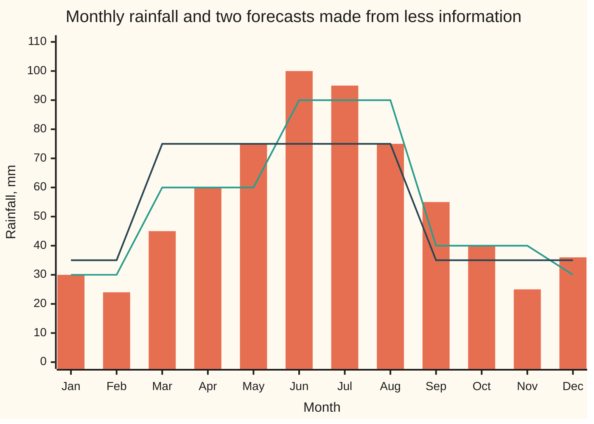

# Conditional expectation on a sigma-algebra: the unique measurable forecast whose integrals match X's on every known event, existing by Radon-Nikodym

[Syllabus](../../../SYLLABUS.md) → [Measure and integration](../../../SYLLABUS.md#w10) → [Conditional Expectation](../../../SYLLABUS.md#w10-s09) → Conditional expectation on a sigma-algebra

---

## General Overview

A rain gauge has logged the long-run rainfall for each month of the year: 30 mm in January, 24 in February, 45 in March, 60 in April, 75 in May, 100 in June, 95 in July, 75 in August, 55 in September, 40 in October, 25 in November and 36 in December. Pick a month at random, each with chance 1 in 12. The rainfall that month averages 55 mm.

Now suppose only the season is known, not the month. Winter (December, January, February) averages 30 mm. Spring averages 60, summer 90, autumn 40. That list of four numbers is a forecast: a rule that turns what is known into a best guess. Know less, and the forecast gets coarser. Told only "wet season" (spring and summer) or "dry season" (autumn and winter), the forecast is 75 or 35.

Averaging within a group works when every group has positive probability; [Conditioning on a partition](01-conditioning-on-a-partition.md) does exactly that, at another station with different months but the same four season averages. It breaks when the information is an exact reading. Read the date exactly, as a point in a continuous year, and each date has probability zero. Averaging over a group of probability zero means dividing zero by zero. This card replaces the division with two tests a forecast must pass. The forecast may use only what is known. And on every event that the known information can decide, the forecast and the true rainfall must add up to the same total. Radon-Nikodym supplies a forecast that passes both tests, and any two that pass agree except on a set of probability zero.

**The conditional expectation of X given the information G is the forecast that uses only that information and matches X's total on every event the information can decide; it always exists when X has a finite average, and it is unique up to a set of probability zero.**

**What kind of fact this is:** a definition, together with a theorem that the defined object exists and is unique, proved on this card in Why it works.

### The picture: one year, three levels of knowledge



The bars are the rainfall month by month: the full information. The first line is the forecast from the season alone, flat within each season. The second line is the forecast from "wet season or not", flat within each half-year. Each line is flat exactly where its information cannot tell months apart.

---

## The formula

Notation first, in words. $\Omega$ (omega) is the set of outcomes: here the twelve months. $\mathcal{F}$ is the sigma-algebra of all events we allow ourselves to measure: here every set of months. $P$ is the probability measure on it: here 1/12 for each month. $X$ is the quantity to forecast, a function on $\Omega$ with a finite average: the rainfall. A **sub-sigma-algebra** $\mathcal{G}$ is a smaller sigma-algebra inside $\mathcal{F}$. Read it as "the events whose outcome the known information decides". The season sigma-algebra holds the 16 unions of whole seasons, from the empty set to the full year. "Is it winter or spring?" is one of them; "is it January?" is not. **$\mathcal{G}$-measurable** means that for every number c, the set "the function is at most c" belongs to $\mathcal{G}$. So a $\mathcal{G}$-measurable forecast can be computed from the known information alone.

The new notation, in words first: $E[X \mid \mathcal{G}]$, read "the conditional expectation of X given G", names a function $M$ on $\Omega$, with a finite average like X, that has two properties.

$$M \text{ is } \mathcal{G}\text{-measurable}, \qquad \int_A M \, dP = \int_A X \, dP \quad \text{for every } A \in \mathcal{G}.$$

**Read it aloud:** the forecast depends only on the known information, and over every event that information can decide, the forecast and the true value have the same total.

The integral over an event, $\int_A X \, dP$, is the integral of X times the indicator of A: the total of X over A, each outcome weighted by its probability. For winter it is (36 + 30 + 24)/12 = 7.50 mm. Dividing by the event's probability gives an average; the definition never divides.

The existence proof builds $M$ from two measures on $\mathcal{G}$, one for the positive part of X and one for the negative part:

$$\nu_+(A) = \int_A X^+ \, dP, \qquad \nu_-(A) = \int_A X^- \, dP, \qquad M = \frac{d\nu_+}{dP|_{\mathcal{G}}} - \frac{d\nu_-}{dP|_{\mathcal{G}}}.$$

**Read it aloud:** split X into its positive part and its negative part (for a rainfall anomaly, the surplus and the shortfall); treat each as a way of giving weight to known events; take each one's density against the probability, looking only at known events; subtract.

| Symbol | Plain meaning | In our example | Push it up and the answer… |
| --- | --- | --- | --- |
| $\Omega$, $\omega$ | the set of outcomes; one outcome | the 12 months; January | — |
| $\mathcal{F}$ | the sigma-algebra of every measurable event | all 4,096 sets of months | — |
| $\mathcal{G}$ | the sub-sigma-algebra of events the information decides | the 16 unions of seasons | more events: the forecast gets finer |
| $P$ | the probability measure | 1/12 per month | — |
| $X$ | the quantity forecast, with a finite average | monthly rainfall, mm | forecast rises on every event where X rises |
| $A$, $C$, $C_j$, $A_k$ | an event in $\mathcal{G}$; an atom, a smallest nonempty one; the j-th cell of a partition; the event "D at least 1/k" | winter; each season is an atom | — |
| $M$, $L$, $D$ | $M = E[X \mid \mathcal{G}]$; $L$ a rival forecast; $D = M - L$ | 30, 60, 90, 40 by season | — |
| $X^+$, $X^-$ | the positive part, max(X, 0), and the negative part, max(−X, 0) | for the anomaly: surplus and shortfall | — |
| $\nu_+$, $\nu_-$ | measures on $\mathcal{G}$: totals of $X^+$ and $X^-$ over each event | each 10.83 on the whole year, for the anomaly | — |
| $h_+$, $h_-$, $P\vert_{\mathcal{G}}$ | the densities of $\nu_+$, $\nu_-$ against $P$ restricted to $\mathcal{G}$ | spring: 8.33 and 3.33 | — |
| $Z$ | the rainfall anomaly, X − 55 | forecast −25, 5, 35, −15 by season | — |
| $U$ | the exact date, a fraction of the year in [0, 1) | U = 0.5 is mid-year | — |
| $V$, $r$ | the hidden wetness factor, spread evenly over [0, 1); the season forecast read off a date | rainfall r(U) × 2V; r is 30, 60, 90 or 40 by quarter-year | a larger V: more rain that year, same forecast r(U) |
| $c$, $k$ | a threshold in "at most c"; a whole number in "at least 1/k" | "M at most 40" is winter and autumn | — |

$X^+$ and $X^-$ are both non-negative and $X = X^+ - X^-$. $P|_{\mathcal{G}}$ is the same probability, applied to the events of $\mathcal{G}$ only. The densities $h_+$ and $h_-$ are the Radon-Nikodym derivatives written with the fraction bar above: functions whose integral over each known event gives that event's weight.

### When it holds

- **X has a finite average of its size**, $\int |X| \, dP$ finite: X is in $L^1$. Drop it and $\nu_+$ and $\nu_-$ can both be infinite, so their difference means nothing; the code prints a quantity whose average swings −1, 0, −1, 0 forever.
- **$\mathcal{G}$ is a sigma-algebra inside $\mathcal{F}$.** If it held an event outside $\mathcal{F}$, the right-hand integral would not exist. If it were not closed under countable unions, Radon-Nikodym could not be applied to it.
- **$P$ is a finite measure**, here a probability. Radon-Nikodym needs sigma-finiteness on $\mathcal{G}$ itself; on an infinite measure a small $\mathcal{G}$ can fail it even when $\mathcal{F}$ does not.
- **Uniqueness is only almost sure.** Two valid forecasts may differ on a $\mathcal{G}$-event of probability zero, so "the" conditional expectation means any one of these versions.

---

## Why it works

### Step 0: test totals on known events, instead of dividing

The partition rule divides a total by a probability. Division fails on an event of probability zero, but a total over such an event is fine: it is zero. So state what the average does, not how to compute it. A forecast from the season must agree with the rainfall's total on winter, on spring, on "winter or spring", and on every other event the season decides. Finding a $\mathcal{G}$-measurable function whose totals reproduce a given measure on $\mathcal{G}$ is what the [The Radon-Nikodym theorem](../08-Densities%20and%20Changing%20Measure/03-radon-nikodym-theorem.md) does.

### Step 1: the season averages pass both tests, and the obvious impostors fail

Take $M$ = 30 on winter months, 60 on spring, 90 on summer, 40 on autumn.

It is $\mathcal{G}$-measurable: each set "M at most c" is a union of seasons. "M at most 40" is winter and autumn together, which is in the season sigma-algebra.

It has a finite average, 55. Its totals match. On winter, $M$ gives 3 × 30/12 = 7.50 and the rainfall gives 90/12 = 7.50. On the wet half, both give 37.50. The code checks all 16 events.

Two candidates fail, one test each. The rainfall itself matches every total, but it is not $\mathcal{G}$-measurable: "X at most 30" is January, February and November, which splits winter and borrows a month of autumn. The constant 55 is $\mathcal{G}$-measurable, but on winter it totals 13.75 against the true 7.50; it matches on only 2 of the 16 events, the empty set and the whole year. The first test stops peeking; the second stops ignoring what is known.

### Step 2: two finite measures on the known events

Let $\nu_+(A)$ be the total of $X^+$ over A, for every A in $\mathcal{G}$, and $\nu_-(A)$ the total of $X^-$. Each is a measure on $\mathcal{G}$. It is finite, because X has a finite average. It gives zero to every known event of probability zero, because a total over a null event is zero. That last property is absolute continuity: $\nu_+$ and $\nu_-$ never give weight where $P$ gives none.

On the anomaly Z = X − 55, the surplus months (April to August) give $\nu_+$ of the whole year 130/12 = 10.83. The shortfall months give $\nu_-$ the same 10.83, since the anomaly averages zero.

### Step 3: take the densities against P, on G only

Radon-Nikodym, applied on the smaller sigma-algebra $\mathcal{G}$, gives $\mathcal{G}$-measurable functions $h_+$ and $h_-$ whose totals over each known event are $\nu_+$ and $\nu_-$. Their difference $M$ is $\mathcal{G}$-measurable, and its total over each known event is $\nu_+(A) - \nu_-(A)$, which is the total of X.

The restriction to $\mathcal{G}$ is the whole trick. Against $P$ on the full $\mathcal{F}$, the density of $\nu_+$ is $X^+$ itself: nothing is gained. On $\mathcal{G}$ there are fewer events to match, so the density is allowed to be coarser, and it must be, to be $\mathcal{G}$-measurable. Same measure, fewer test events, a coarser density.

On the anomaly, spring's months give surplus 0, 5, 20 and shortfall 10, 0, 0. Density of the surplus on the atom: (25/12) ÷ (3/12) = 8.33. Of the shortfall: 3.33. Difference 5.00; add back 55 and spring's forecast is 60.

### Step 4: two valid forecasts agree except on a null event

Suppose $M$ and $L$ both pass. Their difference $D$ is $\mathcal{G}$-measurable and totals zero on every known event. The event "D is at least 1/k", for a whole number k, is known. If it had positive probability, the total of $D$ over it would be at least that probability divided by k, not zero. So it is null for every k, and so is their union, "D above 0". The same argument on −D finishes it. The code shows this on a finite grid: of 194,481 season-constant forecasts, exactly one passes.

### Step 5: the partition rule comes back

A $\mathcal{G}$-measurable function is constant on each atom C, since "equal to its value at one month of C" is a known event, and a known event holding one month of a season holds the whole season. If $P(C)$ is positive, the total test on C forces that constant to be the total of X over C divided by $P(C)$. That is the partition rule, now a consequence. Where $P(C)$ is zero, any constant is allowed: versions again.

<details>
<summary>Detailed proof</summary>

**Setting.** $(\Omega, \mathcal{F}, P)$ a probability space, $\mathcal{G} \subseteq \mathcal{F}$ a sigma-algebra, $X$ an $\mathcal{F}$-measurable function with $\int |X| \, dP$ finite.

**Existence.** (1) For $A \in \mathcal{G}$ put $\nu_\pm(A) = \int_A X^\pm \, dP$. Each is at most $\int |X| \, dP$, so finite. For disjoint $A_1, A_2, \ldots$ in $\mathcal{G}$, the functions $X^\pm$ times the indicator of $A_1 \cup \cdots \cup A_n$ increase to $X^\pm$ times the indicator of the union; the monotone convergence theorem turns the sum of the $\nu_\pm(A_j)$ into $\nu_\pm$ of the union. So $\nu_\pm$ are finite measures on $(\Omega, \mathcal{G})$.

(2) $P|_{\mathcal{G}}$, the restriction of $P$ to $\mathcal{G}$, is a probability measure on $(\Omega, \mathcal{G})$. If $A \in \mathcal{G}$ has $P(A) = 0$, then $X^\pm$ times its indicator is zero almost surely, so $\nu_\pm(A) = 0$: both are absolutely continuous with respect to $P|_{\mathcal{G}}$.

(3) The Radon-Nikodym theorem on $(\Omega, \mathcal{G})$, all measures finite, gives $\mathcal{G}$-measurable $h_\pm \ge 0$ with $\nu_\pm(A) = \int_A h_\pm \, dP|_{\mathcal{G}}$ for all $A \in \mathcal{G}$. Their integrals $\nu_\pm(\Omega)$ are finite, so the $\mathcal{G}$-set where either is infinite is null; set both to zero there. Nothing above changes.

(4) For a $\mathcal{G}$-measurable $g \ge 0$, $\int g \, dP|_{\mathcal{G}} = \int g \, dP$. For an indicator of a $\mathcal{G}$-set both sides are its probability. Linearity extends this to $\mathcal{G}$-simple functions. The standard staircase of simple functions below g is built from g's own level sets, which are in $\mathcal{G}$, and monotone convergence passes to the limit on both sides.

(5) Put $M = h_+ - h_-$. It is $\mathcal{G}$-measurable. By (4), $\int |M| \, dP \le \int h_+ \, dP + \int h_- \, dP = \nu_+(\Omega) + \nu_-(\Omega) = \int |X| \, dP$, finite. For $A \in \mathcal{G}$, by (4) and linearity of the integral, $\int_A M \, dP = \nu_+(A) - \nu_-(A) = \int_A X^+ \, dP - \int_A X^- \, dP = \int_A X \, dP$.

**Uniqueness.** Let $M$ and $L$ both satisfy the definition and put $D = M - L$, which is $\mathcal{G}$-measurable and integrable with $\int_A D \, dP = 0$ for all $A \in \mathcal{G}$. For a whole number k, $A_k = \{D \ge 1/k\}$ is in $\mathcal{G}$, and $0 = \int_{A_k} D \, dP \ge P(A_k)/k$, so $P(A_k) = 0$. The event $\{D > 0\}$ is the union of the $A_k$, a countable union of null sets, so null. Applying this to $-D$ gives $\{D < 0\}$ null. So $M = L$ almost surely.

**The partition case.** Let $\mathcal{G}$ be generated by a countable partition $C_1, C_2, \ldots$ of $\Omega$; its events are the unions of cells. A $\mathcal{G}$-measurable $M$ is constant on each cell: for $\omega \in C_j$ the event $\{M = M(\omega)\}$ is in $\mathcal{G}$, so it is a union of cells, and it contains $\omega$, so it contains $C_j$. Taking $A = C_j$ with $P(C_j) > 0$ gives (the constant value of $M$ on $C_j$) $\cdot P(C_j) = \int_{C_j} X \, dP$. Conversely, the cell averages pass the test on every union of cells, by countable additivity of the integral. This is the rule of the partition card, recovered.

</details>

What the code shows and what only the proof shows: the code checks both tests on all 16 events of the season sigma-algebra and on three date intervals of a continuous example. That the construction works for every sigma-algebra, and for every Borel set of dates, only the proof shows.

The same forecast has a second description, as the closest $\mathcal{G}$-measurable function to X in mean squared distance. [Conditional expectation as a projection](03-conditional-expectation-as-projection.md) proves existence that way, without Radon-Nikodym, when X has a finite variance.

---

## Worked numbers, by hand

| Step | Arithmetic | Value |
| --- | --- | --- |
| winter total, as an integral | (36 + 30 + 24)/12 | 7.50 |
| winter probability | 3/12 | 0.25 |
| winter forecast | 7.50 ÷ 0.25 | **30** |
| spring, summer, autumn | 180/3, 270/3, 120/3 | **60, 90, 40** |
| check the wet half | 3 × 60/12 + 3 × 90/12 against (180 + 270)/12 | 37.50 = 37.50 |
| yearly mean | 660/12 | 55 |
| wet season forecast | (180 + 270)/6 | **75** |
| dry season forecast | (120 + 90)/6 | **35** |
| wet season, from the season forecast | (60 + 90)/2 | 75 |

Told "wet season", forecast 75 mm; told "dry season", forecast 35 mm. Averaging the season forecast over each half gives the same two numbers: forecasting from less information can start from the finer forecast.

### A date read exactly

Let the date $U$ be a fraction of the year, spread evenly over [0, 1), and let a hidden wetness factor V, spread evenly over [0, 1) and independent of the date, scale each year: the rainfall is r(U) × 2V, where r is 30, 60, 90 or 40 by quarter-year. Given the exact date, "U = 0.5" has probability zero, so the partition rule asks for 0/0. The definition asks only that r(U) and the rainfall have equal totals over every set of dates. Averaging 2V gives 1, so they do: over dates in [0.2, 0.3), both total 4.50 (half the interval at 30 mm, half at 60 mm). Changing the forecast on the single date 0.5, to 7 or anything else, changes no total, so that is another version.

### What breaks if you drop a piece

| Mistake | Comes out at | What went wrong |
| --- | --- | --- |
| Offer X itself as the forecast | "X at most 30" is Jan, Feb, Nov: not a union of seasons | passes the total test, fails measurability: it peeks |
| Match only the whole year: forecast 55 | winter totals 13.75 against 7.50; 2 of 16 events match | one test event is not enough |
| Divide on the exact date | P(U = 0.5) = 0, so 0/0 | the partition rule needs cells of positive probability |
| Drop integrability: X(n) = (−2)^n with probability 2^−n | partial averages −1, 0, −1, 0, …; E&#124;X&#124; reaches 6 after six terms and keeps rising | $\nu_+$ and $\nu_-$ are infinite; no density, no forecast |

Every number in this table is printed by the checks.

---

## Code, from first principles, and it actually runs

The code takes two roads to the season forecast. Road one builds it the proof's way: find the atoms of the season sigma-algebra from its 16 events alone, then take Radon-Nikodym densities of the positive and negative parts on each atom, run on the anomaly as well as the rainfall. Road two never divides: it tries all 194,481 forecasts that are constant on seasons, with values 0, 5, …, 100 mm, and keeps those whose totals match on all 16 events. Exactly one survives. The wet-or-not forecast is found directly and by forecasting the season forecast. The continuous example compares a two-dimensional grid integral of the rainfall with the exact integral of the candidate r(U).

### Python

```python
# Conditional expectation on a sigma-algebra -- the check behind the card.
# Standard library only.  One year of monthly rainfall, each month equally
# likely.  G is the season sigma-algebra; E[X | G] is found by two roads that
# share no arithmetic: Radon-Nikodym densities of the positive and negative
# parts, and a brute search that never divides.  Then the coarse "wet season
# or not" sigma-algebra, a date read exactly, and the cases that fail.
from fractions import Fraction as Fr

MONTHS = "Jan Feb Mar Apr May Jun Jul Aug Sep Oct Nov Dec".split()
RAIN = [30, 24, 45, 60, 75, 100, 95, 75, 55, 40, 25, 36]      # mm in each month
P = Fr(1, 12)                                                   # each month's probability
SEASONS = [("winter", [11, 0, 1]), ("spring", [2, 3, 4]),
           ("summer", [5, 6, 7]), ("autumn", [8, 9, 10])]
WET = [("dry", [8, 9, 10, 11, 0, 1]), ("wet", [2, 3, 4, 5, 6, 7])]

def generated(blocks):              # every union of the blocks: a finite sigma-algebra
    return [frozenset(i for j, (_, b) in enumerate(blocks) if mask >> j & 1 for i in b)
            for mask in range(2 ** len(blocks))]

def integral(f, A):                 # the integral of f over the event A, against P
    return sum((P * f[i] for i in A), Fr(0))

def atoms(events):                  # smallest events: intersect all events holding w
    out = []
    for w in range(12):
        a = frozenset(range(12))
        for e in events:
            if w in e:
                a &= e
        if a not in out:
            out.append(a)
    return out

def measurable(f, events):          # is every set {f <= c} one of the events?
    return "yes" if all(frozenset(i for i in range(12) if f[i] <= c) in events for c in set(f)) else "no"

def rn_forecast(x, events):         # road one: densities of nu+ and nu- against P on G
    pos, neg, one = [max(v, 0) for v in x], [max(-v, 0) for v in x], [1] * 12
    m, parts = [None] * 12, []
    for a in atoms(events):
        hp = integral(pos, a) / integral(one, a)        # d(nu+)/dP on the atom a
        hm = integral(neg, a) / integral(one, a)        # d(nu-)/dP on the atom a
        parts.append((hp, hm))
        for i in a:
            m[i] = hp - hm
    return m, parts

def brute(blocks, events):          # road two: search forecasts 0, 5, ..., 100 per block
    hits = []
    for code in range(21 ** len(blocks)):
        vals, m = [5 * (code // 21 ** j % 21) for j in range(len(blocks))], [0] * 12
        for v, (_, b) in zip(vals, blocks):
            for i in b:
                m[i] = v
        if all(sum(m[i] for i in A) == sum(RAIN[i] for i in A) for A in events):
            hits.append(vals)
    return hits

def f2(q):
    return f"{float(q):.2f}"

G = generated(SEASONS)
M, _ = rn_forecast(RAIN, G)
mean = integral(RAIN, range(12))
Z = [r - mean for r in RAIN]                                    # rainfall anomaly, mm
MZ, zparts = rn_forecast(Z, G)
found = brute(SEASONS, G)
print(f"months {len(RAIN)}, events in the season sigma-algebra {len(G)}, atoms {len(atoms(G))}")
print(f"yearly mean E[X] = {f2(mean)}")
tot = [sum(RAIN[i] for i in b) for _, b in SEASONS + WET]
spring = [Z[i] for i in SEASONS[1][1]]
print(f"totals, mm: winter {tot[0]}, spring {tot[1]}, summer {tot[2]}, autumn {tot[3]}, dry {tot[4]}, "
      f"wet {tot[5]}, year {sum(RAIN)}; P(winter) = {f2(integral([1] * 12, G[1]))}")
print(f"anomaly totals, mm: spring surplus {sum(max(v, 0) for v in spring)}, spring shortfall "
      f"{sum(max(-v, 0) for v in spring)}, year surplus {sum(max(v, 0) for v in Z)}; all sets of months {2 ** 12}")
print("road one, Radon-Nikodym on the atoms: " + ", ".join(
    f"{n} {f2(M[b[0]])}" for n, b in SEASONS))
print(f"anomaly Z = X - {f2(mean)}: nu+(Omega) = {f2(integral([max(v, 0) for v in Z], range(12)))}, "
      f"nu-(Omega) = {f2(integral([max(-v, 0) for v in Z], range(12)))}")
for (n, b), (hp, hm) in zip(SEASONS, zparts):
    print(f"  {n}: h+ = {f2(hp)}, h- = {f2(hm)}, h+ - h- = {f2(hp - hm)}, plus mean = {f2(hp - hm + mean)}")
print(f"road two, brute search over {21 ** 4} forecasts, no division: {len(found)} passes, {found}")
print(f"property 1, E[X | G] is G-measurable: {measurable(M, G)}")
ok = sum(integral(M, A) == integral(RAIN, A) for A in G)
print(f"property 2, integrals match on {ok} of {len(G)} events")
for name, A in (("winter", G[1]), ("wet half", G[6]), ("Omega", G[15])):
    print(f"  {name}: integral of X {f2(integral(RAIN, A))}, of E[X | G] {f2(integral(M, A))}")
low = [MONTHS[i] for i in range(12) if RAIN[i] <= 30]
print(f"candidate X itself: G-measurable {measurable(RAIN, G)}, since {{X <= 30}} = {' '.join(low)}")
flat = [mean] * 12
print(f"candidate constant {f2(mean)}: G-measurable {measurable(flat, G)}, integrals match "
      f"{sum(integral(flat, A) == integral(RAIN, A) for A in G)} of 16; winter "
      f"{f2(integral(flat, G[1]))} against {f2(integral(RAIN, G[1]))}")
G2 = generated(WET)
C, _ = rn_forecast(RAIN, G2)
T, _ = rn_forecast(M, G2)                                        # forecast the forecast
print(f"wet season or not: dry {f2(C[0])}, wet {f2(C[2])}; from the season forecast: "
      f"dry {f2(T[0])}, wet {f2(T[2])}; brute search {brute(WET, G2)}")
print("figure, rain " + " ".join(str(r) for r in RAIN))
print("figure, season forecast " + " ".join(f"{float(v):g}" for v in M))
print("figure, wet-or-not forecast " + " ".join(f"{float(v):g}" for v in C))

def r(u):                            # season forecast read off an exact date u in [0, 1)
    return [30, 60, 90, 40][min(int(u * 4), 3)]

def grid(a, b, nv=50):               # integral of X(u, v) = r(u) * 2v over [a, b) x [0, 1)
    nu, s = round((b - a) * 400), 0.0
    for i in range(nu):
        u = a + (b - a) * (i + 0.5) / nu
        for j in range(nv):
            s += r(u) * 2 * (j + 0.5) / nv
    return s * (b - a) / nu / nv

def exact(a, b):                     # integral of the candidate r(u) over [a, b)
    cuts = sorted({a, b} | {c for c in (0.25, 0.5, 0.75) if a < c < b})
    return sum(r((p + q) / 2) * (q - p) for p, q in zip(cuts, cuts[1:]))

rows = [(a, b, grid(a, b), exact(a, b)) for a, b in ((0.0, 0.1), (0.2, 0.3), (0.45, 0.8))]
for a, b, g, e in rows:
    print(f"date in [{a}, {b}): integral of X {g:.4f}, of r(U) {e:.4f}")
print("exact date U = 0.5: P(U = 0.5) = 0, so the partition rule asks for 0/0")
sums, acc, absacc = [], Fr(0), Fr(0)
for n in range(1, 7):                # X(n) = (-2)^n with probability 2^-n
    acc += Fr((-2) ** n, 2 ** n)
    absacc += Fr(2 ** n, 2 ** n)
    sums.append(int(acc))
print(f"no integrability: partial sums of E[X] {sums}; of E|X| up to {int(absacc)} and rising")

assert found == [[30, 60, 90, 40]] and [M[b[0]] for _, b in SEASONS] == found[0]
assert [MZ[b[0]] + mean for _, b in SEASONS] == found[0]            # signed road agrees
assert [C[0], C[2]] == [T[0], T[2]] == [35, 75] and brute(WET, G2) == [[35, 75]]
assert all(abs(g - e) < 1e-9 for _, _, g, e in rows)
assert measurable(M, G) == "yes" and measurable(RAIN, G) == "no" and integral(flat, G[1]) != integral(RAIN, G[1])
assert ok == len(G) and sum(integral(flat, A) == integral(RAIN, A) for A in G) == 2
print("ALL CHECKS PASS")
```

**Ran 2026-10-06 on macOS, Python 3.14.6, standard library only. All checks passed. Output, pasted from the run:**

```
months 12, events in the season sigma-algebra 16, atoms 4
yearly mean E[X] = 55.00
totals, mm: winter 90, spring 180, summer 270, autumn 120, dry 210, wet 450, year 660; P(winter) = 0.25
anomaly totals, mm: spring surplus 25, spring shortfall 10, year surplus 130; all sets of months 4096
road one, Radon-Nikodym on the atoms: winter 30.00, spring 60.00, summer 90.00, autumn 40.00
anomaly Z = X - 55.00: nu+(Omega) = 10.83, nu-(Omega) = 10.83
  winter: h+ = 0.00, h- = 25.00, h+ - h- = -25.00, plus mean = 30.00
  spring: h+ = 8.33, h- = 3.33, h+ - h- = 5.00, plus mean = 60.00
  summer: h+ = 35.00, h- = 0.00, h+ - h- = 35.00, plus mean = 90.00
  autumn: h+ = 0.00, h- = 15.00, h+ - h- = -15.00, plus mean = 40.00
road two, brute search over 194481 forecasts, no division: 1 passes, [[30, 60, 90, 40]]
property 1, E[X | G] is G-measurable: yes
property 2, integrals match on 16 of 16 events
  winter: integral of X 7.50, of E[X | G] 7.50
  wet half: integral of X 37.50, of E[X | G] 37.50
  Omega: integral of X 55.00, of E[X | G] 55.00
candidate X itself: G-measurable no, since {X <= 30} = Jan Feb Nov
candidate constant 55.00: G-measurable yes, integrals match 2 of 16; winter 13.75 against 7.50
wet season or not: dry 35.00, wet 75.00; from the season forecast: dry 35.00, wet 75.00; brute search [[35, 75]]
figure, rain 30 24 45 60 75 100 95 75 55 40 25 36
figure, season forecast 30 30 60 60 60 90 90 90 40 40 40 30
figure, wet-or-not forecast 35 35 75 75 75 75 75 75 35 35 35 35
date in [0.0, 0.1): integral of X 3.0000, of r(U) 3.0000
date in [0.2, 0.3): integral of X 4.5000, of r(U) 4.5000
date in [0.45, 0.8): integral of X 27.5000, of r(U) 27.5000
exact date U = 0.5: P(U = 0.5) = 0, so the partition rule asks for 0/0
no integrability: partial sums of E[X] [-1, 0, -1, 0, -1, 0]; of E|X| up to 6 and rising
ALL CHECKS PASS
```

### Rust

Same rows, same labels. Built with `rustc --edition 2021 -O`; exact fractions are a numerator and denominator reduced by hand.

```rust
// Conditional expectation on a sigma-algebra -- the same check as the Python,
// in Rust, std only.  Events are 12-bit masks, one bit per month; exact
// fractions are a numerator and a denominator kept by hand.  Two roads to
// E[X | G]: Radon-Nikodym densities of the positive and negative parts, and a
// brute search that never divides.  Then wet-or-not, an exact date, failures.
const MONTHS: [&str; 12] = ["Jan", "Feb", "Mar", "Apr", "May", "Jun", "Jul", "Aug", "Sep", "Oct", "Nov", "Dec"];
const RAIN: [i64; 12] = [30, 24, 45, 60, 75, 100, 95, 75, 55, 40, 25, 36]; // mm in each month
const ALL: u16 = 0xFFF;

#[derive(Clone, Copy, PartialEq, Debug)]
struct Q { n: i64, d: i64 } // n / d in lowest terms, d > 0

fn gcd(a: i64, b: i64) -> i64 { if b == 0 { a.abs() } else { gcd(b, a % b) } }
fn q(n: i64, d: i64) -> Q { let g = gcd(n, d).max(1) * d.signum(); Q { n: n / g, d: d / g } }
fn add(a: Q, b: Q) -> Q { q(a.n * b.d + b.n * a.d, a.d * b.d) }
fn sub(a: Q, b: Q) -> Q { add(a, q(-b.n, b.d)) }
fn div(a: Q, b: Q) -> Q { q(a.n * b.d, a.d * b.n) }
fn f2(a: Q) -> String { format!("{:.2}", a.n as f64 / a.d as f64) }

fn mask(ms: &[usize]) -> u16 { ms.iter().fold(0, |m, &i| m | 1 << i) }
fn generated(blocks: &[u16]) -> Vec<u16> { // every union of the blocks
    (0..1usize << blocks.len())
        .map(|c| (0..blocks.len()).filter(|j| c >> j & 1 == 1).fold(0, |m, j| m | blocks[j])).collect()
}
fn integral(f: &[Q], a: u16) -> Q { // each month has probability 1/12
    div((0..12).filter(|i| a >> i & 1 == 1).fold(q(0, 1), |s, i| add(s, f[i])), q(12, 1))
}
fn atoms(events: &[u16]) -> Vec<u16> { // smallest events: intersect all events holding w
    let mut out = Vec::new();
    for w in 0..12 {
        let a = events.iter().filter(|&&e| e >> w & 1 == 1).fold(ALL, |a, &e| a & e);
        if !out.contains(&a) { out.push(a) }
    }
    out
}
fn measurable(f: &[Q], events: &[u16]) -> &'static str {
    let ok = f.iter().all(|&c| events.contains(&(0..12).filter(|&i| sub(f[i], c).n <= 0).fold(0u16, |m, i| m | 1 << i)));
    if ok { "yes" } else { "no" }
}
fn rn_forecast(x: &[Q], events: &[u16]) -> (Vec<Q>, Vec<(Q, Q)>) { // road one
    let pos: Vec<Q> = x.iter().map(|v| q(v.n.max(0), v.d)).collect();
    let neg: Vec<Q> = x.iter().map(|v| q((-v.n).max(0), v.d)).collect();
    let one = vec![q(1, 1); 12];
    let (mut m, mut parts) = (vec![q(0, 1); 12], Vec::new());
    for a in atoms(events) {
        let hp = div(integral(&pos, a), integral(&one, a)); // d(nu+)/dP on the atom
        let hm = div(integral(&neg, a), integral(&one, a)); // d(nu-)/dP on the atom
        parts.push((hp, hm));
        for i in 0..12 { if a >> i & 1 == 1 { m[i] = sub(hp, hm) } }
    }
    (m, parts)
}
fn brute(blocks: &[u16], events: &[u16]) -> Vec<Vec<i64>> { // road two: 0, 5, ..., 100 per block
    let mut hits = Vec::new();
    for code in 0..21i64.pow(blocks.len() as u32) {
        let vals: Vec<i64> = (0..blocks.len()).map(|j| 5 * (code / 21i64.pow(j as u32) % 21)).collect();
        let mut m = [0i64; 12];
        for (v, b) in vals.iter().zip(blocks) { for i in 0..12 { if b >> i & 1 == 1 { m[i] = *v } } }
        let sum = |f: &[i64; 12], a: u16| (0..12).filter(|i| a >> i & 1 == 1).map(|i| f[i]).sum::<i64>();
        if events.iter().all(|&a| sum(&m, a) == sum(&RAIN, a)) { hits.push(vals) }
    }
    hits
}
fn r(u: f64) -> f64 { [30.0, 60.0, 90.0, 40.0][((u * 4.0) as usize).min(3)] }
fn grid(a: f64, b: f64) -> f64 { // integral of X(u, v) = r(u) * 2v over [a, b) x [0, 1)
    let (nu, nv) = (((b - a) * 400.0).round() as usize, 50);
    let mut s = 0.0;
    for i in 0..nu {
        let u = a + (b - a) * (i as f64 + 0.5) / nu as f64;
        for j in 0..nv { s += r(u) * 2.0 * (j as f64 + 0.5) / nv as f64 }
    }
    s * (b - a) / nu as f64 / nv as f64
}
fn exact(a: f64, b: f64) -> f64 { // integral of the candidate r(u) over [a, b)
    let mut cuts = vec![a];
    for c in [0.25, 0.5, 0.75] { if a < c && c < b { cuts.push(c) } }
    cuts.push(b);
    cuts.windows(2).map(|w| r((w[0] + w[1]) / 2.0) * (w[1] - w[0])).sum()
}

fn main() {
    let names = ["winter", "spring", "summer", "autumn"];
    let seasons = [mask(&[11, 0, 1]), mask(&[2, 3, 4]), mask(&[5, 6, 7]), mask(&[8, 9, 10])];
    let wet = [mask(&[8, 9, 10, 11, 0, 1]), mask(&[2, 3, 4, 5, 6, 7])];
    let first = |b: u16| (0..12).find(|i| b >> i & 1 == 1).unwrap();
    let rain: Vec<Q> = RAIN.iter().map(|&v| q(v, 1)).collect();
    let g = generated(&seasons);
    let (m, _) = rn_forecast(&rain, &g);
    let mean = integral(&rain, ALL);
    let z: Vec<Q> = rain.iter().map(|&v| sub(v, mean)).collect();
    let (mz, zparts) = rn_forecast(&z, &g);
    let found = brute(&seasons, &g);
    println!("months 12, events in the season sigma-algebra {}, atoms {}", g.len(), atoms(&g).len());
    println!("yearly mean E[X] = {}", f2(mean));
    let tot: Vec<i64> = seasons.iter().chain(wet.iter()).map(|&b| (0..12).filter(|i| b >> i & 1 == 1).map(|i| RAIN[i]).sum()).collect();
    println!("totals, mm: winter {}, spring {}, summer {}, autumn {}, dry {}, wet {}, year {}; P(winter) = {}",
             tot[0], tot[1], tot[2], tot[3], tot[4], tot[5], RAIN.iter().sum::<i64>(), f2(integral(&vec![q(1, 1); 12], g[1])));
    let spring: Vec<i64> = [2, 3, 4].iter().map(|&i| z[i].n).collect(); // whole mm, since the mean is 55
    let yr: i64 = z.iter().map(|v| v.n.max(0)).sum();
    println!("anomaly totals, mm: spring surplus {}, spring shortfall {}, year surplus {}; all sets of months {}",
             spring.iter().map(|v| v.max(&0)).sum::<i64>(), spring.iter().map(|v| (-v).max(0)).sum::<i64>(), yr, 1 << 12);
    let road: Vec<String> = (0..4).map(|k| format!("{} {}", names[k], f2(m[first(seasons[k])]))).collect();
    println!("road one, Radon-Nikodym on the atoms: {}", road.join(", "));
    let zp: Vec<Q> = z.iter().map(|v| q(v.n.max(0), v.d)).collect();
    let zn: Vec<Q> = z.iter().map(|v| q((-v.n).max(0), v.d)).collect();
    println!("anomaly Z = X - {}: nu+(Omega) = {}, nu-(Omega) = {}", f2(mean), f2(integral(&zp, ALL)), f2(integral(&zn, ALL)));
    for (k, &(hp, hm)) in zparts.iter().enumerate() {
        let d = sub(hp, hm);
        println!("  {}: h+ = {}, h- = {}, h+ - h- = {}, plus mean = {}", names[k], f2(hp), f2(hm), f2(d), f2(add(d, mean)));
    }
    println!("road two, brute search over {} forecasts, no division: {} passes, {:?}", 21i64.pow(4), found.len(), found);
    println!("property 1, E[X | G] is G-measurable: {}", measurable(&m, &g));
    let ok = g.iter().filter(|&&a| integral(&m, a) == integral(&rain, a)).count();
    println!("property 2, integrals match on {} of {} events", ok, g.len());
    for (name, a) in [("winter", g[1]), ("wet half", g[6]), ("Omega", g[15])] {
        println!("  {}: integral of X {}, of E[X | G] {}", name, f2(integral(&rain, a)), f2(integral(&m, a)));
    }
    let low: Vec<&str> = (0..12).filter(|&i| RAIN[i] <= 30).map(|i| MONTHS[i]).collect();
    println!("candidate X itself: G-measurable {}, since {{X <= 30}} = {}", measurable(&rain, &g), low.join(" "));
    let flat = vec![mean; 12];
    let fm = g.iter().filter(|&&a| integral(&flat, a) == integral(&rain, a)).count();
    println!("candidate constant {}: G-measurable {}, integrals match {} of 16; winter {} against {}",
             f2(mean), measurable(&flat, &g), fm, f2(integral(&flat, g[1])), f2(integral(&rain, g[1])));
    let g2 = generated(&wet);
    let (c, _) = rn_forecast(&rain, &g2);
    let (t, _) = rn_forecast(&m, &g2); // forecast the forecast
    let b2 = brute(&wet, &g2);
    println!("wet season or not: dry {}, wet {}; from the season forecast: dry {}, wet {}; brute search {:?}",
             f2(c[0]), f2(c[2]), f2(t[0]), f2(t[2]), b2);
    let show = |f: &[Q]| f.iter().map(|v| (v.n / v.d).to_string()).collect::<Vec<_>>().join(" ");
    println!("figure, rain {}", show(&rain));
    println!("figure, season forecast {}", show(&m));
    println!("figure, wet-or-not forecast {}", show(&c));
    let rows: Vec<(f64, f64, f64, f64)> = [(0.0, 0.1), (0.2, 0.3), (0.45, 0.8)].iter().map(|&(a, b)| (a, b, grid(a, b), exact(a, b))).collect();
    for &(a, b, gr, e) in &rows { println!("date in [{:?}, {:?}): integral of X {:.4}, of r(U) {:.4}", a, b, gr, e) }
    println!("exact date U = 0.5: P(U = 0.5) = 0, so the partition rule asks for 0/0");
    let (mut sums, mut acc, mut absacc) = (Vec::new(), q(0, 1), q(0, 1));
    for n in 1..7u32 { // X(n) = (-2)^n with probability 2^-n
        acc = add(acc, q((-2i64).pow(n), 2i64.pow(n)));
        absacc = add(absacc, q(2i64.pow(n), 2i64.pow(n)));
        sums.push(acc.n / acc.d);
    }
    println!("no integrability: partial sums of E[X] {:?}; of E|X| up to {} and rising", sums, absacc.n / absacc.d);

    let seasonal: Vec<i64> = seasons.iter().map(|&b| m[first(b)].n).collect();
    assert!(found == vec![vec![30, 60, 90, 40]] && seasonal == found[0]);
    let signed: Vec<Q> = seasons.iter().map(|&b| add(mz[first(b)], mean)).collect();
    assert!(signed.iter().zip(&found[0]).all(|(s, &v)| *s == q(v, 1))); // signed road agrees
    assert!(c[0] == t[0] && c[2] == t[2] && c[0] == q(35, 1) && c[2] == q(75, 1) && b2 == vec![vec![35, 75]]);
    assert!(rows.iter().all(|&(_, _, gr, e)| (gr - e).abs() < 1e-9));
    assert!(measurable(&m, &g) == "yes" && measurable(&rain, &g) == "no" && integral(&flat, g[1]) != integral(&rain, g[1]));
    assert!(ok == g.len() && fm == 2);
    println!("ALL CHECKS PASS");
}
```

**Ran 2026-10-06 on macOS, rustc 1.98.1, no crates. All checks passed. Output, pasted from the run:**

```
months 12, events in the season sigma-algebra 16, atoms 4
yearly mean E[X] = 55.00
totals, mm: winter 90, spring 180, summer 270, autumn 120, dry 210, wet 450, year 660; P(winter) = 0.25
anomaly totals, mm: spring surplus 25, spring shortfall 10, year surplus 130; all sets of months 4096
road one, Radon-Nikodym on the atoms: winter 30.00, spring 60.00, summer 90.00, autumn 40.00
anomaly Z = X - 55.00: nu+(Omega) = 10.83, nu-(Omega) = 10.83
  winter: h+ = 0.00, h- = 25.00, h+ - h- = -25.00, plus mean = 30.00
  spring: h+ = 8.33, h- = 3.33, h+ - h- = 5.00, plus mean = 60.00
  summer: h+ = 35.00, h- = 0.00, h+ - h- = 35.00, plus mean = 90.00
  autumn: h+ = 0.00, h- = 15.00, h+ - h- = -15.00, plus mean = 40.00
road two, brute search over 194481 forecasts, no division: 1 passes, [[30, 60, 90, 40]]
property 1, E[X | G] is G-measurable: yes
property 2, integrals match on 16 of 16 events
  winter: integral of X 7.50, of E[X | G] 7.50
  wet half: integral of X 37.50, of E[X | G] 37.50
  Omega: integral of X 55.00, of E[X | G] 55.00
candidate X itself: G-measurable no, since {X <= 30} = Jan Feb Nov
candidate constant 55.00: G-measurable yes, integrals match 2 of 16; winter 13.75 against 7.50
wet season or not: dry 35.00, wet 75.00; from the season forecast: dry 35.00, wet 75.00; brute search [[35, 75]]
figure, rain 30 24 45 60 75 100 95 75 55 40 25 36
figure, season forecast 30 30 60 60 60 90 90 90 40 40 40 30
figure, wet-or-not forecast 35 35 75 75 75 75 75 75 35 35 35 35
date in [0.0, 0.1): integral of X 3.0000, of r(U) 3.0000
date in [0.2, 0.3): integral of X 4.5000, of r(U) 4.5000
date in [0.45, 0.8): integral of X 27.5000, of r(U) 27.5000
exact date U = 0.5: P(U = 0.5) = 0, so the partition rule asks for 0/0
no integrability: partial sums of E[X] [-1, 0, -1, 0, -1, 0]; of E|X| up to 6 and rising
ALL CHECKS PASS
```

The two outputs match line for line.

> [!TIP]
> **Try changing**
> Guess first, then run it.
> - **Wetter May.** Set May's 75 to 80 in `RAIN`. Spring's forecast becomes a third of 185 mm, off the 5 mm grid, so road two finds nothing and the first assert stops the run. Road one still prints the new forecast: division reaches any value, search only the values it tries.
> - **A grid that ignores the season boundaries.** In `grid`, fix `nu` at 400 instead of scaling it. The cells no longer end at 0.5 and 0.75, and the grid integral over [0.45, 0.8) drifts off 27.50 in the second decimal; the fourth assert stops it.
> - **A wetter hidden factor.** Change `2 * (j + 0.5)` to `3 * (j + 0.5)`. The true forecast is now half as large again as r(U), the candidate r(U) fails its totals, and the fourth assert stops it.

---

## The usual mistake

> [!warning]
> **Treating E[X | G] as a number.** It is a function on $\Omega$: 30 on winter months, 60 on spring, and so on. It becomes a number only once the outcome is known. The single number is the plain average, 55, which is the forecast given no information at all.
>
> - **Dropping the measurability test.** X itself passes every total test. Without measurability the definition would return the answer it was meant to forecast, using the month the season cannot reveal.
> - **Testing only the whole space.** Matching the yearly total makes the constant 55 pass; it fails winter by 13.75 against 7.50.
> - **Asking for its value at one exact outcome.** E[X | G] at the date U = 0.5 is not defined by the definition; any value there gives another version. Only its values up to null sets are meaningful.
> - **Taking the density on F instead of G.** Against P on every event, the density of the rain measure is the rainfall itself. The restriction to G is what makes it a forecast.

---

## Where you meet it in real life

- **Weather and climate.** A seasonal normal, the rainfall expected given the calendar, is a conditional expectation on the sigma-algebra the calendar generates. Forecasts from the exact date use the sigma-algebra form, since no single date has positive probability.
- **Insurance pricing.** A premium set by rating class (age band, region) is the conditional expectation of claims given the sigma-algebra those classes generate; when the rating variable is continuous, as with a building's exact age, [Conditioning on a random variable](05-conditioning-on-a-random-variable.md) is the tool.
- **Pricing and trading.** A price today is a conditional expectation of a future payoff given the information available today, under a changed probability; the flow of information through time is a filtration ([Filtrations and martingales](06-filtrations-and-martingales.md)).
- **Regression and machine learning.** A regression function estimates the conditional expectation of a target given the sigma-algebra of the inputs: in this card's letters, E[X | G], with X the target and G the information in the inputs.

> **Say it back**
> Conditional expectation is a forecast that may use only the known information and must match the true value's total on every event that information decides. Measurability is the first test and the totals are the second. Radon-Nikodym, applied to the positive and negative parts on the smaller sigma-algebra, builds such a forecast whenever X has a finite average. Any two agree except on a set of probability zero. On seasons it gives 30, 60, 90 and 40 mm; on "wet or not" it gives 75 and 35.

---

## What this builds on

- [Conditioning on a partition](01-conditioning-on-a-partition.md): the cell-average rule this definition recovers when every cell has positive probability.
- [The Radon-Nikodym theorem](../08-Densities%20and%20Changing%20Measure/03-radon-nikodym-theorem.md): the density that makes existence a one-line consequence.

## Where this goes next

- [Conditional expectation as a projection](03-conditional-expectation-as-projection.md): the same forecast as the best mean-squared guess, and a second existence proof.
- [The rules of conditional expectation](04-rules-of-conditional-expectation.md): linearity, taking out what is known, and the tower rule that turned the season forecast into the wet-or-not forecast.

The definition says the forecast exists and is unique, but not in what sense it is the best guess; [Conditional expectation as a projection](03-conditional-expectation-as-projection.md) answers that.

---

## Sources

Verified 2026-09-29: every link below resolves to the cited work; DOIs checked against Crossref.

- Kolmogoroff, A. *Grundbegriffe der Wahrscheinlichkeitsrechnung*. Springer, 1933. [Publisher page](https://doi.org/10.1007/978-3-642-49888-6). The original definition of conditional expectation through Radon-Nikodym.
- Durrett, Rick. *Probability: Theory and Examples*, 5th ed. Cambridge University Press, 2019. [Publisher page](https://doi.org/10.1017/9781108591034). Section 4.1 defines E[X | F] by the two tests and proves existence by Radon-Nikodym, as here.
- Williams, David. *Probability with Martingales*. Cambridge University Press, 1991. [Publisher page](https://doi.org/10.1017/CBO9780511813658). Chapter 9: the definition, uniqueness, and existence by projection.
- Hunter, John K. *Measure Theory*, lecture notes, University of California, Davis. [Full text](https://www.math.ucdavis.edu/~hunter/measure_theory/measure_notes.pdf). Section 6.8 proves the Radon-Nikodym theorem used in Step 3.
