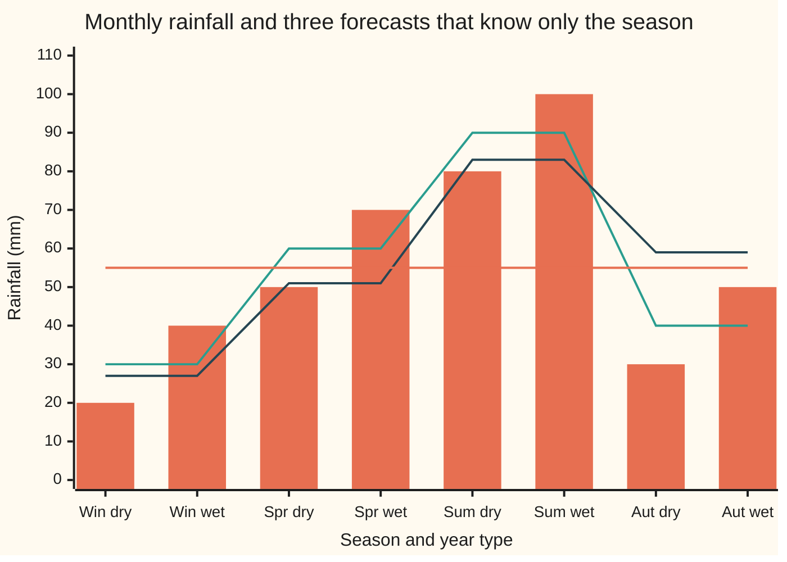
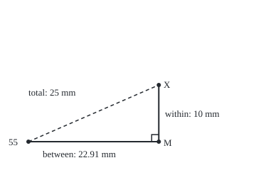

# Conditional expectation as a projection: for square-integrable X the forecast is the closest known quantity, and the error is perpendicular to everything known

[Syllabus](../../../SYLLABUS.md) → [Measure and integration](../../../SYLLABUS.md#w10) → [Conditional Expectation](../../../SYLLABUS.md#w10-s09) → Conditional expectation as a projection

---

## General Overview

A rain gauge at a hill station logs one rainfall total per month, in millimetres. The four seasons are equally likely and average 30, 60, 90 and 40 mm; the yearly mean is 55 mm. Inside a season the total still varies: in a dry year a month falls 10 mm below its season's mean, in a wet year 10 mm above, each half the time. So winter months read 20 or 40, spring 50 or 70, summer 80 or 100, autumn 30 or 50.

A forecaster must give one number per month and knows only the season. Each forecast is scored by its squared miss, averaged over all months. Saying 55 every month scores 625 square millimetres, written mm^2. A straight line in the season's mean temperature (5, 11, 19 and 13 °C) scores 225. The four seasonal means score 100, and no rule that uses only the season does better.

Picture a light straight overhead: a stick's shadow on the floor is the point of the floor nearest the stick's tip, and the line from tip to shadow stands at right angles to the floor. Here the stick is the rainfall, the floor is every forecast the season can produce, and the shadow is the forecast "average within the season", the conditional expectation. From here on the shadow is called by its real name: the **orthogonal projection**. The right angle turns the scores into Pythagoras: 625 = 100 + 525, the total spread split into a part inside seasons and a part between them. That split is the **law of total variance**. A least-squares regression is the same drop onto a smaller floor.

**For a quantity with finite mean square, the conditional expectation given the known information is the orthogonal projection onto everything that information can compute: the closest known quantity in mean square, with an error perpendicular to every known quantity.**

**What kind of fact this is:** a theorem, proved on this card in Why it works; the law of total variance and the regression picture follow from it on this card.

### The picture: eight season-and-year cases, three forecasts



Bars: the rainfall X in each of the eight equally likely cases. First line: the seasonal means 30, 60, 90, 40, each 10 mm from both of its bars. Second line: the least-squares line in temperature, 27, 51, 83, 59. Third line: the flat yearly mean, 55.

---

## The formula

Notation first, in words. The **probability space** $(\Omega, \mathcal F, P)$ lists the outcomes, the collection of events we allow ourselves to measure, and their probabilities. Here $\Omega$ is the eight season-and-year cases, each with probability 0.125. The **sub-sigma-algebra** $\mathcal G$ is the smaller collection of events the forecaster can see: the 16 unions of whole seasons. A quantity is **$\mathcal G$-measurable**, or **known**, when it is computed from the season alone. $\mathbf 1_A$ is the indicator of an event $A$, one on A and zero off it.

The conditional expectation $M = E[X \mid \mathcal G]$ is the known quantity with $E[M\,\mathbf 1_A] = E[X\,\mathbf 1_A]$ for every event $A$ in $\mathcal G$ ([Conditional expectation on a sigma-algebra](02-conditional-expectation-on-a-sigma-algebra.md)); on a partition into seasons it is the average within each season ([Conditioning on a partition](01-conditioning-on-a-partition.md)). The probability wing computes the same thing from tables ([Conditional expectation](../../09-Probability%20and%20statistics/02-Random%20Variables/05-conditional-expectation-in-tables.md)); this card is the general statement as a projection.

$L^2$ is every quantity with finite mean square, $E[X^2] < \infty$, with two quantities equal almost surely counted as one ([L2 as a Hilbert space](../07-Sizes%20of%20Functions/06-l2-as-a-hilbert-space.md)). $L^2(\mathcal G)$ is the part of it that is known. Its **inner product**, the analogue of the dot product, is $\langle U, V\rangle = E[UV]$, and its length is $\lVert U\rVert_2 = \sqrt{E[U^2]}$, so the squared distance between two quantities is their mean squared difference. Two quantities are **orthogonal**, at right angles, when $E[UV] = 0$.

For $X$ in $L^2$ and every known $Z$ in $L^2(\mathcal G)$:

$$E\big[(X - M)\,Z\big] = 0 \qquad\text{and}\qquad E\big[(X - Z)^2\big] = E\big[(X - M)^2\big] + E\big[(M - Z)^2\big].$$

**Read it aloud:** the forecast's error has zero average product with every known quantity; so any other known forecast's mean squared error is the conditional expectation's error plus the squared distance between the two forecasts.

The second term is zero only when $Z = M$ almost surely, so $M$ is the unique closest point. Put the constant $Z = E[X]$ in and the identity becomes the **law of total variance**:

$$\operatorname{Var}(X) = E\big[\operatorname{Var}(X \mid \mathcal G)\big] + \operatorname{Var}\big(E[X \mid \mathcal G]\big), \qquad \operatorname{Var}(X \mid \mathcal G) = E\big[(X - M)^2 \mid \mathcal G\big].$$

**Read it aloud:** the total spread is the average spread left inside the known groups plus the spread of the group averages themselves; within plus between.

| Symbol | Plain meaning | In our example | Push it up and the answer… |
| --- | --- | --- | --- |
| $\Omega$, $\mathcal F$, $P$ | the outcomes, the measurable events, their probabilities | 8 cases, every set of cases, 0.125 each | — |
| $\mathcal G$ | the events the forecaster can see | the 16 unions of whole seasons | more information: a bigger floor, a smaller error |
| $X$ | the quantity to forecast | monthly rainfall, 20 to 100 mm | — |
| $M$ | the conditional expectation $E[X \mid \mathcal G]$ | 30, 60, 90, 40 by season | — |
| $Z$ | any known forecast in $L^2(\mathcal G)$ | 55 flat; the line 7 + 4T | further from M: error grows by the squared distance |
| $L^2$, $L^2(\mathcal G)$ | finite-mean-square quantities; the known ones | all rainfall rules; all seasonal rules | — |
| $\langle U, V\rangle$, $U$, $V$, $\lVert U\rVert_2$ | inner product $E[UV]$ of two quantities; length | $\lVert X - M\rVert_2$ = 10 mm | — |
| $\mathbf 1_A$, $A$, $B$ | indicator of an event; events | $\mathbf 1_{\text{summer}}$ | — |
| $\operatorname{Var}$, $\operatorname{Var}(X \mid \mathcal G)$ | variance; spread left inside each known group | 625; 100 in every season | — |
| $T$, $a$, $b$ | season's mean temperature (°C); line intercept and slope | 5, 11, 19, 13; 7 and 4 | — |
| $d$ | a shift of the forecast, one per season | each of −10, 0, 5 | — |
| $R$, $Y$, $K$, $n$, $Z_n$, $a_n$, $A_j$, $c_j$ | proof helpers: the error X − M, a rival with orthogonal error, a bound, an index, truncated or simple versions, their mean squares, events and weights | R = ±10 mm | — |

### When it holds

- **Finite mean square, $E[X^2] < \infty$.** Without it every forecast scores infinity and "closest" means nothing. A quantity equal to 2^k with probability 3/4^k has a finite mean, 3, and a conditional expectation, but its mean square adds 3 per term: 15, 30, 60 after 5, 10, 20 terms, without end.
- **The competitor must be known.** A forecast that peeks at wet or dry, such as $Z = X$ itself, scores 0 and beats the seasonal means; $E[(X - M)(M - Z)]$ is then −100, not 0, and Pythagoras fails. The theorem ranks only forecasts in $L^2(\mathcal G)$.
- **The score is squared error.** Under the average absolute error the best known forecast is a median, not a mean. A desert month reading 0, 0, 0 or 40 mm has mean 10: forecasting 10 wins on squared error, 300 against 400, and loses on absolute error, 15 against 10.
- **Uniqueness is almost sure.** Forecasts differing only on an event of probability zero score the same, so the closest point is a class, as in $L^2$.

---

## Why it works

### Step 0: squared error is squared distance

Mean squared error $E[(X - Z)^2]$ is the squared length of $X - Z$ in $L^2$. The known quantities form a subspace, a flat floor: sums and multiples of seasonal rules are seasonal rules. In the plane, the nearest point of a line to a given point is the foot of the perpendicular ([Projection](../../03-Algebra/06-Dot%20Products%20and%20Best%20Fits/02-orthogonal-projection.md)). So the whole proof is one claim: the error $X - M$ is perpendicular to every known quantity. Pythagoras does the rest.

The definition of $M$ already says something perpendicular. $E[M\,\mathbf 1_A] = E[X\,\mathbf 1_A]$ rearranges to $E[(X - M)\,\mathbf 1_A] = 0$: the error is orthogonal to every indicator of a visible event. The steps below spread that from indicators to every known quantity in $L^2$.

### Step 1: the error is orthogonal to every bounded known quantity

A known **simple** quantity, one taking finitely many values, is a sum of multiples of indicators of events in $\mathcal G$. Linearity of the integral carries the zero through the sum. A bounded known quantity is a uniform limit of simple ones, rounded down to the nearest multiple of 2^−n. Dominated convergence, which lets a limit pass inside an integral when one integrable function bounds the whole sequence, carries the zero through the limit.

In the rainfall case the error is ±10 in every season, averaging to 0 inside each one, so its average product with any seasonal rule is 0. The code checks all four season indicators and the temperature: every product averages to 0.

### Step 2: the forecast has finite mean square

The inner product $E[(X - M) Z]$ needs $M$ in $L^2$, and the definition only promised a finite mean. Truncate $M$ at height n, pair it with $X$ using Step 1, and apply Cauchy–Schwarz: the average of a product is at most the product of the two root-mean-squares, the p = q = 2 case of [Holder's inequality](../07-Sizes%20of%20Functions/02-holders-inequality.md). The result is $E[M^2] \le E[X^2]$: forecasting never adds spread. Here $E[M^2] = 3550$ and $E[X^2] = 3650$; the gap, 100, is the error's mean square.

### Step 3: the error is orthogonal to every known quantity in $L^2$

Truncate an unbounded known $Z$ at height n. Step 1 covers the truncation, and Cauchy–Schwarz bounds what is left by $\lVert X - M\rVert_2$ times the $L^2$ length of the part cut off, which dominated convergence sends to zero.

### Step 4: Pythagoras, so the forecast is the closest point

Write the miss of any known $Z$ as the error plus a known piece: $X - Z = (X - M) + (M - Z)$. Square and average. The cross term is $2E[(X - M)(M - Z)]$, zero by Step 3, since $M - Z$ is known. What remains is the formula. The extra term $E[(M - Z)^2]$ is never negative and is zero only when $Z = M$ almost surely.

The code runs through all 81 forecasts that shift each seasonal mean by −10, 0 or +5. Every one obeys the identity exactly; the best is the unshifted one at 100, the worst 200; none beats $M$.

<details>
<summary>Detailed proof</summary>

Setting: $X$ in $L^2(\Omega, \mathcal F, P)$, $\mathcal G$ a sub-sigma-algebra of $\mathcal F$, and $M$ a version of $E[X \mid \mathcal G]$: $\mathcal G$-measurable, integrable, with $E[M\mathbf 1_A] = E[X\mathbf 1_A]$ for all $A$ in $\mathcal G$. $X$ is integrable, by Cauchy–Schwarz against the constant 1.

**(a) Bounded multipliers.** If $Z = \sum_j c_j \mathbf 1_{A_j}$ with finitely many $A_j$ in $\mathcal G$, linearity of the integral gives $E[MZ] = E[XZ]$. If $Z$ is $\mathcal G$-measurable with $\lvert Z\rvert \le K$, set $Z_n = 2^{-n}\lfloor 2^n Z\rfloor$. Each $Z_n$ is $\mathcal G$-measurable and takes finitely many values, $\lvert Z_n - Z\rvert \le 2^{-n}$ and $\lvert Z_n\rvert \le K + 1$. Then $Z_n M \to ZM$ and $Z_n X \to ZX$ at every point, with integrable envelopes $(K+1)\lvert M\rvert$ and $(K+1)\lvert X\rvert$; dominated convergence ([Dominated convergence](../05-Swapping%20Limits%20and%20Integrals/02-dominated-convergence-theorem.md)) gives $E[MZ] = E[XZ]$.

**(b) $E[M^2] \le E[X^2]$.** Let $Z_n = M\mathbf 1_{\{\lvert M\rvert \le n\}}$, bounded and $\mathcal G$-measurable, and $a_n = E[M^2\mathbf 1_{\{\lvert M\rvert \le n\}}] = E[Z_n^2]$. By (a), $a_n = E[MZ_n] = E[XZ_n]$, and Cauchy–Schwarz gives $a_n \le \lVert X\rVert_2\, a_n^{1/2}$. If $a_n > 0$ divide: $a_n \le E[X^2]$; if $a_n = 0$ it holds anyway. The $a_n$ rise to $E[M^2]$ by monotone convergence (a rising sequence of non-negative functions may pass its limit inside the integral), since $M$ is finite almost surely. So $M$ is in $L^2(\mathcal G)$.

**(c) Orthogonality.** Let $R = X - M$; it is in $L^2$ because $R^2 \le 2X^2 + 2M^2$. Take $Z$ in $L^2(\mathcal G)$ and $Z_n = Z\mathbf 1_{\{\lvert Z\rvert \le n\}}$. By (a), $E[RZ_n] = 0$, since $E[XZ_n] = E[MZ_n]$ and both products are integrable. Next, $E[(Z - Z_n)^2] = E[Z^2\mathbf 1_{\{\lvert Z\rvert > n\}}] \to 0$ by dominated convergence with envelope $Z^2$. Cauchy–Schwarz: $\lvert E[RZ]\rvert = \lvert E[R(Z - Z_n)]\rvert \le \lVert R\rVert_2\,\lVert Z - Z_n\rVert_2 \to 0$. So $E[RZ] = 0$.

**(d) Pythagoras.** For $Z$ in $L^2(\mathcal G)$, $M - Z$ is in $L^2(\mathcal G)$. Expand $(X - Z)^2 = R^2 + 2R(M - Z) + (M - Z)^2$; each term is integrable since $2\lvert UV\rvert \le U^2 + V^2$. Take expectations; (c) kills the middle term.

**(e) Uniqueness.** If $E[(X - Z)^2] = E[R^2]$ then $E[(M - Z)^2] = 0$. A non-negative function with integral zero is zero almost everywhere, so $Z = M$ almost surely.

**(f) The converse.** If $Y$ is in $L^2(\mathcal G)$ and $E[(X - Y)Z] = 0$ for every $Z$ in $L^2(\mathcal G)$, take $Z = \mathbf 1_A$ for $A$ in $\mathcal G$: $E[Y\mathbf 1_A] = E[X\mathbf 1_A]$. So $Y$ satisfies the definition and is a version of $E[X \mid \mathcal G]$. Orthogonal error and conditional expectation are the same property.

</details>

### The picture: the right triangle in $L^2$

<p align="center"></p>

Drawn to scale at 8 units per mm, with each side the root-mean-square length $\lVert\cdot\rVert_2$. The floor runs from the constant forecast 55 to the seasonal forecast $M$: 22.91 mm, the square root of 525. The wall rises from $M$ to the rainfall $X$: 10 mm, the within-season error, at a right angle to the floor. The dashed side is the flat forecast's miss, 25 mm. 22.91^2 + 10^2 = 25^2.

### Step 5: the law of total variance is Pythagoras with a constant

A constant is known under any information, so take $Z = E[X]$. The definition with $A = \Omega$ gives $E[M] = E[X]$, so $E[(M - E[X])^2]$ is the variance of $M$: the spread between seasons, 525. The same definition, applied to $(X - M)^2$, turns $E[(X - M)^2]$ into the average of the within-season variances, 100 in every season. Pythagoras gives 625 = 100 + 525. The code also reaches 625 directly, as $E[X^2] - 55^2$ = 3650 − 3025. The season explains 525/625 = 0.84 of the variance, the number regression output calls R^2.

### Step 6: least-squares regression is the same drop onto a smaller floor

A straight line in temperature, $a + bT$, is also a seasonal rule: temperature is a function of the season. The lines form a two-dimensional floor inside the four-dimensional floor $L^2(\mathcal G)$. The best line makes its miss orthogonal to both $1$ and $T$: two equations in $a$ and $b$, the **normal equations** of [Least squares](../../03-Algebra/06-Dot%20Products%20and%20Best%20Fits/04-least-squares.md). They give $a = 7$ and $b = 4$: forecasts 27, 51, 83 and 59.

Fitting the line to $X$ or to $M$ gives the same line. The reason is Step 3: $X - M$ is orthogonal to $1$ and $T$, so it drops out of both normal equations. Dropping straight onto the small floor lands where dropping first to the big floor, then across, lands. The errors add by Pythagoras again: 225 = 100 within + 125 from line to seasonal means. And 525 = 400 explained by the line + 125 left over.

Give the regression enough features to reach every seasonal rule and it returns $M$ itself. Four distinct temperatures let a cubic, $1$, $T$, $T^2$, $T^3$, pass through any four seasonal values. Least squares on those four features gives 30, 60, 90, 40, the second road to $M$ in the code.

A second route to the whole theorem runs the other way. $L^2(\mathcal G)$ is complete ([Riesz-Fischer](../07-Sizes%20of%20Functions/05-completeness-of-lp.md)), so it is a closed subspace of $L^2$, and every $X$ in $L^2$ has a closest point in it, by the projection theorem of [L2 as a Hilbert space](../07-Sizes%20of%20Functions/06-l2-as-a-hilbert-space.md). Part (f) of the proof shows that closest point satisfies the definition. That builds conditional expectation for $L^2$ without densities, and truncation extends it to every integrable $X$: the route of Williams's book.

---

## Worked numbers, by hand

| Step | Arithmetic | Value |
| --- | --- | --- |
| yearly mean | (30 + 60 + 90 + 40) / 4 | 55 mm |
| forecast by season | (20 + 40)/2, (50 + 70)/2, (80 + 100)/2, (30 + 50)/2 | 30, 60, 90, 40 mm |
| within: error of the forecast | every month misses by 10: 10^2 | 100 mm^2 |
| between: spread of the forecast | (25^2 + 5^2 + 35^2 + 15^2)/4 = (625 + 25 + 1225 + 225)/4 | 525 mm^2 |
| total, directly | E[X^2] − 55^2 = 3650 − 3025 | 625 mm^2 |
| Pythagoras | 100 + 525 | **625 mm^2** |
| regression line | slope 100/25 from the normal equations; 55 − 4 × 12 | 7 + 4T |
| line's error | 100 + (3^2 + 9^2 + 7^2 + 19^2)/4 | **225 mm^2** |

Knowing the season cuts the typical miss from 25 mm to 10 mm, and no rule built from the season alone can cut it further.

For the line, the temperatures average 12 °C, their deviations −7, −1, 7, 1 have mean square 25, and their average product with the forecast's deviations −25, 5, 35, −15 is 100: slope 4.

### What breaks if you drop a piece

| Mistake | Comes out at | What went wrong |
| --- | --- | --- |
| A forecast that peeks at wet or dry, Z = X | error 0; Pythagoras would say 200 | Z is not known; E[(X − M)(M − Z)] is −100, not 0 |
| Scoring by absolute error, desert month 0, 0, 0, 40 | mean 10 scores 15, forecast 0 scores 10 | the projection answers squared error only; absolute error wants the median |
| A quantity with no finite mean square, 2^k with probability 3/4^k | mean square 15, 30, 60 after 5, 10, 20 terms | not in $L^2$: every forecast scores infinity |
| Leaving out the between term | Var X = 100 | 525 of the 625 sits between seasons |

The code prints all four.

---

## Code, from first principles, and it actually runs

The code lists the eight cases and reaches the forecast by two roads that share no arithmetic: averaging each season's cell, and least squares on 1, T, T^2, T^3 solved by Gaussian elimination, which never sees a season's name. It then checks the definition, orthogonality, Pythagoras on 81 rival forecasts, the variance split, the regression line and the three failures. Fractions are exact; Rust carries its own fraction type on 128-bit integers. What the code shows is one finite case; the proof covers every sub-sigma-algebra and every square-integrable X.

### Python

```python
# Conditional expectation as a projection -- the check behind the card.
# Standard library only; fractions give exact arithmetic.  A month at the
# station is one of 8 equally likely outcomes: a season and a dry or wet year,
# 10 mm below or above that season's mean.  What is known, G, is the season.
# The forecast E[X | G] is found by two roads that share no arithmetic:
# averaging each season's cell, and least squares on the features 1, T, T^2,
# T^3 (T the season's temperature), solved by Gaussian elimination.
from fractions import Fraction as Fr
from itertools import product

NAME = ["winter", "spring", "summer", "autumn"]
MEAN = [30, 60, 90, 40]                          # seasonal mean rainfall, mm
TEMP = [5, 11, 19, 13]                           # seasonal mean temperature, C
P = Fr(1, 8)                                     # each outcome weighs 0.125
S = [s for s in range(4) for _ in (0, 1)]        # the season of each outcome
X = [MEAN[s] + d for s in range(4) for d in (-10, 10)]   # rainfall, mm
T = [TEMP[s] for s in S]

def E(v):                                        # expectation: weighted sum
    return sum(P * x for x in v)

def mse(z):                                      # mean squared error against X
    return E([(x - y) ** 2 for x, y in zip(X, z)])

def show(v):
    return " ".join(str(x) for x in v)

def lstsq(y, feats):                             # normal equations, eliminated
    k = len(feats)
    A = [[E([f[i] * g[i] for i in range(8)]) for g in feats]
         + [E([f[i] * y[i] for i in range(8)])] for f in feats]
    for c in range(k):
        piv = next(r for r in range(c, k) if A[r][c] != 0)
        A[c], A[piv] = A[piv], A[c]
        for r in range(k):
            if r != c and A[r][c] != 0:
                m = A[r][c] / A[c][c]
                A[r] = [a - m * b for a, b in zip(A[r], A[c])]
    coef = [A[r][k] / A[r][r] for r in range(k)]
    return coef, [sum(c * f[i] for c, f in zip(coef, feats)) for i in range(8)]

# road one: the partition formula, E[X 1_B] / P(B) on each season's cell B
M = [E([x * (t == s) for x, t in zip(X, S)]) / E([t == s for t in S]) for s in S]
print("1. the eight outcomes, each with probability 0.125")
print("   season  :", " ".join(f"{NAME[s]:>6}" for s in S))
print("   rain X  :", " ".join(f"{x:>6}" for x in X))
print("   E[X | G]:", " ".join(f"{str(m):>6}" for m in M))
print("   temp T  :", " ".join(f"{t:>6}" for t in T))
events = 0
for mask in range(16):                           # every event G can see
    A = [(mask >> s) & 1 for s in S]
    assert E([x * a for x, a in zip(X, A)]) == E([m * a for m, a in zip(M, A)])
    events += 1
print(f"   defining property E[X 1_A] = E[M 1_A] holds on {events} of 16 events in G")
# road two: least squares on 1, T, T^2, T^3, which never looks at a season name
coef, M2 = lstsq(X, [[1] * 8, T, [t * t for t in T], [t ** 3 for t in T]])
assert M2 == M
print(f"2. least squares on 1, T, T^2, T^3 gives {show(M2[::2])}: the same forecast")
print("3. the error X - M is perpendicular to every known quantity")
R = [x - m for x, m in zip(X, M)]
for s in range(4):
    dot = E([r * (t == s) for r, t in zip(R, S)])
    assert dot == 0
    print(f"   E[(X - M) 1_{NAME[s]}] = {dot}")
rt = E([r * t for r, t in zip(R, T)])
assert rt == 0                                   # and to the temperature, a known quantity
print(f"   E[(X - M) T] = {rt}")
EX, EX2, EM2 = E(X), E([x * x for x in X]), E([m * m for m in M])
assert EM2 <= EX2
print(f"   E[X] = {EX}, E[X^2] = {EX2}, E[M^2] = {EM2}: M is in L2(G)")
print("4. all 81 forecasts M + d, d in {-10, 0, 5} for each season")
best, beat, worst = None, 0, 0
for d in product((-10, 0, 5), repeat=4):
    Z = [m + d[s] for m, s in zip(M, S)]
    extra = E([d[s] ** 2 for s in S])            # E[(M - Z)^2], from d alone
    assert mse(Z) == mse(M) + extra                # Pythagoras, exactly
    beat += mse(Z) < mse(M)
    worst = max(worst, mse(Z))
    best = min(best, mse(Z)) if best is not None else mse(Z)
assert beat == 0
assert best == mse(M)
print(f"   Pythagoras exact on 81 of 81; best {best} at d = 0; worst {worst}; {beat} beat M")
print("5. the law of total variance")
var_direct = E([(x - EX) ** 2 for x in X])
within, between = E([r * r for r in R]), E([(m - EX) ** 2 for m in M])
cond_var = [E([r * r * (t == s) for r, t in zip(R, S)]) / Fr(1, 4) for s in range(4)]
assert var_direct == EX2 - EX ** 2 == within + between
print(f"   Var X = E[(X - 55)^2] = {var_direct}; E[X^2] - 55^2 = {EX2 - EX ** 2}")
print(f"   55^2 = {EX ** 2}; seasonal means minus 55: {show([m - EX for m in M[::2]])}")
print(f"   Var(X | season) = {show(cond_var)}; within {within} + between {between}")
print(f"   = {within + between}; share explained by the season {float(between / var_direct):.2f}")
print("6. least squares on 1 and T only: a smaller space of known quantities")
(a, b), fit = lstsq(X, [[1] * 8, T])
(a2, b2), fitM = lstsq(M, [[1] * 8, T])
gap = E([(m - f) ** 2 for m, f in zip(M, fit)])
Tm = E(T)
cov, vt = E([(t - Tm) * (m - EX) for t, m in zip(T, M)]), E([(t - Tm) ** 2 for t in T])
assert b == cov / vt and a == EX - b * Tm        # slope and intercept by formula
assert (a, b) == (a2, b2) and mse(fit) == within + gap
print(f"   from X: rain = {a} + {b} T;  from M: rain = {a2} + {b2} T")
print(f"   by hand: mean T {Tm}, deviations {show([t - Tm for t in T[::2]])}, "
      f"mean square {vt}, average product with M - 55 {cov}")
print(f"   M minus line: {show([m - f for m, f in zip(M[::2], fit[::2])])}")
print(f"   fitted {show(fit[::2])}; error {mse(fit)} = {within} + {gap}")
print(f"   explained by the line {E([(f - EX) ** 2 for f in fit])}; plus {gap} = {between}")
print("7. what breaks")
peek = mse(X)
cross = E([r * (m - x) for r, m, x in zip(R, M, X)])
pyth = within + E([(m - x) ** 2 for m, x in zip(M, X)])
assert peek < mse(M)
assert peek != pyth
assert cross != 0                                # orthogonality fails: Z is not known
print(f"   peeking forecast Z = X: error {peek}, Pythagoras would say {pyth}, E[(X - M)(M - Z)] = {cross}")
desert = [0, 0, 0, 40]
mu = Fr(sum(desert), 4)
sq = [sum(Fr(y - c) ** 2 for y in desert) / 4 for c in (mu, 0)]
ab = [sum(abs(Fr(y - c)) for y in desert) / 4 for c in (mu, 0)]
assert sq[0] < sq[1] and ab[0] > ab[1]
print(f"   desert month 0, 0, 0, 40: squared loss mean {mu} -> {sq[0]}, 0 -> {sq[1]}; "
      f"absolute loss mean {mu} -> {ab[0]}, 0 -> {ab[1]}")
tail = lambda n: sum(Fr(3, 4 ** k) * 4 ** k for k in range(1, n + 1))
mean20 = sum(Fr(3, 4 ** k) * 2 ** k for k in range(1, 21))
print(f"   X = 2^k w.p. 3/4^k: E[X^2] partial sums {tail(5)}, {tail(10)}, {tail(20)}; "
      f"E[X] to 20 terms {float(mean20):.6f}")
print("8. chart and figure")
print("chart, X:", show(X))
print("chart, M:", show(M))
print("chart, line:", show(fit))
print("chart, mean:", show([EX] * 8))
sc = 8.0                                        # figure: 8 units per mm
print(f"figure, scale {sc:.0f} per mm, O=(40,200) M=({40 + sc * float(between) ** 0.5:.2f},200) "
      f"X=({40 + sc * float(between) ** 0.5:.2f},{200 - sc * float(within) ** 0.5:.2f}) "
      f"legs {float(between) ** 0.5:.2f} and {float(within) ** 0.5:.2f}, "
      f"hypotenuse {float(var_direct) ** 0.5:.2f}")
```

**Ran 2026-10-06 on macOS, Python 3.14.6, standard library only. All checks passed. Output, pasted from the run:**

```
1. the eight outcomes, each with probability 0.125
   season  : winter winter spring spring summer summer autumn autumn
   rain X  :     20     40     50     70     80    100     30     50
   E[X | G]:     30     30     60     60     90     90     40     40
   temp T  :      5      5     11     11     19     19     13     13
   defining property E[X 1_A] = E[M 1_A] holds on 16 of 16 events in G
2. least squares on 1, T, T^2, T^3 gives 30 60 90 40: the same forecast
3. the error X - M is perpendicular to every known quantity
   E[(X - M) 1_winter] = 0
   E[(X - M) 1_spring] = 0
   E[(X - M) 1_summer] = 0
   E[(X - M) 1_autumn] = 0
   E[(X - M) T] = 0
   E[X] = 55, E[X^2] = 3650, E[M^2] = 3550: M is in L2(G)
4. all 81 forecasts M + d, d in {-10, 0, 5} for each season
   Pythagoras exact on 81 of 81; best 100 at d = 0; worst 200; 0 beat M
5. the law of total variance
   Var X = E[(X - 55)^2] = 625; E[X^2] - 55^2 = 625
   55^2 = 3025; seasonal means minus 55: -25 5 35 -15
   Var(X | season) = 100 100 100 100; within 100 + between 525
   = 625; share explained by the season 0.84
6. least squares on 1 and T only: a smaller space of known quantities
   from X: rain = 7 + 4 T;  from M: rain = 7 + 4 T
   by hand: mean T 12, deviations -7 -1 7 1, mean square 25, average product with M - 55 100
   M minus line: 3 9 7 -19
   fitted 27 51 83 59; error 225 = 100 + 125
   explained by the line 400; plus 125 = 525
7. what breaks
   peeking forecast Z = X: error 0, Pythagoras would say 200, E[(X - M)(M - Z)] = -100
   desert month 0, 0, 0, 40: squared loss mean 10 -> 300, 0 -> 400; absolute loss mean 10 -> 15, 0 -> 10
   X = 2^k w.p. 3/4^k: E[X^2] partial sums 15, 30, 60; E[X] to 20 terms 2.999997
8. chart and figure
chart, X: 20 40 50 70 80 100 30 50
chart, M: 30 30 60 60 90 90 40 40
chart, line: 27 27 51 51 83 83 59 59
chart, mean: 55 55 55 55 55 55 55 55
figure, scale 8 per mm, O=(40,200) M=(223.30,200) X=(223.30,120.00) legs 22.91 and 10.00, hypotenuse 25.00
```

### Rust

```rust
// Conditional expectation as a projection -- the check behind the card.
// Std only; exact fractions are done by hand on i128.  A month at the station
// is one of 8 equally likely outcomes: a season and a dry or wet year, 10 mm
// below or above that season's mean.  What is known, G, is the season.  The
// forecast E[X | G] is found by two roads that share no arithmetic: averaging
// each season's cell, and least squares on the features 1, T, T^2, T^3
// (T the season's temperature), solved by Gaussian elimination.
use std::fmt;
use std::ops::{Add, Div, Mul, Sub};

#[derive(Clone, Copy, PartialEq, Debug)]
struct Q { n: i128, d: i128 }
fn gcd(a: i128, b: i128) -> i128 { if b == 0 { a.abs() } else { gcd(b, a % b) } }
fn q(n: i128, d: i128) -> Q {
    let g = gcd(n, d).max(1); let s = if d < 0 { -1 } else { 1 };
    Q { n: s * n / g, d: s * d / g }
}
fn z(n: i128) -> Q { q(n, 1) }
impl Add for Q { type Output = Q; fn add(self, o: Q) -> Q { q(self.n * o.d + o.n * self.d, self.d * o.d) } }
impl Sub for Q { type Output = Q; fn sub(self, o: Q) -> Q { q(self.n * o.d - o.n * self.d, self.d * o.d) } }
impl Mul for Q { type Output = Q; fn mul(self, o: Q) -> Q { q(self.n * o.n, self.d * o.d) } }
impl Div for Q { type Output = Q; fn div(self, o: Q) -> Q { q(self.n * o.d, self.d * o.n) } }
impl PartialOrd for Q {
    fn partial_cmp(&self, o: &Q) -> Option<std::cmp::Ordering> { (self.n * o.d).partial_cmp(&(o.n * self.d)) }
}
impl fmt::Display for Q {
    fn fmt(&self, f: &mut fmt::Formatter) -> fmt::Result {
        let s = if self.d == 1 { format!("{}", self.n) } else { format!("{}/{}", self.n, self.d) };
        f.pad(&s)
    }
}
impl Q { fn f(self) -> f64 { self.n as f64 / self.d as f64 } }

const NAME: [&str; 4] = ["winter", "spring", "summer", "autumn"];
const MEAN: [i128; 4] = [30, 60, 90, 40];           // seasonal mean rainfall, mm
const TEMP: [i128; 4] = [5, 11, 19, 13];            // seasonal mean temperature, C

fn e(v: &[Q]) -> Q { v.iter().fold(z(0), |acc, &x| acc + q(1, 8) * x) }   // each weighs 0.125
fn show(v: &[Q]) -> String { v.iter().map(|x| x.to_string()).collect::<Vec<_>>().join(" ") }
fn sq_err(a: &[Q], b: &[Q]) -> Q { e(&a.iter().zip(b).map(|(&x, &y)| (x - y) * (x - y)).collect::<Vec<_>>()) }
fn prod(a: &[Q], b: &[Q]) -> Vec<Q> { a.iter().zip(b).map(|(&x, &y)| x * y).collect() }

fn lstsq(y: &[Q], feats: &[Vec<Q>]) -> (Vec<Q>, Vec<Q>) {       // normal equations, eliminated
    let k = feats.len();
    let mut a: Vec<Vec<Q>> = feats.iter().map(|f| {
        let mut row: Vec<Q> = feats.iter().map(|g| e(&prod(f, g))).collect();
        row.push(e(&prod(f, y))); row }).collect();
    for c in 0..k {
        let piv = (c..k).find(|&r| a[r][c] != z(0)).unwrap();
        a.swap(c, piv);
        for r in 0..k {
            if r != c && a[r][c] != z(0) {
                let m = a[r][c] / a[c][c];
                let rc = a[c].clone();
                for j in 0..=k { a[r][j] = a[r][j] - m * rc[j]; }
            }
        }
    }
    let coef: Vec<Q> = (0..k).map(|r| a[r][k] / a[r][r]).collect();
    let fit = (0..8).map(|i| (0..k).fold(z(0), |acc, j| acc + coef[j] * feats[j][i])).collect();
    (coef, fit)
}

fn main() {
    let s: Vec<usize> = (0..8).map(|i| i / 2).collect();            // season of each outcome
    let x: Vec<Q> = (0..8).map(|i| z(MEAN[i / 2] + if i % 2 == 0 { -10 } else { 10 })).collect();
    let t: Vec<Q> = s.iter().map(|&k| z(TEMP[k])).collect();
    let ind = |k: usize| -> Vec<Q> { s.iter().map(|&j| z((j == k) as i128)).collect() };
    // road one: the partition formula, E[X 1_B] / P(B) on each season's cell B
    let m: Vec<Q> = s.iter().map(|&k| e(&prod(&x, &ind(k))) / e(&ind(k))).collect();
    println!("1. the eight outcomes, each with probability 0.125");
    println!("   season  : {}", s.iter().map(|&k| format!("{:>6}", NAME[k])).collect::<Vec<_>>().join(" "));
    println!("   rain X  : {}", x.iter().map(|v| format!("{:>6}", v)).collect::<Vec<_>>().join(" "));
    println!("   E[X | G]: {}", m.iter().map(|v| format!("{:>6}", v)).collect::<Vec<_>>().join(" "));
    println!("   temp T  : {}", t.iter().map(|v| format!("{:>6}", v)).collect::<Vec<_>>().join(" "));
    let mut events = 0;
    for mask in 0..16usize {                                       // every event G can see
        let a: Vec<Q> = s.iter().map(|&k| z(((mask >> k) & 1) as i128)).collect();
        assert_eq!(e(&prod(&x, &a)), e(&prod(&m, &a)));
        events += 1;
    }
    println!("   defining property E[X 1_A] = E[M 1_A] holds on {} of 16 events in G", events);
    // road two: least squares on 1, T, T^2, T^3, which never looks at a season name
    let one = vec![z(1); 8];
    let (_, m2) = lstsq(&x, &[one.clone(), t.clone(), prod(&t, &t), prod(&prod(&t, &t), &t)]);
    assert_eq!(m2, m);
    let evens = |v: &[Q]| -> Vec<Q> { v.iter().step_by(2).cloned().collect() };
    println!("2. least squares on 1, T, T^2, T^3 gives {}: the same forecast", show(&evens(&m2)));
    println!("3. the error X - M is perpendicular to every known quantity");
    let r: Vec<Q> = x.iter().zip(&m).map(|(&a, &b)| a - b).collect();
    for k in 0..4 {
        let dot = e(&prod(&r, &ind(k)));
        assert_eq!(dot, z(0));
        println!("   E[(X - M) 1_{}] = {}", NAME[k], dot);
    }
    let rt = e(&prod(&r, &t)); assert_eq!(rt, z(0));                // and to the temperature
    println!("   E[(X - M) T] = {}", rt);
    let (ex, ex2, em2) = (e(&x), e(&prod(&x, &x)), e(&prod(&m, &m)));
    assert!(em2 <= ex2);
    println!("   E[X] = {}, E[X^2] = {}, E[M^2] = {}: M is in L2(G)", ex, ex2, em2);
    println!("4. all 81 forecasts M + d, d in {{-10, 0, 5}} for each season");
    let (mut best, mut beat, mut worst) = (None, 0, z(0));
    for idx in 0..81usize {
        let d: Vec<i128> = (0..4).map(|j| [-10, 0, 5][(idx / 3usize.pow(3 - j as u32)) % 3]).collect();
        let zz: Vec<Q> = (0..8).map(|i| m[i] + z(d[s[i]])).collect();
        let extra = e(&s.iter().map(|&k| z(d[k] * d[k])).collect::<Vec<_>>());   // E[(M - Z)^2]
        let err = sq_err(&x, &zz);
        assert_eq!(err, sq_err(&x, &m) + extra);                          // Pythagoras, exactly
        if err < sq_err(&x, &m) { beat += 1; }
        if err > worst { worst = err; }
        best = Some(match best { Some(b) if b < err => b, _ => err });
    }
    let best = best.unwrap();
    assert_eq!(beat, 0);
    assert_eq!(best, sq_err(&x, &m));
    println!("   Pythagoras exact on 81 of 81; best {} at d = 0; worst {}; {} beat M", best, worst, beat);
    println!("5. the law of total variance");
    let var_direct = e(&x.iter().map(|&v| (v - ex) * (v - ex)).collect::<Vec<_>>());
    let within = e(&prod(&r, &r)); let between = e(&m.iter().map(|&v| (v - ex) * (v - ex)).collect::<Vec<_>>());
    let cond_var: Vec<Q> = (0..4).map(|k| e(&prod(&prod(&r, &r), &ind(k))) / q(1, 4)).collect();
    assert_eq!(var_direct, ex2 - ex * ex);
    assert_eq!(ex2 - ex * ex, within + between);
    println!("   Var X = E[(X - 55)^2] = {}; E[X^2] - 55^2 = {}", var_direct, ex2 - ex * ex);
    println!("   55^2 = {}; seasonal means minus 55: {}", ex * ex, show(&evens(&m.iter().map(|&v| v - ex).collect::<Vec<_>>())));
    println!("   Var(X | season) = {}; within {} + between {}", show(&cond_var), within, between);
    println!("   = {}; share explained by the season {:.2}", within + between, (between / var_direct).f());
    println!("6. least squares on 1 and T only: a smaller space of known quantities");
    let (c1, fit) = lstsq(&x, &[one.clone(), t.clone()]);
    let (c2, _) = lstsq(&m, &[one.clone(), t.clone()]);
    let gap = sq_err(&m, &fit);
    let tm = e(&t); let cov = e(&t.iter().zip(&m).map(|(&a, &b)| (a - tm) * (b - ex)).collect::<Vec<_>>());
    let vt = e(&t.iter().map(|&a| (a - tm) * (a - tm)).collect::<Vec<_>>());
    assert_eq!(c1[1], cov / vt);                                   // slope by formula
    assert_eq!(c1[0], ex - c1[1] * tm);                            // intercept by formula
    assert_eq!(c1, c2);
    assert_eq!(sq_err(&x, &fit), within + gap);
    println!("   from X: rain = {} + {} T;  from M: rain = {} + {} T", c1[0], c1[1], c2[0], c2[1]);
    println!("   by hand: mean T {}, deviations {}, mean square {}, average product with M - 55 {}",
             tm, show(&evens(&t.iter().map(|&a| a - tm).collect::<Vec<_>>())), vt, cov);
    println!("   M minus line: {}", show(&evens(&m.iter().zip(&fit).map(|(&a, &b)| a - b).collect::<Vec<_>>())));
    println!("   fitted {}; error {} = {} + {}", show(&evens(&fit)), sq_err(&x, &fit), within, gap);
    println!("   explained by the line {}; plus {} = {}", sq_err(&fit, &vec![ex; 8]), gap, between);
    println!("7. what breaks");
    let peek = sq_err(&x, &x);
    let cross = e(&r.iter().zip(m.iter().zip(&x)).map(|(&a, (&b, &c))| a * (b - c)).collect::<Vec<_>>());
    let pyth = within + sq_err(&m, &x);
    assert!(peek < sq_err(&x, &m)); assert!(peek != pyth);
    assert!(cross != z(0));                                        // orthogonality fails: Z is not known
    println!("   peeking forecast Z = X: error {}, Pythagoras would say {}, E[(X - M)(M - Z)] = {}", peek, pyth, cross);
    let desert = [0i128, 0, 0, 40];
    let mu = q(desert.iter().sum(), 4);
    let sq: Vec<Q> = [mu, z(0)].iter().map(|&c| desert.iter().fold(z(0), |a, &y| a + (z(y) - c) * (z(y) - c)) / z(4)).collect();
    let ab: Vec<Q> = [mu, z(0)].iter().map(|&c| desert.iter().fold(z(0), |a, &y| { let w = z(y) - c; a + if w < z(0) { z(0) - w } else { w } }) / z(4)).collect();
    assert!(sq[0] < sq[1]); assert!(ab[0] > ab[1]);
    println!("   desert month 0, 0, 0, 40: squared loss mean {} -> {}, 0 -> {}; absolute loss mean {} -> {}, 0 -> {}",
             mu, sq[0], sq[1], mu, ab[0], ab[1]);
    let tail = |n: u32| (1..=n).fold(z(0), |a, k| a + q(3, 4i128.pow(k)) * z(4i128.pow(k)));
    let mean20 = (1..=20u32).fold(z(0), |a, k| a + q(3, 4i128.pow(k)) * z(2i128.pow(k)));
    println!("   X = 2^k w.p. 3/4^k: E[X^2] partial sums {}, {}, {}; E[X] to 20 terms {:.6}",
             tail(5), tail(10), tail(20), mean20.f());
    println!("8. chart and figure");
    println!("chart, X: {}", show(&x));
    println!("chart, M: {}", show(&m));
    println!("chart, line: {}", show(&fit));
    println!("chart, mean: {}", show(&vec![ex; 8]));
    let sc = 8.0;                                                  // figure: 8 units per mm
    let (lb, lw, lv) = (between.f().sqrt(), within.f().sqrt(), var_direct.f().sqrt());
    println!("figure, scale {:.0} per mm, O=(40,200) M=({:.2},200) X=({:.2},{:.2}) legs {:.2} and {:.2}, hypotenuse {:.2}",
             sc, 40.0 + sc * lb, 40.0 + sc * lb, 200.0 - sc * lw, lb, lw, lv);
}
```

**Ran 2026-10-06 on macOS, rustc 1.98.1, no crates. All checks passed. Output, pasted from the run:**

```
1. the eight outcomes, each with probability 0.125
   season  : winter winter spring spring summer summer autumn autumn
   rain X  :     20     40     50     70     80    100     30     50
   E[X | G]:     30     30     60     60     90     90     40     40
   temp T  :      5      5     11     11     19     19     13     13
   defining property E[X 1_A] = E[M 1_A] holds on 16 of 16 events in G
2. least squares on 1, T, T^2, T^3 gives 30 60 90 40: the same forecast
3. the error X - M is perpendicular to every known quantity
   E[(X - M) 1_winter] = 0
   E[(X - M) 1_spring] = 0
   E[(X - M) 1_summer] = 0
   E[(X - M) 1_autumn] = 0
   E[(X - M) T] = 0
   E[X] = 55, E[X^2] = 3650, E[M^2] = 3550: M is in L2(G)
4. all 81 forecasts M + d, d in {-10, 0, 5} for each season
   Pythagoras exact on 81 of 81; best 100 at d = 0; worst 200; 0 beat M
5. the law of total variance
   Var X = E[(X - 55)^2] = 625; E[X^2] - 55^2 = 625
   55^2 = 3025; seasonal means minus 55: -25 5 35 -15
   Var(X | season) = 100 100 100 100; within 100 + between 525
   = 625; share explained by the season 0.84
6. least squares on 1 and T only: a smaller space of known quantities
   from X: rain = 7 + 4 T;  from M: rain = 7 + 4 T
   by hand: mean T 12, deviations -7 -1 7 1, mean square 25, average product with M - 55 100
   M minus line: 3 9 7 -19
   fitted 27 51 83 59; error 225 = 100 + 125
   explained by the line 400; plus 125 = 525
7. what breaks
   peeking forecast Z = X: error 0, Pythagoras would say 200, E[(X - M)(M - Z)] = -100
   desert month 0, 0, 0, 40: squared loss mean 10 -> 300, 0 -> 400; absolute loss mean 10 -> 15, 0 -> 10
   X = 2^k w.p. 3/4^k: E[X^2] partial sums 15, 30, 60; E[X] to 20 terms 2.999997
8. chart and figure
chart, X: 20 40 50 70 80 100 30 50
chart, M: 30 30 60 60 90 90 40 40
chart, line: 27 27 51 51 83 83 59 59
chart, mean: 55 55 55 55 55 55 55 55
figure, scale 8 per mm, O=(40,200) M=(223.30,200) X=(223.30,120.00) legs 22.91 and 10.00, hypotenuse 25.00
```

The two outputs agree line for line.

> [!TIP]
> **Try changing**
> - **Wetter wet years.** Change `(-10, 10)` in the line that builds X to `(-20, 20)`. Guess first: the forecast stays 30, 60, 90, 40; within rises to 400, total to 925, and the line's error to 525 = 400 + 125. Between does not move.
> - **A monsoon summer.** Set the summer mean in `MEAN` to 110. Guess first: the yearly mean becomes 60, between rises to 950, total to 1050, and the season now explains 0.90 of the variance.
> - **Spring and autumn at the same temperature.** Set autumn's `TEMP` to 11. Guess first: 1, T, T^2, T^3 now see only three temperatures and cannot tell spring from autumn, the normal equations lose a pivot, and road two stops. Features must span the floor to reach the projection.
> - **The wrong denominator.** In road one replace `E([t == s for t in S])` by `Fr(1, 3)`. Guess first: the forecast is off by a factor of 3/4, and the defining-property check on winter stops the run.

---

## The usual mistake

> [!warning]
> **Thinking the conditional expectation is the best forecast full stop.** It is the best under squared error among forecasts built from the given information. A forecast that uses more information can beat it, and under absolute error a median beats it: on the desert month, forecast 10 averages an absolute miss of 15 mm, forecast 0 only 10.
>
> - **Dropping the between term.** Averaging the within-season variances gives 100, not the variance of rainfall, 625.
> - **Dropping the within term.** The variance of the seasonal means is 525; a forecaster quoting it as the uncertainty of a month understates it.
> - **Reading orthogonal as independent.** The error X − M has zero average product with every seasonal rule, but its size could still depend on the season; orthogonality says only that its average within each season is zero.
> - **Assuming the regression line is the conditional expectation.** It is only when the line's floor contains $M$; here the line scores 225, the seasonal means 100.

---

## Where you meet it in real life

- **Weather and demand forecasting.** A forecast scored by mean squared error should be a conditional mean given what is known at forecast time; the skill score is the share of variance it removes, 0.84 here.
- **Analysis of variance.** One-way ANOVA splits a sum of squares into within-group and between-group parts: the law of total variance on the sample.
- **Regression.** Fitted values are projections of the response; R^2 is between over total ([Least squares](../../09-Probability%20and%20statistics/09-Regression/01-least-squares-regression.md)).
- **Martingales.** A square-integrable martingale is a sequence of projections onto growing information, and its increments are orthogonal ([Filtrations and martingales](06-filtrations-and-martingales.md)).

> **Say it back**
> Mean squared error is a squared distance, and the forecasts built from what is known form a flat subspace. The conditional expectation is the foot of the perpendicular: its error has zero average product with every known quantity. Pythagoras then says any other known forecast scores the conditional expectation's error plus the squared distance between them. With a constant as the other forecast, that is the law of total variance: 625 = 100 within + 525 between. A least-squares line is the same drop onto a smaller floor.

---

## What this builds on

- [Conditional expectation on a sigma-algebra](02-conditional-expectation-on-a-sigma-algebra.md): the definition by equal integrals on every known event, and existence.
- [L2 as a Hilbert space](../07-Sizes%20of%20Functions/06-l2-as-a-hilbert-space.md): the inner product $E[UV]$, lengths, Cauchy–Schwarz in $L^2$, and the projection theorem.
- [Projection](../../03-Algebra/06-Dot%20Products%20and%20Best%20Fits/02-orthogonal-projection.md): the nearest point is where the leftover is perpendicular, in the plane.
- [Least squares](../../03-Algebra/06-Dot%20Products%20and%20Best%20Fits/04-least-squares.md): the normal equations behind the regression line.
- [Conditional expectation](../../09-Probability%20and%20statistics/02-Random%20Variables/05-conditional-expectation-in-tables.md): conditional expectation and the tower rule computed from tables.

## Where this goes next

- Projection: a closest point in any closed subspace of any Hilbert space, and the orthogonal complement.
- [The rules of conditional expectation](04-rules-of-conditional-expectation.md): the tower rule, taking out what is known, and conditional Jensen, several of them read off the projection.
- [Conditioning on a random variable](05-conditioning-on-a-random-variable.md): the forecast as a function of an observed quantity, such as the season.
- [Filtrations and martingales](06-filtrations-and-martingales.md): projections onto information that grows over time.

Step 6 dropped twice, onto the seasons and then onto the lines, and landed where one drop would; that two drops onto nested sigma-algebras always equal one drop onto the smaller is the tower rule, proved in [The rules of conditional expectation](04-rules-of-conditional-expectation.md).

---

## Sources

Verified 2026-09-29: every link below resolves to the publisher's or author's page naming the book.

- Williams, David. *Probability with Martingales*. Cambridge University Press, 1991. [doi:10.1017/CBO9780511813658](https://doi.org/10.1017/CBO9780511813658). Chapter 9 builds conditional expectation from the orthogonal projection in $L^2$, then extends it by truncation.
- Durrett, Rick. *Probability: Theory and Examples*, 5th ed. Cambridge University Press, 2019. [doi:10.1017/9781108591034](https://doi.org/10.1017/9781108591034); [author's PDF](https://sites.math.duke.edu/~rtd/PTE/PTE5_011119.pdf). Theorem 4.1.15: for $E[X^2] < \infty$ the conditional expectation minimises the mean square error.
- Blitzstein, Joseph K., and Jessica Hwang. *Introduction to Probability*, 2nd ed. Chapman & Hall/CRC, 2019. [Publisher page](https://www.routledge.com/Introduction-to-Probability-Second-Edition/Blitzstein-Hwang/p/book/9781138369917). Chapter 9: conditional expectation as a prediction, its geometric picture, and the law of total variance.
