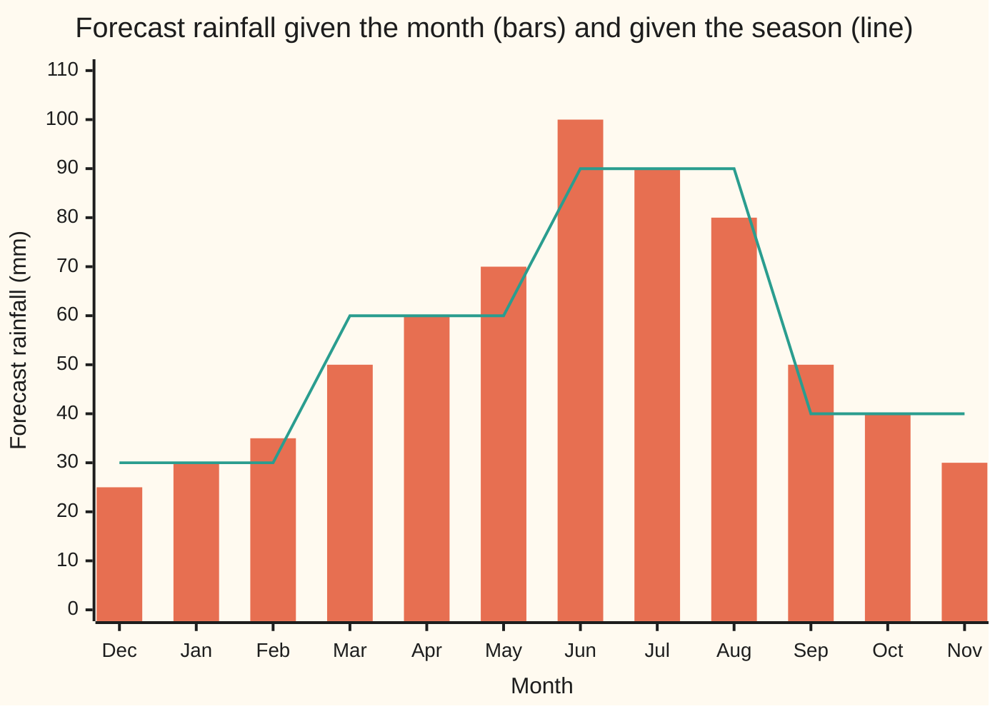
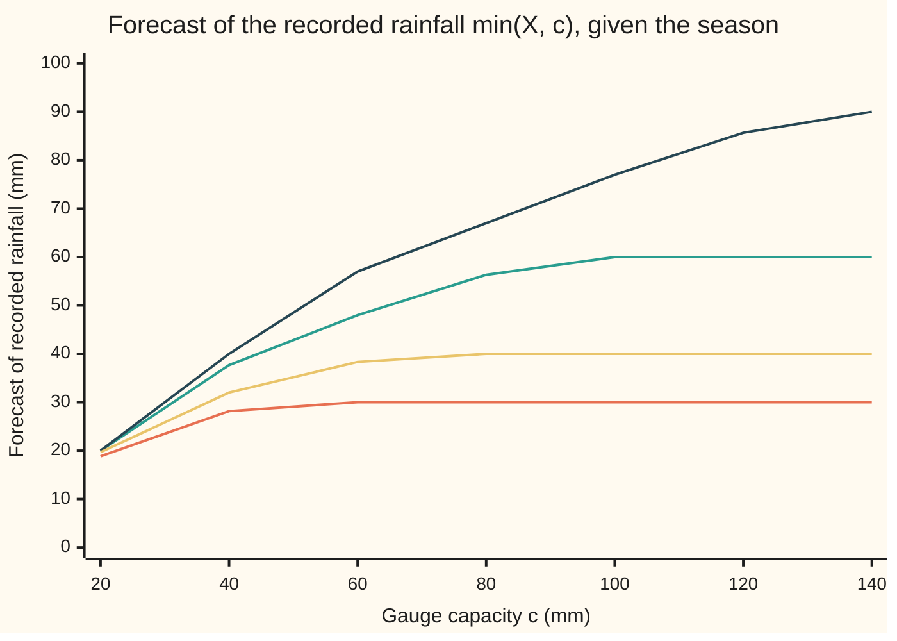

# The rules of conditional expectation: linearity, the tower, taking out what is known, dropping what is independent, and the limit theorems conditioned

Measure and integration → Conditional Expectation → Calculating with partial information → The rules of conditional expectation

---

## General Overview

A rain gauge logs one total per month. The winter months, December to February, average 25, 30 and 35 mm; spring 50, 60 and 70; summer 100, 90 and 80; autumn 50, 40 and 30. A dry year brings 3/5 of a month's average and a wet year 7/5, each with chance one half. So a winter December reads 15 mm or 35 mm, a summer June 60 or 140.

Knowing the month, the forecast is the month's mean. Knowing only the season, it is the season's mean: 30, 60, 90 and 40 mm. Average the monthly forecasts within a season and the seasonal one comes back: (25 + 30 + 35) / 3 = 30. A shop sells 4 umbrellas per mm of rain in winter; once the season is known, that 4 is known and multiplies the forecast, 4 × 30 = 120 umbrellas. The gauge also errs by −3 or +1 mm, chance one half each, whatever the weather; the month says nothing about it, so its forecast is its plain average, −1 mm.

Those three moves are the tower, taking out what is known, and dropping what is independent. The probability wing computes them in tables ([conditional-expectation-in-tables](../../09-Probability%20and%20statistics/02-Random%20Variables/05-conditional-expectation-in-tables.md)). This card proves them, with linearity, conditional Jensen and the conditional limit theorems, for any integrable quantity and any sigma-algebra of information, from the one identity that defines conditional expectation.

**Every equation among the rules is proved the same way: write down a candidate, check that the information settles it, check its integral over every event the information can see; the defining identity and its uniqueness do the rest, and the inequalities and limits then follow from those equations.**

**What kind of fact this is:** a theorem, or rather eight small ones, each proved on this card in Why it works.

### The picture: monthly forecasts averaged within seasons



Orange bars are the forecasts given the month. The green line is the forecast given the season. Within each season the bars average exactly to the line; across the year the line averages to 55 mm, the plain mean. That is the tower, twice.

---

## The formula

Notation, as a reminder. A probability space $(\Omega, \mathcal{F}, P)$ is a set of outcomes, the sets we allow ourselves to measure, and a measure of total size 1. A sub-sigma-algebra $\mathcal{G} \subseteq \mathcal{F}$ is a smaller collection of events: the ones a given piece of information can settle. A quantity is $\mathcal{G}$-measurable when its value is settled by that information. For an integrable $X$, the **conditional expectation** $E[X \mid \mathcal{G}]$ is the $\mathcal{G}$-measurable, integrable quantity with

$$\int_A E[X \mid \mathcal{G}] \, dP \;=\; \int_A X \, dP \qquad \text{for every } A \in \mathcal{G},$$

and any two such quantities agree almost surely, written a.s.: except on a set of probability zero ([conditional-expectation-on-a-sigma-algebra](02-conditional-expectation-on-a-sigma-algebra.md)). This is the **defining identity**. The indicator $1_A$ is one on A and zero off it, and $x^+ = \max(x, 0)$ is the positive part.

On the gauge, $\Omega$ has 48 outcomes: 12 months, dry or wet, gauge error −3 or +1. $P$ gives each 1/48. $\mathcal{M}$ is the information "which month", with 4096 events, every union of months. $\mathcal{S}$ is "which season", with 16 events. Every season is a union of months, so $\mathcal{S} \subseteq \mathcal{M}$.

**The rules.** Let $X$ and $Y$ be integrable, $a$ and $b$ numbers, and $\mathcal{H} \subseteq \mathcal{G}$ sub-sigma-algebras of $\mathcal{F}$. Every line holds almost surely.

$$\begin{aligned}
&\text{linearity:} && E[aX + bY \mid \mathcal{G}] = a\,E[X \mid \mathcal{G}] + b\,E[Y \mid \mathcal{G}] \\
&\text{order:} && X \le Y \;\Rightarrow\; E[X \mid \mathcal{G}] \le E[Y \mid \mathcal{G}] \\
&\text{tower:} && E\big[E[X \mid \mathcal{G}] \mid \mathcal{H}\big] = E[X \mid \mathcal{H}] = E\big[E[X \mid \mathcal{H}] \mid \mathcal{G}\big] \\
&\text{taking out what is known:} && Z \ \mathcal{G}\text{-measurable},\ ZX \text{ integrable} \;\Rightarrow\; E[ZX \mid \mathcal{G}] = Z\,E[X \mid \mathcal{G}] \\
&\text{dropping what is independent:} && X \text{ independent of } \mathcal{G} \;\Rightarrow\; E[X \mid \mathcal{G}] = E[X] \\
&\text{conditional Jensen:} && \varphi \text{ convex},\ \varphi(X) \text{ integrable} \;\Rightarrow\; \varphi\big(E[X \mid \mathcal{G}]\big) \le E[\varphi(X) \mid \mathcal{G}] \\
&\text{monotone convergence:} && 0 \le X_n \uparrow X \;\Rightarrow\; E[X_n \mid \mathcal{G}] \uparrow E[X \mid \mathcal{G}] \\
&\text{dominated convergence:} && X_n \to X \text{ a.s.},\ \lvert X_n \rvert \le W,\ W \text{ integrable} \;\Rightarrow\; E[X_n \mid \mathcal{G}] \to E[X \mid \mathcal{G}]
\end{aligned}$$

**Read it aloud:** conditional averaging is linear and keeps order; fine then coarse is coarse; a factor the information knows comes out; a quantity it knows nothing about becomes its plain mean; a convex curve of the forecast is at most the forecast of the curve; and both limit theorems pass inside under their usual hypotheses.

Taking $\mathcal{H}$ to be the trivial information, only $\varnothing$ and $\Omega$, turns the tower into $E\big[E[X \mid \mathcal{G}]\big] = E[X]$: the average forecast is the average.

| Symbol | Plain meaning | In our example | Push it up and the answer… |
| --- | --- | --- | --- |
| $\Omega$, $\mathcal{F}$, $P$ | the outcomes; the events we measure; the probability | 48 outcomes; every subset; 1/48 each | — |
| $X$, $Y$ | integrable quantities | $X$: rainfall in the month, 15 to 140 mm, mean 55 | a wetter month lifts its season's forecast by a third of the rise |
| $N$ | the gauge error, independent of the weather and the date | −3 or +1 mm, mean −1 | a larger mean shifts every forecast of the reading by the same amount |
| $\mathcal{G}$, $\mathcal{H}$ | information: sub-sigma-algebras, $\mathcal{H} \subseteq \mathcal{G}$ for the tower | $\mathcal{M}$, the month; $\mathcal{S}$, the season | finer information, forecasts closer to the truth |
| $\mathcal{M}$, $\mathcal{S}$ | knowing the month; knowing the season | 4096 events; 16 events | — |
| $E[X \mid \mathcal{G}]$ | the conditional expectation: the forecast of $X$ given $\mathcal{G}$ | given $\mathcal{S}$: 30, 60, 90, 40 mm | — |
| $A$, $1_A$ | an event the information can see; one on A, zero off it | "winter or summer" | — |
| $Z$, $ZX$, $ZM$, $U$, $V$ | a factor and its products; umbrellas per mm by season; umbrellas per mm by weather | $U$ = 4, 3, 1, 2; $V$ = 1 dry, 3 wet | a bigger known factor scales its season's forecast |
| $\varphi$ | a convex function: every chord lies on or above its graph | $(x - 50)^+$, a flood payout; $x^2$ | a sharper bend, a wider gap |
| $X_n$, $W$ | a sequence of quantities; an integrable bound on all of them | $\min(X, c)$ for a gauge of capacity c mm; a burst of height n | — |
| $a$, $b$, $c$, $n$ | fixed numbers in linearity; gauge capacity; burst height | 1 and 1 for the reading $X + N$; 20 to 140 mm; 2 to 64 | — |
| $M$, $M_n$, $K$, $B$, $B_k$, $Z_k$, $Z^{\pm}$, $X^{\pm}$, $D_n$, $L$, $I$, $e$, $r$, $s_r$, $N_r$ | in the proofs: a forecast, and the forecast of $X_n$; its coarse forecast; an event in $\mathcal{G}$; the event that the forecast is below −1/k; simple known factors rising to $Z$; the positive and negative parts, $Z = Z^+ - Z^-$; the worst error from step n on; the limit of its forecasts; an interval and an end it excludes; a rational point, its supporting slope, its null exceptional set | winter: $M$ = 30 | — |

### When it holds

- **Integrable quantities.** The defining identity needs $\int_A X \, dP$ finite. Nonnegative quantities with infinite mean have a conditional expectation that may take the value $+\infty$, and monotone convergence works for them; the signed rules need integrability.
- **Nested information for the tower.** With $\mathcal{H} \subseteq \mathcal{G}$ the order of averaging does not matter. With two unrelated pieces of information it does: averaging the two-month forecasts within seasons gives winter 65/2 mm, not 30.
- **A factor the information settles.** Umbrellas per mm that depend on the season come out. Umbrellas per mm that depend on whether the year is wet do not: the forecast of sales is 72 in winter, not 2 × 30 = 60.
- **Independence of the whole information.** The error must be independent of every event in $\mathcal{G}$. An evaporation loss of 4 mm in summer makes the summer error average −5, not the year's −2.
- **A dominating integrable bound for dominated convergence.** A burst of height n on the first 1/n of the season tends to 0 at every later instant, yet its forecast for the early half stays 2 for every n.

---

## Why it works

### Step 0: the defining identity is a test, and passing it is enough

Each rule claims that the right-hand side is the conditional expectation of the left. Uniqueness means a proof needs only three checks on the right-hand side: the information $\mathcal{G}$ settles it; it is integrable; its integral over every event in $\mathcal{G}$ equals the left-hand quantity's. Nothing is divided by the probability of an event, so the rules hold even when the information is a continuous reading. On the gauge the test is finite: the code runs it on all 16 season events or all 4096 month events.

### Step 1: linearity and order

Integrals over an event are linear, so a combination of forecasts passes the test for the same combination of quantities. For order: if $X \ge 0$ but its forecast were below some negative level on an event of positive probability that the information sees, the integral of $X$ over that event would be negative. Applied to $-\lvert X \rvert \le X \le \lvert X \rvert$, order gives $\lvert E[X \mid \mathcal{G}] \rvert \le E[\lvert X \rvert \mid \mathcal{G}]$, used in Step 7.

### Step 2: the tower

Forecast the fine forecast with coarse information. The result is settled by the coarse information. Over a coarse event its integral equals the fine forecast's, by the coarse identity, and that equals the integral of $X$, by the fine identity. The fine identity applies because a coarse event is also a fine one; that is the only use of nesting. On the gauge the month forecasts 25, 30, 35 average to 30, and the six winter rainfall values 15, 35, 18, 42, 21, 49 average to 30 directly.

### Step 3: taking out what is known

For a known factor that is the indicator of an event $B$ in $\mathcal{G}$, integrating over $A$ with the factor is integrating over $A \cap B$, which is again an event the information sees, so the identity carries over. Sums of indicators follow by linearity, and every known factor is a limit of such sums, so monotone convergence finishes. On the gauge: 4 × 30 = 120 umbrellas in winter, then 180, 90 and 80.

### Step 4: dropping what is independent

If $X$ is independent of every event $A$ in $\mathcal{G}$, the integral of $X$ over $A$ splits as $P(A)$ times $E[X]$ ([independence-as-a-product-measure](../06-Product%20Measures%20and%20Fubini/04-independence-as-a-product-measure.md)), which is the integral of the constant $E[X]$ over $A$. A constant is settled by any information, so it passes. On the gauge the error forecast is −1 in every month, and by linearity the reading's forecasts are 29, 59, 89, 39.

### Step 5: conditional Jensen, one line at a time

A convex curve has a supporting line at every point, a straight line through the point that stays on or below the curve ([jensens-inequality](../07-Sizes%20of%20Functions/04-jensens-inequality.md)). Order and linearity push each line through the conditional expectation, outside a null set. The unconditional proof used one line, at the mean; here the forecast varies with the outcome, so each outcome needs its own line, and uncountably many null sets can add up to positive probability. So use only the lines at rational points: countably many null sets make a null set, and a continuous convex curve is the highest of those lines everywhere. On the gauge, a flood payout of $(X - 50)^+$: the spring forecast of the payout is 17, the payout at the spring forecast 10. For the square the gap is the spread within the season, 163.33 in winter.

### Step 6: conditional monotone convergence

If $0 \le X_n$ rise to $X$, their forecasts rise too, by order, to a limit settled by $\mathcal{G}$. The ordinary monotone convergence theorem ([monotone-convergence-theorem](../04-The%20Lebesgue%20Integral/03-monotone-convergence-theorem.md)), applied to both sides of each defining identity, shows the limit passes the test for $X$. On the gauge, a gauge of capacity c mm records $\min(X, c)$; the winter forecast rises 18.83, 28.17, 30.00 and stays, while summer needs a capacity of 140 to reach 90.

### Step 7: conditional dominated convergence

Bound the forecast error by the forecast of the worst later error, $D_n$, which falls to 0 and stays below twice the bound $W$. Those forecasts fall to a limit whose mean is at most $E[D_n]$ for every n, by the tower, and $E[D_n] \to 0$ by the ordinary dominated convergence theorem. A nonnegative quantity with mean 0 is 0 almost surely.

### The picture: a gauge that overflows, with growing capacity



Orange is winter, green spring, dark blue summer, gold autumn. Each line rises and settles on its season's forecast of the true rainfall, 30, 60, 90 and 40 mm, once the capacity reaches the season's largest value: 49, 98, 140 and 70 mm. Conditional monotone convergence says the rise always reaches the limit, season by season.

<details>
<summary>Detailed proof</summary>

**Setting.** $\mathcal{H} \subseteq \mathcal{G} \subseteq \mathcal{F}$ are sigma-algebras on a probability space. **Uniqueness**, used throughout: two $\mathcal{G}$-measurable integrable quantities with equal integrals over every $A \in \mathcal{G}$ agree a.s. ([conditional-expectation-on-a-sigma-algebra](02-conditional-expectation-on-a-sigma-algebra.md)). Each part names a candidate and checks it.

**1. Linearity.** $aE[X \mid \mathcal{G}] + bE[Y \mid \mathcal{G}]$ is $\mathcal{G}$-measurable and integrable, with integral $a\int_A X + b\int_A Y = \int_A (aX + bY)$ over each $A \in \mathcal{G}$.

**2. Order.** Let $X \ge 0$ a.s. and $M = E[X \mid \mathcal{G}]$. For $B_k = \{M < -1/k\} \in \mathcal{G}$: $0 \le \int_{B_k} X = \int_{B_k} M \le -P(B_k)/k$, so $P(B_k) = 0$, and $\{M < 0\} = \bigcup_k B_k$ is null. For $X \le Y$ apply this to $Y - X$. From $-\lvert X \rvert \le X \le \lvert X \rvert$: $\lvert E[X \mid \mathcal{G}] \rvert \le E[\lvert X \rvert \mid \mathcal{G}]$ a.s. A $\mathcal{G}$-measurable $X$ passes its own test: $E[X \mid \mathcal{G}] = X$ a.s.

**3. Tower.** Let $M = E[X \mid \mathcal{G}]$ and $K = E[M \mid \mathcal{H}]$, which is $\mathcal{H}$-measurable and integrable. For $A \in \mathcal{H}$: $\int_A K = \int_A M$ (definition of $K$) $= \int_A X$ (definition of $M$, as $A \in \mathcal{G}$). So $K = E[X \mid \mathcal{H}]$ a.s. The other order: $E[X \mid \mathcal{H}]$ is $\mathcal{G}$-measurable; use part 2's last line.

**4. Taking out what is known.** Let $Z$ be $\mathcal{G}$-measurable with $X$ and $ZX$ integrable; put $M = E[X \mid \mathcal{G}]$. (a) $Z = 1_B$, $B \in \mathcal{G}$: for $A \in \mathcal{G}$, $\int_A 1_B M = \int_{A \cap B} M = \int_{A \cap B} X = \int_A 1_B X$, as $A \cap B \in \mathcal{G}$. (b) $Z$ simple and $\mathcal{G}$-measurable: linearity of the integral over the finitely many indicators. (c) $Z \ge 0$, $X \ge 0$: then $M \ge 0$ a.s. by part 2. Choose simple $\mathcal{G}$-measurable $0 \le Z_k \uparrow Z$ ([simple-functions-and-approximation](../03-Measurable%20Functions/03-simple-functions-and-approximation.md)). For $A \in \mathcal{G}$, (b) gives $\int_A Z_k M = \int_A Z_k X$; monotone convergence on each side gives $\int_A ZM = \int_A ZX$, which is finite. So $ZM$ is integrable, $\mathcal{G}$-measurable, and passes the test: $E[ZX \mid \mathcal{G}] = ZM$ a.s. (d) General: write $Z = Z^+ - Z^-$ and $X = X^+ - X^-$. Each product $Z^{\pm}X^{\pm}$ is at most $\lvert ZX \rvert$, hence integrable, and (c) gives $E[Z^{\pm}X^{\pm} \mid \mathcal{G}] = Z^{\pm}E[X^{\pm} \mid \mathcal{G}]$. Add the four with their signs and use parts 1 and $M = E[X^+ \mid \mathcal{G}] - E[X^- \mid \mathcal{G}]$.

**5. Independence.** Suppose $\sigma(X)$, the events decided by $X$, is independent of $\mathcal{G}$. For $A \in \mathcal{G}$, $1_A$ is a function of an event independent of $X$, so $E[1_A X] = E[1_A]E[X] = P(A)E[X]$ ([independence-as-a-product-measure](../06-Product%20Measures%20and%20Fubini/04-independence-as-a-product-measure.md)). The constant $E[X]$ is $\mathcal{G}$-measurable and $\int_A E[X] \, dP = P(A)E[X]$. By uniqueness, $E[X \mid \mathcal{G}] = E[X]$ a.s.

**6. Conditional Jensen.** Let $\varphi : \mathbb{R} \to \mathbb{R}$ be convex, $X$ and $\varphi(X)$ integrable. $\varphi$ is continuous, and at each rational $r$ has a slope $s_r$ with $\varphi(x) \ge \varphi(r) + s_r(x - r)$ for all $x$ ([jensens-inequality](../07-Sizes%20of%20Functions/04-jensens-inequality.md), Detailed proof parts 2 and 3). For rationals $r$ in $[x - 1, x + 1]$ the slopes $s_r$ lie between the chord slopes on $[x - 2, x - 1]$ and $[x + 1, x + 2]$, so as $r \to x$, $\varphi(r) + s_r(x - r) \to \varphi(x)$: $\varphi$ is the sup of its rational supporting lines. For each $r$, parts 1 and 2 give $E[\varphi(X) \mid \mathcal{G}] \ge \varphi(r) + s_r(E[X \mid \mathcal{G}] - r)$ outside a null set $N_r$. Outside the null union of the $N_r$, take the sup over $r$. For $\varphi$ convex on an open interval $I$ holding the values of $X$, use rationals in $I$. Part 2 puts $E[X \mid \mathcal{G}]$ in the closure of $I$ a.s.; on $B = \{E[X \mid \mathcal{G}] = e\} \in \mathcal{G}$ for an excluded end $e$, the identity gives $\int_B (X - e) = 0$ with $X - e$ of one sign, so $P(B) = 0$.

**7. Conditional monotone convergence.** Let $0 \le X_n \uparrow X$ a.s. with $X$ integrable, and $M_n = E[X_n \mid \mathcal{G}]$. By part 2, $0 \le M_1 \le M_2 \le \dots \le E[X \mid \mathcal{G}]$ outside a countable union of null sets. Let $M = \lim M_n$ there and 0 elsewhere; it is $\mathcal{G}$-measurable ([limits-of-measurable-functions](../03-Measurable%20Functions/02-limits-of-measurable-functions.md)) and integrable, being at most $E[X \mid \mathcal{G}]$. For $A \in \mathcal{G}$, the monotone convergence theorem on each side gives $\int_A M = \lim_n \int_A M_n = \lim_n \int_A X_n = \int_A X$. By uniqueness $M = E[X \mid \mathcal{G}]$ a.s.

**8. Conditional dominated convergence.** Let $X_n \to X$ a.s. and $\lvert X_n \rvert \le W$, $W$ integrable. Put $D_n = \sup_{k \ge n} \lvert X_k - X \rvert$: measurable, $0 \le D_n \le 2W$, $D_n \downarrow 0$ a.s. By parts 1 and 2, $\lvert E[X_n \mid \mathcal{G}] - E[X \mid \mathcal{G}] \rvert \le E[D_n \mid \mathcal{G}]$, which falls a.s. to a limit $L \ge 0$. For every n, $E[L] \le E\big[E[D_n \mid \mathcal{G}]\big] = E[D_n]$ (part 2, and part 3 with trivial $\mathcal{H}$), and $E[D_n] \to 0$ by the dominated convergence theorem. So $L = 0$ a.s.

</details>

A second road to the tower, for square-integrable $X$, sees conditional expectation as the nearest $\mathcal{G}$-measurable quantity in mean square: projecting onto a smaller space after a larger one is projecting onto the smaller one. That road is [conditional-expectation-as-projection](03-conditional-expectation-as-projection.md); the proof above needs only integrability.

---

## Worked numbers, by hand

Winter holds 12 of the 48 outcomes. The gauge error does not change $X$, so six rainfall values, each twice, carry the arithmetic.

| Step | Arithmetic | Value |
| --- | --- | --- |
| winter rainfall values | 3/5 and 7/5 of 25, 30, 35 | 15, 35; 18, 42; 21, 49 |
| month forecasts | (15 + 35)/2, (18 + 42)/2, (21 + 49)/2 | 25, 30, 35 |
| tower: average the month forecasts | (25 + 30 + 35)/3 | **30** |
| season forecast, direct | (15 + 35 + 18 + 42 + 21 + 49)/6 = 180/6 | **30** |
| year: average the four season forecasts | (30 + 60 + 90 + 40)/4 | 55 |
| umbrella sales forecast, winter | 4 × 30 | **120** |
| sales forecasts, all seasons | 4 × 30, 3 × 60, 1 × 90, 2 × 40 | 120, 180, 90, 80 |
| expected sales over the year | (120 + 180 + 90 + 80)/4 | 117.5 |
| gauge error forecast, any month | (−3 + 1)/2 | −1 |
| reading forecast, by season | 30 − 1, 60 − 1, 90 − 1, 40 − 1 | 29, 59, 89, 39 |
| spring flood payout, $(X - 50)^+$ | 0, 20; 0, 34; 0, 48, averaged: 102/6 | **17**, against 10 at the forecast |

Expected sales are 117.5 umbrellas a month over the year, and 120 in a winter month.

### What breaks if you drop a piece

| Mistake | Comes out at | What went wrong |
| --- | --- | --- |
| Tower with information that does not nest: two-month blocks, averaged within seasons | 65/2, 115/2, 85, 45 against 30, 60, 90, 40 | February shares a block with March, so the winter average imports spring rain |
| Pulling out a factor the season does not settle: $V$ = 1 dry, 3 wet | $E[VX \mid \mathcal{S}]$ = 72, 144, 216, 96 against 60, 120, 180, 80 | $V$ is high exactly when rain is; within a season they move together |
| Dropping an error that depends on the season: 4 mm evaporation in summer | summer error forecast −5, against the year's −2 | the error is not independent of $\mathcal{S}$ |
| Multiplying plain means, $E[U]E[X]$ | 137.5 against 117.5 | $U$ is high in dry seasons; pull it out season by season, then average |
| Limits with no integrable bound: a burst $X_n$ = n on the first 1/n of the season | early-half forecast 2 for n = 2 to 64, while $X_n \to 0$ at every later instant; capped at 4 it falls, 2, 2, 1, 1/2, 1/4, 1/8 | the burst's area stays 1; nothing integrable lies above all the bursts |

For the burst, $\Omega$ is the season as the interval `[0, 1)` under length, and the information is "early half or late half". The early-half forecast is the burst's area, 1, over the half's length, 1/2; the late-half forecast is 0.

---

## Code, from first principles, and it actually runs

The code builds the 48 outcomes and takes three roads. Road one averages over the atoms of the information, its smallest events, in exact fractions. Road two runs Step 0's test: the tower, pull-out and independence right-hand sides against the defining identity on all 16 season events or all 4096 month events. Road three draws 48000 outcomes with a SplitMix64 generator, seed 20260929, written out in both languages, and checks the sampled sales forecasts against 120, 180, 90 and 80 within four standard errors. The burst integrals come in closed form and by a midpoint rule. What the code shows is one 48-point space and one interval; that the rules hold for every probability space and every integrable quantity is what the proof shows.

### Python

```python
# The rules of conditional expectation -- the check behind the card.
# Standard library only; fractions for exact sums.  The space: 48 equally
# likely points = 12 months x (dry, wet) x gauge error (-3, +1) mm.
# Rainfall X is the month's mean times 3/5 in a dry year, 7/5 in a wet one.
from fractions import Fraction as Q

MEAN = [25, 30, 35, 50, 60, 70, 100, 90, 80, 50, 40, 30]   # month means, mm
U = [4, 3, 1, 2]                          # umbrellas sold per mm, by season
OMEGA = [(m, w, e) for m in range(12) for w in (0, 1) for e in (0, 1)]
PR = Q(1, 48)
X = lambda p: Q(MEAN[p[0]] * (7 if p[1] else 3), 5)
N = lambda p: (-3, 1)[p[2]]                         # gauge error, independent
MONTH, SEASON = (lambda p: p[0]), (lambda p: p[0] // 3)
BIMONTH, ALL = (lambda p: p[0] // 2), (lambda p: 0)

def cond(f, lab):                         # road 1: average f over each atom
    tot, mass = {}, {}
    for p in OMEGA:
        a = lab(p)
        tot[a], mass[a] = tot.get(a, 0) + f(p) * PR, mass.get(a, 0) + PR
    return {a: tot[a] / mass[a] for a in tot}

def defining_identity(cand, f, lab):      # road 2: the integral over every A in G
    atoms = sorted({lab(p) for p in OMEGA})
    for bits in range(1 << len(atoms)):
        A = [p for p in OMEGA if bits >> atoms.index(lab(p)) & 1]
        if sum(cand(p) * PR for p in A) != sum(f(p) * PR for p in A):
            return False
    return True

def show(d):
    return ", ".join(str(d[a]) for a in sorted(d))

def dec(v):
    return f"{float(v):.2f}"

NAMES = ["winter", "spring", "summer", "autumn"]
print(f"space: {len(OMEGA)} points, each {PR}; E[X] = {sum(X(p) * PR for p in OMEGA)} mm")
print("X dry/wet by month: " + ", ".join(f"{X((m, 0, 0))}/{X((m, 1, 0))}" for m in range(12)))
by_month, by_season = cond(X, MONTH), cond(X, SEASON)
print("E[X | month]: " + show(by_month))
print("E[X | season], direct: " + show(by_season))
tower = cond(lambda p: by_month[MONTH(p)], SEASON)
print("E[E[X | month] | season]: " + show(tower) + f"; its mean {cond(lambda p: tower[SEASON(p)], ALL)[0]}")
assert tower == by_season
assert defining_identity(lambda p: by_month[MONTH(p)], X, MONTH)          # 4096 events
assert defining_identity(lambda p: by_month[MONTH(p)], X, SEASON)         # tower, 16 events
print("defining identity: E[X | month] on all 4096 events of sigma(month); tower on all 16 of sigma(season)")

# ---- taking out what is known: umbrella sales U(season) times rainfall ----
sales = lambda p: U[SEASON(p)] * X(p)
pulled = {s: U[s] * by_season[s] for s in range(4)}
print("E[U X | season]: " + show(cond(sales, SEASON)) + "; U E[X | season]: " + show(pulled))
assert cond(sales, SEASON) == pulled
assert defining_identity(lambda p: pulled[SEASON(p)], sales, SEASON)
print(f"E[U X] = {float(cond(sales, ALL)[0]):.1f}; wrong E[U] E[X] = {float(Q(sum(U), 4) * 55):.1f}")

# ---- linearity and the independent gauge error: reading R = X + N ----
EN = sum(N(p) * PR for p in OMEGA)
print("E[N | month]: " + show(cond(N, MONTH)) + f"; E[N] = {EN}")
dropped = {s: by_season[s] + EN for s in range(4)}
assert cond(lambda p: X(p) + N(p), SEASON) == dropped
assert defining_identity(lambda p: EN, N, MONTH)
print("E[X + N | season]: " + show(dropped))

# ---- conditional Jensen: flood payout (X - 50)+, and the square ----
flood = lambda x: max(x - 50, 0)
pay = cond(lambda p: flood(X(p)), SEASON)
print("E[(X - 50)+ | season]: " + show(pay) + "; (E[X | season] - 50)+: " + show({s: flood(by_season[s]) for s in range(4)}))
assert all(pay[s] >= flood(by_season[s]) for s in range(4)) and pay[1] > flood(by_season[1])
sq = cond(lambda p: X(p) ** 2, SEASON)
cvar = cond(lambda p: (X(p) - by_season[SEASON(p)]) ** 2, SEASON)
print("E[X^2 | season] - E[X | season]^2: " + ", ".join(dec(sq[s] - by_season[s] ** 2) for s in range(4)))
assert all(sq[s] - by_season[s] ** 2 == cvar[s] for s in range(4))       # gap = spread

# ---- what breaks ----
bi = cond(X, BIMONTH)
print("E[X | bimonth]: " + show(bi))
cross = cond(lambda p: bi[BIMONTH(p)], SEASON)
print("not nested, E[E[X | bimonth] | season]: " + show(cross))
assert cross != by_season
V = lambda p: 3 if p[1] else 1                     # umbrellas per mm, by weather
print("V by weather: E[V X | season]: " + show(cond(lambda p: V(p) * X(p), SEASON))
      + "; E[V | season] E[X | season]: " + show({s: 2 * by_season[s] for s in range(4)}))
assert cond(lambda p: V(p) * X(p), SEASON) != {s: 2 * by_season[s] for s in range(4)}
N2 = lambda p: N(p) - 4 * (SEASON(p) == 2)          # summer evaporation loss
print("seasonal error: E[N2 | season]: " + show(cond(N2, SEASON)) + f"; E[N2] = {cond(N2, ALL)[0]}")
assert cond(N2, SEASON) != {s: cond(N2, ALL)[0] for s in range(4)}

# ---- conditional monotone convergence: a gauge that overflows at c mm ----
caps = [20, 40, 60, 80, 100, 120, 140]
print("figure, capacity c (mm): " + ", ".join(map(str, caps)))
rows = [cond(lambda p: min(X(p), c), SEASON) for c in caps]
for s, name in enumerate(NAMES):
    col = [r[s] for r in rows]
    print(f"figure, E[min(X, c) | {name}]: " + ", ".join(dec(v) for v in col))
    assert all(a <= b for a, b in zip(col, col[1:])) and col[-1] == by_season[s]

# ---- conditional dominated convergence: the burst X_n = n on [0, 1/n) ----
# Omega = [0, 1) under length; G = {early half [0, 1/2), late half}.
k = 1 << 14                               # midpoint rule on the early half
mids = [(i + 0.5) / (2 * k) for i in range(k)]
for n in [2, 4, 8, 16, 32, 64]:
    early, late = Q(n) * min(Q(1, n), Q(1, 2)) * 2, Q(n) * max(Q(1, n) - Q(1, 2), Q(0)) * 2
    capped = Q(min(n, 4)) * min(Q(1, n), Q(1, 2)) * 2
    r_early = sum(n for t in mids if t < 1 / n) / k
    r_cap = sum(min(n, 4) for t in mids if t < 1 / n) / k
    print(f"n = {n}: E[X_n | early] = {early} (midpoint {r_early:.4f}); E[X_n | late] = {late}; "
          f"E[min(X_n, 4) | early] = {capped} (midpoint {r_cap:.4f})")
    assert abs(r_early - float(early)) < 1e-12 and abs(r_cap - float(capped)) < 1e-12

# ---- road 3: sampling, SplitMix64, seed 20260929 ----
MASK, state = (1 << 64) - 1, 20260929
def splitmix():
    global state
    state = (state + 0x9E3779B97F4A7C15) & MASK
    z = state
    z = ((z ^ (z >> 30)) * 0xBF58476D1CE4E5B9) & MASK
    z = ((z ^ (z >> 27)) * 0x94D049BB133111EB) & MASK
    return z ^ (z >> 31)
tot, tot2, cnt = [0.0] * 4, [0.0] * 4, [0] * 4
print("sampling: 48000 draws, SplitMix64 seed 20260929")
for _ in range(48000):
    p = OMEGA[splitmix() % 48]
    r = float(sales(p))
    tot[SEASON(p)] += r; tot2[SEASON(p)] += r * r; cnt[SEASON(p)] += 1
for s in range(4):
    m = tot[s] / cnt[s]
    se = ((tot2[s] / cnt[s] - m * m) / cnt[s]) ** 0.5
    print(f"sampled E[U X | {NAMES[s]}] over {cnt[s]} draws = {m:.2f}, standard error {se:.2f}")
    assert abs(m - float(pulled[s])) < 4 * se
print("ALL CHECKS PASS")
```

**Ran 2026-09-29 on macOS, Python 3.14.6, standard library only. All checks passed. Output, pasted from the run:**

```
space: 48 points, each 1/48; E[X] = 55 mm
X dry/wet by month: 15/35, 18/42, 21/49, 30/70, 36/84, 42/98, 60/140, 54/126, 48/112, 30/70, 24/56, 18/42
E[X | month]: 25, 30, 35, 50, 60, 70, 100, 90, 80, 50, 40, 30
E[X | season], direct: 30, 60, 90, 40
E[E[X | month] | season]: 30, 60, 90, 40; its mean 55
defining identity: E[X | month] on all 4096 events of sigma(month); tower on all 16 of sigma(season)
E[U X | season]: 120, 180, 90, 80; U E[X | season]: 120, 180, 90, 80
E[U X] = 117.5; wrong E[U] E[X] = 137.5
E[N | month]: -1, -1, -1, -1, -1, -1, -1, -1, -1, -1, -1, -1; E[N] = -1
E[X + N | season]: 29, 59, 89, 39
E[(X - 50)+ | season]: 0, 17, 121/3, 13/3; (E[X | season] - 50)+: 0, 10, 40, 0
E[X^2 | season] - E[X | season]^2: 163.33, 653.33, 1373.33, 333.33
E[X | bimonth]: 55/2, 85/2, 65, 95, 65, 35
not nested, E[E[X | bimonth] | season]: 65/2, 115/2, 85, 45
V by weather: E[V X | season]: 72, 144, 216, 96; E[V | season] E[X | season]: 60, 120, 180, 80
seasonal error: E[N2 | season]: -1, -1, -5, -1; E[N2] = -2
figure, capacity c (mm): 20, 40, 60, 80, 100, 120, 140
figure, E[min(X, c) | winter]: 18.83, 28.17, 30.00, 30.00, 30.00, 30.00, 30.00
figure, E[min(X, c) | spring]: 20.00, 37.67, 48.00, 56.33, 60.00, 60.00, 60.00
figure, E[min(X, c) | summer]: 20.00, 40.00, 57.00, 67.00, 77.00, 85.67, 90.00
figure, E[min(X, c) | autumn]: 19.67, 32.00, 38.33, 40.00, 40.00, 40.00, 40.00
n = 2: E[X_n | early] = 2 (midpoint 2.0000); E[X_n | late] = 0; E[min(X_n, 4) | early] = 2 (midpoint 2.0000)
n = 4: E[X_n | early] = 2 (midpoint 2.0000); E[X_n | late] = 0; E[min(X_n, 4) | early] = 2 (midpoint 2.0000)
n = 8: E[X_n | early] = 2 (midpoint 2.0000); E[X_n | late] = 0; E[min(X_n, 4) | early] = 1 (midpoint 1.0000)
n = 16: E[X_n | early] = 2 (midpoint 2.0000); E[X_n | late] = 0; E[min(X_n, 4) | early] = 1/2 (midpoint 0.5000)
n = 32: E[X_n | early] = 2 (midpoint 2.0000); E[X_n | late] = 0; E[min(X_n, 4) | early] = 1/4 (midpoint 0.2500)
n = 64: E[X_n | early] = 2 (midpoint 2.0000); E[X_n | late] = 0; E[min(X_n, 4) | early] = 1/8 (midpoint 0.1250)
sampling: 48000 draws, SplitMix64 seed 20260929
sampled E[U X | winter] over 12026 draws = 119.94, standard error 0.47
sampled E[U X | spring] over 12018 draws = 179.24, standard error 0.69
sampled E[U X | summer] over 11871 draws = 89.82, standard error 0.34
sampled E[U X | autumn] over 12085 draws = 79.87, standard error 0.33
ALL CHECKS PASS
```

### Rust

Same rows, same labels, built with `rustc --edition 2021 -O`. The exact fractions are a small struct on 128-bit integers.

```rust
// The rules of conditional expectation -- the same check as the Python, in
// Rust.  No crates; exact fractions written out by hand on i128.  The space:
// 48 equally likely points = 12 months x (dry, wet) x gauge error (-3, +1) mm.
// Rainfall X is the month's mean times 3/5 in a dry year, 7/5 in a wet one.
use std::fmt;
use std::ops::{Add, Mul, Sub};

const MEAN: [i128; 12] = [25, 30, 35, 50, 60, 70, 100, 90, 80, 50, 40, 30];
const U: [i128; 4] = [4, 3, 1, 2];        // umbrellas sold per mm, by season
const NAMES: [&str; 4] = ["winter", "spring", "summer", "autumn"];

#[derive(Clone, Copy, PartialEq, Debug)]
struct Q { n: i128, d: i128 }             // n / d, d > 0, lowest terms
fn gcd(a: i128, b: i128) -> i128 { if b == 0 { a.abs() } else { gcd(b, a % b) } }
fn q(n: i128, d: i128) -> Q { let g = gcd(n, d).max(1) * d.signum(); Q { n: n / g, d: d / g } }
impl Add for Q { type Output = Q; fn add(self, o: Q) -> Q { q(self.n * o.d + o.n * self.d, self.d * o.d) } }
impl Sub for Q { type Output = Q; fn sub(self, o: Q) -> Q { q(self.n * o.d - o.n * self.d, self.d * o.d) } }
impl Mul for Q { type Output = Q; fn mul(self, o: Q) -> Q { q(self.n * o.n, self.d * o.d) } }
impl PartialOrd for Q {
    fn partial_cmp(&self, o: &Q) -> Option<std::cmp::Ordering> { (self.n * o.d).partial_cmp(&(o.n * self.d)) }
}
impl fmt::Display for Q {
    fn fmt(&self, f: &mut fmt::Formatter) -> fmt::Result {
        if self.d == 1 { write!(f, "{}", self.n) } else { write!(f, "{}/{}", self.n, self.d) }
    }
}
impl Q { fn fl(self) -> f64 { self.n as f64 / self.d as f64 } }
fn z(n: i128) -> Q { q(n, 1) }

// a point is 4 * month + 2 * wet + error index, the Python's order
fn x(p: usize) -> Q { q(MEAN[p / 4] * if (p / 2) % 2 == 1 { 7 } else { 3 }, 5) }
fn nerr(p: usize) -> Q { z(if p % 2 == 1 { 1 } else { -3 }) }
fn month(p: usize) -> usize { p / 4 }
fn season(p: usize) -> usize { p / 12 }
fn bimonth(p: usize) -> usize { p / 8 }
fn all(_p: usize) -> usize { 0 }

fn cond(f: &dyn Fn(usize) -> Q, lab: fn(usize) -> usize) -> Vec<Q> {   // road 1: atom averages
    let k = (0..48).map(lab).max().unwrap() + 1;
    let (mut tot, mut mass) = (vec![z(0); k], vec![z(0); k]);
    for p in 0..48 { tot[lab(p)] = tot[lab(p)] + f(p) * q(1, 48); mass[lab(p)] = mass[lab(p)] + q(1, 48); }
    (0..k).map(|a| tot[a] * q(mass[a].d, mass[a].n)).collect()
}
fn defining_identity(cand: &dyn Fn(usize) -> Q, f: &dyn Fn(usize) -> Q, lab: fn(usize) -> usize) -> bool {
    let k = (0..48).map(lab).max().unwrap() + 1;          // road 2: every A in G
    (0..1usize << k).all(|bits| {
        let pts: Vec<usize> = (0..48).filter(|&p| bits >> lab(p) & 1 == 1).collect();
        pts.iter().fold(z(0), |s, &p| s + cand(p) * q(1, 48)) == pts.iter().fold(z(0), |s, &p| s + f(p) * q(1, 48))
    })
}
fn show(v: &[Q]) -> String { v.iter().map(|a| a.to_string()).collect::<Vec<_>>().join(", ") }
fn dec(v: &[Q]) -> String { v.iter().map(|a| format!("{:.2}", a.fl())).collect::<Vec<_>>().join(", ") }
fn splitmix(state: &mut u64) -> u64 {
    *state = state.wrapping_add(0x9E3779B97F4A7C15);
    let mut z = *state;
    z = (z ^ (z >> 30)).wrapping_mul(0xBF58476D1CE4E5B9);
    z = (z ^ (z >> 27)).wrapping_mul(0x94D049BB133111EB);
    z ^ (z >> 31)
}

fn main() {
    println!("space: 48 points, each 1/48; E[X] = {} mm", cond(&x, all)[0]);
    let dw: Vec<String> = (0..12).map(|m| format!("{}/{}", x(4 * m), x(4 * m + 2))).collect();
    println!("X dry/wet by month: {}", dw.join(", "));
    let (by_month, by_season) = (cond(&x, month), cond(&x, season));
    println!("E[X | month]: {}", show(&by_month));
    println!("E[X | season], direct: {}", show(&by_season));
    let tower = cond(&|p| by_month[month(p)], season);
    println!("E[E[X | month] | season]: {}; its mean {}", show(&tower), cond(&|p| tower[season(p)], all)[0]);
    assert!(tower == by_season);
    assert!(defining_identity(&|p| by_month[month(p)], &x, month));      // 4096 events
    assert!(defining_identity(&|p| by_month[month(p)], &x, season));     // tower, 16 events
    println!("defining identity: E[X | month] on all 4096 events of sigma(month); tower on all 16 of sigma(season)");

    // ---- taking out what is known: umbrella sales U(season) times rainfall ----
    let sales = |p: usize| z(U[season(p)]) * x(p);
    let pulled: Vec<Q> = (0..4).map(|s| z(U[s]) * by_season[s]).collect();
    println!("E[U X | season]: {}; U E[X | season]: {}", show(&cond(&sales, season)), show(&pulled));
    assert!(cond(&sales, season) == pulled);
    assert!(defining_identity(&|p| pulled[season(p)], &sales, season));
    println!("E[U X] = {:.1}; wrong E[U] E[X] = {:.1}", cond(&sales, all)[0].fl(), (q(U.iter().sum(), 4) * z(55)).fl());

    // ---- linearity and the independent gauge error: reading R = X + N ----
    let en = cond(&nerr, all)[0];
    println!("E[N | month]: {}; E[N] = {}", show(&cond(&nerr, month)), en);
    let dropped: Vec<Q> = (0..4).map(|s| by_season[s] + en).collect();
    assert!(cond(&|p| x(p) + nerr(p), season) == dropped);
    assert!(defining_identity(&|_p| en, &nerr, month));
    println!("E[X + N | season]: {}", show(&dropped));

    // ---- conditional Jensen: flood payout (X - 50)+, and the square ----
    let flood = |v: Q| if v > z(50) { v - z(50) } else { z(0) };
    let pay = cond(&|p| flood(x(p)), season);
    let at_mean: Vec<Q> = by_season.iter().map(|&v| flood(v)).collect();
    println!("E[(X - 50)+ | season]: {}; (E[X | season] - 50)+: {}", show(&pay), show(&at_mean));
    assert!((0..4).all(|s| pay[s] >= at_mean[s]) && pay[1] > at_mean[1]);
    let sq = cond(&|p| x(p) * x(p), season);
    let cvar = cond(&|p| (x(p) - by_season[season(p)]) * (x(p) - by_season[season(p)]), season);
    let gap: Vec<Q> = (0..4).map(|s| sq[s] - by_season[s] * by_season[s]).collect();
    println!("E[X^2 | season] - E[X | season]^2: {}", dec(&gap));
    assert!(gap == cvar);                                                 // gap = spread

    // ---- what breaks ----
    let bi = cond(&x, bimonth);
    println!("E[X | bimonth]: {}", show(&bi));
    let cross = cond(&|p| bi[bimonth(p)], season);
    println!("not nested, E[E[X | bimonth] | season]: {}", show(&cross));
    assert!(cross != by_season);
    let v = |p: usize| z(if (p / 2) % 2 == 1 { 3 } else { 1 });           // umbrellas per mm, by weather
    let twice: Vec<Q> = by_season.iter().map(|&m| z(2) * m).collect();
    println!("V by weather: E[V X | season]: {}; E[V | season] E[X | season]: {}", show(&cond(&|p| v(p) * x(p), season)), show(&twice));
    assert!(cond(&|p| v(p) * x(p), season) != twice);
    let n2 = |p: usize| nerr(p) - z(if season(p) == 2 { 4 } else { 0 });   // summer evaporation loss
    println!("seasonal error: E[N2 | season]: {}; E[N2] = {}", show(&cond(&n2, season)), cond(&n2, all)[0]);
    assert!(cond(&n2, season) != vec![cond(&n2, all)[0]; 4]);

    // ---- conditional monotone convergence: a gauge that overflows at c mm ----
    let caps: [i128; 7] = [20, 40, 60, 80, 100, 120, 140];
    println!("figure, capacity c (mm): {}", caps.iter().map(|c| c.to_string()).collect::<Vec<_>>().join(", "));
    let rows: Vec<Vec<Q>> = caps.iter().map(|&c| cond(&|p| if x(p) < z(c) { x(p) } else { z(c) }, season)).collect();
    for s in 0..4 {
        let col: Vec<Q> = rows.iter().map(|r| r[s]).collect();
        println!("figure, E[min(X, c) | {}]: {}", NAMES[s], dec(&col));
        assert!(col.windows(2).all(|w| w[0] <= w[1]) && col[6] == by_season[s]);
    }

    // ---- conditional dominated convergence: the burst X_n = n on [0, 1/n) ----
    // Omega = [0, 1) under length; G = {early half [0, 1/2), late half}.
    let k = 1usize << 14;                                                // midpoint rule on the early half
    let mids: Vec<f64> = (0..k).map(|i| (i as f64 + 0.5) / (2 * k) as f64).collect();
    for n in [2i128, 4, 8, 16, 32, 64] {
        let len = if q(1, n) < q(1, 2) { q(1, n) } else { q(1, 2) };
        let early = z(n) * len * z(2);
        let late = z(n) * (if q(1, n) > q(1, 2) { q(1, n) - q(1, 2) } else { z(0) }) * z(2);
        let capped = z(n.min(4)) * len * z(2);
        let r_early = mids.iter().filter(|&&t| t < 1.0 / n as f64).map(|_| n as f64).sum::<f64>() / k as f64;
        let r_cap = mids.iter().filter(|&&t| t < 1.0 / n as f64).map(|_| n.min(4) as f64).sum::<f64>() / k as f64;
        println!("n = {}: E[X_n | early] = {} (midpoint {:.4}); E[X_n | late] = {}; E[min(X_n, 4) | early] = {} (midpoint {:.4})",
                 n, early, r_early, late, capped, r_cap);
        assert!((r_early - early.fl()).abs() < 1e-12 && (r_cap - capped.fl()).abs() < 1e-12);
    }

    // ---- road 3: sampling, SplitMix64, seed 20260929 ----
    let mut state = 20260929u64;
    let (mut tot, mut tot2, mut cnt) = ([0.0f64; 4], [0.0f64; 4], [0usize; 4]);
    println!("sampling: 48000 draws, SplitMix64 seed 20260929");
    for _ in 0..48000 {
        let p = (splitmix(&mut state) % 48) as usize;
        let r = sales(p).fl();
        tot[season(p)] += r; tot2[season(p)] += r * r; cnt[season(p)] += 1;
    }
    for s in 0..4 {
        let m = tot[s] / cnt[s] as f64;
        let se = ((tot2[s] / cnt[s] as f64 - m * m) / cnt[s] as f64).sqrt();
        println!("sampled E[U X | {}] over {} draws = {:.2}, standard error {:.2}", NAMES[s], cnt[s], m, se);
        assert!((m - pulled[s].fl()).abs() < 4.0 * se);
    }
    println!("ALL CHECKS PASS");
}
```

**Ran 2026-09-29 on macOS, rustc 1.98.1, no crates. All checks passed. Output, pasted from the run:**

```
space: 48 points, each 1/48; E[X] = 55 mm
X dry/wet by month: 15/35, 18/42, 21/49, 30/70, 36/84, 42/98, 60/140, 54/126, 48/112, 30/70, 24/56, 18/42
E[X | month]: 25, 30, 35, 50, 60, 70, 100, 90, 80, 50, 40, 30
E[X | season], direct: 30, 60, 90, 40
E[E[X | month] | season]: 30, 60, 90, 40; its mean 55
defining identity: E[X | month] on all 4096 events of sigma(month); tower on all 16 of sigma(season)
E[U X | season]: 120, 180, 90, 80; U E[X | season]: 120, 180, 90, 80
E[U X] = 117.5; wrong E[U] E[X] = 137.5
E[N | month]: -1, -1, -1, -1, -1, -1, -1, -1, -1, -1, -1, -1; E[N] = -1
E[X + N | season]: 29, 59, 89, 39
E[(X - 50)+ | season]: 0, 17, 121/3, 13/3; (E[X | season] - 50)+: 0, 10, 40, 0
E[X^2 | season] - E[X | season]^2: 163.33, 653.33, 1373.33, 333.33
E[X | bimonth]: 55/2, 85/2, 65, 95, 65, 35
not nested, E[E[X | bimonth] | season]: 65/2, 115/2, 85, 45
V by weather: E[V X | season]: 72, 144, 216, 96; E[V | season] E[X | season]: 60, 120, 180, 80
seasonal error: E[N2 | season]: -1, -1, -5, -1; E[N2] = -2
figure, capacity c (mm): 20, 40, 60, 80, 100, 120, 140
figure, E[min(X, c) | winter]: 18.83, 28.17, 30.00, 30.00, 30.00, 30.00, 30.00
figure, E[min(X, c) | spring]: 20.00, 37.67, 48.00, 56.33, 60.00, 60.00, 60.00
figure, E[min(X, c) | summer]: 20.00, 40.00, 57.00, 67.00, 77.00, 85.67, 90.00
figure, E[min(X, c) | autumn]: 19.67, 32.00, 38.33, 40.00, 40.00, 40.00, 40.00
n = 2: E[X_n | early] = 2 (midpoint 2.0000); E[X_n | late] = 0; E[min(X_n, 4) | early] = 2 (midpoint 2.0000)
n = 4: E[X_n | early] = 2 (midpoint 2.0000); E[X_n | late] = 0; E[min(X_n, 4) | early] = 2 (midpoint 2.0000)
n = 8: E[X_n | early] = 2 (midpoint 2.0000); E[X_n | late] = 0; E[min(X_n, 4) | early] = 1 (midpoint 1.0000)
n = 16: E[X_n | early] = 2 (midpoint 2.0000); E[X_n | late] = 0; E[min(X_n, 4) | early] = 1/2 (midpoint 0.5000)
n = 32: E[X_n | early] = 2 (midpoint 2.0000); E[X_n | late] = 0; E[min(X_n, 4) | early] = 1/4 (midpoint 0.2500)
n = 64: E[X_n | early] = 2 (midpoint 2.0000); E[X_n | late] = 0; E[min(X_n, 4) | early] = 1/8 (midpoint 0.1250)
sampling: 48000 draws, SplitMix64 seed 20260929
sampled E[U X | winter] over 12026 draws = 119.94, standard error 0.47
sampled E[U X | spring] over 12018 draws = 179.24, standard error 0.69
sampled E[U X | summer] over 11871 draws = 89.82, standard error 0.34
sampled E[U X | autumn] over 12085 draws = 79.87, standard error 0.33
ALL CHECKS PASS
```

The two outputs match line for line.

> [!TIP]
> **Try changing**
> Guess first, then run the Python.
> - **An error tied to one month.** Change `N` to `lambda p: (-3, 1)[p[2]] - 4 * (p[0] == 6)`, a June evaporation loss. Guess whether it still drops out. The error forecasts read −1 except June's −5, the year's mean becomes −4/3, and the run stops at the assert on the reading: an error tied to the date is not its plain mean.
> - **A factor that does not vary.** Set `U = [2, 2, 2, 2]`. Guess the gap between $E[UX]$ and $E[U]E[X]$. There is none, 110.0 each: a constant factor cannot move with the rain.
> - **A higher flood threshold.** Replace `x - 50` by `x - 100` in `flood`. Guess the spring payout. It is 0 on both sides, and the run stops at the strict-gap assert: no spring value reaches 100 mm, so the payout is flat on all of them, and a straight curve has no Jensen gap. Summer still shows one, 13 against 0.

---

## The usual mistake

> [!warning]
> **Pulling out a factor that the information does not settle.** "Forecast sales = umbrella rate × rain forecast" is right only when the rate is known from the information. A rate that rises in wet years is not known from the season and moves with the rain: the winter forecast is 72 umbrellas, not 60. The test is whether $\mathcal{G}$ settles the factor, not whether it looks constant.
>
> - **Towers across information that does not nest.** Two-month blocks are neither finer nor coarser than seasons, and give 65/2 mm for winter instead of 30.
> - **Independence of part of the information only.** An error that depends on the season is not independent of $\mathcal{S}$: −5 in summer against −2 over the year.
> - **Dropping "almost surely".** Each rule may fail on a set of probability zero. On the gauge every outcome has probability 1/48, so a.s. means everywhere; on a continuous space it does not, which is why conditional Jensen uses only countably many lines.
> - **Limits inside with no bound.** The burst's early-half forecast is 2 for every n; capped at 4, it falls to 0.

---

## Where you meet it in real life

- **Seasonal forecasting.** Monthly forecasts average into seasonal ones and seasonal into annual; the tower is why the levels agree on average.
- **Retail and insurance planning.** A known rate multiplies a forecast of the uncertain driver: umbrellas per mm, or expected claims as a known exposure times the claim forecast for the risk class.
- **Measurement error.** Independent instrument noise enters a forecast only through its mean, the bias: −1 mm on this gauge.
- **Pricing on a tree.** Backward induction values an option one step at a time; that this matches the one-shot value is the tower ([multi-step-trees-and-backward-induction](../../12-Financial%20mathematics/04-Binomial%20Trees/03-multi-step-trees-and-backward-induction.md)).
- **Fair games over time.** Forecasts made with growing information form a martingale, by the tower ([filtrations-and-martingales](06-filtrations-and-martingales.md)).

> **Say it back**
> The forecast of X given information G is the quantity G settles whose integral over each event G sees matches X's. Every rule is proved by naming a candidate and checking that identity. Fine then coarse is coarse; a factor G settles comes out; a quantity independent of G becomes its mean. Jensen and both limit theorems survive conditioning, Jensen by using countably many lines. On the gauge the season forecasts are 30, 60, 90 and 40 mm, and the umbrella forecasts 120, 180, 90 and 80.

---

## What this builds on

- [conditional-expectation-on-a-sigma-algebra](02-conditional-expectation-on-a-sigma-algebra.md): the defining identity, existence, and uniqueness almost surely, which every proof here uses.
- [jensens-inequality](../07-Sizes%20of%20Functions/04-jensens-inequality.md): supporting lines of a convex curve, which conditional Jensen uses countably many of.
- [dominated-convergence-theorem](../05-Swapping%20Limits%20and%20Integrals/02-dominated-convergence-theorem.md): the unconditional limit theorem that the conditional one reduces to, and its sliding-mass counterexample.

## Where this goes next

- [conditioning-on-a-random-variable](05-conditioning-on-a-random-variable.md): information given by a random variable's value, where the forecast becomes a function of that value.
- [filtrations-and-martingales](06-filtrations-and-martingales.md): information that grows month by month, and the tower as the fairness of a game.

The rules here take the information as a sigma-algebra; when the information is the value of a random variable, such as a rain reading from a second gauge, whether the forecast can be written as a function of that reading is answered on [conditioning-on-a-random-variable](05-conditioning-on-a-random-variable.md).

---

## Sources

Verified 2026-09-29: every link below resolves to a page that names the cited work.

- Kolmogoroff, A. *Grundbegriffe der Wahrscheinlichkeitsrechnung*. Springer, 1933. [DOI](https://doi.org/10.1007/978-3-642-49888-6). Chapter V defines conditional expectation given a sigma-algebra's worth of information by its integrals over events, the definition every rule here is tested against.
- Williams, David. *Probability with Martingales*. Cambridge University Press, 1991. [Publisher page](https://doi.org/10.1017/CBO9780511813658). Chapter 9 lists and proves the properties used here, under the names "tower property" and "taking out what is known".
- Durrett, Rick. *Probability: Theory and Examples*, 5th ed. Cambridge University Press, 2019. [Author's page with the full text](https://sites.math.duke.edu/~rtd/PTE/pte.html). Section 4.1 proves the rules, including conditional Jensen and conditional monotone convergence.
