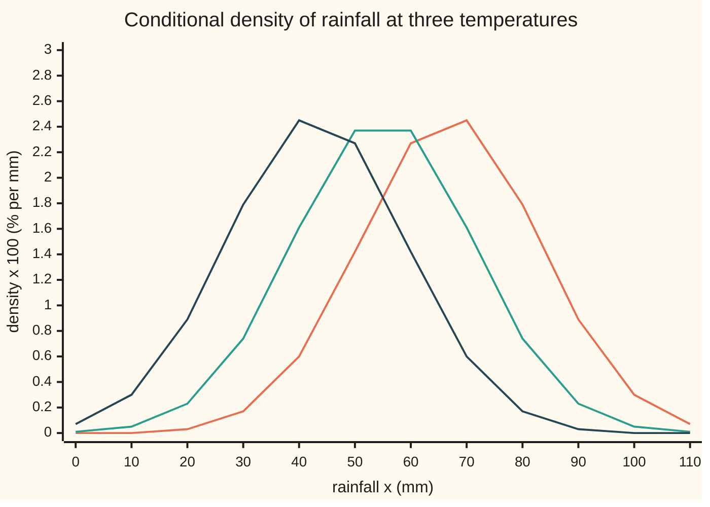
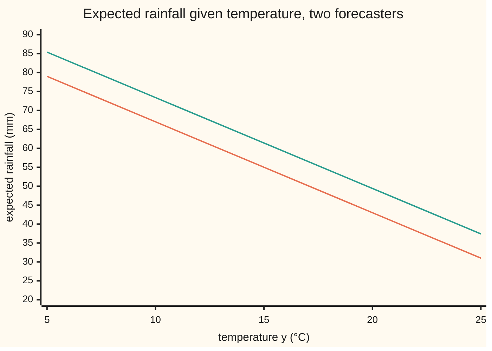

# Conditioning on a random variable: E[X | Y] is a function of Y, computed from a conditional density when there is one, and Bayes' formula in general form

[Syllabus](../../../SYLLABUS.md) → [Measure and integration](../README.md) → [Conditional Expectation](../README.md#s09) → Conditioning on a random variable

---

## General Overview

A weather station logs two numbers each month: rainfall and mean temperature. Rainfall averages 55 mm, with a typical stray of 20 mm either side. Temperature averages 15 °C, with a typical stray of 5 °C. Hot months tend to be dry: the correlation, the strength of the straight-line link on a scale from −1 to 1, is −0.6. Both are modelled as jointly normal: a two-variable bell curve.

A month comes in at exactly 20 °C. How much rain should be expected? The old rule for conditional probability divides by the chance of "20 °C", but a temperature of exactly 20.000… °C has probability zero, so the rule reads 0/0. Wing 09 answers anyway, with a recipe: divide the joint density by the temperature's own density and average ([Conditional densities](../../09-Probability%20and%20statistics/05-Transformations%20and%20Joint%20Laws/03-conditional-densities.md)). For this bell the answer is 43 mm ([Bivariate normal](../../09-Probability%20and%20statistics/05-Transformations%20and%20Joint%20Laws/05-bivariate-normal-and-conditioning.md)). Nothing there says why that answers a question about a probability-zero event.

This card says why. The conditional expectation given a sigma-algebra, a collection of events whose outcome is known, already exists ([Conditional expectation on a sigma-algebra](02-conditional-expectation-on-a-sigma-algebra.md)). Conditioning on the temperature means conditioning on every event the temperature settles. The result is a function of the temperature; the density recipe computes that function; and the recipe's 43 mm is its value at 20 °C.

A second forecaster runs a wet-year model that re-weights every month by a density, so wetter months count for more. Overall that raises average rainfall by 10 mm. Given 20 °C it raises it by only 6.4 mm, to 49.4 mm: the general form of Bayes' formula.

**Conditioning rainfall on temperature produces a function of temperature, pinned down by matching averages over every range of temperatures; with a joint density that function is the average under the density ratio f(x, y)/f(y), and under a re-weighted model it is a ratio of two re-weighted conditional averages.**

**What kind of fact this is:** three theorems, proved on this card in Why it works (the first by citing the Doob–Dynkin lemma); a Markov kernel and a regular conditional distribution are definitions, and the existence of the second for real-valued quantities is a theorem stated here and proved in the sources.

### The picture: rainfall once the temperature is known



Caption: orange is the rainfall density in 10 °C months, centred on 67 mm; green is 15 °C months, centred on 55 mm; dark blue is 20 °C months, centred on 43 mm. All three have the same width: a typical stray of 16 mm, narrower than the 20 mm of all months together.

---

## The formula

Notation, as a reminder. $(\Omega,\mathcal F,P)$ is a probability space: the possible months, their events, the probability. $\sigma(Y)$ is the sigma-algebra generated by Y: the events "Y lies in B", for each Borel set B, a set of numbers built from intervals ([Random variables as measurable maps](../03-Measurable%20Functions/04-random-variables-and-their-information.md)). The indicator $\mathbf 1_B$ is one on B, zero off it. For a sigma-algebra $\mathcal G$, $E[X\mid\mathcal G]$ is the $\mathcal G$-measurable, integrable random variable with the same average as X over every event G in $\mathcal G$, unique up to a set of probability zero. Conditioning on Y means conditioning on $\sigma(Y)$:

$$E[X\mid Y] := E[X\mid \sigma(Y)].$$

**It is a function of Y.** There is a Borel function g, from numbers to numbers with every preimage of a Borel set Borel, such that

$$E[X\mid Y] = g(Y)\ \text{almost surely},\qquad E[X\,\mathbf 1_{\{Y\in B\}}] = E[g(Y)\,\mathbf 1_{\{Y\in B\}}]\ \text{for every Borel } B.$$

**Read it aloud:** the best guess of rainfall from temperature is a rule g applied to the temperature, pinned down by matching rainfall's average over every range of temperatures.

The value g(y) is written $E[X\mid Y=y]$: a name for g at y, not an average over the event "Y = y".

**With a joint density.** If the pair (X, Y) has a joint density f, so that the probability of a region is the integral of f over it, then

$$f_Y(y)=\int f(x,y)\,dx,\qquad f(x\mid y)=\frac{f(x,y)}{f_Y(y)},\qquad g(y)=\int x\,f(x\mid y)\,dx\quad\text{where } f_Y(y)>0 .$$

**Read it aloud:** slice the joint density at temperature y, rescale the slice to total one, and average rainfall along it.

**Kernels.** A Markov kernel $\kappa$ from temperatures to rainfall assigns to each temperature y a probability law $\kappa(y,\cdot)$ on rainfall, such that $y\mapsto\kappa(y,A)$ is Borel for every Borel set A of rainfalls. It is a regular conditional distribution of X given Y when $\kappa(Y,A)=E[\mathbf 1_{\{X\in A\}}\mid Y]$ almost surely for every A. When Y has a density, the first formula holds; when (X, Y) has a joint density, the second gives such a kernel:

$$P(X\in A,\ Y\in B)=\int_B \kappa(y,A)\,f_Y(y)\,dy,\qquad \kappa(y,A)=\int_A f(x\mid y)\,dx .$$

**Read it aloud:** a joint chance is the chance for each temperature, averaged over temperatures.

**Abstract Bayes.** Let Q be a second probability with density Z against P ([The Radon-Nikodym derivative](../08-Densities%20and%20Changing%20Measure/04-radon-nikodym-derivative.md)): $Q(A)=E_P[Z\,\mathbf 1_A]$. Write $E_P$ and $E_Q$ for averages under each. For any sigma-algebra $\mathcal G$ and any X with finite $E_Q\lvert X\rvert$,

$$E_Q[X\mid\mathcal G]=\frac{E_P[ZX\mid\mathcal G]}{E_P[Z\mid\mathcal G]}\qquad Q\text{-almost surely}.$$

**Read it aloud:** the new model's conditional average is the old model's conditional average of weight times value, divided by the old model's conditional average of the weight.

| Symbol | Plain meaning | In our example | Push it up and the answer… |
| --- | --- | --- | --- |
| $X$, $Y$ | rainfall (mm) and mean temperature (°C) of a month | averages 55 and 15 | — |
| $\sigma_X$, $\sigma_Y$, $\rho$ | the two typical strays; the correlation | 20 mm, 5 °C, −0.6 | ρ further from 0: steeper line, narrower slices |
| $\Omega$, $\mathcal F$, $P$, $\lambda$ | the months, their events, the first forecaster's probability; Lebesgue measure (length) | — | — |
| $\mathcal B$, $B$, $A$, $\mathbf 1_B$ | the Borel sets; a set of temperatures; a set of rainfalls; one on B, zero off it | B = above 20 °C; A = above 70 mm | — |
| $\sigma(Y)$, $\mathcal G$, $G$ | the events Y settles; any sigma-algebra of known events; one event in it | {Y > 20} is in σ(Y) | a bigger sigma-algebra, a finer guess |
| $g$, $h$ | the rule giving E[X given Y = y] under P, under Q | g(20) = 43 mm; h(20) = 49.4 mm | — |
| $f$, $f_Y$, $N_0$, $N_1$ | joint density; temperature's own density; in the proof, where f_Y is zero and where the rainfall integral is infinite | f_Y(20) = 0.048394 per °C | — |
| $f(x\mid y)$ | conditional density of rainfall at temperature y | a bell, centre g(y), stray 16 mm | — |
| $\kappa$ | Markov kernel: a law of rainfall for each temperature | normal, centre g(y), stray 16 mm | — |
| $Q$, $Z$, $a$ | the wet-year forecaster's probability; its density against P; the tilt | Z = exp(aX)/E_P[exp(aX)], a = 0.025 per mm | a up: more weight on wet months |
| $E_P$, $E_Q$ | averages under P and under Q | E_Q[X] = 65 mm | — |
| $S$, $s$, $m$ | the season, in the four-season table; one season; its mean rainfall | 4 seasons, means m = 30, 60, 90, 40 mm | — |
| $H$, $N$, $\tilde g$, $x^\pm$ | in the density proof: the integral of $\lvert x\rvert f(x,y)$ over rainfall; $N_0\cup N_1$; a second version of g; the positive and negative parts of x | — | — |
| $T$, $W$, $U$, $V$, $G_n$ | in the Bayes proof: any quantity ≥ 0; $E_P[Z\mid\mathcal G]$; $E_P[ZX\mid\mathcal G]$; the ratio U/W; G cut to where W > 0 and $\lvert V\rvert\le n$ | W at 20 °C: 0.7082 | — |
| $D$ | in the event form of Bayes: the data, an event | — | — |

### When it holds

- **X integrable:** a finite average of its absolute value. Without it the averages to be matched can be infinite, and the definition does not apply.
- **A joint density, for the density formula.** If rainfall were fixed exactly by temperature, the pair would lie on a curve with no joint density; g still exists, but the recipe has nothing to divide.
- **Values at one point are a choice.** g can be changed on any set of temperatures of probability zero; the density formula picks one version, here the continuous one.
- **Q has a density against P, for Bayes.** Every event P calls impossible, Q must too, or Z does not exist. The formula holds Q-almost surely; where the denominator is zero, Q puts no weight.
- **Real values, for a regular conditional distribution.** For a real X one always exists; for X taking values in some very large spaces it can fail.

---

## Why it works

### Step 0: knowing Y is knowing the events it settles

A forecaster who sees only the temperature knows, for each set of temperatures B, whether "Y lies in B" happened. That family is $\sigma(Y)$. So the best guess from temperature is the conditional expectation given $\sigma(Y)$, which exists and is unique by the sibling card. Three things follow. It must be a function of Y, since Y is all that is seen. That function is fixed by matching averages over events "Y in B", and Fubini turns those averages into integrals over temperature, where the density ratio appears. And under a re-weighted model, averages are old averages with a weight inside, so the weight must be averaged too and divided out.

### Step 1: the guess is a function of the temperature

The Doob–Dynkin lemma ([Random variables as measurable maps](../03-Measurable%20Functions/04-random-variables-and-their-information.md)) says: a real random variable that is $\sigma(Y)$-measurable, meaning every question about its value is settled by Y, equals g(Y) for some Borel function g. $E[X\mid Y]$ is $\sigma(Y)$-measurable by definition. So $E[X\mid Y]=g(Y)$.

Every event in $\sigma(Y)$ has the form "Y in B". The defining property of the conditional expectation, matching averages over every event in the sigma-algebra, becomes the matching over every Borel B in the formula.

g is unique only up to temperatures Y almost never takes. If $g(Y)=\tilde g(Y)$ almost surely, the set where g and $\tilde g$ differ has probability zero under the law of Y. For a continuous Y, a single temperature is such a set.

A small example, exact. Take four equally likely seasons, and in each two equally likely kinds of month, 10 mm under and 10 mm over the season's mean: 20 and 40 mm; 50 and 70; 80 and 100; 30 and 50. Each of the 8 months has probability 0.125. The season S settles four events, and $E[X\mid S]=g(S)$ with g the lookup table 30, 60, 90, 40. That is Doob–Dynkin on a finite space: g is a list. Rainfall itself is not a function of S: the first season holds months of 20 and 40 mm, so knowing S does not settle whether X is 20.

### Step 2: the density formula meets the definition

Take a Borel set of temperatures B. The average of rainfall over "Y in B" is an integral over the plane. Fubini splits it: rainfall first, then temperature. The inner integral is $\int x f(x,y)\,dx$, which is $g(y)\,f_Y(y)$ by the definition of g. What is left is the integral of $g(y)f_Y(y)$ over B, which is the average of g(Y) over "Y in B". The two averages match for every B, and g(Y) is a function of Y. By uniqueness, $g(Y)=E[X\mid Y]$.

On the station: for the bivariate normal the recipe gives the straight line $g(y)=55-2.4\,(y-15)$, slope $\rho\,\sigma_X/\sigma_Y=-0.6\times20/5$, and slices of stray $16=20\sqrt{1-0.36}$ mm, derived in wing 09. The code recomputes g by integrating the density ratio numerically: 79, 67, 55, 43, 31 mm at 5, 10, 15, 20, 25 °C, matching the line to four decimals. It checks the matching on B = "above 20 °C": the average of $X\,\mathbf 1_{\{Y>20\}}$ from the joint density is 5.8224, the average of $g(Y)\,\mathbf 1_{\{Y>20\}}$ from temperature's density alone is 5.8224, and a closed form gives 5.8224.

The 0/0 can also be made honest by thickening the event. Among 200,000 simulated months, 4839 have temperatures within 0.25 °C of 20. Their average rainfall is 42.79 mm, standard error 0.23: a slab average close to g(20) = 43. The theorem does not need slabs, and slabs of other shapes can mislead (The usual mistake).

<details>
<summary>Detailed proof: the conditional density gives E[X | Y]</summary>

**Setting.** (X, Y) has a joint density f ≥ 0 against $\lambda\otimes\lambda$ on the plane, and $E\lvert X\rvert<\infty$.

**1. The marginal.** By Tonelli ([Tonelli and Fubini](../06-Product%20Measures%20and%20Fubini/03-tonelli-and-fubini.md)), $f_Y(y)=\int f(x,y)\,dx$ is Borel in y, and for Borel B, $P(Y\in B)=\iint \mathbf 1_B(y)f(x,y)\,dx\,dy=\int_B f_Y\,dy$. So $f_Y$ is a density of Y.

**2. Two null sets.** Let $N_0=\{f_Y=0\}$; then $P(Y\in N_0)=\int_{N_0}f_Y\,dy=0$. Let $H(y)=\int\lvert x\rvert f(x,y)\,dx$, Borel by Tonelli, with $\int H\,dy=E\lvert X\rvert<\infty$. So $N_1=\{H=\infty\}$ has length zero (a non-negative function with finite integral is finite almost everywhere), and $P(Y\in N_1)=\int_{N_1}f_Y\,dy=0$ because the integral over a set of length zero is zero.

**3. The rule g.** Off $N=N_0\cup N_1$ put $g(y)=\big(\int x^+f(x,y)\,dx-\int x^-f(x,y)\,dx\big)/f_Y(y)$, with $x^\pm$ the positive and negative parts; on N put g = 0. Each integral is Borel in y by Tonelli and finite off $N_1$, so g is Borel. Then g(Y) is $\sigma(Y)$-measurable, and $E\lvert g(Y)\rvert=\int_{N^c}\lvert g\rvert f_Y\,dy\le\int H\,dy<\infty$.

**4. Matching.** For Borel B, the law of (X, Y) has density f, so $E[X\mathbf 1_{\{Y\in B\}}]=\iint x\,\mathbf 1_B(y)f(x,y)\,dx\,dy$ ([The law of a random variable](../03-Measurable%20Functions/05-pushforward-and-the-law.md)). The integrand's absolute value has integral $E\lvert X\rvert<\infty$, so Fubini allows rainfall first: $=\int_B\big(\int x f(x,y)\,dx\big)dy$. Off N the inner integral is $g(y)f_Y(y)$. On $N_0$ it is zero, since $\int f(x,y)\,dx=0$ forces $f(x,y)=0$ for almost every x. $N_1$ has length zero and changes no integral. So the whole is $\int_B g\,f_Y\,dy=E[g(Y)\mathbf 1_{\{Y\in B\}}]$.

**5. Conclusion.** g(Y) is $\sigma(Y)$-measurable, integrable, and matches X over every event of $\sigma(Y)$. By the uniqueness of conditional expectation, $g(Y)=E[X\mid Y]$ almost surely. ∎

</details>

### Step 3: one law for each temperature

Conditional expectations of indicators give conditional chances: $E[\mathbf 1_{\{X\in A\}}\mid Y]$ is the chance of A given Y. Each is fixed only up to a null set, and there are uncountably many sets A. Chosen one at a time, the answers need not fit together into a probability law for each temperature. A regular conditional distribution is a choice that does fit: a Markov kernel.

With a joint density the kernel is written down: $\kappa(y,A)=\int_A f(x\mid y)\,dx$, the conditional density's chance of A. Step 2 applied to $\mathbf 1_{\{X\in A\}}$ shows $\kappa(Y,A)$ is the conditional chance. At the station, $\kappa(y,\cdot)$ is the normal law with centre g(y) and stray 16 mm, the curves in the picture. The code finds P(rain above 70 mm and temperature above 20 °C) two ways: integrating the kernel's chance over temperatures, 0.00367, and integrating the joint density over the corner, 0.00367. Simulation gives 0.00325, standard error 0.00014: 3.1 standard errors away, inside the 4 the check allows.

In the four-season table the kernel is a list of four laws: season s gives probability 0.5 to its mean minus 10 mm and 0.5 to its mean plus 10 mm.

Without a density, existence is a theorem: for any real X and any Y, a regular conditional distribution of X given Y exists. The proof takes conditional chances of "X at most r" for the countably many rational r, discards the countably many null sets where they fail to rise with r, and fills in each y's distribution function by right-continuity. Billingsley and Durrett (Sources) give it in full. Kernels also build two-stage models: first the temperature, then the rainfall from the kernel.

### Step 4: re-weighting a conditional forecast

Under Q, the average of anything is its P-average with the weight Z inside: $E_Q[T]=E_P[ZT]$. Condition on $\mathcal G$ and the same holds inside each event of $\mathcal G$, but the weight Z varies within the event. The known part of the weight is $E_P[Z\mid\mathcal G]$, and it must be divided out, or the answer is off by exactly that factor. The proof checks the matching property under Q for the ratio, using "take out what is known" from the rules card.

<details>
<summary>Detailed proof: the abstract Bayes formula</summary>

**Setting.** P and Q are probabilities on $(\Omega,\mathcal F)$ with $Q(A)=E_P[Z\mathbf 1_A]$ for a density $Z\ge0$. $\mathcal G\subseteq\mathcal F$ is a sigma-algebra. $E_Q\lvert X\rvert<\infty$; since $E_Q[T]=E_P[ZT]$ for every $T\ge0$ (simple functions, then monotone convergence), this is $E_P[Z\lvert X\rvert]<\infty$, so ZX is P-integrable.

**1. The pieces.** Let $W=E_P[Z\mid\mathcal G]$, chosen $\ge0$, and $U=E_P[ZX\mid\mathcal G]$. Put $V=U/W$ on $\{W>0\}$ and $V=0$ on $\{W=0\}$. V is $\mathcal G$-measurable.

**2. Q ignores the zero set.** $\{W=0\}$ is in $\mathcal G$, so by the defining property of W, $Q(W=0)=E_P[Z\mathbf 1_{\{W=0\}}]=E_P[W\mathbf 1_{\{W=0\}}]=0$.

**3. Matching on bounded pieces.** For G in $\mathcal G$ and n = 1, 2, …, let $G_n=G\cap\{W>0\}\cap\{\lvert V\rvert\le n\}$, in $\mathcal G$. Then $V\mathbf 1_{G_n}$ is bounded and $\mathcal G$-measurable, and "take out what is known" ([The rules of conditional expectation](04-rules-of-conditional-expectation.md)) gives
$E_Q[V\mathbf 1_{G_n}]=E_P[ZV\mathbf 1_{G_n}]=E_P[WV\mathbf 1_{G_n}]=E_P[U\mathbf 1_{G_n}]=E_P[ZX\mathbf 1_{G_n}]=E_Q[X\mathbf 1_{G_n}]$.
The third equality is $WV=U$ on $\{W>0\}$; the fourth is the defining property of U.

**4. V is Q-integrable.** Apply step 3 to $G\cap\{V\ge0\}$ and to $G\cap\{V<0\}$ with $G=\Omega$ and subtract: $E_Q[\lvert V\rvert\mathbf 1_{\{W>0,\,\lvert V\rvert\le n\}}]=E_Q[X(\mathbf 1_{\{V\ge0\}}-\mathbf 1_{\{V<0\}})\mathbf 1_{\{W>0,\,\lvert V\rvert\le n\}}]\le E_Q\lvert X\rvert$. Monotone convergence in n, with $Q(W=0)=0$, gives $E_Q\lvert V\rvert\le E_Q\lvert X\rvert<\infty$.

**5. Remove the truncation.** As n grows, $\mathbf 1_{G_n}$ rises to $\mathbf 1_{G\cap\{W>0\}}$. Both $\lvert V\rvert$ and $\lvert X\rvert$ are Q-integrable, so dominated convergence carries step 3 to the limit: $E_Q[V\mathbf 1_{G\cap\{W>0\}}]=E_Q[X\mathbf 1_{G\cap\{W>0\}}]$. By step 2 the set $\{W=0\}$ has Q-probability zero, so $E_Q[V\mathbf 1_G]=E_Q[X\mathbf 1_G]$.

**6. Conclusion.** V is $\mathcal G$-measurable, Q-integrable and matches X under Q over every G in $\mathcal G$. By uniqueness under Q, $V=E_Q[X\mid\mathcal G]$ Q-almost surely. ∎

</details>

<details>
<summary>Why the general formula is called Bayes</summary>

Take a hypothesis A and data D, events with Q-chances strictly between 0 and 1. Let the reference probability P give A and D their Q-chances but make them independent. On each of the four cells (A or not, D or not), Z is the cell's Q-chance over its P-chance; on $A\cap D$ that is the likelihood ratio $Q(D\mid A)/Q(D)$. Put $X=\mathbf 1_A$ and $\mathcal G=\sigma(D)$. On D the denominator $E_P[Z\mid\mathcal G]$ is $Q(D)/P(D)=1$, and the numerator is $P(A\mid D)=Q(A)$, by independence under P, times the likelihood ratio. So $Q(A\mid D)=Q(D\mid A)\,Q(A)/Q(D)$: Bayes for events.

</details>

**On the station.** The wet-year forecaster uses $Z=\exp(aX)/E_P[\exp(aX)]$ with a = 0.025 per mm. With $\mathcal G=\sigma(Y)$ and a joint density, Step 2 applied to ZX and to Z turns the formula into a ratio of two integrals along the slice at y. On a normal slice, multiplying by $\exp(ax)$ and completing the square shifts the centre by a times the slice's variance: $0.025\times16^2=6.4$ mm. So $h(20)=43+6.4=49.4$ mm.

A second road, without the Bayes formula: tilting a joint normal law by $\exp(aX)$ gives a joint normal law again, same spreads and correlation, centres moved by a times each variable's covariance with X. Rainfall's centre moves $0.025\times400=10$ mm to 65; temperature's moves $0.025\times(-60)=-1.5$ °C to 13.5. The Q-line is $h(y)=65-2.4\,(y-13.5)$, again 49.4 at 20 °C.



Caption: orange is g, the first forecaster's expected rainfall given temperature; green is h, the wet-year forecaster's. The gap is 6.4 mm at every temperature, not the 10 mm by which the two forecasters' overall averages differ.

A weight built from temperature alone cancels: with $Z$ proportional to $\exp(0.1\,Y)$ it comes out of both conditional averages, so $E_Q[X\mid Y]=E_P[X\mid Y]$. By the second road, the tilted centres are 49 mm and 17.5 °C and the Q-line at 20 °C still gives 43 mm.

**On the four seasons, exact.** Let Q weight each month by $Z=X/55$, rainier months more. Bayes gives $E_Q[X\mid S=s]=E_P[X^2\mid S=s]/E_P[X\mid S=s]$. For a season with mean m the two months give $(m^2+100)/m$: 100/3, 185/3, 820/9 and 85/2 mm, each just above the P-mean. Q puts probability m/220 on a season, 3/22, 3/11, 9/22 and 2/11, and averaging the four answers with those weights returns $E_Q[X]=730/11$ mm, the value $E_P[ZX]$ gives month by month: the tower property under Q.

Another route to g: it is the function of Y closest to X in mean square ([Conditional expectation as a projection](03-conditional-expectation-as-projection.md)). In simulation its mean square error is 257.40, near the slice variance 256, against 400.73 for the constant 55.

---

## Worked numbers, by hand

| Step | Arithmetic | Value |
| --- | --- | --- |
| slope of g | −0.6 × 20 / 5 | −2.4 mm per °C |
| expected rain at 20 °C | 55 − 2.4 × (20 − 15) | 43 mm |
| stray within a slice | 20 × √(1 − 0.36) = 20 × 0.8 | 16 mm |
| tilt of the slice centre | 0.025 × 16 × 16 | 6.4 mm |
| wet-year expected rain at 20 °C, by Bayes | 43 + 6.4 | **49.4 mm** |
| Q-centres, second road | 55 + 0.025 × 400; 15 + 0.025 × (−60) | 65 mm; 13.5 °C |
| wet-year expected rain at 20 °C, by the Q-line | 65 − 2.4 × (20 − 13.5) = 65 − 15.6 | **49.4 mm** |

A 20 °C month is expected to bring 43 mm under the first forecaster and 49.4 mm under the wet-year one: the wet-year view adds 6.4 mm, not 10, because temperature has already explained part of rainfall's spread.

### What breaks if you drop a piece

| Mistake | Comes out at | What went wrong |
| --- | --- | --- |
| Shift the conditional forecast by the unconditional change | 43 + 10 = 53 mm | the tilt acts on the 16 mm left open by temperature, not the full 20 mm |
| Forget the denominator in Bayes | $E_P[ZX\mid Y=20]$ = 34.99 mm | $E_P[Z\mid Y=20]$ = 0.7082, not 1: hot months carry little wet-year weight |
| Invert the other regression line, E[Y given X] | 21.67 mm at 20 °C | the line for temperature from rainfall is a different function |
| Ignore temperature | 55 mm; mean square error 400.73 against 257.40 | the constant is the conditional expectation given nothing |

---

## Code, from first principles, and it actually runs

The code reaches E[X given Y] three ways: the regression line; the density ratio, integrated by Simpson's rule (a weighted sum of values on an even grid); and 200,000 simulated months from a SplitMix64 generator, seed 2026, made normal by the Box–Muller method (two uniform numbers in, two independent normal ones out), both written out. It checks the defining property on "above 20 °C" by the joint density, by the marginal alone and by a closed form; the kernel's chance by the kernel, a double integral and simulation; Bayes against the tilted Q-line and by simulated averages under Q; and the four-season table in exact fractions.

The code checks one normal pair and one finite table. That the formulas hold for every integrable X, every Y and every density Z is what only the Detailed proofs show.

### Python

```python
# Conditioning on a random variable -- the check behind the card.  Standard
# library only.  Monthly rainfall X (mm) and temperature Y (deg C) at one
# station are jointly normal: means 55 and 15, spreads 20 and 5, correlation
# -0.6.  E[X | Y] = g(Y) is found from the line, from the density ratio
# f(x, y)/f_Y(y) integrated numerically, and from simulated months; the
# defining property is checked on the event {Y > 20}; the kernel gives a joint
# chance; the abstract Bayes formula re-weights by Z = exp(a X)/E[exp(a X)].
# A four-season table in exact fractions runs Bayes with Z = X/55.
import math
from fractions import Fraction as F

MX, SX, MY, SY, RHO, A = 55.0, 20.0, 15.0, 5.0, -0.6, 0.025
SC = SX * math.sqrt(1 - RHO * RHO)                 # spread left once Y is known

def simpson(f, a, b, n):                          # n even
    h = (b - a) / n
    s = f(a) + f(b) + sum((4 if i % 2 else 2) * f(a + i * h) for i in range(1, n))
    return s * h / 3

def phi(z):                                       # standard normal density
    return math.exp(-z * z / 2) / math.sqrt(2 * math.pi)

def cdf(z):                                       # standard normal CDF, by Simpson
    return 0.5 + math.copysign(simpson(phi, 0.0, abs(z), 400), z)

def joint(x, y):                                  # the bivariate normal density
    u, v = (x - MX) / SX, (y - MY) / SY
    q = (u * u - 2 * RHO * u * v + v * v) / (1 - RHO * RHO)
    return math.exp(-q / 2) / (2 * math.pi * SX * SY * math.sqrt(1 - RHO * RHO))

def line(y):                                      # road 1: the regression line
    return MX + RHO * SX / SY * (y - MY)

def xint(f, y):                                   # integral over x of f(x) joint(x, y)
    return simpson(lambda x: f(x) * joint(x, y), MX - 10 * SX, MX + 10 * SX, 2000)

def ratio(y, w=lambda x: 1.0):                    # road 2: int w x f(x,y) dx / int w f(x,y) dx
    return xint(lambda x: w(x) * x, y) / xint(w, y)

M64 = (1 << 64) - 1
def splitmix(s):                                  # SplitMix64: (new state, 64 random bits)
    s = (s + 0x9E3779B97F4A7C15) & M64
    z = ((s ^ (s >> 30)) * 0xBF58476D1CE4E5B9) & M64
    z = ((z ^ (z >> 27)) * 0x94D049BB133111EB) & M64
    return s, z ^ (z >> 31)

def row(v, k=2):
    return ", ".join(f"{t:.{k}f}" for t in v)

r9 = -0.9                                         # the first "try changing" row, by formula
s9 = SX * math.sqrt(1 - r9 * r9)
# 1. E[X | Y = y] by the line and by the density ratio
ys = [5.0, 10.0, 15.0, 20.0, 25.0]
print(f"means {MX:.0f} mm and {MY:.0f} C, spreads {SX:.0f} mm and {SY:.0f} C, correlation {RHO:.2f}; tilt a = {A}")
print(f"slope rho*sx/sy = {RHO * SX / SY:.4f}; spread given Y = {SC:.4f} mm, variance {SC * SC:.2f}")
print("chart, E[X|Y=y] by the line, y = 5..25:", row([line(y) for y in ys]))
dens = [ratio(y) for y in ys]
print("E[X|Y=y] by f(x,y)/f_Y(y), y = 5..25:", row(dens, 4))
fy20 = xint(lambda x: 1.0, 20.0)
print(f"f_Y(20) by integrating out x = {fy20:.6f}; by the normal formula = {phi(1.0) / SY:.6f}")
for yc in (10.0, 15.0, 20.0):                     # conditional densities, % per mm
    fy = xint(lambda x: 1.0, yc)
    print(f"chart, f(x|y={yc:.0f}) x 100, x = 0..110:", row([100 * joint(x, yc) / fy for x in range(0, 111, 10)]))

# 2. the defining property on B = {Y > 20}, and the kernel
top = MY + 10 * SY
lhs = simpson(lambda y: xint(lambda x: x, y), 20.0, top, 600)            # E[X 1_B], joint
rhs = simpson(lambda y: line(y) * phi((y - MY) / SY) / SY, 20.0, top, 600)  # E[g(Y) 1_B]
closed = MX * (1 - cdf(1.0)) + RHO * SX * phi(1.0)
print(f"E[X 1(Y>20)]: joint density {lhs:.4f}; E[g(Y) 1(Y>20)] {rhs:.4f}; closed form {closed:.4f}")
kern = simpson(lambda y: (1 - cdf((70 - line(y)) / SC)) * phi((y - MY) / SY) / SY, 20.0, top, 600)
dbl = simpson(lambda y: simpson(lambda x: joint(x, y), 70.0, MX + 10 * SX, 400), 20.0, top, 400)
print(f"P(X>70, Y>20): kernel {kern:.5f}; double integral {dbl:.5f}")

# 3. abstract Bayes: Q has density Z = exp(a X)/E[exp(a X)] against P
qx, qy = MX + A * SX * SX, MY + A * RHO * SX * SY  # the Q-means: X up 10, Y down 1.5
def h_line(y):                                    # road 1 under Q: Q is normal again
    return qx + RHO * SX / SY * (y - qy)
bayes = [ratio(y, lambda x: math.exp(A * (x - MX))) for y in ys]
print(f"Var X {SX * SX:.2f}, Cov(X,Y) {RHO * SX * SY:.2f}; Q-means: X {qx:.2f} mm, Y {qy:.2f} C")
print(f"conditional shift a*sc^2 = {A * SC * SC:.2f} mm")
print("chart, E_Q[X|Y=y] by the Q-line, y = 5..25:", row([h_line(y) for y in ys]))
print("E_Q[X|Y=y] by E_P[ZX|Y]/E_P[Z|Y], y = 5..25:", row(bayes, 4))
ez20 = xint(lambda x: math.exp(A * (x - MX) - A * A * SX * SX / 2), 20.0) / fy20
print(f"E_P[Z|Y=20] = {ez20:.4f}; forgetting to divide: E_P[ZX|Y=20] = {bayes[3] * ez20:.2f}")
print(f"try rho -0.9: spread {s9:.4f}, shift {A * s9 * s9:.2f}, h(20) {qx + r9 * SX / SY * (20 - MY - A * r9 * SX * SY):.2f}")
bx, by = MX + 0.1 * RHO * SX * SY, MY + 0.1 * SY * SY  # Z = exp(0.1 Y)/E[exp(0.1 Y)] instead
print(f"Z from Y alone, exp(0.1 Y): Q-means {bx:.2f}, {by:.2f}; E_Q[X|Y=20] = {bx + RHO * SX / SY * (20 - by):.4f}")
print(f"mistake: unconditional shift 43 + 10 = {line(20) + A * SX * SX:.2f}; "
      f"E[Y|X] line inverted at y = 20: {MX + (20 - MY) / (RHO * SY / SX):.2f}")

# 4. simulated months, SplitMix64 seed 2026, Box-Muller normals
st, N, S = 2026, 200000, [0.0] * 11
for _ in range(N):
    st, u = splitmix(st)
    st, v = splitmix(st)
    r = math.sqrt(-2 * math.log(((u >> 11) + 0.5) / 2 ** 53))
    z1, z2 = r * math.cos(2 * math.pi * (v >> 11) / 2 ** 53), r * math.sin(2 * math.pi * (v >> 11) / 2 ** 53)
    y = MY + SY * z1
    x = MX + SX * (RHO * z1 + math.sqrt(1 - RHO * RHO) * z2)
    b, z = (1.0 if y > 20 else 0.0), math.exp(A * (x - MX) - A * A * SX * SX / 2)
    near = 1.0 if abs(y - 20) < 0.25 else 0.0
    d1, d2 = (x - line(y)) * b, z * (x - h_line(y)) * b      # the two gaps, for standard errors
    for i, t in enumerate((x * b, line(y) * b, (x - line(y)) * (x - line(y)), (x - MX) * (x - MX),
                           b * (x > 70), near, near * x, z * x * b, z * h_line(y) * b, d1 * d1, d2 * d2)):
        S[i] += t
m = [s / N for s in S]
print(f"sim, seed 2026, {N} months")
print(f"sim E[X 1(Y>20)] {m[0]:.4f}; sim E[g(Y) 1(Y>20)] {m[1]:.4f}; gap's standard error {math.sqrt(m[9] / N):.4f}")
se = math.sqrt(kern * (1 - kern) / N)
print(f"sim P(X>70, Y>20) {m[4]:.5f}, standard error {se:.5f}, off by {abs(m[4] - kern) / se:.1f} standard errors")
print(f"sim mean square error: of g(Y) {m[2]:.2f}; of the constant 55 {m[3]:.2f}")
print(f"sim months with Y within 0.25 of 20: {S[5]:.0f}, average rainfall {S[6] / S[5]:.4f}, standard error {SC / math.sqrt(S[5]):.2f}")
qclosed = qx * (1 - cdf(1.3)) + RHO * SX * phi(1.3)
print(f"sim E_Q[X 1(Y>20)] = E_P[Z X 1_B] {m[7]:.4f}; E_Q[h(Y) 1_B] {m[8]:.4f}; closed form {qclosed:.4f}")
print(f"sim gap E_Q[X 1_B] - E_Q[h(Y) 1_B]: standard error {math.sqrt(m[10] / N):.4f}")

# 5. four seasons, two kinds of month each, all 8 months equally likely; Z = X/55
seasons = [30, 60, 90, 40]
omega = [(s, mu + d) for s, mu in enumerate(seasons) for d in (-10, 10)]
P, Z = F(1, 8), {x: F(x, 55) for _, x in omega}
g = [sum(P * x for t, x in omega if t == s) / F(1, 4) for s in range(4)]
bay = [sum(P * Z[x] * x for t, x in omega if t == s) / sum(P * Z[x] for t, x in omega if t == s) for s in range(4)]
naive = [sum(P * Z[x] * x for t, x in omega if t == s) / F(1, 4) for s in range(4)]
qs = [sum(P * Z[x] for t, x in omega if t == s) for s in range(4)]   # Q(S = s)
eqx = sum(P * Z[x] * x for _, x in omega)                              # E_Q[X] = E_P[Z X], month by month
tower = sum(F(1, 4) * g[s] / 55 * bay[s] for s in range(4))           # Q(S=s) = P(S=s) E_P[X|S=s]/55
print(f"table months, each 0.125, each kind 0.5 within its season, rainfall by season: {'; '.join(', '.join(str(x) for t, x in omega if t == s) for s in range(4))}")
print(f"table g(s) = E_P[X|S=s]: {', '.join(str(t) for t in g)}")
print(f"table E_Q[X|S=s] by Bayes: {', '.join(str(t) for t in bay)}; without dividing: {', '.join(str(t) for t in naive)}")
print(f"table Q(S=s): {', '.join(str(q) for q in qs)}; E_Q[X] = {eqx} directly, {tower} by the tower")

assert max(abs(d - line(y)) for d, y in zip(dens, ys)) < 1e-6            # density ratio = line
assert abs(lhs - closed) < 1e-6 and abs(rhs - closed) < 1e-6              # defining property
assert abs(kern - dbl) < 1e-6 and abs(m[4] - kern) < 4 * math.sqrt(kern / N)  # kernel, 3 roads
assert max(abs(b - h_line(y)) for b, y in zip(bayes, ys)) < 1e-6          # Bayes = Q-line
assert abs(m[0] - m[1]) < 4 * math.sqrt(m[9] / N) and abs(m[7] - m[8]) < 4 * math.sqrt(m[10] / N)
assert [F(s * s + 100, s) for s in seasons] == bay and tower == eqx       # exact table; tower under Q
print("ALL CHECKS PASS")
```

**Ran 2026-10-06 on macOS, Python 3.14.6, standard library only. All checks passed. Output, pasted from the run:**

```
means 55 mm and 15 C, spreads 20 mm and 5 C, correlation -0.60; tilt a = 0.025
slope rho*sx/sy = -2.4000; spread given Y = 16.0000 mm, variance 256.00
chart, E[X|Y=y] by the line, y = 5..25: 79.00, 67.00, 55.00, 43.00, 31.00
E[X|Y=y] by f(x,y)/f_Y(y), y = 5..25: 79.0000, 67.0000, 55.0000, 43.0000, 31.0000
f_Y(20) by integrating out x = 0.048394; by the normal formula = 0.048394
chart, f(x|y=10) x 100, x = 0..110: 0.00, 0.00, 0.03, 0.17, 0.60, 1.42, 2.27, 2.45, 1.79, 0.89, 0.30, 0.07
chart, f(x|y=15) x 100, x = 0..110: 0.01, 0.05, 0.23, 0.74, 1.61, 2.37, 2.37, 1.61, 0.74, 0.23, 0.05, 0.01
chart, f(x|y=20) x 100, x = 0..110: 0.07, 0.30, 0.89, 1.79, 2.45, 2.27, 1.42, 0.60, 0.17, 0.03, 0.00, 0.00
E[X 1(Y>20)]: joint density 5.8224; E[g(Y) 1(Y>20)] 5.8224; closed form 5.8224
P(X>70, Y>20): kernel 0.00367; double integral 0.00367
Var X 400.00, Cov(X,Y) -60.00; Q-means: X 65.00 mm, Y 13.50 C
conditional shift a*sc^2 = 6.40 mm
chart, E_Q[X|Y=y] by the Q-line, y = 5..25: 85.40, 73.40, 61.40, 49.40, 37.40
E_Q[X|Y=y] by E_P[ZX|Y]/E_P[Z|Y], y = 5..25: 85.4000, 73.4000, 61.4000, 49.4000, 37.4000
E_P[Z|Y=20] = 0.7082; forgetting to divide: E_P[ZX|Y=20] = 34.99
try rho -0.9: spread 8.7178, shift 1.90, h(20) 38.90
Z from Y alone, exp(0.1 Y): Q-means 49.00, 17.50; E_Q[X|Y=20] = 43.0000
mistake: unconditional shift 43 + 10 = 53.00; E[Y|X] line inverted at y = 20: 21.67
sim, seed 2026, 200000 months
sim E[X 1(Y>20)] 5.8082; sim E[g(Y) 1(Y>20)] 5.8088; gap's standard error 0.0142
sim P(X>70, Y>20) 0.00325, standard error 0.00014, off by 3.1 standard errors
sim mean square error: of g(Y) 257.40; of the constant 55 400.73
sim months with Y within 0.25 of 20: 4839, average rainfall 42.7899, standard error 0.23
sim E_Q[X 1(Y>20)] = E_P[Z X 1_B] 4.2127; E_Q[h(Y) 1_B] 4.2206; closed form 4.2356
sim gap E_Q[X 1_B] - E_Q[h(Y) 1_B]: standard error 0.0100
table months, each 0.125, each kind 0.5 within its season, rainfall by season: 20, 40; 50, 70; 80, 100; 30, 50
table g(s) = E_P[X|S=s]: 30, 60, 90, 40
table E_Q[X|S=s] by Bayes: 100/3, 185/3, 820/9, 85/2; without dividing: 200/11, 740/11, 1640/11, 340/11
table Q(S=s): 3/22, 3/11, 9/22, 2/11; E_Q[X] = 730/11 directly, 730/11 by the tower
ALL CHECKS PASS
```

### Rust

Same numbers, same labels, built with `rustc --edition 2021 -O`. The fractions are a small hand-written type.

```rust
// Conditioning on a random variable -- the same check as the Python, in Rust.
// No crates.  Monthly rainfall X (mm) and temperature Y (deg C) at one
// station are jointly normal: means 55 and 15, spreads 20 and 5, correlation
// -0.6.  E[X | Y] = g(Y) is found from the line, from the density ratio
// f(x, y)/f_Y(y) integrated numerically, and from simulated months; the
// defining property is checked on the event {Y > 20}; the kernel gives a joint
// chance; the abstract Bayes formula re-weights by Z = exp(a X)/E[exp(a X)].
// A four-season table in exact fractions, written by hand, runs Bayes with Z = X/55.
use std::f64::consts::PI;

const MX: f64 = 55.0;
const SX: f64 = 20.0;
const MY: f64 = 15.0;
const SY: f64 = 5.0;
const RHO: f64 = -0.6;
const A: f64 = 0.025;
const TWO53: f64 = 9007199254740992.0;

fn simpson(f: &dyn Fn(f64) -> f64, a: f64, b: f64, n: usize) -> f64 { // n even
    let h = (b - a) / n as f64;
    let mut acc = 0.0;
    for i in 1..n { acc += (if i % 2 == 1 { 4.0 } else { 2.0 }) * f(a + i as f64 * h) }
    (f(a) + f(b) + acc) * h / 3.0
}

fn phi(z: f64) -> f64 { (-z * z / 2.0).exp() / (2.0 * PI).sqrt() }   // standard normal density

fn cdf(z: f64) -> f64 { 0.5 + simpson(&phi, 0.0, z.abs(), 400).copysign(z) }  // by Simpson

fn joint(x: f64, y: f64) -> f64 {                                      // the bivariate normal density
    let (u, v) = ((x - MX) / SX, (y - MY) / SY);
    let q = (u * u - 2.0 * RHO * u * v + v * v) / (1.0 - RHO * RHO);
    (-q / 2.0).exp() / (2.0 * PI * SX * SY * (1.0 - RHO * RHO).sqrt())
}

fn line(y: f64) -> f64 { MX + RHO * SX / SY * (y - MY) }               // road 1: the regression line

fn xint(f: &dyn Fn(f64) -> f64, y: f64) -> f64 {                      // integral over x of f(x) joint(x, y)
    simpson(&|x| f(x) * joint(x, y), MX - 10.0 * SX, MX + 10.0 * SX, 2000)
}

fn ratio(y: f64, w: &dyn Fn(f64) -> f64) -> f64 { xint(&|x| w(x) * x, y) / xint(w, y) }  // road 2

fn splitmix(s: u64) -> (u64, u64) {                                    // SplitMix64
    let s = s.wrapping_add(0x9E3779B97F4A7C15);
    let z = (s ^ (s >> 30)).wrapping_mul(0xBF58476D1CE4E5B9);
    let z = (z ^ (z >> 27)).wrapping_mul(0x94D049BB133111EB);
    (s, z ^ (z >> 31))
}

fn row(v: &[f64], k: usize) -> String { v.iter().map(|t| format!("{:.*}", k, t)).collect::<Vec<_>>().join(", ") }

#[derive(Clone, Copy, PartialEq, Debug)]
struct Q(i64, i64);                                                    // an exact fraction n/d
fn gcd(a: i64, b: i64) -> i64 { if b == 0 { a.abs() } else { gcd(b, a % b) } }
fn q(n: i64, d: i64) -> Q { let g = gcd(n, d) * d.signum(); Q(n / g, d / g) }
fn add(a: Q, b: Q) -> Q { q(a.0 * b.1 + b.0 * a.1, a.1 * b.1) }
fn mul(a: Q, b: Q) -> Q { q(a.0 * b.0, a.1 * b.1) }
fn div(a: Q, b: Q) -> Q { q(a.0 * b.1, a.1 * b.0) }
fn show(v: &[Q]) -> String {
    v.iter().map(|a| if a.1 == 1 { format!("{}", a.0) } else { format!("{}/{}", a.0, a.1) }).collect::<Vec<_>>().join(", ")
}

fn main() {
    let sc = SX * (1.0 - RHO * RHO).sqrt();                            // spread left once Y is known
    let one = |_x: f64| 1.0;
    // 1. E[X | Y = y] by the line and by the density ratio
    let ys = [5.0, 10.0, 15.0, 20.0, 25.0];
    println!("means {:.0} mm and {:.0} C, spreads {:.0} mm and {:.0} C, correlation {:.2}; tilt a = {}", MX, MY, SX, SY, RHO, A);
    println!("slope rho*sx/sy = {:.4}; spread given Y = {:.4} mm, variance {:.2}", RHO * SX / SY, sc, sc * sc);
    println!("chart, E[X|Y=y] by the line, y = 5..25: {}", row(&ys.map(line), 2));
    let dens = ys.map(|y| ratio(y, &one));
    println!("E[X|Y=y] by f(x,y)/f_Y(y), y = 5..25: {}", row(&dens, 4));
    let fy20 = xint(&one, 20.0);
    println!("f_Y(20) by integrating out x = {:.6}; by the normal formula = {:.6}", fy20, phi(1.0) / SY);
    for yc in [10.0, 15.0, 20.0] {                                      // conditional densities, % per mm
        let fy = xint(&one, yc);
        let c: Vec<f64> = (0..12).map(|i| 100.0 * joint((10 * i) as f64, yc) / fy).collect();
        println!("chart, f(x|y={:.0}) x 100, x = 0..110: {}", yc, row(&c, 2));
    }
    // 2. the defining property on B = {Y > 20}, and the kernel
    let top = MY + 10.0 * SY;
    let lhs = simpson(&|y| xint(&|x| x, y), 20.0, top, 600);
    let rhs = simpson(&|y| line(y) * phi((y - MY) / SY) / SY, 20.0, top, 600);
    let closed = MX * (1.0 - cdf(1.0)) + RHO * SX * phi(1.0);
    println!("E[X 1(Y>20)]: joint density {:.4}; E[g(Y) 1(Y>20)] {:.4}; closed form {:.4}", lhs, rhs, closed);
    let kern = simpson(&|y| (1.0 - cdf((70.0 - line(y)) / sc)) * phi((y - MY) / SY) / SY, 20.0, top, 600);
    let dbl = simpson(&|y| simpson(&|x| joint(x, y), 70.0, MX + 10.0 * SX, 400), 20.0, top, 400);
    println!("P(X>70, Y>20): kernel {:.5}; double integral {:.5}", kern, dbl);
    // 3. abstract Bayes: Q has density Z = exp(a X)/E[exp(a X)] against P
    let (qx, qy) = (MX + A * SX * SX, MY + A * RHO * SX * SY);
    let h_line = |y: f64| qx + RHO * SX / SY * (y - qy);               // road 1 under Q
    let bayes = ys.map(|y| ratio(y, &|x| (A * (x - MX)).exp()));
    println!("Var X {:.2}, Cov(X,Y) {:.2}; Q-means: X {:.2} mm, Y {:.2} C", SX * SX, RHO * SX * SY, qx, qy);
    println!("conditional shift a*sc^2 = {:.2} mm", A * sc * sc);
    println!("chart, E_Q[X|Y=y] by the Q-line, y = 5..25: {}", row(&ys.map(h_line), 2));
    println!("E_Q[X|Y=y] by E_P[ZX|Y]/E_P[Z|Y], y = 5..25: {}", row(&bayes, 4));
    let ez20 = xint(&|x| (A * (x - MX) - A * A * SX * SX / 2.0).exp(), 20.0) / fy20;
    println!("E_P[Z|Y=20] = {:.4}; forgetting to divide: E_P[ZX|Y=20] = {:.2}", ez20, bayes[3] * ez20);
    let (bx, by) = (MX + 0.1 * RHO * SX * SY, MY + 0.1 * SY * SY);      // Z = exp(0.1 Y)/E[exp(0.1 Y)]
    let r9: f64 = -0.9;                                                // the first "try changing" row
    let s9 = SX * (1.0 - r9 * r9).sqrt();
    println!("try rho -0.9: spread {:.4}, shift {:.2}, h(20) {:.2}", s9, A * s9 * s9, qx + r9 * SX / SY * (20.0 - MY - A * r9 * SX * SY));
    println!("Z from Y alone, exp(0.1 Y): Q-means {:.2}, {:.2}; E_Q[X|Y=20] = {:.4}", bx, by, bx + RHO * SX / SY * (20.0 - by));
    println!("mistake: unconditional shift 43 + 10 = {:.2}; E[Y|X] line inverted at y = 20: {:.2}",
             line(20.0) + A * SX * SX, MX + (20.0 - MY) / (RHO * SY / SX));
    // 4. simulated months, SplitMix64 seed 2026, Box-Muller normals
    let (mut st, n) = (2026u64, 200000usize);
    let mut s = [0.0f64; 11];
    for _ in 0..n {
        let (s1, u) = splitmix(st);
        let (s2, v) = splitmix(s1);
        st = s2;
        let r = (-2.0 * (((u >> 11) as f64 + 0.5) / TWO53).ln()).sqrt();
        let ang = 2.0 * PI * (v >> 11) as f64 / TWO53;
        let (z1, z2) = (r * ang.cos(), r * ang.sin());
        let y = MY + SY * z1;
        let x = MX + SX * (RHO * z1 + (1.0 - RHO * RHO).sqrt() * z2);
        let (b, z) = (if y > 20.0 { 1.0 } else { 0.0 }, (A * (x - MX) - A * A * SX * SX / 2.0).exp());
        let near = if (y - 20.0).abs() < 0.25 { 1.0 } else { 0.0 };
        let (d1, d2) = ((x - line(y)) * b, z * (x - h_line(y)) * b);
        let t = [x * b, line(y) * b, (x - line(y)) * (x - line(y)), (x - MX) * (x - MX),
                 b * (if x > 70.0 { 1.0 } else { 0.0 }), near, near * x, z * x * b, z * h_line(y) * b, d1 * d1, d2 * d2];
        for i in 0..11 { s[i] += t[i] }
    }
    let m: Vec<f64> = s.iter().map(|v| v / n as f64).collect();
    let nf = n as f64;
    println!("sim, seed 2026, {} months", n);
    println!("sim E[X 1(Y>20)] {:.4}; sim E[g(Y) 1(Y>20)] {:.4}; gap's standard error {:.4}", m[0], m[1], (m[9] / nf).sqrt());
    let se = (kern * (1.0 - kern) / nf).sqrt();
    println!("sim P(X>70, Y>20) {:.5}, standard error {:.5}, off by {:.1} standard errors", m[4], se, (m[4] - kern).abs() / se);
    println!("sim mean square error: of g(Y) {:.2}; of the constant 55 {:.2}", m[2], m[3]);
    println!("sim months with Y within 0.25 of 20: {:.0}, average rainfall {:.4}, standard error {:.2}", s[5], s[6] / s[5], sc / s[5].sqrt());
    let qclosed = qx * (1.0 - cdf(1.3)) + RHO * SX * phi(1.3);
    println!("sim E_Q[X 1(Y>20)] = E_P[Z X 1_B] {:.4}; E_Q[h(Y) 1_B] {:.4}; closed form {:.4}", m[7], m[8], qclosed);
    println!("sim gap E_Q[X 1_B] - E_Q[h(Y) 1_B]: standard error {:.4}", (m[10] / nf).sqrt());
    // 5. four seasons, two kinds of month each, all 8 months equally likely; Z = X/55
    let seasons = [30i64, 60, 90, 40];
    let (p, quarter) = (q(1, 8), q(1, 4));
    let (mut g, mut bay, mut naive, mut qs) = (vec![], vec![], vec![], vec![]);
    let mut eqx = q(0, 1);
    for &mu in &seasons {
        let (mut px, mut pzx, mut pz) = (q(0, 1), q(0, 1), q(0, 1));
        for x in [mu - 10, mu + 10] {
            let z = q(x, 55);
            px = add(px, mul(p, q(x, 1)));
            pzx = add(pzx, mul(mul(p, z), q(x, 1)));
            pz = add(pz, mul(p, z));
        }
        g.push(div(px, quarter));
        bay.push(div(pzx, pz));
        naive.push(div(pzx, quarter));
        qs.push(pz);
        eqx = add(eqx, pzx);                                            // E_Q[X] = E_P[Z X], month by month
    }
    let tower = (0..4).fold(q(0, 1), |t, s| add(t, mul(mul(quarter, div(g[s], q(55, 1))), bay[s])));  // Q(S=s) = P(S=s) E_P[X|S=s]/55
    let months: Vec<String> = seasons.iter().map(|&mu| format!("{}, {}", mu - 10, mu + 10)).collect();
    println!("table months, each 0.125, each kind 0.5 within its season, rainfall by season: {}", months.join("; "));
    println!("table g(s) = E_P[X|S=s]: {}", show(&g));
    println!("table E_Q[X|S=s] by Bayes: {}; without dividing: {}", show(&bay), show(&naive));
    println!("table Q(S=s): {}; E_Q[X] = {} directly, {} by the tower", show(&qs), show(&[eqx]), show(&[tower]));
    assert!(dens.iter().zip(ys.iter()).all(|(d, &y)| (d - line(y)).abs() < 1e-6));   // density ratio = line
    assert!((lhs - closed).abs() < 1e-6 && (rhs - closed).abs() < 1e-6);             // defining property
    assert!((kern - dbl).abs() < 1e-6 && (m[4] - kern).abs() < 4.0 * (kern / nf).sqrt());
    assert!(bayes.iter().zip(ys.iter()).all(|(b, &y)| (b - h_line(y)).abs() < 1e-6)); // Bayes = Q-line
    assert!((m[0] - m[1]).abs() < 4.0 * (m[9] / nf).sqrt() && (m[7] - m[8]).abs() < 4.0 * (m[10] / nf).sqrt());
    assert!(seasons.iter().map(|&s| q(s * s + 100, s)).collect::<Vec<Q>>() == bay && tower == eqx);  // exact table; tower under Q
    println!("ALL CHECKS PASS");
}
```

**Ran 2026-10-06 on macOS, rustc 1.98.1, no crates. All checks passed. Output, pasted from the run:**

```
means 55 mm and 15 C, spreads 20 mm and 5 C, correlation -0.60; tilt a = 0.025
slope rho*sx/sy = -2.4000; spread given Y = 16.0000 mm, variance 256.00
chart, E[X|Y=y] by the line, y = 5..25: 79.00, 67.00, 55.00, 43.00, 31.00
E[X|Y=y] by f(x,y)/f_Y(y), y = 5..25: 79.0000, 67.0000, 55.0000, 43.0000, 31.0000
f_Y(20) by integrating out x = 0.048394; by the normal formula = 0.048394
chart, f(x|y=10) x 100, x = 0..110: 0.00, 0.00, 0.03, 0.17, 0.60, 1.42, 2.27, 2.45, 1.79, 0.89, 0.30, 0.07
chart, f(x|y=15) x 100, x = 0..110: 0.01, 0.05, 0.23, 0.74, 1.61, 2.37, 2.37, 1.61, 0.74, 0.23, 0.05, 0.01
chart, f(x|y=20) x 100, x = 0..110: 0.07, 0.30, 0.89, 1.79, 2.45, 2.27, 1.42, 0.60, 0.17, 0.03, 0.00, 0.00
E[X 1(Y>20)]: joint density 5.8224; E[g(Y) 1(Y>20)] 5.8224; closed form 5.8224
P(X>70, Y>20): kernel 0.00367; double integral 0.00367
Var X 400.00, Cov(X,Y) -60.00; Q-means: X 65.00 mm, Y 13.50 C
conditional shift a*sc^2 = 6.40 mm
chart, E_Q[X|Y=y] by the Q-line, y = 5..25: 85.40, 73.40, 61.40, 49.40, 37.40
E_Q[X|Y=y] by E_P[ZX|Y]/E_P[Z|Y], y = 5..25: 85.4000, 73.4000, 61.4000, 49.4000, 37.4000
E_P[Z|Y=20] = 0.7082; forgetting to divide: E_P[ZX|Y=20] = 34.99
try rho -0.9: spread 8.7178, shift 1.90, h(20) 38.90
Z from Y alone, exp(0.1 Y): Q-means 49.00, 17.50; E_Q[X|Y=20] = 43.0000
mistake: unconditional shift 43 + 10 = 53.00; E[Y|X] line inverted at y = 20: 21.67
sim, seed 2026, 200000 months
sim E[X 1(Y>20)] 5.8082; sim E[g(Y) 1(Y>20)] 5.8088; gap's standard error 0.0142
sim P(X>70, Y>20) 0.00325, standard error 0.00014, off by 3.1 standard errors
sim mean square error: of g(Y) 257.40; of the constant 55 400.73
sim months with Y within 0.25 of 20: 4839, average rainfall 42.7899, standard error 0.23
sim E_Q[X 1(Y>20)] = E_P[Z X 1_B] 4.2127; E_Q[h(Y) 1_B] 4.2206; closed form 4.2356
sim gap E_Q[X 1_B] - E_Q[h(Y) 1_B]: standard error 0.0100
table months, each 0.125, each kind 0.5 within its season, rainfall by season: 20, 40; 50, 70; 80, 100; 30, 50
table g(s) = E_P[X|S=s]: 30, 60, 90, 40
table E_Q[X|S=s] by Bayes: 100/3, 185/3, 820/9, 85/2; without dividing: 200/11, 740/11, 1640/11, 340/11
table Q(S=s): 3/22, 3/11, 9/22, 2/11; E_Q[X] = 730/11 directly, 730/11 by the tower
ALL CHECKS PASS
```

The two outputs match line for line.

> [!TIP]
> **Try changing**
> Guess first, then run it.
> - **Stronger link.** Set `RHO` to `-0.9`: slice stray 8.7178 mm, Bayes shift 1.90 mm, h(20) 38.90 mm. Every check passes.
> - **No re-weighting.** Set `A` to `0.0`: Q is P and the Q-line lies on g.
> - **Flat weights in the table.** Change `F(x, 55)` to `F(1, 1)`: Bayes returns the P-means 30, 60, 90, 40, and the last assert stops the run.

---

## The usual mistake

> [!warning]
> **Reading E[X | Y = 20] as an average over the event "Y = 20".** That event has probability zero, so no average over it exists. The number 43 mm is the value at 20 of the function g, and g is fixed by averages over whole ranges of temperatures. Change g at 20 alone and nothing measurable notices. The same zero-probability event, described through a different variable, can give a different answer (the Borel–Kolmogorov paradox), because the answer belongs to the variable conditioned on, not to the event.
>
> - **Shifting a conditional forecast by the unconditional change:** 53 mm instead of 49.4.
> - **Dropping the denominator of Bayes:** 34.99 mm instead of 49.4, since the weight averages 0.7082 at 20 °C.
> - **Inverting the other regression line:** 21.67 mm at 20 °C, not 43.
> - **Expecting a straight line in general.** The line is special to normal pairs. In the four-season table the rule g is a list, and in general it is whatever function the density ratio gives.

---

## Where you meet it in real life

- **Forecasting and regression.** Expected rainfall given temperature, or sales given price, is a function to be estimated. Least squares fits the straight-line version ([Least squares](../../09-Probability%20and%20statistics/09-Regression/01-least-squares-regression.md)).
- **Bayesian statistics.** A posterior density is the conditional density of a parameter given the data, likelihood times prior over the evidence: the density formula read the other way round ([Bayes' rule](../../09-Probability%20and%20statistics/01-Chance%20and%20Events/06-bayes-rule.md)).
- **Simulation with weights.** Importance sampling draws from one model and re-weights to another; its conditional estimates are Bayes ratios.
- **Pricing.** A price at a later date is a conditional expectation under a pricing measure, and switching the unit of account is the abstract Bayes formula with a density ([Changing the unit of account](../../12-Financial%20mathematics/05-Black-Scholes%20from%20the%20Ground%20Up/05-change-of-numeraire-in-pricing.md)).

> **Say it back**
> Conditioning on a random variable Y means conditioning on the events Y settles, and the result is a function g of Y. That function is fixed by matching averages over every range of Y's values, so its value at one point is a choice, made naturally by the conditional density f(x, y)/f(y). A regular conditional distribution packs all conditional chances into one law per value of Y, a Markov kernel. Under a second probability with density Z, the conditional average is the old conditional average of Z times X over the old conditional average of Z. At the station that moves 43 mm to 49.4 mm, not 53.

---

## What this builds on

- [The rules of conditional expectation](04-rules-of-conditional-expectation.md): "take out what is known", used in the Bayes proof. Uniqueness, used in both proofs, is proved on [Conditional expectation on a sigma-algebra](02-conditional-expectation-on-a-sigma-algebra.md).
- [The Radon-Nikodym derivative](../08-Densities%20and%20Changing%20Measure/04-radon-nikodym-derivative.md): the density Z of one probability against another.
- [Tonelli and Fubini](../06-Product%20Measures%20and%20Fubini/03-tonelli-and-fubini.md): the swap of integrals that turns matching averages into the density formula.
- [Bayes' rule](../../09-Probability%20and%20statistics/01-Chance%20and%20Events/06-bayes-rule.md): Bayes for events, the special case of the sigma-algebra generated by one event of positive probability.
- [Two variables at once](../../09-Probability%20and%20statistics/02-Random%20Variables/04-joint-distributions-and-covariance.md): joint laws, marginals and covariance, the ingredients of the tilt.

## Where this goes next

- [Filtrations and martingales](06-filtrations-and-martingales.md): conditioning on a growing stream of information, month after month, and the fair games that result.
- [Changing the unit of account](../../12-Financial%20mathematics/05-Black-Scholes%20from%20the%20Ground%20Up/05-change-of-numeraire-in-pricing.md): the abstract Bayes formula at work when prices are measured in a different unit.

Here the information is one reading, taken once; when readings arrive month after month and the forecast is updated with each, how that stream of forecasts behaves is answered on [Filtrations and martingales](06-filtrations-and-martingales.md).

---

## Sources

Verified 2026-09-29: every link below resolves to the page for the book it names.

- Williams, David. *Probability with Martingales*. Cambridge University Press, 1991. [Publisher page](https://www.cambridge.org/highereducation/books/probability-with-martingales/B4CFCE0D08930FB46C6E93E775503926). Conditional expectation defined by matching averages, with the conditional-density case checked against the definition.
- Durrett, Rick. *Probability: Theory and Examples*, 5th ed. Cambridge University Press, 2019. [Author's page with the free edition](https://sites.math.duke.edu/~rtd/PTE/pte.html). Section 4.1: conditional expectation, its density examples, and regular conditional probabilities.
- Billingsley, Patrick. *Probability and Measure*, Anniversary ed. Wiley, 2012. [Publisher page](https://www.wiley.com/en-us/Probability+and+Measure%2C+Anniversary+Edition-p-9781118122372). Sections 33 and 34: conditional probability and expectation, and the existence of conditional distributions by rational thresholds.
- Kallenberg, Olav. *Foundations of Modern Probability*, 3rd ed. Springer, 2021. [DOI](https://doi.org/10.1007/978-3-030-61871-1). Kernels, disintegration and regular conditional distributions in full generality, with the functional representation behind Doob–Dynkin.
