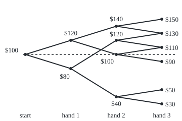
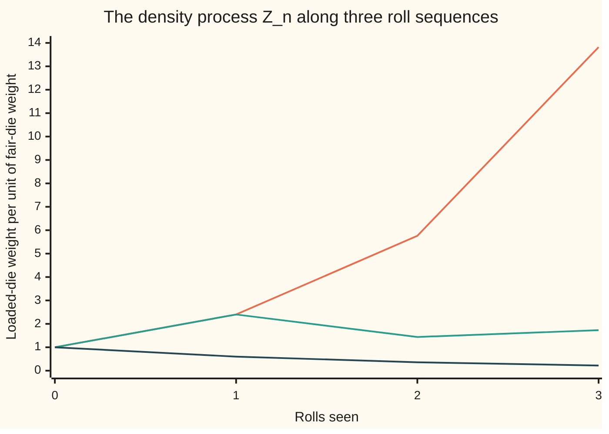

# Filtrations and martingales: information that grows with time, and a process whose best forecast of tomorrow is today's value

[Syllabus](../../../SYLLABUS.md) → [Measure and integration](../README.md) → [Conditional Expectation](../README.md#s09) → Filtrations and martingales

---

## General Overview

A poker night starts with a $100 bankroll and three hands. Each hand is a fair side bet: win and the stake is paid, lose and it is gone, each with probability 0.5. The stakes follow a rule: $20 on the first hand; on the second, $20 after a first win but $40 after a first loss, chasing it; $10 on the third. The night ends somewhere between $30 and $150.

Before any card is dealt, the best forecast of the final bankroll is $100: the eight equally likely endings average to exactly that. After a first win the forecast is $120; after a first loss, $80. Each forecast is an average of the final result over the endings still possible. Each one equals the bankroll on the table at that moment. The forecast never drifts: averaged over the next hand, tomorrow's forecast is today's.

Three pieces of vocabulary make this precise. The growing record of what has been seen, hand by hand, is a **filtration**. A running number that can be read off from that record is **adapted**. An adapted number whose forecast of its own next value is its present value is a **martingale**. The same shape appears far from the card table: a loaded die rolled three times, and the running exchange rate between its odds and a fair die's, is a martingale too.

**A martingale is a running number whose best forecast of its next value, given everything seen so far, is its present value; the forecast of any fixed final result, updated as information grows, is always a martingale.**

**What kind of fact this is:** three definitions (filtration, adapted process, martingale), with three theorems about them proved on this card in Why it works: forecasts are martingales, density processes are martingales, and a martingale keeps a constant mean.

### The picture: the bankroll over three hands, to scale

<p align="center"></p>

Height is the bankroll in dollars, to scale; the dashed line is $100. Each point sits exactly halfway between the two points it can move to next, because each hand is a coin-flip bet. Two pairs of endings share a height: $130 and $110 are each reached two ways.

---

## The formula

Notation first, in words. $\Omega$ (omega) is the set of all ways the night can go: here the eight win-loss histories, WWW to LLL. $\mathcal F$ is the collection of sets of histories we allow ourselves to measure, and $P$ the probability on it, 0.125 per history. A number that depends on the history is a random quantity. $E[Y \mid \mathcal G]$, from [Conditional expectation on a sigma-algebra](02-conditional-expectation-on-a-sigma-algebra.md), is the best forecast of $Y$ using only the sets in a smaller collection $\mathcal G$. The subscript $n$ counts hands played, from 0 to 3.

**Filtration.** A sequence of collections of measurable sets, each inside the next:

$$\mathcal F_0 \subseteq \mathcal F_1 \subseteq \mathcal F_2 \subseteq \dots \subseteq \mathcal F .$$

**Read it aloud:** $\mathcal F_n$ is what is known after $n$ steps, and nothing known is ever forgotten.

On the poker night, $\mathcal F_n$ holds exactly the sets of histories that the first $n$ hands decide. After one hand the histories fall into two cells, "won the first" and "lost the first", and $\mathcal F_1$ is every union of those cells: 4 sets. The counts run 2, 4, 16, 256.

**Adapted process.** A sequence $X_0, X_1, X_2, \dots$ of random quantities is adapted when each $X_n$ is measurable with respect to $\mathcal F_n$: its value can be read off once the first $n$ steps are known. The bankroll after $n$ hands is adapted. The bankroll after hand $n + 1$, read at time $n$, is not.

**Martingale.** An adapted process with $E\lvert X_n\rvert < \infty$ for every $n$ (each $X_n$ in $L^1$), and

$$E[X_{n+1} \mid \mathcal F_n] = X_n \quad \text{almost surely, for every } n .$$

**Read it aloud:** given everything seen after step $n$, the best forecast of the next value is the present value, except on a set of probability zero.

Replacing the equals sign by "at most" gives a **supermartingale**, a process that tends to fall; "at least" gives a **submartingale**. A gambler facing a house edge holds a supermartingale.

The three theorems:

$$M_n = E[Y \mid \mathcal F_n] \text{ is a martingale for every integrable } Y ,$$

$$Z_n = \frac{dQ|_{\mathcal F_n}}{dP|_{\mathcal F_n}} \text{ is a martingale under } P, \text{ with } E_P[Z_n] = 1 ,$$

$$E[X_m \mid \mathcal F_n] = X_n \text{ for } m \ge n, \quad\text{so}\quad E[X_n] = E[X_0] .$$

**Read them aloud:** a forecast of a fixed final result, updated as information arrives, is a martingale. The exchange rate between two sets of odds, measured on what is known so far, is a martingale under the old odds. A martingale's forecast of any later value is its present value, so its average never moves.

Here $Q|_{\mathcal F_n}$ is $Q$ used only on the sets in $\mathcal F_n$, and the fraction is the density of one against the other ([The Radon-Nikodym derivative](../08-Densities%20and%20Changing%20Measure/04-radon-nikodym-derivative.md)). On a finite space with cells, $Z_n$ on a cell is $Q(\text{cell}) / P(\text{cell})$. $E_P$ and $E_Q$ are averages under $P$ and under $Q$.

| Symbol | Plain meaning | In our example | Push it up and the answer… |
| --- | --- | --- | --- |
| $\Omega$, $\mathcal F$, $P$ | outcomes, measurable sets, probability | 8 histories, all 256 sets, 0.125 each | — |
| $n$, $m$ | steps taken; a later step | hands played, 0 to 3 | more sets in $\mathcal F_n$ |
| $\mathcal F_n$ | the filtration: sets decided by step $n$ | 2, 4, 16, 256 sets | finer cells, sharper forecasts |
| $X_n$ | a process: one random quantity per step | the bankroll after $n$ hands | — |
| $Y$ | a fixed final result | the bankroll at the end, $30 to $150 | a higher $Y$ lifts every $M_n$ |
| $M_n$ | the forecast $E[Y \mid \mathcal F_n]$ | 100, then 120 or 80 | — |
| $A_n$ | the forecast of finishing above $100 | 0.625, then 0.75 or 0.5 | — |
| $\mathcal G$, $\mathcal H$ | a smaller collection of known sets; in the tower rule, a coarser one inside it, $\mathcal H \subseteq \mathcal G$ | $\mathcal H = \mathcal F_1$ inside $\mathcal G = \mathcal F_2$ | — |
| $E[\,\cdot \mid \mathcal F_n]$, $W$ | the best forecast given step $n$; $W$ a candidate for it in the proof | an average over the cell | — |
| $Q$, $Z$, $f$, $q_f$, $E_P$, $E_Q$ | the loaded die; its rate $dQ/dP$ per roll; a face; its loaded probability; averages under $P$, under $Q$ | 0.1 on faces 1 to 4, 0.2, 0.4; rate 0.6, 1.2, 2.4 | more weight on 6, larger $Z$ on sixes |
| $Z_n$, $Z_3$ | the density process on three rolls; its last value | 1, 2.4, 5.76, about 13.82 on three sixes | — |
| $\mathbf 1_B$, $B$, $C$ | indicator: one on the set $B$, zero off it; a single cell | $B$ = "won the first hand" | — |
| $N_n$, $N_1$, $N_2$ | a process with constant mean that is no martingale | 100, then 120 or 80, then flipped | — |

### When it holds

- **The definitions** are definitions: nothing to hold. A process is a martingale only relative to a stated filtration and a stated probability; change either and the answer can change.
- **Nested information.** The forecasts theorem needs $\mathcal F_n \subseteq \mathcal F_{n+1}$. Keep only "the last hand played", and the record after hand 2 no longer knows hand 1; the tower rule below has nothing to stand on.
- **An integrable final result.** $E\lvert Y\rvert < \infty$, or the forecast $E[Y \mid \mathcal F_n]$ need not exist. The poker bankroll is bounded, so this is automatic.
- **For the density process, $Q \ll P$ on each $\mathcal F_n$**: no set in $\mathcal F_n$ of $P$-probability zero gets $Q$-weight. Where that fails, $\mathcal F_n$ has no density. And the martingale is under $P$: under $Q$, $E_Q[Z_1] = 1.44$, not 1.
- **Fixed times.** The constant mean holds at fixed steps $n$. Stopping at a time chosen by looking at the path needs extra conditions, handed to wing 11.

---

## Why it works

### Step 0: forecasting a forecast gives the forecast

The whole card rests on one rule from [The rules of conditional expectation](04-rules-of-conditional-expectation.md), the tower rule: if $\mathcal H \subseteq \mathcal G$, then $E[E[Y \mid \mathcal G] \mid \mathcal H] = E[Y \mid \mathcal H]$. Averaging over a fine cell and then over the coarse cell holding it is averaging over the coarse cell. A filtration is a chain of such inclusions, so the rule applies at every step.

### Step 1: a filtration is information that only grows

After hand 1, the eight histories split into two cells of four. After hand 2, four cells of two. After hand 3, eight single histories. Each cell at step $n + 1$ lies inside one cell at step $n$. So every union of step-$n$ cells is also a union of step-$(n+1)$ cells: $\mathcal F_n \subseteq \mathcal F_{n+1}$. The code lists all 2, 4, 16 and 256 sets and checks each collection is inside the next, and is closed under complements and unions, as a sigma-algebra must be.

A family that forgets is not a filtration. "The result of the last hand only", at step 2, does not contain the set "won the first hand", which step 1 held.

### Step 2: forecasts of a fixed result are martingales

Take $M_n = E[Y \mid \mathcal F_n]$. It is adapted: a conditional expectation given $\mathcal F_n$ is $\mathcal F_n$-measurable by definition. It is integrable: $\lvert E[Y \mid \mathcal F_n]\rvert \le E[\lvert Y\rvert \mid \mathcal F_n]$, whose mean is $E\lvert Y\rvert$. And the tower rule with $\mathcal F_n \subseteq \mathcal F_{n+1}$ gives

$$E[M_{n+1} \mid \mathcal F_n] = E\big[E[Y \mid \mathcal F_{n+1}] \mid \mathcal F_n\big] = E[Y \mid \mathcal F_n] = M_n .$$

On the poker night, after a first win the four endings are 150, 130, 110 and 90, averaging 120. After a win and a loss, 110 and 90 average 100. And 140 and 100 average 120: the forecast after hand 2 averages back to the forecast after hand 1.

Why does the forecast equal the bankroll on the table? The hands still to come are fair. Their expected gain, given anything already seen, is zero, whatever stake the rule sets; the stake is fixed by the past, so it comes out of the forecast as a known factor. Forecast = bankroll now + 0.

The same theorem applies to any final result, not only money. Let $Y$ be 1 if the night ends above $100 and 0 otherwise. The forecast $A_n$ is the chance of finishing ahead: 0.625 at the start, 0.75 after a first win, 0.5 after a first loss. It too is a martingale: 0.75 and 0.5 average to 0.625.

### Step 3: the density process is a martingale

Roll the loaded die three times; $P$ is a fair die, $Q$ the loaded one of [The Radon-Nikodym derivative](../08-Densities%20and%20Changing%20Measure/04-radon-nikodym-derivative.md), rolls independent under each. $\mathcal F_n$ holds the sets decided by the first $n$ rolls. On $\mathcal F_n$, $Q$ has a density against $P$: on the cell of a given start of $n$ rolls, $Z_n$ is $Q(\text{cell})/P(\text{cell})$, and since rolls are independent that is the product of the per-roll rates. Three sixes give $Z$ values 1, 2.4, 5.76 and about 13.82.

Why a martingale, in general? Take a set $B$ in $\mathcal F_n$. It is also in $\mathcal F_{n+1}$. So both $Z_n$ and $Z_{n+1}$ give it the same $Q$-weight:

$$E_P[Z_{n+1} \mathbf 1_B] = Q(B) = E_P[Z_n \mathbf 1_B] .$$

That is the defining property of $E_P[Z_{n+1} \mid \mathcal F_n]$, satisfied by $Z_n$. Uniqueness does the rest. With $B = \Omega$, $E_P[Z_n] = Q(\Omega) = 1$.

If there is a last step with density $Z$ on all of $\mathcal F$, the same argument shows $Z_n = E_P[Z \mid \mathcal F_n]$: the density process is the forecast of the final density, a special case of Step 2.



The first line is three sixes, the second a six, a one and a five, the third three ones. Under fair odds 172 of the 216 sequences, 0.7963 of them, end with $Z_3$ below 1. The rare high paths pay for them: the average stays at 1 at every step.

### Step 4: a martingale keeps its mean

Apply the defining property twice, then use the tower rule: $E[X_{n+2} \mid \mathcal F_n] = E[E[X_{n+2} \mid \mathcal F_{n+1}] \mid \mathcal F_n] = E[X_{n+1} \mid \mathcal F_n] = X_n$. Induction reaches every later step $m$. Averaging with no information at all is averaging over $\Omega$: take $B = \Omega$ in the defining property, and $E[X_{n+1}] = E[X_n]$. So the bankroll averages $100 after every hand, the chance of finishing ahead averages 0.625, and the density averages 1.

The converse fails. Let $N_0 = 100$, $N_1$ the bankroll after hand 1, and $N_2 = 200 - N_1$: a forecast that always predicts a reversal. Its means are 100, 100, 100. But after a first win $N_1 = 120$ while the forecast of $N_2$ is 80. A constant mean is a consequence of being a martingale, not a test for it.

<details>
<summary>Detailed proof</summary>

**Setting.** $(\Omega, \mathcal F, P)$ a probability space; $\mathcal F_0 \subseteq \mathcal F_1 \subseteq \dots \subseteq \mathcal F$ sigma-algebras. For an integrable $Y$ and a sigma-algebra $\mathcal G \subseteq \mathcal F$, $E[Y \mid \mathcal G]$ is the a.s.-unique $\mathcal G$-measurable integrable $W$ with $E[W \mathbf 1_B] = E[Y \mathbf 1_B]$ for all $B \in \mathcal G$ ([Conditional expectation on a sigma-algebra](02-conditional-expectation-on-a-sigma-algebra.md)).

**Theorem 1.** Let $E\lvert Y\rvert < \infty$ and $M_n = E[Y \mid \mathcal F_n]$. *Adapted:* $M_n$ is $\mathcal F_n$-measurable by definition. *Integrable:* by the rules card, $\lvert E[Y \mid \mathcal F_n]\rvert \le E[\lvert Y\rvert \mid \mathcal F_n]$ a.s.; take means and use $E[E[\lvert Y\rvert \mid \mathcal F_n]] = E\lvert Y\rvert < \infty$. *Martingale:* for $B \in \mathcal F_n$, also $B \in \mathcal F_{n+1}$, so $E[M_{n+1} \mathbf 1_B] = E[Y \mathbf 1_B] = E[M_n \mathbf 1_B]$, the first equality by the defining property at level $n + 1$, the second at level $n$. $M_n$ is $\mathcal F_n$-measurable and integrable, so by uniqueness $M_n = E[M_{n+1} \mid \mathcal F_n]$ a.s. This is the tower rule, written out.

**Theorem 2.** Let $Q$ be a probability on $\mathcal F$ with $Q \ll P$ on $\mathcal F_n$ for every $n$ (automatic if $Q \ll P$ on $\mathcal F$, since $\mathcal F_n \subseteq \mathcal F$). Restricted to $\mathcal F_n$, both are finite measures, so the Radon-Nikodym theorem gives an $\mathcal F_n$-measurable $Z_n \ge 0$, unique $P$-a.s., with $Q(B) = E_P[Z_n \mathbf 1_B]$ for all $B \in \mathcal F_n$. *Adapted:* by construction. *Integrable:* $E_P[Z_n] = Q(\Omega) = 1$. *Martingale:* for $B \in \mathcal F_n \subseteq \mathcal F_{n+1}$, $E_P[Z_{n+1} \mathbf 1_B] = Q(B) = E_P[Z_n \mathbf 1_B]$. So $Z_n$ satisfies the defining property of $E_P[Z_{n+1} \mid \mathcal F_n]$, and uniqueness gives equality $P$-a.s. If moreover $Z = dQ/dP$ on $\mathcal F$, the same computation with $\mathcal F$ in place of $\mathcal F_{n+1}$ gives $Z_n = E_P[Z \mid \mathcal F_n]$.

**The die.** Under $P$ and $Q$ the rolls are independent, so for a start $(f_1, \dots, f_n)$ the cell $C$ has $P(C) = 6^{-n}$ and $Q(C) = q_{f_1} \cdots q_{f_n}$, where $q_f$ is the loaded probability of face $f$. On a finite space every set in $\mathcal F_n$ is a union of such cells, so the function equal to $Q(C)/P(C)$ on each cell satisfies $Q(B) = E_P[Z_n \mathbf 1_B]$ by adding over the cells in $B$. That ratio is $\prod_k 6 q_{f_k}$, the product of the per-roll rates.

**Theorem 3.** Let $(X_n)$ be a martingale and $m \ge n$. For $m = n$, $E[X_n \mid \mathcal F_n] = X_n$ since $X_n$ is $\mathcal F_n$-measurable. If $E[X_{m} \mid \mathcal F_n] = X_n$, then by the tower rule with $\mathcal F_n \subseteq \mathcal F_m$, $E[X_{m+1} \mid \mathcal F_n] = E[E[X_{m+1} \mid \mathcal F_m] \mid \mathcal F_n] = E[X_m \mid \mathcal F_n] = X_n$. Induction on $m$ completes it. Taking $B = \Omega$ in the defining property, $E[X_m] = E[E[X_m \mid \mathcal F_n]] = E[X_n]$; with $n = 0$ this is $E[X_m] = E[X_0]$.

**The flip process.** $N_1$ takes 120 and 80 with probability 0.5 each, so $E[N_1] = 100 = E[N_2]$. $N_2 = 200 - N_1$ is $\mathcal F_1$-measurable, so $E[N_2 \mid \mathcal F_1] = 200 - N_1$, which differs from $N_1$ wherever $N_1 \ne 100$: on the whole space.

</details>

A second road to all of this on a finite space: every forecast is a cell average, and the martingale property says a cell's average is the average of its sub-cells' averages, weighted by their sizes. That is regrouping a finite sum. The proof above is what survives when the steps are infinitely many, or the cells have probability zero, and conditioning must be done through sigma-algebras.

---

## Worked numbers, by hand

| Step | Arithmetic | Value |
| --- | --- | --- |
| the eight endings | $100 ± 20 ± (20 or 40) ± 10 | 150, 130, 110, 90, 130, 110, 50, 30 |
| $M_0$, the forecast before any hand | (150 + 130 + 110 + 90 + 130 + 110 + 50 + 30) ÷ 8 | 100 |
| $M_1$ after a first win | (150 + 130 + 110 + 90) ÷ 4 | 120 |
| $M_1$ after a first loss | (130 + 110 + 50 + 30) ÷ 4 | 80 |
| $M_2$ after W then L | (110 + 90) ÷ 2 | 100 |
| martingale check at step 1 | (140 + 100) ÷ 2, the two step-2 forecasts after a win | 120 |
| $A_0$, the chance of finishing above $100 | 5 of 8 endings | 0.625 |
| $A_1$ after a win, after a loss | 3 of 4, 2 of 4 | 0.75, 0.5 |
| $Z_2$ on two sixes | 2.4 × 2.4 | 5.76 |
| check: $Q$(two sixes) | 5.76 × (1 ÷ 36), against 0.4 × 0.4 | **0.16** |
| mean of each $M_n$, $A_n$, $Z_n$ | the martingale property, step by step | **100, 0.625, 1** |

Chasing losses makes finishing ahead more likely than not, 0.625, yet the average night still ends at $100: five winning endings are paid for by three losing ones, two of them deep, at $50 and $30.

### What breaks if you drop a piece

| Mistake | Comes out at | What went wrong |
| --- | --- | --- |
| A house edge: each hand won with chance 0.45 | mean 100, 98, 94.9, 93.9 over the night | unfair bets: the bankroll is a supermartingale |
| Constant mean taken as the test | means 100, 100, 100, yet 80 forecast after 120 | the flip process $N_n$ is not a martingale |
| Forecast read one hand early | $M_{n+1}$ at time $n$: not adapted | it uses a hand not yet played |
| Only the latest roll's rate as $Z_2$ | 0.0667 for two sixes, where $Q$ says 0.16 | the density on two rolls multiplies both rates |

The code prints every entry.

---

## Code, from first principles, and it actually runs

Python works in exact fractions from the standard library; Rust writes its own fractions on small integers. The poker filtration is listed set by set. The forecast $M_n$ is reached by three roads that share no arithmetic: averaging the final bankroll over each cell; folding back from the end, two children at a time; and adding up the stakes forward. The density process is reached by three more: $Q(\text{cell})/P(\text{cell})$, the product of per-roll rates, and the $P$-average of $Z_3$ over each cell's completions. A fourth road for the poker night is 200000 simulated nights from SplitMix64, a short random-number generator written out in both languages with seed 2026. The code checks these finite cases; only the proof covers every filtration.

### Python

```python
# Filtrations and martingales -- the check behind the card.  Standard library
# only.  Part 1: a poker night of three fair even-money hands.  $100 to start;
# stakes $20, then $20 after a first win or $40 after a first loss, then $10.
# The filtration is listed set by set, and the forecast M_n = E[Y | F_n] of the
# final bankroll Y is reached by three roads.  Part 2: the loaded die of the
# Radon-Nikodym card rolled three times; its density process Z_n by three roads.
# Part 3: SplitMix64 poker nights, seed 2026.  Part 4: the mistakes, computed.
from fractions import Fraction as F
from itertools import product
import math

H = list(product("WL", repeat=3))                 # the 8 histories, WWW first

def forward(h):                                   # road 3: add up the stakes
    b = [F(100)]
    for n, r in enumerate(h):
        stake = 20 if n == 0 else 10 if n == 2 else 20 if h[0] == "W" else 40
        b.append(b[-1] + (stake if r == "W" else -stake))
    return b

Y = {h: forward(h)[3] for h in H}
AHEAD = {h: F(int(Y[h] > 100)) for h in H}

def cell_avg(X, h, n):                            # road 1: average over h's cell
    cell = [g for g in H if g[:n] == h[:n]]
    return sum(X[g] for g in cell) / len(cell)

def fold_back(X):                                 # road 2: two children at a time
    V, out = dict(X), {3: dict(X)}
    for n in (2, 1, 0):
        V = {h[:n]: (V[h[:n] + ("W",)] + V[h[:n] + ("L",)]) / 2 for h in H}
        out[n] = {h: V[h[:n]] for h in H}
    return out

M = {n: {h: cell_avg(Y, h, n) for h in H} for n in range(4)}
A = {n: {h: cell_avg(AHEAD, h, n) for h in H} for n in range(4)}
MB, AB = fold_back(Y), fold_back(AHEAD)

def sigma(n):                                     # F_n: every union of time-n cells
    cells = sorted({sum(1 << i for i, g in enumerate(H) if g[:n] == h[:n]) for h in H})
    return {sum(c for k, c in enumerate(cells) if s >> k & 1) for s in range(1 << len(cells))}

FS = [sigma(n) for n in range(4)]
nested = all(FS[n] <= FS[n + 1] for n in range(3))
closed = all(255 ^ a in S and a | b in S for S in FS for a in S for b in S)
def adapted(X, n):                                # every set {X = c} lies in F_n
    return all(sum(1 << i for i, g in enumerate(H) if X[g] == c) in FS[n] for c in set(X.values()))

fmt = lambda x: str(int(x)) if x.denominator == 1 else str(float(x))
print("sets in F_0, F_1, F_2, F_3:", ", ".join(str(len(S)) for S in FS),
      "| each inside the next:", "yes" if nested else "no", "| closed:", "yes" if closed else "no")
print("history | Y | M_0 M_1 M_2 M_3 | ahead forecast A_0 A_1 A_2 A_3")
for h in H:
    print("".join(h), "|", fmt(Y[h]), "|", " ".join(fmt(M[n][h]) for n in range(4)), "|",
          " ".join(fmt(A[n][h]) for n in range(4)))
print("figure, nodes (hand: $):", "; ".join(f"{n}: " + ", ".join(
      fmt(v) for v in sorted({M[n][h] for h in H}, reverse=True)) for n in range(4)))
print("figure, svg x = 50 + 90 x hand:", ", ".join(str(50 + 90 * n) for n in range(4)))
print("figure, svg y = 220 - 1.4 x (bankroll - 20) for $150, $100, $30:",
      ", ".join(fmt(220 - F(14, 10) * (v - 20)) for v in (150, 100, 30)))
print("E[M_n] for n = 0..3:", ", ".join(fmt(sum(M[n].values()) / 8) for n in range(4)),
      "| E[A_n]:", ", ".join(fmt(sum(A[n].values()) / 8) for n in range(4)))
print("adapted to F_n: M_n", "yes" if all(adapted(M[n], n) for n in range(4)) else "no",
      "| M_(n+1), read at time n:", "yes" if any(adapted(M[n + 1], n) for n in range(3)) else "no")

P1, Q1 = [F(1, 6)] * 6, [F(1, 10)] * 4 + [F(2, 10), F(4, 10)]
RATE = [q / p for q, p in zip(Q1, P1)]
ROLLS = list(product(range(6), repeat=3))
PRE = sorted({r[:n] for r in ROLLS for n in range(4)})
def ends(pre): return [pre + t for t in product(range(6), repeat=3 - len(pre))]
def z_ratio(pre):                                 # road A: Q(cell) / P(cell)
    return sum(math.prod(Q1[f] for f in e) for e in ends(pre)) / sum(math.prod(P1[f] for f in e) for e in ends(pre))
def z_prod(pre): return math.prod((RATE[f] for f in pre), start=F(1))   # road B: rates multiplied
def z_cond(pre): return sum(z_prod(e) for e in ends(pre)) / len(ends(pre))  # road C: E_P[Z_3 | F_n]
print("P per history:", fmt(F(1, 8)), "| loaded die Q:", ", ".join(fmt(q) for q in Q1),
      "| rates dQ/dP:", ", ".join(fmt(r) for r in RATE))
roads_z = all(z_ratio(p) == z_prod(p) == z_cond(p) for p in PRE)
step_z = all(sum(z_prod(p + (f,)) for f in range(6)) / 6 == z_prod(p) for p in PRE if len(p) < 3)
EZ = [sum(z_prod(r[:n]) for r in ROLLS) / 216 for n in range(4)]
print(f"density process: {len(PRE)} cells; Q(cell)/P(cell) = product of rates = E_P[Z_3 | F_n]:",
      "yes" if roads_z else "no")
print("one-step average of Z_(n+1) over the next roll is Z_n:", "yes" if step_z else "no",
      "| E_P[Z_n] for n = 0..3:", ", ".join(fmt(z) for z in EZ))
for lab, path in (("6,6,6", (5, 5, 5)), ("6,1,5", (5, 0, 4)), ("1,1,1", (0, 0, 0))):
    print(f"figure, Z_n on rolls {lab}:", ", ".join(f"{float(z_prod(path[:n])):.2f}" for n in range(4)))
below = sum(1 for r in ROLLS if z_prod(r) < 1)
print(f"rolls with Z_3 below 1: {below} of 216 = {below / 216:.4f} under P")

state = 2026
def uniform():                                    # SplitMix64; 53 bits into [0, 1)
    global state
    state = (state + 0x9E3779B97F4A7C15) % 2**64
    z = state
    z = (z ^ (z >> 30)) * 0xBF58476D1CE4E5B9 % 2**64
    z = (z ^ (z >> 27)) * 0x94D049BB133111EB % 2**64
    return ((z ^ (z >> 31)) >> 11) / 2.0**53
N, cnt, sm, sq, ahead = 200000, [0, 0], [0.0, 0.0], [0.0, 0.0], 0
for _ in range(N):
    h = tuple("W" if uniform() < 0.5 else "L" for _ in range(3))
    y, k = float(Y[h]), 0 if h[0] == "W" else 1
    cnt[k] += 1; sm[k] += y; sq[k] += y * y; ahead += y > 100
cm = [sm[k] / cnt[k] for k in (0, 1)]
se = [math.sqrt((sq[k] / cnt[k] - cm[k] ** 2) / cnt[k]) for k in (0, 1)]
fa = ahead / N
sea = math.sqrt(fa * (1 - fa) / N)
print(f"draws, seed 2026: {N} nights; mean Y after a first win {cm[0]:.2f} (s.e. {se[0]:.2f}),"
      f" after a first loss {cm[1]:.2f} (s.e. {se[1]:.2f})")
print(f"draws: share of nights finishing above $100 = {fa:.4f} (s.e. {sea:.4f})")

p = F(45, 100)                                    # a house edge: a win has chance 0.45
EH = [sum(math.prod(p if r == "W" else 1 - p for r in h) * forward(h)[n] for h in H) for n in range(4)]
by_stakes = 100 + (2 * p - 1) * (20 + p * 20 + (1 - p) * 40 + 10)
flip = {h: 200 - forward(h)[1] for h in H}        # N_2 = 200 - N_1: a forecast that flips
flip_after_win = cell_avg(flip, ("W", "W", "W"), 1)
one_roll = RATE[5] / 36                           # rate of roll 2 alone, on the event 6 then 6
print("house edge 0.45: mean bankroll after 0..3 hands:", ", ".join(fmt(e) for e in EH),
      "| from the stakes:", fmt(by_stakes))
print("flip process: means", ", ".join(fmt(x) for x in (F(100), sum(forward(h)[1] for h in H) / 8,
      sum(flip.values()) / 8)), f"| E[N_2 | F_1] after a first win = {fmt(flip_after_win)}, not 120")
print(f"one-roll rate as Z_2: E_P[Z'_2 on 6 then 6] = {one_roll:.4f}; Q(6 then 6) = {fmt(Q1[5] ** 2)}"
      f" | averaged under Q, E_Q[Z_1] = {fmt(sum(q * r for q, r in zip(Q1, RATE)))}, not 1")

assert all(M[n][h] == MB[n][h] == forward(h)[n] for n in range(4) for h in H)  # three roads to M_n
assert all(A[n][h] == AB[n][h] for n in range(4) for h in H)                   # the ahead forecast, two roads
assert [len(S) for S in FS] == [2 ** 2 ** n for n in range(4)] and nested and closed
assert roads_z and step_z and EZ == [z_ratio(()) for _ in range(4)]             # density, three roads
assert abs(cm[0] - 120) < 4 * se[0] and abs(cm[1] - 80) < 4 * se[1]           # draws against 120, 80
assert abs(fa - float(A[0][H[0]])) < 4 * sea                                   # draws against 5/8
assert EH[3] == by_stakes and flip_after_win != M[1][H[0]]                      # the mistakes are real
assert all(adapted(M[n], n) for n in range(4)) and not any(adapted(M[n + 1], n) for n in range(3))
print("ALL CHECKS PASS")
```

**Ran 2026-09-29 on macOS, Python 3.14.6, standard library only. All checks passed. Output, pasted from the run:**

```
sets in F_0, F_1, F_2, F_3: 2, 4, 16, 256 | each inside the next: yes | closed: yes
history | Y | M_0 M_1 M_2 M_3 | ahead forecast A_0 A_1 A_2 A_3
WWW | 150 | 100 120 140 150 | 0.625 0.75 1 1
WWL | 130 | 100 120 140 130 | 0.625 0.75 1 1
WLW | 110 | 100 120 100 110 | 0.625 0.75 0.5 1
WLL | 90 | 100 120 100 90 | 0.625 0.75 0.5 0
LWW | 130 | 100 80 120 130 | 0.625 0.5 1 1
LWL | 110 | 100 80 120 110 | 0.625 0.5 1 1
LLW | 50 | 100 80 40 50 | 0.625 0.5 0 0
LLL | 30 | 100 80 40 30 | 0.625 0.5 0 0
figure, nodes (hand: $): 0: 100; 1: 120, 80; 2: 140, 120, 100, 40; 3: 150, 130, 110, 90, 50, 30
figure, svg x = 50 + 90 x hand: 50, 140, 230, 320
figure, svg y = 220 - 1.4 x (bankroll - 20) for $150, $100, $30: 38, 108, 206
E[M_n] for n = 0..3: 100, 100, 100, 100 | E[A_n]: 0.625, 0.625, 0.625, 0.625
adapted to F_n: M_n yes | M_(n+1), read at time n: no
P per history: 0.125 | loaded die Q: 0.1, 0.1, 0.1, 0.1, 0.2, 0.4 | rates dQ/dP: 0.6, 0.6, 0.6, 0.6, 1.2, 2.4
density process: 259 cells; Q(cell)/P(cell) = product of rates = E_P[Z_3 | F_n]: yes
one-step average of Z_(n+1) over the next roll is Z_n: yes | E_P[Z_n] for n = 0..3: 1, 1, 1, 1
figure, Z_n on rolls 6,6,6: 1.00, 2.40, 5.76, 13.82
figure, Z_n on rolls 6,1,5: 1.00, 2.40, 1.44, 1.73
figure, Z_n on rolls 1,1,1: 1.00, 0.60, 0.36, 0.22
rolls with Z_3 below 1: 172 of 216 = 0.7963 under P
draws, seed 2026: 200000 nights; mean Y after a first win 119.96 (s.e. 0.07), after a first loss 80.07 (s.e. 0.13)
draws: share of nights finishing above $100 = 0.6261 (s.e. 0.0011)
house edge 0.45: mean bankroll after 0..3 hands: 100, 98, 94.9, 93.9 | from the stakes: 93.9
flip process: means 100, 100, 100 | E[N_2 | F_1] after a first win = 80, not 120
one-roll rate as Z_2: E_P[Z'_2 on 6 then 6] = 0.0667; Q(6 then 6) = 0.16 | averaged under Q, E_Q[Z_1] = 1.44, not 1
ALL CHECKS PASS
```

### Rust

Same numbers, same labels, built with `rustc --edition 2021 -O`.

```rust
// Filtrations and martingales -- the same check as the Python, in Rust.  No
// crates.  Exact fractions by hand on small integers.  Part 1: a poker night of
// three fair even-money hands, $100 to start, stakes $20, then $20 after a
// first win or $40 after a first loss, then $10: the filtration set by set and
// the forecast M_n = E[Y | F_n] by three roads.  Part 2: the loaded die rolled
// three times and its density process Z_n by three roads.  Part 3: SplitMix64
// poker nights, seed 2026.  Part 4: the mistakes, computed.
use std::collections::BTreeSet;

#[derive(Clone, Copy, PartialEq, Debug)]
struct Fr { n: i64, d: i64 }
fn gcd(a: i64, b: i64) -> i64 { if b == 0 { a.abs() } else { gcd(b, a % b) } }
fn fr(n: i64, d: i64) -> Fr { let g = gcd(n, d).max(1); let s = if d < 0 { -1 } else { 1 }; Fr { n: s * n / g, d: s * d / g } }
fn add(a: Fr, b: Fr) -> Fr { fr(a.n * b.d + b.n * a.d, a.d * b.d) }
fn sub(a: Fr, b: Fr) -> Fr { fr(a.n * b.d - b.n * a.d, a.d * b.d) }
fn mul(a: Fr, b: Fr) -> Fr { fr(a.n * b.n, a.d * b.d) }
fn div(a: Fr, b: Fr) -> Fr { fr(a.n * b.d, a.d * b.n) }
fn int(k: i64) -> Fr { fr(k, 1) }
fn lt(a: Fr, b: Fr) -> bool { a.n * b.d < b.n * a.d }       // denominators kept positive
fn fl(a: Fr) -> f64 { a.n as f64 / a.d as f64 }
fn fmt(a: Fr) -> String { if a.d == 1 { format!("{}", a.n) } else { format!("{}", fl(a)) } }
fn sum(v: impl Iterator<Item = Fr>) -> Fr { v.fold(int(0), add) }
fn yn(b: bool) -> &'static str { if b { "yes" } else { "no" } }
fn join(v: Vec<String>) -> String { v.join(", ") }

type Hist = [bool; 3];                                   // true = a win; WWW first
fn hists() -> Vec<Hist> { (0..8).map(|i| [i & 4 == 0, i & 2 == 0, i & 1 == 0]).collect() }
fn forward(h: &Hist) -> Vec<Fr> {                        // road 3: add up the stakes
    let mut b = vec![int(100)];
    for n in 0..3 {
        let stake = if n == 0 { 20 } else if n == 2 { 10 } else if h[0] { 20 } else { 40 };
        let last = *b.last().unwrap();
        b.push(add(last, int(if h[n] { stake } else { -stake })));
    }
    b
}
fn cell_avg(hs: &[Hist], x: &[Fr], i: usize, n: usize) -> Fr {   // road 1: average over the cell
    let cell: Vec<usize> = (0..8).filter(|&j| hs[j][..n] == hs[i][..n]).collect();
    div(sum(cell.iter().map(|&j| x[j])), int(cell.len() as i64))
}
fn fold_back(hs: &[Hist], x: &[Fr]) -> Vec<Vec<Fr>> {  // road 2: two children at a time
    let mut out = vec![x.to_vec(); 4];
    for n in (0..3).rev() {
        let next = out[n + 1].clone();
        for i in 0..8 {
            let w = (0..8).find(|&j| hs[j][..n] == hs[i][..n] && hs[j][n]).unwrap();
            let l = (0..8).find(|&j| hs[j][..n] == hs[i][..n] && !hs[j][n]).unwrap();
            out[n][i] = div(add(next[w], next[l]), int(2));
        }
    }
    out
}
fn sigma(hs: &[Hist], n: usize) -> BTreeSet<u32> {     // F_n: every union of time-n cells
    let cells: Vec<u32> = (0..8).map(|i| (0..8).filter(|&j| hs[j][..n] == hs[i][..n]).map(|j| 1u32 << j).sum())
        .collect::<BTreeSet<u32>>().into_iter().collect();
    (0..1u32 << cells.len()).map(|s| (0..cells.len()).filter(|k| s >> k & 1 == 1).map(|k| cells[k]).sum()).collect()
}

struct Rng(u64);
impl Rng {                                               // SplitMix64; 53 bits into [0, 1)
    fn uniform(&mut self) -> f64 {
        self.0 = self.0.wrapping_add(0x9E3779B97F4A7C15);
        let mut z = self.0;
        z = (z ^ (z >> 30)).wrapping_mul(0xBF58476D1CE4E5B9);
        z = (z ^ (z >> 27)).wrapping_mul(0x94D049BB133111EB);
        ((z ^ (z >> 31)) >> 11) as f64 / 9007199254740992.0
    }
}

fn main() {
    let hs = hists();
    let y: Vec<Fr> = hs.iter().map(|h| forward(h)[3]).collect();
    let ahead: Vec<Fr> = y.iter().map(|&v| int(lt(int(100), v) as i64)).collect();
    let m: Vec<Vec<Fr>> = (0..4).map(|n| (0..8).map(|i| cell_avg(&hs, &y, i, n)).collect()).collect();
    let a: Vec<Vec<Fr>> = (0..4).map(|n| (0..8).map(|i| cell_avg(&hs, &ahead, i, n)).collect()).collect();
    let (mb, ab) = (fold_back(&hs, &y), fold_back(&hs, &ahead));
    let fs: Vec<BTreeSet<u32>> = (0..4).map(|n| sigma(&hs, n)).collect();
    let nested = (0..3).all(|n| fs[n].is_subset(&fs[n + 1]));
    let closed = fs.iter().all(|s| s.iter().all(|&x| s.contains(&(255 ^ x)) && s.iter().all(|&z| s.contains(&(x | z)))));
    let adapted = |x: &[Fr], n: usize| x.iter().all(|&c| fs[n].contains(&(0..8).filter(|&j| x[j] == c).map(|j| 1u32 << j).sum()));
    let lab = |h: &Hist| h.iter().map(|&w| if w { 'W' } else { 'L' }).collect::<String>();
    println!("sets in F_0, F_1, F_2, F_3: {} | each inside the next: {} | closed: {}",
             join(fs.iter().map(|s| s.len().to_string()).collect()), yn(nested), yn(closed));
    println!("history | Y | M_0 M_1 M_2 M_3 | ahead forecast A_0 A_1 A_2 A_3");
    for i in 0..8 {
        println!("{} | {} | {} | {}", lab(&hs[i]), fmt(y[i]), (0..4).map(|n| fmt(m[n][i])).collect::<Vec<_>>().join(" "),
                 (0..4).map(|n| fmt(a[n][i])).collect::<Vec<_>>().join(" "));
    }
    let nodes: Vec<String> = (0..4).map(|n| {
        let mut v: Vec<i64> = m[n].iter().map(|x| x.n).collect::<BTreeSet<_>>().into_iter().collect();
        v.reverse();
        format!("{}: {}", n, join(v.iter().map(|k| k.to_string()).collect()))
    }).collect();
    println!("figure, nodes (hand: $): {}", nodes.join("; "));
    println!("figure, svg x = 50 + 90 x hand: {}", join((0..4).map(|k| (50 + 90 * k).to_string()).collect()));
    println!("figure, svg y = 220 - 1.4 x (bankroll - 20) for $150, $100, $30: {}",
             join([150, 100, 30].iter().map(|&v| fmt(sub(int(220), mul(fr(14, 10), int(v - 20))))).collect()));
    let mean8 = |x: &[Fr]| div(sum(x.iter().copied()), int(8));
    println!("E[M_n] for n = 0..3: {} | E[A_n]: {}", join(m.iter().map(|x| fmt(mean8(x))).collect()),
             join(a.iter().map(|x| fmt(mean8(x))).collect()));
    println!("adapted to F_n: M_n {} | M_(n+1), read at time n: {}", yn((0..4).all(|n| adapted(&m[n], n))),
             yn((0..3).any(|n| adapted(&m[n + 1], n))));

    let p1 = [fr(1, 6); 6];
    let q1 = [fr(1, 10), fr(1, 10), fr(1, 10), fr(1, 10), fr(2, 10), fr(4, 10)];
    let rate: Vec<Fr> = (0..6).map(|f| div(q1[f], p1[f])).collect();
    let ends = |pre: &[usize]| -> Vec<Vec<usize>> {
        let k = 3 - pre.len();
        (0..6usize.pow(k as u32)).map(|c| { let mut e = pre.to_vec(); let mut c = c;
            let mut tail = vec![0; k]; for t in (0..k).rev() { tail[t] = c % 6; c /= 6; } e.extend(tail); e }).collect()
    };
    let prob = |w: &[Fr], e: &[usize]| e.iter().fold(int(1), |s, &f| mul(s, w[f]));
    let z_prod = |pre: &[usize]| prob(&rate, pre);                                  // road B: rates multiplied
    let z_ratio = |pre: &[usize]| div(sum(ends(pre).iter().map(|e| prob(&q1, e))), sum(ends(pre).iter().map(|e| prob(&p1, e)))); // road A
    let z_cond = |pre: &[usize]| div(sum(ends(pre).iter().map(|e| z_prod(e))), int(ends(pre).len() as i64)); // road C
    let rolls = ends(&[]);
    let pre: BTreeSet<Vec<usize>> = rolls.iter().flat_map(|r| (0..4).map(move |n| r[..n].to_vec())).collect();
    println!("P per history: {} | loaded die Q: {} | rates dQ/dP: {}", fmt(fr(1, 8)),
             join(q1.iter().map(|&q| fmt(q)).collect()), join(rate.iter().map(|&r| fmt(r)).collect()));
    let roads_z = pre.iter().all(|p| z_ratio(p) == z_prod(p) && z_prod(p) == z_cond(p));
    let step_z = pre.iter().filter(|p| p.len() < 3).all(|p| div(sum((0..6).map(|f| { let mut e = p.clone(); e.push(f); z_prod(&e) })), int(6)) == z_prod(p));
    let ez: Vec<Fr> = (0..4).map(|n| div(sum(rolls.iter().map(|r| z_prod(&r[..n]))), int(216))).collect();
    println!("density process: {} cells; Q(cell)/P(cell) = product of rates = E_P[Z_3 | F_n]: {}", pre.len(), yn(roads_z));
    println!("one-step average of Z_(n+1) over the next roll is Z_n: {} | E_P[Z_n] for n = 0..3: {}", yn(step_z),
             join(ez.iter().map(|&z| fmt(z)).collect()));
    for (l, path) in [("6,6,6", [5, 5, 5]), ("6,1,5", [5, 0, 4]), ("1,1,1", [0, 0, 0])] {
        println!("figure, Z_n on rolls {}: {}", l, join((0..4).map(|n| format!("{:.2}", fl(z_prod(&path[..n])))).collect()));
    }
    let below = rolls.iter().filter(|r| lt(z_prod(r), int(1))).count();
    println!("rolls with Z_3 below 1: {} of 216 = {:.4} under P", below, below as f64 / 216.0);

    let n = 200000usize;
    let mut rng = Rng(2026);
    let (mut cnt, mut sm, mut sq, mut up) = ([0usize; 2], [0.0f64; 2], [0.0f64; 2], 0usize);
    for _ in 0..n {
        let h: Hist = [rng.uniform() < 0.5, rng.uniform() < 0.5, rng.uniform() < 0.5];
        let i = hs.iter().position(|g| *g == h).unwrap();
        let (v, k) = (fl(y[i]), if h[0] { 0 } else { 1 });
        cnt[k] += 1; sm[k] += v; sq[k] += v * v; if v > 100.0 { up += 1; }
    }
    let cm: Vec<f64> = (0..2).map(|k| sm[k] / cnt[k] as f64).collect();
    let se: Vec<f64> = (0..2).map(|k| ((sq[k] / cnt[k] as f64 - cm[k].powi(2)) / cnt[k] as f64).sqrt()).collect();
    let fa = up as f64 / n as f64;
    let sea = (fa * (1.0 - fa) / n as f64).sqrt();
    println!("draws, seed 2026: {} nights; mean Y after a first win {:.2} (s.e. {:.2}), after a first loss {:.2} (s.e. {:.2})",
             n, cm[0], se[0], cm[1], se[1]);
    println!("draws: share of nights finishing above $100 = {:.4} (s.e. {:.4})", fa, sea);

    let p = fr(45, 100);                                 // a house edge: a win has chance 0.45
    let eh: Vec<Fr> = (0..4).map(|k| sum(hs.iter().map(|h| mul(h.iter().fold(int(1), |s, &w| mul(s, if w { p } else { sub(int(1), p) })), forward(h)[k])))).collect();
    let by_stakes = add(int(100), mul(sub(mul(int(2), p), int(1)), add(add(int(30), mul(p, int(20))), mul(sub(int(1), p), int(40)))));
    let flip: Vec<Fr> = hs.iter().map(|h| sub(int(200), forward(h)[1])).collect();
    let flip_after_win = cell_avg(&hs, &flip, 0, 1);
    let one_roll = div(rate[5], int(36));
    println!("house edge 0.45: mean bankroll after 0..3 hands: {} | from the stakes: {}", join(eh.iter().map(|&e| fmt(e)).collect()), fmt(by_stakes));
    let n1: Vec<Fr> = hs.iter().map(|h| forward(h)[1]).collect(); println!("flip process: means {} | E[N_2 | F_1] after a first win = {}, not 120",
             join(vec![fmt(int(100)), fmt(mean8(&n1)), fmt(mean8(&flip))]), fmt(flip_after_win));
    println!("one-roll rate as Z_2: E_P[Z'_2 on 6 then 6] = {:.4}; Q(6 then 6) = {} | averaged under Q, E_Q[Z_1] = {}, not 1",
             fl(one_roll), fmt(mul(q1[5], q1[5])), fmt(sum((0..6).map(|f| mul(q1[f], rate[f])))));

    assert!((0..4).all(|k| (0..8).all(|i| m[k][i] == mb[k][i] && mb[k][i] == forward(&hs[i])[k]))); // three roads to M_n
    assert!((0..4).all(|k| (0..8).all(|i| a[k][i] == ab[k][i])));                // the ahead forecast, two roads
    assert!(fs.iter().enumerate().all(|(k, s)| s.len() == 1 << (1 << k)) && nested && closed
            && (0..4).all(|n| adapted(&m[n], n)) && !(0..3).any(|n| adapted(&m[n + 1], n)));
    assert!(roads_z && step_z && ez.iter().all(|&z| z == z_ratio(&[])));           // density, three roads
    assert!((cm[0] - 120.0).abs() < 4.0 * se[0] && (cm[1] - 80.0).abs() < 4.0 * se[1]); // draws against 120, 80
    assert!((fa - fl(a[0][0])).abs() < 4.0 * sea);                                // draws against 5/8
    assert!(eh[3] == by_stakes && flip_after_win != m[1][0]);                      // the mistakes are real
    println!("ALL CHECKS PASS");
}
```

**Ran 2026-09-29 on macOS, rustc 1.98.1, no crates. All checks passed. Output, pasted from the run:**

```
sets in F_0, F_1, F_2, F_3: 2, 4, 16, 256 | each inside the next: yes | closed: yes
history | Y | M_0 M_1 M_2 M_3 | ahead forecast A_0 A_1 A_2 A_3
WWW | 150 | 100 120 140 150 | 0.625 0.75 1 1
WWL | 130 | 100 120 140 130 | 0.625 0.75 1 1
WLW | 110 | 100 120 100 110 | 0.625 0.75 0.5 1
WLL | 90 | 100 120 100 90 | 0.625 0.75 0.5 0
LWW | 130 | 100 80 120 130 | 0.625 0.5 1 1
LWL | 110 | 100 80 120 110 | 0.625 0.5 1 1
LLW | 50 | 100 80 40 50 | 0.625 0.5 0 0
LLL | 30 | 100 80 40 30 | 0.625 0.5 0 0
figure, nodes (hand: $): 0: 100; 1: 120, 80; 2: 140, 120, 100, 40; 3: 150, 130, 110, 90, 50, 30
figure, svg x = 50 + 90 x hand: 50, 140, 230, 320
figure, svg y = 220 - 1.4 x (bankroll - 20) for $150, $100, $30: 38, 108, 206
E[M_n] for n = 0..3: 100, 100, 100, 100 | E[A_n]: 0.625, 0.625, 0.625, 0.625
adapted to F_n: M_n yes | M_(n+1), read at time n: no
P per history: 0.125 | loaded die Q: 0.1, 0.1, 0.1, 0.1, 0.2, 0.4 | rates dQ/dP: 0.6, 0.6, 0.6, 0.6, 1.2, 2.4
density process: 259 cells; Q(cell)/P(cell) = product of rates = E_P[Z_3 | F_n]: yes
one-step average of Z_(n+1) over the next roll is Z_n: yes | E_P[Z_n] for n = 0..3: 1, 1, 1, 1
figure, Z_n on rolls 6,6,6: 1.00, 2.40, 5.76, 13.82
figure, Z_n on rolls 6,1,5: 1.00, 2.40, 1.44, 1.73
figure, Z_n on rolls 1,1,1: 1.00, 0.60, 0.36, 0.22
rolls with Z_3 below 1: 172 of 216 = 0.7963 under P
draws, seed 2026: 200000 nights; mean Y after a first win 119.96 (s.e. 0.07), after a first loss 80.07 (s.e. 0.13)
draws: share of nights finishing above $100 = 0.6261 (s.e. 0.0011)
house edge 0.45: mean bankroll after 0..3 hands: 100, 98, 94.9, 93.9 | from the stakes: 93.9
flip process: means 100, 100, 100 | E[N_2 | F_1] after a first win = 80, not 120
one-roll rate as Z_2: E_P[Z'_2 on 6 then 6] = 0.0667; Q(6 then 6) = 0.16 | averaged under Q, E_Q[Z_1] = 1.44, not 1
ALL CHECKS PASS
```

The two outputs match line for line, the simulated nights included.

> [!TIP]
> **Try changing**
> Guess first, then run it.
> - **Stop chasing.** Change the second-hand stake after a loss from 40 to 20. $A_0$ falls from 0.625 to 0.5, and the three roads to $M_n$ still agree: the bankroll is a martingale whatever the stakes, provided each is fixed by the hands already played. The house-edge assert then stops the run, because its stake formula still says $40.
> - **Fold back with the wrong odds.** In `fold_back`, weight the win child by 0.6 instead of halving. The folded forecasts no longer match the cell averages and the first assert stops the run.
> - **Another loaded die.** Set `Q1` to `[F(1, 6)] * 6`. Every rate becomes 1, so $Z_n$ is 1 on every path; the three density roads still agree, and the chart lines go flat.
> - **Another seed.** Set `state = 7`. The simulated averages move in the first or second decimal and stay within four standard errors of 120, 80 and 0.625; the label still reads 2026, since it is fixed text.

---

## The usual mistake

> [!warning]
> **Writing $E[X_{n+1}] = X_n$.** The left side is one number; the right side changes with the history. The definition conditions on $\mathcal F_n$: after a first win the forecast is 120, after a loss 80. Dropping the condition leaves only the weaker fact $E[X_{n+1}] = E[X_n]$, which the flip process satisfies without being a martingale.
>
> - **Forgetting whose odds.** The density process averages 1 under $P$. Under $Q$ it does not: $E_Q[Z_1]$ is 1.44.
> - **Reading "fair" as "even chances".** The poker night finishes ahead with chance 0.625 and is still fair; the losing nights are larger.
> - **Using tomorrow's information today.** A forecast that knows the next hand, $M_{n+1}$ read at time $n$, is not adapted and is no forecast.
> - **Taking a supermartingale for a martingale.** At a table winning with chance 0.45 the night's mean slides from 100 to 93.9.

---

## Where you meet it in real life

- **Gambling systems.** No stake rule decided from past hands turns fair bets into a positive average, as the chasing rule here shows; why stopping rules cannot either, under conditions, is wing 11's optional stopping ([Stopping times](../../11-Stochastic%20processes%20and%20calculus/02-Martingales/03-stopping-times-and-optional-stopping.md)).
- **Forecasts that update.** A well-calibrated running forecast of a fixed outcome, such as an election or a match result, is the process $A_n$: its expected next revision is zero.
- **Changing the odds in pricing.** A pricing model reaches its pricing odds from real-world odds through a density process, a martingale under the old odds: [Changing the measure](../../11-Stochastic%20processes%20and%20calculus/07-Changing%20Measure/01-change-of-measure-and-density-processes.md).
- **Sequential testing.** The running likelihood ratio between two models of the data, a density process, is a martingale under the first model, which bounds how often it can climb high by chance.

> **Say it back**
> A filtration is information that grows and never forgets. A process is adapted when each value is known at its own time, and a martingale when, given what is known, its next value averages to its present value. Forecasting a fixed final result as information arrives always gives a martingale, by the tower rule. The exchange rate between two sets of odds, measured on the information so far, is one too, under the old odds. A martingale's average never moves: $100 on the poker night, 1 for the loaded die.

---

## What this builds on

- [The rules of conditional expectation](04-rules-of-conditional-expectation.md): the tower rule, taking out what is known, and the bound $\lvert E[Y \mid \mathcal G]\rvert \le E[\lvert Y\rvert \mid \mathcal G]$.
- [The Radon-Nikodym derivative](../08-Densities%20and%20Changing%20Measure/04-radon-nikodym-derivative.md): the loaded die's rates 0.6, 1.2 and 2.4, and the density of one measure against another.

## Where this goes next

- [Filtrations](../../11-Stochastic%20processes%20and%20calculus/01-Random%20Walks%20and%20Filtrations/03-filtrations-and-information.md): filtrations generated by a random walk, as the setting for processes in time.

Every theorem here holds at fixed steps; whether a martingale keeps its mean when stopped at a time chosen from the path, and whether it settles down as time runs on, is the business of wing 11, starting at [Filtrations](../../11-Stochastic%20processes%20and%20calculus/01-Random%20Walks%20and%20Filtrations/03-filtrations-and-information.md); the answers are on [Stopping times](../../11-Stochastic%20processes%20and%20calculus/02-Martingales/03-stopping-times-and-optional-stopping.md) and [Martingale convergence](../../11-Stochastic%20processes%20and%20calculus/02-Martingales/04-martingale-convergence.md).

---

## Sources

Verified 2026-09-29: every link below opens a page naming the cited work.

- Williams, David. *Probability with Martingales*. Cambridge University Press, 1991. [Publisher page](https://www.cambridge.org/core/books/probability-with-martingales/B4CFCE0D08930FB46C6E93E775503926). Filtrations, conditional expectation and martingales on a measure space, with the proofs in the order used here.
- Durrett, Rick. *Probability: Theory and Examples*, 5th ed. Cambridge University Press, 2019. [Publisher page](https://doi.org/10.1017/9781108591034). Chapter 4 treats conditional expectation and discrete-time martingales.
- Billingsley, Patrick. *Probability and Measure*, Anniversary Edition. Wiley, 2012. [Publisher page](https://www.wiley.com/en-us/Probability+and+Measure%2C+Anniversary+Edition-p-9781118122372). Conditional expectation and martingales built on the measure theory of this wing.
- Ville, Jean. *Étude critique de la notion de collectif*. Gauthier-Villars, 1939. [Numdam record](https://www.numdam.org/item/THESE_1939__218__1_0/). The thesis that named the martingale and defined it.
