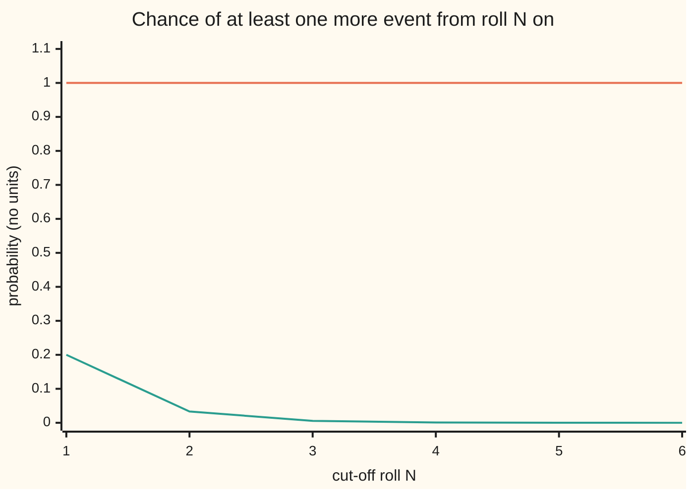

# The Borel-Cantelli lemmas: summable probabilities mean an event happens finitely often, and for independent events the converse holds

[Syllabus](../../../SYLLABUS.md) → [Measure and integration](../README.md) → [The Limit Theorems, Proved](../README.md#s10) → The Borel-Cantelli lemmas

---

## General Overview

A fair die is rolled once a second, forever. Two questions about the endless record.

First: does a six keep turning up? Every roll has chance 1/6 of a six, the same on roll 1 as on roll 1,000,000. Add the chances roll by roll and the total grows without limit.

Second: does a long run keep turning up? Say roll n "starts a run" when rolls n to 2n − 1 are all sixes: roll 1 a six, or rolls 2 and 3 both sixes, or rolls 3, 4 and 5 all sixes, and so on. Each start asks for one more six than the last. Its chance is 1/6, then 1/36, then 1/216. These chances add to 1/5, and never more.

A simulation of 20,000 records of 120 rolls sees 20.0104 sixes per record, and a run-start on a share 0.1912 of records, almost all at roll 1 or 2. That settles nothing. "Keeps turning up" is a claim about infinitely many rolls, and probability without measure cannot even name "infinitely many sixes" as one event with a chance.

Measure theory can. Sixes happen **infinitely often** with probability 1. Run-starts happen only finitely many times with probability 1. What decides it is whether the chances add up to a finite number. The two results that say so are the **Borel-Cantelli lemmas**, the name used from here on.

**If the chances of a list of events add up to a finite number, then with probability 1 only finitely many of the events happen; if the events are independent and their chances add up to infinity, then with probability 1 infinitely many happen.**

**What kind of fact this is:** two theorems and a corollary, proved on this card in Why it works, with every step in the Detailed proof; "infinitely often" is a definition.

### The picture: the chance of the event at roll N or later



Orange: a six at roll N or later, chance 1 for every N (within the 60 rolls after N, 1.0000 to four places). Green: the run-start chances from N on, summed, an upper bound on a run-start at N or later, shrinking sixfold per step. "Infinitely often" is what survives every cut-off, so its chance is where each line ends: 1 for sixes, 0 for run-starts.

---

## The formula

Notation first, in words. A probability space $(\Omega, \mathcal{F}, P)$ is a set of outcomes, the collection of sets we allow ourselves to measure, and a probability on them. Here one outcome $\omega$ is one endless record of rolls. The probability is the product law that makes the rolls independent fair dice ([Infinitely many coin tosses](../06-Product%20Measures%20and%20Fubini/07-infinite-sequences-and-kolmogorov-extension.md)). An event is a measurable set of outcomes: $A_n$ is "roll n is a six", $B_n$ is "rolls n to 2n − 1 are all sixes". $A_n^c$, the complement, is "$A_n$ does not happen".

**Infinitely often**, written i.o., is a new set built from the events: the outcomes that land in infinitely many of them. It is also called the **lim sup of the sets**, read "infinitely many of them happen".

$$\{A_n \text{ i.o.}\} \;=\; \limsup_{n\to\infty} A_n \;=\; \bigcap_{N=1}^{\infty}\ \bigcup_{n=N}^{\infty} A_n$$

**Read it aloud:** for every cut-off N, at least one of the events at N or later happens.

An outcome with a last six fails the test at the cut-off just past it.

**The first lemma**, for any events at all:

$$\sum_{n=1}^{\infty} P(A_n) < \infty \quad\Longrightarrow\quad P\big(\limsup_{n\to\infty} A_n\big) = 0$$

**Read it aloud:** if the chances add up to a finite number, the chance that infinitely many of the events happen is zero.

**The second lemma**, for independent events:

$$A_1, A_2, \dots \text{ independent and } \sum_{n=1}^{\infty} P(A_n) = \infty \quad\Longrightarrow\quad P\big(\limsup_{n\to\infty} A_n\big) = 1$$

**Read it aloud:** if the events are independent and their chances add up to infinity, then with probability 1 infinitely many happen.

The second lemma runs on one inequality about numbers:

$$1 - x \le e^{-x} \quad \text{for every real } x$$

**Read it aloud:** a chance of missing is at most e to the minus the chance of hitting.

**The corollary.** If $X_n$ converges to $X$ in probability, some subsequence $X_{n_k}$ converges to $X$ almost surely, that is, except on a set of probability zero.

| Symbol | Plain meaning | In our example | Push it up and the answer… |
| --- | --- | --- | --- |
| $\Omega$, $\mathcal{F}$, $P$, $\omega$ | outcomes, the sets we may measure, the probability; one outcome | endless roll records; the product law of fair dice; one record | — |
| $A_n$, $A_i$ | the n-th (or i-th) event of a list | roll n is a six, chance 1/6 | — |
| $B_n$ | the run-start event | rolls n to 2n − 1 all sixes, chance 6^(−n) | longer runs, smaller chances |
| $A_n^c$ | the complement: $A_n$ fails | roll n is not a six, chance 5/6 | — |
| $\limsup$, i.o. | the outcomes in infinitely many of the events | infinitely many sixes | — |
| $T_N$, $D_N$, $D_{N,K}$, $E_k$ | some event at N or later; no event at N or later; no event from N to K; the k-th subsequence miss | T_3: a run-start at roll 3 or later | a later N, a smaller $T_N$ |
| $\mathbf{1}_A$, $S$ | the indicator of A, one on A and zero off it; the count $S = \sum_n \mathbf{1}_{A_n}$ | the number of run-starts in a record, mean 0.2 | — |
| $n$, $N$, $K$, $m$ | roll numbers; a cut-off; a later roll; a stretch length | N = 3; m = 60 rolls | a later cut-off, a smaller tail |
| $x$ | a real number, here a chance in [0, 1] | 1/6 | the bound $e^{-x}$ falls |
| $f$ | the gap $e^{-x} - (1 - x)$ in Lemma 2 | zero at x = 0, positive elsewhere | — |
| $I$, $C$ | a finite set of indices; the overlap of the other events in it | I = {1, 2, 3}: rolls 1 to 3 all sixes, chance 1/216 | — |
| $X_n$, $X$ | random variables and a proposed limit | the share of sixes in the first n rolls; 1/6 | — |
| $\varepsilon$ | a tolerance | 0.05 | fewer misses |
| $j$ | a counter for the tolerances 1/j | j = 20: tolerance 0.05 | a finer tolerance |
| $K(\omega)$ | the index from which record ω has no more subsequence misses | — | — |
| $n_k$, $k$, $X_{n_k}$ | a subsequence of indices, its counter, and the variables along it | n_k = k^2: 1, 4, 9, …, 10000 | sparser, easier to sum |

### When it holds

- **One probability space, countably many measurable events.** Then the lim sup is itself an event, with a chance.
- **The first lemma needs nothing else.** No independence. It holds for any measure, not only probabilities: the run-starts overlap and depend on each other, and the lemma still applies.
- **The second lemma needs independence.** Drop it and a divergent sum proves nothing. Glue every event to "roll 1 is a six": the chances add to infinity, yet the chance of infinitely many is 1/6. Pairwise independence is enough, by a longer proof in Durrett's §2.3.
- **Summable means the full infinite sum is finite.** Chances that shrink to zero are not enough: the sum of 1/n shrinks term by term and still diverges.
- **The corollary gives a subsequence, not the whole sequence.** The typewriter sequence converges in probability and settles at no point ([Modes of convergence](../05-Swapping%20Limits%20and%20Integrals/04-modes-of-convergence.md)).

---

## Why it works

### Step 0: "infinitely often" is the end of a shrinking list of tails

Write $T_N$ for the event from N on, "some event at N or later happens". Moving the cut-off later can only remove candidates, so $T_1 \supseteq T_2 \supseteq T_3 \dots$ The lim sup is what all the tails share. Continuity from above ([Continuity and subadditivity](../01-Sets%20You%20Can%20Measure/05-continuity-of-measure.md)) says the chances of shrinking sets fall to the chance of what they share, when the first chance is finite, which a probability always is. So

$$P\big(\limsup_{n\to\infty} A_n\big) \;=\; \lim_{N\to\infty} P\Big(\bigcup_{n=N}^{\infty} A_n\Big)$$

Both lemmas are then statements about tail chances. The first shows they fall to 0. The second shows they stay at 1. The chart above shows the tail chance for sixes and an upper bound on it for run-starts.

### Step 1: the event is measurable, and its complement has a name

The tail $T_N$ is a countable union of events, and the lim sup a countable intersection of tails. The sets we may measure are closed under both, so the lim sup is an event.

Its complement is "eventually never": some cut-off after which none of the events happens.

$$\Big(\limsup_{n\to\infty} A_n\Big)^c \;=\; \bigcup_{N=1}^{\infty}\ \bigcap_{n=N}^{\infty} A_n^c$$

A record with its last six at roll 40 lies in the piece for N = 41. The second lemma works on this form.

### Step 2: the first lemma, a finite sum has tails that vanish

The chance of a union is at most the sum of the chances, even for countably many overlapping events. That is countable subadditivity. So

$$P\Big(\bigcup_{n=N}^{\infty} A_n\Big) \;\le\; \sum_{n=N}^{\infty} P(A_n)$$

The right side is the tail of a convergent series, which goes to 0. The lim sup sits inside every $T_N$, so its chance is at most every one of these numbers: zero.

On the die: the run-start chances from N = 3 on add to 1/216 + 1/1296 + … = 0.0056. From N = 6 on, 0.0000 to four places. The run-starts are not independent, since B_2 and B_3 both read roll 3. The argument never asked.

"Finitely often" is not "never". The chance of at least one run-start, ever, lies between 0.193667 and 0.193671, and the rest see none.

A second road counts. Let $S$ be the number of events that happen. Monotone convergence ([The monotone convergence theorem](../04-The%20Lebesgue%20Integral/03-monotone-convergence-theorem.md)) lets the mean pass through the infinite sum of indicators, so the mean count is the sum of the chances: 0.2 for run-starts, against 0.1981 simulated. A count with a finite mean is finite with probability 1.

### Step 3: the second lemma, independent misses multiply and the product dies

Fix a cut-off N. Missing every event from N to a later roll K is an intersection of complements. The complements of independent events are independent too, so its chance is a product:

$$P\Big(\bigcap_{n=N}^{K} A_n^c\Big) \;=\; \prod_{n=N}^{K} \big(1 - P(A_n)\big) \;\le\; \exp\Big(-\sum_{n=N}^{K} P(A_n)\Big)$$

The inequality is $1 - x \le e^{-x}$, used once per factor. The sum of the chances diverges, and throwing away the first N − 1 finite terms leaves it divergent. So as K grows, the right side goes to 0, and the chance of never hitting again after N is 0.

Every piece of "eventually never" is null, chance 0, and there are countably many pieces, one per N. A countable union of null sets is null, so "infinitely often" has chance 1.

On the die: 60 rolls in a row without a six has chance (5/6)^60 = 0.00001775, under the bound e^(−10) = 0.00004540, computed twice in the code.

<details>
<summary>Why 1 − x ≤ e^(−x)</summary>

The curve $y = e^{-x}$ bends upward everywhere: its slope $-e^{-x}$ is always increasing. A curve that bends upward lies above each of its tangent lines. Its tangent at 0 passes through (0, 1) with slope −1, and that line is $y = 1 - x$. Equality holds only at 0. The code checks four cases: 0.33489798 under 0.36787944 at m = 6, and three more.

</details>

### Step 4: together, a sharp test for independent events

For independent events the two lemmas cover every case: a finite sum gives chance 0, an infinite sum chance 1. That is no accident. "Infinitely many sixes" does not depend on any finite set of rolls, and for independent rolls every such event has chance 0 or 1: [Kolmogorov's zero-one law](02-kolmogorov-zero-one-law.md). Borel-Cantelli says which of the two.

### Step 5: from in probability to almost surely, along a subsequence

Converging **in probability** means that for every tolerance $\varepsilon$, the chance that $X_n$ is more than $\varepsilon$ from $X$ goes to 0. It says nothing about any one record. The first lemma buys a statement about records, at the price of a subsequence.

Pick indices $n_k$, rising, where the chance of missing by more than $2^{-k}$ at step $n_k$ is at most $2^{-k}$. These chances add up to at most 1. By the first lemma, only finitely many of those misses happen, with probability 1, so $X_{n_k}$ converges to $X$ on almost every record. The modes card proved this as Riesz's theorem; here it is the first lemma at work.

On the die, let $X_n$ be the share of sixes in the first n rolls. Chebyshev's inequality bounds the chance of missing 1/6 by more than 0.05 by 500/(9n). The weak law is this bound going to 0 ([The weak law of large numbers](03-weak-law-of-large-numbers.md)).

Summed over every n, the bounds diverge like the harmonic series: 543.7559 by n = 10000, and growing. The first lemma is silent. Summed over the squares, n = k^2, they converge: the part beyond k = K is at most 500/(9K), which is 0.5556 at K = 100 and 0.0556 at K = 1000. So along the squares, misses by more than 0.05 happen only finitely often, with probability 1. Doing this for the tolerances 1, 1/2, 1/3, …, countably many, gives $X_{k^2} \to 1/6$ almost surely. On the simulated record the misses stop at k = 12; to k = 100 there are none after it.

Summable bounds along a sparse subsequence, then filling the gaps, is the shape of Etemadi's proof on [The strong law of large numbers](04-strong-law-of-large-numbers.md), with geometric checkpoints in place of the squares. Its main proof makes the bounds summable over every n with a fourth moment.

<details>
<summary>Detailed proof</summary>

Throughout, $(\Omega, \mathcal{F}, P)$ is a probability space and $A_1, A_2, \dots$ are events in $\mathcal{F}$. Put $T_N = \bigcup_{n \ge N} A_n$.

**Lemma 0 (what the lim sup is).** $\omega \in \bigcap_N T_N$ exactly when $\omega$ lies in infinitely many $A_n$. If it lies in only finitely many, take N past the largest such n; then $\omega \notin T_N$. If it lies in infinitely many, then for every N one of them has index at least N, so $\omega \in T_N$. Each $T_N$ is a countable union of events and $\bigcap_N T_N$ a countable intersection, so the lim sup lies in $\mathcal{F}$. By De Morgan's laws (the complement of a union is the intersection of the complements, and the other way round) its complement is $\bigcup_N \bigcap_{n \ge N} A_n^c$.

**Theorem 1 (first lemma).** Suppose $\sum_n P(A_n) < \infty$. For each N, $\limsup A_n \subseteq T_N$, so by monotonicity and countable subadditivity $P(\limsup A_n) \le P(T_N) \le \sum_{n \ge N} P(A_n)$. The tails of a convergent series of non-negative terms tend to 0, so $P(\limsup A_n) = 0$. Only monotonicity and subadditivity were used, so the same proof works for any measure in place of $P$.

**Lemma 2 (the inequality).** Let $f(x) = e^{-x} - (1 - x)$. Then $f(0) = 0$ and $f'(x) = 1 - e^{-x}$, which is negative for $x < 0$ and positive for $x > 0$. So f falls to its value at 0 and rises after it: f is never negative, that is, $1 - x \le e^{-x}$.

**Lemma 3 (complements stay independent).** Events are independent when for every finite set I of indices, $P(\bigcap_{i \in I} A_i) = \prod_{i \in I} P(A_i)$. Replace one event $A_i$ in the list by its complement, and let C be the intersection of the others. Then $P(A_i^c \cap C) = P(C) - P(A_i \cap C) = P(C)\,(1 - P(A_i))$, and P(C) is itself a product, so the product rule holds again. Repeating this one index at a time replaces any number of events by complements. Equivalently, the sigma-algebras $\{\emptyset, A_n, A_n^c, \Omega\}$ are independent ([Independence as a product](../06-Product%20Measures%20and%20Fubini/04-independence-as-a-product-measure.md)).

**Theorem 4 (second lemma).** Suppose the $A_n$ are independent and $\sum_n P(A_n) = \infty$. Fix N and put $D_{N,K} = \bigcap_{n=N}^{K} A_n^c$ for $K \ge N$. By Lemma 3, $P(D_{N,K}) = \prod_{n=N}^{K} (1 - P(A_n))$. Each factor lies in [0, 1] and by Lemma 2 is at most $e^{-P(A_n)}$; multiplying inequalities between non-negative numbers keeps them, so $P(D_{N,K}) \le \exp(-\sum_{n=N}^{K} P(A_n))$. The first N − 1 terms of the series add to at most N − 1, so $\sum_{n=N}^{K} P(A_n) \to \infty$ as $K \to \infty$ and the bound tends to 0. The set $D_N = \bigcap_{n \ge N} A_n^c$ lies inside every $D_{N,K}$, so $P(D_N) = 0$. By Lemma 0 the complement of the lim sup is $\bigcup_N D_N$, whose chance is at most $\sum_N P(D_N) = 0$ by countable subadditivity. Hence $P(\limsup A_n) = 1$.

**Theorem 5 (a test for almost sure convergence).** Let $X_n$, $X$ be random variables. The set where $X_n(\omega) \not\to X(\omega)$ is $\bigcup_{j \ge 1} \{|X_n - X| > 1/j \text{ i.o.}\}$: failing to converge means some tolerance 1/j is exceeded at infinitely many n. So $X_n \to X$ almost surely exactly when $P(|X_n - X| > \varepsilon \text{ i.o.}) = 0$ for every $\varepsilon > 0$. In particular, if $\sum_n P(|X_n - X| > \varepsilon) < \infty$ for every $\varepsilon > 0$, Theorem 1 gives almost sure convergence.

**Corollary 6 (a subsequence converges almost surely).** Suppose $P(|X_n - X| > \varepsilon) \to 0$ for every $\varepsilon > 0$. Choose rising indices, each $n_k$ past the one before, with $P(|X_{n_k} - X| > 2^{-k}) \le 2^{-k}$; each choice exists because the chances tend to 0. Let $E_k = \{|X_{n_k} - X| > 2^{-k}\}$. Then $\sum_k P(E_k) \le 1$, so by Theorem 1 almost every $\omega$ lies in only finitely many $E_k$. For such $\omega$ there is $K(\omega)$ with $|X_{n_k}(\omega) - X(\omega)| \le 2^{-k}$ for all $k \ge K(\omega)$, so $X_{n_k}(\omega) \to X(\omega)$.

**The die.** Under the product law the $A_n$ are independent with $P(A_n) = 1/6$, so Theorem 4 gives infinitely many sixes. $P(B_n) = 6^{-n}$, since n named rolls must all be sixes, and these add to 1/5, so Theorem 1 gives finitely many run-starts, though the $B_n$ are not independent. The share of sixes has variance $5/(36n)$, so Chebyshev bounds its miss chance by $5/(36 n \varepsilon^2)$; along $n = k^2$ this is summable for every $\varepsilon$, and Theorem 5 gives $X_{k^2} \to 1/6$ almost surely.

</details>

A second road to the second lemma needs only pairwise independence: the count of events up to n, divided by the sum of their chances, tends to 1, by Chebyshev along a subsequence and the first lemma (Durrett, §2.3).

---

## Worked numbers, by hand

| Step | Arithmetic | Value |
| --- | --- | --- |
| chance of a six, any roll | one face of six | 1/6 |
| chances of sixes, summed | 1/6 + 1/6 + … | no limit |
| run-start chances | 6^(−1), 6^(−2), 6^(−3) | 1/6, 1/36, 1/216 |
| their sum | (1/6) / (1 − 1/6) | **1/5** |
| run-start at roll 1 or 2 | 1/6 + 1/36 − 1/216, the overlap is rolls 1 to 3 all sixes | 41/216 = 0.189815 |
| run-start ever | listed to m = 6, plus at most 6^(−6)/5 | 0.193667 to 0.193671 |
| union bound from N = 3 | 6^(−2)/5 | 0.0056 |
| no six in 60 rolls | (5/6)^60 | 0.00001775 |
| the bound it must sit under | e^(−60/6) | 0.00004540 |
| sixes infinitely often | sum infinite, independent | **chance 1** |
| run-starts infinitely often | sum 1/5, finite | **chance 0** |

Almost every record sees six after six forever; almost every record sees its last run-start early, and most never see one.

### What breaks if you drop a piece

| Mistake | Comes out at | What went wrong |
| --- | --- | --- |
| Independence dropped from the second lemma: every event is "roll 1 is a six" | chances add to infinity, yet P(i.o.) = 1/6; simulated 0.1660 | the events are one event copied; a miss on roll 1 is a miss forever |
| Summable read as "never" | a run-start happens with chance about 0.19367; simulated 0.1912 | finitely often allows one, or two, or a hundred |
| First lemma applied to the whole sequence of share-of-sixes bounds | bounds sum to 543.7559 by n = 10000, and diverge | the lemma needs a finite sum; only the squares give one, 90.8324 by k = 100 with tail at most 0.5556 |
| Chebyshev read as the true miss chance | bound 0.555556 at n = 100, exact 0.177903 | a bound is not an equality; the lemma only needs the bound to be summable |

The code prints all four.

---

## Code, from first principles, and it actually runs

The code checks finite stages; that sixes come infinitely often and run-starts do not rests on the proofs. It takes three roads. Exact chances are found by listing every six/not-six pattern of the first rolls, up to 2^11 = 2048 patterns, and again by inclusion-exclusion (add the single chances, subtract the overlaps of pairs, add back those of triples, and so on) or a closed form. The second lemma's bound is checked against an exponential written twice, as a Taylor series and by repeated squaring. A SplitMix64 generator, written out in both languages with seed 20260929, simulates 20,000 records of 120 rolls and one record of 10,000. The mean count of sixes, the share with a run-start and the share with roll 1 a six are asserted within four standard errors of their exact values, and the share with a run-start at n ≥ 3 below its bound plus four standard errors; the other simulated figures are printed, not asserted. The Rust does the exact work in integer fractions over powers of 6.

### Python

```python
# The Borel-Cantelli lemmas -- the check behind the card.  Standard library
# only.  A fair die rolled forever.  A_n: roll n is a six.  B_n: rolls n to
# 2n-1 are all sixes, so roll n starts a run of n sixes.  Each number is
# reached by two roads: exact listing or algebra, and a second formula or a
# seeded simulation.  Finite stages only; the infinite claims rest on proofs.
from fractions import Fraction as Q

SIX = Q(1, 6)

def prob(L, event):                     # exact P(event), listing every six/not-six
    total = Q(0)                        # pattern of rolls 1..L; bit i-1 set: roll i a six
    for mask in range(1 << L):
        if event(mask):
            k = bin(mask).count("1")
            total += SIX ** k * (1 - SIX) ** (L - k)
    return total

def B(mask, n):                         # rolls n to 2n-1 all sixes
    return all(mask >> (i - 1) & 1 for i in range(n, 2 * n))

def incl_excl(m):                       # P(B_1 or ... or B_m), inclusion-exclusion:
    total = Q(0)                        # an overlap of B's needs every roll they name
    for S in range(1, 1 << m):
        rolls = {i for n in range(1, m + 1) if S >> (n - 1) & 1 for i in range(n, 2 * n)}
        total += (-1) ** (bin(S).count("1") + 1) * SIX ** len(rolls)
    return total

def exp_series(x):                      # e^x by its Taylor series
    term, s, k = 1.0, 1.0, 0
    while term > 1e-18 * s:
        k += 1
        term *= x / k
        s += term
    return s

def exp_squaring(x):                    # e^x as (1 + x/2^20)^(2^20)
    y = 1.0 + x / 2 ** 20
    for _ in range(20):
        y *= y
    return y

print("lemma 1, B_n: n, P(B_n) listed, 6^-n, sum of P(B_k) to n, closed form (1 - 6^-n)/5")
partial = Q(0)
for n in range(1, 7):
    listed = prob(2 * n - 1, lambda mask: B(mask, n))
    partial += SIX ** n
    closed = (1 - SIX ** n) / 5
    assert listed == SIX ** n           # listing against the formula
    assert partial == closed            # term by term against the closed form
    print(f"n={n} {listed} {SIX ** n} {float(partial):.6f} {float(closed):.6f}")
print("sum over all n of P(B_n) = (1/6)/(1 - 1/6) =", SIX / (1 - SIX))
unions = [prob(2 * m - 1, lambda mask: any(B(mask, n) for n in range(1, m + 1))) for m in range(1, 7)]
ie = [incl_excl(m) for m in range(1, 7)]
assert unions == ie                     # two roads to every union
print("P(B_1 or ... or B_m), m=1..6, listed:  ", " ".join(f"{float(u):.6f}" for u in unions))
print("same, by inclusion-exclusion:          ", " ".join(f"{float(u):.6f}" for u in ie))
lo, hi = unions[5], unions[5] + SIX ** 6 / 5
print(f"m=2 exactly {unions[1]}; some B_n ever: between {float(lo):.6f} and {float(hi):.6f}")
tails = [SIX ** (N - 1) / 5 for N in range(1, 7)]
tails_f = [sum(6.0 ** -n for n in range(N, N + 60)) for N in range(1, 7)]
assert all(abs(float(t) - f) < 1e-12 for t, f in zip(tails, tails_f))
print("union bound on P(some B_n with n >= N), N=1..6:", " ".join(f"{float(t):.4f}" for t in tails))
print("chance of some A_n with n >= N, N=1..6, within 60 rolls:", " ".join(f"{1 - (5 / 6) ** 60:.4f}" for N in range(1, 7)))

print("lemma 2, no six in m rolls in a row: exact (5/6)^m <= bound e^(-m/6)")
for m in (6, 12, 30, 60):
    exact, bound = float((1 - SIX) ** m), 1 / exp_series(m / 6)
    assert exact < bound
    print(f"m={m:3d}: {exact:.8f} <= {bound:.8f}")
e10 = (1 / exp_series(10.0), 1 / exp_squaring(10.0))
assert abs(e10[0] / e10[1] - 1) < 1e-4
print(f"e^(-10) by series {e10[0]:.8f}, by squaring {e10[1]:.8f}")

MASK, state = (1 << 64) - 1, 20260929
def roll():                             # SplitMix64, then a face 1..6
    global state
    state = (state + 0x9E3779B97F4A7C15) & MASK
    z = ((state ^ (state >> 30)) * 0xBF58476D1CE4E5B9) & MASK
    z = ((z ^ (z >> 27)) * 0x94D049BB133111EB) & MASK
    return (z ^ (z >> 31)) % 6 + 1

M, R = 20000, 120
sixes = late = runs = any_run = late_run = glued = 0
for _ in range(M):
    r = [False] + [roll() == 6 for _ in range(R)]      # r[i]: roll i is a six
    sixes += sum(r)
    late += any(r[61:])
    starts = [n for n in range(1, 61) if all(r[n:2 * n])]
    runs += len(starts)
    any_run += bool(starts)
    late_run += any(n >= 3 for n in starts)
    glued += r[1]
print(f"simulation, {M} paths of {R} rolls, SplitMix64 seed 20260929:")
print(f"mean sixes per path {sixes / M:.4f}, exact 20")
print(f"share with a six in rolls 61 to 120 {late / M:.5f}, exact {1 - (5 / 6) ** 60:.5f}")
print(f"mean run-starts B_n per path, n <= 60: {runs / M:.4f}, exact {float(1 - SIX ** 60) / 5:.4f}")
print(f"share with at least one run-start {any_run / M:.4f}, exact {float(lo):.4f}")
print(f"share with a run-start at n >= 3 {late_run / M:.4f}, at most {float(tails[2]):.4f}")
print(f"share with roll 1 a six, the glued events happening infinitely often {glued / M:.4f}, exact {float(SIX):.4f}")
se = lambda p: 4 * (p * (1 - p) / M) ** 0.5
assert abs(sixes / M - 20) < 4 * (120 * 5 / 36 / M) ** 0.5
assert abs(any_run / M - float(lo)) < se(float(lo)) and abs(glued / M - 1 / 6) < se(1 / 6)
assert late_run / M < float(tails[2]) + se(float(tails[2]))

print("subsequence, X_n = share of sixes in the first n rolls, tolerance 0.05:")
for n in (100, 400, 900, 1600):
    pmf, tail = (5 / 6) ** n, 0.0
    for j in range(n + 1):
        if 20 * abs(6 * j - n) > 6 * n:
            tail += pmf
        pmf *= (n - j) / (j + 1) / 5
    assert tail <= 500 / (9 * n)        # exact binomial tail under Chebyshev
    print(f"n={n:4d}: Chebyshev bound 500/(9n) = {500 / (9 * n):.6f}, exact binomial {tail:.6f}")
all_n = sum(500 / (9 * n) for n in range(1, 10001))
squares = sum(500 / (9 * k * k) for k in range(1, 101))
print(f"sum of the bounds over all n <= 10000: {all_n:.4f}; over n = k^2, k <= 100: {squares:.4f}")
print(f"bound on the sum over k > K of 500/(9k^2), 500/(9K): K=100 {500 / 900:.4f}, K=1000 {500 / 9000:.4f}")
count, miss, xs = 0, [], {}
for k in range(1, 101):
    while count < k * k:
        count += 1
        xs[count] = xs.get(count - 1, 0) + (roll() == 6)
    if 20 * abs(6 * xs[k * k] - k * k) > 6 * k * k:
        miss.append(k)
print("one path of 10000 rolls: X_n at n = 100, 900, 2500, 10000:",
      " ".join(f"{xs[n] / n:.4f}" for n in (100, 900, 2500, 10000)))
print("k <= 100 with |X_(k^2) - 1/6| > 0.05:", " ".join(map(str, miss)), f"({len(miss)} of 100)")
print("ALL CHECKS PASS")
```

**Ran 2026-09-29 on macOS, Python 3.14.6, standard library only. All checks passed. Output, pasted from the run:**

```
lemma 1, B_n: n, P(B_n) listed, 6^-n, sum of P(B_k) to n, closed form (1 - 6^-n)/5
n=1 1/6 1/6 0.166667 0.166667
n=2 1/36 1/36 0.194444 0.194444
n=3 1/216 1/216 0.199074 0.199074
n=4 1/1296 1/1296 0.199846 0.199846
n=5 1/7776 1/7776 0.199974 0.199974
n=6 1/46656 1/46656 0.199996 0.199996
sum over all n of P(B_n) = (1/6)/(1 - 1/6) = 1/5
P(B_1 or ... or B_m), m=1..6, listed:   0.166667 0.189815 0.193030 0.193566 0.193652 0.193667
same, by inclusion-exclusion:           0.166667 0.189815 0.193030 0.193566 0.193652 0.193667
m=2 exactly 41/216; some B_n ever: between 0.193667 and 0.193671
union bound on P(some B_n with n >= N), N=1..6: 0.2000 0.0333 0.0056 0.0009 0.0002 0.0000
chance of some A_n with n >= N, N=1..6, within 60 rolls: 1.0000 1.0000 1.0000 1.0000 1.0000 1.0000
lemma 2, no six in m rolls in a row: exact (5/6)^m <= bound e^(-m/6)
m=  6: 0.33489798 <= 0.36787944
m= 12: 0.11215665 <= 0.13533528
m= 30: 0.00421272 <= 0.00673795
m= 60: 0.00001775 <= 0.00004540
e^(-10) by series 0.00004540, by squaring 0.00004540
simulation, 20000 paths of 120 rolls, SplitMix64 seed 20260929:
mean sixes per path 20.0104, exact 20
share with a six in rolls 61 to 120 0.99995, exact 0.99998
mean run-starts B_n per path, n <= 60: 0.1981, exact 0.2000
share with at least one run-start 0.1912, exact 0.1937
share with a run-start at n >= 3 0.0053, at most 0.0056
share with roll 1 a six, the glued events happening infinitely often 0.1660, exact 0.1667
subsequence, X_n = share of sixes in the first n rolls, tolerance 0.05:
n= 100: Chebyshev bound 500/(9n) = 0.555556, exact binomial 0.177903
n= 400: Chebyshev bound 500/(9n) = 0.138889, exact binomial 0.007342
n= 900: Chebyshev bound 500/(9n) = 0.061728, exact binomial 0.000052
n=1600: Chebyshev bound 500/(9n) = 0.034722, exact binomial 0.000000
sum of the bounds over all n <= 10000: 543.7559; over n = k^2, k <= 100: 90.8324
bound on the sum over k > K of 500/(9k^2), 500/(9K): K=100 0.5556, K=1000 0.0556
one path of 10000 rolls: X_n at n = 100, 900, 2500, 10000: 0.0900 0.1689 0.1716 0.1739
k <= 100 with |X_(k^2) - 1/6| > 0.05: 1 2 3 4 5 9 10 12 (8 of 100)
ALL CHECKS PASS
```

### Rust

```rust
// The Borel-Cantelli lemmas -- the check behind the card.  Rust std only.
// A fair die rolled forever.  A_n: roll n is a six.  B_n: rolls n to 2n-1 are
// all sixes, so roll n starts a run of n sixes.  Exact chances are integer
// fractions over 6^L, written by hand.  Finite stages only; the infinite claims
// rest on the proofs.
fn gcd(a: u128, b: u128) -> u128 { if b == 0 { a } else { gcd(b, a % b) } }
fn frac(n: u128, d: u128) -> String { let g = gcd(n, d); format!("{}/{}", n / g, d / g) }
fn p6(k: u32) -> u128 { 6u128.pow(k) }
fn b(mask: u32, n: u32) -> bool { (n..2 * n).all(|i| mask >> (i - 1) & 1 == 1) }
// exact P(event) as numerator over 6^L, listing every six/not-six pattern of rolls 1..L
fn prob(l: u32, event: &dyn Fn(u32) -> bool) -> u128 {
    let mut num = 0u128;
    for mask in 0..(1u32 << l) {
        if event(mask) { num += 5u128.pow(l - mask.count_ones()); }
    }
    num
}
// P(B_1 or ... or B_m) by inclusion-exclusion, numerator over 6^(2m-1)
fn incl_excl(m: u32) -> i128 {
    let l = 2 * m - 1;
    let mut num = 0i128;
    for s in 1u32..(1 << m) {
        let mut rolls = 0u32;
        for n in 1..=m { if s >> (n - 1) & 1 == 1 { for i in n..2 * n { rolls |= 1 << (i - 1); } } }
        let term = p6(l - rolls.count_ones()) as i128;
        num += if s.count_ones() % 2 == 1 { term } else { -term };
    }
    num
}
fn exp_series(x: f64) -> f64 {
    let (mut term, mut s, mut k) = (1.0f64, 1.0f64, 0.0f64);
    while term > 1e-18 * s { k += 1.0; term *= x / k; s += term; }
    s
}
fn exp_squaring(x: f64) -> f64 {
    let mut y = 1.0 + x / 2f64.powi(20);
    for _ in 0..20 { y *= y; }
    y
}
struct Rng(u64);
impl Rng {
    fn roll(&mut self) -> u64 { // SplitMix64, then a face 1..6
        self.0 = self.0.wrapping_add(0x9E3779B97F4A7C15);
        let mut z = (self.0 ^ (self.0 >> 30)).wrapping_mul(0xBF58476D1CE4E5B9);
        z = (z ^ (z >> 27)).wrapping_mul(0x94D049BB133111EB);
        (z ^ (z >> 31)) % 6 + 1
    }
}
fn main() {
    println!("lemma 1, B_n: n, P(B_n) listed, 6^-n, sum of P(B_k) to n, closed form (1 - 6^-n)/5");
    for n in 1..=6u32 {
        let l = 2 * n - 1;
        let listed = prob(l, &|mask| b(mask, n));
        let partial: u128 = (1..=n).map(|k| p6(n - k)).sum(); // over 6^n
        let closed = (p6(n) - 1) / 5; // (1 - 6^-n)/5 over 6^n: 6^n - 1 is a multiple of 5
        assert!(listed * p6(n) == p6(l)); // listing against the formula
        assert!(partial * 5 == p6(n) - 1); // term by term against the closed form
        let (pf, cf) = (partial as f64 / p6(n) as f64, closed as f64 / p6(n) as f64);
        println!("n={} {} {} {:.6} {:.6}", n, frac(listed, p6(l)), frac(1, p6(n)), pf, cf);
    }
    println!("sum over all n of P(B_n) = (1/6)/(1 - 1/6) = {}", frac(p6(1), p6(1) * (p6(1) - p6(0))));
    let mut unions = Vec::new();
    let mut ie = Vec::new();
    for m in 1..=6u32 {
        let l = 2 * m - 1;
        let u = prob(l, &|mask| (1..=m).any(|n| b(mask, n)));
        let v = incl_excl(m);
        assert!(u as i128 == v); // two roads to every union
        unions.push(u as f64 / p6(l) as f64);
        ie.push(v as f64 / p6(l) as f64);
    }
    let show = |v: &Vec<f64>| v.iter().map(|x| format!("{:.6}", x)).collect::<Vec<_>>().join(" ");
    println!("P(B_1 or ... or B_m), m=1..6, listed:   {}", show(&unions));
    println!("same, by inclusion-exclusion:           {}", show(&ie));
    let u2 = prob(3, &|mask| b(mask, 1) || b(mask, 2));
    let u6 = prob(11, &|mask| (1..=6).any(|n| b(mask, n)));
    let lo = u6 as f64 / p6(11) as f64;
    let hi = (u6 * 5 + p6(5)) as f64 / (5 * p6(11)) as f64; // plus 6^-6/5
    println!("m=2 exactly {}; some B_n ever: between {:.6} and {:.6}", frac(u2, p6(3)), lo, hi);
    let tails: Vec<f64> = (1..=6u32).map(|n| 1.0 / (5 * p6(n - 1)) as f64).collect();
    for n in 1..=6i32 {
        let f: f64 = (n..n + 60).map(|k| 6f64.powi(-k)).sum();
        assert!((tails[(n - 1) as usize] - f).abs() < 1e-12);
    }
    let ts: Vec<String> = tails.iter().map(|t| format!("{:.4}", t)).collect();
    println!("union bound on P(some B_n with n >= N), N=1..6: {}", ts.join(" "));
    let win: Vec<String> = (1..=6).map(|_| format!("{:.4}", 1.0 - (5.0f64 / 6.0).powi(60))).collect();
    println!("chance of some A_n with n >= N, N=1..6, within 60 rolls: {}", win.join(" "));

    println!("lemma 2, no six in m rolls in a row: exact (5/6)^m <= bound e^(-m/6)");
    for m in [6u32, 12, 30, 60] {
        let exact = (5.0f64 / 6.0).powi(m as i32);
        let bound = 1.0 / exp_series(m as f64 / 6.0);
        assert!(exact < bound);
        println!("m={:3}: {:.8} <= {:.8}", m, exact, bound);
    }
    let e10 = (1.0 / exp_series(10.0), 1.0 / exp_squaring(10.0));
    assert!((e10.0 / e10.1 - 1.0).abs() < 1e-4);
    println!("e^(-10) by series {:.8}, by squaring {:.8}", e10.0, e10.1);

    let mut rng = Rng(20260929);
    let (m_paths, r_len) = (20000usize, 120usize);
    let (mut sixes, mut late, mut runs, mut any_run, mut late_run, mut glued) = (0usize, 0, 0, 0, 0, 0);
    for _ in 0..m_paths {
        let mut r = vec![false; r_len + 1]; // r[i]: roll i is a six
        for i in 1..=r_len { r[i] = rng.roll() == 6; }
        sixes += r.iter().filter(|&&x| x).count();
        if r[61..].iter().any(|&x| x) { late += 1; }
        let starts: Vec<usize> = (1..=60).filter(|&n| r[n..2 * n].iter().all(|&x| x)).collect();
        runs += starts.len();
        if !starts.is_empty() { any_run += 1; }
        if starts.iter().any(|&n| n >= 3) { late_run += 1; }
        if r[1] { glued += 1; }
    }
    let mf = m_paths as f64;
    println!("simulation, {} paths of {} rolls, SplitMix64 seed 20260929:", m_paths, r_len);
    println!("mean sixes per path {:.4}, exact 20", sixes as f64 / mf);
    println!("share with a six in rolls 61 to 120 {:.5}, exact {:.5}", late as f64 / mf, 1.0 - (5.0f64 / 6.0).powi(60));
    println!("mean run-starts B_n per path, n <= 60: {:.4}, exact {:.4}", runs as f64 / mf, (1.0 - 6f64.powi(-60)) / 5.0);
    println!("share with at least one run-start {:.4}, exact {:.4}", any_run as f64 / mf, lo);
    println!("share with a run-start at n >= 3 {:.4}, at most {:.4}", late_run as f64 / mf, tails[2]);
    println!("share with roll 1 a six, the glued events happening infinitely often {:.4}, exact {:.4}", glued as f64 / mf, 1.0 / 6.0);
    let se = |p: f64| 4.0 * (p * (1.0 - p) / mf).sqrt();
    assert!((sixes as f64 / mf - 20.0).abs() < 4.0 * (120.0 * 5.0 / 36.0 / mf).sqrt());
    assert!((any_run as f64 / mf - lo).abs() < se(lo) && (glued as f64 / mf - 1.0 / 6.0).abs() < se(1.0 / 6.0));
    assert!((late_run as f64 / mf) < tails[2] + se(tails[2]));

    println!("subsequence, X_n = share of sixes in the first n rolls, tolerance 0.05:");
    for n in [100i64, 400, 900, 1600] {
        let (mut pmf, mut tail) = ((5.0f64 / 6.0).powf(n as f64), 0.0f64);
        for j in 0..=n {
            if 20 * (6 * j - n).abs() > 6 * n { tail += pmf; }
            pmf *= (n - j) as f64 / (j + 1) as f64 / 5.0;
        }
        let bound = 500.0 / (9.0 * n as f64);
        assert!(tail <= bound); // exact binomial tail under Chebyshev
        println!("n={:4}: Chebyshev bound 500/(9n) = {:.6}, exact binomial {:.6}", n, bound, tail);
    }
    let all_n: f64 = (1..=10000).map(|n| 500.0 / (9.0 * n as f64)).sum();
    let squares: f64 = (1..=100).map(|k| 500.0 / (9.0 * (k * k) as f64)).sum();
    println!("sum of the bounds over all n <= 10000: {:.4}; over n = k^2, k <= 100: {:.4}", all_n, squares);
    println!("bound on the sum over k > K of 500/(9k^2), 500/(9K): K=100 {:.4}, K=1000 {:.4}", 500.0 / 900.0, 500.0 / 9000.0);
    let mut xs = vec![0i64; 10001];
    let mut miss = Vec::new();
    for n in 1..=10000usize { xs[n] = xs[n - 1] + if rng.roll() == 6 { 1 } else { 0 }; }
    for k in 1..=100i64 {
        let n = k * k;
        if 20 * (6 * xs[n as usize] - n).abs() > 6 * n { miss.push(k.to_string()); }
    }
    let xv: Vec<String> = [100usize, 900, 2500, 10000].iter().map(|&n| format!("{:.4}", xs[n] as f64 / n as f64)).collect();
    println!("one path of 10000 rolls: X_n at n = 100, 900, 2500, 10000: {}", xv.join(" "));
    println!("k <= 100 with |X_(k^2) - 1/6| > 0.05: {} ({} of 100)", miss.join(" "), miss.len());
    println!("ALL CHECKS PASS");
}
```

**Ran 2026-09-29 on macOS, rustc 1.98.1, no crates. All checks passed. Output, pasted from the run:**

```
lemma 1, B_n: n, P(B_n) listed, 6^-n, sum of P(B_k) to n, closed form (1 - 6^-n)/5
n=1 1/6 1/6 0.166667 0.166667
n=2 1/36 1/36 0.194444 0.194444
n=3 1/216 1/216 0.199074 0.199074
n=4 1/1296 1/1296 0.199846 0.199846
n=5 1/7776 1/7776 0.199974 0.199974
n=6 1/46656 1/46656 0.199996 0.199996
sum over all n of P(B_n) = (1/6)/(1 - 1/6) = 1/5
P(B_1 or ... or B_m), m=1..6, listed:   0.166667 0.189815 0.193030 0.193566 0.193652 0.193667
same, by inclusion-exclusion:           0.166667 0.189815 0.193030 0.193566 0.193652 0.193667
m=2 exactly 41/216; some B_n ever: between 0.193667 and 0.193671
union bound on P(some B_n with n >= N), N=1..6: 0.2000 0.0333 0.0056 0.0009 0.0002 0.0000
chance of some A_n with n >= N, N=1..6, within 60 rolls: 1.0000 1.0000 1.0000 1.0000 1.0000 1.0000
lemma 2, no six in m rolls in a row: exact (5/6)^m <= bound e^(-m/6)
m=  6: 0.33489798 <= 0.36787944
m= 12: 0.11215665 <= 0.13533528
m= 30: 0.00421272 <= 0.00673795
m= 60: 0.00001775 <= 0.00004540
e^(-10) by series 0.00004540, by squaring 0.00004540
simulation, 20000 paths of 120 rolls, SplitMix64 seed 20260929:
mean sixes per path 20.0104, exact 20
share with a six in rolls 61 to 120 0.99995, exact 0.99998
mean run-starts B_n per path, n <= 60: 0.1981, exact 0.2000
share with at least one run-start 0.1912, exact 0.1937
share with a run-start at n >= 3 0.0053, at most 0.0056
share with roll 1 a six, the glued events happening infinitely often 0.1660, exact 0.1667
subsequence, X_n = share of sixes in the first n rolls, tolerance 0.05:
n= 100: Chebyshev bound 500/(9n) = 0.555556, exact binomial 0.177903
n= 400: Chebyshev bound 500/(9n) = 0.138889, exact binomial 0.007342
n= 900: Chebyshev bound 500/(9n) = 0.061728, exact binomial 0.000052
n=1600: Chebyshev bound 500/(9n) = 0.034722, exact binomial 0.000000
sum of the bounds over all n <= 10000: 543.7559; over n = k^2, k <= 100: 90.8324
bound on the sum over k > K of 500/(9k^2), 500/(9K): K=100 0.5556, K=1000 0.0556
one path of 10000 rolls: X_n at n = 100, 900, 2500, 10000: 0.0900 0.1689 0.1716 0.1739
k <= 100 with |X_(k^2) - 1/6| > 0.05: 1 2 3 4 5 9 10 12 (8 of 100)
ALL CHECKS PASS
```

The two outputs match line for line.

> [!TIP]
> **Try changing**
> Guess first, then run it.
> - **Tighten less.** In the loop over k, change `20 * abs` to `10 * abs`, a tolerance of 0.1 (the printed label still says 0.05). Guess how many squares miss. Five: k = 1 to 5, and none after.
> - **Another seed.** Set the seed to 7. The glued share moves to 0.1651 and the run-start share to 0.1929; every assert still holds, since four standard errors on a share near 1/6 is about 0.0105.
> - **Fixed-length runs.** In `B`, change `range(n, 2 * n)` to `range(n, n + 2)`, so every start asks for two sixes. The first assert stops it at n = 1: the listing covers roll 1 only, so it finds 0 against 1/6. At odd n these events use separate rolls, so the second lemma says they happen infinitely often.

---

## The usual mistake

> [!warning]
> **Running the second lemma without independence.** A divergent sum of chances proves nothing on its own. Copy one event onto every index, "roll 1 is a six" each time: the chances add to infinity and the chance of infinitely many is 1/6, not 1.
>
> - **Adding independence to the first lemma.** It needs none. The run-starts overlap and it still applies.
> - **Reading chances that shrink to 0 as finitely often.** The chances must add to a finite number. The typewriter's lit strip has a chance shrinking to 0 and lights every point infinitely often ([Modes of convergence](../05-Swapping%20Limits%20and%20Integrals/04-modes-of-convergence.md)).
> - **Reading finitely often as never.** A run-start happens with chance about 0.19367.
> - **Reading "infinitely often" as "at least once".** At least once looks at one union; infinitely often looks at the union after every cut-off.

---

## Where you meet it in real life

- **The strong law of large numbers.** Every standard proof passes through the first lemma: miss chances that add up, over every n under a fourth moment, or along sparse checkpoints with the gaps filled ([The strong law of large numbers](04-strong-law-of-large-numbers.md)). The practical law in [Law of large numbers](../../09-Probability%20and%20statistics/06-Limit%20Theorems%20in%20Practice/01-law-of-large-numbers.md) checks it by simulation.
- **Normal numbers.** Borel's 1909 paper, where the first lemma began, showed that almost every number in [0, 1] has each decimal digit with long-run share one tenth.
- **Repeated checks of a system.** Summable failure bounds mean finitely many failures, and the sum from N on bounds any failure after N.
- **Patterns in random text.** A fixed word typed by random keys: disjoint blocks of keys are independent with a fixed chance each, so the word appears infinitely often.

> **Say it back**
> "Infinitely often" means in some event after every cut-off; its chance is the limit of the tail chances. If the chances add up to a finite number, the tails of the sum go to zero, so only finitely many events happen, with or without independence. If the events are independent and the chances add to infinity, the chance of missing all of them from any cut-off is a product that dies, so infinitely many happen. A die gives six after six forever, and a run of n sixes starting at roll n only finitely often. Applied to miss chances along a sparse subsequence, the first lemma turns convergence in probability into convergence almost surely.

---

## What this builds on

- [Continuity and subadditivity](../01-Sets%20You%20Can%20Measure/05-continuity-of-measure.md): subadditivity for the first lemma, continuity from above for the tail picture.
- [Independence as a product](../06-Product%20Measures%20and%20Fubini/04-independence-as-a-product-measure.md): independence as the product rule, and why complements inherit it.
- [Modes of convergence](../05-Swapping%20Limits%20and%20Integrals/04-modes-of-convergence.md): convergence in probability and almost surely, and the typewriter that separates them.

## Where this goes next

- [Kolmogorov's zero-one law](02-kolmogorov-zero-one-law.md): why "infinitely often" for independent events could only ever have chance 0 or 1.
- [The strong law of large numbers](04-strong-law-of-large-numbers.md): the first lemma applied to the averages themselves, with miss chances summable over every n under a fourth moment, and Etemadi's sparse checkpoints with the gaps filled for any finite mean.
- [Martingale convergence](../../11-Stochastic%20processes%20and%20calculus/02-Martingales/04-martingale-convergence.md): the counting road of Step 2, where a finite average number of upcrossings means finitely many upcrossings, with probability 1.

The lemmas decide "infinitely often" only when the sum is finite or the events are independent; why, for independent events, no answer other than 0 or 1 was ever possible is [Kolmogorov's zero-one law](02-kolmogorov-zero-one-law.md).

---

## Sources

Verified 29 Sep 2026: every link below resolves to the publisher's or author's page.

- Borel, Émile. "Les probabilités dénombrables et leurs applications arithmétiques." *Rendiconti del Circolo Matematico di Palermo* 27 (1909): 247–271. [doi:10.1007/BF03019651](https://doi.org/10.1007/BF03019651). The first lemma in its original form, used to prove that almost every number is normal.
- Durrett, Rick. *Probability: Theory and Examples*, 5th ed. [Author's PDF](https://sites.math.duke.edu/~rtd/PTE/PTE5_011119.pdf). Section 2.3, "Borel-Cantelli Lemmas": both lemmas, the pairwise version, and the subsequence criterion.
- Billingsley, Patrick. *Probability and Measure*, Anniversary ed. Wiley, 2012. [Publisher page](https://www.wiley.com/en-us/probability-and-measure-anniversary-edition-p-9781118122372). Section 4 proves both lemmas on the space of infinite sequences.
- Williams, David. *Probability with Martingales*. Cambridge University Press, 1991. [Publisher page](https://www.cambridge.org/core/books/probability-with-martingales/B4CFCE0D08930FB46C6E93E775503926). Chapters 2 and 4 prove the first and second lemmas; section 12.15 gives Lévy's conditional version through martingales.
