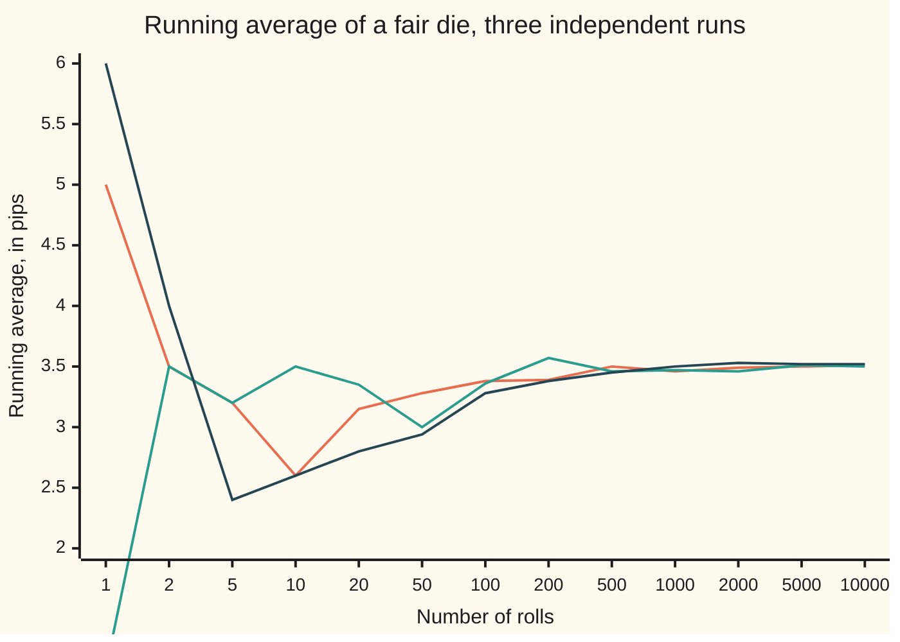
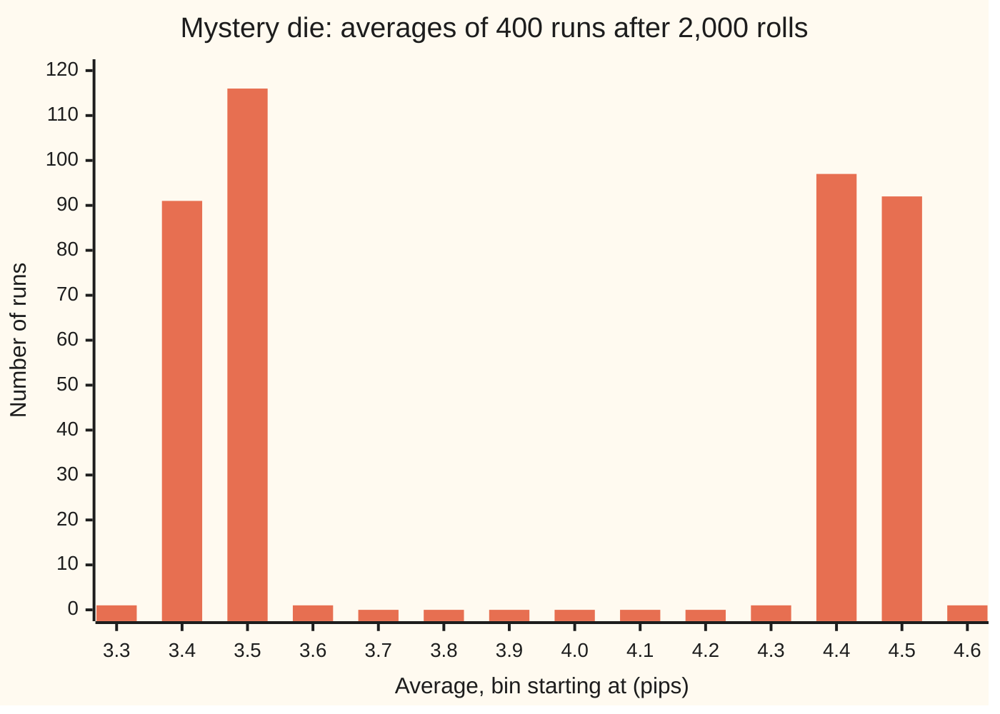

# Kolmogorov's zero-one law: an event decided by the far future of an independent sequence has probability 0 or 1

[Syllabus](../../../SYLLABUS.md) → [Measure and integration](../README.md) → [The Limit Theorems, Proved](../README.md#s10) → Kolmogorov's zero-one law

---

## General Overview

A fair die is rolled again and again, for ever. After each roll the running average is the total so far divided by the number of rolls. One simulated run opens with a 5, so its average starts at 5.00; it reads 2.60 after 10 rolls and 3.38 after 100. After 10,000 rolls three simulated runs sit at 3.51, 3.50 and 3.52.

Three questions can be asked about the whole endless run. Does the running average settle down to a limit? Do sixes keep appearing for ever? Does the total end up above 3.4 times the number of rolls and stay there? No finite stretch of rolls answers the first two. Rewrite the first thousand rolls in any way and their answers do not change. The sixes after roll 1,000 are where they were. The rewrite shifts every later total by one fixed amount, and divided by a number of rolls that grows without end, that shift fades to nothing. The third looks alike but is subtler: one changed roll can switch it, as The formula shows, and a small repair makes it behave.

Andrey Kolmogorov proved in 1933 that such a question can only have probability 0 or probability 1, provided the rolls are independent. Nothing in between: never 0.3, never one half. A consequence follows at once. If the running average has a limit, that limit is a single fixed number, the same for almost every run. It cannot be 3.4 on some runs and 3.6 on others. The strong law of large numbers later names the number, 3.5; this card shows it has to be a constant before anyone knows which.

**For an independent sequence, an event that no change to finitely many terms can switch on or off has probability 0 or 1, so any limit read off the far end of the sequence is a constant.**

**What kind of fact this is:** a theorem, proved on this card in Why it works; the tail sigma-algebra it speaks about is a definition.

### The picture: three runs of the die, one limit



Orange is run 1, green run 2, dark blue run 3, all from the check scripts' generator. The horizontal axis is spaced by position, not to scale. The runs start at 5, 1 and 6 and differ wildly for fifty rolls; by 10,000 rolls the standard deviation across 400 runs is 0.016202, close to the 0.017078 the variance predicts. The zero-one law is why the lines have to meet at one height rather than fan out to several.

---

## The formula

Notation first, in words. The rolls live on one probability space $(\Omega, \mathcal{F}, P)$: $\Omega$ is the set of whole infinite roll sequences, $\mathcal{F}$ the events we allow ourselves to measure, $P$ the probability, built in [Infinitely many coin tosses](../06-Product%20Measures%20and%20Fubini/07-infinite-sequences-and-kolmogorov-extension.md). $X_n$ is the n-th roll. $S_n = X_1 + \dots + X_n$ is the total after n rolls and $\bar X_n = S_n / n$ the running average. $\sigma(\dots)$, read "the sigma-algebra generated by", is the smallest sigma-algebra holding every event the listed rolls can decide.

Two families of events carry the card. $\mathcal{F}_n = \sigma(X_1, \dots, X_n)$ is everything the first n rolls decide. $\mathcal{T}_n = \sigma(X_{n+1}, X_{n+2}, \dots)$ is everything the rolls after the n-th decide. The **tail sigma-algebra** keeps what every such late family holds:

$$\mathcal{T} = \bigcap_{n=1}^{\infty} \mathcal{T}_n = \bigcap_{n=1}^{\infty} \sigma(X_{n+1}, X_{n+2}, \dots)$$

**Read it aloud:** a tail event is one that can be decided from the rolls after the first, and from the rolls after the second, and from the rolls after any first n, for every n.

Its members are **tail events**. An overlap of sigma-algebras is again a sigma-algebra, since each closure rule holds in every one of them. A working test, on the space of whole roll sequences: a measurable event is in $\mathcal{T}_n$ exactly when changing rolls 1 to n never moves a sequence into it or out of it. It is a tail event when that holds for every n.

**Kolmogorov's zero-one law.** If $X_1, X_2, \dots$ are independent, then

$$A \in \mathcal{T} \implies P(A) = 0 \text{ or } P(A) = 1.$$

**Read it aloud:** under independence, an event decided by the far future is either almost sure or almost impossible.

**The constant-limit corollary.** If $Y$ is a random quantity, possibly infinite, that the tail decides (every event $\{Y \le t\}$ is a tail event), then there is one value $c$, possibly $+\infty$ or $-\infty$, with

$$P(Y = c) = 1.$$

**Read it aloud:** anything the far future alone decides is a constant, except on a set of probability zero.

A definition deserves a case that meets it and one that fails. "Sixes appear infinitely often" meets it: rewriting any first n rolls leaves infinitely many sixes where they were. "The first roll is a six" fails it: change roll 1 and the answer flips. Its probability is 1/6, and the law says no tail event can have that.

The three events of the opening, tested:

- **The running average converges.** Changing the first n rolls shifts every later total by a fixed amount $D$ with $\lvert D \rvert \le 5n$, and $D$ divided by the number of rolls tends to 0. Convergence, and the limit, survive. Tail.
- **Sixes appear infinitely often.** Tail, as above.
- **The total ends up above 3.4n and stays there.** Read literally, this fails the test. The run "6, then 4, 3, 4, 3, 3 repeated" has its total between 2.6 and 3.4 above 3.4n at every roll. Change the first roll to 1 and the total sits between 1.6 and 2.4 below 3.4n at every roll. The tail version is "the total minus 3.4n grows without bound": a changed start shifts that difference by a fixed $D$, which cannot stop it growing. The two versions differ only on runs whose average does not tend to 3.5, a set of probability zero by [The strong law of large numbers](04-strong-law-of-large-numbers.md).

| Symbol | Plain meaning | In our example | Push it up and the answer… |
| --- | --- | --- | --- |
| $\Omega$, $\mathcal{F}$, $P$ | whole roll sequences, the measurable events, the probability | endless runs of a fair die | — |
| $X_n$, $X_i$, $n$, $m$ | the n-th (or i-th) roll; positions n and m | run 1 opens with a 5 | — |
| $S_n$, $S_m$ | the total after n (or m) rolls | mean 3.5n, standard deviation 17.08 at n = 100 | — |
| $\bar X_n$ | the running average, $S_n / n$ | 3.51 after 10,000 rolls of run 1 | its spread shrinks like one over the square root of n |
| $\mathcal{F}_n$ | what the first n rolls decide | "roll 1 is a six" is in $\mathcal{F}_1$ | a bigger n decides more |
| $\mathcal{T}_n$ | what the rolls after the n-th decide | "a six somewhere after roll n" | a bigger n decides less |
| $\mathcal{T}$ | the tail sigma-algebra, the overlap of all $\mathcal{T}_n$ | "sixes infinitely often" | — |
| $\mathcal{F}_\infty$, $\mathcal{T}_0$ | what the whole sequence decides, $\sigma(X_1, X_2, \dots)$; the same family, as the rolls after the 0-th | every event about the run | — |
| $\sigma(\cdot)$ | the sigma-algebra generated by the listed rolls or sets: the smallest one holding all they decide | $\sigma(X_1)$ holds "roll 1 is a six" | — |
| $\mathcal{U}$ | all the $\mathcal{F}_n$ put into one family | every event that some first stretch of rolls decides | — |
| $A$, $E$ | events | A a tail event | — |
| $C_i$, $B_j$, $C_1$, $C_n$, $B_1$, $B_k$ | Borel sets that roll i, or roll n + j, must land in | $C_1$ = "a six" | — |
| $Y$, $c$, $t$, $F$ | a tail-decided quantity, its constant value, a threshold, its distribution function | lim sup of the average; c = 3.5 | — |
| $D$ | the fixed shift in every later total from changed early rolls | at most 5n in size | — |
| $\mathcal{P}$, $\mathcal{Q}$ | pi-systems: families closed under overlap | events fixing the first rolls; events fixing a later block | — |

### When it holds

- **Independence.** A mystery die breaks it: a coin picks a fair die or a die loaded towards six, once, and that die is rolled for ever. The rolls are no longer independent, since early sixes hint at which die is in play. The limit of the average is 3.5 or 4.5, and "the limit is above 4" is a tail event of probability 0.5.
- **A genuine tail event, not merely a long-run one.** "The total ends up above 3.4n and stays there" is about the long run, yet one changed roll switches it. Only the finite-change test decides membership.
- **The law says 0 or 1, never which.** Deciding that sixes appear infinitely often with probability 1 takes [The Borel-Cantelli lemmas](01-borel-cantelli-lemmas.md); deciding that the average converges takes [The strong law of large numbers](04-strong-law-of-large-numbers.md).
- **The terms need not share a law.** Rolls of different dice, or any independent random variables at all, will do. Identical laws are not used anywhere in the proof.

---

## Why it works

### Step 0: a tail event is independent of itself

Any fixed start of the sequence, the first n rolls, is independent of what comes after it. A tail event is decided by what comes after every start, so it is independent of every start. The starts, taken together, decide everything about the sequence, including the tail event itself. So a tail event A is independent of A. Then $P(A) = P(A \cap A) = P(A) \times P(A)$, and the only numbers equal to their own square are 0 and 1.

Making "independent of every start, so independent of everything" exact needs the pi-system test of [Independence as a product](../06-Product%20Measures%20and%20Fubini/04-independence-as-a-product-measure.md): if two pi-systems multiply member by member, the sigma-algebras they generate are independent.

### Step 1: the first n rolls are independent of the rolls after them

Fix n. The events "roll 1 lands in $C_1$, …, roll n lands in $C_n$" form a pi-system $\mathcal{P}$ generating $\mathcal{F}_n$. The events "roll n + 1 lands in $B_1$, …, roll n + k lands in $B_k$", over every length k, form a pi-system $\mathcal{Q}$ generating $\mathcal{T}_n$: two of them overlap in another, once the shorter is padded with "lands anywhere". One member of each multiplies, because independence of the n + k rolls splits the joint chance into n + k factors, and the two groups of factors are the two chances. The test then makes $\mathcal{F}_n$ and $\mathcal{T}_n$ independent.

### Step 2: the tail is independent of every start

$\mathcal{T}$ lies inside $\mathcal{T}_n$, so every event of $\mathcal{F}_n$ multiplies with every tail event.

### Step 3: the starts together generate everything

Put all the $\mathcal{F}_n$ into one family. The families grow, so an event of $\mathcal{F}_2$ and one of $\mathcal{F}_5$ both lie in $\mathcal{F}_5$, and so does their overlap: a pi-system. By Step 2 each of its members multiplies with each tail event. The tail sigma-algebra is itself a pi-system. The pi-system test makes the sigma-algebra the starts generate, $\mathcal{F}_\infty = \sigma(X_1, X_2, \dots)$, independent of $\mathcal{T}$.

The family of starts is not itself a sigma-algebra. "Sixes infinitely often" is in none of the $\mathcal{F}_n$. That is why the test, which passes from a pi-system to what it generates, is needed.

### Step 4: independent of itself, so 0 or 1

Every tail event lies in $\mathcal{T}_0 = \sigma(X_1, X_2, \dots) = \mathcal{F}_\infty$. So a tail event A is in both of two independent families, and may be paired with itself: $P(A) = P(A)^2$, so $P(A)$ is 0 or 1.

### Step 5: a tail-decided quantity is a constant

Let $Y$ be decided by the tail. Its distribution function $t \mapsto P(Y \le t)$ takes only the values 0 and 1, and it never decreases. So it is 0 up to some point $c$ and 1 beyond it. Continuity of probability along shrinking and growing events pins $Y$ to $c$.

The running average's upper limit $\limsup \bar X_n$ is such a $Y$. For any m, the first m rolls add at most 6m to every total, and 6m/n tends to 0, so the upper limit equals the upper limit of $(X_{m+1} + \dots + X_n)/n$, which the rolls after m decide. The lower limit is the same. Both are constants, and the event that they agree, "the average converges", has probability 0 or 1. If 1, the limit is one constant.

### Step 6: reading it back on the die

**Sixes infinitely often.** The law gives 0 or 1. Which? The chance of no six in m given rolls is $(5/6)^m$: 0.161506 for m = 10, 0.00000001207467 for m = 100. So "no six after roll n" has probability 0 for each n, and a countable union of null sets is null. Sixes appear infinitely often with probability 1; [The Borel-Cantelli lemmas](01-borel-cantelli-lemmas.md) turns this argument into a lemma.

**The average converges.** Probability 0 or 1, and a constant limit if 1. The exact chance that the total is at or below 3.4n falls from 0.407926 at 25 rolls to 0.289259 at 100 and 0.123794 at 400. Among 400 simulated runs, the share dipping to 3.4n or below somewhere from roll 1000 to roll 10,000 is 0.0600. Which of 0 and 1 applies, and that the constant is 3.5, is [The strong law of large numbers](04-strong-law-of-large-numbers.md).

**The total minus 3.4n grows without bound.** Probability 0 or 1; once the average tends to 3.5, the difference grows at least like a fixed fraction of n, so by the strong law it is 1.

<details>
<summary>Detailed proof</summary>

**Setting.** $(\Omega, \mathcal{F}, P)$ a probability space; $X_1, X_2, \dots$ independent random variables on it, each measurable for $\mathcal{F}$ and the Borel sets; $\mathcal{F}_n = \sigma(X_1, \dots, X_n)$, $\mathcal{T}_n = \sigma(X_{n+1}, X_{n+2}, \dots)$ for $n \ge 0$, $\mathcal{T} = \bigcap_{n \ge 1} \mathcal{T}_n$, $\mathcal{F}_\infty = \mathcal{T}_0$. Independence of the sequence means every finite subfamily of $\sigma(X_1), \sigma(X_2), \dots$ multiplies ([Independence as a product](../06-Product%20Measures%20and%20Fubini/04-independence-as-a-product-measure.md)).

**0. $\mathcal{T}$ is a sigma-algebra.** Each $\mathcal{T}_n$ contains $\Omega$ and is closed under complements and countable unions; a set in every $\mathcal{T}_n$ therefore has its complement in every $\mathcal{T}_n$, and so on.

**1. $\mathcal{F}_n$ and $\mathcal{T}_n$ are independent.** Let $\mathcal{P}$ be the events $\{X_1 \in C_1, \dots, X_n \in C_n\}$ with $C_i$ Borel, and $\mathcal{Q}$ the events $\{X_{n+1} \in B_1, \dots, X_{n+k} \in B_k\}$ with $k \ge 1$ and $B_j$ Borel. Both are pi-systems: intersect coordinate by coordinate, padding the shorter event of $\mathcal{Q}$ with $B_j = \mathbb{R}$. $\mathcal{P}$ contains each $\{X_i \in C\}$, $i \le n$, and lies in $\mathcal{F}_n$, so $\sigma(\mathcal{P}) = \mathcal{F}_n$; likewise $\sigma(\mathcal{Q}) = \mathcal{T}_n$. For $A \in \mathcal{P}$ and $E \in \mathcal{Q}$, independence of $X_1, \dots, X_{n+k}$ gives
$$P(A \cap E) = \prod_{i=1}^{n} P(X_i \in C_i) \prod_{j=1}^{k} P(X_{n+j} \in B_j) = P(A)\,P(E),$$
the last step by independence of each group on its own. The pi-system test gives $\mathcal{F}_n$ independent of $\mathcal{T}_n$.

**2. $\mathcal{F}_n$ and $\mathcal{T}$ are independent**, since $\mathcal{T} \subseteq \mathcal{T}_n$.

**3. $\mathcal{F}_\infty$ and $\mathcal{T}$ are independent.** Let $\mathcal{U} = \bigcup_n \mathcal{F}_n$. For $A \in \mathcal{F}_m$ and $E \in \mathcal{F}_n$ with $m \le n$, both lie in $\mathcal{F}_n$ because $\mathcal{F}_m \subseteq \mathcal{F}_n$, so $A \cap E \in \mathcal{F}_n \subseteq \mathcal{U}$: $\mathcal{U}$ is a pi-system. By 2, each member of $\mathcal{U}$ multiplies with each member of $\mathcal{T}$, and $\mathcal{T}$ is a pi-system by 0. The pi-system test gives $\sigma(\mathcal{U})$ independent of $\mathcal{T}$. Finally $\sigma(\mathcal{U}) = \mathcal{F}_\infty$: each $\sigma(X_i) \subseteq \mathcal{F}_i \subseteq \mathcal{U}$ gives one inclusion, each $\mathcal{F}_n \subseteq \mathcal{F}_\infty$ the other.

**4. The law.** $\mathcal{T} \subseteq \mathcal{T}_0 = \mathcal{F}_\infty$. For $A \in \mathcal{T}$, take $A$ from $\mathcal{F}_\infty$ and $A$ from $\mathcal{T}$ in 3: $P(A) = P(A \cap A) = P(A)^2$, so $P(A)(1 - P(A)) = 0$.

**5. The corollary.** Let $Y$ take values in $[-\infty, \infty]$ with $\{Y \le t\} \in \mathcal{T}$ for every real $t$. By 4, $F(t) = P(Y \le t)$ is 0 or 1, and $F$ never decreases. Let $c = \inf\{t : F(t) = 1\}$, with $\inf \emptyset = +\infty$. If $c$ is finite: $\{Y \le c - 1/k\}$ grows to $\{Y < c\}$, each with probability 0, so $P(Y < c) = 0$ by continuity from below; $\{Y \le c + 1/k\}$ shrinks to $\{Y \le c\}$, each with probability 1, so $P(Y \le c) = 1$ by continuity from above ([Continuity and subadditivity](../01-Sets%20You%20Can%20Measure/05-continuity-of-measure.md)). Hence $P(Y = c) = 1$. If $c = +\infty$, every $F(t)$ is 0 and $\{Y < \infty\} = \bigcup_k \{Y \le k\}$ is null. If $c = -\infty$, every $F(t)$ is 1 and $\{Y = -\infty\} = \bigcap_k \{Y \le -k\}$ has probability 1.

**6. The running average.** Fix $m$. For $n > m$, $\bar X_n = S_m/n + (X_{m+1} + \dots + X_n)/n$ and $S_m/n \to 0$ at every point of $\Omega$, since $S_m$ is finite. So $\limsup \bar X_n = \limsup (X_{m+1} + \dots + X_n)/n$, an upper limit of $\mathcal{T}_m$-measurable functions, hence $\mathcal{T}_m$-measurable ([Sums, products, sups and limits](../03-Measurable%20Functions/02-limits-of-measurable-functions.md)). As $m$ was arbitrary, it is $\mathcal{T}$-measurable; so is $\liminf \bar X_n$, and so is the event that they are equal and finite. By 5 each is a constant almost surely.

</details>

**What the code shows, and what only the proof shows.** The code computes finite-n chances exactly and simulates 400 runs of 10,000 rolls: it shows the numbers heading towards 0 or 1 and the spread of the averages shrinking at the rate the variance predicts. That a tail event can have no other probability, for every independent sequence, only the proof shows.

A second route approximates: a tail event is within any small probability of some event of some $\mathcal{F}_n$, is independent of it, and in the limit $P(A) = P(A)^2$ again. For events that survive every reshuffling of finitely many terms, rather than every change, the Hewitt-Savage zero-one law gives the same conclusion for independent, identically distributed terms.

---

## Worked numbers, by hand

| Step | Arithmetic | Value |
| --- | --- | --- |
| mean and variance of one roll | (1 + … + 6)/6; (1 + 4 + … + 36)/6 − 3.5^2 | 3.5 and 35/12 = 2.916667 |
| spread of the total, 100 rolls | square root of 100 × 35/12 | 17.08 |
| spread of the average, 100 rolls | square root of 35/12/100 | 0.170783 |
| spread of the average, 10,000 rolls | square root of 35/12/10,000 | 0.017078 |
| no six in 10 given rolls | (5/6)^10 = 9765625/60466176 | 0.161506 |
| no six in 100 given rolls | (5/6)^100 | 0.00000001207467 |
| no six ever after roll n | below (5/6)^m for every m | **0** |
| sixes infinitely often | complement is a countable union of null sets | **1** |

Rolled for ever, a fair die shows sixes infinitely often with probability 1, and its running average can have only one limit, a constant whose value the strong law supplies.

### What breaks if you drop a piece

| Mistake | Comes out at | What went wrong |
| --- | --- | --- |
| Mystery die: fair or loaded, chosen once, then rolled for ever | "limit above 4" has probability 0.5; simulated 0.4775 | rolls not independent; the limit is 3.5 or 4.5 |
| "The first roll is a six" | 1/6 = 0.166667; simulated 0.1725 | decided by one roll, so not a tail event |
| "The total ends up above 3.4n and stays there", read literally | 2.6 to 3.4 above on the run 6, 4, 3, 4, 3, 3, …; 1.6 to 2.4 below once roll 1 is a 1 | one changed roll switches it: long-run, not tail |

The loaded die shows a six with chance 0.5 and each other face with chance 0.1, so its mean is 0.1 × 15 + 0.5 × 6 = 9/2 = 4.5. Among 400 mystery-die runs of 2,000 rolls, 0.4775 end with average above 4.0, and 0 end with average from 3.7 to 4.3:



Each bar counts the runs whose average falls in a bin 0.1 wide. Two clusters, not one spike: the far future has a random limit, because the sequence is not independent.

---

## Code, from first principles, and it actually runs

The code takes two roads. The first is exact: the mean and variance of one roll in fractions, $(5/6)^m$ as a fraction, and the exact law of the total after n rolls, built one roll at a time by spreading each probability over six outcomes. The second is a simulation of 400 independent runs of 10,000 rolls from a SplitMix64 generator written out in both languages, seeded 20260929, so Python and Rust print the same runs. The asserts compare the simulated spread of the averages with the variance formula, simulated chances of "total at or below 3.4n" and of "no six in the last 10 rolls" with their exact values, and the mystery die with its exact 0.5, its upper cluster at the loaded mean 4.5, and its empty middle. The mean and variance of one roll are asserted equal to 7/2 and 35/12. The last two check that one changed roll switches the literal 3.4n event for ever: the run repeats every five rolls, so one period settles it.

### Python

```python
# Kolmogorov's zero-one law -- the check behind the card.  Standard library only.
# A fair die rolled forever.  No code reaches infinity, so the check takes two
# roads to finite-n numbers whose trend the proof then settles: exact arithmetic
# (fractions, and the exact law of the total by convolution), and a simulation of
# independent paths from a SplitMix64 generator written out here.
from fractions import Fraction as Fr
from math import sqrt

MASK = (1 << 64) - 1

class Gen:                                    # SplitMix64, seeded
    def __init__(self, seed):
        self.s = seed
    def next(self):
        self.s = (self.s + 0x9E3779B97F4A7C15) & MASK
        z = self.s
        z = ((z ^ (z >> 30)) * 0xBF58476D1CE4E5B9) & MASK
        z = ((z ^ (z >> 27)) * 0x94D049BB133111EB) & MASK
        return z ^ (z >> 31)
    def below(self, k):                       # 0 .. k-1: the high word of next * k
        return (self.next() * k) >> 64

def fair(g):
    return g.below(6) + 1

def loaded(g):                                # a six with chance 0.5, faces 1 to 5 with 0.1 each
    r = g.below(10)
    return r + 1 if r < 5 else 6

def law_of_total(n_max, keep):                # exact law of the total, one roll at a time, in floats
    dist, out = [1.0], {}
    for n in range(1, n_max + 1):
        new = [0.0] * (len(dist) + 6)
        for t, p in enumerate(dist):
            for f in range(1, 7):
                new[t + f] += p / 6.0
        dist = new
        if n in keep:
            out[n] = sum(dist[:34 * n // 10 + 1])        # P(total <= 3.4n)
    return out

PATHS, N = 400, 10000
CHECK = [1, 2, 5, 10, 20, 50, 100, 200, 500, 1000, 2000, 5000, 10000]
g = Gen(20260929)
tot_at = {n: [] for n in (100, 400, 10000)}
lines, dips, far, no_six_10, no_six_100, first_six = [], [0, 0, 0], [0.0, 0.0], 0, 0, 0
for path in range(PATHS):
    s, last_six, line, dipped, worst = 0, 0, [], [False] * 3, [0.0, 0.0]
    for n in range(1, N + 1):
        x = fair(g)
        s += x
        if x == 6:
            last_six = n
            first_six += n == 1
        a = s / n
        if n in tot_at: tot_at[n].append(s)
        if n in CHECK: line.append(a)
        for i, n0 in enumerate((10, 100, 1000)):
            if n >= n0 and 10 * s <= 34 * n: dipped[i] = True
        for i, n0 in enumerate((100, 1000)):
            if n >= n0: worst[i] = max(worst[i], abs(a - 3.5))
    if path < 3: lines.append(line)
    dips = [d + b for d, b in zip(dips, dipped)]
    far = [max(f, w) for f, w in zip(far, worst)]
    no_six_10 += last_six <= N - 10
    no_six_100 += last_six <= N - 100

mean = sum(Fr(f, 6) for f in range(1, 7))
var = sum(Fr(f * f, 6) for f in range(1, 7)) - mean ** 2
assert mean == Fr(7, 2) and var == Fr(35, 12)
print(f"house example: mean {float(mean)}, variance {var} = {float(var):.6f}; "
      f"sd of the total after 100 rolls {sqrt(100 * var):.2f}")
for i, line in enumerate(lines):
    print(f"path {i + 1} running average at n = {CHECK}:")
    print("  " + ", ".join(f"{a:.2f}" for a in line))
print(f"largest distance of any of {PATHS} averages from 3.5, rolls 100 to {N}: {far[0]:.4f}; "
      f"rolls 1000 to {N}: {far[1]:.4f}")
for n in (100, 10000):
    avgs = [s / n for s in tot_at[n]]
    m = sum(avgs) / PATHS
    sd = sqrt(sum((a - m) ** 2 for a in avgs) / (PATHS - 1))
    print(f"spread of the {PATHS} averages at n = {n}: sd {sd:.6f}; sqrt(35/12/n) = {sqrt(35 / 12 / n):.6f}")
    assert abs(sd / sqrt(35 / 12 / n) - 1) < 0.15            # the limit is not random
exact = law_of_total(400, (25, 100, 400))
print(f"P(total <= 3.4n) at n = 25: exact {exact[25]:.6f}")
for n in (100, 400):
    sim = sum(10 * s <= 34 * n for s in tot_at[n]) / PATHS
    print(f"P(total <= 3.4n) at n = {n}: exact {exact[n]:.6f}; simulated {sim:.4f}")
    assert abs(sim - exact[n]) < 4 * sqrt(exact[n] * (1 - exact[n]) / PATHS)
print(f"share of paths whose total is at or below 3.4n somewhere in rolls 10, 100, 1000 to {N}: "
      + ", ".join(f"{d / PATHS:.4f}" for d in dips))
p10, p100 = Fr(5, 6) ** 10, Fr(5, 6) ** 100
print(f"P(no six in 10 given rolls) = (5/6)^10 = {p10.numerator}/{p10.denominator} = {float(p10):.6f}")
print(f"P(no six in 100 given rolls) = (5/6)^100 = {float(p100):.14f}")
print(f"simulated: no six in rolls {N - 9} to {N}: {no_six_10 / PATHS:.4f}; "
      f"no six in rolls {N - 99} to {N}: {no_six_100} of {PATHS} paths")
assert abs(no_six_10 / PATHS - float(p10)) < 4 * sqrt(float(p10) * (1 - float(p10)) / PATHS)
print(f"not a tail event, first roll a six: exact {float(Fr(1, 6)):.6f}; simulated {first_six / PATHS:.4f}")

g = Gen(7)                                    # the mystery die: which die is fixed once, then rolled forever
M, bins, above, hi = 2000, [0] * 14, 0, []
for path in range(PATHS):
    roll = loaded if g.next() >> 63 else fair
    s = sum(roll(g) for _ in range(M))
    a = s / M
    above += a > 4.0
    if a > 4.0: hi.append(a)
    b = int((a - 3.3) * 10) if a >= 3.3 else -1
    if 0 <= b < 14: bins[b] += 1
print(f"mystery die, loaded mean 0.1 x (1+2+3+4+5) + 0.5 x 6 = {Fr(1, 10) * 15 + Fr(1, 2) * 6}")
print(f"mystery die, {PATHS} paths of {M} rolls: share with average above 4.0 = {above / PATHS:.4f}; exact 0.5")
print(f"mystery die, mean of the averages above 4.0: {sum(hi) / len(hi):.4f}; loaded mean 4.5")
assert abs(sum(hi) / len(hi) - 4.5) < 0.015            # the upper cluster sits at the loaded mean
print("mystery die, averages in bins of 0.1 from 3.3 to 4.7: " + ", ".join(str(c) for c in bins))
assert abs(above / PATHS - 0.5) < 4 * sqrt(0.25 / PATHS)     # a tail event at 0.5
print(f"mystery die, runs ending with average from 3.7 to 4.3: {sum(bins[4:10])}")
assert sum(bins[4:10]) == 0                   # none in the middle: two clusters

def ten_s_minus_34n(first, reps):             # 10 x (total - 3.4n), in whole numbers, along a path
    path, out, s = [first] + [4, 3, 4, 3, 3] * reps, [], 0
    for n, x in enumerate(path, 1):
        s += x
        out.append(10 * s - 34 * n)
    return out
a, b = ten_s_minus_34n(6, 20), ten_s_minus_34n(1, 20)
print(f"path 6 then (4,3,4,3,3) repeated: total - 3.4n over 101 rolls runs from {min(a) / 10} to {max(a) / 10}")
print(f"same path, first roll 1:          total - 3.4n over 101 rolls runs from {min(b) / 10} to {max(b) / 10}")
assert a[-5:] == a[1:6] and b[-5:] == b[1:6]  # the pattern repeats, so the range holds for ever
assert min(a) > 0 > max(b)                    # one changed roll moves the path out of the event
print("ALL CHECKS PASS")
```

**Ran 2026-09-29 on macOS, Python 3.14.6, standard library only. All checks passed. Output, pasted from the run:**

```
house example: mean 3.5, variance 35/12 = 2.916667; sd of the total after 100 rolls 17.08
path 1 running average at n = [1, 2, 5, 10, 20, 50, 100, 200, 500, 1000, 2000, 5000, 10000]:
  5.00, 3.50, 3.20, 2.60, 3.15, 3.28, 3.38, 3.39, 3.50, 3.46, 3.49, 3.50, 3.51
path 2 running average at n = [1, 2, 5, 10, 20, 50, 100, 200, 500, 1000, 2000, 5000, 10000]:
  1.00, 3.50, 3.20, 3.50, 3.35, 3.00, 3.36, 3.57, 3.46, 3.47, 3.46, 3.51, 3.50
path 3 running average at n = [1, 2, 5, 10, 20, 50, 100, 200, 500, 1000, 2000, 5000, 10000]:
  6.00, 4.00, 2.40, 2.60, 2.80, 2.94, 3.28, 3.38, 3.45, 3.50, 3.53, 3.52, 3.52
largest distance of any of 400 averages from 3.5, rolls 100 to 10000: 0.6165; rolls 1000 to 10000: 0.1750
spread of the 400 averages at n = 100: sd 0.166912; sqrt(35/12/n) = 0.170783
spread of the 400 averages at n = 10000: sd 0.016202; sqrt(35/12/n) = 0.017078
P(total <= 3.4n) at n = 25: exact 0.407926
P(total <= 3.4n) at n = 100: exact 0.289259; simulated 0.2900
P(total <= 3.4n) at n = 400: exact 0.123794; simulated 0.1400
share of paths whose total is at or below 3.4n somewhere in rolls 10, 100, 1000 to 10000: 0.8575, 0.5600, 0.0600
P(no six in 10 given rolls) = (5/6)^10 = 9765625/60466176 = 0.161506
P(no six in 100 given rolls) = (5/6)^100 = 0.00000001207467
simulated: no six in rolls 9991 to 10000: 0.1900; no six in rolls 9901 to 10000: 0 of 400 paths
not a tail event, first roll a six: exact 0.166667; simulated 0.1725
mystery die, loaded mean 0.1 x (1+2+3+4+5) + 0.5 x 6 = 9/2
mystery die, 400 paths of 2000 rolls: share with average above 4.0 = 0.4775; exact 0.5
mystery die, mean of the averages above 4.0: 4.4976; loaded mean 4.5
mystery die, averages in bins of 0.1 from 3.3 to 4.7: 1, 91, 116, 1, 0, 0, 0, 0, 0, 0, 1, 97, 92, 1
mystery die, runs ending with average from 3.7 to 4.3: 0
path 6 then (4,3,4,3,3) repeated: total - 3.4n over 101 rolls runs from 2.6 to 3.4
same path, first roll 1:          total - 3.4n over 101 rolls runs from -2.4 to -1.6
ALL CHECKS PASS
```

### Rust

Same numbers, same labels, built with `rustc --edition 2021 -O`.

```rust
// Kolmogorov's zero-one law -- the same check as the Python, in Rust.  No crates.
// A fair die rolled forever.  No code reaches infinity, so the check takes two
// roads to finite-n numbers whose trend the proof then settles: exact arithmetic
// (whole-number fractions, and the exact law of the total by convolution), and a
// simulation of independent paths from a SplitMix64 generator written out here.

struct Gen { s: u64 }                         // SplitMix64, seeded
impl Gen {
    fn next(&mut self) -> u64 {
        self.s = self.s.wrapping_add(0x9E3779B97F4A7C15);
        let mut z = self.s;
        z = (z ^ (z >> 30)).wrapping_mul(0xBF58476D1CE4E5B9);
        z = (z ^ (z >> 27)).wrapping_mul(0x94D049BB133111EB);
        z ^ (z >> 31)
    }
    fn below(&mut self, k: u64) -> u64 {      // 0 .. k-1: the high word of next * k
        ((self.next() as u128 * k as u128) >> 64) as u64
    }
}

fn fair(g: &mut Gen) -> u64 { g.below(6) + 1 }

fn loaded(g: &mut Gen) -> u64 {               // a six with chance 0.5, faces 1 to 5 with 0.1 each
    let r = g.below(10);
    if r < 5 { r + 1 } else { 6 }
}

fn law_of_total(n_max: usize, keep: &[usize]) -> Vec<f64> {   // exact law of the total, in floats
    let (mut dist, mut out) = (vec![1.0f64], Vec::new());
    for n in 1..=n_max {
        let mut new = vec![0.0f64; dist.len() + 6];
        for (t, &p) in dist.iter().enumerate() {
            for f in 1..7 { new[t + f] += p / 6.0; }
        }
        dist = new;
        if keep.contains(&n) { out.push(dist[..34 * n / 10 + 1].iter().sum::<f64>()); }   // P(total <= 3.4n)
    }
    out
}

fn gcd(a: i64, b: i64) -> i64 { if b == 0 { a.abs() } else { gcd(b, a % b) } }

fn ten_s_minus_34n(first: i64, reps: usize) -> Vec<i64> {   // 10 x (total - 3.4n), whole numbers
    let mut path = vec![first];
    for _ in 0..reps { path.extend_from_slice(&[4, 3, 4, 3, 3]); }
    let (mut s, mut out) = (0i64, Vec::new());
    for (i, &x) in path.iter().enumerate() {
        s += x;
        out.push(10 * s - 34 * (i as i64 + 1));
    }
    out
}

fn main() {
    const PATHS: usize = 400;
    const N: usize = 10000;
    let check = [1usize, 2, 5, 10, 20, 50, 100, 200, 500, 1000, 2000, 5000, 10000];
    let keep = [100usize, 400, 10000];
    let mut g = Gen { s: 20260929 };
    let mut tot_at: Vec<Vec<u64>> = vec![Vec::new(); 3];
    let mut lines: Vec<Vec<f64>> = Vec::new();
    let (mut dips, mut far) = ([0usize; 3], [0.0f64; 2]);
    let (mut no_six_10, mut no_six_100, mut first_six) = (0usize, 0usize, 0usize);
    for path in 0..PATHS {
        let (mut s, mut last_six, mut line) = (0u64, 0usize, Vec::new());
        let (mut dipped, mut worst) = ([false; 3], [0.0f64; 2]);
        for n in 1..=N {
            let x = fair(&mut g);
            s += x;
            if x == 6 { last_six = n; if n == 1 { first_six += 1; } }
            let a = s as f64 / n as f64;
            if let Some(i) = keep.iter().position(|&k| k == n) { tot_at[i].push(s); }
            if check.contains(&n) { line.push(a); }
            for (i, &n0) in [10usize, 100, 1000].iter().enumerate() {
                if n >= n0 && 10 * s <= 34 * n as u64 { dipped[i] = true; }
            }
            for (i, &n0) in [100usize, 1000].iter().enumerate() {
                if n >= n0 { worst[i] = worst[i].max((a - 3.5).abs()); }
            }
        }
        if path < 3 { lines.push(line); }
        for i in 0..3 { dips[i] += dipped[i] as usize; }
        for i in 0..2 { far[i] = far[i].max(worst[i]); }
        no_six_10 += (last_six <= N - 10) as usize;
        no_six_100 += (last_six <= N - 100) as usize;
    }
    // exact mean and variance of one roll, as whole-number fractions
    let (mn, md) = ((1..=6i64).sum::<i64>(), 6i64);                  // (1 + ... + 6) / 6
    let (sn, sd6) = ((1..=6i64).map(|f| f * f).sum::<i64>(), 6i64);  // (1 + 4 + ... + 36) / 6
    let (vn, vd) = (sn * md * md - mn * mn * sd6, sd6 * md * md);
    let (vn, vd) = (vn / gcd(vn, vd), vd / gcd(vn, vd));
    assert!(2 * mn == 7 * md && (vn, vd) == (35, 12));
    let var = vn as f64 / vd as f64;
    println!("house example: mean {}, variance {}/{} = {:.6}; sd of the total after 100 rolls {:.2}",
             mn as f64 / md as f64, vn, vd, var, (100.0 * var).sqrt());
    for (i, line) in lines.iter().enumerate() {
        println!("path {} running average at n = {:?}:", i + 1, check);
        println!("  {}", line.iter().map(|a| format!("{:.2}", a)).collect::<Vec<_>>().join(", "));
    }
    println!("largest distance of any of {} averages from 3.5, rolls 100 to {}: {:.4}; rolls 1000 to {}: {:.4}",
             PATHS, N, far[0], N, far[1]);
    for &(i, n) in [(0usize, 100usize), (2, 10000)].iter() {
        let avgs: Vec<f64> = tot_at[i].iter().map(|&s| s as f64 / n as f64).collect();
        let m = avgs.iter().sum::<f64>() / PATHS as f64;
        let sd = (avgs.iter().map(|a| (a - m) * (a - m)).sum::<f64>() / (PATHS - 1) as f64).sqrt();
        let theory = (35.0 / 12.0 / n as f64).sqrt();
        println!("spread of the {} averages at n = {}: sd {:.6}; sqrt(35/12/n) = {:.6}", PATHS, n, sd, theory);
        assert!((sd / theory - 1.0).abs() < 0.15);               // the limit is not random
    }
    let exact = law_of_total(400, &[25, 100, 400]);
    println!("P(total <= 3.4n) at n = 25: exact {:.6}", exact[0]);
    for &(i, n) in [(0usize, 100usize), (1, 400)].iter() {
        let sim = tot_at[i].iter().filter(|&&s| 10 * s <= 34 * n as u64).count() as f64 / PATHS as f64;
        let e = exact[i + 1];
        println!("P(total <= 3.4n) at n = {}: exact {:.6}; simulated {:.4}", n, e, sim);
        assert!((sim - e).abs() < 4.0 * (e * (1.0 - e) / PATHS as f64).sqrt());
    }
    println!("share of paths whose total is at or below 3.4n somewhere in rolls 10, 100, 1000 to {}: {}", N,
             dips.iter().map(|&d| format!("{:.4}", d as f64 / PATHS as f64)).collect::<Vec<_>>().join(", "));
    let (p10n, p10d) = (5u128.pow(10), 6u128.pow(10));
    let p10 = p10n as f64 / p10d as f64;
    let p100 = (0..100).fold(1.0f64, |acc, _| acc * 5.0 / 6.0);
    println!("P(no six in 10 given rolls) = (5/6)^10 = {}/{} = {:.6}", p10n, p10d, p10);
    println!("P(no six in 100 given rolls) = (5/6)^100 = {:.14}", p100);
    println!("simulated: no six in rolls {} to {}: {:.4}; no six in rolls {} to {}: {} of {} paths",
             N - 9, N, no_six_10 as f64 / PATHS as f64, N - 99, N, no_six_100, PATHS);
    assert!((no_six_10 as f64 / PATHS as f64 - p10).abs() < 4.0 * (p10 * (1.0 - p10) / PATHS as f64).sqrt());
    println!("not a tail event, first roll a six: exact {:.6}; simulated {:.4}", 1.0 / 6.0, first_six as f64 / PATHS as f64);

    let mut g = Gen { s: 7 };                  // the mystery die: which die is fixed once, then rolled forever
    let m_rolls = 2000u64;
    let (mut bins, mut above, mut hi) = ([0usize; 14], 0usize, Vec::new());
    for _ in 0..PATHS {
        let is_loaded = g.next() >> 63 == 1;
        let mut s = 0u64;
        for _ in 0..m_rolls { s += if is_loaded { loaded(&mut g) } else { fair(&mut g) }; }
        let a = s as f64 / m_rolls as f64;
        above += (a > 4.0) as usize;
        if a > 4.0 { hi.push(a); }
        let b = if a >= 3.3 { ((a - 3.3) * 10.0) as i64 } else { -1 };
        if (0..14).contains(&b) { bins[b as usize] += 1; }
    }
    let (ln, ld) = (15 * 2 + 6 * 10, 20);                 // 0.1 x 15 + 0.5 x 6 = 15/10 + 6/2
    println!("mystery die, loaded mean 0.1 x (1+2+3+4+5) + 0.5 x 6 = {}/{}", ln / gcd(ln, ld), ld / gcd(ln, ld));
    println!("mystery die, {} paths of {} rolls: share with average above 4.0 = {:.4}; exact 0.5",
             PATHS, m_rolls, above as f64 / PATHS as f64);
    let hi_mean = hi.iter().sum::<f64>() / hi.len() as f64;
    println!("mystery die, mean of the averages above 4.0: {:.4}; loaded mean 4.5", hi_mean);
    assert!((hi_mean - 4.5).abs() < 0.015);               // the upper cluster sits at the loaded mean
    println!("mystery die, averages in bins of 0.1 from 3.3 to 4.7: {}",
             bins.iter().map(|c| c.to_string()).collect::<Vec<_>>().join(", "));
    assert!((above as f64 / PATHS as f64 - 0.5).abs() < 4.0 * (0.25 / PATHS as f64).sqrt());   // a tail event at 0.5
    println!("mystery die, runs ending with average from 3.7 to 4.3: {}", bins[4..10].iter().sum::<usize>());
    assert!(bins[4..10].iter().sum::<usize>() == 0);    // none in the middle: two clusters

    let (a, b) = (ten_s_minus_34n(6, 20), ten_s_minus_34n(1, 20));
    let range = |v: &Vec<i64>| (*v.iter().min().unwrap() as f64 / 10.0, *v.iter().max().unwrap() as f64 / 10.0);
    let ((a0, a1), (b0, b1)) = (range(&a), range(&b));
    println!("path 6 then (4,3,4,3,3) repeated: total - 3.4n over 101 rolls runs from {:?} to {:?}", a0, a1);
    println!("same path, first roll 1:          total - 3.4n over 101 rolls runs from {:?} to {:?}", b0, b1);
    assert!(a[96..] == a[1..6] && b[96..] == b[1..6]);   // the pattern repeats, so the range holds for ever
    assert!(a0 > 0.0 && 0.0 > b1);                        // one changed roll moves the path out of the event
    println!("ALL CHECKS PASS");
}
```

**Ran 2026-09-29 on macOS, rustc 1.98.1, no crates. All checks passed. Output, pasted from the run:**

```
house example: mean 3.5, variance 35/12 = 2.916667; sd of the total after 100 rolls 17.08
path 1 running average at n = [1, 2, 5, 10, 20, 50, 100, 200, 500, 1000, 2000, 5000, 10000]:
  5.00, 3.50, 3.20, 2.60, 3.15, 3.28, 3.38, 3.39, 3.50, 3.46, 3.49, 3.50, 3.51
path 2 running average at n = [1, 2, 5, 10, 20, 50, 100, 200, 500, 1000, 2000, 5000, 10000]:
  1.00, 3.50, 3.20, 3.50, 3.35, 3.00, 3.36, 3.57, 3.46, 3.47, 3.46, 3.51, 3.50
path 3 running average at n = [1, 2, 5, 10, 20, 50, 100, 200, 500, 1000, 2000, 5000, 10000]:
  6.00, 4.00, 2.40, 2.60, 2.80, 2.94, 3.28, 3.38, 3.45, 3.50, 3.53, 3.52, 3.52
largest distance of any of 400 averages from 3.5, rolls 100 to 10000: 0.6165; rolls 1000 to 10000: 0.1750
spread of the 400 averages at n = 100: sd 0.166912; sqrt(35/12/n) = 0.170783
spread of the 400 averages at n = 10000: sd 0.016202; sqrt(35/12/n) = 0.017078
P(total <= 3.4n) at n = 25: exact 0.407926
P(total <= 3.4n) at n = 100: exact 0.289259; simulated 0.2900
P(total <= 3.4n) at n = 400: exact 0.123794; simulated 0.1400
share of paths whose total is at or below 3.4n somewhere in rolls 10, 100, 1000 to 10000: 0.8575, 0.5600, 0.0600
P(no six in 10 given rolls) = (5/6)^10 = 9765625/60466176 = 0.161506
P(no six in 100 given rolls) = (5/6)^100 = 0.00000001207467
simulated: no six in rolls 9991 to 10000: 0.1900; no six in rolls 9901 to 10000: 0 of 400 paths
not a tail event, first roll a six: exact 0.166667; simulated 0.1725
mystery die, loaded mean 0.1 x (1+2+3+4+5) + 0.5 x 6 = 9/2
mystery die, 400 paths of 2000 rolls: share with average above 4.0 = 0.4775; exact 0.5
mystery die, mean of the averages above 4.0: 4.4976; loaded mean 4.5
mystery die, averages in bins of 0.1 from 3.3 to 4.7: 1, 91, 116, 1, 0, 0, 0, 0, 0, 0, 1, 97, 92, 1
mystery die, runs ending with average from 3.7 to 4.3: 0
path 6 then (4,3,4,3,3) repeated: total - 3.4n over 101 rolls runs from 2.6 to 3.4
same path, first roll 1:          total - 3.4n over 101 rolls runs from -2.4 to -1.6
ALL CHECKS PASS
```

The two outputs match line for line.

> [!TIP]
> **Try changing**
> Guess first, then run the Python.
> - **Ask about 3.5 instead of 3.4.** In the loop that fills `dipped`, change `34 * n` to `35 * n`. The shares no longer fall towards 0: 0.9900, 0.9750, 0.9050 (the label still says 3.4n). Its probability is 1: a fair total keeps coming back to its mean. It is not literally a tail event either, since a changed start shifts the walk; "the total swings arbitrarily far on both sides of 3.5n" is, and has probability 1.
> - **Make the mystery die rarer.** Change `g.next() >> 63` to `g.next() >> 62 == 3`, so the loaded die is chosen a quarter of the time. The share above 4.0 drops to 0.2450, and the assert at 0.5 stops the run. Still a tail event, still not 0 or 1.
> - **Start the repeating run with a 4.** Change `ten_s_minus_34n(6, 20)` to `ten_s_minus_34n(4, 20)`. The total now stays 0.6 to 1.4 above 3.4n; a 1 in first place still puts it below for ever. The asserts pass.
> - **Change the seed.** Replace 20260929 with any other number. Every simulated figure moves a little; the exact ones do not, and the asserts hold.

---

## The usual mistake

> [!warning]
> **Reading "probability 0 or 1" as "probability 1".** The law never says which. "Sixes infinitely often" has probability 1; "only finitely many sixes" is also a tail event, with probability 0. For a die whose six-chance on roll n is $1/n^2$, the same event "sixes infinitely often" has probability 0. Borel-Cantelli or the strong law does the deciding.
>
> - **Calling every long-run statement a tail event.** "The total ends up above 3.4n and stays there" is switched by the first roll: at least 2.6 above on one run, at least 1.6 below once roll 1 is a 1.
> - **Dropping independence.** The mystery die has a tail event at probability 0.5.
> - **Expecting the limit to be random because the runs look different.** Three runs start at 5, 1 and 6; their averages after 10,000 rolls are 3.51, 3.50 and 3.52, and the standard deviation across 400 runs falls from 0.166912 at 100 rolls to 0.016202 at 10,000.
> - **Thinking a tail event lies outside what the rolls decide.** It lies inside $\mathcal{F}_\infty$, the sigma-algebra the finite starts generate; that is what lets it be paired with itself.

---

## Where you meet it in real life

- **Estimating from long data.** A long-run average, frequency or ratio computed from independent observations has a constant limit, if any. A statistician can speak of "the" long-run mean because of this law.
- **Random series.** A series of independent random terms, such as $\pm 1/n$ with fair random signs, either converges with probability 1 or diverges with probability 1; the radius of convergence of a power series with independent random coefficients is a constant.
- **Percolation.** Open each link of an infinite grid independently with the same chance. Whether an infinite connected cluster exists is not changed by any finite set of links, so its probability is 0 or 1.
- **Digits of numbers.** The binary digits of a uniform number are independent coins ([Infinitely many coin tosses](../06-Product%20Measures%20and%20Fubini/07-infinite-sequences-and-kolmogorov-extension.md)); whether the share of 1s tends to one half is a tail event, and Borel's normal-number theorem finds its probability is 1.

> **Say it back**
> A tail event is one that changing any finite number of terms of a sequence cannot switch. When the terms are independent, a tail event is independent of every finite start, hence of the whole sequence, hence of itself. So its probability equals its own square: 0 or 1. Anything the far future alone decides, such as the limit of a running average, is therefore a constant. Which of 0 and 1, and which constant, needs another theorem.

---

## What this builds on

- [The Borel-Cantelli lemmas](01-borel-cantelli-lemmas.md): "infinitely many of them happen" as a set, and the tool that decides whether such a tail event has probability 0 or 1.
- [Independence as a product](../06-Product%20Measures%20and%20Fubini/04-independence-as-a-product-measure.md): independence of sigma-algebras, and the pi-system test that carries the proof.
- [Infinitely many coin tosses](../06-Product%20Measures%20and%20Fubini/07-infinite-sequences-and-kolmogorov-extension.md): one probability space holding an endless run of independent rolls.

## Where this goes next

- [The strong law of large numbers](04-strong-law-of-large-numbers.md): the running average of independent terms with a finite mean converges with probability 1, and the constant is the mean.

This card shows the running average converges with probability 0 or 1, and to a constant if at all; that the answer is 1 and the constant is 3.5 is what [The strong law of large numbers](04-strong-law-of-large-numbers.md) proves.

---

## Sources

Verified 2026-09-29: every link below resolves to the publisher's or author's page.

- Kolmogoroff, A. *Grundbegriffe der Wahrscheinlichkeitsrechnung*. Springer, 1933. [doi:10.1007/978-3-642-49888-6](https://doi.org/10.1007/978-3-642-49888-6). The book that founded probability on measure; its appendix states and proves the zero-one law.
- Williams, David. *Probability with Martingales*. Cambridge University Press, 1991. [Publisher page](https://www.cambridge.org/core/books/probability-with-martingales/B4CFCE0D08930FB46C6E93E775503926). Chapter 4 proves the law from the pi-system lemma, the route taken here.
- Billingsley, Patrick. *Probability and Measure*, Anniversary Edition. Wiley, 2012. [Publisher page](https://www.wiley.com/en-us/Probability+and+Measure%2C+Anniversary+Edition-p-9781118122372). Section 4 proves the zero-one law beside the Borel-Cantelli lemmas.
- Durrett, Rick. *Probability: Theory and Examples*, 5th ed. [Author's page, with the full text](https://sites.math.duke.edu/~rtd/PTE/pte.html). Section 2.5 proves the law and applies it to random series; the Hewitt-Savage law follows later.
