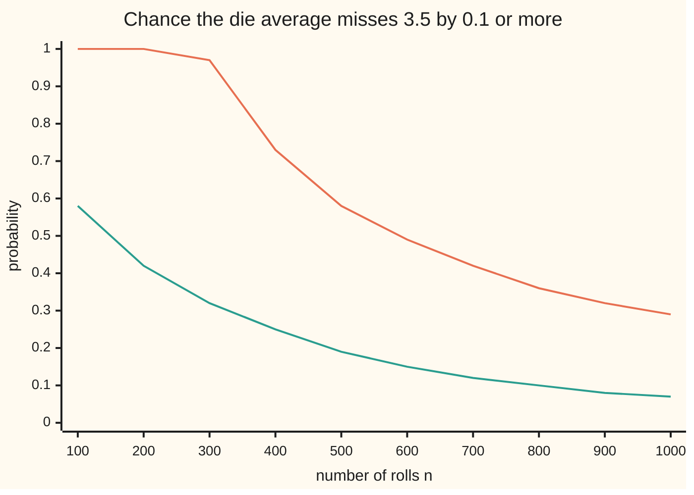

# The weak law of large numbers: the average of n independent copies lands within any margin of the mean with probability tending to one

[Syllabus](../../../SYLLABUS.md) → [Measure and integration](../../../SYLLABUS.md#w10) → [The Limit Theorems, Proved](../../../SYLLABUS.md#w10-s10) → The weak law of large numbers

---

## General Overview

A fair die is rolled again and again, and the faces are averaged. A single roll is anything from 1 to 6. Its long-run average is 3.5. How many rolls make the average land within 0.1 of 3.5 with probability at least 0.99?

One inequality answers with a number and no simulation: 29,167 rolls. The chance of missing by 0.1 or more is at most 291.67 divided by the number of rolls, and 291.67 / 29,167 is just under 0.01. The guarantee is generous. At that count a sharper inequality puts the chance of a miss below 3.786e-22, that is $3.786 \times 10^{-22}$, and 1,000 simulated runs of 29,167 rolls never miss once. The worst of them lands 0.031388 from 3.5.

The probability wing proves this for averages of dice and checks it by simulation ([Law of large numbers](../../09-Probability%20and%20statistics/06-Limit%20Theorems%20in%20Practice/01-law-of-large-numbers.md)). This card proves it for random variables on any probability space, names the one hypothesis the variance proof really needs (no two draws correlated), and proves a second version that needs no variance at all, only a finite mean.

**If the draws share a mean and a finite variance and no two of them are correlated, the chance that their average misses the mean by at least any fixed margin is at most the variance over n times the margin squared, which tends to 0; with independent draws from one law, a finite mean alone is enough.**

**What kind of fact this is:** a theorem, proved on this card in Why it works; the finite-mean version's truncation proof is in the folded Detailed proof.

### The picture: the guarantee and the truth, from 100 to 1,000 rolls



Orange: Chebyshev's ceiling 291.67/n, capped at 1, since no probability exceeds 1. Green: the exact chance of a miss, from the full law of the sum of n dice. Both fall to 0. The ceiling falls like 1/n; the truth falls much faster, and at 1,000 rolls it is 0.065410 against a ceiling of 0.291667. The same two lines are drawn on [Law of large numbers](../../09-Probability%20and%20statistics/06-Limit%20Theorems%20in%20Practice/01-law-of-large-numbers.md); this card proves the ceiling on any probability space.

---

## The formula

Notation, as a reminder. A probability space $(\Omega, \mathcal{F}, P)$ is a set of outcomes, the collection of sets we allow ourselves to measure (a sigma-algebra), and a measure of total size 1. A random variable is a real function on $\Omega$ measurable with respect to $\mathcal{F}$; its mean $E[X] = \int X \, dP$ is its integral against $P$ ([Expectation as an integral](../04-The%20Lebesgue%20Integral/06-expectation-as-an-integral.md)). For the die, $\Omega$ is the set of all infinite sequences of faces, and $P$ is the product measure that gives each of the first n faces probability 1/6 independently; it exists by [Infinitely many coin tosses](../06-Product%20Measures%20and%20Fubini/07-infinite-sequences-and-kolmogorov-extension.md). The roll $X_i$ reads the i-th face off the sequence.

Write $S_n = X_1 + \cdots + X_n$ for the total of the first n draws and $\bar{X}_n = S_n / n$ for their average.

**The weak law, finite variance.** Let $X_1, X_2, \ldots$ be random variables on $(\Omega, \mathcal{F}, P)$ with a common mean $m$, variances at most $\sigma^2 < \infty$, and no correlation between any two: $E[(X_i - m)(X_j - m)] = 0$ whenever $i \ne j$. Then for every margin $\varepsilon > 0$ and every n,

$$P\big(\lvert \bar{X}_n - m \rvert \ge \varepsilon\big) \;\le\; \frac{\sigma^2}{n\,\varepsilon^2} \;\longrightarrow\; 0 \quad (n \to \infty).$$

**Read it aloud:** the chance that the average of n draws misses the mean by at least epsilon is at most the variance divided by n times epsilon squared, and that goes to zero as n grows.

The limit is **convergence in probability** of $\bar{X}_n$ to $m$ ([Modes of convergence](../05-Swapping%20Limits%20and%20Integrals/04-modes-of-convergence.md)). Independent draws are uncorrelated, so the law covers them.

**The explicit count.** For a confidence $1 - \delta$, with $0 < \delta < 1$:

$$N = \Big\lceil \frac{\sigma^2}{\delta\,\varepsilon^2} \Big\rceil \quad\text{gives}\quad P\big(\lvert \bar{X}_n - m \rvert < \varepsilon\big) \ge 1 - \delta \ \text{ for every } n \ge N.$$

**Read it aloud:** round the variance over delta times epsilon squared up to a whole number; from that many draws on, the average lands within epsilon with probability at least one minus delta. If $\sigma^2 = 0$, take $N = 1$.

For the die, $\sigma^2/\varepsilon^2$ = (35/12)/0.01 = 875/3 = 291.666667, and $N$ = ⌈29,166.67⌉ = 29,167.

**The weak law, finite mean (Khintchine, 1929).** If $X_1, X_2, \ldots$ all have the law of one $X$ with $E\lvert X \rvert < \infty$ and are independent in pairs, then $\bar{X}_n \to E[X]$ in probability. No variance is assumed, and no count like $N$ follows from $E\lvert X \rvert$ alone.

| Symbol | Plain meaning | In our example | Push it up and the answer… |
| --- | --- | --- | --- |
| $\Omega$, $\mathcal{F}$, $P$, $E$ | the outcomes; the sets we may measure, a sigma-algebra; the probability measure; the mean, an integral against $P$ | all infinite roll sequences; events such as "roll 1 is a six"; each face 1/6 | — |
| $X_i$, $X$ | the i-th draw, a measurable function on $\Omega$; one draw with the common law | the face on roll i | — |
| $n$ | the number of draws averaged | 1,000 or 29,167 | the bound falls like 1/n |
| $S_n$ | the total of the first n draws | its mean is 3.5n | spreads like the square root of n |
| $\bar{X}_n$ | the average $S_n/n$ | 3.5 on average | — |
| $m$ | the common mean | 3.5 | shifts the target, not the bound |
| $Z_i$ | the i-th draw's miss, $X_i - m$ | the face on roll i minus 3.5 | — |
| $\sigma^2$, $\sigma$ | the variance, the mean squared distance from $m$; its square root | 35/12 = 2.916667 | the bound and $N$ rise in proportion |
| $\varepsilon$ | the margin | 0.1 | $N$ falls like one over its square |
| $\delta$ | the allowed chance of a miss; $1 - \delta$ is the confidence | 0.01 | $N$ falls like one over it |
| $N$ | the guaranteed count | 29,167 | — |
| $Y_i$, $T_n$, $m_n$ | in the finite-mean proof: $X_i$ cut to 0 where it exceeds n in size, the total of the cut draws, and the mean of one cut draw | a Pareto draw cut at n | — |
| $k$ | in Step 4: the number of real dice in the recipe | 4 dice give 15 faces | $2^k - 1$ faces, independent in pairs |
| $t$, $M$ | in the Chernoff comparison: a parameter, and $M(t)$ the mean of $e^{tX}$ | best $t$ = 0.034311 | — |

### When it holds

- **No correlation between any two draws.** This is the hypothesis the proof uses. Drop it and the law can fail outright: if every roll copies the first, the average is one roll, and it misses 3.5 by 0.1 or more with probability 1.000000 at every n.
- **A finite variance, for the count $N$.** The proof and the formula for $N$ need it. With independent draws from one law and a finite mean, the law survives (Step 5), but the guarantee comes slower and needs the tail of the law, not one number.
- **A finite mean, at all.** Without one there is nothing to settle on: the average of Cauchy draws is as wild as one draw ([Heavy tails](../../09-Probability%20and%20statistics/04-Continuous%20Distributions/08-heavy-tails-pareto-and-cauchy.md)).
- **One fixed n at a time.** The bound is about the average at each n separately. It does not say that one run is inside the margin from some roll on, for good. That is the strong law.

---

## Why it works

### Step 0: cross terms cancel, so the average's spread shrinks like 1/n

Square the total's distance from its mean and expand. Most terms are cross terms pairing two different draws, and uncorrelated draws make each average to 0. Only the n terms that square a single draw survive, so the total's variance is n times one draw's and the average's is one nth of one draw's. Chebyshev's inequality turns a small variance into a small chance of a large miss. Independence enters only to kill the cross terms.

### Step 1: the average aims at the mean

The integral is linear on integrable functions ([Integrable functions](../04-The%20Lebesgue%20Integral/04-integrable-functions-and-l1.md)). So $E[S_n] = E[X_1] + \cdots + E[X_n] = nm$ and $E[\bar{X}_n] = m$. No independence is used. Every roll averages 3.5, so every average of rolls does.

### Step 2: the variance of the total is the sum of the variances

Put $Z_i = X_i - m$, the i-th draw's miss. Then $S_n - nm = Z_1 + \cdots + Z_n$, and

$$E\big[(S_n - nm)^2\big] \;=\; \sum_{i=1}^{n} E[Z_i^2] \;+\; \sum_{i \ne j} E[Z_i Z_j].$$

Each product $Z_i Z_j$ is integrable, since $2\lvert Z_i Z_j \rvert \le Z_i^2 + Z_j^2$. The cross terms are 0 by hypothesis. For independent draws that is a theorem: the joint law of two draws is the product of their laws, and Fubini's theorem splits the integral of a product into the product of integrals ([Independence as a product](../06-Product%20Measures%20and%20Fubini/04-independence-as-a-product-measure.md)), so $E[Z_i Z_j] = E[Z_i]\,E[Z_j] = 0 \cdot 0$. What remains is at most $n\sigma^2$, and dividing by $n^2$:

$$E\big[(\bar{X}_n - m)^2\big] \;\le\; \frac{\sigma^2}{n}.$$

For the die, equality holds: 35/12/1000 = 0.002916667 at 1,000 rolls, and the exact law of the sum of 1,000 dice gives the same 0.002916667.

This line already says $\bar{X}_n \to m$ in $L^2$, the mean-square sense, and convergence in $L^2$ implies convergence in probability ([Modes of convergence](../05-Swapping%20Limits%20and%20Integrals/04-modes-of-convergence.md)). Step 3 makes that implication a number.

### Step 3: Chebyshev turns the spread into a guarantee

Chebyshev's inequality ([Markov and Chebyshev](../04-The%20Lebesgue%20Integral/07-markov-and-chebyshev.md)) is Markov's inequality applied to the squared miss: $P(\lvert Y - m \rvert \ge \varepsilon) \le E[(Y - m)^2]/\varepsilon^2$ for any random variable with mean $m$ and a finite second moment. With $Y = \bar{X}_n$ and Step 2:

$$P\big(\lvert \bar{X}_n - m \rvert \ge \varepsilon\big) \;\le\; \frac{\sigma^2}{n\,\varepsilon^2}.$$

Fix $\varepsilon$. The right side goes to 0 as n grows, which is the weak law. Now fix $\delta$ as well. The right side is at most $\delta$ exactly when $n \ge \sigma^2/(\delta\varepsilon^2)$, and rounding up gives the first whole number that works. For the die, 291.666667 / 29,167 = 0.00999989 is below 0.01, and 291.666667 / 29,166 = 0.01000023 is above it. So 29,167 is the smallest count this inequality certifies. It is not the smallest count that works for the die: at 1,000 rolls the exact chance of a miss is already 0.065410, and it falls much faster than 1/n. A miss here includes a distance of exactly 0.1, a total of 3,400 or 3,600; [The strong law of large numbers](04-strong-law-of-large-numbers.md) counts only distances above 0.1, so its figure at 1,000 rolls is a little lower.

### Step 4: pairwise uncorrelated is enough, and it is less than independence

Step 2 used only pairs. So the law holds for draws that are uncorrelated in pairs, even when three or more of them are tied together.

Dice give a concrete case. Roll 4 real dice and write each face as 0 to 5. For each of the 15 nonempty subsets of the four, add the faces in the subset, take the remainder after dividing by 6, and add 1. That gives 15 faces from 1 to 6. Listing all 1,296 outcomes shows every face is fair, and every pair of faces shows each of its 36 combinations exactly 36 times: the faces are independent in pairs. They are not independent in threes. Faces 1, 2 and "1 plus 2" all show 1 with chance 1/36, not 1/216, since the third is fixed by the first two.

The average of the 15 faces has variance exactly 7/36, which is (35/12)/15, as Step 2 predicts. Its chance of missing 3.5 by 1 or more is 0.032407. Fifteen independent dice give 0.022109. The tails differ, because the laws differ; the variances agree, so Chebyshev's ceiling, 0.194444, covers both. With k real dice the same recipe gives $2^k - 1$ faces independent in pairs, so their averages converge in probability to 3.5 as k grows.

### Step 5: with a finite mean only, cut the large values off

Now drop the variance. Take independent draws from one law with $E\lvert X \rvert < \infty$. The proof, due to Khintchine, cuts each draw at a level that grows with n and handles two pieces.

- **The cut draws.** Let $Y_i$ equal $X_i$ where $\lvert X_i \rvert \le n$ and 0 elsewhere, and let $T_n$ be their total. Each $Y_i$ is bounded, so it has a variance, and Step 3 applies to $T_n / n$. Its variance is at most $E[X^2 \text{ on } \lvert X \rvert \le n]/n$, and that tends to 0 by dominated convergence ([Dominated convergence](../05-Swapping%20Limits%20and%20Integrals/02-dominated-convergence-theorem.md)).
- **The rare large values.** $S_n$ and $T_n$ differ only if some draw exceeds n in size. That has chance at most $n\,P(\lvert X \rvert > n)$, which is at most $E[\lvert X \rvert \text{ on } \lvert X \rvert > n]$ by Markov's inequality and tends to 0, again by dominated convergence.

A Pareto law makes the pieces concrete: $P(X > x) = x^{-1.5}$ for $x \ge 1$. Its mean is 3; its variance is infinite. Cut at n, the chance of a large value is at most $n \cdot n^{-1.5} = n^{-1/2}$, and the cut draws' mean squared value is $3(\sqrt{n} - 1)$. For a margin of 0.5, once $n \ge 144$, the two pieces give a ceiling of $n^{-1/2} + 12(\sqrt{n} - 1)/(0.25\,n)$: 0.485200 at $10^4$ draws, 0.048952 at $10^6$, 0.004900 at $10^8$. The ceiling falls only like one over the square root of n. In 200 simulated runs of $10^4$ draws, 4 averages miss 3 by 0.5 or more, and no run holds a draw above $10^4$.

<details>
<summary>Detailed proof</summary>

**Setting.** $(\Omega, \mathcal{F}, P)$ is a probability space, and every $X_i$ is a real function on $\Omega$ measurable with respect to $\mathcal{F}$. The integral against $P$ is linear and monotone on integrable functions ([Integrable functions](../04-The%20Lebesgue%20Integral/04-integrable-functions-and-l1.md)).

**Theorem 1 (weak law in $L^2$).** Suppose $E[X_i^2] < \infty$, $E[X_i] = m$ and $E[(X_i - m)^2] \le \sigma^2$ for every i, and $E[(X_i - m)(X_j - m)] = 0$ for $i \ne j$. Then $E[(\bar{X}_n - m)^2] \le \sigma^2/n$ and $P(\lvert \bar{X}_n - m \rvert \ge \varepsilon) \le \sigma^2/(n\varepsilon^2)$ for every $\varepsilon > 0$. *Proof.* $\lvert X_i \rvert \le (1 + X_i^2)/2$ makes each $X_i$ integrable. With $Z_i = X_i - m$, $Z_i^2 \le 2X_i^2 + 2m^2$ and $\lvert Z_i Z_j \rvert \le (Z_i^2 + Z_j^2)/2$ make every term of $(S_n - nm)^2 = \sum_i Z_i^2 + \sum_{i \ne j} Z_i Z_j$ integrable, so linearity gives $E[(S_n - nm)^2] = \sum_i E[Z_i^2] \le n\sigma^2$. Divide by $n^2$ and apply Chebyshev's inequality to $\bar{X}_n$, whose mean is $m$ ([Markov and Chebyshev](../04-The%20Lebesgue%20Integral/07-markov-and-chebyshev.md)).

**Corollary 1 (independent draws).** If the $X_i$ are independent in pairs with finite second moments, then $E[Z_i Z_j] = E[Z_i]E[Z_j] = 0$ for $i \ne j$, because the joint law of $(X_i, X_j)$ is the product of their laws and Fubini's theorem applies to the integrable product ([Independence as a product](../06-Product%20Measures%20and%20Fubini/04-independence-as-a-product-measure.md)). Theorem 1 applies.

**Corollary 2 (the count).** Let $0 < \delta < 1$ and $N = \lceil \sigma^2/(\delta\varepsilon^2) \rceil$. For $n \ge N$, $\sigma^2/(n\varepsilon^2) \le \sigma^2/(N\varepsilon^2) \le \delta$, so $P(\lvert \bar{X}_n - m \rvert \ge \varepsilon) \le \delta$, and the complement gives $P(\lvert \bar{X}_n - m \rvert < \varepsilon) \ge 1 - \delta$. For $n < N$ the ratio exceeds $\delta$, so $N$ is the least count the inequality certifies.

**Lemma 1.** If $E\lvert X \rvert < \infty$, then $E[\lvert X \rvert \mathbf{1}_{\{\lvert X \rvert > n\}}] \to 0$, and $n\,P(\lvert X \rvert > n) \le E[\lvert X \rvert \mathbf{1}_{\{\lvert X \rvert > n\}}]$. *Proof.* $\lvert X \rvert$ is finite almost surely, so $\lvert X \rvert \mathbf{1}_{\{\lvert X \rvert > n\}} \to 0$ almost surely, and it is dominated by the integrable $\lvert X \rvert$; dominated convergence gives the limit ([Dominated convergence](../05-Swapping%20Limits%20and%20Integrals/02-dominated-convergence-theorem.md)). The inequality is monotonicity applied to $n\mathbf{1}_{\{\lvert X \rvert > n\}} \le \lvert X \rvert \mathbf{1}_{\{\lvert X \rvert > n\}}$.

**Lemma 2.** If $E\lvert X \rvert < \infty$, then $E[X^2 \mathbf{1}_{\{\lvert X \rvert \le n\}}]/n \to 0$. *Proof.* $X^2 \mathbf{1}_{\{\lvert X \rvert \le n\}}/n = \lvert X \rvert \cdot (\lvert X \rvert/n)\mathbf{1}_{\{\lvert X \rvert \le n\}} \le \lvert X \rvert \min(\lvert X \rvert/n, 1)$. The right side is at most $\lvert X \rvert$ and tends to 0 wherever $\lvert X \rvert$ is finite, so its integral tends to 0 by dominated convergence.

**Theorem 2 (weak law in $L^1$).** Let $X_1, X_2, \ldots$ be independent in pairs, each with the law of $X$, and $E\lvert X \rvert < \infty$, $m = E[X]$. Then $P(\lvert \bar{X}_n - m \rvert \ge \varepsilon) \to 0$ for every $\varepsilon > 0$. *Proof.* Fix n and put $Y_i = X_i \mathbf{1}_{\{\lvert X_i \rvert \le n\}}$ for $i \le n$, $T_n = Y_1 + \cdots + Y_n$ and $m_n = E[Y_1]$, the same for every i since the laws agree. Each $Y_i$ is a measurable function of $X_i$ alone, so the $Y_i$ are independent in pairs, and they are bounded by n. By Theorem 1 and Corollary 1, with $\sigma^2$ replaced by $E[Y_1^2] = E[X^2\mathbf{1}_{\{\lvert X \rvert \le n\}}]$:
$$P\big(\lvert T_n/n - m_n \rvert \ge \varepsilon/2\big) \le \frac{4\,E[X^2\mathbf{1}_{\{\lvert X \rvert \le n\}}]}{n\,\varepsilon^2} \to 0$$
by Lemma 2. Next, $\lvert m - m_n \rvert = \lvert E[X\mathbf{1}_{\{\lvert X \rvert > n\}}] \rvert \le E[\lvert X \rvert\mathbf{1}_{\{\lvert X \rvert > n\}}] \to 0$ by Lemma 1, so for all large n, $\lvert m - m_n \rvert < \varepsilon/2$, and then $\lvert T_n/n - m \rvert \ge \varepsilon$ forces $\lvert T_n/n - m_n \rvert \ge \varepsilon/2$. Finally $S_n \ne T_n$ only on the union of the sets $\{\lvert X_i \rvert > n\}$, $i \le n$, whose probability is at most $n\,P(\lvert X \rvert > n) \to 0$ by Lemma 1 and subadditivity. Combining, for all large n,
$$P\big(\lvert \bar{X}_n - m \rvert \ge \varepsilon\big) \le P(S_n \ne T_n) + P\big(\lvert T_n/n - m_n \rvert \ge \varepsilon/2\big) \to 0.$$

**The Pareto numbers.** For $P(X > x) = x^{-1.5}$ on $x \ge 1$, the density is $1.5x^{-2.5}$. Then $n\,P(X > n) = n^{-1/2}$; $E[X^2\mathbf{1}_{\{X \le n\}}] = \int_1^n 1.5x^{-0.5}\,dx = 3(\sqrt{n} - 1)$; and $m - m_n = \int_n^\infty 1.5x^{-1.5}\,dx = 3n^{-1/2}$, which is at most $\varepsilon/2 = 0.25$ once $n \ge 144$. The bound in the proof is then $n^{-1/2} + 4 \cdot 3(\sqrt{n} - 1)/(n \cdot 0.25)$, the formula in Step 5.

</details>

A second road replaces Chebyshev by the exponential form of Markov's inequality, the Chernoff bound $P(S_n \ge n(m + \varepsilon)) \le (e^{-t(m + \varepsilon)}M(t))^n$ for every $t > 0$, for independent draws with $M(t)$ finite. Its ceiling falls exponentially in n: for the die at 29,167 rolls both tails together are below 3.786e-22, though at 1,000 rolls it gives 0.359961 against Chebyshev's 0.291667. The probability wing works it out on coin flips ([Concentration](../../09-Probability%20and%20statistics/06-Limit%20Theorems%20in%20Practice/06-concentration-inequalities-hoeffding-and-chernoff.md)).

---

## Worked numbers, by hand

| Step | Arithmetic | Value |
| --- | --- | --- |
| mean of one roll | (1 + 2 + 3 + 4 + 5 + 6)/6 | 3.5 |
| variance of one roll | 91/6 − 3.5^2 | 35/12 = 2.916667 |
| Chebyshev constant | (35/12)/0.1^2 | 875/3 = 291.666667 |
| count for 99% | (875/3)/0.01 = 29,166.67, rounded up | **29,167** |
| check at 29,167 | 291.666667/29,167 | 0.00999989, below 0.01 |
| check at 29,166 | 291.666667/29,166 | 0.01000023, above 0.01 |
| spread of the average at 29,167 | square root of (35/12)/29,167 | 0.010000 |

At 29,167 rolls the average's standard deviation is 0.010000, so a miss by 0.1 is ten standard deviations out. Chebyshev knows only that variance, and some quantity with that variance does miss by 0.1 with chance equal to the ceiling, 0.00999989: one that sits at 3.5 except for rare jumps of exactly 0.1. The average of dice is nothing like that quantity, which is why its true chance of a miss is below 3.786e-22.

### What breaks if you drop a piece

| Mistake | Comes out at | What went wrong |
| --- | --- | --- |
| Every roll copies the first | P(miss) 1.000000 at every n; the average's variance stays 2.916667 | the cross terms are not 0, so the variance never shrinks |
| Standard deviation used where the variance belongs | n = 17,079, where Chebyshev only gives 0.017078 | the bound needs $\sigma^2$, not $\sigma$ |
| 1 − δ used where δ belongs | n = 295, where Chebyshev gives 0.988701 and the exact chance of a miss is 0.322985 | δ is the chance allowed to fail, not the confidence |

---

## Code, from first principles, and it actually runs

The code checks the die at finite n; that the chance of a miss tends to 0 for every law meeting the hypotheses rests on the proof. Four roads reach the chance of a miss: Chebyshev's bound in exact fractions, with $N$ checked on both sides; the exact law of the sum of up to 1,000 dice, built one roll at a time and checked at 4 rolls against a full listing; the Chernoff bound, minimised over $t$ by a golden-section search (shrinking a bracket around the minimum); and 1,000 simulated runs of 29,167 rolls from SplitMix64, a short pseudo-random recipe written out in both languages, seed 20260929. A miss is tested in whole numbers, $\lvert 10 S_n - 35n \rvert \ge n$, so no rounding decides a boundary case. The 15 faces are checked on all 1,296 outcomes; the Pareto part prints the truncation ceiling and simulates 200 runs of $10^4$ draws.

### Python

```python
# The weak law of large numbers on a fair die: the check behind the card.
# Standard library only. Fraction for exact bounds; own dynamic program, minimiser and RNG.
import math
from fractions import Fraction as F

def f6(v): return f"{float(v):.6f}"
faces = range(1, 7)
mu = F(sum(faces), 6); var = F(sum(x * x for x in faces), 6) - mu * mu
eps, delta = F(1, 10), F(1, 100)
c = var / eps**2                                     # Chebyshev: P(miss by 0.1 or more) <= c / n
q = c / delta; N = -(-q.numerator // q.denominator)   # the smallest n with c / n <= delta
print(f"one roll: mean {f6(mu)}, variance {var} = {f6(var)}; margin 0.1, confidence 0.99")
print(f"Chebyshev: P(|average - 3.5| >= 0.1) <= {c} / n = {f6(c)} / n")
print(f"n = {N} gives {float(c / N):.8f}; n = {N - 1} gives {float(c / (N - 1)):.8f}")
assert c / N <= delta < c / (N - 1)
assert N % 2 == 1                                    # code guard: two dice per draw below need an odd N

# road 2: the exact law of the sum of n dice, one roll at a time (a sliding sum of six chances)
def step(p):
    new, w = [0.0] * (len(p) + 6), 0.0
    for s in range(len(new)):
        if 1 <= s <= len(p): w += p[s - 1]
        if s >= 7: w -= p[s - 7]
        new[s] = w / 6
    return new
def tail(p, n, k):                                   # P(|S/n - 3.5| >= 1/k), tested in whole numbers
    t = 0.0
    for s, ps in enumerate(p):
        if abs(2 * k * s - 7 * k * n) >= 2 * n: t += ps
    return t
p, ex = [1.0], {}
for n in range(1, 1001):
    p = step(p)
    if n % 100 == 0 or n == 295: ex[n] = tail(p, n, 10)
    if n == 15: ind15 = tail(p, 15, 1)
    if n == 4: ex4 = tail(p, 4, 4)
v1000 = 0.0
for s, ps in enumerate(p): v1000 += ps * (s / 1000 - 3.5) ** 2
print(f"exact law at n = 1000: variance of the average {v1000:.9f}, formula 35/12/1000 = {float(var / 1000):.9f}")
assert abs(v1000 - float(var) / 1000) < 1e-12

# road 3: the Chernoff bound, 2 * exp(n * min over t of [log M(t) - 3.6 t]), M(t) = average of e^(t k)
def gss(f, lo, hi):
    g = (math.sqrt(5) - 1) / 2
    for _ in range(100):
        a, b = hi - g * (hi - lo), lo + g * (hi - lo)
        if f(a) < f(b): hi = b
        else: lo = a
    return (lo + hi) / 2
def logm(t):
    m = 0.0
    for k in faces: m += math.exp(t * k)
    return math.log(m / 6)
t = gss(lambda t: logm(t) - 3.6 * t, 0.0, 5.0); r = logm(t) - 3.6 * t
print(f"Chernoff: best t {t:.6f}, exponent per roll {r:.9f}")
print("n, Chebyshev bound, exact P(miss), Chernoff bound")
for n in range(100, 1001, 100):
    ch = 2 * math.exp(n * r)
    print(f"  {n}, {f6(c / n)}, {f6(ex[n])}, {f6(ch)}")
    assert ex[n] <= min(1.0, float(c / n)) and ex[n] <= ch
print("chart, Chebyshev capped at 1:", " ".join(f"{min(1.0, float(c / n)):.2f}" for n in range(100, 1001, 100)))
print("chart, exact:", " ".join(f"{ex[n]:.2f}" for n in range(100, 1001, 100)))
print(f"at n = {N}: Chebyshev {float(c / N):.8f}, Chernoff {2 * math.exp(N * r):.3e}")

# road 4: simulate 1000 runs of N rolls; SplitMix64, seed 20260929, two dice per 64-bit draw
st, MASK, R = 20260929, (1 << 64) - 1, 1000
fails = 0; ss = worst = 0.0
for _ in range(R):
    tot = 0
    for j in range(N // 2 + 1):
        st = (st + 0x9E3779B97F4A7C15) & MASK; z = st
        z = ((z ^ (z >> 30)) * 0xBF58476D1CE4E5B9) & MASK
        z = ((z ^ (z >> 27)) * 0x94D049BB133111EB) & MASK; z ^= z >> 31
        tot += ((z >> 32) * 6 >> 32) + 1
        if j < N // 2: tot += ((z & 0xFFFFFFFF) * 6 >> 32) + 1
    d = tot / N - 3.5; ss += d * d; worst = max(worst, abs(d)); fails += abs(10 * tot - 35 * N) >= N
rms, sd = math.sqrt(ss / R), math.sqrt(float(var) / N)
print(f"simulated, {R} runs of {N} rolls: misses {fails}; largest |average - 3.5| {worst:.6f}")
print(f"root-mean-square miss {rms:.6f}; theory sqrt(35/12/{N}) = {sd:.6f}")
assert fails == 0 and abs(rms - sd) < 4 * sd / math.sqrt(2 * R)

# pairwise independent faces: 4 real dice x_i in 0..5 give 15 faces, (sum of a subset mod 6) + 1
outs = []
for code in range(6**4):
    x = [code // 6**i % 6 for i in range(4)]
    outs.append([sum(x[i] for i in range(4) if m >> i & 1) % 6 + 1 for m in range(1, 16)])
pairs_ok = True
for a in range(15):
    for b in range(a + 1, 15):
        cnt = [0] * 36
        for f in outs: cnt[6 * (f[a] - 1) + f[b] - 1] += 1
        pairs_ok = pairs_ok and cnt == [36] * 36
T = [sum(f) for f in outs]
v15 = F(sum((2 * s - 105)**2 for s in T), 900 * 6**4)
t15 = F(sum(abs(2 * s - 105) >= 30 for s in T), 6**4)
trip = F(sum(f[0] == f[1] == f[2] == 1 for f in outs), 6**4)
e4 = F(sum(abs(4 * (f[0] + f[1] + f[3] + f[7]) - 56) >= 4 for f in outs), 6**4)   # faces 1, 2, 4, 8 are the dice
print(f"exact law checked by listing 4 dice: P(|average - 3.5| >= 0.25) = {e4} = {f6(e4)}; dynamic program {f6(ex4)}")
assert abs(float(e4) - ex4) < 1e-12
print(f"15 faces from 4 dice: every pair uniform on 36 outcomes: {'yes' if pairs_ok else 'no'}")
print(f"  faces 1, 2 and 1+2 all show 1 with chance {trip} (independent faces: 1/216)")
print(f"  variance of the average {v15}, formula (35/12)/15 = {var / 15}")
print(f"  P(|average - 3.5| >= 1): {f6(t15)}; 15 independent dice {f6(ind15)}; Chebyshev {f6(var / 15)}")
assert pairs_ok and trip == F(1, 36) and v15 == var / 15 and t15 <= var / 15

# finite mean, infinite variance: Pareto P(X > x) = x^-1.5 on x >= 1, mean 3, margin 0.5
def tb(n): return n**-0.5 + 12 * (math.sqrt(n) - 1) / (n * 0.25)
print("truncation bound n^-0.5 + 12(sqrt(n) - 1)/(0.25 n):", ", ".join(f"n = 10^{k}: {tb(10**k):.6f}" for k in (4, 6, 8)))
n2, R2 = 10**4, 200; f2 = big = 0
for _ in range(R2):
    tot = 0.0; top = 0.0
    for _ in range(n2):
        st = (st + 0x9E3779B97F4A7C15) & MASK; z = st
        z = ((z ^ (z >> 30)) * 0xBF58476D1CE4E5B9) & MASK
        z = ((z ^ (z >> 27)) * 0x94D049BB133111EB) & MASK; z ^= z >> 31
        xv = (1.0 - (z >> 11) / 2.0**53) ** (-2 / 3); tot += xv; top = max(top, xv)
    f2 += abs(tot / n2 - 3) >= 0.5; big += top > n2
print(f"simulated, {R2} runs of {n2} Pareto draws: misses {f2}; runs with a draw above n {big} (bound n^-0.5 = 0.01)")
assert f2 / R2 <= tb(n2)

# what breaks
cop = F(sum(abs(10 * x - 35) >= 1 for x in faces), 6)
n_sd = math.ceil(math.sqrt(float(var)) / float(delta * eps**2)); n_1d = math.ceil(float(c / (1 - delta)))
print(f"breaks: every roll a copy of the first: P(miss) {f6(cop)} at every n; variance of the average {f6(var)}")
print(f"breaks: standard deviation for variance: n = {n_sd}, Chebyshev there {f6(c / n_sd)}")
print(f"breaks: 1 - delta for delta: n = {n_1d}, Chebyshev there {f6(c / n_1d)}, exact P(miss) {f6(ex[295])}")
assert cop == 1 and c / n_sd > delta and n_1d == 295 and ex[295] > delta
```

**Ran 2026-09-29 on macOS, Python 3.14.6, standard library only. All checks passed. Output, pasted from the run:**

```
one roll: mean 3.500000, variance 35/12 = 2.916667; margin 0.1, confidence 0.99
Chebyshev: P(|average - 3.5| >= 0.1) <= 875/3 / n = 291.666667 / n
n = 29167 gives 0.00999989; n = 29166 gives 0.01000023
exact law at n = 1000: variance of the average 0.002916667, formula 35/12/1000 = 0.002916667
Chernoff: best t 0.034311, exponent per roll -0.001714908
n, Chebyshev bound, exact P(miss), Chernoff bound
  100, 2.916667, 0.578519, 1.684816
  200, 1.458333, 0.419705, 1.419303
  300, 0.972222, 0.318776, 1.195632
  400, 0.729167, 0.247588, 1.007210
  500, 0.583333, 0.194951, 0.848482
  600, 0.486111, 0.154959, 0.714768
  700, 0.416667, 0.124028, 0.602126
  800, 0.364583, 0.099804, 0.507236
  900, 0.324074, 0.080656, 0.427300
  1000, 0.291667, 0.065410, 0.359961
chart, Chebyshev capped at 1: 1.00 1.00 0.97 0.73 0.58 0.49 0.42 0.36 0.32 0.29
chart, exact: 0.58 0.42 0.32 0.25 0.19 0.15 0.12 0.10 0.08 0.07
at n = 29167: Chebyshev 0.00999989, Chernoff 3.786e-22
simulated, 1000 runs of 29167 rolls: misses 0; largest |average - 3.5| 0.031388
root-mean-square miss 0.010127; theory sqrt(35/12/29167) = 0.010000
exact law checked by listing 4 dice: P(|average - 3.5| >= 0.25) = 575/648 = 0.887346; dynamic program 0.887346
15 faces from 4 dice: every pair uniform on 36 outcomes: yes
  faces 1, 2 and 1+2 all show 1 with chance 1/36 (independent faces: 1/216)
  variance of the average 7/36, formula (35/12)/15 = 7/36
  P(|average - 3.5| >= 1): 0.032407; 15 independent dice 0.022109; Chebyshev 0.194444
truncation bound n^-0.5 + 12(sqrt(n) - 1)/(0.25 n): n = 10^4: 0.485200, n = 10^6: 0.048952, n = 10^8: 0.004900
simulated, 200 runs of 10000 Pareto draws: misses 4; runs with a draw above n 0 (bound n^-0.5 = 0.01)
breaks: every roll a copy of the first: P(miss) 1.000000 at every n; variance of the average 2.916667
breaks: standard deviation for variance: n = 17079, Chebyshev there 0.017078
breaks: 1 - delta for delta: n = 295, Chebyshev there 0.988701, exact P(miss) 0.322985
```

### Rust

```rust
// The weak law of large numbers on a fair die: the check behind the card.
// Rust std only. A small exact fraction type; own dynamic program, minimiser and RNG.
#[derive(Clone, Copy, PartialEq, Debug)]
struct Q(i128, i128);
fn gcd(a: i128, b: i128) -> i128 { if b == 0 { a.abs() } else { gcd(b, a % b) } }
fn q(n: i128, d: i128) -> Q { let g = gcd(n, d) * d.signum(); Q(n / g, d / g) }
fn sub(a: Q, b: Q) -> Q { q(a.0 * b.1 - b.0 * a.1, a.1 * b.1) }
fn mul(a: Q, b: Q) -> Q { q(a.0 * b.0, a.1 * b.1) }
fn div(a: Q, b: Q) -> Q { q(a.0 * b.1, a.1 * b.0) }
fn le(a: Q, b: Q) -> bool { a.0 * b.1 <= b.0 * a.1 }
fn fl(a: Q) -> f64 { a.0 as f64 / a.1 as f64 }
fn show(a: Q) -> String { format!("{}/{}", a.0, a.1) }
fn f6(v: f64) -> String { format!("{:.6}", v) }
fn step(p: &[f64]) -> Vec<f64> {                     // law of the sum after one more roll
    let mut new = vec![0.0; p.len() + 6]; let mut w = 0.0;
    for s in 0..new.len() {
        if s >= 1 && s <= p.len() { w += p[s - 1]; }
        if s >= 7 { w -= p[s - 7]; }
        new[s] = w / 6.0;
    }
    new
}
fn tail(p: &[f64], n: i64, k: i64) -> f64 {           // P(|S/n - 3.5| >= 1/k), in whole numbers
    let mut t = 0.0;
    for (s, ps) in p.iter().enumerate() { if (2 * k * s as i64 - 7 * k * n).abs() >= 2 * n { t += ps; } }
    t
}
fn gss(f: &dyn Fn(f64) -> f64, mut lo: f64, mut hi: f64) -> f64 {
    let g = (5f64.sqrt() - 1.0) / 2.0;
    for _ in 0..100 { let (a, b) = (hi - g * (hi - lo), lo + g * (hi - lo)); if f(a) < f(b) { hi = b } else { lo = a } }
    (lo + hi) / 2.0
}
fn logm(t: f64) -> f64 { let mut m = 0.0; for k in 1..=6 { m += (t * k as f64).exp(); } (m / 6.0).ln() }
fn tb(n: f64) -> f64 { n.powf(-0.5) + 12.0 * (n.sqrt() - 1.0) / (n * 0.25) }
struct Rng(u64);
impl Rng {
    fn next(&mut self) -> u64 {
        self.0 = self.0.wrapping_add(0x9E3779B97F4A7C15); let mut z = self.0;
        z = (z ^ (z >> 30)).wrapping_mul(0xBF58476D1CE4E5B9);
        z = (z ^ (z >> 27)).wrapping_mul(0x94D049BB133111EB);
        z ^ (z >> 31)
    }
}
fn main() {
    let mu = q(21, 6); let var = sub(q(91, 6), mul(mu, mu));
    let (eps, delta) = (q(1, 10), q(1, 100));
    let c = div(var, mul(eps, eps));
    let qq = div(c, delta); let nn = (qq.0 + qq.1 - 1) / qq.1; let n_big = nn as i64;
    println!("one roll: mean {}, variance {} = {}; margin 0.1, confidence 0.99", f6(fl(mu)), show(var), f6(fl(var)));
    println!("Chebyshev: P(|average - 3.5| >= 0.1) <= {} / n = {} / n", show(c), f6(fl(c)));
    println!("n = {} gives {:.8}; n = {} gives {:.8}", nn, fl(div(c, q(nn, 1))), nn - 1, fl(div(c, q(nn - 1, 1))));
    assert!(le(div(c, q(nn, 1)), delta) && !le(div(c, q(nn - 1, 1)), delta));
    assert!(nn % 2 == 1);                              // code guard: two dice per draw below need an odd N
    // road 2: the exact law of the sum of n dice
    let mut p = vec![1.0f64]; let mut ex = std::collections::BTreeMap::new(); let mut ind15 = 0.0; let mut ex4 = 0.0;
    for n in 1..=1000i64 {
        p = step(&p);
        if n % 100 == 0 || n == 295 { ex.insert(n, tail(&p, n, 10)); }
        if n == 15 { ind15 = tail(&p, 15, 1); }
        if n == 4 { ex4 = tail(&p, 4, 4); }
    }
    let mut v1000 = 0.0;
    for (s, ps) in p.iter().enumerate() { let d = s as f64 / 1000.0 - 3.5; v1000 += ps * (d * d); }
    println!("exact law at n = 1000: variance of the average {:.9}, formula 35/12/1000 = {:.9}", v1000, fl(var) / 1000.0);
    assert!((v1000 - fl(var) / 1000.0).abs() < 1e-12);
    // road 3: the Chernoff bound
    let t = gss(&|t| logm(t) - 3.6 * t, 0.0, 5.0); let r = logm(t) - 3.6 * t;
    println!("Chernoff: best t {:.6}, exponent per roll {:.9}", t, r);
    println!("n, Chebyshev bound, exact P(miss), Chernoff bound");
    let (mut cap, mut exs) = (vec![], vec![]);
    for n in (100..=1000i64).step_by(100) {
        let (cb, e, ch) = (fl(c) / n as f64, ex[&n], 2.0 * (n as f64 * r).exp());
        println!("  {}, {}, {}, {}", n, f6(cb), f6(e), f6(ch));
        assert!(e <= cb.min(1.0) && e <= ch);
        cap.push(format!("{:.2}", cb.min(1.0))); exs.push(format!("{:.2}", e));
    }
    println!("chart, Chebyshev capped at 1: {}", cap.join(" "));
    println!("chart, exact: {}", exs.join(" "));
    println!("at n = {}: Chebyshev {:.8}, Chernoff {:.3e}", nn, fl(div(c, q(nn, 1))), 2.0 * (n_big as f64 * r).exp());
    // road 4: simulate 1000 runs of N rolls; SplitMix64, seed 20260929, two dice per 64-bit draw
    let mut rng = Rng(20260929); let rr = 1000;
    let (mut fails, mut ss, mut worst) = (0, 0.0f64, 0.0f64);
    for _ in 0..rr {
        let mut tot: i64 = 0;
        for j in 0..(n_big / 2 + 1) {
            let z = rng.next();
            tot += (((z >> 32) * 6) >> 32) as i64 + 1;
            if j < n_big / 2 { tot += (((z & 0xFFFFFFFF) * 6) >> 32) as i64 + 1; }
        }
        let d = tot as f64 / n_big as f64 - 3.5; ss += d * d; worst = worst.max(d.abs());
        if (10 * tot - 35 * n_big).abs() >= n_big { fails += 1; }
    }
    let (rms, sd) = ((ss / rr as f64).sqrt(), (fl(var) / n_big as f64).sqrt());
    println!("simulated, {} runs of {} rolls: misses {}; largest |average - 3.5| {:.6}", rr, n_big, fails, worst);
    println!("root-mean-square miss {:.6}; theory sqrt(35/12/{}) = {:.6}", rms, n_big, sd);
    assert!(fails == 0 && (rms - sd).abs() < 4.0 * sd / (2.0 * rr as f64).sqrt());
    // pairwise independent faces: 4 real dice x_i in 0..5 give 15 faces
    let outs: Vec<Vec<i128>> = (0..1296).map(|code: i128| {
        let x: Vec<i128> = (0..4).map(|i| code / 6i128.pow(i) % 6).collect();
        (1..16).map(|m| (0..4).filter(|&i| m >> i & 1 == 1).map(|i| x[i]).sum::<i128>() % 6 + 1).collect()
    }).collect();
    let mut pairs_ok = true;
    for a in 0..15 { for b in a + 1..15 {
        let mut cnt = [0; 36];
        for f in &outs { cnt[(6 * (f[a] - 1) + f[b] - 1) as usize] += 1; }
        pairs_ok = pairs_ok && cnt.iter().all(|&k| k == 36);
    } }
    let tt: Vec<i128> = outs.iter().map(|f| f.iter().sum()).collect();
    let v15 = q(tt.iter().map(|s| (2 * s - 105).pow(2)).sum(), 900 * 1296);
    let t15 = q(tt.iter().filter(|s| (2 * **s - 105).abs() >= 30).count() as i128, 1296);
    let trip = q(outs.iter().filter(|f| f[0] == 1 && f[1] == 1 && f[2] == 1).count() as i128, 1296);
    let e4 = q(outs.iter().filter(|f| (4 * (f[0] + f[1] + f[3] + f[7]) - 56).abs() >= 4).count() as i128, 1296); // faces 1, 2, 4, 8 are the dice
    println!("exact law checked by listing 4 dice: P(|average - 3.5| >= 0.25) = {} = {}; dynamic program {}", show(e4), f6(fl(e4)), f6(ex4));
    assert!((fl(e4) - ex4).abs() < 1e-12);
    println!("15 faces from 4 dice: every pair uniform on 36 outcomes: {}", if pairs_ok { "yes" } else { "no" });
    println!("  faces 1, 2 and 1+2 all show 1 with chance {} (independent faces: 1/216)", show(trip));
    println!("  variance of the average {}, formula (35/12)/15 = {}", show(v15), show(div(var, q(15, 1))));
    println!("  P(|average - 3.5| >= 1): {}; 15 independent dice {}; Chebyshev {}", f6(fl(t15)), f6(ind15), f6(fl(div(var, q(15, 1)))));
    assert!(pairs_ok && trip == q(1, 36) && v15 == div(var, q(15, 1)) && le(t15, v15));
    // finite mean, infinite variance: Pareto P(X > x) = x^-1.5 on x >= 1, mean 3, margin 0.5
    let tbs: Vec<String> = [4, 6, 8].iter().map(|&k| format!("n = 10^{}: {:.6}", k, tb(10f64.powi(k)))).collect();
    println!("truncation bound n^-0.5 + 12(sqrt(n) - 1)/(0.25 n): {}", tbs.join(", "));
    let (n2, r2) = (10000usize, 200usize); let (mut f2, mut big) = (0, 0);
    for _ in 0..r2 {
        let (mut tot, mut top) = (0.0f64, 0.0f64);
        for _ in 0..n2 {
            let xv = (1.0 - (rng.next() >> 11) as f64 / 2f64.powi(53)).powf(-2.0 / 3.0);
            tot += xv; top = top.max(xv);
        }
        if (tot / n2 as f64 - 3.0).abs() >= 0.5 { f2 += 1; }
        if top > n2 as f64 { big += 1; }
    }
    println!("simulated, {} runs of {} Pareto draws: misses {}; runs with a draw above n {} (bound n^-0.5 = 0.01)", r2, n2, f2, big);
    assert!(f2 as f64 / r2 as f64 <= tb(n2 as f64));
    // what breaks
    let cop = q((1..=6i128).filter(|x| (10 * x - 35).abs() >= 1).count() as i128, 6);
    let n_sd = (fl(var).sqrt() / fl(mul(delta, mul(eps, eps)))).ceil() as i128;
    let n_1d = (fl(div(c, sub(q(1, 1), delta)))).ceil() as i128;
    println!("breaks: every roll a copy of the first: P(miss) {} at every n; variance of the average {}", f6(fl(cop)), f6(fl(var)));
    println!("breaks: standard deviation for variance: n = {}, Chebyshev there {}", n_sd, f6(fl(div(c, q(n_sd, 1)))));
    println!("breaks: 1 - delta for delta: n = {}, Chebyshev there {}, exact P(miss) {}", n_1d, f6(fl(div(c, q(n_1d, 1)))), f6(ex[&295]));
    assert!(cop == q(1, 1) && !le(div(c, q(n_sd, 1)), delta) && n_1d == 295 && ex[&295] > fl(delta));
}
```

**Ran 2026-09-29 on macOS, rustc 1.98.1, no crates. All checks passed. Output, pasted from the run:**

```
one roll: mean 3.500000, variance 35/12 = 2.916667; margin 0.1, confidence 0.99
Chebyshev: P(|average - 3.5| >= 0.1) <= 875/3 / n = 291.666667 / n
n = 29167 gives 0.00999989; n = 29166 gives 0.01000023
exact law at n = 1000: variance of the average 0.002916667, formula 35/12/1000 = 0.002916667
Chernoff: best t 0.034311, exponent per roll -0.001714908
n, Chebyshev bound, exact P(miss), Chernoff bound
  100, 2.916667, 0.578519, 1.684816
  200, 1.458333, 0.419705, 1.419303
  300, 0.972222, 0.318776, 1.195632
  400, 0.729167, 0.247588, 1.007210
  500, 0.583333, 0.194951, 0.848482
  600, 0.486111, 0.154959, 0.714768
  700, 0.416667, 0.124028, 0.602126
  800, 0.364583, 0.099804, 0.507236
  900, 0.324074, 0.080656, 0.427300
  1000, 0.291667, 0.065410, 0.359961
chart, Chebyshev capped at 1: 1.00 1.00 0.97 0.73 0.58 0.49 0.42 0.36 0.32 0.29
chart, exact: 0.58 0.42 0.32 0.25 0.19 0.15 0.12 0.10 0.08 0.07
at n = 29167: Chebyshev 0.00999989, Chernoff 3.786e-22
simulated, 1000 runs of 29167 rolls: misses 0; largest |average - 3.5| 0.031388
root-mean-square miss 0.010127; theory sqrt(35/12/29167) = 0.010000
exact law checked by listing 4 dice: P(|average - 3.5| >= 0.25) = 575/648 = 0.887346; dynamic program 0.887346
15 faces from 4 dice: every pair uniform on 36 outcomes: yes
  faces 1, 2 and 1+2 all show 1 with chance 1/36 (independent faces: 1/216)
  variance of the average 7/36, formula (35/12)/15 = 7/36
  P(|average - 3.5| >= 1): 0.032407; 15 independent dice 0.022109; Chebyshev 0.194444
truncation bound n^-0.5 + 12(sqrt(n) - 1)/(0.25 n): n = 10^4: 0.485200, n = 10^6: 0.048952, n = 10^8: 0.004900
simulated, 200 runs of 10000 Pareto draws: misses 4; runs with a draw above n 0 (bound n^-0.5 = 0.01)
breaks: every roll a copy of the first: P(miss) 1.000000 at every n; variance of the average 2.916667
breaks: standard deviation for variance: n = 17079, Chebyshev there 0.017078
breaks: 1 - delta for delta: n = 295, Chebyshev there 0.988701, exact P(miss) 0.322985
```

The two outputs are identical line for line.

> [!TIP]
> **Try changing**
> - **Tighter confidence.** Guess first: what count does 99.9% need? Set `delta` to `F(1, 1000)` in Python. The count is 291,667, ten times as many, and the 1,000 simulated runs still never miss. The run then stops at the last assert, which pins the 1 − δ mistake to 295 rolls.
> - **Another seed.** Guess first: does anything fail with seed 7? No. Set the seed to 7: the simulated runs still never miss, the worst lands 0.034851 from 3.5, and the root-mean-square miss is 0.009864 against 0.010000.
> - **Break a pair.** Guess first: which assert notices if one of the 15 faces is nudged? In the face recipe, add 1 before taking the remainder for face "1 plus 2" whenever the first die's 0-to-5 value exceeds 2. That face is still fair on its own, but paired with the second die it no longer shows its 36 combinations equally often; the assert on the 15 faces stops the run.

---

## The usual mistake

> [!warning]
> **Reading 29,167 as the number of rolls a die needs.** It is the number Chebyshev can certify from the variance alone. The die is far better behaved: at 1,000 rolls the exact chance of a miss is already 0.065410, and at 29,167 it is below 3.786e-22. Only a lopsided law with that variance, one that rarely jumps by exactly 0.1, reaches the ceiling; the die does not.
>
> - **Reading the weak law as "every run settles".** It bounds each n separately. Whether one run eventually stays within 0.1 for good is a different question, answered by the strong law.
> - **Thinking independence is the hypothesis.** The proof needs only zero correlation between pairs. The 15 faces built from 4 dice are tied together in threes and still give variance 7/36, as 15 independent dice do.
> - **Using $\sigma$ for $\sigma^2$.** The count comes out at 17,079, where the guarantee is only 0.017078.
> - **Swapping δ and 1 − δ.** The count comes out at 295, where the exact chance of a miss is 0.322985.

---

## Where you meet it in real life

- **Estimation.** A sample average is a consistent estimator of a mean: its chance of missing by any fixed margin shrinks as the sample grows. The count $N$ is the conservative sample size used when only a variance bound is known.
- **Monte Carlo.** A simulated average of a payoff or a probability converges in probability to the true value, and Chebyshev gives an error guarantee that needs no normal approximation.
- **Pooling risk.** An insurer's average claim per policy settles near the expected claim when claims are uncorrelated. Flood damage on one street is correlated: the cross terms return and the variance stops shrinking.
- **Information theory.** Applied to the logarithms of the probabilities of a long message, the weak law says that a long message of n symbols, with probability near 1, has a log-probability per symbol close to the source's entropy (its average information per symbol, in bits), so its probability is about 2 to the power minus n times the entropy. That is the idea behind Typical sequences.

> **Say it back**
> The average of n draws with a common mean has, when no two draws are correlated, one nth of one draw's variance, because every cross term averages to zero. Chebyshev's inequality turns that into a ceiling on the chance of missing the mean by epsilon: the variance over n epsilon squared, which tends to zero. Solving for n gives a guaranteed count; for a die, a margin of 0.1 and confidence 0.99 need 29,167 rolls. The true chance of a miss is far smaller than the ceiling. With independent draws from one law, a finite mean is enough, by cutting off the rare large values.

---

## What this builds on

- [Markov and Chebyshev](../04-The%20Lebesgue%20Integral/07-markov-and-chebyshev.md): Chebyshev's inequality for any random variable with a finite second moment, the whole of Step 3.
- [Independence as a product](../06-Product%20Measures%20and%20Fubini/04-independence-as-a-product-measure.md): independence as a product law, so the mean of a product is the product of means and the cross terms vanish.
- [Modes of convergence](../05-Swapping%20Limits%20and%20Integrals/04-modes-of-convergence.md): convergence in probability, the promise the weak law makes, and why $L^2$ convergence implies it.
- [Law of large numbers](../../09-Probability%20and%20statistics/06-Limit%20Theorems%20in%20Practice/01-law-of-large-numbers.md): the same law for dice, stated without measure and checked by simulation.

## Where this goes next

- [The strong law of large numbers](04-strong-law-of-large-numbers.md): almost sure convergence of the average, for independent draws from one law with a finite mean.

The weak law bounds the chance of a miss at each n but says nothing about a single run over time; whether almost every infinite sequence of rolls has averages that settle at 3.5 and stay there is proved on [The strong law of large numbers](04-strong-law-of-large-numbers.md).

---

## Sources

Verified 2026-09-29: every link below resolves to the publisher's or author's page for the work named.

- Durrett, Rick. *Probability: Theory and Examples*, 5th ed. Cambridge University Press, 2019. [Author's page for the book](https://services.math.duke.edu/~rtd/PTE/pte.html). Section 2.2, "Weak Laws of Large Numbers", proves the law for uncorrelated variables in $L^2$ and the finite-mean law by truncation.
- Billingsley, Patrick. *Probability and Measure*, Anniversary ed. Wiley, 2012. [Publisher page](https://www.wiley.com/en-us/Probability+and+Measure%2C+Anniversary+Edition-p-9781118122372). The laws of large numbers proved on a measure space, with independence as a product measure.
- Tchébychef, P. "Des valeurs moyennes." *Journal de Mathématiques Pures et Appliquées*, 2nd series, 12 (1867): 177–184. [NUMDAM](https://www.numdam.org/item/JMPA_1867_2_12__177_0/). The inequality and the finite-variance law for averages, in the original.
