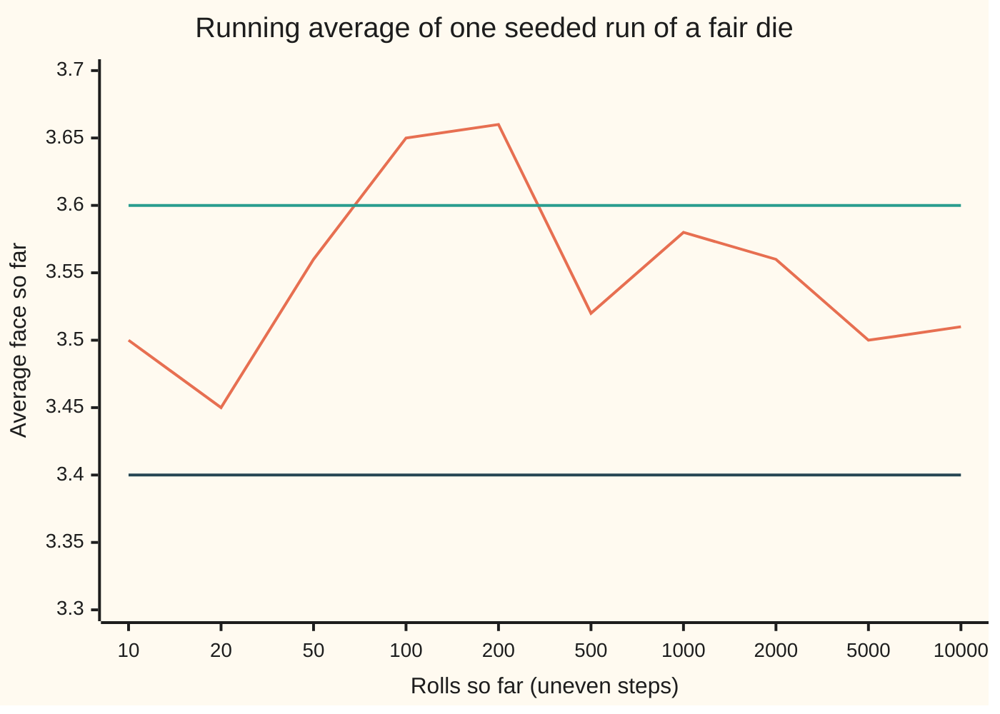
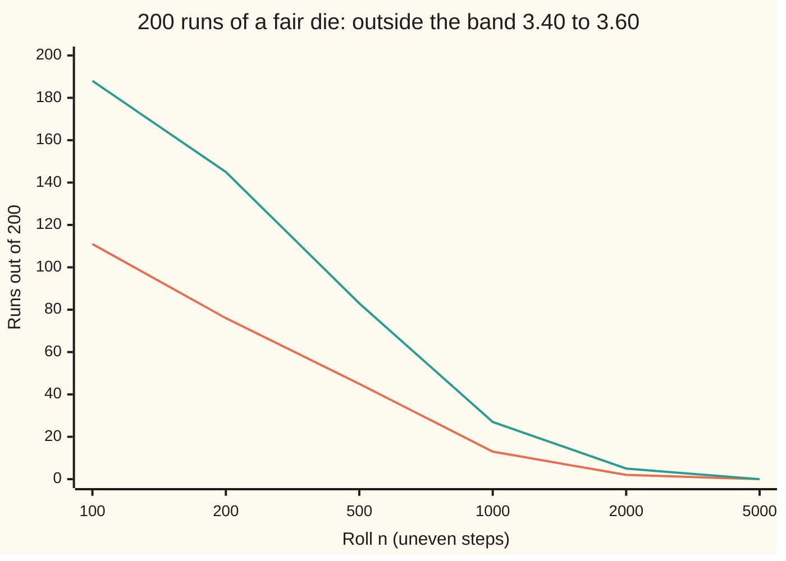

# The strong law of large numbers: the running average converges to the mean on almost every sequence of outcomes

Measure and integration → The Limit Theorems, Proved → Averages that settle for good → The strong law of large numbers

---

## General Overview

A fair die is rolled 10,000 times, and after every roll the average face so far is written down. The long-run average of a fair die is 3.5; draw a band from 3.40 to 3.60 around it. In one simulated run the average drifts out to 3.66 by roll 200 and comes back. Its last roll outside the band is roll 1,149. From there to roll 10,000 it never leaves.

The weak law of large numbers speaks about one roll at a time: at roll 1,000 the chance of being strictly outside the band is 0.0627 (counting the edge totals 3,400 and 3,600 as outside too gives the weak-law card's 0.0654). It says nothing about the path. A run inside the band at roll 1,000 might leave again later, and again, forever.

The strong law rules that out. Treat the whole infinite sequence of rolls as one outcome. Apart from a set of sequences of probability zero, every sequence has a last exit from every band around 3.5, however narrow: the average gets close and stays close.

**For independent draws from one law with a finite mean, the running average converges to that mean on every sequence of outcomes outside a set of probability zero; a finite fourth moment gives a short proof through Borel-Cantelli, and a finite mean alone is enough.**

**What kind of fact this is:** a theorem, proved on this card in Why it works under a finite fourth moment; the finite-mean version, Kolmogorov's, is stated precisely and its proof, Etemadi's, is outlined in a folded callout.

### The picture: one run of 10,000 rolls



Orange: the running average of one run, seed 20260929, to two decimals. Green and dark blue: the band 3.60 and 3.40. The run is outside the band at rolls 100 and 200 and ends at 3.5123. The code prints every point.

---

## The formula

Notation first, in words. The space $\Omega$ is the set of all infinite sequences of die faces; one sequence is written $\omega$. The collection $\mathcal{F}$ is the sets of sequences we allow ourselves to measure, and $P$ gives each its probability; the integral against $P$ is the expectation, written $E$. The roll $X_i$ is the face shown at roll i, a measurable function of the sequence. The probability wing states the law of large numbers and checks it by simulation ([law-of-large-numbers](../../09-Probability%20and%20statistics/06-Limit%20Theorems%20in%20Practice/01-law-of-large-numbers.md)); this card proves the strong law.

Write the sum after n rolls and the running average as

$$S_n = X_1 + \dots + X_n, \qquad \bar X_n = \frac{S_n}{n}.$$

**The strong law, fourth-moment version.** Let $X_1, X_2, \dots$ be independent, all with the same law (the same probability for each face), with mean $\mu = E[X_1]$ and $E[X_1^4] < \infty$. Then

$$P\Big(\big\{\omega : \bar X_n(\omega) \to \mu\big\}\Big) = 1.$$

**Read it aloud:** the set of sequences on which the running average tends to the mean has probability one; the average converges almost surely, written a.s., read "except on a set of probability zero".

The proof runs on one inequality. Centre each roll, $Y_i = X_i - \mu$, and let $\sigma^2 = E[Y_1^2]$ and $m_4 = E[Y_1^4]$ be the second and fourth moments of the centred roll. For a tolerance $\varepsilon > 0$ let $A_n$ be the bad event $\{|\bar X_n - \mu| > \varepsilon\}$. Then

$$E\big[(S_n - n\mu)^4\big] = n\,m_4 + 3n(n-1)\,\sigma^4, \qquad P(A_n) \le \frac{C}{n^2}, \quad C = \frac{m_4 + 3\sigma^4}{\varepsilon^4}.$$

**Read it aloud:** the fourth power of the total error grows only like n squared, so the chance of a bad average at roll n falls like one over n squared, and those chances add up to a finite total.

**Kolmogorov's strong law.** Let $X_1, X_2, \dots$ be independent with the same law. Then $\bar X_n \to \mu$ a.s. for a finite number $\mu$ if and only if $E|X_1| < \infty$, and then $\mu = E[X_1]$. Etemadi showed that independence of each pair of rolls is enough.

| Symbol | Plain meaning | In our example | Push it up and the answer… |
| --- | --- | --- | --- |
| $\Omega$, $\mathcal{F}$, $P$, $E$ | roll sequences; measurable sets; probability; expectation | sequences of faces 1 to 6 | — |
| $X_i$, $\omega$ | the face at roll i; one infinite sequence | run 1 | — |
| $S_n$, $\bar X_n$ | the sum and the running average after n rolls | average 3.5123 at n = 10,000 | — |
| $\mu$ | the mean of one roll | 3.5 | the average settles at a higher level |
| $Y_i$, $Y_1$, $Y_a$ | the centred roll, face minus 3.5 | −2.5 to 2.5 | — |
| $\sigma^2$, $m_4$ | second and fourth moments of the centred roll | 35/12 and 707/48 | a larger C, a weaker bound |
| $\varepsilon$ | the tolerance: how far from the mean counts as bad | 0.1 | a smaller C, by the fourth power |
| $A_n$, $B_j$, $B$ | bad at roll n; bad infinitely often for ε = 1/j; the union over j | P(A_1000) = 0.0627 | — |
| $C$ | the constant in the bound $C/n^2$ | 402,500 | — |
| $n$, $N$, $j$ | roll count; a starting roll; an index for tolerances 1/j | N = 402,502 | later start, smaller tail sum |
| $Z_n$, $Z_k$ | the jump sequence of Step 6 | ±n or 0 | — |
| $W_i$, $T_k$, $k_j$, $\alpha$ | Etemadi's cut-off roll and its sums; checkpoints near $\alpha^j$ | the fold only | — |
| $X^+$, $X^-$, $k$, $m$ | the positive and negative parts of a roll; whole-number indices in the fold | a die face is its own positive part | — |
| $V$, $t$ | Markov's nonnegative quantity and the level it must exceed | $V = (S_n - n\mu)^4$, $t = (n\varepsilon)^4$ | a higher level, a smaller bound |
| $c$, $L$ | a slope in the converse, $\lvert X_n \rvert > cn$; a would-be limit of the averages in Step 6 | the fold and Step 6 only | — |

### When it holds

- **Independent rolls.** Copy the first roll into every later roll and the average is the first face forever: P(A_n) = 1 at every n.
- **One law for every roll.** Without it the average can converge in probability and still fail almost surely: the jump sequence of Step 6.
- **A finite fourth moment, for this proof.** A die has one. Without it, Kolmogorov's version and Etemadi's proof take over.
- **A finite mean, for any strong law of this kind.** If $E|X_1| = \infty$ the average is unbounded a.s. The average of standard Cauchy draws has the same law as one draw, so it never settles ([characteristic-functions](06-characteristic-functions.md)).

---

## Why it works

### Step 0: turn "stays close" into "only finitely many bad rolls"

The average converges to the mean exactly when, for every tolerance, only finitely many rolls are bad. The set of sequences with infinitely many bad rolls is the lim sup of the bad events, read "infinitely many of them happen". The first Borel-Cantelli lemma says that if the probabilities of the bad events have a finite sum, that set has probability zero ([borel-cantelli-lemmas](01-borel-cantelli-lemmas.md)). So the whole task is a bound on $P(A_n)$ that adds up.

Chebyshev's inequality, the weak law's tool ([weak-law-of-large-numbers](03-weak-law-of-large-numbers.md)), gives $\sigma^2/(n\varepsilon^2)$. That falls like 1/n, whose sum is infinite: for the die its bounds from roll 1,000 add to 671.75 by roll 10,000 and 2014.91 by roll 1,000,000. A higher power of the error falls faster.

### Step 1: the fourth power of the total error grows like n squared

Expand $(Y_1 + \dots + Y_n)^4$ into products $Y_a Y_b Y_c Y_d$, one for each choice of four indices. Take expectations term by term. Independence turns the expectation of a product of different rolls into a product of expectations. Any term with an index that appears exactly once contains a factor $E[Y_a] = 0$, so it vanishes.

Two kinds of term survive. All four indices equal: n terms, each $m_4$. Two different indices, each twice: choose the pair of indices, n(n − 1)/2 ways, and the positions, 6 ways, giving 3n(n − 1) terms, each $\sigma^2 \cdot \sigma^2$. Hence

$$E\big[(S_n - n\mu)^4\big] = n\,m_4 + 3n(n-1)\,\sigma^4.$$

The die: $\sigma^2$ = 35/12 and $m_4$ = 707/48. At n = 2 the formula gives 80.5. Counting all $6^2$ sequences of two rolls gives 80.5 too; at n = 8, all $6^8$ sequences give 1547, as the formula does.

### Step 2: Markov's inequality on the fourth power

Markov's inequality says a nonnegative quantity exceeds a level t with probability at most its expectation over t. Apply it to $(S_n - n\mu)^4$ at the level $(n\varepsilon)^4$:

$$P(A_n) = P\big(|S_n - n\mu| > n\varepsilon\big) \le \frac{n\,m_4 + 3n(n-1)\,\sigma^4}{n^4\varepsilon^4} \le \frac{m_4 + 3\sigma^4}{n^2 \varepsilon^4} = \frac{C}{n^2}.$$

The last step uses n ≤ n^2 and n(n − 1) ≤ n^2. For the die with ε = 0.1, $m_4 + 3\sigma^4$ = 40.25 and C = 402,500. At roll 500 even the middle form is 1.0200, which says nothing; at roll 1,000 the forms give 0.4025 and 0.2551, against the exact 0.0627. The bound is crude. Its value is its shape: $1/n^2$ adds up.

### Step 3: Borel-Cantelli, one tolerance at a time

$\sum_n P(A_n) \le \sum_n \min(1, C/n^2) < \infty$. By the first Borel-Cantelli lemma, the set of sequences in infinitely many $A_n$ has probability zero. Off that set, every sequence has a last bad roll for this tolerance.

The same sum bounds how late that last roll can be: the chance of any bad roll from N on is at most $\sum_{n \ge N} C/n^2 \le C/(N-1)$. For the die this falls below 1 from N = 402,502 and reaches 0.01 at N = 40,250,002. These are guarantees, not estimates: the simulated run settled inside the band for good after roll 1,149.

### Step 4: every tolerance at once

Take the tolerances ε = 1/j for j = 1, 2, 3, …. Each gives a null set $B_j$ of sequences with infinitely many rolls off by more than 1/j. A countable union of null sets is null; an uncountable one need not be, which is why the tolerances run along a sequence. Off the union, a sequence has, for every j, a roll after which it stays within 1/j of μ. That is convergence $\bar X_n(\omega) \to \mu$.

<details>
<summary>Detailed proof</summary>

**Setting.** $(\Omega, \mathcal{F}, P)$ is a probability space; $X_1, X_2, \dots$ are measurable, independent, with a common law, and $E[X_1^4] < \infty$. Since $|x| \le 1 + x^4$, $E|X_1| < \infty$, so $\mu = E[X_1]$ exists; and $(x - \mu)^4 \le 8(x^4 + \mu^4)$ gives $m_4 = E[Y_1^4] < \infty$. Lower moments of $Y_1$ are finite for the same reason.

**Lemma 1 (fourth moment).** $E[(\sum_{i \le n} Y_i)^4] = \sum_{a,b,c,d} E[Y_a Y_b Y_c Y_d]$, each product integrable by Hölder's inequality. If some index appears exactly once, say a, then $Y_a$ is independent of the product of the others, so the expectation factors and contains $E[Y_a] = 0$. The surviving index patterns are aaaa (n terms, value $m_4$) and two distinct indices each twice: $\binom{n}{2}$ index pairs times $\binom{4}{2} = 6$ placements, value $E[Y_a^2]E[Y_b^2] = \sigma^4$ by independence. Total $n m_4 + 3n(n-1)\sigma^4$.

**Lemma 2 (tail bound).** Markov's inequality, $P(V \ge t) \le E[V]/t$ for $V \ge 0$ and t > 0, follows from $t\mathbf{1}_{\{V \ge t\}} \le V$ and integrating. With $V = (S_n - n\mu)^4$ and $t = (n\varepsilon)^4$: $P(A_n) \le (n m_4 + 3n(n-1)\sigma^4)/(n\varepsilon)^4 \le (m_4 + 3\sigma^4)/(n^2\varepsilon^4)$.

**Lemma 3 (first Borel-Cantelli).** If $\sum_n P(A_n) < \infty$ then $P(\limsup_n A_n) = 0$: for every N, $\limsup_n A_n \subseteq \bigcup_{n \ge N} A_n$, whose probability is at most $\sum_{n \ge N} P(A_n)$ by countable subadditivity, a tail of a convergent series.

**Theorem.** For $j \ge 1$ let $A_n^{(j)} = \{|\bar X_n - \mu| > 1/j\}$ and $B_j = \limsup_n A_n^{(j)}$. By Lemmas 2 and 3 with ε = 1/j, $P(B_j) = 0$. Let $B = \bigcup_j B_j$; by countable subadditivity $P(B) = 0$. Fix $\omega \notin B$. For each j, $\omega \notin B_j$, so $\omega$ lies in only finitely many $A_n^{(j)}$, and there is $N$ with $|\bar X_n(\omega) - \mu| \le 1/j$ for all $n \ge N$. Every positive tolerance exceeds some 1/j, so $\bar X_n(\omega) \to \mu$ for every $\omega$ outside the null set $B$. The set $\{\bar X_n \to \mu\}$ is in $\mathcal{F}$, being $\bigcap_j \bigcup_N \bigcap_{n \ge N} (A_n^{(j)})^c$.

**A second road.** By monotone convergence, $E[\sum_n (\bar X_n - \mu)^4] \le \sum_n C\varepsilon^4/n^2 < \infty$, so $\sum_n (\bar X_n - \mu)^4$ is finite a.s. and its terms tend to 0.

</details>

### Step 5: a finite mean is enough

The fourth moment is a convenience of the proof. Kolmogorov proved in 1933 that a finite mean $E|X_1| < \infty$ is enough, and that nothing less will do. Etemadi's 1981 proof needs only pairwise independence. Its shape: split each roll into positive and negative parts; replace roll i by 0 when it exceeds i, which changes only finitely many rolls a.s.; apply Chebyshev and Borel-Cantelli along checkpoints that grow geometrically, where the bounds add up; fill the gaps using that a sum of nonnegative terms only grows.

<details>
<summary>Etemadi's proof of Kolmogorov's strong law, outlined</summary>

**Setting.** $X_1, X_2, \dots$ identically distributed, independent in pairs, $E|X_1| < \infty$. Since $X = X^+ - X^-$ with both parts nonnegative, integrable and again pairwise independent with one law, it suffices to treat $X_i \ge 0$.

**1. Truncate.** Let $W_i = X_i \mathbf{1}_{\{X_i \le i\}}$ and $T_n = W_1 + \dots + W_n$. Then $\sum_i P(X_i \ne W_i) = \sum_{i \ge 1} P(X_1 > i) \le \int_0^\infty P(X_1 > t)\,dt = E[X_1] < \infty$, so by the first Borel-Cantelli lemma $X_i = W_i$ for all but finitely many i, a.s. Then $(S_n - T_n)/n \to 0$ a.s.

**2. Means.** $E[W_i] = E[X_1 \mathbf{1}_{\{X_1 \le i\}}] \uparrow E[X_1]$ by monotone convergence, so $E[T_n]/n \to E[X_1]$, an average of a convergent sequence.

**3. Geometric checkpoints.** Fix $\alpha > 1$ and let $k_j = \lfloor \alpha^j \rfloor$. Pairwise independence gives $\mathrm{Var}(T_k) = \sum_{i \le k} \mathrm{Var}(W_i) \le \sum_{i \le k} E[W_i^2]$. By Chebyshev, $\sum_j P(|T_{k_j} - E T_{k_j}| > \varepsilon k_j) \le \varepsilon^{-2} \sum_i E[W_i^2] \sum_{j : k_j \ge i} k_j^{-2}$. Since $k_j \ge \alpha^j / 2$, the inner sum is at most $4 i^{-2}/(1 - \alpha^{-2})$. And $\sum_i E[X_1^2 \mathbf{1}_{\{X_1 \le i\}}]/i^2 = E[X_1^2 \sum_{i \ge X_1,\, i \ge 1} i^{-2}] \le E[X_1^2 \cdot 2/\max(1, X_1)] \le 2E[X_1]$. So the probabilities add up; Borel-Cantelli, over ε = 1/m for m = 1, 2, …, gives $T_{k_j}/k_j \to E[X_1]$ a.s.

**4. Fill the gaps.** $T_k$ never decreases in k because $W_i \ge 0$. For $k_j \le k \le k_{j+1}$, $\frac{k_j}{k_{j+1}} \cdot \frac{T_{k_j}}{k_j} \le \frac{T_k}{k} \le \frac{k_{j+1}}{k_j} \cdot \frac{T_{k_{j+1}}}{k_{j+1}}$, and $k_{j+1}/k_j \to \alpha$. So a.s. $E[X_1]/\alpha \le \liminf T_k/k \le \limsup T_k/k \le \alpha E[X_1]$. Take $\alpha = 1 + 1/m$ over m = 1, 2, …, a countable family of null exceptions, and $T_k/k \to E[X_1]$ a.s.; by step 1, so does $\bar X_k$. With a finite variance, as for the share of sixes on the Borel-Cantelli card, Chebyshev already adds up along the squares $k^2$ with no truncation, and the same squeeze fills the rolls between squares with no α to shrink, since $(k+1)^2/k^2 \to 1$.

**The converse.** If $E|X_1| = \infty$ then $\sum_n P(|X_1| > cn) = \infty$ for every c > 0. The events $\{|X_n| > cn\}$ are independent, so by the second Borel-Cantelli lemma $|X_n| > cn$ infinitely often, a.s. Since $X_n/n = \bar X_n - \frac{n-1}{n}\bar X_{n-1}$, a finite limit of $\bar X_n$ would force $X_n/n \to 0$. So $\bar X_n$ has no finite limit, a.s.

</details>

### Step 6: strong and weak, told apart by the modes

The strong law is convergence almost surely; the weak law is convergence in probability ([modes-of-convergence](../05-Swapping%20Limits%20and%20Integrals/04-modes-of-convergence.md)). On a probability space the first forces the second, so the strong law contains the weak one. In probability asks that $P(A_n)$ shrink. Almost surely asks that $P(\bigcup_{m \ge n} A_m)$, a bad roll at any later time, shrink.

The code counts both on 200 simulated runs of 10,000 rolls. At roll 1,000, 13 runs are outside the band, near the exact 0.0627 × 200; 27 are outside at roll 1,000 or some later roll.



Orange: runs outside the band at roll n, the weak law's count. Green: runs outside at roll n or at any later roll up to 10,000, the strong law's count, which the theorem sends to zero with "later" running forever.

**Weak without strong.** A sequence can pass the weak test and fail the strong one, much as the typewriter sequence converges in probability and at no point. Take independent $Z_n$ for n ≥ 3, equal to +n or −n each with chance 1/(2n ln n), else 0; here ln is the natural logarithm. Each $Z_n$ has mean 0 and variance n/ln n. The variance of the average is $\frac{1}{n^2}\sum_{k=3}^{n} k/\ln k$, which falls like 1/(2 ln n): 0.037608 at n = 1,000,000. By Chebyshev the average tends to 0 in probability.

It does not tend to 0 almost surely. The chances $P(|Z_k| = k) = 1/(k \ln k)$ add to 2.6991 by k = 1,000,000 and grow without bound, like ln ln n. The $Z_k$ are independent, so the second Borel-Cantelli lemma says $|Z_k| = k$ for infinitely many k, a.s. But $Z_k/k = \bar Z_k - \frac{k-1}{k}\bar Z_{k-1}$, so a limit L of the averages would force $Z_k/k \to L - L = 0$. The averages have no finite limit, a.s. Kolmogorov's theorem is not contradicted: the $Z_n$ do not share one law.

**Why probability one and not another number.** Changing finitely many rolls moves $S_n$ by a fixed amount, which division by n removes. So whether $\bar X_n$ converges depends on no finite set of rolls: it is a tail event, of probability 0 or 1 by Kolmogorov's zero-one law ([kolmogorov-zero-one-law](02-kolmogorov-zero-one-law.md)). For the $Z_n$ it is 0; for the die, 1.

A second road to Kolmogorov's law runs through backward martingales; Williams gives it (Sources).

---

## Worked numbers, by hand

| Step | Arithmetic | Value |
| --- | --- | --- |
| centred faces | face − 3.5 | −2.5, −1.5, −0.5, 0.5, 1.5, 2.5 |
| $\sigma^2$ | 2 × (0.25 + 2.25 + 6.25) / 6 | 35/12 |
| $m_4$ | 2 × (0.0625 + 5.0625 + 39.0625) / 6 | 707/48 |
| fourth moment, n = 2 | 2 × 707/48 + 3 × 2 × 1 × (35/12)^2 = 1414/48 + 7350/144 | 80.5 |
| $m_4 + 3\sigma^4$ | 707/48 + 3675/144 | 40.25 |
| C, ε = 0.1 | 40.25 / 0.0001 | 402,500 |
| bound at n = 1,000 | 402,500 / 1,000,000 | 0.4025 |
| Chebyshev at n = 1,000 | (35/12) / (1,000 × 0.01) | 0.2917 |
| exact P(A_1000) | convolution of 1,000 dice | 0.0627 |
| tail bound from N | 402,500 / (N − 1) < 1 | **N = 402,502** |

From roll 402,502 on, the proof certifies a chance below 1 of ever leaving the band again, falling to 0 as the start moves later.

### What breaks if you drop a piece

| Mistake | Comes out at | What went wrong |
| --- | --- | --- |
| Chebyshev in place of the fourth power | bounds sum to 2014.91 from roll 1,000 to 1,000,000, still growing | 1/n does not add up |
| Independence dropped: every roll copies the first | P(A_n) = 1 at every n | the average is the first face forever |
| One law dropped: the jump sequence $Z_n$ | variance of the average 0.037608 at n = 1,000,000, yet the jump chances sum to 2.6991 and grow | converges in probability, not almost surely |
| "In probability" read as "stays close" | 13 of 200 runs outside at roll 1,000, 27 outside at some roll from 1,000 to 10,000 | one roll's chance is not the chance of any later exit |

The code prints all four.

---

## Code, from first principles, and it actually runs

The code checks finite stages; that the average stays close forever rests on the proof. Four roads: moments listed in exact fractions against closed forms for a fair k-sided die; the fourth moment of the sum by formula against a count over all $6^n$ sequences, n up to 8; exact tail probabilities, by convolving up to 1,000 dice, against both bounds and against 200 simulated runs from a SplitMix64 generator written out in each language, seed 20260929 (face = output modulo 6, a bias far below what 200 runs can detect); and the jump sequence's divergent sum against the integral test. The Rust does exact fractions with integers by hand.

### Python

```python
# Strong law of large numbers -- the check behind the card.  Standard library only.
# A fair die, mean 3.5, tolerance 0.1.  Roads: exact fractions for the moments and
# closed forms beside them; the fourth moment of the sum by formula and by counting
# all 6^n sequences; exact tail probabilities by convolution against the two bounds
# and against simulation (SplitMix64, seed 20260929); the +-n sequence by partial
# sums against the integral test.  Code checks finite stages; the limits need proofs.
from fractions import Fraction as Q
from math import log, sqrt

K, EPS = 6, Q(1, 10)
ys = [Q(2 * f - 7, 2) for f in range(1, K + 1)]             # centred faces -2.5 .. 2.5
m2, m4 = sum(y ** 2 for y in ys) / K, sum(y ** 4 for y in ys) / K
m2c, m4c = Q(K * K - 1, 12), Q((K * K - 1) * (3 * K * K - 7), 240)
C = (m4 + 3 * m2 ** 2) / EPS ** 4
print(f"centred die: E[Y^2] = {m2} = {float(m2):.6f}, E[Y^4] = {m4} = {float(m4):.6f}")
print(f"closed forms (k^2-1)/12 = {m2c}, (k^2-1)(3k^2-7)/240 = {m4c}")
print(f"E[Y^4] + 3 E[Y^2]^2 = {float(m4 + 3 * m2 ** 2):.2f}; C = that / 0.1^4 = {C}")

print("E[(S_n - 3.5n)^4]: formula n m4 + 3n(n-1) m2^2, and a count over all 6^n sequences")
counts, fourth_ok = {0: 1}, []
for n in range(1, 9):
    new = {}
    for s, c in counts.items():
        for f in range(1, K + 1):
            new[s + f] = new.get(s + f, 0) + c
    counts = new
    counted = Q(sum(c * (2 * s - 7 * n) ** 4 for s, c in counts.items()), 16 * K ** n)
    formula = n * m4 + 3 * n * (n - 1) * m2 ** 2
    fourth_ok.append(counted == formula)
    if n in (1, 2, 3, 4, 8):
        print(f"n={n}: formula {float(formula):.6f}, count {float(counted):.6f}")

M2, M4 = float(m2), float(m4)
def cheb(n): return 100.0 * M2 / n                           # E[Y^2] / (n eps^2)
def fourth(n):                                              # E[S_n^4] / (n^4 eps^4)
    x = float(n)
    return 10000.0 * (x * M4 + 3.0 * x * (x - 1.0) * M2 * M2) / (x * x * (x * x))

print("P(|average - 3.5| > 0.1): Chebyshev 35/12/(n 0.01), fourth-moment bound, C/n^2, exact")
dist, exact = [1.0], {}                                     # dist[s - n] = P(S_n = s)
for n in range(1, 1001):
    old = dist
    dist = [sum(old[j - f] for f in range(K) if 0 <= j - f < len(old)) / K
            for j in range(len(old) + K - 1)]
    if n in (10, 100, 200, 500, 1000):
        exact[n] = sum(p for j, p in enumerate(dist) if 5 * abs(2 * (j + n) - 7 * n) > n)
        print(f"n={n:4d}: {cheb(n):9.4f} {fourth(n):11.4f} {float(C) / n ** 2:11.4f} {exact[n]:.4f}")
print(f"n=10000: {cheb(10000):9.4f} {fourth(10000):11.4f} {float(C) / 10000 ** 2:11.4f} (no exact)")
edge = sum(p for j, p in enumerate(dist) if 5 * abs(2 * (j + 1000) - 7000) >= 1000)  # dist is n = 1000
print(f"n=1000, the edge totals 3400 and 3600 counted too: P(|average - 3.5| >= 0.1) = {edge:.4f}")
print("Borel-Cantelli tail: sum over n >= N of C/n^2 <= C/(N-1) =",
      "; ".join(f"{float(C) / (N - 1):.6f} at N={N}" for N in (402501, 402502, 40250002)))
sc, sf = 0.0, 0.0
for n in range(1000, 1000001):
    sc += cheb(n)
    sf += fourth(n)
    if n in (10000, 100000, 1000000):
        print(f"sum of bounds for n = 1000..{n}: Chebyshev {sc:.2f}, fourth-moment {sf:.2f}")

M64 = (1 << 64) - 1
state = 20260929
def roll():
    global state
    state = (state + 0x9E3779B97F4A7C15) & M64
    z = state
    z = ((z ^ (z >> 30)) * 0xBF58476D1CE4E5B9) & M64
    z = ((z ^ (z >> 27)) * 0x94D049BB133111EB) & M64
    return (z ^ (z >> 31)) % 6 + 1

CHECK = (10, 20, 50, 100, 200, 500, 1000, 2000, 5000, 10000)
GRID = (100, 200, 500, 1000, 2000, 5000)
RUNS, LEN = 200, 10000
out_at, again = {n: 0 for n in GRID}, {n: 0 for n in GRID}
for r in range(RUNS):
    s, last, avgs = 0, 0, {}
    for n in range(1, LEN + 1):
        s += roll()
        if 5 * abs(2 * s - 7 * n) > n:
            last = n
            if n in out_at:
                out_at[n] += 1
        if n in CHECK:
            avgs[n] = s / n
        if n == 200:
            s200 = s
    for n in GRID:
        again[n] += last >= n
    if r == 0:
        print("run 1, running average:", ", ".join(f"{n}: {avgs[n]:.4f}" for n in CHECK))
        print(f"run 1: last n <= 10000 outside the band 3.40 to 3.60 is n = {last}")
        print(f"run 1: rolls 201 to 10000 average (S_10000 - S_200) / 9800 = {(s - s200) / (LEN - 200):.4f}")
        print("figure, run 1 averages to 2 decimals:", ", ".join(f"{avgs[n]:.2f}" for n in CHECK))
        first_avg = avgs[LEN]
print(f"{RUNS} runs of {LEN}: n, runs outside the band at n, runs outside at some m in [n, 10000]")
for n in GRID:
    print(f"n={n:4d}: {out_at[n]:3d} {again[n]:3d}")

print("+-n sequence: Z_n = +n or -n, each with chance 1/(2 n ln n), else 0 (n >= 3)")
v, h, rows = 0.0, 0.0, []
for n in range(3, 1000001):
    v += n / log(n)
    h += 1.0 / (n * log(n))
    if n in (10, 100, 1000, 10000, 100000, 1000000):
        lo, hi = log(log(n + 1)) - log(log(3)), log(log(n)) - log(log(3)) + 1 / (3 * log(3))
        rows.append((lo, h, hi))
        print(f"n={n:7d}: Var(S_n/n) {v / n ** 2:.6f}, 2 ln n Var {2 * log(n) * v / n ** 2:.4f}, "
              f"sum P(|Z_k| = k) {h:.4f} in [{lo:.4f}, {hi:.4f}]")
copied = Q(sum(1 for f in range(1, K + 1) if 5 * abs(2 * f - 7) > 1), K)  # average = first face
print(f"copied die (every roll equals the first): P(|average - 3.5| > 0.1) = {copied} at every n")

assert m2 == m2c and m4 == m4c and C == 402500                  # moments: listing vs closed form
assert all(fourth_ok)                                           # fourth moment: count vs formula
assert all(exact[n] <= min(1.0, cheb(n), fourth(n)) for n in exact)  # bounds hold on exact values
se = sqrt(exact[1000] * (1 - exact[1000]) / RUNS)
assert abs(out_at[1000] / RUNS - exact[1000]) < 4 * se          # simulation vs convolution
assert abs(first_avg - 3.5) < 4 * sqrt(float(m2) / LEN)         # one run's average vs mean
assert all(lo <= s <= hi for lo, s, hi in rows)                 # divergent sum vs integral test
```

**Ran 2026-10-07 on macOS, Python 3.14.6, standard library only. All checks passed. Output, pasted from the run:**

```
centred die: E[Y^2] = 35/12 = 2.916667, E[Y^4] = 707/48 = 14.729167
closed forms (k^2-1)/12 = 35/12, (k^2-1)(3k^2-7)/240 = 707/48
E[Y^4] + 3 E[Y^2]^2 = 40.25; C = that / 0.1^4 = 402500
E[(S_n - 3.5n)^4]: formula n m4 + 3n(n-1) m2^2, and a count over all 6^n sequences
n=1: formula 14.729167, count 14.729167
n=2: formula 80.500000, count 80.500000
n=3: formula 197.312500, count 197.312500
n=4: formula 365.166667, count 365.166667
n=8: formula 1547.000000, count 1547.000000
P(|average - 3.5| > 0.1): Chebyshev 35/12/(n 0.01), fourth-moment bound, C/n^2, exact
n=  10:   29.1667   2444.1667   4025.0000 0.7842
n= 100:    2.9167     25.4129     40.2500 0.5392
n= 200:    1.4583      6.3667     10.0625 0.3963
n= 500:    0.5833      1.0200      1.6100 0.1861
n=1000:    0.2917      0.2551      0.4025 0.0627
n=10000:    0.0292      0.0026      0.0040 (no exact)
n=1000, the edge totals 3400 and 3600 counted too: P(|average - 3.5| >= 0.1) = 0.0654
Borel-Cantelli tail: sum over n >= N of C/n^2 <= C/(N-1) = 1.000000 at N=402501; 0.999998 at N=402502; 0.010000 at N=40250002
sum of bounds for n = 1000..10000: Chebyshev 671.75, fourth-moment 229.76
sum of bounds for n = 1000..100000: Chebyshev 1343.32, fourth-moment 252.73
sum of bounds for n = 1000..1000000: Chebyshev 2014.91, fourth-moment 255.03
run 1, running average: 10: 3.5000, 20: 3.4500, 50: 3.5600, 100: 3.6500, 200: 3.6600, 500: 3.5200, 1000: 3.5770, 2000: 3.5605, 5000: 3.5044, 10000: 3.5123
run 1: last n <= 10000 outside the band 3.40 to 3.60 is n = 1149
run 1: rolls 201 to 10000 average (S_10000 - S_200) / 9800 = 3.5093
figure, run 1 averages to 2 decimals: 3.50, 3.45, 3.56, 3.65, 3.66, 3.52, 3.58, 3.56, 3.50, 3.51
200 runs of 10000: n, runs outside the band at n, runs outside at some m in [n, 10000]
n= 100: 111 188
n= 200:  76 145
n= 500:  45  83
n=1000:  13  27
n=2000:   2   5
n=5000:   0   0
+-n sequence: Z_n = +n or -n, each with chance 1/(2 n ln n), else 0 (n >= 3)
n=     10: Var(S_n/n) 0.279549, 2 ln n Var 1.2874, sum P(|Z_k| = k) 0.9286 in [0.7805, 1.0434]
n=    100: Var(S_n/n) 0.125265, 2 ln n Var 1.1537, sum P(|Z_k| = k) 1.6016 in [1.4353, 1.7365]
n=   1000: Var(S_n/n) 0.078696, 2 ln n Var 1.0872, sum P(|Z_k| = k) 2.0060 in [1.8387, 2.1420]
n=  10000: Var(S_n/n) 0.057627, 2 ln n Var 1.0615, sum P(|Z_k| = k) 2.2937 in [2.1263, 2.4297]
n= 100000: Var(S_n/n) 0.045506, 2 ln n Var 1.0478, sum P(|Z_k| = k) 2.5168 in [2.3494, 2.6528]
n=1000000: Var(S_n/n) 0.037608, 2 ln n Var 1.0391, sum P(|Z_k| = k) 2.6991 in [2.5317, 2.8352]
copied die (every roll equals the first): P(|average - 3.5| > 0.1) = 1 at every n
```

### Rust

```rust
// Strong law of large numbers -- the check behind the card.  Rust std only.
// A fair die, mean 3.5, tolerance 0.1.  Roads: exact integer fractions for the
// moments and closed forms beside them; the fourth moment of the sum by formula
// and by counting all 6^n sequences; exact tail probabilities by convolution
// against the two bounds and against simulation (SplitMix64, seed 20260929); the
// +-n sequence by partial sums against the integral test.  Limits need proofs.
fn gcd(a: i128, b: i128) -> i128 { if b == 0 { a.abs() } else { gcd(b, a % b) } }
fn show(n: i128, d: i128) -> String {
    let g = gcd(n, d);
    if d / g == 1 { format!("{}", n / g) } else { format!("{}/{}", n / g, d / g) }
}
const M2: f64 = 35.0 / 12.0;
const M4: f64 = 707.0 / 48.0;
fn cheb(n: u64) -> f64 { 100.0 * M2 / n as f64 } // E[Y^2] / (n eps^2)
fn fourth(n: u64) -> f64 { // E[S_n^4] / (n^4 eps^4)
    let x = n as f64;
    10000.0 * (x * M4 + 3.0 * x * (x - 1.0) * M2 * M2) / (x * x * (x * x))
}
struct SplitMix(u64);
impl SplitMix {
    fn roll(&mut self) -> i64 {
        self.0 = self.0.wrapping_add(0x9E3779B97F4A7C15);
        let mut z = self.0;
        z = (z ^ (z >> 30)).wrapping_mul(0xBF58476D1CE4E5B9);
        z = (z ^ (z >> 27)).wrapping_mul(0x94D049BB133111EB);
        ((z ^ (z >> 31)) % 6 + 1) as i64
    }
}

fn main() {
    // doubled centred faces 2f - 7 = -5, -3, ..., 5; Y = (2f - 7)/2
    let s2: i128 = (1..=6).map(|f: i128| (2 * f - 7).pow(2)).sum(); // 4 * 6 * E[Y^2]
    let s4: i128 = (1..=6).map(|f: i128| (2 * f - 7).pow(4)).sum(); // 16 * 6 * E[Y^4]
    let (m2n, m2d, m4n, m4d) = (s2, 4 * 6, s4, 16 * 6);
    let (c_n, c_d) = ((m4n * m2d * m2d + 3 * m2n * m2n * m4d) * 10000, m4d * m2d * m2d);
    println!("centred die: E[Y^2] = {} = {:.6}, E[Y^4] = {} = {:.6}", show(m2n, m2d), m2n as f64 / m2d as f64,
        show(m4n, m4d), m4n as f64 / m4d as f64);
    println!("closed forms (k^2-1)/12 = {}, (k^2-1)(3k^2-7)/240 = {}", show(35, 12), show(35 * 101, 240));
    println!("E[Y^4] + 3 E[Y^2]^2 = {:.2}; C = that / 0.1^4 = {}", c_n as f64 / c_d as f64 / 10000.0, show(c_n, c_d));
    let moments_ok = m2n * 12 == 35 * m2d && m4n * 240 == 3535 * m4d && c_n == 402500 * c_d;

    println!("E[(S_n - 3.5n)^4]: formula n m4 + 3n(n-1) m2^2, and a count over all 6^n sequences");
    let mut counts: Vec<i128> = vec![1]; // counts[s] = number of sequences with sum s
    let mut fourth_ok = true;
    for n in 1..=8i128 {
        let mut new = vec![0i128; counts.len() + 6];
        for (s, &c) in counts.iter().enumerate() { for f in 1..=6 { new[s + f] += c; } }
        counts = new;
        let counted: i128 = counts.iter().enumerate().map(|(s, &c)| c * (2 * s as i128 - 7 * n).pow(4)).sum();
        let den = 16 * 6i128.pow(n as u32);
        let formula = 2121 * n + 3675 * n * (n - 1); // over 144
        fourth_ok &= counted * 144 == formula * den;
        if [1, 2, 3, 4, 8].contains(&n) {
            println!("n={}: formula {:.6}, count {:.6}", n, formula as f64 / 144.0, counted as f64 / den as f64);
        }
    }

    println!("P(|average - 3.5| > 0.1): Chebyshev 35/12/(n 0.01), fourth-moment bound, C/n^2, exact");
    let c = 402500.0f64;
    let mut dist = vec![1.0f64]; // dist[s - n] = P(S_n = s)
    let mut exact: Vec<(u64, f64)> = Vec::new();
    for n in 1..=1000u64 {
        let old = dist;
        dist = (0..old.len() + 5).map(|j| {
            let mut acc = 0.0;
            for f in 0..6 { if j >= f && j - f < old.len() { acc += old[j - f]; } }
            acc / 6.0
        }).collect();
        if [10, 100, 200, 500, 1000].contains(&n) {
            let mut p = 0.0;
            for (j, &q) in dist.iter().enumerate() {
                if 5 * (2 * (j as i64 + n as i64) - 7 * n as i64).abs() > n as i64 { p += q; }
            }
            exact.push((n, p));
            println!("n={:4}: {:9.4} {:11.4} {:11.4} {:.4}", n, cheb(n), fourth(n), c / (n * n) as f64, p);
        }
    }
    println!("n=10000: {:9.4} {:11.4} {:11.4} (no exact)", cheb(10000), fourth(10000), c / (10000 * 10000) as f64);
    let edge: f64 = dist.iter().enumerate() // dist is n = 1000
        .filter(|&(j, _)| 5 * (2 * (j as i64 + 1000) - 7000).abs() >= 1000).map(|(_, &q)| q).sum();
    println!("n=1000, the edge totals 3400 and 3600 counted too: P(|average - 3.5| >= 0.1) = {:.4}", edge);
    let tl: Vec<String> = [402501u64, 402502, 40250002].iter().map(|&n| format!("{:.6} at N={}", c / (n - 1) as f64, n)).collect();
    println!("Borel-Cantelli tail: sum over n >= N of C/n^2 <= C/(N-1) = {}", tl.join("; "));
    let (mut sc, mut sf) = (0.0f64, 0.0f64);
    for n in 1000..=1000000u64 {
        sc += cheb(n);
        sf += fourth(n);
        if [10000, 100000, 1000000].contains(&n) {
            println!("sum of bounds for n = 1000..{}: Chebyshev {:.2}, fourth-moment {:.2}", n, sc, sf);
        }
    }

    let check = [10usize, 20, 50, 100, 200, 500, 1000, 2000, 5000, 10000];
    let grid = [100usize, 200, 500, 1000, 2000, 5000];
    let (runs, len) = (200usize, 10000usize);
    let (mut out_at, mut again) = (vec![0usize; 6], vec![0usize; 6]);
    let mut rng = SplitMix(20260929);
    let mut first_avg = 0.0;
    for r in 0..runs {
        let (mut s, mut last, mut s200) = (0i64, 0usize, 0i64);
        let mut avgs = Vec::new();
        for n in 1..=len {
            s += rng.roll();
            if 5 * (2 * s - 7 * n as i64).abs() > n as i64 {
                last = n;
                if let Some(i) = grid.iter().position(|&g| g == n) { out_at[i] += 1; }
            }
            if check.contains(&n) { avgs.push(s as f64 / n as f64); }
            if n == 200 { s200 = s; }
        }
        for (i, &g) in grid.iter().enumerate() { if last >= g { again[i] += 1; } }
        if r == 0 {
            let a: Vec<String> = check.iter().zip(&avgs).map(|(n, v)| format!("{}: {:.4}", n, v)).collect();
            println!("run 1, running average: {}", a.join(", "));
            println!("run 1: last n <= 10000 outside the band 3.40 to 3.60 is n = {}", last);
            println!("run 1: rolls 201 to 10000 average (S_10000 - S_200) / 9800 = {:.4}", (s - s200) as f64 / (len - 200) as f64);
            let f: Vec<String> = avgs.iter().map(|v| format!("{:.2}", v)).collect();
            println!("figure, run 1 averages to 2 decimals: {}", f.join(", "));
            first_avg = avgs[9];
        }
    }
    println!("{} runs of {}: n, runs outside the band at n, runs outside at some m in [n, 10000]", runs, len);
    for i in 0..6 { println!("n={:4}: {:3} {:3}", grid[i], out_at[i], again[i]); }

    println!("+-n sequence: Z_n = +n or -n, each with chance 1/(2 n ln n), else 0 (n >= 3)");
    let (mut v, mut h, mut bracket_ok) = (0.0f64, 0.0f64, true);
    for n in 3..=1000000u64 {
        let x = n as f64;
        v += x / x.ln();
        h += 1.0 / (x * x.ln());
        if [10, 100, 1000, 10000, 100000, 1000000].contains(&n) {
            let lo = (x + 1.0).ln().ln() - 3f64.ln().ln();
            let hi = x.ln().ln() - 3f64.ln().ln() + 1.0 / (3.0 * 3f64.ln());
            bracket_ok &= lo <= h && h <= hi;
            println!("n={:7}: Var(S_n/n) {:.6}, 2 ln n Var {:.4}, sum P(|Z_k| = k) {:.4} in [{:.4}, {:.4}]",
                n, v / (n * n) as f64, 2.0 * x.ln() * v / (n * n) as f64, h, lo, hi);
        }
    }
    let far = (1..=6i64).filter(|f| 5 * (2 * f - 7).abs() > 1).count() as i128; // average = first face
    println!("copied die (every roll equals the first): P(|average - 3.5| > 0.1) = {} at every n", show(far, 6));

    assert!(moments_ok); // moments: listing vs closed form
    assert!(fourth_ok); // fourth moment: count vs formula
    assert!(exact.iter().all(|&(n, p)| p <= 1.0f64.min(cheb(n)).min(fourth(n)))); // bounds hold on exact values
    let p1000 = exact[4].1;
    let se = (p1000 * (1.0 - p1000) / runs as f64).sqrt();
    assert!((out_at[3] as f64 / runs as f64 - p1000).abs() < 4.0 * se); // simulation vs convolution
    assert!((first_avg - 3.5).abs() < 4.0 * (M2 / len as f64).sqrt()); // one run's average vs mean
    assert!(bracket_ok); // divergent sum vs integral test
}
```

**Ran 2026-10-07 on macOS, rustc 1.98.1, no crates. All checks passed. Output, pasted from the run:**

```
centred die: E[Y^2] = 35/12 = 2.916667, E[Y^4] = 707/48 = 14.729167
closed forms (k^2-1)/12 = 35/12, (k^2-1)(3k^2-7)/240 = 707/48
E[Y^4] + 3 E[Y^2]^2 = 40.25; C = that / 0.1^4 = 402500
E[(S_n - 3.5n)^4]: formula n m4 + 3n(n-1) m2^2, and a count over all 6^n sequences
n=1: formula 14.729167, count 14.729167
n=2: formula 80.500000, count 80.500000
n=3: formula 197.312500, count 197.312500
n=4: formula 365.166667, count 365.166667
n=8: formula 1547.000000, count 1547.000000
P(|average - 3.5| > 0.1): Chebyshev 35/12/(n 0.01), fourth-moment bound, C/n^2, exact
n=  10:   29.1667   2444.1667   4025.0000 0.7842
n= 100:    2.9167     25.4129     40.2500 0.5392
n= 200:    1.4583      6.3667     10.0625 0.3963
n= 500:    0.5833      1.0200      1.6100 0.1861
n=1000:    0.2917      0.2551      0.4025 0.0627
n=10000:    0.0292      0.0026      0.0040 (no exact)
n=1000, the edge totals 3400 and 3600 counted too: P(|average - 3.5| >= 0.1) = 0.0654
Borel-Cantelli tail: sum over n >= N of C/n^2 <= C/(N-1) = 1.000000 at N=402501; 0.999998 at N=402502; 0.010000 at N=40250002
sum of bounds for n = 1000..10000: Chebyshev 671.75, fourth-moment 229.76
sum of bounds for n = 1000..100000: Chebyshev 1343.32, fourth-moment 252.73
sum of bounds for n = 1000..1000000: Chebyshev 2014.91, fourth-moment 255.03
run 1, running average: 10: 3.5000, 20: 3.4500, 50: 3.5600, 100: 3.6500, 200: 3.6600, 500: 3.5200, 1000: 3.5770, 2000: 3.5605, 5000: 3.5044, 10000: 3.5123
run 1: last n <= 10000 outside the band 3.40 to 3.60 is n = 1149
run 1: rolls 201 to 10000 average (S_10000 - S_200) / 9800 = 3.5093
figure, run 1 averages to 2 decimals: 3.50, 3.45, 3.56, 3.65, 3.66, 3.52, 3.58, 3.56, 3.50, 3.51
200 runs of 10000: n, runs outside the band at n, runs outside at some m in [n, 10000]
n= 100: 111 188
n= 200:  76 145
n= 500:  45  83
n=1000:  13  27
n=2000:   2   5
n=5000:   0   0
+-n sequence: Z_n = +n or -n, each with chance 1/(2 n ln n), else 0 (n >= 3)
n=     10: Var(S_n/n) 0.279549, 2 ln n Var 1.2874, sum P(|Z_k| = k) 0.9286 in [0.7805, 1.0434]
n=    100: Var(S_n/n) 0.125265, 2 ln n Var 1.1537, sum P(|Z_k| = k) 1.6016 in [1.4353, 1.7365]
n=   1000: Var(S_n/n) 0.078696, 2 ln n Var 1.0872, sum P(|Z_k| = k) 2.0060 in [1.8387, 2.1420]
n=  10000: Var(S_n/n) 0.057627, 2 ln n Var 1.0615, sum P(|Z_k| = k) 2.2937 in [2.1263, 2.4297]
n= 100000: Var(S_n/n) 0.045506, 2 ln n Var 1.0478, sum P(|Z_k| = k) 2.5168 in [2.3494, 2.6528]
n=1000000: Var(S_n/n) 0.037608, 2 ln n Var 1.0391, sum P(|Z_k| = k) 2.6991 in [2.5317, 2.8352]
copied die (every roll equals the first): P(|average - 3.5| > 0.1) = 1 at every n
```

The two outputs are identical line for line.

> [!TIP]
> **Try changing**
> - **The tolerance.** Guess first: EPS from 1/10 to 1/5? C shrinks by the fourth power of the ratio, and the first assert stops the run: it pins C at 402,500, the value for ε = 0.1.
> - **The seed.** Guess first: does another seed change the story? The last exit and the 200-run counts move; the simulation assert allows four standard errors and still passes.
> - **The fourth power.** Guess first: do the Chebyshev sums level off? The printed sums 671.75, 1343.32, 2014.91 grow by a near-constant step per tenfold stretch; the fourth-moment sums 229.76, 252.73, 255.03 level off.
> - **A five-sided die.** Guess first: change roll() to return `% 5 + 1`. The runs settle near 3, outside the band, and both simulation asserts fail.

---

## The usual mistake

> [!warning]
> **Reading the strong law as "the average is probably close at each large n".** That is the weak law. The strong law is about each whole sequence: almost every one has a last exit from every band. The two count different events, bad at roll n against bad at roll n or later: 13 and 27 runs of 200 at roll 1,000.
>
> - **Expecting the average to make up for past luck.** The run sat at 3.66 after 200 rolls; rolls 201 to 10,000 averaged 3.5093, not below 3.5. The surplus was diluted by division by n, not cancelled.
> - **Reading "probability one" as "every sequence".** The sequence of all sixes is in Ω and its average is 6 forever. It has probability zero, and so does the whole set of sequences whose average fails to reach 3.5.
> - **Reading the proof's bound as a sample size.** The tail bound first drops below 1 at roll 402,502; the simulated run settled inside the band for good after roll 1,149.

---

## Where you meet it in real life

- **Monte Carlo simulation.** One long run is one sequence ω; the strong law makes that single run's average converge, not only the average over many runs.
- **Casinos and insurers.** On almost every infinite history of independent bets, a house earns its edge per bet in the long run.
- **Frequency as probability.** The fraction of sixes tends to 1/6 on almost every sequence: the strong law for the indicator of a six, one on a six and zero otherwise. It links probability as a measure to probability as long-run frequency.
- **Statistics.** An estimator that converges almost surely is called strongly consistent; sample means are, by this theorem.

> **Say it back**
> For independent rolls from one law with a finite mean, the running average converges to the mean on every sequence outside a set of probability zero. With a finite fourth moment, the fourth power of the total error has expectation of order n squared. Markov's inequality bounds the chance of a bad average at roll n by C over n squared, which adds up. Borel-Cantelli leaves finitely many bad rolls per tolerance, and a countable list of tolerances finishes the proof. The weak law counts bad rolls one roll at a time; the strong law rules out bad rolls at all later times.

---

## What this builds on

- [weak-law-of-large-numbers](03-weak-law-of-large-numbers.md): convergence in probability of the average, and Chebyshev's bound that falls like 1/n.
- [borel-cantelli-lemmas](01-borel-cantelli-lemmas.md): summable chances give finitely many bad events; the second lemma drives the jump sequence and the converse.
- [kolmogorov-zero-one-law](02-kolmogorov-zero-one-law.md): why the event "the average converges" has probability 0 or 1.
- [law-of-large-numbers](../../09-Probability%20and%20statistics/06-Limit%20Theorems%20in%20Practice/01-law-of-large-numbers.md): the same die, the law stated and checked by simulation without measure.

## Where this goes next

- [convergence-in-distribution](05-convergence-in-distribution.md): the weakest mode, comparing laws only, which the error of the average obeys.
- [characteristic-functions](06-characteristic-functions.md): the tool behind the Cauchy average and the central limit theorem.
- [central-limit-theorem](07-central-limit-theorem.md): the size and shape of the error left after the average has settled.

The strong law says where the average goes, not how far from 3.5 it typically sits at roll n; that the error shrinks like one over the square root of n and takes the bell shape is the question [central-limit-theorem](07-central-limit-theorem.md) answers.

---

## Sources

Verified 2026-09-29: every link below resolves to the publisher's or author's page for the work named.

- Durrett, Rick. *Probability: Theory and Examples*, 5th ed. Cambridge University Press, 2019. [Author's page with free edition](https://sites.math.duke.edu/~rtd/PTE/pte.html). Chapter 2: the fourth-moment proof, Etemadi's proof, the converse.
- Etemadi, N. "An elementary proof of the strong law of large numbers." *Zeitschrift für Wahrscheinlichkeitstheorie und verwandte Gebiete* 55 (1981): 119–122. [DOI](https://doi.org/10.1007/BF01013465). The pairwise-independent proof outlined in the fold.
- Billingsley, Patrick. *Probability and Measure*, Anniversary ed. Wiley, 2012. [Publisher page](https://www.wiley.com/en-us/Probability+and+Measure%2C+Anniversary+Edition-p-9781118122372). Fourth moments for coin tossing (Section 6); Kolmogorov's version (Section 22).
- Williams, David. *Probability with Martingales*. Cambridge University Press, 1991. [Publisher page](https://www.cambridge.org/highereducation/books/probability-with-martingales/B4CFCE0D08930FB46C6E93E775503926). The fourth-moment proof, and the martingale proof of Kolmogorov's law.
- Kolmogoroff, A. *Grundbegriffe der Wahrscheinlichkeitsrechnung*. Springer, 1933. [DOI](https://doi.org/10.1007/978-3-642-49888-6). The strong law under a finite mean, with its converse.
