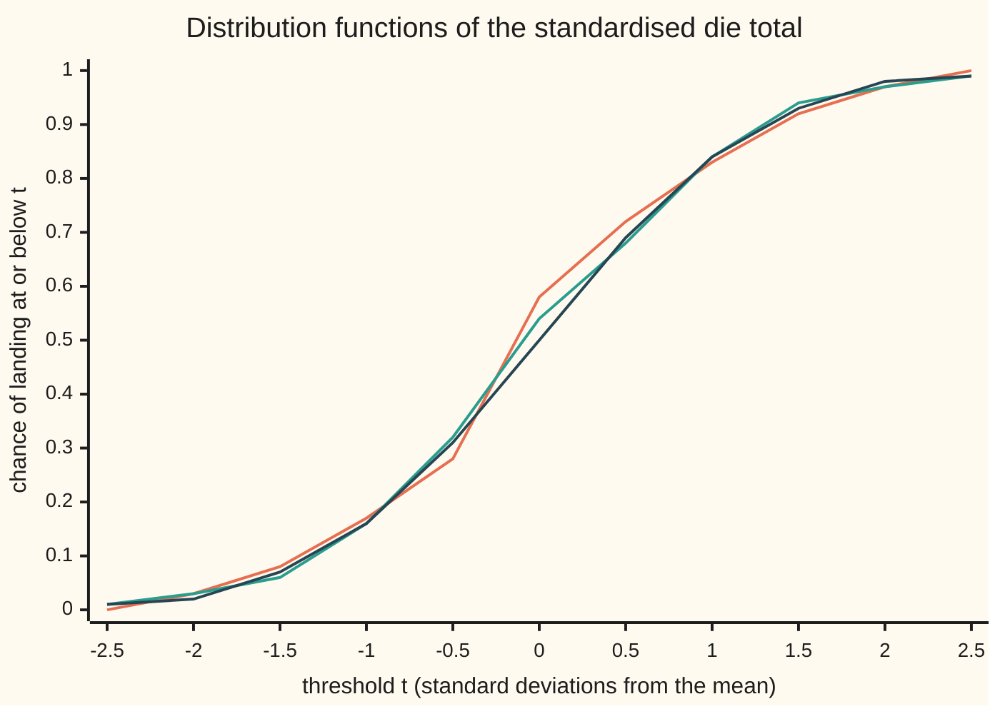

# Convergence in distribution: laws converge when their distribution functions converge at every continuity point, which is the same as averages of bounded continuous functions converging

Measure and integration → The Limit Theorems, Proved → Laws that settle → Convergence in distribution

---

## General Overview

Roll a fair die twice and add the faces. The total runs from 2 to 12, and 21 of the 36 equally likely outcomes give 7 or less. Now measure the total from its mean, 7, in units of its standard deviation, and call the result the standardised total. Its chance of landing at or below 0 is 21/36, or 0.5833. The standard bell curve, the normal law, gives 0.5 for the same question.

Roll 10 dice and the same chance is 0.5363. Roll 100 and it is 0.5117. The chance of landing at or below a threshold, read as a function of the threshold, is the **distribution function**. The worst gap between the dice's distribution function and the bell's falls from 0.1434 with one die to 0.0833, 0.0371 and 0.0117 with 2, 10 and 100 dice. Yet the standardised total never becomes a bell: it takes finitely many values and has no density. Only the chances below each threshold settle.

A second case is sharper. Pick one of the ten numbers 0.1, 0.2, …, 1 at random. Its chance of being at most 1/3 is 3/10. With the hundred numbers 0.01, …, 1 it is 33/100; with a thousand, 333/1000. A number drawn evenly from 0 to 1 is at most 1/3 with chance 1/3. The chances converge. But every discrete draw is a fraction, so it is a rational number with probability 1, while the even draw is rational with probability 0. The **laws**, the chances each draw gives to every set of numbers, approach each other in one sense only: **convergence in distribution**, called **weak convergence** when said of the laws.

**A sequence of random variables converges in distribution when its distribution functions converge at every threshold where the limit's distribution function does not jump; this is the same as the average of every bounded continuous function converging. It compares laws only, so convergence in probability forces it, and it forces nothing back except when the limit is a constant.**

**What kind of fact this is:** a definition (convergence in distribution) and three theorems about it, all proved on this card in Why it works: its two forms are equivalent, convergence in probability implies it, and it implies convergence in probability when the limit is a constant.

### The picture: two dice, ten dice, and the bell



Orange: two dice, a staircase sampled at eleven thresholds. Green: ten dice. Dark blue: the normal distribution function. The chart joins sampled points with straight lines; the dice curves are really staircases, whose steps shrink as the dice multiply. The code prints all three rows.

---

## The formula

Notation first, in words. A random variable X on a probability space $(\Omega, \mathcal{F}, P)$ carries the probability onto the line; the result is its **law** $\mu_X$, and its distribution function is $F_X(t) = P(X \le t)$ ([pushforward-and-the-law](../03-Measurable%20Functions/05-pushforward-and-the-law.md)). A distribution function never falls and may jump. A **continuity point** of $F$ is a threshold $t$ where it does not jump: the limit from the left, written $F(t-)$, equals $F(t)$. For a sequence $X_1, X_2, \dots$ write $F_n$ for the distribution function of $X_n$, $\mu_n$ for its law, and $F$, $\mu$ for those of $X$. The double arrow $\Rightarrow$ is read "converges in distribution to".

$$X_n \Rightarrow X \quad\text{means}\quad F_n(t) \to F(t) \ \text{ at every continuity point } t \text{ of } F$$

**Read it aloud:** X_n converges in distribution to X when, at every threshold where the limit does not jump, the chance that X_n lands at or below it tends to the chance that X does.

The second form tests laws with functions. A **test function** is a bounded continuous $f$ on the line; its average under a law is $\int f \, d\mu$ ([expectation-as-an-integral](../04-The%20Lebesgue%20Integral/06-expectation-as-an-integral.md)):

$$\mu_n \Rightarrow \mu \quad\text{means}\quad \int f \, d\mu_n \to \int f \, d\mu \ \text{ for every bounded continuous } f$$

**Read it aloud:** the laws converge weakly when the average of every bounded continuous function under them converges to its average under the limit.

The card proves three results. First, the two forms say the same thing: $X_n \Rightarrow X$ exactly when $\mu_n \Rightarrow \mu$. Second, when $X_n$ and $X$ live on one probability space, for every threshold $t$ and tolerance $\varepsilon > 0$:

$$F(t - \varepsilon) - P(|X_n - X| > \varepsilon) \;\le\; F_n(t) \;\le\; F(t + \varepsilon) + P(|X_n - X| > \varepsilon)$$

**Read it aloud:** the chance below t for X_n is pinned between the limit's chances a little below and above t, give or take the chance that the variables are more than ε apart.

Third, for a constant limit $c$:

$$P(|X_n - c| \ge \varepsilon) \;\le\; F_n(c - \varepsilon) + 1 - F_n(c + \varepsilon/2)$$

**Read it aloud:** missing c by ε or more means landing ε below it or more than half of ε above it.

The die example: $S_n$ is the total of $n$ rolls, of mean 3.5n and variance 35n/12, and

$$Z_n = \frac{S_n - 3.5\,n}{\sqrt{35\,n/12}}, \qquad \Phi(t) = \int_{-\infty}^{t} \frac{e^{-x^2/2}}{\sqrt{2\pi}} \, dx$$

**Read it aloud:** the total's miss from its mean in standard deviations, and the area under the bell left of t.

| Symbol | Plain meaning | In our example | Push it up and the answer… |
| --- | --- | --- | --- |
| $\Omega$, $\mathcal{F}$, $P$ | a probability space: outcomes, the sets we may measure, their chances | one die roll: six faces, equally likely | — |
| $X_n$, $X$, $\Rightarrow$ | the n-th random variable, the proposed limit, and "converges in distribution to" | $Z_n$, and a variable with the normal law | — |
| $\mu_n$, $\mu$, $\mu_X$ | laws: the probability each variable carries onto the line | the law of the standardised total of 10 rolls; the bell | — |
| $F_n$, $F$, $F_X$ | distribution functions, the chance of landing at or below t | $F_2(0) = 0.5833$ | rises with t, never falls |
| $t$, $a$, $b$, $t_i$ | thresholds; in the proof a, b and the $t_i$ are continuity points | 0 for the die; 1/3 for the fractions | a larger t, a larger chance |
| $f$, $K$, $s$ | a bounded continuous test function, a bound on its size, a staircase copy of it | x squared, capped at 1; K = 1 | — |
| $x$, $u$ | a point on the line; the frequency in $\cos(ux)$ and $\sin(ux)$ | x in [0, 1] for the fractions | — |
| $G$, $\nu$ | any law and its distribution function, in Theorem 1's proof | — | — |
| $k$, $m$ | counters: the fraction k/n; the number of pieces of [a, b] | k/n = 3/10 | — |
| $g$, $h$ | ramps: continuous stand-ins for "at or below t" | g falls from 1 to 0 on [t, t + ε] | — |
| $S_n$, $Z_n$, $n$ | the total of n die rolls, its standardised form, the number of rolls | n = 2: 21 of 36 totals at or below 7 | more rolls, a smaller worst gap |
| $\Phi$ | the normal distribution function | $\Phi(0) = 0.5$, $\Phi(1) = 0.841345$ | — |
| $U_n$, $U$ | one of 1/n, 2/n, …, 1 at random; an even draw from (0, 1) | $F_{10}(1/3) = 3/10$ | more fractions, a smaller gap |
| $\varepsilon$, $\eta$, $\delta$ | small tolerances | ε = 0.1 for the running average | larger ε, a smaller miss chance |
| $c$, $A_n$, $D$ | a constant limit; the running average of n rolls; one roll | c = 3.5 | — |

### When it holds

- **Laws on the line, nothing more.** Only $\mu_n$ and $\mu$ enter. The variables may live on different probability spaces, where "how far apart" has no meaning.
- **Continuity points only.** The constant $X_n = 1/n$ has $F_n(0) = 0$ at every n, while its limit 0 has $F(0) = 1$. Demanding convergence at the limit's jump would reject the plainest example there is.
- **The limit must be a law.** Centre the die total without dividing by its spread, and the chance of landing at or below 10 falls 0.9748, 0.7304, 0.5771 at 10, 100 and 1,000 rolls, heading for 1/2 at every threshold. That is no distribution function: half the probability escapes each way. Laws that let no mass escape are called **tight**.
- **Bounded continuous test functions only.** An indicator of the rationals averages 1 under every $U_n$ and 0 under $U$. An unbounded function fails too; the table in Worked numbers shows one.

---

## Why it works

### Step 0: compare laws, not values, through almost-indicators

A distribution function is an average: $F(t)$ is the average of the indicator $\mathbf{1}_{(-\infty, t]}$, one at or below t and zero above. That indicator jumps, so it is not a test function. But it can be squeezed between two continuous ramps that differ from it only on a stretch of width ε. Every proof on this card is that squeeze, one way or the other, and only laws enter it.

### Step 1: averages converging force distribution functions to converge

Take the ramp $g$: 1 up to t, 0 from t + ε, straight in between. Take $h$, the same ramp moved left by ε. Then $h \le \mathbf{1}_{(-\infty, t]} \le g$ at every point, so under each law $\int h \, d\mu_n \le F_n(t) \le \int g \, d\mu_n$. Let n grow: the outer averages converge by hypothesis. And $h$ is at least the indicator of $(-\infty, t - \varepsilon]$, while $g$ is at most that of $(-\infty, t + \varepsilon]$. So eventually $F_n(t)$ sits between $F(t - \varepsilon)$ and $F(t + \varepsilon)$, up to any small margin. At a continuity point both ends close on $F(t)$ as ε shrinks.

At a jump they do not: for $X_n = 1/n$ the ends are 0 and 1, and $F_n(0) = 0$ never moves. At the continuity point 0.01, $F_n(0.01)$ is 0 at n = 10 and 1 from n = 100 on, matching the limit.

### Step 2: distribution functions converging force averages to converge

This is the harder direction. A test function is not a combination of finitely many indicators, so it must be approximated by one. Three facts do it.

A distribution function has at most countably many jumps: each jump spans its own open stretch of the vertical axis, each such stretch holds a rational number, and there are only countably many rationals. So continuity points are **dense**: every interval, however short, contains some.

Cut off the tails. Pick continuity points a and b so far out that the limit law puts less than η below a and less than η above b. Inside [a, b], a continuous f varies by less than η over any short enough step, because a continuous function on a closed bounded interval is uniformly continuous. Split [a, b] at continuity points $t_0 = a < t_1 < \dots < t_m = b$, close enough together that f moves by less than η on each piece, and let the staircase $s$ take the value $f(t_i)$ on each piece $(t_{i-1}, t_i]$.

The staircase's average under $\mu_n$ is a finite sum of values of f times differences of $F_n$ at continuity points, so it converges. The staircase misses f by less than η inside [a, b], and by at most the bound K outside, where little mass sits. So the average of f converges within a margin proportional to η, and η was arbitrary.

The fractions show it plainly. The average of a function under $U_n$ is $(1/n)\sum_k f(k/n)$: a Riemann sum. For x squared it is 0.385, 0.33835 and 0.3338335 at n = 10, 100 and 1,000, tending to the integral 1/3. Step 2 is a Riemann-sum argument that works under any law.

### Step 3: convergence in probability forces convergence in distribution

Now $X_n$ and $X$ share one space. If $X_n \le t$, then either $X \le t + \varepsilon$ or the two differ by more than ε. Adding the chances of the two cases gives the right half of the sandwich in The formula; the left half is the same argument turned round. When $P(|X_n - X| > \varepsilon) \to 0$, the sandwich closes on $F(t)$ at each continuity point, as in Step 1.

The fractions can be built this way. Draw U evenly from (0, 1) and round it up to the next multiple of 1/n: the result takes each value k/n with chance 1/n, so it is a copy of $U_n$, and it is never more than 1/n from U. It converges to U at every outcome, so in probability, so in distribution.

### Step 4: towards a constant, convergence in distribution is convergence in probability

A constant c has the distribution function that is 0 below c and 1 from c on. Every threshold except c is a continuity point. So $F_n(c - \varepsilon) \to 0$ and $F_n(c + \varepsilon/2) \to 1$, and the third formula sends the chance of missing c by ε to 0.

The running average $A_n = S_n / n$ of die rolls tends to 3.5 in distribution ([weak-law-of-large-numbers](03-weak-law-of-large-numbers.md)). Its chance of missing 3.5 by at least 0.1 is 0.9273 at 10 rolls, 0.5785 at 100 and 0.0654 at 1,000, so the chance of landing within 0.1 at 1,000 rolls is 0.9346, the exact count found in [law-of-large-numbers](../../09-Probability%20and%20statistics/06-Limit%20Theorems%20in%20Practice/01-law-of-large-numbers.md). Chebyshev's bound gives 0.2917 at 1,000 rolls: true, and loose.

### Step 5: nothing stronger follows, because only laws are compared

Let D be one die roll and set every $X_n$ equal to 7 − D, the face underneath. It takes the values 1 to 6 with equal chances, so it has the law of D, and $X_n \Rightarrow D$ trivially. Yet $|X_n - D| = |7 - 2D|$ is 5, 3, 1, 1, 3 or 5, never less than 1. Convergence in distribution holds; convergence in probability fails at every n.

On a probability space every other mode forces convergence in probability ([modes-of-convergence](../05-Swapping%20Limits%20and%20Integrals/04-modes-of-convergence.md)), which forces this one by Step 3. Convergence in distribution is the weakest mode.

<details>
<summary>Detailed proof</summary>

Laws are Borel probability measures on the line, each determined by its distribution function ([lebesgue-stieltjes-measures](../02-Length%20Done%20Properly/06-lebesgue-stieltjes-measures.md)).

**Lemma A (jumps are countable).** Let F be non-decreasing. For a jump at t the open interval $(F(t-), F(t))$ is non-empty; for jumps at s < t the intervals are disjoint, since $F(s) \le F(t-)$. Choosing a rational in each gives a one-to-one map from jumps into the rationals, so the jumps are countable. Every non-empty open interval of thresholds is uncountable, so it contains continuity points: they are dense.

**Lemma B (the limit is unique).** If $F_n \to F$ and $F_n \to G$ at the continuity points of each, then F = G off a countable set, hence on a dense set, and right-continuity gives F = G everywhere, so the laws agree.

**Theorem 1, averages to distribution functions.** Fix a continuity point t of F and ε > 0. Put $g(x) = 1$ for $x \le t$, $g(x) = 0$ for $x \ge t + \varepsilon$, linear between, and $h(x) = g(x + \varepsilon)$. Both are bounded and continuous, and $\mathbf{1}_{(-\infty, t - \varepsilon]} \le h \le \mathbf{1}_{(-\infty, t]} \le g \le \mathbf{1}_{(-\infty, t + \varepsilon]}$ pointwise. The integral keeps order, so $\int h \, d\mu_n \le F_n(t) \le \int g \, d\mu_n$. Taking limits, $F(t - \varepsilon) \le \int h \, d\mu \le \liminf F_n(t) \le \limsup F_n(t) \le \int g \, d\mu \le F(t + \varepsilon)$. Let ε fall to 0: right-continuity and continuity at t make both ends F(t).

**Theorem 1, distribution functions to averages.** Let f be continuous with $|f| \le K$ and η > 0. By Lemma A, choose continuity points a < b with $F(a) < \eta$ and $1 - F(b) < \eta$. f is uniformly continuous on [a, b], so there is δ > 0 with $|f(x) - f(y)| < \eta$ whenever x, y lie in [a, b] within δ. By density choose continuity points $a = t_0 < \dots < t_m = b$ with $t_i - t_{i-1} < \delta$, and put $s = \sum_i f(t_i) \mathbf{1}_{(t_{i-1}, t_i]}$. Then $|f - s| < \eta$ on (a, b] and $|f - s| = |f| \le K$ off it, so for any law ν with distribution function G, $|\int f \, d\nu - \int s \, d\nu| \le \eta + K\big(G(a) + 1 - G(b)\big)$. Next, $\int s \, d\mu_n = \sum_i f(t_i)(F_n(t_i) - F_n(t_{i-1}))$, a finite sum whose terms converge, so it tends to $\int s \, d\mu$. And $F_n(a) + 1 - F_n(b) \to F(a) + 1 - F(b) < 2\eta$. The triangle inequality gives $\limsup |\int f \, d\mu_n - \int f \, d\mu| \le (\eta + 2K\eta) + 0 + (\eta + 2K\eta) = 2\eta(1 + 2K)$. As η is arbitrary, the limit is 0.

**Theorem 2, in probability to in distribution.** Let $X_n$, X be measurable on one space $(\Omega, \mathcal{F}, P)$. For any t and ε > 0, $\{X_n \le t\} \subseteq \{X \le t + \varepsilon\} \cup \{|X_n - X| > \varepsilon\}$: if the first fails, $X > t + \varepsilon \ge X_n + \varepsilon$. Subadditivity gives the right half of the sandwich. Likewise $\{X \le t - \varepsilon\} \subseteq \{X_n \le t\} \cup \{|X_n - X| > \varepsilon\}$ gives the left half. If $P(|X_n - X| > \varepsilon) \to 0$ for every ε, then $F(t - \varepsilon) \le \liminf F_n(t) \le \limsup F_n(t) \le F(t + \varepsilon)$, and at a continuity point ε falling to 0 gives the limit F(t).

**Theorem 3, a constant limit.** The law of the constant c has distribution function $\mathbf{1}_{[c, \infty)}$, continuous at every t ≠ c. For ε > 0, $\{|X_n - c| \ge \varepsilon\} \subseteq \{X_n \le c - \varepsilon\} \cup \{X_n > c + \varepsilon/2\}$, so $P(|X_n - c| \ge \varepsilon) \le F_n(c - \varepsilon) + 1 - F_n(c + \varepsilon/2) \to 0 + 1 - 1 = 0$.

**Theorem 4, no converse.** On the six faces with equal chances let $X_n = 7 - D$ for every n. For each k from 1 to 6, $P(7 - D = k) = P(D = 7 - k)$, the same for every k, so $X_n$ and D have one law and $X_n \Rightarrow D$. But 7 − 2D is odd, so $|X_n - D| \ge 1$ at every outcome and $P(|X_n - D| \ge 1) = 1$ for every n.

</details>

<details>
<summary>Why densities are the wrong test</summary>

The standardised die total and the fractions $U_n$ have no density against length at all: they live on finitely many points. Densities can also exist and still fail to settle while laws converge. The density $1 + \cos(2\pi n x)$ on (0, 1) oscillates ever faster and converges at almost no point, yet averages of any continuous function under it tend to the averages under the even law, since the wiggles cancel. Convergence of densities at almost every point is a stronger mode: by Scheffé's lemma it makes the chance of every set converge, which convergence in distribution does not.

</details>

<details>
<summary>Why the worst gap shrinks too</summary>

When the limit F is continuous everywhere, as the bell is, convergence at each threshold is automatically uniform (Pólya's theorem). Pick finitely many thresholds where F climbs by at most 1/k from one to the next; since neither $F_n$ nor F falls, between two of them they differ by at most 1/k plus the gaps at the ends. So the worst gap for the dice, 0.0117 at 100 rolls, measures the whole approach. It is about half the largest jump, 0.0233: the staircase straddles the bell.

</details>

A second road to all of this runs through the averages of the two test functions $\cos(ux)$ and $\sin(ux)$ for every real u, the characteristic function of a law; Lévy's continuity theorem says their convergence is equivalent to convergence in distribution ([characteristic-functions](06-characteristic-functions.md), levy-continuity-theorem).

---

## Worked numbers, by hand

| Step | Arithmetic | Value |
| --- | --- | --- |
| two dice, totals at or below 7 | 1 + 2 + 3 + 4 + 5 + 6 | 21 of 36 |
| $F_2(0)$ | 21/36 | 0.5833 |
| the bell at 0 | half the area, by symmetry | $\Phi(0) = 0.5$ |
| largest single jump at n = 2 | total 7, 6 ways of 36 | 0.1667 |
| worst gap, n = 1, 2, 10, 100 | largest of the gaps at each jump | 0.1434, 0.0833, 0.0371, **0.0117** |
| fractions, n = 10 | 0.1, 0.2, 0.3 are at most 1/3 | $F_{10}(1/3) = 3/10$ |
| average of x squared, n = 10 | (1 + 4 + … + 100)/1,000 = 385/1,000 | 0.385, limit 1/3 |
| running average, 1,000 rolls | chance of missing 3.5 by 0.1 or more | **0.0654** |
| Chebyshev's bound for it | 35/(12 × 1,000 × 0.01) | 0.2917 |

At 100 rolls, the chance that the total is at most its mean is 0.5117, not 0.5. The total lands exactly on its mean with chance 0.0233; by symmetry half of that atom is the excess over 0.5. The jumps shrink like one over the standard deviation, and so does the error of reading the bell at a lattice point.

### What breaks if you drop a piece

| Mistake | Comes out at | What went wrong |
| --- | --- | --- |
| Demand convergence at the limit's jump | $X_n = 1/n$: $F_n(0) = 0$ at n = 10, 100, 1,000, against F(0) = 1 | 0 is where the limit jumps; Step 1's squeeze cannot close there |
| Centre the die total but do not scale it | F(10) = 0.9748, 0.7304, 0.5771 at n = 10, 100, 1,000, heading to 1/2 | the spread grows, mass escapes both ways, and the limit is no law |
| Use an unbounded test function | $X_n = n$ with chance 1/n, else 0: $F_n(1/2)$ = 9/10, 99/100, 999/1000, yet the mean stays 1 | the mean averages the unbounded x; the capped average of min(x, 1) is 1/n and does follow the law |
| Read equal laws as close values | 7 − D has D's law, yet the gap is 5 3 1 1 3 5 | the definition never compares values |

The code prints all four.

---

## Code, from first principles, and it actually runs

The code checks finite n; that the gaps vanish in the limit rests on the proofs. The core numbers take two roads that share no arithmetic. Die totals are counted exactly by adding one die at a time and by inclusion-exclusion, at n = 2 and 10; a floating-point copy of the first road, checked against the exact counts, reaches 100 and 1,000 rolls. The normal distribution function comes from its power series and from Simpson's rule. The fractions' chances and averages come from a direct count and a closed form. Step 1's ramps are tested against $X_n = 1/n$, and the counterexamples are computed from their laws. The running-average chances meet Chebyshev's bound and the law-of-large-numbers card's exact count. The Rust repeats all of it with hand-written integer arithmetic.

### Python

```python
# Convergence in distribution -- the check behind the card.  Standard library only.
# Each number is found by two roads that share no arithmetic: die totals are
# counted by adding one die at a time and by inclusion-exclusion; the normal
# distribution function by its power series and by Simpson's rule; the discrete
# uniform's averages by a direct sum and by a closed form.  The code checks
# finite n only; every statement about the limit rests on the proofs.
from fractions import Fraction as Q
from math import sqrt, pi, exp

def choose(a, b):                        # binomial coefficient, exact
    r = 1
    for i in range(b):
        r = r * (a - i) // (i + 1)
    return r

def counts_by_adding(n):                 # ways to roll each total s (the index) with n dice
    w = [1]
    for _ in range(n):
        new = [0] * (len(w) + 6)
        for s, c in enumerate(w):
            for face in range(1, 7):
                new[s + face] += c
        w = new
    return w

def counts_by_formula(n):                # inclusion-exclusion over faces pushed past 6
    return [sum((-1) ** k * choose(n, k) * choose(s - 6 * k - 1, n - 1)
                for k in range(n + 1) if s - 6 * k >= n) for s in range(6 * n + 1)]

def probs(n):                            # the same law in floating point: sum of six, over 6
    p = [1.0]
    for _ in range(n):
        pad = [0.0] * 6 + p + [0.0] * 6
        p = [sum(pad[s:s + 6]) / 6 for s in range(len(p) + 6)]
    return p

def phi_series(t):                       # 1/2 + sum (-1)^k t^(2k+1) / (2^k k! (2k+1)) / sqrt(2 pi)
    term, total = t, 0.0
    for k in range(80):
        total += term / (2 * k + 1)
        term *= -t * t / 2 / (k + 1)
    return 0.5 + total / sqrt(2 * pi)

def phi(t, m=2000):                      # 1/2 + Simpson's rule for the bell density on [0, t]
    h, s = t / m, 1 + exp(-t * t / 2)
    for i in range(1, m):
        x = i * h
        s += (4 if i % 2 else 2) * exp(-x * x / 2)
    return 0.5 + s * h / 3 / sqrt(2 * pi)

def cdf(p, x):                           # P(S <= x) from a list indexed by total
    return sum(p[s] for s in range(len(p)) if s <= x)

def f4(x):
    return f"{x:.4f}"

P = {n: probs(n) for n in (1, 2, 10, 100, 1000)}
exact = {n: (counts_by_adding(n), counts_by_formula(n)) for n in (2, 10)}
print("die: S_n = total of n rolls, Z_n = (S_n - 3.5 n) / sqrt(35 n / 12)")
yes = lambda b: "yes" if b else "no"
print(f"counts by adding dice = counts by inclusion-exclusion: n=2 {yes(exact[2][0] == exact[2][1])} "
      f"({sum(exact[2][0])} outcomes), n=10 {yes(exact[10][0] == exact[10][1])} ({sum(exact[10][0])} outcomes)")
print("n=2 counts of totals 2..12:", " ".join(map(str, exact[2][0][2:])), f"; {sum(exact[2][0][:8])} of 36 at or below 7")
float_err = max(abs(P[10][s] - Q(c, 6 ** 10)) for s, c in enumerate(exact[10][0]))
print(f"n=10 floating-point law against exact fractions, worst gap below 1e-15: {yes(float_err < 1e-15)}")
ts = [x / 2 for x in range(-5, 6)]
ser = [phi_series(t) for t in ts]
simp = [phi(t) for t in ts]
print(f"Phi by series and by Simpson, t = 0.5, 1, 2: {ser[6]:.6f} {simp[6]:.6f}, "
      f"{ser[7]:.6f} {simp[7]:.6f}, {ser[9]:.6f} {simp[9]:.6f}")
Fz = lambda n, t: cdf(P[n], 3.5 * n + t * sqrt(35 * n / 12))
print("chart t:   ", ", ".join(f"{t:g}" for t in ts))
for n in (2, 10):
    print(f"chart F_{n}:{' ' * (3 - len(str(n)))}", ", ".join(f"{Fz(n, t):.2f}" for t in ts))
print("chart Phi: ", ", ".join(f"{x:.2f}" for x in simp))
gaps = {}
for n in (1, 2, 10, 100):                # sup |F_n - Phi| is reached at a jump of F_n
    sd, below, worst = sqrt(35 * n / 12), 0.0, 0.0
    for s in range(n, 6 * n + 1):
        ph = phi((s - 3.5 * n) / sd)
        worst = max(worst, abs(below - ph), abs(below + P[n][s] - ph))
        below += P[n][s]
    gaps[n] = worst
    print(f"n={n:3d}: F_n(0) = {f4(Fz(n, 0))}, largest jump {f4(max(P[n]))}, sup |F_n - Phi| = {f4(worst)}")

print("discrete uniform U_n on {1/n, ..., 1}; for U uniform on (0, 1), F(1/3) = 1/3 and E[U^2] = 1/3")
unif = []
for n in (10, 100, 1000):
    count = sum(1 for k in range(1, n + 1) if 3 * k <= n)
    sq_sum, sq_form = sum(Q(k * k, n ** 3) for k in range(1, n + 1)), Q((n + 1) * (2 * n + 1), 6 * n * n)
    unif.append((count, n // 3, sq_sum, sq_form))
    print(f"n={n:4d}: F_n(1/3) = {count}/{n} (formula floor(n/3)/n = {n // 3}/{n}), "
          f"E[U_n^2] = {float(sq_sum):.7f} (closed form {float(sq_form):.7f})")
ramp = lambda x, t, e: min(1.0, max(0.0, (t + e - x) / e))   # Step 1's g: 1 up to t, 0 from t + e
point = [(n, int(1 / n <= 0), int(1 / n <= 0.01)) for n in (10, 100, 1000)]
print("X_n = 1/n: n, F_n(0), F_n(0.01):", "; ".join(f"{a}, {b}, {c}" for a, b, c in point),
      "; limit F(0) = 1, F(0.01) = 1")
squeeze = all(ramp(1 / n + e, t, e) <= (1 / n <= t) <= ramp(1 / n, t, e)
              for n in (10, 100, 1000) for t in (0, 0.02, 0.2) for e in (0.001, 0.05))
print(f"ramps h <= F_n(t) <= g for X_n = 1/n at t = 0, 0.02, 0.2: {yes(squeeze)}")
faces = list(range(1, 7))
under = [7 - d for d in faces]                          # the face underneath, outcome by outcome
law = lambda xs: {v: Q(xs.count(v), len(xs)) for v in xs}   # six equally likely outcomes
near = sum(Q(1, 6) for d, u in zip(faces, under) if abs(u - d) < 1)
print("flip 7 - D: law equals D's law:", yes(law(under) == law(faces)), "; |(7 - D) - D| for D = 1..6:",
      " ".join(str(abs(u - d)) for d, u in zip(faces, under)), f"; P(|(7 - D) - D| < 1) = {near}")
lump = []
for n in (10, 100, 1000):                               # X_n = n with chance 1/n, else 0
    lw = {0: 1 - Q(1, n), n: Q(1, n)}
    lump.append((n, sum(p for x, p in lw.items() if x <= Q(1, 2)), sum(x * p for x, p in lw.items()),
                 sum(min(x, 1) * p for x, p in lw.items())))
print("X_n = n with chance 1/n, else 0: n, F_n(1/2), E[X_n], E[min(X_n, 1)]:",
      "; ".join(f"{a}, {b}, {c}, {d}" for a, b, c, d in lump), "; limit 0: 1, 0, 0")

print("running average A_n = S_n / n against the constant 3.5, gap at least 0.1:")
far = {}
for n in (10, 100, 1000):
    far[n] = sum(p for s, p in enumerate(P[n]) if 10 * abs(2 * s - 7 * n) >= 2 * n)
    print(f"n={n:4d}: P(|A_n - 3.5| >= 0.1) = {f4(far[n])}, Chebyshev bound 35/(12 n 0.01) = {f4(35 / (12 * n * 0.01))}")
tight = sum(p for s, p in enumerate(P[1000]) if 10 * abs(2 * s - 7000) >= 1000)   # tolerance 0.05
print(f"n=1000: P(|A_n - 3.5| < 0.1) = {f4(1 - far[1000])}; tolerance 0.05: P(|A_n - 3.5| >= 0.05) = {f4(tight)}")
nosc = {n: cdf(P[n], 3.5 * n + 10) for n in (10, 100, 1000)}
print("centred, unscaled S_n - 3.5 n: F(10) at n = 10, 100, 1000:", ", ".join(f4(nosc[n]) for n in nosc))

assert exact[2][0] == exact[2][1] and exact[10][0] == exact[10][1] and float_err < 1e-15
assert max(abs(a - b) for a, b in zip(ser, simp)) < 1e-10          # two roads to Phi
assert all(a == b and c == d for a, b, c, d in unif)                  # uniform: count and sum, two roads
assert gaps[1] > gaps[2] > gaps[10] > gaps[100] and abs(gaps[100] - max(P[100]) / 2) < 1e-3
assert round(1 - far[1000], 4) == 0.9346                              # wing 09's exact count
assert all(far[n] <= 35 / (12 * n * 0.01) for n in far)                # Chebyshev, a separate road
assert squeeze                                                              # Step 1's squeeze, at the jump and off it
assert law(under) == law(faces) and near == 0                                # same law, never close
assert all(m == 1 and c == Q(1, n) for n, _, m, c in lump)   # law's mean against n * (1/n) = 1; capped mean against 1/n
assert nosc[10] > nosc[100] > nosc[1000] > 0.5
```

**Ran 2026-10-07 on macOS, Python 3.14.6, standard library only. All checks passed. Output, pasted from the run:**

```
die: S_n = total of n rolls, Z_n = (S_n - 3.5 n) / sqrt(35 n / 12)
counts by adding dice = counts by inclusion-exclusion: n=2 yes (36 outcomes), n=10 yes (60466176 outcomes)
n=2 counts of totals 2..12: 1 2 3 4 5 6 5 4 3 2 1 ; 21 of 36 at or below 7
n=10 floating-point law against exact fractions, worst gap below 1e-15: yes
Phi by series and by Simpson, t = 0.5, 1, 2: 0.691462 0.691462, 0.841345 0.841345, 0.977250 0.977250
chart t:    -2.5, -2, -1.5, -1, -0.5, 0, 0.5, 1, 1.5, 2, 2.5
chart F_2:   0.00, 0.03, 0.08, 0.17, 0.28, 0.58, 0.72, 0.83, 0.92, 0.97, 1.00
chart F_10:  0.01, 0.03, 0.06, 0.16, 0.32, 0.54, 0.68, 0.84, 0.94, 0.97, 0.99
chart Phi:  0.01, 0.02, 0.07, 0.16, 0.31, 0.50, 0.69, 0.84, 0.93, 0.98, 0.99
n=  1: F_n(0) = 0.5000, largest jump 0.1667, sup |F_n - Phi| = 0.1434
n=  2: F_n(0) = 0.5833, largest jump 0.1667, sup |F_n - Phi| = 0.0833
n= 10: F_n(0) = 0.5363, largest jump 0.0727, sup |F_n - Phi| = 0.0371
n=100: F_n(0) = 0.5117, largest jump 0.0233, sup |F_n - Phi| = 0.0117
discrete uniform U_n on {1/n, ..., 1}; for U uniform on (0, 1), F(1/3) = 1/3 and E[U^2] = 1/3
n=  10: F_n(1/3) = 3/10 (formula floor(n/3)/n = 3/10), E[U_n^2] = 0.3850000 (closed form 0.3850000)
n= 100: F_n(1/3) = 33/100 (formula floor(n/3)/n = 33/100), E[U_n^2] = 0.3383500 (closed form 0.3383500)
n=1000: F_n(1/3) = 333/1000 (formula floor(n/3)/n = 333/1000), E[U_n^2] = 0.3338335 (closed form 0.3338335)
X_n = 1/n: n, F_n(0), F_n(0.01): 10, 0, 0; 100, 0, 1; 1000, 0, 1 ; limit F(0) = 1, F(0.01) = 1
ramps h <= F_n(t) <= g for X_n = 1/n at t = 0, 0.02, 0.2: yes
flip 7 - D: law equals D's law: yes ; |(7 - D) - D| for D = 1..6: 5 3 1 1 3 5 ; P(|(7 - D) - D| < 1) = 0
X_n = n with chance 1/n, else 0: n, F_n(1/2), E[X_n], E[min(X_n, 1)]: 10, 9/10, 1, 1/10; 100, 99/100, 1, 1/100; 1000, 999/1000, 1, 1/1000 ; limit 0: 1, 0, 0
running average A_n = S_n / n against the constant 3.5, gap at least 0.1:
n=  10: P(|A_n - 3.5| >= 0.1) = 0.9273, Chebyshev bound 35/(12 n 0.01) = 29.1667
n= 100: P(|A_n - 3.5| >= 0.1) = 0.5785, Chebyshev bound 35/(12 n 0.01) = 2.9167
n=1000: P(|A_n - 3.5| >= 0.1) = 0.0654, Chebyshev bound 35/(12 n 0.01) = 0.2917
n=1000: P(|A_n - 3.5| < 0.1) = 0.9346; tolerance 0.05: P(|A_n - 3.5| >= 0.05) = 0.3594
centred, unscaled S_n - 3.5 n: F(10) at n = 10, 100, 1000: 0.9748, 0.7304, 0.5771
```

### Rust

```rust
// Convergence in distribution -- the check behind the card.  Rust std only.
// Each number is found by two roads that share no arithmetic: die totals are
// counted by adding one die at a time and by inclusion-exclusion; the normal
// distribution function by its power series and by Simpson's rule; the discrete
// uniform's averages by a direct sum and by a closed form.  The code checks
// finite n only; every statement about the limit rests on the proofs.
use std::collections::BTreeMap;

fn choose(a: i128, b: i128) -> i128 {
    let mut r = 1;
    for i in 0..b {
        r = r * (a - i) / (i + 1);
    }
    r
}
fn counts_by_adding(n: usize) -> Vec<i128> {
    let mut w = vec![1i128];
    for _ in 0..n {
        let mut new = vec![0i128; w.len() + 6];
        for (s, &c) in w.iter().enumerate() {
            for face in 1..7 {
                new[s + face] += c;
            }
        }
        w = new;
    }
    w
}
fn counts_by_formula(n: i128) -> Vec<i128> {
    (0..6 * n + 1)
        .map(|s| (0..n + 1).filter(|&k| s - 6 * k >= n)
            .map(|k| (if k % 2 == 0 { 1 } else { -1 }) * choose(n, k) * choose(s - 6 * k - 1, n - 1)).sum())
        .collect()
}
fn probs(n: usize) -> Vec<f64> {
    let mut p = vec![1.0f64];
    for _ in 0..n {
        let mut pad = vec![0.0; 6];
        pad.extend(&p);
        pad.extend([0.0; 6]);
        p = (0..p.len() + 6).map(|s| pad[s..s + 6].iter().fold(0.0, |a, &b| a + b) / 6.0).collect();
    }
    p
}
fn phi_series(t: f64) -> f64 {
    let (mut term, mut total) = (t, 0.0);
    for k in 0..80 {
        total += term / (2 * k + 1) as f64;
        term *= -t * t / 2.0 / (k as f64 + 1.0);
    }
    0.5 + total / (2.0 * std::f64::consts::PI).sqrt()
}
fn phi(t: f64) -> f64 {
    let m = 2000;
    let (h, mut s) = (t / m as f64, 1.0 + (-t * t / 2.0).exp());
    for i in 1..m {
        let x = i as f64 * h;
        s += (if i % 2 == 1 { 4.0 } else { 2.0 }) * (-x * x / 2.0).exp();
    }
    0.5 + s * h / 3.0 / (2.0 * std::f64::consts::PI).sqrt()
}
fn cdf(p: &[f64], x: f64) -> f64 {
    p.iter().enumerate().filter(|&(s, _)| s as f64 <= x).fold(0.0, |a, (_, &v)| a + v)
}
fn gcd(a: i64, b: i64) -> i64 {
    if b == 0 { a.abs() } else { gcd(b, a % b) }
}
fn yes(b: bool) -> &'static str {
    if b { "yes" } else { "no" }
}
fn main() {
    let mut pr: BTreeMap<usize, Vec<f64>> = BTreeMap::new();
    for n in [1, 2, 10, 100, 1000] {
        pr.insert(n, probs(n));
    }
    let fz = |n: usize, t: f64| cdf(&pr[&n], 3.5 * n as f64 + t * ((35 * n) as f64 / 12.0).sqrt());
    let (a2, b2, a10, b10) = (counts_by_adding(2), counts_by_formula(2), counts_by_adding(10), counts_by_formula(10));
    println!("die: S_n = total of n rolls, Z_n = (S_n - 3.5 n) / sqrt(35 n / 12)");
    println!("counts by adding dice = counts by inclusion-exclusion: n=2 {} ({} outcomes), n=10 {} ({} outcomes)",
        yes(a2 == b2), a2.iter().sum::<i128>(), yes(a10 == b10), a10.iter().sum::<i128>());
    println!("n=2 counts of totals 2..12: {} ; {} of 36 at or below 7",
        a2[2..].iter().map(|c| c.to_string()).collect::<Vec<_>>().join(" "), a2[..8].iter().sum::<i128>());
    let float_err = a10.iter().enumerate().map(|(s, &c)| (pr[&10][s] - c as f64 / 60466176.0).abs()).fold(0.0, f64::max);
    println!("n=10 floating-point law against exact fractions, worst gap below 1e-15: {}", yes(float_err < 1e-15));
    let ts: Vec<f64> = (-5..6).map(|x| x as f64 / 2.0).collect();
    let ser: Vec<f64> = ts.iter().map(|&t| phi_series(t)).collect();
    let simp: Vec<f64> = ts.iter().map(|&t| phi(t)).collect();
    println!("Phi by series and by Simpson, t = 0.5, 1, 2: {:.6} {:.6}, {:.6} {:.6}, {:.6} {:.6}",
        ser[6], simp[6], ser[7], simp[7], ser[9], simp[9]);
    let row = |v: Vec<f64>| v.iter().map(|x| format!("{:.2}", x)).collect::<Vec<_>>().join(", ");
    println!("chart t:    {}", ts.iter().map(|t| t.to_string()).collect::<Vec<_>>().join(", "));
    for n in [2usize, 10] {
        println!("chart F_{}:{} {}", n, " ".repeat(3 - n.to_string().len()), row(ts.iter().map(|&t| fz(n, t)).collect()));
    }
    println!("chart Phi:  {}", row(simp.clone()));
    let mut gaps = Vec::new();
    for n in [1usize, 2, 10, 100] {
        let (sd, mut below, mut worst) = (((35 * n) as f64 / 12.0).sqrt(), 0.0f64, 0.0f64);
        let p = &pr[&n];
        for s in n..6 * n + 1 {
            let ph = phi((s as f64 - 3.5 * n as f64) / sd);
            worst = worst.max((below - ph).abs()).max((below + p[s] - ph).abs());
            below += p[s];
        }
        let jump = p.iter().cloned().fold(0.0, f64::max);
        gaps.push((worst, jump));
        println!("n={:3}: F_n(0) = {:.4}, largest jump {:.4}, sup |F_n - Phi| = {:.4}", n, fz(n, 0.0), jump, worst);
    }
    println!("discrete uniform U_n on {{1/n, ..., 1}}; for U uniform on (0, 1), F(1/3) = 1/3 and E[U^2] = 1/3");
    let mut unif_ok = true;
    for n in [10i128, 100, 1000] {
        let count = (1..n + 1).filter(|&k| 3 * k <= n).count() as i128;
        let (num, den) = ((1..n + 1).map(|k| k * k).sum::<i128>(), n * n * n);
        let (fnum, fden) = ((n + 1) * (2 * n + 1), 6 * n * n);
        unif_ok &= count == n / 3 && num * fden == fnum * den;
        println!("n={:4}: F_n(1/3) = {}/{} (formula floor(n/3)/n = {}/{}), E[U_n^2] = {:.7} (closed form {:.7})",
            n, count, n, n / 3, n, num as f64 / den as f64, fnum as f64 / fden as f64);
    }
    let point: Vec<(i32, i32, i32)> = [10, 100, 1000].iter()
        .map(|&n| (n, (1.0 / n as f64 <= 0.0) as i32, (1.0 / n as f64 <= 0.01) as i32)).collect();
    println!("X_n = 1/n: n, F_n(0), F_n(0.01): {} ; limit F(0) = 1, F(0.01) = 1",
        point.iter().map(|(a, b, c)| format!("{}, {}, {}", a, b, c)).collect::<Vec<_>>().join("; "));
    let ramp = |x: f64, t: f64, e: f64| ((t + e - x) / e).max(0.0).min(1.0); // Step 1's g: 1 up to t, 0 from t + e
    let mut squeeze = true;
    for n in [10.0f64, 100.0, 1000.0] { for t in [0.0, 0.02, 0.2] { for e in [0.001, 0.05] {
        let f = (1.0 / n <= t) as i32 as f64;
        squeeze &= ramp(1.0 / n + e, t, e) <= f && f <= ramp(1.0 / n, t, e);
    } } }
    println!("ramps h <= F_n(t) <= g for X_n = 1/n at t = 0, 0.02, 0.2: {}", yes(squeeze));
    let faces: Vec<i64> = (1..7).collect();
    let under: Vec<i64> = faces.iter().map(|d| 7 - d).collect(); // the face underneath, outcome by outcome
    let law = |xs: &[i64]| xs.iter().fold(BTreeMap::new(), |mut m, &v| { *m.entry(v).or_insert(0) += 1; m });
    let near = faces.iter().zip(&under).filter(|&(d, u)| (u - d).abs() < 1).count();
    println!("flip 7 - D: law equals D's law: {} ; |(7 - D) - D| for D = 1..6: {} ; P(|(7 - D) - D| < 1) = {}",
        yes(law(&under) == law(&faces)), faces.iter().zip(&under).map(|(d, u)| (u - d).abs().to_string()).collect::<Vec<_>>().join(" "), near);
    let frac = |a: i64, b: i64| if b / gcd(a, b) == 1 { (a / gcd(a, b)).to_string() } else { format!("{}/{}", a / gcd(a, b), b / gcd(a, b)) };
    let mut lump = Vec::new();
    for n in [10i64, 100, 1000] { // X_n = n with chance 1/n, else 0; chances as numerators over n
        let lw = [(0i64, n - 1), (n, 1)];
        let f_half: i64 = lw.iter().filter(|&&(x, _)| 2 * x <= 1).map(|&(_, p)| p).sum();
        lump.push((n, f_half, lw.iter().map(|&(x, p)| x * p).sum::<i64>(), lw.iter().map(|&(x, p)| x.min(1) * p).sum::<i64>()));
    }
    println!("X_n = n with chance 1/n, else 0: n, F_n(1/2), E[X_n], E[min(X_n, 1)]: {} ; limit 0: 1, 0, 0",
        lump.iter().map(|&(n, f, m, c)| format!("{}, {}, {}, {}", n, frac(f, n), frac(m, n), frac(c, n))).collect::<Vec<_>>().join("; "));
    println!("running average A_n = S_n / n against the constant 3.5, gap at least 0.1:");
    let mut far = Vec::new();
    for n in [10usize, 100, 1000] {
        let f = pr[&n].iter().enumerate().filter(|&(s, _)| 10 * (2 * s as i64 - 7 * n as i64).abs() >= 2 * n as i64)
            .fold(0.0, |a, (_, &v)| a + v);
        let cheb = 35.0 / ((12 * n) as f64 * 0.01);
        far.push((f, cheb));
        println!("n={:4}: P(|A_n - 3.5| >= 0.1) = {:.4}, Chebyshev bound 35/(12 n 0.01) = {:.4}", n, f, cheb);
    }
    let tight = pr[&1000].iter().enumerate().filter(|&(s, _)| 10 * (2 * s as i64 - 7000).abs() >= 1000).fold(0.0, |a, (_, &v)| a + v);
    println!("n=1000: P(|A_n - 3.5| < 0.1) = {:.4}; tolerance 0.05: P(|A_n - 3.5| >= 0.05) = {:.4}", 1.0 - far[2].0, tight);
    let nosc: Vec<f64> = [10usize, 100, 1000].iter().map(|&n| cdf(&pr[&n], 3.5 * n as f64 + 10.0)).collect();
    println!("centred, unscaled S_n - 3.5 n: F(10) at n = 10, 100, 1000: {}",
        nosc.iter().map(|x| format!("{:.4}", x)).collect::<Vec<_>>().join(", "));

    assert!(a2 == b2 && a10 == b10 && float_err < 1e-15);
    assert!(ser.iter().zip(&simp).all(|(a, b)| (a - b).abs() < 1e-10)); // two roads to Phi
    assert!(unif_ok); // uniform: count and sum, two roads
    assert!(gaps[0].0 > gaps[1].0 && gaps[1].0 > gaps[2].0 && gaps[2].0 > gaps[3].0 && (gaps[3].0 - gaps[3].1 / 2.0).abs() < 1e-3);
    assert!(((1.0 - far[2].0) * 1e4).round() == 9346.0); // wing 09's exact count
    assert!(far.iter().all(|&(f, c)| f <= c)); // Chebyshev, a separate road
    assert!(squeeze); // Step 1's squeeze, at the jump and off it
    assert!(law(&under) == law(&faces) && near == 0); // same law, never close
    assert!(lump.iter().all(|&(n, _, m, c)| m == n && c == 1)); // law's mean against n * (1/n) = 1; capped mean against 1/n
    assert!(nosc[0] > nosc[1] && nosc[1] > nosc[2] && nosc[2] > 0.5);
}
```

**Ran 2026-10-07 on macOS, rustc 1.98.1, no crates. All checks passed. Output, pasted from the run:**

```
die: S_n = total of n rolls, Z_n = (S_n - 3.5 n) / sqrt(35 n / 12)
counts by adding dice = counts by inclusion-exclusion: n=2 yes (36 outcomes), n=10 yes (60466176 outcomes)
n=2 counts of totals 2..12: 1 2 3 4 5 6 5 4 3 2 1 ; 21 of 36 at or below 7
n=10 floating-point law against exact fractions, worst gap below 1e-15: yes
Phi by series and by Simpson, t = 0.5, 1, 2: 0.691462 0.691462, 0.841345 0.841345, 0.977250 0.977250
chart t:    -2.5, -2, -1.5, -1, -0.5, 0, 0.5, 1, 1.5, 2, 2.5
chart F_2:   0.00, 0.03, 0.08, 0.17, 0.28, 0.58, 0.72, 0.83, 0.92, 0.97, 1.00
chart F_10:  0.01, 0.03, 0.06, 0.16, 0.32, 0.54, 0.68, 0.84, 0.94, 0.97, 0.99
chart Phi:  0.01, 0.02, 0.07, 0.16, 0.31, 0.50, 0.69, 0.84, 0.93, 0.98, 0.99
n=  1: F_n(0) = 0.5000, largest jump 0.1667, sup |F_n - Phi| = 0.1434
n=  2: F_n(0) = 0.5833, largest jump 0.1667, sup |F_n - Phi| = 0.0833
n= 10: F_n(0) = 0.5363, largest jump 0.0727, sup |F_n - Phi| = 0.0371
n=100: F_n(0) = 0.5117, largest jump 0.0233, sup |F_n - Phi| = 0.0117
discrete uniform U_n on {1/n, ..., 1}; for U uniform on (0, 1), F(1/3) = 1/3 and E[U^2] = 1/3
n=  10: F_n(1/3) = 3/10 (formula floor(n/3)/n = 3/10), E[U_n^2] = 0.3850000 (closed form 0.3850000)
n= 100: F_n(1/3) = 33/100 (formula floor(n/3)/n = 33/100), E[U_n^2] = 0.3383500 (closed form 0.3383500)
n=1000: F_n(1/3) = 333/1000 (formula floor(n/3)/n = 333/1000), E[U_n^2] = 0.3338335 (closed form 0.3338335)
X_n = 1/n: n, F_n(0), F_n(0.01): 10, 0, 0; 100, 0, 1; 1000, 0, 1 ; limit F(0) = 1, F(0.01) = 1
ramps h <= F_n(t) <= g for X_n = 1/n at t = 0, 0.02, 0.2: yes
flip 7 - D: law equals D's law: yes ; |(7 - D) - D| for D = 1..6: 5 3 1 1 3 5 ; P(|(7 - D) - D| < 1) = 0
X_n = n with chance 1/n, else 0: n, F_n(1/2), E[X_n], E[min(X_n, 1)]: 10, 9/10, 1, 1/10; 100, 99/100, 1, 1/100; 1000, 999/1000, 1, 1/1000 ; limit 0: 1, 0, 0
running average A_n = S_n / n against the constant 3.5, gap at least 0.1:
n=  10: P(|A_n - 3.5| >= 0.1) = 0.9273, Chebyshev bound 35/(12 n 0.01) = 29.1667
n= 100: P(|A_n - 3.5| >= 0.1) = 0.5785, Chebyshev bound 35/(12 n 0.01) = 2.9167
n=1000: P(|A_n - 3.5| >= 0.1) = 0.0654, Chebyshev bound 35/(12 n 0.01) = 0.2917
n=1000: P(|A_n - 3.5| < 0.1) = 0.9346; tolerance 0.05: P(|A_n - 3.5| >= 0.05) = 0.3594
centred, unscaled S_n - 3.5 n: F(10) at n = 10, 100, 1000: 0.9748, 0.7304, 0.5771
```

The two outputs are identical line for line.

> [!TIP]
> **Try changing**
> - **The test function.** Guess first: does an indicator work for the fractions? Replace x squared by 1 on [0, 1/3], 0 elsewhere. The averages are 3/10, 33/100, 333/1000, tending to 1/3: it works because 1/3 is a continuity point of the even law.
> - **The scaling.** Guess first: divide the centred total by n instead of by its standard deviation. Every chance above 0 heads to 1 and every chance below 0 heads to 0: the limit is the constant 0, which is the law of large numbers read through Step 4.
> - **The tolerance.** Guess first: with ε = 0.05 in the running-average rows, does 1,000 rolls still bring the miss chance below 0.0654? No: a tighter tolerance needs more rolls, and the chance at 1,000 rolls rises to 0.3594.

---

## The usual mistake

> [!warning]
> **Reading "converges in distribution" as "the variables get close".** The definition compares laws only. The face underneath a die, 7 − D, has exactly the law of D, so it converges in distribution to D, yet it always misses D by at least 1. Two variables need not even share a probability space for the definition to apply. Closeness of values is convergence in probability, a stronger promise that follows back only when the limit is a constant.
>
> - **Asking for convergence at the limit's jumps.** $X_n = 1/n$ keeps $F_n(0) = 0$ against F(0) = 1.
> - **Expecting the chance of every set to converge.** The fractions give the rationals probability 1 at every n, the even law 0. Only sets whose boundary carries no limit mass pass to the limit; the rationals' boundary is the whole line.
> - **Expecting means to converge.** $X_n = n$ with chance 1/n has mean 1 at every n and limit 0. Means follow only under uniform integrability ([uniform-integrability](../05-Swapping%20Limits%20and%20Integrals/05-uniform-integrability.md)).

---

## Where you meet it in real life

- **Normal approximations in statistics.** Every "approximately normal" test statistic and confidence interval rests on this mode, the central limit theorem's ([central-limit-theorem](../../09-Probability%20and%20statistics/06-Limit%20Theorems%20in%20Practice/02-central-limit-theorem.md)). Continuous functions and sums with constants carry it along, the Slutsky rules ([delta-method-and-slutsky](../../09-Probability%20and%20statistics/06-Limit%20Theorems%20in%20Practice/05-delta-method-and-slutsky.md)).
- **Rare events.** Successes in many trials, each unlikely, converge in distribution to a Poisson count: claims, defects, decays ([poisson](../../09-Probability%20and%20statistics/03-Discrete%20Distributions/04-poisson.md)).
- **Goodness-of-fit.** The Kolmogorov-Smirnov test measures the worst gap between two distribution functions, the quantity printed above for the dice.
- **Option pricing on a tree.** A binomial tree's final log-price converges in distribution to a normal. A put's payoff is bounded and continuous, so the tree's put price converges to the Black-Scholes price; the call follows by parity ([crr-tree-and-convergence](../../12-Financial%20mathematics/04-Binomial%20Trees/04-crr-tree-and-convergence.md)).

> **Say it back**
> Convergence in distribution asks that the chance of landing at or below each threshold converge, wherever the limit does not jump. That is the same as the average of every bounded continuous function converging: indicators are squeezed between ramps, and test functions are copied by staircases cut at continuity points. Convergence in probability forces it. It forces nothing back, since a die's underside has the die's law, unless the limit is a constant. The standardised die total reaches the bell in this sense and no stronger one.

---

## What this builds on

- [modes-of-convergence](../05-Swapping%20Limits%20and%20Integrals/04-modes-of-convergence.md): the other modes, and the fact that each forces convergence in probability on a probability space.
- [pushforward-and-the-law](../03-Measurable%20Functions/05-pushforward-and-the-law.md): the law of a random variable and its distribution function, the only things this mode sees.
- [lebesgue-stieltjes-measures](../02-Length%20Done%20Properly/06-lebesgue-stieltjes-measures.md): a distribution function determines its law, which makes the limit law unique.

## Where this goes next

- [characteristic-functions](06-characteristic-functions.md): one family of test functions, cosines and sines, that identifies a law.
- [central-limit-theorem](07-central-limit-theorem.md): the proof that the standardised die total, and any sum of independent terms with finite variance, converges in distribution to the bell.
- levy-continuity-theorem: convergence of characteristic functions is equivalent to convergence in distribution.

Testing every bounded continuous function is impractical; which small family suffices is the question [characteristic-functions](06-characteristic-functions.md) answers.

---

## Sources

Verified 2026-09-29: every link below resolves to the publisher's or author's page for the book or notes named.

- Durrett, Rick. *Probability: Theory and Examples*, 5th ed. Cambridge University Press, 2019. [Publisher page](https://www.cambridge.org/core/books/probability/DD9A1907F810BB14CCFF022CDFC5677A); [author's page](https://sites.math.duke.edu/~rtd/PTE/pte.html). Section 3.2: weak convergence, its equivalent forms, and convergence in probability implying it.
- Williams, David. *Probability with Martingales*. Cambridge University Press, 1991. [Publisher page](https://www.cambridge.org/highereducation/books/probability-with-martingales/B4CFCE0D08930FB46C6E93E775503926). Chapter 17: weak convergence through distribution functions and bounded continuous functions.
- Tao, Terence. *275A, Notes 4: The central limit theorem*, 2015. [Author's page](https://terrytao.wordpress.com/2015/11/02/275a-notes-4-the-central-limit-theorem/). Convergence in distribution, the continuity-point condition, and the equivalent forms, stated and proved.
