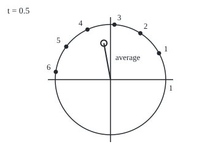
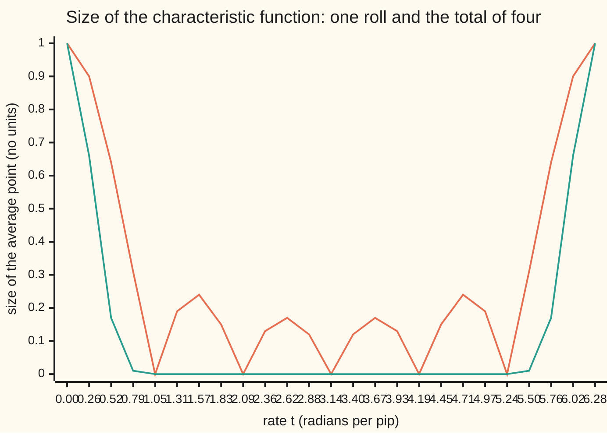
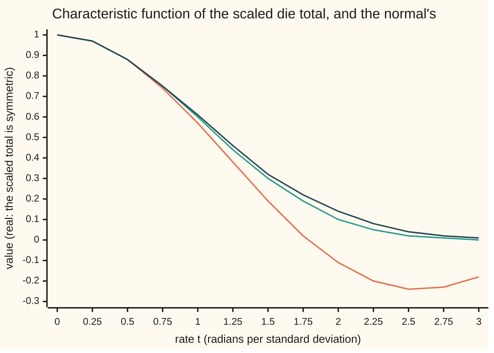

# Characteristic functions: the average of e^(itX) pins down the law, and convergence of these functions is convergence of the laws

Measure and integration → The Limit Theorems, Proved → Fingerprints of a law → Characteristic functions

---

## General Overview

A fair die is rolled 100 times. What is the chance the total is exactly 350? The total's law is the die's law convolved with itself 99 times. Whether that law approaches a bell curve as the rolls pile up is harder again: it asks about a limit of laws, with no formula to take the limit of.

There is a way to turn the problem into multiplication. Pick a rate, half a radian per pip. Place face k at the point on a circle of radius 1 turned by 0.5k radians, and average the six points. The average is one point inside the circle: −0.119777 across, 0.661214 up. Doing this at every rate gives a function of the rate: the die's **characteristic function**. The total of 100 independent rolls has one too, and it is the die's raised to the 100th power. From that power the code reads back the chance of a total of 350 exactly: 0.023322606.

Two theorems make this more than a trick. The **uniqueness theorem**: two laws with the same characteristic function are the same law. **Lévy's continuity theorem**: characteristic functions that converge at every rate, to a limit continuous at rate zero, belong to laws that converge. The probability wing defines the function and inverts it for densities ([characteristic-functions-and-inversion](../../09-Probability%20and%20statistics/06-Limit%20Theorems%20in%20Practice/04-characteristic-functions-and-inversion.md)). This card does it for every law, as an integral against a measure, and spends its length on the proofs.

**The characteristic function averages a point on the unit circle, turned by the rate times the variable, against the variable's law; it always exists, turns independent sums into products and moments into derivatives, determines the law, and converges when the laws do.**

**What kind of fact this is:** a definition with six theorems about it, proved on this card in Why it works (uniqueness in a folded Detailed proof), except the converse half of Lévy's theorem, which is outlined here and proved in Durrett, Theorem 3.3.17.

### The picture: six turned points and their average

<p align="center"></p>

Face k sits at angle 0.5k radians on the circle of radius 1. The hollow dot is the average of the six points: the characteristic function's value at rate 0.5. Its distance from the centre is 0.671975, less than 1 because the points pull in different directions.

---

## The formula

Notation first. Reminders: the law of X, written $\mu_X$, is the probability $P \circ X^{-1}$ that X carries onto the Borel sets of the line, and $\int f\,d\mu$ is read "the integral of f against μ". New here: $i$ is the imaginary unit, the number whose square is −1. By Euler's formula, $e^{i\theta} = \cos\theta + i\sin\theta$ is the point at angle θ on the circle of radius 1 ([eulers-formula](../../07-Complex%20analysis/01-Complex%20Numbers%20and%20the%20Plane/04-eulers-formula.md)). A complex-valued function is integrated one coordinate at a time: $\int (a + ib)\,d\mu = \int a\,d\mu + i\int b\,d\mu$, whenever both real integrals are finite. The characteristic function is written $\varphi_X$, read "phi of X".

$$\varphi_X(t) = E\big[e^{itX}\big] = \int_{\mathbb R} e^{itx}\,d\mu_X(x) = \int \cos(tx)\,d\mu_X(x) + i\int \sin(tx)\,d\mu_X(x), \qquad t \in \mathbb R.$$

**Read it aloud:** turn a point round the unit circle by the rate times X, and average where it lands, weighting by X's law.

Three examples, each derived in Why it works: the die, the uniform law on [0, 1], and the standard normal.

$$\varphi_{\text{die}}(t) = \frac16\sum_{k=1}^{6} e^{ikt} = e^{3.5it}\,\frac{\sin 3t}{6\sin(t/2)}, \qquad \varphi_U(t) = \frac{e^{it}-1}{it}, \qquad \varphi_Z(t) = e^{-t^2/2}.$$

At t = 0, and for the die at every multiple of 2π, the value is 1.

The six theorems. X and Y are random variables on a probability space $(\Omega, \mathcal F, P)$.

1. **Bounded and anchored.** $\varphi_X(0) = 1$, $|\varphi_X(t)| \le 1$, and $\varphi_X(-t)$ is the complex conjugate of $\varphi_X(t)$: the same point reflected in the horizontal axis.
2. **Uniformly continuous.** One step size serves every t: $|\varphi_X(t+h) - \varphi_X(t)|$ is small for all t once h is.
3. **Independent sums multiply.** If X and Y are independent, $\varphi_{X+Y}(t) = \varphi_X(t)\,\varphi_Y(t)$. So the total $S_n$ of n independent rolls has $\varphi_{S_n} = \varphi_{\text{die}}^{\,n}$.
4. **Moments from derivatives.** If $E|X|^m < \infty$, then $\varphi_X$ has m continuous derivatives and $\varphi_X^{(k)}(0) = i^k E[X^k]$ for each k up to m.
5. **Uniqueness.** If $\varphi_X(t) = \varphi_Y(t)$ for every real t, then $\mu_X = \mu_Y$.
6. **Lévy's continuity theorem.** The double arrow $\Rightarrow$ is read "converges in distribution to" ([convergence-in-distribution](05-convergence-in-distribution.md)).
   - (a) If $X_n \Rightarrow X$, then $\varphi_{X_n}(t) \to \varphi_X(t)$ for every real t.
   - (b) If $\varphi_{X_n}(t) \to g(t)$ for every real t, and the limit g is continuous at t = 0, then g is the characteristic function of some random variable X, and $X_n \Rightarrow X$.

For a law on the whole numbers, uniqueness comes with a recipe, the **lattice inversion formula**:

$$P(S_n = k) = \frac{1}{2\pi}\int_{-\pi}^{\pi} e^{-ikt}\,\varphi_{S_n}(t)\,dt.$$

**Read it aloud:** spin each rate's average back by k times the rate, add up over one full turn of rates, and what survives is the chance of the total k.

| Symbol | Plain meaning | In our example | Push it up and the answer… |
| --- | --- | --- | --- |
| $X$, $Y$ | random variables; X is one roll of a fair die | faces 1 to 6, each with chance 1/6 | — |
| $k$, $j$ | whole numbers: a face, or a total | face 3; total 350 | — |
| $t$ | the rate: radians of turn per pip | 0.5 | the points fan out; the die's average returns to 1 at 2π |
| $i$, $e^{itX}$ | the imaginary unit, square −1; the point at angle tX on the unit circle | angle 0.5k for face k | — |
| $\varphi_X$ | the characteristic function: the turned point's average | −0.119777 + 0.661214i at t = 0.5 | — |
| $\mu_X$, $P$, $E$, $\Omega$ | X's law; the probability; the average (integral against P); the outcomes | 1/6 on each face | — |
| $S_n$, $n$ | the total of n independent rolls; the number of rolls | n = 100: mean 350, sd 17.08 | φ^n collapses away from t = 0 |
| $W_n$, $T_n$ | the scaled total (S_n − 3.5n)/√(35n/12); the centred, unscaled total S_n − 3.5n | chance W_100 ≤ 1 is 0.847031 | W_n settles; T_n spreads |
| $U$, $Z$, $\lambda$ | uniform on [0, 1]; standard normal; Lebesgue measure, length on the line | φ_U(1) = 0.841471 + 0.459698i; φ_Z(1) = 0.606531 | — |
| $\sigma$, $p_\sigma$, $h_\sigma$ | width of the blurring normal in the uniqueness proof; its density; the blurred X's density | — | — |
| $f$, $g$ | a bounded continuous test function (in Step 1, any integrable complex function); a pointwise limit of characteristic functions | g(t) = e^(−t^2/2) for W_n | — |
| $\theta$, $a$, $b$ | an angle; real numbers (parts of a + ib; scale and shift in aX + b) | — | — |
| $c$, $w$ | Step 1's unit number and the integral it turns | — | — |
| $x$, $y$, $R$ | points on the line; an integration cut-off | — | — |
| $q$, $r$, $Z'$, $M$ | density of Z/σ; σ = 1/r; a second normal; rates in inversion | M = 1,024 | — |
| $u$, $h$, $m$ | half-width of a window of rates; a step in t; a number of derivatives | u = 1; h = 0.0001; m = 2 | — |

### When it holds

- **Existence needs nothing.** The integrand has size 1, so every law has one. The moment generating function can be infinite ([moment-generating-functions](../../09-Probability%20and%20statistics/02-Random%20Variables/07-moment-generating-functions.md)); the Cauchy law has none, yet its characteristic function is e^(−|t|). The average of n independent Cauchy draws has φ(t/n)^n = e^(−|t|), so by uniqueness it is again standard Cauchy.
- **The product rule needs independence.** One die counted twice is not two dice (What breaks, below).
- **Moments need the moment to exist.** The Cauchy's e^(−|t|) has a corner at 0, and the Cauchy law has no mean.
- **Uniqueness needs every rate.** A die and a die shifted up by 6 agree at every multiple of π/3 and are different laws.
- **Lévy's converse needs the limit continuous at 0.** Without it, mass escapes: the centred, unscaled total converges to nothing.

---

## Why it works

### Step 0: two bounded test functions per rate, and a product rule built in

For each rate t, the functions cos(tx) and sin(tx) are bounded by 1 and continuous. So every law integrates them, with nothing to check. There are enough of them to tell any two laws apart, which is uniqueness. And the exponential turns sums into products: $e^{it(x+y)} = e^{itx}\,e^{ity}$, which is why independent sums become products of characteristic functions. The rest is dominated convergence, Fubini's theorem and differentiating under the integral, applied to these two functions.

### Step 1: the average of points on the circle stays on or inside it

At t = 0 every point is 1, and the law has total mass 1, so $\varphi_X(0) = 1$. Cosine is even and sine is odd, so replacing t by −t keeps the across-coordinate and flips the up-coordinate: the conjugate.

The bound: for a complex function f with finite integral w, $|\int f\,d\mu| \le \int |f|\,d\mu$. If w ≠ 0, rotate by the unit number c = conj(w)/|w|, which turns w onto the positive real axis: |w| = cw = ∫ c·f dμ = ∫ Re(c·f) dμ ≤ ∫ |f| dμ, since a real part never exceeds a size. With f = e^{itx}, of size 1, $|\varphi_X(t)| \le 1$.

### Step 2: continuity, the same at every rate

Subtract the values at t + h and t and factor out the point at angle tx:

$$|\varphi_X(t+h) - \varphi_X(t)| = \Big|\int e^{itx}\big(e^{ihx} - 1\big)\,d\mu_X(x)\Big| \le \int \big|e^{ihx} - 1\big|\,d\mu_X(x).$$

The right side does not involve t. As h shrinks to 0, the integrand tends to 0 at every x and never exceeds 2. The constant 2 has integral 2 against a probability, so [dominated-convergence-theorem](../05-Swapping%20Limits%20and%20Integrals/02-dominated-convergence-theorem.md) sends the right side to 0. One step size serves every t: uniform continuity.

### Step 3: independent sums multiply

X and Y are independent exactly when the law of the pair (X, Y) is the product measure $\mu_X \otimes \mu_Y$ ([independence-as-a-product-measure](../06-Product%20Measures%20and%20Fubini/04-independence-as-a-product-measure.md)). Then

$$\varphi_{X+Y}(t) = \iint e^{itx}e^{ity}\,d(\mu_X\otimes\mu_Y)(x,y) = \int e^{itx}\,d\mu_X(x)\int e^{ity}\,d\mu_Y(y).$$

The second equality is [tonelli-and-fubini](../06-Product%20Measures%20and%20Fubini/03-tonelli-and-fubini.md), applied to the four bounded real products cos·cos, sin·sin, cos·sin and sin·cos, and reassembled. By induction, n independent rolls give $\varphi_{S_n} = \varphi_{\text{die}}^{\,n}$.

The die's closed form is a geometric series: the six terms sum to $e^{it}(e^{6it}-1)/(e^{it}-1)$. Pulling $e^{3it}$ from the top bracket and $e^{it/2}$ from the bottom leaves $\sin 3t/\sin(t/2)$ times $e^{3.5it}$. At t = 0.5 sum and closed form both give −0.119777 + 0.661214i.



Orange: one roll. Teal: the total of four rolls, the fourth power. The size is 0 at each multiple of π/3 ≈ 1.05 below 2π, where sin 3t vanishes, and returns to 1 at 2π = 6.28 because every face is a whole number. Powers crush everything away from 0 and 2π: for many rolls, only rates near 0 carry information.

### Step 4: moments are derivatives at zero

The rate of change of $e^{itx}$ in t is $ix\,e^{itx}$, of size |x|. A chord of the circle is never longer than its arc, so $|e^{iu} - e^{iv}| \le |u - v|$, and every difference quotient in t is capped by |x|. If E|X| is finite, |x| is an integrable cap for all t at once, and [differentiating-under-the-integral](../05-Swapping%20Limits%20and%20Integrals/03-differentiating-under-the-integral.md) gives

$$\varphi_X'(t) = \int ix\,e^{itx}\,d\mu_X(x), \qquad \varphi_X'(0) = i\,E[X].$$

The cap $|x|^k$ gives the k-th derivative the same way, and Step 2's argument under the cap $2|x|^k$ makes it continuous. For the die, $\varphi'(0) = i(1+2+\dots+6)/6 = 3.5i$ and $\varphi''(0) = -(1+4+\dots+36)/6 = -91/6$. So E[X] = 3.5, E[X^2] = 15.166667, and the variance is 91/6 − 3.5^2 = 35/12 = 2.916667. The code's finite differences at step h = 0.0001 give 3.5000 and 15.1667.

Differentiating $\varphi^n$ gives the total's mean 3.5n and variance 35n/12: at 100 rolls, 350, 291.67 and standard deviation 17.08.

### Step 5: the uniform and the normal

**Uniform.** The law of U is Lebesgue measure λ restricted to [0, 1]. Each coordinate of the integrand is continuous, so the Lebesgue integral equals the Riemann one ([riemann-meets-lebesgue](../04-The%20Lebesgue%20Integral/05-riemann-meets-lebesgue.md)), and

$$\varphi_U(t) = \int_0^1 e^{itx}\,d\lambda(x) = \Big[\frac{e^{itx}}{it}\Big]_0^1 = \frac{e^{it}-1}{it}.$$

At t = 1 this is sin 1 + i(1 − cos 1) = 0.841471 + 0.459698i, and Simpson's rule agrees. Its size is at most 2/|t|: unlike the die's, it dies away.

**Normal.** Z has density $p(x) = e^{-x^2/2}/\sqrt{2\pi}$. The sine part integrates an odd function and vanishes, so $\varphi_Z(t) = \int \cos(tx)\,p(x)\,dx$. The rate in t is $-x\sin(tx)\,p(x)$, capped by $|x|\,p(x)$, which has finite integral, so differentiating under the integral is allowed:

$$\varphi_Z'(t) = -\int x\sin(tx)\,p(x)\,dx = \int \sin(tx)\,p'(x)\,dx = -t\int\cos(tx)\,p(x)\,dx = -t\,\varphi_Z(t).$$

The middle step uses $p'(x) = -x\,p(x)$; the next is integration by parts on [−R, R], whose boundary term has size at most 2p(R), tending to 0. So φ′ = −tφ with φ(0) = 1. Then $e^{t^2/2}\varphi_Z(t)$ has derivative 0, so it stays at its value 1:

$$\varphi_Z(t) = e^{-t^2/2}.$$

Simpson's rule, a numerical solution of φ′ = −tφ and the formula all give φ_Z(1) = 0.606530660. Pulling constants out of the integral gives the scaling rule: for fixed numbers a and b, φ of aX + b at t is $e^{itb}$ times φ_X(at).

### Step 6: uniqueness

**The die first, where it is a recipe.** For whole numbers j and k, the average of $e^{i(j-k)t}$ over one full turn of rates, −π to π, is 1 when j = k and 0 otherwise. The total's characteristic function is a finite sum, $\varphi_{S_n}(t) = \sum_j P(S_n = j)\,e^{ijt}$. Multiply by $e^{-ikt}$ and average over the turn: only j = k survives. That is lattice inversion, so two laws on the whole numbers with one characteristic function have the same chances. For two dice the coefficient of $e^{7it}$ in $\varphi^2$ is 6/36 = 0.166667. For 100 dice, exact counting and inversion with 1,024 rates both give 0.023322606 for a total of 350.

**The general case: blur, then unblur.** A general law has no finite sum to invert. Instead add an independent narrow normal σZ to X. The blurred X + σZ has a density, and Step 5 with Fubini's theorem gives it in terms of $\varphi_X$ alone:

$$h_\sigma(y) = \frac{1}{2\pi}\int_{-\infty}^{\infty} e^{-ity}\,\varphi_X(t)\,e^{-\sigma^2t^2/2}\,dt.$$

Two laws with one characteristic function therefore have identical blurred versions for every σ. Shrinking σ to 0 returns the originals, which must agree.

<details>
<summary>Detailed proof</summary>

**Setting.** $\varphi_X(t) = \varphi_Y(t)$ for every real t. Only laws matter, so each variable may sit on its own space. On a product space ([independence-as-a-product-measure](../06-Product%20Measures%20and%20Fubini/04-independence-as-a-product-measure.md)) take Z standard normal and independent of X. Fix σ > 0 and write $p_\sigma(y) = e^{-y^2/(2\sigma^2)}/(\sigma\sqrt{2\pi})$ for the density of σZ.

**1. The normal density as an integral over rates.** Z/σ has characteristic function $\varphi_Z(y/\sigma) = e^{-y^2/(2\sigma^2)}$ by Step 5 and the scaling rule. Its law is normal with standard deviation 1/σ, density $q(t) = \sigma e^{-\sigma^2t^2/2}/\sqrt{2\pi}$. Writing that characteristic function as an integral against its density gives $\int e^{ity}\,e^{-\sigma^2t^2/2}\,dt = (\sqrt{2\pi}/\sigma)\,e^{-y^2/(2\sigma^2)}$. Divide by 2π:
$$\frac{1}{2\pi}\int_{-\infty}^{\infty} e^{ity}\,e^{-\sigma^2t^2/2}\,dt = p_\sigma(y).$$
The right side is even in y, so the same holds with $e^{-ity}$ in place of $e^{ity}$.

**2. The density of the blurred variable.** X and σZ are independent, so X + σZ has density $h_\sigma(y) = \int p_\sigma(y - x)\,d\mu_X(x)$ ([convolution-and-sums](../06-Product%20Measures%20and%20Fubini/05-convolution-and-sums.md)). Substitute step 1 at the point y − x:
$$h_\sigma(y) = \frac{1}{2\pi}\int\!\!\int e^{-it(y-x)}\,e^{-\sigma^2t^2/2}\,dt\,d\mu_X(x).$$

**3. Swap the order.** The integrand has size $e^{-\sigma^2t^2/2}$, whose integral against length times $\mu_X$ is $\sqrt{2\pi}/\sigma$, finite. Fubini's theorem ([tonelli-and-fubini](../06-Product%20Measures%20and%20Fubini/03-tonelli-and-fubini.md)), applied to the real and imaginary parts, lets the x-integral go inside:
$$h_\sigma(y) = \frac{1}{2\pi}\int e^{-ity}\,e^{-\sigma^2t^2/2}\Big(\int e^{itx}\,d\mu_X(x)\Big)dt = \frac{1}{2\pi}\int e^{-ity}\,e^{-\sigma^2t^2/2}\,\varphi_X(t)\,dt.$$
The right side sees X only through $\varphi_X$, so Y + σZ′, with Z′ an independent normal beside Y, has the same density and the same law, for every σ > 0.

**4. Bounded continuous test functions agree.** Let f be bounded and continuous. Equal laws give $E f(X + \sigma Z) = E f(Y + \sigma Z')$. Take σ = 1/r for whole numbers r. At every outcome $f(X + Z/r) \to f(X)$ by continuity, and $|f(X + Z/r)|$ never exceeds the constant sup|f|. Dominated convergence gives $E f(X + Z/r) \to E f(X)$, and likewise for Y. So $E f(X) = E f(Y)$.

**5. From test functions to the law.** Fix a real a. Let $f_r(x)$ be 1 for x ≤ a, 0 for x ≥ a + 1/r, and linear in between. Each is bounded and continuous, and $f_r(x)$ tends to the indicator of $(-\infty, a]$ at every x as r grows. Dominated convergence once more gives $P(X \le a) = P(Y \le a)$. The half-lines $(-\infty, a]$ are closed under intersection and generate the Borel sets, so two probability measures that agree on them agree on every Borel set ([pi-systems-and-uniqueness](../01-Sets%20You%20Can%20Measure/06-pi-systems-and-uniqueness.md)). So $\mu_X = \mu_Y$. ∎

</details>

### Step 7: Lévy's continuity theorem

**Forward, proved.** [convergence-in-distribution](05-convergence-in-distribution.md) proves that $X_n \Rightarrow X$ means $E f(X_n) \to E f(X)$ for every bounded continuous f. Cos(tx) and sin(tx) are two such functions, so both coordinates of $\varphi_{X_n}(t)$ converge. That is (a).

**Converse, outlined.** Three moves, with the full proof in Durrett, Theorem 3.3.17.

- **No mass escapes.** For any law and any u > 0, the **tail bound** holds:
$$P\big(|X| > 2/u\big) \le \frac1u\int_{-u}^{u}\big(1 - \varphi_X(t)\big)\,dt.$$
Fubini moves the t-integral inside, where $\frac1u\int_{-u}^{u}(1 - e^{itx})\,dt = 2\big(1 - \frac{\sin ux}{ux}\big)$: never negative, and at least 1 when |ux| ≥ 2, since then |sin ux| ≤ 1 ≤ |ux|/2. If g is continuous at 0, with g(0) = 1, the bound for g is small once u is small; dominated convergence passes this to every large n. So one u keeps $P(|X_n| > 2/u)$ small for all large n: the laws are **tight**.
- **Some subsequence converges.** Helly's selection theorem, in the same chapter of Durrett: every tight sequence of laws has a subsequence converging in distribution to a probability law.
- **Every limit is the same.** By (a) each such limit has characteristic function g; by uniqueness they are one law; so the whole sequence converges to it.

At u = 1 on 100 scaled rolls, the chance of |W_100| > 2 is 0.043221 and the bound 0.288900. On 400 unscaled rolls the chance of |T_400| > 2 is 0.941674 and the bound 1.926643: true and useless, because φ has collapsed everywhere but at 0.

**Lévy in action.** The scaled total $W_n = (S_n - 3.5n)/\sqrt{35n/12}$ has characteristic function $\big(\sin 3s/(6\sin(s/2))\big)^n$ at $s = t/\sqrt{35n/12}$.



Orange: one roll, scaled. Teal: four rolls. Dark blue: the normal's e^(−t^2/2). Four rolls already track the bell: at t = 2 the two read 0.10 and 0.14.

At t = 1 the values for 1, 10, 100 and 1,000 rolls are 0.567548, 0.603269, 0.606210 and 0.606499, closing on e^(−1/2) = 0.606531. The limit is continuous at 0, so (b) gives $W_n \Rightarrow Z$. The chance that $W_n \le 1$ is 0.843496, 0.847031 and 0.843711 at 10, 100 and 400 rolls, against the normal's 0.841345. The gaps shrink only unevenly, because the total moves in whole pips.

The same move proves the die's weak law. The running average $S_n/n$ has characteristic function $\varphi(t/n)^n$. At t = 1 it is −0.809015 − 0.303045i, −0.922899 − 0.345705i and −0.935092 − 0.350272i at 10, 100 and 1,000 rolls, closing on $e^{3.5i}$ = −0.936457 − 0.350783i, the characteristic function of the constant 3.5. So the average converges in distribution to 3.5, which for a constant limit is convergence in probability ([weak-law-of-large-numbers](03-weak-law-of-large-numbers.md)).

### Another road

Lévy's inversion formula recovers the chance of any interval from $\varphi_X$ by an integral over rates with a growing cut-off, giving uniqueness at once, at the price of a delicate limit. The probability wing states it ([characteristic-functions-and-inversion](../../09-Probability%20and%20statistics/06-Limit%20Theorems%20in%20Practice/04-characteristic-functions-and-inversion.md)); levy-inversion-and-uniqueness proves it. The blur-and-unblur route above uses only the normal's characteristic function, Fubini and dominated convergence.

---

## Worked numbers, by hand

One fair die, rate t = 0.5.

| Step | Arithmetic | Value |
| --- | --- | --- |
| the six angles, 0.5k | k = 1 to 6 | 0.5, 1.0, 1.5, 2.0, 2.5, 3.0 radians |
| across-coordinates, cos 0.5k | from a table | 0.8776, 0.5403, 0.0707, −0.4161, −0.8011, −0.9900 |
| their average | sum over 6 | −0.119777 |
| up-coordinates, sin 0.5k | from a table | 0.4794, 0.8415, 0.9975, 0.9093, 0.5985, 0.1411 |
| their average | sum over 6 | 0.661214 |
| size, closed form | sin 1.5 / (6 sin 0.25) | 0.671975 |
| mean, from φ′(0) = 3.5i | (1 + 2 + … + 6)/6 = 21/6 | 3.5 |
| E[X^2], from −φ″(0) | (1 + 4 + … + 36)/6 = 91/6 | 15.166667 |
| variance | 91/6 − 12.25 = 35/12 | 2.916667 |
| two dice, chance of 7 | coefficient of e^(7it) in φ^2 | 6/36 = 0.166667 |
| 100 rolls: φ^100 | mean 100 × 3.5; variance 100 × 35/12 | 350; 291.67; sd 17.08 |
| **φ(0.5)** | the average point | **−0.119777 + 0.661214i** |

The six turned faces average to a point 0.671975 from the centre; the function's slope at 0 gives the mean, its curvature the variance, and its 100th power the 100-roll law.

### What breaks if you drop a piece

| Mistake | Comes out at | What went wrong |
| --- | --- | --- |
| Multiplying characteristic functions for one die counted twice | size 0.451550 predicted at t = 0.5; the doubled die has 0.049059 | 2X is not a sum of independent copies; its characteristic function is φ(2t), not φ(t)^2 |
| Checking agreement on a sparse set of rates | die and die + 6: largest gap 0.000000 over t = kπ/3, k = 1 to 12; gap 0.013846 at t = 1 | uniqueness needs every real t; these two laws have means 6 apart |
| Applying Lévy's converse to the centred, unscaled total | size at t = 0.5: 0.203897, 0.000001, 0.000000 at 4, 36, 400 rolls; chance within 5 of centre 0.891975, 0.407219, 0.127880 | along even n the limit is 1 at t = 0 and 0 beside it (at t = 2π the value is (−1)^n), not continuous at 0: mass escapes to both sides |

---

## Code, from first principles, and it actually runs

Both programs print every number on this card, each reached by at least two roads: sum against closed form for the die; Simpson's rule against the hand integral for the uniform; Simpson's rule, a step-by-step solution of φ′ = −tφ and the formula for the normal; finite differences against exact moments; the 100-roll law counted, compared with $\varphi^{100}$ and inverted back. Python counts totals exactly in whole numbers; Rust does so for the chance of 350 and writes its complex arithmetic by hand. The code checks instances at chosen rates and numbers of rolls; only the proofs cover every law and every rate.

### Python

```python
# Characteristic functions -- the check behind the card.  Standard library only.
# Nothing imported knows a characteristic function: every average below is a
# finite sum or a Simpson integral written here, and each closed form on the
# card is compared with it.  Dice totals are counted exactly with integers.
from fractions import Fraction
from math import cos, sin, exp, sqrt, pi

def e(x): return complex(cos(x), sin(x))          # the point at angle x on the unit circle

def cf_die(t):                                    # road 1: the definition, six points averaged
    return sum(e(t * k) for k in range(1, 7)) / 6
def cf_die6(t): return sum(e(t * k) for k in range(7, 13)) / 6   # die + 6, from its own faces 7 to 12

def cf_die_closed(t):                             # road 2: the geometric series summed
    return e(3.5 * t) * sin(3 * t) / (6 * sin(t / 2))

def c(s):                                         # the centred die, X - 3.5: a real number
    return sin(3 * s) / (6 * sin(s / 2)) if s != 0 else 1.0

def simpson(f, a, b, n):
    h = (b - a) / n
    return (f(a) + f(b) + sum((4 if i % 2 else 2) * f(a + i * h) for i in range(1, n))) * h / 3
def dens(x): return exp(-x * x / 2) / sqrt(2 * pi)              # standard normal density
def cf_normal_int(t): return simpson(lambda x: cos(t * x) * dens(x), -12.0, 12.0, 2400)

def cf_normal_ode(t, steps=1000):                 # road 3: solve phi' = -s phi, phi(0) = 1 (RK4)
    h, y, s = t / steps, 1.0, 0.0
    for _ in range(steps):
        k1 = -s * y; k2 = -(s + h / 2) * (y + h / 2 * k1)
        k3 = -(s + h / 2) * (y + h / 2 * k2); k4 = -(s + h) * (y + h * k3)
        y, s = y + h * (k1 + 2 * k2 + 2 * k3 + k4) / 6, s + h
    return y

def ways(n):                                      # exact number of ways to roll each total
    w = [1]
    for _ in range(n):
        new = [0] * (len(w) + 6)
        for s, m in enumerate(w):
            for k in range(1, 7):
                new[s + k] += m
        w = new
    return w                                      # w[s] = ways to total s; 6^n in all
def cz(z): return f"{z.real:+.6f} {z.imag:+.6f}i"
def row(label, *vals): print(f"{label:<50}" + "  ".join(vals))

# ---- the die at t = 0.5: six points on the circle, and their average ----
t = 0.5
d1, d2 = cf_die(t), cf_die_closed(t)
print("die at t = 0.5, cos then sin of 0.5k:", " ".join(f"{f(t * k):.4f}" for f in (cos, sin) for k in range(1, 7)))
row("die phi(0.5): six points averaged / closed form", cz(d1), cz(d2))
row("size |phi(0.5)| = sin 1.5 / (6 sin 0.25)", f"{c(t):.6f}", f"{abs(d1):.6f}")
pts = [(180 + 90 * cos(t * k), 130 - 90 * sin(t * k)) for k in range(1, 7)]
print("figure, points 1-6 (x y):", " ".join(f"{x:.1f} {y:.1f}" for x, y in pts))
print(f"figure, average (x y): {180 + 90 * d1.real:.1f} {130 - 90 * d1.imag:.1f}")
assert abs(d1 - d2) < 1e-12                       # the sum against the closed form

# ---- the uniform on [0, 1] and the standard normal, each two or three ways ----
u_int = simpson(lambda x: e(x), 0.0, 1.0, 200)    # t = 1: integral of e^(ix) against length
u_closed = (e(1.0) - 1) / 1j
row("uniform phi(1), Simpson / (e^i - 1)/i", cz(u_int), cz(u_closed))
n_int, n_ode = cf_normal_int(1.0), cf_normal_ode(1.0)
row("normal phi(1), Simpson / ODE / e^(-1/2)", f"{n_int:.9f}", f"{n_ode:.9f}", f"{exp(-0.5):.9f}")
assert abs(u_int - u_closed) < 1e-9               # Simpson against the integral done by hand
assert max(abs(n_int - n_ode), abs(n_ode - exp(-0.5))) < 1e-9  # three roads to the normal's phi(1)

# ---- moments from derivatives at 0, against exact sums ----
h = 1e-4
m1 = ((cf_die(h) - cf_die(-h)) / (2 * h)).imag
m2 = -((cf_die(h) - 2 + cf_die(-h)) / (h * h)).real
ex1, ex2 = sum(Fraction(k, 6) for k in range(1, 7)), sum(Fraction(k * k, 6) for k in range(1, 7))
row("die E X: phi'(0)/i, exact 21/6", f"{m1:.4f}", f"{float(ex1):.6f}")
row("die E X^2: -phi''(0), exact 91/6", f"{m2:.4f}", f"{float(ex2):.6f}")
row("die variance 91/6 - 3.5^2 = 35/12", f"{float(ex2 - ex1 ** 2):.6f}", f"sd {sqrt(35 / 12):.6f}")
assert abs(m1 - float(ex1)) < 1e-6                 # slope at 0 against the exact mean
assert abs(m2 - float(ex2)) < 1e-4                 # curvature at 0 against the exact E X^2

# ---- the n-roll total: its law's average equals phi^n ----
w2, w100 = ways(2), ways(100)
row("two dice, P(total 7): count / 36", f"{w2[7]}/36 = {w2[7] / 36:.6f}")
t = 0.05
direct = sum(m * e(t * s) for s, m in enumerate(w100)) / 6 ** 100
row("100 rolls phi(0.05): from the law / phi^100", cz(direct), cz(cf_die(t) ** 100))
assert abs(direct - cf_die(t) ** 100) < 1e-12
row("100 rolls: mean, variance, sd", "350", f"{100 * 35 / 12:.2f}", f"{sqrt(100 * 35 / 12):.2f}")

# ---- reading the law back: inversion on the integers ----
M = 1024
inv = sum(e(-350 * 2 * pi * j / M) * cf_die(2 * pi * j / M) ** 100 for j in range(M)).real / M
exact = Fraction(w100[350], 6 ** 100)
row("P(100 rolls total 350): exact / inversion", f"{float(exact):.9f}", f"{inv:.9f}")
assert abs(inv - float(exact)) < 1e-12

# ---- Levy in action: the scaled total W_n = (S_n - 3.5n)/sqrt(35n/12) ----
sd1 = sqrt(35 / 12)
def cf_w(n, t): return c(t / (sd1 * sqrt(n))) ** n
row("phi_Wn(1), n = 1, 10, 100, 1000", *(f"{cf_w(n, 1.0):.6f}" for n in (1, 10, 100, 1000)))
row("  limit e^(-1/2)", f"{exp(-0.5):.6f}")
Phi1 = 0.5 + simpson(dens, 0.0, 1.0, 200)
cdf = []
for n in (10, 100, 400):
    w = ways(n)
    cut = int(3.5 * n + sqrt(35 * n / 12))    # W_n <= 1 exactly when S_n <= this total
    cdf.append(sum(w[: cut + 1]) / 6 ** n)
row("P(W_n <= 1), n = 10, 100, 400", *(f"{p:.6f}" for p in cdf))
row("  normal Phi(1)", f"{Phi1:.6f}")
row("running average: phi(1/n)^n, n = 10, 100, 1000", *(cz(cf_die(1 / n) ** n) for n in (10, 100, 1000)))
row("  the constant 3.5: e^(3.5i)", cz(e(3.5)))
assert abs(cf_w(1000, 1.0) - n_ode) < 1e-3        # the die's phi against the normal's

# ---- what breaks ----
indep, copy = cf_die(0.5) ** 2, cf_die(1.0)
row("two dice vs one die doubled, |phi(0.5)|", f"{abs(indep):.6f}", f"{abs(copy):.6f}")
gap, gap1 = max(abs(cf_die6(k * pi / 3) - cf_die(k * pi / 3)) for k in range(1, 13)), abs(cf_die6(1.0) - cf_die(1.0))
row("die vs die + 6: max gap at t = k pi/3, k<=12", f"{gap:.6f}")
row("die vs die + 6: gap at t = 1", f"{gap1:.6f}")
assert gap < 1e-12                                 # die + 6 from its own faces agrees at every k pi/3
assert abs(gap1 - 2 * abs(sin(3.0)) * abs(cf_die(1.0))) < 1e-12   # and at t = 1 differs by |e^(6i) - 1| |phi(1)|
near = []
for n in (4, 36, 400):
    w, m = ways(n), round(3.5 * n)
    near.append(sum(w[m - 5: m + 6]) / 6 ** n)
row("unscaled T_n = S_n - 3.5n, |phi(0.5)|, n=4,36,400", *(f"{abs(c(0.5)) ** n:.6f}" for n in (4, 36, 400)))
row("  P(|T_n| <= 5), n = 4, 36, 400", *(f"{p:.6f}" for p in near))
bw = simpson(lambda s: 1 - cf_w(100, s), -1.0, 1.0, 2000)
bt = simpson(lambda s: 1 - c(s) ** 400, -1.0, 1.0, 2000)
w4 = ways(400)
tail_t = 1 - sum(w4[1398:1403]) / 6 ** 400
tail_w = 1 - sum(w100[s] for s in range(6 * 100 + 1) if abs(s - 350) <= 2 * 10 * sd1) / 6 ** 100
row("tail bound u=1: W_100 P(|W|>2) <= integral", f"{tail_w:.6f}", f"{bw:.6f}")
row("tail bound u=1: T_400 P(|T|>2) <= integral", f"{tail_t:.6f}", f"{bt:.6f}")
assert tail_w <= bw                                # the tail inequality, exact side <= integral
assert tail_t <= bt

# ---- the two charts ----
print("figure, |phi(t)| at t = k pi/12:", " ".join(f"{abs(cf_die(k * pi / 12)):.2f}" for k in range(25)))
print("figure, |phi(t)|^4:            ", " ".join(f"{abs(cf_die(k * pi / 12)) ** 4:.2f}" for k in range(25)))
print("figure, t labels:               ", " ".join(f"{k * pi / 12:.2f}" for k in range(25)))
for n in (1, 4):
    print(f"figure, phi_W{n}(t), t = 0..3:", " ".join(f"{cf_w(n, k / 4):.2f}" for k in range(13)))
print("figure, normal e^(-t^2/2):", " ".join(f"{cf_normal_int(k / 4):.2f}" for k in range(13)))
```

**Ran 2026-10-07 on macOS, Python 3.14.6, standard library only. All checks passed. Output, pasted from the run:**

```
die at t = 0.5, cos then sin of 0.5k: 0.8776 0.5403 0.0707 -0.4161 -0.8011 -0.9900 0.4794 0.8415 0.9975 0.9093 0.5985 0.1411
die phi(0.5): six points averaged / closed form   -0.119777 +0.661214i  -0.119777 +0.661214i
size |phi(0.5)| = sin 1.5 / (6 sin 0.25)          0.671975  0.671975
figure, points 1-6 (x y): 259.0 86.9 228.6 54.3 186.4 40.2 142.5 48.2 107.9 76.1 90.9 117.3
figure, average (x y): 169.2 70.5
uniform phi(1), Simpson / (e^i - 1)/i             +0.841471 +0.459698i  +0.841471 +0.459698i
normal phi(1), Simpson / ODE / e^(-1/2)           0.606530660  0.606530660  0.606530660
die E X: phi'(0)/i, exact 21/6                    3.5000  3.500000
die E X^2: -phi''(0), exact 91/6                  15.1667  15.166667
die variance 91/6 - 3.5^2 = 35/12                 2.916667  sd 1.707825
two dice, P(total 7): count / 36                  6/36 = 0.166667
100 rolls phi(0.05): from the law / phi^100       +0.152355 -0.677368i  +0.152355 -0.677368i
100 rolls: mean, variance, sd                     350  291.67  17.08
P(100 rolls total 350): exact / inversion         0.023322606  0.023322606
phi_Wn(1), n = 1, 10, 100, 1000                   0.567548  0.603269  0.606210  0.606499
  limit e^(-1/2)                                  0.606531
P(W_n <= 1), n = 10, 100, 400                     0.843496  0.847031  0.843711
  normal Phi(1)                                   0.841345
running average: phi(1/n)^n, n = 10, 100, 1000    -0.809015 -0.303045i  -0.922899 -0.345705i  -0.935092 -0.350272i
  the constant 3.5: e^(3.5i)                      -0.936457 -0.350783i
two dice vs one die doubled, |phi(0.5)|           0.451550  0.049059
die vs die + 6: max gap at t = k pi/3, k<=12      0.000000
die vs die + 6: gap at t = 1                      0.013846
unscaled T_n = S_n - 3.5n, |phi(0.5)|, n=4,36,400 0.203897  0.000001  0.000000
  P(|T_n| <= 5), n = 4, 36, 400                   0.891975  0.407219  0.127880
tail bound u=1: W_100 P(|W|>2) <= integral        0.043221  0.288900
tail bound u=1: T_400 P(|T|>2) <= integral        0.941674  1.926643
figure, |phi(t)| at t = k pi/12: 1.00 0.90 0.64 0.31 0.00 0.19 0.24 0.15 0.00 0.13 0.17 0.12 0.00 0.12 0.17 0.13 0.00 0.15 0.24 0.19 0.00 0.31 0.64 0.90 1.00
figure, |phi(t)|^4:             1.00 0.66 0.17 0.01 0.00 0.00 0.00 0.00 0.00 0.00 0.00 0.00 0.00 0.00 0.00 0.00 0.00 0.00 0.00 0.00 0.00 0.01 0.17 0.66 1.00
figure, t labels:                0.00 0.26 0.52 0.79 1.05 1.31 1.57 1.83 2.09 2.36 2.62 2.88 3.14 3.40 3.67 3.93 4.19 4.45 4.71 4.97 5.24 5.50 5.76 6.02 6.28
figure, phi_W1(t), t = 0..3: 1.00 0.97 0.88 0.74 0.57 0.38 0.19 0.02 -0.11 -0.20 -0.24 -0.23 -0.18
figure, phi_W4(t), t = 0..3: 1.00 0.97 0.88 0.75 0.60 0.44 0.30 0.19 0.10 0.05 0.02 0.01 0.00
figure, normal e^(-t^2/2): 1.00 0.97 0.88 0.75 0.61 0.46 0.32 0.22 0.14 0.08 0.04 0.02 0.01
```

### Rust

```rust
// Characteristic functions -- the check behind the card.  Rust std only, no crates.
// Complex numbers are a pair written out here; every average is a finite sum or
// a Simpson integral; dice totals come from a probability table built roll by roll,
// and the 100-roll count of each total is exact, in whole numbers of five 64-bit words.
use std::f64::consts::PI;

#[derive(Clone, Copy)]
struct C { re: f64, im: f64 }
fn e(x: f64) -> C { C { re: x.cos(), im: x.sin() } }          // the point at angle x on the circle
fn add(a: C, b: C) -> C { C { re: a.re + b.re, im: a.im + b.im } }
fn mul(a: C, b: C) -> C { C { re: a.re * b.re - a.im * b.im, im: a.re * b.im + a.im * b.re } }
fn sc(a: C, k: f64) -> C { C { re: a.re * k, im: a.im * k } }
fn abs(a: C) -> f64 { (a.re * a.re + a.im * a.im).sqrt() }
fn pw(a: C, n: u32) -> C { (0..n).fold(C { re: 1.0, im: 0.0 }, |p, _| mul(p, a)) }
fn cz(z: C) -> String { format!("{:+.6} {:+.6}i", z.re, z.im) }
fn row(label: &str, vals: &[String]) { println!("{:<50}{}", label, vals.join("  ")); }

fn cf_die(t: f64) -> C { sc((1..=6).fold(C { re: 0.0, im: 0.0 }, |s, k| add(s, e(t * k as f64))), 1.0 / 6.0) }
fn cf_die6(t: f64) -> C { sc((7..=12).fold(C { re: 0.0, im: 0.0 }, |s, k| add(s, e(t * k as f64))), 1.0 / 6.0) } // die + 6, own faces
fn cf_die_closed(t: f64) -> C { sc(e(3.5 * t), (3.0 * t).sin() / (6.0 * (t / 2.0).sin())) }
fn c(s: f64) -> f64 { if s == 0.0 { 1.0 } else { (3.0 * s).sin() / (6.0 * (s / 2.0).sin()) } }

fn simpson<F: Fn(f64) -> f64>(f: F, a: f64, b: f64, n: usize) -> f64 {
    let h = (b - a) / n as f64;
    let mut s = f(a) + f(b);
    for i in 1..n { s += if i % 2 == 1 { 4.0 } else { 2.0 } * f(a + i as f64 * h); }
    s * h / 3.0
}
fn dens(x: f64) -> f64 { (-x * x / 2.0).exp() / (2.0 * PI).sqrt() }
fn cf_normal_int(t: f64) -> f64 { simpson(|x| (t * x).cos() * dens(x), -12.0, 12.0, 2400) }
fn cf_normal_ode(t: f64) -> f64 {                             // phi' = -s phi, phi(0) = 1, by RK4
    let (steps, mut y, mut s) = (1000, 1.0, 0.0);
    let h = t / steps as f64;
    for _ in 0..steps {
        let k1 = -s * y;
        let k2 = -(s + h / 2.0) * (y + h / 2.0 * k1);
        let k3 = -(s + h / 2.0) * (y + h / 2.0 * k2);
        let k4 = -(s + h) * (y + h * k3);
        y += h * (k1 + 2.0 * k2 + 2.0 * k3 + k4) / 6.0;
        s += h;
    }
    y
}
fn law(n: usize) -> Vec<f64> {                                // P(total = s) after n rolls
    let mut p = vec![1.0];
    for _ in 0..n {
        let mut q = vec![0.0; p.len() + 6];
        for (s, m) in p.iter().enumerate() { for k in 1..=6 { q[s + k] += m / 6.0; } }
        p = q;
    }
    p
}
type Big = [u64; 5];                                          // a whole number in five 64-bit words; 6^100 < 2^259
fn big_add(a: Big, b: Big) -> Big {
    let (mut r, mut carry) = ([0u64; 5], false);
    for i in 0..5 {
        let (x, c1) = a[i].overflowing_add(b[i]);
        let (y, c2) = x.overflowing_add(carry as u64);
        r[i] = y;
        carry = c1 || c2;
    }
    assert!(!carry);                                          // five words are enough
    r
}
fn big_f64(a: Big) -> f64 { a.iter().rev().fold(0.0, |acc, &w| acc * 18446744073709551616.0 + w as f64) }
fn ways(n: usize) -> Vec<Big> {                               // exact number of ways to roll each total
    let mut w: Vec<Big> = Vec::from([[1u64, 0, 0, 0, 0]]);
    for _ in 0..n {
        let mut q = vec![Big::default(); w.len() + 6];
        for (s, m) in w.iter().enumerate() { for k in 1..=6 { q[s + k] = big_add(q[s + k], *m); } }
        w = q;
    }
    w                                                         // w[s] = ways to total s; 6^n in all
}
fn cf_w(n: u32, t: f64) -> f64 { c(t / ((35.0f64 / 12.0).sqrt() * (n as f64).sqrt())).powi(n as i32) }

fn main() {
    // the die at t = 0.5
    let t = 0.5;
    let (d1, d2) = (cf_die(t), cf_die_closed(t));
    let cs: Vec<String> = (1..=6).map(|k| (t * k as f64).cos()).chain((1..=6).map(|k| (t * k as f64).sin())).map(|v| format!("{:.4}", v)).collect();
    println!("die at t = 0.5, cos then sin of 0.5k: {}", cs.join(" "));
    row("die phi(0.5): six points averaged / closed form", &[cz(d1), cz(d2)]);
    row("size |phi(0.5)| = sin 1.5 / (6 sin 0.25)", &[format!("{:.6}", c(t)), format!("{:.6}", abs(d1))]);
    let pts: Vec<String> = (1..=6).map(|k| { let a = t * k as f64;
        format!("{:.1} {:.1}", 180.0 + 90.0 * a.cos(), 130.0 - 90.0 * a.sin()) }).collect();
    println!("figure, points 1-6 (x y): {}", pts.join(" "));
    println!("figure, average (x y): {:.1} {:.1}", 180.0 + 90.0 * d1.re, 130.0 - 90.0 * d1.im);
    assert!(abs(add(d1, sc(d2, -1.0))) < 1e-12);
    // the uniform and the normal
    let u_int = C { re: simpson(|x| x.cos(), 0.0, 1.0, 200), im: simpson(|x| x.sin(), 0.0, 1.0, 200) };
    let u_closed = C { re: 1.0f64.sin(), im: 1.0 - 1.0f64.cos() };   // (e^i - 1)/i worked by hand
    row("uniform phi(1), Simpson / (e^i - 1)/i", &[cz(u_int), cz(u_closed)]);
    let (n_int, n_ode) = (cf_normal_int(1.0), cf_normal_ode(1.0));
    row("normal phi(1), Simpson / ODE / e^(-1/2)", &[format!("{:.9}", n_int), format!("{:.9}", n_ode), format!("{:.9}", (-0.5f64).exp())]);
    assert!(abs(add(u_int, sc(u_closed, -1.0))) < 1e-9);
    assert!((n_int - n_ode).abs().max((n_ode - (-0.5f64).exp()).abs()) < 1e-9);   // three roads
    // moments from derivatives, against exact integer sums over 6
    let h = 1e-4;
    let m1 = sc(add(cf_die(h), sc(cf_die(-h), -1.0)), 1.0 / (2.0 * h)).im;
    let m2 = -(cf_die(h).re - 2.0 + cf_die(-h).re) / (h * h);
    let (s1, s2): (i64, i64) = ((1..=6).sum(), (1..=6).map(|k| k * k).sum());
    let (ex1, ex2) = (s1 as f64 / 6.0, s2 as f64 / 6.0);
    row("die E X: phi'(0)/i, exact 21/6", &[format!("{:.4}", m1), format!("{:.6}", ex1)]);
    row("die E X^2: -phi''(0), exact 91/6", &[format!("{:.4}", m2), format!("{:.6}", ex2)]);
    row("die variance 91/6 - 3.5^2 = 35/12", &[format!("{:.6}", (6 * s2 - s1 * s1) as f64 / 36.0), format!("sd {:.6}", (35.0f64 / 12.0).sqrt())]);
    assert!((m1 - ex1).abs() < 1e-6);
    assert!((m2 - ex2).abs() < 1e-4);
    // the n-roll total
    let mut w2 = [0u64; 13];
    for a in 1..=6 { for b in 1..=6 { w2[a + b] += 1; } }
    row("two dice, P(total 7): count / 36", &[format!("{}/36 = {:.6}", w2[7], w2[7] as f64 / 36.0)]);
    let p100 = law(100);
    let t = 0.05;
    let direct = p100.iter().enumerate().fold(C { re: 0.0, im: 0.0 }, |z, (s, &m)| add(z, sc(e(t * s as f64), m)));
    row("100 rolls phi(0.05): from the law / phi^100", &[cz(direct), cz(pw(cf_die(t), 100))]);
    assert!(abs(add(direct, sc(pw(cf_die(t), 100), -1.0))) < 1e-12);
    row("100 rolls: mean, variance, sd", &["350".into(), format!("{:.2}", 100.0 * 35.0 / 12.0), format!("{:.2}", (100.0f64 * 35.0 / 12.0).sqrt())]);
    // inversion on the integers
    let m = 1024;
    let inv = (0..m).fold(0.0, |acc, j| { let tj = 2.0 * PI * j as f64 / m as f64;
        acc + mul(e(-350.0 * tj), pw(cf_die(tj), 100)).re }) / m as f64;
    let w100 = ways(100);
    let exact = big_f64(w100[350]) / big_f64(w100.iter().fold([0u64; 5], |a, &b| big_add(a, b)));   // count over 6^100
    row("P(100 rolls total 350): exact / inversion", &[format!("{:.9}", exact), format!("{:.9}", inv)]);
    assert!((inv - exact).abs() < 1e-12);
    // Levy in action
    row("phi_Wn(1), n = 1, 10, 100, 1000", &[1, 10, 100, 1000].iter().map(|&n| format!("{:.6}", cf_w(n, 1.0))).collect::<Vec<_>>());
    row("  limit e^(-1/2)", &[format!("{:.6}", (-0.5f64).exp())]);
    let phi1 = 0.5 + simpson(dens, 0.0, 1.0, 200);
    let cdf: Vec<String> = [10usize, 100, 400].iter().map(|&n| {
        let cut = (3.5 * n as f64 + (35.0 * n as f64 / 12.0).sqrt()) as usize;
        format!("{:.6}", law(n)[..=cut].iter().sum::<f64>()) }).collect();
    row("P(W_n <= 1), n = 10, 100, 400", &cdf);
    row("  normal Phi(1)", &[format!("{:.6}", phi1)]);
    row("running average: phi(1/n)^n, n = 10, 100, 1000", &[10u32, 100, 1000].iter().map(|&n| cz(pw(cf_die(1.0 / n as f64), n))).collect::<Vec<_>>());
    row("  the constant 3.5: e^(3.5i)", &[cz(e(3.5))]);
    assert!((cf_w(1000, 1.0) - n_ode).abs() < 1e-3);
    // what breaks
    row("two dice vs one die doubled, |phi(0.5)|", &[format!("{:.6}", abs(pw(cf_die(0.5), 2))), format!("{:.6}", abs(cf_die(1.0)))]);
    let gap = (1..=12).map(|k| { let tk = k as f64 * PI / 3.0;
        abs(add(cf_die6(tk), sc(cf_die(tk), -1.0))) }).fold(0.0, f64::max);
    let gap1 = abs(add(cf_die6(1.0), sc(cf_die(1.0), -1.0)));
    row("die vs die + 6: max gap at t = k pi/3, k<=12", &[format!("{:.6}", gap)]);
    row("die vs die + 6: gap at t = 1", &[format!("{:.6}", gap1)]);
    assert!(gap < 1e-12); // die + 6 from its own faces agrees at every k pi/3
    assert!((gap1 - 2.0 * 3.0f64.sin().abs() * abs(cf_die(1.0))).abs() < 1e-12); // and at t = 1 differs by |e^(6i) - 1| |phi(1)|
    let near: Vec<f64> = [4usize, 36, 400].iter().map(|&n| { let (p, m) = (law(n), (3.5 * n as f64).round() as usize);
        p[m - 5..=m + 5].iter().sum() }).collect();
    row("unscaled T_n = S_n - 3.5n, |phi(0.5)|, n=4,36,400", &[4, 36, 400].iter().map(|&n| format!("{:.6}", c(0.5).abs().powi(n))).collect::<Vec<_>>());
    row("  P(|T_n| <= 5), n = 4, 36, 400", &near.iter().map(|p| format!("{:.6}", p)).collect::<Vec<_>>());
    let bw = simpson(|s| 1.0 - cf_w(100, s), -1.0, 1.0, 2000);
    let bt = simpson(|s| 1.0 - c(s).powi(400), -1.0, 1.0, 2000);
    let p400 = law(400);
    let tail_t = 1.0 - p400[1398..=1402].iter().sum::<f64>();
    let sdn = 10.0 * (35.0f64 / 12.0).sqrt();
    let tail_w = 1.0 - (0..=600).filter(|&s| (s as f64 - 350.0).abs() <= 2.0 * sdn).map(|s| p100[s]).sum::<f64>();
    row("tail bound u=1: W_100 P(|W|>2) <= integral", &[format!("{:.6}", tail_w), format!("{:.6}", bw)]);
    row("tail bound u=1: T_400 P(|T|>2) <= integral", &[format!("{:.6}", tail_t), format!("{:.6}", bt)]);
    assert!(tail_w <= bw);
    assert!(tail_t <= bt);
    // the two charts
    let f = |v: Vec<f64>| v.iter().map(|x| format!("{:.2}", x)).collect::<Vec<_>>().join(" ");
    println!("figure, |phi(t)| at t = k pi/12: {}", f((0..25).map(|k| abs(cf_die(k as f64 * PI / 12.0))).collect()));
    println!("figure, |phi(t)|^4:             {}", f((0..25).map(|k| abs(cf_die(k as f64 * PI / 12.0)).powi(4)).collect()));
    println!("figure, t labels:                {}", f((0..25).map(|k| k as f64 * PI / 12.0).collect()));
    for n in [1u32, 4] { println!("figure, phi_W{}(t), t = 0..3: {}", n, f((0..13).map(|k| cf_w(n, k as f64 / 4.0)).collect())); }
    println!("figure, normal e^(-t^2/2): {}", f((0..13).map(|k| cf_normal_int(k as f64 / 4.0)).collect()));
}
```

**Ran 2026-10-07 on macOS, rustc 1.98.1, no crates. All checks passed. Output, pasted from the run:**

```
die at t = 0.5, cos then sin of 0.5k: 0.8776 0.5403 0.0707 -0.4161 -0.8011 -0.9900 0.4794 0.8415 0.9975 0.9093 0.5985 0.1411
die phi(0.5): six points averaged / closed form   -0.119777 +0.661214i  -0.119777 +0.661214i
size |phi(0.5)| = sin 1.5 / (6 sin 0.25)          0.671975  0.671975
figure, points 1-6 (x y): 259.0 86.9 228.6 54.3 186.4 40.2 142.5 48.2 107.9 76.1 90.9 117.3
figure, average (x y): 169.2 70.5
uniform phi(1), Simpson / (e^i - 1)/i             +0.841471 +0.459698i  +0.841471 +0.459698i
normal phi(1), Simpson / ODE / e^(-1/2)           0.606530660  0.606530660  0.606530660
die E X: phi'(0)/i, exact 21/6                    3.5000  3.500000
die E X^2: -phi''(0), exact 91/6                  15.1667  15.166667
die variance 91/6 - 3.5^2 = 35/12                 2.916667  sd 1.707825
two dice, P(total 7): count / 36                  6/36 = 0.166667
100 rolls phi(0.05): from the law / phi^100       +0.152355 -0.677368i  +0.152355 -0.677368i
100 rolls: mean, variance, sd                     350  291.67  17.08
P(100 rolls total 350): exact / inversion         0.023322606  0.023322606
phi_Wn(1), n = 1, 10, 100, 1000                   0.567548  0.603269  0.606210  0.606499
  limit e^(-1/2)                                  0.606531
P(W_n <= 1), n = 10, 100, 400                     0.843496  0.847031  0.843711
  normal Phi(1)                                   0.841345
running average: phi(1/n)^n, n = 10, 100, 1000    -0.809015 -0.303045i  -0.922899 -0.345705i  -0.935092 -0.350272i
  the constant 3.5: e^(3.5i)                      -0.936457 -0.350783i
two dice vs one die doubled, |phi(0.5)|           0.451550  0.049059
die vs die + 6: max gap at t = k pi/3, k<=12      0.000000
die vs die + 6: gap at t = 1                      0.013846
unscaled T_n = S_n - 3.5n, |phi(0.5)|, n=4,36,400 0.203897  0.000001  0.000000
  P(|T_n| <= 5), n = 4, 36, 400                   0.891975  0.407219  0.127880
tail bound u=1: W_100 P(|W|>2) <= integral        0.043221  0.288900
tail bound u=1: T_400 P(|T|>2) <= integral        0.941674  1.926643
figure, |phi(t)| at t = k pi/12: 1.00 0.90 0.64 0.31 0.00 0.19 0.24 0.15 0.00 0.13 0.17 0.12 0.00 0.12 0.17 0.13 0.00 0.15 0.24 0.19 0.00 0.31 0.64 0.90 1.00
figure, |phi(t)|^4:             1.00 0.66 0.17 0.01 0.00 0.00 0.00 0.00 0.00 0.00 0.00 0.00 0.00 0.00 0.00 0.00 0.00 0.00 0.00 0.00 0.00 0.01 0.17 0.66 1.00
figure, t labels:                0.00 0.26 0.52 0.79 1.05 1.31 1.57 1.83 2.09 2.36 2.62 2.88 3.14 3.40 3.67 3.93 4.19 4.45 4.71 4.97 5.24 5.50 5.76 6.02 6.28
figure, phi_W1(t), t = 0..3: 1.00 0.97 0.88 0.74 0.57 0.38 0.19 0.02 -0.11 -0.20 -0.24 -0.23 -0.18
figure, phi_W4(t), t = 0..3: 1.00 0.97 0.88 0.75 0.60 0.44 0.30 0.19 0.10 0.05 0.02 0.01 0.00
figure, normal e^(-t^2/2): 1.00 0.97 0.88 0.75 0.61 0.46 0.32 0.22 0.14 0.08 0.04 0.02 0.01
```

The two outputs are identical, line for line.

> [!TIP]
> **Try changing**
> - **Fewer rates.** Guess first: with M = 20 instead of 1,024, does the chance of 350 survive? No: the inversion gives about 1/20 and the assert fails. Twenty rates cannot tell apart totals 20 apart, so it adds the chances of every total 350 plus a multiple of 20.
> - **Two hundred rates.** Guess first: does M = 200 fail too? No. Totals 200 from 350 are too unlikely to show in nine decimals.
> - **A loaded die.** In `ways`, replace `range(1, 7)` by `(1, 2, 3, 4, 5, 5)`. Guess first: which assert fires? The comparison of the 100-roll law's average with $\varphi_{\text{die}}^{\,100}$.

---

## The usual mistake

> [!warning]
> **Taking any pointwise limit of characteristic functions for a characteristic function.** Lévy's converse needs the limit continuous at 0. The centred, unscaled die total, at even n, has characteristic functions tending to 1 at t = 0 and to 0 beside it. Every characteristic function is continuous, so that limit belongs to no law, and the laws spread without limit: the chance of landing within 5 of the centre falls from 0.891975 at 4 rolls to 0.127880 at 400.
>
> Smaller traps:
> - **Multiplying without independence.** φ(t)^2 belongs to two independent dice, not one die doubled.
> - **Reading φ as a chance.** It is complex and can be negative: the scaled single roll has −0.11 at t = 2.
> - **Forgetting the i.** φ′(0) = iE[X]: 3.5i for the die, not 3.5; and −φ″(0) is E[X^2], 15.166667.
> - **Checking a few rates.** Infinitely many, every multiple of π/3, still leave the die and the die shifted by 6 apart.

---

## Where you meet it in real life

- **The central limit theorem.** Its second proof is Step 7 with the limit e^(−t^2/2): show the scaled total's characteristic function converges, and Lévy's converse turns that into convergence of the laws ([central-limit-theorem](07-central-limit-theorem.md)).
- **Exact laws of sums.** Raising φ to a power and inverting on a grid of rates is the discrete Fourier transform: exact laws for totals of independent whole-number quantities, such as insurance claim counts, far faster than repeated convolution.
- **Option prices from transforms.** Stock-price models whose law has no simple formula but whose characteristic function does are priced by inverting it ([heston-pricing-by-characteristic-function](../../12-Financial%20mathematics/14-Stochastic%20volatility%20-%20Heston%2C%20SABR%20and%20their%20mix/02-heston-pricing-by-characteristic-function.md)).
- **Errors with no mean.** Heavy-tailed measurement errors, such as Cauchy errors, have no mean, but they have characteristic functions, and independent errors still combine by multiplication.

> **Say it back**
> The characteristic function averages the point on the unit circle at angle tX, against X's law. It exists for every law, starts at 1, stays within the circle and changes continuously. Independent sums multiply it, and its derivatives at 0 are the moments times powers of i. Two laws with the same characteristic function are the same law: blur both with a narrow normal, compare the identical densities, and remove the blur. Characteristic functions that converge at every rate to a limit continuous at 0 belong to laws that converge, and that is one way the central limit theorem is proved.

---

## What this builds on

- [differentiating-under-the-integral](../05-Swapping%20Limits%20and%20Integrals/03-differentiating-under-the-integral.md): moments as derivatives at 0, and the normal's equation φ′ = −tφ.
- [independence-as-a-product-measure](../06-Product%20Measures%20and%20Fubini/04-independence-as-a-product-measure.md): the product rule for independent sums, and the independent blur in the uniqueness proof.
- [convergence-in-distribution](05-convergence-in-distribution.md): the double arrow, the test-function form used in Lévy's forward half, and tightness.
- [eulers-formula](../../07-Complex%20analysis/01-Complex%20Numbers%20and%20the%20Plane/04-eulers-formula.md): the point $e^{i\theta}$ on the unit circle, and the rule that turns sums into products.
- [moment-generating-functions](../../09-Probability%20and%20statistics/02-Random%20Variables/07-moment-generating-functions.md): the same average with a real exponent, which can be infinite; the characteristic function never is.
- [characteristic-functions-and-inversion](../../09-Probability%20and%20statistics/06-Limit%20Theorems%20in%20Practice/04-characteristic-functions-and-inversion.md): the definition, the normal's bell and density inversion, stated without measure.

## Where this goes next

- [central-limit-theorem](07-central-limit-theorem.md): in its second road, a second-order expansion of φ near 0 shows the scaled total's characteristic function tends to e^(−t^2/2) for every law with a finite variance; Lévy's converse finishes the proof.
- characteristic-functions-in-depth: the same object read as a Fourier transform, opening the shelf that proves Lévy's inversion formula and his continuity theorem in full.

This card showed that convergence of characteristic functions is enough; it left open why, for every law with a finite variance, the scaled totals' characteristic functions converge to the normal's, and that is what the central limit theorem's second road supplies.

---

## Sources

Verified 29 Sep 2026: every link below resolves to the publisher's page.

- Durrett, Rick. *Probability: Theory and Examples*, 5th ed. Cambridge University Press, 2019. [doi:10.1017/9781108591034](https://doi.org/10.1017/9781108591034). Section 3.3: basic properties (Theorem 3.3.1), independent sums (Theorem 3.3.2), the inversion formula (Theorem 3.3.11), the continuity theorem with its full proof (Theorem 3.3.17), and moments from derivatives (Theorem 3.3.18).
- Billingsley, Patrick. *Probability and Measure*, Anniversary ed. Wiley, 2012. [Publisher page](https://www.wiley.com/en-us/Probability+and+Measure%2C+Anniversary+Edition-p-9781118122372). Section 26, Characteristic Functions: uniqueness, inversion and the continuity theorem, in the measure-theoretic setting of this wing.
