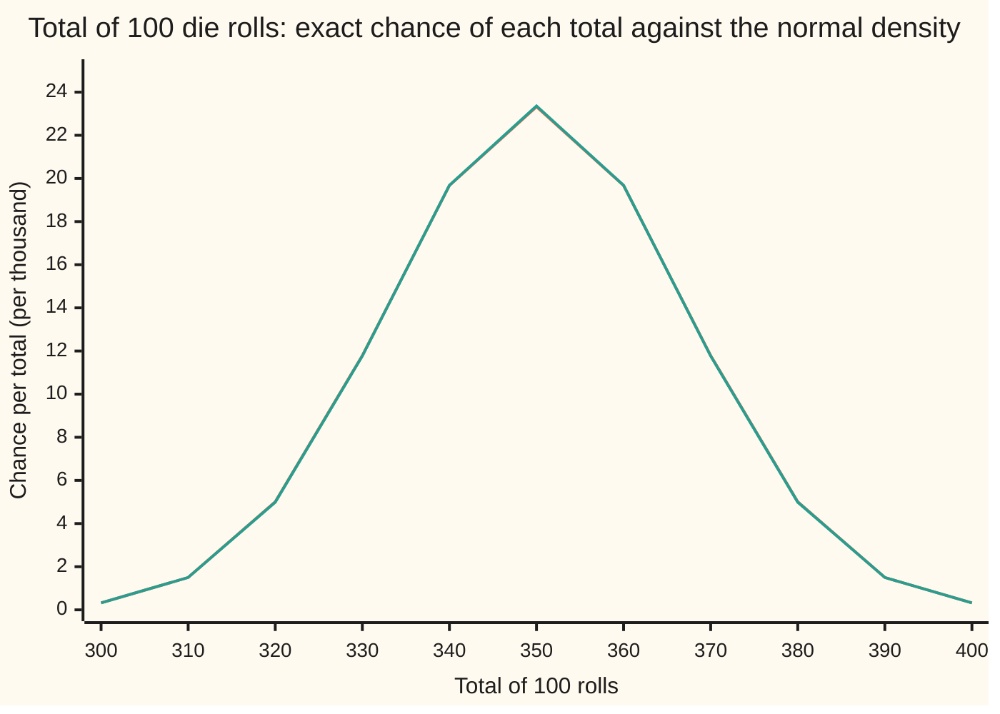
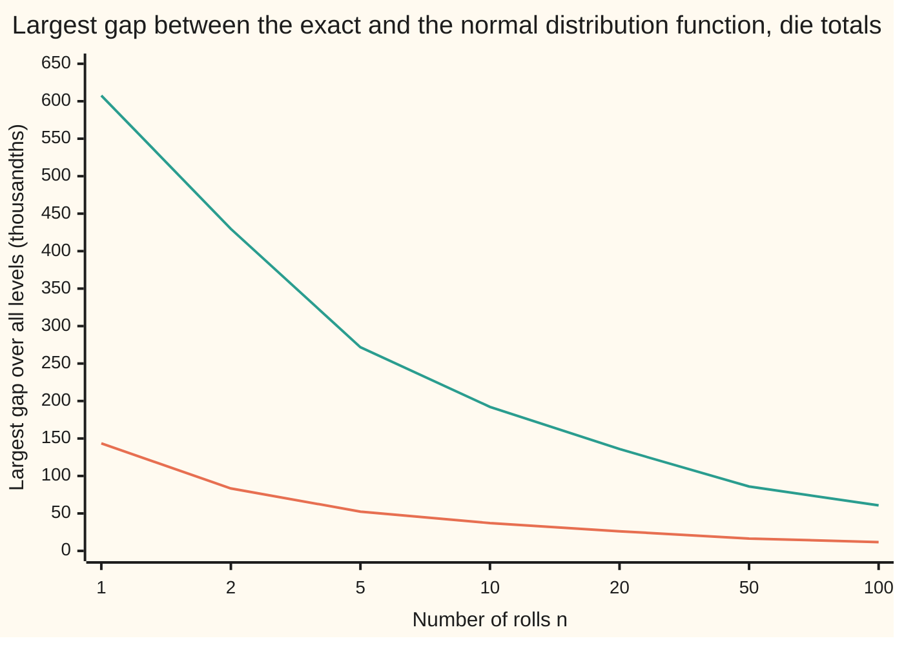

# The central limit theorem, proved: standardised sums of independent copies with finite variance converge to the normal law, by swapping one summand at a time

Measure and integration → The Limit Theorems, Proved → The bell curve as a limit → The central limit theorem, proved

---

## General Overview

A fair die is rolled 100 times and the faces are added. The total lands somewhere between 100 and 600. On average it is 350, and its typical distance from 350, the standard deviation, is 17.08. How likely is a total of 330 or less?

The exact answer weighs every one of the 6^100 possible roll sequences. Adding one roll at a time and keeping the full table of totals, a step called convolution, gives 0.126948. The bell curve with the same centre and spread gives 0.120783 in one line of arithmetic, and 0.126768 when the cut is placed halfway between 330 and 331. The central limit theorem is the reason the bell curve may stand in for the count.

The probability wing states the theorem and checks it by simulation ([central-limit-theorem](../../09-Probability%20and%20statistics/06-Limit%20Theorems%20in%20Practice/02-central-limit-theorem.md)). This card proves it for any law with a finite variance, by Jarl Lindeberg's argument of 1922: trade the rolls for bell-curve variables one at a time. A roll and its replacement share mean and variance, so each trade moves a smooth average very little. A second proof, by characteristic functions, and a rate, the Berry–Esseen theorem, follow.

**Centre a sum of n independent copies of one law with finite positive variance, divide by its standard deviation, and the chance that it lands at or below any level tends to the bell-curve chance; the proof trades the copies for normal variables one at a time, each trade costing an amount that shrinks faster than 1/n.**

**What kind of fact this is:** a theorem, proved on this card in Why it works (the third-moment case in the body, the finite-variance case in the Detailed proof); the Berry–Esseen rate is stated and cited, not proved here.

### The picture: the exact chances against the bell curve



Orange is the exact chance of each total, from the convolution, in thousandths. Green is the normal density with mean 350 and standard deviation 17.0783, in the same units. The two agree to within a few hundredths of a thousandth at every plotted total; the widest difference sits at the peak, 23.32 against 23.36.

---

## The formula

Notation, as a reminder. $(\Omega, \mathcal{F}, P)$ is a probability space: outcomes, the sets we allow ourselves to measure, and a measure of total size 1. A random variable X is a measurable function on $\Omega$; its law is $P \circ X^{-1}$. Random variables are **independent** when their joint law is the product of their laws ([independence-as-a-product-measure](../06-Product%20Measures%20and%20Fubini/04-independence-as-a-product-measure.md)). **Convergence in distribution** means the distribution functions converge at every level where the limit is continuous ([convergence-in-distribution](05-convergence-in-distribution.md)). i.i.d. means independent, each with the same law.

Let $X_1, X_2, \dots$ be i.i.d. with mean $\mu$ and variance $\sigma^2$, where $0 < \sigma^2 < \infty$. Write

$$S_n = X_1 + \dots + X_n, \qquad Z_n = \frac{S_n - n\mu}{\sigma\sqrt{n}}, \qquad \Phi(x) = \int_{-\infty}^{x} \frac{e^{-y^2/2}}{\sqrt{2\pi}}\, dy.$$

**The central limit theorem.** For every real $x$,

$$P(Z_n \le x) \;\longrightarrow\; \Phi(x) \quad \text{as } n \to \infty.$$

**Read it aloud:** subtract the expected total, divide by the total's standard deviation, and the chance of landing at or below any level tends to the bell-curve chance.

In measure language: the laws $P \circ Z_n^{-1}$ converge in distribution to the standard normal law, with density $e^{-y^2/2}/\sqrt{2\pi}$ against Lebesgue measure ([normal-distribution](../../09-Probability%20and%20statistics/04-Continuous%20Distributions/04-normal-distribution.md)).

Take a test function h whose third derivative is bounded, $\lVert h''' \rVert$ being its largest size, and a standard normal variable G. With a finite third moment $\rho = E\lvert X_1 - \mu \rvert^3$, the proof gives:

$$\big\lvert E\,h(Z_n) - E\,h(G) \big\rvert \;\le\; \frac{\lVert h''' \rVert}{6\sqrt{n}} \Big( \frac{\rho}{\sigma^3} + E\lvert G \rvert^3 \Big).$$

**Read it aloud:** the average of h over the standardized sum is within a constant over the square root of n of its average over G.

The rate for the distribution function itself is the **Berry–Esseen theorem**, stated here, proved in the sources:

$$\sup_{x} \big\lvert P(Z_n \le x) - \Phi(x) \big\rvert \;\le\; \frac{C\,\rho}{\sigma^3 \sqrt{n}} \quad \text{for every } n \ge 1, \text{ with } C < 0.4748.$$

**Read it aloud:** at every level at once, the gap is at most a fixed constant times the third-moment ratio, over the square root of n.

| Symbol | Plain meaning | In our example | Push it up and the answer… |
| --- | --- | --- | --- |
| $\Omega$, $P$, $X_i$ | outcomes; the probability measure; the i-th copy | roll sequences; 6^(-100) each; the i-th face | — |
| $n$, $S_n$ | number of copies; their sum | 100; the total | the total's spread grows like the square root of n |
| $\mu$, $\sigma$ | mean and standard deviation of one copy | 3.5; 1.7078 | larger $\sigma$ widens the bell; $Z_n$ is unchanged |
| $Y_i$, $Y_k$, $Y_1$ | one standardized copy, $(X_i - \mu)/\sigma$: mean 0, variance 1 | (face − 3.5)/1.7078 | — |
| $Z_n$, $Z_{100}$ | the standardized sum | (total − 350)/17.0783 | — |
| $\Phi$ | the standard normal distribution function | $\Phi(-1.1711)$ = 0.120783 | — |
| $G$, $G_i$, $G_k$ | standard normal variables, independent of the copies | the replacements; $E\lvert G \rvert^3$ = 1.595769 | — |
| $h$, $M_2$, $M_3$, $R$ | a test function; $\lVert h''' \rVert$ (called $M_3$ in the proof) and $M_2$ bound its third and second derivatives; $R$ is the Taylor remainder | a smooth step of width 0.5 at −1.1711 | a sharper step makes $\lVert h''' \rVert$ grow like one over the width cubed |
| $W_k$, $U_k$ | the hybrid sum, k copies kept, the rest normal; its part shared with the next hybrid | — | — |
| $\rho$, $C$ | the third absolute central moment of one copy; the Berry–Esseen constant | 51/8; below 0.4748 | a heavier tail raises $\rho$ and loosens the bound |
| $\varphi_Y$, $t$ | the characteristic function $E\,e^{itY}$; its argument | $Z_{100}$ at t = 1: 0.606210 | — |
| $x$, $\delta$, $\varepsilon$, $\psi$, $q$, $\xi$ | a level; a ramp width; a cut-off; a smooth ramp and its polynomial; a point between u and u + y | 330 on the total's scale; 0.5 | — |
| $u$, $y$, $\eta$, $J$ | Taylor base point and step; a point between them; a jump's height | $U_k$, $Y_k/\sqrt{n}$ | — |
| $a$, $b$, $s$ | the standardized cut; second road: two complex numbers of size at most 1, an argument | a = −1.1711 | — |

### When it holds

- **Independence.** The proof needs each summand independent of the rest. Copy one roll 100 times and the chance of 330 or less stays 1/2.
- **Identical laws, or no summand dominating.** Different laws still work under Lindeberg's condition: the share of the total variance carried by summands larger than a fixed fraction of the total's standard deviation tends to zero. The same swap proves it.
- **Finite positive variance.** Cauchy steps have no variance, and their sum divided by the square root of n spreads out forever. Zero variance makes every copy almost surely constant, and the division undefined.
- **A limit, not a guarantee at a given n.** For a finite n the error needs Berry–Esseen or an exact count; no single n serves every law.

---

## Why it works

### Step 0: two variables with the same mean and variance look alike to a smooth function

Expand a smooth function around a point, as in [taylors-theorem](../../06-Calculus%20and%20analysis/03-What%20Derivatives%20Tell%20You/05-taylors-theorem.md): $h(u + y) = h(u) + h'(u)\,y + \tfrac12 h''(u)\,y^2 + R$, with the remainder $R$ at most $\lVert h''' \rVert\,\lvert y \rvert^3/6$ in size. Average over a small random step y. The first two terms depend on the step only through its mean and its mean square. A standardized roll, (face − 3.5)/1.7078, and a standard normal variable, both scaled down by the square root of n, share both. So they differ only in the remainder, of order $n^{-3/2}$. Swap all n rolls one at a time and the total cost is of order $n \cdot n^{-3/2} = n^{-1/2}$.

### Step 1: test with smooth functions, not with a cut

The event "total at most 330" is an indicator: one below the cut, zero above. It jumps, and a jump has no Taylor expansion. Two rolls show the cost. Of the 36 equally likely pairs, 21 total 7 or less, so $P(Z_2 \le 0) = 7/12$, against $\Phi(0) = 0.5$: the six pairs landing exactly on 7 sit on the cut. A smooth test function spreads the cut over a short ramp. The proof compares smooth averages first, then squeezes the cut between two of them (Step 5).

### Step 2: the swap, one summand at a time

Put independent standard normals $G_1, \dots, G_n$ beside the copies on one space, by a product measure ([independence-as-a-product-measure](../06-Product%20Measures%20and%20Fubini/04-independence-as-a-product-measure.md)). Let $W_k$ be the sum, divided by the square root of n, of the first k standardized copies and the last n − k normals:

$$W_k = \frac{Y_1 + \dots + Y_k + G_{k+1} + \dots + G_n}{\sqrt{n}}.$$

At k = n this is $Z_n$. At k = 0 it is a sum of independent normals divided by the square root of n, which is exactly standard normal ([convolution-and-sums](../06-Product%20Measures%20and%20Fubini/05-convolution-and-sums.md)). Neighbours $W_k$ and $W_{k-1}$ differ in one place only: slot k holds $Y_k$ in one and $G_k$ in the other. Everything else is a shared part $U_k$, independent of both.

### Step 3: each swap costs a third-order remainder

Expand h around $U_k$ with step $Y_k/\sqrt{n}$, and again with step $G_k/\sqrt{n}$. Independence turns averages of products into products of averages. The first-order terms are $E\,h'(U_k)$ times the step's mean, zero in both. The second-order terms are $\tfrac12 E\,h''(U_k)$ times the step's mean square, $1/n$ in both. They cancel. Only the remainders survive:

$$\big\lvert E\,h(W_k) - E\,h(W_{k-1}) \big\rvert \;\le\; \frac{\lVert h''' \rVert}{6\,n^{3/2}} \Big( E\lvert Y_1 \rvert^3 + E\lvert G \rvert^3 \Big).$$

For the die, $E\lvert Y_1 \rvert^3 = \rho/\sigma^3$ = 1.2798 and $E\lvert G \rvert^3 = 2\sqrt{2/\pi}$ = 1.595769.

### Step 4: add up the swaps

The gap between the two ends is the sum of the n neighbour differences, so at most n times the bound of Step 3. That is the formula's bound; it falls like one over the square root of n, so $E\,h(Z_n) \to E\,h(G)$.

The code runs the swap on the die with the smooth step $h(u) = \Phi((a - u)/0.5)$, a = −1.1711 being the standardized cut, and computes every hybrid average exactly. The bound allows 0.001530 per swap and 0.1530 in all. The largest actual swap moves the average by 1.56e-06, and all 100 together by 1.56e-04: from $E\,h(G)$ = 0.147447 to $E\,h(Z_{100})$ = 0.147603. The bound is loose; its job is to go to zero.

### Step 5: from smooth steps back to the cut, and down to finite variance

Fix a level x and a width $\delta > 0$. A smooth ramp equal to 1 up to x and 0 from $x + \delta$ on lies between the indicators of "at most x" and "at most $x + \delta$". So $P(Z_n \le x)$ is at most the ramp's average, which tends to its normal average, at most $\Phi(x + \delta)$. A ramp shifted left gives the lower side, $\Phi(x - \delta)$. The bell curve has no jumps, so letting $\delta$ shrink pins the limit at $\Phi(x)$.

Without a third moment, split each copy at a level $\varepsilon$ times the square root of n. Small values obey the third-order bound; large values obey a second-order one, and their share of the variance tends to zero by dominated convergence. That truncation is part 4 of the Detailed proof, and the origin of Lindeberg's condition.

<details>
<summary>Detailed proof</summary>

**Setting.** $X_1, X_2, \dots$ are i.i.d. on $(\Omega, \mathcal{F}, P)$ with $E X_1^2 < \infty$ and $\sigma^2 > 0$; $Y_i = (X_i - \mu)/\sigma$ has $E Y_i = 0$, $E Y_i^2 = 1$, and $Z_n = (Y_1 + \dots + Y_n)/\sqrt{n}$. For each n, take the product of $(\Omega, \mathcal{F}, P)$ with $\mathbb{R}^n$ under the standard normal law in each coordinate; the coordinates $G_1, \dots, G_n$ are then standard normal, independent of each other and of the $X_i$, and the joint law of the $X_i$ is unchanged ([independence-as-a-product-measure](../06-Product%20Measures%20and%20Fubini/04-independence-as-a-product-measure.md)).

**1. Taylor with two remainder bounds.** Let h have bounded derivatives up to order 3, with $M_2 = \sup \lvert h'' \rvert$ and $M_3 = \sup \lvert h''' \rvert$. For real u and y put $R(u, y) = h(u + y) - h(u) - h'(u) y - \tfrac12 h''(u) y^2$. The Lagrange remainder of order 3 gives $R = h'''(\xi) y^3/6$ for some $\xi$, so $\lvert R \rvert \le M_3 \lvert y \rvert^3/6$. The Lagrange remainder of order 2 gives $h(u + y) = h(u) + h'(u) y + \tfrac12 h''(\eta) y^2$, so $R = \tfrac12 (h''(\eta) - h''(u)) y^2$ and $\lvert R \rvert \le M_2 y^2$ ([taylors-theorem](../../06-Calculus%20and%20analysis/03-What%20Derivatives%20Tell%20You/05-taylors-theorem.md)). Hence $\lvert R(u, y) \rvert \le \min(M_2 y^2, M_3 \lvert y \rvert^3/6)$.

**2. One swap.** For $1 \le k \le n$ let $U_k = (Y_1 + \dots + Y_{k-1} + G_{k+1} + \dots + G_n)/\sqrt{n}$, so $W_k = U_k + Y_k/\sqrt{n}$ and $W_{k-1} = U_k + G_k/\sqrt{n}$. $U_k$ is a measurable function of variables other than $Y_k$ and $G_k$, so it is independent of each; h, h', h'' are bounded, so every term below is integrable, and independence factors averages of products:
$E\,h(W_k) = E\,h(U_k) + E\,h'(U_k)\,E Y_k/\sqrt{n} + \tfrac12 E\,h''(U_k)\,E Y_k^2/n + E\,R(U_k, Y_k/\sqrt{n})$,
and the same with $G_k$ in place of $Y_k$. Since $E Y_k = E G_k = 0$ and $E Y_k^2 = E G_k^2 = 1$, the first three terms agree, and
$\lvert E\,h(W_k) - E\,h(W_{k-1}) \rvert \le E\lvert R(U_k, Y_k/\sqrt{n}) \rvert + E\lvert R(U_k, G_k/\sqrt{n}) \rvert$.

**3. The third-moment case.** If $E \lvert Y_1 \rvert^3 < \infty$, part 1 bounds the two remainders by $M_3 E\lvert Y_1 \rvert^3/(6 n^{3/2})$ and $M_3 E\lvert G \rvert^3/(6 n^{3/2})$, for every k. $W_n = Z_n$, and $W_0 = (G_1 + \dots + G_n)/\sqrt{n}$ is standard normal, since a sum of independent normals is normal with the summed variance ([convolution-and-sums](../06-Product%20Measures%20and%20Fubini/05-convolution-and-sums.md)). Summing part 2 over k by the triangle inequality gives $\lvert E\,h(Z_n) - E\,h(G) \rvert \le M_3 (E\lvert Y_1 \rvert^3 + E\lvert G \rvert^3)/(6\sqrt{n})$, which is the displayed bound since $E\lvert Y_1 \rvert^3 = \rho/\sigma^3$.

**4. Finite variance only.** Fix $\varepsilon > 0$. On the set where $\lvert Y_k \rvert \le \varepsilon \sqrt{n}$, part 1 gives $\lvert R(U_k, Y_k/\sqrt{n}) \rvert \le M_3 \lvert Y_k \rvert^3/(6 n^{3/2}) \le M_3\,\varepsilon\,Y_k^2/(6n)$. Off it, $\lvert R \rvert \le M_2 Y_k^2/n$. Taking expectations, with the $Y_k$ sharing one law,
$n\,E\lvert R(U_k, Y_k/\sqrt{n}) \rvert \le M_3 \varepsilon/6 + M_2\,E[Y_1^2\,1_{\{\lvert Y_1 \rvert > \varepsilon\sqrt{n}\}}]$.
The functions $Y_1^2\,1_{\{\lvert Y_1 \rvert > \varepsilon\sqrt{n}\}}$ are dominated by the integrable $Y_1^2$ and tend to 0 at every point, since $Y_1$ is finite; by dominated convergence their integrals tend to 0 ([dominated-convergence-theorem](../05-Swapping%20Limits%20and%20Integrals/02-dominated-convergence-theorem.md)). The normal remainders sum to at most $M_3 E\lvert G \rvert^3/(6\sqrt{n})$. Summing part 2 over k, $\limsup_n \lvert E\,h(Z_n) - E\,h(G) \rvert \le M_3 \varepsilon/6$ for every $\varepsilon > 0$, so $E\,h(Z_n) \to E\,h(G)$.

**5. A smooth ramp.** Let $q(t) = 35t^4 - 84t^5 + 70t^6 - 20t^7$. Then $q(0) = 0$, $q(1) = 1$ and $q'(t) = 140\,t^3 (1 - t)^3$, so the first three derivatives of q vanish at 0 and at 1. Define $\psi(t) = 1$ for $t \le 0$, $\psi(t) = 1 - q(t)$ on $[0, 1]$, $\psi(t) = 0$ for $t \ge 1$. The pieces meet with matching derivatives, so $\psi$ has bounded derivatives up to order 3.

**6. The cut.** Fix x and $\delta > 0$. The function $u \mapsto \psi((u - x)/\delta)$ lies between the indicators of $(-\infty, x]$ and $(-\infty, x + \delta]$, so by part 4 and monotonicity of the integral, $\limsup_n P(Z_n \le x) \le \lim_n E\,\psi((Z_n - x)/\delta) = E\,\psi((G - x)/\delta) \le \Phi(x + \delta)$. The function $u \mapsto \psi((u - x + \delta)/\delta)$ lies between the indicators of $(-\infty, x - \delta]$ and $(-\infty, x]$, so $\liminf_n P(Z_n \le x) \ge \Phi(x - \delta)$. $\Phi$ is continuous, so letting $\delta \to 0$ gives $P(Z_n \le x) \to \Phi(x)$ at every x: convergence in distribution to the standard normal law.

</details>

### Step 6: the rate, and why it cannot beat one over the square root of n

Step 4 gives a rate for smooth functions. For the distribution function itself, Berry (1941) and Esseen (1942) proved the bound in The formula; Irina Shevtsova brought the constant below 0.4748 in 2011. Its proof uses a Fourier smoothing inequality and is not given here.

For the die at n = 100 the bound is 0.4748 × 1.2798 / 10 = 0.0608. The largest actual gap, over every level, is 0.0117. The chart follows the same comparison from one roll to a hundred.



Orange is the largest gap in thousandths, taken at every jump of the true distribution function. Green is the Berry–Esseen bound with constant 0.4748, in the same units. Both fall like one over the square root of n: the gap times the square root of n settles at 0.1169.

For whole-number totals the gap cannot fall faster. The distribution function jumps, the tallest jump, at 350, is 23.32 thousandths, and a continuous curve misses one side of a jump of height J by at least J/2 ([convergence-in-distribution](05-convergence-in-distribution.md)): about 0.0117, the gap in the chart. The half-step cut works for this reason: it aims the bell curve at the middle of a jump.

<details>
<summary>The second road: characteristic functions</summary>

The characteristic function of Y is $\varphi_Y(s) = E\,e^{isY}$ ([characteristic-functions](06-characteristic-functions.md)). For real y, $\lvert e^{iy} - (1 + iy - y^2/2) \rvert \le \min(\lvert y \rvert^3/6,\, y^2)$, by Taylor's theorem with the remainder in integral form, applied to $e^{iy}$. With $E Y = 0$, $E Y^2 = 1$, this gives $\lvert \varphi_Y(s) - (1 - s^2/2) \rvert \le s^2\,E \min(\lvert s \rvert\,\lvert Y \rvert^3/6,\, Y^2)$, and the last expectation tends to 0 as s → 0 by dominated convergence, with $Y^2$ as the bound.

Independence turns the characteristic function of a sum into a product, so $\varphi_{Z_n}(t) = \varphi_Y(t/\sqrt{n})^n$. For complex a and b of size at most 1, $\lvert a^n - b^n \rvert \le n \lvert a - b \rvert$, by writing $a^n - b^n$ as a telescoping sum of n terms. Take $a = \varphi_Y(t/\sqrt{n})$ and $b = 1 - t^2/(2n)$, which lies in $[0, 1]$ once n is at least $t^2/2$. Then $\lvert \varphi_{Z_n}(t) - b^n \rvert \le n \cdot (t^2/n) \cdot o(1) \to 0$, and $b^n \to e^{-t^2/2}$, the characteristic function of the standard normal law. Lévy's continuity theorem, from the same card, turns convergence of characteristic functions at every t into convergence in distribution.

For the die the code prints $\varphi_{Z_n}(1)$ = 0.567548, 0.603269, 0.606210, 0.606499 at n = 1, 10, 100, 1000, against the limit 0.606531. The die's law is symmetric, so its characteristic function is an average of cosines; with the fourth moment $E Y^4$ = 1.7314 the same telescoping gives the explicit bound $(E Y^4/24 + 1/8)\,t^4/n$, 0.001971 at t = 1, n = 100, and every printed value sits inside it.

</details>

The characteristic-function road is shorter once Lévy's continuity theorem is in hand; Lindeberg's swap needs no Fourier analysis and gives a rate for smooth functions. The Fourier road is laid out in full on central-limit-theorem-by-characteristic-functions.

---

## Worked numbers, by hand

One fair die, 100 rolls, the question: a total of 330 or less.

| Step | Arithmetic | Value |
| --- | --- | --- |
| mean of one roll $\mu$ | (1 + 2 + 3 + 4 + 5 + 6)/6 | 7/2 |
| variance of one roll | (2.5^2 + 1.5^2 + 0.5^2) × 2/6 = 17.5/6 | 35/12 |
| $\sigma$ | square root of 35/12 | 1.7078 |
| mean of the total | 100 × 3.5 | 350 |
| variance of the total | 100 × 35/12, since variances of independent rolls add | 875/3 |
| standard deviation of the total | square root of 875/3 | 17.0783 |
| standardized cut | (330 − 350)/17.0783 | −1.1711 |
| normal chance | $\Phi(-1.1711)$ | 0.120783 |
| half-step cut | (330.5 − 350)/17.0783 = −1.1418 | 0.126768 |
| exact chance | convolution of 100 rolls | **0.126948** |
| $\rho$ | (2.5^3 + 1.5^3 + 0.5^3) × 2/6 | 51/8 |
| moment ratio | $\rho/\sigma^3$ | 1.2798 |
| Berry–Esseen allowance | 0.4748 × 1.2798 / 10 | 0.0608 |
| actual gap at 330 | 0.126948 − 0.120783 | **0.006164** |

About one hundred-roll session in eight ends at 330 or below. The bell curve misses by 0.006164, a tenth of the Berry–Esseen allowance; the half-step answer misses by 0.000180.

### What breaks if you drop a piece

| Mistake | Comes out at | What went wrong |
| --- | --- | --- |
| Rolls not independent: one roll copied 100 times | chance of 330 or less = P(one roll ≤ 3) = 1/2, against 0.126948 | $Z_n$ is one standardized roll for every n |
| Infinite variance: Cauchy steps, divided by the square root of n | characteristic function at t = 1: 0.3679, 0.1353, 0.000045 at n = 1, 4, 100, falling to 0 instead of 0.606531 | A Cauchy sum divided by n is again Cauchy, so divided by the square root of n it spreads without limit ([heavy-tails-pareto-and-cauchy](../../09-Probability%20and%20statistics/04-Continuous%20Distributions/08-heavy-tails-pareto-and-cauchy.md)) |
| Standard deviation of the total taken as 100 × 1.7078 | 170.78, and a normal chance of 0.4534 | Variances add, not standard deviations |
| Treating the limit as a guarantee at n = 100: rare event, p = 1/10000 | chance the count is at most its mean = chance of no event = 0.9900, against $\Phi(0)$ = 0.5 | The theorem fixes the law and lets n grow; with successes this rare the moment ratio is enormous and Berry–Esseen gives no useful bound |

---

## Code, from first principles, and it actually runs

The code reaches the chance of 330 or less by two exact roads: convolution, one roll at a time, and an inclusion-exclusion formula for the count of roll sequences. Python compares the counts as whole numbers; Rust, with no big integers, compares them modulo the prime 2^61 − 1. The normal distribution function comes from its own Taylor series. Then the code runs the proof: Lindeberg's swap over all 101 hybrid sums against the per-swap bound, the largest gap at seven values of n from 1 to 100 against Berry–Esseen, and the characteristic function of $Z_n$ against its limit. The failures print last. The code shows one law at finite n; that the limit holds for every law with finite variance is what the proof shows.

### Python

```python
# The central limit theorem, proved -- the check behind the card.
# Standard library only.  One fair die, faces 1 to 6.  S is the total of
# 100 independent rolls: mean 350, standard deviation 17.08.  Roads: exact
# convolution in whole numbers, inclusion-exclusion, the normal CDF from its
# own series, Lindeberg's swap with a smooth step, the characteristic function.
from fractions import Fraction as Q
from math import comb, cos, exp, pi, sqrt

N, CUT, DELTA, C_SHEV = 100, 330, 0.5, 0.4748
MU, VAR, P61 = Q(7, 2), Q(35, 12), 2 ** 61 - 1
SIG = sqrt(VAR)

def Phi(z):                              # 1/2 + phi(z) * sum z^(2k+1) / (1*3*...*(2k+1))
    if abs(z) > 8:                       # beyond 8 the tail is below 1e-15
        return 0.0 if z < 0 else 1.0
    term = total = z
    k = 0
    while abs(term) > 1e-17 * abs(total):
        k += 1
        term *= z * z / (2 * k + 1)
        total += term
    return 0.5 + exp(-z * z / 2) / sqrt(2 * pi) * total

def simpson(f, a, b, m):                 # Simpson's rule on m (even) slices
    h = (b - a) / m
    return h / 3 * sum((1 if i in (0, m) else 4 if i % 2 else 2) * f(a + i * h) for i in range(m + 1))

# ---- one roll, exactly ----
rho = sum(abs(k - MU) ** 3 for k in range(1, 7)) / 6
m4 = sum((k - MU) ** 4 for k in range(1, 7)) / 6
ratio, kurt = float(rho) / SIG ** 3, float(m4 / VAR ** 2)
print(f"one roll: mean {MU}, variance {VAR}, E|X - 3.5|^3 = {rho}, E(X - 3.5)^4 = {m4}")
print(f"sigma = {SIG:.4f}; rho/sigma^3 = {ratio:.4f}; E[Y^4] = {kurt:.4f}")

# ---- road 1: the law of S by convolution, every k from 1 to 100 kept ----
counts, probs = [1], [[1.0]]             # counts[s] = roll sequences with total s
for k in range(1, N + 1):
    new = [0] * (len(counts) + 6)
    for s, c in enumerate(counts):
        for f in range(1, 7):
            new[s + f] += c
    counts = new
    probs.append([c / 6 ** k for c in counts])
two = sum(1 for a in range(1, 7) for b in range(1, 7) if a + b <= 7)
print(f"two rolls: {two} of 36 totals <= 7, P(Z_2 <= 0) = {Q(two, 36)} against Phi(0) = {Phi(0.0)}")
sd = sqrt(N * VAR)
print(f"total of {N} rolls: mean {N * MU}, variance {N * VAR}, standard deviation {sd:.4f}")
below = sum(counts[:CUT + 1])
incl_excl = sum((-1) ** j * comb(N, j) * comb(CUT - 6 * j, N) for j in range((CUT - N) // 6 + 1))
assert below == incl_excl                                   # road 2: inclusion-exclusion
print(f"roll sequences with total <= {CUT}, mod 2^61 - 1: {below % P61} by convolution, "
      f"{incl_excl % P61} by inclusion-exclusion")
exact = below / 6 ** N
z, zc = (CUT - 350) / sd, (CUT + 0.5 - 350) / sd
print(f"P(S <= {CUT}) exact = {exact:.6f}")
print(f"normal: z = {z:.4f}, Phi(z) = {Phi(z):.6f}; half-step z = {zc:.4f}, Phi = {Phi(zc):.6f}")
print(f"gaps: exact - Phi(z) = {exact - Phi(z):.6f}; exact - half-step = {exact - Phi(zc):.6f}")
be = C_SHEV * ratio / sqrt(N)
print(f"Berry-Esseen: {C_SHEV} x {ratio:.4f} / sqrt({N}) = {be:.4f}")
assert abs(exact - Phi(z)) <= be

# ---- figure 1: mass of S against the normal density, times 1000 ----
xs = list(range(300, 401, 10))
print("figure, s: " + ", ".join(map(str, xs)))
print("figure, P(S = s) x 1000: " + ", ".join(f"{1000 * probs[N][s]:.2f}" for s in xs))
print("figure, normal density x 1000: " + ", ".join(
    f"{1000 * exp(-((s - 350) / sd) ** 2 / 2) / (sd * sqrt(2 * pi)):.2f}" for s in xs))

# ---- the largest CDF gap over every threshold, against Berry-Esseen ----
gap_fig, bound_fig = [], []
for n in (1, 2, 5, 10, 20, 50, 100):
    F, worst, s_n = 0.0, 0.0, sqrt(n * VAR)
    for s in range(n, 6 * n + 1):
        ph = Phi((s - 3.5 * n) / s_n)
        worst = max(worst, abs(F - ph))
        F += probs[n][s]
        worst = max(worst, abs(F - ph))
    bound = min(1.0, C_SHEV * ratio / sqrt(n))
    print(f"n = {n}: largest gap {worst:.4f}, Berry-Esseen bound {bound:.4f}, sqrt(n) x gap {sqrt(n) * worst:.4f}")
    assert worst <= bound
    gap_fig.append(f"{1000 * worst:.2f}")
    bound_fig.append(f"{1000 * bound:.2f}")
print("figure, largest gap x 1000: " + ", ".join(gap_fig))
print("figure, Berry-Esseen bound x 1000: " + ", ".join(bound_fig))

# ---- Lindeberg's swap: replace rolls by normals one at a time ----
g3 = 2 * sqrt(2 / pi)
g3_num = simpson(lambda g: abs(g) ** 3 * exp(-g * g / 2) / sqrt(2 * pi), -12, 12, 2400)
print(f"E|G|^3 = 2 sqrt(2/pi) = {g3:.6f}; by Simpson {g3_num:.6f}")
assert abs(g3 - g3_num) < 1e-8
def hybrid(k):                           # E h(W_k): k standardized rolls, N - k normals
    b = sqrt(DELTA ** 2 + (N - k) / N)
    return sum(p * Phi((z - (s - 3.5 * k) / sd) / b) for s, p in enumerate(probs[k]) if p > 0)
H = [hybrid(k) for k in range(N + 1)]
eh_simpson = simpson(lambda g: Phi((z - g) / DELTA) * exp(-g * g / 2) / sqrt(2 * pi), -12, 12, 2400)
print(f"smooth step h(u) = Phi((a - u)/{DELTA}), a = {z:.4f}: E h(Z_100) = {H[N]:.6f}, "
      f"E h(G) = {H[0]:.6f}, by Simpson {eh_simpson:.6f}")
assert abs(H[0] - eh_simpson) < 1e-7
h3 = 1 / sqrt(2 * pi) / DELTA ** 3      # sup |h'''|: phi''(x) = (x^2 - 1) phi(x) peaks at x = 0
per_swap = h3 * (ratio + g3) / (6 * N ** 1.5)
steps = [abs(H[k] - H[k - 1]) for k in range(1, N + 1)]
print(f"swap bound per roll {per_swap:.6f}, over {N} rolls {N * per_swap:.4f}; "
      f"largest actual swap {max(steps):.2e}, all {N} together {abs(H[N] - H[0]):.2e}")
assert max(steps) <= per_swap                               # every swap within Step 3's bound

# ---- road 3: the characteristic function of Z_n against exp(-t^2/2) ----
def chf(t, n):                           # [average of cos((k - 3.5) s / sigma)]^n, s = t / sqrt(n)
    return (sum(cos((k - 3.5) * t / (SIG * sqrt(n))) for k in range(1, 7)) / 6) ** n
for t in (1.0, 2.0):
    row = [chf(t, n) for n in (1, 10, 100, 1000)]
    print(f"t = {t:.0f}: phi_Zn at n = 1, 10, 100, 1000: {', '.join(f'{v:.6f}' for v in row)}; "
          f"limit {exp(-t * t / 2):.6f}")
    for n, v in zip((10, 100, 1000), row[1:]):
        assert abs(v - exp(-t * t / 2)) <= (kurt / 24 + 1 / 8) * t ** 4 / n
print(f"bound at t = 1, n = 100: (E[Y^4]/24 + 1/8)/100 = {(kurt / 24 + 1 / 8) / 100:.6f}")

# ---- what breaks ----
cau = [exp(-1 / sqrt(n)) ** n for n in (1, 4, 100)]  # Cauchy phi(s) = exp(-|s|), s = 1/sqrt(n)
print(f"Cauchy steps, phi at t = 1 after dividing by sqrt(n): n = 1, 4, 100: "
      f"{cau[0]:.4f}, {cau[1]:.4f}, {cau[2]:.6f}")
low = sum(N * k <= CUT for k in range(1, 7))             # faces k with 100 k <= 330
print(f"one roll copied {N} times: P(S <= {CUT}) = {low}/6 = {low / 6}")
print(f"standard deviation taken as {N} x sigma = {N * SIG:.2f}: Phi = {Phi((CUT - 350) / (N * SIG)):.4f}")
p = 1 / 10000
print(f"rare event p = 1/10000, {N} trials: P(count <= np) = P(count = 0) = {(1 - p) ** N:.4f}")
print("ALL CHECKS PASS")
```

**Ran 2026-10-07 on macOS, Python 3.14.6, standard library only. All checks passed. Output, pasted from the run:**

```
one roll: mean 7/2, variance 35/12, E|X - 3.5|^3 = 51/8, E(X - 3.5)^4 = 707/48
sigma = 1.7078; rho/sigma^3 = 1.2798; E[Y^4] = 1.7314
two rolls: 21 of 36 totals <= 7, P(Z_2 <= 0) = 7/12 against Phi(0) = 0.5
total of 100 rolls: mean 350, variance 875/3, standard deviation 17.0783
roll sequences with total <= 330, mod 2^61 - 1: 1711517283031346618 by convolution, 1711517283031346618 by inclusion-exclusion
P(S <= 330) exact = 0.126948
normal: z = -1.1711, Phi(z) = 0.120783; half-step z = -1.1418, Phi = 0.126768
gaps: exact - Phi(z) = 0.006164; exact - half-step = 0.000180
Berry-Esseen: 0.4748 x 1.2798 / sqrt(100) = 0.0608
figure, s: 300, 310, 320, 330, 340, 350, 360, 370, 380, 390, 400
figure, P(S = s) x 1000: 0.32, 1.50, 5.01, 11.79, 19.67, 23.32, 19.67, 11.79, 5.01, 1.50, 0.32
figure, normal density x 1000: 0.32, 1.50, 4.99, 11.77, 19.68, 23.36, 19.68, 11.77, 4.99, 1.50, 0.32
n = 1: largest gap 0.1434, Berry-Esseen bound 0.6077, sqrt(n) x gap 0.1434
n = 2: largest gap 0.0833, Berry-Esseen bound 0.4297, sqrt(n) x gap 0.1179
n = 5: largest gap 0.0525, Berry-Esseen bound 0.2718, sqrt(n) x gap 0.1173
n = 10: largest gap 0.0371, Berry-Esseen bound 0.1922, sqrt(n) x gap 0.1173
n = 20: largest gap 0.0262, Berry-Esseen bound 0.1359, sqrt(n) x gap 0.1171
n = 50: largest gap 0.0165, Berry-Esseen bound 0.0859, sqrt(n) x gap 0.1169
n = 100: largest gap 0.0117, Berry-Esseen bound 0.0608, sqrt(n) x gap 0.1169
figure, largest gap x 1000: 143.45, 83.33, 52.45, 37.10, 26.18, 16.53, 11.69
figure, Berry-Esseen bound x 1000: 607.66, 429.68, 271.75, 192.16, 135.88, 85.94, 60.77
E|G|^3 = 2 sqrt(2/pi) = 1.595769; by Simpson 1.595769
smooth step h(u) = Phi((a - u)/0.5), a = -1.1711: E h(Z_100) = 0.147603, E h(G) = 0.147447, by Simpson 0.147447
swap bound per roll 0.001530, over 100 rolls 0.1530; largest actual swap 1.56e-06, all 100 together 1.56e-04
t = 1: phi_Zn at n = 1, 10, 100, 1000: 0.567548, 0.603269, 0.606210, 0.606499; limit 0.606531
t = 2: phi_Zn at n = 1, 10, 100, 1000: -0.109518, 0.123454, 0.134187, 0.135221; limit 0.135335
bound at t = 1, n = 100: (E[Y^4]/24 + 1/8)/100 = 0.001971
Cauchy steps, phi at t = 1 after dividing by sqrt(n): n = 1, 4, 100: 0.3679, 0.1353, 0.000045
one roll copied 100 times: P(S <= 330) = 3/6 = 0.5
standard deviation taken as 100 x sigma = 170.78: Phi = 0.4534
rare event p = 1/10000, 100 trials: P(count <= np) = P(count = 0) = 0.9900
ALL CHECKS PASS
```

### Rust

Same rows, same labels.

```rust
// The central limit theorem, proved -- the same check as the Python, in Rust.
// No crates.  One fair die, faces 1 to 6.  S is the total of 100 independent
// rolls: mean 350, standard deviation 17.08.  Rust has no big integers, so the
// law of S is convolved in f64, and the whole-number count of sequences is
// checked modulo the prime 2^61 - 1, by convolution and by inclusion-exclusion.
use std::f64::consts::PI;

const N: usize = 100;
const CUT: usize = 330;
const DELTA: f64 = 0.5;
const C_SHEV: f64 = 0.4748;
const P61: u128 = (1u128 << 61) - 1;

fn phi_cdf(z: f64) -> f64 {              // 1/2 + phi(z) * sum z^(2k+1) / (1*3*...*(2k+1))
    if z.abs() > 8.0 { return if z < 0.0 { 0.0 } else { 1.0 }; }  // beyond 8 the tail is below 1e-15
    let (mut term, mut total, mut k) = (z, z, 0.0);
    while term.abs() > 1e-17 * total.abs() {
        k += 1.0;
        term *= z * z / (2.0 * k + 1.0);
        total += term;
    }
    0.5 + (-z * z / 2.0).exp() / (2.0 * PI).sqrt() * total
}

fn simpson(f: &dyn Fn(f64) -> f64, a: f64, b: f64, m: usize) -> f64 {
    let h = (b - a) / m as f64;
    let w = |i: usize| if i == 0 || i == m { 1.0 } else if i % 2 == 1 { 4.0 } else { 2.0 };
    h / 3.0 * (0..=m).map(|i| w(i) * f(a + i as f64 * h)).sum::<f64>()
}

fn pow_mod(mut b: u128, mut e: u128) -> u128 {
    let mut r = 1u128;
    while e > 0 { if e & 1 == 1 { r = r * b % P61; } b = b * b % P61; e >>= 1; }
    r
}

fn comb_mod(n: usize, k: usize) -> u128 {  // n choose k modulo the prime, by Fermat inverses
    if k > n { return 0; }
    let (mut num, mut den) = (1u128, 1u128);
    for j in 0..k { num = num * (n - j) as u128 % P61; den = den * (j + 1) as u128 % P61; }
    num * pow_mod(den, P61 - 2) % P61
}

fn main() {
    // ---- one roll, exactly: in 96ths, since 3.5 = 7/2 ----
    let rho = (1..=6i64).map(|k| (2 * k - 7).abs().pow(3)).sum::<i64>() as f64 / 48.0;
    let m4 = (1..=6i64).map(|k| (2 * k - 7).pow(4)).sum::<i64>() as f64 / 96.0;
    let var: f64 = 35.0 / 12.0;
    let sig = var.sqrt();
    let (ratio, kurt) = (rho / sig.powi(3), m4 / (var * var));
    println!("one roll: mean 7/2, variance 35/12, E|X - 3.5|^3 = {}/8, E(X - 3.5)^4 = {}/48", (rho * 8.0).round(), (m4 * 48.0).round());
    println!("sigma = {:.4}; rho/sigma^3 = {:.4}; E[Y^4] = {:.4}", sig, ratio, kurt);

    // ---- road 1: the law of S by convolution, every k from 1 to 100 kept ----
    let mut probs: Vec<Vec<f64>> = vec![vec![1.0]];
    let mut counts: Vec<u128> = vec![1];              // modulo 2^61 - 1
    for _ in 1..=N {
        let last = probs.last().unwrap();
        let mut new = vec![0.0; last.len() + 6];
        let mut newc = vec![0u128; counts.len() + 6];
        for s in 0..last.len() {
            for f in 1..=6 { new[s + f] += last[s] / 6.0; newc[s + f] = (newc[s + f] + counts[s]) % P61; }
        }
        probs.push(new);
        counts = newc;
    }
    let two = (1..=6).flat_map(|a| (1..=6).map(move |b| a + b)).filter(|&t| t <= 7).count();
    println!("two rolls: {} of 36 totals <= 7, P(Z_2 <= 0) = {}/12 against Phi(0) = {}", two, two / 3, phi_cdf(0.0));
    let sd = (N as f64 * var).sqrt();
    println!("total of {} rolls: mean {}, variance {}/3, standard deviation {:.4}", N, 7 * N / 2, 35 * N / 4, sd);
    let below = counts[..=CUT].iter().fold(0u128, |a, &c| (a + c) % P61);
    let (mut plus, mut minus) = (0u128, 0u128);        // road 2: inclusion-exclusion
    for j in 0..=(CUT - N) / 6 {
        let term = comb_mod(N, j) * comb_mod(CUT - 6 * j, N) % P61;
        if j % 2 == 0 { plus = (plus + term) % P61 } else { minus = (minus + term) % P61 }
    }
    let incl_excl = (plus + P61 - minus) % P61;
    assert_eq!(below, incl_excl);
    println!("roll sequences with total <= {}, mod 2^61 - 1: {} by convolution, {} by inclusion-exclusion", CUT, below, incl_excl);
    let exact: f64 = probs[N][..=CUT].iter().sum();
    let (z, zc) = ((CUT as f64 - 350.0) / sd, (CUT as f64 + 0.5 - 350.0) / sd);
    println!("P(S <= {}) exact = {:.6}", CUT, exact);
    println!("normal: z = {:.4}, Phi(z) = {:.6}; half-step z = {:.4}, Phi = {:.6}", z, phi_cdf(z), zc, phi_cdf(zc));
    println!("gaps: exact - Phi(z) = {:.6}; exact - half-step = {:.6}", exact - phi_cdf(z), exact - phi_cdf(zc));
    let be = C_SHEV * ratio / (N as f64).sqrt();
    println!("Berry-Esseen: {} x {:.4} / sqrt({}) = {:.4}", C_SHEV, ratio, N, be);
    assert!((exact - phi_cdf(z)).abs() <= be);

    // ---- figure 1: mass of S against the normal density, times 1000 ----
    let xs: Vec<usize> = (300..=400).step_by(10).collect();
    let join = |v: Vec<String>| v.join(", ");
    println!("figure, s: {}", join(xs.iter().map(|s| s.to_string()).collect()));
    println!("figure, P(S = s) x 1000: {}", join(xs.iter().map(|&s| format!("{:.2}", 1000.0 * probs[N][s])).collect()));
    println!("figure, normal density x 1000: {}", join(xs.iter().map(|&s| {
        let u = (s as f64 - 350.0) / sd;
        format!("{:.2}", 1000.0 * (-u * u / 2.0).exp() / (sd * (2.0 * PI).sqrt()))
    }).collect()));

    // ---- the largest CDF gap over every threshold, against Berry-Esseen ----
    let (mut gap_fig, mut bound_fig) = (Vec::new(), Vec::new());
    for n in [1usize, 2, 5, 10, 20, 50, 100] {
        let (mut f, mut worst, s_n) = (0.0f64, 0.0f64, (n as f64 * var).sqrt());
        for s in n..=6 * n {
            let ph = phi_cdf((s as f64 - 3.5 * n as f64) / s_n);
            worst = worst.max((f - ph).abs());
            f += probs[n][s];
            worst = worst.max((f - ph).abs());
        }
        let bound = (C_SHEV * ratio / (n as f64).sqrt()).min(1.0);
        println!("n = {}: largest gap {:.4}, Berry-Esseen bound {:.4}, sqrt(n) x gap {:.4}", n, worst, bound, (n as f64).sqrt() * worst);
        assert!(worst <= bound);
        gap_fig.push(format!("{:.2}", 1000.0 * worst));
        bound_fig.push(format!("{:.2}", 1000.0 * bound));
    }
    println!("figure, largest gap x 1000: {}", gap_fig.join(", "));
    println!("figure, Berry-Esseen bound x 1000: {}", bound_fig.join(", "));

    // ---- Lindeberg's swap: replace rolls by normals one at a time ----
    let g3 = 2.0 * (2.0 / PI).sqrt();
    let g3_num = simpson(&|g: f64| g.abs().powi(3) * (-g * g / 2.0).exp() / (2.0 * PI).sqrt(), -12.0, 12.0, 2400);
    println!("E|G|^3 = 2 sqrt(2/pi) = {:.6}; by Simpson {:.6}", g3, g3_num);
    assert!((g3 - g3_num).abs() < 1e-8);
    let hybrid = |k: usize| -> f64 {             // E h(W_k): k standardized rolls, N - k normals
        let b = (DELTA * DELTA + (N - k) as f64 / N as f64).sqrt();
        probs[k].iter().enumerate().filter(|(_, &p)| p > 0.0)
            .map(|(s, &p)| p * phi_cdf((z - (s as f64 - 3.5 * k as f64) / sd) / b)).sum::<f64>()
    };
    let h: Vec<f64> = (0..=N).map(hybrid).collect();
    let eh_simpson = simpson(&|g: f64| phi_cdf((z - g) / DELTA) * (-g * g / 2.0).exp() / (2.0 * PI).sqrt(), -12.0, 12.0, 2400);
    println!("smooth step h(u) = Phi((a - u)/{}), a = {:.4}: E h(Z_100) = {:.6}, E h(G) = {:.6}, by Simpson {:.6}", DELTA, z, h[N], h[0], eh_simpson);
    assert!((h[0] - eh_simpson).abs() < 1e-7);
    let h3 = 1.0 / (2.0 * PI).sqrt() / DELTA.powi(3);   // sup |h'''|: phi''(x) = (x^2 - 1) phi(x) peaks at x = 0
    let per_swap = h3 * (ratio + g3) / (6.0 * (N as f64).powf(1.5));
    let largest = (1..=N).map(|k| (h[k] - h[k - 1]).abs()).fold(0.0, f64::max);
    let total = (h[N] - h[0]).abs();
    let sci = |x: f64| { let s = format!("{:.2e}", x); s.replace("e-", "e-0") };
    println!("swap bound per roll {:.6}, over {} rolls {:.4}; largest actual swap {}, all {} together {}", per_swap, N, N as f64 * per_swap, sci(largest), N, sci(total));
    assert!(largest <= per_swap); // every swap within Step 3's bound

    // ---- road 3: the characteristic function of Z_n against exp(-t^2/2) ----
    let chf = |t: f64, n: usize| -> f64 {
        ((1..=6).map(|k| ((k as f64 - 3.5) * t / (sig * (n as f64).sqrt())).cos()).sum::<f64>() / 6.0).powi(n as i32)
    };
    for t in [1.0f64, 2.0] {
        let row: Vec<f64> = [1usize, 10, 100, 1000].iter().map(|&n| chf(t, n)).collect();
        println!("t = {:.0}: phi_Zn at n = 1, 10, 100, 1000: {}; limit {:.6}", t, join(row.iter().map(|v| format!("{:.6}", v)).collect()), (-t * t / 2.0).exp());
        for (n, v) in [10usize, 100, 1000].iter().zip(&row[1..]) {
            assert!((v - (-t * t / 2.0).exp()).abs() <= (kurt / 24.0 + 0.125) * t.powi(4) / *n as f64);
        }
    }
    println!("bound at t = 1, n = 100: (E[Y^4]/24 + 1/8)/100 = {:.6}", (kurt / 24.0 + 0.125) / 100.0);

    // ---- what breaks ----
    let cau: Vec<f64> = [1usize, 4, 100].iter().map(|&n| (-1.0 / (n as f64).sqrt()).exp().powi(n as i32)).collect();
    println!("Cauchy steps, phi at t = 1 after dividing by sqrt(n): n = 1, 4, 100: {:.4}, {:.4}, {:.6}", cau[0], cau[1], cau[2]);
    let low = (1..=6usize).filter(|&k| N * k <= CUT).count();  // faces k with 100 k <= 330
    println!("one roll copied {} times: P(S <= {}) = {}/6 = {}", N, CUT, low, low as f64 / 6.0);
    println!("standard deviation taken as {} x sigma = {:.2}: Phi = {:.4}", N, N as f64 * sig, phi_cdf((CUT as f64 - 350.0) / (N as f64 * sig)));
    let p: f64 = 1.0 / 10000.0;
    println!("rare event p = 1/10000, {} trials: P(count <= np) = P(count = 0) = {:.4}", N, (1.0 - p).powi(N as i32));
    println!("ALL CHECKS PASS");
}
```

**Ran 2026-10-07 on macOS, rustc 1.98.1, no crates. All checks passed. Output, pasted from the run:**

```
one roll: mean 7/2, variance 35/12, E|X - 3.5|^3 = 51/8, E(X - 3.5)^4 = 707/48
sigma = 1.7078; rho/sigma^3 = 1.2798; E[Y^4] = 1.7314
two rolls: 21 of 36 totals <= 7, P(Z_2 <= 0) = 7/12 against Phi(0) = 0.5
total of 100 rolls: mean 350, variance 875/3, standard deviation 17.0783
roll sequences with total <= 330, mod 2^61 - 1: 1711517283031346618 by convolution, 1711517283031346618 by inclusion-exclusion
P(S <= 330) exact = 0.126948
normal: z = -1.1711, Phi(z) = 0.120783; half-step z = -1.1418, Phi = 0.126768
gaps: exact - Phi(z) = 0.006164; exact - half-step = 0.000180
Berry-Esseen: 0.4748 x 1.2798 / sqrt(100) = 0.0608
figure, s: 300, 310, 320, 330, 340, 350, 360, 370, 380, 390, 400
figure, P(S = s) x 1000: 0.32, 1.50, 5.01, 11.79, 19.67, 23.32, 19.67, 11.79, 5.01, 1.50, 0.32
figure, normal density x 1000: 0.32, 1.50, 4.99, 11.77, 19.68, 23.36, 19.68, 11.77, 4.99, 1.50, 0.32
n = 1: largest gap 0.1434, Berry-Esseen bound 0.6077, sqrt(n) x gap 0.1434
n = 2: largest gap 0.0833, Berry-Esseen bound 0.4297, sqrt(n) x gap 0.1179
n = 5: largest gap 0.0525, Berry-Esseen bound 0.2718, sqrt(n) x gap 0.1173
n = 10: largest gap 0.0371, Berry-Esseen bound 0.1922, sqrt(n) x gap 0.1173
n = 20: largest gap 0.0262, Berry-Esseen bound 0.1359, sqrt(n) x gap 0.1171
n = 50: largest gap 0.0165, Berry-Esseen bound 0.0859, sqrt(n) x gap 0.1169
n = 100: largest gap 0.0117, Berry-Esseen bound 0.0608, sqrt(n) x gap 0.1169
figure, largest gap x 1000: 143.45, 83.33, 52.45, 37.10, 26.18, 16.53, 11.69
figure, Berry-Esseen bound x 1000: 607.66, 429.68, 271.75, 192.16, 135.88, 85.94, 60.77
E|G|^3 = 2 sqrt(2/pi) = 1.595769; by Simpson 1.595769
smooth step h(u) = Phi((a - u)/0.5), a = -1.1711: E h(Z_100) = 0.147603, E h(G) = 0.147447, by Simpson 0.147447
swap bound per roll 0.001530, over 100 rolls 0.1530; largest actual swap 1.56e-06, all 100 together 1.56e-04
t = 1: phi_Zn at n = 1, 10, 100, 1000: 0.567548, 0.603269, 0.606210, 0.606499; limit 0.606531
t = 2: phi_Zn at n = 1, 10, 100, 1000: -0.109518, 0.123454, 0.134187, 0.135221; limit 0.135335
bound at t = 1, n = 100: (E[Y^4]/24 + 1/8)/100 = 0.001971
Cauchy steps, phi at t = 1 after dividing by sqrt(n): n = 1, 4, 100: 0.3679, 0.1353, 0.000045
one roll copied 100 times: P(S <= 330) = 3/6 = 0.5
standard deviation taken as 100 x sigma = 170.78: Phi = 0.4534
rare event p = 1/10000, 100 trials: P(count <= np) = P(count = 0) = 0.9900
ALL CHECKS PASS
```

The two outputs match line for line.

> [!TIP]
> **Try changing**
> Guess first, then run the Python.
> - **Cut at the centre.** Set `CUT` to 350. Guess the exact chance. It is 0.511661 against $\Phi(0)$ = 0.5: a gap of 0.011661, nearly the largest gap 0.0117, because the cut sits on the tallest jump. The half-step answer, 0.511678, misses by 0.000017.
> - **A sharper smooth step.** Set `DELTA` to 0.25. Guess how the bound changes. It grows eightfold, to 0.012237 per swap and 1.2237 in all, useless for a probability; the actual total movement is 1.91e-04.
> - **Too small a constant.** Set `C_SHEV` to 0.08. The run stops at n = 1: the largest gap, 0.1434, exceeds 0.08 × 1.2798 = 0.1024. No constant that small can serve even the die.

---

## The usual mistake

> [!warning]
> **Reading the theorem as "a sum of many things is normal".** It says the distribution function of the standardized sum approaches the bell curve at each level as n grows, for a fixed law with finite variance. It does not say the sum is normal at n = 100, nor that any fixed n is enough for every law: a rare event with p = 1/10000 leaves the chance of no event at 0.9900 after 100 trials, where the bell curve says 0.5.
>
> - **Adding standard deviations.** The total's standard deviation is 17.0783, the square root of 100 times the variance; 100 × 1.7078 = 170.78 gives 0.4534 in place of 0.126948.
> - **Believing heavy tails average out.** Cauchy steps have no variance; their characteristic function after dividing by the square root of 100 is 0.000045 at t = 1, nowhere near 0.606531.

---

## Where you meet it in real life

- **Margins of error.** A poll's error bar is a normal quantile times the standard deviation of an average; the theorem is why the normal quantile is the right multiplier.
- **Tolerance stacking.** An assembly of many parts, each off by a small independent amount, is off in total by a nearly normal amount with spread the square root of the summed variances.
- **Counting successes.** A binomial count is a sum of independent 0-or-1 trials; its normal approximation, with the half-step correction, is de Moivre and Laplace's first case of this theorem.
- **Averages converge, then fluctuate.** [weak-law-of-large-numbers](03-weak-law-of-large-numbers.md) and [strong-law-of-large-numbers](04-strong-law-of-large-numbers.md) say the average of the rolls settles at 3.5; this theorem says the size and shape of what is left over, on the scale of one over the square root of n.

> **Say it back**
> Centre a sum of n independent copies of a law with finite positive variance and divide by its standard deviation; its distribution function tends to the bell curve at every level. The proof swaps the copies for normal variables one at a time; each swap changes a smooth average only through a third-order remainder, because the two share mean and variance. n swaps of size $n^{-3/2}$ cost $n^{-1/2}$, truncation removes the need for a third moment, and smooth ramps squeezed around a cut turn averages back into chances. Berry–Esseen bounds the gap by a constant times the third-moment ratio over the square root of n. For 100 die rolls the chance of 330 or less is 0.126948 exactly, 0.120783 from the bell curve, with an allowance of 0.0608.

---

## What this builds on

- [characteristic-functions](06-characteristic-functions.md): the characteristic function of a sum as a product, and Lévy's continuity theorem, used by the second road.
- [convergence-in-distribution](05-convergence-in-distribution.md): what "the laws converge" means, tested at the levels where the limit is continuous.
- [independence-as-a-product-measure](../06-Product%20Measures%20and%20Fubini/04-independence-as-a-product-measure.md): the product space that carries the copies and their normal replacements, and the factoring of averages of products.
- [taylors-theorem](../../06-Calculus%20and%20analysis/03-What%20Derivatives%20Tell%20You/05-taylors-theorem.md): the remainder bounds that measure the cost of one swap.
- [central-limit-theorem](../../09-Probability%20and%20statistics/06-Limit%20Theorems%20in%20Practice/02-central-limit-theorem.md): the same statement, used and checked by simulation, without the proof.
- [normal-distribution](../../09-Probability%20and%20statistics/04-Continuous%20Distributions/04-normal-distribution.md): the bell curve, its distribution function, and why a sum of independent normals stays normal.

## Where this goes next

- central-limit-theorem-by-characteristic-functions: the Fourier proof in four lines.
- berry-esseen-and-the-rate: the Berry–Esseen bound in use, and a skewness correction.

This card proves the limit and only states the rate; how big n must be in practice is answered on berry-esseen-and-the-rate.

---

## Sources

Verified 2026-09-29: every link below resolves, and each DOI's registered record names the paper cited.

- Lindeberg, J. W. "Eine neue Herleitung des Exponentialgesetzes in der Wahrscheinlichkeitsrechnung." *Mathematische Zeitschrift* 15 (1922), 211–225. [DOI](https://doi.org/10.1007/BF01494395). The swap proof, for independent summands under what is now called Lindeberg's condition.
- Berry, Andrew C. "The accuracy of the Gaussian approximation to the sum of independent variates." *Transactions of the American Mathematical Society* 49 (1941), 122–136. [DOI](https://doi.org/10.1090/S0002-9947-1941-0003498-3). The first proof that the gap falls like one over the square root of n.
- Shevtsova, Irina. "On the absolute constants in the Berry–Esseen type inequalities for identically distributed summands." 2011. [arXiv:1111.6554](https://arxiv.org/abs/1111.6554). The constant 0.4748 used on this card.
- Durrett, Rick. *Probability: Theory and Examples*, 5th ed. Cambridge University Press, 2019. [Author's page with the full text](https://sites.math.duke.edu/~rtd/PTE/pte.html). Chapter 3, section 4, Central Limit Theorems, proves the i.i.d. theorem by characteristic functions and treats the Berry–Esseen rate.
