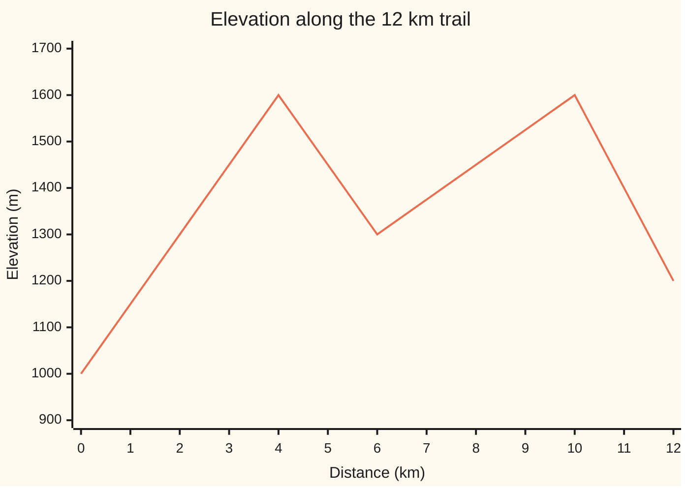
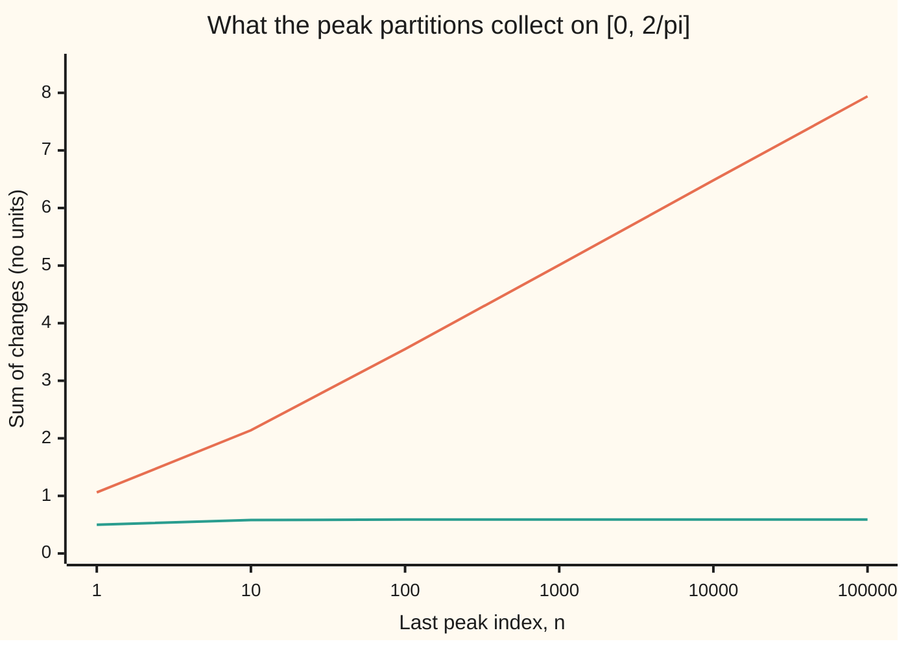
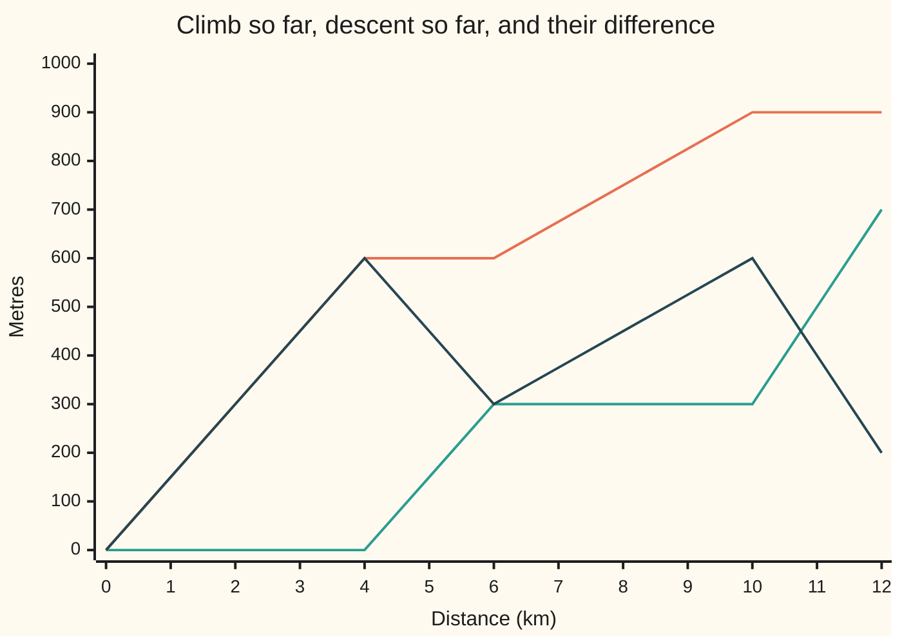

# Bounded variation: total up-and-down movement is finite, and any such function is the difference of two increasing ones

[Syllabus](../../../SYLLABUS.md) → [Measure and integration](../README.md) → [Derivatives Meet the Lebesgue Integral](../README.md#s11) → Bounded variation

---

## General Overview

A hiking trail runs 12 km. It starts at 1,000 m above sea level, climbs to a summit at 1,600 m by km 4, drops into a saddle at 1,300 m by km 6, climbs back to 1,600 m by km 10, and ends at a hut at 1,200 m. The hut is only 200 m above the start. A hiker's legs report 900 m of climbing and 700 m of descent: 1,600 m of vertical movement.

The 1,600 m is the trail's **total variation**: every rise and every fall, added without signs. For a trail with a few summits it is easy to count. For a function that turns infinitely often it may be infinite. The graph of x sin(1/x) wiggles between the lines y = x and y = −x infinitely often on its way to 0; each wiggle is smaller than the last, yet together they add up to more than any number. Continuity does not prevent it.

A function whose total variation is finite has **bounded variation**. The trail shows the main theorem. Its cumulative climb only ever goes up; so does its cumulative descent; and the elevation is the start height plus the climb minus the descent. So a function of bounded variation is one increasing function minus another: the **Jordan decomposition**, after Camille Jordan, who introduced the idea in 1881 to settle when a Fourier series converges. Increasing functions cannot oscillate, so the function has a limit from each side at every point.

**Total variation adds up every rise and every fall of a function; when it is finite, the function is its accumulated rises minus its accumulated falls, two increasing functions, and so it has one-sided limits everywhere.**

**What kind of fact this is:** "bounded variation" is a definition; the Jordan decomposition, its converse and the one-sided limits are theorems, proved on this card in Why it works.

### The picture: the trail's elevation, km by km



One line: the elevation, straight between the turning points at km 4, 6 and 10.

---

## The formula

Notation first. The elevation is a function $f$: f(x) is the height in metres at km x, on an interval from $a$ to $b$, here 0 to 12. A **partition** of the interval is a list of points a = x_0 < x_1 < ⋯ < x_n = b; $n$ counts the pieces and $x_k$ is the k-th point. Each piece contributes the size of its change, |f(x_k) − f(x_{k−1})|.

$$V_a^b(f) = \sup\Big\{ \sum_{k=1}^{n} \big\lvert f(x_k) - f(x_{k-1}) \big\rvert \;:\; a = x_0 < x_1 < \cdots < x_n = b,\ n = 1, 2, \dots \Big\}$$

**Read it aloud:** the total variation of f from a to b is the most that any partition can collect by adding up the sizes of the changes across its pieces.

f has **bounded variation** on [a, b] when this supremum (least upper bound: [No gaps](../../06-Calculus%20and%20analysis/01-Limits%20and%20Continuity/02-supremum-and-completeness.md)) is finite. The **positive variation** $P$ and **negative variation** $N$ collect only the rises, or only the falls, over [a, x], again as a supremum over partitions:

$$P(x) = \sup \sum_{k} \max\big(f(x_k) - f(x_{k-1}),\, 0\big), \qquad N(x) = \sup \sum_{k} \max\big(f(x_{k-1}) - f(x_k),\, 0\big).$$

**Jordan decomposition.** If f has bounded variation on [a, b], then for every x in [a, b]

$$f(x) = \big(f(a) + P(x)\big) - N(x), \qquad P(x) + N(x) = V_a^x(f),$$

and $f(a) + P$ and $N$ are increasing, meaning never going down. Conversely, any difference $g - h$ of increasing functions $g$ and $h$ on [a, b] has bounded variation.

**Read it aloud:** the height now is the start height, plus all the climbing so far, minus all the descending so far; climbing plus descending is the movement so far.

**One-sided limits.** If f has bounded variation, then at every point x the limits

$$f(x-) = \lim_{t \uparrow x} f(t), \qquad f(x+) = \lim_{t \downarrow x} f(t)$$

exist, as $t$ approaches x from below and from above (only one of them at an endpoint), and f jumps at no more than countably many points.

**Read it aloud:** approaching any point from either side, the values settle down.

Three quick cases. An increasing f has $V_a^b(f) = f(b) - f(a)$. A piecewise-monotone f has variation equal to the sum of the sizes of its rises and falls. A **Lipschitz** f, with $\lvert f(x) - f(t) \rvert \le K \lvert x - t \rvert$ for a fixed $K$ ([Uniform continuity](../../06-Calculus%20and%20analysis/01-Limits%20and%20Continuity/08-uniform-continuity-and-lipschitz.md)), has $V_a^b(f) \le K(b - a)$.

| Symbol | Plain meaning | In our example | Push it up and the answer… |
| --- | --- | --- | --- |
| $f$ | the function whose movement is measured | elevation in metres at km x | more or bigger swings raise the variation |
| $a$, $b$, $c$ | ends of the interval; a point between | a = 0 km, b = 12 km | a longer interval can only add variation |
| $x$, $t$ | points of the interval | km 8 | — |
| $x_k$, $n$ | the k-th point of a partition; the number of pieces | km 0, 4, 6, 10, 12, so n = 4 | adding points never lowers the sum |
| $V_a^b(f)$ | total variation | 1,600 m | — |
| $P$, $N$ | climb so far, descent so far, from a up to x | P(12) = 900 m, N(12) = 700 m | each only rises as x moves right |
| $g$, $h$ | increasing functions whose difference is f | g = 1,000 + P, h = N | — |
| $f(x-)$, $f(x+)$ | limit from the left, from the right | both 1,450 m at km 8; with a ladder, 1,450 and 1,500 | a jump makes them differ |
| $K$ | a Lipschitz constant: a cap on steepness | 200 m per km | the cap K(b − a) grows with it |
| $\varepsilon$, $s$, $m$ | in the proofs: a small positive number, a supremum, a whole number | — | — |

### When it holds

- **A closed, bounded interval.** On the whole line even f(x) = x has infinite variation.
- **Finite variation, not continuity.** x sin(1/x) is continuous on [0, 2/π] with infinite variation, so it is no difference of increasing functions there.
- **Finite variation, for the one-sided limits.** sin(1/x) takes the values +1 and −1 arbitrarily close to 0, so it has no limit from the right there; each swing adds 2, so its variation on (0, 1] is infinite.
- **Uniqueness fails.** Adding one increasing function to both g and h gives another pair; f(a) + P and N rise the least over every stretch.

---

## Why it works

### Step 0: keep the rises and the falls in two separate ledgers

Adding points to a partition can only reveal more movement, so the variation is what partitions collect as they are refined. Keep the rises in one running total and the falls in another. Each total only grows as x moves right, and their difference is the net change. That is the whole theorem; the steps make it exact.

### Step 1: adding a point to a partition never lowers the sum

Put a new point t between two partition points u < v. The old piece contributed |f(v) − f(u)|; the two new pieces contribute |f(t) − f(u)| + |f(v) − f(t)|, at least as much by the triangle inequality.

On the trail: the partition {0, 12} collects |1200 − 1000| = 200. Adding km 6 gives 300 + 100 = 400. Adding km 4 and km 10 gives 600 + 300 + 300 + 400 = 1,600. No further point adds anything: each piece now climbs all the way or falls all the way.

So a partition may always be assumed to contain any chosen point c. That gives **additivity**, $V_a^b(f) = V_a^c(f) + V_c^b(f)$ for $a < c < b$.

### Step 2: monotone pieces are counted by their ends

If f is increasing, every change is at least 0, and the partition sum telescopes: f(x_1) − f(x_0) + f(x_2) − f(x_1) + ⋯ collapses to f(b) − f(a), the same for every partition. For the first climb that is 600 m. The trail is monotone on four pieces, and additivity adds them: 600 + 300 + 300 + 400 = 1,600 m. The code confirms it three ways: the turning points, the best partition over a 0.25 km grid, and 20,000 random partitions, none of which beats 1,600.

### Step 3: continuity is not enough

Take f(x) = x sin(1/x) on [0, 2/π], with f(0) = 0. It touches y = x and y = −x in turn at the points x_k = 2/((2k + 1)π), k = 0, 1, 2, …, where f(x_k) is +x_k, −x_k, +x_k, …. On the partition 0 < x_n < ⋯ < x_1 < x_0, consecutive peaks have opposite signs, so each piece collects x_k + x_{k+1}, and the total is

$$x_0 + 2\,(x_1 + x_2 + \cdots + x_n) = \frac{2}{\pi} + \frac{4}{\pi}\Big(\frac13 + \frac15 + \cdots + \frac{1}{2n+1}\Big).$$

The bracket is at least a third of the harmonic series 1 + 1/2 + ⋯ + 1/n, which passes every bound ([Infinite series](../../06-Calculus%20and%20analysis/06-Series/01-series-convergence.md)). So the variation is infinite. The sums grow like (2/π) ln n: 1.06 at n = 1, 7.94 at n = 100,000.

Damp the swings to x^2 sin(1/x). The same partitions collect x_0^2 + 2(x_1^2 + ⋯ + x_n^2), which settles at 1 − 4/π^2 = 0.5947. Its slope, 2x sin(1/x) − cos(1/x), is at most 1 + 4/π in size, so it is Lipschitz and its variation is at most (1 + 4/π)(2/π) = 1.4472: finite.



First line: x sin(1/x), rising by about 1.4659 per tenfold step, never levelling off. Second line: x^2 sin(1/x), settling at 0.5947. The code prints six stages of each; the harmonic series shows the first never stops.

### Step 4: rises minus falls is the net change; rises plus falls is the movement

For any number d, d = max(d, 0) − max(−d, 0) and |d| = max(d, 0) + max(−d, 0). Add these over the pieces of a partition of [a, x]. Rises minus falls telescopes to f(x) − f(a) for every partition; rises plus falls is the partition sum. So every partition sum equals twice its rises minus (f(x) − f(a)). Taking suprema, $V_a^x(f) = 2P(x) - (f(x) - f(a))$, and likewise $V_a^x(f) = 2N(x) + (f(x) - f(a))$. Subtracting and adding the two: P − N = f(x) − f(a) and P + N = V_a^x(f).

At km 12: P = 900, N = 700, P − N = 200 = 1,200 − 1,000, P + N = 1,600. At km 5, partway down the first descent: P = 600, N = 150, P − N = 450 = 1,450 − 1,000.

### Step 5: the two ledgers only go up

For x < y, a partition of [a, x] with y added is a partition of [a, y] with one more rise of at least 0. So P(x) ≤ P(y), and likewise for N. With g = f(a) + P and h = N, both increasing, f = g − h by Step 4: the Jordan decomposition. The converse: each change of g − h is at most the change of g plus the change of h in size, and those telescope to the finite g(b) − g(a) + h(b) − h(a).



First line: the climb so far, P. Second line: the descent so far, N. Third line: P − N, the overview's elevation profile lowered by the 1,000 m start height. The first two never fall.

### Step 6: increasing functions have one-sided limits, so f does too

Let g be increasing and approach x from the left. The values g(t) for t < x are at most g(x), so they have a least upper bound s. For any small $\varepsilon > 0$ some earlier value exceeds s − ε, and every later value before x lies between it and s. So the values settle at s: that is g(x−). The right limit is the mirror image, a greatest lower bound. Then f(x±) = g(x±) − h(x±).

Each jump of g is a gap g(x+) − g(x−) that uses up its own stretch of the total rise g(b) − g(a). So at most $m$ jumps exceed (g(b) − g(a))/m, for each whole number m, and all the jumps fit in one countable list.

With a 50 m ladder bolted on at km 8 the trail jumps. From the left it approaches 1,450 m (1,442.5 at 0.1 km before, 1,449.9999 at a millionth of a km before); from the right, 1,500 m. The climb becomes 950 m and the variation 1,650 m.

<details>
<summary>Detailed proof</summary>

Here f is a real function on [a, b], a partition is a = x_0 < ⋯ < x_n = b, d_k = f(x_k) − f(x_{k−1}), and S = Σ |d_k|. "Increasing" means u < v implies f(u) ≤ f(v).

**Lemma 1 (refinement).** Adding a point t between x_{k−1} and x_k replaces |d_k| by |f(t) − f(x_{k−1})| + |f(x_k) − f(t)|, which is at least |d_k| by the triangle inequality. So refining never lowers S.

**Lemma 2 (additivity).** For a < c < b, V_a^b = V_a^c + V_c^b. Add c to any partition of [a, b] (Lemma 1); it splits into partitions of the halves, so S ≤ V_a^c + V_c^b. Conversely, joining a partition of [a, c] to one of [c, b] gives a partition of [a, b] whose sum is the sum of the two; take suprema.

**Lemma 3 (monotone, Lipschitz).** If f is increasing, S telescopes to f(b) − f(a) for every partition. With turning points a = c_0 < ⋯ < c_m = b, Lemma 2 and this case (for f or −f on each piece) give V = Σ_j |f(c_j) − f(c_{j−1})|. If |f(u) − f(v)| ≤ K|u − v|, then S ≤ K Σ (x_k − x_{k−1}) = K(b − a).

**Jordan decomposition.** Let V_a^b < ∞ and define P(x), N(x) as the suprema over partitions of [a, x] of Σ max(d_k, 0) and Σ max(−d_k, 0), with P(a) = N(a) = 0. For each partition, Σ max(d_k, 0) − Σ max(−d_k, 0) = f(x) − f(a) and Σ max(d_k, 0) + Σ max(−d_k, 0) = S. Hence S = 2Σ max(d_k, 0) − (f(x) − f(a)), and the last term is fixed, so V_a^x = 2P(x) − (f(x) − f(a)); in the same way V_a^x = 2N(x) + (f(x) − f(a)). Both are finite, since V_a^x ≤ V_a^b by Lemma 2. So P − N = f(x) − f(a) and P + N = V_a^x. For x < y, extending a partition of [a, x] by y adds the term max(f(y) − f(x), 0) ≥ 0, so P(x) ≤ P(y); likewise N. So g = f(a) + P and h = N are increasing with f = g − h.

**Minimality.** If f = g_1 − h_1 with g_1, h_1 increasing, then max(d_k, 0) ≤ g_1(x_k) − g_1(x_{k−1}), since d_k is at most that and it is at least 0. Summing over a partition of [x, y], and using P(y) − P(x) = the supremum of such sums (Lemma 2's argument applied to rises): P(y) − P(x) ≤ g_1(y) − g_1(x). Likewise N against h_1.

**Converse.** If f = g − h with g, h increasing, |d_k| ≤ (g(x_k) − g(x_{k−1})) + (h(x_k) − h(x_{k−1})), so S ≤ g(b) − g(a) + h(b) − h(a) for every partition.

**One-sided limits.** Let g be increasing and a < x ≤ b. The set {g(t) : a ≤ t < x} is bounded above by g(x), so it has a supremum s. For ε > 0 some t_0 < x has g(t_0) > s − ε, else s − ε would be a smaller upper bound; for t_0 < t < x, s − ε < g(t_0) ≤ g(t) ≤ s. So g(x−) = s. For x < b, g(x+) is the infimum of {g(t) : x < t ≤ b} by the mirror argument. For f = g − h the limit of the difference is the difference of the limits.

**Countably many jumps.** For u < v in (a, b), pick w between them: g(u+) ≤ g(w) ≤ g(v−). So the intervals (g(x−), g(x+)) at different points do not overlap, and all lie in [g(a), g(b)]. For each whole number m, at most m of them are longer than (g(b) − g(a))/m. Every jump has positive length, so the jumps are a countable union of finite sets. f = g − h jumps only where g or h does.

**The examples.** For x sin(1/x): sin(1/x_k) = sin((2k + 1)π/2) = (−1)^k, so the peak partition collects x_0 + 2Σ_{k=1}^{n} x_k = 2/π + (4/π)Σ_{k=1}^{n} 1/(2k + 1) ≥ 2/π + (4/(3π))Σ_{k=1}^{n} 1/k, unbounded. For x^2 sin(1/x) it collects at most (4/π^2)(1 + 2Σ_{k≥1} 1/(2k + 1)^2) = (4/π^2)(1 + 2(π^2/8 − 1)) = 1 − 4/π^2, using Σ_{k≥0} 1/(2k + 1)^2 = π^2/8. For sin(1/x), the points 1/(π/2 + kπ), k = 0, …, n, carry alternating values ±1, so a partition through them collects 2n.

</details>

A second route for a function with a continuous derivative: V_a^b(f) is the integral of |f′| from a to b. For an absolutely continuous f ([Absolutely continuous functions and the fundamental theorem](04-absolutely-continuous-functions-and-the-fundamental-theorem.md)) the same identity holds with the Lebesgue integral; Folland gets it in Section 3.5, from Exercise 28 and the fundamental theorem there.

---

## Worked numbers, by hand

| Step | Arithmetic | Value |
| --- | --- | --- |
| climb, km 0 to 4 | 1,600 − 1,000 | 600 m |
| descent, km 4 to 6 | 1,600 − 1,300 | 300 m |
| climb, km 6 to 10 | 1,600 − 1,300 | 300 m |
| descent, km 10 to 12 | 1,600 − 1,200 | 400 m |
| positive variation P(12) | 600 + 300 | 900 m |
| negative variation N(12) | 300 + 400 | 700 m |
| net change, P − N | 900 − 700 = 1,200 − 1,000 | 200 m |
| **total variation, P + N** | 600 + 300 + 300 + 400 | **1,600 m** |
| steepness cap K(b − a) | 200 m per km × 12 km | 2,400 m |

The hike takes 1,600 m of vertical effort to gain 200 m of height, and the 2,400 m cap from the steepest stretch is honest but loose.

Equal pieces show Step 1 at work. Cutting the 12 km into n equal pieces and adding the sizes of the changes:

| Pieces n | Points (km) | Collected |
| --- | --- | --- |
| 1 | 0, 12 | 200 m |
| 2 | 0, 6, 12 | 400 m |
| 3 | 0, 4, 8, 12 | 1,000 m |
| 4 | 0, 3, 6, 9, 12 | 1,150 m |
| 5 | every 2.4 km | 1,120 m |
| 6 | every 2 km | 1,600 m |
| 12 | every 1 km | 1,600 m |

Five pieces collect less than four: the 5-piece points are not a refinement of the 4-piece points, so Step 1 promises nothing between them. Six pieces catch every turning point and reach the full 1,600 m.

### What breaks if you drop a piece

| Mistake | Comes out at | What went wrong |
| --- | --- | --- |
| Report the net change as the movement | 200 m in place of 1,600 m | rises and falls cancel; the variation adds their sizes |
| Sample every 3 km and stop | 1,150 m | the summits at km 4 and km 10 fall between samples; a partition only gives a lower bound |
| Write f = P − N, leaving out the start height | 200 m at km 12 in place of 1,200 m | the increasing pair is (f(a) + P, N) |
| Drop bounded variation, keep continuity: x sin(1/x) on [0, 2/π] | 1.06, 2.14, 3.55, 5.01, 6.48, 7.94 and rising | the sums pass every bound, so no pair of increasing functions has this difference |
| Drop bounded variation: sin(1/x) on (0, 1] | 20 after 10 swings, 200 after 100 | no limit from the right at 0: values +1 and −1 occur arbitrarily close to it |

---

## Code, from first principles, and it actually runs

The code takes three independent roads to the trail's 1,600 m: the turning points of Step 2; the definition, as the best partition over a 0.25 km grid, found by dynamic programming (a table of the best sum ending at each grid point); and 20,000 random partitions from a SplitMix64 generator, seed 2026, none of which may beat 1,600. It finds P and N by the same search at every km and checks Step 4's identities against the elevation. It adds the ladder, then checks the peak sums of x sin(1/x) against the closed form x_0 + 2(x_1 + ⋯ + x_n) and the growth rate (2/π) ln 10, and those of x^2 sin(1/x) against 1 − 4/π^2. The code checks finitely many partitions; that the supremum is 1,600, that the harmonic sums never stop, and that every function of bounded variation splits in two is the proof's work.

### Python

```python
# Bounded variation -- the check behind the card.  Standard library only.
# A 12 km trail, its total variation found three ways, its Jordan split,
# a trail with a ladder (a jump), and three oscillating functions near zero.
from math import sin, pi, log

TURNS = [(0, 1000), (4, 1600), (6, 1300), (10, 1600), (12, 1200)]  # (km, metres)

def trail(x):                        # elevation, straight lines between turning points
    for (x0, y0), (x1, y1) in zip(TURNS, TURNS[1:]):
        if x <= x1:
            return y0 + (y1 - y0) * (x - x0) / (x1 - x0)
    return TURNS[-1][1]

def ladder(x):                       # the same trail with a 50 m ladder at km 8
    return trail(x) + (50 if x >= 8 else 0)

def partition_sum(f, pts, g=abs):    # sum of g(change) over one partition
    return sum(g(f(b) - f(a)) for a, b in zip(pts, pts[1:]))

def best_on_grid(f, end, g=abs, step=0.25):
    # Road 2: the definition.  Best partition using any points of a 0.25 km grid,
    # found by dynamic programming over "last point used".
    grid = [i * step for i in range(int(end / step) + 1)]
    best = [0.0] * len(grid)
    for j in range(1, len(grid)):
        best[j] = max(best[i] + g(f(grid[j]) - f(grid[i])) for i in range(j))
    return best[-1]

up = lambda d: max(d, 0.0)           # climb in one step
down = lambda d: max(-d, 0.0)        # descent in one step

class SplitMix64:
    def __init__(self, seed): self.s = seed
    def next(self):
        self.s = (self.s + 0x9E3779B97F4A7C15) & 0xFFFFFFFFFFFFFFFF
        z = self.s
        z = ((z ^ (z >> 30)) * 0xBF58476D1CE4E5B9) & 0xFFFFFFFFFFFFFFFF
        z = ((z ^ (z >> 27)) * 0x94D049BB133111EB) & 0xFFFFFFFFFFFFFFFF
        return z ^ (z >> 31)
    def unit(self): return (self.next() >> 11) * 2.0 ** -53

# Road 1: piecewise monotone, so add the rises and falls between turning points.
V_turns = sum(abs(y1 - y0) for (_, y0), (_, y1) in zip(TURNS, TURNS[1:]))
V_grid = best_on_grid(trail, 12)
# Road 3: 20,000 random partitions with points anywhere; none may beat the turning-point sum.
rng, V_rand, beaten = SplitMix64(2026), 0.0, 0
for _ in range(20000):
    m = 1 + rng.next() % 30
    pts = [0.0] + sorted(12 * rng.unit() for _ in range(m)) + [12.0]
    s = partition_sum(trail, pts)
    V_rand, beaten = max(V_rand, s), beaten + (s > V_turns + 1e-9)
print(f"variation, turning points     {V_turns:10.2f}")
print(f"variation, best grid partition{V_grid:10.2f}")
print(f"variation, best of 20000 random{V_rand:9.2f}   beat it: {beaten}")
print(f"net change f(12) - f(0)       {trail(12) - trail(0):10.2f}")
print(f"Lipschitz ceiling 200 x 12    {200 * 12:10.2f}")
assert abs(V_grid - V_turns) < 1e-9, "definition and turning points disagree"
assert beaten == 0 and V_rand > 0.97 * V_turns, "a random partition beat the sup"

print("equal pieces n : sum collected")
for n in (1, 2, 3, 4, 5, 6, 12):
    print(f"  n = {n:2d}        {partition_sum(trail, [12 * i / n for i in range(n + 1)]):10.2f}")

print("km  elevation  climb P  descent N  P - N  P + N")
for km in range(13):
    P, N, V = (best_on_grid(trail, km, g) for g in (up, down, abs))
    print(f"{km:2d} {trail(km):10.2f} {P:8.2f} {N:10.2f} {P - N:6.2f} {P + N:7.2f}")
    assert abs((P - N) - (trail(km) - trail(0))) < 1e-9, "Jordan: P - N is not the net change"
    assert abs((P + N) - V) < 1e-9, "Jordan: P + N is not the variation"

V_lad = best_on_grid(ladder, 12)
print(f"ladder: variation {V_lad:.2f}, climb {best_on_grid(ladder, 12, up):.2f}")
assert abs(V_lad - (V_turns + 50)) < 1e-9, "the ladder should add exactly its height"
for k in (1, 2, 3, 6):
    print(f"ladder: f(8 - 1e-{k}) = {ladder(8 - 10.0 ** -k):9.4f}   f(8 + 1e-{k}) = {ladder(8 + 10.0 ** -k):9.4f}")

# Oscillation near zero on [0, 2/pi]: peaks of sin(1/x) at x_k = 2 / ((2k + 1) pi).
xk = lambda k: 2 / ((2 * k + 1) * pi)
def peak_sum(f, n):                  # partition 0 < x_n < ... < x_0, evaluated directly
    return partition_sum(f, [0.0] + [xk(k) for k in range(n, -1, -1)])
wild = lambda x: x * sin(1 / x) if x else 0.0
damp = lambda x: x * x * sin(1 / x) if x else 0.0
print("peaks n   x sin(1/x)   x^2 sin(1/x)")
S, D = {}, {}
for n in (1, 10, 100, 1000, 10000, 100000):
    S[n], D[n] = peak_sum(wild, n), peak_sum(damp, n)
    print(f"{n:7d} {S[n]:12.4f} {D[n]:14.4f}")
print("chart, x sin(1/x):  ", " ".join(f"{v:.2f}" for v in S.values()))
print("chart, x^2 sin(1/x):", " ".join(f"{v:.2f}" for v in D.values()))
closed = xk(0) + 2 * sum(xk(k) for k in range(1, 1001))   # x_0 + 2(x_1 + ... + x_n)
print(f"x sin(1/x), n = 1000 by the formula x_0 + 2 sum x_k  {closed:.4f}")
print(f"x sin(1/x), gain per tenfold n {S[100000] - S[10000]:.4f}   (2/pi) ln 10 = {2 / pi * log(10):.4f}")
print(f"x^2 sin(1/x): limit 1 - 4/pi^2 = {1 - 4 / pi ** 2:.4f}   Lipschitz ceiling {(1 + 4 / pi) * 2 / pi:.4f}")
assert abs(S[1000] - closed) < 1e-9, "direct sum and formula disagree"
assert abs((S[100000] - S[10000]) - 2 / pi * log(10)) < 1e-3, "growth is not logarithmic"
assert abs(D[100000] - (1 - 4 / pi ** 2)) < 1e-5, "damped sums miss their limit"

swing = lambda x: sin(1 / x)
for n in (10, 100):
    got = partition_sum(swing, [xk(k) for k in range(n, -1, -1)])   # peaks only: no value at 0
    print(f"sin(1/x): {n} swings collect {got:.2f}")
    assert abs(got - 2 * n) < 1e-9, "each swing from +1 to -1 should add 2"
print("All checks passed.")
```

**Ran 2026-09-29 on macOS, Python 3.14.6, standard library only. All checks passed. Output, pasted from the run:**

```
variation, turning points        1600.00
variation, best grid partition   1600.00
variation, best of 20000 random  1598.03   beat it: 0
net change f(12) - f(0)           200.00
Lipschitz ceiling 200 x 12       2400.00
equal pieces n : sum collected
  n =  1            200.00
  n =  2            400.00
  n =  3           1000.00
  n =  4           1150.00
  n =  5           1120.00
  n =  6           1600.00
  n = 12           1600.00
km  elevation  climb P  descent N  P - N  P + N
 0    1000.00     0.00       0.00   0.00    0.00
 1    1150.00   150.00       0.00 150.00  150.00
 2    1300.00   300.00       0.00 300.00  300.00
 3    1450.00   450.00       0.00 450.00  450.00
 4    1600.00   600.00       0.00 600.00  600.00
 5    1450.00   600.00     150.00 450.00  750.00
 6    1300.00   600.00     300.00 300.00  900.00
 7    1375.00   675.00     300.00 375.00  975.00
 8    1450.00   750.00     300.00 450.00 1050.00
 9    1525.00   825.00     300.00 525.00 1125.00
10    1600.00   900.00     300.00 600.00 1200.00
11    1400.00   900.00     500.00 400.00 1400.00
12    1200.00   900.00     700.00 200.00 1600.00
ladder: variation 1650.00, climb 950.00
ladder: f(8 - 1e-1) = 1442.5000   f(8 + 1e-1) = 1507.5000
ladder: f(8 - 1e-2) = 1449.2500   f(8 + 1e-2) = 1500.7500
ladder: f(8 - 1e-3) = 1449.9250   f(8 + 1e-3) = 1500.0750
ladder: f(8 - 1e-6) = 1449.9999   f(8 + 1e-6) = 1500.0001
peaks n   x sin(1/x)   x^2 sin(1/x)
      1       1.0610         0.4953
     10       2.1402         0.5763
    100       3.5515         0.5927
   1000       5.0116         0.5945
  10000       6.4769         0.5947
 100000       7.9428         0.5947
chart, x sin(1/x):   1.06 2.14 3.55 5.01 6.48 7.94
chart, x^2 sin(1/x): 0.50 0.58 0.59 0.59 0.59 0.59
x sin(1/x), n = 1000 by the formula x_0 + 2 sum x_k  5.0116
x sin(1/x), gain per tenfold n 1.4658   (2/pi) ln 10 = 1.4659
x^2 sin(1/x): limit 1 - 4/pi^2 = 0.5947   Lipschitz ceiling 1.4472
sin(1/x): 10 swings collect 20.00
sin(1/x): 100 swings collect 200.00
All checks passed.
```

### Rust

```rust
// Bounded variation -- the check behind the card.  Rust std only.
// A 12 km trail, its total variation found three ways, its Jordan split,
// a trail with a ladder (a jump), and three oscillating functions near zero.
use std::f64::consts::PI;

const TURNS: [(f64, f64); 5] = [(0.0, 1000.0), (4.0, 1600.0), (6.0, 1300.0), (10.0, 1600.0), (12.0, 1200.0)];

fn trail(x: f64) -> f64 {
    // elevation, straight lines between turning points
    for w in TURNS.windows(2) {
        let ((x0, y0), (x1, y1)) = (w[0], w[1]);
        if x <= x1 {
            return y0 + (y1 - y0) * (x - x0) / (x1 - x0);
        }
    }
    TURNS[4].1
}

fn ladder(x: f64) -> f64 {
    // the same trail with a 50 m ladder at km 8
    trail(x) + if x >= 8.0 { 50.0 } else { 0.0 }
}

fn partition_sum(f: &dyn Fn(f64) -> f64, pts: &[f64], g: &dyn Fn(f64) -> f64) -> f64 {
    pts.windows(2).map(|w| g(f(w[1]) - f(w[0]))).fold(0.0, |a, b| a + b)
}

fn best_on_grid(f: &dyn Fn(f64) -> f64, end: f64, g: &dyn Fn(f64) -> f64) -> f64 {
    // Road 2: the definition, best partition on a 0.25 km grid, by dynamic programming
    let step = 0.25;
    let grid: Vec<f64> = (0..=(end / step) as usize).map(|i| i as f64 * step).collect();
    let mut best = vec![0.0f64; grid.len()];
    for j in 1..grid.len() {
        best[j] = (0..j).map(|i| best[i] + g(f(grid[j]) - f(grid[i]))).fold(f64::MIN, f64::max);
    }
    best[grid.len() - 1]
}

struct SplitMix64(u64);
impl SplitMix64 {
    fn next(&mut self) -> u64 {
        self.0 = self.0.wrapping_add(0x9E3779B97F4A7C15);
        let mut z = self.0;
        z = (z ^ (z >> 30)).wrapping_mul(0xBF58476D1CE4E5B9);
        z = (z ^ (z >> 27)).wrapping_mul(0x94D049BB133111EB);
        z ^ (z >> 31)
    }
    fn unit(&mut self) -> f64 { (self.next() >> 11) as f64 * 2f64.powi(-53) }
}

fn xk(k: usize) -> f64 { 2.0 / ((2 * k + 1) as f64 * PI) }

fn main() {
    let abs = |d: f64| d.abs();
    let up = |d: f64| d.max(0.0);
    let down = |d: f64| (-d).max(0.0);
    // Road 1: piecewise monotone, so add the rises and falls between turning points.
    let v_turns: f64 = TURNS.windows(2).map(|w| (w[1].1 - w[0].1).abs()).sum();
    let v_grid = best_on_grid(&trail, 12.0, &abs);
    // Road 3: 20,000 random partitions with points anywhere; none may beat the turning-point sum.
    let (mut rng, mut v_rand, mut beaten) = (SplitMix64(2026), 0.0f64, 0);
    for _ in 0..20000 {
        let m = 1 + rng.next() % 30;
        let mut inner: Vec<f64> = (0..m).map(|_| 12.0 * rng.unit()).collect();
        inner.sort_by(|a, b| a.partial_cmp(b).unwrap());
        let mut pts = vec![0.0];
        pts.extend(inner);
        pts.push(12.0);
        let s = partition_sum(&trail, &pts, &abs);
        v_rand = v_rand.max(s);
        if s > v_turns + 1e-9 { beaten += 1; }
    }
    println!("variation, turning points     {:10.2}", v_turns);
    println!("variation, best grid partition{:10.2}", v_grid);
    println!("variation, best of 20000 random{:9.2}   beat it: {}", v_rand, beaten);
    println!("net change f(12) - f(0)       {:10.2}", trail(12.0) - trail(0.0));
    println!("Lipschitz ceiling 200 x 12    {:10.2}", 200.0 * 12.0);
    assert!((v_grid - v_turns).abs() < 1e-9, "definition and turning points disagree");
    assert!(beaten == 0 && v_rand > 0.97 * v_turns, "a random partition beat the sup");

    println!("equal pieces n : sum collected");
    for n in [1usize, 2, 3, 4, 5, 6, 12] {
        let pts: Vec<f64> = (0..=n).map(|i| (12 * i) as f64 / n as f64).collect();
        println!("  n = {:2}        {:10.2}", n, partition_sum(&trail, &pts, &abs));
    }

    println!("km  elevation  climb P  descent N  P - N  P + N");
    for km in 0..=12 {
        let x = km as f64;
        let (p, n, v) = (best_on_grid(&trail, x, &up), best_on_grid(&trail, x, &down), best_on_grid(&trail, x, &abs));
        println!("{:2} {:10.2} {:8.2} {:10.2} {:6.2} {:7.2}", km, trail(x), p, n, p - n, p + n);
        assert!(((p - n) - (trail(x) - trail(0.0))).abs() < 1e-9, "Jordan: P - N is not the net change");
        assert!(((p + n) - v).abs() < 1e-9, "Jordan: P + N is not the variation");
    }

    let v_lad = best_on_grid(&ladder, 12.0, &abs);
    println!("ladder: variation {:.2}, climb {:.2}", v_lad, best_on_grid(&ladder, 12.0, &up));
    assert!((v_lad - (v_turns + 50.0)).abs() < 1e-9, "the ladder should add exactly its height");
    for k in [1, 2, 3, 6] {
        let e = 10f64.powi(-k);
        println!("ladder: f(8 - 1e-{}) = {:9.4}   f(8 + 1e-{}) = {:9.4}", k, ladder(8.0 - e), k, ladder(8.0 + e));
    }

    // Oscillation near zero on [0, 2/pi]: peaks of sin(1/x) at x_k = 2 / ((2k + 1) pi).
    let peaks = |n: usize, with_zero: bool| -> Vec<f64> {
        let mut v = if with_zero { vec![0.0] } else { vec![] };
        v.extend((0..=n).rev().map(xk));
        v
    };
    let wild = |x: f64| if x == 0.0 { 0.0 } else { x * (1.0 / x).sin() };
    let damp = |x: f64| if x == 0.0 { 0.0 } else { x * x * (1.0 / x).sin() };
    println!("peaks n   x sin(1/x)   x^2 sin(1/x)");
    let ns = [1usize, 10, 100, 1000, 10000, 100000];
    let s: Vec<f64> = ns.iter().map(|&n| partition_sum(&wild, &peaks(n, true), &abs)).collect();
    let d: Vec<f64> = ns.iter().map(|&n| partition_sum(&damp, &peaks(n, true), &abs)).collect();
    for i in 0..ns.len() {
        println!("{:7} {:12.4} {:14.4}", ns[i], s[i], d[i]);
    }
    let two = |v: &[f64]| v.iter().map(|x| format!("{:.2}", x)).collect::<Vec<_>>().join(" ");
    println!("chart, x sin(1/x):   {}", two(&s));
    println!("chart, x^2 sin(1/x): {}", two(&d));
    let closed = xk(0) + 2.0 * (1..=1000).map(xk).fold(0.0, |a, b| a + b);
    println!("x sin(1/x), n = 1000 by the formula x_0 + 2 sum x_k  {:.4}", closed);
    let gain = s[5] - s[4];
    println!("x sin(1/x), gain per tenfold n {:.4}   (2/pi) ln 10 = {:.4}", gain, 2.0 / PI * 10f64.ln());
    println!("x^2 sin(1/x): limit 1 - 4/pi^2 = {:.4}   Lipschitz ceiling {:.4}", 1.0 - 4.0 / (PI * PI), (1.0 + 4.0 / PI) * 2.0 / PI);
    assert!((s[3] - closed).abs() < 1e-9, "direct sum and formula disagree");
    assert!((gain - 2.0 / PI * 10f64.ln()).abs() < 1e-3, "growth is not logarithmic");
    assert!((d[5] - (1.0 - 4.0 / (PI * PI))).abs() < 1e-5, "damped sums miss their limit");

    let swing = |x: f64| (1.0 / x).sin();
    for n in [10usize, 100] {
        let got = partition_sum(&swing, &peaks(n, false), &abs); // peaks only: no value at 0
        println!("sin(1/x): {} swings collect {:.2}", n, got);
        assert!((got - 2.0 * n as f64).abs() < 1e-9, "each swing from +1 to -1 should add 2");
    }
    println!("All checks passed.");
}
```

**Ran 2026-09-29 on macOS, rustc 1.98.1, no crates. All checks passed. Output, pasted from the run:**

```
variation, turning points        1600.00
variation, best grid partition   1600.00
variation, best of 20000 random  1598.03   beat it: 0
net change f(12) - f(0)           200.00
Lipschitz ceiling 200 x 12       2400.00
equal pieces n : sum collected
  n =  1            200.00
  n =  2            400.00
  n =  3           1000.00
  n =  4           1150.00
  n =  5           1120.00
  n =  6           1600.00
  n = 12           1600.00
km  elevation  climb P  descent N  P - N  P + N
 0    1000.00     0.00       0.00   0.00    0.00
 1    1150.00   150.00       0.00 150.00  150.00
 2    1300.00   300.00       0.00 300.00  300.00
 3    1450.00   450.00       0.00 450.00  450.00
 4    1600.00   600.00       0.00 600.00  600.00
 5    1450.00   600.00     150.00 450.00  750.00
 6    1300.00   600.00     300.00 300.00  900.00
 7    1375.00   675.00     300.00 375.00  975.00
 8    1450.00   750.00     300.00 450.00 1050.00
 9    1525.00   825.00     300.00 525.00 1125.00
10    1600.00   900.00     300.00 600.00 1200.00
11    1400.00   900.00     500.00 400.00 1400.00
12    1200.00   900.00     700.00 200.00 1600.00
ladder: variation 1650.00, climb 950.00
ladder: f(8 - 1e-1) = 1442.5000   f(8 + 1e-1) = 1507.5000
ladder: f(8 - 1e-2) = 1449.2500   f(8 + 1e-2) = 1500.7500
ladder: f(8 - 1e-3) = 1449.9250   f(8 + 1e-3) = 1500.0750
ladder: f(8 - 1e-6) = 1449.9999   f(8 + 1e-6) = 1500.0001
peaks n   x sin(1/x)   x^2 sin(1/x)
      1       1.0610         0.4953
     10       2.1402         0.5763
    100       3.5515         0.5927
   1000       5.0116         0.5945
  10000       6.4769         0.5947
 100000       7.9428         0.5947
chart, x sin(1/x):   1.06 2.14 3.55 5.01 6.48 7.94
chart, x^2 sin(1/x): 0.50 0.58 0.59 0.59 0.59 0.59
x sin(1/x), n = 1000 by the formula x_0 + 2 sum x_k  5.0116
x sin(1/x), gain per tenfold n 1.4658   (2/pi) ln 10 = 1.4659
x^2 sin(1/x): limit 1 - 4/pi^2 = 0.5947   Lipschitz ceiling 1.4472
sin(1/x): 10 swings collect 20.00
sin(1/x): 100 swings collect 200.00
All checks passed.
```

The two outputs match line for line.

> [!TIP]
> **Try changing**
> Guess first, then run the Python.
> - **Coarsen the grid.** Change `step=0.25` to `step=0.3`. Guess: the grid no longer contains km 4 or km 10, the best grid partition falls short of 1,600, and the first assert stops the run. A partition can only undercount.
> - **Turn the ladder into a drop.** Change `+ (50 if` to `+ (-50 if`. Guess: the true variation is still 1,600 + 50, yet the ladder assert stops the run. The drop now interrupts a climb, so the trail peaks just before km 8, and the 0.25 km grid has no point there to catch the peak. A supremum can need points a grid does not have.
> - **Damp by a power between 1 and 2.** Change `damp` to `x ** 1.5 * sin(1 / x)` and delete the assert on its limit. Guess: the sums still settle, more slowly, because x_1^1.5 + x_2^1.5 + ⋯ has a finite sum; any power above 1 gives bounded variation here, and power 1 does not.

---

## The usual mistake

> [!warning]
> **Taking the net change for the variation.** f(b) − f(a) is 200 m on the trail; the variation is 1,600 m. The two agree only for a monotone function. The variation adds the sizes of the changes, so a round trip that ends where it started has variation twice its height, not zero.
>
> - **Reading one partition's sum as the variation.** Every partition gives a lower bound: 3 km samples report 1,150 m. The variation is the supremum; a partition reaches it only if it catches every turning point.
> - **Thinking continuity gives bounded variation.** x sin(1/x) is continuous on [0, 2/π] and its peak sums pass 7.94 at n = 100,000 and keep rising. Lipschitz continuity does give it, with V ≤ K(b − a).
> - **Treating the Jordan pair as unique.** (1,000 + P + x, N + x), with x the km mark, also works; f(a) + P and N rise the least over every stretch.
> - **Expecting a function of bounded variation to be continuous.** The ladder trail jumps 50 m at km 8 and has variation 1,650 m. Bounded variation allows jumps, but only countably many, and one-sided limits exist at each.

---

## Where you meet it in real life

- **Elevation gain in fitness apps.** The "total ascent" an app reports is P(b), estimated from GPS samples. Sparse samples miss summits and undercount, as the 3 km partition does; noisy samples invent small ups and downs and overcount, so apps smooth the track before adding.
- **Fourier series.** Jordan introduced bounded variation in 1881 to prove that the Fourier series of such a function converges at every point, to the average of the two one-sided limits, (f(x−) + f(x+))/2. The series themselves are on [Fourier series](../../08-Differential%20equations%20and%20dynamics/09-Fourier%20Series/01-fourier-series-and-orthogonality.md).
- **Integrating against a function.** A Stieltjes integral weights each piece of the line by the change of an integrator; functions of bounded variation are exactly the integrators that work for every continuous integrand ([Stieltjes integrals](../../06-Calculus%20and%20analysis/08-Multiple%20Integrals/06-riemann-stieltjes-integral.md), and in measure form [The Lebesgue-Stieltjes integral](05-lebesgue-stieltjes-integral.md)).
- **Signed measures.** A right-continuous function of bounded variation defines a signed measure, and its Jordan decomposition into climb and descent is the function-side version of the measure-side split on [Signed measures](../08-Densities%20and%20Changing%20Measure/02-signed-measures-and-hahn-jordan.md).
- **Price paths.** Continuous-time models of share prices have paths of infinite variation on every interval, like x sin(1/x) near 0 but everywhere; their calculus needs rules of its own.

> **Say it back**
> Total variation is the most any partition can collect by adding up the sizes of the changes across its pieces. The trail's is 1,600 m, though it ends only 200 m above its start. A function with finite total variation is its starting value plus its accumulated rises minus its accumulated falls, and both accumulations only go up. Increasing functions settle from each side at every point, so a function of bounded variation has one-sided limits everywhere and jumps at most countably often. Continuity does not guarantee any of this: x sin(1/x) has infinite variation.

---

## What this builds on

- [No gaps](../../06-Calculus%20and%20analysis/01-Limits%20and%20Continuity/02-supremum-and-completeness.md): the least upper bound, which defines the variation and gives an increasing function its one-sided limits.
- [Continuity](../../06-Calculus%20and%20analysis/01-Limits%20and%20Continuity/05-continuity.md): limits from one side, and the rule that limits pass through differences.

## Where this goes next

- [Lebesgue's theorem on monotone functions](03-monotone-functions-differentiable-almost-everywhere.md): every increasing function has a derivative except on a set of length zero, so through the Jordan decomposition every function of bounded variation does too.

The trail has a slope at every km except its turning points, but an increasing function can have countably many jumps and far stranger corners; whether it still has a slope almost everywhere, meaning except on a set of length zero, is what Lebesgue's theorem on monotone functions answers.

---

## Sources

Verified 29 Sep 2026: every link below resolves to the publisher's or author's page.

- Folland, Gerald B. *Real Analysis: Modern Techniques and Their Applications*, 2nd ed. Wiley, 1999. [Publisher page](https://www.wiley.com/en-us/Real+Analysis%3A+Modern+Techniques+and+Their+Applications%2C+2nd+Edition-p-9780471317166). Section 3.5 defines total, positive and negative variation and proves the Jordan decomposition by the identities of Step 4.
- Stein, Elias M., and Rami Shakarchi. *Real Analysis: Measure Theory, Integration, and Hilbert Spaces*. Princeton University Press, 2005. [Publisher page](https://press.princeton.edu/books/hardcover/9780691113869/real-analysis). Chapter 3 treats functions of bounded variation and x^a sin(x^(−b)) as the standard test case.
- Tao, Terence. *An Introduction to Measure Theory*. American Mathematical Society, Graduate Studies in Mathematics 126, 2011. [Author's page with the free draft](https://terrytao.wordpress.com/books/an-introduction-to-measure-theory/). Section 1.6 reduces bounded variation to monotone functions on the way to Lebesgue's differentiation theorem.
