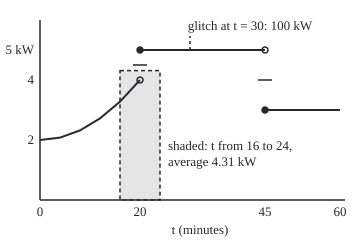
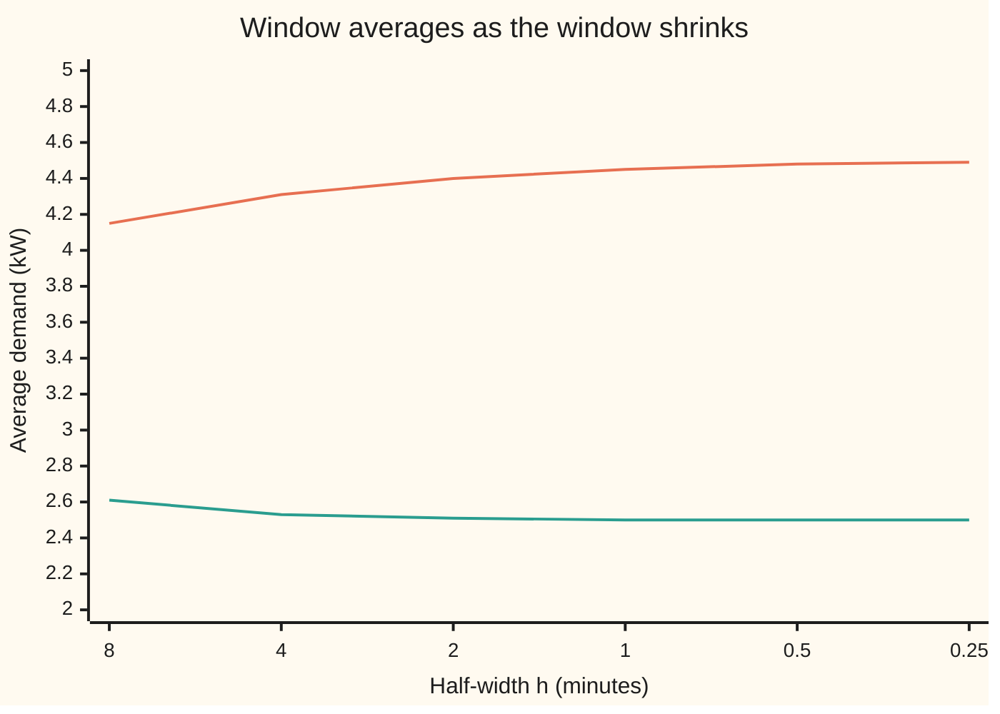

# The Lebesgue differentiation theorem: averages over shrinking intervals return the function's value at almost every point

Measure and integration → Derivatives Meet the Lebesgue Integral → Recovering values from averages → The Lebesgue differentiation theorem

---

## General Overview

A workshop's power meter never logs instantaneous demand. It logs energy over a window divided by the window's length: the average demand, in kilowatts, over that window. Over one hour demand climbs smoothly from 2 kW to 4 kW by minute 20. Then a heater switches on and demand jumps to 5 kW. At minute 45 it switches off and demand drops to 3 kW. The demand record also holds one bad value: at the single instant t = 30 (t in minutes) it says 100 kW.

Can the instantaneous demand be read back from averages alone? Shrink the window around minute 10: the averages over 8, 4, 2 and 0.002 minutes read 2.526667, 2.506667, 2.501667 and 2.500000 kW, and the demand at minute 10 is 2.5 kW. Around minute 20 the windows of 8, 2 and 0.002 minutes read 4.313333, 4.450833 and 4.499950: they settle half-way up the jump, at 4.5, while the log says 5. Around minute 30 they read 5.000000 at every size, and ignore the 100.

This holds for every integrable demand curve, however jumpy: shrinking averages recover the value except on a set of total length zero, such as the jump instants and the glitch. The proof needs one new tool, the **maximal inequality**: a function with a small total has large averages only on a small set.

**For every integrable function on the line, the averages over intervals shrinking to a point converge to the function's value at that point, except on a set of length zero; at almost every point the average distance from that value tends to zero as well.**

**What kind of fact this is:** a theorem, proved on this card in Why it works, with the Vitali covering lemma and the Hardy-Littlewood maximal inequality proved on the way; the Lebesgue point it produces is a definition.

### The picture: the demand curve and one window

<p align="center"></p>

One unit of time is 5 pixels and one kilowatt is 30. An open circle is the value just before a jump; a filled circle is the value the record holds at the jump. The shaded rectangle has the same area as the demand curve over minutes 16 to 24, so its height is that window's average. The short horizontal ticks mark 4.5 and 4 kW, the midpoints of the two jumps, where the shrinking averages land. The glitch is off the scale; the dashed stub marks its instant.

---

## The formula

Notation first. $\lambda$ is Lebesgue measure, the length of a set on the line ([lebesgue-measure](../02-Length%20Done%20Properly/03-lebesgue-measure.md)). "Almost every point", written a.e., means every point outside a set of length zero. A function is **locally integrable** when the integral of its absolute value over every bounded interval is finite; $L^1_{\mathrm{loc}}$ is the collection of them. The **window average** of $f$ at $x$ with half-width $h$ is

$$A_h f(x) = \frac{1}{2h}\int_{x-h}^{x+h} f\,d\lambda .$$

**Read it aloud:** the total of f over the window from x − h to x + h, divided by the window's length.

$$f \in L^1_{\mathrm{loc}} \quad\Longrightarrow\quad \lim_{h \to 0}\ \frac{1}{2h}\int_{x-h}^{x+h} \lvert f(s) - f(x)\rvert\,ds = 0 \ \text{ for a.e. } x, \qquad\text{hence}\qquad \lim_{h\to 0} A_h f(x) = f(x) \ \text{ for a.e. } x .$$

**Read it aloud:** for a locally integrable f, at almost every point the average distance between f and its value there, over a shrinking window, tends to zero; so the window averages tend to that value.

A point where the first limit is zero is a **Lebesgue point** of $f$. The theorem says almost every point is one. The first statement is stronger than the second, since $\lvert A_h f(x) - f(x)\rvert$ is at most the average of $\lvert f(s) - f(x)\rvert$.

Two tools carry the proof. The **maximal function** takes the largest window average of $\lvert f\rvert$ at each point:

$$Mf(x) = \sup_{h > 0}\ \frac{1}{2h}\int_{x-h}^{x+h} \lvert f\rvert\,d\lambda .$$

Write $\|f\|_1 = \int \lvert f\rvert\,d\lambda$ for the total of $\lvert f\rvert$ ([completeness-of-lp](../07-Sizes%20of%20Functions/05-completeness-of-lp.md)). The **Hardy-Littlewood maximal inequality** bounds how much of the line $Mf$ can make large:

$$\lambda\{x : Mf(x) > \alpha\} \;\le\; \frac{3}{\alpha}\,\|f\|_1 \qquad\text{for every } f \in L^1 \text{ and } \alpha > 0 .$$

**Read it aloud:** the length of the set where some window average of |f| beats α is at most three times the total of |f|, divided by α.

A consequence names the theorem. With $F(x) = \int_0^x f\,d\lambda$, the running total, $F$ has slope $f(x)$ at every Lebesgue point: integrating and then differentiating returns $f$ almost everywhere.

| Symbol | Plain meaning | In our example | Push it up and the answer… |
| --- | --- | --- | --- |
| $f$, $f_N$ | the function whose values are sought; f cut off outside (−N, N) | demand in kW: 2 + t^2/200 before minute 20, 5 until 45, 3 after; glitch 100 at t = 30 | — |
| $t$, $x$, $s$, $y$, $z$, $c$ | points on the line: an instant, a general point, the variable inside an integral; the proof's nearby points and a window's centre | t = 10, 20, 30, 45, 52 minutes | — |
| $h$, $h_x$, $h_0$ | half-width of the window; a witness window's; a width below which a continuous function stays close | 4, 2, 1, 0.25, 0.001 minutes | wider window, more smoothing, larger error |
| $A_h f(x)$ | window average of f at x | 4.450833 kW at t = 20, h = 1 | — |
| $F$ | running total: integral of f from 0 | energy in kW-minutes | its slope is f at Lebesgue points |
| $\lambda$, $\lVert f\rVert_1$, $L^1$, $L^1_{\mathrm{loc}}$ | length of a set; total of \|f\|; functions with finite total; finite total on every bounded interval | remainder total 1.5 kW-minutes | larger total, larger bound |
| $\eta$, $q$, $r$, $N$, $k$, $m$, $n$ | a small margin; a rational number; an interval's length; whole-number counters | — | — |
| $Mf$ | maximal function: largest window average of \|f\| | for a block of height 1 on [0, 1], 1/(2x) at x > 1 | — |
| $\alpha$ | the level the maximal function must beat | 0.2 kW | higher level, smaller set |
| $g$, $\varphi$, $\delta$, $\varepsilon$ | the remainder f − φ; a continuous stand-in for f; ramp width; the tolerance for the remainder's total | ramps over [20, 21] and [45, 46], δ = 1 | smaller δ, smaller remainder |
| $I$, $I_1$, $I_k$, $J$, $J_j$, $3J$, $W_x$, $E$, $K$, $C$, $K_N$ | windows; chosen disjoint windows; J tripled about its centre; a witness window at x; the set where Mf beats α; closed bounded pieces of it | 114 witness windows, 2 chosen | — |
| $\Theta f(x)$ | the spread: the largest limit of the average of \|f − f(x)\| as h shrinks | 0.5 at t = 20, 95 at t = 30, 0 at t = 10 | zero exactly at Lebesgue points |

### When it holds

- **f is locally integrable.** Where the integral of |f| over every window is infinite, as for 1/|x| at x = 0, there is no average to take.
- **Windows shrink to the point, in proportion.** Any interval containing the point works, since it sits inside the centred window twice its length. Windows that slide off the point, or long thin boxes in the plane, can fail.
- **"Almost every", not "every".** At t = 20 and t = 45 the averages land at 4.5 and 4, not the logged 5 and 3. Two instants have length zero.
- **Lebesgue measure.** The proof uses that tripling an interval triples its length. A measure that gives every tripled interval at most a fixed multiple of the original's measure obeys the same theorem.
- **One version of f.** Changing f at the instant t = 30 changes no average; the theorem speaks of the values the averages see.

---

## Why it works

### Step 0: continuous functions obey it everywhere, and every integrable function is nearly continuous

For a continuous function the averages converge at every point. An integrable function is a continuous one plus a remainder of small total ([completeness-of-lp](../07-Sizes%20of%20Functions/05-completeness-of-lp.md)). The maximal inequality says the remainder's averages are large only on a small set. So the misbehaving points fit inside sets of every positive size, and have length zero.

### Step 1: the continuous case, and the smooth part of the meter

If $\varphi$ is continuous at $x$, then for small $h$ every value on the window is within any chosen margin of $\varphi(x)$, so the average of $\lvert\varphi(s) - \varphi(x)\rvert$ is within that margin of zero. Every point is a Lebesgue point.

On the demand curve at t = 10, the window average is $2.5 + h^2/600$, worked from the running total $F(t) = 2t + t^3/600$. The code reads 2.526667 at h = 4, 2.501667 at h = 1 and 2.500000 at h = 0.001, and the average distance from 2.5 is exactly h/20: 0.050000 at h = 1, 0.000050 at h = 0.001.



Upper line: windows centred on the jump at t = 20, heading to the midpoint 4.5 kW, not to the logged 5. Lower line: windows centred on t = 10, where the curve is smooth, heading to its value 2.5 kW.

### Step 2: the Vitali covering lemma, finite version

**Lemma.** From any finite list of intervals, some of them can be chosen, pairwise disjoint, so that tripling each chosen interval about its centre covers every interval on the list. So the union has length at most $3\sum_j \lambda(J_j)$.

The choice is greedy. Take the longest interval. Throw out everything that meets it. Take the longest survivor, and repeat. An interval $I$ that was thrown out met a chosen $J$ at least as long as itself. Every point of $I$ is then within $\lambda(I) \le \lambda(J)$ of a point of $J$, so within $\tfrac32\lambda(J)$ of $J$'s centre, which is inside $3J$.

The code runs it on 114 windows, one per grid point where the remainder's maximal function beats 0.2. The greedy choice keeps two, (20.000, 22.400) and (45.000, 49.900), of total length 7.3000. Tripled, they contain every one of the 114.

### Step 3: the maximal inequality

Let $E$ be the set where $Mf > \alpha$. Each point of $E$ has a **witness window**, an open window whose average of $\lvert f\rvert$ beats $\alpha$; a slightly wider window around any nearby point still does, so $E$ is open. Take a closed bounded piece $K$ of $E$. Its witness windows cover it, and by the Heine-Borel theorem (a closed bounded set covered by open intervals is covered by finitely many of them) finitely many suffice. Vitali picks disjoint windows $J_1, \dots, J_m$ among them whose triples cover $K$. Each has $\alpha\,\lambda(J_i) < \int_{J_i} \lvert f\rvert\,d\lambda$, and disjoint windows cannot use the same part of the total twice:

$$\lambda(K) \le 3\sum_i \lambda(J_i) < \frac{3}{\alpha}\sum_i \int_{J_i}\lvert f\rvert\,d\lambda \le \frac{3}{\alpha}\,\|f\|_1 .$$

Closed bounded pieces fill $E$ up to any slack, by the regularity of Lebesgue measure ([lebesgue-measure](../02-Length%20Done%20Properly/03-lebesgue-measure.md)), so the bound holds for $E$.

On the meter, $\varphi$ is the demand with each jump replaced by a straight ramp one minute wide, and $g = f - \varphi$: two triangles of total 1.5 kW-minutes. With $\alpha$ = 0.2, the grid finds $Mg > \alpha$ on about 5.70 minutes; three times the chosen lengths is 21.9000; the bound is 22.5000. Loose, and enough.

### Step 4: the theorem

Fix a level $\alpha > 0$ and a tolerance $\varepsilon > 0$. Pick $\varphi$ continuous, zero outside a bounded interval, with $\|f - \varphi\|_1 < \varepsilon$, and put $g = f - \varphi$. Write $\Theta f(x)$ for the spread: the largest limit, as $h$ shrinks, of the average of $\lvert f(s) - f(x)\rvert$ over the window. Since $f = \varphi + g$,

$$\lvert f(s) - f(x)\rvert \le \lvert \varphi(s) - \varphi(x)\rvert + \lvert g(s)\rvert + \lvert g(x)\rvert .$$

Average over the window and let $h$ shrink. The first term goes to 0 (Step 1). The second is at most $Mg(x)$. So $\Theta f(x) \le Mg(x) + \lvert g(x)\rvert$. If $\Theta f(x) > 2\alpha$, then $Mg(x) > \alpha$ or $\lvert g(x)\rvert > \alpha$. The maximal inequality bounds the first set by $3\varepsilon/\alpha$. Markov's inequality ([markov-and-chebyshev](../04-The%20Lebesgue%20Integral/07-markov-and-chebyshev.md)) bounds the second by $\varepsilon/\alpha$. So the set where $\Theta f > 2\alpha$ fits inside a set of length at most $4\varepsilon/\alpha$, for every $\varepsilon$. Its length is zero. Letting $\alpha$ run through 1, 1/2, 1/3, … gives a countable union of null sets, still null. Off it, $\Theta f = 0$.

On the meter, narrower ramps shrink the bound $4\|g\|_1/\alpha$: 30.000000 for ramps one minute wide, 7.500000 at a quarter-minute, 1.875000 at 1/16, 0.029297 at 1/1024. The set being bounded, where the spread beats 2α = 0.4, is the three instants t = 20, 30 and 45, whose spreads are 0.5, 95 and 1. Three points have length zero.

### Step 5: Lebesgue points, and the slope of the running total

At t = 20 the spread is 0.500050 at h = 0.001 from the logged 5 and from the midpoint 4.5 alike: no value makes a jump instant a Lebesgue point, though the averages converge there. At t = 30 the spread is 95.000000 from the logged 100 and 0.000000 from 5. One changed value decides whether one point is a Lebesgue point, and one point has length zero.

At a Lebesgue point the running total has slope $f(x)$: the slope over $[x, x+h]$ minus $f(x)$ is the average of $f(s) - f(x)$ there, at most twice the centred average of $\lvert f(s) - f(x)\rvert$. At t = 10 the slope over 0.001 minutes is 2.500050. At t = 20 it is 5.000000 from the right and 3.999900 from the left: the energy curve has a corner there, and no derivative.

<details>
<summary>Detailed proof</summary>

**Setting.** $\lambda$ is Lebesgue measure on $\mathbb{R}$. For $f \in L^1_{\mathrm{loc}}$, $x \in \mathbb{R}$ and $h > 0$, write $A_h f(x) = \frac{1}{2h}\int_{x-h}^{x+h} f\,d\lambda$ and $Mf(x) = \sup_{h>0} A_h\lvert f\rvert(x)$, a value in $[0, \infty]$.

**Lemma 1 (Vitali, finite).** Let $I_1, \dots, I_n$ be bounded intervals of positive length. Relabel so that $\lambda(I_1) \ge \dots \ge \lambda(I_n)$. Choose $I_1$; then, for $k = 2, \dots, n$ in order, choose $I_k$ if it is disjoint from every interval already chosen. The chosen $J_1, \dots, J_m$ are pairwise disjoint by construction. If $I_k$ was not chosen, it meets some $J$ chosen before it, so $\lambda(J) \ge \lambda(I_k)$. Let $c$ be the centre of $J$ and $y \in I_k \cap J$. For $z \in I_k$: $\lvert z - c\rvert \le \lvert z - y\rvert + \lvert y - c\rvert \le \lambda(I_k) + \tfrac12\lambda(J) \le \tfrac32\lambda(J)$, so $z \in 3J$, the interval with centre $c$ and length $3\lambda(J)$. Hence $\bigcup_k I_k \subseteq \bigcup_j 3J_j$ and, by subadditivity, $\lambda(\bigcup_k I_k) \le 3\sum_j \lambda(J_j)$.

**Lemma 2 ($\{Mf > \alpha\}$ is open).** If $A_h\lvert f\rvert(x) > \alpha$ and $\lvert y - x\rvert < \eta$, the window around $y$ of half-width $h + \eta$ contains the one around $x$, so $A_{h+\eta}\lvert f\rvert(y) \ge \frac{h}{h+\eta}A_h\lvert f\rvert(x) > \alpha$ for small $\eta$.

**Theorem 1 (Hardy-Littlewood maximal inequality).** For $f \in L^1$ and $\alpha > 0$, $\lambda\{Mf > \alpha\} \le \frac{3}{\alpha}\|f\|_1$. *Proof.* Let $E = \{Mf > \alpha\}$, open by Lemma 2, so Borel. Let $K \subseteq E$ be closed and bounded. Each $x \in K$ has an open window $W_x = (x - h_x, x + h_x)$ with $\int_{W_x}\lvert f\rvert\,d\lambda > \alpha\,\lambda(W_x)$. By Heine-Borel, finitely many $W_x$ cover $K$. Lemma 1 gives disjoint $J_1, \dots, J_m$ among them with $K \subseteq \bigcup 3J_j$. Then $\lambda(K) \le 3\sum_j\lambda(J_j) < \frac{3}{\alpha}\sum_j \int_{J_j}\lvert f\rvert\,d\lambda \le \frac3\alpha\|f\|_1$, the last step by disjointness and additivity of the integral over disjoint sets. By regularity (lebesgue-measure), for every $\eta > 0$ there is a closed $C \subseteq E$ with $\lambda(E \setminus C) < \eta$. The sets $K_N = C \cap [-N, N]$ are closed and bounded and rise to $C$, so continuity of measure from below gives $\lambda(C) = \lim_N \lambda(K_N) \le \frac3\alpha\|f\|_1$. Hence $\lambda(E) \le \frac3\alpha\|f\|_1 + \eta$ for every $\eta > 0$.

**Theorem 2 (Lebesgue differentiation).** For $f \in L^1_{\mathrm{loc}}$, almost every $x$ satisfies $\lim_{h\to 0}\frac{1}{2h}\int_{x-h}^{x+h}\lvert f(s) - f(x)\rvert\,ds = 0$. *Proof.* First let $f \in L^1$. Put $\Theta f(x) = \limsup_{h \to 0}\frac{1}{2h}\int_{x-h}^{x+h}\lvert f(s) - f(x)\rvert\,ds$. Fix $\alpha > 0$ and $\varepsilon > 0$. By density of continuous functions in $L^1$ (completeness-of-lp, Theorem 3), choose $\varphi$ continuous and zero outside a bounded interval with $\|f - \varphi\|_1 < \varepsilon$; put $g = f - \varphi$. The triangle inequality gives $\lvert f(s) - f(x)\rvert \le \lvert\varphi(s) - \varphi(x)\rvert + \lvert g(s)\rvert + \lvert g(x)\rvert$. Averaging over the window and taking limsup, $\Theta f(x) \le \Theta\varphi(x) + Mg(x) + \lvert g(x)\rvert$. Continuity of $\varphi$ at $x$ gives $\Theta\varphi(x) = 0$: for $\eta > 0$ some $h_0$ has $\lvert\varphi(s) - \varphi(x)\rvert < \eta$ whenever $\lvert s - x\rvert < h_0$, so the window average is below $\eta$ for $h < h_0$. Hence $\{\Theta f > 2\alpha\} \subseteq \{Mg > \alpha\} \cup \{\lvert g\rvert > \alpha\}$. By Theorem 1 the first has measure at most $3\varepsilon/\alpha$; by Markov's inequality the second, a measurable set, has measure at most $\|g\|_1/\alpha < \varepsilon/\alpha$. So the outer measure of $\{\Theta f > 2\alpha\}$ is at most $4\varepsilon/\alpha$ for every $\varepsilon > 0$, hence 0; the set is null, and measurable because Lebesgue measure is complete. The union over $\alpha = 1/k$, $k = 1, 2, \dots$, is $\{\Theta f > 0\}$, a countable union of null sets, so null. For $f \in L^1_{\mathrm{loc}}$, apply this to $f_N = f\,1_{(-N, N)} \in L^1$: for $x \in (-N+1, N-1)$ and $h < 1$ the windows lie inside $(-N, N)$, where $f_N = f$, so $\Theta f(x) = \Theta f_N(x)$. The union over $N$ of the exceptional sets is null.

**Corollary 1 (averages).** $\lvert A_h f(x) - f(x)\rvert = \bigl\lvert\frac{1}{2h}\int_{x-h}^{x+h}(f(s) - f(x))\,ds\bigr\rvert \le \frac{1}{2h}\int_{x-h}^{x+h}\lvert f(s) - f(x)\rvert\,ds$, so $A_h f(x) \to f(x)$ at every Lebesgue point.

**Corollary 2 (derivative of the running total).** Let $F(x) = \int_0^x f\,d\lambda$, with $\int_0^x = -\int_x^0$ for $x < 0$. For $h > 0$, $\bigl\lvert\frac{F(x+h) - F(x)}{h} - f(x)\bigr\rvert \le \frac1h\int_x^{x+h}\lvert f(s) - f(x)\rvert\,ds \le \frac{2}{2h}\int_{x-h}^{x+h}\lvert f(s) - f(x)\rvert\,ds$, and the same for $\frac{F(x) - F(x-h)}{h}$. So $F'(x) = f(x)$ at every Lebesgue point, hence almost everywhere. The same bound with $[x - r, x + r]$ in place of the centred window shows that any interval containing $x$ of length $r \to 0$ gives the same limit.

</details>

Another route first proves that rising functions have a slope almost everywhere, by Riesz's rising-sun lemma (Stein and Shakarchi, Chapter 3); the statement is on [monotone-functions-differentiable-almost-everywhere](03-monotone-functions-differentiable-almost-everywhere.md), which proves it from this card instead. The running total of a non-negative function rises, so it has a slope almost everywhere, and with more work that slope is the integrand; applying that to $\lvert f - q\rvert$ for each rational $q$ gives Lebesgue points. The maximal-function route is the one that carries over to higher dimensions and other averaging kernels, in hardy-littlewood-maximal-function.

---

## Worked numbers, by hand

The window of half-width 1 around the jump at t = 20: from minute 19 to minute 21.

| Step | Arithmetic | Value |
| --- | --- | --- |
| energy, minute 19 to 20 | integral of 2 + s^2/200: 2 + (20^3 − 19^3)/600 | 3.901667 kW-min |
| energy, minute 20 to 21 | 5 kW for 1 minute | 5.000000 kW-min |
| average over 2 minutes | (3.901667 + 5) / 2 | 4.450833 kW |
| same from the closed form | 4.5 − h/20 + h^2/1200 at h = 1 | 4.450833 kW |
| window h = 0.001 | 4.5 − 0.00005 + a trace | 4.499950 kW |
| limit as h shrinks | midpoint of 4 and 5 | **4.5 kW** |

At the switch-on instant the meter's averages report half-way between before and after. Averages cannot say whether the demand "was" 4, 4.5 or 5 at that instant, and never need to: such instants take up no time.

### What breaks if you drop a piece

| Mistake | Comes out at | What went wrong |
| --- | --- | --- |
| Reading the theorem at every point | at t = 20 averages → 4.5, logged 5; at t = 45 → 4, logged 3 | jump instants are exceptions; they form a null set |
| Trusting one logged instant | at t = 30 every average is 5.000000, logged 100; spread 95.000000 | one point has length zero; the averages cannot see it |
| Expecting the strong bound, integral of Mf at most a constant times the total of \|f\| | block of height 1 on [0, 1]: Mf = 1/(2x) beyond 1; its integral from 1 to R is ln(R)/2: 1.151293, 3.453878, 6.907755 at R = 10, 10^3, 10^6 | only the weak bound holds: the set where Mf > 0.1 has length 9 against the bound 30 |
| Dropping local integrability: 1/\|x\| at 0 | capped at 10, 10^3, 10^6, the average over h = 1 is 1 + ln of the cap: 3.302585, 7.907755, 14.815511, without bound | \|f\| has infinite total over every window around 0, so no average exists there; spikes like it at every rational, weighted 2^(−n), leave no finite average anywhere |

---

## Code, from first principles, and it actually runs

Three roads lead to each window average: exact fractions from the running total $F$; a meter's sum of 2000 midpoint samples, which never uses $F$; and the closed forms worked by hand, such as $2.5 + h^2/600$ at t = 10. All three must agree. The code then runs the proof: the ramped stand-in $\varphi$, the remainder's total by formula and by sum, the maximal function on a grid of 1,201 points and 560 window sizes, the greedy Vitali choice with its tripling check, and the bound. Failures print beside the working case. Rust does the exact fractions with a hand-written type. The code checks windows down to 0.001 minutes on grids; convergence at almost every point of every integrable function is the proof's work.

### Python

```python
# The Lebesgue differentiation theorem -- the check behind the card.
# Standard library only; fractions keeps the window averages exact.
# Demand f(t) in kW, t in minutes: 2 + t^2/200 before minute 20, 5 from 20 to 45,
# 3 from 45 to 60; the log also holds a glitch, f(30) = 100, at one instant.
# Road 1: exact window averages from the running total F, in fractions.
# Road 2: the same averages summed as a meter would: 2000 midpoint samples.
# Road 3: the closed forms worked by hand on the card.
# Maximal inequality: g = f - phi, phi the continuous ramp version of f. The set
# where the largest average of |g| beats alpha, found on a grid, against the
# bound 3 ||g||_1 / alpha, with the Vitali greedy choice run on the witnesses.
# Failures: the jump instants, the glitch, the maximal function of a block, and 1/|x|.
# The code checks windows down to h = 0.001 on grids; that averages converge at
# almost every point of every integrable f is the proof's work.
from fractions import Fraction as Fr
from math import log

def f(t):
    if t == 30: return 100.0                              # the glitch: one instant
    if t < 20: return 2 + t * t / 200
    return 5.0 if t < 45 else 3.0
def F(t):                                                 # integral of f from 0 to t
    t = Fr(t)
    if t < 20: return 2 * t + t ** 3 / 600
    return Fr(160, 3) + 5 * (t - 20) if t < 45 else Fr(535, 3) + 3 * (t - 45)
def avg(t, h): return (F(t + h) - F(t - h)) / (2 * h)       # road 1
def meter(fn, a, b, n=2000):                                # road 2: midpoint sum
    w = (b - a) / n
    return sum(fn(a + (k + 0.5) * w) for k in range(n)) * w
closed = {10: lambda h: Fr(5, 2) + h * h / 600, 20: lambda h: Fr(9, 2) - h / 20 + h * h / 1200,
          30: lambda h: 5, 45: lambda h: 4, 52: lambda h: 3}          # road 3
HS = [Fr(4), Fr(2), Fr(1), Fr(1, 4), Fr(1, 1000)]
print("windows h (minutes): 4 2 1 0.25 0.001")
for t in (10, 20, 30, 45, 52):
    row = [avg(t, h) for h in HS]
    assert all(row[i] == closed[t](HS[i]) for i in range(5))
    assert all(abs(float(row[i]) - meter(f, t - float(HS[i]), t + float(HS[i])) / (2 * float(HS[i]))) < 1e-8 for i in range(5))
    lim = (f(t - 1e-9) + f(t + 1e-9)) / 2                   # the two one-sided values
    assert abs(float(row[-1]) - lim) < 1e-3
    print(f"average at t = {t}: " + " ".join(f"{float(v):.6f}" for v in row) + f" | recorded f(t) {f(t):g}")
for h in (1, 0.001):                                      # Lebesgue-point test, roads 2 and 3
    for t, c, want in ((10, 2.5, h / 20), (20, 5, 0.5 + h / 20 - h * h / 1200), (20, 4.5, 0.5 + h / 20 - h * h / 1200),
                       (30, 100, 95), (30, 5, 0), (45, 3, 1)):
        d = meter(lambda s: abs(f(s) - c), t - h, t + h) / (2 * h)
        assert abs(d - want) < 1e-9
        print(f"spread h = {h:g}: t = {t}, value {c:g}: average of |f - value| = {d:.6f}")
q = Fr(1, 1000)
rq, lq = (F(20 + q) - F(20)) / q, (F(20) - F(20 - q)) / q
assert lq == 4 - q / 10 + q * q / 600
assert rq == 5
print(f"window [19, 21] at t = 20: left minute {float(F(20) - F(19)):.6f}, right minute {float(F(21) - F(20)):.6f}")
print(f"slopes of F at 20, h = 0.001: right {float(rq):.6f}, left {float(lq):.6f}; at 10: {float((F(10 + q) - F(10)) / q):.6f}")

def Gg(x, d):                                             # integral of |g| up to x
    u, v = min(max(x - 20, 0), d), min(max(x - 45, 0), d)
    return (u - u * u / (2 * d)) + (2 * v - v * v / d)
def phi(t, d):                                            # continuous: jumps ramped, no glitch
    if t == 30: return 5.0
    if 20 <= t < 20 + d: return 4 + (t - 20) / d
    if 45 <= t < 45 + d: return 5 - 2 * (t - 45) / d
    return f(t)
HG = [0.001]                                              # window grid 0.001 up to about 64
for _ in range(559): HG.append(HG[-1] * 1.02)
def maxavg(G, x, extra):                                  # sup over the grid of h, with witness
    return max(((G(x + h) - G(x - h)) / (2 * h), h) for h in HG + extra if h > 0)
ALPHA, D = 0.2, 1.0
n1 = meter(lambda s: abs(f(s) - phi(s, D)), 0, 60, 60000)
assert abs(n1 - 1.5 * D) < 1e-6
xs = [k * 0.05 for k in range(1201)]
wit = []
for x in xs:
    m, h = maxavg(lambda y: Gg(y, D), x, [abs(x - p) for p in (20, 20 + D, 45, 45 + D) if x != p])
    if m > ALPHA: wit.append((x - h, x + h, x))
chosen = []
for a, b, x in sorted(wit, key=lambda I: I[0] - I[1]):   # Vitali: longest first, keep if disjoint
    if all(b <= c or a >= e for c, e in chosen): chosen.append((a, b))
tot = sum(b - a for a, b in chosen)
def in3(x, J): return abs(x - (J[0] + J[1]) / 2) <= 1.5 * (J[1] - J[0])
assert all(any(in3(a, J) and in3(b, J) for J in chosen) for a, b, x in wit)
assert tot <= n1 / ALPHA
assert len(wit) * 0.05 <= 3 * tot
print(f"ramps delta = {D:g}: ||g||_1 closed form {1.5 * D:.6f}, meter {n1:.6f}")
print(f"maximal, alpha = {ALPHA}: grid points with M g > alpha: {len(wit)}, about {len(wit) * 0.05:.2f} minutes")
print(f"Vitali: {len(wit)} witness windows, {len(chosen)} chosen disjoint, total length {tot:.4f}; "
      f"3 x total {3 * tot:.4f}; bound 3 ||g||_1 / alpha = {3 * n1 / ALPHA:.4f}")
print("  chosen: " + " ".join(f"({a:.3f}, {b:.3f})" for a, b in sorted(chosen)))
for dd in (1, 4, 16, 1024):
    print(f"bad set bound, delta = 1/{dd}: 4 ||g||_1 / alpha = {4 * 1.5 / dd / ALPHA:.6f}")
print("bad set itself: t = 20, 30, 45 (spreads 0.5, 95, 1); total length 0")

def GB(x): return min(max(x, 0.0), 1.0)                   # a block: 1 on [0, 1]
for x in (2, 5, 10):
    m, _ = maxavg(GB, x, [abs(x), abs(x - 1)])
    assert abs(m - 1 / (2 * x)) < 1e-12
    print(f"block, M at x = {x}: grid sup {m:.6f}; 1/(2x) {1 / (2 * x):.6f}")
lev = sum(maxavg(GB, x, [abs(x), abs(x - 1)])[0] > 0.1 for x in [-10 + k * 0.01 for k in range(2101)]) * 0.01
assert abs(lev - 9) < 0.03
print(f"block, set where M > 0.1: grid {lev:.2f}; closed form 1/0.1 - 1 = 9; bound 3/0.1 = 30")
num = meter(lambda x: maxavg(GB, x, [abs(x), abs(x - 1)])[0], 1, 10, 900)
assert abs(num - log(10) / 2) < 1e-4
print(f"block, integral of M from 1 to 10: meter {num:.6f}; ln(10)/2 {log(10) / 2:.6f}")
print("block, integral of M from 1 to R, ln(R)/2: R = 10^3 " + f"{log(1e3) / 2:.6f}, R = 10^6 {log(1e6) / 2:.6f}")
row = []
for k in (1, 3, 6):                                       # drop local integrability: 1/|x| capped at 10^k
    cap = lambda s: min(1 / abs(s), 10 ** k)
    ends = [0.0] + [1 / 10 ** j for j in range(k, -1, -1)]   # the cap's edge, then one piece per decade
    a1 = sum(meter(cap, a, b) + meter(cap, -b, -a) for a, b in zip(ends, ends[1:])) / 2
    assert abs(a1 - (1 + log(10 ** k))) < 1e-4
    row.append(f"k = {k} meter {a1:.6f}, 1 + ln 10^k {1 + log(10 ** k):.6f}")
print("1/|x| capped at 10^k, average at 0 over h = 1: " + "; ".join(row))
print("chart, average at 20 for h = 8 4 2 1 0.5 0.25: " + " ".join(f"{float(avg(20, Fr(h))):.2f}" for h in (8, 4, 2, 1, 0.5, 0.25)))
print("chart, average at 10 for h = 8 4 2 1 0.5 0.25: " + " ".join(f"{float(avg(10, Fr(h))):.2f}" for h in (8, 4, 2, 1, 0.5, 0.25)))
pts = " ".join(f"({40 + 5 * t},{200 - 30 * f(t):.1f})" for t in (0, 4, 8, 12, 16))
print(f"figure, curve px {pts} (140,{200 - 30 * f(20 - 1e-9):.1f}); y at 5 kW {200 - 30 * f(31):.1f}, at 3 kW "
      f"{200 - 30 * f(50):.1f}; window x 120..160 top {200 - 30 * float(avg(20, 4)):.1f}; "
      f"midpoints y {200 - 15 * (f(20 - 1e-9) + f(20)):.1f} and {200 - 15 * (f(45 - 1e-9) + f(45)):.1f}")
print("ALL CHECKS PASS")
```

**Ran 2026-09-29 on macOS, Python 3.14.6, standard library only. All checks passed. Output, pasted from the run:**

```
windows h (minutes): 4 2 1 0.25 0.001
average at t = 10: 2.526667 2.506667 2.501667 2.500104 2.500000 | recorded f(t) 2.5
average at t = 20: 4.313333 4.403333 4.450833 4.487552 4.499950 | recorded f(t) 5
average at t = 30: 5.000000 5.000000 5.000000 5.000000 5.000000 | recorded f(t) 100
average at t = 45: 4.000000 4.000000 4.000000 4.000000 4.000000 | recorded f(t) 3
average at t = 52: 3.000000 3.000000 3.000000 3.000000 3.000000 | recorded f(t) 3
spread h = 1: t = 10, value 2.5: average of |f - value| = 0.050000
spread h = 1: t = 20, value 5: average of |f - value| = 0.549167
spread h = 1: t = 20, value 4.5: average of |f - value| = 0.549167
spread h = 1: t = 30, value 100: average of |f - value| = 95.000000
spread h = 1: t = 30, value 5: average of |f - value| = 0.000000
spread h = 1: t = 45, value 3: average of |f - value| = 1.000000
spread h = 0.001: t = 10, value 2.5: average of |f - value| = 0.000050
spread h = 0.001: t = 20, value 5: average of |f - value| = 0.500050
spread h = 0.001: t = 20, value 4.5: average of |f - value| = 0.500050
spread h = 0.001: t = 30, value 100: average of |f - value| = 95.000000
spread h = 0.001: t = 30, value 5: average of |f - value| = 0.000000
spread h = 0.001: t = 45, value 3: average of |f - value| = 1.000000
window [19, 21] at t = 20: left minute 3.901667, right minute 5.000000
slopes of F at 20, h = 0.001: right 5.000000, left 3.999900; at 10: 2.500050
ramps delta = 1: ||g||_1 closed form 1.500000, meter 1.500000
maximal, alpha = 0.2: grid points with M g > alpha: 114, about 5.70 minutes
Vitali: 114 witness windows, 2 chosen disjoint, total length 7.3000; 3 x total 21.9000; bound 3 ||g||_1 / alpha = 22.5000
  chosen: (20.000, 22.400) (45.000, 49.900)
bad set bound, delta = 1/1: 4 ||g||_1 / alpha = 30.000000
bad set bound, delta = 1/4: 4 ||g||_1 / alpha = 7.500000
bad set bound, delta = 1/16: 4 ||g||_1 / alpha = 1.875000
bad set bound, delta = 1/1024: 4 ||g||_1 / alpha = 0.029297
bad set itself: t = 20, 30, 45 (spreads 0.5, 95, 1); total length 0
block, M at x = 2: grid sup 0.250000; 1/(2x) 0.250000
block, M at x = 5: grid sup 0.100000; 1/(2x) 0.100000
block, M at x = 10: grid sup 0.050000; 1/(2x) 0.050000
block, set where M > 0.1: grid 8.99; closed form 1/0.1 - 1 = 9; bound 3/0.1 = 30
block, integral of M from 1 to 10: meter 1.151290; ln(10)/2 1.151293
block, integral of M from 1 to R, ln(R)/2: R = 10^3 3.453878, R = 10^6 6.907755
1/|x| capped at 10^k, average at 0 over h = 1: k = 1 meter 3.302584, 1 + ln 10^k 3.302585; k = 3 meter 7.907753, 1 + ln 10^k 7.907755; k = 6 meter 14.815506, 1 + ln 10^k 14.815511
chart, average at 20 for h = 8 4 2 1 0.5 0.25: 4.15 4.31 4.40 4.45 4.48 4.49
chart, average at 10 for h = 8 4 2 1 0.5 0.25: 2.61 2.53 2.51 2.50 2.50 2.50
figure, curve px (40,140.0) (60,137.6) (80,130.4) (100,118.4) (120,101.6) (140,80.0); y at 5 kW 50.0, at 3 kW 110.0; window x 120..160 top 70.6; midpoints y 65.0 and 80.0
ALL CHECKS PASS
```

### Rust

Same numbers, same labels, built with `rustc --edition 2021 -O`.

```rust
// The Lebesgue differentiation theorem -- the same check as the Python, in Rust, no crates.
// Exact fractions are written by hand: a numerator and denominator in i128.
// Demand f(t) in kW, t in minutes: 2 + t^2/200 before minute 20, 5 from 20 to 45,
// 3 from 45 to 60; the log also holds a glitch, f(30) = 100, at one instant.
// Road 1: exact window averages from the running total F, in fractions.
// Road 2: the same averages summed as a meter would: 2000 midpoint samples.
// Road 3: the closed forms worked by hand on the card.
// Maximal inequality: g = f - phi, phi the continuous ramp version of f. The set
// where the largest average of |g| beats alpha, found on a grid, against the
// bound 3 ||g||_1 / alpha, with the Vitali greedy choice run on the witnesses.
// Failures: the jump instants, the glitch, the maximal function of a block, and 1/|x|.
// The code checks windows down to h = 0.001 on grids; that averages converge at
// almost every point of every integrable f is the proof's work.
#[derive(Clone, Copy, Debug)]
struct Q(i128, i128); // numerator, denominator > 0
fn gcd(a: i128, b: i128) -> i128 { if b == 0 { a.abs().max(1) } else { gcd(b, a % b) } }
fn q(n: i128, d: i128) -> Q { let g = gcd(n, d) * d.signum(); Q(n / g, d / g) }
impl std::ops::Add for Q { type Output = Q; fn add(self, o: Q) -> Q { q(self.0 * o.1 + o.0 * self.1, self.1 * o.1) } }
impl std::ops::Sub for Q { type Output = Q; fn sub(self, o: Q) -> Q { q(self.0 * o.1 - o.0 * self.1, self.1 * o.1) } }
impl std::ops::Mul for Q { type Output = Q; fn mul(self, o: Q) -> Q { q(self.0 * o.0, self.1 * o.1) } }
impl std::ops::Div for Q { type Output = Q; fn div(self, o: Q) -> Q { q(self.0 * o.1, self.1 * o.0) } }
impl PartialEq for Q { fn eq(&self, o: &Q) -> bool { self.0 * o.1 == o.0 * self.1 } }
impl Q { fn f(self) -> f64 { self.0 as f64 / self.1 as f64 } fn lt(self, n: i128) -> bool { self.0 < n * self.1 } }
fn z(n: i128) -> Q { q(n, 1) }

fn f(t: f64) -> f64 {
    if t == 30.0 { return 100.0; } // the glitch: one instant
    if t < 20.0 { 2.0 + t * t / 200.0 } else if t < 45.0 { 5.0 } else { 3.0 }
}
fn big_f(t: Q) -> Q { // integral of f from 0 to t
    if t.lt(20) { z(2) * t + t * t * t / z(600) }
    else if t.lt(45) { q(160, 3) + z(5) * (t - z(20)) } else { q(535, 3) + z(3) * (t - z(45)) }
}
fn avg(t: i128, h: Q) -> Q { (big_f(z(t) + h) - big_f(z(t) - h)) / (z(2) * h) } // road 1
fn meter(fun: &dyn Fn(f64) -> f64, a: f64, b: f64, n: usize) -> f64 { // road 2: midpoint sum
    let w = (b - a) / n as f64;
    (0..n).fold(0.0, |s, k| s + fun(a + (k as f64 + 0.5) * w)) * w
}
fn closed(t: i128, h: Q) -> Q { // road 3
    match t { 10 => q(5, 2) + h * h / z(600), 20 => q(9, 2) - h / z(20) + h * h / z(1200), 30 => z(5), 45 => z(4), _ => z(3) }
}
fn gg(x: f64, d: f64) -> f64 { // integral of |g| up to x
    let (u, v) = ((x - 20.0).max(0.0).min(d), (x - 45.0).max(0.0).min(d));
    (u - u * u / (2.0 * d)) + (2.0 * v - v * v / d)
}
fn phi(t: f64, d: f64) -> f64 { // continuous: jumps ramped, no glitch
    if t == 30.0 { return 5.0; }
    if 20.0 <= t && t < 20.0 + d { return 4.0 + (t - 20.0) / d; }
    if 45.0 <= t && t < 45.0 + d { return 5.0 - 2.0 * (t - 45.0) / d; }
    f(t)
}
fn maxavg(g: &dyn Fn(f64) -> f64, x: f64, hg: &[f64], extra: &[f64]) -> (f64, f64) { // sup over the grid, with witness
    let mut best = (f64::NEG_INFINITY, 0.0);
    for &h in hg.iter().chain(extra.iter()).filter(|&&h| h > 0.0) {
        let v = (g(x + h) - g(x - h)) / (2.0 * h);
        if v > best.0 || (v == best.0 && h > best.1) { best = (v, h); }
    }
    best
}

fn main() {
    let hs = [z(4), z(2), z(1), q(1, 4), q(1, 1000)];
    println!("windows h (minutes): 4 2 1 0.25 0.001");
    for t in [10i128, 20, 30, 45, 52] {
        let row: Vec<Q> = hs.iter().map(|&h| avg(t, h)).collect();
        assert!((0..5).all(|i| row[i] == closed(t, hs[i])));
        let tf = t as f64;
        assert!((0..5).all(|i| { let h = hs[i].f(); (row[i].f() - meter(&f, tf - h, tf + h, 2000) / (2.0 * h)).abs() < 1e-8 }));
        let lim = (f(tf - 1e-9) + f(tf + 1e-9)) / 2.0; // the two one-sided values
        assert!((row[4].f() - lim).abs() < 1e-3);
        let s: Vec<String> = row.iter().map(|v| format!("{:.6}", v.f())).collect();
        println!("average at t = {}: {} | recorded f(t) {}", t, s.join(" "), f(tf));
    }
    for h in [1.0f64, 0.001] { // Lebesgue-point test, roads 2 and 3
        let sp = 0.5 + h / 20.0 - h * h / 1200.0;
        for (t, c, want) in [(10.0, 2.5, h / 20.0), (20.0, 5.0, sp), (20.0, 4.5, sp), (30.0, 100.0, 95.0), (30.0, 5.0, 0.0), (45.0, 3.0, 1.0)] {
            let d = meter(&|s: f64| (f(s) - c).abs(), t - h, t + h, 2000) / (2.0 * h);
            assert!((d - want).abs() < 1e-9);
            println!("spread h = {}: t = {}, value {}: average of |f - value| = {:.6}", h, t, c, d);
        }
    }
    let k = q(1, 1000);
    let (rq, lq) = ((big_f(z(20) + k) - big_f(z(20))) / k, (big_f(z(20)) - big_f(z(20) - k)) / k);
    assert!(lq == z(4) - k / z(10) + k * k / z(600));
    assert!(rq == z(5));
    println!("window [19, 21] at t = 20: left minute {:.6}, right minute {:.6}", (big_f(z(20)) - big_f(z(19))).f(), (big_f(z(21)) - big_f(z(20))).f());
    println!("slopes of F at 20, h = 0.001: right {:.6}, left {:.6}; at 10: {:.6}", rq.f(), lq.f(), ((big_f(z(10) + k) - big_f(z(10))) / k).f());

    let mut hg = vec![0.001f64]; // window grid 0.001 up to about 64
    for _ in 0..559 { let last = hg[hg.len() - 1]; hg.push(last * 1.02); }
    let (alpha, dl) = (0.2f64, 1.0f64);
    let n1 = meter(&|s: f64| (f(s) - phi(s, dl)).abs(), 0.0, 60.0, 60000);
    assert!((n1 - 1.5 * dl).abs() < 1e-6);
    let mut wit: Vec<(f64, f64, f64)> = Vec::new();
    for i in 0..1201 {
        let x = i as f64 * 0.05;
        let extra: Vec<f64> = [20.0, 20.0 + dl, 45.0, 45.0 + dl].iter().filter(|&&p| x != p).map(|&p| (x - p).abs()).collect();
        let (m, h) = maxavg(&|y: f64| gg(y, dl), x, &hg, &extra);
        if m > alpha { wit.push((x - h, x + h, x)); }
    }
    let mut sorted = wit.clone();
    sorted.sort_by(|p, r| (p.0 - p.1).partial_cmp(&(r.0 - r.1)).unwrap()); // Vitali: longest first
    let mut chosen: Vec<(f64, f64)> = Vec::new();
    for &(a, b, _) in &sorted { if chosen.iter().all(|&(c, e)| b <= c || a >= e) { chosen.push((a, b)); } }
    let tot: f64 = chosen.iter().fold(0.0, |s, &(a, b)| s + (b - a));
    let in3 = |x: f64, j: (f64, f64)| (x - (j.0 + j.1) / 2.0).abs() <= 1.5 * (j.1 - j.0);
    assert!(wit.iter().all(|&(a, b, _)| chosen.iter().any(|&j| in3(a, j) && in3(b, j))));
    assert!(tot <= n1 / alpha);
    assert!(wit.len() as f64 * 0.05 <= 3.0 * tot);
    println!("ramps delta = {}: ||g||_1 closed form {:.6}, meter {:.6}", dl, 1.5 * dl, n1);
    println!("maximal, alpha = {}: grid points with M g > alpha: {}, about {:.2} minutes", alpha, wit.len(), wit.len() as f64 * 0.05);
    println!("Vitali: {} witness windows, {} chosen disjoint, total length {:.4}; 3 x total {:.4}; bound 3 ||g||_1 / alpha = {:.4}",
        wit.len(), chosen.len(), tot, 3.0 * tot, 3.0 * n1 / alpha);
    let mut cs = chosen.clone();
    cs.sort_by(|p, r| p.partial_cmp(r).unwrap());
    let cstr: Vec<String> = cs.iter().map(|&(a, b)| format!("({:.3}, {:.3})", a, b)).collect();
    println!("  chosen: {}", cstr.join(" "));
    for dd in [1.0f64, 4.0, 16.0, 1024.0] {
        println!("bad set bound, delta = 1/{}: 4 ||g||_1 / alpha = {:.6}", dd, 4.0 * 1.5 / dd / alpha);
    }
    println!("bad set itself: t = 20, 30, 45 (spreads 0.5, 95, 1); total length 0");

    let gb = |x: f64| x.max(0.0).min(1.0); // a block: 1 on [0, 1]
    for x in [2.0f64, 5.0, 10.0] {
        let (m, _) = maxavg(&gb, x, &hg, &[x.abs(), (x - 1.0).abs()]);
        assert!((m - 1.0 / (2.0 * x)).abs() < 1e-12);
        println!("block, M at x = {}: grid sup {:.6}; 1/(2x) {:.6}", x, m, 1.0 / (2.0 * x));
    }
    let cnt = (0..2101).map(|k| -10.0 + k as f64 * 0.01).filter(|&x| maxavg(&gb, x, &hg, &[x.abs(), (x - 1.0).abs()]).0 > 0.1).count();
    let lev = cnt as f64 * 0.01;
    assert!((lev - 9.0).abs() < 0.03);
    println!("block, set where M > 0.1: grid {:.2}; closed form 1/0.1 - 1 = 9; bound 3/0.1 = 30", lev);
    let num = meter(&|x: f64| maxavg(&gb, x, &hg, &[x.abs(), (x - 1.0).abs()]).0, 1.0, 10.0, 900);
    assert!((num - 10f64.ln() / 2.0).abs() < 1e-4);
    println!("block, integral of M from 1 to 10: meter {:.6}; ln(10)/2 {:.6}", num, 10f64.ln() / 2.0);
    println!("block, integral of M from 1 to R, ln(R)/2: R = 10^3 {:.6}, R = 10^6 {:.6}", 1e3f64.ln() / 2.0, 1e6f64.ln() / 2.0);
    let mut row: Vec<String> = Vec::new();
    for k in [1i32, 3, 6] { // drop local integrability: 1/|x| capped at 10^k
        let m = 10f64.powi(k);
        let cap = |s: f64| (1.0 / s.abs()).min(m);
        let ends: Vec<f64> = std::iter::once(0.0).chain((0..=k).rev().map(|j| 1.0 / 10f64.powi(j))).collect(); // the cap's edge, then decades
        let a1 = ends.windows(2).fold(0.0, |s, w| s + (meter(&cap, w[0], w[1], 2000) + meter(&cap, -w[1], -w[0], 2000))) / 2.0;
        assert!((a1 - (1.0 + m.ln())).abs() < 1e-4);
        row.push(format!("k = {} meter {:.6}, 1 + ln 10^k {:.6}", k, a1, 1.0 + m.ln()));
    }
    println!("1/|x| capped at 10^k, average at 0 over h = 1: {}", row.join("; "));
    let hc = [z(8), z(4), z(2), z(1), q(1, 2), q(1, 4)];
    for t in [20i128, 10] {
        let s: Vec<String> = hc.iter().map(|&h| format!("{:.2}", avg(t, h).f())).collect();
        println!("chart, average at {} for h = 8 4 2 1 0.5 0.25: {}", t, s.join(" "));
    }
    let pts: Vec<String> = [0.0f64, 4.0, 8.0, 12.0, 16.0].iter().map(|&t| format!("({},{:.1})", 40.0 + 5.0 * t, 200.0 - 30.0 * f(t))).collect();
    println!("figure, curve px {} (140,{:.1}); y at 5 kW {:.1}, at 3 kW {:.1}; window x 120..160 top {:.1}; midpoints y {:.1} and {:.1}",
        pts.join(" "), 200.0 - 30.0 * f(20.0 - 1e-9), 200.0 - 30.0 * f(31.0), 200.0 - 30.0 * f(50.0), 200.0 - 30.0 * avg(20, z(4)).f(),
        200.0 - 15.0 * (f(20.0 - 1e-9) + f(20.0)), 200.0 - 15.0 * (f(45.0 - 1e-9) + f(45.0)));
    println!("ALL CHECKS PASS");
}
```

**Ran 2026-09-29 on macOS, rustc 1.98.1, no crates. All checks passed. Output, pasted from the run:**

```
windows h (minutes): 4 2 1 0.25 0.001
average at t = 10: 2.526667 2.506667 2.501667 2.500104 2.500000 | recorded f(t) 2.5
average at t = 20: 4.313333 4.403333 4.450833 4.487552 4.499950 | recorded f(t) 5
average at t = 30: 5.000000 5.000000 5.000000 5.000000 5.000000 | recorded f(t) 100
average at t = 45: 4.000000 4.000000 4.000000 4.000000 4.000000 | recorded f(t) 3
average at t = 52: 3.000000 3.000000 3.000000 3.000000 3.000000 | recorded f(t) 3
spread h = 1: t = 10, value 2.5: average of |f - value| = 0.050000
spread h = 1: t = 20, value 5: average of |f - value| = 0.549167
spread h = 1: t = 20, value 4.5: average of |f - value| = 0.549167
spread h = 1: t = 30, value 100: average of |f - value| = 95.000000
spread h = 1: t = 30, value 5: average of |f - value| = 0.000000
spread h = 1: t = 45, value 3: average of |f - value| = 1.000000
spread h = 0.001: t = 10, value 2.5: average of |f - value| = 0.000050
spread h = 0.001: t = 20, value 5: average of |f - value| = 0.500050
spread h = 0.001: t = 20, value 4.5: average of |f - value| = 0.500050
spread h = 0.001: t = 30, value 100: average of |f - value| = 95.000000
spread h = 0.001: t = 30, value 5: average of |f - value| = 0.000000
spread h = 0.001: t = 45, value 3: average of |f - value| = 1.000000
window [19, 21] at t = 20: left minute 3.901667, right minute 5.000000
slopes of F at 20, h = 0.001: right 5.000000, left 3.999900; at 10: 2.500050
ramps delta = 1: ||g||_1 closed form 1.500000, meter 1.500000
maximal, alpha = 0.2: grid points with M g > alpha: 114, about 5.70 minutes
Vitali: 114 witness windows, 2 chosen disjoint, total length 7.3000; 3 x total 21.9000; bound 3 ||g||_1 / alpha = 22.5000
  chosen: (20.000, 22.400) (45.000, 49.900)
bad set bound, delta = 1/1: 4 ||g||_1 / alpha = 30.000000
bad set bound, delta = 1/4: 4 ||g||_1 / alpha = 7.500000
bad set bound, delta = 1/16: 4 ||g||_1 / alpha = 1.875000
bad set bound, delta = 1/1024: 4 ||g||_1 / alpha = 0.029297
bad set itself: t = 20, 30, 45 (spreads 0.5, 95, 1); total length 0
block, M at x = 2: grid sup 0.250000; 1/(2x) 0.250000
block, M at x = 5: grid sup 0.100000; 1/(2x) 0.100000
block, M at x = 10: grid sup 0.050000; 1/(2x) 0.050000
block, set where M > 0.1: grid 8.99; closed form 1/0.1 - 1 = 9; bound 3/0.1 = 30
block, integral of M from 1 to 10: meter 1.151290; ln(10)/2 1.151293
block, integral of M from 1 to R, ln(R)/2: R = 10^3 3.453878, R = 10^6 6.907755
1/|x| capped at 10^k, average at 0 over h = 1: k = 1 meter 3.302584, 1 + ln 10^k 3.302585; k = 3 meter 7.907753, 1 + ln 10^k 7.907755; k = 6 meter 14.815506, 1 + ln 10^k 14.815511
chart, average at 20 for h = 8 4 2 1 0.5 0.25: 4.15 4.31 4.40 4.45 4.48 4.49
chart, average at 10 for h = 8 4 2 1 0.5 0.25: 2.61 2.53 2.51 2.50 2.50 2.50
figure, curve px (40,140.0) (60,137.6) (80,130.4) (100,118.4) (120,101.6) (140,80.0); y at 5 kW 50.0, at 3 kW 110.0; window x 120..160 top 70.6; midpoints y 65.0 and 80.0
ALL CHECKS PASS
```

The two outputs match line for line.

> [!TIP]
> **Try changing**
> Guess first, then run the Python.
> - **Make the glitch worse.** Change the glitch `return 100.0` to `return 1000.0`. Guess: nothing the averages print moves. Only the "recorded f(t)" entry at t = 30 changes, to 1000.
> - **Lower the level.** Set `ALPHA, D = 0.1, 1.0`. Guess: the set where the remainder's maximal function beats 0.1 roughly doubles. The grid finds 261 points, about 13.05 minutes; the chosen windows are (20.000, 24.900) and (45.000, 54.900), of total 14.8000; the bound rises to 45.0000.
> - **Narrow the ramps.** Set `ALPHA, D = 0.2, 0.25`. Guess: the remainder's total falls to 0.375000 and the bad set's cover shrinks with it: 29 grid points, about 1.45 minutes, against the bound 5.6250. This is Step 4 in motion.

---

## The usual mistake

> [!warning]
> **Reading "almost every point" as "every point".** At the switch-on instant t = 20 the averages settle at 4.5 kW, and no value at that instant makes it a Lebesgue point: the spread stays at 0.5 whether the value is 5 or 4.5. The theorem makes no promise there. It promises that such instants have total length zero.
>
> - **Trusting the logged value.** The log says 100 kW at t = 30; every average says 5.000000. An integrable function is known only up to a null set.
> - **Expecting the maximal function to be integrable.** For a block of height 1 on [0, 1], the integral of Mf from 1 to R is ln(R)/2, 6.907755 at R = 10^6, unbounded. Only level sets are bounded.
> - **Taking converging averages for a Lebesgue point.** At t = 20 the averages converge, yet the average distance from every value stays near 0.5.

---

## Where you meet it in real life

- **Interval metering.** Electricity, gas and water meters log interval averages; fine enough logs determine demand up to instants of no duration.
- **Probability densities.** A random variable's density at almost every point is the limit of P(X in the window) over the window's length. This is the concrete face of [radon-nikodym-derivative](../08-Densities%20and%20Changing%20Measure/04-radon-nikodym-derivative.md) on the line.
- **The fundamental theorem of calculus for Lebesgue integrals.** The slope of the running total is the integrand almost everywhere; which functions are running totals is [absolutely-continuous-functions-and-the-fundamental-theorem](04-absolutely-continuous-functions-and-the-fundamental-theorem.md).
- **Smoothing signals.** A moving average of shrinking width, or a bell-shaped averaging kernel, returns the signal at almost every instant; the maximal function controls all such kernels at once, in hardy-littlewood-maximal-function.

> **Say it back**
> An integrable function can be read back from its averages over shrinking windows everywhere outside a set of length zero. A continuous function obeys this everywhere, and an integrable one is continuous plus a remainder of small total. The Vitali choice of disjoint windows proves the maximal inequality: the remainder's averages beat a level only on a set at most three times its total over the level. So the misbehaving points fit in sets of every positive length. The meter's averages land mid-jump at the switch instants and ignore the glitch, the exceptions the theorem allows.

---

## What this builds on

- [completeness-of-lp](../07-Sizes%20of%20Functions/05-completeness-of-lp.md): continuous functions come within any tolerance of an integrable one in total, which splits f into a continuous part and a small remainder.
- [lebesgue-measure](../02-Length%20Done%20Properly/03-lebesgue-measure.md): length, null sets, and regularity, which lets closed bounded pieces measure an open set.
- [markov-and-chebyshev](../04-The%20Lebesgue%20Integral/07-markov-and-chebyshev.md): the bound on where the remainder itself is large.

## Where this goes next

- [monotone-functions-differentiable-almost-everywhere](03-monotone-functions-differentiable-almost-everywhere.md): every rising function has a slope almost everywhere, whether or not it is a running total.
- hardy-littlewood-maximal-function: the maximal function in higher dimensions, its bounds on $L^p$, and the averaging kernels it controls.

---

## Sources

Verified 29 Sep 2026: every link below opens a page naming the cited work.

- Stein, Elias M., and Rami Shakarchi. *Real Analysis: Measure Theory, Integration, and Hilbert Spaces*. Princeton University Press, 2005. [Publisher page](https://press.princeton.edu/books/hardcover/9780691113869/real-analysis). Chapter 3, Section 1 proves the Vitali covering lemma, the maximal inequality with the constant 3, and the differentiation theorem in this order.
- Folland, Gerald B. *Real Analysis: Modern Techniques and Their Applications*, 2nd ed. Wiley, 1999. [Publisher page](https://www.wiley.com/en-us/Real+Analysis%3A+Modern+Techniques+and+Their+Applications%2C+2nd+Edition-p-9780471317166). Section 3.4 proves the theorem in n dimensions, defines the Lebesgue set, and treats families that shrink nicely.
- Axler, Sheldon. *Measure, Integration & Real Analysis*. Springer Graduate Texts in Mathematics, 2020, open access. [Author's page with the free edition](https://measure.axler.net/). Chapter 4 builds the Hardy-Littlewood maximal function and derives the Lebesgue differentiation theorem from it.
