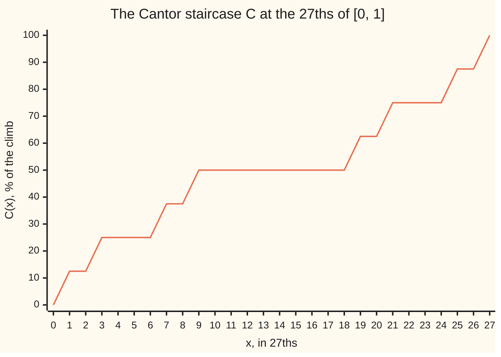
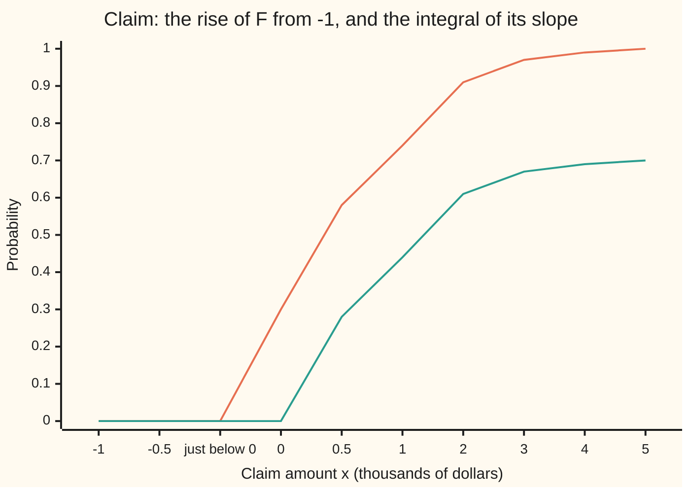

# Lebesgue's theorem on monotone functions: an increasing function has a derivative almost everywhere, and integrating that derivative can fall short

[Syllabus](../../../SYLLABUS.md) → [Measure and integration](../README.md) → [Derivatives Meet the Lebesgue Integral](../README.md#s11) → Lebesgue's theorem on monotone functions

---

## General Overview

An insurer looks at one policy over one year. On 30% of policies nobody claims: the amount is exactly 0. On the other 70% the amount, in thousands of dollars, is exponential with mean 1: given a claim, the chance it exceeds x thousand is e^(−x). The chance that the amount is at most x thousand is the **distribution function** F(x). At x = 1 it is 0.742484.

F only ever rises. Above zero it rises smoothly, with slope 0.7 e^(−x); below zero it is flat. At zero it jumps by 0.3 and has no slope at all. School calculus says that adding up a slope recovers the rise. Here the slope, added up from −1 to 5, gives 0.695283. F rose by 0.995283. The missing 0.3 is the jump.

It gets stranger. The Cantor staircase climbs from 0 to 1 with no jumps at all, yet its slope is 0 at almost every point. Adding up its slope gives 0. The whole climb goes missing.

Henri Lebesgue proved that this is the worst that can happen. A rising function has a slope except on a set of length zero, and adding up that slope never overshoots the rise. The shortfall is the part of the rise that sits on a set of length zero: the jumps, plus any staircase.

**Every increasing function on the line has a finite derivative almost everywhere; its integral over an interval is at most the function's rise there, and the gap is the mass of the singular part of the function's measure.**

**What kind of fact this is:** a theorem, proved on this card in Why it works, with the averaging step supplied by [The Lebesgue differentiation theorem](02-lebesgue-differentiation-theorem.md).

### The picture: a climb with slope zero almost everywhere



One line: the staircase C, in percent of its climb. It is flat on the middle third, 9/27 to 18/27, and on the middle third of every piece left over, at every scale. The flat parts fill length 1; the climbing happens on a set of length zero.

---

## The formula

Notation first, in words. F is **increasing**: x < y gives F(x) ≤ F(y). Its **derivative** $F'(x)$ at a point x is the limit of the slope (F(x + h) − F(x))/h as the step h shrinks to 0 from either side, when that limit exists and is finite. Lebesgue measure $\lambda$ is length. Reminder: "almost everywhere", a.e., means except on a set of length zero.

$$F'(x) \text{ exists and is finite for } \lambda\text{-a.e. } x, \qquad \int_a^b F' \, d\lambda \;\le\; F(b) - F(a)$$

**Read it aloud:** a rising function has a slope at almost every point, and the integral of that slope over a stretch is at most how far the function rose across it.

The shortfall has a name. When F is right-continuous (F(x) is the limit of F from the right, as for every distribution function), it has a **Lebesgue-Stieltjes measure** $\mu_F$ with $\mu_F((a, b]) = F(b) - F(a)$ ([Distribution functions and Lebesgue-Stieltjes measures](../02-Length%20Done%20Properly/06-lebesgue-stieltjes-measures.md)). That measure splits into a part with a density against length and a **singular** part $\mu_s$ that lives on a set of length zero ([Lebesgue decomposition](../08-Densities%20and%20Changing%20Measure/05-lebesgue-decomposition.md)). The density turns out to be the derivative:

$$\mu_F(A) = \int_A F' \, d\lambda + \mu_s(A), \qquad F(b) - F(a) - \int_a^b F' \, d\lambda = \mu_s\big((a, b]\big)$$

**Read it aloud:** the measure of a rising function is its slope integrated against length plus a singular part, so the integral of the slope misses exactly the singular mass.

| Symbol | Plain meaning | In our example | Push it up and the answer… |
| --- | --- | --- | --- |
| $F$ | an increasing function | the claim's distribution function; F(1) = 0.742484 | a bigger rise, more to account for |
| $F'$ | its derivative: the slope at one point | 0.7 e^(−x) for x > 0; none at 0 | more of the rise recovered by the integral |
| $x$, $h$, $r$ | a point; a step away from it; a half-width | h = 3^(−n) on the staircase | smaller h, closer to the true slope |
| $a$, $b$ | the ends of the stretch | −1 and 5 | a longer stretch catches more rise |
| $\lambda$ | Lebesgue measure: length | length of (a, b] is b − a | — |
| $\mu_F$ | the measure of F: mass F(b) − F(a) on (a, b] | 0.3 at zero plus 0.7 spread out | — |
| $f$, $\mu_{ac}$ | the density of the part of $\mu_F$ that gives length-zero sets mass 0; that part | f(x) = 0.7 e^(−x); total 0.7 | a bigger integral of $F'$ |
| $\mu_s$, $N$ | the singular part; a length-zero set it lives on | 0.3 on N = {0} | a bigger shortfall |
| $G$ | the right-continuous version of F, G(x) = F(x+) | equals F for the claim | — |
| $C$, $\mu_C$, $T$, $s$ | the Cantor staircase and its measure; the Takagi function; distance to the nearest whole number | C(1/3) = 0.5 | — |
| $n$ | the stage: cells of width 3^(−n) | n = 1 to 10 | finer cells, a sharper picture |
| $J$, $K$, $A$, $\varepsilon$, $\delta$ | a bounded interval, a closed piece of N, a bad set and two small numbers, in the proof | — | — |

### When it holds

- **F increasing, real-valued, on an interval.** Drop monotonicity and a continuous function can have no derivative anywhere: the Takagi function (What breaks). A difference of two increasing functions is fine, which covers every function of bounded variation ([Bounded variation](01-functions-of-bounded-variation.md)).
- **Almost everywhere, not everywhere.** The claim's F has no derivative at 0; the staircase has none at any point of the Cantor set. A null set of such points is allowed, and it can be uncountable.
- **The Lebesgue integral.** $F'$ is measurable and never negative, so its integral makes sense; the theorem also shows it is finite on bounded stretches.
- **Right-continuity, for the exact shortfall.** The inequality holds for every increasing F. The equation with $\mu_s$ needs F right-continuous; otherwise use its right-continuous version $G$, which differs from F at countably many points only.

---

## Why it works

### Step 0: a rising function is a measure in disguise, and its slope is that measure's density

The rise of F over (x, x + h] is a mass, $\mu_F((x, x + h])$, and the slope over that step is mass per unit length. As h shrinks, the part of the mass with a density gives back that density at almost every point; the part on a length-zero set gives back 0 at almost every point. So the slope is the density almost everywhere, and integrating it recovers only the mass that has a density.

### Step 1: turn F into a measure

Take F right-continuous for now; the general case follows by a squeeze in the Detailed proof. The measure $\mu_F$ gives (a, b] the mass F(b) − F(a) ([Distribution functions and Lebesgue-Stieltjes measures](../02-Length%20Done%20Properly/06-lebesgue-stieltjes-measures.md)). For the claim, $\mu_F$ is 0.3 on the point 0 plus mass 0.7 e^(−x) per unit length on x > 0. For the staircase, $\mu_C$ is the **Cantor measure**: all its mass lies on the Cantor set, which has length 0 ([The Cantor set](../02-Length%20Done%20Properly/07-the-cantor-set.md)).

### Step 2: split the measure against length

The Lebesgue decomposition splits $\mu_F$ in exactly one way into $\mu_{ac}$, which gives every length-zero set mass 0, and $\mu_s$, which lives on one length-zero set N. The Radon-Nikodym theorem gives $\mu_{ac}$ a density f: $\mu_{ac}(A) = \int_A f \, d\lambda$. Claim: f(x) = 0.7 e^(−x) for x > 0, $\mu_s$ is 0.3 on N = {0}. Staircase: f = 0, and $\mu_s$ is everything, on N the Cantor set.

### Step 3: every slope is two averages

For a step h > 0,

$$\frac{F(x + h) - F(x)}{h} \;=\; \frac{1}{h}\int_x^{x+h} f \, d\lambda \;+\; \frac{\mu_s\big((x, x + h]\big)}{h}$$

**Read it aloud:** the slope over a step is the average density over the step plus the singular mass in the step per unit length. A step to the left works the same way. The next two steps take the limit of each piece.

### Step 4: the density average tends to the density, almost everywhere

That is the Lebesgue differentiation theorem ([The Lebesgue differentiation theorem](02-lebesgue-differentiation-theorem.md)): for an integrable f, averages over shrinking intervals around x converge to f(x) at almost every x. For the claim, f is continuous away from 0, so ordinary calculus already gives 0.7 e^(−x) at every x > 0.

### Step 5: the singular mass per unit length tends to 0, almost everywhere

This is the heart of the proof. Fix a threshold ε and call x bad if arbitrarily short intervals around x hold singular mass above ε times their length. Most of $\mu_s$ sits on a closed piece K of N. Short intervals around bad points off K miss K, so their mass comes from the small leftover of N outside K. A covering lemma picks disjoint intervals among them whose tripled copies cover the bad points. Each has length below its mass over ε, so the bad points have length at most 3 × leftover / ε, which can be made as small as wanted. K itself has length 0.

The staircase shows the numbers. Cut [0, 1] into cells of width 3^(−n). The Cantor measure puts mass 2^(−n) on each of 2^n cells and nothing on the rest. On the rising cells the mass per unit length is (3/2)^n, which grows; but the rising cells have total length (2/3)^n, which shrinks to 0. Every other point eventually sits in a flat cell, where the ratio is exactly 0.

| Stage n | Rising cells | Slope on them | Their length | Flat length | Integral of stage slopes |
| --- | --- | --- | --- | --- | --- |
| 1 | 2 of 3 | 1.5000 | 0.666667 | 0.333333 | 1.000000 |
| 2 | 4 of 9 | 2.2500 | 0.444444 | 0.555556 | 1.000000 |
| 4 | 16 of 81 | 5.0625 | 0.197531 | 0.802469 | 1.000000 |
| 10 | 1024 of 59049 | 57.6650 | 0.017342 | 0.982658 | 1.000000 |

The last column shows a limit and an integral that cannot be swapped. The stage slopes integrate to 1 at every stage, yet their limit is 0 at almost every point, so the limit integrates to 0.

### Step 6: add the two limits

At every x where both Step 4 and Step 5 succeed, the slope of F converges to f(x) + 0. Each step fails only on a null set, so $F'(x) = f(x)$ almost everywhere. For the claim, $F'$ is 0.7 e^(−x) for x > 0, 0 for x < 0, and undefined at the single point 0. For the staircase, $C'$ is 0 off the Cantor set.

### Step 7: integrate, and read off the shortfall

Two functions equal almost everywhere have the same integral. So

$$\int_a^b F' \, d\lambda = \int_a^b f \, d\lambda = \mu_{ac}\big((a, b]\big) = \mu_F\big((a, b]\big) - \mu_s\big((a, b]\big) = F(b) - F(a) - \mu_s\big((a, b]\big).$$

**Read it aloud:** the integral of the slope is the density part of the rise, which is the whole rise minus the singular part.

Singular mass is never negative, which gives the inequality. Claim on (−1, 5]: the integral is 0.695283, the rise 0.995283, the gap 0.3, the jump. Staircase on (0, 1]: integral 0, rise 1, gap 1, the whole Cantor measure.

<details>
<summary>Detailed proof: Lebesgue's theorem for increasing functions</summary>

*Claims.* Let F be increasing and real-valued on the line. (i) $F'(x)$ exists and is finite for λ-a.e. x. (ii) $F'$ is measurable and $\int_a^b F' \, d\lambda \le F(b) - F(a)$ for a < b. (iii) If F is right-continuous, $F(b) - F(a) - \int_a^b F' \, d\lambda = \mu_s((a, b])$.

*The measure and its split.* Let F be right-continuous. Its Lebesgue-Stieltjes measure $\mu_F$ is finite on bounded sets, so σ-finite. By the Lebesgue decomposition, $\mu_F = \mu_{ac} + \mu_s$ with $\mu_{ac}$ null on λ-null sets and $\mu_s(\mathbb{R} \setminus N) = 0$ for a Borel set N with $\lambda(N) = 0$. By Radon-Nikodym, $\mu_{ac}(A) = \int_A f \, d\lambda$ for a measurable $f \ge 0$; f is integrable on bounded intervals, since $\int_a^b f \, d\lambda \le F(b) - F(a) < \infty$.

*Density part.* By the Lebesgue differentiation theorem, λ-a.e. x is a Lebesgue point of f: $\frac{1}{2r}\int_{x-r}^{x+r} \lvert f - f(x) \rvert \, d\lambda \to 0$ as r → 0. For 0 < h, $\big\lvert \frac1h \int_x^{x+h} f \, d\lambda - f(x) \big\rvert \le \frac1h \int_{x-h}^{x+h} \lvert f - f(x) \rvert \, d\lambda \to 0$; the same bound serves (x + h, x] for h < 0.

*Singular part.* Let $D(x) = \limsup_{r \to 0} \mu_s([x - r, x + r]) / (2r)$. D is Borel: by monotonicity in r the lim sup may run over rational r, and for fixed r the map x ↦ $\mu_s([x - r, x + r])$ is upper semicontinuous. Fix ε > 0, δ > 0 and a bounded open interval J. The restriction of $\mu_s$ to J is a finite Lebesgue-Stieltjes measure, hence regular, so there is a compact $K \subseteq N \cap J$ with $\mu_s((N \cap J) \setminus K) < \delta$. Let $A = \{x \in J \setminus K : D(x) > \varepsilon\}$ and let C be any compact subset of A. The set $J \setminus K$ is open. Each x in C is the centre of some $I_x = [x - r, x + r] \subseteq J \setminus K$ with $\mu_s(I_x) > 2\varepsilon r$. Finitely many interiors of these cover C. *Covering lemma:* list those intervals longest first; keep an interval if it misses every interval already kept. A discarded interval meets a kept one at least as long, so it lies inside that one's triple (same centre, three times the half-width). Hence C is covered by the triples of kept intervals $I_1, \dots, I_m$, which are disjoint. So $\lambda(C) \le \sum_i 3 \cdot 2 r_i < \frac{3}{\varepsilon} \sum_i \mu_s(I_i) \le \frac{3}{\varepsilon}\, \mu_s(J \setminus K) = \frac{3}{\varepsilon}\, \mu_s\big((N \cap J) \setminus K\big) < \frac{3\delta}{\varepsilon}$, the equality because $\mu_s$ gives nothing off N. By inner regularity of λ, $\lambda(A) \le 3\delta/\varepsilon$. Then $\{x \in J : D(x) > \varepsilon\} \subseteq A \cup K$ has length at most $3\delta/\varepsilon$, since $\lambda(K) \le \lambda(N) = 0$. That set does not depend on δ, and δ is arbitrary, so it is λ-null. Taking ε = 1/k and J = (−k, k) for k = 1, 2, 3, … gives D = 0 λ-a.e. Finally, for h > 0, $0 \le \mu_s((x, x + h]) / h \le 2 \cdot \mu_s([x - h, x + h]) / (2h) \to 0$ wherever D(x) = 0, and likewise for h < 0.

*Derivative.* For h > 0, $F(x + h) - F(x) = \mu_F((x, x + h]) = \int_x^{x+h} f \, d\lambda + \mu_s((x, x + h])$; for h < 0 the same with (x + h, x]. At every x where both limits above hold, the difference quotient tends to f(x), which is finite a.e. So $F' = f$ λ-a.e., which proves (i). $F'$ is the a.e. limit of the measurable functions $k(F(x + 1/k) - F(x))$, so it is measurable.

*Integral.* Functions equal a.e. have equal integrals, so $\int_a^b F' \, d\lambda = \mu_{ac}((a, b]) = \mu_F((a, b]) - \mu_s((a, b]) = F(b) - F(a) - \mu_s((a, b])$. This is (iii), and (ii) follows since $\mu_s \ge 0$.

*Any increasing F.* Let $G(x) = F(x+)$, the limit from the right; G is increasing and right-continuous. F jumps at countably many points only (each jump spans its own rational), and elsewhere F is continuous and F = G. Let x be a continuity point of F where G is differentiable; all but a null set of x qualify. For y < y′, $G(y) \le F(y') \le G(y')$. So for h > 0 and 0 < η < 1, $G(x + (1 - \eta)h) \le F(x + h) \le G(x + h)$, and F(x) = G(x). Dividing by h and letting h → 0, the right-hand slopes of F lie eventually between $(1 - \eta)G'(x) - \eta$ and $G'(x) + \eta$; letting η → 0 gives $G'(x)$. The same squeeze with $G(x + (1 + \eta)h) \le F(x + h) \le G(x + h)$ handles h < 0. So $F' = G'$ a.e. For a < b′ < b, (ii) for G gives $\int_a^{b'} G' \, d\lambda \le G(b') - G(a) \le F(b) - F(a)$, since $G(b') \le F(b)$ and $G(a) \ge F(a)$. Let b′ rise to b; by monotone convergence $\int_a^b F' \, d\lambda \le F(b) - F(a)$. ∎

</details>

### What the code shows and what only the proof shows

The code computes stage slopes exactly, reads slopes off F at thousands of points, and adds them up for three rising functions. That the slope exists almost everywhere for every increasing function, and that the gap always equals the singular mass, only the proof shows.

A second route to the inequality skips the decomposition: the slopes $k(F(x + 1/k) - F(x))$ are never negative, tend to $F'$ almost everywhere, and integrate over [a, b′], for b′ < b and k large, to at most F(b′ + 1/k) − F(a) ≤ F(b) − F(a), so [Fatou's lemma](../05-Swapping%20Limits%20and%20Integrals/01-fatous-lemma.md) bounds the integral of the limit over [a, b′]; then let b′ rise to b. Riesz's rising-sun lemma gives the derivative without measures (Stein and Shakarchi, below).

---

## Worked numbers, by hand

The claim, on the stretch from −1 to 5 thousand dollars.

| Step | Arithmetic | Value |
| --- | --- | --- |
| Rise of F | F(5) − F(−1) = 0.3 + 0.7 × (1 − e^(−5)) − 0 | 0.995283 |
| Slope left of 0 | F is flat at 0 | 0 |
| Slope right of 0 | derivative of 0.3 + 0.7(1 − e^(−x)) | 0.7 e^(−x) |
| Slope at 0 | jump 0.3 over a step h: 0.3/h grows without bound | none |
| Integral of the slope | integral of 0.7 e^(−x) over (0, 5] = 0.7 × (1 − e^(−5)) | 0.695283 |
| Shortfall | 0.995283 − 0.695283 | **0.3** |
| Jump at 0 | F(0) − F(0−) = 0.3 − 0 | 0.3 |
| Staircase on [0, 1] | rise C(1) − C(0) = 1; integral of $C'$ = 0 | shortfall **1** |
| Three pieces on [−1, 1] | rise 0.816060; integral of slope 0.316060 | shortfall **0.5** = 0.3 + 0.2 |

The integral of the slope accounts for the 70% of policies with a spread-out claim; the 30% with no claim sit on one point, where no slope can see them. The last row mixes all three kinds of mass from the [Lebesgue decomposition](../08-Densities%20and%20Changing%20Measure/05-lebesgue-decomposition.md) card: 0.3 at zero, 0.5 exponential at rate 1, and 0.2 spread by the staircase. The gap is the jump plus the staircase.



Two lines. Upper (orange): F(x) − F(−1), the rise so far. Lower (green): the integral of $F'$ from −1 to x. They agree up to just below 0, part by exactly 0.3 at 0, and stay 0.3 apart. "Just below 0" sits right beside 0.

### What breaks if you drop a piece

| Mistake | Comes out at | What went wrong |
| --- | --- | --- |
| Integral of $F'$ taken as F(b) − F(a) | staircase 0.000000 vs 1; claim 0.695283 vs 0.995283 | that equation needs absolute continuity, which the staircase and the jump both lack |
| Limit and integral swapped on the stage slopes | 1.000000 at every stage; the a.e. limit integrates to 0.000000 | the slopes pile onto cells of vanishing length; nothing dominates them |
| A slope expected at every point | at 0: staircase slope 11.390625 at h = 3^(−6); claim slope 300000.7 at h = 10^(−6) | "almost everywhere" allows a null set of bad points |
| Monotonicity dropped: Takagi function | slopes across the cells holding 1/3: 1, 0, 1, 0, … | no limit, here or at any point that is not a dyadic fraction |

The last row is a hypothesis failing. The **Takagi function** $T$ adds up $s(2^k x) / 2^k$ for k = 0, 1, 2, …, where $s$ is the distance to the nearest whole number; it is continuous and rises and falls on every interval. Across a cell of width 2^(−n) with ends at multiples of 2^(−n), the first n terms each have slope +1 or −1 and the rest vanish at both ends. So the slope across the cell is the count of 0s minus 1s among the first n binary digits of a point inside, and it changes by exactly 1 from each n to the next. A slope across a cell containing x is a weighted average of the slopes from x to the two ends, so if $T'(x)$ existed these would converge to it. So $T$ has no derivative off the dyadic fractions, a countable set.

---

## Code, from first principles, and it actually runs

Two roads to the integral of the slope. Road A uses the decomposition: exact stage counts for the staircase, whose digit rule is checked against its self-similarity, and the claim's density integrated by a hand-written Simpson rule. Road B uses F alone: at the midpoint of every cell of width 3^(−7) it takes the slope of F across a tiny step, adds the slopes up, and finds the largest rise across one cell, the jump. For the staircase those midpoints always fall in removed middle thirds (their base-3 digits end in 1s), so its flat count is certain by construction, not a sample. The gap is checked against the jump, and for the three-piece law against the jump plus the staircase's weight. The Takagi slopes are computed exactly and compared with the digit count.

### Python

```python
# Lebesgue's theorem on monotone functions -- the check behind the card.
# Standard library only: a hand-written exponential, Cantor staircase and Simpson
# rule; exact fractions for the Takagi counterexample.  Claims in thousands of dollars.
from fractions import Fraction as Fr

def exp_pos(x):                               # e^x for x >= 0, summed term by term
    total, term, k = 1.0, 1.0, 0
    while term > 1e-17 * total:
        k += 1
        term *= x / k
        total += term
    return total

def e_neg(x): return 1.0 / exp_pos(x)         # e^(-x) for x >= 0

def cantor(p, q, digits=40):                  # Cantor staircase C at p/q >= 0, base-3 digits
    if p >= q: return 1.0
    value, half = 0.0, 0.5
    for _ in range(digits):
        p *= 3
        d, p = p // q, p % q
        if d == 1: return value + half        # inside a removed middle third: C is flat there
        if d == 2: value += half
        half /= 2
    return value

def self_similar(k, n):                       # 2^n C(k / 3^n) by C(x) = C(3x)/2, 1/2, 1/2 + C(3x - 2)/2
    if k == 0 or k == 3**n: return 2**n if k else 0
    third = 3**(n - 1)
    if k <= third: return self_similar(k, n - 1)
    return 2**(n - 1) if k <= 2 * third else 2**(n - 1) + self_similar(k - 2 * third, n - 1)

def simpson(g, a, b, m=6000):                 # Simpson's rule, m even
    h = (b - a) / m
    return (g(a) + g(b) + sum((4 if i % 2 else 2) * g(a + i * h) for i in range(1, m))) * h / 3

N = 7                                         # road B grid: cells of width 3^-7, all points over Q = 4 * 3^8
T, Q = 3**N, 4 * 3**(N + 1)
def road_b(F, lo, hi):                        # integral of F' read off F alone, plus the largest cell rise
    total, big, at = 0.0, 0.0, None
    for j in range(lo * T, hi * T):           # midpoint (2j+1)/(2T) = 6(2j+1)/Q; step 1/Q either side
        m = 6 * (2 * j + 1)
        total += (F(m + 1) - F(m - 1)) * Q / 2 / T
        rise = F(12 * (j + 1)) - F(12 * j)
        if rise > big: big, at = rise, Fr(j + 1, T)
    return total, big, at

# ---- The Cantor staircase ----
print("chart, Cantor staircase C at x = k/27, k = 0..27, in % of the climb: "
      + ", ".join(f"{100 * cantor(k, 27):.2f}" for k in range(28)))
print("road A, stages: cells of width 3^-n on [0, 1]; C rises on some and is flat on the rest")
for n in (1, 2, 3, 4, 6, 8, 10):
    t = 3**n
    rises = [cantor(j + 1, t) - cantor(j, t) for j in range(t)]
    up = [r for r in rises if r > 0]
    print(f"  n = {n:2d}: rising {len(up):4d} of {t:5d}, slope there {up[0] * t:9.4f}, their length "
          f"{len(up) / t:.6f}, flat length {1 - len(up) / t:.6f}, integral of stage slopes {sum(rises):.6f}")
    assert len(up) == 2**n and all(r == 0.5**n for r in up)   # count and size match the construction
    assert all(cantor(k, t) * 2**n == self_similar(k, n) for k in range(t + 1))   # digits agree with self-similarity
flat = sum(cantor(6 * (2 * j + 1) + 1, Q) == cantor(6 * (2 * j + 1) - 1, Q) for j in range(T))
cb, _, _ = road_b(lambda p: cantor(p, Q) if p > 0 else 0.0, 0, 1)
print(f"road B, midpoints: C is flat around {flat} of {T} midpoints of width-3^-{N} cells; "
      f"midpoint sum of C' = {cb:.6f}")
assert flat == T
print(f"Cantor: C(1) - C(0) = {cantor(1, 1) - cantor(0, 1):.6f}; integral of C' = {cb:.6f}; "
      f"shortfall {cantor(1, 1) - cb:.6f}, all of it singular")
at0 = [cantor(1, 3**n) * 3**n for n in range(1, 7)]
print("Cantor at x = 0: C(3^-n) / 3^-n for n = 1..6: " + ", ".join(f"{v:.6f}" for v in at0))
assert at0 == [1.5**n for n in range(1, 7)]

# ---- The insurance claim: 0.3 chance of no claim, else exponential with mean 1 ----
Fc = lambda x: 0.0 if x < 0 else 0.3 + 0.7 * (1 - e_neg(x))
dens = lambda x: 0.7 * e_neg(x)               # F' away from 0, from the decomposition
pts = [-1, -0.5, None, 0, 0.5, 1, 2, 3, 4, 5]
lab = "at -1, -0.5, just below 0, 0, 0.5, 1, 2, 3, 4, 5"
print(f"chart, claim F(x) - F(-1) {lab}: "
      + ", ".join(f"{Fc(-1e-9 if x is None else x) - Fc(-1):.2f}" for x in pts))
print(f"chart, claim integral of F' from -1 to x {lab}: "
      + ", ".join(f"{simpson(dens, 0.0, x) if x and x > 0 else 0.0:.2f}" for x in pts))
ca = simpson(dens, 0.0, 5.0)
cB, cjump, cat = road_b(lambda p: Fc(p / Q), -1, 5)
cgap = Fc(5) - Fc(-1)
print(f"claim, road A (density 0.7 e^(-x), Simpson over (0, 5]): {ca:.6f}")
print(f"claim, road B (F alone, {6 * T} midpoints): {cB:.6f}; largest cell rise {cjump:.6f}, cell ending at {cat}")
print(f"claim: F(5) - F(-1) = {cgap:.6f}; shortfall {cgap - cB:.6f}; F(1) = {Fc(1):.6f}")
assert abs(cB - ca) < 1e-7 and abs(cgap - cB - cjump) < 1e-7 and cat == 0

# ---- Three pieces: 0.3 jump at 0, 0.5 exponential, 0.2 Cantor on [0, 1] ----
F3 = lambda p: 0.0 if p < 0 else 0.3 + 0.5 * (1 - e_neg(p / Q)) + 0.2 * cantor(p, Q)
ta = simpson(lambda x: 0.5 * e_neg(x), 0.0, 1.0)
tB, tjump, tat = road_b(F3, -1, 1)
tgap = F3(Q) - F3(-Q)
print(f"three-piece on [-1, 1]: road A {ta:.6f}, road B {tB:.6f}; F(1) - F(-1) = {tgap:.6f}")
print(f"three-piece: shortfall {tgap - tB:.6f} = largest cell rise {tjump:.6f} (cell ending at {tat}) "
      f"+ staircase {tgap - tB - tjump:.6f}")
assert abs(tB - ta) < 1e-7 and abs(tgap - tB - tjump - 0.2) < 1e-7

# ---- What breaks ----
def s(y): r = y - (y.numerator // y.denominator); return min(r, 1 - r)   # distance to nearest whole number
def takagi(j, n):                             # T(j / 2^n) exactly: terms k >= n vanish at a dyadic point
    return sum(s(Fr(j * 2**k, 2**n)) / 2**k for k in range(n))
tq, walk, third = [], [], Fr(1, 3)            # cells [j/2^n, (j+1)/2^n] around 1/3
for n in range(1, 13):
    j = (2**n) // 3
    tq.append((takagi(j + 1, n) - takagi(j, n)) * 2**n)
    walk.append(sum(1 - 2 * (int(third * 2**i) % 2) for i in range(1, n + 1)))   # +1 per binary 0, -1 per 1
print("Takagi T (not monotone): slope of T across the width-2^-n cell holding 1/3, n = 1..12: "
      + ", ".join(str(v) for v in tq))
assert tq == walk                             # the zeros-minus-ones count of the binary digits
print(f"mistake 1, integral of F' taken as F(b) - F(a): Cantor {cb:.6f} vs 1; claim {cB:.6f} vs {cgap:.6f}")
print(f"mistake 2, stage slopes integrate to 1 at every n; their a.e. limit integrates to {cb:.6f}")
print(f"mistake 3, slope expected everywhere: at 0, Cantor quotient {at0[-1]:.6f} at h = 3^-6; "
      f"claim quotient {Fc(1e-6) / 1e-6:.1f} at h = 10^-6")
print("ALL CHECKS PASS")
```

**Ran 2026-09-29 on macOS, Python 3.14.6, standard library only. All checks passed. Output, pasted from the run:**

```
chart, Cantor staircase C at x = k/27, k = 0..27, in % of the climb: 0.00, 12.50, 12.50, 25.00, 25.00, 25.00, 25.00, 37.50, 37.50, 50.00, 50.00, 50.00, 50.00, 50.00, 50.00, 50.00, 50.00, 50.00, 50.00, 62.50, 62.50, 75.00, 75.00, 75.00, 75.00, 87.50, 87.50, 100.00
road A, stages: cells of width 3^-n on [0, 1]; C rises on some and is flat on the rest
  n =  1: rising    2 of     3, slope there    1.5000, their length 0.666667, flat length 0.333333, integral of stage slopes 1.000000
  n =  2: rising    4 of     9, slope there    2.2500, their length 0.444444, flat length 0.555556, integral of stage slopes 1.000000
  n =  3: rising    8 of    27, slope there    3.3750, their length 0.296296, flat length 0.703704, integral of stage slopes 1.000000
  n =  4: rising   16 of    81, slope there    5.0625, their length 0.197531, flat length 0.802469, integral of stage slopes 1.000000
  n =  6: rising   64 of   729, slope there   11.3906, their length 0.087791, flat length 0.912209, integral of stage slopes 1.000000
  n =  8: rising  256 of  6561, slope there   25.6289, their length 0.039018, flat length 0.960982, integral of stage slopes 1.000000
  n = 10: rising 1024 of 59049, slope there   57.6650, their length 0.017342, flat length 0.982658, integral of stage slopes 1.000000
road B, midpoints: C is flat around 2187 of 2187 midpoints of width-3^-7 cells; midpoint sum of C' = 0.000000
Cantor: C(1) - C(0) = 1.000000; integral of C' = 0.000000; shortfall 1.000000, all of it singular
Cantor at x = 0: C(3^-n) / 3^-n for n = 1..6: 1.500000, 2.250000, 3.375000, 5.062500, 7.593750, 11.390625
chart, claim F(x) - F(-1) at -1, -0.5, just below 0, 0, 0.5, 1, 2, 3, 4, 5: 0.00, 0.00, 0.00, 0.30, 0.58, 0.74, 0.91, 0.97, 0.99, 1.00
chart, claim integral of F' from -1 to x at -1, -0.5, just below 0, 0, 0.5, 1, 2, 3, 4, 5: 0.00, 0.00, 0.00, 0.00, 0.28, 0.44, 0.61, 0.67, 0.69, 0.70
claim, road A (density 0.7 e^(-x), Simpson over (0, 5]): 0.695283
claim, road B (F alone, 13122 midpoints): 0.695283; largest cell rise 0.300000, cell ending at 0
claim: F(5) - F(-1) = 0.995283; shortfall 0.300000; F(1) = 0.742484
three-piece on [-1, 1]: road A 0.316060, road B 0.316060; F(1) - F(-1) = 0.816060
three-piece: shortfall 0.500000 = largest cell rise 0.300000 (cell ending at 0) + staircase 0.200000
Takagi T (not monotone): slope of T across the width-2^-n cell holding 1/3, n = 1..12: 1, 0, 1, 0, 1, 0, 1, 0, 1, 0, 1, 0
mistake 1, integral of F' taken as F(b) - F(a): Cantor 0.000000 vs 1; claim 0.695283 vs 0.995283
mistake 2, stage slopes integrate to 1 at every n; their a.e. limit integrates to 0.000000
mistake 3, slope expected everywhere: at 0, Cantor quotient 11.390625 at h = 3^-6; claim quotient 300000.7 at h = 10^-6
ALL CHECKS PASS
```

### Rust

Same numbers, same labels, built with `rustc --edition 2021 -O`.

```rust
// Lebesgue's theorem on monotone functions -- the same check as the Python, in Rust.
// No crates: a hand-written exponential, Cantor staircase and Simpson rule; exact
// integer arithmetic for the Takagi counterexample.  Claims in thousands of dollars.

fn exp_pos(x: f64) -> f64 {                   // e^x for x >= 0, summed term by term
    let (mut total, mut term, mut k) = (1.0f64, 1.0f64, 0.0f64);
    while term > 1e-17 * total { k += 1.0; term *= x / k; total += term; }
    total
}
fn e_neg(x: f64) -> f64 { 1.0 / exp_pos(x) }  // e^(-x) for x >= 0

fn cantor(mut p: i64, q: i64) -> f64 {        // Cantor staircase C at p/q >= 0, base-3 digits
    if p >= q { return 1.0; }
    let (mut value, mut half) = (0.0f64, 0.5f64);
    for _ in 0..40 {
        p *= 3;
        let d = p / q; p %= q;
        if d == 1 { return value + half; }    // inside a removed middle third: C is flat there
        if d == 2 { value += half; }
        half /= 2.0;
    }
    value
}

fn self_similar(k: i64, n: u32) -> i64 {     // 2^n C(k / 3^n) by C(x) = C(3x)/2, 1/2, 1/2 + C(3x - 2)/2
    if k == 0 || k == 3i64.pow(n) { return if k == 0 { 0 } else { 1i64 << n }; }
    let third = 3i64.pow(n - 1);
    if k <= third { return self_similar(k, n - 1); }
    if k <= 2 * third { 1i64 << (n - 1) } else { (1i64 << (n - 1)) + self_similar(k - 2 * third, n - 1) }
}

fn simpson(g: &dyn Fn(f64) -> f64, a: f64, b: f64) -> f64 {   // Simpson's rule, 6000 steps
    let m = 6000; let h = (b - a) / m as f64;
    (g(a) + g(b) + (1..m).map(|i| (if i % 2 == 1 { 4.0 } else { 2.0 }) * g(a + i as f64 * h)).sum::<f64>()) * h / 3.0
}

const N: u32 = 7;                             // road B grid: cells of width 3^-7, all points over Q = 4 * 3^8
const T: i64 = 2187;
const Q: i64 = 4 * 6561;
fn road_b(f: &dyn Fn(i64) -> f64, lo: i64, hi: i64) -> (f64, f64, i64) {   // integral of F' from F alone
    let (mut total, mut big, mut at) = (0.0f64, 0.0f64, i64::MIN);
    for j in lo * T..hi * T {                 // midpoint (2j+1)/(2T) = 6(2j+1)/Q; step 1/Q either side
        let m = 6 * (2 * j + 1);
        total += (f(m + 1) - f(m - 1)) * Q as f64 / 2.0 / T as f64;
        let rise = f(12 * (j + 1)) - f(12 * j);
        if rise > big { big = rise; at = j + 1; }
    }
    (total, big, at)
}
fn gcd(a: i64, b: i64) -> i64 { if b == 0 { a.abs() } else { gcd(b, a % b) } }
fn frac(n: i64, d: i64) -> String { let g = gcd(n, d).max(1); if d / g == 1 { format!("{}", n / g) } else { format!("{}/{}", n / g, d / g) } }
fn join(v: &[f64], p: usize) -> String { v.iter().map(|x| format!("{:.*}", p, x)).collect::<Vec<_>>().join(", ") }

fn takagi(j: i64, n: u32) -> i64 {            // T(j / 2^n) * 2^(2n) exactly: terms k >= n vanish
    let d = 1i64 << n;
    (0..n).map(|k| { let r = (j << k) % d; r.min(d - r) << (n - k) }).sum()
}

fn main() {
    // ---- The Cantor staircase ----
    let c27: Vec<f64> = (0..28).map(|k| 100.0 * cantor(k, 27)).collect();
    println!("chart, Cantor staircase C at x = k/27, k = 0..27, in % of the climb: {}", join(&c27, 2));
    println!("road A, stages: cells of width 3^-n on [0, 1]; C rises on some and is flat on the rest");
    for n in [1u32, 2, 3, 4, 6, 8, 10] {
        let t = 3i64.pow(n);
        let rises: Vec<f64> = (0..t).map(|j| cantor(j + 1, t) - cantor(j, t)).collect();
        let up: Vec<f64> = rises.iter().cloned().filter(|&r| r > 0.0).collect();
        let (len_up, total) = (up.len() as f64 / t as f64, rises.iter().sum::<f64>());
        println!("  n = {:2}: rising {:4} of {:5}, slope there {:9.4}, their length {:.6}, flat length {:.6}, integral of stage slopes {:.6}",
                 n, up.len(), t, up[0] * t as f64, len_up, 1.0 - len_up, total);
        assert!(up.len() == 1usize << n && up.iter().all(|&r| r == 0.5f64.powi(n as i32)));   // count and size
        assert!((0..=t).all(|k| cantor(k, t) * (1i64 << n) as f64 == self_similar(k, n) as f64));   // digits agree with self-similarity
    }
    let flat = (0..T).filter(|&j| cantor(6 * (2 * j + 1) + 1, Q) == cantor(6 * (2 * j + 1) - 1, Q)).count();
    let (cb, _, _) = road_b(&|p| if p > 0 { cantor(p, Q) } else { 0.0 }, 0, 1);
    println!("road B, midpoints: C is flat around {} of {} midpoints of width-3^-{} cells; midpoint sum of C' = {:.6}", flat, T, N, cb);
    assert!(flat as i64 == T);
    println!("Cantor: C(1) - C(0) = {:.6}; integral of C' = {:.6}; shortfall {:.6}, all of it singular",
             cantor(1, 1) - cantor(0, 1), cb, cantor(1, 1) - cb);
    let at0: Vec<f64> = (1..7).map(|n| cantor(1, 3i64.pow(n)) * 3i64.pow(n) as f64).collect();
    println!("Cantor at x = 0: C(3^-n) / 3^-n for n = 1..6: {}", join(&at0, 6));
    assert!((1..7).all(|n| at0[n - 1] == 1.5f64.powi(n as i32)));

    // ---- The insurance claim: 0.3 chance of no claim, else exponential with mean 1 ----
    let fc = |x: f64| if x < 0.0 { 0.0 } else { 0.3 + 0.7 * (1.0 - e_neg(x)) };
    let dens = |x: f64| 0.7 * e_neg(x);       // F' away from 0, from the decomposition
    let pts = [-1.0, -0.5, -1e-9, 0.0, 0.5, 1.0, 2.0, 3.0, 4.0, 5.0];
    let lab = "at -1, -0.5, just below 0, 0, 0.5, 1, 2, 3, 4, 5";
    let line1: Vec<f64> = pts.iter().map(|&x| fc(x) - fc(-1.0)).collect();
    let line2: Vec<f64> = pts.iter().map(|&x| if x > 0.0 { simpson(&dens, 0.0, x) } else { 0.0 }).collect();
    println!("chart, claim F(x) - F(-1) {}: {}", lab, join(&line1, 2));
    println!("chart, claim integral of F' from -1 to x {}: {}", lab, join(&line2, 2));
    let ca = simpson(&dens, 0.0, 5.0);
    let (c_b, cjump, cat) = road_b(&|p| fc(p as f64 / Q as f64), -1, 5);
    let cgap = fc(5.0) - fc(-1.0);
    println!("claim, road A (density 0.7 e^(-x), Simpson over (0, 5]): {:.6}", ca);
    println!("claim, road B (F alone, {} midpoints): {:.6}; largest cell rise {:.6}, cell ending at {}", 6 * T, c_b, cjump, frac(cat, T));
    println!("claim: F(5) - F(-1) = {:.6}; shortfall {:.6}; F(1) = {:.6}", cgap, cgap - c_b, fc(1.0));
    assert!((c_b - ca).abs() < 1e-7 && (cgap - c_b - cjump).abs() < 1e-7 && cat == 0);

    // ---- Three pieces: 0.3 jump at 0, 0.5 exponential, 0.2 Cantor on [0, 1] ----
    let f3 = |p: i64| if p < 0 { 0.0 } else { 0.3 + 0.5 * (1.0 - e_neg(p as f64 / Q as f64)) + 0.2 * cantor(p, Q) };
    let ta = simpson(&|x| 0.5 * e_neg(x), 0.0, 1.0);
    let (t_b, tjump, tat) = road_b(&f3, -1, 1);
    let tgap = f3(Q) - f3(-Q);
    println!("three-piece on [-1, 1]: road A {:.6}, road B {:.6}; F(1) - F(-1) = {:.6}", ta, t_b, tgap);
    println!("three-piece: shortfall {:.6} = largest cell rise {:.6} (cell ending at {}) + staircase {:.6}",
             tgap - t_b, tjump, frac(tat, T), tgap - t_b - tjump);
    assert!((t_b - ta).abs() < 1e-7 && (tgap - t_b - tjump - 0.2).abs() < 1e-7);

    // ---- What breaks ----
    let (mut tq, mut walk) = (Vec::new(), Vec::new());   // cells [j/2^n, (j+1)/2^n] around 1/3
    for n in 1..13u32 {
        let j = (1i64 << n) / 3;
        tq.push((takagi(j + 1, n) - takagi(j, n)) >> n);
        walk.push((1..=n).map(|i| 1 - 2 * (((1i64 << i) / 3) % 2)).sum::<i64>());   // +1 per binary 0, -1 per 1
    }
    println!("Takagi T (not monotone): slope of T across the width-2^-n cell holding 1/3, n = 1..12: {}",
             tq.iter().map(|v| v.to_string()).collect::<Vec<_>>().join(", "));
    assert!(tq == walk);                      // the zeros-minus-ones count of the binary digits
    println!("mistake 1, integral of F' taken as F(b) - F(a): Cantor {:.6} vs 1; claim {:.6} vs {:.6}", cb, c_b, cgap);
    println!("mistake 2, stage slopes integrate to 1 at every n; their a.e. limit integrates to {:.6}", cb);
    println!("mistake 3, slope expected everywhere: at 0, Cantor quotient {:.6} at h = 3^-6; claim quotient {:.1} at h = 10^-6",
             at0[5], fc(1e-6) / 1e-6);
    println!("ALL CHECKS PASS");
}
```

**Ran 2026-09-29 on macOS, rustc 1.98.1, no crates. All checks passed. Output, pasted from the run:**

```
chart, Cantor staircase C at x = k/27, k = 0..27, in % of the climb: 0.00, 12.50, 12.50, 25.00, 25.00, 25.00, 25.00, 37.50, 37.50, 50.00, 50.00, 50.00, 50.00, 50.00, 50.00, 50.00, 50.00, 50.00, 50.00, 62.50, 62.50, 75.00, 75.00, 75.00, 75.00, 87.50, 87.50, 100.00
road A, stages: cells of width 3^-n on [0, 1]; C rises on some and is flat on the rest
  n =  1: rising    2 of     3, slope there    1.5000, their length 0.666667, flat length 0.333333, integral of stage slopes 1.000000
  n =  2: rising    4 of     9, slope there    2.2500, their length 0.444444, flat length 0.555556, integral of stage slopes 1.000000
  n =  3: rising    8 of    27, slope there    3.3750, their length 0.296296, flat length 0.703704, integral of stage slopes 1.000000
  n =  4: rising   16 of    81, slope there    5.0625, their length 0.197531, flat length 0.802469, integral of stage slopes 1.000000
  n =  6: rising   64 of   729, slope there   11.3906, their length 0.087791, flat length 0.912209, integral of stage slopes 1.000000
  n =  8: rising  256 of  6561, slope there   25.6289, their length 0.039018, flat length 0.960982, integral of stage slopes 1.000000
  n = 10: rising 1024 of 59049, slope there   57.6650, their length 0.017342, flat length 0.982658, integral of stage slopes 1.000000
road B, midpoints: C is flat around 2187 of 2187 midpoints of width-3^-7 cells; midpoint sum of C' = 0.000000
Cantor: C(1) - C(0) = 1.000000; integral of C' = 0.000000; shortfall 1.000000, all of it singular
Cantor at x = 0: C(3^-n) / 3^-n for n = 1..6: 1.500000, 2.250000, 3.375000, 5.062500, 7.593750, 11.390625
chart, claim F(x) - F(-1) at -1, -0.5, just below 0, 0, 0.5, 1, 2, 3, 4, 5: 0.00, 0.00, 0.00, 0.30, 0.58, 0.74, 0.91, 0.97, 0.99, 1.00
chart, claim integral of F' from -1 to x at -1, -0.5, just below 0, 0, 0.5, 1, 2, 3, 4, 5: 0.00, 0.00, 0.00, 0.00, 0.28, 0.44, 0.61, 0.67, 0.69, 0.70
claim, road A (density 0.7 e^(-x), Simpson over (0, 5]): 0.695283
claim, road B (F alone, 13122 midpoints): 0.695283; largest cell rise 0.300000, cell ending at 0
claim: F(5) - F(-1) = 0.995283; shortfall 0.300000; F(1) = 0.742484
three-piece on [-1, 1]: road A 0.316060, road B 0.316060; F(1) - F(-1) = 0.816060
three-piece: shortfall 0.500000 = largest cell rise 0.300000 (cell ending at 0) + staircase 0.200000
Takagi T (not monotone): slope of T across the width-2^-n cell holding 1/3, n = 1..12: 1, 0, 1, 0, 1, 0, 1, 0, 1, 0, 1, 0
mistake 1, integral of F' taken as F(b) - F(a): Cantor 0.000000 vs 1; claim 0.695283 vs 0.995283
mistake 2, stage slopes integrate to 1 at every n; their a.e. limit integrates to 0.000000
mistake 3, slope expected everywhere: at 0, Cantor quotient 11.390625 at h = 3^-6; claim quotient 300000.7 at h = 10^-6
ALL CHECKS PASS
```

The two outputs match line for line.

> [!TIP]
> **Try changing**
> Guess first, then run it.
> - **A coarser grid.** Set `N = 5`. Guess whether road B still matches road A to within 10^(−7). It does not: road B prints the same six decimals, but the midpoint rule's own error on cells of width 1/243 exceeds 10^(−7), and the claim assert stops the run.
> - **A bigger jump.** In `Fc` use `0.5 + 0.5 * (1 - e_neg(x))`, and in `dens` use `0.5 * e_neg(x)`. Guess the shortfall: the new jump, 0.5, and road B's largest cell rise finds it at 0.
> - **Another point for Takagi.** Replace both `3`s in the Takagi loop (`Fr(1, 3)` and `// 3`) by `5`. Guess the slopes: 1/5 has binary digits 0011 repeating, so they cycle 1, 2, 1, 0 and never settle. The label still says 1/3.

---

## The usual mistake

> [!warning]
> **Believing that a function which rises continuously is the integral of its slope.** Continuity rules out jumps, not staircases. The Cantor staircase is continuous and rises by 1, yet its slope is 0 almost everywhere and integrates to 0. Recovering a function from its slope needs absolute continuity, a stronger condition than continuity.
>
> - **Reading "differentiable almost everywhere" as "differentiable except at a few points".** The staircase fails at uncountably many points of the Cantor set; they still have length 0.
> - **Fitting one density to every claim.** A density describes only the 0.7 spread out; the 0.3 of claims of exactly 0 has no density and needs its own term.
> - **Swapping limit and integral.** The staircase's stage slopes integrate to 1 at every stage and tend to 0 almost everywhere; the limit integrates to 0, not 1.

---

## Where you meet it in real life

- **Insurance claims and rainfall.** A claim amount, like a day's rainfall, is exactly 0 with positive probability and spread out otherwise. Its density is the slope of the distribution function; the atom at 0 is the shortfall and must be modelled separately.
- **Densities in probability.** A law has a density exactly when its distribution function recovers from its slope; otherwise the slope is only the density of the absolutely continuous part ([Lebesgue decomposition](../08-Densities%20and%20Changing%20Measure/05-lebesgue-decomposition.md)).
- **Integrating against a rising function.** Integrals against $\mu_F$, written with dF ([The Lebesgue-Stieltjes integral](05-lebesgue-stieltjes-integral.md)), split into a part with $F'$ and a part on the jumps and staircases.
- **Devil's staircases in physics.** In systems of coupled oscillators the locked frequency ratio, plotted against a driving parameter, can form a continuous rising staircase that is flat almost everywhere, the same shape as C.

> **Say it back**
> A rising function is the distribution of a measure, and its slope over a small step is that measure's mass per unit length. The part of the measure with a density returns the density at almost every point; the part on a length-zero set returns 0 at almost every point. So the slope exists almost everywhere and equals the density. Integrating it recovers the density part only, which falls short of the rise by the singular mass. The claim loses its 0.3 jump; the Cantor staircase loses its whole climb.

---

## What this builds on

- [The Lebesgue differentiation theorem](02-lebesgue-differentiation-theorem.md): averages of an integrable function over shrinking intervals return the function almost everywhere, the density half of Step 3.
- [Lebesgue decomposition](../08-Densities%20and%20Changing%20Measure/05-lebesgue-decomposition.md): the unique split of $\mu_F$ into a density part and a singular part.
- [Bounded variation](01-functions-of-bounded-variation.md): a function of bounded variation is a difference of two increasing ones, so the theorem covers it too.

## Where this goes next

- [Absolutely continuous functions and the fundamental theorem](04-absolutely-continuous-functions-and-the-fundamental-theorem.md): the functions with no singular part, for which the integral of the slope recovers the rise exactly, and how to recognise them without computing a decomposition.

---

## Sources

Verified 2026-09-29: every link below resolves to the publisher's page.

- Folland, Gerald B. *Real Analysis: Modern Techniques and Their Applications*, 2nd ed. Wiley, 1999. [Publisher page](https://www.wiley.com/en-us/Real+Analysis%3A+Modern+Techniques+and+Their+Applications%2C+2nd+Edition-p-9780471317166). Section 3.5 proves that increasing functions are differentiable almost everywhere by this card's route: the Lebesgue-Stieltjes measure, its decomposition, and differentiation of measures.
- Stein, Elias M., and Rami Shakarchi. *Real Analysis: Measure Theory, Integration, and Hilbert Spaces*. Princeton University Press, 2005. [Publisher page](https://press.princeton.edu/books/hardcover/9780691113869/real-analysis). Chapter 3 proves the same theorem with the rising-sun lemma, and treats the Cantor function.
- Billingsley, Patrick. *Probability and Measure*, Anniversary ed. Wiley, 2012. [Publisher page](https://www.wiley.com/en-us/Probability+and+Measure%2C+Anniversary+Edition-p-9781118122372). Section 31, derivatives on the line: Lebesgue's theorem and singular distribution functions, with the Cantor function as the example.
