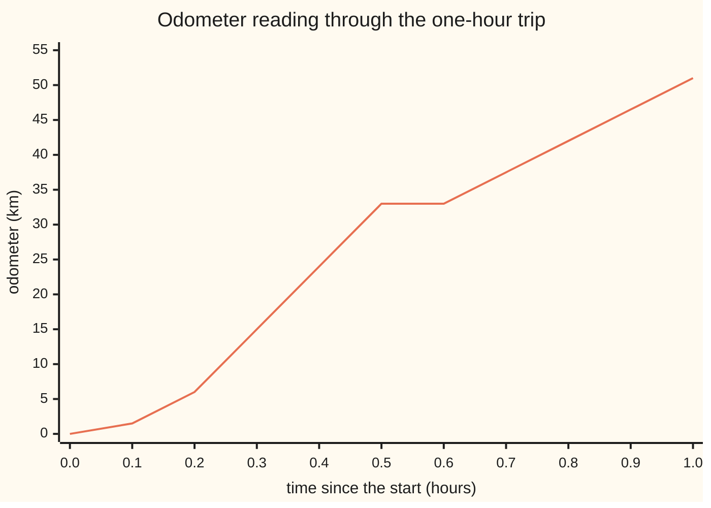
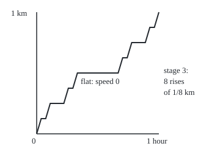

# Absolutely continuous functions and the fundamental theorem: F is the integral of its derivative exactly when F moves little over any collection of short intervals

[Syllabus](../../../SYLLABUS.md) → [Measure and integration](../README.md) → [Derivatives Meet the Lebesgue Integral](../README.md#s11) → Absolutely continuous functions and the fundamental theorem

---

## General Overview

A car makes a one-hour trip in four legs. For the first 0.2 hours it pulls away, its speed rising steadily from 0 to 60 km/h. At the gear change the speed reading switches to 90 km/h and holds for 0.3 hours. Then a red light: 0 km/h for 0.1 hours. Last, 45 km/h for 0.4 hours. The odometer reads 6, 33, 33 and finally 51 km at the ends of the legs. The trip log treats each gear change as instant, so the speed has three jumps.

The speedometer gives a rate; the odometer gives a running total. The odometer should be the area under the speed curve, and the speed the odometer's slope. At the three jumps the odometer has a corner and no slope, but three instants take no time.

Now a stranger instrument. A trip counter rises from 0 to 1 km over one hour, never jumps, never goes backwards, and yet its speed is zero at every moment outside a set of total length zero. The area under its speed is 0 km. The counter says 1 km. This staircase is the Cantor function, and it shows that continuity alone does not make a function the integral of its rate.

The property that separates the odometer from the staircase has a name. The odometer moves little over any collection of short time intervals, however many there are, as long as their lengths add up to little. From here on that property is called **absolute continuity**. The running total becomes the **indefinite integral**, and the rate becomes the **derivative almost everywhere**: at every point except a set of length zero.

**A function is the running integral of an integrable rate exactly when it is absolutely continuous, and then that rate is its derivative almost everywhere; the Cantor staircase is continuous and rising but fails the test, which is why its zero derivative integrates to 0 while it climbs by 1.**

**What kind of fact this is:** absolute continuity is a definition; the equivalence with being an integral, the chain Lipschitz, absolutely continuous, bounded variation, and the Cantor verdict are theorems, proved on this card in Why it works.

### The picture: the odometer, hour by hour



One line: the odometer in km, every 0.1 hours. It curves up as the car pulls away, climbs steeply at 90 km/h, lies flat at the red light, climbs again at 45 km/h. Its slope is the speed, except at the corners at 0.2, 0.5 and 0.6 hours.

---

## The formula

Notation first, in words. $F$ is a function on a closed interval of times from $a$ to $b$; here the odometer on the hour from 0 to 1. Lebesgue measure $\lambda$ gives a set of times its total length ([Lebesgue measure](../02-Length%20Done%20Properly/03-lebesgue-measure.md)). $L^1$ is the collection of functions whose absolute value has a finite integral against $\lambda$ ([Integrable functions](../04-The%20Lebesgue%20Integral/04-integrable-functions-and-l1.md)). "Almost everywhere", a.e., means "except on a set of length zero".

**The definition.** $F$ is **absolutely continuous** on $[a, b]$ when for every $\varepsilon > 0$ there is a $\delta > 0$ such that, for every finite collection of non-overlapping intervals $(a_1, b_1), \ldots, (a_n, b_n)$ inside $[a, b]$,

$$\sum_{k=1}^{n} (b_k - a_k) < \delta \quad\Longrightarrow\quad \sum_{k=1}^{n} \lvert F(b_k) - F(a_k) \rvert < \varepsilon .$$

**Read it aloud:** name any tolerance epsilon; there is a total length delta so that intervals adding up to less than delta, however many, move F by less than epsilon in total.

**The theorem.** For a function $F$ on $[a, b]$ these two statements are equivalent:

$$F \text{ is absolutely continuous} \quad\Longleftrightarrow\quad F(x) = F(a) + \int_{[a,x]} f \, d\lambda \ \text{ for every } x \text{ in } [a,b], \text{ for some } f \in L^1 .$$

When they hold, $F$ has a derivative at almost every point and

$$F' = f \quad \text{a.e.}, \qquad\text{so}\qquad F(b) - F(a) = \int_{[a,b]} F' \, d\lambda .$$

**Read it aloud:** a function is a running integral exactly when it is absolutely continuous; its derivative then exists except on a set of length zero, equals the rate it was built from, and integrates back to the total change.

**The chain.** $F$ is **Lipschitz** with constant $L$ when $\lvert F(x) - F(y) \rvert \le L \lvert x - y \rvert$ for all $x, y$: its slopes never exceed $L$ in size. Then

$$\text{Lipschitz} \;\Longrightarrow\; \text{absolutely continuous} \;\Longrightarrow\; \text{continuous and of bounded variation},$$

and neither arrow reverses: $\sqrt{t}$ is absolutely continuous and not Lipschitz; the Cantor function $c$ is continuous and of bounded variation and not absolutely continuous. Bounded variation means the total up-and-down movement is finite ([Bounded variation](01-functions-of-bounded-variation.md)).

| Symbol | Plain meaning | In our example | Push it up and the answer… |
| --- | --- | --- | --- |
| $F$, $F'$ | the function; its derivative, where it exists | odometer in km; the speed | — |
| $f$, $g$, $v$, $g_V$, $g_Q$, $\nu$ | integrable rates (densities); the trip's speed in km/h; the rates of $V$ and $Q$; the measure $A \mapsto \int_A \lvert f \rvert \, d\lambda$ | $v$ = 300$t$, 90, 0, 45 on the four legs | faster legs, larger total |
| $t$, $h$, $x$, $y$, $s$ | time since the start, hours; a small step in time; any two times; a time inside an integral | 0 to 1; $h$ = 0.001 | smaller $h$, quotient nearer the speed |
| $a$, $b$ | ends of the interval | 0 and 1 hour | — |
| $a_k$, $b_k$, $n$, $k$, $m$, $N$, $x_j$, $I_j$ | ends of the $k$-th of $n$ non-overlapping intervals; counts; cut points; open intervals | any collection of short stretches of time | more intervals, same length budget |
| $\varepsilon$, $\delta$ | a tolerance for total movement; a length budget that meets it | $\varepsilon$ = 0.1 km, $\delta$ = 0.1/90 h, 4.0 s | smaller $\varepsilon$, smaller $\delta$ |
| $\lambda$, $E$ | Lebesgue measure: length; a set of length zero | the three gear-change instants | — |
| $L$ | a Lipschitz constant: the largest slope | 90 km/h for the trip | larger $L$, smaller $\delta = \varepsilon / L$ |
| $c$, $\mu_c$ | the Cantor function, the staircase counter; its measure | rises 0 to 1 km over the hour | — |
| $V$, $Q$ | running total variation of $F$; $Q = V - F$ | for the rising odometer, $V$ = $F$ | — |
| $\mu_F$, $G$, $\mu_G$ | the measure giving an interval the rise of a rising $F$ (or $G$) across it | km covered during a set of times | — |
| $A$, $U$ | a set of times; an open set around it | $A$ = [0.1, 0.3] ∪ [0.45, 0.55] ∪ [0.7, 0.95] | — |

### When it holds

- **A closed, bounded interval.** On the whole line the statement holds interval by interval: $F(t) = t$ is absolutely continuous on every $[a, b]$, yet its rate 1 has infinite integral over the whole line.
- **Collections, not single intervals.** One short interval moving F a little is only continuity; the Cantor function passes that test and is not an integral.
- **The rate must be Lebesgue integrable.** $t^2 \sin(1/t^2)$ is differentiable everywhere, but its derivative has infinite integral of its absolute value near 0; it is not absolutely continuous.
- **"Almost everywhere" is exact.** $F'$ may be missing on a set of length zero, as at the gear changes; $f$ is fixed only up to such sets.

---

## Why it works

### Step 0: distance during a set of times is a measure

The whole theorem rests on one move. The odometer gives every set of times a size: the km covered during those times. During the set $A$ in the table the car covers 29.25 km. That assignment of sizes is a measure, $\mu_F$ ([Distribution functions and Lebesgue-Stieltjes measures](../02-Length%20Done%20Properly/06-lebesgue-stieltjes-measures.md)).

Absolute continuity of the function is exactly absolute continuity of that measure against length: a set of times of length zero carries no distance ([Absolutely continuous and singular measures](../08-Densities%20and%20Changing%20Measure/01-absolutely-continuous-and-singular-measures.md)). The Radon–Nikodym theorem then hands over a density: a rate $f$ with distance equal to the integral of $f$ ([The Radon-Nikodym theorem](../08-Densities%20and%20Changing%20Measure/03-radon-nikodym-theorem.md)). The Lebesgue differentiation theorem says that rate is the derivative almost everywhere ([The Lebesgue differentiation theorem](02-lebesgue-differentiation-theorem.md)). Three earlier results, chained.

The Riemann version ([Fundamental theorem of calculus](../../06-Calculus%20and%20analysis/04-Integrals/02-fundamental-theorem-of-calculus.md)) needs a derivative at every inside point and a Riemann-integrable rate; this one allows corners, asks only a finite Lebesgue integral, and says exactly which functions arise.

### Step 1: Lipschitz gives absolute continuity, which gives bounded variation

The odometer's slope never exceeds 90 km/h, so it is Lipschitz with $L$ = 90. Intervals of total length under $\delta$ move it by at most 90 times that length. So $\delta = \varepsilon / L$ works: for $\varepsilon$ = 0.1 km, $\delta$ = 0.1/90 hours, 4.0 seconds.

Absolute continuity bounds the total up-and-down movement. Take $\varepsilon$ = 1 and $\delta$ = 1/90. Cut the hour into 91 pieces, each shorter than $\delta$. Inside one piece F moves by less than 1 in total, so the variation is at most 91. The odometer's true variation is 51 km: crude, but finite. Taking a collection of a single interval shows an absolutely continuous function is continuous.

### Step 2: every running integral is absolutely continuous

Suppose $F(x) = F(a) + \int_{[a,x]} f \, d\lambda$ with $f$ in $L^1$. Across a collection of intervals, F moves by at most the integral of $\lvert f \rvert$ over their union. The measure $A \mapsto \int_A \lvert f \rvert \, d\lambda$ is finite and has a density, so it is absolutely continuous against length, and a finite absolutely continuous measure keeps an epsilon-delta promise ([Absolutely continuous and singular measures](../08-Densities%20and%20Changing%20Measure/01-absolutely-continuous-and-singular-measures.md), Theorem 2). Sets of length under $\delta$ carry less than $\varepsilon$ of it. That is the definition.

The code draws 2000 random collections of up to eight intervals, skips the few that overlap, and tests the rest on the trip. The largest total movement is 0.0999 km, under $\varepsilon$ = 0.1; the worst case by hand, every interval inside the 90 km/h leg, gives the same 0.0999.

The first arrow of the chain does not reverse. $\sqrt{t}$ is the running integral of $1/(2\sqrt{s})$, and that rate is in $L^1$: its integral over $[h, 1]$ is $1 - \sqrt{h}$, which rises to exactly 1 as $h$ shrinks to 0, by monotone convergence. So $\sqrt{t}$ is absolutely continuous. Midpoint sums over [0, 1] illustrate the limit: 0.9698 with 100 pieces, 0.9970 with 10000. Its slope at 0 is unbounded: $\sqrt{h}/h$ is 10.00 at $h$ = 0.01 and 100.00 at $h$ = 0.0001. Because the rate falls, a set of length $\delta$ collects the most pushed against 0, where it collects $\sqrt{\delta}$; so $\delta = \varepsilon^2$ works. With $\varepsilon$ = 0.1 that one interval moves $\sqrt{t}$ by 0.0999; random collections reach 0.0618.

### Step 3: the rate is the derivative almost everywhere

The Lebesgue differentiation theorem says that for $f$ in $L^1$, the average of $f$ over a shrinking interval next to $x$ tends to $f(x)$ at almost every $x$. The average of $f$ over $[x, x+h]$ is exactly the difference quotient $(F(x+h) - F(x))/h$. So the quotient tends to $f(x)$, and $F'(x) = f(x)$, except on a set of length zero.

On the trip, the code draws 1000 random times and compares the central difference quotient, with a step of a millionth of an hour, against the speed. All 1000 agree to within 0.0001 km/h; none fell within a millionth of an hour of a gear change. At the gear changes themselves the one-sided quotients disagree:

| Gear change | Left quotient, $h$ = 0.001 | Right quotient, $h$ = 0.001 |
| --- | --- | --- |
| 0.2 h | 59.85 | 90.00 |
| 0.5 h | 90.00 | 0.00 |
| 0.6 h | 0.00 | 45.00 |

The left quotient at 0.2 h is 59.85 rather than 60 because the speed is still rising inside that last thousandth of an hour. Three points is a set of length zero. The theorem loses nothing there.

### Step 4: every absolutely continuous function is a running integral

This is the harder direction, the one that needs Radon–Nikodym. In outline:

1. **Reduce to rising functions.** $F$ has bounded variation (Step 1), so $F = V - Q$ with $V$ its running variation and $Q = V - F$, both rising and both absolutely continuous.
2. **Turn a rising one into a measure.** $\mu_F$ gives each interval the rise of $F$ across it: for the odometer, the distance covered during a set of times.
3. **Length zero carries nothing.** A set of length zero sits inside an open set of length under $\delta$, a union of non-overlapping open intervals; every finite batch of them rises by under $\varepsilon$, so the whole set carries at most $\varepsilon$, hence nothing.
4. **Collect the density.** Radon–Nikodym gives $f \ge 0$ with $\mu_F$ of $(a, x]$ equal to $\int_{[a,x]} f \, d\lambda$, which is $F(x) - F(a)$; at $x = b$ the integral is finite, so $f$ is in $L^1$.

Stein and Shakarchi reach this direction by the Vitali covering lemma instead; the route here reuses Radon–Nikodym. The code checks the density identity on the trip with the set $A$ of three stretches. Odometer differences give 29.25 km. The midpoint integral of the speed over $A$ gives 29.25 km.

<details>
<summary>Detailed proof</summary>

**Setting.** $F : [a, b] \to \mathbb{R}$. Intervals in a collection are non-overlapping: they share at most endpoints.

**Lemma 1 (Lipschitz gives AC).** If $\lvert F(x) - F(y) \rvert \le L \lvert x - y \rvert$ with $L > 0$, take $\delta = \varepsilon / L$. Then $\sum \lvert F(b_k) - F(a_k) \rvert \le L \sum (b_k - a_k) < L\delta = \varepsilon$.

**Lemma 2 (AC gives BV).** Take $\varepsilon = 1$ and its $\delta$, and points $a = x_0 < \cdots < x_N = b$ with every gap under $\delta$. Adding the $x_j$ to any partition never lowers $\sum \lvert \Delta F \rvert$ (triangle inequality), and the refined sum splits into $N$ sums over collections of total length under $\delta$, each under 1. So the total variation is at most $N$.

**Lemma 3 (the variation function is AC).** Let $V(x)$ be the variation of $F$ on $[a, x]$, finite by Lemma 2; $V(y) - V(x)$ is the variation on $[x, y]$ ([Bounded variation](01-functions-of-bounded-variation.md)). Take $\delta$ for $\varepsilon/2$. For intervals $(a_k, b_k)$ of total length under $\delta$, partitions of all the $[a_k, b_k]$ together form one collection of total length under $\delta$, so their $\sum \lvert \Delta F \rvert$ is under $\varepsilon/2$. The supremum over the partitions gives $\sum (V(b_k) - V(a_k)) \le \varepsilon/2 < \varepsilon$. Since $\lvert F(y) - F(x) \rvert \le V(y) - V(x)$, $Q = V - F$ rises, and it is AC as a difference of AC functions.

**Lemma 4 (a rising AC function has an absolutely continuous measure).** Let $G$ rise and be AC, hence continuous. By [Distribution functions and Lebesgue-Stieltjes measures](../02-Length%20Done%20Properly/06-lebesgue-stieltjes-measures.md) there is a finite Borel measure $\mu_G$ on $[a, b]$ with $\mu_G((c, d]) = G(d) - G(c)$; continuity of $G$ makes every single point $\mu_G$-null, so open, closed and half-open intervals all get $G(d) - G(c)$. Let $\lambda(E) = 0$, $\varepsilon > 0$, and $\delta$ from the AC of $G$. By [Outer measure](../02-Length%20Done%20Properly/01-lebesgue-outer-measure.md) some open $U \supseteq E$ has $\lambda(U) < \delta$, and $U \cap (a, b)$ is a disjoint union of countably many open intervals $I_j$. Any first $m$ of them form a collection of total length under $\delta$, so $\sum_{j \le m} \mu_G(I_j) < \varepsilon$. Countable additivity, and null endpoints, give $\mu_G(E) \le \varepsilon$ for every $\varepsilon$. So $\mu_G \ll \lambda$.

**Theorem, AC implies integral.** By Lemma 3, $F = V - Q$ with $V$, $Q$ rising and AC. By Lemma 4 and the Radon–Nikodym theorem ([The Radon-Nikodym theorem](../08-Densities%20and%20Changing%20Measure/03-radon-nikodym-theorem.md); both measures are finite on $[a, b]$) there are measurable $g_V, g_Q \ge 0$ with $\mu_V(A) = \int_A g_V \, d\lambda$ and $\mu_Q(A) = \int_A g_Q \, d\lambda$. Taking $A = (a, x]$: $V(x) - V(a) = \int_{[a,x]} g_V \, d\lambda$ (the point $a$ is $\lambda$-null), and likewise for $Q$. With $A = [a, b]$ both integrals are finite, so $g_V, g_Q \in L^1$. Put $f = g_V - g_Q \in L^1$; subtracting, $F(x) - F(a) = \int_{[a,x]} f \, d\lambda$.

**Theorem, integral implies AC.** Let $F(x) = F(a) + \int_{[a,x]} f \, d\lambda$ with $f \in L^1$. The set function $\nu(A) = \int_A \lvert f \rvert \, d\lambda$ is a finite measure with $\nu \ll \lambda$ (a density always gives absolute continuity, Theorem 1 of [Absolutely continuous and singular measures](../08-Densities%20and%20Changing%20Measure/01-absolutely-continuous-and-singular-measures.md)). By Theorem 2 of the same card, for each $\varepsilon$ there is $\delta$ with $\lambda(E) < \delta \Rightarrow \nu(E) < \varepsilon$. For a collection of total length under $\delta$, let $E$ be the union of the open intervals, so $\lambda(E) < \delta$. Then $\sum \lvert F(b_k) - F(a_k) \rvert = \sum \lvert \int_{(a_k, b_k)} f \, d\lambda \rvert \le \sum \int_{(a_k, b_k)} \lvert f \rvert \, d\lambda = \nu(E) < \varepsilon$.

**Theorem, the derivative.** With $f \in L^1$ as above, for $h > 0$, $(F(x+h) - F(x))/h = \frac{1}{h}\int_{[x, x+h]} f \, d\lambda$, and for $h < 0$ the same with $[x+h, x]$. By the Lebesgue differentiation theorem ([The Lebesgue differentiation theorem](02-lebesgue-differentiation-theorem.md)), at every Lebesgue point $x$ of $f$ the average $\frac{1}{\lvert h \rvert}\int \lvert f - f(x) \rvert \, d\lambda$ over these intervals tends to 0, so both quotients tend to $f(x)$. Almost every point is a Lebesgue point, so $F' = f$ a.e. If $g$ is another rate for the same $F$, then $g = F' = f$ a.e., which is the uniqueness.

**Theorem, the Cantor function is not AC.** At stage $n$ ([The Cantor set](../02-Length%20Done%20Properly/07-the-cantor-set.md)) the kept set is $2^n$ closed intervals of total length $(2/3)^n$, and $c$ is constant on each removed interval, so telescoping $c(1) - c(0) = 1$ puts the whole rise on the kept intervals. For $\varepsilon = 1/2$ and any $\delta$, choose $(2/3)^n < \delta$: the interiors of the kept intervals form a collection of total length under $\delta$ that moves $c$ by $1 > \varepsilon$. And $c' = 0$ on the removed intervals, of total length 1, so $\int c' \, d\lambda = 0 \ne 1$.

</details>

### Step 5: the staircase sits outside the class

The Cantor function $c$ is built on the Cantor set: remove the open middle third of [0, 1], then the middle third of each piece left, for ever ([The Cantor set](../02-Length%20Done%20Properly/07-the-cantor-set.md)). The counter holds still across every removed third and climbs only on what is kept. At stage $n$ the kept part is $2^n$ intervals of total length $(2/3)^n$.

<p align="center"></p>

Drawn to scale from the `figure,` line of both checks: stage 3 of the staircase, with each kept interval joined by a straight rise. The true function is flat on further gaps inside every rise, at every later stage.

| Stage | Kept intervals | Their total length | Rise on them | Rise on the gaps | Gap length |
| --- | --- | --- | --- | --- | --- |
| 1 | 2 | 0.666667 | 1.0000 | 0.0000 | 0.333333 |
| 3 | 8 | 0.296296 | 1.0000 | 0.0000 | 0.703704 |
| 10 | 1024 | 0.017342 | 1.0000 | 0.0000 | 0.982658 |
| 12 | 4096 | 0.007707 | 1.0000 | 0.0000 | 0.992293 |

The kept intervals shrink toward length zero and carry the whole rise of 1 km at every stage. So for $\varepsilon$ = 0.5 no $\delta$ works: for $\delta$ = 0.01, stage 12 is the first whose 4096 intervals total under 0.01, and they still move the counter by 1.

The derivative is zero on the gaps, whose length tends to 1. So $c' = 0$ almost everywhere, its integral is 0, and the counter climbed 1. Its measure $\mu_c$ lives on the Cantor set, of length zero: singular to length, the opposite extreme.

One interval at a time the staircase looks harmless: a single stage-10 interval has length 0.0000169 hours and rise 0.0009766 km. Only the 1024 together give the full rise of 1. That is why the definition quantifies over collections.

---

## Worked numbers, by hand

| Step | Arithmetic | Value |
| --- | --- | --- |
| leg 1 distance, speed 300$t$ from 0 to 0.2 h | area of a triangle: 0.5 × 0.2 × 60 | 6 km |
| leg 2 distance | 90 × 0.3 | 27 km |
| leg 3 distance | 0 × 0.1 | 0 km |
| leg 4 distance | 45 × 0.4 | 18 km |
| integral of the speed | 6 + 27 + 0 + 18 | 51 km |
| odometer change | $F(1) - F(0)$ = 51 − 0 | **51 km** |
| Lipschitz constant | the largest speed | 90 km/h |
| $\delta$ for $\varepsilon$ = 0.1 km | 0.1 ÷ 90 | 0.001111 h, 4.0 s |
| variation bound from $\varepsilon$ = 1 | 91 pieces of length 1/91 < 1/90, under 1 km each | at most 91 km; actual 51 km |

The integral of the speedometer equals the odometer's change, 51 km, even though the speed jumps three times and the odometer has no derivative at those three instants.

### What breaks if you drop a piece

| Mistake | Comes out at | What went wrong |
| --- | --- | --- |
| Continuity plus a derivative a.e. is enough | Cantor counter: $\int c'$ = 0, rise 1.0000 | continuity controls one interval, not collections |
| Testing one short interval at a time | stage 10: one interval rises 0.0009766 km; 1024 together rise 1.0000 | the collection test is the whole content |
| Taking Lipschitz as the definition | $\sqrt{t}$: slope quotient 100.00 at $h$ = 0.0001, yet midpoint sums 0.9698, 0.9970 reach 1 | absolutely continuous functions may have unbounded slopes |
| Reading "a.e." as "everywhere" | at 0.2 h: left quotient 59.85, right 90.00 | the derivative may be missing on a set of length zero |

The code prints every entry.

---

## Code, from first principles, and it actually runs

The code shows instances; the statements for every function rest on the proofs above. The trip's distance comes three ways: the odometer's formula, a midpoint integral of the speed, and the layer-cake integral adding up the time spent above each speed. The distance during $A$ comes from odometer differences and from integrating the speed over $A$. Difference quotients check the derivative at 1000 random times and at the gear changes. Random collections of intervals test absolute continuity against the hand-found worst case, for the trip and for $\sqrt{t}$. The Cantor stages are listed interval by interval, the counter read off ternary digits, and compared with $(2/3)^n$ and the total rise 1. Python works in exact fractions for the staircase; Rust does the same in whole numbers, counting time in units of 1/3^12 hours and distance in units of 1/2^12 km. Random draws come from SplitMix64 with seed 20260929 in both.

### Python

```python
# Absolutely continuous functions and the fundamental theorem -- the check behind the card.
# Standard library only.  A one-hour trip: the odometer F against the speedometer v,
# three roads to the distance, the epsilon-delta test by random collections of intervals,
# then the Cantor staircase stage by stage in exact fractions.
from fractions import Fraction as Fr
from math import sqrt

def v(t):                        # speed, km/h; each gear change switches it at an instant
    return 300 * t if t < 0.2 else 90.0 if t < 0.5 else 0.0 if t < 0.6 else 45.0

def F(t):                        # odometer, km, written from the legs, not from v
    if t <= 0.2: return 150 * t * t
    if t <= 0.5: return 6 + 90 * (t - 0.2)
    if t <= 0.6: return 33.0
    return 33 + 45 * (t - 0.6)

def integral(g, a, b, n):        # midpoint rule, n pieces
    w = (b - a) / n
    return sum(g(a + (i + 0.5) * w) for i in range(n)) * w

def above(y):                    # length of {t : v(t) > y}, read off the legs
    return max(0.0, 0.2 - y / 300) + (0.3 if y < 90 else 0.0) + (0.4 if y < 45 else 0.0)

S = [20260929]                   # SplitMix64, seed 20260929
def rnd():
    S[0] = (S[0] + 0x9E3779B97F4A7C15) % 2**64
    z = S[0]
    z = ((z ^ (z >> 30)) * 0xBF58476D1CE4E5B9) % 2**64
    z = ((z ^ (z >> 27)) * 0x94D049BB133111EB) % 2**64
    return ((z ^ (z >> 31)) >> 11) / 2**53

def worst_move(G, delta, trials):  # largest sum |G(b) - G(a)| over random disjoint collections
    worst = 0.0
    for _ in range(trials):
        k = 1 + int(rnd() * 8)
        pts = sorted(rnd() for _ in range(k))
        ws = [rnd() for _ in range(k)]
        tot = sum(ws)
        iv = [(p, min(p + 0.999 * delta * w / tot, 1.0)) for p, w in zip(pts, ws)]
        if any(iv[i][1] > iv[i + 1][0] for i in range(k - 1)): continue
        worst = max(worst, sum(abs(G(b) - G(a)) for a, b in iv))
    return worst

legs = [(0.0, 0.2), (0.2, 0.5), (0.5, 0.6), (0.6, 1.0)]
print("legs, h: speed at start and end km/h, distance km:", "; ".join(
    f"{a:.1f}-{b:.1f}: {v(a):.0f} to {v(b - 1e-12):.0f}, {F(b) - F(a):.2f}" for a, b in legs))
print("odometer km at t = 0.0, 0.1, ..., 1.0 h:", " ".join(f"{F(i / 10):.2f}" for i in range(11)))
odo, mid, lay = F(1.0) - F(0.0), integral(v, 0, 1, 100000), integral(above, 0, 90, 90000)
print(f"distance: odometer {odo:.4f} | integral of speed, midpoint {mid:.4f} | layer cake {lay:.4f}")
assert abs(mid - odo) < 1e-6
assert abs(lay - odo) < 1e-6
A = [(0.1, 0.3), (0.45, 0.55), (0.7, 0.95)]
dA = sum(F(b) - F(a) for a, b in A)
iA = integral(lambda t: v(t) if any(a <= t < b for a, b in A) else 0.0, 0, 1, 100000)
print(f"distance during A: odometer differences {dA:.4f} | integral of speed over A {iA:.4f}")
assert abs(dA - iA) < 1e-6
for c in (0.2, 0.5, 0.6):
    L, R = (F(c) - F(c - 0.001)) / 0.001, (F(c + 0.001) - F(c)) / 0.001
    print(f"gear change t = {c}: left quotient {L:.2f}, right quotient {R:.2f} (h = 0.001)")
    assert abs(L - v(c - 1e-9)) < 0.2
    assert abs(R - v(c + 1e-9)) < 0.2
    assert abs(R - L) > 20
ok = near = 0
for _ in range(1000):
    t = 0.001 + 0.998 * rnd()
    if min(abs(t - c) for c in (0.2, 0.5, 0.6)) < 1e-6: near += 1; continue
    ok += abs((F(t + 1e-6) - F(t - 1e-6)) / 2e-6 - v(t)) < 1e-4
print(f"1000 random times: quotient within 0.0001 of speed at {ok}, within 1e-6 of a gear change {near}")
assert ok + near == 1000
w_trip = worst_move(F, 0.1 / 90, 2000)
hand = F(0.2 + 0.999 * 0.1 / 90) - F(0.2)
print(f"trip, eps 0.1 km, delta 0.1/90 = {0.1 / 90:.6f} h ({3600 * 0.1 / 90:.1f} s): random worst {w_trip:.4f}, all in the 90 km/h leg {hand:.4f}")
assert w_trip < 0.1
assert hand < 0.1
var = sum(abs(F((i + 1) / 1000) - F(i / 1000)) for i in range(1000))
print(f"AC gives BV: eps 1, delta 1/90, 91 pieces, variation at most 91; measured variation {var:.4f}")
assert var <= 91
assert abs(var - lay) < 1e-6
w_sq = worst_move(sqrt, 0.01, 2000)
print(f"sqrt: quotient at 0 is {sqrt(0.01) / 0.01:.2f} (h = 0.01), {sqrt(0.0001) / 0.0001:.2f} (h = 0.0001)")
print(f"sqrt, eps 0.1, delta 0.01: random worst {w_sq:.4f}, one interval at 0 {sqrt(0.00999):.4f}")
assert w_sq <= sqrt(0.01)
m1, m2 = (integral(lambda s: 1 / (2 * sqrt(s)), 0, 1, n) for n in (100, 10000))
print(f"sqrt: integral of 1/(2 sqrt s) on [0,1], midpoint n=100 {m1:.4f}, n=10000 {m2:.4f}; sqrt 1 - sqrt 0 = 1")
assert abs(m1 - 1) < 0.1
assert abs(m2 - 1) < abs(m1 - 1)

def cantor(x):                   # the staircase, read off the ternary digits of x
    if x == 1: return Fr(1)
    val, half = Fr(0), Fr(1, 2)
    while x != 0:
        x *= 3; d = int(x); x -= d
        if d == 1: return val + half
        val += half * (d // 2); half /= 2
    return val

print("stage n: kept intervals, their length, counter rise on them, rise on the gaps, gap length")
kept, gaps = [(Fr(0), Fr(1))], []
for n in range(1, 13):
    new = []
    for a, b in kept:
        t = (b - a) / 3
        new += [(a, a + t), (b - t, b)]; gaps.append((a + t, b - t))
    kept = new
    if n in (1, 2, 3, 5, 10, 12):
        ln = sum(b - a for a, b in kept); rise = sum(cantor(b) - cantor(a) for a, b in kept)
        grise = sum(cantor(b) - cantor(a) for a, b in gaps); gl = sum(b - a for a, b in gaps)
        print(f"stage {n:2d}: {len(kept):4d} | {float(ln):.6f} | {float(rise):.4f} | {float(grise):.4f} | {float(gl):.6f}")
        assert ln == Fr(2, 3) ** n
        assert rise == cantor(Fr(1)) - cantor(Fr(0))
        assert grise == 0
        assert all(cantor(b) - cantor(a) == Fr(1, 2**n) for a, b in kept)
        if n == 3:
            pts = []
            for a, b in kept: pts += [(a, cantor(a)), (b, cantor(b))]
        if n == 10:
            a, b = kept[0]
            print(f"stage 10, one interval: length {float(b - a):.7f}, rise {float(cantor(b) - cantor(a)):.7f}")
n12 = next(n for n in range(1, 40) if Fr(2, 3) ** n < Fr(1, 100))
print(f"cantor, eps 0.5, delta 0.01: first stage below delta {n12}, length {float(ln):.6f}, rise {float(rise):.4f}")
print("figure, stage-3 staircase at 200 units per unit, origin (60, 220):",
      " ".join(f"{60 + 200 * float(x):.2f},{220 - 200 * float(y):.2f}" for x, y in pts))
```

**Ran 2026-09-29 on macOS, Python 3.14.6, standard library only. All checks passed. Output, pasted from the run:**

```
legs, h: speed at start and end km/h, distance km: 0.0-0.2: 0 to 60, 6.00; 0.2-0.5: 90 to 90, 27.00; 0.5-0.6: 0 to 0, 0.00; 0.6-1.0: 45 to 45, 18.00
odometer km at t = 0.0, 0.1, ..., 1.0 h: 0.00 1.50 6.00 15.00 24.00 33.00 33.00 37.50 42.00 46.50 51.00
distance: odometer 51.0000 | integral of speed, midpoint 51.0000 | layer cake 51.0000
distance during A: odometer differences 29.2500 | integral of speed over A 29.2500
gear change t = 0.2: left quotient 59.85, right quotient 90.00 (h = 0.001)
gear change t = 0.5: left quotient 90.00, right quotient 0.00 (h = 0.001)
gear change t = 0.6: left quotient 0.00, right quotient 45.00 (h = 0.001)
1000 random times: quotient within 0.0001 of speed at 1000, within 1e-6 of a gear change 0
trip, eps 0.1 km, delta 0.1/90 = 0.001111 h (4.0 s): random worst 0.0999, all in the 90 km/h leg 0.0999
AC gives BV: eps 1, delta 1/90, 91 pieces, variation at most 91; measured variation 51.0000
sqrt: quotient at 0 is 10.00 (h = 0.01), 100.00 (h = 0.0001)
sqrt, eps 0.1, delta 0.01: random worst 0.0618, one interval at 0 0.0999
sqrt: integral of 1/(2 sqrt s) on [0,1], midpoint n=100 0.9698, n=10000 0.9970; sqrt 1 - sqrt 0 = 1
stage n: kept intervals, their length, counter rise on them, rise on the gaps, gap length
stage  1:    2 | 0.666667 | 1.0000 | 0.0000 | 0.333333
stage  2:    4 | 0.444444 | 1.0000 | 0.0000 | 0.555556
stage  3:    8 | 0.296296 | 1.0000 | 0.0000 | 0.703704
stage  5:   32 | 0.131687 | 1.0000 | 0.0000 | 0.868313
stage 10: 1024 | 0.017342 | 1.0000 | 0.0000 | 0.982658
stage 10, one interval: length 0.0000169, rise 0.0009766
stage 12: 4096 | 0.007707 | 1.0000 | 0.0000 | 0.992293
cantor, eps 0.5, delta 0.01: first stage below delta 12, length 0.007707, rise 1.0000
figure, stage-3 staircase at 200 units per unit, origin (60, 220): 60.00,220.00 67.41,195.00 74.81,195.00 82.22,170.00 104.44,170.00 111.85,145.00 119.26,145.00 126.67,120.00 193.33,120.00 200.74,95.00 208.15,95.00 215.56,70.00 237.78,70.00 245.19,45.00 252.59,45.00 260.00,20.00
```

### Rust

```rust
// Absolutely continuous functions and the fundamental theorem -- the check behind the card.
// Rust std only.  The same trip, the same SplitMix64 draws, and the Cantor staircase in
// exact whole numbers: points counted in units of 1/3^12, counter readings in units of 1/2^12.

fn v(t: f64) -> f64 { // speed, km/h; each gear change switches it at an instant
    if t < 0.2 { 300.0 * t } else if t < 0.5 { 90.0 } else if t < 0.6 { 0.0 } else { 45.0 }
}

fn f(t: f64) -> f64 { // odometer, km, written from the legs, not from v
    if t <= 0.2 { 150.0 * t * t } else if t <= 0.5 { 6.0 + 90.0 * (t - 0.2) }
    else if t <= 0.6 { 33.0 } else { 33.0 + 45.0 * (t - 0.6) }
}

fn integral(g: &dyn Fn(f64) -> f64, a: f64, b: f64, n: usize) -> f64 { // midpoint rule
    let w = (b - a) / n as f64;
    let mut s = 0.0;
    for i in 0..n { s += g(a + (i as f64 + 0.5) * w); }
    s * w
}

fn above(y: f64) -> f64 { // length of {t : v(t) > y}, read off the legs
    (0.2 - y / 300.0).max(0.0) + if y < 90.0 { 0.3 } else { 0.0 } + if y < 45.0 { 0.4 } else { 0.0 }
}

struct Rng(u64); // SplitMix64, seed 20260929
impl Rng {
    fn next(&mut self) -> f64 {
        self.0 = self.0.wrapping_add(0x9E3779B97F4A7C15);
        let mut z = self.0;
        z = (z ^ (z >> 30)).wrapping_mul(0xBF58476D1CE4E5B9);
        z = (z ^ (z >> 27)).wrapping_mul(0x94D049BB133111EB);
        ((z ^ (z >> 31)) >> 11) as f64 / 9007199254740992.0
    }
}

fn worst_move(g: &dyn Fn(f64) -> f64, delta: f64, trials: usize, r: &mut Rng) -> f64 {
    let mut worst: f64 = 0.0;
    for _ in 0..trials {
        let k = 1 + (r.next() * 8.0) as usize;
        let mut pts: Vec<f64> = (0..k).map(|_| r.next()).collect();
        pts.sort_by(|a, b| a.partial_cmp(b).unwrap());
        let ws: Vec<f64> = (0..k).map(|_| r.next()).collect();
        let tot: f64 = ws.iter().fold(0.0, |s, w| s + w);
        let iv: Vec<(f64, f64)> = pts.iter().zip(&ws).map(|(p, w)| (*p, (p + 0.999 * delta * w / tot).min(1.0))).collect();
        if (0..k - 1).any(|i| iv[i].1 > iv[i + 1].0) { continue; }
        worst = worst.max(iv.iter().fold(0.0, |s, (a, b)| s + (g(*b) - g(*a)).abs()));
    }
    worst
}

const D: u64 = 531441; // 3^12: every Cantor endpoint up to stage 12 is a whole number of these
const H: u64 = 4096; // 2^12: every counter reading at those endpoints is a whole number of these

fn cantor(x: u64) -> u64 { // the staircase, read off the ternary digits of x / 3^12
    if x == D { return H; }
    let (mut val, mut rest, mut p3, mut half) = (0, x, D / 3, H / 2);
    while rest != 0 {
        let d = rest / p3; rest %= p3;
        if d == 1 { return val + half; }
        val += half * (d / 2); p3 /= 3; half /= 2;
    }
    val
}

fn main() {
    let legs = [(0.0, 0.2), (0.2, 0.5), (0.5, 0.6), (0.6, 1.0)];
    let ls: Vec<String> = legs.iter().map(|&(a, b): &(f64, f64)| format!("{:.1}-{:.1}: {:.0} to {:.0}, {:.2}", a, b, v(a), v(b - 1e-12), f(b) - f(a))).collect();
    println!("legs, h: speed at start and end km/h, distance km: {}", ls.join("; "));
    let odo_pts: Vec<String> = (0..11).map(|i| format!("{:.2}", f(i as f64 / 10.0))).collect();
    println!("odometer km at t = 0.0, 0.1, ..., 1.0 h: {}", odo_pts.join(" "));
    let (odo, mid, lay) = (f(1.0) - f(0.0), integral(&v, 0.0, 1.0, 100000), integral(&above, 0.0, 90.0, 90000));
    println!("distance: odometer {:.4} | integral of speed, midpoint {:.4} | layer cake {:.4}", odo, mid, lay);
    assert!((mid - odo).abs() < 1e-6);
    assert!((lay - odo).abs() < 1e-6);
    let a_set = [(0.1, 0.3), (0.45, 0.55), (0.7, 0.95)];
    let d_a = a_set.iter().fold(0.0, |s, (a, b)| s + (f(*b) - f(*a)));
    let i_a = integral(&|t: f64| if a_set.iter().any(|(a, b)| *a <= t && t < *b) { v(t) } else { 0.0 }, 0.0, 1.0, 100000);
    println!("distance during A: odometer differences {:.4} | integral of speed over A {:.4}", d_a, i_a);
    assert!((d_a - i_a).abs() < 1e-6);
    for c in [0.2, 0.5, 0.6] {
        let (l, r) = ((f(c) - f(c - 0.001)) / 0.001, (f(c + 0.001) - f(c)) / 0.001);
        println!("gear change t = {}: left quotient {:.2}, right quotient {:.2} (h = 0.001)", c, l, r);
        assert!((l - v(c - 1e-9)).abs() < 0.2);
        assert!((r - v(c + 1e-9)).abs() < 0.2);
        assert!((r - l).abs() > 20.0);
    }
    let mut rng = Rng(20260929);
    let (mut ok, mut near) = (0, 0);
    for _ in 0..1000 {
        let t = 0.001 + 0.998 * rng.next();
        if [0.2, 0.5, 0.6].iter().any(|c: &f64| (t - c).abs() < 1e-6) { near += 1; continue; }
        if ((f(t + 1e-6) - f(t - 1e-6)) / 2e-6 - v(t)).abs() < 1e-4 { ok += 1; }
    }
    println!("1000 random times: quotient within 0.0001 of speed at {}, within 1e-6 of a gear change {}", ok, near);
    assert!(ok + near == 1000);
    let w_trip = worst_move(&f, 0.1 / 90.0, 2000, &mut rng);
    let hand = f(0.2 + 0.999 * 0.1 / 90.0) - f(0.2);
    println!("trip, eps 0.1 km, delta 0.1/90 = {:.6} h ({:.1} s): random worst {:.4}, all in the 90 km/h leg {:.4}", 0.1 / 90.0, 3600.0 * 0.1 / 90.0, w_trip, hand);
    assert!(w_trip < 0.1);
    assert!(hand < 0.1);
    let var = (0..1000).fold(0.0, |s, i| s + (f((i + 1) as f64 / 1000.0) - f(i as f64 / 1000.0)).abs());
    println!("AC gives BV: eps 1, delta 1/90, 91 pieces, variation at most 91; measured variation {:.4}", var);
    assert!(var <= 91.0);
    assert!((var - lay).abs() < 1e-6);
    let w_sq = worst_move(&|x: f64| x.sqrt(), 0.01, 2000, &mut rng);
    println!("sqrt: quotient at 0 is {:.2} (h = 0.01), {:.2} (h = 0.0001)", 0.01f64.sqrt() / 0.01, 0.0001f64.sqrt() / 0.0001);
    println!("sqrt, eps 0.1, delta 0.01: random worst {:.4}, one interval at 0 {:.4}", w_sq, 0.00999f64.sqrt());
    assert!(w_sq <= 0.01f64.sqrt());
    let m1 = integral(&|s: f64| 1.0 / (2.0 * s.sqrt()), 0.0, 1.0, 100);
    let m2 = integral(&|s: f64| 1.0 / (2.0 * s.sqrt()), 0.0, 1.0, 10000);
    println!("sqrt: integral of 1/(2 sqrt s) on [0,1], midpoint n=100 {:.4}, n=10000 {:.4}; sqrt 1 - sqrt 0 = 1", m1, m2);
    assert!((m1 - 1.0).abs() < 0.1);
    assert!((m2 - 1.0).abs() < (m1 - 1.0).abs());

    println!("stage n: kept intervals, their length, counter rise on them, rise on the gaps, gap length");
    let (mut kept, mut gaps): (Vec<(u64, u64)>, Vec<(u64, u64)>) = (vec![(0, D)], vec![]);
    let (mut ln, mut rise, mut pts) = (0u64, 0u64, vec![]);
    for n in 1..=12u32 {
        let mut new = vec![];
        for &(a, b) in &kept {
            let t = (b - a) / 3;
            new.push((a, a + t)); new.push((b - t, b)); gaps.push((a + t, b - t));
        }
        kept = new;
        if [1, 2, 3, 5, 10, 12].contains(&n) {
            ln = kept.iter().map(|(a, b)| b - a).sum();
            rise = kept.iter().map(|(a, b)| cantor(*b) - cantor(*a)).sum();
            let grise: u64 = gaps.iter().map(|(a, b)| cantor(*b) - cantor(*a)).sum();
            let gl: u64 = gaps.iter().map(|(a, b)| b - a).sum();
            println!("stage {:2}: {:4} | {:.6} | {:.4} | {:.4} | {:.6}", n, kept.len(), ln as f64 / D as f64,
                     rise as f64 / H as f64, grise as f64 / H as f64, gl as f64 / D as f64);
            assert!(ln * 3u64.pow(n) == D * 2u64.pow(n)); // length is (2/3)^n exactly
            assert!(rise == cantor(D) - cantor(0));
            assert!(grise == 0);
            assert!(kept.iter().all(|&(a, b)| (cantor(b) - cantor(a)) * 2u64.pow(n) == H)); // each kept interval rises 1/2^n
            if n == 3 { for &(a, b) in &kept { pts.push((a, cantor(a))); pts.push((b, cantor(b))); } }
            if n == 10 {
                let (a, b) = kept[0];
                println!("stage 10, one interval: length {:.7}, rise {:.7}", (b - a) as f64 / D as f64,
                         (cantor(b) - cantor(a)) as f64 / H as f64);
            }
        }
    }
    let n12 = (1..40u32).find(|&n| 100 * 2u128.pow(n) < 3u128.pow(n)).unwrap();
    println!("cantor, eps 0.5, delta 0.01: first stage below delta {}, length {:.6}, rise {:.4}", n12, ln as f64 / D as f64, rise as f64 / H as f64);
    let fig: Vec<String> = pts.iter().map(|(x, y)| format!("{:.2},{:.2}", 60.0 + 200.0 * (*x as f64 / D as f64), 220.0 - 200.0 * (*y as f64 / H as f64))).collect();
    println!("figure, stage-3 staircase at 200 units per unit, origin (60, 220): {}", fig.join(" "));
}
```

**Ran 2026-09-29 on macOS, rustc 1.98.1, no crates. All checks passed. Output, pasted from the run:**

```
legs, h: speed at start and end km/h, distance km: 0.0-0.2: 0 to 60, 6.00; 0.2-0.5: 90 to 90, 27.00; 0.5-0.6: 0 to 0, 0.00; 0.6-1.0: 45 to 45, 18.00
odometer km at t = 0.0, 0.1, ..., 1.0 h: 0.00 1.50 6.00 15.00 24.00 33.00 33.00 37.50 42.00 46.50 51.00
distance: odometer 51.0000 | integral of speed, midpoint 51.0000 | layer cake 51.0000
distance during A: odometer differences 29.2500 | integral of speed over A 29.2500
gear change t = 0.2: left quotient 59.85, right quotient 90.00 (h = 0.001)
gear change t = 0.5: left quotient 90.00, right quotient 0.00 (h = 0.001)
gear change t = 0.6: left quotient 0.00, right quotient 45.00 (h = 0.001)
1000 random times: quotient within 0.0001 of speed at 1000, within 1e-6 of a gear change 0
trip, eps 0.1 km, delta 0.1/90 = 0.001111 h (4.0 s): random worst 0.0999, all in the 90 km/h leg 0.0999
AC gives BV: eps 1, delta 1/90, 91 pieces, variation at most 91; measured variation 51.0000
sqrt: quotient at 0 is 10.00 (h = 0.01), 100.00 (h = 0.0001)
sqrt, eps 0.1, delta 0.01: random worst 0.0618, one interval at 0 0.0999
sqrt: integral of 1/(2 sqrt s) on [0,1], midpoint n=100 0.9698, n=10000 0.9970; sqrt 1 - sqrt 0 = 1
stage n: kept intervals, their length, counter rise on them, rise on the gaps, gap length
stage  1:    2 | 0.666667 | 1.0000 | 0.0000 | 0.333333
stage  2:    4 | 0.444444 | 1.0000 | 0.0000 | 0.555556
stage  3:    8 | 0.296296 | 1.0000 | 0.0000 | 0.703704
stage  5:   32 | 0.131687 | 1.0000 | 0.0000 | 0.868313
stage 10: 1024 | 0.017342 | 1.0000 | 0.0000 | 0.982658
stage 10, one interval: length 0.0000169, rise 0.0009766
stage 12: 4096 | 0.007707 | 1.0000 | 0.0000 | 0.992293
cantor, eps 0.5, delta 0.01: first stage below delta 12, length 0.007707, rise 1.0000
figure, stage-3 staircase at 200 units per unit, origin (60, 220): 60.00,220.00 67.41,195.00 74.81,195.00 82.22,170.00 104.44,170.00 111.85,145.00 119.26,145.00 126.67,120.00 193.33,120.00 200.74,95.00 208.15,95.00 215.56,70.00 237.78,70.00 245.19,45.00 252.59,45.00 260.00,20.00
```

The two outputs agree line for line.

> [!TIP]
> **Try changing**
> - **Raise the Python stage cap from 12 to 15 and add 15 to the tuple of printed stages.** Guess first: does the rise column move? It stays at 1.0000 while the kept length keeps shrinking by a factor 2/3 per stage.
> - **Change the quotient step from 1e-6 to 0.01, leaving the gear-change window at 1e-6.** Guess first: do all quotients still match? No: a few dozen random times lie within 0.01 h of a gear change, their quotients straddle the jump, and the assert fails. The theorem is untouched: it is a statement about the limit as the step shrinks.
> - **Loosen the trip's $\delta$ from 0.1/90 to 0.1/60 in `worst_move`.** Guess first: does $\varepsilon$ = 0.1 still hold? No: 0.1/60 is the right $\delta$ only for slopes up to 60 km/h, collections inside the 90 km/h leg move the odometer by up to half as much again as 0.1, and the trip assert fails.
> - **Test $\sqrt{t}$ with $\delta = \varepsilon$ instead of $\varepsilon^2$.** Guess first: one interval of length 0.1 against 0 moves $\sqrt{t}$ by about the square root of 0.1, well past 0.1, and the assert fails.

---

## The usual mistake

> [!warning]
> **"A continuous function that is differentiable almost everywhere, with an integrable derivative, is the integral of its derivative."** False. The Cantor counter is continuous, rises from 0 to 1, has derivative 0 almost everywhere, and its derivative integrates to 0. What the fundamental theorem needs is absolute continuity: control over collections of intervals, which continuity does not give.
>
> - **Confusing the two absolute continuities.** For a function it is the epsilon-delta condition on collections; for a measure, "length zero forces size zero". They match through $\mu_F$ (Step 4), but are different sentences.
> - **Treating Lipschitz as necessary.** $\sqrt{t}$ has slope quotient 100.00 at $h$ = 0.0001 and is still absolutely continuous.
> - **Expecting the derivative everywhere.** The odometer has no derivative at 0.2, 0.5 and 0.6 hours; the theorem promises $F' = f$ only almost everywhere.
> - **Forgetting non-overlap.** Overlapping intervals can reuse the same stretch of time; the sum of their lengths then says nothing about the set they cover.

---

## Where you meet it in real life

- **Odometers, meters and dead reckoning.** Integrating a measured rate to a total, speed to distance or flow to volume, is the step this theorem licenses, jumps included.
- **Probability densities.** A distribution function has a density exactly when it is absolutely continuous; the density is its derivative almost everywhere ([Densities and likelihood ratios](../08-Densities%20and%20Changing%20Measure/06-densities-and-likelihood-ratios.md)). The Cantor function is the distribution function of a law with no density and no atoms.
- **Differential equations with switching inputs.** A solution driven by a force that jumps, like the gear changes here, is absolutely continuous and satisfies its equation almost everywhere.
- **Devil's staircases in physics.** Staircases flat almost everywhere that still climb appear in the mode locking of driven oscillators.

> **Say it back**
> A function is absolutely continuous when short intervals, however many, move it little in total, once their lengths add up to little. Such functions are exactly the running integrals of integrable rates, and the rate is the derivative almost everywhere. The proof turns the function into a measure, uses absolute continuity to give it a density by Radon–Nikodym, and reads the density as the derivative by Lebesgue differentiation. Lipschitz functions qualify, and absolutely continuous functions have bounded variation. The Cantor staircase is continuous and rising with derivative zero almost everywhere, so it is not the integral of its derivative.

---

## What this builds on

- [Lebesgue's theorem on monotone functions](03-monotone-functions-differentiable-almost-everywhere.md): rising functions have derivatives almost everywhere, the setting the Cantor function tests.
- [The Radon-Nikodym theorem](../08-Densities%20and%20Changing%20Measure/03-radon-nikodym-theorem.md): the density that becomes the rate in Step 4.
- [Absolutely continuous and singular measures](../08-Densities%20and%20Changing%20Measure/01-absolutely-continuous-and-singular-measures.md): absolute continuity of measures and its epsilon-delta form, used in Steps 2 and 4.
- [Fundamental theorem of calculus](../../06-Calculus%20and%20analysis/04-Integrals/02-fundamental-theorem-of-calculus.md): the Riemann version for continuous rates, which this card extends.

## Where this goes next

- [The Lebesgue-Stieltjes integral](05-lebesgue-stieltjes-integral.md): integrating against $\mu_F$ itself, so that an absolutely continuous $F$ gives $\int g \, dF = \int g F' \, d\lambda$ and the Cantor function gives an integral no density can express.

---

## Sources

Verified 2026-09-29: every link below resolves to the publisher's page.

- Stein, Elias M., and Rami Shakarchi. *Real Analysis: Measure Theory, Integration, and Hilbert Spaces*. Princeton University Press, 2005. [Publisher page](https://press.princeton.edu/books/hardcover/9780691113869/real-analysis). Chapter 3 proves the equivalence by the Vitali covering route and treats the Cantor function.
- Folland, Gerald B. *Real Analysis: Modern Techniques and Their Applications*, 2nd ed. Wiley, 1999. [Publisher page](https://www.wiley.com/en-us/Real+Analysis%3A+Modern+Techniques+and+Their+Applications%2C+2nd+Edition-p-9780471317166). Chapter 3 links absolutely continuous functions to absolutely continuous Lebesgue–Stieltjes measures, as in Step 4.
- Tao, Terence. *An Introduction to Measure Theory*. American Mathematical Society, 2011. [Publisher page](https://bookstore.ams.org/gsm-126). Section 1.6, on differentiation theorems, treats bounded-variation and absolutely continuous functions and the fundamental theorem for the Lebesgue integral.
