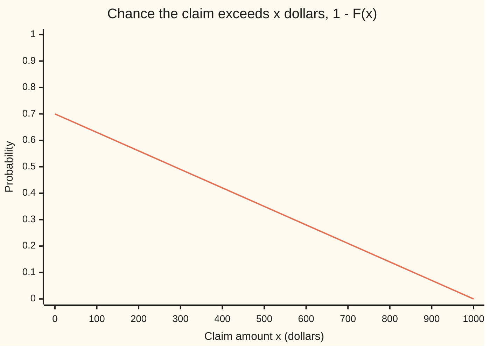
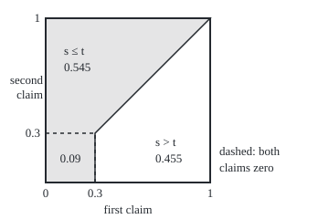

# The Lebesgue-Stieltjes integral: integrate against any increasing or bounded-variation function, so E[g(X)] is the integral of g against F, with integration by parts

[Syllabus](../../../SYLLABUS.md) → [Measure and integration](../README.md) → [Derivatives Meet the Lebesgue Integral](../README.md#s11) → The Lebesgue-Stieltjes integral

---

## General Overview

A household insurer prices one policy for next year. With probability 0.3 there is no claim, and the payout is \$0. Otherwise the payout is spread evenly over \$0 to \$1,000. This is the claim of [Distribution functions and Lebesgue-Stieltjes measures](../02-Length%20Done%20Properly/06-lebesgue-stieltjes-measures.md), and its running total, the chance the payout is at most x dollars, is already known: 0 below zero, a jump to 0.3 at zero, then a straight climb to 1 at \$1,000.

The pricing team wants two averages: the expected payout, and the expected cost when every policy also carries a \$50 handling fee, claim or no claim. A density (a curve whose area gives probability) sees the even spread but misses the 0.3 on \$0, and prices the fee case at \$385. A list of point probabilities misses the spread. The answers are \$350 and \$400.

The fix is to average against the running total itself. A jump gives its point a weight equal to the jump. A smooth climb gives a stretch its slope times its width. Integration by parts, with one extra term for jumps, then turns the average payout into the area under the chance of exceeding each amount: \$350 again.

**Integrating a function g against a running total F averages g with the weight F lays down: a jump contributes g at that point times the jump's height, a smooth climb contributes g times the slope of F, and when F is the distribution function of a random quantity X the result is the average of g(X).**

**What kind of fact this is:** the integral against F is a definition; its reduction to jumps plus a density, its equality with E[g(X)], integration by parts with the jump term, and its agreement with Riemann-Stieltjes sums are theorems, proved on this card in Why it works.

### The picture: the tail whose area is the expected payout



One line: the tail, the chance the claim is larger than x. It starts at 0.70, not 1, because a \$0 claim is not larger than \$0. The area under it is a triangle, half of 0.70 times 1,000: \$350, the expected payout.

---

## The formula

Notation first, in words. F is a **right-continuous** function: approaching any point from the right lands on the value there. Its **left limit** $F(x-)$ is the value approached from the left, and the **jump** at x is $\Delta F(x) = F(x) - F(x-)$. When F is increasing, $\mu_F$ is its Lebesgue-Stieltjes measure, the measure giving each stretch (a, b] the mass F(b) − F(a) ([Distribution functions and Lebesgue-Stieltjes measures](../02-Length%20Done%20Properly/06-lebesgue-stieltjes-measures.md)). The integral $\int g\,dF$ is read "the integral of g against F".

**The definition.** For F increasing and right-continuous, and g a Borel function (measurable with respect to the Borel sets):

$$\int g\,dF \;=\; \int g\,d\mu_F.$$

For F of **bounded variation** (finite total up-and-down movement on every bounded interval), write $F = F_1 - F_2$ with $F_1$ and $F_2$ increasing and right-continuous, the Jordan decomposition of [Bounded variation](01-functions-of-bounded-variation.md) (its climb and descent inherit right-continuity from F, because the running variation of a right-continuous function is right-continuous: Folland, Section 3.5), and set $\int g\,dF = \int g\,d\mu_{F_1} - \int g\,d\mu_{F_2}$.

**Read it aloud:** integrating against F is integrating against the measure F builds; a function that also falls is split into what it gains minus what it loses.

**Jumps plus a density.** Split F into its **jump part** $F_d$, the sum of the jumps at or below x, and its **continuous part** $F_c = F - F_d$. When $F_c$ is absolutely continuous (it is the running integral of its own slope, [Absolutely continuous functions and the fundamental theorem](04-absolutely-continuous-functions-and-the-fundamental-theorem.md)), with slope $F_c'$:

$$\int g\,dF \;=\; \sum_{x} g(x)\,\Delta F(x) \;+\; \int g(x)\,F_c'(x)\,dx.$$

**Read it aloud:** each jump adds g at the jump times the jump's height, and the smooth part adds the ordinary integral of g times the slope.

**Expectation.** If a random quantity X has distribution function F:

$$E[g(X)] \;=\; \int g\,dF.$$

**Integration by parts.** For F and G right-continuous and of bounded variation on (a, b]:

$$\int_{(a,b]} F\,dG \;+\; \int_{(a,b]} G\,dF \;=\; F(b)\,G(b) - F(a)\,G(a) \;+\; \sum_{a < x \le b} \Delta F(x)\,\Delta G(x).$$

**Read it aloud:** the two integrals add up to the change in the product, plus one correction for every point where both functions jump at once.

**The tail formula.** For X that is never negative and has a finite average:

$$E[X] \;=\; \int_0^\infty \big(1 - F(x)\big)\,dx.$$

**Read it aloud:** the average payout is the area under the chance of exceeding each amount.

On the claim: E[X] = 0.3 × \$0 + ∫ x × 0.0007 dx over (0, 1,000] = \$350, and the tail area is \$350 too.

| Symbol | Plain meaning | In our example | Push it up and the answer… |
| --- | --- | --- | --- |
| $F$ | a right-continuous running total; for a claim, its distribution function | 0.3 at \$0, then rising 0.0007 per dollar | a steeper climb puts more weight there |
| $G$ | a second such function, in integration by parts | F itself, or G(x) = x | — |
| $g$ | the function averaged | the payout x; 50 + x with the fee | a larger g gives a larger integral |
| $\mu_F$ | the measure F builds: mass F(b) − F(a) on (a, b] | mass 0.3 on the single point \$0 | — |
| $F(x-)$, $\Delta F(x)$ | left limit; jump F(x) − F(x−) | F(0−) = 0, ΔF(0) = 0.3 | a taller jump weights that point more |
| $F_d$, $F_c$ | jump part; continuous part F − F_d | 0.3 from \$0 on; 0.0007x on [0, 1,000] | — |
| $F_c'$, $F'$ | slope of the continuous part; slope of F where it exists | 0.0007 per dollar | a steeper slope weights that stretch more |
| $F_1$, $F_2$, $V$ | increasing parts with F = F_1 − F_2; the running variation of $F_c$, used to choose them | for 1 − F: 1 and F | — |
| $X$, $X'$ | the claim; an independent copy of it, the first claim of the pair in Step 4 | E[X] = \$350 | — |
| $E$, $P$, $\lambda$ | average; probability; Lebesgue measure (length) | P(X = 0) = 0.3 | — |
| $a$, $b$, $s$, $t$ | ends of an interval; coordinates on a square of pairs | (−100, 1,000] | — |
| $n$, $h$, $t_i$ | pieces, piece width and tag points of a Riemann-Stieltjes sum | 1,100 pieces of width 1 | more pieces, closer sums |

### When it holds

- **F of bounded variation and right-continuous.** Then F builds a measure, or a difference of two. The function x sin(1/x) near 0 has infinite total variation and builds none.
- **g Borel and integrable.** A g that is never negative always has an integral, possibly infinite; a g of both signs needs the integral of |g| finite, or ∞ − ∞ appears.
- **Jumps plus a density needs an absolutely continuous smooth part.** The Cantor function rises by 1 on a set of length 0: its stage-n pieces have total length (2/3)^n, 0.017342 at stage 10. Its slope is 0 almost everywhere, so the density term gives 0 while the integral of 1 against it over [0, 1] is 1.
- **Integration by parts needs the jump term when both functions jump at the same point.** On the claim, F against itself gives 0.545; the textbook rule without the term gives 0.5.
- **Riemann-Stieltjes sums need g continuous where F jumps.** A g that steps up at \$0 leaves left-tag and right-tag sums 0.3 apart however fine the pieces.

---

## Why it works

### Step 0: a new integrator, not a new integral

The integral against a measure already exists ([The integral of a non-negative function](../04-The%20Lebesgue%20Integral/02-integral-of-a-nonnegative-function.md)). Only the measure is new, so every claim here is proved one way. Check it on half-open intervals (a, b], where μ_F is F(b) − F(a). Two measures that agree there, finite on bounded sets, agree on every Borel set ([Distribution functions and Lebesgue-Stieltjes measures](../02-Length%20Done%20Properly/06-lebesgue-stieltjes-measures.md), part 2). Then climb from indicators (1 on a set, 0 off it) to simple functions, monotone limits and differences.

### Step 1: the definition does not depend on how F is split

Adding one increasing function to both parts gives another splitting. Suppose F_1 − F_2 = F_3 − F_4. Then F_1 + F_4 = F_3 + F_2, both increasing, so their measures agree on every (a, b] and hence everywhere. Integrate g against both and rearrange: the two definitions agree whenever the four integrals are finite. The decreasing tail 1 − F splits as 1, which builds no mass, minus F: integrating against 1 − F is integrating against F with a minus sign.

### Step 2: a jump is a point mass, and a smooth climb is a density

**Jumps.** μ_F puts mass ΔF(x) on the single point x ([Distribution functions and Lebesgue-Stieltjes measures](../02-Length%20Done%20Properly/06-lebesgue-stieltjes-measures.md)). An increasing F has at most countably many jumps, since those inside (a, b] add to at most F(b) − F(a). Integrating g against one point mass returns g at that point, and monotone convergence allows the sum over countably many.

**The smooth part.** Let $F_c$ be absolutely continuous. The fundamental theorem for such functions ([Absolutely continuous functions and the fundamental theorem](04-absolutely-continuous-functions-and-the-fundamental-theorem.md)) says $F_c(b) - F_c(a) = \int_a^b F_c'\,dx$. The right side is the mass the measure "slope times length" gives to (a, b]. So the measure $F_c$ builds and that measure agree on intervals, and by Step 0 everywhere: $F_c'$ is its density against λ ([The Radon-Nikodym theorem](../08-Densities%20and%20Changing%20Measure/03-radon-nikodym-theorem.md)).

**Together.** $F_d$ and $F_c$ add to F, so their measures add to μ_F, and the integral is linear in the measure.

On the claim, the jump is 0.3 at \$0 and the slope 0.0007 on (0, 1,000]. The payout gives 0.3 × \$0 + \$350 = \$350. The fee case, g(x) = 50 + x, gives \$15 + \$385 = \$400. The jump adds nothing to the first only because it sits at \$0.

<details>
<summary>Detailed proof: from indicators to every integrable g</summary>

Take F increasing first. Let ν(A) be the integral of $F_c'$ over A against λ. Step 2 showed that ν and the measure $F_c$ builds agree on every Borel A. That is the claim for g = 1_A.

Both sides are linear in g, so the claim holds for simple functions, finite sums of multiples of indicators. A Borel g that is never negative is the increasing limit of simple functions ([Simple functions](../03-Measurable%20Functions/03-simple-functions-and-approximation.md)), and monotone convergence ([The monotone convergence theorem](../04-The%20Lebesgue%20Integral/03-monotone-convergence-theorem.md)) applies on both sides, since $F_c' \ge 0$. For integrable g, subtract the equalities for its positive and negative parts.

For the jump part: $F_d$ builds the measure giving A the sum of the jumps at points of A, since both give (a, b] the sum of the jumps inside it. For g = 1_A the integral is that sum; linearity, monotone convergence over the list of jumps, and the positive-negative split carry it to every integrable g.

For F of bounded variation, Step 1 lets the split be chosen, and an arbitrary one will not do: adding the Cantor function to both parts leaves F unchanged but gives each part a continuous part that is not absolutely continuous. So split the two parts of F separately. $F_d$ is its rising jumps minus its falling jumps, two increasing jump functions. $F_c = V - (V - F_c)$ with $V$ the running variation of $F_c$; both pieces rise and are absolutely continuous by Lemma 3 of [Absolutely continuous functions and the fundamental theorem](04-absolutely-continuous-functions-and-the-fundamental-theorem.md). Take $F_1$ = rising jumps + $V$ and $F_2$ = falling jumps + $(V - F_c)$. Each is increasing and right-continuous with an absolutely continuous continuous part, so the increasing case applies to each. Subtracting, the jumps give ΔF and the slopes give $F_c'$.

</details>

### Step 3: the average of g(X) is the integral against F

Let X be a random quantity on a probability space with probability P. Its law P∘X^(−1), the chance that X lands in each set, is a measure on the line, and E[g(X)] is the integral of g against it ([The law of a random variable](../03-Measurable%20Functions/05-pushforward-and-the-law.md)). The law gives (a, b] the mass F(b) − F(a), so it is μ_F, and E[g(X)] = ∫ g dF.

Wing 09 averages by a sum for a discrete law and by a density for a continuous one ([Densities](../../09-Probability%20and%20statistics/04-Continuous%20Distributions/01-densities-and-cdfs.md)); Step 2 makes them two halves of one integral.

### Step 4: integration by parts is the area of a square, cut along its diagonal

Take two independent claims, the first s and the second t; the pairs fill a square. The chances of s ≤ t and of s > t add to 1. Fix t: the chance the first claim is at most t is F(t), and averaging over t gives ∫ F dF, which is P(X′ ≤ X) with X′ the first claim. Fix s: the chance the second is strictly below s is the left limit F(s−), and averaging gives ∫ F(s−) dF(s). So

$$\int F\,dF + \int F(s-)\,dF(s) = 1.$$

The integrands differ only at the jump, by ΔF(0) = 0.3, which carries mass 0.3. So the integrals differ by 0.09, and ∫ F dF = (1 + 0.09)/2 = 0.545. Without the jump it would be 1/2. The picture draws the square in probability units, so each region's area is its chance.

<p align="center"></p>

To scale: 180 drawing units per unit of F, corner (0, 0) at (50, 200) and (1, 1) at (230, 20). Each axis is a claim's probability position, the uniform draw the code turns into a claim: above 0.3 it is F at the claim, and the \$0 claims, all with F(0) = 0.3, fill 0 to 0.3 on each axis. The dashed block, both claims \$0, has area 0.09 and lies on the diagonal s = t, so it is shaded. The strip above it has 0.21, the triangle above the diagonal 0.245: 0.545 in all. The general formula is the same cut with two functions, each half measured by Tonelli's theorem ([Tonelli and Fubini](../06-Product%20Measures%20and%20Fubini/03-tonelli-and-fubini.md)).

<details>
<summary>Detailed proof: integration by parts with the jump term</summary>

**Increasing case.** Let F and G be increasing and right-continuous, with μ_F and μ_G restricted to (a, b], where both are finite. On S = (a, b] × (a, b] take the product measure μ_F ⊗ μ_G, and split S into D1, where s ≤ t, and D2, where s > t.

In D1 the s-section at t is (a, t], of mass F(t) − F(a); by Tonelli, D1 has mass ∫ F dG − F(a)(G(b) − G(a)). In D2 the t-section at s is (a, s), open at s, of mass G(s−) − G(a); D2 has mass ∫ G(s−) dF(s) − G(a)(F(b) − F(a)).

The two add to the mass of S, (F(b) − F(a))(G(b) − G(a)). Expanding and cancelling:

$$\int_{(a,b]} F\,dG + \int_{(a,b]} G(s-)\,dF(s) = F(b)G(b) - F(a)G(a).$$

Now G(s−) = G(s) − ΔG(s), and ΔG is zero off the countably many jumps of G, so by Step 2 its integral against F is the sum of ΔG(x) ΔF(x). Substituting gives the formula with the jump term.

**Bounded variation.** Write F = F_1 − F_2 and G = G_1 − G_2, all increasing and right-continuous. Every term of the formula is linear in F for fixed G and in G for fixed F, and every integral is finite on (a, b]. Apply the increasing case to the four pairs and add with signs. If either function is continuous, the jump sum is empty: the classical rule, used with G(x) = x for the tail.

</details>

### Step 5: the tail formula is integration by parts against x

Apply Step 4 with G(x) = x, which has no jumps, on (0, b]. It gives ∫ x dF over (0, b] plus the integral of F from 0 to b equals bF(b). Rearranged:

$$\int_{(0,b]} x\,dF(x) \;=\; \int_0^b \big(1 - F(x)\big)\,dx \;-\; b\,\big(1 - F(b)\big).$$

The last term is the **boundary term**. On the claim at b = \$500: \$87.500 on the left, tail area \$262.500, boundary term 500 × 0.35 = \$175.000. At b = \$1,000 the boundary term is 0 and both sides are \$350.000, which is E[X], since the atom at \$0 adds nothing.

For general X, never negative with finite average, let b grow. The left side rises to E[X] by monotone convergence. The boundary term b P(X > b) is at most the average of X over the event X > b, which shrinks to 0 by dominated convergence. [The layer-cake formula](../06-Product%20Measures%20and%20Fubini/06-layer-cake-and-tail-integrals.md) reaches the same formula by Tonelli, infinite case included.

### Step 6: Riemann-Stieltjes sums converge to this integral when g is continuous

A **Riemann-Stieltjes sum** cuts (a, b] into n pieces, picks a tag point $t_i$ in each, and adds g at the tag times the rise of F across the piece ([Stieltjes integrals](../../06-Calculus%20and%20analysis/08-Multiple%20Integrals/06-riemann-stieltjes-integral.md)). That sum is the integral against μ_F of a step function, g at the tag on each piece. A continuous g on [a, b] is uniformly continuous ([Uniform continuity](../../06-Calculus%20and%20analysis/01-Limits%20and%20Continuity/08-uniform-continuity-and-lipschitz.md)), so on narrow pieces the step function stays within any chosen distance of g, and the integrals differ by at most that distance times F(b) − F(a) (for increasing F; the total variation otherwise).

On the claim, with g(x) = x on (−100, 1,000], so the jump at 0 is inside: left tags give 285, 343.5, 349.35 at 11, 110 and 1,100 pieces; right tags give 385, 353.5, 350.35. Both close in on 350; F's jump does no harm where g is continuous.

Now let g step from 0 to 1 at \$0. The piece ending at 0 carries the jump's 0.3, with g = 0 at its left end and 1 at its right. On every grid with a point at \$0, left tags give 0.7 and right tags 1.0. The Lebesgue-Stieltjes integral is the mass of [0, ∞): 1.

---

## Worked numbers, by hand

The claim: 0.3 on \$0, then density 0.0007 per dollar on (0, 1,000].

| Step | Arithmetic | Value |
| --- | --- | --- |
| jump part of E[X] | 0.3 × \$0 | \$0 |
| spread part | 0.0007 × 1,000^2 / 2 | \$350 |
| **E[X]** | 0 + 350 | **\$350** |
| fee case, jump part | 0.3 × \$50 | \$15 |
| fee case, spread part | 0.0007 × (50 × 1,000 + 1,000^2 / 2) | \$385 |
| **E[50 + X]** | 15 + 385 | **\$400** |
| tail area | half of 0.70 × 1,000 | **\$350** |
| by parts on (0, 500] | 262.5 − 500 × 0.35 | \$87.5 |
| F against F, directly | 0.09 + 0.21 + 0.245 | 0.545 |
| F against F, by parts | (1 × 1 − 0 × 0 + 0.3 × 0.3) / 2 | **0.545** |

The policy costs \$350 in claims, \$400 with the fee; a first claim is at most a second, ties included, with chance 0.545.

### What breaks if you drop a piece

| Mistake | Comes out at | What went wrong |
| --- | --- | --- |
| Density only, fee case | \$385, not \$400 | the 0.3 on \$0 still pays the \$50 fee |
| Density 0.001 with no 0.7 weight | \$500, not \$350 | the spread holds only 0.7 of the mass |
| By parts without the jump term | 0.5, not 0.545 | F jumps at the same point as itself |
| Riemann-Stieltjes with g stepping at \$0 | 0.7 or 1.0 on every grid through \$0 | g and F jump together |
| F in place of 1 − F | \$650, not \$350 | that is the area above the tail, 1,000 − 350 |
| Boundary term dropped at b = \$500 | \$262.5, not \$87.5 | 500 × 0.35 of tail area belongs to claims above \$500 |

The code prints all six.

---

## Code, from first principles, and it actually runs

The expected payout is reached by four roads that share no arithmetic: jump plus density in exact fractions, midpoint sums under the tail 1 − F, Riemann-Stieltjes sums with left and right tags, and 100,000 claims drawn from a SplitMix64 generator written out in both languages. Integration by parts is checked by computing ∫ F dF directly, by the formula with the jump term, and by 100,000 simulated pairs. The code checks these instances; the proofs cover every F and g. Rust does its exact fractions with a small type written by hand.

### Python

```python
# The Lebesgue-Stieltjes integral -- the check behind the card.  Standard
# library only; fractions does exact arithmetic and knows no integrals.  The
# claim X: 0 with probability 0.3, otherwise spread evenly over (0, 1000].
# E[X] is reached four ways: jump plus density (exact), the tail 1 - F
# (midpoint sums), Riemann-Stieltjes sums, and a SplitMix64 simulation.
from fractions import Fraction as Q

P0, DENS, TOP = Q(3, 10), Q(7, 10000), 1000     # jump at 0, density, top of the range

def F(x):                                       # distribution function, in floats
    return 0.0 if x < 0 else (0.3 + 0.0007 * x if x < 1000 else 1.0)

def mono(k, lo, hi):                            # exact integral of x^k from lo to hi
    return Q(hi ** (k + 1) - lo ** (k + 1), k + 1)

def rs_sums(g, n, a=-100.0, b=1000.0):          # left-tag and right-tag Stieltjes sums
    h = (b - a) / n
    left = right = 0.0
    for i in range(n):
        x0, x1 = a + i * h, a + (i + 1) * h
        rise = F(x1) - F(x0)
        left += g(x0) * rise
        right += g(x1) * rise
    return left, right

MASK = (1 << 64) - 1
state = 20260929
def uniform():                                  # SplitMix64, top 53 bits in [0, 1)
    global state
    state = (state + 0x9E3779B97F4A7C15) & MASK
    z = state
    z = ((z ^ (z >> 30)) * 0xBF58476D1CE4E5B9) & MASK
    z = ((z ^ (z >> 27)) * 0x94D049BB133111EB) & MASK
    return ((z ^ (z >> 31)) >> 11) / 9007199254740992.0

def claim():                                    # inverse of F: a draw of X
    u = uniform()
    return 0.0 if u < 0.3 else (u - 0.3) / 0.7 * 1000.0

def mid(fn, lo, hi, n):                         # midpoint sum of fn over (lo, hi]
    h, total = (hi - lo) / n, 0.0
    for i in range(n):                          # a plain loop: sum() compensates
        total += fn(lo + (i + 0.5) * h) * h
    return total

def mid_tail(lo, hi, n):                        # the area under the tail 1 - F
    return mid(lambda x: 1.0 - F(x), lo, hi, n)

# road 1: jump plus density, exact
jump_x, spread_x = P0 * 0, DENS * mono(1, 0, TOP)
ex = jump_x + spread_x
jump_fee, spread_fee = P0 * 50, DENS * (50 * mono(0, 0, TOP) + mono(1, 0, TOP))
print("claim law: P(X = 0) = 0.3; otherwise even on (0, 1000], density 0.0007")
print(f"road 1, jump plus density, exact: E[X] = {float(jump_x):.1f} + {float(spread_x):.1f} = {float(ex):.1f}")
print(f"road 1, with a $50 fee on every policy: E[50 + X] = {float(jump_fee):.1f} + "
      f"{float(spread_fee):.1f} = {float(jump_fee + spread_fee):.1f}")
# road 2: the tail
tail = mid_tail(0.0, 1000.0, 1000)
print(f"road 2, area under the tail 1 - F on (0, 1000], 1000 midpoint slices: {tail:.6f}")
print("tail 1 - F(x) at x = 0, 100, ..., 1000: " + " ".join(f"{1 - F(100 * k):.2f}" for k in range(11)))
parts = {}
for b in (250, 500, 1000):
    lhs = DENS * mono(1, 0, b)                  # exact: integral of x dF over (0, b]
    area, edge = mid_tail(0.0, float(b), b), b * (1.0 - F(b))
    parts[b] = (lhs, area, edge)
    print(f"by parts on (0, {b}]: int x dF = {float(lhs):.3f}; tail area {area:.3f} "
          f"- boundary {edge:.3f} = {area - edge:.3f}")
# road 3: Riemann-Stieltjes sums, g(x) = x, continuous
print("road 3, Riemann-Stieltjes sums for E[X] on (-100, 1000]:")
rs = {}
for n in (11, 110, 1100):
    rs[n] = rs_sums(lambda x: x, n)
    print(f"  n = {n:<5} left tags {rs[n][0]:.4f}   right tags {rs[n][1]:.4f}")
# road 4: simulation
N = 100000
draws = [claim() for _ in range(N)]
total = sq = 0.0
for d in draws:
    total += d
mean = total / N
for d in draws:
    sq += (d - mean) * (d - mean)
var = sq / (N - 1)
se = (var / N) ** 0.5
print(f"road 4, {N} simulated claims, SplitMix64 seed 20260929: mean {mean:.4f}, standard error {se:.4f}")
# integration by parts: F against itself on (-100, 1000]
jumpsq = P0 * P0                                # F(0) times the jump 0.3
strip = P0 * DENS * mono(0, 0, TOP)             # the constant 0.3 of F, against the spread
tri = DENS * DENS * mono(1, 0, TOP)             # the rising part of F, against the spread
direct = jumpsq + strip + tri
Fa, Fb = Q(F(-100.0)), Q(F(1000.0))            # F at the two ends: 0 and 1
formula = (Fb * Fb - Fa * Fa + P0 * P0) / 2     # (F(b)G(b) - F(a)G(a) + jump x jump) / 2
leftlim = 0 * P0 + strip + tri                  # F(0-) = 0 at the atom
print("integration by parts, F against itself on (-100, 1000]:")
print(f"  direct: jump {float(jumpsq):.3f} + strip {float(strip):.3f} + triangle {float(tri):.3f} = {float(direct):.3f}")
print(f"  by parts with the jump term: (1 - 0 + 0.3 x 0.3) / 2 = {float(formula):.3f}")
print(f"  left-limit form: int F(x-) dF = {float(leftlim):.3f}; sum with {float(direct):.3f} = {float(leftlim + direct):.3f}")
pairs = sum(1 for _ in range(N) if claim() <= claim()) / N
pse = (pairs * (1 - pairs) / N) ** 0.5
print(f"  simulation: share of {N} pairs with X' <= X: {pairs:.4f}, standard error {pse:.4f}")
# what breaks
print("mistakes:")
print(f"  density only, fee case: {float(spread_fee):.1f} (true {float(jump_fee + spread_fee):.1f})")
print(f"  by parts without the jump term: {float(Q(1, 2)):.3f} (true {float(direct):.3f})")
step = lambda x: 1.0 if x >= 0 else 0.0         # g = 1 on [0, infinity): jumps where F jumps
bad = {n: rs_sums(step, n) for n in (11, 110, 1100)}
print("  Riemann-Stieltjes, g = 1 on [0, inf), n = 11, 110, 1100: left "
      + " ".join(f"{l:.4f}" for l, r in bad.values()) + ", right "
      + " ".join(f"{r:.4f}" for l, r in bad.values()) + "; Lebesgue-Stieltjes 1.0")
print(f"  F in place of 1 - F: {mid(F, 0.0, 1000.0, 1000):.1f} (true {float(ex):.1f})")
print(f"  density 0.001 with no 0.7 weight: {float(Q(1, 1000) * mono(1, 0, TOP)):.1f}")
lhs, area, edge = parts[500]
print(f"  boundary term dropped at b = 500: {area:.1f} (true {float(lhs):.1f})")
print("Cantor function: rise 1; length where it can rise, (2/3)^n at n = 1, 5, 10, 20: "
      + " ".join(f"{(2 / 3) ** n:.6f}" for n in (1, 5, 10, 20)))
px = lambda u: 50 + 180 * u                     # F-coordinates to drawing units
py = lambda v: 200 - 180 * v
print(f"figure, 180 units per unit of F, corner ({px(0):.0f}, {py(0):.0f}); atom block to "
      f"({px(0.3):.0f}, {py(0.3):.0f}); diagonal to ({px(1):.0f}, {py(1):.0f}); "
      f"shaded area {float(direct):.3f}, unshaded {1 - float(direct):.3f}")
assert abs(tail - float(ex)) < 1e-6                         # tail road meets the exact road
assert all(rs[n][0] < float(ex) < rs[n][1] for n in rs)     # Stieltjes sums bracket 350
assert rs[1100][1] - rs[1100][0] < 1.01                     # and close in on it
assert direct == formula                                    # measure road = by-parts road
assert leftlim + direct == 1                                # the square: s <= t plus s > t
assert abs(mean - float(ex)) < 4 * se                       # simulation, within 4 errors
assert abs(pairs - float(direct)) < 4 * pse
assert abs(float(lhs) - (area - edge)) < 1e-6               # by parts with a boundary
print("ALL CHECKS PASS")
```

**Ran 2026-09-29 on macOS, Python 3.14.6, standard library only. All checks passed. Output, pasted from the run:**

```
claim law: P(X = 0) = 0.3; otherwise even on (0, 1000], density 0.0007
road 1, jump plus density, exact: E[X] = 0.0 + 350.0 = 350.0
road 1, with a $50 fee on every policy: E[50 + X] = 15.0 + 385.0 = 400.0
road 2, area under the tail 1 - F on (0, 1000], 1000 midpoint slices: 350.000000
tail 1 - F(x) at x = 0, 100, ..., 1000: 0.70 0.63 0.56 0.49 0.42 0.35 0.28 0.21 0.14 0.07 0.00
by parts on (0, 250]: int x dF = 21.875; tail area 153.125 - boundary 131.250 = 21.875
by parts on (0, 500]: int x dF = 87.500; tail area 262.500 - boundary 175.000 = 87.500
by parts on (0, 1000]: int x dF = 350.000; tail area 350.000 - boundary 0.000 = 350.000
road 3, Riemann-Stieltjes sums for E[X] on (-100, 1000]:
  n = 11    left tags 285.0000   right tags 385.0000
  n = 110   left tags 343.5000   right tags 353.5000
  n = 1100  left tags 349.3500   right tags 350.3500
road 4, 100000 simulated claims, SplitMix64 seed 20260929: mean 351.1338, standard error 1.0555
integration by parts, F against itself on (-100, 1000]:
  direct: jump 0.090 + strip 0.210 + triangle 0.245 = 0.545
  by parts with the jump term: (1 - 0 + 0.3 x 0.3) / 2 = 0.545
  left-limit form: int F(x-) dF = 0.455; sum with 0.545 = 1.000
  simulation: share of 100000 pairs with X' <= X: 0.5443, standard error 0.0016
mistakes:
  density only, fee case: 385.0 (true 400.0)
  by parts without the jump term: 0.500 (true 0.545)
  Riemann-Stieltjes, g = 1 on [0, inf), n = 11, 110, 1100: left 0.7000 0.7000 0.7000, right 1.0000 1.0000 1.0000; Lebesgue-Stieltjes 1.0
  F in place of 1 - F: 650.0 (true 350.0)
  density 0.001 with no 0.7 weight: 500.0
  boundary term dropped at b = 500: 262.5 (true 87.5)
Cantor function: rise 1; length where it can rise, (2/3)^n at n = 1, 5, 10, 20: 0.666667 0.131687 0.017342 0.000301
figure, 180 units per unit of F, corner (50, 200); atom block to (104, 146); diagonal to (230, 20); shaded area 0.545, unshaded 0.455
ALL CHECKS PASS
```

### Rust

Same numbers, same labels, built with `rustc --edition 2021 -O`.

```rust
// The Lebesgue-Stieltjes integral -- the same check as the Python, in Rust.
// No crates.  Exact fractions are a small struct written here.  The claim X:
// 0 with probability 0.3, otherwise spread evenly over (0, 1000].  E[X] is
// reached four ways: jump plus density (exact), the tail 1 - F (midpoint
// sums), Riemann-Stieltjes sums, and a SplitMix64 simulation.
#[derive(Clone, Copy, PartialEq, Debug)]
struct Q { n: i128, d: i128 }                     // an exact fraction n / d, d > 0
fn gcd(a: i128, b: i128) -> i128 { if b == 0 { a.abs() } else { gcd(b, a % b) } }
fn q(n: i128, d: i128) -> Q { let g = gcd(n, d).max(1); Q { n: n / g, d: d / g } }
fn add(a: Q, b: Q) -> Q { q(a.n * b.d + b.n * a.d, a.d * b.d) }
fn sub(a: Q, b: Q) -> Q { q(a.n * b.d - b.n * a.d, a.d * b.d) }
fn mul(a: Q, b: Q) -> Q { q(a.n * b.n, a.d * b.d) }
fn fl(a: Q) -> f64 { a.n as f64 / a.d as f64 }
fn mono(k: u32, lo: i128, hi: i128) -> Q {        // exact integral of x^k from lo to hi
    q(hi.pow(k + 1) - lo.pow(k + 1), (k + 1) as i128)
}
fn f_cdf(x: f64) -> f64 {                         // distribution function, in floats
    if x < 0.0 { 0.0 } else if x < 1000.0 { 0.3 + 0.0007 * x } else { 1.0 }
}
fn rs_sums(g: &dyn Fn(f64) -> f64, n: usize) -> (f64, f64) {   // left and right tags
    let (a, b) = (-100.0, 1000.0);
    let h = (b - a) / n as f64;
    let (mut left, mut right) = (0.0, 0.0);
    for i in 0..n {
        let (x0, x1) = (a + i as f64 * h, a + (i + 1) as f64 * h);
        let rise = f_cdf(x1) - f_cdf(x0);
        left += g(x0) * rise;
        right += g(x1) * rise;
    }
    (left, right)
}
struct Rng(u64);
impl Rng {
    fn uniform(&mut self) -> f64 {                // SplitMix64, top 53 bits in [0, 1)
        self.0 = self.0.wrapping_add(0x9E3779B97F4A7C15);
        let mut z = self.0;
        z = (z ^ (z >> 30)).wrapping_mul(0xBF58476D1CE4E5B9);
        z = (z ^ (z >> 27)).wrapping_mul(0x94D049BB133111EB);
        ((z ^ (z >> 31)) >> 11) as f64 / 9007199254740992.0
    }
    fn claim(&mut self) -> f64 {                  // inverse of F: a draw of X
        let u = self.uniform();
        if u < 0.3 { 0.0 } else { (u - 0.3) / 0.7 * 1000.0 }
    }
}
fn mid(fnc: &dyn Fn(f64) -> f64, lo: f64, hi: f64, n: usize) -> f64 {  // midpoint sum
    let h = (hi - lo) / n as f64;
    let mut total = 0.0;
    for i in 0..n { total += fnc(lo + (i as f64 + 0.5) * h) * h; }
    total
}
fn mid_tail(lo: f64, hi: f64, n: usize) -> f64 { mid(&|x| 1.0 - f_cdf(x), lo, hi, n) }
fn main() {
    let (p0, dens, top) = (q(3, 10), q(7, 10000), 1000i128);
    // road 1: jump plus density, exact
    let (jump_x, spread_x) = (mul(p0, q(0, 1)), mul(dens, mono(1, 0, top)));
    let ex = add(jump_x, spread_x);
    let jump_fee = mul(p0, q(50, 1));
    let spread_fee = mul(dens, add(mul(q(50, 1), mono(0, 0, top)), mono(1, 0, top)));
    println!("claim law: P(X = 0) = 0.3; otherwise even on (0, 1000], density 0.0007");
    println!("road 1, jump plus density, exact: E[X] = {:.1} + {:.1} = {:.1}", fl(jump_x), fl(spread_x), fl(ex));
    println!("road 1, with a $50 fee on every policy: E[50 + X] = {:.1} + {:.1} = {:.1}",
             fl(jump_fee), fl(spread_fee), fl(add(jump_fee, spread_fee)));
    // road 2: the tail
    let tail = mid_tail(0.0, 1000.0, 1000);
    println!("road 2, area under the tail 1 - F on (0, 1000], 1000 midpoint slices: {:.6}", tail);
    let tl: Vec<String> = (0..11).map(|k| format!("{:.2}", 1.0 - f_cdf(100.0 * k as f64))).collect();
    println!("tail 1 - F(x) at x = 0, 100, ..., 1000: {}", tl.join(" "));
    let mut parts = Vec::new();
    for b in [250i128, 500, 1000] {
        let lhs = mul(dens, mono(1, 0, b));       // exact: integral of x dF over (0, b]
        let (area, edge) = (mid_tail(0.0, b as f64, b as usize), b as f64 * (1.0 - f_cdf(b as f64)));
        parts.push((b, lhs, area, edge));
        println!("by parts on (0, {}]: int x dF = {:.3}; tail area {:.3} - boundary {:.3} = {:.3}",
                 b, fl(lhs), area, edge, area - edge);
    }
    // road 3: Riemann-Stieltjes sums, g(x) = x, continuous
    println!("road 3, Riemann-Stieltjes sums for E[X] on (-100, 1000]:");
    let mut rs = Vec::new();
    for n in [11usize, 110, 1100] {
        let (l, r) = rs_sums(&|x| x, n);
        rs.push((l, r));
        println!("  n = {:<5} left tags {:.4}   right tags {:.4}", n, l, r);
    }
    // road 4: simulation
    let big_n = 100000usize;
    let mut rng = Rng(20260929);
    let draws: Vec<f64> = (0..big_n).map(|_| rng.claim()).collect();
    let mut total = 0.0;
    for d in &draws { total += d; }
    let mean = total / big_n as f64;
    let mut sq = 0.0;
    for d in &draws { sq += (d - mean) * (d - mean); }
    let se = (sq / (big_n - 1) as f64 / big_n as f64).sqrt();
    println!("road 4, {} simulated claims, SplitMix64 seed 20260929: mean {:.4}, standard error {:.4}", big_n, mean, se);
    // integration by parts: F against itself on (-100, 1000]
    let jumpsq = mul(p0, p0);                     // F(0) times the jump 0.3
    let strip = mul(mul(p0, dens), mono(0, 0, top));   // the constant 0.3 of F, against the spread
    let tri = mul(mul(dens, dens), mono(1, 0, top));   // the rising part of F, against the spread
    let direct = add(add(jumpsq, strip), tri);
    let (fa, fb) = (q(f_cdf(-100.0) as i128, 1), q(f_cdf(1000.0) as i128, 1));   // 0 and 1
    let formula = mul(add(sub(mul(fb, fb), mul(fa, fa)), mul(p0, p0)), q(1, 2));
    let leftlim = add(add(mul(q(0, 1), p0), strip), tri);   // F(0-) = 0 at the atom
    println!("integration by parts, F against itself on (-100, 1000]:");
    println!("  direct: jump {:.3} + strip {:.3} + triangle {:.3} = {:.3}", fl(jumpsq), fl(strip), fl(tri), fl(direct));
    println!("  by parts with the jump term: (1 - 0 + 0.3 x 0.3) / 2 = {:.3}", fl(formula));
    println!("  left-limit form: int F(x-) dF = {:.3}; sum with {:.3} = {:.3}", fl(leftlim), fl(direct), fl(add(leftlim, direct)));
    let mut hits = 0usize;
    for _ in 0..big_n { let a = rng.claim(); let b = rng.claim(); if a <= b { hits += 1; } }
    let pairs = hits as f64 / big_n as f64;
    let pse = (pairs * (1.0 - pairs) / big_n as f64).sqrt();
    println!("  simulation: share of {} pairs with X' <= X: {:.4}, standard error {:.4}", big_n, pairs, pse);
    // what breaks
    println!("mistakes:");
    println!("  density only, fee case: {:.1} (true {:.1})", fl(spread_fee), fl(add(jump_fee, spread_fee)));
    println!("  by parts without the jump term: {:.3} (true {:.3})", fl(q(1, 2)), fl(direct));
    let step = |x: f64| if x >= 0.0 { 1.0 } else { 0.0 };   // jumps where F jumps
    let bad: Vec<(f64, f64)> = [11usize, 110, 1100].iter().map(|&n| rs_sums(&step, n)).collect();
    let bl: Vec<String> = bad.iter().map(|p| format!("{:.4}", p.0)).collect();
    let br: Vec<String> = bad.iter().map(|p| format!("{:.4}", p.1)).collect();
    println!("  Riemann-Stieltjes, g = 1 on [0, inf), n = 11, 110, 1100: left {}, right {}; Lebesgue-Stieltjes 1.0",
             bl.join(" "), br.join(" "));
    println!("  F in place of 1 - F: {:.1} (true {:.1})", mid(&f_cdf, 0.0, 1000.0, 1000), fl(ex));
    println!("  density 0.001 with no 0.7 weight: {:.1}", fl(mul(q(1, 1000), mono(1, 0, top))));
    let (_, lhs, area, edge) = parts[1];
    println!("  boundary term dropped at b = 500: {:.1} (true {:.1})", area, fl(lhs));
    let cs: Vec<String> = [1, 5, 10, 20].iter().map(|&n| format!("{:.6}", (2.0f64 / 3.0).powi(n))).collect();
    println!("Cantor function: rise 1; length where it can rise, (2/3)^n at n = 1, 5, 10, 20: {}", cs.join(" "));
    let px = |u: f64| 50.0 + 180.0 * u;           // F-coordinates to drawing units
    let py = |v: f64| 200.0 - 180.0 * v;
    println!("figure, 180 units per unit of F, corner ({:.0}, {:.0}); atom block to ({:.0}, {:.0}); diagonal to ({:.0}, {:.0}); shaded area {:.3}, unshaded {:.3}",
             px(0.0), py(0.0), px(0.3), py(0.3), px(1.0), py(1.0), fl(direct), 1.0 - fl(direct));
    assert!((tail - fl(ex)).abs() < 1e-6);                        // tail road meets the exact road
    assert!(rs.iter().all(|&(l, r)| l < fl(ex) && fl(ex) < r));   // Stieltjes sums bracket 350
    assert!(rs[2].1 - rs[2].0 < 1.01);                            // and close in on it
    assert!(direct == formula);                                   // measure road = by-parts road
    assert!(add(leftlim, direct) == q(1, 1));                     // the square: s <= t plus s > t
    assert!((mean - fl(ex)).abs() < 4.0 * se);                    // simulation, within 4 errors
    assert!((pairs - fl(direct)).abs() < 4.0 * pse);
    assert!((fl(lhs) - (area - edge)).abs() < 1e-6);              // by parts with a boundary
    println!("ALL CHECKS PASS");
}
```

**Ran 2026-09-29 on macOS, rustc 1.98.1, no crates. All checks passed. Output, pasted from the run:**

```
claim law: P(X = 0) = 0.3; otherwise even on (0, 1000], density 0.0007
road 1, jump plus density, exact: E[X] = 0.0 + 350.0 = 350.0
road 1, with a $50 fee on every policy: E[50 + X] = 15.0 + 385.0 = 400.0
road 2, area under the tail 1 - F on (0, 1000], 1000 midpoint slices: 350.000000
tail 1 - F(x) at x = 0, 100, ..., 1000: 0.70 0.63 0.56 0.49 0.42 0.35 0.28 0.21 0.14 0.07 0.00
by parts on (0, 250]: int x dF = 21.875; tail area 153.125 - boundary 131.250 = 21.875
by parts on (0, 500]: int x dF = 87.500; tail area 262.500 - boundary 175.000 = 87.500
by parts on (0, 1000]: int x dF = 350.000; tail area 350.000 - boundary 0.000 = 350.000
road 3, Riemann-Stieltjes sums for E[X] on (-100, 1000]:
  n = 11    left tags 285.0000   right tags 385.0000
  n = 110   left tags 343.5000   right tags 353.5000
  n = 1100  left tags 349.3500   right tags 350.3500
road 4, 100000 simulated claims, SplitMix64 seed 20260929: mean 351.1338, standard error 1.0555
integration by parts, F against itself on (-100, 1000]:
  direct: jump 0.090 + strip 0.210 + triangle 0.245 = 0.545
  by parts with the jump term: (1 - 0 + 0.3 x 0.3) / 2 = 0.545
  left-limit form: int F(x-) dF = 0.455; sum with 0.545 = 1.000
  simulation: share of 100000 pairs with X' <= X: 0.5443, standard error 0.0016
mistakes:
  density only, fee case: 385.0 (true 400.0)
  by parts without the jump term: 0.500 (true 0.545)
  Riemann-Stieltjes, g = 1 on [0, inf), n = 11, 110, 1100: left 0.7000 0.7000 0.7000, right 1.0000 1.0000 1.0000; Lebesgue-Stieltjes 1.0
  F in place of 1 - F: 650.0 (true 350.0)
  density 0.001 with no 0.7 weight: 500.0
  boundary term dropped at b = 500: 262.5 (true 87.5)
Cantor function: rise 1; length where it can rise, (2/3)^n at n = 1, 5, 10, 20: 0.666667 0.131687 0.017342 0.000301
figure, 180 units per unit of F, corner (50, 200); atom block to (104, 146); diagonal to (230, 20); shaded area 0.545, unshaded 0.455
ALL CHECKS PASS
```

The two outputs match line for line. The simulated mean, \$351.13, sits about one standard error above \$350; the simulated share of pairs, 0.5443, sits within one standard error of 0.545.

> [!TIP]
> **Try changing**
> Guess first, then run it. The asserts are pinned to the claim's numbers, so some changes stop the program.
> - **Drop the jump term.** In `formula`, delete `+ P0 * P0`. It becomes 0.5, the measure road still says 0.545, and the fourth assert stops it.
> - **Forget the 0.7.** Set `DENS` to `Q(1, 1000)`. Road 1 says \$500 while the tail still says \$350, and the first assert stops it.
> - **Move the grid off the jump.** In `rs_sums`, start at `-100.5`. The sums for E[X] still close in on 350. For the stepping g, the left sums creep up toward 0.7 while the right sums stay at 1.0: the gap shrinks to the jump, 0.3, and no further.
> - **Change the seed.** Set `state` to `1`. The simulated numbers move by about one standard error, and every assert passes.

---

## The usual mistake

> [!warning]
> **Integrating g times F instead of g against F.** The weight is the rise of F, not its height. Integrating x times F(x) over (0, 1,000] answers no question about the claim. The average is ∫ x dF: g times the jumps plus g times the slope, \$350.
>
> - **Dropping the atom.** A density alone loses the 0.3 on \$0. The mean survives only because g(0) = 0; the fee case drops from \$400 to \$385.
> - **Classical integration by parts across a shared jump.** ∫ F dF is 0.545 on the claim, not F^2/2 = 0.5. Either add ΔF ΔG at shared jumps or use the left limit in one integrand.
> - **Closed or open ends.** An integral over (a, b] excludes a jump at a. Starting the fee case at 0 instead of below it loses \$15.
> - **Trusting Riemann-Stieltjes sums at a shared jump.** They swing between 0.7 and 1.0 however fine the pieces. The Lebesgue-Stieltjes integral is 1.

---

## Where you meet it in real life

- **Insurance and reinsurance.** A stop-loss layer pays the part of a claim above a retention d. Its price is the tail area beyond d, by the integration by parts of Step 5, atoms or not.
- **Mass on a rod.** A rod with a smooth density and a few bolted-on weights has a running mass total; its balance point is the integral of x against it.
- **Option prices.** A call pays max(x − K, 0); its price is a discounted average against the pricing law of the stock, and by parts it is the discounted area under that law's tail beyond K ([Black–Scholes call](../../12-Financial%20mathematics/08-The%20Black-Scholes%20call%20and%20put/01-black-scholes-call.md)).
- **Paths with jumps.** For two right-continuous paths of bounded variation, the change in their product is F(s−) dG + G(s−) dF, plus ΔF ΔG at shared jumps. Stochastic calculus keeps this shape and adds a correction for paths too rough to have bounded variation.

> **Say it back**
> Integrating against a running total F means integrating against the measure that gives each stretch the rise of F across it. A jump carries g times its height and an absolutely continuous climb carries g times the slope, so the claim's average payout is 0.3 × \$0 + \$350. For the distribution function of X, the integral is E[g(X)]. Integration by parts gains one term, the product of the jumps at every shared jump, and against x it turns E[X] into the area under the tail. Riemann-Stieltjes sums agree when g is continuous and fail when g and F jump together.

---

## What this builds on

- [Absolutely continuous functions and the fundamental theorem](04-absolutely-continuous-functions-and-the-fundamental-theorem.md): F(b) − F(a) is the integral of F′ for an absolutely continuous F, which turns the smooth part into a density.
- [Distribution functions and Lebesgue-Stieltjes measures](../02-Length%20Done%20Properly/06-lebesgue-stieltjes-measures.md): the measure μ_F, jumps as point masses, and uniqueness from half-open intervals.
- [The layer-cake formula](../06-Product%20Measures%20and%20Fubini/06-layer-cake-and-tail-integrals.md): the tail formula by Tonelli, the second road to Step 5.
- [Integration by parts](../../06-Calculus%20and%20analysis/04-Integrals/04-integration-by-parts.md): the classical rule for smooth functions, the case with no jumps.

## Where this goes next

- [Compound Poisson](../../11-Stochastic%20processes%20and%20calculus/04-Poisson%20and%20Jump%20Processes/04-compound-poisson.md): a path that only jumps, whose integrals are sums over its jumps.
- [Quadratic variation](../../11-Stochastic%20processes%20and%20calculus/05-Brownian%20Motion/03-quadratic-variation.md): why a Brownian path has unbounded variation, so no Lebesgue-Stieltjes integral against it exists.
- [The Ito integral](../../11-Stochastic%20processes%20and%20calculus/06-Ito%20Calculus/01-ito-integral.md): an integral against such a path, built from left-tagged sums.
- [Ito's lemma](../../11-Stochastic%20processes%20and%20calculus/06-Ito%20Calculus/02-itos-lemma.md): the product rule again, with a correction term that plays the part ΔF ΔG plays here.

The jump term is finite because a function of bounded variation has summable jumps; what replaces it when a path moves by countless small steps with infinite total variation is the question [Quadratic variation](../../11-Stochastic%20processes%20and%20calculus/05-Brownian%20Motion/03-quadratic-variation.md) answers.

---

## Sources

Verified 29 Sep 2026: every link below resolves to the publisher's page.

- Stieltjes, Thomas Jan. "Recherches sur les fractions continues." *Annales de la Faculté des sciences de Toulouse* 8, no. 4 (1894). [Numdam record](https://www.numdam.org/item/AFST_1894_1_8_4_J1_0/). The memoir that first integrates against an increasing function.
- Folland, Gerald B. *Real Analysis: Modern Techniques and Their Applications*, 2nd ed. Wiley, 1999. [Publisher page](https://www.wiley.com/en-us/Real+Analysis%3A+Modern+Techniques+and+Their+Applications%2C+2nd+Edition-p-9780471317166). Section 3.5: functions of bounded variation, their Lebesgue-Stieltjes measures, and integration by parts.
- Williams, David. *Probability with Martingales*. Cambridge University Press, 1991. [Publisher page](https://www.cambridge.org/highereducation/books/probability-with-martingales/B4CFCE0D08930FB46C6E93E775503926). Chapter 6: an average computed as an integral against the law.
