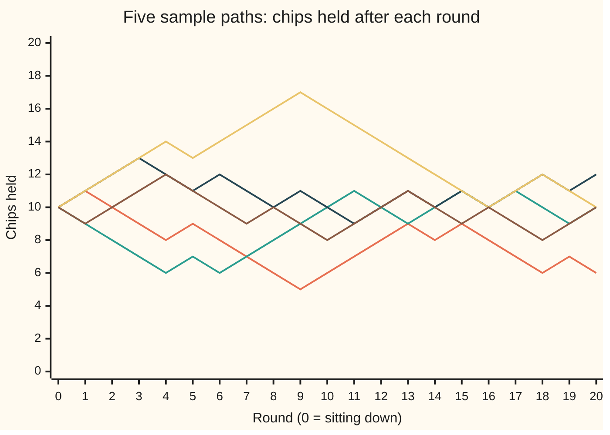
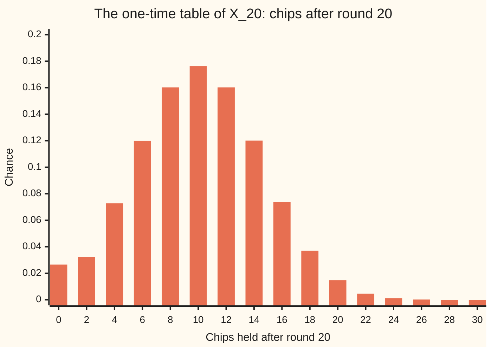

# Stochastic processes: one random variable per time, and a path for each outcome

Stochastic processes and calculus → Random Walks and Filtrations → Chance unfolding in time → Stochastic processes

---

## General Overview

A gambler sits down with 10 chips. Each round a fair coin is tossed. Heads, the house pays one chip. Tails, the gambler pays one. The evening lasts 20 rounds, unless the chips run out first: at 0 chips, play stops.

Before the first toss, the whole evening is uncertain. Its full record is 20 results, such as W L L L W L L…, where W is a win and L a loss. There are 2 × 2 × … × 2 = 2^20 = 1,048,576 such records, all equally likely. One full record is an **outcome**.

Now watch one number, the chip count. Three different questions can be asked about it, and they have three different kinds of answer.

- **"How many chips after round 7?"**, asked before the evening starts, has no single answer. It has a table of chances, for instance exactly 7 chips with chance 0.1641. The chip count after round 7 is a **random variable**: a rule turning each outcome into a number ([random-variables-and-distributions](../../09-Probability%20and%20statistics/02-Random%20Variables/01-random-variables-and-distributions.md)).
- **"What happened on this evening?"**, asked after it ends, has one answer: a list of 21 chip counts, round 0 to round 20. Drawn against time, that list is a **sample path**.
- **"How likely is each whole evening's story?"** is answered by a table of chances over paths. That table is the **law of the process**.

The family of all 21 chip counts, one random variable for each round, is a **stochastic process**: stochastic means random, and a process is a quantity followed through time.

**A stochastic process is one random quantity per time; fixing the time gives a random variable, fixing the outcome gives a path, and the law is the table of chances over whole paths.**

**What kind of fact this is:** a definition. Two consequences, that the law fixes every one-time table and that the one-time tables do not fix the law, are proved on this card in Why it works.

### The picture: five evenings

Five evenings, drawn by a seeded simulation (the generator is SplitMix64, seed 20260929, written out in the code). Each line is one sample path: one outcome, followed through all 20 rounds. A path is a list of values at whole rounds; the straight segments between rounds are only for the eye.



Evening 1 (orange) sags and ends on 6 chips. Evening 2 (teal) dips to 6 and climbs back to 10. Evening 3 (dark blue) ends on 12. Evening 4 (yellow) runs up to 17 and gives it all back. Evening 5 (brown) stays within two chips of 10 and ends there. Five paths are five samples, not the law: none of them shows ruin, which happens on about 2.7% of evenings.

---

## The formula

Notation first, in words. The Greek letter $\omega$ (omega) names one outcome: one full record of 20 results. $X_n$ is the chip count after round $n$; written with the outcome, $X_n(\omega)$ is that count on that evening. The whole family is written $(X_n)$, read "the value at time n", with $n$ running over the rounds 0 to $N$, where $N = 20$ is the last round.

Each round's result is a step of plus or minus one chip, written $\xi_k$ (xi) for round $k$:

$$\xi_k(\omega) = \begin{cases} +1 & \text{if round } k \text{ is won} \\ -1 & \text{if round } k \text{ is lost} \end{cases}$$

The chip count starts at 10 and follows the house rule:

$$X_0 = 10, \qquad X_n = \begin{cases} X_{n-1} + \xi_n & \text{if } X_{n-1} > 0 \\ 0 & \text{if } X_{n-1} = 0 \end{cases} \qquad n = 1, 2, \dots, 20$$

**Read it aloud:** start at 10 chips; each round add the round's result, unless the chips are already gone, in which case stay at nothing.

Until the chips run out, that is the running total $X_n = 10 + \xi_1 + \xi_2 + \dots + \xi_n$.

The three objects are the same function sliced two ways, and then weighed. The arrow $\mapsto$ reads "is sent to":

$$\underbrace{\omega \mapsto X_n(\omega)}_{\text{fix the round: a random variable}} \qquad \underbrace{n \mapsto X_n(\omega)}_{\text{fix the outcome: a path}}$$

$$P_X(A) = P\big(\{\,\omega : (X_0(\omega), X_1(\omega), \dots, X_N(\omega)) \in A\,\}\big)$$

**Read it aloud:** the chance of a set of paths is the chance of the set of outcomes whose path lands in it.

| Symbol | Plain meaning | In our example | Push it up and the answer… |
| --- | --- | --- | --- |
| $\omega$ | one outcome: a full record of results | W L L L W L L L L W W W W L W L L L W L | — |
| $\Omega$ | the set of all outcomes | 1,048,576 records, each with chance 1/1,048,576 | — |
| $n$, $k$ | round numbers; 0 is sitting down | 0 to 20 | — |
| $N$ | the last round | 20 | each extra round doubles the outcomes |
| $\xi_k$ | the result of round $k$: +1 chip or −1 chip | +1 for W, −1 for L | — |
| $X_n$, $X_7$, $X_{20}$ | chips held after round $n$; a random variable | on evening 1, 7 after round 7 | — |
| $x$ | a chip count asked about, as in $P(X_n = x)$ | 7, in $P(X_7 = 7)$ | — |
| $\Gamma$ | the set of all paths some outcome produces | 1,030,558 paths | — |
| $P$ | chance of a set of outcomes | 1/1,048,576 for each record | — |
| $A$, $B$ | sets of paths: the question being asked | "at 11 after round 1 and 12 after round 2" | — |
| $P_X$ | the law of the process: chances over paths | 0.25 for the set $A$ above | — |
| $\mapsto$ | "is sent to": what a rule returns for an input | $n \mapsto X_n(\omega)$, the path of $\omega$ | — |

### When it holds

The definition holds for any family of random variables indexed by time, on one shared set of outcomes. The numbers on this card rest on the gambler's rules:

- **A fair coin.** Change the chance of a win and every table changes; the mean chip count drifts away from 10.
- **Rounds independent of each other.** Without that, the 1,048,576 records are no longer equally likely, and every count on this card must be reweighed.
- **One chip a round, and a stop at 0.** Drop the stop and 0.59% of evenings end below zero chips, which the house does not allow.
- **A finite horizon.** With 20 rounds the law is one finite table. An evening with no last round needs Kolmogorov's extension theorem to build its law (Step 4).

---

## Why it works

### Step 0: one function of two inputs

The chip count depends on two things: which round, and which evening. Write it as a grid, rounds across and outcomes down. A column is a random variable: one round, every evening. A row is a path: one evening, every round. Nothing more is going on. The randomness sits entirely in which row the world picks.

### Step 1: each column is a random variable

$X_n$ is a rule: feed it an outcome, it returns a chip count. So it is a random variable, and its table of chances is found by pooling outcomes. For $X_7$: only the first 7 results matter, giving 2^7 = 128 equally likely patterns. Ending on 7 chips means 2 wins and 5 losses, and there are 21 ways to place 2 wins among 7 rounds. So $P(X_7 = 7)$ = 21/128 = 0.1641. Counting all 1,048,576 full records gives 172,032 with $X_7 = 7$, the same 0.1641.

### Step 2: the rows carry a table of chances of their own

Pool outcomes by the path they produce, and add their chances. That is the law $P_X$. Every outcome lands on exactly one path, so the chances add to 1: the law is a genuine probability table, on paths instead of on numbers.

Outcomes and paths are not the same thing. Once an evening is ruined, the remaining coin tosses leave no trace. So several outcomes share one path. The 1,048,576 outcomes produce 1,030,558 distinct paths.

<details>
<summary>Detailed proof: the law is a probability table, and it fixes every one-time table</summary>

Let $\Gamma$ be the finite set of paths produced by some outcome. For a set $A$ of paths, the outcomes whose path lies in $A$ form an event, since on a finite outcome set every subset is an event. The law is $P_X(A) = P(\{\omega : \text{path of } \omega \in A\})$.

*Total 1.* Every outcome's path lies in $\Gamma$, so $P_X(\Gamma) = P(\Omega) = 1$.

*Adding.* If $A$ and $B$ share no path, no outcome has its path in both, so the two outcome sets are disjoint and $P_X(A \cup B) = P_X(A) + P_X(B)$.

*One-time tables from the law.* The event $X_n = x$ is the event "the path's entry at round $n$ is $x$". So $P(X_n = x) = P_X(\{\text{paths with entry } x \text{ at round } n\})$. The same holds for any finite list of rounds: $P(X_1 = 11, X_2 = 12)$ is the law of the set of paths passing through 11 and then 12.

This is the image of a probability under a map, as in [random-variables-and-distributions](../../09-Probability%20and%20statistics/02-Random%20Variables/01-random-variables-and-distributions.md), with the map returning a list of 21 numbers instead of one.

</details>

### Step 3: the one-time tables do not fix the law

The converse fails. Build a second process with exactly the same 21 one-time tables: each round, throw away the running count and redraw a chip count at random from that round's table, independently of every other round. Column by column, nothing has changed.

Row by row, everything has. For the gambler, $P(X_1 = 11 \text{ and } X_2 = 12)$ = 0.25: the first two rounds must be W W, one pattern in four. For the redrawn process the two rounds are independent, so the chance is the product 0.5 × 0.25 = 0.125. And the gambler's count never moves more than one chip in a round, with chance 1. The redrawn count manages that on all 20 rounds with chance about 1 in 8,000,415.

The one-time tables say where the process tends to be at each moment. They say nothing about how one moment is tied to the next. That tie lives only in the law.

### Step 4: the joint tables are the whole law

With 20 rounds, the law is the joint table of $(X_0, X_1, \dots, X_{20})$, and the tables for smaller lists of rounds are sums over it. These are the **finite-dimensional distributions**: the joint tables for every finite list of times.

For an evening with no last round, there is no single finite table. Kolmogorov's extension theorem says that any family of finite-dimensional tables that agree with each other (summing the table for rounds 1, 2, 3 over round 3 gives the table for rounds 1, 2) comes from one law on endless paths. This card states it and does not prove it; [infinite-sequences-and-kolmogorov-extension](../../10-Measure%20and%20integration/06-Product%20Measures%20and%20Fubini/07-infinite-sequences-and-kolmogorov-extension.md) states it precisely and outlines the proof, and Durrett's appendix gives it in full.

The same picture carries to continuous time, with a continuous time, in hours or years, in place of rounds, and to other state spaces (the set of values the process can take): weather types, queue lengths, share prices. A single path is always one sample, and the law is always a table or density over whole paths.

---

## Worked numbers, by hand

Evening 1 opens W L L L W L L. Follow it for 7 rounds, then ask about round 7 across all evenings.

| Step | Arithmetic | Value |
| --- | --- | --- |
| the outcome, first 7 results | read from evening 1 | W L L L W L L |
| its path to round 7 | 10, then add +1 or −1 each round | 10, 11, 10, 9, 8, 9, 8, 7 |
| $X_7$ on this evening | 10 + 2 − 5 | 7 |
| all patterns of 7 results | 2^7 | 128 |
| patterns with 2 wins | 7 × 6 / 2 | 21 |
| $P(X_7 = 7)$ over all evenings | 21/128 | **0.1641** |
| after 4 rounds | patterns with 0 to 4 wins: 1, 4, 6, 4, 1 of 16 | 6, 8, 10, 12, 14 chips |
| $P(X_1 = 11 \text{ and } X_2 = 12)$ | only W W, one pattern of 4 | **0.25** |

On evening 1 the gambler held 7 chips after round 7. That value is one draw; across all evenings the gambler holds exactly 7 chips after round 7 about one time in six.

The law of the last count, $X_{20}$, from all 1,048,576 records:



Only even counts appear: 20 steps of one chip from 10 always land on an even number. The bar at 0 is taller than a plain coin count gives (0.0266 against 0.0148), because every evening that touches 0 stays there. The mean is exactly 10: the game is fair, so the average does not move. Individual evenings end anywhere from 0 to 30. The bars at 28 and 30 round to 0.0000 at four places but are not zero: they need nearly every round won.

### What breaks if you drop a piece

| Mistake | Comes out at | What went wrong |
| --- | --- | --- |
| Taking the 21 one-time tables as the law | $P(X_1 = 11 \text{ and } X_2 = 12)$ = 0.125, not 0.25; one-chip moves on every round about 1 in 8,000,415, not certain | the tables drop how one round is tied to the next |
| Dropping the stop at 0 | $P(X_{20} = 0)$ = 0.0148, not 0.0266, and 0.0059 below zero | the formula is the rule, stop included |
| Reading five paths as the law | chance that none of 5 evenings is ruined: 0.8739 | a 2.7% event is usually missing from five samples |

The code prints every one.

---

## Code, from first principles, and it actually runs

The code finds the law of the chip count by three roads that share nothing but the house rule. Road one walks through all 1,048,576 outcomes one at a time and builds each path. Road two never looks at an outcome: it carries, round by round, how many evenings sit on each chip count. Road three simulates 100,000 evenings with a SplitMix64 generator written out, seed 20260929, and prints each simulated number with its standard error; the five sample paths are its first five evenings. A fourth count, the reflection count from [reflection-principle-and-ballot-problem](../../04-Combinatorics%20and%20graphs/06-Lattice%20Paths%20and%20Catalan%20Numbers/02-reflection-principle-and-ballot-problem.md), cross-checks the ruin number. Without the stop, the evenings that touch 0 by round 20 are those that end at 0, plus twice those that end below 0: mirroring each path after its first visit to 0 pairs the ones that touch 0 and end above it with the ones that end below. In chances, 0.0148 + 2 × 0.0059 = 0.0266, and the stop turns every one of those evenings into a ruin. The redrawn process of Step 3 is built from road two's tables.

### Python

```python
# Stochastic processes: outcomes, paths and the law -- the check behind the card.
# Standard library only.  A gambler holds 10 chips and bets 1 chip a round on a
# fair coin for 20 rounds; at 0 chips play stops.  Three roads to the law of the
# chip count: all 2^20 evenings enumerated one by one; a round-by-round count of
# evenings per chip total; a seeded simulation (SplitMix64, seed 20260929).
from math import sqrt

START, N, SEED, RUNS, TOP = 10, 20, 20260929, 100_000, 31
M64, TOTAL = (1 << 64) - 1, 1 << N

def step(x, won):                      # the house rule: +1 or -1 chip, stop at 0
    if x == 0:
        return 0
    return x + 1 if won else x - 1

def path(omega):                       # outcome omega: bit k-1 is 1 when round k is won
    xs = [START]
    for k in range(N):
        xs.append(step(xs[-1], omega >> k & 1))
    return xs

def choose(n, k):                      # binomial coefficient, multiplied out
    c = 1
    for i in range(k):
        c = c * (n - i) // (i + 1)
    return c

state = SEED
def coin():                            # SplitMix64; the top bit is one fair coin
    global state
    state = (state + 0x9E3779B97F4A7C15) & M64
    z = state
    z = ((z ^ (z >> 30)) * 0xBF58476D1CE4E5B9) & M64
    z = ((z ^ (z >> 27)) * 0x94D049BB133111EB) & M64
    return (z ^ (z >> 31)) >> 63

# Road 1: every outcome.  2^20 evenings, each with chance 1/2^20.
end, at7, pair, ruined, near, distinct = [0] * TOP, [0] * TOP, 0, 0, 0, 0
for omega in range(TOTAL):
    xs = path(omega)
    end[xs[N]] += 1
    at7[xs[7]] += 1
    pair += xs[1] == 11 and xs[2] == 12
    ruined += xs[N] == 0
    near += all(abs(b - a) <= 1 for a, b in zip(xs, xs[1:]))
    distinct += xs[N] > 0 or omega >> xs.index(0) == 0   # one outcome per ruined path

# Road 2: round by round, how many of the 2^n evenings sit on each chip count.
table = [[0] * TOP for _ in range(N + 1)]
table[0][START] = 1
for n in range(N):
    for x in range(TOP):
        for won in (0, 1):
            if table[n][x]:
                table[n + 1][step(x, won)] += table[n][x]
paths_to = [0] * TOP                                  # distinct paths, not outcomes
paths_to[START] = 1
for n in range(N):
    nxt = [0] * TOP
    for x in range(TOP - 1):                          # 30 chips only at round 20
        for won in ((0, 1) if x else (0,)):           # a ruined path has one future
            nxt[step(x, won)] += paths_to[x]
    paths_to = nxt
law = [[c / (1 << n) for c in row] for n, row in enumerate(table)]
mean20 = sum(x * p for x, p in enumerate(law[N]))

# Road 3: simulate.  The five sample paths are the first five evenings.
samples, hit10, hit0, total, total2 = [], 0, 0, 0, 0
for r in range(RUNS):
    xs = [START]
    for k in range(N):
        xs.append(step(xs[-1], coin()))
    if r < 5:
        samples.append(xs)
    hit10 += xs[N] == 10
    hit0 += xs[N] == 0
    total += xs[N]
    total2 += xs[N] * xs[N]
f10, f0, m = hit10 / RUNS, hit0 / RUNS, total / RUNS
se10, se0 = sqrt(f10 * (1 - f10) / RUNS), sqrt(f0 * (1 - f0) / RUNS)
sem = sqrt((total2 / RUNS - m * m) / RUNS)

# The same one-time tables, redrawn independently every round.
reach = [0.0] * TOP
reach[START] = 1.0
for n in range(1, N + 1):
    reach = [law[n][z] * sum(reach[y] for y in (z - 1, z, z + 1) if 0 <= y < TOP)
             for z in range(TOP)]
resampled = sum(reach)
reflect = choose(N, 5) + 2 * sum(choose(N, k) for k in range(5))
plain0 = choose(N, 5)

print(f"outcomes: {TOTAL} evenings of {N} rounds, each with chance 1/{TOTAL}")
for i, xs in enumerate(samples):
    print(f"sample path {i + 1}: " + ", ".join(str(x) for x in xs))
wl = "".join("W" if b > a else "L" for a, b in zip(samples[0], samples[0][1:]))
v7 = samples[0][7]
print(f"evening 1 as wins and losses: {wl}")
print(f"its X_7 = {v7}; P(X_7 = {v7}) = {table[7][v7]}/128 = {law[7][v7]:.4f} "
      f"(enumerated: {at7[v7]} of {TOTAL} = {at7[v7] / TOTAL:.4f})")
print("law of X_4: " + ", ".join(f"{x}:{table[4][x]}/16" for x in range(TOP) if table[4][x]))
print("law of X_20, exact: " + ", ".join(f"{x}:{law[N][x]:.4f}" for x in range(0, TOP, 2)))
print(f"distinct paths: enumerated {distinct}, counted round by round {sum(paths_to)}, "
      f"from {TOTAL} outcomes")
print(f"enumerated table equals round-by-round table: {'yes' if end == table[N] else 'no'}")
print(f"mean of X_20: exact {mean20:.4f}; simulated {m:.4f} +- {sem:.4f}")
print(f"P(X_20 = 10): exact {table[N][10]} of {TOTAL} = {law[N][10]:.4f}; "
      f"simulated {f10:.4f} +- {se10:.4f}")
print(f"P(ruined by round 20): enumerated {ruined}, round-by-round {table[N][0]}, "
      f"reflection count {reflect}, of {TOTAL} = {ruined / TOTAL:.4f}; simulated {f0:.4f} +- {se0:.4f}")
print(f"P(X_1 = 11 and X_2 = 12): enumerated {pair / TOTAL:.4f}; "
      f"product of one-time tables {law[1][11]:.4f} x {law[2][12]:.4f} = {law[1][11] * law[2][12]:.4f}")
print(f"P(every round moves at most 1 chip): process {near / TOTAL:.4f}; "
      f"same tables redrawn each round {resampled:.10f}, about 1 in {1 / resampled:.0f}")
print(f"mistake, stop rule dropped: P(X_20 = 0) = {plain0 / TOTAL:.4f}, "
      f"P(X_20 < 0) = {(reflect - plain0) // 2 / TOTAL:.4f}")
print(f"mistake, five paths as the law: P(none of 5 evenings ruined) = {(1 - ruined / TOTAL) ** 5:.4f}")
assert end == table[N]                                   # enumeration against recursion
assert distinct == sum(paths_to)                         # two roads to the path count
assert ruined == reflect                                 # against the reflection count
assert abs(f10 - law[N][10]) < 4 * se10                  # simulation against exact
assert abs(m - START) < 4 * sem
assert 4 * pair == TOTAL and law[1][11] * law[2][12] == 0.125  # W W: 1 in 4, tables say 1 in 8
assert near == TOTAL and resampled < 1e-6                # tables do not fix the law
assert at7[7] * 128 == choose(7, 2) * TOTAL == table[7][7] * TOTAL  # P(X_7 = 7) = 21/128
assert abs(mean20 - START) < 1e-12                       # fair game: the exact mean stays 10
print("ALL CHECKS PASS")
```

**Ran 2026-09-30 on macOS, Python 3.14.6, standard library only. All checks passed. Output, pasted from the run:**

```
outcomes: 1048576 evenings of 20 rounds, each with chance 1/1048576
sample path 1: 10, 11, 10, 9, 8, 9, 8, 7, 6, 5, 6, 7, 8, 9, 8, 9, 8, 7, 6, 7, 6
sample path 2: 10, 9, 8, 7, 6, 7, 6, 7, 8, 9, 10, 11, 10, 9, 10, 11, 10, 11, 10, 9, 10
sample path 3: 10, 11, 12, 13, 12, 11, 12, 11, 10, 11, 10, 9, 10, 11, 10, 11, 10, 11, 12, 11, 12
sample path 4: 10, 11, 12, 13, 14, 13, 14, 15, 16, 17, 16, 15, 14, 13, 12, 11, 10, 11, 12, 11, 10
sample path 5: 10, 9, 10, 11, 12, 11, 10, 9, 10, 9, 8, 9, 10, 11, 10, 9, 10, 9, 8, 9, 10
evening 1 as wins and losses: WLLLWLLLLWWWWLWLLLWL
its X_7 = 7; P(X_7 = 7) = 21/128 = 0.1641 (enumerated: 172032 of 1048576 = 0.1641)
law of X_4: 6:1/16, 8:4/16, 10:6/16, 12:4/16, 14:1/16
law of X_20, exact: 0:0.0266, 2:0.0323, 4:0.0728, 6:0.1200, 8:0.1602, 10:0.1762, 12:0.1602, 14:0.1201, 16:0.0739, 18:0.0370, 20:0.0148, 22:0.0046, 24:0.0011, 26:0.0002, 28:0.0000, 30:0.0000
distinct paths: enumerated 1030558, counted round by round 1030558, from 1048576 outcomes
enumerated table equals round-by-round table: yes
mean of X_20: exact 10.0000; simulated 9.9908 +- 0.0141
P(X_20 = 10): exact 184755 of 1048576 = 0.1762; simulated 0.1765 +- 0.0012
P(ruined by round 20): enumerated 27896, round-by-round 27896, reflection count 27896, of 1048576 = 0.0266; simulated 0.0261 +- 0.0005
P(X_1 = 11 and X_2 = 12): enumerated 0.2500; product of one-time tables 0.5000 x 0.2500 = 0.1250
P(every round moves at most 1 chip): process 1.0000; same tables redrawn each round 0.0000001250, about 1 in 8000415
mistake, stop rule dropped: P(X_20 = 0) = 0.0148, P(X_20 < 0) = 0.0059
mistake, five paths as the law: P(none of 5 evenings ruined) = 0.8739
ALL CHECKS PASS
```

### Rust

Same numbers, same labels, built with `rustc --edition 2021 -O`.

```rust
// Stochastic processes: outcomes, paths and the law -- the same check in Rust.
// No crates.  A gambler holds 10 chips and bets 1 chip a round on a fair coin
// for 20 rounds; at 0 chips play stops.  Three roads to the law of the chip
// count: all 2^20 evenings enumerated one by one; a round-by-round count of
// evenings per chip total; a seeded simulation (SplitMix64, seed 20260929).
const START: usize = 10;
const N: usize = 20;
const RUNS: usize = 100_000;
const TOP: usize = 31;
const TOTAL: u64 = 1 << N;

fn step(x: usize, won: u64) -> usize {       // the house rule: +1 or -1 chip, stop at 0
    if x == 0 { return 0 }
    if won == 1 { x + 1 } else { x - 1 }
}

fn path(omega: u64) -> Vec<usize> {         // outcome omega: bit k-1 is 1 when round k is won
    let mut xs = vec![START];
    for k in 0..N { let x = step(xs[k], omega >> k & 1); xs.push(x) }
    xs
}

fn choose(n: u64, k: u64) -> u64 {          // binomial coefficient, multiplied out
    let mut c = 1;
    for i in 0..k { c = c * (n - i) / (i + 1) }
    c
}

struct SplitMix(u64);
impl SplitMix {
    fn coin(&mut self) -> u64 {             // SplitMix64; the top bit is one fair coin
        self.0 = self.0.wrapping_add(0x9E3779B97F4A7C15);
        let mut z = self.0;
        z = (z ^ (z >> 30)).wrapping_mul(0xBF58476D1CE4E5B9);
        z = (z ^ (z >> 27)).wrapping_mul(0x94D049BB133111EB);
        (z ^ (z >> 31)) >> 63
    }
}

fn main() {
    // Road 1: every outcome.  2^20 evenings, each with chance 1/2^20.
    let (mut end, mut at7) = (vec![0u64; TOP], vec![0u64; TOP]);
    let (mut pair, mut ruined, mut near, mut distinct) = (0u64, 0u64, 0u64, 0u64);
    for omega in 0..TOTAL {
        let xs = path(omega);
        end[xs[N]] += 1;
        at7[xs[7]] += 1;
        if xs[1] == 11 && xs[2] == 12 { pair += 1 }
        if xs[N] == 0 { ruined += 1 }
        if xs.windows(2).all(|w| w[0].abs_diff(w[1]) <= 1) { near += 1 }
        let first0 = xs.iter().position(|&x| x == 0);           // one outcome per ruined path
        if xs[N] > 0 || omega >> first0.unwrap() == 0 { distinct += 1 }
    }
    // Road 2: round by round, how many of the 2^n evenings sit on each chip count.
    let mut table = vec![vec![0u64; TOP]; N + 1];
    table[0][START] = 1;
    for n in 0..N {
        for x in 0..TOP {
            for won in 0..2 {
                if table[n][x] > 0 { let y = step(x, won); table[n + 1][y] += table[n][x] }
            }
        }
    }
    let mut paths_to = vec![0u64; TOP];                        // distinct paths, not outcomes
    paths_to[START] = 1;
    for _ in 0..N {
        let mut nxt = vec![0u64; TOP];
        for x in 0..TOP - 1 {                                   // 30 chips only at round 20
            let wins: &[u64] = if x > 0 { &[0, 1] } else { &[0] }; // a ruined path has one future
            for &won in wins { nxt[step(x, won)] += paths_to[x] }
        }
        paths_to = nxt;
    }
    let npaths: u64 = paths_to.iter().sum();
    let law: Vec<Vec<f64>> = table.iter().enumerate()
        .map(|(n, row)| row.iter().map(|&c| c as f64 / (1u64 << n) as f64).collect()).collect();
    let mean20: f64 = law[N].iter().enumerate().map(|(x, p)| x as f64 * p).sum();
    // Road 3: simulate.  The five sample paths are the first five evenings.
    let mut rng = SplitMix(20260929);
    let mut samples: Vec<Vec<usize>> = Vec::new();
    let (mut hit10, mut hit0, mut total, mut total2) = (0usize, 0usize, 0usize, 0usize);
    for r in 0..RUNS {
        let mut xs = vec![START];
        for k in 0..N { let x = step(xs[k], rng.coin()); xs.push(x) }
        if r < 5 { samples.push(xs.clone()) }
        if xs[N] == 10 { hit10 += 1 }
        if xs[N] == 0 { hit0 += 1 }
        total += xs[N];
        total2 += xs[N] * xs[N];
    }
    let runs = RUNS as f64;
    let (f10, f0, m) = (hit10 as f64 / runs, hit0 as f64 / runs, total as f64 / runs);
    let (se10, se0) = ((f10 * (1.0 - f10) / runs).sqrt(), (f0 * (1.0 - f0) / runs).sqrt());
    let sem = ((total2 as f64 / runs - m * m) / runs).sqrt();
    // The same one-time tables, redrawn independently every round.
    let mut reach = vec![0.0f64; TOP];
    reach[START] = 1.0;
    for n in 1..=N {
        reach = (0..TOP).map(|z| {
            let s: f64 = [z as i64 - 1, z as i64, z as i64 + 1].iter()
                .filter(|&&y| y >= 0 && (y as usize) < TOP).map(|&y| reach[y as usize]).sum();
            law[n][z] * s
        }).collect();
    }
    let resampled: f64 = reach.iter().sum();
    let reflect = choose(N as u64, 5) + 2 * (0..5).map(|k| choose(N as u64, k)).sum::<u64>();
    let plain0 = choose(N as u64, 5);
    let tot = TOTAL as f64;

    println!("outcomes: {} evenings of {} rounds, each with chance 1/{}", TOTAL, N, TOTAL);
    for (i, xs) in samples.iter().enumerate() {
        let s: Vec<String> = xs.iter().map(|x| x.to_string()).collect();
        println!("sample path {}: {}", i + 1, s.join(", "));
    }
    let wl: String = samples[0].windows(2).map(|w| if w[1] > w[0] { 'W' } else { 'L' }).collect();
    let v7 = samples[0][7];
    println!("evening 1 as wins and losses: {}", wl);
    println!("its X_7 = {}; P(X_7 = {}) = {}/128 = {:.4} (enumerated: {} of {} = {:.4})",
             v7, v7, table[7][v7], law[7][v7], at7[v7], TOTAL, at7[v7] as f64 / tot);
    let l4: Vec<String> = (0..TOP).filter(|&x| table[4][x] > 0)
        .map(|x| format!("{}:{}/16", x, table[4][x])).collect();
    println!("law of X_4: {}", l4.join(", "));
    let l20: Vec<String> = (0..TOP).step_by(2).map(|x| format!("{}:{:.4}", x, law[N][x])).collect();
    println!("law of X_20, exact: {}", l20.join(", "));
    println!("distinct paths: enumerated {}, counted round by round {}, from {} outcomes", distinct, npaths, TOTAL);
    println!("enumerated table equals round-by-round table: {}", if end == table[N] { "yes" } else { "no" });
    println!("mean of X_20: exact {:.4}; simulated {:.4} +- {:.4}", mean20, m, sem);
    println!("P(X_20 = 10): exact {} of {} = {:.4}; simulated {:.4} +- {:.4}",
             table[N][10], TOTAL, law[N][10], f10, se10);
    println!("P(ruined by round 20): enumerated {}, round-by-round {}, reflection count {}, of {} = {:.4}; simulated {:.4} +- {:.4}",
             ruined, table[N][0], reflect, TOTAL, ruined as f64 / tot, f0, se0);
    println!("P(X_1 = 11 and X_2 = 12): enumerated {:.4}; product of one-time tables {:.4} x {:.4} = {:.4}",
             pair as f64 / tot, law[1][11], law[2][12], law[1][11] * law[2][12]);
    println!("P(every round moves at most 1 chip): process {:.4}; same tables redrawn each round {:.10}, about 1 in {:.0}",
             near as f64 / tot, resampled, 1.0 / resampled);
    println!("mistake, stop rule dropped: P(X_20 = 0) = {:.4}, P(X_20 < 0) = {:.4}",
             plain0 as f64 / tot, ((reflect - plain0) / 2) as f64 / tot);
    println!("mistake, five paths as the law: P(none of 5 evenings ruined) = {:.4}",
             (1.0 - ruined as f64 / tot).powi(5));
    assert!(end == table[N]);                                   // enumeration against recursion
    assert!(distinct == npaths);                                // two roads to the path count
    assert!(ruined == reflect);                                 // against the reflection count
    assert!((f10 - law[N][10]).abs() < 4.0 * se10);             // simulation against exact
    assert!((m - START as f64).abs() < 4.0 * sem);
    assert!(4 * pair == TOTAL && law[1][11] * law[2][12] == 0.125); // W W: 1 in 4, tables say 1 in 8
    assert!(near == TOTAL && resampled < 1e-6);                 // tables do not fix the law
    assert!(at7[7] * 128 == choose(7, 2) * TOTAL && table[7][7] == choose(7, 2)); // P(X_7 = 7) = 21/128
    assert!((mean20 - START as f64).abs() < 1e-12);             // fair game: the exact mean stays 10
    println!("ALL CHECKS PASS");
}
```

**Ran 2026-09-30 on macOS, rustc 1.98.1, no crates. All checks passed. Output, pasted from the run:**

```
outcomes: 1048576 evenings of 20 rounds, each with chance 1/1048576
sample path 1: 10, 11, 10, 9, 8, 9, 8, 7, 6, 5, 6, 7, 8, 9, 8, 9, 8, 7, 6, 7, 6
sample path 2: 10, 9, 8, 7, 6, 7, 6, 7, 8, 9, 10, 11, 10, 9, 10, 11, 10, 11, 10, 9, 10
sample path 3: 10, 11, 12, 13, 12, 11, 12, 11, 10, 11, 10, 9, 10, 11, 10, 11, 10, 11, 12, 11, 12
sample path 4: 10, 11, 12, 13, 14, 13, 14, 15, 16, 17, 16, 15, 14, 13, 12, 11, 10, 11, 12, 11, 10
sample path 5: 10, 9, 10, 11, 12, 11, 10, 9, 10, 9, 8, 9, 10, 11, 10, 9, 10, 9, 8, 9, 10
evening 1 as wins and losses: WLLLWLLLLWWWWLWLLLWL
its X_7 = 7; P(X_7 = 7) = 21/128 = 0.1641 (enumerated: 172032 of 1048576 = 0.1641)
law of X_4: 6:1/16, 8:4/16, 10:6/16, 12:4/16, 14:1/16
law of X_20, exact: 0:0.0266, 2:0.0323, 4:0.0728, 6:0.1200, 8:0.1602, 10:0.1762, 12:0.1602, 14:0.1201, 16:0.0739, 18:0.0370, 20:0.0148, 22:0.0046, 24:0.0011, 26:0.0002, 28:0.0000, 30:0.0000
distinct paths: enumerated 1030558, counted round by round 1030558, from 1048576 outcomes
enumerated table equals round-by-round table: yes
mean of X_20: exact 10.0000; simulated 9.9908 +- 0.0141
P(X_20 = 10): exact 184755 of 1048576 = 0.1762; simulated 0.1765 +- 0.0012
P(ruined by round 20): enumerated 27896, round-by-round 27896, reflection count 27896, of 1048576 = 0.0266; simulated 0.0261 +- 0.0005
P(X_1 = 11 and X_2 = 12): enumerated 0.2500; product of one-time tables 0.5000 x 0.2500 = 0.1250
P(every round moves at most 1 chip): process 1.0000; same tables redrawn each round 0.0000001250, about 1 in 8000415
mistake, stop rule dropped: P(X_20 = 0) = 0.0148, P(X_20 < 0) = 0.0059
mistake, five paths as the law: P(none of 5 evenings ruined) = 0.8739
ALL CHECKS PASS
```

The two outputs match line for line. The simulated mean, 9.9908 with standard error 0.0141, sits within one standard error of the exact 10; the simulated ruin rate, 0.0261 ± 0.0005, sits about one standard error from the exact 0.0266.

> [!TIP]
> **Try changing**
> Guess first, then run it.
> - **A tilted coin.** In `coin`, return `int((z ^ (z >> 31)) >> 62 != 0)`: a win unless the top two bits are both zero, so three wins in four. Answer: the simulated mean nearly doubles, the simulation no longer matches the exact fair tables, and the simulation assert stops the run.
> - **A harsher house.** Change `if x == 0` in `step` to `if x <= 1`, so a gambler down to 1 chip loses it outright. Answer: the enumerated and round-by-round tables still agree, since both obey the rule; the ruin count rises past the reflection count, which assumes the fair stop at 0, and that assert stops the run. The exact mean also slips below 10: the forced loss makes the game unfair.
> - **A shorter evening.** Set `N` to 18. Answer: a quarter as many outcomes, a lower ruin chance, a run four times faster. The reflection count is written for 20 rounds, so its assert stops the run until each 5 in `choose(N, 5)` and `range(5)` becomes 4. Then the redrawn-tables assert stops it too: over 18 rounds the redrawn count keeps every move within one chip a little more often than its `1e-6` bound allows, so loosen that bound to `1e-5` as well.

---

## The usual mistake

> [!warning]
> **Treating a sample path as the process.** A path is one evening. The process is all 1,048,576 evenings with their chances. Five paths, none ruined, say nothing about the 2.7% ruin rate: five fair evenings all avoid ruin with chance 0.8739.
>
> - **Treating the one-time tables as the whole law.** They fix where the count tends to be, not how it moves. A process redrawn fresh each round has the same tables and gives $P(X_1 = 11 \text{ and } X_2 = 12)$ = 0.125, where the gambler's is 0.25.
> - **Treating an outcome as a path.** Different outcomes can give the same path: after ruin, the remaining tosses leave no trace. 1,048,576 outcomes give 1,030,558 paths.
> - **Reading "random" into the rule.** $X_n$ is a fixed rule. The chance sits in which outcome occurs, never in the rule.
> - **Reading a drawn line between rounds as data.** The process has values only at whole rounds; the chart's segments are a drawing convention.

---

## Where you meet it in real life

- **Casinos and games.** A player's bankroll, round by round, is this card's process; the chance of going broke is [gamblers-ruin](04-gamblers-ruin.md), and the time it takes is [first-passage-and-hitting-times](06-first-passage-and-hitting-times.md).
- **Weather records.** Each day's weather type is one random variable; a season's record is one path. Forecasting uses the ties between days, the part the one-time tables miss.
- **Queues.** The number of callers waiting at a switchboard, minute by minute, is a process whose paths jump by whole callers.
- **Share prices.** A daily closing price in dollars is one path; a model for it is a law over paths, such as [geometric-brownian-motion](../05-Brownian%20Motion/07-geometric-brownian-motion.md).
- **Simulation.** Every Monte Carlo study draws sample paths and averages over them; each number it reports is an estimate with a standard error, never the law itself.

> **Say it back**
> A stochastic process is a random quantity at each time, all built on one shared set of outcomes. Fix a time and you have a random variable with its table of chances. Fix an outcome and you have a path, one run of the process drawn against time. The law is the table of chances over whole paths; it fixes every one-time table, but those tables do not fix it. The gambler's 20 rounds give 1,048,576 outcomes, 1,030,558 paths, and a chip count whose mean stays at 10.

---

## What this builds on

- [random-variables-and-distributions](../../09-Probability%20and%20statistics/02-Random%20Variables/01-random-variables-and-distributions.md): a random variable as a rule on outcomes, and its table of chances found by pooling outcomes; this card applies both once per round, then once to the whole path.

## Where this goes next

- [simple-random-walk](02-simple-random-walk.md): the chip count without the stop, the running total of fair ±1 steps, and its spread over time.
- [filtrations-and-information](03-filtrations-and-information.md): what the gambler knows after round $n$, and which questions can be settled by then.
- [markov-chains](../03-Markov%20Chains/01-markov-chains.md): processes whose law is fixed by one-step moves from the current state, as the gambler's is.
- [poisson-process](../04-Poisson%20and%20Jump%20Processes/01-poisson-process.md): a process in continuous time, counting calls to a switchboard.

The law of the gambler's process is fixed, but so far every question about it is asked before the evening starts; what can be said halfway through, knowing the first 10 rounds and nothing after, is [filtrations-and-information](03-filtrations-and-information.md).

---

## Sources

Verified 2026-09-30: every link below resolves to the publisher's or author's page.

- Durrett, Rick. *Probability: Theory and Examples*, 5th ed. Cambridge University Press, 2019. [Author's page with the full text](https://services.math.duke.edu/~rtd/PTE/pte.html). Random walks and their combinatorics; the appendix proves Kolmogorov's extension theorem.
- Feller, William. *An Introduction to Probability Theory and Its Applications*, Volume 1, 3rd ed. Wiley, 1968. [Publisher page](https://www.wiley.com/en-us/An+Introduction+to+Probability+Theory+and+Its+Applications%2C+Volume+1%2C+3rd+Edition-p-9780471257080). Coin tossing read as paths; the classic treatment of the gambler's walk.
- Steele, Guy L., Jr., Doug Lea, and Christine H. Flood. "Fast splittable pseudorandom number generators." *OOPSLA 2014*. [DOI 10.1145/2660193.2660195](https://doi.org/10.1145/2660193.2660195). The SplitMix64 generator the simulation writes out.
