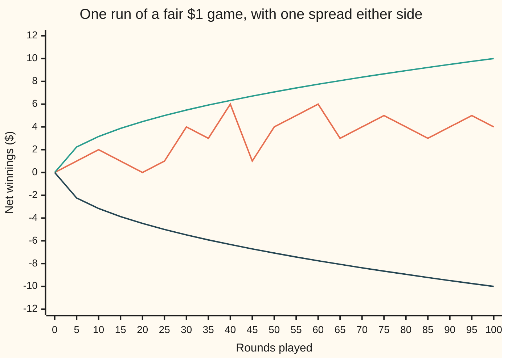
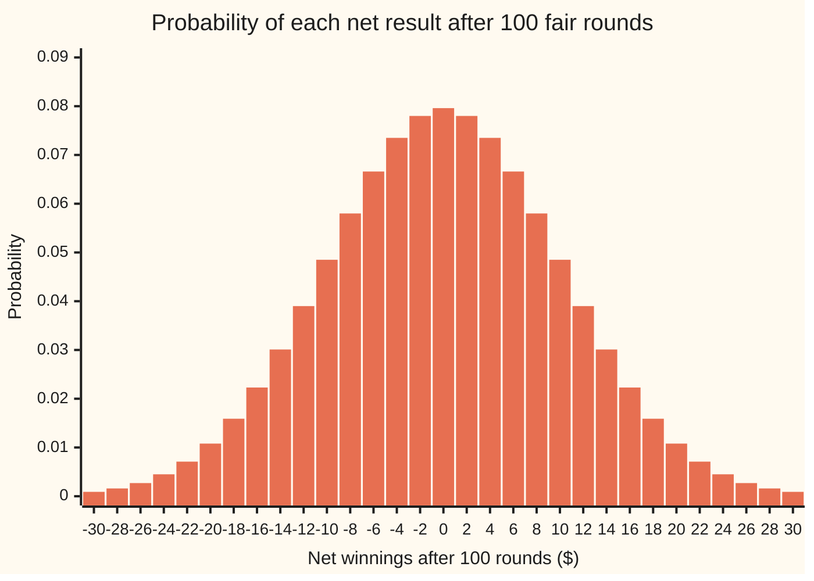

# Simple random walk: plus one or minus one each step

[Syllabus](../../../SYLLABUS.md) → [Stochastic processes and calculus](../README.md) → [Random Walks and Filtrations](../README.md#s01) → Simple random walk

---

## General Overview

A player stakes $1 on a fair coin toss, a hundred times in a row. Heads, the player gains $1. Tails, the player loses $1. Track the running total, dollars ahead or behind after each round. It starts at $0 and moves up or down by exactly $1 every round.

That running total, followed round by round, is a **simple random walk**, the name used from here on. "Simple" means each step is exactly one unit, up or down. "Random walk" means the steps are drawn by chance, one after another, and the total is where the walker stands.

Three facts describe where the walk stands after 100 rounds. On average it is at $0: the game is fair. Its spread, the square root of its average squared distance from $0, is $10, not $100, because wins and losses cancel. And it ends exactly level only about 8 times in 100. Quadruple the rounds to 400 and the spread only doubles, to $20. That slow growth, with the square root of the number of rounds, is the walk's signature.

The combinatorics wing already counts these coin-toss paths ([Counting coin-flip paths](../../04-Combinatorics%20and%20graphs/06-Lattice%20Paths%20and%20Catalan%20Numbers/05-random-walk-path-counts.md)). This card treats the walk as a process in time: where it stands after each round, how far it spreads, and how often it comes back to zero.

**The position after n rounds is wins minus losses, so its law, the chance of each possible position, is a relabelled binomial count: mean zero for a fair game, variance equal to the number of rounds, and a typical distance that grows like the square root of the rounds.**

**What kind of fact this is:** the walk itself is a definition, a model of independent fair rounds; its mean, variance and law after n rounds are theorems, proved on this card in Why it works.

### The picture: one run of 100 rounds

The run below is one sample: the first of 20,000 seeded runs in the code, recorded every 5 rounds (the chart joins those points with straight lines, so moves between them are hidden). The two outer lines are plus and minus one spread, the square root of the rounds played.



Orange: the run, which finishes $4 ahead. Green: plus one spread. Dark blue: minus one spread. The band widens fast at first and then more and more slowly, like a square root. At the recorded points this run stays inside the band; about 27 runs in 100 finish outside it.

---

## The formula

Notation first, in words. The earlier card wrote a process as $(X_n)$, read "the value at time n" ([Stochastic processes](01-processes-and-paths.md)). This process is a sum, so it is named $(S_n)$: $S_n$ is the net winnings after round n. Each round's result is $\xi_i$ (xi): +1 with probability $p$, −1 otherwise, all rounds independent. The walk is their running sum:

$$S_n = \xi_1 + \xi_2 + \cdots + \xi_n, \qquad S_0 = 0$$

**Read it aloud:** the position after n rounds is the sum of the n results so far.

If $j$ of the n rounds were wins, the other n − j were losses, so $S_n = 2j - n$. The whole law follows from that one line:

$$P(S_n = k) = \binom{n}{j}\, p^{\,j}\,(1-p)^{\,n-j}, \qquad j = \frac{n+k}{2}$$

**Read it aloud:** to stand at height k after n rounds, the walk must have won exactly (n + k)/2 of them; count the orders those wins can come in, and weight each order by its chance.

$$E[S_n] = n\,(2p - 1), \qquad \operatorname{Var}(S_n) = 4\,n\,p\,(1-p)$$

**Read it aloud:** the mean moves by 2p − 1 dollars a round; the variance grows by 4p(1 − p) a round.

For a fair game, p = 0.5: the mean is 0, the variance is n, and the spread, the square root of the variance (the standard deviation), is $\sqrt{n}$. Two positions at different rounds share their early rounds. Their covariance, how far the two move together, counts those shared rounds:

$$\operatorname{Cov}(S_a, S_b) = 4\,a\,p\,(1-p), \qquad a \le b$$

| Symbol | Plain meaning | In our example | Push it up and the answer… |
| --- | --- | --- | --- |
| $S_n$, $S_{50}$, $S_{100}$ | net winnings after round n (or 50, or 100); the walk's position | $4 at round 100 on the charted run | — |
| $\xi_i$ | result of round i: +1 or −1 | one toss | — |
| $n$ | rounds played so far | 100 | spread grows like its square root |
| $p$ | chance a round is a win | 0.5; 18/37 on red at roulette | mean rises; variance peaks at 0.5 |
| $j$ | rounds won among the first n | 50 to end level | position rises by 2 per extra win |
| $k$ | a height the walk might stand at | 0, or −10 | probability falls away from the mean |
| $\binom{n}{j}$ | orders in which j wins can come among n rounds, "n choose j" | 100 choose 50 | — |
| $E[S_n]$ | the mean position: the average over all runs | $0 | — |
| $\operatorname{Var}(S_n)$ | the variance: the average squared distance from the mean | 100 | — |
| $a$, $b$, $S_a$, $S_b$ | two round numbers, a before b, and the positions there | 50 and 100 | — |
| $\operatorname{Cov}(S_a, S_b)$ | covariance: how far the two positions move together | 50 | — |
| $m$, $u_m$ | half the rounds, when the count is even; u is the chance of standing at 0 after 2m rounds | 50; 0.0796 | u falls like one over root m |
| π | the circle number: the distance round a circle over the distance across it; used in the estimate for $u_m$ | 1 over the root of π × 50 is 0.0798 | — |
| $\mu$ | one round's mean, 2p − 1 (the detailed proof only) | 0 | — |
| $l$ | a second round number, paired with i (the detailed proof only) | any round other than i | — |

### The picture: where 100 fair rounds end



Every bar is an exact probability from the law above. Odd results are missing: after an even number of rounds, wins minus losses is even. The tallest bar, ending level, holds only 0.0796 of the runs.

### When it holds

- **Independent rounds.** If a round tends to repeat the last one (three times in four, say), the covariances between rounds no longer vanish and the variance after 100 rounds is 296, not 100.
- **The same chance every round.** If the chance drifts, the mean is the sum of each round's 2p − 1 and the binomial law no longer applies.
- **A number of rounds fixed in advance.** A player who stops at a moment chosen by the walk itself, say on first being $10 down, ends with a different law; that is [Gambler's ruin](04-gamblers-ruin.md).
- **Steps of one unit.** Stakes of $5 scale the mean by 5 and the variance by 25; the shape is unchanged.

---

## Why it works

### Step 0: the position is decided by the number of wins

Order does not matter to the final total. W L W W and W W W L both end at +2: three wins, one loss. So the position after n rounds is a relabelling of one count, $j$, the number of wins: $S_n = 2j - n$. Everything about $S_n$ at a fixed round is a fact about $j$, and $j$ is a binomial count, n independent trials each succeeding with chance $p$ ([Binomial](../../09-Probability%20and%20statistics/03-Discrete%20Distributions/01-bernoulli-and-binomial.md)).

### Step 1: the law at round n is the binomial law, moved and stretched

Each particular order of j wins and n − j losses has chance $p^{\,j}(1-p)^{\,n-j}$, by independence. There are $\binom{n}{j}$ such orders. Standing at height $k$ means $2j - n = k$, so $j = (n+k)/2$. That gives the law.

Two consequences follow at once. The height and the number of rounds have the same parity (both even or both odd), since $k = 2j - n$. And only heights from −n to n occur. After 100 fair rounds, ending level has chance 100 choose 50 divided by 2^100, which is 0.0796.

### Step 2: the mean adds one round's mean per round

One round has mean $1 \cdot p + (-1)(1-p) = 2p - 1$. Averages add over sums, always, independent or not. So the mean after n rounds is n times that: $E[S_n] = n(2p-1)$. For a fair game, 0.

### Step 3: the variance adds, because the rounds are independent

One round's variance is its average square minus its mean squared: $1 - (2p-1)^2 = 4p(1-p)$. Squared distances do not add in general. Expanding the square of a sum gives every round's own variance plus a covariance for every pair of rounds ([Two variables at once](../../09-Probability%20and%20statistics/02-Random%20Variables/04-joint-distributions-and-covariance.md)). Independent rounds have covariance zero, so only the n variances survive: $\operatorname{Var}(S_n) = 4np(1-p)$. For a fair game, one per round, n in all.

<details>
<summary>Detailed proof: mean, variance and shared rounds</summary>

Let $\mu = 2p - 1$ be one round's mean. Write $S_n - n\mu = \sum_{i=1}^{n} (\xi_i - \mu)$, a sum of centred results.

**Mean.** Expectation is linear (wing 09): $E[S_n] = \sum_{i} E[\xi_i] = n\mu$. No independence is used.

**Variance.** Square the centred sum and take expectations:
$$\operatorname{Var}(S_n) = \sum_{i=1}^{n} E[(\xi_i-\mu)^2] + \sum_{i \ne l} E[(\xi_i-\mu)(\xi_l-\mu)].$$
Each diagonal term is $E[\xi_i^2] - \mu^2 = 1 - \mu^2 = 4p(1-p)$, since $\xi_i^2 = 1$ always. For $i \ne l$, independence makes the expectation of the product the product of the expectations, each zero. So $\operatorname{Var}(S_n) = 4np(1-p)$.

**Shared rounds.** For $a \le b$, split $S_b = S_a + (S_b - S_a)$. The increment $S_b - S_a$ is built from rounds $a+1$ to $b$, independent of the first $a$ rounds, so its covariance with $S_a$ is zero. Covariance is additive in each slot, so $\operatorname{Cov}(S_a, S_b) = \operatorname{Var}(S_a) = 4ap(1-p)$.

**Law.** The event $\{S_n = k\}$ is the event "exactly $j = (n+k)/2$ wins". The results are independent with common chance $p$, so the count of wins is binomial with parameters n and p, and the law follows. If $n + k$ is odd or $|k| > n$, no whole $j$ exists and the probability is 0.

</details>

### Step 4: the spread grows like the square root of the rounds

Variance grows in proportion to the rounds. Spread is the square root of variance. So spread grows like $\sqrt{n}$: 25 rounds give $5, 100 give $10, 400 give $20, 1,600 give $40. Four times the rounds, twice the spread.

The reason is cancellation. If every round went the same way the walk would travel n. Independent rounds partly undo each other, and what survives grows only like the square root. This is the same arithmetic that makes an average of n measurements accurate to one over root n ([Law of large numbers](../../09-Probability%20and%20statistics/06-Limit%20Theorems%20in%20Practice/01-law-of-large-numbers.md)).

With a bias the two growth rates compete. Betting red at European roulette wins with chance 18/37. After 100 spins the mean is −$2.70 and the spread $10.00 (9.9963): luck dominates. After 10,000 spins the mean is −$270.27 and the spread $99.96: the house edge, growing like n, has overtaken luck, growing like root n.

### Step 5: positions at different rounds share their past

$S_{50}$ and $S_{100}$ are not independent: the first 50 rounds sit inside both. Their covariance counts the shared rounds, 50 for a fair game. Divided by the two spreads, $\sqrt{50}$ and $10$, it gives a correlation of 0.7071. Knowing the halfway position tells a good deal about the finish. Which information is available at each round is the subject of [Filtrations](03-filtrations-and-information.md).

### Step 6: returns to zero

The walk can stand at 0 only after an even number of rounds, 2m. The chance is $\binom{2m}{m}/4^m$, which for large m is close to one over the square root of π m ([The middle of the row](../../04-Combinatorics%20and%20graphs/03-Binomial%20Coefficients%20and%20Identities/07-central-binomial-and-bounds.md)): 0.0798 against the exact 0.0796 at m = 50.

Adding these chances over every even round gives the expected number of visits to 0, since the mean of a count is the sum of the chances of its events. The sum has a closed form: the expected number of visits in 2m rounds is (2m + 1) times the chance of standing at 0 at round 2m, minus 1. For 100 rounds, 101 × 0.0796 − 1 = 7.04 visits. The count grows without bound, like the square root of the rounds, and a fair walk returns to 0 with probability 1 (proved in [Hitting times](06-first-passage-and-hitting-times.md), Step 2). When the first return comes is [Hitting times](06-first-passage-and-hitting-times.md).

<details>
<summary>Detailed proof: the count of visits to 0</summary>

Write $u_m = \binom{2m}{m}/4^m$, the chance of standing at 0 after 2m rounds, with $u_0 = 1$. The claim is $u_0 + u_1 + \cdots + u_m = (2m+1)\,u_m$.

The ratio of neighbours is $u_{m+1}/u_m = \frac{(2m+2)(2m+1)}{4(m+1)^2} = \frac{2m+1}{2m+2}$, so $(2m+2)\,u_{m+1} = (2m+1)\,u_m$.

Induction on m. At m = 0 both sides are 1. If the claim holds at m, adding $u_{m+1}$ gives $(2m+1)u_m + u_{m+1} = (2m+2)u_{m+1} + u_{m+1} = (2m+3)u_{m+1}$, the claim at m + 1.

The number of visits in rounds 1 to 2m is a sum of indicators, one per even round, each with mean equal to its u. Linearity gives expected visits $u_1 + \cdots + u_m = (2m+1)u_m - 1$.

</details>

The other road to the law is counting paths, which the combinatorics card does in full; this card only adds the weights $p^{\,j}(1-p)^{\,n-j}$, and for a fair game all 2^n paths weigh the same.

---

## Worked numbers, by hand

The fair $1 game, 100 rounds.

| Step | Arithmetic | Value |
| --- | --- | --- |
| one round's mean | 1 × 0.5 + (−1) × 0.5 | $0 |
| one round's variance | 1 − 0 × 0 | 1 |
| mean after 100 rounds | 100 × 0 | $0 |
| variance after 100 rounds | 100 × 1 | 100 |
| spread after 100 rounds | square root of 100 | **$10** |
| chance of ending level | 100 choose 50, over 2^100 | 0.0796 |
| chance of ending within $10 | 11 bars, heights −10 to 10 | 0.7287 |
| chance of ending $10 or more down | wins at most 45 | 0.1841 |
| expected visits to 0 | 101 × 0.0796 − 1 | 7.04 |

After 100 fair rounds the spread of the players' results is $10, and about 73 players in 100 end within $10 of level. The shelf's house example is a gambler holding 10 chips: 0.1841 of the runs end at least 10 down, so without a floor such a player ends a stack or more behind about 1 time in 5.

### What breaks if you drop a piece

| Mistake | Comes out at | What went wrong |
| --- | --- | --- |
| Adding spreads instead of variances | $100 spread; right is $10 | Spreads add only when rounds all move together |
| Rounds that repeat the last result 3 times in 4 | variance 296, spread $17.20 | Independence dropped: covariances between rounds add in |
| Red at roulette treated as fair, 10,000 spins | mean $0; true −$270.27 against spread $99.96 | Drift grows like n and overtakes a spread growing like root n |
| Spread read as a fence | 0.2713 of runs end beyond $10 | Spread is a typical size, not a bound |

For the repeating rounds, the results of two rounds k apart have covariance 0.5^k, and the sum over all pairs gives the 296. The code prints every number above, the 296 by two roads.

---

## Code, from first principles, and it actually runs

Each answer is reached three ways. The formulas give the mean, variance, covariance and chances directly. The exact law is built round by round: the number of paths at each height after round t comes from the counts after round t − 1, with no binomial coefficient in sight; it is then compared with 100 choose j for every j. And 20,000 runs are drawn from a SplitMix64 generator written out in both languages, seed 2026, a win whenever the top bit of a draw is 1; every simulated number is printed with its standard error, and its asserts allow four standard errors. Fair-game path counts are held as exact integers; the roulette and repeating-round laws use floating point.

### Python

```python
# Simple random walk: $1 a round on a fair toss; S_n is the net after n rounds.
# Three roads: the formulas; the exact law of S_n, built from the law one round
# earlier; 20,000 runs from SplitMix64, seed 2026.  Standard library only.
from math import sqrt, pi

N, RUNS, SEED, M64 = 100, 20000, 2026, (1 << 64) - 1

def splitmix(s):                            # SplitMix64: a counter, then a scrambler
    s = (s + 0x9E3779B97F4A7C15) & M64
    z = ((s ^ (s >> 30)) * 0xBF58476D1CE4E5B9) & M64
    z = ((z ^ (z >> 27)) * 0x94D049BB133111EB) & M64
    return s, z ^ (z >> 31)
def choose(n, k):                           # road one: C(n, k), multiplied out
    c = 1
    for i in range(1, k + 1):
        c = c * (n - k + i) // i
    return c
def counts(n):                              # road two: c[j] = paths with j wins, height 2j - t;
    c, zeros = [1], {}                      # each count comes from the round before
    for t in range(1, n + 1):
        c = [(c[j - 1] if j > 0 else 0) + (c[j] if j < t else 0) for j in range(t + 1)]
        if t % 2 == 0: zeros[t] = c[t // 2]     # paths standing at 0 after round t
    return c, zeros
def law(n, p, keep=()):                     # the same recursion, weighted p and 1 - p
    w, out = [1.0], {}
    for t in range(1, n + 1):
        w = [(w[j - 1] * p if j > 0 else 0.0) + (w[j] * (1 - p) if j < t else 0.0) for j in range(t + 1)]
        if t in keep: out[t] = w
    return w, out
def moments(w, t):                          # mean and variance of the height 2j - t
    m = sum(x * (2 * j - t) for j, x in enumerate(w))
    return m, sum(x * (2 * j - t - m) ** 2 for j, x in enumerate(w))
def persistent(n, r):                       # each step repeats the last with chance r
    w = [[0.0, 0.0] for _ in range(2 * n + 1)]          # w[h + n][d]: height h, last step d
    w[n + 1][1], w[n - 1][0] = 0.5, 0.5
    for _ in range(n - 1):
        new = [[0.0, 0.0] for _ in range(2 * n + 1)]
        for i in range(1, 2 * n):
            new[i + 1][1] += w[i][1] * r + w[i][0] * (1 - r)
            new[i - 1][0] += w[i][0] * r + w[i][1] * (1 - r)
        w = new
    m = sum((i - n) * (w[i][0] + w[i][1]) for i in range(2 * n + 1))
    return sum((i - n - m) ** 2 * (w[i][0] + w[i][1]) for i in range(2 * n + 1))
def row(label, x, se=None):
    print(f"{label:<46}{x:>11.4f}" + ("" if se is None else f"   se {se:.4f}"))
def mean_se(xs):
    m = sum(xs) / len(xs)
    return m, sqrt(sum((x - m) ** 2 for x in xs) / (len(xs) - 1) / len(xs))
# ---- road three: 20,000 runs of 100 rounds, a win when the top bit is 1
s, S50, S100, visits, path = SEED, [], [], [], [0]
for run in range(RUNS):
    h = v = 0
    for t in range(1, N + 1):
        s, z = splitmix(s)
        h += 1 if z >> 63 else -1
        v += h == 0
        if t == 50: S50.append(h)
        if run == 0 and t % 5 == 0: path.append(h)
    S100.append(h); visits.append(v)
tot, (c, zeros) = 2 ** N, counts(N)
hts = [2 * j - N for j in range(N + 1)]
s1 = sum(k * x for k, x in zip(hts, c))
s2 = sum(k * k * x for k, x in zip(hts, c))
assert all(x == choose(N, j) for j, x in enumerate(c)), "recursion disagrees with C(n, k)"
assert s1 == 0, "exact law disagrees with mean 0"
assert s2 == N * tot, "exact law disagrees with variance n"
print("== fair game, $1 a round, 100 rounds ==")
row("mean, formula n(2p - 1)", N * (2 * 0.5 - 1))
row("mean, exact law", s1 / tot)
sm, sm_se = mean_se(S100)
row("mean, simulated 20000 runs", sm, sm_se)
row("variance, formula 4np(1 - p)", 4 * N * 0.5 * 0.5)
row("variance, exact law", s2 / tot - (s1 / tot) ** 2)
sv = sum((x - sm) ** 2 for x in S100) / (RUNS - 1)
m4 = sum((x - sm) ** 4 for x in S100) / RUNS
row("variance, simulated", sv, sqrt((m4 - sv * sv) / RUNS))
assert abs(sm) < 4 * sm_se, "simulated mean too far from 0"
assert abs(sv - 100) < 4 * sqrt((m4 - sv * sv) / RUNS), "simulated variance too far from 100"
row("P(S_100 = 0), formula C(100,50)/2^100", choose(N, 50) / tot)
row("P(S_100 = 0), exact law", c[50] / tot)
row("P(S_100 = 0), simulated", *mean_se([1.0 if x == 0 else 0.0 for x in S100]))
row("P(S_100 = 0), Stirling 1/sqrt(pi 50)", 1 / sqrt(pi * 50))
within = sum(c[45:56]) / tot
row("P(-10 <= S_100 <= 10), exact law", within)
row("P(-10 <= S_100 <= 10), simulated", *mean_se([1.0 if abs(x) <= 10 else 0.0 for x in S100]))
row("P(S_100 <= -10), exact law", sum(c[:46]) / tot)
row("P(S_100 <= -10), simulated", *mean_se([1.0 if x <= -10 else 0.0 for x in S100]))
print("== spread against rounds, exact law ==")
_, keep = law(1600, 0.5, keep=(25, 100, 400, 1600))
for t in (25, 100, 400, 1600):
    sd = sqrt(moments(keep[t], t)[1])
    assert abs(sd - sqrt(t)) < 1e-9
    row(f"spread after {t} rounds (sqrt {t} = {sqrt(t):.0f})", sd)
print("== shared rounds and returns ==")
c50, _ = counts(50)
h50 = [2 * j - 50 for j in range(51)]
cov = sum(x * y * a * (a + b) for a, x in zip(h50, c50) for b, y in zip(h50, c50))
assert cov == 50 * 4 ** 50, "exact covariance disagrees with min(a, b)"
row("Cov(S_50, S_100), formula min(50, 100)", 50.0)
row("Cov(S_50, S_100), exact law", cov / 4 ** 50)
m50 = sum(S50) / RUNS
cm, cse = mean_se([(a - m50) * (b - sm) for a, b in zip(S50, S100)])
row("Cov(S_50, S_100), simulated", cm * RUNS / (RUNS - 1), cse)
assert abs(cm - 50) < 4 * cse
row("correlation, 50 / sqrt(50 x 100)", 50 / sqrt(50 * 100))
ret_f = 101 * choose(N, 50) - tot           # (2m + 1) C(2m, m)/4^m - 1, times 2^100
ret_e = sum(zeros[t] * 2 ** (N - t) for t in zeros)
assert ret_f == ret_e, "return-count identity fails"
row("visits to 0 in 100 rounds, formula", ret_f / tot)
row("visits to 0 in 100 rounds, exact law", ret_e / tot)
vm, vse = mean_se(visits)
assert abs(vm - ret_f / tot) < 4 * vse
row("visits to 0 in 100 rounds, simulated", vm, vse)
print("== red at roulette, p = 18/37 ==")
p = 18 / 37
rm, rv = moments(law(N, p)[0], N)
assert abs(rm - N * (2 * p - 1)) < 1e-9, "roulette mean: exact law disagrees with formula"
assert abs(rv - 4 * N * p * (1 - p)) < 1e-9, "roulette variance: exact law disagrees with formula"
row("mean after 100, formula", N * (2 * p - 1))
row("mean after 100, exact law", rm)
row("spread after 100, formula", sqrt(4 * N * p * (1 - p)))
row("spread after 100, exact law", sqrt(rv))
row("mean after 10000, 100 blocks of the exact law", 100 * rm)
row("spread after 10000, 100 blocks", sqrt(100 * rv))
print("== what breaks ==")
row("wrong: spreads added, 100 x $1", N * 1.0)
pv = persistent(N, 0.75)
pf = N + 2 * sum((N - k) * 0.5 ** k for k in range(1, N))
assert abs(pv - pf) < 1e-9, "persistent walk: exact law disagrees with the sum"
row("steps repeat w.p. 0.75: variance, exact law", pv)
row("steps repeat w.p. 0.75: variance, formula", pf)
row("steps repeat w.p. 0.75: spread", sqrt(pv))
row("P(|S_100| > 10), exact law", 1 - within)
print("== charts ==")
print("chart, round       " + " ".join(str(5 * i) for i in range(21)))
print("chart, run 1       " + " ".join(str(x) for x in path))
for sg in (1, -1): print(f"chart, {'+-'[sg < 0]}sqrt(n)    " + " ".join(f"{sg * sqrt(5 * i) + 0.0:.2f}" for i in range(21)))
print("chart, height      " + " ".join(str(k) for k in range(-30, 31, 2)))
print("chart, P(S_100=k)  " + " ".join(f"{c[(k + N) // 2] / tot:.4f}" for k in range(-30, 31, 2)))
print("ALL CHECKS PASS")
```

**Ran 2026-09-30 on macOS, Python 3.14.6, standard library only. All checks passed. Output, pasted from the run:**

```
== fair game, $1 a round, 100 rounds ==
mean, formula n(2p - 1)                            0.0000
mean, exact law                                    0.0000
mean, simulated 20000 runs                         0.0744   se 0.0700
variance, formula 4np(1 - p)                     100.0000
variance, exact law                              100.0000
variance, simulated                               98.1350   se 0.9735
P(S_100 = 0), formula C(100,50)/2^100              0.0796
P(S_100 = 0), exact law                            0.0796
P(S_100 = 0), simulated                            0.0804   se 0.0019
P(S_100 = 0), Stirling 1/sqrt(pi 50)               0.0798
P(-10 <= S_100 <= 10), exact law                   0.7287
P(-10 <= S_100 <= 10), simulated                   0.7345   se 0.0031
P(S_100 <= -10), exact law                         0.1841
P(S_100 <= -10), simulated                         0.1792   se 0.0027
== spread against rounds, exact law ==
spread after 25 rounds (sqrt 25 = 5)               5.0000
spread after 100 rounds (sqrt 100 = 10)           10.0000
spread after 400 rounds (sqrt 400 = 20)           20.0000
spread after 1600 rounds (sqrt 1600 = 40)         40.0000
== shared rounds and returns ==
Cov(S_50, S_100), formula min(50, 100)            50.0000
Cov(S_50, S_100), exact law                       50.0000
Cov(S_50, S_100), simulated                       48.9381   se 0.5900
correlation, 50 / sqrt(50 x 100)                   0.7071
visits to 0 in 100 rounds, formula                 7.0385
visits to 0 in 100 rounds, exact law               7.0385
visits to 0 in 100 rounds, simulated               7.0393   se 0.0385
== red at roulette, p = 18/37 ==
mean after 100, formula                           -2.7027
mean after 100, exact law                         -2.7027
spread after 100, formula                          9.9963
spread after 100, exact law                        9.9963
mean after 10000, 100 blocks of the exact law   -270.2703
spread after 10000, 100 blocks                    99.9635
== what breaks ==
wrong: spreads added, 100 x $1                   100.0000
steps repeat w.p. 0.75: variance, exact law      296.0000
steps repeat w.p. 0.75: variance, formula        296.0000
steps repeat w.p. 0.75: spread                    17.2047
P(|S_100| > 10), exact law                         0.2713
== charts ==
chart, round       0 5 10 15 20 25 30 35 40 45 50 55 60 65 70 75 80 85 90 95 100
chart, run 1       0 1 2 1 0 1 4 3 6 1 4 5 6 3 4 5 4 3 4 5 4
chart, +sqrt(n)    0.00 2.24 3.16 3.87 4.47 5.00 5.48 5.92 6.32 6.71 7.07 7.42 7.75 8.06 8.37 8.66 8.94 9.22 9.49 9.75 10.00
chart, -sqrt(n)    0.00 -2.24 -3.16 -3.87 -4.47 -5.00 -5.48 -5.92 -6.32 -6.71 -7.07 -7.42 -7.75 -8.06 -8.37 -8.66 -8.94 -9.22 -9.49 -9.75 -10.00
chart, height      -30 -28 -26 -24 -22 -20 -18 -16 -14 -12 -10 -8 -6 -4 -2 0 2 4 6 8 10 12 14 16 18 20 22 24 26 28 30
chart, P(S_100=k)  0.0009 0.0016 0.0027 0.0045 0.0071 0.0108 0.0159 0.0223 0.0301 0.0390 0.0485 0.0580 0.0666 0.0735 0.0780 0.0796 0.0780 0.0735 0.0666 0.0580 0.0485 0.0390 0.0301 0.0223 0.0159 0.0108 0.0071 0.0045 0.0027 0.0016 0.0009
ALL CHECKS PASS
```

The exact law and the formulas agree to every printed digit. The simulated rows land within two standard errors of them: the variance comes out at 98.14 against 100, the covariance at 48.94 against 50.

### Rust

The same three roads, std only. Rust has no built-in big integers, so the fair counts sit in 128-bit integers: 2^100 paths fit.

```rust
// Simple random walk: $1 a round on a fair toss; S_n is the net after n rounds.
// Three roads: the formulas; the exact law of S_n, built from the law one round
// earlier; 20,000 runs from SplitMix64, seed 2026.  Std only, no crates.
use std::f64::consts::PI;
const N: usize = 100;
const RUNS: usize = 20000;
fn splitmix(s: &mut u64) -> u64 { // SplitMix64: a counter, then a scrambler
    *s = s.wrapping_add(0x9E3779B97F4A7C15);
    let mut z = (*s ^ (*s >> 30)).wrapping_mul(0xBF58476D1CE4E5B9);
    z = (z ^ (z >> 27)).wrapping_mul(0x94D049BB133111EB);
    z ^ (z >> 31)
}
fn choose(n: u128, k: u128) -> u128 { // road one: C(n, k), multiplied out
    let mut c = 1u128;
    for i in 1..=k { c = c * (n - k + i) / i; }
    c
}
// road two: c[j] = paths with j wins, height 2j - t; each count from the round before
fn counts(n: usize) -> (Vec<u128>, Vec<(usize, u128)>) {
    let (mut c, mut zeros) = (vec![1u128], Vec::new());
    for t in 1..=n {
        c = (0..=t).map(|j| (if j > 0 { c[j - 1] } else { 0 }) + (if j < t { c[j] } else { 0 })).collect();
        if t % 2 == 0 { zeros.push((t, c[t / 2])); } // paths standing at 0 after round t
    }
    (c, zeros)
}
// the same recursion, weighted p and 1 - p; keeps the law at the listed rounds
fn law(n: usize, p: f64, keep: &[usize]) -> (Vec<f64>, Vec<Vec<f64>>) {
    let (mut w, mut out) = (vec![1.0f64], Vec::new());
    for t in 1..=n {
        w = (0..=t).map(|j| (if j > 0 { w[j - 1] * p } else { 0.0 }) + (if j < t { w[j] * (1.0 - p) } else { 0.0 })).collect();
        if keep.contains(&t) { out.push(w.clone()); }
    }
    (w, out)
}
fn moments(w: &[f64], t: usize) -> (f64, f64) { // mean and variance of the height 2j - t
    let h = |j: usize| (2 * j) as f64 - t as f64;
    let m: f64 = w.iter().enumerate().map(|(j, x)| x * h(j)).sum();
    (m, w.iter().enumerate().map(|(j, x)| x * (h(j) - m).powi(2)).sum())
}
fn persistent(n: usize, r: f64) -> f64 { // each step repeats the last with chance r
    let mut w = [[0.0f64; 2]].repeat(2 * n + 1); // w[h + n][d]: height h, last step d
    w[n + 1][1] = 0.5;
    w[n - 1][0] = 0.5;
    for _ in 0..n - 1 {
        let mut new = [[0.0f64; 2]].repeat(2 * n + 1);
        for i in 1..2 * n {
            new[i + 1][1] += w[i][1] * r + w[i][0] * (1.0 - r);
            new[i - 1][0] += w[i][0] * r + w[i][1] * (1.0 - r);
        }
        w = new;
    }
    let m: f64 = (0..=2 * n).map(|i| (i as f64 - n as f64) * (w[i][0] + w[i][1])).sum();
    (0..=2 * n).map(|i| (i as f64 - n as f64 - m).powi(2) * (w[i][0] + w[i][1])).sum()
}
fn row(label: &str, x: f64) { println!("{:<46}{:>11.4}", label, x); }
fn row_se(label: &str, (x, se): (f64, f64)) { println!("{:<46}{:>11.4}   se {:.4}", label, x, se); }
fn mean_se(xs: &[f64]) -> (f64, f64) {
    let m = xs.iter().sum::<f64>() / xs.len() as f64;
    let v = xs.iter().map(|x| (x - m).powi(2)).sum::<f64>() / (xs.len() - 1) as f64;
    (m, (v / xs.len() as f64).sqrt())
}
fn join<T: std::fmt::Display>(v: &[T]) -> String { v.iter().map(|x| x.to_string()).collect::<Vec<_>>().join(" ") }

fn main() {
    // road three: 20,000 runs of 100 rounds, a win when the top bit is 1
    let (mut s, mut s50, mut s100, mut visits, mut path) = (2026u64, vec![], vec![], vec![], vec![0i64]);
    for run in 0..RUNS {
        let (mut h, mut v) = (0i64, 0i64);
        for t in 1..=N {
            h += if splitmix(&mut s) >> 63 == 1 { 1 } else { -1 };
            if h == 0 { v += 1; }
            if t == 50 { s50.push(h as f64); }
            if run == 0 && t % 5 == 0 { path.push(h); }
        }
        s100.push(h as f64); visits.push(v as f64);
    }
    let tot: u128 = 1 << N;
    let (c, zeros) = counts(N);
    let hts: Vec<i128> = (0..=N).map(|j| 2 * j as i128 - N as i128).collect();
    let s1: i128 = hts.iter().zip(&c).map(|(k, x)| k * *x as i128).sum();
    let s2: i128 = hts.iter().zip(&c).map(|(k, x)| k * k * *x as i128).sum();
    for (j, x) in c.iter().enumerate() { assert_eq!(*x, choose(N as u128, j as u128), "recursion disagrees with C(n, k)"); }
    assert_eq!(s1, 0, "exact law disagrees with mean 0");
    assert_eq!(s2, (N as u128 * tot) as i128, "exact law disagrees with variance n");
    let (tf, n) = (tot as f64, N as f64);
    println!("== fair game, $1 a round, 100 rounds ==");
    row("mean, formula n(2p - 1)", n * (2.0 * 0.5 - 1.0));
    row("mean, exact law", s1 as f64 / tf);
    let (sm, sm_se) = mean_se(&s100);
    row_se("mean, simulated 20000 runs", (sm, sm_se));
    row("variance, formula 4np(1 - p)", 4.0 * n * 0.5 * 0.5);
    row("variance, exact law", s2 as f64 / tf - (s1 as f64 / tf).powi(2));
    let sv = s100.iter().map(|x| (x - sm).powi(2)).sum::<f64>() / (RUNS - 1) as f64;
    let m4 = s100.iter().map(|x| (x - sm).powi(4)).sum::<f64>() / RUNS as f64;
    let sv_se = ((m4 - sv * sv) / RUNS as f64).sqrt();
    row_se("variance, simulated", (sv, sv_se));
    assert!(sm.abs() < 4.0 * sm_se, "simulated mean too far from 0");
    assert!((sv - 100.0).abs() < 4.0 * sv_se, "simulated variance too far from 100");
    let ind = |f: &dyn Fn(f64) -> bool| -> Vec<f64> { s100.iter().map(|x| if f(*x) { 1.0 } else { 0.0 }).collect() };
    row("P(S_100 = 0), formula C(100,50)/2^100", choose(100, 50) as f64 / tf);
    row("P(S_100 = 0), exact law", c[50] as f64 / tf);
    row_se("P(S_100 = 0), simulated", mean_se(&ind(&|x| x == 0.0)));
    row("P(S_100 = 0), Stirling 1/sqrt(pi 50)", 1.0 / (PI * 50.0).sqrt());
    let within = c[45..56].iter().sum::<u128>() as f64 / tf;
    row("P(-10 <= S_100 <= 10), exact law", within);
    row_se("P(-10 <= S_100 <= 10), simulated", mean_se(&ind(&|x| x.abs() <= 10.0)));
    row("P(S_100 <= -10), exact law", c[..46].iter().sum::<u128>() as f64 / tf);
    row_se("P(S_100 <= -10), simulated", mean_se(&ind(&|x| x <= -10.0)));
    println!("== spread against rounds, exact law ==");
    let marks = [25usize, 100, 400, 1600];
    let (_, keep) = law(1600, 0.5, &marks);
    for (t, w) in marks.iter().zip(&keep) {
        let sd = moments(w, *t).1.sqrt();
        assert!((sd - (*t as f64).sqrt()).abs() < 1e-9);
        row(&format!("spread after {} rounds (sqrt {} = {:.0})", t, t, (*t as f64).sqrt()), sd);
    }
    println!("== shared rounds and returns ==");
    let (c50, _) = counts(50);
    let h50: Vec<i128> = (0..=50).map(|j| 2 * j as i128 - 50).collect();
    let mut cov: i128 = 0;
    for (a, x) in h50.iter().zip(&c50) { for (b, y) in h50.iter().zip(&c50) { cov += (*x * *y) as i128 * a * (a + b); } }
    let four50: i128 = 1 << 100;
    assert_eq!(cov, 50 * four50, "exact covariance disagrees with min(a, b)");
    row("Cov(S_50, S_100), formula min(50, 100)", 50.0);
    row("Cov(S_50, S_100), exact law", cov as f64 / four50 as f64);
    let m50 = s50.iter().sum::<f64>() / RUNS as f64;
    let prod: Vec<f64> = s50.iter().zip(&s100).map(|(a, b)| (a - m50) * (b - sm)).collect();
    let (cm, cse) = mean_se(&prod);
    row_se("Cov(S_50, S_100), simulated", (cm * RUNS as f64 / (RUNS - 1) as f64, cse));
    assert!((cm - 50.0).abs() < 4.0 * cse);
    row("correlation, 50 / sqrt(50 x 100)", 50.0 / (50.0f64 * 100.0).sqrt());
    let ret_f = 101 * choose(100, 50) - tot; // (2m + 1) C(2m, m)/4^m - 1, times 2^100
    let ret_e: u128 = zeros.iter().map(|(t, z)| z << (N - t)).sum();
    assert_eq!(ret_f, ret_e, "return-count identity fails");
    row("visits to 0 in 100 rounds, formula", ret_f as f64 / tf);
    row("visits to 0 in 100 rounds, exact law", ret_e as f64 / tf);
    let (vm, vse) = mean_se(&visits);
    assert!((vm - ret_f as f64 / tf).abs() < 4.0 * vse);
    row_se("visits to 0 in 100 rounds, simulated", (vm, vse));
    println!("== red at roulette, p = 18/37 ==");
    let p = 18.0 / 37.0;
    let (rm, rv) = moments(&law(N, p, &[]).0, N);
    assert!((rm - n * (2.0 * p - 1.0)).abs() < 1e-9, "roulette mean: exact law disagrees with formula");
    assert!((rv - 4.0 * n * p * (1.0 - p)).abs() < 1e-9, "roulette variance: exact law disagrees with formula");
    row("mean after 100, formula", n * (2.0 * p - 1.0));
    row("mean after 100, exact law", rm);
    row("spread after 100, formula", (4.0 * n * p * (1.0 - p)).sqrt());
    row("spread after 100, exact law", rv.sqrt());
    row("mean after 10000, 100 blocks of the exact law", 100.0 * rm);
    row("spread after 10000, 100 blocks", (100.0 * rv).sqrt());
    println!("== what breaks ==");
    row("wrong: spreads added, 100 x $1", n * 1.0);
    let pv = persistent(N, 0.75);
    let pf = n + 2.0 * (1..N).map(|k| (N - k) as f64 * 0.5f64.powi(k as i32)).sum::<f64>();
    assert!((pv - pf).abs() < 1e-9, "persistent walk: exact law disagrees with the sum");
    row("steps repeat w.p. 0.75: variance, exact law", pv);
    row("steps repeat w.p. 0.75: variance, formula", pf);
    row("steps repeat w.p. 0.75: spread", pv.sqrt());
    row("P(|S_100| > 10), exact law", 1.0 - within);
    println!("== charts ==");
    println!("chart, round       {}", join(&(0..21).map(|i| 5 * i).collect::<Vec<_>>()));
    println!("chart, run 1       {}", join(&path));
    for sg in [1.0f64, -1.0] { println!("chart, {}sqrt(n)    {}", if sg < 0.0 { "-" } else { "+" }, (0..21).map(|i| format!("{:.2}", sg * (5.0 * i as f64).sqrt() + 0.0)).collect::<Vec<_>>().join(" ")); }
    let ks: Vec<i64> = (-15..=15).map(|i| 2 * i).collect();
    println!("chart, height      {}", join(&ks));
    println!("chart, P(S_100=k)  {}", ks.iter().map(|k| format!("{:.4}", c[((k + 100) / 2) as usize] as f64 / tf)).collect::<Vec<_>>().join(" "));
    println!("ALL CHECKS PASS");
}
```

**Ran 2026-09-30 on macOS, rustc 1.98.1, no crates. All checks passed. Output, pasted from the run:**

```
== fair game, $1 a round, 100 rounds ==
mean, formula n(2p - 1)                            0.0000
mean, exact law                                    0.0000
mean, simulated 20000 runs                         0.0744   se 0.0700
variance, formula 4np(1 - p)                     100.0000
variance, exact law                              100.0000
variance, simulated                               98.1350   se 0.9735
P(S_100 = 0), formula C(100,50)/2^100              0.0796
P(S_100 = 0), exact law                            0.0796
P(S_100 = 0), simulated                            0.0804   se 0.0019
P(S_100 = 0), Stirling 1/sqrt(pi 50)               0.0798
P(-10 <= S_100 <= 10), exact law                   0.7287
P(-10 <= S_100 <= 10), simulated                   0.7345   se 0.0031
P(S_100 <= -10), exact law                         0.1841
P(S_100 <= -10), simulated                         0.1792   se 0.0027
== spread against rounds, exact law ==
spread after 25 rounds (sqrt 25 = 5)               5.0000
spread after 100 rounds (sqrt 100 = 10)           10.0000
spread after 400 rounds (sqrt 400 = 20)           20.0000
spread after 1600 rounds (sqrt 1600 = 40)         40.0000
== shared rounds and returns ==
Cov(S_50, S_100), formula min(50, 100)            50.0000
Cov(S_50, S_100), exact law                       50.0000
Cov(S_50, S_100), simulated                       48.9381   se 0.5900
correlation, 50 / sqrt(50 x 100)                   0.7071
visits to 0 in 100 rounds, formula                 7.0385
visits to 0 in 100 rounds, exact law               7.0385
visits to 0 in 100 rounds, simulated               7.0393   se 0.0385
== red at roulette, p = 18/37 ==
mean after 100, formula                           -2.7027
mean after 100, exact law                         -2.7027
spread after 100, formula                          9.9963
spread after 100, exact law                        9.9963
mean after 10000, 100 blocks of the exact law   -270.2703
spread after 10000, 100 blocks                    99.9635
== what breaks ==
wrong: spreads added, 100 x $1                   100.0000
steps repeat w.p. 0.75: variance, exact law      296.0000
steps repeat w.p. 0.75: variance, formula        296.0000
steps repeat w.p. 0.75: spread                    17.2047
P(|S_100| > 10), exact law                         0.2713
== charts ==
chart, round       0 5 10 15 20 25 30 35 40 45 50 55 60 65 70 75 80 85 90 95 100
chart, run 1       0 1 2 1 0 1 4 3 6 1 4 5 6 3 4 5 4 3 4 5 4
chart, +sqrt(n)    0.00 2.24 3.16 3.87 4.47 5.00 5.48 5.92 6.32 6.71 7.07 7.42 7.75 8.06 8.37 8.66 8.94 9.22 9.49 9.75 10.00
chart, -sqrt(n)    0.00 -2.24 -3.16 -3.87 -4.47 -5.00 -5.48 -5.92 -6.32 -6.71 -7.07 -7.42 -7.75 -8.06 -8.37 -8.66 -8.94 -9.22 -9.49 -9.75 -10.00
chart, height      -30 -28 -26 -24 -22 -20 -18 -16 -14 -12 -10 -8 -6 -4 -2 0 2 4 6 8 10 12 14 16 18 20 22 24 26 28 30
chart, P(S_100=k)  0.0009 0.0016 0.0027 0.0045 0.0071 0.0108 0.0159 0.0223 0.0301 0.0390 0.0485 0.0580 0.0666 0.0735 0.0780 0.0796 0.0780 0.0735 0.0666 0.0580 0.0485 0.0390 0.0301 0.0223 0.0159 0.0108 0.0071 0.0045 0.0027 0.0016 0.0009
ALL CHECKS PASS
```

The two outputs match line for line: the generator is integer arithmetic, and the fair counts are exact integers in both.

> [!TIP]
> **Try changing**
> - **The roulette chance.** Guess first: with 18/37 replaced by 0.5, what is the spread after 10,000 spins? Change `p`. The mean after 10,000 becomes 0 and the spread 100, the root of 10,000.
> - **The repeat chance.** Guess first: rounds that repeat the last result half the time, what variance? Set `r` to 0.5 in the call and the covariance base 0.5 to 0.0 in the formula line. Both roads print 100: repeating half the time is independence.
> - **The seed.** Guess first: which rows move if 2026 becomes 7? Only the simulated ones, each by about its standard error; the exact law does not use the generator.

---

## The usual mistake

> [!warning]
> **Reading the mean as the place the walk will be.** The mean after 100 fair rounds is $0, but only 0.0796 of runs end there, about 8 in 100. The rest scatter on both sides, with a spread of $10. A fair game is not a game nobody wins: it is a game whose wins and losses balance on average across runs.
>
> - **Adding spreads.** One round has spread $1, so 100 rounds "should" have spread $100. They have $10: variances add, spreads do not.
> - **Spread as a fence.** "Within $10" holds for 0.7287 of runs, not all; 0.2713 end outside.
> - **Ignoring a small edge.** At roulette the edge is invisible over 100 spins (mean −$2.70 against spread $10.00) and decisive over 10,000 (−$270.27 against $99.96).
> - **Treating positions as independent.** $S_{50}$ and $S_{100}$ share 50 rounds; their correlation is 0.7071, not 0.

---

## Where you meet it in real life

- **Casino bankrolls.** The drift is the house edge and the spread is luck. Short sessions are luck; long ones are the edge. A player's ruin is [Gambler's ruin](04-gamblers-ruin.md).
- **Diffusion.** A molecule knocked left and right by collisions spreads like the square root of time, which is why a drop of dye crosses a millimetre fast and a metre very slowly. Karl Pearson named the random walk in a 1905 letter to Nature.
- **Measurement.** Independent errors of ±1 unit in n readings add to about root n units, so the average of n readings errs by about one over root n.
- **Prices on a grid.** A price moving one tick up or down per trade is a random walk; seen from far away, with small steps and short times, it becomes [Brownian motion](../05-Brownian%20Motion/01-brownian-motion.md).
- **Networks.** A walker stepping to a random neighbour on a graph visits nodes in a way set by currents in an electrical circuit: Random walks as circuits.

> **Say it back**
> A simple random walk adds +1 or −1 each round, independently. Its position after n rounds is wins minus losses, so its law is the binomial count of wins, moved and stretched. The mean moves by 2p − 1 a round and the variance grows by 4p(1 − p) a round, because independent rounds have no covariance. For a fair game the spread is the square root of the rounds: $10 after 100, $20 after 400. Positions at different rounds share their early rounds, and the walk comes back to 0 about 7 times in 100 rounds.

---

## What this builds on

- [Stochastic processes](01-processes-and-paths.md): a process as a value at each time, and one run drawn as a sample path.
- [Binomial](../../09-Probability%20and%20statistics/03-Discrete%20Distributions/01-bernoulli-and-binomial.md): the law, mean and variance of a count of independent wins.
- [Counting coin-flip paths](../../04-Combinatorics%20and%20graphs/06-Lattice%20Paths%20and%20Catalan%20Numbers/05-random-walk-path-counts.md): how many ±1 paths end at each height, counted without chance.

## Where this goes next

- [Gambler's ruin](04-gamblers-ruin.md): the same walk stopped when it hits $0 or a target.
- [Reflection principle](05-reflection-principle-for-walks.md): the chance the walk touches a level on the way, not only at the end.
- [Brownian motion](../05-Brownian%20Motion/01-brownian-motion.md): the walk with small steps and short rounds, seen from far away.
- Random walks as circuits: walks on graphs, and their hitting chances as voltages.

This card fixes where the walk tends to be at a round chosen in advance; it says nothing about when the walk first reaches a level such as $10 down, and that question, with its answer for a gambler holding 10 chips, is [Gambler's ruin](04-gamblers-ruin.md).

---

## Sources

Verified 2026-09-30: every link below resolves to the publisher's page or a free full text.

- Feller, William. *An Introduction to Probability Theory and Its Applications*, Volume 1, 3rd ed. Wiley, 1968. [Publisher page](https://www.wiley.com/en-us/An+Introduction+to+Probability+Theory+and+Its+Applications%2C+Volume+1%2C+3rd+Edition-p-9780471257080). Chapter III: the coin-tossing walk, its returns to zero and the count of visits.
- Grinstead, Charles M., and J. Laurie Snell. *Introduction to Probability*, 2nd ed. American Mathematical Society; free edition by the CHANCE project. [Full text](https://math.dartmouth.edu/~prob/prob/prob.pdf). Chapter 12 treats random walks, including the chance of standing at zero after 2m steps.
- Pearson, Karl. "The Problem of the Random Walk." *Nature* 72 (1905): 294. [Publisher page](https://doi.org/10.1038/072294b0). The letter that gave the walk its name.
