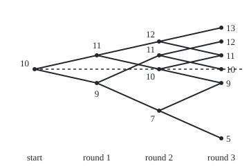

# Filtrations: what is known at each time, and processes that only use it

[Syllabus](../../../SYLLABUS.md) → [Stochastic processes and calculus](../../../SYLLABUS.md#w11) → [Random Walks and Filtrations](../../../SYLLABUS.md#w11-s01) → Filtrations

---

## General Overview

A gambler sits down with 10 chips for three rounds of a fair coin game. Each round the gambler names a stake; a win pays the stake, a loss takes it. The stake rule is called **chase**: bet 1 chip, but bet 2 whenever the pile is below 10. After a first loss the pile is 9, so round 2 carries 2 chips. That choice is made with 9 chips on the table and the coin not yet tossed: it uses round 1 and nothing later.

A second rule, **peek**, stakes 1 chip on every round it is going to win and sits out every round it is going to lose. It never ends below 10 chips and averages 11.5. Nobody can play it. It needs the coin's answer before the coin is tossed.

The difference is timing. What is known after each round is a **filtration**. A running number read off from what is known now, such as the chip count, is **adapted**. One read off a round earlier, such as a legitimate stake, is **predictable**. Chase is predictable. Peek is only adapted: known once its round is over, too late to bet with.

**A filtration lists, round by round, the events already decided; a process is adapted when its value is decided by now, and predictable when it was decided one round ago, which is the condition every real stake must meet.**

**What kind of fact this is:** three definitions (filtration, adapted, predictable), with two small facts about them proved on this card in Why it works: a quantity is known exactly when it is constant on every cell of information, and a predictable stake on a fair round adds nothing to the average.

### The picture: the chase rule's chip count, to scale

<p align="center"></p>

Height is chips, 20 units per chip; the dashed line is 10 chips. Each fork opens where the stake is already fixed, so each point sits halfway between its two children; the forks twice as wide carry a stake of 2, and they are the ones below the dashed line. The endings 11 and 9 are each reached by two histories.

---

## The formula

Notation first, in words. A process as one random variable per round, and its paths, come from [Stochastic processes](01-processes-and-paths.md). $\Omega$ is the set of the 8 win-loss histories, WWW to LLL, each with probability 0.125. $\xi_n$ (the Greek letter xi) is the result of round $n$: +1 for a win, −1 for a loss. The sigma-algebra a quantity generates, written $\sigma(\ldots)$, is the collection of events it settles: its information ([Random variables as measurable maps](../../10-Measure%20and%20integration/03-Measurable%20Functions/04-random-variables-and-their-information.md)). Here that information grows with time. The information generated by the game's own results is its **natural filtration**. From here on in this wing, $\mathcal F_n$ is read "what is known by round $n$".

**The filtration of the game:**

$$\mathcal F_0 = \{\varnothing, \Omega\}, \qquad \mathcal F_n = \sigma(\xi_1, \dots, \xi_n), \qquad \mathcal F_0 \subseteq \mathcal F_1 \subseteq \mathcal F_2 \subseteq \mathcal F_3 .$$

**Read it aloud:** before any round nothing is known but "something happens"; after round $n$ every event the first $n$ results decide is known; and nothing known is ever forgotten.

The general definition, for any nested chain of sigma-algebras, is in [Filtrations and martingales](../../10-Measure%20and%20integration/09-Conditional%20Expectation/06-filtrations-and-martingales.md), whose three-hand poker night already builds this same tree: its cells, the counts 2, 4, 16, 256 and their nesting. What is new here is the one-round shift: predictability.

**Adapted and predictable:**

$$X_n \text{ is } \mathcal F_n\text{-measurable}, \qquad H_n \text{ is } \mathcal F_{n-1}\text{-measurable} \quad (n \ge 1).$$

**Read it aloud:** the chip count after round $n$ is settled by the first $n$ results; the stake on round $n$ is settled by the first $n-1$.

On a finite tree, "settled by" means "a function of", by the Doob–Dynkin lemma from the measure wing. So a predictable stake is a rule $h_n$ applied to the rounds already played, and the chip count follows from the stakes:

$$H_n = h_n(\xi_1, \dots, \xi_{n-1}), \qquad X_n = 10 + \sum_{k=1}^{n} H_k\, \xi_k .$$

**Read it aloud:** the stake on round $n$ is computed from the earlier results alone; the chips are the starting 10 plus each round's stake times its result.

| Symbol | Plain meaning | In our example | Push it up and the answer… |
| --- | --- | --- | --- |
| $\Omega$ | all ways the three rounds can go | 8 histories, 0.125 each | — |
| $n$, $k$ | a round number; a counter running up to it | 0 to 3 | a later round knows more |
| $\xi_n$, $\xi_1$, $\xi_k$ | the result of a round: +1 win, −1 loss | on LLW: −1, −1, +1 | — |
| $\mathcal F_n$, $\mathcal F_{n-1}$ | the filtration: events decided by round $n$ | 2, 4, 16, 256 events | finer cells, more is known |
| $\sigma(\ldots)$, $\varnothing$ | the events some quantities settle; the empty event | $\sigma(\xi_1)$ has 4 events | — |
| $X_n$, $X_{n-1}$ | chips after round $n$, an adapted process; the pile before round $n$ | 10, 9, 7, 9 on LLW | — |
| $H_n$, $H_k$ | the stake on a round, a predictable process | 1, 2, 2 on LLW | wider swings, the same average |
| $h_n$ | the rule turning earlier results into a stake | chase: 2 below 10, else 1 | — |
| $E[\,\cdot \mid \mathcal F_{n-1}]$, $E$ | the average over what is still possible, given round $n-1$; a plain average | 0 for chase's round-2 gain | — |
| $\mathcal G_n$ | an insider's filtration, one round ahead: $\mathcal F_{n+1}$ | makes peek predictable | — |
| $Y$, $y$, $y'$, $\omega$, $C$, $C_0$, $a$, $c$ | in the proof: any quantity of the history, and two values it takes; one history; a cell; the one cell before round 1; a list of results; a count of cells | $c$ = 4 cells after round 2 | more cells, more events |
| $s$, $u$, $v$ | in the proof: a stake constant on a cell; the stakes on its win half and its loss half | chase in cell L: $s$ = 2; peek: $u$ = 1, $v$ = 0 | $u$ above $v$ is a false edge |

### When it holds

These are definitions, so there is nothing to hold; each is relative to a stated filtration and says nothing about fairness. The small facts proved below need:

- **Nested information.** $\mathcal F_n \subseteq \mathcal F_{n+1}$. A record of the last result alone forgets round 1, and chase's round-3 stake, 1 after WL and 2 after LL, cannot be read from it.
- **The filtration named.** Predictable is relative. Peek is not predictable for $\mathcal F_n$, but it is for an insider's $\mathcal G_n = \mathcal F_{n+1}$.
- **Fair rounds, for the zero-gain fact.** Each $\xi_n$ averages 0 whatever came before. With a house edge a predictable stake still loses on average; predictability removes a false advantage, it does not create fairness.
- **Stakes with a finite range.** Here 0, 1 or 2 chips. Unbounded stakes on unboundedly many rounds need more care, handled in [Betting on a martingale](../02-Martingales/02-predictable-bets-and-the-martingale-transform.md).

---

## Why it works

### Step 0: information is a way of telling histories apart

Before round 1, all 8 histories look alike. After round 1, a gambler who saw a win knows the history is one of WWW, WWL, WLW, WLL, but not which. Those four form a **cell**: a group of histories that the information so far cannot separate. Knowing something means knowing which cell the game is in.

### Step 1: the cells split every round, so the filtration grows

These are the cells of the poker night in [Filtrations and martingales](../../10-Measure%20and%20integration/09-Conditional%20Expectation/06-filtrations-and-martingales.md), here on the chip game. After 0, 1, 2 and 3 rounds there are 1, 2, 4 and 8 cells. Each cell after round $n+1$ sits inside one cell after round $n$: learning a result splits a cell in two and never merges two.

An event is decided by round $n$ when it is a union of whole cells: "won round 1" is the union of the W cells, and it is known after round 1. With $c$ cells there are $2^c$ such unions. So $\mathcal F_0, \dots, \mathcal F_3$ hold 2, 4, 16 and 256 events. Because cells only split, every union of old cells is a union of new cells, and $\mathcal F_n \subseteq \mathcal F_{n+1}$.

### Step 2: a quantity is known when it is constant on every cell

A number that depends on the history is known after round $n$ when it takes one value on each cell: whichever history in the cell is the true one, the number is the same, so seeing the cell is enough. That is exactly $\mathcal F_n$-measurability on a finite tree.

The chip count passes: after round 2 under chase, the cell LL holds LLW and LLL, both at 7 chips. The final pile fails after round 1: the cell W holds WWW, ending at 13, and WLL, ending at 9.

### Step 3: a stake must be constant on the cells of the round before

The stake on round $n$ has to be placed before $\xi_n$ is revealed. At that moment the gambler knows the cell after round $n-1$ and nothing finer. So the stake must be constant on those cells: $H_n$ is $\mathcal F_{n-1}$-measurable. That is predictability.

Chase passes: on round 2 it stakes 1 throughout the cell W and 2 throughout the cell L. Peek fails at once. On round 1 it stakes 1 on WWW and 0 on LLL, yet before round 1 those histories share the one cell $\Omega$. Peek's stake is constant on the cells after its own round, so it is adapted, but adapted is one round too late for a bet.

### Step 4: why the timing matters for the average

Take round 2 in the cell L, after a first loss. Inside that cell chase's stake is the fixed number 2, and the round's gain is $H_2 \xi_2$. Averaging over the cell's two halves, win and loss equally likely:

$$E[H_2 \xi_2 \mid \mathcal F_1] = 2 \times (0.5 \times 1 + 0.5 \times (-1)) = 0 .$$

The stake came outside the average because it was constant on the cell. That is the rule "taking out what is known" ([The rules of conditional expectation](../../10-Measure%20and%20integration/09-Conditional%20Expectation/04-rules-of-conditional-expectation.md)), and it is the only place predictability is used. After a first win the same computation gives $1 \times 0 = 0$. Every round adds 0 on average, so chase ends at 10 on average: its 8 endings 13, 11, 11, 9, 12, 10, 9 and 5 sum to 80.

Peek's stake is not constant on the cell before its round, so it cannot come out. On round 1 it pairs a stake of 1 with the win and 0 with the loss: $0.5 \times 1 \times 1 + 0.5 \times 0 \times (-1) = 0.5$ per round, and 1.5 over three. The advantage is exactly the correlation between the stake and a result it was not allowed to see.

With stakes of 0 or 1 chip there are 128 predictable rules, and all 128 average exactly 10; the 16384 adapted rules average anywhere from 8.5 to 11.5.

<details>
<summary>Detailed proof</summary>

**Setting.** $\Omega = \{-1, +1\}^3$ with probability $1/8$ on each history, $\xi_n$ the $n$-th coordinate. For $n = 0, \dots, 3$ the $n$-cells are the sets $C_n(a) = \{\omega : (\xi_1, \dots, \xi_n)(\omega) = a\}$, one for each prefix $a$ of length $n$; $C_0$ is $\Omega$.

**1. $\mathcal F_n$ is the unions of $n$-cells, and the chain is nested.** The $n$-cells partition $\Omega$, since each history has one prefix. Unions of cells contain $\Omega$ and are closed under complement (take the other cells) and under unions, so they form a sigma-algebra. Each event $\{\xi_i = \pm 1\}$ with $i \le n$ is a union of $n$-cells, so $\sigma(\xi_1, \dots, \xi_n)$ lies inside it; each cell is the intersection of the events $\{\xi_i = a_i\}$, so it lies in $\sigma(\xi_1, \dots, \xi_n)$, and so do its unions. Equality follows. An $(n+1)$-cell has a unique $n$-prefix, so it lies in one $n$-cell; hence every union of $n$-cells is a union of $(n+1)$-cells and $\mathcal F_n \subseteq \mathcal F_{n+1}$. With $2^n$ cells, $\mathcal F_n$ has $2^{2^n}$ events.

**2. Measurable means constant on cells.** If $Y$ is constant on each $n$-cell, the preimage of any set of values is the union of the cells whose value lies in it, an event of $\mathcal F_n$. If $Y$ takes two values $y < y'$ on one cell, the preimage of the numbers below $(y + y')/2$ contains part of the cell but not all of it, so it is no union of cells and $Y$ is not $\mathcal F_n$-measurable. A function constant on cells is a function of the prefix, which is the Doob–Dynkin lemma in this finite setting.

**3. A predictable stake adds zero mean on a fair round.** Let $H_n$ be $\mathcal F_{n-1}$-measurable, so equal to a constant $s$ on an $(n-1)$-cell $C$. That cell splits into two $n$-cells of equal probability, one with $\xi_n = +1$ and one with $\xi_n = -1$. The average of $H_n \xi_n$ over $C$ is $s(\tfrac12 \cdot 1 + \tfrac12 \cdot (-1)) = 0$. So $E[H_n \xi_n \mid \mathcal F_{n-1}] = 0$ on every cell, and averaging over the cells gives $E[H_n \xi_n] = 0$. Summing over $k = 1, \dots, n$, by linearity $E[X_n] = 10$ for every predictable stake rule.

**4. The adapted range.** An $\mathcal F_n$-measurable stake in $\{0, 1\}$ is $u$ on the win half of an $(n-1)$-cell and $v$ on its loss half, and adds $\tfrac12(u - v)$ to that cell's average: between $-\tfrac12$ and $\tfrac12$, the top only when $u = 1$ and $v = 0$, as for peek. Over three rounds the mean final pile lies between 8.5 and 11.5, both reached.

</details>

A second road skips the cells: a rule is predictable when it is a program whose input is the list of earlier results. Chase is one; peek needs the current result as input.

---

## Worked numbers, by hand

The history LLW under chase, round by round.

| Step | Arithmetic | Value |
| --- | --- | --- |
| before round 1: cell $\Omega$, all 8 histories | 10 is not below 10, stake 1 | $H_1 = 1$ |
| round 1 lost | 10 − 1 | $X_1 = 9$ |
| before round 2: cell L, 4 histories | 9 is below 10, stake 2 | $H_2 = 2$ |
| round 2 lost | 9 − 2 | $X_2 = 7$ |
| before round 3: cell LL, 2 histories | 7 is below 10, stake 2 | $H_3 = 2$ |
| round 3 won | 7 + 2 | $X_3 = 9$ |
| mean gain of round 2, given cell L | 2 × (0.5 × 1 + 0.5 × (−1)) | 0 |
| all 8 endings | 13 + 11 + 11 + 9 + 12 + 10 + 9 + 5 | 80 |
| mean ending | 80 ÷ 8 | **10** |

Every stake was fixed before its coin fell, so the game averages the 10 chips it began with, though chase ends below 10 on 3 of 8 histories and as low as 5.

### What breaks if you drop a piece

| Mistake | Comes out at | What went wrong |
| --- | --- | --- |
| Stake set after the toss (peek) | mean 11.5, never below 10 | adapted, not predictable: the stake saw its own result |
| Adapted taken as enough | 16384 rules averaging 8.5 to 11.5 | only the 128 predictable rules are all at 10 |
| Only the last result kept as the record | chase's round-3 stake 1 after WL, 2 after LL: no function of the last result | the record forgets, so it is not a filtration and cannot carry chase |

The code prints each row.

---

## Code, from first principles, and it actually runs

The code builds the cells of the three-round tree and tests every claim on them, by three roads. Road one is exact: the known events are counted by brute force over all 256 yes-no labellings of the 8 histories, and as 2 to the number of cells, and each rule is played on all 8 histories. Road two runs every rule with stakes 0 or 1, 128 predictable and 16384 adapted. Road three simulates 100000 nights with SplitMix64, a short random-number generator written out in both languages, seed 2026, and prints each mean with its standard error. The code checks one finite tree; the proof covers the rest.

### Python

```python
# Filtrations and predictable stakes -- the check behind the card.  Only math
# is imported, for one square root.  A gambler starts with 10 chips and plays
# three fair rounds; a round pays the stake on a win and takes it on a loss.
# The 8 win/loss histories are the outcomes.  What is known after n rounds is
# a partition of them into cells; a quantity is known when it is constant on
# every cell.  A stake is predictable when it is known one round before its toss.
import math

N, START, NIGHTS, SEED = 3, 10, 100000, 2026
MASK = (1 << 64) - 1
PATHS = [tuple(1 - 2 * ((p >> (N - 1 - k)) & 1) for k in range(N)) for p in range(2 ** N)]

def word(path):                              # +1 is a win W, -1 a loss L
    return "".join("W" if x > 0 else "L" for x in path)

def cells(n):                                # paths grouped by their first n tosses
    out = {}
    for i, p in enumerate(PATHS):
        out.setdefault(p[:n], []).append(i)
    return list(out.values())

def known(values, groups):                   # constant on every cell?
    return all(len({values[i] for i in c}) == 1 for c in groups)

def chase(toss, chips):                      # 2 chips when behind 10, else 1
    return 2 if chips < START else 1

def flat(toss, chips):
    return 1

def peek(toss, chips):                       # sits out every round it will lose
    return 1 if toss > 0 else 0

def play(path, rule):                        # chips after each round, and stakes
    chips, xs, stakes = START, [START], []
    for toss in path:
        s = rule(toss, chips)
        chips += s * toss
        xs.append(chips)
        stakes.append(s)
    return xs, stakes

def splitmix(state):                         # SplitMix64, written out
    state = (state + 0x9E3779B97F4A7C15) & MASK
    z = state
    z = ((z ^ (z >> 30)) * 0xBF58476D1CE4E5B9) & MASK
    z = ((z ^ (z >> 27)) * 0x94D049BB133111EB) & MASK
    return state, z ^ (z >> 31)

# road one, exact: count the questions settled by round n two ways, by brute
# force over all 256 yes/no labellings of the 8 paths and as 2 to the cells
brute = [sum(known([(f >> i) & 1 for i in range(8)], cells(n)) for f in range(256)) for n in range(N + 1)]
formula = [2 ** len(cells(n)) for n in range(N + 1)]
nested = all(any(set(a) <= set(b) for b in cells(n)) for n in range(N) for a in cells(n + 1))
print(f"{len(PATHS)} histories, probability {1 / len(PATHS):.3f} each; a round is won on "
      f"{sum(p[0] > 0 for p in PATHS)} of them, probability {sum(p[0] > 0 for p in PATHS) / len(PATHS):.3f}")
print("cells after rounds 0..3:", [len(cells(n)) for n in range(N + 1)])
print(f"events known after rounds 0..3, by brute force: {brute}; by 2^cells: {formula}")
print("each cell lies inside one cell of the round before:", "yes" if nested else "no")

plays = {name: [play(p, r) for p in PATHS] for name, r in (("flat", flat), ("chase", chase), ("peek", peek))}
flags = {}
for name in plays:
    st = [[s[k] for _, s in plays[name]] for k in range(N)]
    pred = all(known(st[k], cells(k)) for k in range(N))
    adap = all(known(st[k], cells(k + 1)) for k in range(N))
    flags[name] = (pred, adap)
    fin = [x[-1] for x, _ in plays[name]]
    print(f"{name}: predictable {'yes' if pred else 'no'}, adapted {'yes' if adap else 'no'}, "
          f"final chips {fin}, mean {sum(fin) / 8:.3f}, below 10 on {sum(f < START for f in fin)} of 8")
for p, (xs, st) in zip(PATHS, plays["chase"]):
    print(f"  chase {word(p)}: chips {xs}, stakes {st}")
fortune_known = all(known([x[n] for x, _ in plays["chase"]], cells(n)) for n in range(N + 1))
print("chase fortune known after each round (adapted):", "yes" if fortune_known else "no")
last = [[i for i, p in enumerate(PATHS) if p[1] == s] for s in (1, -1)]
r3 = [s[2] for _, s in plays["chase"]]
print(f"chase round-3 stake from the round-2 toss alone: {'possible' if known(r3, last) else 'not possible'}; "
      f"stakes after WL and LL: {r3[2]} and {r3[6]}")

gain = lambda name, k, idx: sum(plays[name][i][1][k] * PATHS[i][k] for i in idx) / len(idx)
print(f"mean gain in one round: chase round 2 after a first loss {gain('chase', 1, range(4, 8)):.3f}, "
      f"after a first win {gain('chase', 1, range(4)):.3f}; peek round 1 {gain('peek', 0, range(8)):.3f}")

# road two: every stake rule with stakes 0 or 1, 128 predictable, 16384 adapted
pred_means, adap_means = set(), []
for g in range(2 * 4 * 16):
    g1, g2, g3 = g & 1, (g >> 1) & 3, g >> 3
    tot = sum(START + sum(((gk >> (i >> (N - k))) & 1) * PATHS[i][k] for k, gk in enumerate((g1, g2, g3))) for i in range(8))
    pred_means.add(tot / 8)
for f1 in range(4):
    for f2 in range(16):
        for f3 in range(256):
            tot = sum(START + sum(((fk >> (i >> (N - 1 - k))) & 1) * PATHS[i][k] for k, fk in enumerate((f1, f2, f3))) for i in range(8))
            adap_means.append(tot / 8)
print(f"predictable rules: {2 * 4 * 16}, distinct mean finals: {', '.join(f'{m:.3f}' for m in sorted(pred_means))}")
print(f"adapted rules: {len(adap_means)}, mean finals from {min(adap_means):.3f} to {max(adap_means):.3f}; "
      f"formula 10 - 1.5 to 10 + 1.5, the peek rule at the top")

# road three: simulate the chase and peek rules with a seeded generator
state, sims = SEED, {"chase": [0.0, 0.0], "peek": [0.0, 0.0]}
for _ in range(NIGHTS):
    path = []
    for _ in range(N):
        state, z = splitmix(state)
        path.append(1 if z >> 63 else -1)
    for name, rule in (("chase", chase), ("peek", peek)):
        f = play(tuple(path), rule)[0][-1]
        sims[name][0] += f
        sims[name][1] += f * f
se = {}
for name, (s1, s2) in sims.items():
    m = s1 / NIGHTS
    se[name] = (m, math.sqrt((s2 / NIGHTS - m * m) / NIGHTS))
    print(f"simulated {name}, {NIGHTS} nights, seed {SEED}: mean {m:.4f}, standard error {se[name][1]:.4f}")

xs = [50 + 90 * n for n in range(N + 1)]
nodes = sorted({(n, x[n]) for x, _ in plays["chase"] for n in range(N + 1)})
print("figure, x = 50 + 90 * round, y = 200 - 20 * (chips - 5):",
      " ".join(f"({xs[n]},{200 - 20 * (c - 5)})" for n, c in nodes))

assert brute == formula == [2, 4, 16, 256] and nested                 # two roads to the counts
assert [sum(x[-1] for x, _ in plays[n]) for n in ("chase", "peek")] == [8 * START, 8 * START + 12]
assert pred_means == {10.0} and (min(adap_means), max(adap_means)) == (START - N / 2, START + N / 2)
assert abs(se["chase"][0] - START) < 4 * se["chase"][1] and abs(se["peek"][0] - 11.5) < 4 * se["peek"][1]
assert flags == {"flat": (True, True), "chase": (True, True), "peek": (False, True)}
assert fortune_known and not known(r3, last)                          # chase needs the whole past
print("ALL CHECKS PASS")
```

**Ran 2026-09-30 on macOS, Python 3.14.6, standard library only. All checks passed. Output, pasted from the run:**

```
8 histories, probability 0.125 each; a round is won on 4 of them, probability 0.500
cells after rounds 0..3: [1, 2, 4, 8]
events known after rounds 0..3, by brute force: [2, 4, 16, 256]; by 2^cells: [2, 4, 16, 256]
each cell lies inside one cell of the round before: yes
flat: predictable yes, adapted yes, final chips [13, 11, 11, 9, 11, 9, 9, 7], mean 10.000, below 10 on 4 of 8
chase: predictable yes, adapted yes, final chips [13, 11, 11, 9, 12, 10, 9, 5], mean 10.000, below 10 on 3 of 8
peek: predictable no, adapted yes, final chips [13, 12, 12, 11, 12, 11, 11, 10], mean 11.500, below 10 on 0 of 8
  chase WWW: chips [10, 11, 12, 13], stakes [1, 1, 1]
  chase WWL: chips [10, 11, 12, 11], stakes [1, 1, 1]
  chase WLW: chips [10, 11, 10, 11], stakes [1, 1, 1]
  chase WLL: chips [10, 11, 10, 9], stakes [1, 1, 1]
  chase LWW: chips [10, 9, 11, 12], stakes [1, 2, 1]
  chase LWL: chips [10, 9, 11, 10], stakes [1, 2, 1]
  chase LLW: chips [10, 9, 7, 9], stakes [1, 2, 2]
  chase LLL: chips [10, 9, 7, 5], stakes [1, 2, 2]
chase fortune known after each round (adapted): yes
chase round-3 stake from the round-2 toss alone: not possible; stakes after WL and LL: 1 and 2
mean gain in one round: chase round 2 after a first loss 0.000, after a first win 0.000; peek round 1 0.500
predictable rules: 128, distinct mean finals: 10.000
adapted rules: 16384, mean finals from 8.500 to 11.500; formula 10 - 1.5 to 10 + 1.5, the peek rule at the top
simulated chase, 100000 nights, seed 2026: mean 9.9959, standard error 0.0072
simulated peek, 100000 nights, seed 2026: mean 11.4975, standard error 0.0027
figure, x = 50 + 90 * round, y = 200 - 20 * (chips - 5): (50,100) (140,120) (140,80) (230,160) (230,100) (230,80) (230,60) (320,200) (320,120) (320,100) (320,80) (320,60) (320,40)
ALL CHECKS PASS
```

### Rust

Same rows, same labels, built with `rustc --edition 2021 -O`.

```rust
// Filtrations and predictable stakes -- the same check as the Python, in Rust.
// No crates.  A gambler starts with 10 chips and plays three fair rounds; a
// round pays the stake on a win and takes it on a loss.  The 8 win/loss
// histories are the outcomes.  What is known after n rounds is a partition of
// them into cells; a quantity is known when it is constant on every cell.  A
// stake is predictable when it is known one round before its toss.
use std::collections::BTreeMap;

const N: usize = 3;
const START: i64 = 10;
const NIGHTS: usize = 100000;
const SEED: u64 = 2026;
type Rule = fn(i64, i64) -> i64; // (toss about to be played, chips now) -> stake

fn paths() -> Vec<Vec<i64>> {                 // +1 is a win W, -1 a loss L
    (0..8).map(|p| (0..N).map(|k| 1 - 2 * ((p >> (N - 1 - k)) & 1) as i64).collect()).collect()
}

fn word(p: &[i64]) -> String { p.iter().map(|&x| if x > 0 { 'W' } else { 'L' }).collect() }

fn cells(ps: &[Vec<i64>], n: usize) -> Vec<Vec<usize>> {  // paths grouped by first n tosses
    let mut out: BTreeMap<Vec<i64>, Vec<usize>> = BTreeMap::new();
    for (i, p) in ps.iter().enumerate() { out.entry(p[..n].to_vec()).or_default().push(i) }
    let mut v: Vec<Vec<usize>> = out.into_values().collect();
    v.sort();
    v
}

fn known(values: &[i64], groups: &[Vec<usize>]) -> bool {  // constant on every cell?
    groups.iter().all(|c| c.iter().all(|&i| values[i] == values[c[0]]))
}

fn chase(_toss: i64, chips: i64) -> i64 { if chips < START { 2 } else { 1 } }
fn flat(_toss: i64, _chips: i64) -> i64 { 1 }
fn peek(toss: i64, _chips: i64) -> i64 { if toss > 0 { 1 } else { 0 } }  // sits out losing rounds

fn play(p: &[i64], rule: Rule) -> (Vec<i64>, Vec<i64>) {  // chips after each round, and stakes
    let (mut chips, mut xs, mut stakes) = (START, vec![START], vec![]);
    for &toss in p {
        let s = rule(toss, chips);
        chips += s * toss;
        xs.push(chips);
        stakes.push(s);
    }
    (xs, stakes)
}

fn splitmix(state: &mut u64) -> u64 {         // SplitMix64, written out
    *state = state.wrapping_add(0x9E3779B97F4A7C15);
    let mut z = *state;
    z = (z ^ (z >> 30)).wrapping_mul(0xBF58476D1CE4E5B9);
    z = (z ^ (z >> 27)).wrapping_mul(0x94D049BB133111EB);
    z ^ (z >> 31)
}

fn yn(b: bool) -> &'static str { if b { "yes" } else { "no" } }

fn main() {
    let ps = paths();
    let cl: Vec<Vec<Vec<usize>>> = (0..=N).map(|n| cells(&ps, n)).collect();
    // road one, exact: events counted by brute force over 256 labellings, and as 2^cells
    let brute: Vec<usize> = (0..=N).map(|n| (0..256usize)
        .filter(|f| known(&(0..8).map(|i| ((f >> i) & 1) as i64).collect::<Vec<_>>(), &cl[n])).count()).collect();
    let formula: Vec<usize> = (0..=N).map(|n| 1usize << cl[n].len()).collect();
    let nested = (0..N).all(|n| cl[n + 1].iter().all(|a| cl[n].iter().any(|b| a.iter().all(|i| b.contains(i)))));
    let wins = ps.iter().filter(|p| p[0] > 0).count();
    println!("{} histories, probability {:.3} each; a round is won on {} of them, probability {:.3}",
             ps.len(), 1.0 / ps.len() as f64, wins, wins as f64 / ps.len() as f64);
    println!("cells after rounds 0..3: {:?}", cl.iter().map(|c| c.len()).collect::<Vec<_>>());
    println!("events known after rounds 0..3, by brute force: {:?}; by 2^cells: {:?}", brute, formula);
    println!("each cell lies inside one cell of the round before: {}", yn(nested));

    let rules: [(&str, Rule); 3] = [("flat", flat), ("chase", chase), ("peek", peek)];
    let mut plays: BTreeMap<&str, Vec<(Vec<i64>, Vec<i64>)>> = BTreeMap::new();
    let mut flags: Vec<(bool, bool)> = vec![];
    for (name, r) in rules.iter() {
        let pl: Vec<_> = ps.iter().map(|p| play(p, *r)).collect();
        let st: Vec<Vec<i64>> = (0..N).map(|k| pl.iter().map(|(_, s)| s[k]).collect()).collect();
        let pred = (0..N).all(|k| known(&st[k], &cl[k]));
        let adap = (0..N).all(|k| known(&st[k], &cl[k + 1]));
        let fin: Vec<i64> = pl.iter().map(|(x, _)| x[N]).collect();
        println!("{}: predictable {}, adapted {}, final chips {:?}, mean {:.3}, below 10 on {} of 8", name, yn(pred),
                 yn(adap), fin, fin.iter().sum::<i64>() as f64 / 8.0, fin.iter().filter(|&&f| f < START).count());
        flags.push((pred, adap));
        plays.insert(name, pl);
    }
    for (p, (xs, st)) in ps.iter().zip(&plays["chase"]) { println!("  chase {}: chips {:?}, stakes {:?}", word(p), xs, st) }
    let fortune_known = (0..=N).all(|n| known(&plays["chase"].iter().map(|(x, _)| x[n]).collect::<Vec<_>>(), &cl[n]));
    println!("chase fortune known after each round (adapted): {}", yn(fortune_known));
    let last: Vec<Vec<usize>> = [1, -1].iter().map(|&s| (0..8).filter(|&i| ps[i][1] == s).collect()).collect();
    let r3: Vec<i64> = plays["chase"].iter().map(|(_, s)| s[2]).collect();
    println!("chase round-3 stake from the round-2 toss alone: {}; stakes after WL and LL: {} and {}",
             if known(&r3, &last) { "possible" } else { "not possible" }, r3[2], r3[6]);
    let gain = |name: &str, k: usize, idx: Vec<usize>| -> f64 {
        idx.iter().map(|&i| plays[name][i].1[k] * ps[i][k]).sum::<i64>() as f64 / idx.len() as f64 };
    println!("mean gain in one round: chase round 2 after a first loss {:.3}, after a first win {:.3}; peek round 1 {:.3}",
             gain("chase", 1, (4..8).collect()), gain("chase", 1, (0..4).collect()), gain("peek", 0, (0..8).collect()));

    // road two: every stake rule with stakes 0 or 1, 128 predictable, 16384 adapted
    let total = |fs: [usize; 3], shift: usize| -> i64 {
        (0..8).map(|i| START + (0..N).map(|k| ((fs[k] >> (i >> (N - k - shift))) & 1) as i64 * ps[i][k]).sum::<i64>()).sum() };
    let mut pred_means: Vec<i64> = (0..128usize).map(|g| total([g & 1, (g >> 1) & 3, g >> 3], 0)).collect();
    pred_means.sort();
    pred_means.dedup();
    let mut adap_means: Vec<i64> = vec![];
    for f1 in 0..4 { for f2 in 0..16 { for f3 in 0..256 { adap_means.push(total([f1, f2, f3], 1)) } } }
    let (lo, hi) = (*adap_means.iter().min().unwrap() as f64 / 8.0, *adap_means.iter().max().unwrap() as f64 / 8.0);
    println!("predictable rules: {}, distinct mean finals: {}", 2 * 4 * 16,
             pred_means.iter().map(|&t| format!("{:.3}", t as f64 / 8.0)).collect::<Vec<_>>().join(", "));
    println!("adapted rules: {}, mean finals from {:.3} to {:.3}; formula 10 - 1.5 to 10 + 1.5, the peek rule at the top",
             adap_means.len(), lo, hi);

    // road three: simulate the chase and peek rules with a seeded generator
    let mut state = SEED;
    let mut sims = [[0.0f64; 2]; 2];
    for _ in 0..NIGHTS {
        let path: Vec<i64> = (0..N).map(|_| if splitmix(&mut state) >> 63 == 1 { 1 } else { -1 }).collect();
        for (j, r) in [chase as Rule, peek as Rule].iter().enumerate() {
            let f = play(&path, *r).0[N] as f64;
            sims[j][0] += f;
            sims[j][1] += f * f;
        }
    }
    let mut se = [(0.0f64, 0.0f64); 2];
    for (j, name) in ["chase", "peek"].iter().enumerate() {
        let m = sims[j][0] / NIGHTS as f64;
        se[j] = (m, ((sims[j][1] / NIGHTS as f64 - m * m) / NIGHTS as f64).sqrt());
        println!("simulated {}, {} nights, seed {}: mean {:.4}, standard error {:.4}", name, NIGHTS, SEED, m, se[j].1);
    }
    let mut nodes: Vec<(usize, i64)> = plays["chase"].iter().flat_map(|(x, _)| (0..=N).map(move |n| (n, x[n]))).collect();
    nodes.sort();
    nodes.dedup();
    println!("figure, x = 50 + 90 * round, y = 200 - 20 * (chips - 5): {}",
             nodes.iter().map(|&(n, c)| format!("({},{})", 50 + 90 * n, 200 - 20 * (c - 5))).collect::<Vec<_>>().join(" "));

    assert!(brute == formula && formula == vec![2, 4, 16, 256] && nested);       // two roads to the counts
    let sums: Vec<i64> = ["chase", "peek"].iter().map(|n| plays[n].iter().map(|(x, _)| x[N]).sum()).collect();
    assert_eq!(sums, vec![8 * START, 8 * START + 12]);
    assert!(pred_means == vec![8 * START] && (lo, hi) == (START as f64 - 1.5, START as f64 + 1.5));
    assert!((se[0].0 - START as f64).abs() < 4.0 * se[0].1 && (se[1].0 - 11.5).abs() < 4.0 * se[1].1);
    assert_eq!(flags, vec![(true, true), (true, true), (false, true)]);
    assert!(fortune_known && !known(&r3, &last));                     // chase needs the whole past
    println!("ALL CHECKS PASS");
}
```

**Ran 2026-09-30 on macOS, rustc 1.98.1, no crates. All checks passed. Output, pasted from the run:**

```
8 histories, probability 0.125 each; a round is won on 4 of them, probability 0.500
cells after rounds 0..3: [1, 2, 4, 8]
events known after rounds 0..3, by brute force: [2, 4, 16, 256]; by 2^cells: [2, 4, 16, 256]
each cell lies inside one cell of the round before: yes
flat: predictable yes, adapted yes, final chips [13, 11, 11, 9, 11, 9, 9, 7], mean 10.000, below 10 on 4 of 8
chase: predictable yes, adapted yes, final chips [13, 11, 11, 9, 12, 10, 9, 5], mean 10.000, below 10 on 3 of 8
peek: predictable no, adapted yes, final chips [13, 12, 12, 11, 12, 11, 11, 10], mean 11.500, below 10 on 0 of 8
  chase WWW: chips [10, 11, 12, 13], stakes [1, 1, 1]
  chase WWL: chips [10, 11, 12, 11], stakes [1, 1, 1]
  chase WLW: chips [10, 11, 10, 11], stakes [1, 1, 1]
  chase WLL: chips [10, 11, 10, 9], stakes [1, 1, 1]
  chase LWW: chips [10, 9, 11, 12], stakes [1, 2, 1]
  chase LWL: chips [10, 9, 11, 10], stakes [1, 2, 1]
  chase LLW: chips [10, 9, 7, 9], stakes [1, 2, 2]
  chase LLL: chips [10, 9, 7, 5], stakes [1, 2, 2]
chase fortune known after each round (adapted): yes
chase round-3 stake from the round-2 toss alone: not possible; stakes after WL and LL: 1 and 2
mean gain in one round: chase round 2 after a first loss 0.000, after a first win 0.000; peek round 1 0.500
predictable rules: 128, distinct mean finals: 10.000
adapted rules: 16384, mean finals from 8.500 to 11.500; formula 10 - 1.5 to 10 + 1.5, the peek rule at the top
simulated chase, 100000 nights, seed 2026: mean 9.9959, standard error 0.0072
simulated peek, 100000 nights, seed 2026: mean 11.4975, standard error 0.0027
figure, x = 50 + 90 * round, y = 200 - 20 * (chips - 5): (50,100) (140,120) (140,80) (230,160) (230,100) (230,80) (230,60) (320,200) (320,120) (320,100) (320,80) (320,60) (320,40)
ALL CHECKS PASS
```

The two outputs match line for line, the simulated means included, since both languages draw the same SplitMix64 stream.

> [!TIP]
> **Try changing**
> Guess first, then run it.
> - **A bigger catch-up stake.** In `chase`, stake 3 instead of 2 when below 10. The mean stays 10.000; the worst ending drops to 3, and every assert passes.
> - **Let chase look at the coin.** Stake 2 when `toss < 0`, the round about to be lost. The mean falls to 8.500 and the run reports "predictable no": looking ahead can hurt too. The second assert stops it.
> - **A greedier peek.** Stake 2 on winning rounds. The mean climbs to 13.000; the second assert stops it.
> - **Fewer nights.** Set `NIGHTS` to 1000. The standard errors grow about tenfold, to 0.0731 and 0.0273, and the means, 9.9870 and 11.4970, stay within them.

---

## The usual mistake

> [!warning]
> **Letting a stake depend on the round it is placed on.** Peek uses only results that exist by the end of its round, so it is adapted and looks harmless. But a stake is committed before its round, and one that knows its round's result averages 11.5 chips in a game that should average 10. The test is one round stricter: constant on the cells of the round before.
>
> - **Reading the wrong pile.** Chase sizes round $n$ from $X_{n-1}$, the pile before the toss. Sizing it from $X_n$, the pile after, is peek in disguise: $X_n$ is adapted, not predictable.
> - **Predictable read as fair.** Predictability removes the false edge; it does not remove a house edge. On a coin that favours the house, chase still loses on average.

---

## Where you meet it in real life

- **Backtesting trading rules.** A backtest that sizes a trade with the closing price of the day it trades is peek: adapted, not predictable, and its profits are the same false edge as peek's.
- **Hedging a derivative.** Stock holdings are chosen each date from prices seen so far: a predictable process on a tree, built in [Representing a martingale](../02-Martingales/07-martingale-representation-in-discrete-time.md).
- **Stopping rules.** Quitting once a target is reached uses the past alone; stopping times formalise it with the same cells in [Stopping times](../02-Martingales/03-stopping-times-and-optional-stopping.md).
- **The Ito integral.** In continuous time the integrand of the Ito integral is adapted and is read at the left end of each small step, before that step's move, which makes every small bet predictable; [The Ito integral](../06-Ito%20Calculus/01-ito-integral.md) builds it from such stakes.

> **Say it back**
> Information after each round is a partition of the histories into cells that cannot yet be told apart, and the cells only split. The filtration lists the events that are unions of cells, round by round. A quantity is adapted when it is constant on the current cells, and predictable when it is constant on the cells of the round before. Every real stake is predictable, and on a fair round a predictable stake adds nothing on average. A stake that sees its own round, like peek, is only adapted, and that is where false edges come from.

---

## What this builds on

- [Stochastic processes](01-processes-and-paths.md): a process as one random variable per round, and a path per history.
- [Filtrations and martingales](../../10-Measure%20and%20integration/09-Conditional%20Expectation/06-filtrations-and-martingales.md): the general filtration and adapted process, on any probability space.
- [Random variables as measurable maps](../../10-Measure%20and%20integration/03-Measurable%20Functions/04-random-variables-and-their-information.md): the sigma-algebra a quantity generates, and Doob–Dynkin, which turns "known" into "a function of".

## Where this goes next

- [Martingales](../02-Martingales/01-martingales.md): an adapted process whose forecast of the next round, given the current cell, is its present value, as the chip count is at fair odds.

A predictable stake keeps the average at 10 chips over the whole night; whether it also keeps the forecast from every cell equal to the chips on the table at that round, and which processes do, is [Martingales](../02-Martingales/01-martingales.md).

---

## Sources

Verified 2026-09-29: every link below resolves to the publisher's page or the author's page for the book.

- Williams, David. *Probability with Martingales*. Cambridge University Press, 1991. [Publisher page](https://www.cambridge.org/core/books/probability-with-martingales/B4CFCE0D08930FB46C6E93E775503926). Filtrations, adapted and previsible processes, and the gambling reading of a stake.
- Shreve, Steven E. *Stochastic Calculus for Finance I: The Binomial Asset Pricing Model*. Springer, 2004. [DOI](https://doi.org/10.1007/978-0-387-22527-2). Information on a coin-toss tree, cell by cell, and adapted portfolios.
- Durrett, Rick. *Probability: Theory and Examples*, 5th ed. Cambridge University Press, 2019. [Author's page with the full text](https://services.math.duke.edu/~rtd/PTE/pte.html). Chapter 4 defines filtrations and predictable sequences and proves that betting on a fair game with a predictable stake stays fair.
