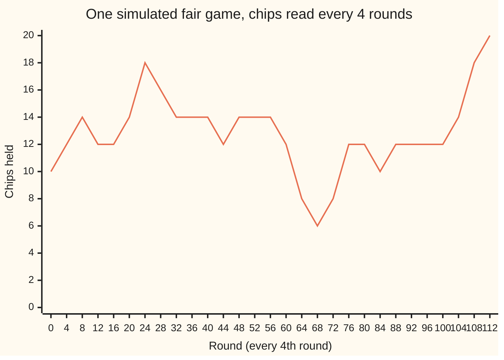
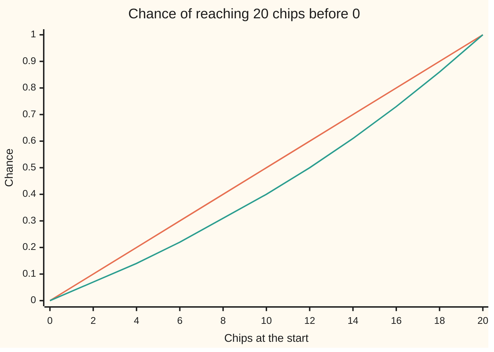

# Gambler's ruin: the chance of reaching the target before the floor

[Syllabus](../../../SYLLABUS.md) → [Stochastic processes and calculus](../README.md) → [Random Walks and Filtrations](../README.md#s01) → Gambler's ruin

---

## General Overview

A gambler sits down with 10 chips. Each round she stakes 1 chip on an even-money bet: win and she gains a chip, lose and she gives one up. She has set herself two rules. Reach 20 chips and she leaves, bankroll doubled. Reach 0 and she has no choice: she is ruined.

Two questions decide whether the evening is worth having. How likely is she to double up before she goes broke? And how many rounds will it take, on average?

At a fair table, where each round is won half the time, the answers are 50 percent and 100 rounds. At a table tilted a single point against her, where each round is won 49 times in 100, the chance of doubling falls to about 40 percent and the average game lasts 98.70 rounds. Each round costs her 0.02 chips on average. Over about 99 rounds that is about 2 chips, a tenth of the 20 that separate the walls, and that tenth comes off her chance: 50 percent becomes about 40.

Both answers come from one move, **first-step analysis**: the first round sends her to 9 chips or to 11, and from there the game starts afresh. Written down for every chip count, that gives one equation per count, and a recurrence solves them exactly.

**The chance of reaching the target first satisfies "chance here = win chance × chance one chip up + lose chance × chance one chip down", with 0 at the floor and 1 at the target; the solution is k/L for a fair game and (1 − r^k)/(1 − r^L) with r = lose chance / win chance otherwise, and the expected length solves the same equation with 1 added for the round just played.**

**What kind of fact this is:** a theorem, proved on this card in Why it works, with the complete argument in a folded Detailed proof.

### The picture: one fair game, from 10 chips to 20



This is one sample: the first of 20000 games the code plays at a fair table, seed 20260929, read on a grid of every fourth round. Between grid points the path dipped as low as 5 chips and rose to 19 before it hit 20 at round 112. Another seed draws another path.

---

## The formula

Notation first, in words. The chips after round n are written $X_n$, the value of the process at time n, with time counted in rounds ([Stochastic processes](01-processes-and-paths.md)). Between the walls, $X_n$ is a simple random walk ([Simple random walk](02-simple-random-walk.md)): each round adds 1 with chance $p$ and subtracts 1 with chance $q = 1 - p$, independently of every other round. The game ends at the round $T$, the first round at which the chips reach 0 or the target $L$.

Start with $k$ chips. Write $h_k$ for the chance of reaching $L$ before 0, and $t_k$ for the expected number of rounds, $E[T]$. Then

$$h_k = \frac{k}{L} \quad \text{if } p = q, \qquad h_k = \frac{1 - r^k}{1 - r^L}, \quad r = \frac{q}{p}, \quad \text{if } p \ne q.$$

**Read it aloud:** at a fair table the chance of doubling up is the fraction of the way to the target already held; at a tilted table each chip nearer the target adds r times the chance the chip below it added, and the answer is the share of those growing steps already climbed.

The expected length follows from the chance:

$$t_k = k\,(L - k) \quad \text{if } p = q, \qquad t_k = \frac{k - L\,h_k}{q - p} \quad \text{if } p \ne q.$$

**Read it aloud:** a fair game lasts, on average, the distance to the floor times the distance to the target; a tilted game lasts the expected chips lost, divided by the chips lost per round.

The chance of ruin is $1 - h_k$, because the game ends at one wall or the other (Step 1 proves it ends).

| Symbol | Plain meaning | In our example | Push it up and the answer… |
| --- | --- | --- | --- |
| $X_n$, $n$ | chips held after round n; the round count | 10 at round 0 | — |
| $k$ | chips at the start | 10 | $h_k$ rises towards 1 |
| $L$ | the target, where she leaves | 20 | $h_k$ falls, $t_k$ grows |
| $p$ | chance of winning one round | 0.50 or 0.49 | $h_k$ rises |
| $q$ | chance of losing one round, $1 - p$ | 0.50 or 0.51 | $h_k$ falls |
| $r$ | the tilt, $q/p$ | 1 or 1.040816 | $h_k$ falls |
| $h_k$ | chance of reaching $L$ before 0 from $k$ chips | 0.5 or 0.4013 | — |
| $t_k$ | expected rounds until either wall, $E[T]$ | 100 or 98.70 | — |
| $T$ | the round the game ends | 112 in the pictured game | — |
| $d_k$ | the step up in chance from $k - 1$ chips to $k$, $h_k - h_{k-1}$ | 1/20 each, fair | — |
| $g_k$ | the duration minus its drift part, $t_k - k/(q-p)$ | used in Step 5 | — |
| $\xi_1$, $B_j$, $u_k$, $P_k$, $E_k$ | in the Detailed proof only: the first round's +1 or −1; block j all wins; a difference of two solutions; chance and average from start k | — | — |

The chance as a function of the starting chips, at both tables:



Orange: the fair table, a straight line. Green: the table at 0.49, which sags below it everywhere between the walls. The sag is largest in the middle, where the game is longest.

### When it holds

- **Fixed stakes of one chip.** Stake all 10 chips on one round at 0.49 and the chance of doubling is 0.49, not 0.4013: the formula describes one strategy, not every strategy.
- **The same chance every round, rounds independent.** Without this the first round does not restart the game; the equations change and so does the answer.
- **Two walls.** Remove the target and a fair game ruins her with certainty, while its expected length is infinite (Step 6).
- **Whole chips and a target reached exactly.** With stakes of one chip the walk cannot jump past a wall; with larger stakes it can overshoot, and the walls need redefining.

---

## Why it works

### Step 0: the first round restarts the game

After one round she holds 11 chips with chance $p$ or 9 with chance $q$. Each round is a fresh, independent bet, so from 11 chips the rest of the game is the same game, started at 11. Averaging over the first round turns one question about whole paths into one question per chip count, each about its two neighbours.

### Step 1: the game ends

Before any average is taken, the game must be known to stop. From any chip count, $L$ wins in a row reach the target, wherever she stands. Split the rounds into blocks of $L$. Each block, whatever came before, is all wins with chance $p^L$, which is more than 0. So the game is still running after m blocks with chance at most $(1 - p^L)^m$. That shrinks geometrically: the game ends with probability 1, and $E[T]$ is finite. The bound is crude; in the code, less than one in $10^{16}$ of the chance is unresolved after 3000 rounds.

### Step 2: the chance equations

Condition on the first round. With chance $p$ she moves to $k + 1$ and then reaches $L$ first with chance $h_{k+1}$; with chance $q$ she moves to $k - 1$. The law of total probability gives, for every $k$ from 1 to $L - 1$,

$$h_k = p\,h_{k+1} + q\,h_{k-1}, \qquad h_0 = 0, \quad h_L = 1.$$

At 0 she has already lost, at $L$ already won: $L - 1$ equations in $L - 1$ unknowns.

### Step 3: the steps between neighbours form a first-order recurrence

Write $d_k = h_k - h_{k-1}$ for the step up in chance from $k - 1$ chips to $k$. Write $h_k = p\,h_k + q\,h_k$, since $p + q = 1$, and subtract from the equation of Step 2:

$$p\,(h_{k+1} - h_k) = q\,(h_k - h_{k-1}), \qquad \text{so} \qquad d_{k+1} = r\,d_k.$$

Each step up the ladder of chances is the tilt $r$ times the previous one: a first-order recurrence with no added constant ([First-order recurrences](../../04-Combinatorics%20and%20graphs/05-Recurrences/03-first-order-recurrences-and-loans.md)). So $d_k = r^{k-1} d_1$. The steps from 0 to $L$ add up to $h_L - h_0 = 1$:

$$d_1\,(1 + r + \dots + r^{L-1}) = 1, \qquad h_k = d_1\,(1 + r + \dots + r^{k-1}).$$

Divide the two sums. At a fair table $r = 1$, every step is the same, $1/L$, and $h_k = k/L$: a twentieth per chip, 0.5 at 10 chips. Otherwise the geometric sum $1 + r + \dots + r^{k-1}$ equals $(1 - r^k)/(1 - r)$, and the ratio is the formula.

At 0.49 the tilt is $r$ = 1.040816, so each chip nearer the target is worth about 4 percent more chance than the chip below it. Most of the climb from 0 to 1 happens near the top, which is why the green curve sags.

### Step 4: only one answer fits

The equations of Step 2 have exactly one solution. If two sequences both satisfied them, their difference would be 0 at both walls and would equal, at every inner point, a weighted average of its two neighbours. An average cannot exceed both of the numbers it averages, so the largest value of the difference, if positive, would be shared by the neighbours, and by theirs, all the way to a wall, where it is 0. So the difference is never positive, and by the same argument never negative. The chance and the formula satisfy the same equations; they are the same numbers.

### Step 5: the duration equations

The same conditioning, with one round counted for the round just played:

$$t_k = 1 + p\,t_{k+1} + q\,t_{k-1}, \qquad t_0 = t_L = 0.$$

This step uses Step 1: an equation between expectations says nothing if $t_k$ could be infinite.

At a fair table, rearranging gives $(t_{k+1} - t_k) - (t_k - t_{k-1}) = -2$. The steps fall by 2 each time, so $t_k$ is a downward parabola with zeros at 0 and $L$: $t_k = k(L - k)$. Check it: $k(L - k)$ is 0 at both walls, and $\tfrac12(k+1)(L-k-1) + \tfrac12(k-1)(L-k+1) = k(L-k) - 1$. At 10 chips, 10 × 10 = 100 rounds.

At a tilted table, each round loses $q - p$ chips on average, so $k/(q - p)$ solves the equation away from the walls: the drift part. It misses the walls, so correct it. Let $g_k = t_k - k/(q - p)$. Substituting, the 1 cancels against the drift, and

$$g_k = p\,g_{k+1} + q\,g_{k-1}, \qquad g_0 = 0, \quad g_L = -\frac{L}{q - p}.$$

That is the chance equation again, scaled: $g_k = -L\,h_k/(q - p)$, by Step 4's uniqueness. Adding back the drift part gives $t_k = (k - L\,h_k)/(q - p)$. The numerator is her expected loss of chips, $k$ minus the expected chips at the end, $L\,h_k$; dividing by the loss per round gives rounds. At 0.49: $(10 - 8.025990)/0.02$ = 98.7005.

### Step 6: move the target away

Hold 10 chips and raise the target at a fair table. The chance of reaching it is $10/L$: 0.5, 0.3333, 0.25, down to 0.01 at a target of 1000, and to 0 as the target leaves altogether. With no upper wall, ruin is certain. Yet the expected length, $10(L - 10)$, runs 100, 200, 300 and on to 9900: it has no finite limit. Playing until ruin lasts at least as long as playing until ruin or $L$, so its mean is at least $10(L - 10)$ for every $L$. A fair game played until ruin ends with probability 1 and has an infinite expected length. Fair does not mean safe: the expected length is carried by rare, very long games that climb far before they fall.

Tilt the table her way instead, 0.51 a round. Then $r = 0.49/0.51 < 1$, $r^L$ vanishes as $L$ grows, and $h_k \to 1 - r^k$. From 10 chips the chance of never going broke is 0.3297, about one in three. At 0.49, $r > 1$, $h_k \to 0$ and ruin is certain.

<details>
<summary>Detailed proof</summary>

**Setting.** Let $\xi_1, \xi_2, \dots$ be independent, each $+1$ with probability $p \in (0, 1)$ and $-1$ with probability $q = 1 - p$. For a start $k \in \{0, \dots, L\}$ put $X_0 = k$, $X_n = k + \xi_1 + \dots + \xi_n$ until the first $n$ with $X_n \in \{0, L\}$, and $T$ that first $n$ (infinite if no such $n$ exists). Write $P_k$, $E_k$ for probability and expectation from start $k$.

**1. Finite exit time.** For $j \ge 0$ let $B_j$ be the event that $\xi_{jL+1}, \dots, \xi_{(j+1)L}$ are all $+1$. If $T > jL$ and $B_j$ happens then $T \le (j+1)L$, since $L$ up-steps from any interior point reach $L$. The $B_j$ are independent with probability $p^L$, so $P_k(T > mL) \le P(B_0^c \cap \dots \cap B_{m-1}^c) = (1 - p^L)^m$. Hence the game ends with $P_k$-probability 1 and $E_k T = \sum_{n \ge 0} P_k(T > n) \le L \sum_{m \ge 0} (1 - p^L)^m = L/p^L < \infty$.

**2. First-step identities.** For $0 < k < L$, on $\{\xi_1 = +1\}$ the shifted sequence $\xi_2, \xi_3, \dots$ is independent of $\xi_1$ with the same law, and the game it drives from $k + 1$ is the remaining game. So $P_k(X_T = L \mid \xi_1 = +1) = P_{k+1}(X_T = L)$, likewise for $-1$, and the law of total probability gives $h_k = p h_{k+1} + q h_{k-1}$. For duration, $T = 1 + T'$ with $T'$ the exit time of the shifted game, so conditioning on $\xi_1$ (all terms finite by part 1) gives $t_k = 1 + p t_{k+1} + q t_{k-1}$. The boundary values are immediate from $T = 0$ at a wall.

**3. Uniqueness.** Let $u$ satisfy $u_k = p u_{k+1} + q u_{k-1}$ for $0 < k < L$ with $u_0 = u_L = 0$. Suppose its largest value is positive, at some interior $k$. Then $u_k = p u_{k+1} + q u_{k-1}$ with both weights positive and both neighbours at most $u_k$ forces both neighbours to equal $u_k$. Repeating, $u_{k+1} = u_{k+2} = \dots = u_L = 0$, a contradiction. So $u \le 0$; applied to $-u$, $u \ge 0$. The difference of two solutions of either the chance or the duration system is such a $u$, so each system has one solution.

**4. Solving.** Step 3 of Why it works gives $h_k = \sum_{j<k} r^j / \sum_{j<L} r^j$, which is $k/L$ at $r = 1$ and $(1 - r^k)/(1 - r^L)$ otherwise; it satisfies the system, so by part 3 it is the chance. For duration, $v_k = k(L - k)$ at $p = q$, and $v_k = (k - L h_k)/(q - p)$ otherwise, satisfy the duration system, as checked in Step 5; by part 3, $t_k = v_k$.

**5. Ruin.** Part 1 gives $P_k(X_T \in \{0, L\}) = 1$, so $P_k(\text{ruin}) = 1 - h_k$.

</details>

**Another road.** At a fair table the chips are a fair game, a martingale in the language of this wing's second shelf: the expected chips after the next round equal the chips now. Stopping a fair game when it leaves a finite range keeps the average, so $10 = 20\,h_{10} + 0$, and $h_{10} = 0.5$ in one line. At a tilted table the same trick works on $r^{X_n}$, de Moivre's choice, and on $X_n + (q - p)n$ for the duration. The martingale cards of that shelf state when stopping keeps the average ([Stopping times](../02-Martingales/03-stopping-times-and-optional-stopping.md)), and show the doubling strategy, where it does not.

---

## Worked numbers, by hand

The tilted table: 10 chips, target 20, each round won with chance 0.49.

| Step | Arithmetic | Value |
| --- | --- | --- |
| the tilt $r$ | 0.51 / 0.49 | 1.040816 |
| $r^{10}$ | 1.040816 multiplied by itself ten times | 1.491904 |
| shortcut | $1 - r^{20} = (1 - r^{10})(1 + r^{10})$, so $h_{10} = 1/(1 + r^{10})$ | — |
| chance of doubling | 1 / 2.491904 | **0.401300** |
| chance of ruin | 1 − 0.401300 | 0.598700 |
| expected chips at the end | 20 × the chance of doubling, unrounded | 8.025990 |
| expected rounds | (10 − 8.025990) / 0.02 | **98.7005** |
| fair table, for comparison | 10 / 20 and 10 × 10 | 0.5 and 100 |

At the tilted table she doubles up about 40 times in 100 evenings and is ruined about 60 times, where a fair table would split them evenly; the evenings are almost as long either way.

### What breaks if you drop a piece

| Mistake | Comes out at | What went wrong |
| --- | --- | --- |
| Fair formula k/L at 0.49 | 0.5000, against 0.4013 | The tilt compounds over about 99 rounds; it is not a rounding error |
| Tilt upside down, $p/q$ for $q/p$ | 0.5987 | That is the ruin chance, or the chance at 0.51: the two walls swapped |
| All 10 chips on one round at 0.49 | 0.49, simulated 0.4934 ± 0.0035 | Fixed stakes dropped: at a table tilted against her, fewer rounds means less tilt |
| Top wall raised to 1000, fair | chance 0.0100, 9900 rounds | Two walls dropped in the limit: ruin certain, expected length infinite |

The code prints every row. The third row is why fixed stakes sit under "When it holds": at a fair table bold and timid play both give 0.5, but at 0.49 bold play wins more often.

---

## Code, from first principles, and it actually runs

The code takes four independent roads to the chance of doubling from 10 chips and the expected length, at 0.50 and at 0.49. The first is the closed forms. The second solves the first-step equations as a linear system by elimination, knowing nothing of the formulas. The third pushes the chance mass forward round by round for 3000 rounds: whatever reaches 20 is added to the chance, the chance of still playing is added to the length, and what is still unresolved is printed. The fourth plays 20000 games with a SplitMix64 generator written out, seed 20260929, and prints each estimate with its standard error. The asserts compare the formulas against elimination, against mass flow within the unresolved mass, and against simulation within 4 standard errors.

### Python

```python
# Gambler's ruin -- the check behind the card.  Nothing is imported.
# A gambler holds 10 chips, bets 1 chip a round, and stops at 0 or at 20.
# Four roads to the chance h of reaching 20 first and the expected number of
# rounds t: the closed forms; the first-step equations solved by elimination;
# the chance mass pushed forward round by round; and a seeded simulation.
K, L, SEED, GAMES = 10, 20, 20260929, 20000
MASK = (1 << 64) - 1

def formula(k, n, p):                    # the closed forms from Why it works
    q = 1 - p
    if p == 0.5:
        return k / n, k * (n - k)
    r = q / p
    h = (1 - r ** k) / (1 - r ** n) + 0.0
    return h, (k - n * h) / (q - p)

def first_step(n, p, rhs, end):          # q x[i-1] - x[i] + p x[i+1] = -rhs
    q = 1 - p                            # for i = 1..n-1, x[0] = 0, x[n] = end
    c, d = [0.0] * n, [0.0] * n          # forward sweep of Thomas elimination
    for i in range(1, n):
        den = -1 - q * c[i - 1]
        c[i] = p / den
        d[i] = (-rhs - q * d[i - 1]) / den
    x = [0.0] * (n + 1)
    x[n] = end
    for i in range(n - 1, 0, -1):        # back substitution
        x[i] = d[i] - c[i] * x[i + 1]
    return x

def mass_flow(k, n, p, rounds):          # move every scrap of chance, round by round
    m = [0.0] * (n + 1)
    m[k] = 1.0
    top = dur = 0.0
    for _ in range(rounds):
        dur += sum(m[1:n])               # P(still playing) adds up to E[rounds]
        new = [0.0] * (n + 1)
        for i in range(1, n):
            new[i + 1] += p * m[i]
            new[i - 1] += (1 - p) * m[i]
        top += new[n]
        new[0] = new[n] = 0.0
        m = new
    return top, dur, sum(m)

class SplitMix64:                        # the wing's generator, written out
    def __init__(self, seed):
        self.s = seed & MASK
    def uniform(self):
        self.s = (self.s + 0x9E3779B97F4A7C15) & MASK
        z = self.s
        z = ((z ^ (z >> 30)) * 0xBF58476D1CE4E5B9) & MASK
        z = ((z ^ (z >> 27)) * 0x94D049BB133111EB) & MASK
        return ((z ^ (z >> 31)) >> 11) / 9007199254740992.0

def play(g, k, n, p, path):              # one game; returns (reached n, rounds)
    x, t = k, 0
    while 0 < x < n:
        x += 1 if g.uniform() < p else -1
        t += 1
        path.append(x)
    return x == n, t

def simulate(k, n, p):
    g, wins, s1, s2 = SplitMix64(SEED), 0, 0.0, 0.0
    for _ in range(GAMES):
        won, t = play(g, k, n, p, [])
        wins, s1, s2 = wins + won, s1 + t, s2 + t * t
    h, mt = wins / GAMES, s1 / GAMES
    return h, (h * (1 - h) / GAMES) ** 0.5, mt, ((s2 / GAMES - mt * mt) / (GAMES - 1)) ** 0.5

print(f"game: start {K} chips, stop at 0 or {L}, stake 1 chip a round")
for p in (0.5, 0.49):
    hf, tf = formula(K, L, p)
    hs, ts = first_step(L, p, 0.0, 1.0)[K], first_step(L, p, 1.0, 0.0)[K]
    hm, tm, left = mass_flow(K, L, p, 3000)
    hr, seh, tr, set_ = simulate(K, L, p)
    print(f"p = {p:.2f}  formula     h = {hf:.6f}  t = {tf:.4f}")
    print(f"p = {p:.2f}  first-step  h = {hs:.6f}  t = {ts:.4f}")
    print(f"p = {p:.2f}  mass flow   h = {hm:.6f}  t = {tm:.4f}  unresolved after 3000 rounds {left:.1e}")
    print(f"p = {p:.2f}  simulated   h = {hr:.4f} +- {seh:.4f}  t = {tr:.2f} +- {set_:.2f}  ({GAMES} games)")
    print(f"p = {p:.2f}  ruin chance 1 - h = {1 - hf:.6f}")
    assert abs(hf - hs) < 1e-12                  # closed form against elimination
    assert abs(tf - ts) < 1e-9
    assert abs(hf - hm) <= left + 1e-12          # closed form against mass flow
    assert abs(tf - tm) < 1e-6
    assert abs(hr - hf) < 4 * seh                # simulation, within 4 standard errors
    assert abs(tr - tf) < 4 * set_
r = 0.51 / 0.49
r10 = 1.0
for _ in range(10):
    r10 *= r
h49 = 1 / (1 + r10)
print(f"worked, p = 0.49: r = {r:.6f}, r^10 = {r10:.6f}, h = 1/(1 + r^10) = {h49:.6f}")
print(f"worked, p = 0.49: 20 h = {20 * h49:.6f}, t = (10 - 20 h)/0.02 = {(10 - 20 * h49) / 0.02:.4f}")
assert abs(h49 - formula(K, L, 0.49)[0]) < 1e-12              # the 1/(1 + r^10) shortcut
for p in (0.5, 0.49):
    row = ", ".join(f"{formula(k, L, p)[0]:.2f}" for k in range(0, L + 1, 2))
    print(f"figure, h by start k = 0, 2, ..., 20, p = {p:.2f}: {row}")
path = [K]
won, T = play(SplitMix64(SEED), K, L, 0.5, path)
print(f"figure, first simulated fair game, chips every 4 rounds: {', '.join(str(path[i]) for i in range(0, T + 1, 4))}")
print(f"figure, that game ends at round {T} on {path[-1]}; lowest {min(path)}, highest before the end {max(path[:-1])}")
print(f"mistake, fair formula k/L used at p = 0.49: {K / L:.4f} against {formula(K, L, 0.49)[0]:.4f}")
print(f"mistake, ratio upside down, p/q for q/p: {formula(K, L, 0.51)[0]:.4f}")
g, wins = SplitMix64(SEED), 0
for _ in range(GAMES):                   # bold play: stake all 10 chips at once
    wins += g.uniform() < 0.49
se_b = (wins / GAMES * (1 - wins / GAMES) / GAMES) ** 0.5
print(f"mistake, stake all 10 chips in one round at p = 0.49: simulated {wins / GAMES:.4f} +- {se_b:.4f}, exact 0.4900")
assert abs(wins / GAMES - 0.49) < 4 * se_b
for n in (20, 30, 40, 80, 160, 1000):
    hf, tf = formula(K, n, 0.5)
    print(f"top wall moved up, fair, target {n}: h = {hf:.4f}, t = {tf:.0f}")
hf = formula(K, 1000, 0.51)[0]
q10 = 1.0
for _ in range(10):
    q10 *= 0.49 / 0.51
print(f"top wall moved up, p = 0.51: h at target 1000 = {hf:.4f}; limit 1 - (0.49/0.51)^10 = {1 - q10:.4f}")
assert abs(hf - (1 - q10)) < 1e-9
for k, n, p, what in ((100, 200, 0.49, "100 chips to 200 at 0.49"), (K, L, 18 / 38, "10 chips to 20 on red, 18/38")):
    hf, tf = formula(k, n, p)
    print(f"scale, {what}: h = {hf:.4f}, t = {tf:.2f}")
print("ALL CHECKS PASS")
```

**Ran 2026-09-29 on macOS, Python 3.14.6, standard library only. All checks passed. Output, pasted from the run:**

```
game: start 10 chips, stop at 0 or 20, stake 1 chip a round
p = 0.50  formula     h = 0.500000  t = 100.0000
p = 0.50  first-step  h = 0.500000  t = 100.0000
p = 0.50  mass flow   h = 0.500000  t = 100.0000  unresolved after 3000 rounds 9.1e-17
p = 0.50  simulated   h = 0.5022 +- 0.0035  t = 100.80 +- 0.58  (20000 games)
p = 0.50  ruin chance 1 - h = 0.500000
p = 0.49  formula     h = 0.401300  t = 98.7005
p = 0.49  first-step  h = 0.401300  t = 98.7005
p = 0.49  mass flow   h = 0.401300  t = 98.7005  unresolved after 3000 rounds 5.0e-17
p = 0.49  simulated   h = 0.4049 +- 0.0035  t = 98.37 +- 0.55  (20000 games)
p = 0.49  ruin chance 1 - h = 0.598700
worked, p = 0.49: r = 1.040816, r^10 = 1.491904, h = 1/(1 + r^10) = 0.401300
worked, p = 0.49: 20 h = 8.025990, t = (10 - 20 h)/0.02 = 98.7005
figure, h by start k = 0, 2, ..., 20, p = 0.50: 0.00, 0.10, 0.20, 0.30, 0.40, 0.50, 0.60, 0.70, 0.80, 0.90, 1.00
figure, h by start k = 0, 2, ..., 20, p = 0.49: 0.00, 0.07, 0.14, 0.22, 0.31, 0.40, 0.50, 0.61, 0.73, 0.86, 1.00
figure, first simulated fair game, chips every 4 rounds: 10, 12, 14, 12, 12, 14, 18, 16, 14, 14, 14, 12, 14, 14, 14, 12, 8, 6, 8, 12, 12, 10, 12, 12, 12, 12, 14, 18, 20
figure, that game ends at round 112 on 20; lowest 5, highest before the end 19
mistake, fair formula k/L used at p = 0.49: 0.5000 against 0.4013
mistake, ratio upside down, p/q for q/p: 0.5987
mistake, stake all 10 chips in one round at p = 0.49: simulated 0.4934 +- 0.0035, exact 0.4900
top wall moved up, fair, target 20: h = 0.5000, t = 100
top wall moved up, fair, target 30: h = 0.3333, t = 200
top wall moved up, fair, target 40: h = 0.2500, t = 300
top wall moved up, fair, target 80: h = 0.1250, t = 700
top wall moved up, fair, target 160: h = 0.0625, t = 1500
top wall moved up, fair, target 1000: h = 0.0100, t = 9900
top wall moved up, p = 0.51: h at target 1000 = 0.3297; limit 1 - (0.49/0.51)^10 = 0.3297
scale, 100 chips to 200 at 0.49: h = 0.0180, t = 4820.23
scale, 10 chips to 20 on red, 18/38: h = 0.2585, t = 91.76
ALL CHECKS PASS
```

### Rust

Same numbers, same labels, built with `rustc --edition 2021 -O`.

```rust
// Gambler's ruin -- the same check as the Python, in Rust.  No crates.
// A gambler holds 10 chips, bets 1 chip a round, and stops at 0 or at 20.
// Four roads to the chance h of reaching 20 first and the expected number of
// rounds t: the closed forms; the first-step equations solved by elimination;
// the chance mass pushed forward round by round; and a seeded simulation.
const K: usize = 10;
const L: usize = 20;
const SEED: u64 = 20260929;
const GAMES: usize = 20000;

fn formula(k: usize, n: usize, p: f64) -> (f64, f64) {  // the closed forms from Why it works
    let q = 1.0 - p;
    if p == 0.5 {
        return (k as f64 / n as f64, (k * (n - k)) as f64);
    }
    let r = q / p;
    let h = (1.0 - r.powi(k as i32)) / (1.0 - r.powi(n as i32)) + 0.0;
    (h, (k as f64 - n as f64 * h) / (q - p))
}

fn first_step(n: usize, p: f64, rhs: f64, end: f64) -> Vec<f64> {  // q x[i-1] - x[i] + p x[i+1] = -rhs
    let q = 1.0 - p;                                              // for i = 1..n-1, x[0] = 0, x[n] = end
    let (mut c, mut d) = (vec![0.0; n], vec![0.0; n]);            // forward sweep of Thomas elimination
    for i in 1..n {
        let den = -1.0 - q * c[i - 1];
        c[i] = p / den;
        d[i] = (-rhs - q * d[i - 1]) / den;
    }
    let mut x = vec![0.0; n + 1];
    x[n] = end;
    for i in (1..n).rev() {                                       // back substitution
        x[i] = d[i] - c[i] * x[i + 1];
    }
    x
}

fn mass_flow(k: usize, n: usize, p: f64, rounds: usize) -> (f64, f64, f64) {  // move every scrap of chance
    let mut m = vec![0.0; n + 1];
    m[k] = 1.0;
    let (mut top, mut dur) = (0.0, 0.0);
    for _ in 0..rounds {
        dur += m[1..n].iter().sum::<f64>();                       // P(still playing) adds up to E[rounds]
        let mut new = vec![0.0; n + 1];
        for i in 1..n {
            new[i + 1] += p * m[i];
            new[i - 1] += (1.0 - p) * m[i];
        }
        top += new[n];
        new[0] = 0.0;
        new[n] = 0.0;
        m = new;
    }
    (top, dur, m.iter().sum::<f64>())
}

struct SplitMix64 { s: u64 }                                      // the wing's generator, written out
impl SplitMix64 {
    fn uniform(&mut self) -> f64 {
        self.s = self.s.wrapping_add(0x9E3779B97F4A7C15);
        let mut z = self.s;
        z = (z ^ (z >> 30)).wrapping_mul(0xBF58476D1CE4E5B9);
        z = (z ^ (z >> 27)).wrapping_mul(0x94D049BB133111EB);
        ((z ^ (z >> 31)) >> 11) as f64 / 9007199254740992.0
    }
}

fn play(g: &mut SplitMix64, k: usize, n: usize, p: f64, path: &mut Vec<usize>) -> (bool, usize) {
    let (mut x, mut t) = (k, 0);                                  // one game; returns (reached n, rounds)
    while x > 0 && x < n {
        if g.uniform() < p { x += 1 } else { x -= 1 }
        t += 1;
        path.push(x);
    }
    (x == n, t)
}

fn simulate(k: usize, n: usize, p: f64) -> (f64, f64, f64, f64) {
    let mut g = SplitMix64 { s: SEED };
    let (mut wins, mut s1, mut s2) = (0usize, 0.0f64, 0.0f64);
    for _ in 0..GAMES {
        let (won, t) = play(&mut g, k, n, p, &mut Vec::new());
        wins += won as usize;
        s1 += t as f64;
        s2 += (t * t) as f64;
    }
    let gm = GAMES as f64;
    let (h, mt) = (wins as f64 / gm, s1 / gm);
    (h, (h * (1.0 - h) / gm).sqrt(), mt, ((s2 / gm - mt * mt) / (gm - 1.0)).sqrt())
}

fn main() {
    println!("game: start {} chips, stop at 0 or {}, stake 1 chip a round", K, L);
    for p in [0.5, 0.49] {
        let (hf, tf) = formula(K, L, p);
        let (hs, ts) = (first_step(L, p, 0.0, 1.0)[K], first_step(L, p, 1.0, 0.0)[K]);
        let (hm, tm, left) = mass_flow(K, L, p, 3000);
        let (hr, seh, tr, set) = simulate(K, L, p);
        println!("p = {:.2}  formula     h = {:.6}  t = {:.4}", p, hf, tf);
        println!("p = {:.2}  first-step  h = {:.6}  t = {:.4}", p, hs, ts);
        println!("p = {:.2}  mass flow   h = {:.6}  t = {:.4}  unresolved after 3000 rounds {:.1e}", p, hm, tm, left);
        println!("p = {:.2}  simulated   h = {:.4} +- {:.4}  t = {:.2} +- {:.2}  ({} games)", p, hr, seh, tr, set, GAMES);
        println!("p = {:.2}  ruin chance 1 - h = {:.6}", p, 1.0 - hf);
        assert!((hf - hs).abs() < 1e-12);                         // closed form against elimination
        assert!((tf - ts).abs() < 1e-9);
        assert!((hf - hm).abs() <= left + 1e-12);                 // closed form against mass flow
        assert!((tf - tm).abs() < 1e-6);
        assert!((hr - hf).abs() < 4.0 * seh);                     // simulation, within 4 standard errors
        assert!((tr - tf).abs() < 4.0 * set);
    }
    let r = 0.51 / 0.49;
    let mut r10 = 1.0;
    for _ in 0..10 { r10 *= r }
    let h49 = 1.0 / (1.0 + r10);
    println!("worked, p = 0.49: r = {:.6}, r^10 = {:.6}, h = 1/(1 + r^10) = {:.6}", r, r10, h49);
    println!("worked, p = 0.49: 20 h = {:.6}, t = (10 - 20 h)/0.02 = {:.4}", 20.0 * h49, (10.0 - 20.0 * h49) / 0.02);
    assert!((h49 - formula(K, L, 0.49).0).abs() < 1e-12);         // the 1/(1 + r^10) shortcut
    for p in [0.5, 0.49] {
        let row: Vec<String> = (0..=L).step_by(2).map(|k| format!("{:.2}", formula(k, L, p).0)).collect();
        println!("figure, h by start k = 0, 2, ..., 20, p = {:.2}: {}", p, row.join(", "));
    }
    let mut path = vec![K];
    let (_, t_end) = play(&mut SplitMix64 { s: SEED }, K, L, 0.5, &mut path);
    let pts: Vec<String> = (0..=t_end).step_by(4).map(|i| path[i].to_string()).collect();
    println!("figure, first simulated fair game, chips every 4 rounds: {}", pts.join(", "));
    println!("figure, that game ends at round {} on {}; lowest {}, highest before the end {}",
             t_end, path[t_end], path.iter().min().unwrap(), path[..t_end].iter().max().unwrap());
    println!("mistake, fair formula k/L used at p = 0.49: {:.4} against {:.4}", K as f64 / L as f64, formula(K, L, 0.49).0);
    println!("mistake, ratio upside down, p/q for q/p: {:.4}", formula(K, L, 0.51).0);
    let (mut g, mut wins) = (SplitMix64 { s: SEED }, 0usize);
    for _ in 0..GAMES {                                           // bold play: stake all 10 chips at once
        wins += (g.uniform() < 0.49) as usize;
    }
    let hb = wins as f64 / GAMES as f64;
    let se_b = (hb * (1.0 - hb) / GAMES as f64).sqrt();
    println!("mistake, stake all 10 chips in one round at p = 0.49: simulated {:.4} +- {:.4}, exact 0.4900", hb, se_b);
    assert!((hb - 0.49).abs() < 4.0 * se_b);
    for n in [20, 30, 40, 80, 160, 1000] {
        let (hf, tf) = formula(K, n, 0.5);
        println!("top wall moved up, fair, target {}: h = {:.4}, t = {:.0}", n, hf, tf);
    }
    let hf = formula(K, 1000, 0.51).0;
    let mut q10 = 1.0;
    for _ in 0..10 { q10 *= 0.49 / 0.51 }
    println!("top wall moved up, p = 0.51: h at target 1000 = {:.4}; limit 1 - (0.49/0.51)^10 = {:.4}", hf, 1.0 - q10);
    assert!((hf - (1.0 - q10)).abs() < 1e-9);
    for (k, n, p, what) in [(100, 200, 0.49, "100 chips to 200 at 0.49"), (K, L, 18.0 / 38.0, "10 chips to 20 on red, 18/38")] {
        let (hf, tf) = formula(k, n, p);
        println!("scale, {}: h = {:.4}, t = {:.2}", what, hf, tf);
    }
    println!("ALL CHECKS PASS");
}
```

**Ran 2026-09-29 on macOS, rustc 1.98.1, no crates. All checks passed. Output, pasted from the run:**

```
game: start 10 chips, stop at 0 or 20, stake 1 chip a round
p = 0.50  formula     h = 0.500000  t = 100.0000
p = 0.50  first-step  h = 0.500000  t = 100.0000
p = 0.50  mass flow   h = 0.500000  t = 100.0000  unresolved after 3000 rounds 9.1e-17
p = 0.50  simulated   h = 0.5022 +- 0.0035  t = 100.80 +- 0.58  (20000 games)
p = 0.50  ruin chance 1 - h = 0.500000
p = 0.49  formula     h = 0.401300  t = 98.7005
p = 0.49  first-step  h = 0.401300  t = 98.7005
p = 0.49  mass flow   h = 0.401300  t = 98.7005  unresolved after 3000 rounds 5.0e-17
p = 0.49  simulated   h = 0.4049 +- 0.0035  t = 98.37 +- 0.55  (20000 games)
p = 0.49  ruin chance 1 - h = 0.598700
worked, p = 0.49: r = 1.040816, r^10 = 1.491904, h = 1/(1 + r^10) = 0.401300
worked, p = 0.49: 20 h = 8.025990, t = (10 - 20 h)/0.02 = 98.7005
figure, h by start k = 0, 2, ..., 20, p = 0.50: 0.00, 0.10, 0.20, 0.30, 0.40, 0.50, 0.60, 0.70, 0.80, 0.90, 1.00
figure, h by start k = 0, 2, ..., 20, p = 0.49: 0.00, 0.07, 0.14, 0.22, 0.31, 0.40, 0.50, 0.61, 0.73, 0.86, 1.00
figure, first simulated fair game, chips every 4 rounds: 10, 12, 14, 12, 12, 14, 18, 16, 14, 14, 14, 12, 14, 14, 14, 12, 8, 6, 8, 12, 12, 10, 12, 12, 12, 12, 14, 18, 20
figure, that game ends at round 112 on 20; lowest 5, highest before the end 19
mistake, fair formula k/L used at p = 0.49: 0.5000 against 0.4013
mistake, ratio upside down, p/q for q/p: 0.5987
mistake, stake all 10 chips in one round at p = 0.49: simulated 0.4934 +- 0.0035, exact 0.4900
top wall moved up, fair, target 20: h = 0.5000, t = 100
top wall moved up, fair, target 30: h = 0.3333, t = 200
top wall moved up, fair, target 40: h = 0.2500, t = 300
top wall moved up, fair, target 80: h = 0.1250, t = 700
top wall moved up, fair, target 160: h = 0.0625, t = 1500
top wall moved up, fair, target 1000: h = 0.0100, t = 9900
top wall moved up, p = 0.51: h at target 1000 = 0.3297; limit 1 - (0.49/0.51)^10 = 0.3297
scale, 100 chips to 200 at 0.49: h = 0.0180, t = 4820.23
scale, 10 chips to 20 on red, 18/38: h = 0.2585, t = 91.76
ALL CHECKS PASS
```

The two outputs match line for line, including the simulated ones: the generator is the same integer arithmetic in both languages.

> [!TIP]
> **Try changing**
> Guess first, then run it.
> - **A higher target.** Set `L` to 30. Guess the fair chance from 10 chips. It is 0.3333 with 200 rounds, as the top-wall rows show. The run then stops at the mass-flow length assert: the longer game leaves about 8 in 100 million of its chance unresolved after 3000 rounds. Raise the 3000 in the `mass_flow` call to 6000 and it stops at the shortcut assert instead, because $1/(1 + r^{10})$ holds only when the target is twice the start.
> - **Turn the tilt round.** Change the first loop to `(0.5, 0.51)`. The chance becomes 0.5987 and the length stays 98.7005: the game at 0.51 from 10 is the game at 0.49 seen upside down.
> - **Fewer games.** Set `GAMES` to 2000. The standard errors grow by a factor of about the square root of 10, and the simulated numbers wander further from the formulas while staying within the 4-standard-error asserts.
> - **Break the formula.** Swap `r = q / p` for `r = p / q`. The first assert stops the run at 0.49: elimination knows nothing of the formula and disagrees.

---

## The usual mistake

> [!warning]
> **Reading a small edge as a small cost.** One point per round sounds like a one-point loss. It is not: the edge acts on every round, and the evening is about 99 rounds long. At 10 chips to 20 it takes the chance from 50 to 40 percent. Scale the bankroll up to 100 chips with a target of 200 and the same one-point edge leaves a chance of 0.0180, under 2 percent, over a game about 4820 rounds long. The longer the game, the more surely the tilt wins.
>
> - **"Fair means an even chance."** Only from halfway. From 10 chips with a target of 40 the fair chance is 0.25: the average chips at the end still equal the start, 40 × 0.25 = 10, but the likely outcome is ruin. Fair never means she cannot win, and never means she is likely to.
> - **Reading the expected length as a typical length.** The pictured fair game took 112 rounds against an average of 100, and the simulated average, 100.80 ± 0.58, carries its own error; single games vary widely around it.
> - **Using $k(L - k)$ at a tilted table.** It gives 100, against 98.7005; the tilted duration needs $h_k$.

---

## Where you meet it in real life

- **Casino bankrolls.** A bet on red at an American roulette wheel wins with chance 18/38. From 10 chips to 20, one chip a spin, the chance of doubling is 0.2585, over about 91.76 spins.
- **Sequential testing.** A test that stops when a running score first crosses one of two thresholds is a walk between two walls; its error rates are chances of hitting the wrong wall first.
- **Electrical networks.** Hold node 0 at 0 volts and node 20 at 1 volt along a chain of equal resistors: the voltage at node k solves the same averaging equation, so it equals $h_k$ at a fair table (Random walks as circuits).
- **Insurance.** An insurer's surplus rising with premiums and falling with claims faces the same question with one wall, ruin, and the tilted-table limit of Step 6 is its first model.

> **Say it back**
> A gambler betting one chip a round stops at 0 or at the target. The first round sends her one chip up or down, and the game restarts from there, so the chance of reaching the target satisfies a chain of averaging equations with 0 and 1 at the walls. The steps between neighbouring chances multiply by the tilt q/p, which gives k/L at a fair table and (1 − r^k)/(1 − r^L) otherwise. The expected length solves the same equations with one round added each time: k(L − k) when fair. From 10 chips to 20, that is 50 percent in 100 rounds at a fair table, and 40 percent in about 99 rounds at 49 percent a round.

---

## What this builds on

- [Simple random walk](02-simple-random-walk.md): the walk that moves one step up or down each round, here stopped at two walls.
- [First-order recurrences](../../04-Combinatorics%20and%20graphs/05-Recurrences/03-first-order-recurrences-and-loans.md): the recurrence $d_{k+1} = r\,d_k$ and its geometric sum.

## Where this goes next

- [Hitting times](06-first-passage-and-hitting-times.md): the whole law of the first-passage time to one level, why the fair walk returns for sure, and why the mean wait is infinite.
- Random walks as circuits: the chance of hitting one wall first as a voltage, on any graph.

What this card leaves open: with only one wall, how fast the chance of still waiting shrinks round by round, and whether a fair walk always comes back to where it started.

---

## Sources

Verified 2026-09-30: every link below resolves to the publisher's page or to a copy the authors host.

- Feller, William. *An Introduction to Probability Theory and Its Applications*, Volume 1, 3rd ed. Wiley, 1968. [Publisher page](https://www.wiley.com/en-us/An+Introduction+to+Probability+Theory+and+Its+Applications%2C+Volume+1%2C+3rd+Edition-p-9780471257080). Chapter XIV, random walk and ruin problems: the chance and duration equations solved by difference equations, and the limit of an infinitely rich adversary.
- Grinstead, Charles M., and J. Laurie Snell. *Introduction to Probability*, 2nd revised ed. American Mathematical Society, 1997. [Full text](https://math.dartmouth.edu/~prob/prob/prob.pdf). Section 12.2, gambler's ruin, at the level of this card.
- Norris, J. R. *Markov Chains*. Cambridge University Press, 1997. [Publisher page](https://www.cambridge.org/core/books/markov-chains/A3F966B10633A32C8F06F37158031739). Section 1.3: hitting probabilities as the smallest solution of the first-step equations, with gambler's ruin as the worked example.
- Levin, David A., Yuval Peres, and Elizabeth L. Wilmer. *Markov Chains and Mixing Times*, 2nd ed. American Mathematical Society, 2017. [Authors' page](https://pages.uoregon.edu/dlevin/MARKOV/). Section 2.1: gambler's ruin, the chance and the expected duration k(L − k) by the same argument.
